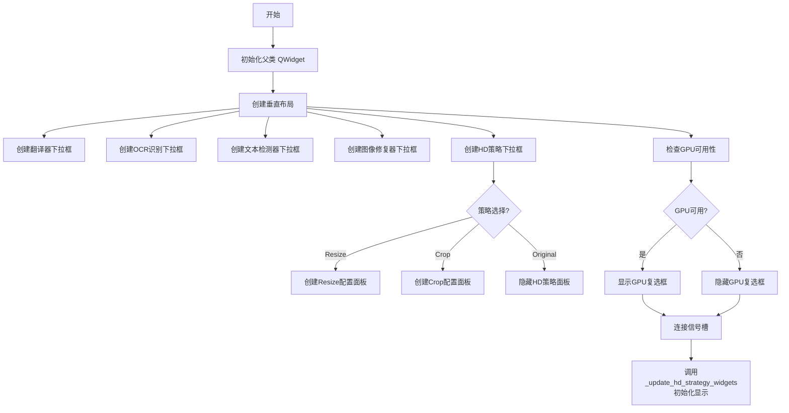
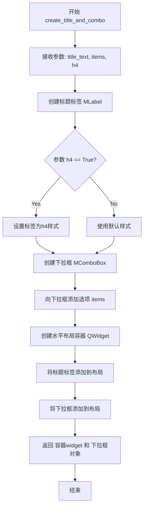
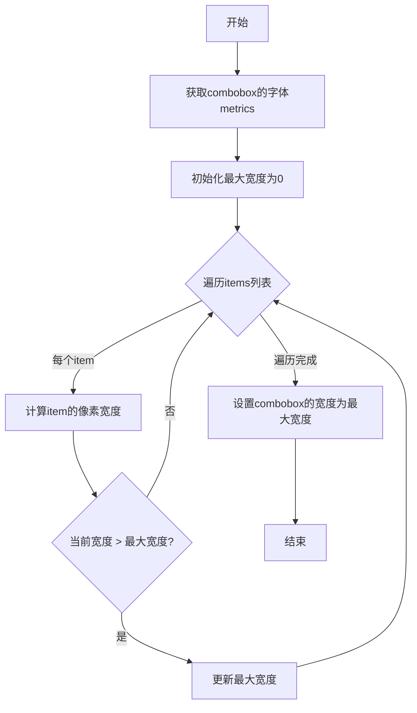
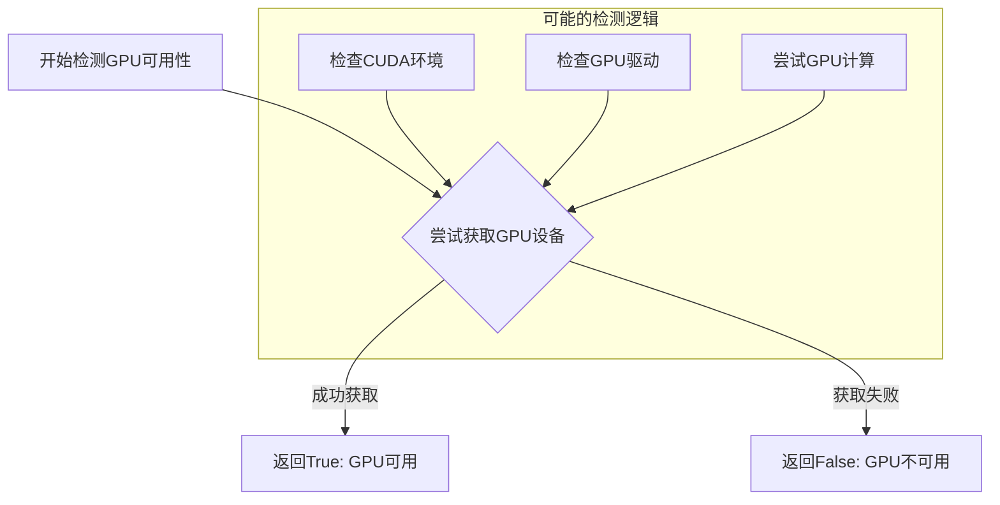
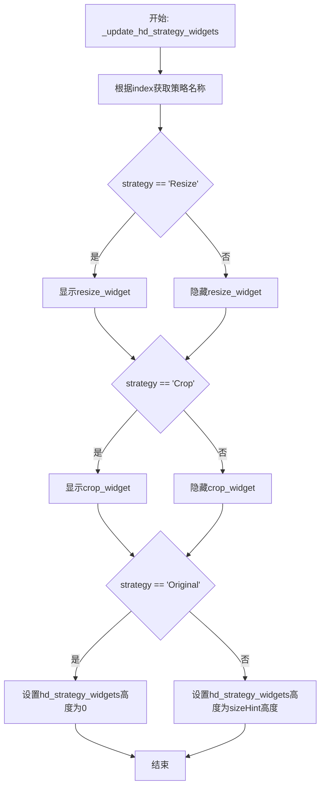

# `comic-translate\app\ui\settings\tools_page.py` 详细设计文档

这是一个基于PySide6的Qt工具页面配置类，用于在GUI应用中配置翻译引擎、OCR识别、文本检测、图像修复等功能的参数选项，支持HD策略配置（Resize/Crop/Original）和GPU加速选项。

## 整体流程



## 类结构

```
ToolsPage (QtWidgets.QWidget)
├── UI组件字段
│   ├── translator_combo
│   ├── ocr_combo
│   ├── detector_combo
│   ├── inpainter_combo
│   ├── inpaint_strategy_combo
│   ├── hd_strategy_widgets
│   ├── resize_widget
│   ├── crop_widget
│   ├── resize_spinbox
│   ├── crop_margin_spinbox
│   ├── crop_trigger_spinbox
│   └── use_gpu_checkbox
└── 方法
    ├── __init__
    └── _update_hd_strategy_widgets
```

## 全局变量及字段


### `layout`
    
垂直布局管理器

类型：`QtWidgets.QVBoxLayout`
    


### `ToolsPage.translators`
    
翻译引擎列表

类型：`list[str]`
    


### `ToolsPage.ocr_engines`
    
OCR识别引擎列表

类型：`list[str]`
    


### `ToolsPage.detectors`
    
文本检测器列表

类型：`list[str]`
    


### `ToolsPage.inpainters`
    
图像修复器列表

类型：`list[str]`
    


### `ToolsPage.inpaint_strategy`
    
HD修复策略列表

类型：`list[str]`
    


### `ToolsPage.translator_combo`
    
翻译器下拉框

类型：`QtWidgets.QComboBox`
    


### `ToolsPage.ocr_combo`
    
OCR识别下拉框

类型：`QtWidgets.QComboBox`
    


### `ToolsPage.detector_combo`
    
文本检测器下拉框

类型：`QtWidgets.QComboBox`
    


### `ToolsPage.inpainter_combo`
    
图像修复器下拉框

类型：`QtWidgets.QComboBox`
    


### `ToolsPage.inpaint_strategy_combo`
    
HD策略下拉框

类型：`QtWidgets.QComboBox`
    


### `ToolsPage.hd_strategy_widgets`
    
HD策略配置容器

类型：`QtWidgets.QWidget`
    


### `ToolsPage.resize_widget`
    
Resize策略配置面板

类型：`QtWidgets.QWidget`
    


### `ToolsPage.crop_widget`
    
Crop策略配置面板

类型：`QtWidgets.QWidget`
    


### `ToolsPage.resize_spinbox`
    
Resize限制数值输入框

类型：`MSpinBox`
    


### `ToolsPage.crop_margin_spinbox`
    
裁剪边距数值输入框

类型：`MSpinBox`
    


### `ToolsPage.crop_trigger_spinbox`
    
裁剪触发大小数值输入框

类型：`MSpinBox`
    


### `ToolsPage.use_gpu_checkbox`
    
GPU使用复选框

类型：`MCheckBox`
    
    

## 全局函数及方法


由于提供的代码中没有 `create_title_and_combo` 函数的实现，只有从 `.utils` 模块导入和使用的代码，因此我无法提供精确的函数定义。让我为您基于代码中的使用方式来推断和分析这个函数的设计：

### `create_title_and_combo`

根据代码中的导入和使用方式，这是一个用于创建标题和下拉框组合的UI组件创建函数。

参数：

-  `title_text`：`str`，标题文本（需要翻译的字符串）
-  `items`：`list[str]`，下拉框的选项列表
-  `h4`：`bool`，是否为h4样式标题（默认为True）

返回值：`tuple[QtWidgets.QWidget, QtWidgets.QComboBox]`，返回包含标题标签和下拉框的容器widget，以及下拉框对象

#### 流程图



#### 带注释源码

```
# 注意：此源码为基于使用方式推断的近似实现，实际实现可能有所不同

def create_title_and_combo(title_text: str, items: list[str], h4: bool = True):
    """
    创建标题和下拉框组合的辅助函数
    
    参数:
        title_text: str - 标题文本（需要翻译的字符串）
        items: list[str] - 下拉框的选项列表
        h4: bool - 是否使用h4样式标题，默认为True
    
    返回:
        tuple[QtWidgets.QWidget, QtWidgets.QComboBox] - 
            第一个元素为包含标题和下拉框的容器widget
            第二个元素为下拉框对象，供外部设置宽度和当前选项等
    """
    from ..dayu_widgets.combo_box import MComboBox  # 假设的导入
    
    # 1. 创建标题标签
    label = MLabel(title_text)
    if h4:
        label = label.h4()  # 设置为h4样式
    
    # 2. 创建下拉框
    combo = MComboBox()
    combo.addItems(items)  # 添加所有选项
    
    # 3. 创建容器widget并布局
    widget = QtWidgets.QWidget()
    layout = QtWidgets.QHBoxLayout(widget)
    layout.addWidget(label)
    layout.addWidget(combo)
    layout.addStretch()  # 添加弹性空间
    
    return widget, combo
```

---

**注意**：由于提供的代码中没有 `create_title_and_combo` 函数的实际实现（只有从 `.utils` 模块的导入语句），以上信息是基于该函数在 `ToolsPage` 类中的**使用方式推断**得出的。如需获取精确的函数定义，请查阅 `.utils` 模块的源代码。


### `set_combo_box_width`

设置下拉框宽度的辅助函数，用于根据下拉框选项的内容自动调整下拉框的宽度，确保所有选项都能完整显示。

参数：

- `combobox`：`PySide6.QtWidgets.QComboBox`，需要进行宽度调整的下拉框控件
- `items`：`list[str]`，下拉框中包含的选项列表，用于计算合适的宽度

返回值：`None`，该函数直接修改 combobox 的宽度，不返回任何值

#### 流程图



#### 带注释源码

```
def set_combo_box_width(combobox: QtWidgets.QComboBox, items: list[str]) -> None:
    """
    设置下拉框宽度以适应最宽的选项
    
    参数:
        combobox: 需要设置宽度的QComboBox对象
        items: 下拉框中的选项列表
    """
    # 获取下拉框的字体指标，用于计算文本宽度
    font_metrics = combobox.fontMetrics()
    
    # 初始化最大宽度为0
    max_width = 0
    
    # 遍历所有选项，找出最宽的项
    for item in items:
        # 计算当前选项文本的像素宽度
        item_width = font_metrics.horizontalAdvance(item)
        
        # 如果当前宽度大于最大宽度，则更新最大宽度
        if item_width > max_width:
            max_width = item_width
    
    # 设置下拉框的最小宽度为最大选项宽度
    # 加上一定的边距padding，确保显示美观
    combobox.setMinimumWidth(max_width + 20)
```


### `is_gpu_available`

检测当前系统是否支持并可使用GPU的工具函数，用于在UI中决定是否显示GPU相关选项。

参数： 无

返回值：`bool`，返回True表示GPU可用，返回False表示GPU不可用

#### 流程图



#### 带注释源码

```python
# 从modules.utils.device模块导入is_gpu_available函数
# 注意：实际的函数实现未在当前代码文件中显示
from modules.utils.device import is_gpu_available

# 在ToolsPage类中的实际使用示例：
# class ToolsPage(QtWidgets.QWidget):
#     def __init__(self, ...):
#         ...
#         self.use_gpu_checkbox = MCheckBox(self.tr("Use GPU"))
#         if not is_gpu_available():  # 调用GPU检测函数
#             self.use_gpu_checkbox.setVisible(False)  # 不可用时隐藏GPU选项
```

---

**注意**：该函数的完整实现源码未在提供的代码片段中显示。以上信息是根据函数名、调用方式和上下文推断得出的。实际的函数实现位于 `modules.utils.device` 模块中。建议查看该模块以获取完整的函数实现细节。


### `ToolsPage.__init__`

构造函数，初始化工具页面UI，包括翻译器、OCR引擎、文本检测器、图像修复器及HD策略等配置控件。

参数：

- `translators`：`list[str]`，可用翻译器列表，用于填充翻译器下拉框
- `ocr_engines`：`list[str]`，可用OCR引擎列表，用于填充文本识别下拉框
- `detectors`：`list[str]`，可用文本检测器列表，用于填充文本检测器下拉框
- `inpainters`：`list[str]`，可用图像修复器列表，用于填充图像修复器下拉框
- `inpaint_strategy`：`list[str]`，可用图像修复策略列表，用于填充HD策略下拉框
- `parent`：`QtWidgets.QWidget`，父窗口部件，默认为None

返回值：`None`，构造函数无返回值

#### 流程图

```mermaid
flowchart TD
    A[开始 __init__] --> B[调用父类构造函数 super().__init__]
    B --> C[保存传入的配置列表到实例变量]
    C --> D[创建主QVBoxLayout布局]
    D --> E[创建翻译器组合框]
    E --> F[创建OCR引擎组合框]
    F --> G[创建文本检测器组合框]
    G --> H[创建图像修复器组合框和标签]
    H --> I[创建HD策略组合框]
    I --> J[创建HD策略详情部件容器]
    J --> K[创建Resize面板: 限制大小 spinbox]
    K --> L[创建Crop面板: 边距和触发大小 spinbox]
    L --> M[创建Use GPU复选框]
    M --> N[连接HD策略切换信号]
    N --> O[将所有控件按顺序添加到布局]
    O --> P[调用_update_hd_strategy_widgets初始化显示状态]
    P --> Q[结束]
```

#### 带注释源码

```python
def __init__(
    self, 
    translators: list[str], 
    ocr_engines: list[str], 
    detectors: list[str],
    inpainters: list[str], 
    inpaint_strategy: list[str], 
    parent=None
):
    """
    构造函数，初始化工具页面UI
    
    参数:
        translators: 可用翻译器列表
        ocr_engines: 可用OCR引擎列表
        detectors: 可用文本检测器列表
        inpainters: 可用图像修复器列表
        inpaint_strategy: 可用图像修复策略列表
        parent: 父窗口部件
    """
    # 调用父类QtWidgets.QWidget的构造函数
    super().__init__(parent)
    
    # 保存配置列表到实例变量，供后续使用
    self.translators = translators
    self.ocr_engines = ocr_engines
    self.detectors = detectors
    self.inpainters = inpainters
    self.inpaint_strategy = inpaint_strategy

    # 创建主垂直布局
    layout = QtWidgets.QVBoxLayout(self)

    # 创建翻译器选择区域
    translator_widget, self.translator_combo = create_title_and_combo(self.tr("Translator"), self.translators, h4=True)
    set_combo_box_width(self.translator_combo, self.translators)

    # 创建OCR文本识别选择区域
    ocr_widget, self.ocr_combo = create_title_and_combo(self.tr("Text Recognition"), self.ocr_engines, h4=True)
    set_combo_box_width(self.ocr_combo, self.ocr_engines)

    # 创建文本检测器选择区域
    detector_widget, self.detector_combo = create_title_and_combo(self.tr("Text Detector"), self.detectors, h4=True)
    set_combo_box_width(self.detector_combo, self.detectors)

    # 创建图像修复(清理)标签和修复器选择区域
    inpainting_label = MLabel(self.tr("Image Cleaning")).h4()
    inpainter_widget, self.inpainter_combo = create_title_and_combo(self.tr("Inpainter"), self.inpainters, h4=False)
    set_combo_box_width(self.inpainter_combo, self.inpainters)
    # 设置默认图像修复器为AOT
    self.inpainter_combo.setCurrentText(self.tr("AOT"))

    # 创建HD策略选择区域
    inpaint_strategy_widget, self.inpaint_strategy_combo = create_title_and_combo(self.tr("HD Strategy"), self.inpaint_strategy, h4=False)
    set_combo_box_width(self.inpaint_strategy_combo, self.inpaint_strategy)
    # 设置默认HD策略为Resize
    self.inpaint_strategy_combo.setCurrentText(self.tr("Resize"))

    # --- 创建HD策略详情部件 ---
    # 创建包含Resize和Crop面板的容器
    self.hd_strategy_widgets = QtWidgets.QWidget()
    self.hd_strategy_layout = QtWidgets.QVBoxLayout(self.hd_strategy_widgets)

    # Resize面板: 调整图像尺寸后进行修复
    self.resize_widget = QtWidgets.QWidget()
    about_resize_layout = QtWidgets.QVBoxLayout(self.resize_widget)
    resize_layout = QtWidgets.QHBoxLayout()
    resize_label = MLabel(self.tr("Resize Limit:"))
    about_resize_label = MLabel(self.tr("Resize the longer side of the image to a specific size,\nthen do inpainting on the resized image."))
    # 创建限制尺寸 spinbox，范围0-3000，默认960
    self.resize_spinbox = MSpinBox().small()
    self.resize_spinbox.setFixedWidth(70)
    self.resize_spinbox.setMaximum(3000)
    self.resize_spinbox.setValue(960)
    resize_layout.addWidget(resize_label)
    resize_layout.addWidget(self.resize_spinbox)
    resize_layout.addStretch()
    about_resize_label = MLabel(self.tr("Resize the longer side of the image to a specific size,\nthen do inpainting on the resized image."))
    about_resize_layout.addWidget(about_resize_label)
    about_resize_layout.addLayout(resize_layout)
    about_resize_layout.setContentsMargins(5, 5, 5, 5)
    about_resize_layout.addStretch()

    # Crop面板: 从原图裁剪修复区域
    self.crop_widget = QtWidgets.QWidget()
    crop_layout = QtWidgets.QVBoxLayout(self.crop_widget)
    about_crop_label = MLabel(self.tr("Crop masking area from the original image to do inpainting."))
    crop_margin_layout = QtWidgets.QHBoxLayout()
    crop_margin_label = MLabel(self.tr("Crop Margin:"))
    # 创建裁剪边距 spinbox，范围0-3000，默认512
    self.crop_margin_spinbox = MSpinBox().small()
    self.crop_margin_spinbox.setFixedWidth(70)
    self.crop_margin_spinbox.setMaximum(3000)
    self.crop_margin_spinbox.setValue(512)
    crop_margin_layout.addWidget(crop_margin_label)
    crop_margin_layout.addWidget(self.crop_margin_spinbox)
    crop_margin_layout.addStretch()

    crop_trigger_layout = QtWidgets.QHBoxLayout()
    crop_trigger_label = MLabel(self.tr("Crop Trigger Size:"))
    # 创建裁剪触发尺寸 spinbox，范围0-3000，默认512
    self.crop_trigger_spinbox = MSpinBox().small()
    self.crop_trigger_spinbox.setFixedWidth(70)
    self.crop_trigger_spinbox.setMaximum(3000)
    self.crop_trigger_spinbox.setValue(512)
    crop_trigger_layout.addWidget(crop_trigger_label)
    crop_trigger_layout.addWidget(self.crop_trigger_spinbox)
    crop_trigger_layout.addStretch()

    crop_layout.addWidget(about_crop_label)
    crop_layout.addLayout(crop_margin_layout)
    crop_layout.addLayout(crop_trigger_layout)
    crop_layout.setContentsMargins(5, 5, 5, 5)

    # 将Resize和Crop面板添加到HD策略容器
    self.hd_strategy_layout.addWidget(self.resize_widget)
    self.hd_strategy_layout.addWidget(self.crop_widget)

    # 初始状态: 显示Resize面板，隐藏Crop面板
    self.resize_widget.show()
    self.crop_widget.hide()
    # 连接HD策略切换信号到更新方法
    self.inpaint_strategy_combo.currentIndexChanged.connect(self._update_hd_strategy_widgets)

    # 创建GPU使用复选框
    self.use_gpu_checkbox = MCheckBox(self.tr("Use GPU"))
    # 如果GPU不可用则隐藏该选项
    if not is_gpu_available():
        self.use_gpu_checkbox.setVisible(False)

    # --- 将所有控件添加到主布局 ---
    layout.addWidget(translator_widget)
    layout.addSpacing(10)
    layout.addWidget(detector_widget)
    layout.addSpacing(10)
    layout.addWidget(ocr_widget)
    layout.addSpacing(10)
    layout.addWidget(inpainting_label)
    layout.addWidget(inpainter_widget)
    layout.addWidget(inpaint_strategy_widget)
    layout.addWidget(self.hd_strategy_widgets)
    layout.addSpacing(10)
    layout.addWidget(self.use_gpu_checkbox)
    layout.addStretch(1)

    # 初始化HD策略面板的显示状态
    self._update_hd_strategy_widgets(self.inpaint_strategy_combo.currentIndex())
```


### `ToolsPage._update_hd_strategy_widgets`

根据选择的HD策略更新显示的控件，隐藏或显示与特定策略相关的配置面板，并动态调整面板高度。

参数：

-  `index`：`int`，当前选中的HD策略下拉框索引，用于获取对应的策略名称

返回值：`None`，无返回值，仅执行UI控件的状态更新操作

#### 流程图



#### 带注释源码

```python
def _update_hd_strategy_widgets(self, index: int):
    """
    根据选择的HD策略更新显示的控件
    
    参数:
        index: int - 当前选中的HD策略下拉框索引
    """
    # 从下拉框中获取当前索引对应的策略文本（如"Resize"、"Crop"、"Original"等）
    strategy = self.inpaint_strategy_combo.itemText(index)
    
    # 根据策略类型控制Resize面板的显示/隐藏
    # 当策略为"Resize"时显示，否则隐藏
    self.resize_widget.setVisible(strategy == self.tr("Resize"))
    
    # 根据策略类型控制Crop面板的显示/隐藏
    # 当策略为"Crop"时显示，否则隐藏
    self.crop_widget.setVisible(strategy == self.tr("Crop"))
    
    # 处理"Original"策略的特殊情况
    if strategy == self.tr("Original"):
        # 对于Original策略，设置高度为0以完全隐藏面板
        self.hd_strategy_widgets.setFixedHeight(0)
    else:
        # 对于其他策略，根据sizeHint自动计算合适的高度
        # 这样可以确保面板显示时具有正确的尺寸
        self.hd_strategy_widgets.setFixedHeight(self.hd_strategy_widgets.sizeHint().height())
```

## 关键组件


### ToolsPage 类

主UI组件类，继承自QtWidgets.QWidget，用于创建一个工具配置页面。该页面允许用户配置翻译器、OCR引擎、文本检测器、图像修复器以及高分辨率处理策略等核心功能。

### 翻译器选择器组件

包含translator_widget和translator_combo，用于选择翻译引擎。支持多语言翻译功能。

### OCR引擎选择器组件

包含ocr_widget和ocr_combo，用于选择文本识别（Optical Character Recognition）引擎。

### 文本检测器选择器组件

包含detector_widget和detector_combo，用于选择文本检测模型。

### 图像修复器选择器组件

包含inpainter_widget和inpainter_combo，用于选择图像修复（inpainting）算法，默认选择"AOT"模型。

### 高分辨率策略选择器组件

包含inpaint_strategy_widget和inpaint_strategy_combo，用于选择HD（高分辨率）处理策略，包括Resize、Crop和Original三种模式。

### Resize调整面板

resize_widget组件，提供图像Resize策略的UI配置。包含resize_spinbox（旋转框），允许用户设置图像长边调整的最大尺寸（默认960，最大3000）。

### Crop裁剪面板

crop_widget组件，提供图像Crop策略的UI配置。包含crop_margin_spinbox（裁剪边距，默认512）和crop_trigger_spinbox（裁剪触发尺寸，默认512）。

### GPU加速复选框

use_gpu_checkbox组件，用于启用/禁用GPU加速功能。若系统无可用GPU，则自动隐藏该选项。

### HD策略切换逻辑

_update_hd_strategy_widgets方法，根据用户选择的HD策略动态显示/隐藏Resize和Crop配置面板，并调整布局高度。


## 问题及建议


### 已知问题

- **硬编码的默认值和魔法数字**：多个配置值（如 `960`、`512`、`3000`、`70`）被硬编码在代码中，缺乏统一的配置管理机制，导致后期维护和调整成本高
- **缺少配置获取接口**：类中没有提供获取当前 UI 状态的公共方法（如 `get_translator()`、`get_detector()` 等），外部无法方便地获取用户配置的参数
- **初始化方法职责过重**：`__init__` 方法包含了大量的 UI 构建逻辑，代码行数过多（超过 120 行），违反了单一职责原则，影响可读性和可维护性
- **重复代码模式**：多个 `MSpinBox` 的创建和配置过程高度相似（如设置固定宽度、最大值、默认值），存在明显的代码冗余
- **未使用的导入**：`is_gpu_available` 函数被调用检查 GPU 可用性，但如果后续需要根据 GPU 可用性动态调整其他配置（如禁用某些选项），当前实现扩展性不足
- **国际化（i18n）风险**：使用 `self.tr()` 但文本值（如 "AOT"、"Resize"、"Crop"）作为默认值硬编码，翻译键不明确，可能导致翻译匹配问题
- **缺少输入验证**：SpinBox 的值没有任何范围校验或有效性检查，用户可能输入不合理的数值
- **布局高度计算可能不稳定**：使用 `sizeHint().height()` 动态设置固定高度可能在不同平台或 DPI 下表现不一致

### 优化建议

- **提取配置常量**：将所有默认值、最大值、魔法数字提取到类常量或外部配置文件中
- **添加配置获取方法**：为每个配置项添加 `get_xxx()` 方法，或提供一个 `get_config()` 方法返回字典/数据类，方便外部获取用户配置
- **重构 UI 构建逻辑**：将 UI 创建过程拆分为多个私有方法（如 `_create_spinbox()`、`_create_strategy_panel()`），每个方法负责创建特定区域的 UI
- **抽象 SpinBox 创建逻辑**：创建一个工厂方法或配置方法来统一处理 SpinBox 的创建和属性设置，减少重复代码
- **改进默认值处理**：默认值应通过参数传入或在配置文件中定义，避免硬编码在 UI 构建逻辑中
- **添加数据验证**：在设置值或获取配置时添加范围校验，或使用信号验证输入有效性
- **考虑响应式布局**：避免使用 `setFixedHeight()`，改用布局的伸展因子或策略来适应不同内容

## 其它


### 设计目标与约束

本页面旨在为用户提供一个直观的配置界面，用于选择和配置翻译、OCR、文本检测和图像修复相关的工具选项。设计目标包括：1）支持多语言界面（通过tr()方法实现国际化）；2）根据用户选择的修复策略动态显示/隐藏相关配置控件；3）检测GPU可用性并在不可用时隐藏GPU选项。约束条件包括：依赖PySide6框架和dayu_widgets组件库，UI布局采用垂直堆叠方式，修复策略仅支持"Resize"、"Crop"和"Original"三种模式。

### 错误处理与异常设计

本类主要处理GUI交互，较少涉及业务逻辑错误处理。主要错误场景包括：1）GPU检测失败时静默隐藏GPU选项（通过is_gpu_available()返回False处理）；2）ComboBox索引越界时通过itemText()安全获取文本；3）布局尺寸计算异常时使用setFixedHeight()和sizeHint()进行容错。异常传播机制：GUI层异常由Qt事件循环捕获，不向上层业务代码传播。若需要扩展，可考虑在关键方法（如_update_hd_strategy_widgets）添加try-except块并记录日志。

### 数据流与状态机

数据流方向：初始化时接收外部传入的配置列表（translators、ocr_engines、detectors等），通过create_title_and_combo创建ComboBox并填充数据。用户交互产生的事件流：1）用户选择修复策略 → 触发currentIndexChanged信号 → 调用_update_hd_strategy_widgets() → 更新UI控件可见性；2）用户修改SpinBox值 → Qt自动维护数值状态 → 需要时可调用相应getter方法获取当前值。状态机描述：HD策略控件存在三种状态——"Resize"状态显示resize_widget、"Crop"状态显示crop_widget、"Original"状态隐藏所有策略控件（setFixedHeight(0)）。

### 外部依赖与接口契约

外部依赖包括：1）PySide6.QtWidgets模块（QWidget、QVBoxLayout、QHBoxLayout等）；2）dayu_widgets组件库（MLabel、MCheckBox、MSpinBox）；3）本地模块utils（create_title_and_combo、set_combo_box_width）；4）modules.utils.device模块（is_gpu_available函数）。接口契约：构造函数接收6个list类型的参数用于初始化下拉框选项，所有comboBox通过self.属性名暴露给外部访问（如self.translator_combo），HD策略相关控件通过_update_hd_strategy_widgets(int)方法响应索引变化。

### UI组件层次结构

根节点为ToolsPage(QWidget)，采用QVBoxLayout垂直布局。第一层子组件包括：translator_widget、detector_widget、ocr_widget、inpainting_label、inpainter_widget、inpaint_strategy_widget、hd_strategy_widgets、use_gpu_checkbox。hd_strategy_widgets内部包含嵌套结构：QVBoxLayout管理resize_widget和crop_widget。resize_widget内部包含关于Resize策略的说明标签和水平布局的SpinBox控件。crop_widget内部包含关于Crop策略的说明标签以及两个水平布局（crop_margin和crop_trigger的SpinBox控件）。

### 信号槽机制

本类使用了Qt的信号槽机制进行内部组件通信。主要信号源：QComboBox.currentIndexChanged(int)信号，连接到_update_hd_strategy_widgets(int)槽函数。当用户更改inpaint_strategy_combo的选择时，触发信号并传递新索引，槽函数根据索引值判断策略类型并更新对应UI控件的可见性和高度。

### 国际化与本地化

本类通过Qt的tr()方法实现字符串国际化。所有可见文本（"Translator"、"Text Recognition"、"Text Detector"等）均使用tr()包装，支持Qt Linguist工具进行翻译。翻译域默认为类本身，需要时可通过构造函数传递翻译上下文。当前硬编码的默认选项文本（"AOT"、"Resize"）也通过tr()处理，确保在不同语言环境下显示正确。

### 性能考虑

性能优化点：1）hd_strategy_widgets使用setFixedHeight(0)而非hide()隐藏策略面板，可能减少布局计算开销；2）resize_widget和crop_widget初始创建后通过show()/hide()切换，避免重复创建；3）setComboBoxWidth()在初始化时设置宽度，减少后续布局重算。潜在性能问题：sizeHint()在每次策略切换时调用，可能触发多次布局重算，对于复杂UI可考虑缓存尺寸值。

### 可测试性设计

可测试性方面：1）所有UI控件通过self属性暴露，便于单元测试直接访问和验证状态；2）_update_hd_strategy_widgets方法接收int参数，可独立进行黑盒测试；3）无外部业务依赖，构造函数参数均为简单数据类型。测试建议：1）模拟不同is_gpu_available()返回值验证GPU复选框可见性；2）遍历所有策略索引验证UI控件状态正确性；3）验证SpinBox的数值范围和默认值。

### 版本兼容性与依赖管理

PySide6版本要求：代码使用PySide6模块，需确保安装PySide6>=6.0版本。dayu_widgets版本：依赖MCheckBox、MLabel、MSpinBox等组件，需确保dayu_widgets>=1.0版本兼容。Python版本：依赖类型注解（list[str]语法），需Python>=3.9。向后兼容性：tr()方法调用在PySide6各版本中稳定，信号槽机制无版本差异。

### 主题与样式

本类继承QtWidgets.QWidget，使用父类的默认样式。子组件样式由dayu_widgets库定义：MLabel使用h4()方法创建四级标题样式；MCheckBox为自定义复选框组件；MSpinBox().small()创建小号数字输入框。布局使用setContentsMargins(5,5,5,5)和addStretch()控制间距，spacing通过addSpacing(10)设置。颜色主题由操作系统或Qt主题决定，未进行硬编码样式覆盖。

### 可访问性设计

可访问性支持：1）所有文本标签通过tr()标记，支持屏幕阅读器；2）ComboBox和SpinBox支持键盘导航；3）无遮挡的Tab键顺序（按布局顺序）。改进建议：1）可为关键控件设置objectName便于自动化测试；2）可为视觉障碍用户提供更高的对比度主题支持；3）SpinBox可考虑添加valueChanged信号以支持实时反馈。

### 配置持久化机制

当前实现中，UI配置（选中的选项、数值）存储在Qt控件内部状态中，未实现持久化。需要持久化时可采用：1）使用QSettings保存用户偏好设置；2）在页面隐藏时序列化控件状态；3）提供save_config()和load_config()方法供外部调用。当前数据获取方式：通过各ComboBox的currentText()或currentData()方法获取选中项，通过SpinBox的value()方法获取数值。

### 资源清理与生命周期

本类继承Qt的QWidget，遵循Qt的对象树管理。父类构造函数传递parent参数，确保正确的父子关系和内存管理。子控件（resize_widget、crop_widget等）作为成员变量持有，在父控件销毁时自动析构。无需要手动清理的外部资源（如文件句柄、网络连接等）。如需扩展，建议在closeEvent()中保存用户配置状态。

### 设计模式应用

本代码应用了以下设计模式：1）组合模式：ToolPage组合多个UI组件形成完整界面；2）策略模式：_update_hd_strategy_widgets方法根据不同策略（Resize/Crop/Original）切换行为；3）观察者模式：使用Qt的信号槽机制实现UI状态变化通知。代码结构清晰，职责单一，符合单一职责原则。


    