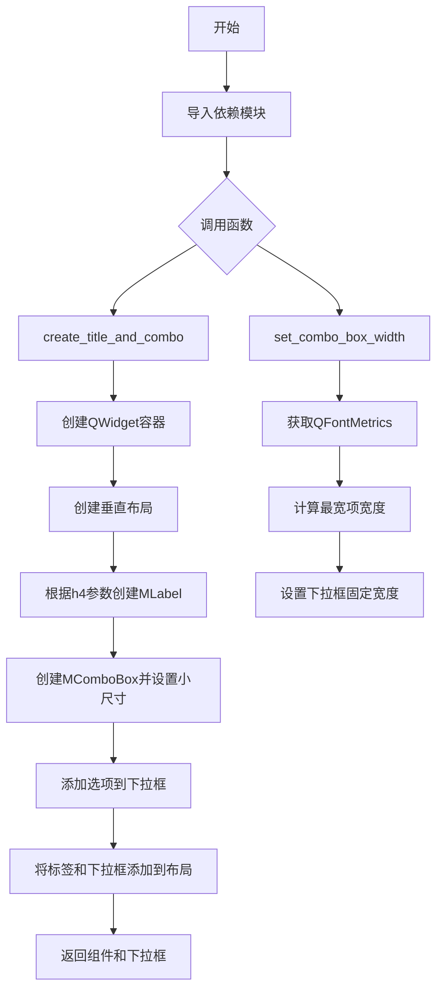
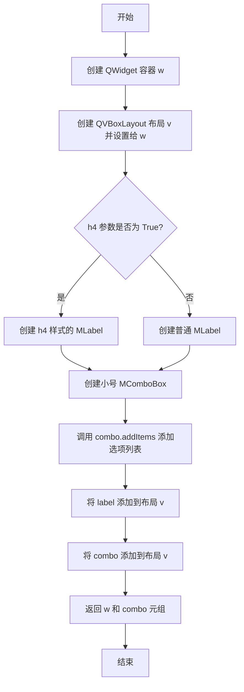
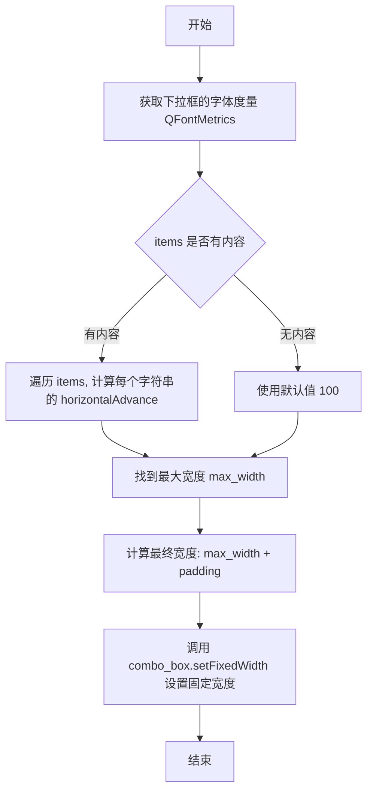
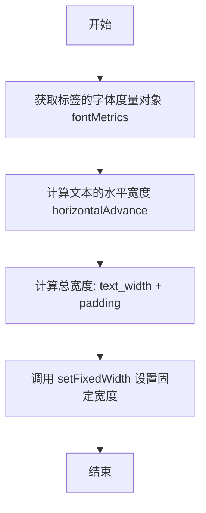

# `comic-translate\app\ui\settings\utils.py` 详细设计文档

这是一个Qt布局辅助模块，通过提供创建标题+下拉框组合组件、动态调整下拉框和标签宽度的工具函数，简化PySide6图形界面的布局编写。

## 整体流程



## 类结构

```
该代码无类定义，仅包含模块级函数
├── create_title_and_combo (顶层函数)
├── set_combo_box_width (顶层函数)
└── set_label_width (顶层函数)
```

## 全局变量及字段


### `title`
    
标题文本，用于创建标签显示

类型：`str`
    


### `options`
    
下拉选项的字符串列表

类型：`list[str]`
    


### `h4`
    
是否使用h4标题样式，默认为True

类型：`bool`
    


### `w`
    
包含标题标签和下拉框的容器widget

类型：`QtWidgets.QWidget`
    


### `v`
    
垂直布局管理器

类型：`QtWidgets.QVBoxLayout`
    


### `label`
    
显示标题的标签组件

类型：`MLabel`
    


### `combo`
    
下拉选择框组件

类型：`MComboBox`
    


### `combo_box`
    
需要设置宽度 的下拉框

类型：`MComboBox`
    


### `items`
    
用于计算宽度的文本项目列表

类型：`list[str]`
    


### `padding`
    
额外的内边距宽度

类型：`int`
    


### `metrics`
    
字体度量工具，用于计算文本宽度

类型：`QFontMetrics`
    


### `max_width`
    
所有项目中的最大文本宽度

类型：`int`
    


### `text_width`
    
标签文本的实际宽度

类型：`int`
    


### `label`
    
需要设置宽度的标签组件

类型：`MLabel`
    


    

## 全局函数及方法


### `create_title_and_combo`

该函数用于创建一个包含标题标签和下拉组合框的小型容器组件，支持自定义标题文本、可选项列表以及标签样式（h4 或默认），最终返回包含这两个控件的 QWidget 容器和 MComboBox 实例，以便调用者可以对组合框进行进一步操作。

**参数：**

- `title`：`str`，标题文本，用于显示在组合框上方的标签内容
- `options`：`list[str]`，下拉选项列表，包含所有可供用户选择的项
- `h4`：`bool = True`，是否使用 h4 样式标签，默认为 True 表示使用较大的标题样式

**返回值：** `tuple[QtWidgets.QWidget, MComboBox]`，返回一个元组，其中第一个元素是包含标签和组合框的 QWidget 容器，第二个元素是 MComboBox 对象，便于调用者进行后续操作（如设置宽度、绑定事件等）

#### 流程图



#### 带注释源码

```python
def create_title_and_combo(title: str, options: list[str], h4: bool = True) -> tuple[QtWidgets.QWidget, MComboBox]:
    """Create a small widget containing a title label and a combo box.

    Returns (widget, combo_box).
    """
    # 创建一个 QWidget 作为容器，用于存放标签和组合框
    w = QtWidgets.QWidget()
    
    # 创建垂直布局管理器，并将该布局设置给容器 w
    v = QtWidgets.QVBoxLayout(w)
    
    # 根据 h4 参数决定标签样式：如果为 True 则使用 h4() 方法创建大标题样式，否则使用默认样式
    label = MLabel(title).h4() if h4 else MLabel(title)
    
    # 创建一个小号的 MComboBox 下拉组合框
    combo = MComboBox().small()
    
    # 将 options 列表中的所有项添加到组合框中作为可选项
    combo.addItems(options)
    
    # 将标题标签添加到垂直布局中
    v.addWidget(label)
    
    # 将组合框添加到垂直布局中
    v.addWidget(combo)
    
    # 返回容器组件和组合框对象，供调用者进一步操作
    return w, combo
```


### `set_combo_box_width`

设置下拉框的宽度基于其最宽的选项，并额外增加一定的内边距。

参数：

- `combo_box`：`MComboBox`，需要设置宽度的下拉框对象
- `items`：`list[str]`，下拉框中的选项列表，用于计算最大宽度
- `padding`：`int`，额外的内边距，默认为 40 像素

返回值：`None`，无返回值

#### 流程图



#### 带注释源码

```
def set_combo_box_width(combo_box: MComboBox, items: list[str], padding: int = 40) -> None:
    """Set a fixed width on a combo box based on the widest item."""
    # 获取下拉框当前字体的度量对象，用于计算文本宽度
    metrics = QFontMetrics(combo_box.font())
    
    # 使用生成器表达式计算所有选项的横向宽度，取最大值
    # 如果 items 为空，则使用 default=100 作为默认值
    max_width = max((metrics.horizontalAdvance(i) for i in items), default=100)
    
    # 设置下拉框的固定宽度为最大选项宽度加上内边距
    combo_box.setFixedWidth(max_width + padding)
```


### `set_label_width`

设置标签的固定宽度，基于其文本内容加上指定的填充值，确保文本能够完整显示。

参数：

- `label`：`MLabel`，需要设置宽度的标签控件
- `padding`：`int`，额外填充宽度，默认为 20

返回值：`None`，无返回值

#### 流程图



#### 带注释源码

```python
def set_label_width(label: MLabel, padding: int = 20) -> None:
    """Set a fixed width on a label based on its text.
    
    Args:
        label: 需要设置宽度的 MLabel 控件
        padding: 额外填充宽度，默认为 20 像素
    
    Returns:
        None
    """
    # 获取标签当前的字体度量对象，用于测量文本宽度
    metrics = label.fontMetrics()
    
    # 计算文本的水平宽度（像素）
    text_width = metrics.horizontalAdvance(label.text())
    
    # 设置标签的固定宽度为文本宽度加上填充值
    label.setFixedWidth(text_width + padding)
```

## 关键组件


### create_title_and_combo

创建包含标题标签和下拉组合框的垂直布局小部件，支持通过参数配置标题样式（h4标签）和选项列表，返回组合框实例以便后续操作。

### set_combo_box_width

根据下拉框中最宽的选项文本动态计算并设置组合框的固定宽度，使用字体度量工具测量文本宽度并添加内边距，确保所有选项都能完整显示。

### set_label_width

根据标签的文本内容动态计算并设置标签的固定宽度，使用字体度量工具测量文本宽度并添加内边距，确保文本内容完整显示。

### QFontMetrics 字体度量工具

PySide6的字体度量工具类，用于测量文本在屏幕上的像素宽度，是实现动态宽度计算的核心依赖。


## 问题及建议


### 已知问题

-   **魔法数字**：默认宽度值 `100` 和 `40`、`20` 作为 padding 被硬编码在代码中，缺乏可配置性。
-   **类型注解不完整**：`create_title_and_combo` 函数中 `h4` 参数缺少类型注解（`bool`），且返回值 tuple 缺少 `tuple[...]` 导入。
-   **函数设计不一致**：`set_combo_box_width` 和 `set_label_width` 直接修改对象状态但不返回任何值，不适合链式调用模式，与 `create_title_and_combo` 的返回元组风格不一致。
-   **缺少输入验证**：当 `items` 为空列表时，虽然有 `default=100`，但逻辑不够清晰；`label.text()` 为空时宽度计算可能不符合预期。
-   **无错误处理**：未对空列表、None 值或无效类型进行处理，可能导致运行时错误。
-   **布局间距硬编码**：垂直布局 `QVBoxLayout` 未设置间距参数，默认间距可能导致视觉不一致。

### 优化建议

-   **参数化默认值**：将 padding 和默认宽度提取为模块级常量或添加可选配置参数，提升可维护性。
-   **完善类型注解**：为 `h4` 添加 `bool` 类型注解，考虑使用 `typing.Tuple` 增强兼容性。
-   **统一函数风格**：让 setter 函数返回 `self` 或对象本身，支持链式调用；或在文档中明确说明设计意图。
-   **添加输入校验**：在函数开头添加 `if not items:` 等检查，明确处理空输入的逻辑。
-   **显式布局参数**：创建 `QVBoxLayout()` 时传入 `setSpacing(0)` 或适当值，避免依赖默认行为。
-   **增加文档说明**：补充异常场景说明和用例示例。


## 其它


### 设计目标与约束

本模块的设计目标是为PySide6应用程序提供快速创建标题+下拉框组合部件的辅助函数，并支持根据内容自动调整控件宽度。约束条件包括：依赖PySide6、dayu_widgets库；仅适用于桌面GUI应用；函数设计为无状态工具函数。

### 错误处理与异常设计

代码中的异常处理主要包括：1）max()函数使用default=100参数避免空列表导致ValueError；2）metrics.horizontalAdvance()在文本为空时返回0；3）setFixedWidth接受任意整数参数。模块未抛出自定义异常，调用方需确保传入有效的MComboBox和MLabel实例。

### 外部依赖与接口契约

外部依赖包括：PySide6.QtWidgets、PySide6.QtGui.QFontMetrics、dayu_widgets的MLabel和MComboBox类。接口契约：create_title_and_combo返回(QWidget, MComboBox)元组；set_combo_box_width和set_label_width无返回值；padding参数默认为整数类型。

### 性能考虑

性能方面：每次调用set_combo_box_width都会创建QFontMetrics对象；max()配合生成器表达式遍历所有选项；set_label_width在每次调用时获取fontMetrics()。建议：对于大量下拉框，可缓存metrics对象；options列表很长时可考虑截断或分页计算。

### 线程安全性

本模块中的函数均为主线程GUI操作，未涉及多线程。Qt的GUI控件只能在主线程操作，因此不应从工作线程调用这些函数。设计为线程不安全模块。

### 资源管理

模块本身不管理持久资源。create_title_and_combo创建的QWidget及其子控件由调用方负责生命周期管理，建议使用Qt的父对象机制或手动delete。QFontMetrics为轻量级对象，随函数结束自动释放。

### 兼容性考虑

兼容性方面：依赖PySide6（Qt绑定）和dayu_widgets；代码使用Python 3类型注解（3.9+）；horizontalAdvance方法在Qt5.11+可用。需确保目标环境的Qt版本>=5.11。

### 可维护性与扩展建议

可维护性方面：函数命名清晰，文档字符串完整。扩展建议：1）可增加set_combo_box_height类似函数；2）可添加set_combo_box_width_by_index(idx, padding)仅根据特定索引设置宽度；3）可考虑添加响应式宽度设置，根据窗口大小动态调整。

### 使用示例与调用模式

典型调用模式：创建组合部件后立即设置宽度。示例：widget, combo = create_title_and_combo("选择颜色", ["红", "绿", "蓝"]); set_combo_box_width(combo, ["红", "绿", "蓝"]); set_label_width(widget.findChild(MLabel))。建议在布局完成后再调用宽度设置函数。


    