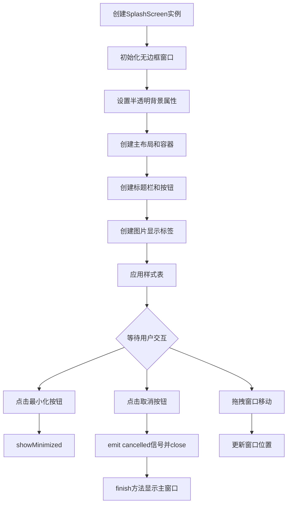
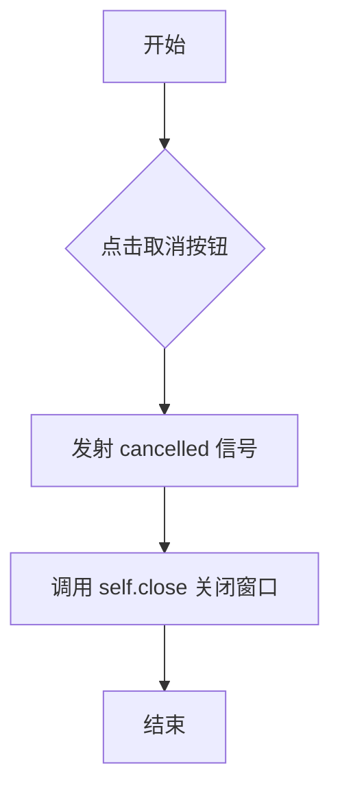
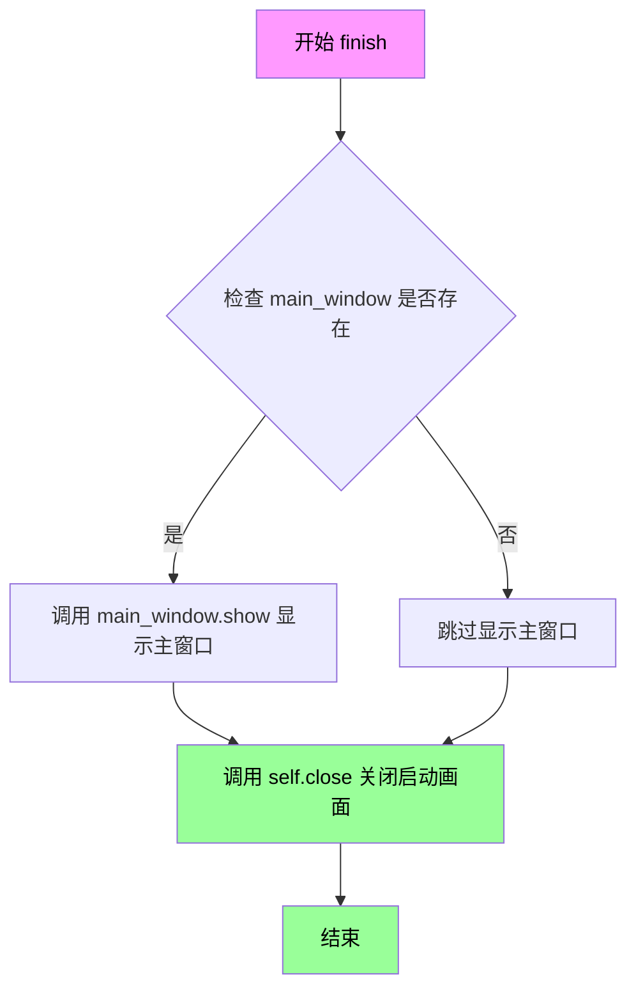
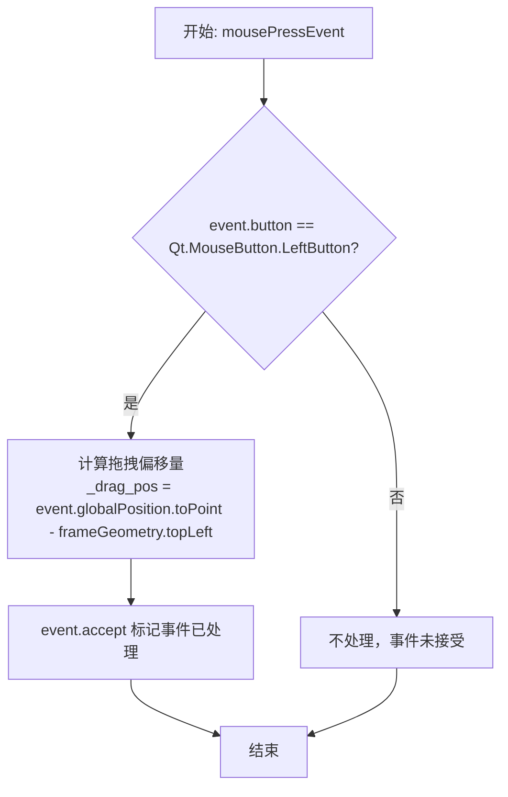
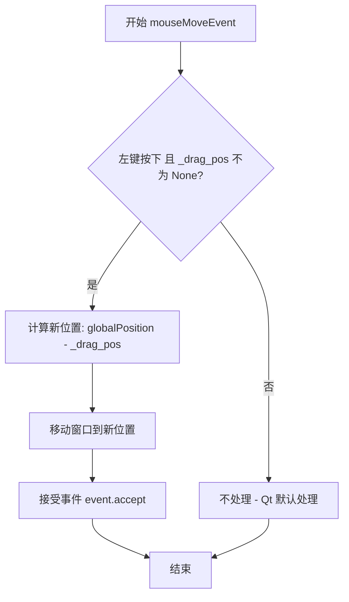
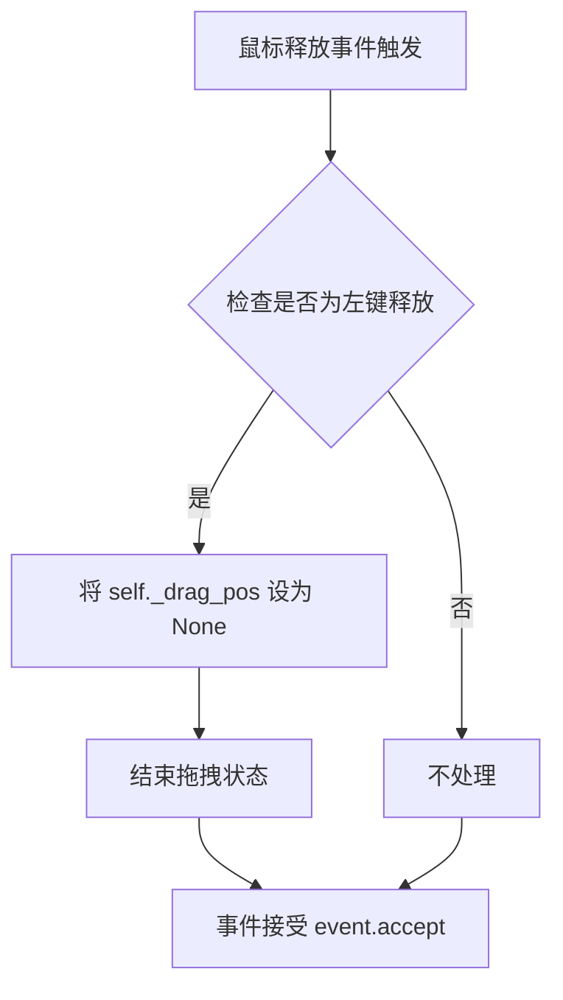

# `comic-translate\app\ui\splash_screen.py` 详细设计文档

这是一个使用PySide6实现的定制化启动画面（Splash Screen）窗口，支持显示图片、最小化和关闭按钮，具备无边框半透明背景、窗口拖拽移动等功能，主要用于应用启动时展示品牌Logo或加载画面。

## 整体流程



## 类结构

```
QWidget (Qt基类)
└── SplashScreen (自定义启动画面)
```

## 全局变量及字段


### `SplashScreen.cancelled`
    
取消按钮点击时发出的信号

类型：`Signal`
    


### `SplashScreen.minimize_btn`
    
最小化按钮

类型：`QPushButton`
    


### `SplashScreen.cancel_btn`
    
取消/关闭按钮

类型：`QPushButton`
    


### `SplashScreen.image_label`
    
显示启动画面的图片标签

类型：`QLabel`
    


### `SplashScreen._drag_pos`
    
拖拽窗口时的位置偏移量

类型：`Optional[QPoint]`
    
    

## 全局函数及方法


### `SplashScreen.__init__`

初始化启动画面窗口，设置无边框透明窗口、创建UI组件（标题栏、最小化和取消按钮、图像显示区域）、应用样式表，并配置窗口拖拽功能。

参数：

- `pixmap`：`QPixmap`，要在启动画面中显示的图像像素映射对象
- `parent`：`QWidget`，可选的父窗口部件，传递给父类 QWidget 的构造函数

返回值：`None`，该方法为构造函数，不返回任何值

#### 流程图

```mermaid
flowchart TD
    A[__init__ 开始] --> B[调用父类构造函数 super().__init__parent]
    B --> C[设置窗口标志: 无边框 + 窗口置顶]
    C --> D[设置窗口属性: 透明背景]
    D --> E[创建主布局 QVBoxLayout]
    E --> F[创建容器部件 splashContainer]
    F --> G[创建标题栏部件 titleBar]
    G --> H[添加最小化按钮 minimize_btn]
    H --> I[添加取消按钮 cancel_btn]
    I --> J[创建图像标签 image_label 并显示 pixmap]
    J --> K[添加容器到主布局]
    K --> L[应用 QSS 样式表]
    L --> M[调整窗口大小以适应内容]
    M --> N[初始化拖拽位置 _drag_pos]
    N --> O[__init__ 结束]
```

#### 带注释源码

```python
def __init__(self, pixmap: QPixmap, parent=None):
    """
    初始化启动画面窗口
    
    参数:
        pixmap: 要显示的图像
        parent: 父窗口部件
    """
    # 调用父类 QWidget 的构造函数，传递 parent 参数
    super().__init__(parent)
    
    # 设置窗口标志：无边框窗口 + 窗口始终置顶
    self.setWindowFlags(Qt.WindowType.FramelessWindowHint | Qt.WindowType.WindowStaysOnTopHint)
    # 设置窗口属性：透明背景，允许半透明效果
    self.setAttribute(Qt.WidgetAttribute.WA_TranslucentBackground)
    
    # ===== 创建主布局 =====
    main_layout = QVBoxLayout(self)
    main_layout.setContentsMargins(0, 0, 0, 0)  # 无边距
    main_layout.setSpacing(0)  # 无间距
    
    # ===== 创建容器部件 =====
    # 容器用于承载标题栏和图像，作为可视化边界
    container = QWidget()
    container.setObjectName("splashContainer")
    container_layout = QVBoxLayout(container)
    container_layout.setContentsMargins(0, 0, 0, 0)
    container_layout.setSpacing(0)
    
    # ===== 创建标题栏 =====
    # 标题栏包含最小化和关闭按钮，实现自定义窗口控制
    title_bar = QWidget()
    title_bar.setObjectName("titleBar")
    title_bar_layout = QHBoxLayout(title_bar)
    title_bar_layout.setContentsMargins(8, 4, 8, 4)  # 左上右下边距
    title_bar_layout.setSpacing(4)  # 按钮间距
    
    # 标题标签（空标签作为占位符，保持布局平衡）
    title_label = QLabel()
    title_bar_layout.addWidget(title_label)
    title_bar_layout.addStretch()  # 弹簧将按钮推到右侧
    
    # ===== 创建最小化按钮 =====
    self.minimize_btn = QPushButton("−")  # 减号符号
    self.minimize_btn.setObjectName("minimizeBtn")
    self.minimize_btn.setFixedSize(24, 24)  # 固定大小
    # 连接点击信号到内置的最小化方法
    self.minimize_btn.clicked.connect(self.showMinimized)
    self.minimize_btn.setToolTip("Minimize")
    title_bar_layout.addWidget(self.minimize_btn)
    
    # ===== 创建取消/关闭按钮 =====
    self.cancel_btn = QPushButton("✕")  # 叉号符号
    self.cancel_btn.setObjectName("cancelBtn")
    self.cancel_btn.setFixedSize(24, 24)
    # 连接点击信号到自定义的取消处理方法
    self.cancel_btn.clicked.connect(self._on_cancel)
    self.cancel_btn.setToolTip("Cancel and exit")
    title_bar_layout.addWidget(self.cancel_btn)
    
    # 将标题栏添加到容器布局
    container_layout.addWidget(title_bar)
    
    # ===== 创建图像显示标签 =====
    self.image_label = QLabel()
    self.image_label.setPixmap(pixmap)  # 设置要显示的图像
    self.image_label.setAlignment(Qt.AlignmentFlag.AlignCenter)  # 居中对齐
    container_layout.addWidget(self.image_label)
    
    # 将容器添加到主布局
    main_layout.addWidget(container)
    
    # ===== 应用样式表 (QSS) =====
    # 定义窗口、标题栏、按钮的视觉效果
    self.setStyleSheet("""
        #splashContainer {
            background-color: white;
            border: 2px solid #cccccc;
            border-radius: 8px;
        }
        #titleBar {
            background-color: #f0f0f0;
            border-top-left-radius: 6px;
            border-top-right-radius: 6px;
        }
        QPushButton {
            background-color: transparent;
            border: none;
            border-radius: 4px;
            color: #333333;
            font-size: 14px;
            font-weight: bold;
        }
        QPushButton:hover {
            background-color: #e0e0e0;
        }
        #cancelBtn:hover {
            background-color: #ff5555;
            color: white;
        }
        #minimizeBtn:hover {
            background-color: #cccccc;
        }
    """)
    
    # ===== 调整窗口大小 =====
    # 根据内容自动调整窗口尺寸
    self.adjustSize()
    
    # ===== 初始化拖拽功能 =====
    # 用于实现窗口拖拽移动
    self._drag_pos = None
```


### `SplashScreen._on_cancel`

处理取消按钮点击事件，关闭启动画面并发射取消信号。

参数：

- `self`：`SplashScreen`，当前 SplashScreen 实例

返回值：`None`，无返回值（Python 默认返回 None）

#### 流程图



#### 带注释源码

```python
def _on_cancel(self):
    """Handle cancel button click."""
    # 发射 cancelled 信号，通知监听器用户取消了启动画面
    self.cancelled.emit()
    # 关闭当前启动画面窗口
    self.close()
```


### SplashScreen.finish

该方法用于关闭启动画面（Splash Screen）并显示主窗口，是应用启动流程中的关键步骤，它先确保主窗口可见，然后隐藏启动画面，从而实现平滑的应用启动过渡。

参数：

- `main_window`：`QWidget`，主窗口对象，用于在关闭启动画面后显示应用程序的主界面

返回值：`None`，无返回值

#### 流程图



#### 带注释源码

```python
def finish(self, main_window):
    """Close the splash screen and show the main window.
    
    此方法是启动画面的完成方法，负责关闭启动画面并显示主窗口。
    通常在应用程序初始化完成后调用，以确保主界面在启动画面消失后立即显示。
    
    Args:
        main_window: QWidget类型，主窗口对象。如果为None，则只关闭启动画面
                       而不显示任何主窗口（这种情况可能是取消启动或异常处理）
    
    Returns:
        None: 此方法没有返回值
    
    Example:
        # 典型的使用场景
        splash = SplashScreen(pixmap)
        splash.show()
        
        # 模拟应用程序初始化
        initialize_application()
        
        # 初始化完成后，关闭启动画面并显示主窗口
        splash.finish(main_window)
    """
    # 检查传入的 main_window 参数是否为有效对象
    # 如果 main_window 存在（不为 None），则调用其 show() 方法显示主窗口
    # 这是为了确保主窗口在启动画面关闭前已经准备好显示
    if main_window:
        main_window.show()
    
    # 调用 QWidget 的 close() 方法关闭当前启动画面窗口
    # 这会触发窗口隐藏或销毁，取决于父窗口的生命周期管理
    # close() 方法会关闭当前窗口，但不一定销毁对象（可以通过 deleteLater 清理）
    self.close()
```


### `SplashScreen.mousePressEvent`

处理鼠标按下事件，当用户按下鼠标左键时，记录拖拽起始位置，用于后续的窗口拖拽操作。

参数：

- `self`：`SplashScreen`，SplashScreen 类实例本身
- `event`：`QMouseEvent`，Qt 鼠标事件对象，包含鼠标按钮、位置等信息

返回值：`None`，无返回值，此方法通过修改内部状态 `_drag_pos` 来记录拖拽偏移量

#### 流程图



#### 带注释源码

```python
def mousePressEvent(self, event):
    """Enable dragging the splash screen."""
    # 检查是否是鼠标左键按下
    if event.button() == Qt.MouseButton.LeftButton:
        # 计算拖拽偏移量：当前全局鼠标位置减去窗口左上角位置
        # 这样在拖拽时窗口不会跳动，保持相对位置一致
        self._drag_pos = event.globalPosition().toPoint() - self.frameGeometry().topLeft()
        # 接受事件，阻止事件继续传播
        event.accept()
```


### `SplashScreen.mouseMoveEvent`

处理鼠标移动事件，实现拖拽窗口的功能。当用户按住左键拖动时，根据鼠标位置更新窗口位置。

参数：

- `self`：`SplashScreen`，当前 SplashScreen 实例
- `event`：`QMouseEvent`，Qt 鼠标事件对象，包含鼠标位置和按钮状态信息

返回值：`None`，无返回值（Qt 事件处理方法）

#### 流程图



#### 带注释源码

```python
def mouseMoveEvent(self, event):
    """Handle dragging the splash screen."""
    # 检查左键是否按下 且 拖拽起始位置已记录
    if event.buttons() == Qt.MouseButton.LeftButton and self._drag_pos is not None:
        # 计算新位置: 当前全局鼠标位置 - 拖拽起始偏移量
        self.move(event.globalPosition().toPoint() - self._drag_pos)
        # 标记事件已处理,防止传递给父组件
        event.accept()
    # 条件不满足时,方法结束,Qt 执行默认行为(不移动窗口)
```


### `SplashScreen.mouseReleaseEvent`

鼠标释放事件处理方法，用于结束窗口拖拽操作。当用户释放鼠标左键时，清除拖拽位置状态，终止窗口拖拽功能。

参数：

- `self`：`SplashScreen`，方法的拥有者，表示当前 SplashScreen 实例
- `event`：`QMouseEvent`，Qt 鼠标事件对象，包含鼠标释放时的相关信息（如按钮状态、位置等）

返回值：`None`，无返回值，该方法为事件处理槽，不返回任何数据

#### 流程图



#### 带注释源码

```python
def mouseReleaseEvent(self, event):
    """Stop dragging."""
    # 将拖拽位置变量重置为 None，表示拖拽操作已结束
    # _drag_pos 初始在 mousePressEvent 中设置，用于在 mouseMoveEvent 中计算偏移量
    # 设置为 None 后，mouseMoveEvent 中的条件判断将不再满足，窗口将不再跟随鼠标移动
    self._drag_pos = None
```

## 关键组件


### 自定义启动画面窗口 (SplashScreen)

Qt自定义启动画面小部件，提供无边框、可拖拽的启动界面，支持最小化和取消操作，并能在启动完成后显示主窗口。

### 无边框窗口配置

通过设置Qt.WindowType.FramelessWindowHint和Qt.WindowType.WindowStaysOnTopHint创建无边框且置顶的启动画面窗口，同时启用WA_TranslucentBackground属性支持半透明背景效果。

### 自定义标题栏

包含最小化和关闭按钮的垂直水平布局标题栏，提供窗口控制功能，按钮具有悬停效果样式。

### 图片显示区域

使用QLabel显示传入的QPixmap图片内容，通过QVBoxLayout垂直居中对齐，支持任意尺寸的启动图片展示。

### 窗口拖拽功能

通过mousePressEvent、mouseMoveEvent和mouseReleaseEvent实现鼠标拖拽移动窗口功能，记录拖拽起始位置实现流畅的窗口移动体验。

### 信号与槽机制

cancelled信号在用户点击取消按钮时发射，通知外部组件启动过程已取消，配合finish()方法完成启动画面到主窗口的过渡。

### 样式定制系统

通过setStyleSheet定义完整的视觉样式，包括容器边框、标题栏背景、按钮悬停效果等，提供现代化的启动画面外观。


## 问题及建议


### 已知问题

-   **硬编码的样式和颜色**：所有样式属性（颜色、边框、圆角等）都直接写在QSS中，缺乏可配置性，难以适应不同主题需求
-   **魔法数字泛滥**：按钮尺寸(24x24)、边距(8, 4)、圆角(6, 8)等数值散布在代码中，缺乏常量定义，影响可维护性
-   **缺乏输入验证**：未对`pixmap`参数进行None或有效性检查，可能导致运行时错误
-   **国际化不支持**：按钮文本("−", "✕")和工具提示使用硬编码字符串，难以实现多语言切换
-   **缺少类型注解**：`_drag_pos`变量缺少类型注解，影响代码可读性和静态分析
-   **文档不完整**：类方法缺少详细的docstring，无法生成完整的API文档
-   **可访问性不足**：按钮缺少键盘快捷键，屏幕阅读器支持有限
-   **信号安全**：未使用`Qt.ConnectionType`明确指定信号连接类型，可能导致意外行为

### 优化建议

-   **提取样式为配置**：将颜色、尺寸等定义为类常量或配置字典，通过方法动态生成QSS
-   **定义常量类**：创建`SplashScreenConfig`类集中管理所有magic number
-   **添加参数验证**：在`__init__`中添加`if pixmap is None or pixmap.isNull(): raise ValueError(...)`
-   **实现国际化支持**：使用`self.tr("−")`包装字符串，配合Qt翻译系统
-   **完善类型注解**：为`_drag_pos`添加`Optional[QPoint]`类型注解
-   **添加方法文档**：为每个公开方法添加完整的docstring，包括参数、返回值和异常说明
-   **设置信号连接类型**：使用`self.cancelled.connect(self._on_cancel, Qt.ConnectionType.QueuedConnection)`明确连接类型
-   **考虑无障碍**：为按钮设置`setAccessibleName`和`setAccessibleDescription`
-   **添加窗口标志说明**：考虑使用`Qt.WindowType.Tool`使启动画面更符合设计意图

## 其它


### 设计目标与约束

设计目标：提供一个可自定义的启动屏幕，支持最小化和取消操作，允许用户拖动窗口，并在关闭时显示主窗口。约束：必须使用PySide6框架，窗口为无边框类型，需要支持鼠标拖动操作。

### 错误处理与异常设计

主要异常场景：pixmap参数为None或无效时可能导致显示异常；parent参数类型不正确时可能引发继承问题。异常处理方式：__init__中未进行参数校验，建议添加pixmap有效性检查；异常应在调用层处理，当前设计将异常传播给上层。

### 数据流与状态机

状态机状态：Normal（正常显示）、Minimized（最小化）、Dragging（拖动中）、Closing（关闭中）。状态转换：Normal可转换到Minimized（点击最小化按钮）、Dragging（鼠标按下拖动）、Closing（点击取消或调用finish）；Dragging转换到Normal（鼠标释放）；Minimized转换到Normal（窗口恢复）。

### 外部依赖与接口契约

外部依赖：PySide6.QtWidgets、PySide6.QtCore、PySide6.QtGui。接口契约：构造函数接受pixmap（QPixmap类型）和parent（QWidget类型，可选）参数；cancelled信号在取消时发射；finish方法接收main_window参数（QWidget类型），要求非空时才显示主窗口。

### 线程模型

当前实现为单线程模型，所有操作均在主线程中执行。mousePressEvent、mouseMoveEvent、mouseReleaseEvent在GUI线程中处理，不存在线程安全问题。

### 资源管理

QPixmap对象由调用方传入并负责生命周期管理；窗口组件通过Qt父子关系自动管理内存；无手动资源释放需求。

### 可访问性考虑

提供了ToolTip提示信息（最小化按钮和取消按钮）；按钮具有明确的文本标识；缺少键盘导航支持和屏幕阅读器兼容性问题。

### 性能考虑

adjustSize()在初始化时调用一次，窗口大小固定后不再调整；无频繁重绘操作；拖动时使用toPoint()转换可能存在微量性能开销，可优化。

### 兼容性考虑

代码使用PySide6新版API（如event.globalPosition()），需确认PySide6版本>=6.5；Qt.WindowType和Qt.WidgetAttribute为枚举类而非旧版常量，兼容性良好；frameGeometry()在多显示器环境下可能有边界问题。

    