# `comic-translate\app\update_checker.py` 详细设计文档

这是一个基于 PySide6 的自动更新管理模块，主要功能包括：后台线程检查 GitHub 最新 Release、比对版本号、根据操作系统下载对应的安装包（MSI/EXE/DMG），并支持直接运行安装程序。

## 整体流程

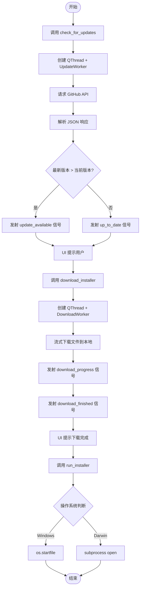

## 类结构

```
QObject (PySide6 基类)
├── UpdateChecker (主控制器，负责线程管理和信号转发)
├── UpdateWorker (后台任务：检查版本)
└── DownloadWorker (后台任务：下载文件)
```

## 全局变量及字段


### `logger`
    
模块级别的日志记录器，用于记录异常和关键操作

类型：`logging.Logger`
    


### `UpdateChecker._worker_thread`
    
用于执行后台任务的线程实例

类型：`QThread | None`
    


### `UpdateChecker._worker`
    
当前正在运行的后台任务对象（Worker）

类型：`QObject | None`
    


### `UpdateChecker.REPO_OWNER`
    
常量，GitHub 仓库所有者

类型：`str`
    


### `UpdateChecker.REPO_NAME`
    
常量，GitHub 仓库名称

类型：`str`
    


### `UpdateWorker.owner`
    
GitHub 仓库所有者

类型：`str`
    


### `UpdateWorker.repo`
    
GitHub 仓库名

类型：`str`
    


### `UpdateWorker.current_version`
    
应用当前版本号

类型：`str`
    


### `DownloadWorker.url`
    
待下载文件的 URL

类型：`str`
    


### `DownloadWorker.filename`
    
下载后保存的文件名

类型：`str`
    
    

## 全局函数及方法


### `UpdateChecker.check_for_updates`

触发更新检查流程，在后台线程中启动 `UpdateWorker` 以异步检测新版本，并通过信号反馈结果。

参数：
- （无显式参数，仅包含隐式 `self`）

返回值：
- `None`，无返回值。该方法通过 Qt 信号（`update_available`, `up_to_date`, `error_occurred`）异步传递检查结果。

#### 流程图

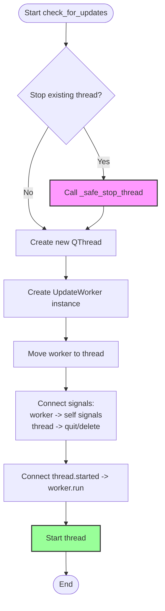

#### 带注释源码

```python
def check_for_updates(self):
    """Starts the check in a background thread."""
    # 1. 安全停止之前的检查线程，防止并发冲突
    self._safe_stop_thread()
        
    # 2. 创建新的工作线程和工作对象
    self._worker_thread = QThread()
    # 传入仓库所有者、仓库名和当前应用版本
    self._worker = UpdateWorker(self.REPO_OWNER, self.REPO_NAME, __version__)
    
    # 3. 将工作对象移入新线程（必须在线程启动前完成）
    self._worker.moveToThread(self._worker_thread)
    
    # 4. 连接信号槽以处理工作完成和清理
    self._worker.finished.connect(self._worker_thread.quit)
    self._worker.finished.connect(self._worker.deleteLater)
    self._worker_thread.finished.connect(self._worker_thread.deleteLater)
    
    # 5. 连接业务逻辑信号，将工作器的状态转发给 UpdateChecker 的调用者
    self._worker.update_available.connect(self.update_available)
    self._worker.up_to_date.connect(self.up_to_date)
    self._worker.error.connect(self.error_occurred)
    
    # 6. 连接启动信号并启动线程
    self._worker_thread.started.connect(self._worker.run)
    self._worker_thread.start()
```


### `UpdateChecker.download_installer`

该方法用于触发安装程序的下载流程。它通过实例化一个 `QThread` 和 `DownloadWorker` 对象，将下载任务移入后台线程执行，以避免阻塞主 UI 线程，并通过信号槽机制将下载进度、完成状态及错误信息回传给调用者。

参数：

- `url`：`str`，待下载文件的 URL 地址。
- `filename`：`str`，下载后保存的文件名。

返回值：`None`，该方法为异步操作，结果通过 `download_progress`（进度）、`download_finished`（完成路径）和 `error_occurred`（错误）信号传递。

#### 流程图

```mermaid
graph TD
    A([开始 download_installer]) --> B[调用 _safe_stop_thread 停止旧线程]
    B --> C[实例化 QThread]
    C --> D[实例化 DownloadWorker(url, filename)]
    D --> E[worker.moveToThread 迁移到新线程]
    E --> F[绑定信号槽: worker -> self]
    F --> G[thread.started.connect worker.run]
    G --> H[thread.start 启动线程]
    H --> I([结束: 异步等待信号])
```

#### 带注释源码

```python
def download_installer(self, url, filename):
    """Starts the download in a background thread."""
    # 1. 安全管理：先停止可能存在的旧后台线程，防止并发下载
    self._safe_stop_thread()

    # 2. 创建新的线程和工作对象
    self._worker_thread = QThread()
    self._worker = DownloadWorker(url, filename)
    
    # 3. 将工作对象移动到新线程中运行，确保在非主线程执行下载
    self._worker.moveToThread(self._worker_thread)
    
    # 4. 连接信号与槽（线程生命周期管理）
    # 当 worker 完成任务时，退出线程
    self._worker.finished.connect(self._worker_thread.quit)
    # 任务完成后，延迟销毁 worker 对象，防止泄露
    self._worker.finished.connect(self._worker_delete_later)
    # 线程结束时，销毁线程对象本身
    self._worker_thread.finished.connect(self._worker_thread.deleteLater)
    
    # 5. 连接信号与槽（业务逻辑）
    # 将 worker 的下载进度转发给 UpdateChecker 的外部信号
    self._worker.progress.connect(self.download_progress)
    # 将 worker 的下载完成路径转发给外部
    self._worker.finished_path.connect(self.download_finished)
    # 将 worker 的错误信息转发给外部
    self._worker.error.connect(self._error_occurred)
    
    # 6. 启动流程
    # 线程启动时，自动执行 worker 的 run 方法
    self._worker_thread.started.connect(self._worker.run)
    # 真正开始执行
    self._worker_thread.start()
```


### `UpdateChecker.run_installer`

该方法尝试使用操作系统默认的应用程序打开下载好的安装包文件。它首先通过 `platform.system()` 检测当前运行环境（Windows 或 macOS），随后调用相应的系统 API（`os.startfile` 或 `subprocess.Popen`）来启动安装程序。如果在启动过程中发生任何异常（例如文件路径不存在或系统缺少默认打开程序），该方法会捕获异常并通过 `error_occurred` 信号向 UI 反馈错误信息。目前该逻辑主要针对 Windows 和 macOS 进行了实现。

参数：
- `file_path`：`str`，需要运行的安装文件的完整路径（例如："/path/to/installer.exe"）。

返回值：`None`，该方法无返回值，主要通过信号（Signal）与主线程进行交互。

#### 流程图

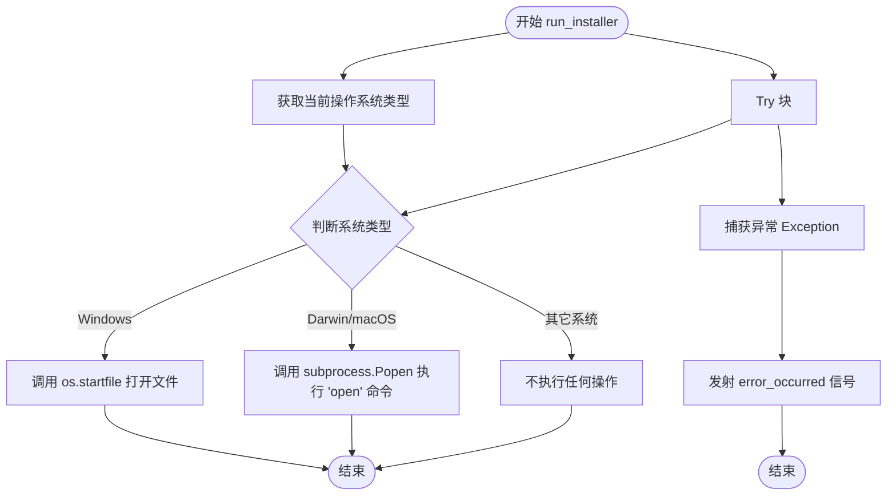

#### 带注释源码

```python
def run_installer(self, file_path):
    """Executes the installer based on the platform."""
    try:
        system = platform.system()
        if system == "Windows":
            # Windows 平台专用：使用系统默认程序打开文件
            # Windows 会自动解析安装包清单 (manifest)
            # 如果需要管理员权限，系统会触发 UAC (用户账户控制)
            os.startfile(file_path)
        elif system == "Darwin": # macOS
            # macOS 平台专用：使用 open 命令通过 Finder 打开文件
            # 这相当于在 Finder 中双击文件，会自动挂载 .dmg 或运行 .pkg
            subprocess.Popen(["open", file_path])
        # 注意：此处未对 Linux 等其他平台进行处理，可能导致无响应
    except Exception as e:
        # 捕获所有可能的异常（如文件不存在、没有默认应用等）
        self.error_occurred.emit(f"Failed to launch installer: {e}")
```


### `UpdateChecker.shutdown`

该方法负责优雅地终止应用程序中可能正在运行的后台更新检查或下载线程，并清理相关的对象引用，以确保应用程序可以安全地关闭或重启更新流程。

参数：无

返回值：`None`，该方法不返回任何值，仅执行清理操作。

#### 流程图

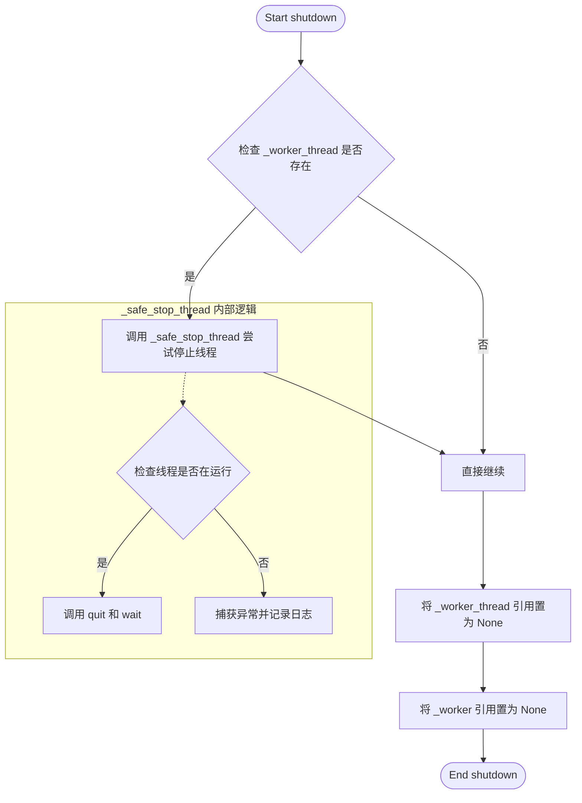

#### 带注释源码

```python
def shutdown(self):
    """Stops any active worker thread (best-effort)."""
    # 1. 调用内部安全停止方法，处理线程退出的核心逻辑
    #    包含异常处理，防止线程已崩溃或C++对象已删除
    self._safe_stop_thread()
    
    # 2. 主动解绑 Python 层的引用，辅助垃圾回收
    #    将线程对象引用设置为 None
    self._worker_thread = None
    
    # 3. 主动解绑 Worker 对象的引用
    #    这是一个 QObject，设置为 None 有助于在适当时候释放内存
    self._worker = None
```

---

### 上下文补充信息

#### 类字段与全局变量

为了理解 `shutdown` 方法的行为，必须了解其依赖的类字段：

*   `self._worker_thread`：`QThread` 或 `None`
    *   **描述**：管理后台工作线程的生命周期。在 `check_for_updates` 或 `download_installer` 时被创建。
*   `self._worker`：`UpdateWorker` / `DownloadWorker` 或 `None`
    *   **描述**：实际执行网络请求或下载的任务对象，运行在 `_worker_thread` 中。

#### 关键组件信息

*   **`_safe_stop_thread` (方法)**:
    *   **描述**：这是 `shutdown` 的核心依赖方法。它尝试调用 `QThread.quit()` 和 `QThread.wait()` 来停止事件循环，并包含 `try-except` 块来捕获 `RuntimeError`（当 Qt C++ 对象已被删除时抛出）。

---

### 技术债务与优化空间

1.  **缺乏超时机制**：
    *   **现状**：在 `_safe_stop_thread` 中调用 `self._worker_thread.wait()` 时没有传入参数（默认无限等待）。
    *   **风险**：如果 worker 线程在关键信号处阻塞（例如网络卡死），`shutdown` 可能会导致主 UI 线程冻结。
    *   **优化建议**：建议传入超时时间（如 `wait(2000)`），并在超时时考虑强制终止（虽然 Qt 的 `terminate()` 不推荐，但在某些极端场景下可作为保底）。

2.  **“尽力而为” 的不确定性**：
    *   **现状**：方法没有返回值，调用者无法得知线程是否真的停止了。
    *   **优化建议**：可以考虑返回一个布尔值，或者发出一个信号（如 `shutdown_complete`），让调用者知道清理是否成功。

3.  **状态残留**：
    *   **现状**：虽然引用被置为 `None`，但如果 `download_installer` 正在进行中并被调用 `shutdown`，文件流可能未正确关闭（取决于 worker 的中断逻辑）。当前代码中 worker 的 `run` 方法没有检查中断标志。

### 其它设计说明

*   **设计目标**：该方法的唯一目的是确保在应用退出或重新检查更新时，不会有孤立的线程继续运行。
*   **错误处理**：主要的错误处理逻辑封装在 `_safe_stop_thread` 中，能够容忍线程对象不存在或已被 Qt 内部销毁的情况（`RuntimeError`）。这保证了调用 `shutdown` 多次是安全的。
*   **数据流**：此方法不涉及数据流，主要涉及**资源生命周期管理**（线程资源的释放）。


### `UpdateChecker._safe_stop_thread`

这是一个私有方法，用于安全地停止与 `UpdateChecker` 关联的后台工作线程（QThread）。它通过尝试优雅地退出线程（`quit`）并等待其完成（`wait`），同时捕获并处理可能的 `RuntimeError`（通常由于 Qt 对象被过早删除导致），来确保应用程序在退出或重启更新检查时能够干净地释放资源，防止线程泄漏或程序卡死。

参数：

- `self`：`UpdateChecker`，调用此方法的类实例本身。

返回值：`None`，该方法不返回任何值，仅执行清理操作。

#### 流程图

```mermaid
graph TD
    A([开始]) --> B{检查 self._worker_thread 存在且运行中?}
    B -- 否 --> F[设置 self._worker_thread 为 None]
    F --> Z([结束])
    B -- 是 --> C[调用 quit() 请求线程退出]
    C --> D[调用 wait() 阻塞等待线程结束]
    D --> E{捕获异常}
    E -- RuntimeError (Qt C++ 对象已删除) --> G[捕获并忽略]
    E -- 其它 Exception --> H[记录错误日志 logger.error]
    G --> I[设置 self._worker_thread 为 None]
    H --> I
    I --> Z
```

#### 带注释源码

```python
def _safe_stop_thread(self):
    """
    内部方法：安全地停止当前的工作线程。
    旨在防止应用程序退出时出现线程挂起或资源泄漏。
    """
    try:
        # 检查工作线程对象是否存在且当前正在运行
        if self._worker_thread and self._worker_thread.isRunning():
            # 请求线程的事件循环退出
            self._worker_thread.quit()
            # 阻塞当前线程，等待工作线程完全结束
            self._worker_thread.wait()
    except RuntimeError:
        # 处理 Qt C++ 对象已被删除但 Python 对象仍引用它的罕见情况
        # 此时忽略错误，因为对象已无效
        pass
    except Exception as e:
        # 记录其他意外的停止错误
        logger.error(f"Error stopping thread: {e}")
    
    # 无论成功或失败，最后都将线程引用置空，确保状态一致
    self._worker_thread = None
```


### `UpdateWorker.run()`

该方法是 `UpdateWorker` 类的核心执行逻辑，运行在独立的后台线程中。它负责请求 GitHub API 获取最新发布信息，解析版本号并与当前应用版本进行比对，根据当前操作系统查找对应的安装包资源，最终通过信号机制向上层组件反馈检查结果（新版本可用、已最新或错误）。

#### 参数

- 无显式参数（该方法作为 QThread 的入口点自动调用，依赖初始化时传入的 `owner`、`repo`、`current_version` 属性）

#### 返回值

- `None`（无返回值，结果通过 Qt 信号传递）

#### 流程图

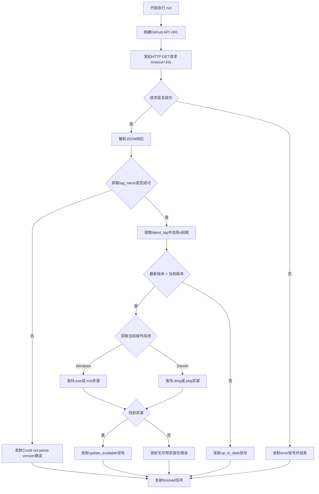

#### 带注释源码

```python
def run(self):
    """
    在后台线程中执行版本检查的核心逻辑。
    1. 请求 GitHub API 获取最新 release 信息
    2. 解析版本号并与当前版本比对
    3. 根据当前平台查找对应的安装包
    4. 发射相应信号通知结果
    """
    try:
        # --- 步骤1: 构建请求URL ---
        # 构造 GitHub API 端点 URL，访问指定仓库的最新发布
        url = f"https://api.github.com/repos/{self.owner}/{self.repo}/releases/latest"
        
        # --- 步骤2: 发起网络请求 ---
        # 使用 requests 库发送 GET 请求，设置 10 秒超时防止阻塞
        response = requests.get(url, timeout=10)
        
        # 检查 HTTP 响应状态码，若为 4xx/5xx 则抛出异常
        response.raise_for_status()
        
        # 解析 JSON 响应体
        data = response.json()
        
        # --- 步骤3: 解析版本号 ---
        # 从响应中获取 tag_name (如 "v1.2.3")，并去除前导 'v'
        latest_tag = data.get("tag_name", "").lstrip("v")
        
        # 如果版本号为空，说明 API 返回格式异常
        if not latest_tag:
             # 发射错误信号，传递错误描述
             self.error.emit("Could not parse version from release.")
             # 发射完成信号，通知线程结束
             self.finished.emit()
             return

        # --- 步骤4: 版本比对 ---
        # 使用 packaging.version 进行语义化版本比较
        if version.parse(latest_tag) > version.parse(self.current_version):
            # --- 步骤5: 查找对应平台的安装包 ---
            asset_url = None
            system = platform.system()  # 获取当前操作系统
            
            if system == "Windows":
                # 遍历 release 资源列表，查找 Windows 安装包
                for asset in data.get("assets", []):
                    if asset["name"].endswith(".exe") or asset["name"].endswith(".msi"):
                        asset_url = asset["browser_download_url"]
                        break
            elif system == "Darwin":  # macOS
                # 遍历 release 资源列表，查找 macOS 安装包
                for asset in data.get("assets", []):
                    if asset["name"].endswith(".dmg") or asset["name"].endswith(".pkg"):
                        asset_url = asset["browser_download_url"]
                        break
            
            # --- 步骤6: 发射信号 ---
            if asset_url:
                # 找到可用安装包，发射更新可用信号
                # 参数: 新版本号, Release页面URL, 安装包下载URL
                self.update_available.emit(latest_tag, data.get("html_url", ""), asset_url)
            else:
                # 未找到当前平台的安装包，发射错误信号
                self.error.emit(f"New version {latest_tag} available, but no installer found for your OS.")
        else:
            # 当前版本已是最新，发射已更新信号
            self.up_to_date.emit()

    except Exception as e:
        # --- 异常处理 ---
        # 捕获网络错误、JSON解析错误等所有异常，发射错误信号
        self.error.emit(str(e))
    finally:
        # --- 步骤7: 清理 ---
        # 无论成功或失败，最后都发射 finished 信号
        # 通知监听者该 Worker 已完成工作，可安全关闭线程
        self.finished.emit()
```


### `DownloadWorker.run()`

该方法实现了后台下载器的核心执行逻辑。首先获取系统的下载目录或临时目录作为存储路径，随后使用 `requests` 库以流式（Streaming）方式从指定 URL 下载文件。在下载过程中，它实时计算进度并通过 `progress` 信号发射；下载完成后，发射 `finished_path` 信号通知主线程文件保存路径；任何异常则通过 `error` 信号反馈，并确保 `finished` 信号在最后总是被发射以通知线程结束。

参数：

- 无显式参数。（依赖于类实例化时传入的 `self.url` 和 `self.filename`，以及 `QThread` 的启动机制）

返回值：

- `None` （无返回值，主要通过 Qt 的 Signal（`progress`, `finished_path`, `error`, `finished`）进行异步通信和状态反馈）

#### 流程图

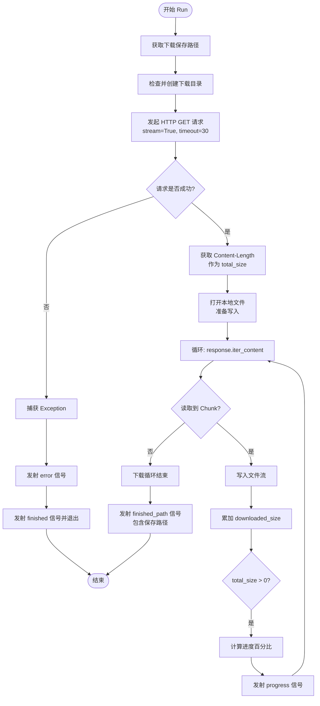

#### 带注释源码

```python
def run(self):
    """
    执行下载任务的主逻辑。
    """
    try:
        # 1. 确定下载目录
        # 优先使用系统标准的 'Download' 目录
        download_dir = QStandardPaths.writableLocation(QStandardPaths.DownloadLocation)
        
        # 如果无法获取或目录不存在，回退到用户主目录下的 'Downloads'
        if not download_dir:
            download_dir = os.path.join(os.path.expanduser("~"), "Downloads")
            
        # 再次检查目录是否存在，如果仍不存在（例如权限问题），使用系统临时目录
        if not os.path.exists(download_dir):
            download_dir = tempfile.gettempdir()

        # 2. 构造完整保存路径
        save_path = os.path.join(download_dir, self.filename)
        
        # 3. 发起网络请求
        # stream=True 是关键，它允许我们边下载边处理数据块，而不需要一次性将大文件加载到内存
        response = requests.get(self.url, stream=True, timeout=30)
        response.raise_for_status() # 检查 HTTP 状态码，非 200 会抛出异常
        
        # 4. 获取文件总大小以计算进度
        # 有些服务器可能不返回 Content-Length，此时 total_size 为 0
        total_size = int(response.headers.get('content-length', 0))
        downloaded_size = 0
        
        # 5. 流式写入文件
        with open(save_path, 'wb') as f:
            # 迭代获取数据块，chunk_size=8192 (8KB) 是比较平衡的块大小
            for chunk in response.iter_content(chunk_size=8192):
                if chunk: # 过滤掉 keep-alive 产生的空块
                    f.write(chunk)
                    downloaded_size += len(chunk)
                    
                    # 6. 计算并发射进度
                    if total_size > 0:
                        percent = int((downloaded_size / total_size) * 100)
                        self.progress.emit(percent)
        
        # 7. 下载完成，发射完成信号
        self.finished_path.emit(save_path)
        
    except Exception as e:
        # 8. 异常处理，发射错误信号
        self.error.emit(str(e))
    finally:
        # 9. 无论成功或失败，都必须发射 finished 信号
        # 以便 QThread 清理资源并退出
        self.finished.emit()
```

## 关键组件


### 核心功能概述

这是一个基于PySide6的跨平台自动更新检查模块，通过GitHub API在后台线程中检查新版本、匹配对应操作系统的安装包、下载更新文件并触发安装程序运行。

### 文件整体运行流程

1. 用户调用`check_for_updates()`方法启动更新检查
2. 创建`UpdateWorker`并移入新QThread执行版本检查
3. Worker调用GitHub API获取最新Release信息
4. 解析版本号与当前版本比较，若有新版本则查找对应平台的安装包资源
5. 发出`update_available`信号携带版本信息和下载链接
6. 用户调用`download_installer()`启动下载
7. 创建`DownloadWorker`在后台下载文件到系统下载目录
8. 下载完成后发出`finished_path`信号
9. 用户调用`run_installer()`根据操作系统启动相应的安装程序

### 类的详细信息

### UpdateChecker

**描述**: 主更新检查器类，负责管理更新检查、下载和安装流程的协调工作

**字段**:

- `_worker_thread`: QThread或None - 后台工作线程引用
- `_worker`: UpdateWorker或DownloadWorker或None - 当前活跃的工作对象

**方法**:

#### check_for_updates()

**参数**: 无

**返回值**: void

**描述**: 启动后台线程检查更新

**流程图**:
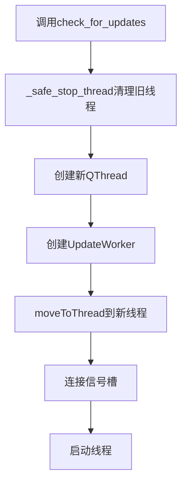

**源码**:
```python
def check_for_updates(self):
    """Starts the check in a background thread."""
    self._safe_stop_thread()
        
    self._worker_thread = QThread()
    self._worker = UpdateWorker(self.REPO_OWNER, self.REPO_NAME, __version__)
    self._worker.moveToThread(self._worker_thread)
    
    self._worker.finished.connect(self._worker_thread.quit)
    self._worker.finished.connect(self._worker.deleteLater)
    self._worker_thread.finished.connect(self._worker_thread.deleteLater)
    
    self._worker.update_available.connect(self.update_available)
    self._worker.up_to_date.connect(self.up_to_date)
    self._worker.error.connect(self.error_occurred)
    
    self._worker_thread.started.connect(self._worker.run)
    self._worker_thread.start()
```

#### download_installer(url, filename)

**参数**: 
- `url`: str - 下载链接
- `filename`: str - 保存的文件名

**返回值**: void

**描述**: 在后台线程启动安装包下载

**流程图**:
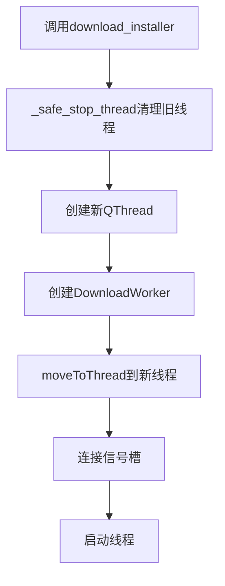

**源码**:
```python
def download_installer(self, url, filename):
    """Starts the download in a background thread."""
    self._safe_stop_thread()

    self._worker_thread = QThread()
    self._worker = DownloadWorker(url, filename)
    self._worker.moveToThread(self._worker_thread)
    
    self._worker.finished.connect(self._worker_thread.quit)
    self._worker.finished.connect(self._worker.deleteLater)
    self._worker_thread.finished.connect(self._worker_thread.deleteLater)
    
    self._worker.progress.connect(self.download_progress)
    self._worker.finished_path.connect(self.download_finished)
    self._worker.error.connect(self.error_occurred)
    
    self._worker_thread.started.connect(self._worker.run)
    self._worker_thread.start()
```

#### run_installer(file_path)

**参数**: 
- `file_path`: str - 安装包文件路径

**返回值**: void

**描述**: 根据操作系统启动对应的安装程序

**流程图**:
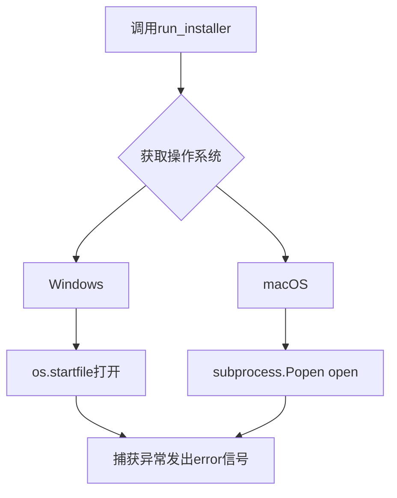

**源码**:
```python
def run_installer(self, file_path):
    """Executes the installer based on the platform."""
    try:
        system = platform.system()
        if system == "Windows":
            # Use os.startfile; Windows will parse the installer manifest
            # and trigger UAC only if the installer requires it.
            os.startfile(file_path)
        elif system == "Darwin": # macOS
            subprocess.Popen(["open", file_path])
    except Exception as e:
        self.error_occurred.emit(f"Failed to launch installer: {e}")
```

#### shutdown()

**参数**: 无

**返回值**: void

**描述**: 停止任何活跃的工作线程

**源码**:
```python
def shutdown(self):
    """Stops any active worker thread (best-effort)."""
    self._safe_stop_thread()
    self._worker_thread = None
    self._worker = None
```

---

### UpdateWorker

**描述**: 负责在后台线程中执行GitHub API调用和版本比较的Worker类

**字段**:

- `owner`: str - GitHub仓库所有者
- `repo`: str - GitHub仓库名称
- `current_version`: str - 当前应用版本

**方法**:

#### run()

**参数**: 无

**返回值**: void

**描述**: 执行版本检查逻辑，调用GitHub API获取最新release并比较版本

**流程图**:
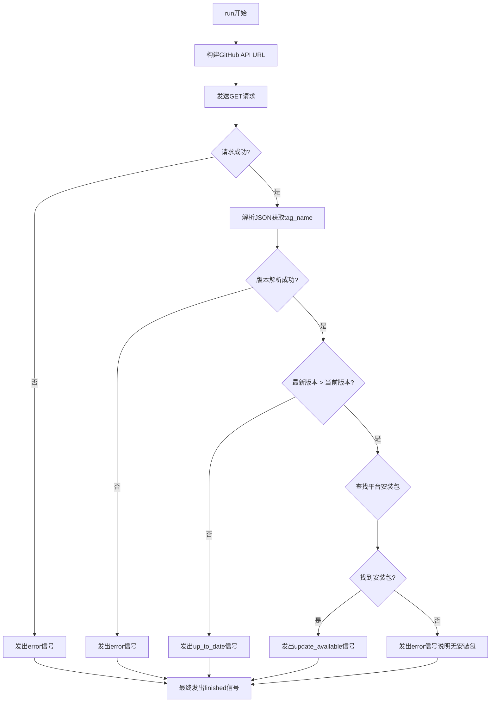

**源码**:
```python
def run(self):
    try:
        url = f"https://api.github.com/repos/{self.owner}/{self.repo}/releases/latest"
        response = requests.get(url, timeout=10)
        response.raise_for_status()
        data = response.json()
        
        latest_tag = data.get("tag_name", "").lstrip("v")
        if not latest_tag:
             self.error.emit("Could not parse version from release.")
             self.finished.emit()
             return

        if version.parse(latest_tag) > version.parse(self.current_version):
            # Find appropriate asset
            asset_url = None
            system = platform.system()
            if system == "Windows":
                for asset in data.get("assets", []):
                    if asset["name"].endswith(".exe") or asset["name"].endswith(".msi"):
                        asset_url = asset["browser_download_url"]
                        break
            elif system == "Darwin":
                for asset in data.get("assets", []):
                    if asset["name"].endswith(".dmg") or asset["name"].endswith(".pkg"):
                        asset_url = asset["browser_download_url"]
                        break
            
            if asset_url:
                self.update_available.emit(latest_tag, data.get("html_url", ""), asset_url)
            else:
                self.error.emit(f"New version {latest_tag} available, but no installer found for your OS.")
        else:
            self.up_to_date.emit()

    except Exception as e:
        self.error.emit(str(e))
    finally:
        self.finished.emit()
```

---

### DownloadWorker

**描述**: 负责在后台线程中执行文件下载的Worker类

**字段**:

- `url`: str - 下载链接
- `filename`: str - 保存的文件名

**方法**:

#### run()

**参数**: 无

**返回值**: void

**描述**: 执行文件下载，使用流式写入并发送下载进度

**流程图**:
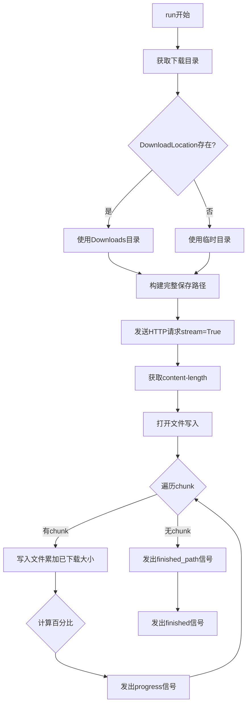

**源码**:
```python
def run(self):
    try:
        # Download to Downloads directory
        download_dir = QStandardPaths.writableLocation(QStandardPaths.DownloadLocation)
        if not download_dir:
            download_dir = os.path.join(os.path.expanduser("~"), "Downloads")
        
        # Fallback to temp if Downloads doesn't exist
        if not os.path.exists(download_dir):
            download_dir = tempfile.gettempdir()

        save_path = os.path.join(download_dir, self.filename)
        
        response = requests.get(self.url, stream=True, timeout=30)
        response.raise_for_status()
        
        total_size = int(response.headers.get('content-length', 0))
        downloaded_size = 0
        
        with open(save_path, 'wb') as f:
            for chunk in response.iter_content(chunk_size=8192):
                if chunk:
                    f.write(chunk)
                    downloaded_size += len(chunk)
                    if total_size > 0:
                        percent = int((downloaded_size / total_size) * 100)
                        self.progress.emit(percent)
        
        self.finished_path.emit(save_path)
        
    except Exception as e:
        self.error.emit(str(e))
    finally:
        self.finished.emit()
```

---

### 关键组件信息

### UpdateChecker - 更新检查协调器

主控制器类，管理更新检查和下载的生命周期，负责线程安全和信号发射

### UpdateWorker - 版本检查执行器

后台Worker，通过GitHub API获取最新release信息并进行版本比较和平台适配的安装包查找

### DownloadWorker - 下载执行器

后台Worker，负责流式下载安装包并实时报告下载进度

### _safe_stop_thread - 线程安全停止辅助方法

处理线程清理的公共方法，处理RuntimeError等异常情况

---

### 潜在的技术债务或优化空间

1. **缺少Linux平台支持**: 代码仅支持Windows和macOS的安装包查找和启动，Linux用户无法使用自动更新功能
2. **版本比较使用字符串解析**: 依赖packaging库的version.parse进行版本比较，可能对特殊版本格式处理不完善
3. **下载无重试机制**: 下载失败后无自动重试逻辑
4. **进度计算假设content-length存在**: 若服务器未返回content-length头，进度将始终为0
5. **缺乏下载断点续传**: 大文件下载中断后需从头开始
6. **异常处理过于宽泛**: 捕获所有Exception并统一处理，可能隐藏特定错误信息

---

### 其它项目

#### 设计目标与约束

- 目标: 提供非阻塞的跨平台自动更新体验
- 约束: 依赖PySide6的QThread机制保证GUI响应性
- 约束: 使用GitHub Releases作为更新分发源

#### 错误处理与异常设计

- 网络请求异常通过requests.raise_for_status()主动抛出
- 所有异常统一捕获后通过error信号发射，由UI层处理展示
- 线程清理时的RuntimeError被静默处理（对象已删除情况）

#### 数据流与状态机

- 状态: Idle -> Checking -> (UpdateAvailable | UpToDate | Error) -> Idle
- 状态: Idle -> Downloading -> (DownloadFinished | Error) -> Idle
- 使用Qt信号槽机制实现异步状态转换

#### 外部依赖与接口契约

- 依赖requests库进行HTTP通信
- 依赖packaging库进行版本解析
- 依赖PySide6.QtCore进行线程管理
- 依赖QStandardPaths获取系统标准目录


## 问题及建议


### 已知问题

-   **平台支持不完整**：`run_installer` 方法只处理 Windows 和 macOS，没有考虑 Linux 平台的处理逻辑，可能导致该类用户在更新时无响应
-   **硬编码的仓库信息**：`REPO_OWNER` 和 `REPO_NAME` 是硬编码的常量，缺乏灵活性，无法通过配置文件或初始化参数动态设置
-   **缺少 User-Agent 设置**：GitHub API 可能拒绝没有 User-Agent 的请求，容易触发速率限制或请求被拒
-   **版本解析异常未处理**：`version.parse()` 可能对非标准版本字符串（如 "1.0.0-alpha"、"v1.0.0.rc1" 等）抛出异常，导致检查失败
-   **下载进度计算潜在除零风险**：虽然检查了 `total_size > 0`，但 `int(response.headers.get('content-length', 0))` 在 header 不存在或格式异常时仍可能为 0
-   **文件完整性无验证**：下载完成后没有校验文件哈希值或签名，无法确保下载文件的完整性和真实性
-   **缺乏取消机制**：用户无法取消正在进行的更新检查或下载操作，只能强制停止线程
-   **线程安全风险**：信号在主线程触发但 worker 在子线程执行，如果槽函数直接操作 UI 可能导致崩溃（尽管 PySide6 信号本身是线程安全的）
-   **资源泄漏风险**：下载的临时文件或失败的下载文件没有被清理
-   **异常捕获过于宽泛**：使用 `except Exception` 捕获所有异常并直接转换为字符串，可能隐藏关键错误信息

### 优化建议

-   **完善平台支持**：为 Linux 添加适当的处理逻辑（如使用 `xdg-open` 或直接运行 AppImage/DEB/RPM）
-   **配置化解耦**：将仓库信息改为构造函数参数或配置对象注入，提高可测试性和可维护性
-   **增强网络请求健壮性**：添加自定义 User-Agent 头、请求重试机制（使用 `urllib3.Retry`）和超时配置化
-   **加强版本比较鲁棒性**：添加版本解析的异常捕获和回退逻辑，或使用更健壮的版本库
-   **添加文件校验**：支持 SHA256 或其他哈希校验，在下载完成后验证文件完整性
-   **实现取消功能**：为 worker 添加取消标志位，支持用户中断长时间操作
-   **改进错误处理**：根据异常类型进行分层捕获，记录详细日志而非仅发送给 UI
-   **资源清理**：使用上下文管理器或确保在异常情况下也能清理临时文件
-   **添加日志记录**：在关键步骤添加 `logger.debug` 或 `logger.info`，便于问题排查
-   **支持更多安装包格式**：扩展 Windows 的 NSIS、PortableZIP，macOS 的 ZIP 等格式检测


## 其它


### 设计目标与约束

该模块的设计目标是为桌面应用程序提供自动更新检查和安装功能，支持跨平台（Windows、macOS）的更新下载与自动安装。核心约束包括：必须在后台线程执行网络请求以避免阻塞主UI线程；需要处理网络异常、版本解析错误、平台不兼容等边界情况；下载文件应保存到用户指定的目录而非临时目录，以便用户管理。

### 错误处理与异常设计

模块采用信号槽机制传递错误信息。UpdateWorker和DownloadWorker中的run方法通过try-except捕获所有异常，并分别通过error信号.emit(str(e))将错误信息发送出去。UpdateChecker的run_installer方法捕获平台相关异常。设计缺陷：异常捕获过于宽泛（Exception as e），可能导致隐藏真实错误类型；建议区分网络超时、HTTP错误、文件IO错误等具体异常类型，以便上层UI给出更有针对性的提示。

### 数据流与状态机

数据流分为两条路径：更新检查流程和下载安装流程。更新检查流程：check_for_updates() -> 创建UpdateWorker -> 请求GitHub API -> 解析JSON -> 比较版本 -> 发射update_available或up_to_date信号。下载安装流程：download_installer() -> 创建DownloadWorker -> 流式下载文件 -> 发射progress信号 -> 下载完成后发射finished_path信号 -> run_installer()执行安装包。状态转换由QThread的生命周期管理，但缺少明确的取消（cancellation）支持。

### 外部依赖与接口契约

外部依赖包括：requests库用于HTTP请求；packaging.version用于语义化版本比较；PySide6.QtCore提供QObject、QThread、Signal等线程与信号机制；platform系统用于判断操作系统类型；subprocess/os用于启动安装程序。接口契约：update_available信号参数为(version, release_notes, download_url)三个字符串；download_finished信号参数为本地文件路径字符串；所有耗时操作必须在QThread中执行。

### 并发模型与线程安全

采用生产者-消费者模式的变体。UpdateChecker作为主线程的控制器，负责创建QThread和Worker对象，并将Worker移入新线程。Worker在独立线程中执行耗时操作（网络请求、文件下载），通过Signal将结果回调到主线程。设计要点：QObject.moveToThread()确保Worker的槽函数在目标线程执行；Signal是线程安全的；但需注意Worker对象内部的状态不应被主线程直接访问。

### 安全性考量

代码存在以下安全风险：1) 下载过程未验证SSL证书（requests.get默认验证，但未显式配置）；2) 未对下载的文件进行哈希校验，无法确保文件完整性；3) run_installer直接执行下载的可执行文件，潜在恶意软件风险；4) GitHub API URL构造未做输入校验（虽然owner/repo是硬编码的）。建议增加SHA256校验机制和代码签名验证。

### 性能考虑

下载实现采用8KB分块流式写入，内存占用较低。超时设置为30秒，对于大文件下载可能不足。建议增加断点续传支持（通过Range请求头）。GitHub API请求超时为10秒，对于网络环境较差的用户可能需要可配置化。

### 配置管理

当前版本号从app.version模块导入（__version__），属于静态配置。REPO_OWNER和REPO_NAME为类常量，硬编码在UpdateChecker中。建议抽取到配置文件或命令行参数，支持私有部署场景。

### 测试策略建议

建议增加单元测试覆盖：版本比较逻辑（packaging.version的使用）；异常场景测试（网络超时、API返回错误码）；文件下载的边界条件测试（0字节文件、超大文件）。由于涉及网络和文件系统操作，建议使用mock框架（unittest.mock）隔离外部依赖。

### 部署与分发注意事项

该模块依赖于PySide6、requests、packaging等非标准库，需要在打包时确保这些依赖正确安装。对于Windows平台，使用os.startfile会自动触发UAC提权；macOS平台使用open命令。建议在应用启动时而非每次启动时频繁检查更新，以减少GitHub API调用频率。

    