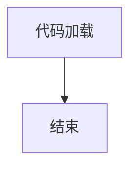

# `comic-translate\app\version.py` 详细设计文档

该代码文件仅定义了版本号 __version__ = "2.6.4"，没有实现任何业务逻辑、类或函数。

## 整体流程



## 类结构

```
无类或模块结构
```

## 全局变量及字段


### `__version__`
    
模块版本号，标识当前代码的版本为2.6.4

类型：`str`
    


    

## 全局函数及方法


## 关键组件


### 版本定义模块

这是一个简单的版本标识文件，定义了当前软件包的版本号为"2.6.4"，用于版本追踪和发布管理。

### 关键组件信息

- **版本号 (__version__)**: 字符串类型，记录当前软件包的版本标识，用于依赖管理和版本兼容性检查。

### 技术债务或优化空间

由于该代码仅包含版本定义信息，不存在技术债务。建议在未来版本中添加版本变更日志或版本兼容性说明文档。

### 其它项目

- **设计目标**: 简单版本标识，无复杂逻辑
- **错误处理**: 无错误处理需求
- **外部依赖**: 无外部依赖
- **接口契约**: 通过 __version__ 变量向外暴露版本信息


## 问题及建议


### 已知问题

-   代码仅包含版本号定义，缺乏任何功能实现或业务逻辑
-   未定义模块级别的文档字符串（docstring），降低代码可维护性和可发现性
-   版本号以硬编码方式直接赋值，缺乏动态版本管理机制
-   无任何类型注解或注释说明版本变更历史
-   缺少包级别的元数据信息（如作者、许可证、依赖声明等）

### 优化建议

-   添加模块级文档字符串，说明该模块的用途和版本管理策略
-   考虑使用动态版本获取机制（如从setup.cfg、pyproject.toml或git标签读取版本号），避免手动同步版本号
-   建议将版本信息统一管理，使用单一事实来源（Single Source of Truth），如通过setuptools的version字段自动生成__version__
-   如为正式项目，建议补充更完整的包元数据（作者、许可证、描述等），并使用标准化的版本语义（Semantic Versioning）
-   若此为入口文件，建议补充基本的模块初始化逻辑或导出关键接口


## 其它


### 设计目标与约束

本模块的设计目标是为项目提供版本号声明功能，使其他模块能够通过导入获取当前版本信息。约束条件包括：版本号格式遵循语义化版本规范（Semantic Versioning 2.0.0），主版本号为2，次版本号为6，修订号为4；该模块应为纯Python实现，无外部依赖；版本号应在项目构建时自动更新或手动维护。

### 错误处理与异常设计

由于本模块仅包含版本号声明，不涉及运行时逻辑，因此不设计异常处理机制。如需扩展版本比较功能，应考虑抛出InvalidVersionError异常，异常信息应包含无效版本号的具体内容及预期格式说明。

### 外部依赖与接口契约

本模块无外部依赖，仅为项目内部使用。接口契约：其他模块通过`import <module_name>; <module_name>.__version__`方式访问版本号，返回值为字符串类型，格式为"主版本号.次版本号.修订号"。

### 数据流与状态机

本模块不涉及数据流处理或状态机逻辑。版本号作为静态字符串常量在模块加载时初始化，不存在运行时状态变化。

### 模块初始化与加载时行为

模块在首次被导入时，Python解释器会执行模块级代码，将`__version__`变量绑定到字符串对象"2.6.4"。后续导入将使用已加载的模块对象，不会重复执行赋值操作。

### 版本管理策略

当前版本2.6.4表示主版本号为2（重大变更），次版本号为6（新增功能，向后兼容），修订号为4（bug修复）。版本号变更应遵循语义化版本规范，每次发布前更新该值。

### 测试与验证建议

建议添加单元测试验证：版本号格式符合语义化版本规范、正则表达式匹配^\d+\.\d+\.\d+$、版本号可被正确导入、版本号为字符串类型。

### 部署与发布信息

该版本号对应的发布包应包含版本元数据标签、发布时间戳、发布类型（稳定版/测试版）。建议在打包配置（如setup.py、pyproject.toml）中同步更新版本号。

    