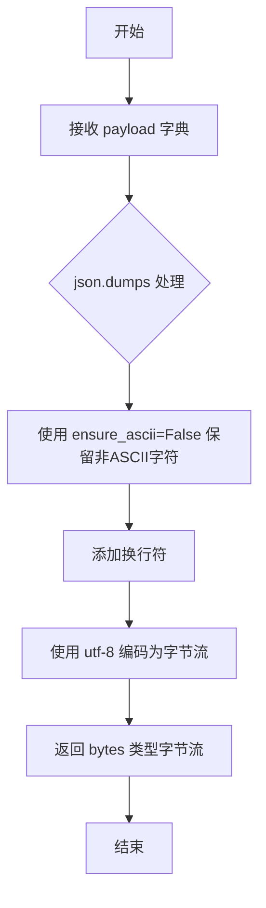
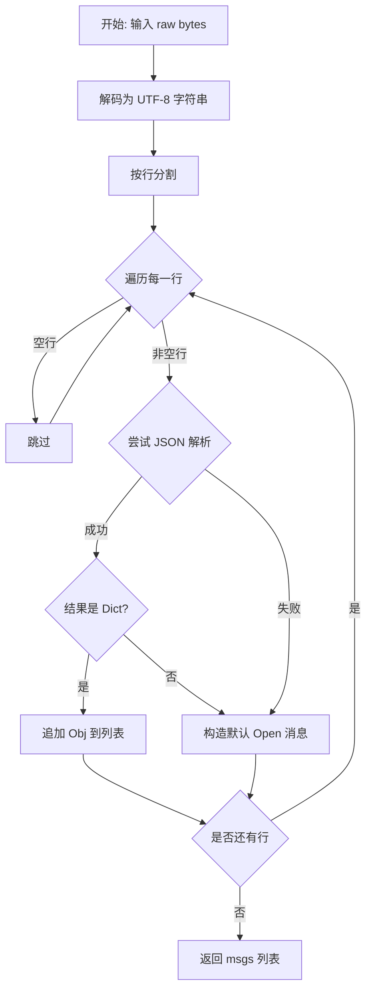
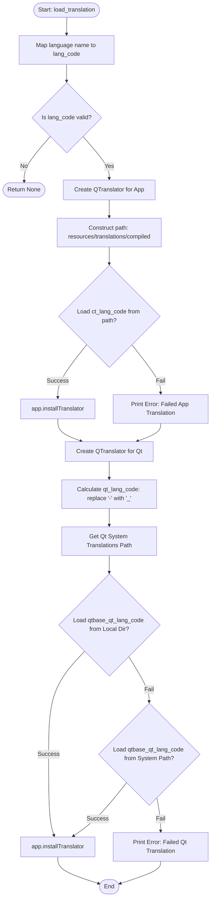
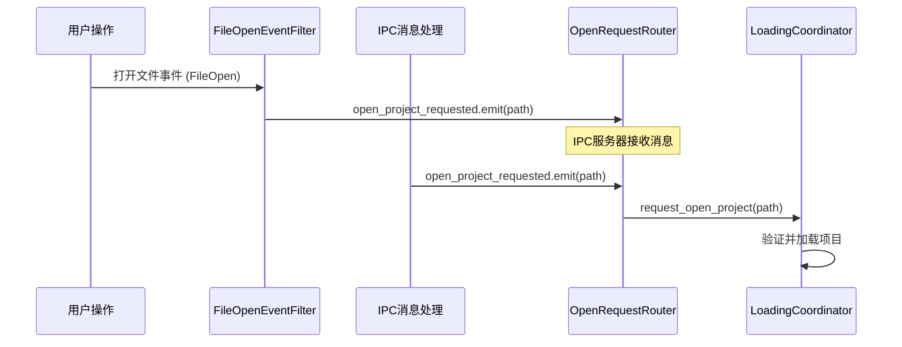
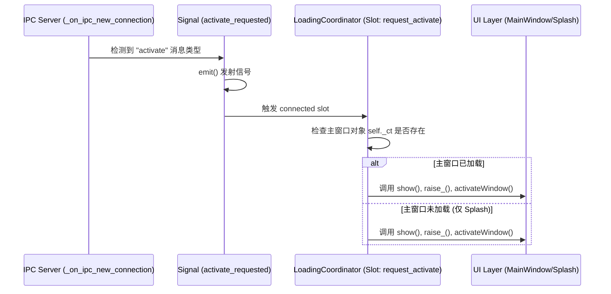
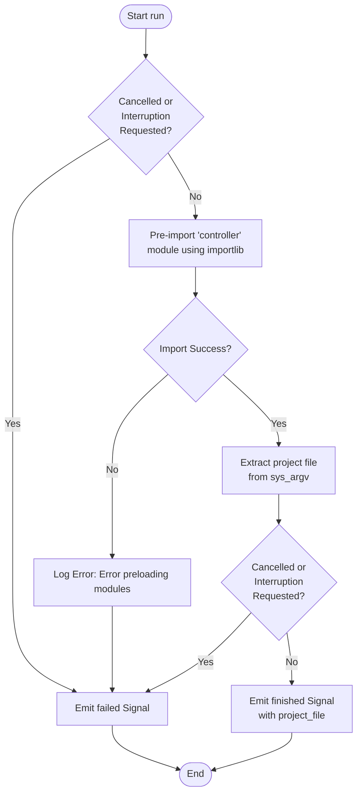
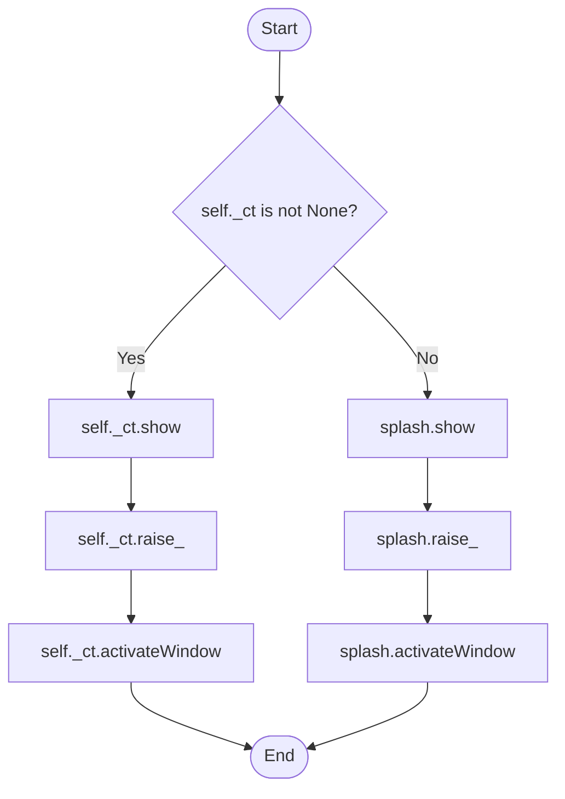
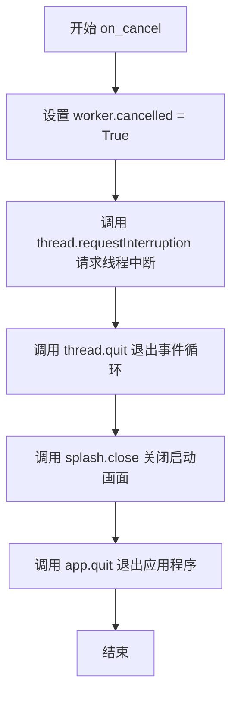
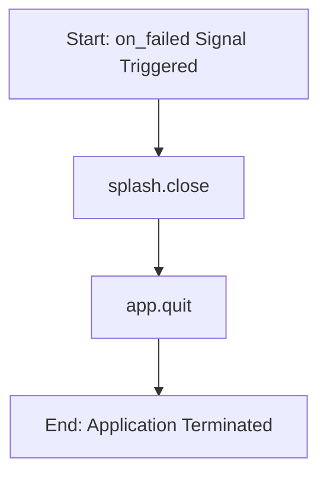

# `comic-translate\comic.py` 详细设计文档

这是 ComicTranslate 桌面应用程序的主入口文件，主要负责 Qt 应用实例的初始化、单实例运行机制（通过本地套接字）、启动画面（Splash Screen）的显示与交互、后台线程预加载核心模块（controller）、以及系统语言与翻译资源的动态加载，同时处理通过命令行或系统事件触发的项目文件打开请求。

## 整体流程

```mermaid
graph TD
    Start([程序启动]) --> ConfigLog[配置日志]
    ConfigLog --> WinID{Windows平台?}
    WinID -- 是 --> SetAppID[设置 Windows App ID]
    WinID -- 否 --> InitQt[创建 QApplication]
    SetAppID --> InitQt
    InitQt --> InitRouter[初始化 OpenRequestRouter 和 FileOpenEventFilter]
    InitRouter --> CheckInstance{检查单实例}
    CheckInstance -- 已有实例 --> Forward[转发打开请求给旧实例并退出]
    CheckInstance -- 无实例 --> StartServer[启动 QLocalServer 监听]
    StartServer --> ShowSplash[显示启动画面]
    ShowSplash --> InitWorker[初始化 LoadingWorker 和 QThread]
    InitWorker --> StartThread[启动后台线程]
    StartThread --> WorkerRun[Worker: 预加载 controller 模块]
    WorkerRun --> CheckArg[检查命令行参数中的 .ctpr 文件]
    CheckArg --> EmitFinished[发送 finished 信号]
    EmitFinished --> MainThread[主线程接收信号]
    MainThread --> LoadTran[加载翻译文件]
    LoadTran --> ImportMainUI[动态导入并创建 ComicTranslate 主窗口]
    ImportMainUI --> Loop[进入 Qt 事件循环 (app.exec)]
    Loop --> HandleIPC[处理 IPC 新连接: 打开/激活请求]
    HandleIPC --> Cleanup[退出清理]
```

## 类结构

```
QObject (PySide6 基类)
├── OpenRequestRouter (信号路由器)
├── FileOpenEventFilter (文件打开事件过滤器)
├── LoadingWorker (后台加载工作器)
└── LoadingCoordinator (主线程协调器, 定义在 main 内部)
```

## 全局变量及字段


### `_extract_project_file`
    
从命令行参数中提取项目文件路径

类型：`function`
    


### `_single_instance_server_name`
    
生成单实例服务器的唯一名称

类型：`function`
    


### `_encode_ipc_message`
    
将字典 payload 编码为 JSON 字节流用于 IPC 通信

类型：`function`
    


### `_decode_ipc_messages`
    
从原始字节数据中解析多条 IPC 消息

类型：`function`
    


### `_try_forward_to_existing_instance`
    
尝试将打开请求转发给已运行的实例

类型：`function`
    


### `main`
    
应用主入口函数，负责初始化 Qt 应用、单实例控制、启动画面和加载流程

类型：`function`
    


### `get_system_language`
    
获取系统语言并映射为应用支持的语言名称

类型：`function`
    


### `load_translation`
    
加载应用翻译文件和 Qt 标准翻译文件

类型：`function`
    


### `FileOpenEventFilter._router`
    
路由对象引用，用于转发文件打开事件

类型：`OpenRequestRouter`
    


### `LoadingWorker.icon`
    
应用图标

类型：`QIcon`
    


### `LoadingWorker.selected_language`
    
选中的语言

类型：`str`
    


### `LoadingWorker.sys_argv`
    
系统参数列表

类型：`list`
    


### `LoadingWorker.cancelled`
    
取消标志

类型：`bool`
    


### `LoadingCoordinator._ct`
    
主窗口实例

类型：`ComicTranslate`
    


### `LoadingCoordinator._pending_project_file`
    
等待打开的项目文件路径

类型：`str | None`
    
    

## 全局函数及方法


### `_extract_project_file`

该函数是一个全局辅助函数，用于在程序启动时从传入的命令行参数列表中自动检索并验证项目文件。它通过遍历参数，筛选出符合项目文件扩展名（`.ctpr`）且物理存在的文件路径，实现命令行启动应用并直接打开项目的功能。

**参数**：

- `argv`：`list[str]`，应用程序启动时的命令行参数列表（通常为 `sys.argv`）。

**返回值**：`str | None`，返回找到的有效项目文件绝对路径；如果未找到或文件不存在，则返回 `None`。

#### 流程图

```mermaid
flowchart TD
    Start([开始]) --> CheckArgs{参数列表是否为空?}
    CheckArgs -->|是| ReturnNone[返回 None]
    CheckArgs -->|否| LoopStart[遍历 argv[1:]]
    
    LoopStart --> GetArg[获取当前参数]
    GetArg --> StripQuotes[去除两端引号]
    StripQuotes --> CheckExt{扩展名是否为 .ctpr?}
    CheckExt -->|否| LoopNext[继续下一个参数]
    CheckExt -->|是| CheckExist{文件是否存在?}
    
    CheckExist -->|否| LoopNext
    CheckExist -->|是| ReturnPath[返回文件路径]
    
    LoopNext --> HasMore{是否还有未遍历的参数?}
    HasMore -->|是| GetArg
    HasMore -->|否| ReturnNone
```

#### 带注释源码

```python
def _extract_project_file(argv: list[str]) -> str | None:
    """
    从命令行参数列表中查找 .ctpr 项目文件。

    参数:
        argv: 命令行参数列表，通常为 sys.argv。

    返回:
        找到的有效 .ctpr 文件路径，或 None。
    """
    # 遍历除脚本名称外的所有参数
    for arg in argv[1:]:
        # 去除参数两端的引号（处理传入路径带引号的情况）
        candidate = arg.strip('"')
        
        # 检查文件扩展名（忽略大小写）且文件是否存在于文件系统中
        if candidate.lower().endswith(".ctpr") and os.path.exists(candidate):
            return candidate
            
    # 遍历完所有参数均未找到符合条件的文件
    return None
```


### `_single_instance_server_name`

该函数用于生成应用程序单实例运行时的本地服务器（QLocalServer）的唯一名称。它通过获取当前脚本文件的绝对路径，计算其 SHA1 哈希值的前 12 位，并结合应用名形成唯一的服务器标识符。这确保了在不同路径或环境下运行的程序实例拥有不同的服务器套接字名称，从而实现正确的单实例控制。

参数：
- (无显式参数，隐式使用全局变量 `__file__`)

返回值：`str`，返回格式为 `ComicTranslate-{12位哈希值}` 的服务器名称字符串。

#### 流程图

```mermaid
flowchart TD
    A[开始] --> B[获取当前脚本绝对路径: os.path.abspath(__file__)]
    B --> C[转换为小写并编码为UTF-8字节: .lower().encode('utf-8')]
    C --> D[计算SHA1哈希摘要: hashlib.sha1(seed)]
    D --> E[提取十六进制字符串前12位: .hexdigest()[:12]]
    E --> F[拼接前缀 'ComicTranslate-']
    F --> G[返回结果]
```

#### 带注释源码

```python
def _single_instance_server_name() -> str:
    """
    生成单实例服务器的名称。
    通过对脚本文件的绝对路径进行哈希，生成一个相对固定且唯一的标识符，
    用于 QLocalServer 的监听名称。
    """
    # 1. 获取当前文件路径，转换为小写（统一大小写以保证跨平台一致性），
    #    并编码为字节流。注意使用 errors="ignore" 防止路径中有特殊字符导致编码失败。
    seed = os.path.abspath(__file__).lower().encode("utf-8", errors="ignore")
    
    # 2. 使用 SHA1 算法生成哈希值，并截取前 12 位十六进制字符，兼顾唯一性和名称长度。
    digest = hashlib.sha1(seed).hexdigest()[:12]
    
    # 3. 拼接应用名称前缀，形成最终的服务器套接字名称。
    return f"ComicTranslate-{digest}"
```


### `_encode_ipc_message`

将 Python 字典（payload）序列化为带有换行符的 UTF-8 编码字节流，用于进程间通信（IPC）消息传输。

参数：

- `payload`：`dict`，要编码的 IPC 消息载荷字典，包含消息类型和相关内容

返回值：`bytes`，序列化后的 JSON 字节流，可直接通过 QLocalSocket 发送

#### 流程图



#### 带注释源码

```python
def _encode_ipc_message(payload: dict) -> bytes:
    """
    将字典序列化为 JSON 字节流，用于 IPC 通信。
    
    参数:
        payload (dict): 要编码的 IPC 消息载荷字典
        
    返回值:
        bytes: 序列化后的 JSON 字节流
    """
    # 使用 json.dumps 将字典转换为 JSON 字符串
    # ensure_ascii=False: 保留非 ASCII 字符（如中文），避免 Unicode 转义
    # + "\n": 添加换行符作为消息分隔符，便于接收端按行解析
    # .encode("utf-8"): 将字符串编码为 UTF-8 字节流
    # errors="ignore": 忽略编码错误，防止异常终止
    return (json.dumps(payload, ensure_ascii=False) + "\n").encode("utf-8", errors="ignore")
```


### `_decode_ipc_messages`

该函数负责将原始字节流（通常来自 QLocalSocket）反序列化为 Python 字典对象列表。它支持两种消息格式：标准的 JSON 格式（包含 `type` 字段）和传统的纯文本路径格式（被视为打开文件的请求）。这是在单实例模式下，不同应用程序实例之间进行进程间通信（IPC）的关键解析环节。

参数：
- `raw`：`bytes`，从 QLocalSocket 读取的原始字节数据。

返回值：`list[dict]`，解析后的消息字典列表。如果解析失败，默认构造为 `{"type": "open", "path": line}` 格式。

#### 流程图



#### 带注释源码

```python
def _decode_ipc_messages(raw: bytes) -> list[dict]:
    """
    将字节流反序列化为 IPC 消息列表。
    支持标准的 JSON 消息格式，也兼容仅包含文件路径的纯文本行（被视为 'open' 请求）。
    """
    msgs: list[dict] = []
    
    # 1. 将字节流解码为字符串，忽略编码错误以保证健壮性
    # 2. 使用 splitlines() 分割成多行，支持同时发送多条消息
    for line in raw.decode("utf-8", errors="ignore").splitlines():
        line = line.strip()
        
        # 跳过空行
        if not line:
            continue
            
        try:
            # 3. 尝试将当前行解析为 JSON
            obj = json.loads(line)
            
            # 4. 检查解析结果是否为字典对象
            if isinstance(obj, dict):
                msgs.append(obj)
                continue
        except Exception:
            # 如果 JSON 解析失败（例如格式错误），则静默处理
            pass
            
        # 5. 如果解析失败或结果不是字典，则假定为纯文本路径（遗留格式或直接拖拽文件路径）
        # 构造标准的 'open' 消息结构
        msgs.append({"type": "open", "path": line})
        
    return msgs
```

#### 关键组件信息
- **QLocalSocket**: 提供了 `readAll()` 方法，产出此处 `raw` 参数的字节数据。
- **OpenRequestRouter**: 接收该函数解析出的消息，并根据 `type` 字段触发 `open_project_requested` 或 `activate_requested` 信号。
- **JSON**: 作为 IPC 消息的序列化格式。

#### 潜在的技术债务与优化空间
1.  **静默异常吞没 (`except Exception: pass`)**: 在 `try-except` 块中直接 `pass` 会导致调试困难。如果收到恶意构造的畸形数据或网络干扰，开发者无法从日志中得知解析失败的具体原因。建议至少记录 `warning` 级别的日志。
2.  **隐式类型假设**: 在 `except` 块中，代码假设任何非 JSON 的行都是 "path"。虽然符合当前产品逻辑（打开文件），但缺乏对消息结构的强校验。

#### 其它项目
- **错误处理**: 采用 "fail-safe" 策略。即使单条消息解析失败，函数仍会尽力解析剩余的消息，并尝试将无法解析的行当作路径处理，保证服务不会因一条消息崩溃。
- **数据流**: `_decode_ipc_messages` 是数据从底层 Socket 流向应用逻辑（如 `LoadingCoordinator`）的中间层。


### `_try_forward_to_existing_instance`

该函数是单实例运行机制的核心客户端部分。它尝试通过本地套接字（QLocalSocket）连接到以 `server_name` 标识的已运行应用实例。如果连接成功，它会根据 `project_file` 参数构造并发送“打开文件”或“激活窗口”的 IPC 消息，从而将控制权转交给已运行的实例；若连接失败（如未检测到运行实例），则返回 `False`。

#### 参数

- `server_name`：`str`，本地服务器的名称，用于标识目标实例。
- `project_file`：`str | None`，要打开的项目文件（.ctpr）路径。如果为 `None`，则表示仅请求激活（将窗口置于前台）。

#### 返回值

`bool`，表示消息是否已成功发送给已运行的实例。如果无法连接或通信失败，返回 `False`。

#### 流程图

```mermaid
flowchart TD
    A([开始]) --> B[创建 QLocalSocket]
    B --> C[尝试连接至 server_name]
    C --> D{等待连接 200ms 成功?}
    D -- 否 --> E[中止 socket]
    E --> F([返回 False])
    D -- 是 --> G{project_file 是否存在?}
    G -- 是 --> H[编码 IPC 消息: {type: 'open', path: ...}]
    G -- 否 --> I[编码 IPC 消息: {type: 'activate'}]
    H --> J[写入 Socket]
    I --> J
    J --> K[刷新缓冲区 flush]
    K --> L[等待字节写入 500ms]
    L --> M[断开连接 disconnectFromServer]
    M --> N[等待断开完成 200ms]
    N --> O([返回 True])
```

#### 带注释源码

```python
def _try_forward_to_existing_instance(server_name: str, project_file: str | None) -> bool:
    """
    尝试转发请求给已运行的单实例应用。
    
    参数:
        server_name: 本地服务器的名称。
        project_file: 要打开的项目文件路径，如果为 None 则发送激活信号。
        
    返回:
        bool: 是否成功发送消息。
    """
    # 1. 创建本地套接字客户端
    socket = QLocalSocket()
    
    # 2. 尝试连接到服务器（单实例应用中作为客户端）
    socket.connectToServer(server_name)
    
    # 3. 等待连接建立，设置超时时间 200ms
    if not socket.waitForConnected(200):
        # 连接失败，可能没有实例在运行，中止并返回 False
        socket.abort()
        return False

    # 4. 根据是否有项目文件，决定消息类型
    if project_file:
        # 发送打开文件的消息
        socket.write(_encode_ipc_message({"type": "open", "path": project_file}))
    else:
        # 发送激活窗口的消息
        socket.write(_encode_ipc_message({"type": "activate"}))

    # 5. 刷新缓冲区，确保数据发出
    socket.flush()
    
    # 6. 等待数据完全写入，设置超时 500ms
    # 注意：此处未检查返回值，如果写入失败可能仍会尝试断开连接
    socket.waitForBytesWritten(500)
    
    # 7. 断开连接
    socket.disconnectFromServer()
    
    # 8. 等待连接完全关闭
    socket.waitForDisconnected(200)
    
    return True
```

#### 潜在技术债务或优化空间

1.  **未检查写入状态**：`waitForBytesWritten(500)` 的返回值未被检查。如果由于网络或缓冲区问题导致写入失败，函数仍然会执行 `disconnectFromServer` 并返回 `True`，可能导致调用者误以为请求已成功发送。建议增加对写入结果的判断逻辑。
2.  **硬编码超时时间**：连接（200ms）和写入（500ms）的超时时间是硬编码的。在某些网络环境较慢或系统负载较高的情况下，可能需要调整为可配置参数，以提高成功率。
3.  **错误处理细节**：虽然连接失败会返回 `False`，但写入失败并未显式反馈给调用者。如果未来需要区分“连接失败”和“写入失败”，需要对 `waitForBytesWritten` 的返回值进行判定。

#### 其它项目

*   **设计目标**：实现“单实例运行”模式。当用户通过命令行参数或文件关联启动第二个实例时，第二个实例将项目文件路径转发给第一个实例并立即退出，保证只有一个主窗口。
*   **外部依赖**：
    *   `PySide6.QtNetwork.QLocalSocket`：用于进程间通信。
    *   `_encode_ipc_message`：依赖的辅助函数，负责将字典序列化为 JSON 字节流。


### `main`

该函数是 ComicTranslate 桌面应用程序的主入口点，负责应用初始化配置、单实例检测与通信、启动画面显示、后台模块预加载以及 Qt 事件循环的启动与清理。

参数：

- 无参数（使用全局 `sys.argv`）

返回值：`int`，返回 Qt 事件循环的退出代码

#### 流程图

```mermaid
flowchart TD
    A[开始 main] --> B[配置日志 logging.basicConfig]
    B --> C{是否是 Windows}
    C -->|Yes| D[设置 Windows Taskbar Icon]
    C -->|No| E[跳过]
    D --> E
    E --> F[创建 QApplication]
    F --> G[创建 OpenRequestRouter 和 FileOpenEventFilter]
    G --> H[安装事件过滤器]
    H --> I[生成单实例服务器名称]
    I --> J[提取命令行项目文件]
    J --> K{是否有其他实例运行?}
    K -->|Yes| L[转发消息并 sys.exit(0)]
    K -->|No| M[创建 QLocalServer]
    M --> N[监听服务器名称]
    N --> O[设置应用图标]
    O --> P[创建并显示启动画面]
    P --> Q[获取语言设置]
    Q --> R[创建 LoadingWorker 和 QThread]
    R --> S[连接信号与槽]
    S --> T[显示启动画面并启动工作线程]
    T --> U[启动 Qt 事件循环 app.exec]
    U --> V{事件循环结束}
    V --> W[清理线程和服务器]
    W --> X[启动看门狗定时器]
    X --> Y[raise SystemExit]
```

#### 带注释源码

```python
def main():
    """
    主函数：应用程序入口，负责初始化 Qt 应用、单实例控制、启动画面
    以及后台加载逻辑，并进入 Qt 事件循环。
    """
    
    # 配置日志系统，记录 INFO 级别及以上的日志
    logging.basicConfig(
        level=logging.INFO,
    )
    
    # Windows 平台特定处理：设置任务栏图标（避免使用默认的 Python 图标）
    if sys.platform == "win32":
        import ctypes
        myappid = u'ComicLabs.ComicTranslate' # 任意字符串，用于标识应用
        ctypes.windll.shell32.SetCurrentProcessExplicitAppUserModelID(myappid)

    # 创建 Qt 应用程序实例（直接创建而非使用上下文管理器）
    app = QApplication(sys.argv)

    # 创建请求路由器，用于处理打开项目和激活应用的事件
    router = OpenRequestRouter()
    # 创建文件打开事件过滤器，捕获 macOS/外部的文件打开事件
    file_open_event_filter = FileOpenEventFilter(router)
    # 安装事件过滤器到应用
    app.installEventFilter(file_open_event_filter)

    # 生成单实例服务器名称（基于脚本路径的 SHA1 哈希）
    server_name = _single_instance_server_name()
    # 从命令行参数提取项目文件路径
    startup_project_file = _extract_project_file(sys.argv)

    # 检查是否有其他实例正在运行
    # 如果是，则转发打开/激活请求并退出当前实例
    if _try_forward_to_existing_instance(server_name, startup_project_file):
        sys.exit(0)

    # 成为主实例：启动本地 IPC 服务器以接收后续启动请求
    server = QLocalServer(app)
    if not server.listen(server_name):
        # 可能存在残留的服务器（崩溃导致），删除后重试
        QLocalServer.removeServer(server_name)
        server.listen(server_name)
     
    # 设置应用窗口图标
    current_file_dir = os.path.dirname(os.path.abspath(__file__))
    icon_path = os.path.join(current_file_dir, 'resources', 'icons', 'icon.ico')
    icon = QIcon(icon_path)
    app.setWindowIcon(icon)

    # 创建并配置启动画面
    splash_pix = QPixmap(os.path.join(current_file_dir, 'resources', 'icons', 'splash.png'))
    # 获取屏幕 DPI 以支持高分辨率显示
    screen = app.primaryScreen()
    dpr = screen.devicePixelRatio()
    target_w, target_h = 400, 225
    splash_pix = splash_pix.scaled(int(target_w * dpr), int(target_h * dpr), Qt.KeepAspectRatio, Qt.SmoothTransformation)
    splash_pix.setDevicePixelRatio(dpr)
    splash = SplashScreen(splash_pix)
    
    # 从设置中获取用户偏好的语言，默认使用系统语言
    settings = QSettings("ComicLabs", "ComicTranslate")
    selected_language = settings.value('language', get_system_language())
    
    # 创建后台加载工作线程和 Worker 对象
    thread = QThread()
    worker = LoadingWorker(icon, selected_language, sys.argv)
    # 将 Worker 移动到后台线程
    worker.moveToThread(thread)
    # 连接清理信号：工作完成后删除 Worker
    worker.finished.connect(worker.deleteLater)
    worker.failed.connect(worker.deleteLater)
    worker.finished.connect(thread.quit)
    worker.failed.connect(thread.quit)
    
    # 定义 LoadingCoordinator 类用于协调加载完成后的逻辑
    class LoadingCoordinator(QObject):
        def __init__(self):
            super().__init__()
            self._ct = None  # ComicTranslate 主窗口实例
            self._pending_project_file: str | None = None  # 待打开的项目文件

        @Slot(str)
        def request_open_project(self, path: str):
            """处理打开项目请求"""
            if not path:
                return
            if not path.lower().endswith(".ctpr"):  # 只接受 .ctpr 文件
                return
            if not os.path.exists(path):
                return
            norm = os.path.abspath(path)
            if self._ct is not None:
                try:
                    # 如果已有窗口，确认是否要打开新项目
                    if not self._ct._confirm_start_new_project():
                        return
                except Exception:
                    pass
                # 在现有窗口中加载项目
                self._ct.project_ctrl.thread_load_project(norm)
            else:
                # 暂存待打开的项目文件
                self._pending_project_file = norm

        @Slot()
        def request_activate(self):
            """激活应用程序窗口（从后台提到前台）"""
            if self._ct is not None:
                try:
                    self._ct.show()
                    self._ct.raise_()
                    self._ct.activateWindow()
                except Exception:
                    pass
            else:
                # 如果主窗口未创建，显示启动画面
                try:
                    splash.show()
                    splash.raise_()
                    splash.activateWindow()
                except Exception:
                    pass

        @Slot()
        def on_cancel(self):
            """处理用户取消加载"""
            worker.cancelled = True
            thread.requestInterruption()  # 请求线程中断
            thread.quit()
            splash.close()
            app.quit()

        @Slot(object)
        def on_finished(self, project_file):
            """加载完成后创建主窗口"""
            try:
                # 在创建任何翻译小部件之前加载翻译
                if selected_language != 'English':
                    load_translation(app, selected_language)

                # 导入并创建主窗口类
                from controller import ComicTranslate
                self._ct = ComicTranslate()
                self._ct.setWindowIcon(icon)

                try:
                    # 连接关闭信号以执行清理
                    app.aboutToQuit.connect(self._ct.shutdown)
                except Exception:
                    pass

                # 关闭启动画面并显示主窗口
                splash.finish(self._ct)

                # 根据情况打开项目
                if project_file:
                    self.request_open_project(project_file)
                elif self._pending_project_file:
                    self.request_open_project(self._pending_project_file)
            except Exception as e:
                logging.error(f"Error during UI initialization: {e}")
                splash.close()
                app.quit()

        @Slot()
        def on_failed(self):
            """加载失败时关闭应用"""
            splash.close()
            app.quit()

    # 实例化协调器并连接信号
    coordinator = LoadingCoordinator()
    router.open_project_requested.connect(coordinator.request_open_project)
    router.activate_requested.connect(coordinator.request_activate)

    # 定义处理新 IPC 连接的内部函数
    def _on_ipc_new_connection():
        """处理来自其他实例的 IPC 连接"""
        while server.hasPendingConnections():
            sock = server.nextPendingConnection()

            def _read_and_handle(s=sock):
                """读取并处理 IPC 消息"""
                raw = s.readAll().data()
                for msg in _decode_ipc_messages(raw):
                    msg_type = str(msg.get("type") or "").lower()
                    if msg_type == "activate":
                        router.activate_requested.emit()
                    elif msg_type == "open":
                        router.open_project_requested.emit(str(msg.get("path") or ""))

            sock.readyRead.connect(_read_and_handle)
            sock.disconnected.connect(sock.deleteLater)

    # 连接服务器信号
    server.newConnection.connect(_on_ipc_new_connection)
    splash.cancelled.connect(coordinator.on_cancel)
    # 使用 QueuedConnection 确保在正确的线程顺序执行
    worker.finished.connect(coordinator.on_finished, Qt.ConnectionType.QueuedConnection)
    worker.failed.connect(coordinator.on_failed, Qt.ConnectionType.QueuedConnection)
    thread.started.connect(worker.run)
    
    # 显示启动画面并在事件循环启动后开始后台加载
    splash.show()
    # 延迟 0 毫秒启动线程，确保事件循环已运行使启动画面可交互
    QTimer.singleShot(0, thread.start)
    
    # 启动 Qt 事件循环
    exec_return = app.exec()

    # 显式清理加载线程，避免 "QThread: Destroyed while thread is still running" 错误
    if thread.isRunning():
        thread.quit()
        thread.wait()

    # 尝试清理 IPC 服务器（避免崩溃后残留本地服务器）
    try:
        server.close()
        QLocalServer.removeServer(server_name)
    except Exception:
        pass

    # 优雅关闭：让 Qt 清理线程本地存储
    # 某些第三方库可能留下非守护线程，使用看门狗作为最后手段
    def _hard_exit():
        """强制退出应用"""
        try:
            os._exit(int(exec_return))
        except Exception:
            os._exit(0)

    # 5 秒后如果未正常退出则强制终止
    watchdog = threading.Timer(5.0, _hard_exit)
    watchdog.daemon = True
    watchdog.start()

    raise SystemExit(exec_return)
```


### `get_system_language`

该函数是应用启动阶段语言环境检测的核心模块。它通过 `QLocale` 获取操作系统当前的区域设置（如 `en_US`、`zh_CN`），并根据预定义的映射规则将其转换为应用本地化资源所支持的语言名称（如 `简体中文`、`Français`）。如果系统语言不匹配任何映射项，函数将默认返回 `English` 以确保界面的可用性。

参数：

-  `无`：`None`，该函数不接受任何显式输入参数，其运行依赖全局导入的 `PySide6.QtCore.QLocale` 模块来获取系统语言环境。

返回值：`str`，返回应用支持的语言名称字符串（例如：`简体中文`、`Français`、`English`）。

#### 流程图

```mermaid
flowchart TD
    A([开始 获取系统语言]) --> B[获取系统本地化信息<br>locale = QLocale.system().name]
    B --> C{locale 是否以 'zh_' 开头?}
    C -- 是 --> D[返回 '简体中文']
    C -- 否 --> E[提取语言代码<br>lang_code = locale.split('_')[0]]
    E --> F{lang_code 是否在 lang_map 中?}
    F -- 是 --> G[返回 lang_map.get<br>对应语言名称]
    F -- 否 --> H[返回 'English' <br>作为默认语言]
```

#### 带注释源码

```python
def get_system_language():
    # 获取系统默认的语言环境设置，返回如 "en_US", "zh_CN" 格式的字符串
    locale = QLocale.system().name()  
    
    # 特殊处理：如果语言环境以 'zh_' 开头，强制返回简体中文
    if locale.startswith('zh_'):
        return '简体中文'

    # 提取语言代码部分（取下划线前的部分，如 "en", "fr"）
    lang_code = locale.split('_')[0]
    
    # 定义语言代码到应用支持语言的映射表
    lang_map = {
        'ko': '한국어',
        'fr': 'Français',
        'ru': 'русский',
        'de': 'Deutsch',
        'es': 'Español',
        'it': 'Italiano',
        'tr': 'Türkçe',
    }
    
    # 查找映射表：如果找到对应的语言代码则返回对应名称，否则默认返回英语
    return lang_map.get(lang_code, 'English')  
```


### `load_translation`

该函数负责初始化 Qt 翻译系统，将应用自定义的 UI 文本翻译以及 Qt 框架自身的系统控件（如按钮、菜单项）翻译安装到应用程序实例中。它首先将人类可读的语言名称（如“简体中文”）映射为特定的语言代码，然后尝试从本地资源目录和系统 Qt 翻译路径加载对应的 `.qm` 翻译文件。

参数：

-  `app`：`QApplication`，Qt 应用程序主实例，翻译器将被安装到此对象上以影响全局 UI 文本。
-  `language`：`str`，目标语言的用户界面名称（例如 "English", "简体中文", "Français"）。

返回值：`None`，该函数直接修改 `app` 对象以加载翻译，不返回任何值。

#### 流程图



#### 带注释源码

```python
def load_translation(app, language: str):
    """
    加载应用自定义翻译和 Qt 系统翻译。
    :param app: QApplication 实例，用于安装翻译器。
    :param language: 字符串，表示界面的语言 (例如 "简体中文", "Français")。
    """
    # 1. 初始化应用翻译器
    translator = QTranslator(app)
    
    # 2. 将语言全称映射为 Qt 识别的语言代码 (如 "简体中文" -> "zh-CN")
    lang_code = {
        '한국어': 'ko',
        'Français': 'fr',
        '简体中文': 'zh-CN',
        'русский': 'ru',
        'Deutsch': 'de',
        'Español': 'es',
        'Italiano': 'it',
        'Türkçe': 'tr',
    }.get(language)

    # 3. 如果语言不支持，则直接返回
    if not lang_code:
        return

    # 4. 加载应用自身的翻译文件 (.qm)
    # 构造翻译文件目录路径
    current_file_dir = os.path.dirname(os.path.abspath(__file__))
    tr_dir = os.path.join(current_file_dir, 'resources', 'translations', 'compiled')
    
    # 尝试加载名为 ct_xx.xx 的翻译文件 (例如 ct_zh-CN.qm)
    if translator.load(f"ct_{lang_code}", tr_dir):
        app.installTranslator(translator)
    else:
        print(f"Failed to load translation for {language}")

    # 5. 加载 Qt 框架自身的系统 UI 翻译
    qt_translator = QTranslator(app)
    # Qt 的翻译文件通常使用下划线 (如 qtbase_zh_CN)，因此需要进行替换
    qt_lang_code = lang_code.replace('-', '_')
    
    # 获取 Qt 官方翻译文件的系统路径
    from PySide6.QtCore import QLibraryInfo
    qt_tr_path = QLibraryInfo.path(QLibraryInfo.LibraryPath.TranslationsPath)
    
    # 尝试策略 A: 从应用程序的当前目录加载 (通常是打包后的资源文件)
    # 注意：这里只尝试了 current_file_dir，没有拼接子目录，直接查找 .qm 文件
    if not qt_translator.load(f"qtbase_{qt_lang_code}", current_file_dir):
        # 尝试策略 B: 从标准 Qt 安装路径加载
        if not qt_translator.load(f"qtbase_{qt_lang_code}", qt_tr_path):
            print(f"Failed to load Qt translation for {language}")
        else:
            # 策略 B 成功，安装翻译器
            app.installTranslator(qt_translator)
    else:
        # 策略 A 成功，安装翻译器
        app.installTranslator(qt_translator)
```


### `OpenRequestRouter.open_project_requested`

该Signal用于发出打开项目文件的请求，当用户通过文件关联、拖拽或IPC机制尝试打开`.ctpr`项目文件时触发，连接至`LoadingCoordinator.request_open_project`槽函数以执行项目加载逻辑。

参数：

- `path`：`str`，要打开的项目文件的绝对路径

返回值：`void`（Signal无返回值，仅用于发出信号）

#### 流程图



#### 带注释源码

```python
class OpenRequestRouter(QObject):
    """
    路由类，负责转发打开项目或激活应用的请求
    """
    # Signal: 当需要打开项目时发出，参数为项目文件路径
    open_project_requested = Signal(str)
    # Signal: 当需要激活（显示）主窗口时发出
    activate_requested = Signal()


class FileOpenEventFilter(QObject):
    """事件过滤器，捕获系统文件打开事件"""
    
    def __init__(self, router: OpenRequestRouter):
        super().__init__()
        self._router = router

    def eventFilter(self, obj, event):
        # 监听文件打开事件（macOS/部分场景）
        if event.type() == QEvent.Type.FileOpen:
            try:
                path = event.file()
            except Exception:
                path = None
            if path:
                # 发出打开项目请求信号
                self._router.open_project_requested.emit(path)
            return True
        return False


# IPC消息处理中的发出逻辑
def _on_ipc_new_connection():
    # ... 连接建立后
    for msg in _decode_ipc_messages(raw):
        msg_type = str(msg.get("type") or "").lower()
        if msg_type == "open":
            # 发出打开项目请求信号，携带文件路径
            router.open_project_requested.emit(str(msg.get("path") or ""))


# Signal与槽的连接
router.open_project_requested.connect(coordinator.request_open_project)
```


### `OpenRequestRouter.activate_requested`

**描述**：一个 Qt Signal（信号），无参数。该信号在应用程序接收到“激活窗口”的外部请求时（例如通过单实例 IPC 机制收到激活指令）被发射，触发 `LoadingCoordinator` 中的槽函数以将主窗口或启动画面（Splash Screen）置顶并激活。

参数：

- 无

返回值：

- `None`（信号发射无返回值，仅作为事件触发器）

#### 流程图



#### 带注释源码

**1. 信号定义 (Class Definition)**

```python
class OpenRequestRouter(QObject):
    # 定义了一个无参数的信号，用于发出激活窗口的请求
    activate_requested = Signal()
    # 定义了另一个信号，用于打开项目文件
    open_project_requested = Signal(str)
```

**2. 信号发射 (Emission)**

```python
def _on_ipc_new_connection():
    # ... (省略 socket 处理代码) ...
    def _read_and_handle(s=sock):
        raw = s.readAll().data()
        for msg in _decode_ipc_messages(raw):
            msg_type = str(msg.get("type") or "").lower()
            if msg_type == "activate":
                # 关键点：当接收到激活请求时，发射 activate_requested 信号
                router.activate_requested.emit()
            elif msg_type == "open":
                router.open_project_requested.emit(str(msg.get("path") or ""))
    
    sock.readyRead.connect(_read_and_handle)
    # ...
```

**3. 信号连接与槽函数实现 (Connection & Slot)**

```python
# 在 main 函数中建立连接
router.activate_requested.connect(coordinator.request_activate)

# ... 

class LoadingCoordinator(QObject):
    # ... (省略其他方法) ...

    @Slot()
    def request_activate(self):
        """
        处理激活请求的槽函数。
        无论当前应用是处于启动画面阶段还是主窗口阶段，都确保窗口可见并获得焦点。
        """
        if self._ct is not None:
            # 如果主窗口已经创建
            try:
                self._ct.show()
                self._ct.raise_()
                self._ct.activateWindow()
            except Exception:
                pass
        else:
            # 如果主窗口还未创建（还在 Splash 阶段）
            try:
                splash.show()
                splash.raise_()
                splash.activateWindow()
            except Exception:
                pass
```


### `FileOpenEventFilter.eventFilter`

该方法重写了 Qt 的事件过滤器，用于拦截系统发出的文件打开事件（如通过文件关联双击 `.ctpr` 文件）。当捕获到 `FileOpen` 类型事件时，它会尝试提取文件路径，并通过内部的路由器（Router）发送打开项目的信号，以实现主窗口或加载流程的响应。

参数：

-  `obj`：`QObject`，事件源对象，即安装此过滤器的 Qt 应用程序实例。
-  `event`：`QEvent`，Qt 事件对象。在此上下文中，它通常是 `QFileOpenEvent`，包含了用户尝试打开的文件路径信息。

返回值：`bool`，返回 `True` 表示该事件已被处理，不再传播；返回 `False` 表示未处理，将事件传递给下一个监听者。

#### 流程图

```mermaid
flowchart TD
    A([Start eventFilter]) --> B{event.type() == QEvent.Type.FileOpen?}
    B -- No --> C[Return False]
    B -- Yes --> D[Try: path = event.file()]
    D --> E{Exception?}
    E -- Yes --> F[path = None]
    E -- No --> G[path = event.file()]
    F --> H{path is not None?}
    G --> H
    H -- No --> C
    H -- Yes --> I[Emit router.open_project_requested.emit(path)]
    I --> J([Return True])
```

#### 带注释源码

```python
def eventFilter(self, obj, event):
    # 检查事件类型是否为文件打开事件 (FileOpen)
    if event.type() == QEvent.Type.FileOpen:
        try:
            # 尝试从事件中获取文件路径
            path = event.file()
        except Exception:
            # 如果获取失败（例如某些平台或事件类型不支持），置为空
            path = None
        
        # 如果成功获取到路径
        if path:
            # 通过路由器发射信号，通知需要打开的项目路径
            self._router.open_project_requested.emit(path)
        
        # 事件已处理，返回 True 阻止传递
        return True
    
    # 对于其他类型的事件，不做处理，返回 False
    return False
```


### `LoadingWorker.run`

该函数是 `LoadingWorker` 类的核心方法，作为一个 Qt Slot 在后台线程中被调用。它负责在应用启动阶段在后台线程中预加载重量级模块（如 `controller`），并解析系统参数以查找项目文件（.ctpr），最终通过信号通知主线程加载结果。

参数：
- `self`：`LoadingWorker`，当前 worker 实例，隐式参数。

返回值：`None`，无返回值。函数逻辑结果通过 Qt 信号机制异步返回：
- 成功时发射 `finished Signal(object)`，携带 `project_file` (str | None)。
- 失败或取消时发射 `failed Signal()`。

#### 流程图



#### 带注释源码

```python
@Slot()
def run(self):
    """Do the heavy loading in background thread."""
    try:
        # 1. 检查是否被取消或请求中断
        if self.cancelled or QThread.currentThread().isInterruptionRequested():
            self.failed.emit()
            return

        # 2. 预导入重型模块 (controller)
        # 重要提示：不要在这里创建任何 QWidget/QObject 实例，以免出现线程依赖问题。
        try:
            import importlib
            importlib.import_module("controller")
        except Exception as e:
            logging.error(f"Error preloading modules: {e}")
            self.failed.emit()
            return

        # 3. 从命令行参数中检查项目文件
        project_file = _extract_project_file(self.sys_argv)
         
        # 4. 再次检查取消状态，防止在IO操作后被取消
        if self.cancelled or QThread.currentThread().isInterruptionRequested():
            self.failed.emit()
            return
         
        # 5. 发射完成信号，通知主线程项目文件路径
        self.finished.emit(project_file)
         
    except Exception as e:
        logging.error(f"Error during loading: {e}")
        self.failed.emit()
```


### `LoadingCoordinator.request_open_project`

处理打开项目请求的 Slot 方法。根据应用当前的加载状态（是在启动画面还是主界面已加载），分别处理项目文件的加载或暂存。

参数：

-  `path`：`str`，需要打开的项目文件路径（.ctpr 格式）

返回值：`None`，无返回值（Slot 方法）

#### 流程图

```mermaid
flowchart TD
    A([开始 request_open_project]) --> B{path 为空?}
    B -- 是 --> C([返回])
    B -- 否 --> D{path 是否以 .ctpr 结尾?}
    D -- 否 --> C
    D -- 是 --> E{文件是否存在?}
    E -- 否 --> C
    E -- 是 --> F[norm = os.path.abspath(path)]
    F --> G{主窗口控件 _ct 是否已初始化?}
    G -- 是 --> H{确认开始新项目是否成功?}
    H -- 否 --> C
    H -- 是 --> I[调用 thread_load_project 加载项目]
    G -- 否 --> J[将路径存入 _pending_project_file 待后续处理]
    I --> C
    J --> C
```

#### 带注释源码

```python
@Slot(str)
def request_open_project(self, path: str):
    """
    处理打开项目请求。
    如果应用主界面已创建，则直接加载项目；否则将路径暂存，待应用初始化完成后处理。
    """
    # 1. 参数基础校验：空路径直接忽略
    if not path:
        return
    
    # 2. 格式校验：仅接受 .ctpr 项目文件
    if not path.lower().endswith(".ctpr"):
        return
    
    # 3. 存在性校验：文件必须存在
    if not os.path.exists(path):
        return
    
    # 标准化路径为绝对路径
    norm = os.path.abspath(path)
    
    # 4. 状态分支处理
    if self._ct is not None:
        # 场景A：主界面已加载
        try:
            # 确认是否放弃当前未保存的工作
            if not self._ct._confirm_start_new_project():
                return
        except Exception:
            # 容错处理：若确认方法异常，则允许覆盖
            pass
        
        # 在后台线程执行项目加载
        self._ct.project_ctrl.thread_load_project(norm)
    else:
        # 场景B：应用尚在启动画面阶段
        # 将项目路径暂存，待 on_finished 阶段再处理
        self._pending_project_file = norm
```


### `LoadingCoordinator.request_activate`

处理激活窗口请求。当应用收到激活请求时，如果主窗口（ComicTranslate 实例）已创建，则激活并提升主窗口；否则激活启动画面窗口。

参数：

- （无）

返回值：`None`，无返回值（该方法为 Qt Slot 方法，用于响应信号，不返回任何值）

#### 流程图



#### 带注释源码

```python
@Slot()
def request_activate(self):
    """
    处理激活窗口请求。
    当应用收到激活请求时，如果主窗口（self._ct）已创建，则激活主窗口；
    否则激活启动画面（splash）窗口。
    """
    if self._ct is not None:
        try:
            # 主窗口已创建，显示并激活主窗口
            # show(): 显示窗口
            # raise_(): 将窗口提到前台
            # activateWindow(): 激活窗口使其获得焦点
            self._ct.show()
            self._ct.raise_()
            self._ct.activateWindow()
        except Exception:
            # 忽略激活失败异常，防止因异常中断信号处理
            pass
    else:
        try:
            # 主窗口未创建（尚在加载中），显示并激活启动画面
            splash.show()
            splash.raise_()
            splash.activateWindow()
        except Exception:
            # 忽略激活失败异常
            pass
```


### `LoadingCoordinator.on_cancel`

处理用户在启动画面（splash screen）期间取消应用加载的操作，通过设置取消标志、请求线程中断、关闭启动画面并退出应用程序来完成取消流程。

参数：无需参数

返回值：`None`，无返回值

#### 流程图



#### 带注释源码

```python
@Slot()
def on_cancel(self):
    """
    处理用户在启动画面期间的取消操作
    此方法作为Slot连接至splash.cancelled信号
    """
    # 设置工作线程的取消标志，通知后台加载线程停止
    worker.cancelled = True
    
    # 请求QThread中断（通过中断请求标志）
    # 这是Qt推荐的线程中断方式
    thread.requestInterruption()
    
    # 退出线程的事件循环，使run()方法返回
    thread.quit()
    
    # 关闭启动画面
    splash.close()
    
    # 退出整个Qt应用程序
    app.quit()
```


### `LoadingCoordinator.on_finished`

这是加载流程的核心转折点。当后台线程（`LoadingWorker`）完成资源预加载和项目路径提取后，`on_finished` 负责销毁启动画面（Splash Screen），初始化主应用控制器（`ComicTranslate` 实例），应用国际化翻译，并处理启动时传递的项目文件打开请求。

参数：

-  `project_file`：`object`，实际上接收的是 `str | None` 类型。表示从命令行参数或单实例转发中提取到的项目文件绝对路径（.ctpr）。如果为 `None`，则表示仅启动应用而不立即打开项目。

返回值：`None`，无返回值。此方法通过修改 `LoadingCoordinator` 的内部状态（`self._ct`）和触发信号来驱动后续流程。

#### 流程图

```mermaid
flowchart TD
    A[Start: on_finished project_file] --> B{Language != 'English'?}
    B -- Yes --> C[Load Translation (load_translation)]
    B -- No --> D
    C --> D
    D[Import & Instantiate ComicTranslate] --> E[Set Window Icon]
    E --> F[Connect App Shutdown Signal]
    F --> G[splash.finish (Show Main UI)]
    G --> H{project_file is valid?}
    H -- Yes --> I[request_open_project(project_file)]
    H -- No --> J{_pending_project_file exists?}
    J -- Yes --> K[request_open_project(_pending_project_file)]
    J -- No --> Z[End: UI Ready]
    I --> Z
    K --> Z
    
    Error_Handle[Exception Caught] --> Log[Log Error: UI Init Failed]
    Log --> Quit[Close Splash & Quit App]
    
    D -.-> Error_Handle
```

#### 带注释源码

```python
@Slot(object)
def on_finished(self, project_file):
    """
    槽函数：当 LoadingWorker 完成后被触发。
    负责初始化主窗口控制器并处理项目打开逻辑。
    """
    try:
        # 1. 应用翻译
        # 如果用户选择的语言不是英语，则在创建任何翻译相关的控件之前加载翻译文件。
        if selected_language != 'English':
            load_translation(app, selected_language)

        # 2. 动态导入并实例化主控制器
        # 必须在主线程中创建 QWidget 实例。
        from controller import ComicTranslate
        self._ct = ComicTranslate()
        
        # 3. 设置窗口图标
        self._ct.setWindowIcon(icon)

        # 4. 连接关闭信号
        # 确保应用退出时，主控制器能执行清理工作（如保存项目、释放资源）。
        try:
            app.aboutToQuit.connect(self._ct.shutdown)
        except Exception:
            pass

        # 5. 关闭启动画面并显示主窗口
        # splash.finish 会向主窗口发送一个关闭事件，完成从启动画面到主界面的过渡。
        splash.finish(self._ct)

        # 6. 处理项目文件打开
        # 根据启动参数或单实例转发过来的路径打开项目。
        if project_file:
            self.request_open_project(project_file)
        elif self._pending_project_file:
            self.request_open_project(self._pending_project_file)
            
    except Exception as e:
        # 错误处理：如果主界面初始化失败（例如控制器导入错误），记录日志并安全退出。
        logging.error(f"Error during UI initialization: {e}")
        splash.close()
        app.quit()
```


### `LoadingCoordinator.on_failed`

该方法是 `LoadingCoordinator` 类的槽函数，用于处理后台加载失败的情况。当 `LoadingWorker` 发出失败信号时，此方法被调用，负责关闭启动画面（Splash Screen）并终止 Qt 应用程序。

参数：
- 该槽函数无显式参数（隐式接收 `self` 实例）。

返回值：
- `None`（无返回值，表示 void）。

#### 流程图



#### 带注释源码

```python
@Slot()
def on_failed(self):
    """
    处理加载失败或被取消的槽函数。
    清理启动画面资源并退出应用程序。
    """
    # 关闭启动画面窗口
    splash.close()
    # 退出 Qt 应用程序事件循环
    app.quit()
```

## 关键组件


### 单实例控制与IPC通信模块

负责实现应用程序的单实例运行机制，并通过本地套接字（QLocalServer/QLocalSocket）在不同实例间进行进程间通信，处理项目文件打开和激活请求。

### 启动画面与后台加载模块

在Qt主线程中显示启动画面（Splash Screen），同时通过`LoadingWorker`在后台线程中预加载重量级模块（如controller模块），实现应用的惰性加载和交互式启动体验。

### 文件打开事件过滤模块

通过`FileOpenEventFilter`监听Qt的`QEvent.Type.FileOpen`事件，将操作系统或Finder发送的文件打开请求路由到应用程序，实现`.ctpr`项目文件的双击打开功能。

### 国际化与多语言支持模块

根据系统语言环境自动选择UI语言，并通过`QTranslator`加载自定义翻译文件（`ct_*.qm`）和Qt标准翻译文件（`qtbase_*.qm`），实现应用程序的国际化支持。

### 项目文件解析模块

`_extract_project_file`函数从命令行参数中解析并验证`.ctpr`项目文件路径，确保传入的项目文件存在且格式正确。

### 信号路由与请求协调模块

`OpenRequestRouter`作为信号路由器，`LoadingCoordinator`作为内部协调类，统一管理项目打开请求、窗口激活请求、加载取消等核心业务流程的信号槽连接与状态管理。

### 应用程序生命周期管理模块

在`main`函数中集中管理QApplication的创建、事件循环启动、加载线程清理、IPC服务器关闭以及异常情况下的硬退出看门狗机制，确保应用程序的健壮退出。


## 问题及建议


### 已知问题

-   **LoadingCoordinator类定义位置不当**：LoadingCoordinator类在main函数内部定义，导致每次调用main()时都会重新定义该类，增加内存开销且不符合最佳实践，应移至模块顶层。
-   **线程安全缺陷**：worker.cancelled是普通属性，在后台线程中设置而主线程中读取，存在竞态条件；_pending_project_file的读写同样缺乏同步机制。
-   **过度宽泛的异常捕获**：多处使用空的except块或`except Exception: pass`，会掩盖真实错误，导致问题难以定位和调试。
-   **魔法字符串和硬编码**：文件扩展名".ctpr"在多处重复出现（request_open_project方法和_extract_project_file函数），违反DRY原则；服务器名称前缀"ComicTranslate-"硬编码在函数中。
-   **资源清理顺序不明确**：translator对象创建后未保存引用，无法在程序退出前主动卸载；QApplication实例创建前未检查是否已存在。
-   **日志记录不足**：单实例服务器启动失败、事件过滤器中的异常等关键操作缺乏日志记录；仅使用basicConfig，缺少细粒度的日志级别控制。
-   **代码重复**：_on_ipc_new_connection中的_read_and_handle函数内联定义；语言映射字典在get_system_language和load_translation中重复定义。
-   **潜在的路径问题**：使用os.path.dirname(os.path.abspath(__file__))计算路径时，如果代码被打包成可执行文件，__file__的行为可能不符合预期。
-   **超时值硬编码**：socket连接和读写操作使用固定超时值（200ms、500ms），在慢速系统上可能导致误判。

### 优化建议

-   将LoadingCoordinator类提取到模块顶层，作为独立类定义；将语言映射等常量提取为模块级常量。
-   使用threading.Lock保护worker.cancelled和_pending_project_file的访问，或使用Qt的信号槽机制进行线程间通信。
-   细化异常捕获，优先使用具体异常类型，并为所有except块添加日志记录或错误处理逻辑。
-   将".ctpr"、服务器名称前缀、超时值等配置提取为模块常量或配置项。
-   保存translator引用到列表或字典中，在程序退出前统一卸载；添加应用实例存在性检查。
-   在关键操作路径上添加logging.info/debug日志，特别是服务器启动、IPC消息处理等场景。
-   使用QCoreApplication.instance()检查是否已存在QApplication实例，避免重复创建。
-   考虑使用QStandardPaths或资源系统处理路径，提高跨平台兼容性。
-   将超时值设置为可配置项，或根据系统环境动态调整。

## 其它


### 设计目标与约束

本应用旨在为漫画翻译提供一个桌面客户端解决方案，核心设计目标包括：实现单实例运行机制确保系统资源合理利用；通过后台线程加载重模块提升用户体验；提供多语言国际化支持满足不同地区用户需求；建立IPC通信机制实现多实例间的协调工作。技术约束方面，应用依赖PySide6框架，需在Windows/Linux/macOS平台运行，目标是Windows平台为主。

### 错误处理与异常设计

代码采用分层异常处理策略：在主入口main函数中通过try-except捕获初始化阶段的严重错误；在LoadingWorker后台线程中分别处理模块加载失败、文件参数解析失败等场景；在IPC通信层对消息解码采用宽松策略无法解析的文本默认作为文件路径处理；在UI初始化完成后通过aboutToQuit信号连接shutdown方法确保资源释放。关键组件如server.listen失败时会尝试清理 stale server后重试，体现了容错设计思想。

### 数据流与状态机

应用启动状态机包含以下状态：初始态→启动画面显示态→后台加载态→UI初始化态→主窗口运行态。数据流方面：sys.argv经_extract_project_file解析项目文件路径→若存在其他实例则通过IPC转发并退出→否则创建QLocalServer监听→启动LoadingWorker线程预加载模块→加载完成后触发on_finished创建主窗口→主窗口创建后通过request_open_project打开项目或处理pending请求。状态转换由Signal/Slot机制驱动，QueuedConnection确保跨线程安全。

### 外部依赖与接口契约

核心依赖包括PySide6-QtCore、PySide6-QtGui、PySide6-QtWidgets、PySide6-QtNetwork用于GUI和网络通信；logging模块用于日志记录；hashlib用于生成唯一服务器名称；json用于IPC消息序列化。对外接口契约：QLocalServer监听名称由项目路径哈希生成确保唯一性；IPC消息采用JSON格式包含type字段标识消息类型（activate/open）；项目文件格式为.ctpr；翻译文件采用Qt .qm格式存放于resources/translations/compiled目录。

### 配置与持久化

应用使用QSettings进行配置持久化，存储于Windows注册表HKEY_CURRENT_USER\Software\ComicLabs\ComicTranslate。保存的配置项包括language设置，系统语言通过QLocale.system().name()获取并映射到UI语言标识。配置读取时机在启动画面显示后、主窗口创建前，应用翻译在UI初始化前加载以确保翻译资源生效。

### 资源管理

应用资源存放于程序目录下的resources子目录：icons子目录包含icon.ico窗口图标和splash.png启动画面；translations/compiled子目录存放编译后的Qt翻译文件(.qm)。资源路径通过os.path.dirname获取当前文件目录动态计算，支持打包后的相对路径访问。图标加载失败时应用使用默认系统行为。

### 平台特定实现

代码针对不同平台有差异化处理：Windows平台通过ctypes调用shell32.SetCurrentProcessExplicitAppUserModelID设置任务栏图标ID；macOS平台依赖系统原生的QFileOpenEvent机制处理文件打开事件；IPC单实例实现在Windows/Linux使用QLocalServer，macOS则利用系统级事件路由。系统语言检测通过QLocale获取并做映射转换。

### 性能考虑

应用采用多线程架构分离UI和耗时操作：LoadingWorker在独立QThread中执行模块预加载，避免阻塞启动画面响应；使用QThread.isInterruptionRequested()支持线程安全中断；splash.show()后通过QTimer.singleShot(0)延迟启动工作线程确保事件循环已运行；主循环退出前显式quit和wait加载线程防止线程销毁时序问题；5秒watchdog timer作为进程退出的最终保障。

### 安全性考虑

IPC通信采用本地套接字避免网络攻击面；消息解码采用utf-8并忽略错误防止编码异常；文件路径通过os.path.exists和.lower().endswith(".ctpr")双重校验防止路径注入；项目文件打开请求在coordinator.request_open_project中进行路径规范化处理。设计上未对.ctpr文件内容进行安全校验，这是潜在的风险点。

### 可扩展性

代码结构预留多个扩展点：OpenRequestRouter可扩展支持更多IPC消息类型；LoadingWorker可增加更多预加载模块或初始化任务；多语言系统支持动态添加语言映射；单实例服务器架构便于后续实现实例间更复杂的协作功能。controller模块的动态导入机制使得主功能模块可以作为独立插件扩展。

    