# `comic-translate\controller.py` 详细设计文档

ComicTranslate 是一个基于 PySide6 的桌面应用程序，作为漫画翻译流程的核心控制器。它管理图像的加载、状态历史、项目文件保存撤销栈，并协调手动与自动（批量）翻译工作流。该应用集成了 OCR、翻译、图像修复（Inpainting）和文本渲染模块，通过多个子控制器（Controllers）管理图像、文本、矩形项目和任务执行。

## 整体流程

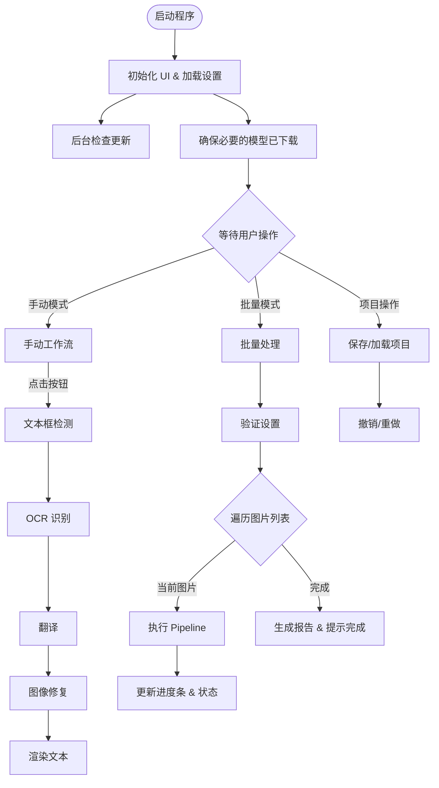

## 类结构

```
ComicTranslateUI (基类 - 抽象窗口)
└── ComicTranslate (主控制器)
```

## 全局变量及字段


### `temp_dir`
    
程序运行时创建的临时目录，用于存放临时文件

类型：`str`
    


### `_manual_dirty`
    
标记项目是否有手动产生的未保存修改

类型：`bool`
    


### `_batch_active`
    
标记批量处理是否正在进行

类型：`bool`
    


### `ComicTranslate.blk_list`
    
当前图像的文本块列表

类型：`list[TextBlock]`
    


### `ComicTranslate.curr_tblock`
    
当前选中的文本块

类型：`TextBlock`
    


### `ComicTranslate.curr_tblock_item`
    
当前选中的文本项 UI 对象

类型：`TextBlockItem`
    


### `ComicTranslate.image_files`
    
所有加载的图片路径

类型：`list`
    


### `ComicTranslate.selected_batch`
    
批量处理选中的图片

类型：`list`
    


### `ComicTranslate.curr_img_idx`
    
当前图片索引

类型：`int`
    


### `ComicTranslate.image_states`
    
存储每张图的目标语言、状态等

类型：`dict`
    


### `ComicTranslate.image_data`
    
存储图像的原始数据

类型：`dict`
    


### `ComicTranslate.image_history`
    
图像文件路径历史

类型：`dict`
    


### `ComicTranslate.in_memory_history`
    
内存中的图像操作历史（撤销用）

类型：`dict`
    


### `ComicTranslate.current_history_index`
    
每张图在历史记录中的当前位置

类型：`dict`
    


### `ComicTranslate.displayed_images`
    
已显示图像的集合

类型：`set`
    


### `ComicTranslate.image_patches`
    
存储每张图的图像块

类型：`dict`
    


### `ComicTranslate.in_memory_patches`
    
内存中每张图的图像块

类型：`dict`
    


### `ComicTranslate.image_cards`
    
图像卡片列表

类型：`list`
    


### `ComicTranslate.current_card`
    
当前选中的卡片

类型：`object`
    


### `ComicTranslate.max_images_in_memory`
    
内存中最大图像数量

类型：`int`
    


### `ComicTranslate.loaded_images`
    
已加载的图像列表

类型：`list`
    


### `ComicTranslate.undo_group`
    
全局撤销栈组

类型：`QUndoGroup`
    


### `ComicTranslate.undo_stacks`
    
每个文件的独立撤销栈

类型：`dict[str, QUndoStack]`
    


### `ComicTranslate.project_file`
    
项目文件对象

类型：`object`
    


### `ComicTranslate._skip_close_prompt`
    
跳过关闭提示标志

类型：`bool`
    


### `ComicTranslate.pipeline`
    
核心翻译处理管道

类型：`ComicTranslatePipeline`
    


### `ComicTranslate.file_handler`
    
文件处理与归档工具

类型：`FileHandler`
    


### `ComicTranslate.threadpool`
    
Qt 线程池

类型：`QThreadPool`
    


### `ComicTranslate.current_worker`
    
当前正在运行的工作线程

类型：`object`
    


### `ComicTranslate._batch_cancel_requested`
    
批量处理取消请求标志

类型：`bool`
    


### `ComicTranslate.image_ctrl`
    
图像状态与加载控制器

类型：`ImageStateController`
    


### `ComicTranslate.rect_item_ctrl`
    
矩形选择框控制器

类型：`RectItemController`
    


### `ComicTranslate.project_ctrl`
    
项目保存/加载控制器

类型：`ProjectController`
    


### `ComicTranslate.text_ctrl`
    
文本编辑与渲染控制器

类型：`TextController`
    


### `ComicTranslate.webtoon_ctrl`
    
条漫模式控制器

类型：`WebtoonController`
    


### `ComicTranslate.search_ctrl`
    
搜索替换控制器

类型：`SearchReplaceController`
    


### `ComicTranslate.task_runner_ctrl`
    
任务线程管理控制器

类型：`TaskRunnerController`
    


### `ComicTranslate.batch_report_ctrl`
    
批量处理报告控制器

类型：`BatchReportController`
    


### `ComicTranslate.manual_workflow_ctrl`
    
手动流程步骤控制器

类型：`ManualWorkflowController`
    
    

## 全局函数及方法


### `ensure_mandatory_models`

该函数是模块级调用，在应用程序启动时立即执行，用于确保项目所需的所有强制 AI 模型（如 OCR、翻译、图像处理模型等）已下载到本地。如果模型缺失，该函数会自动触发下载流程，并将下载状态通过信号传递给 UI 层，以显示下载进度或状态信息。

参数： 无

返回值： `None`，该函数不返回任何值，仅执行模型检查和可能的下载操作。

#### 流程图

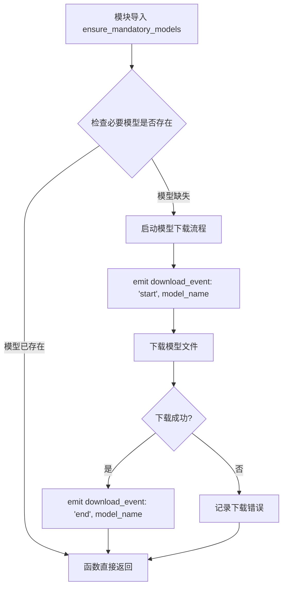

#### 带注释源码

```python
# 从 modules.utils.download 模块导入该函数
# 该模块负责处理模型的下载和管理
from modules.utils.download import mandatory_models, set_download_callback, ensure_mandatory_models

# ...

# 模块级调用：在应用程序启动时立即执行
# 确保任何预声明的必要模型都已下载
# 这是应用程序初始化流程的第一步之一
# 在 UI 类实例化之前执行，以确保模型随时可用
ensure_mandatory_models()

# ...

class ComicTranslate(ComicTranslateUI):
    # ... 类定义 ...
    
    def __init__(self, parent=None):
        # ... 初始化代码 ...
        
        # 设置下载回调，使 utils 模块能够跨线程安全地通知 UI 层
        # 当模型下载状态改变时，UI 可以实时更新显示
        def _dl_cb(status: str, name: str):
            # 确保跨线程安全地发出信号
            try:
                self.download_event.emit(status, name)
            except Exception:
                pass
        set_download_callback(_dl_cb)
    
    # ...
    
    def on_download_event(self, status: str, name: str):
        """
        处理模型下载事件的槽函数
        用于在 UI 中显示下载状态信息
        
        参数:
            status: 下载状态字符串 ('start' 或 'end')
            name: 模型文件名称
        """
        # 维护活跃下载计数器以处理多个文件
        if not hasattr(self, "_active_downloads"):
            self._active_downloads = 0
        if not hasattr(self, "_download_message"):
            self._download_message = None

        if status == 'start':
            self._active_downloads += 1
            # 如果尚未显示，则创建持久加载消息
            if self._download_message is None:
                try:
                    filename = os.path.basename(name)
                    self._download_message = MMessage.loading(
                        self.tr(f"Downloading model file: {filename}"), 
                        parent=self
                    )
                except Exception:
                    pass
        elif status == 'end':
            self._active_downloads = max(0, self._active_downloads - 1)
            if self._active_downloads == 0:
                # 关闭加载消息
                try:
                    if self._download_message is not None:
                        self._download_message.close()
                finally:
                    self._download_message = None
```


### `ComicTranslate.__init__`

初始化ComicTranslate应用主窗口，设置窗口属性（标题、图标），初始化数据结构（图像列表、历史记录、补丁存储等），实例化多个控制器（图像、矩形项、项目、文本、网络漫画、搜索替换、任务运行器、批处理报告、手动工作流），连接Qt信号与槽，加载项目设置和配置，并设置全局下载回调以支持后台模型下载通知。

参数：

- `parent`：`PySide6.QtWidgets.QWidget`，父窗口控件，默认为None，用于建立Qt对象层级关系

返回值：无返回值（构造函数）

#### 流程图

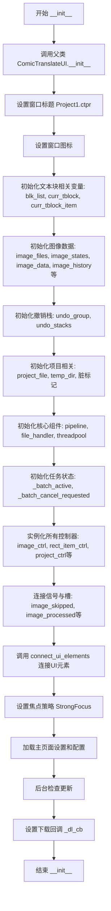

#### 带注释源码

```python
def __init__(self, parent=None):
    # 调用父类 ComicTranslateUI 的初始化方法，传递 parent 参数
    super(ComicTranslate, self).__init__(parent)
    # 设置窗口标题，[*] 表示窗口有未保存修改时的标记
    self.setWindowTitle("Project1.ctpr[*]")

    # 显式设置窗口图标，确保在启动画面之后仍能正确显示
    current_file_dir = os.path.dirname(os.path.abspath(__file__))
    icon_path = os.path.join(current_file_dir, 'resources', 'icons', 'icon.ico')
    self.setWindowIcon(QIcon(icon_path))

    # === 文本块相关变量 ===
    self.blk_list: list[TextBlock] = []       # 存储当前图像的所有文本块
    self.curr_tblock: TextBlock = None        # 当前选中的文本块对象
    self.curr_tblock_item: TextBlockItem = None  # 当前选中的文本块UI项

    # === 图像数据管理 ===
    self.image_files = []                      # 所有加载的图像文件路径列表
    self.selected_batch = []                   # 用户选中的待处理图像列表
    self.curr_img_idx = -1                     # 当前查看的图像索引
    self.image_states = {}                     # 每张图像的状态信息（目标语言等）
    self.image_data = {}                       # 存储每张图像的最新版本数据
    self.image_history = {}                    # 存储所有图像的文件路径历史
    self.in_memory_history = {}                # 存储近期图像的历史记录（内存中）
    self.current_history_index = {}            # 每张图像在历史记录中的当前位置
    self.displayed_images = set()              # 已显示的图像集合（去重）
    self.image_patches = {}                    # 每张图像的修复补丁（持久化）
    self.in_memory_patches = {}                # 每张图像的修复补丁（内存中）
    self.image_cards = []                      # 页面列表中的图像卡片项
    self.current_card = None                  # 当前选中的图像卡片
    self.max_images_in_memory = 10             # 内存中最多保留的图像数量
    self.loaded_images = []                    # 已加载到内存的图像数据

    # === 撤销/重做功能 ===
    self.undo_group = QUndoGroup(self)          # 全局撤销组，管理多个撤销栈
    self.undo_stacks: dict[str, QUndoStack] = {}  # 每张图像对应的撤销栈

    # === 项目管理 ===
    self.project_file = None                  # 当前项目文件路径
    self.temp_dir = tempfile.mkdtemp()         # 临时目录，用于存放临时文件
    self._manual_dirty = False                 # 手动标记的脏状态（未保存修改）
    self._skip_close_prompt = False            # 跳过关闭提示的标志

    # === 核心处理组件 ===
    self.pipeline = ComicTranslatePipeline(self)  # 翻译处理管道
    self.file_handler = FileHandler()          # 文件处理工具类
    self.threadpool = QThreadPool()            # Qt线程池，用于并发任务
    self.current_worker = None                # 当前运行的工作线程
    self._batch_active = False                 # 批处理是否正在进行
    self._batch_cancel_requested = False       # 用户是否请求取消批处理

    # === 实例化所有控制器 ===
    self.image_ctrl = ImageStateController(self)          # 图像状态管理
    self.rect_item_ctrl = RectItemController(self)        # 矩形框项目管理
    self.project_ctrl = ProjectController(self)           # 项目文件管理
    self.text_ctrl = TextController(self)                 # 文本编辑管理
    self.webtoon_ctrl = WebtoonController(self)            # 网络漫画模式管理
    self.search_ctrl = SearchReplaceController(self)       # 搜索替换功能
    self.task_runner_ctrl = TaskRunnerController(self)     # 任务运行器
    self.batch_report_ctrl = BatchReportController(self)   # 批处理报告
    self.manual_workflow_ctrl = ManualWorkflowController(self)  # 手动工作流

    # === 连接信号与槽 ===
    # 图像处理相关信号
    self.image_skipped.connect(self.image_ctrl.on_image_skipped)
    self.image_processed.connect(self.image_ctrl.on_image_processed)
    self.patches_processed.connect(self.image_ctrl.on_inpaint_patches_processed)
    self.progress_update.connect(self.update_progress)
    self.blk_rendered.connect(self.text_ctrl.on_blk_rendered)
    self.render_state_ready.connect(self.image_ctrl.on_render_state_ready)
    # 下载事件信号
    self.download_event.connect(self.on_download_event)

    # === 连接UI元素 ===
    self.connect_ui_elements()
    # 设置焦点策略，支持键盘导航
    self.setFocusPolicy(QtCore.Qt.FocusPolicy.StrongFocus)

    # === 加载设置 ===
    self.project_ctrl.load_main_page_settings()  # 加载主页面设置
    self.settings_page.load_settings()          # 加载应用设置
    
    # 后台检查更新
    self.settings_page.check_for_updates(is_background=True)

    # 标志：防止递归处理页面切换
    self._processing_page_change = False

    # === 设置全局下载回调 ===
    # Hook全局下载回调，使utils模块能够通知主线程下载进度
    def _dl_cb(status: str, name: str):
        # 确保跨线程安全地发送信号
        try:
            self.download_event.emit(status, name)
        except Exception:
            pass
    set_download_callback(_dl_cb)
```


### ComicTranslate.connect_ui_elements

该方法承担着将 UI 层（各种按钮、浏览器组件、下拉框等）与业务逻辑层（各类 Controller）进行信号槽连接的核心职责，是实现 MVVM 架构中 View 与 Model 交互的关键桥梁。通过此方法，用户在界面上的一切操作（点击、选择、输入）都会被路由到对应的 Controller 进行处理。

参数：此方法不接受任何外部传入参数。

返回值：`None`，该方法仅执行副作用（连接信号槽），不返回任何数据。

#### 流程图

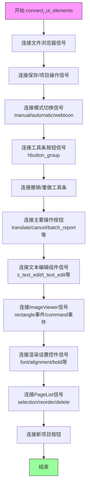

#### 带注释源码

```python
def connect_ui_elements(self):
    """
    绑定所有 UI 控件的信号（Signals）与业务逻辑槽（Slots）。
    该方法是 UI 层与业务层解耦的核心，使得 UI 事件能够触发对应的 Controller 方法。
    """
    # --- 1. 文件浏览相关 (Browsers) ---
    # 绑定多个文件浏览器按钮的信号，当用户选择文件时触发异步加载
    self.image_browser_button.sig_files_changed.connect(self.image_ctrl.thread_load_images)
    self.document_browser_button.sig_files_changed.connect(self.image_ctrl.thread_load_images)
    self.archive_browser_button.sig_files_changed.connect(self.image_ctrl.thread_load_images)
    self.comic_browser_button.sig_files_changed.connect(self.image_ctrl.thread_load_images)
    # 项目文件浏览器，触发项目加载流程
    self.project_browser_button.sig_file_changed.connect(self.project_ctrl.thread_load_project)
    # 插入功能浏览器
    self.insert_browser_button.sig_files_changed.connect(self.image_ctrl.thread_insert)

    # --- 2. 保存操作相关 ---
    # 保存当前图像
    self.save_browser.sig_file_changed.connect(self.image_ctrl.save_current_image)
    # 另存为并打包
    self.save_all_browser.sig_file_changed.connect(self.project_ctrl.save_and_make)
    # 保存项目（线程方式）
    self.save_project_button.clicked.connect(self.project_ctrl.thread_save_project)
    # 另存项目
    self.save_as_project_button.clicked.connect(self.project_ctrl.thread_save_as_project)
    # 拖拽区域加载，加载前检查是否有未保存的更改
    self.drag_browser.sig_files_changed.connect(self._guarded_thread_load_images)
   
    # --- 3. 工作模式切换 ---
    # 手动模式（单图处理）
    self.manual_radio.clicked.connect(self.manual_mode_selected)
    # 自动/批量模式
    self.automatic_radio.clicked.connect(self.batch_mode_selected)
    # Webtoon 模式开关
    self.webtoon_toggle.clicked.connect(self.webtoon_ctrl.toggle_webtoon_mode)

    # --- 4. 主要工具条按钮 (hbutton_group) ---
    # 依次为：文本块检测、OCR、翻译、分割点加载、修复与设置、渲染文本
    self.hbutton_group.get_button_group().buttons()[0].clicked.connect(lambda: self.block_detect())
    self.hbutton_group.get_button_group().buttons()[1].clicked.connect(self.ocr)
    self.hbutton_group.get_button_group().buttons()[2].clicked.connect(self.translate_image)
    self.hbutton_group.get_button_group().buttons()[3].clicked.connect(self.load_segmentation_points)
    self.hbutton_group.get_button_group().buttons()[4].clicked.connect(self.inpaint_and_set)
    self.hbutton_group.get_button_group().buttons()[5].clicked.connect(self.text_ctrl.render_text)

    # --- 5. 撤销/重做工具条 ---
    self.undo_tool_group.get_button_group().buttons()[0].clicked.connect(self.undo_group.undo)
    self.undo_tool_group.get_button_group().buttons()[1].clicked.connect(self.undo_group.redo)

    # --- 6. 其他操作按钮 ---
    # 批量翻译开始
    self.translate_button.clicked.connect(self.start_batch_process)
    # 取消当前任务
    self.cancel_button.clicked.connect(self.cancel_current_task)
    # 显示最新批次报告
    self.batch_report_button.clicked.connect(self.show_latest_batch_report)
    # 设置所有文本块源/目标
    self.set_all_button.clicked.connect(self.text_ctrl.set_src_trg_all)
    # 清除矩形框
    self.clear_rectangles_button.clicked.connect(self.image_viewer.clear_rectangles)
    # 清除笔触
    self.clear_brush_strokes_button.clicked.connect(self.image_viewer.clear_brush_strokes)
    # 绘制文本块列表
    self.draw_blklist_blks.clicked.connect(lambda: self.pipeline.load_box_coords(self.blk_list))
    # 调整所有块大小（减小/增加）
    self.change_all_blocks_size_dec.clicked.connect(lambda: self.text_ctrl.change_all_blocks_size(-int(self.change_all_blocks_size_diff.text())))
    self.change_all_blocks_size_inc.clicked.connect(lambda: self.text_ctrl.change_all_blocks_size(int(self.change_all_blocks_size_diff.text())))
    # 删除选中的框
    self.delete_button.clicked.connect(self.delete_selected_box)

    # --- 7. 文本编辑组件 ---
    # 源文本编辑改变时更新 TextBlock
    self.s_text_edit.textChanged.connect(self.text_ctrl.update_text_block)
    # 目标文本编辑改变时更新（处理翻译后修改）
    self.t_text_edit.textChanged.connect(self.text_ctrl.update_text_block_from_edit)

    # 源语言/目标语言组合框改变时保存设置
    self.s_combo.currentTextChanged.connect(self.text_ctrl.save_src_trg)
    self.t_combo.currentTextChanged.connect(self.text_ctrl.save_src_trg)

    # --- 8. 图像查看器 (ImageViewer) 信号 ---
    # 矩形选择/创建/删除事件
    self.image_viewer.rectangle_selected.connect(self.rect_item_ctrl.handle_rectangle_selection)
    self.image_viewer.rectangle_created.connect(self.rect_item_ctrl.handle_rectangle_creation)
    self.image_viewer.rectangle_deleted.connect(self.rect_item_ctrl.handle_rectangle_deletion)
    # 接收命令（如删除命令）
    self.image_viewer.command_emitted.connect(self.push_command)
    # 连接 RectItem 信号
    self.image_viewer.connect_rect_item.connect(self.rect_item_ctrl.connect_rect_item_signals)
    # 连接 TextItem 信号
    self.image_viewer.connect_text_item.connect(self.text_ctrl.connect_text_item_signals)
    # 页面改变（Webtoon 模式）
    self.image_viewer.page_changed.connect(self.webtoon_ctrl.on_page_changed)
    # 清除文本编辑框
    self.image_viewer.clear_text_edits.connect(self.text_ctrl.clear_text_edits)

    # --- 9. 渲染设置相关 ---
    # 字体/字号/行距下拉框
    self.font_dropdown.currentTextChanged.connect(self.text_ctrl.on_font_dropdown_change)
    self.font_size_dropdown.currentTextChanged.connect(self.text_ctrl.on_font_size_change)
    self.line_spacing_dropdown.currentTextChanged.connect(self.text_ctrl.on_line_spacing_change)
    # 字体颜色按钮
    self.block_font_color_button.clicked.connect(self.text_ctrl.on_font_color_change)
    # 对齐工具组
    self.alignment_tool_group.get_button_group().buttons()[0].clicked.connect(self.text_ctrl.left_align)
    self.alignment_tool_group.get_button_group().buttons()[1].clicked.connect(self.text_ctrl.center_align)
    self.alignment_tool_group.get_button_group().buttons()[2].clicked.connect(self.text_ctrl.right_align)
    # 样式按钮
    self.bold_button.clicked.connect(self.text_ctrl.bold)
    self.italic_button.clicked.connect(self.text_ctrl.italic)
    self.underline_button.clicked.connect(self.text_ctrl.underline)
    # 描边设置
    self.outline_font_color_button.clicked.connect(self.text_ctrl.on_outline_color_change)
    self.outline_width_dropdown.currentTextChanged.connect(self.text_ctrl.on_outline_width_change)
    self.outline_checkbox.stateChanged.connect(self.text_ctrl.toggle_outline_settings)

    # --- 10. 页面列表 (Page List) ---
    # 选中项改变
    self.page_list.currentItemChanged.connect(self.image_ctrl.on_card_selected)
    # 选择改变（多选）
    self.page_list.selection_changed.connect(self.image_ctrl.on_selection_changed)
    # 顺序改变（拖拽排序）
    self.page_list.order_changed.connect(self.image_ctrl.handle_image_reorder)
    # 删除图片
    self.page_list.del_img.connect(self.image_ctrl.handle_image_deletion)
    # 插入浏览器
    self.page_list.insert_browser.sig_files_changed.connect(self.image_ctrl.thread_insert)
    # 切换跳过图片
    self.page_list.toggle_skip_img.connect(self.image_ctrl.handle_toggle_skip_images)
    # 批量翻译选中项
    self.page_list.translate_imgs.connect(self.batch_translate_selected)

    # --- 11. 新建项目 ---
    self.new_project_button.clicked.connect(self._on_new_project_clicked)
```


### `ComicTranslate.start_batch_process`

该方法负责启动全图的批量翻译流程。它首先遍历所有待翻译的图片，校验翻译设置（如API Key、目标语言）是否有效；若校验失败则直接中止。校验通过后，该方法会初始化进度条、禁用“翻译”按钮、启用“取消”按钮，并在线程池中异步调用 `ComicTranslatePipeline` 的批处理方法（根据是否处于 Webtoon 模式选择 `batch_process` 或 `webtoon_batch_process`），从而实现非阻塞的批量翻译。

参数：

- `self`：`ComicTranslate`，隐式参数，指向当前主窗口类的实例。

返回值：`None`，该方法仅负责启动异步任务并更新UI状态，不返回具体的翻译结果。

#### 流程图

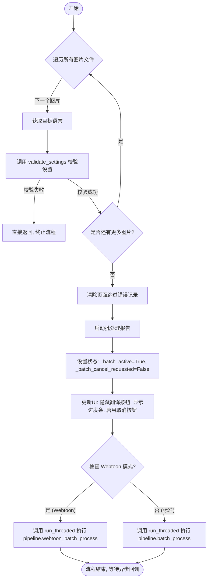

#### 带注释源码

```python
def start_batch_process(self):
    # 1. 预检阶段：遍历所有已加载的图片，验证翻译设置是否合法（如API Key是否存在，目标语言是否支持）
    for image_path in self.image_files:
        # 从图片状态字典中获取该图片的目标语言
        target_lang = self.image_states[image_path]['target_lang']
        # 全局校验设置，如果不通过则直接退出，不启动翻译
        if not validate_settings(self, target_lang):
            return

    # 2. 初始化批处理环境：清除之前的跳过错误信息
    self.image_ctrl.clear_page_skip_errors_for_paths(self.image_files)
    
    # 3. 启动报告系统，记录本次批处理的元数据
    self._start_batch_report(self.image_files)
    
    # 4. 设置内部状态标志，表示批处理正在进行中
    self._batch_active = True
    self._batch_cancel_requested = False
    
    # 5. UI 更新：防止用户重复点击，并给出进度提示
    self.translate_button.setEnabled(False)  # 禁用翻译按钮
    self.cancel_button.setEnabled(True)      # 启用取消按钮
    self.progress_bar.setVisible(True)       # 显示进度条
    
    # 6. 选择核心执行逻辑：根据当前是否为 Webtoon 模式，选择不同的处理管道
    if self.webtoon_mode:
        # Webtoon 模式：执行 Webtoon 批量处理
        # 使用 run_threaded 放入后台线程执行，传入错误处理回调和完成回调
        self.run_threaded(self.pipeline.webtoon_batch_process, None, self.default_error_handler, self.on_batch_process_finished)
    else:
        # 标准漫画模式：执行普通批量处理
        self.run_threaded(self.pipeline.batch_process, None, self.default_error_handler, self.on_batch_process_finished)
```


### `ComicTranslate.batch_translate_selected`

该方法用于批量翻译用户选中的特定图片文件，在翻译前会验证目标语言设置、更新UI状态，并根据是否处于Webtoon模式选择相应的批量处理管道执行翻译任务。

参数：

- `selected_file_names`：`list[str]`，待翻译的图片文件名列表（仅包含文件名basename，而非完整路径）

返回值：`None`，该方法通过信号槽机制异步执行翻译任务，无直接返回值

#### 流程图

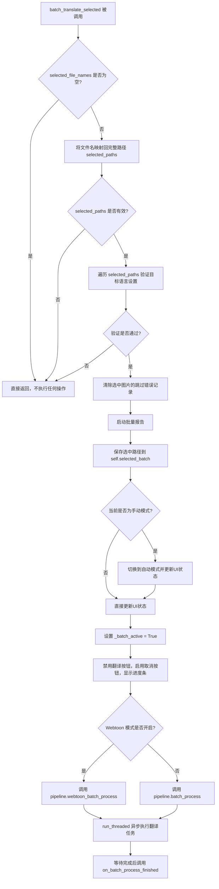

#### 带注释源码

```python
def batch_translate_selected(self, selected_file_names: list[str]):
    """
    批量翻译选中的图片
    
    参数:
        selected_file_names: 待翻译的图片文件名列表（basename）
    """
    # 将文件名basename映射回完整文件路径
    selected_paths = [
        p for p in self.image_files
        if os.path.basename(p) in selected_file_names
    ]
    
    # 如果没有有效的选中路径，直接返回
    if not selected_paths:
        return

    # 验证每个选中图片的目标语言设置是否有效
    for path in selected_paths:
        tgt = self.image_states[path]['target_lang']
        if not validate_settings(self, tgt):
            return
        
    # 清除选中图片页面的跳过错误记录
    self.image_ctrl.clear_page_skip_errors_for_paths(selected_paths)
    
    # 启动批量处理报告，记录待处理的图片列表
    self._start_batch_report(selected_paths)
    
    # 保存选中的图片路径到实例变量，供后续处理使用
    self.selected_batch = selected_paths

    # 如果当前是手动模式，切换到自动批处理模式
    if self.manual_radio.isChecked():
        self.automatic_radio.setChecked(True)
        self.batch_mode_selected()
    
    # 设置批处理状态标志
    self._batch_active = True
    self._batch_cancel_requested = False
    
    # 更新UI状态：禁用翻译按钮，启用取消按钮，显示进度条
    self.translate_button.setEnabled(False)
    self.cancel_button.setEnabled(True)
    self.progress_bar.setVisible(True)
    
    # 根据Webtoon模式选择对应的批处理管道
    if self.webtoon_mode:
        # Webtoon模式：调用Webtoon专用的批处理方法
        self.run_threaded(
            lambda: self.pipeline.webtoon_batch_process(selected_paths),
            None,
            self.default_error_handler,
            self.on_batch_process_finished
        )
    else:
        # 标准模式：调用标准批处理方法
        self.run_threaded(
            lambda: self.pipeline.batch_process(selected_paths),
            None,
            self.default_error_handler,
            self.on_batch_process_finished
        )
```


### `ComicTranslate.run_threaded`

该方法是一个委托封装器（Facade），用于将耗时的后台任务及其关联的回调函数（成功、失败、完成）委托给内部的 `TaskRunnerController` 进行处理，从而实现任务的线程池调度执行。

参数：

- `callback`：`Callable`，主任务函数，包含需要在后台线程中执行的逻辑（例如 `self.pipeline.batch_process`）。
- `result_callback`：`Callable | None`，可选参数，任务成功执行完成后的回调函数，用于处理返回结果。
- `error_callback`：`Callable | None`，可选参数，任务执行过程中发生异常时的回调函数，用于处理错误。
- `finished_callback`：`Callable | None`，可选参数，任务无论成功或失败都需要执行时的回调函数，通常用于资源清理或 UI 状态重置。
- `*args`：`Any`，可变位置参数，将传递给 `callback` 函数。
- `**kwargs`：`Any`，可变关键字参数，将传递给 `callback` 函数。

返回值：`Any`，返回内部 `TaskRunnerController.run_threaded` 方法的执行结果（通常为 None 或任务标识符）。

#### 流程图

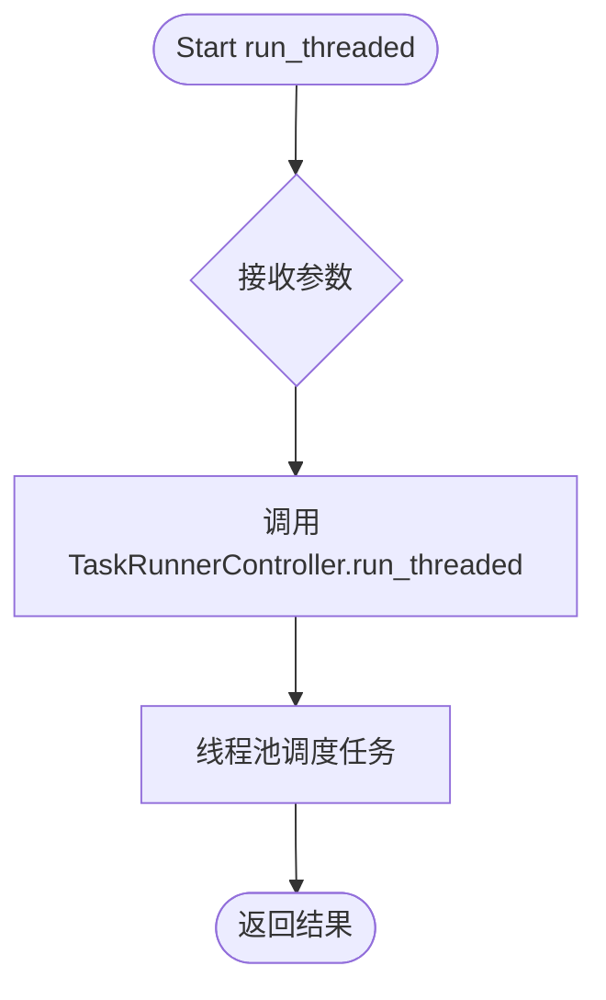

#### 带注释源码

```python
def run_threaded(self, callback: Callable, result_callback: Callable=None,
                error_callback: Callable=None, finished_callback: Callable=None,
                *args, **kwargs):
    """
    将任务委托给 TaskRunnerController 在后台线程池中执行。

    Args:
        callback: 需要在后台执行的核心逻辑函数。
        result_callback: 成功时的回调。
        error_callback: 异常时的回调。
        finished_callback: 结束时的回调。
        *args, **kwargs: 传递给 callback 的参数。

    Returns:
        委托操作的结果。
    """
    # 将所有任务相关的参数传递给任务控制器，由控制器负责具体的线程管理
    return self.task_runner_ctrl.run_threaded(
        callback, result_callback, error_callback, finished_callback, *args, **kwargs
    )
```


### `ComicTranslate.cancel_current_task`

该方法用于取消当前正在运行的任务，通过委托给任务运行器控制器来执行取消操作。

参数：
- （无显式参数，隐式参数 `self` 为 `ComicTranslate` 类型，表示当前实例）

返回值：`None`，无返回值

#### 流程图

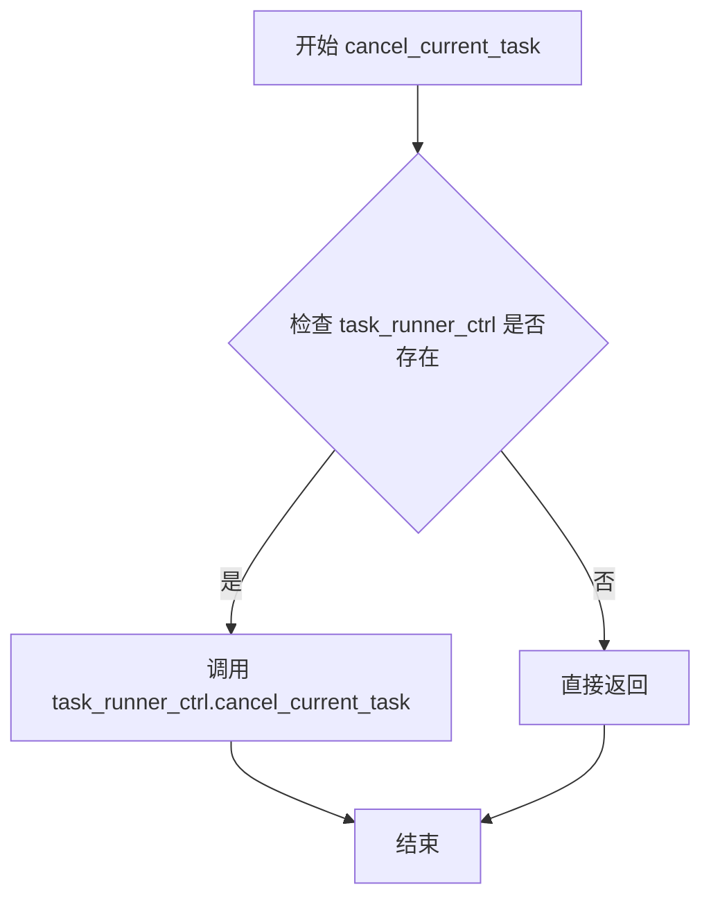

#### 带注释源码

```python
def cancel_current_task(self):
    """取消当前正在运行的任务。
    
    该方法通过委托给 task_runner_ctrl 对象来执行实际的取消操作。
    主要用于用户请求取消正在进行的批处理或手动工作流任务。
    """
    self.task_runner_ctrl.cancel_current_task()
```


### `ComicTranslate.block_detect`

该方法是手动模式下“文本框检测”按钮的响应槽函数（Slot）。它主要负责将文本框检测的请求委托给 `ManualWorkflowController` 实例来执行实际的检测逻辑，并根据参数 `load_rects` 决定是否加载现有的矩形坐标。

参数：

-  `load_rects`：`bool`，默认为 `True`。如果为 `True`，则尝试从当前图像状态中加载已有的矩形框；如果为 `False`，则清空现有矩形并进行新的检测。

返回值：`None`，无返回值。

#### 流程图

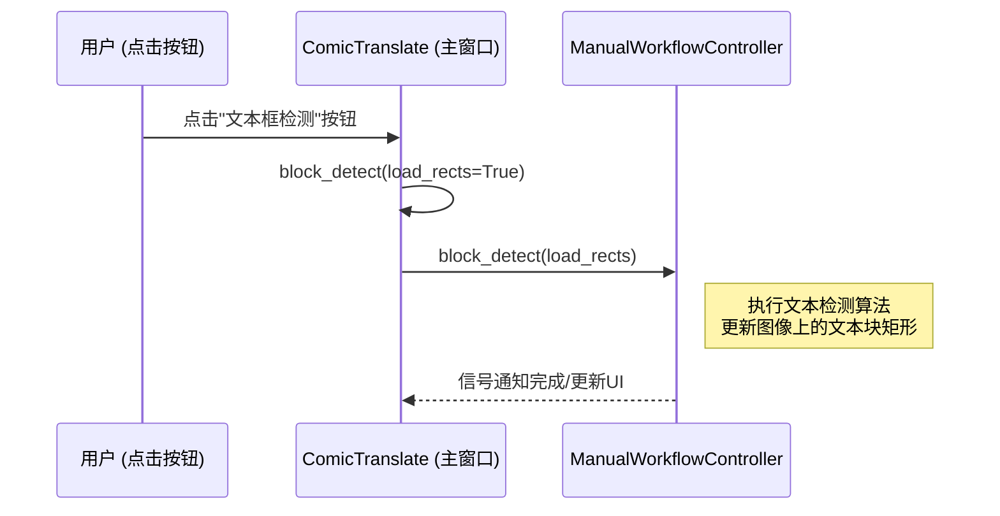

#### 带注释源码

```python
def block_detect(self, load_rects: bool = True):
    """
    手动工作流的文本框检测入口。

    参数:
        load_rects (bool): 默认为 True。如果为 True，加载当前已存在的矩形框坐标；
                           如果为 False，则忽略现有坐标，进行全新的检测。
    """
    # 委托给 ManualWorkflowController 执行具体的检测逻辑
    self.manual_workflow_ctrl.block_detect(load_rects)
```


### `ComicTranslate.ocr`

该方法是一个委托方法，用于执行 OCR（光学字符识别）识别功能。它将实际的 OCR 处理工作委托给 `ManualWorkflowController` 对象来完成，支持对单个文本块或多个文本块进行识别。

参数：

- `single_block`：`bool` 类型，默认为 `False`，表示是否只对当前选中的单个文本块进行 OCR 识别。当为 `True` 时仅处理当前文本块，为 `False` 时处理图像中的所有文本块。

返回值：`None`，该方法没有返回值，仅执行委托调用。

#### 流程图

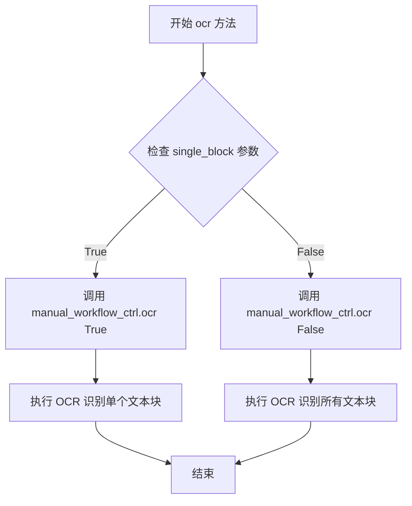

#### 带注释源码

```python
def ocr(self, single_block=False):
    """
    执行 OCR 识别功能。
    
    该方法是一个委托方法，将 OCR 识别任务委托给 ManualWorkflowController 处理。
    支持两种模式：单文本块识别和全图像文本识别。
    
    参数:
        single_block: bool, 默认为 False
            - True: 仅对当前选中的文本块进行 OCR 识别
            - False: 对当前图像中的所有文本块进行 OCR 识别
    
    返回值:
        None: 该方法不返回任何值，结果通过信号/槽机制传递
    """
    # 将 OCR 处理委托给 manual_workflow_ctrl 对象
    # 实际的 OCR 识别逻辑在 ManualWorkflowController.ocr 方法中实现
    self.manual_workflow_ctrl.ocr(single_block)
```


### `ComicTranslate.translate_image`

该方法是 ComicTranslate 类中的一个委托方法，用于执行单张图像的翻译操作。它将翻译请求转发给 `ManualWorkflowController` 进行处理，支持单块文本翻译和批量翻译两种模式。

参数：

- `single_block`：`bool`，可选参数，默认为 False。当设置为 True 时，表示仅翻译当前选中的单个文本块；当设置为 False 时，表示翻译当前图像中的所有文本块。

返回值：`None`，该方法没有返回值，通过信号槽机制更新 UI 状态。

#### 流程图

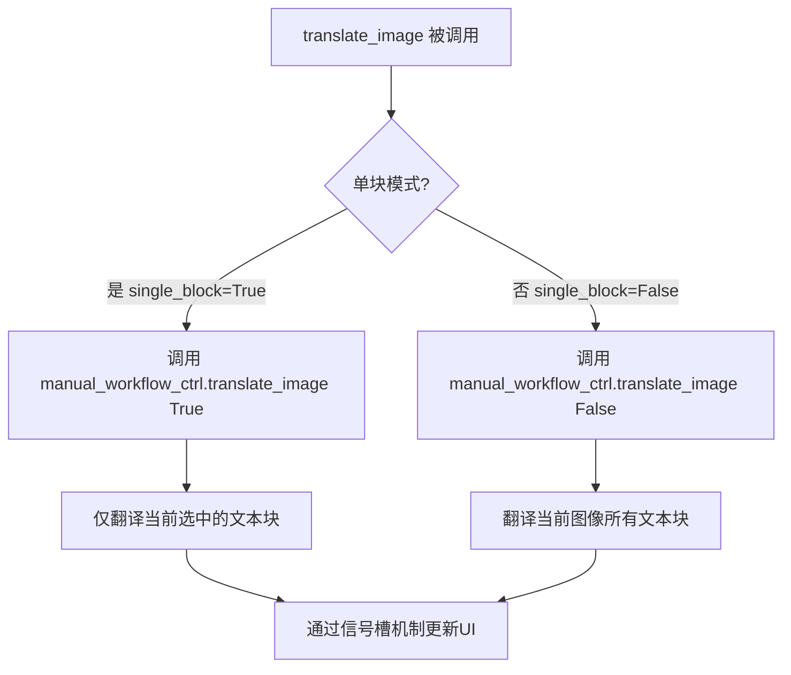

#### 带注释源码

```python
def translate_image(self, single_block=False):
    """
    执行图像翻译操作
    
    参数:
        single_block: bool, 默认为False。
                     True-仅翻译当前选中的单个文本块
                     False-翻译当前图像中的所有文本块
    
    返回:
        None (无返回值，通过信号槽机制更新状态)
    """
    # 委托给 ManualWorkflowController 处理具体的翻译逻辑
    # 该控制器封装了完整的翻译流程，包括：
    # - 调用 OCR 识别文本
    # - 调用翻译 API
    # - 处理翻译结果
    # - 更新 UI 显示
    self.manual_workflow_ctrl.translate_image(single_block)
```

#### 补充说明

该方法是一个典型的**委托模式（Delegate Pattern）**实现，将具体的翻译业务逻辑委托给 `ManualWorkflowController` 类处理。这种设计的好处是：

1. **职责分离**：主窗口类（ComicTranslate）专注于 UI 管理和事件协调，业务逻辑委托给专用控制器
2. **代码复用**：`ManualWorkflowController` 可以被其他模块复用，不依赖于特定的 UI 框架
3. **便于测试**：可以独立测试业务逻辑层，不涉及 UI 组件

方法通过 Qt 的信号槽机制与 UI 进行通信，具体的翻译进度和结果会通过信号（如 `progress_update`、`blk_rendered` 等）反馈到界面上。


### `ComicTranslate.inpaint_and_set`

该方法作为槽函数（Slot），连接至图形界面的“图像修复（Inpaint）”按钮。其核心功能为委托 `ManualWorkflowController` 执行图像修复操作，处理当前选中的图像区域（或文本块对应的区域），并将修复结果应用至当前图像上下文中。

参数：
- `self`：隐式参数，`ComicTranslate` 类实例本身。

返回值：`None`，该方法不直接返回值，而是通过信号槽机制触发后续的图像处理与更新流程。

#### 流程图

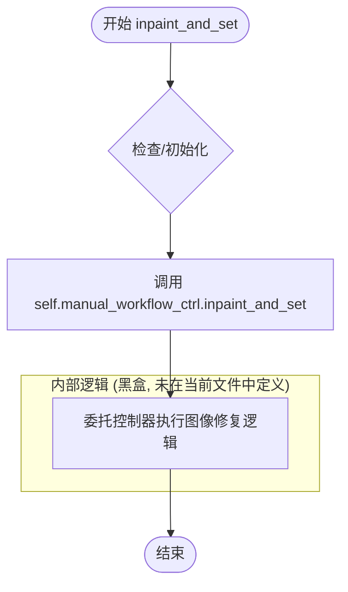

#### 带注释源码

```python
def inpaint_and_set(self):
    """
    槽函数：当用户点击界面上的 Inpaint 按钮时触发。
    该方法不直接处理具体的图像修复逻辑，而是将请求转发给_manual_workflow_ctrl
    (ManualWorkflowController 实例) 进行处理。
    
    典型的内部流程包括：
    1. 获取当前选中的文本块 (TextBlock) 或区域。
    2. 调用后端模型进行 Inpainting。
    3. 将修复后的图像 patch 应用到当前视图。
    """
    self.manual_workflow_ctrl.inpaint_and_set()
```


### `ComicTranslate.update_progress`

该方法是 ComicTranslate 类的核心进度更新逻辑，用于在批量处理图片或归档时计算并更新界面上的进度条。它会根据当前处理的任务类型（图片处理 vs 归档）和具体进度，结合预设的权重（图片处理占 90%，归档占 10%），计算出准确的完成百分比，并动态更新进度条显示的文本（如当前正在处理的文件名）。

参数：

- `index`：`int`，当前处理的图片或档案的索引。
- `total_images`：`int`，需要处理的图片总数。
- `step`：`int`，当前步骤的序号（例如 OCR 为第 1 步，翻译为第 2 步）。
- `total_steps`：`int`，总步骤数。
- `change_name`：`bool`，是否需要更新进度条上的文件名显示文本。

返回值：`None`，该方法直接修改 UI 组件，不返回数据。

#### 流程图

```mermaid
graph TD
    A([开始更新进度]) --> B{是否取消批次<br/>_batch_cancel_requested?}
    B -- 是 --> C([直接返回])
    B -- 否 --> D[获取权重与文件列表]
    
    D --> E{change_name 为真?}
    E -- 是 --> F{索引 < 图片总数?}
    F -- 是 --> G[设置格式: Processing: {文件名} ... %p%]
    F -- 否 --> H[设置格式: Archiving: {序号}/{总数} ... %p%]
    E -- 否 --> I[计算进度]
    
    G --> I
    H --> I
    
    I --> J{索引 < 图片总数?}
    
    J -- 是 --> K[计算图片处理进度<br/>Task: idx/total * 0.9<br/>Step: step/total * (1/total) * 0.9]
    J -- 否 --> L[计算归档进度<br/>Task: 0.9 + idx/total * 0.1<br/>Step: step/total * (1/total) * 0.1]
    
    K --> M[计算最终百分比<br/>progress = (task + step) * 100]
    L --> M
    
    M --> N[更新进度条数值<br/>setValue]
    N --> Z([结束])
```

#### 带注释源码

```python
def update_progress(self, index: int, total_images: int, step: int, total_steps: int, change_name: bool):
    # 如果用户请求取消批处理，则停止更新进度
    if self._batch_cancel_requested:
        return

    # 分配权重：图片处理占 90%，归档占 10%
    image_processing_weight = 0.9
    archiving_weight = 0.1

    # 获取归档信息列表和总数
    archive_info_list = self.file_handler.archive_info
    total_archives = len(archive_info_list)
    
    # 确定当前处理的图片列表（优先使用选中的批次，否则使用所有图片）
    image_list = self.selected_batch if self.selected_batch else self.image_files

    # 根据需要更新进度条上显示的文本名称
    if change_name:
        if index < total_images:
            # 当前正在处理图片
            im_path = image_list[index]
            im_name = os.path.basename(im_path)
            self.progress_bar.setFormat(QCoreApplication.translate('Messages', 'Processing:') + f" {im_name} . . . %p%")
        else:
            # 当前正在处理归档
            archive_index = index - total_images
            self.progress_bar.setFormat(QCoreApplication.translate('Messages', 'Archiving:') + f" {archive_index + 1}/{total_archives} . . . %p%")

    # 计算具体的进度数值
    if index < total_images:
        # 图片处理阶段的进度计算
        # 任务基础进度 + 当前步骤在总任务中的占比
        task_progress = (index / total_images) * image_processing_weight
        step_progress = (step / total_steps) * (1 / total_images) * image_processing_weight
    else:
        # 归档阶段的进度计算
        archive_index = index - total_images
        # 基础进度(已完成图片部分) + 归档进度
        task_progress = image_processing_weight + (archive_index / total_archives) * archiving_weight
        step_progress = (step / total_steps) * (1 / total_archives) * archiving_weight

    # 转换为百分比并更新 UI
    progress = (task_progress + step_progress) * 100 
    self.progress_bar.setValue(int(progress))
```


### `ComicTranslate.on_download_event`

处理模型/文件下载事件，根据下载状态（开始/结束）显示或关闭加载提示信息，管理多个并发下载的计数器。

参数：

- `status`：`str`，下载状态标识，'start' 表示开始下载，'end' 表示下载结束
- `name`：`str`，下载文件的完整路径或名称，用于提取文件名并显示在提示信息中

返回值：`None`，该方法无返回值，主要通过副作用（修改 UI 状态）完成功能

#### 流程图

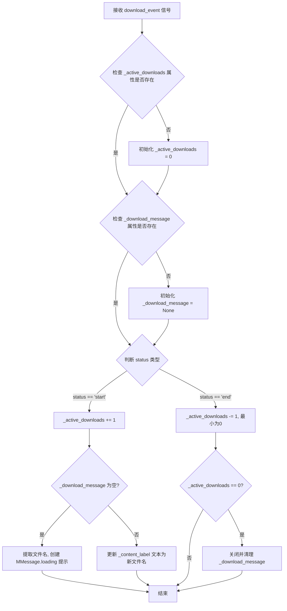

#### 带注释源码

```python
def on_download_event(self, status: str, name: str):
    """Show a loading-type MMessage while models/files are being downloaded."""
    # 维护一个活动下载计数器，用于处理多个文件同时下载的情况
    # 首次调用时初始化计数器
    if not hasattr(self, "_active_downloads"):
        self._active_downloads = 0
    # 首次调用时初始化消息对象引用
    if not hasattr(self, "_download_message"):
        self._download_message = None

    # 根据下载状态处理事件
    if status == 'start':
        # 下载开始，增加活动下载计数
        self._active_downloads += 1
        
        # 如果还没有显示下载提示消息，则创建一个持久化的加载提示
        if self._download_message is None:
            try:
                # 从完整路径中提取仅文件名部分
                import os
                filename = os.path.basename(name)
                # 创建带有文件名的加载提示框，父对象为当前窗口
                self._download_message = MMessage.loading(
                    self.tr(f"Downloading model file: {filename}"), 
                    parent=self
                )
            except Exception:
                # 如果无法显示加载提示，静默失败，避免影响全局 spinner
                pass
        else:
            # 已存在提示框时，更新文本显示当前正在下载的文件名
            try:
                import os
                filename = os.path.basename(name)
                # 访问内部 label 控件更新文本内容
                self._download_message._content_label.setText(
                    self.tr(f"Downloading model file: {filename}")
                )
            except Exception:
                pass
                
    elif status == 'end':
        # 下载结束，递减活动下载计数，确保不会小于0
        self._active_downloads = max(0, self._active_downloads - 1)
        
        # 当所有下载都完成时，关闭加载提示
        if self._active_downloads == 0:
            try:
                if self._download_message is not None:
                    # 关闭消息提示框
                    self._download_message.close()
            finally:
                # 清理消息对象引用
                self._download_message = None
                
        # 注意：此处不修改主窗口的 loading spinner，
        # 因为它由运行中的任务生命周期自行管理
```


### `ComicTranslate.closeEvent(event)`

该方法是 `ComicTranslate` 类对 Qt 窗口关闭事件的重写（Override）。它在用户关闭窗口时被自动触发，核心职责是充当程序退出前的“总cleanup”关口。它首先确保用户编辑的文本已提交，随后根据状态判断是否需要弹出“是否保存”的防误触对话框；若确认关闭，则执行一系列资源回收操作，包括停止后台线程、清理临时文件（解压的漫画缓存及应用工作目录）以及持久化当前界面和项目设置，最后交由 Qt 基类完成窗口的实际销毁。

参数：

-  `event`：`QCloseEvent` (PySide6.QtCore.QCloseEvent)，Qt 框架传入的关闭事件对象。用于控制是否接受（allow）或忽略（ignore）本次关闭请求。

返回值：`None`（无返回值）。该方法通过修改 `event` 的接受状态来控制流程，不返回任何数据。

#### 流程图

```mermaid
graph TD
    A([Start closeEvent]) --> B{Commit pending text}
    B --> C{_skip_close_prompt Flag?}
    
    C -- Yes --> D[Reset Flag]
    D --> H
    
    C -- No --> E{Unsaved Changes?}
    E -- No --> H
    E -- Yes --> F[Show Dialog: Save/Don't Save/Cancel]
    
    F --> G{Select}
    G -- Save --> I[Async Save Project & Wait]
    I --> J[event.ignore & Return]
    G -- Don't Save --> H
    G -- Cancel --> J
    
    H[Call self.shutdown] --> K[Save Settings & Project State]
    K --> L[Clean up Image Ctrl]
    L --> M[Delete Temp Archive Dirs]
    M --> N[Delete App temp_dir]
    N --> O[super().closeEvent]
    O --> P([End])
```

#### 带注释源码

```python
def closeEvent(self, event):
    """
    处理窗口关闭事件。
    流程：提交文本 -> 检查保存提示 -> 清理资源 -> 保存设置 -> 删除临时文件。
    """
    # 1. 尝试提交当前正在编辑的文本块，以防止未保存的文本输入丢失
    try:
        self.text_ctrl._commit_pending_text_command()
    except Exception:
        pass

    # 2. 检查是否应该跳过“未保存更改”的确认对话框
    # (该标志通常在保存操作成功后被设置为 True，以避免重复询问)
    if not getattr(self, "_skip_close_prompt", False):
        # 3. 检查项目是否有未保存的更改
        if self.has_unsaved_changes():
            # 4. 弹出模式对话框，询问用户操作
            msg_box = QtWidgets.QMessageBox(self)
            msg_box.setIcon(QtWidgets.QMessageBox.Question)
            msg_box.setWindowTitle(self.tr("Unsaved Changes"))
            msg_box.setText(self.tr("Save changes to this file?"))
            
            # 添加三个按钮：保存、不保存、取消
            save_btn = msg_box.addButton(self.tr("Save"), QtWidgets.QMessageBox.ButtonRole.AcceptRole)
            msg_box.addButton(self.tr("Don't Save"), QtWidgets.QMessageBox.ButtonRole.DestructiveRole)
            cancel_btn = msg_box.addButton(self.tr("Cancel"), QtWidgets.QMessageBox.ButtonRole.RejectRole)
            msg_box.setDefaultButton(save_btn)
            
            msg_box.exec()
            clicked = msg_box.clickedButton()

            # 5. 根据用户选择处理
            if clicked == save_btn:
                # 用户选择保存：启动异步保存，保存完成后通过回调关闭程序
                self.project_ctrl.thread_save_project(
                    post_save_callback=self._finish_close_after_save
                )
                event.ignore() # 忽略关闭事件，阻止窗口立即关闭
                return
            if clicked == cancel_btn or clicked is None:
                # 用户选择取消：忽略关闭事件，程序继续运行
                event.ignore()
                return
    else:
        # 如果无需跳过，重置标志位供下次使用
        self._skip_close_prompt = False

    # 6. 执行核心关闭逻辑：停止任务、等待线程池
    self.shutdown()

    # 7. 保存应用程序的UI设置和项目状态（如窗口位置、缩放级别等）
    self.settings_page.save_settings()
    self.project_ctrl.save_main_page_settings()
    
    # 8. 清理图片控制器中的缓存和状态
    self.image_ctrl.cleanup()
    
    # 9. 删除运行过程中产生的临时目录
    # 9.1 删除从压缩包中解压出来的临时图片缓存目录
    for archive in self.file_handler.archive_info:
        temp_dir = archive['temp_dir']
        if os.path.exists(temp_dir): 
            shutil.rmtree(temp_dir)  

    # 9.2 删除应用主进程创建的临时工作目录 (self.temp_dir)
    for root, dirs, files in os.walk(self.temp_dir, topdown=False):
        for name in files:
            os.remove(os.path.join(root, name))
        for name in dirs:
            os.rmdir(os.path.join(root, name))
    os.rmdir(self.temp_dir)

    # 10. 调用 Qt 基类的关闭处理，完成窗口销毁
    super().closeEvent(event)
```


### `ComicTranslate.shutdown`

该方法负责执行应用程序的安全关闭流程。它通过检查互斥锁防止重复关闭，随后依次取消当前运行的任务、清理 Qt 线程池（等待最多 2 秒），并调用各个子模块（如批处理控制器和设置页面）的 shutdown 方法，以确保所有后台资源被正确释放，从而实现平滑退出。

参数：
- `self`：`ComicTranslate`，调用此方法的类实例对象。

返回值：`None`，该方法不返回任何值，主要用于执行清理副作用。

#### 流程图

```mermaid
flowchart TD
    start([开始 shutdown]) --> check_flag{检查 _is_shutting_down 标志}
    
    check_flag -- 是 (已关闭) --> return_early([直接 return 退出])
    check_flag -- 否 --> set_flag[设置 _is_shutting_down = True]
    
    set_flag --> shutdown_batch[调用 batch_report_ctrl.shutdown()]
    shutdown_batch --> cancel_task[调用 cancel_current_task()]
    
    cancel_task --> clear_pool[调用 threadpool.clear()]
    clear_pool --> wait_pool[调用 threadpool.waitForDone(2000)]
    
    wait_pool --> shutdown_settings[调用 settings_page.shutdown()]
    shutdown_settings --> end([结束])
    
    style set_flag fill:#f9f,stroke:#333,stroke-width:2px
    style clear_pool fill:#bbf,stroke:#333,stroke-width:2px
    style wait_pool fill:#bbf,stroke:#333,stroke-width:2px
```

#### 带注释源码

```python
def shutdown(self):
    # 1. 防止重复调用：如果当前正在关闭，则直接返回，避免资源冲突或重复清理
    if getattr(self, "_is_shutting_down", False):
        return
    
    # 2. 设置关闭标志：标记为正在关闭状态，防止其他线程或事件触发再次关闭
    self._is_shutting_down = True

    # 3. 关闭批处理控制器：保存或清理批处理报告相关的资源
    self.batch_report_ctrl.shutdown()

    # 4. 取消当前任务：尝试中止正在运行的任务（如翻译、OCR等）
    try:
        self.cancel_current_task()
    except Exception:
        pass

    # 5. 停止线程池：清除待执行任务并等待正在执行的任务完成（最多等待2000ms）
    try:
        self.threadpool.clear()
        self.threadpool.waitForDone(2000)
    except Exception:
        pass

    # 6. 关闭设置页面：保存设置并清理设置界面相关的资源
    try:
        self.settings_page.shutdown()
    except Exception:
        pass
```

## 关键组件


### 图像数据与内存管理（惰性加载）

通过 `image_data` 字典存储图像数据，`loaded_images` 列表跟踪已加载图像，配合 `max_images_in_memory` 限制内存使用，实现图像的惰性加载与缓存管理。

### 批处理任务控制器（`TaskRunnerController`）

管理多线程批处理任务的执行、取消和回调，支持批量翻译图像，处理任务队列和线程生命周期。

### 图像处理管道（`ComicTranslatePipeline`）

核心处理管道，封装了图像翻译的完整流程，包括文本块检测、OCR、翻译和图像修复（inpaint），支持批量处理和Webtoon模式。

### 文件处理与归档（`FileHandler`）

处理图像文件的读取、归档（archive）操作，管理临时目录，支持多种图像格式的导入和导出。

### UI状态控制器

包括 `ImageStateController`（图像状态）、`RectItemController`（矩形框交互）、`TextController`（文本编辑）、`ProjectController`（项目管理）等，分层管理UI状态和用户交互。

### 错误处理与异常管理

通过 `default_error_handler` 集中处理网络错误、服务器错误（如HTTP 400/500）、业务异常（如`InsufficientCreditsException`、`ContentFlaggedException`），并提供友好的错误提示。

### 信号与槽通信机制

使用PySide6信号（如`image_processed`、`progress_update`、`download_event`）实现跨线程和组件的异步通信，确保UI响应流畅。

### 下载与模型管理

通过 `ensure_mandatory_models` 和 `download_event` 信号管理必要模型和资源的下载，显示下载进度并处理下载状态。


## 问题及建议


### 已知问题

- **`max_images_in_memory` 限制未生效**：`self.max_images_in_memory = 10` 被定义但没有任何代码强制执行此内存限制，`self.loaded_images` 列表定义后也未真正用于跟踪已加载图像。
- **`curr_tblock` 和 `curr_tblock_item` 可能导致空引用**：`delete_selected_box` 等方法直接使用 `self.curr_tblock` 而未进行空值检查，可能导致 AttributeError。
- **`webtoon_mode` 属性未初始化**：在 `__init__` 中未定义 `self.webtoon_mode`，但在 `batch_mode_selected` 等方法中被使用，依赖 `ComicTranslateUI` 基类或运行时动态赋值。
- **`current_worker` 变量未使用**：定义 `self.current_worker = None` 但在整个类中未被引用。
- **`displayed_images` 集合未使用**：`self.displayed_images = set()` 定义后没有任何代码访问或修改它。
- **硬编码的魔法数字**：`self.threadpool.waitForDone(2000)` 中的 2000 毫秒超时和 `max_images_in_memory = 10` 应提取为常量配置。
- **重复代码**：`start_batch_process` 和 `batch_translate_selected` 方法包含大量重复的验证、UI 设置和批处理启动逻辑。
- **`default_error_handler` 方法过长**：包含大量 if-elif 分支处理不同异常类型，应拆分为私有方法提升可读性和可维护性。
- **临时文件清理不完善**：使用手动的 `os.walk` 遍历删除临时目录，而非直接使用 `shutil.rmtree(self.temp_dir)` 简洁可靠；若程序异常退出，临时目录会残留。
- **`_any_undo_dirty` 异常处理过于宽泛**：使用空的 `except Exception: continue` 掩盖了潜在问题，应记录日志或精确捕获特定异常。
- **`closeEvent` 中关闭顺序问题**：`super().closeEvent(event)` 在所有清理逻辑完成后调用，但 `shutdown` 方法应在基类关闭前执行以确保资源释放。
- **下载回调异常被静默吞噬**：`_dl_cb` 中的 `except Exception: pass` 会隐藏跨线程信号发射的实际错误。

### 优化建议

- 实现内存限制逻辑：在加载新图像前检查 `len(self.loaded_images)` 是否超过阈值，适时释放旧图像缓存。
- 为 `curr_tblock` 和 `curr_tblock_item` 添加空值检查，或在 `delete_selected_box` 等方法中提前返回。
- 在 `__init__` 中显式初始化 `self.webtoon_mode = False`，明确状态来源。
- 提取 `DEFAULT_MAX_IMAGES_IN_MEMORY` 和 `THREADPOOL_WAIT_TIMEOUT` 为模块级常量。
- 将 `start_batch_process` 和 `batch_translate_selected` 的公共逻辑抽取为私有方法如 `_prepare_batch_process`。
- 拆分 `default_error_handler` 为 `_handle_insufficient_credits`、`_handle_content_flagged`、`_handle_http_error` 等方法。
- 使用 `shutil.rmtree(self.temp_dir, ignore_errors=True)` 简化临时文件清理，并考虑使用 `atexit` 注册退出处理。
- 在 `_any_undo_dirty` 中精确捕获 `RuntimeError` 等特定异常而非空捕获。

## 其它


### 设计目标与约束

本应用旨在为漫画翻译提供一个完整的桌面解决方案，支持图像导入、文本框检测、OCR识别、机器翻译、图像修复和最终渲染的全流程处理。技术约束方面，应用采用PySide6作为UI框架，要求Python 3.8+环境运行，依赖NumPy进行图像数组处理，requests库用于HTTP通信。性能约束包括限制内存中最多缓存10张图像（max_images_in_memory=10），批量处理时支持取消操作。UI约束要求支持手动和自动两种工作模式，Webtoon模式下支持多页面连续处理。

### 错误处理与异常设计

应用采用分层异常处理机制。在UI层通过default_error_handler统一捕获线程中的异常，根据异常类型进行分类处理：InsufficientCreditsException和ContentFlaggedException由业务层抛出，分别表示积分不足和内容违规；HTTP错误（500-599）表示服务器端问题，根据错误详情中的type字段判断是OCR还是翻译环节出错；400错误可能表示内容被标记；网络相关异常（RequestException）统一提示网络连接问题。异常处理流程包括：记录日志、显示用户友好的错误消息、隐藏加载指示器、恢复UI交互能力。代码中通过TaskRunnerController的回调机制实现异常的跨线程传播。

### 数据流与状态机

应用的核心数据流围绕图像处理管道展开。图像文件首先通过FileHandler加载并存入image_files列表，每张图像的元数据存储在image_states字典中（包括目标语言、处理状态等）。图像数据本身通过image_data字典缓存最新版本，image_history记录文件路径历史用于撤销操作。处理流程的状态转换如下：初始状态（None）→加载中→已加载→待检测→已检测→待OCR→已OCR→待翻译→已翻译→待修复→已完成。批量处理时通过_batch_active标志控制处理流程，_batch_cancel_requested标志响应取消请求。撤销系统使用QUndoGroup管理多个QUndoStack，每个图像对应一个独立的撤销栈。

### 外部依赖与接口契约

应用依赖以下外部模块和接口：ComicTranslatePipeline提供核心处理管道，需要传入主窗口引用并通过信号与主窗口通信；ImageStateController、RectItemController等控制器模块各自负责特定功能域，均接收主窗口引用作为构造函数参数；FileHandler负责文件操作，archive_info属性存储归档文件信息；TextBlock表示文本块数据结构，包含位置、尺寸、文本内容等属性。模块间通过PySide6的信号槽机制进行事件通信，主要信号包括image_processed（图像处理完成）、patches_processed（修复完成）、progress_update（进度更新）、image_skipped（图像跳过）等。

### 并发模型与线程安全

应用采用Python线程池（QThreadPool）实现并发处理，避免阻塞UI主线程。所有耗时的图像处理、OCR、翻译、修复操作均通过run_threaded或run_threaded_immediate方法在线程池中执行。TaskRunnerController封装了线程任务的提交、结果回调、错误处理和完成通知逻辑。为确保线程安全：UI更新通过信号跨线程传递（Qt的信号槽机制自动处理线程安全）；共享状态（如image_states、image_data）通过控制器类的方法间接访问；download_event信号通过try-except包装以处理跨线程发射可能的异常；使用_batch_cancel_requested标志协调取消操作。

### 资源管理与生命周期

应用采用多层资源管理策略。临时文件使用temp_dir存储，程序退出时通过os.walk遍历删除；每个归档文件拥有独立的临时目录（archive['temp_dir']），随归档处理完成后清理。图像内存管理通过max_images_in_memory=10限制缓存数量，超出限制时旧的图像数据可能被释放。线程资源通过QThreadPool管理，shutdown方法中调用clear()和waitForDone(2000)确保所有任务完成或超时后退出。窗口关闭时触发closeEvent，执行保存设置、保存项目状态、清理资源等操作后调用shutdown方法停止后台任务。

### 配置与持久化

应用配置通过settings_page管理，支持加载和保存设置。load_settings()在初始化时调用，save_settings()在退出时调用。Main page的设置通过project_ctrl.load_main_page_settings()和save_main_page_settings()单独管理。项目管理通过ProjectController处理，支持保存为.ctpr项目文件格式，包含图像列表、文本块信息、翻译内容等完整项目状态。撤销栈状态通过setClean()方法与项目保存状态同步。

### 用户交互流程

主要交互流程包括：单张图像手动处理流程（选择图像→文本检测→OCR→翻译→修复→渲染文本）；批量自动处理流程（选择自动模式→点击翻译→系统依次处理所有图像并更新进度）；Webtoon模式处理流程（启用Webtoon模式→处理多页面连续图像）。新项目创建通过_confirm_start_new_project()确认未保存更改后清空状态。撤销/重做通过undo_group的undo()和redo()方法实现，支持针对单张图像的独立撤销栈。

    