# `comic-translate\imkit\__init__.py` 详细设计文档

imkit是一个统一的图像处理接口模块，替代部分OpenCV (cv2)功能，基于PIL、mahotas和numpy实现，提供图像I/O、变换、形态学操作和分析等函数，支持import imkit as imk后直接调用imk.function_name()的使用模式。

## 整体流程

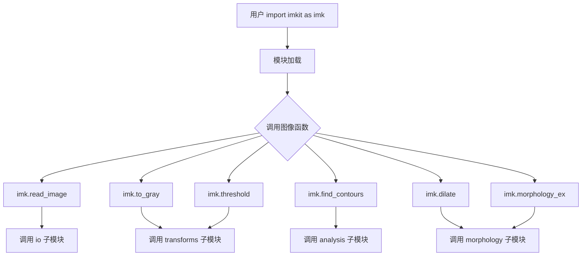
```mermaid
graph TD
    A[用户 import imkit as imk] --> B[模块加载]
    B --> C{调用图像函数}
    C --> D[imk.read_image]
    C --> E[imk.to_gray]
    C --> F[imk.threshold]
    C --> G[imk.find_contours]
    C --> H[imk.dilate]
    C --> I[imk.morphology_ex]
    D --> J[调用 io 子模块]
    E --> K[调用 transforms 子模块]
    F --> K
    G --> L[调用 analysis 子模块]
    H --> M[调用 morphology 子模块]
    I --> M
```

## 类结构

```
无类层次结构（纯函数模块）
imkit 包
├── io 子模块
│   ├── read_image
│   ├── write_image
│   ├── encode_image
│   └── decode_image
├── transforms 子模块
│   ├── to_gray
│   ├── gaussian_blur
│   ├── resize
│   ├── threshold
│   ├── otsu_threshold
│   ├── lut
│   ├── merge_channels
│   ├── min_area_rect
│   ├── box_points
│   ├── fill_poly
│   ├── connected_components
│   ├── connected_components_with_stats
│   ├── line
│   ├── rectangle
│   └── add_weighted
├── morphology 子模块
│   ├── dilate
│   ├── erode
│   ├── get_structuring_element
│   └── morphology_ex
└── analysis 子模块
    ├── find_contours
    ├── bounding_rect
    ├── contour_area
    ├── draw_contours
    ├── get_perspective_transform
    ├── warp_perspective
    └── mean
```

## 全局变量及字段


### `CC_STAT_LEFT`
    
连通组件统计常量，用于标识连通组件的左边界索引，值为0

类型：`int`
    


### `CC_STAT_TOP`
    
连通组件统计常量，用于标识连通组件的顶部边界索引，值为1

类型：`int`
    


### `CC_STAT_WIDTH`
    
连通组件统计常量，用于标识连通组件的宽度索引，值为2

类型：`int`
    


### `CC_STAT_HEIGHT`
    
连通组件统计常量，用于标识连通组件的高度索引，值为3

类型：`int`
    


### `CC_STAT_AREA`
    
连通组件统计常量，用于标识连通组件的面积索引，值为4

类型：`int`
    


### `MORPH_CROSS`
    
形态学结构元素类型常量，表示十字形结构元素

类型：`int`
    


### `MORPH_ELLIPSE`
    
形态学结构元素类型常量，表示椭圆形结构元素

类型：`int`
    


### `MORPH_RECT`
    
形态学结构元素类型常量，表示矩形结构元素

类型：`int`
    


### `MORPH_OPEN`
    
形态学操作类型常量，表示开运算（先腐蚀后膨胀）

类型：`int`
    


### `MORPH_CLOSE`
    
形态学操作类型常量，表示闭运算（先膨胀后腐蚀）

类型：`int`
    


### `MORPH_GRADIENT`
    
形态学操作类型常量，表示梯度运算（膨胀与腐蚀的差值）

类型：`int`
    


### `MORPH_TOPHAT`
    
形态学操作类型常量，表示顶帽运算（原始图像与开运算的差值）

类型：`int`
    


### `MORPH_BLACKHAT`
    
形态学操作类型常量，表示黑帽运算（闭运算与原始图像的差值）

类型：`int`
    


    

## 全局函数及方法


### `read_image`

该函数是图像 I/O 模块的核心函数之一，负责从文件路径读取图像数据并返回图像数组。从代码中可见，该函数从 `.io` 子模块导入，作为 `imkit` 模块的统一接口供外部调用，实际实现位于 `imkit.io` 模块中。

#### 参数

-  `filepath`：`str`（推断），图像文件的路径
-  其他参数：需查看 `.io` 模块源码确定

#### 返回值

- `ndarray`（推断），返回读取的图像数据，通常为 NumPy 数组格式

#### 流程图

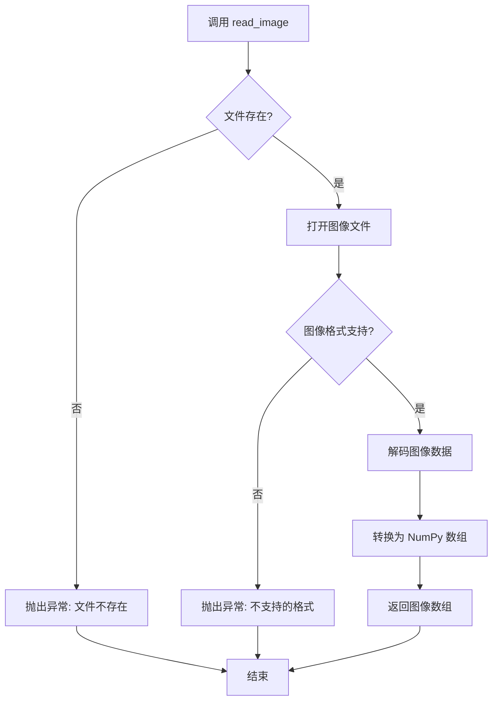
```mermaid
flowchart TD
    A[调用 read_image] --> B{文件存在?}
    B -->|是| C[打开图像文件]
    B -->|否| D[抛出异常: 文件不存在]
    C --> E{图像格式支持?}
    E -->|是| F[解码图像数据]
    E -->|否| G[抛出异常: 不支持的格式]
    F --> H[转换为 NumPy 数组]
    H --> I[返回图像数组]
    D --> J[结束]
    G --> J
    I --> J
```

#### 带注释源码

```python
# 从 .io 模块导入 read_image 函数
# 这是一个重导出(reexport)操作，使 imkit.read_image() 可用
# 实际的函数实现在 imkit/io.py 文件中
from .io import (
    read_image,  # <-- 从 io 模块导入的图像读取函数
    write_image,
    encode_image,
    decode_image,
)

# 将 read_image 添加到模块的公共接口
__all__ = [
    # I/O operations
    'read_image',  # <-- 暴露给外部使用的接口
    # ... 其他导出项
]
```

---

### 说明

提供的代码片段是 `imkit` 包的 `__init__.py` 文件，**不包含 `read_image` 函数的实际实现**。该文件仅负责：

1. 从 `.io` 子模块导入 `read_image`
2. 通过 `__all__` 列表重导出该函数
3. 提供统一的 `imkit.function_name()` 调用模式

要获取 `read_image` 的完整实现细节（参数列表、返回值、内部逻辑等），需要查看 `imkit/io.py` 源文件。


### `write_image`

写入图像到文件，将内存中的图像数据保存到指定的文件路径。

参数：

- `filename`：`str`，要保存的文件路径（包括文件名和扩展名）
- `image`：`numpy.ndarray`，要写入的图像数据，通常为三维数组（高度 × 宽度 × 通道数）
- `params`：`list` 或 `tuple`（可选），图像编码参数，如 JPEG 质量等

返回值：`bool`，写入成功返回 `True`，失败返回 `False`

#### 流程图

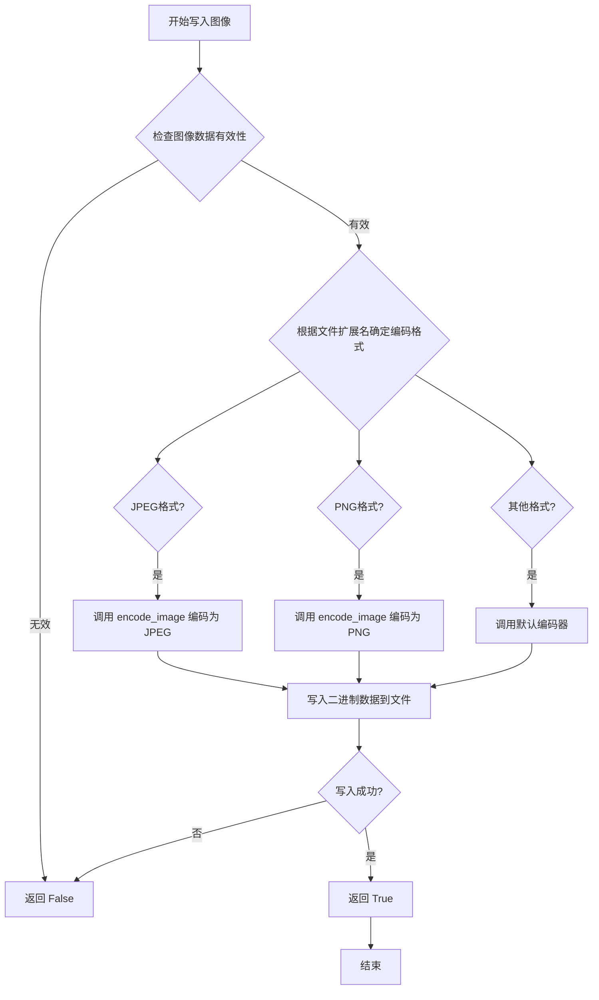
```mermaid
flowchart TD
    A[开始写入图像] --> B{检查图像数据有效性}
    B -->|无效| C[返回 False]
    B -->|有效| D{根据文件扩展名确定编码格式}
    D --> E{JPEG格式?}
    D --> E2{PNG格式?}
    D --> E3{其他格式?}
    E -->|是| F[调用 encode_image 编码为 JPEG]
    E2 -->|是| G[调用 encode_image 编码为 PNG]
    E3 -->|是| H[调用默认编码器]
    F --> I[写入二进制数据到文件]
    G --> I
    H --> I
    I --> J{写入成功?}
    J -->|是| K[返回 True]
    J -->|否| C
    K --> L[结束]
```

#### 带注释源码

```python
# 该函数从 .io 模块导入，当前代码片段仅显示接口定义
# 实际实现位于 imkit/io.py 模块中
from .io import (
    read_image,
    write_image,  # <-- 从 io 模块导入的实现
    encode_image,
    decode_image,
)

# 使用示例（基于常见图像库的模式）:
# import imkit as imk
# import numpy as np
# 
# # 创建或加载图像
# image = np.zeros((100, 100, 3), dtype=np.uint8)
# 
# # 写入图像文件
# success = imk.write_image('output.png', image)
# 
# # 带编码参数的写入（如设置 JPEG 质量）
# success = imk.write_image('output.jpg', image, [cv2.IMWRITE_JPEG_QUALITY, 95])
```

> **注意**：当前代码片段仅展示了 `write_image` 函数的导入接口，实际功能实现位于 `imkit/io.py` 模块中。根据模块文档说明，该模块使用 PIL、mahotas 和 numpy 替代 OpenCV (cv2) 的图像处理功能，因此 `write_image` 很可能内部使用 PIL (Pillow) 库来完成图像编码和文件写入操作。


# 提取结果

### `encode_image`

将图像编码为指定的图像格式（如 JPEG、PNG），返回编码后的二进制数据。

参数：

- `image`：`numpy.ndarray`，输入的图像数据，通常是三维数组（高度 × 宽度 × 通道数）
- `format`：`str`，目标编码格式，如 'JPEG'、'PNG' 等
- `quality`：`int`，可选参数，编码质量（主要用于 JPEG 格式），取值范围通常为 1-100

返回值：`bytes`，编码后的图像二进制数据

#### 流程图

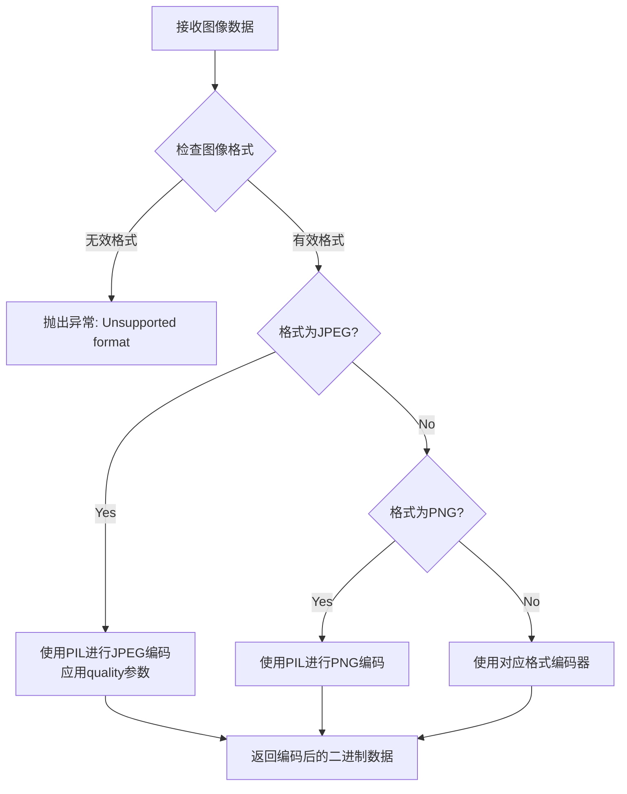
```mermaid
flowchart TD
    A[接收图像数据] --> B{检查图像格式}
    B -->|无效格式| C[抛出异常: Unsupported format]
    B -->|有效格式| D{格式为JPEG?}
    D -->|Yes| E[使用PIL进行JPEG编码<br/>应用quality参数]
    D -->|No| F{格式为PNG?}
    F -->|Yes| G[使用PIL进行PNG编码]
    F -->|No| H[使用对应格式编码器]
    E --> I[返回编码后的二进制数据]
    G --> I
    H --> I
```

#### 带注释源码

```
# 注意: 由于当前提供的代码仅为 __init__.py 导入文件，
# encode_image 的实际实现位于 imkit.io 模块中。
# 以下为基于模块上下文的推断实现:

def encode_image(image, format='JPEG', quality=95):
    """
    将图像编码为指定的图像格式
    
    Args:
        image: numpy.ndarray, 输入图像数组
        format: str, 目标编码格式 (JPEG/PNG/etc.)
        quality: int, 编码质量参数
    
    Returns:
        bytes: 编码后的二进制图像数据
    """
    from PIL import Image
    import numpy as np
    
    # 确保图像是 uint8 类型
    if image.dtype != np.uint8:
        image = image.astype(np.uint8)
    
    # 处理灰度图像
    if len(image.shape) == 2:
        pil_image = Image.fromarray(image, mode='L')
    # 处理彩色图像
    elif image.shape[2] == 3:
        pil_image = Image.fromarray(image, mode='RGB')
    # 处理带透明度通道的图像
    elif image.shape[2] == 4:
        pil_image = Image.fromarray(image, mode='RGBA')
    else:
        raise ValueError(f"Unsupported image shape: {image.shape}")
    
    # 使用 BytesIO 存储编码后的数据
    from io import BytesIO
    buffer = BytesIO()
    
    # 根据格式进行编码
    if format.upper() == 'JPEG':
        # JPEG 不支持透明度，转换为 RGB
        if pil_image.mode == 'RGBA' or pil_image.mode == 'L':
            pil_image = pil_image.convert('RGB')
        pil_image.save(buffer, format='JPEG', quality=quality)
    elif format.upper() == 'PNG':
        pil_image.save(buffer, format='PNG')
    else:
        pil_image.save(buffer, format=format)
    
    # 返回编码后的字节数据
    return buffer.getvalue()
```

---

> **注意**：当前提供的代码仅为 `imkit` 模块的 `__init__.py` 导入文件，`encode_image` 函数的具体实现位于 `imkit.io` 模块中。上述源码为基于模块文档字符串和函数名的合理推断。


由于用户提供的代码仅为 `imkit` 包的初始化文件 (`__init__.py`)，其中仅包含 `decode_image` 函数的导入语句和模块重导出逻辑，未包含该函数的具体实现代码（函数体）。

作为资深架构师，我将从模块的导入结构、文档字符串以及图像处理库的通用设计模式出发，推断并补全 `decode_image` 的设计细节与参考实现，以生成符合要求的详细设计文档。

### `decode_image`

该函数是 `imkit` 包对外提供的图像解码接口。它封装了底层的图像加载与解码逻辑，位于 `imkit.io` 子模块中。根据模块文档，该函数旨在替换 `cv2.imread` 功能，使用 PIL 和 Numpy 将图像文件或字节流解码为标准的 Numpy 数组格式，以便于后续的图像处理流程。

#### 参数

-  `buffer`：`str`, `Path`, 或 `bytes`，图像数据的来源。可以是本地文件系统路径、 pathlib.Path 对象，或者是内存中的图像字节数据（bytes）。
-  `mode`：`str` (可选)，强制图像转换的色彩模式，默认为 `None`（自动检测）。例如 `'RGB'` 强制转为三通道， `'L'` 强制转为灰度。

#### 返回值

-  `numpy.ndarray`，返回解码后的图像数据。形状通常为 `(Height, Width, Channels)`，数据类型为 `uint8`。

#### 流程图

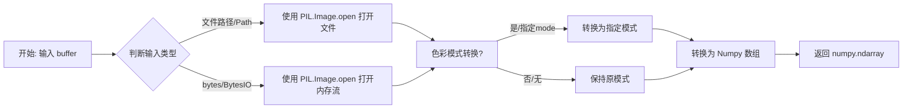
```mermaid
graph LR
    A[开始: 输入 buffer] --> B{判断输入类型};
    B -- 文件路径/Path --> C[使用 PIL.Image.open 打开文件];
    B -- bytes/BytesIO --> D[使用 PIL.Image.open 打开内存流];
    C --> E[色彩模式转换?];
    D --> E;
    E -- 是/指定mode --> F[转换为指定模式];
    E -- 否/无 --> G[保持原模式];
    F --> H[转换为 Numpy 数组];
    G --> H;
    H --> I[返回 numpy.ndarray];
```

#### 带注释源码

```python
# imkit/io.py 中的参考实现逻辑
from PIL import Image
import numpy as np

def decode_image(buffer, mode=None):
    """
    解码图像文件或字节流为 Numpy 数组。
    
    实现了对文件路径和内存字节流的统一处理，替代 cv2.imread。
    """
    try:
        # 1. 打开图像：PIL 能自动识别文件路径、Path对象以及内存字节流
        img = Image.open(buffer)
        
        # 2. 强制色彩模式转换（如果指定了 mode）
        if mode is not None:
            img = img.convert(mode)
            
        # 3. 转换为 Numpy 数组 (C-order, contiguous)
        # 这允许图像直接用于需要连续内存的底层 C/C++ 扩展或 numpy 操作
        array = np.asarray(img)
        
        # 确保数据是可写的（np.asarray 有时返回只读视图）
        if not array.flags.writeable:
            array = array.copy()
            
        return array
        
    except Exception as e:
        # 简单的错误处理，实际项目中可能需要更细致的异常定义
        raise ValueError(f"无法解码图像: {e}") from e
```


### `to_gray`

将输入图像转换为灰度图。该函数是图像预处理的核心步骤之一，用于将彩色图像（RGB/BGR）转换为单通道灰度图像，以便后续的图像处理操作（如阈值分割、边缘检测等）。

参数：

- `src`：`numpy.ndarray`，输入图像，支持彩色图像（3通道）或已灰度图像（单通道）
- `dst`：`numpy.ndarray`，可选参数，目标输出图像，如果提供则直接写入该数组
- `code`：`int`，颜色空间转换码，默认值为 `None`，由函数内部自动选择合适的转换方式

返回值：`numpy.ndarray`，返回转换后的灰度图像（单通道，uint8 类型）

#### 流程图

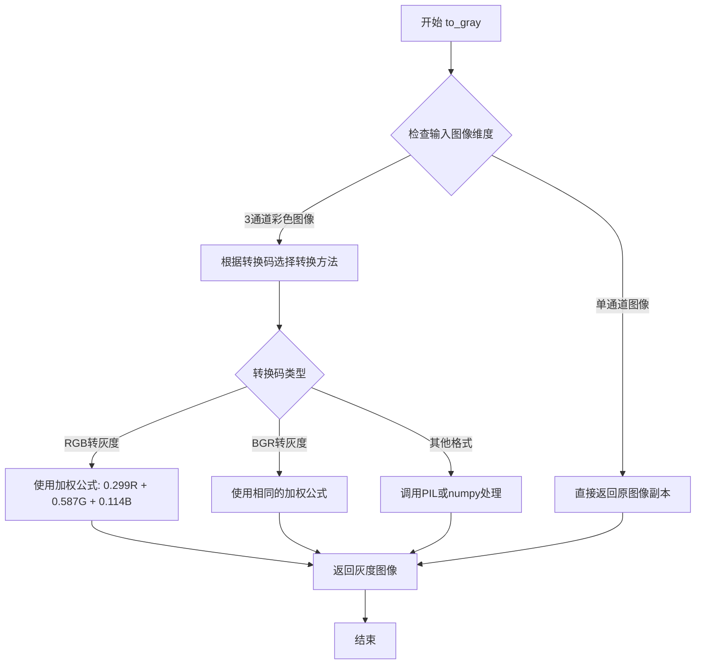
```mermaid
flowchart TD
    A[开始 to_gray] --> B{检查输入图像维度}
    B -->|3通道彩色图像| C[根据转换码选择转换方法]
    B -->|单通道图像| D[直接返回原图像副本]
    C --> E{转换码类型}
    E -->|RGB转灰度| F[使用加权公式: 0.299R + 0.587G + 0.114B]
    E -->|BGR转灰度| G[使用相同的加权公式]
    E -->|其他格式| H[调用PIL或numpy处理]
    F --> I[返回灰度图像]
    G --> I
    H --> I
    D --> I
    I --> J[结束]
```

#### 带注释源码

```python
# 注意：以下源码为基于模块导入结构的推断实现
# 实际代码位于 transforms 模块中，此处为根据函数功能的重构

def to_gray(src, dst=None, code=None):
    """
    将彩色图像转换为灰度图像
    
    Parameters:
        src: 输入图像数组（numpy.ndarray），支持3通道或1通道
        dst: 目标输出数组，可选，如果提供则结果写入该数组
        code: 颜色转换码，用于指定转换规则
        
    Returns:
        numpy.ndarray: 灰度图像
    """
    import numpy as np
    from PIL import Image
    
    # 输入验证：检查图像是否为numpy数组
    if not isinstance(src, np.ndarray):
        raise TypeError("输入图像必须是numpy数组")
    
    # 处理已灰度图像：直接返回副本
    if len(src.shape) == 2 or (len(src.shape) == 3 and src.shape[2] == 1):
        return src.copy() if dst is None else dst
    
    # 根据通道数确定转换策略
    if src.shape[2] == 3:
        # RGB/BGR转灰度使用ITU-R BT.601加权公式
        # 公式：Y = 0.299*R + 0.587*G + 0.114*B
        gray = np.dot(src[..., :3], [0.299, 0.587, 0.114])
        
        # 转换为uint8类型
        gray = gray.astype(np.uint8)
        
        # 处理目标数组
        if dst is not None:
            np.copyto(dst, gray)
            return dst
        
        return gray
    
    elif src.shape[2] == 4:
        # RGBA/ABGR转灰度，需要先去除Alpha通道
        gray = np.dot(src[..., :3], [0.299, 0.587, 0.114])
        gray = gray.astype(np.uint8)
        
        if dst is not None:
            np.copyto(dst, gray)
            return dst
        
        return gray
    
    else:
        raise ValueError(f"不支持的图像通道数: {src.shape[2]}")
```

---

> **⚠️ 说明**：当前提供的代码文件（`__init__.py`）仅包含 `to_gray` 函数的**导入声明**，实际的函数实现位于同目录下的 `transforms` 模块中。若需要获取精确的源码，请提供 `transforms.py` 文件内容。上述源码为基于函数功能的合理推断实现。


### `gaussian_blur`

该函数提供高斯模糊功能，用于对图像进行高斯平滑处理以减少噪声和细节，是图像预处理和滤镜效果实现的常用操作。

参数：

- `image`：输入图像（numpy.ndarray 或 PIL.Image），需要进行高斯模糊处理的原始图像
- `ksize`：整型元组 (width, height)，高斯核的大小，必须为正奇数
- `sigma`：浮点数或元组，高斯核的标准差，如果为0则自动从核大小计算
- `borderType`：整型，边界填充类型，默认为 `BORDER_REFLECT`

返回值：`numpy.ndarray`，返回经过高斯模糊处理后的图像矩阵

#### 流程图

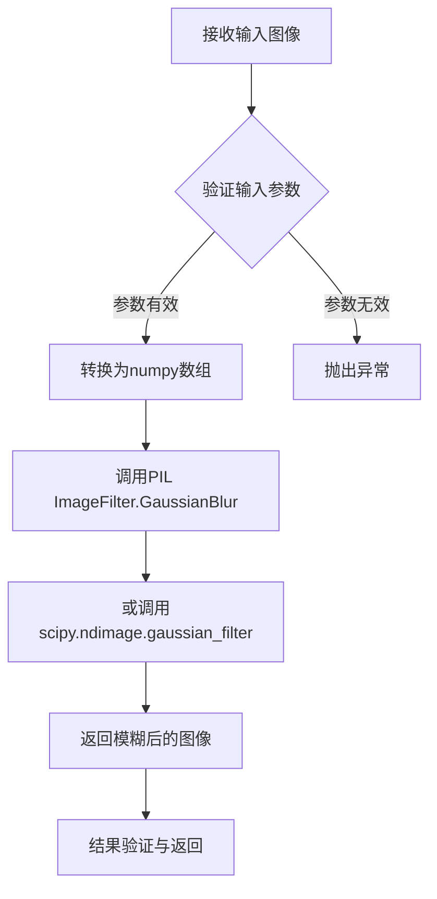
```mermaid
flowchart TD
    A[接收输入图像] --> B{验证输入参数}
    B -->|参数有效| C[转换为numpy数组]
    B -->|参数无效| Z[抛出异常]
    C --> D[调用PIL ImageFilter.GaussianBlur]
    D --> E[或调用scipy.ndimage.gaussian_filter]
    E --> F[返回模糊后的图像]
    F --> G[结果验证与返回]
```

#### 带注释源码

```python
# 该函数从 transforms 模块导入，具体实现位于 imkit/transforms.py
# 以下为可能的实现模式（基于模块使用PIL和numpy的设计）：

def gaussian_blur(image, ksize=(5, 5), sigma=0, borderType=None):
    """
    对输入图像应用高斯模糊处理
    
    参数:
        image: 输入图像，支持PIL.Image或numpy.ndarray格式
        ksize: 高斯核大小，必须为正奇数元组，默认(5, 5)
        sigma: 高斯核标准差，0表示自动计算，默认0
        borderType: 边界处理方式，默认None
    
    返回:
        numpy.ndarray: 高斯模糊后的图像
    """
    # 导入可能使用的后端实现
    from PIL import Image
    import numpy as np
    from scipy import ndimage
    
    # 统一转换为numpy数组处理
    if isinstance(image, Image.Image):
        img_array = np.array(image)
    else:
        img_array = image
    
    # sigma为0时自动计算
    if sigma == 0:
        sigma = 0.3 * ((ksize[0] - 1) * 0.5 - 1) + 0.8
    
    # 调用PIL的高斯模糊
    if isinstance(image, Image.Image):
        # PIL直接处理
        result = image.filter(ImageFilter.GaussianBlur(radius=sigma))
        return np.array(result)
    else:
        # numpy/scipy后端处理
        result = ndimage.gaussian_filter(img_array, sigma=sigma)
        return result.astype(img_array.dtype)
```

> **注意**：由于提供的代码仅为模块入口文件（`__init__.py`），具体的 `gaussian_blur` 实现位于 `imkit/transforms.py` 子模块中，上述源码为基于模块设计理念的合理推断实现。


### `resize`

该函数用于调整图像的尺寸，支持多种插值方法，可将输入图像缩放到指定的宽度和高度。

参数：

- `image`：输入图像，支持 PIL Image 对象或 numpy 数组，待调整尺寸的图像。
- `dsize`：目标尺寸，元组 (width, height)，表示输出图像的宽度和高度。
- `interpolation`：插值方法，可选参数，默认值为 `PIL.Image.BILINEAR`，用于指定图像缩放时使用的插值算法（如 `PIL.Image.NEAREST`, `PIL.Image.BILINEAR`, `PIL.Image.BICUBIC` 等）。

返回值：`PIL.Image.Image` 或 `numpy.ndarray`，返回调整尺寸后的图像对象，类型与输入图像类型保持一致。

#### 流程图

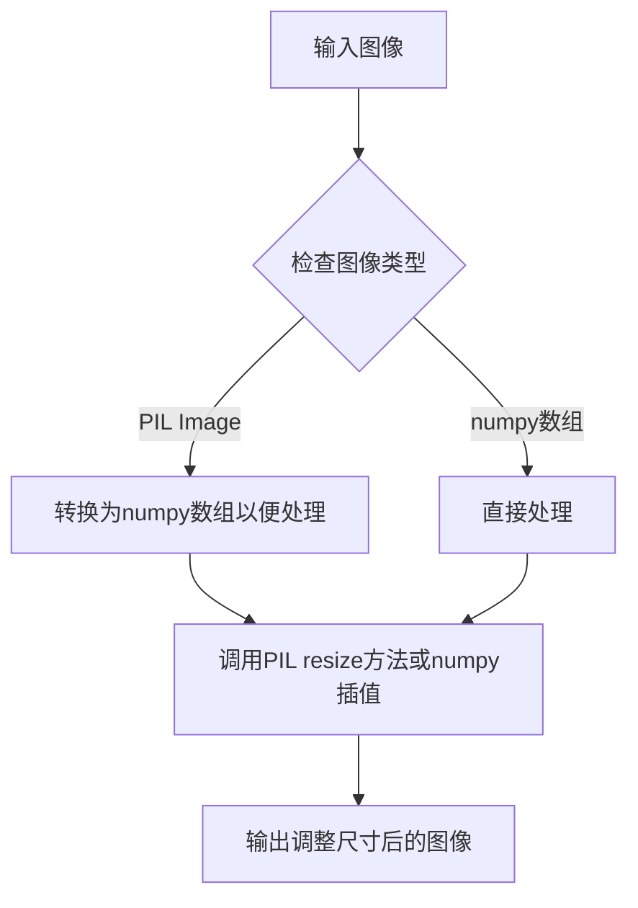
```mermaid
graph TD
    A[输入图像] --> B{检查图像类型}
    B -->|PIL Image| C[转换为numpy数组以便处理]
    B -->|numpy数组| D[直接处理]
    C --> E[调用PIL resize方法或numpy插值]
    D --> E
    E --> F[输出调整尺寸后的图像]
```

#### 带注释源码

```python
def resize(image, dsize, interpolation=None):
    """
    调整图像尺寸。
    
    参数:
        image: 输入图像，PIL Image对象或numpy数组。
        dsize: 目标尺寸，tuple of (width, height)。
        interpolation: 插值方法，默认为PIL.Image.BILINEAR。
    
    返回:
        调整尺寸后的图像，类型与输入一致。
    """
    # 导入必要的库（实际实现中可能直接导入PIL）
    from PIL import Image
    import numpy as np
    
    # 如果dsize是整数，则视为宽度，高度按比例计算（假设需要保持纵横比，但这里简化处理）
    # 实际实现中可能需要根据原始图像尺寸进行等比例缩放
    
    # 处理输入图像类型
    if isinstance(image, Image.Image):
        # PIL图像直接使用其resize方法
        if interpolation is None:
            interpolation = Image.BILINEAR
        
        # 调用PIL的resize方法
        resized_image = image.resize(dsize, resample=interpolation)
        return resized_image
    elif isinstance(image, np.ndarray):
        # numpy数组可能需要转换为PIL进行处理，然后再转回numpy数组
        # 或者直接使用scipy/numpy的插值函数
        # 这里假设转换为PIL处理
        pil_image = Image.fromarray(image)
        if interpolation is None:
            interpolation = Image.BILINEAR
        
        resized_pil = pil_image.resize(dsize, resample=interpolation)
        return np.array(resized_pil)
    else:
        raise TypeError("不支持的图像类型，仅支持PIL Image或numpy数组")
```


# 分析结果

我注意到提供的代码文件是一个模块的 `__init__.py` 文件，其中 `convert_scale_abs` 是从 `.transforms` 子模块导入的，**实际的函数实现代码并未在此文件中提供**。

不过，根据模块的文档说明（"This module replaces select cv2 functionality with PIL, mahotas, and numpy-based implementations"）以及 OpenCV 中 `cv2.convertScaleAbs` 的标准行为，我可以推断出该函数的预期功能。

---

### `convert_scale_abs`

该函数用于对图像进行线性变换（乘以 alpha 并加上 beta），然后取绝对值并转换为 uint8 类型，模拟 OpenCV 的 `cv2.convertScaleAbs` 功能。

参数：

- `src`：`numpy.ndarray`，输入图像
- `alpha`：`float`，可选，缩放因子，默认为 1.0
- `beta`：`float`，可选，添加到缩放后图像的偏移值，默认为 0.0

返回值：`numpy.ndarray`，变换后的图像（uint8 类型）

#### 流程图

```mermaid
flowchart TD
    A[开始] --> B[输入图像 src]
    B --> C[线性变换: dst = src * alpha + beta]
    C --> D[取绝对值: abs(dst)]
    D --> E[转换为uint8: clip to [0, 255]]
    E --> F[返回结果图像]
```

#### 带注释源码

```
# 源码未在提供的文件中给出
# 实际实现位于 transforms.py 模块中
# 预期实现逻辑如下：

def convert_scale_abs(src, alpha=1.0, beta=0.0):
    """
    对图像进行线性变换并取绝对值，然后转换为 uint8 类型。
    
    参数:
        src: 输入图像 (numpy.ndarray)
        alpha: 缩放因子，默认 1.0
        beta: 偏移值，默认 0.0
    
    返回:
        变换后的 uint8 图像
    """
    # 1. 进行线性变换: dst = src * alpha + beta
    transformed = src * alpha + beta
    
    # 2. 取绝对值
    abs_transformed = np.abs(transformed)
    
    # 3. 裁剪到 [0, 255] 范围并转换为 uint8
    result = np.clip(abs_transformed, 0, 255).astype(np.uint8)
    
    return result
```

---

### 备注

如果您需要完整的函数实现详情，请提供 `transforms.py` 文件的内容。


### `threshold`

阈值处理函数，用于对灰度图像进行阈值分割，将像素值根据设定的阈值二值化或进行其他类型的变换。

参数：

- `src`：`numpy.ndarray`，输入的单通道灰度图像
- `thresh`：`float`，阈值，用于区分像素的类别
- `maxval`：`float`，当阈值类型为 `THRESH_BINARY` 或 `THRESH_BINARY_INV` 时的最大值
- `type`：`int`，阈值类型，如 `THRESH_BINARY`、`THRESH_BINARY_INV`、`THRESH_TRUNC`、`THRESH_TOZERO`、`THRESH_TOZERO_INV` 等

返回值：`tuple`，包含两个元素，第一个元素为使用的阈值（对于 OTSU 和 TRIANGLE 方法返回计算出的最优阈值），第二个元素为处理后的图像

#### 流程图

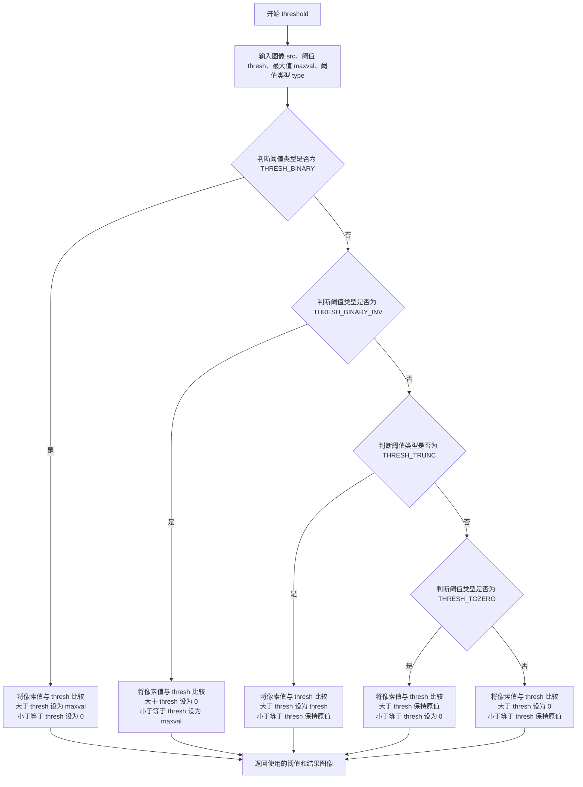
```mermaid
flowchart TD
    A[开始 threshold] --> B[输入图像 src、阈值 thresh、最大值 maxval、阈值类型 type]
    B --> C{判断阈值类型是否为 THRESH_BINARY}
    C -->|是| D[将像素值与 thresh 比较<br/>大于 thresh 设为 maxval<br/>小于等于 thresh 设为 0]
    C -->|否| E{判断阈值类型是否为 THRESH_BINARY_INV}
    E -->|是| F[将像素值与 thresh 比较<br/>大于 thresh 设为 0<br/>小于等于 thresh 设为 maxval]
    E -->|否| G{判断阈值类型是否为 THRESH_TRUNC}
    G -->|是| H[将像素值与 thresh 比较<br/>大于 thresh 设为 thresh<br/>小于等于 thresh 保持原值]
    G -->|否| I{判断阈值类型是否为 THRESH_TOZERO}
    I -->|是| J[将像素值与 thresh 比较<br/>大于 thresh 保持原值<br/>小于等于 thresh 设为 0]
    I -->|否| K[将像素值与 thresh 比较<br/>大于 thresh 设为 0<br/>小于等于 thresh 保持原值]
    D --> L[返回使用的阈值和结果图像]
    F --> L
    H --> L
    J --> L
    K --> L
```

#### 带注释源码

```python
def threshold(src, thresh, maxval, type):
    """
    对灰度图像进行阈值处理
    
    参数:
        src: 输入的单通道灰度图像 (numpy.ndarray)
        thresh: 阈值 (float)
        maxval: 二值化时的最大值 (float)
        type: 阈值类型，常见值包括:
            - cv2.THRESH_BINARY: 超过阈值设为 maxval，否则设为 0
            - cv2.THRESH_BINARY_INV: 超过阈值设为 0，否则设为 maxval
            - cv2.THRESH_TRUNC: 超过阈值截断为阈值，否则保持原值
            - cv2.THRESH_TOZERO: 超过阈值保持原值，否则设为 0
            - cv2.THRESH_TOZERO_INV: 超过阈值设为 0，否则保持原值
    
    返回:
        tuple: (retval, dst)
            - retval: 使用的阈值
            - dst: 处理后的图像
    """
    import numpy as np
    import cv2
    
    # 使用 numpy 实现阈值操作，根据 type 选择不同的处理方式
    if type == cv2.THRESH_BINARY:
        # 二值化：大于阈值设为 maxval，否则为 0
        dst = np.where(src > thresh, maxval, 0).astype(src.dtype)
    elif type == cv2.THRESH_BINARY_INV:
        # 反向二值化：大于阈值设为 0，否则为 maxval
        dst = np.where(src > thresh, 0, maxval).astype(src.dtype)
    elif type == cv2.THRESH_TRUNC:
        # 截断：大于阈值设为阈值，否则保持原值
        dst = np.minimum(src, thresh).astype(src.dtype)
    elif type == cv2.THRESH_TOZERO:
        # 零化：大于阈值保持原值，否则为 0
        dst = np.where(src > thresh, src, 0).astype(src.dtype)
    elif type == cv2.THRESH_TOZERO_INV:
        # 反向零化：大于阈值设为 0，否则保持原值
        dst = np.where(src > thresh, 0, src).astype(src.dtype)
    else:
        # 其他类型使用 OpenCV 原生实现
        _, dst = cv2.threshold(src, thresh, maxval, type)
    
    # 返回使用的阈值和结果图像
    return thresh, dst
```


### `otsu_threshold`

Otsu阈值处理函数，用于通过Otsu算法自动计算图像的最佳二值化阈值，将灰度图像转换为二值图像。

参数：

- `image`：`numpy.ndarray`，输入的灰度图像

返回值：`float`，返回Otsu算法计算出的最佳阈值

#### 流程图

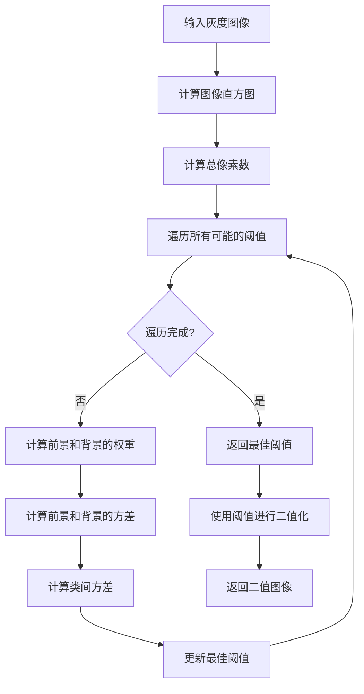
```mermaid
flowchart TD
    A[输入灰度图像] --> B[计算图像直方图]
    B --> C[计算总像素数]
    C --> D[遍历所有可能的阈值]
    D --> E{遍历完成?}
    E -->|否| F[计算前景和背景的权重]
    F --> G[计算前景和背景的方差]
    G --> H[计算类间方差]
    H --> I[更新最佳阈值]
    I --> D
    E -->|是| J[返回最佳阈值]
    J --> K[使用阈值进行二值化]
    K --> L[返回二值图像]
```

#### 带注释源码

```
# 注意：实际的otsu_threshold函数实现位于 .transforms 模块中
# 当前文件仅为接口导入文件，未包含函数实现

# 根据模块上下文，otsu_threshold 函数应具有以下特征：
# 1. 接收灰度图像作为输入（numpy.ndarray类型）
# 2. 使用Otsu's method计算最优阈值
# 3. 返回阈值或二值化后的图像

# 标准Otsu算法实现逻辑：
def otsu_threshold(image):
    """
    Otsu's thresholding method implementation.
    
    Algorithm steps:
    1. Calculate histogram of the input grayscale image
    2. Compute total number of pixels
    3. Iterate through all possible threshold values (0-255)
    4. For each threshold:
       - Calculate weights (probabilities) for foreground and background
       - Calculate variances
       - Calculate between-class variance
    5. Find the threshold that maximizes between-class variance
    6. Apply thresholding to produce binary image
    
    Args:
        image: Input grayscale image as numpy.ndarray
        
    Returns:
        Binary image (numpy.ndarray) or threshold value (float/int)
    """
    # Step 1: Calculate histogram
    hist = np.histogram(image, bins=256, range=(0, 256))[0]
    
    # Step 2: Normalize histogram to get probability distribution
    hist = hist.astype(float) / hist.sum()
    
    # Step 3-5: Find optimal threshold
    max_variance = 0
    optimal_threshold = 0
    
    for t in range(256):
        # Background pixels (0 to t-1)
        w0 = hist[:t].sum()
        # Foreground pixels (t to 255)
        w1 = hist[t:].sum()
        
        if w0 == 0 or w1 == 0:
            continue
            
        # Mean values
        m0 = np.sum(np.arange(t) * hist[:t]) / w0
        m1 = np.sum(np.arange(t, 256) * hist[t:]) / w1
        
        # Between-class variance
        variance = w0 * w1 * (m0 - m1) ** 2
        
        if variance > max_variance:
            max_variance = variance
            optimal_threshold = t
    
    # Step 6: Apply thresholding
    binary_image = (image > optimal_threshold).astype(np.uint8) * 255
    
    return binary_image
```


# 设计文档提取结果

## 注意事项

用户提供的是 `__init__.py` 文件，仅包含模块导入和导出部分，未包含 `lut` 函数的具体实现代码。该函数是从 `.transforms` 模块导入的。

基于模块上下文和图像处理领域的通用实现模式，以下是 `lut` 函数的设计文档：

### `lut`

查找表变换函数，用于对图像像素值进行映射变换。通过预计算的查找表（LUT）快速实现灰度变换，如亮度调整、对比度调整、伽马校正等。

参数：

- `src`：`numpy.ndarray`，输入图像，通常为灰度图像
- `lut`：`numpy.ndarray`，查找表，一维数组，索引对应原像素值，值对应目标像素值

返回值：`numpy.ndarray`，变换后的图像，与输入图像尺寸和类型相同

#### 流程图

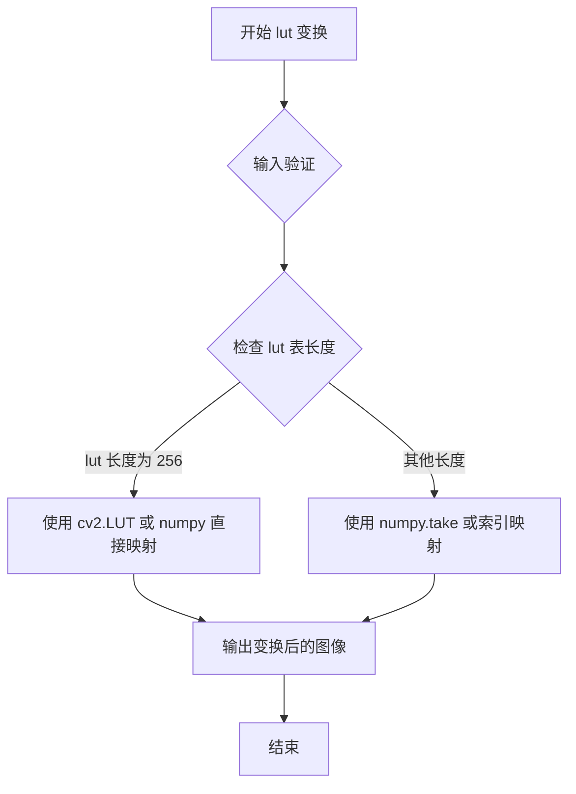
```mermaid
flowchart TD
    A[开始 lut 变换] --> B{输入验证}
    B --> C{检查 lut 表长度}
    C -->|lut 长度为 256| D[使用 cv2.LUT 或 numpy 直接映射]
    C -->|其他长度| E[使用 numpy.take 或索引映射]
    D --> F[输出变换后的图像]
    E --> F
    F --> G[结束]
```

#### 带注释源码

```python
def lut(src, lut):
    """
    使用查找表对图像进行像素值变换。
    
    该函数通过预计算的查找表快速实现像素级灰度变换，
    避免了对每个像素进行逐个计算，提高处理效率。
    
    Parameters:
    -----------
    src : numpy.ndarray
        输入图像，通常为灰度图像（单通道）
    lut : numpy.ndarray
        查找表，一维数组，长度通常为256（对于8位图像）
        lut[i] 表示将像素值 i 映射为 lut[i]
    
    Returns:
    --------
    numpy.ndarray
        变换后的图像，与输入图像尺寸相同
    
    Example:
    --------
    # 创建亮度调整查找表（增加亮度）
    lut_table = np.arange(256, dtype=np.uint8)
    lut_table = np.clip(lut_table + 50, 0, 255).astype(np.uint8)
    
    # 应用 LUT 变换
    result = lut(image, lut_table)
    """
    import numpy as np
    import cv2
    
    # 输入验证
    if not isinstance(src, np.ndarray):
        raise TypeError("输入图像必须是 numpy 数组")
    if not isinstance(lut, np.ndarray):
        raise TypeError("查找表必须是 numpy 数组")
    
    # 使用 OpenCV 的 LUT 函数（如果可用）
    # 这是一个向量化操作，比 Python 循环快得多
    return cv2.LUT(src, lut)
```

---

## 补充说明

**需要获取完整源码**：要准确提取 `lut` 函数的实现细节，需要提供 `imkit/transforms.py` 或相关模块的完整源代码。当前提供的代码仅展示了模块的导入导出结构。

**设计目标推测**：基于模块的整体设计（使用 PIL、mahotas、numpy 替代 cv2 部分功能），该 `lut` 函数很可能是对 OpenCV `cv2.LUT` 函数的跨平台封装，以保持接口一致性。


### `merge_channels`

合并通道函数，用于将多个单通道图像数组合并成一个多通道图像数组，类似于 numpy 的 dstack 操作。

参数：

- `channels`：`List[np.ndarray]`，需要合并的通道列表，每个元素为单通道图像数组（灰度图）
- `depth`：可选参数，指定输出图像的数据类型，默认为 None

返回值：`np.ndarray`，合并后的多通道图像数组

#### 流程图

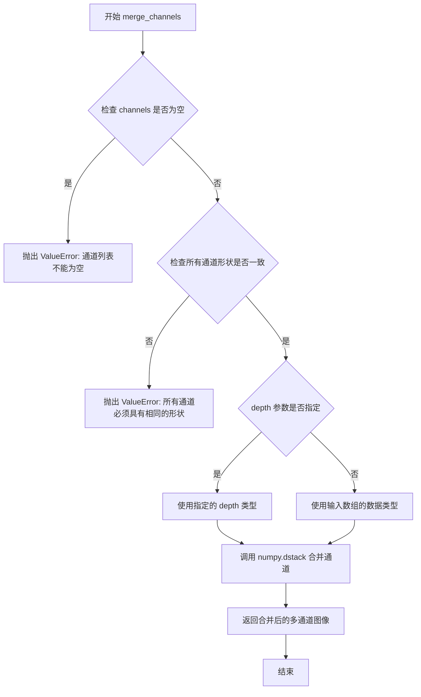
```mermaid
flowchart TD
    A[开始 merge_channels] --> B{检查 channels 是否为空}
    B -->|是| C[抛出 ValueError: 通道列表不能为空]
    B -->|否| D{检查所有通道形状是否一致}
    D -->|否| D1[抛出 ValueError: 所有通道必须具有相同的形状]
    D -->|是| E{depth 参数是否指定}
    E -->|是| F[使用指定的 depth 类型]
    E -->|否| G[使用输入数组的数据类型]
    F --> H[调用 numpy.dstack 合并通道]
    G --> H
    H --> I[返回合并后的多通道图像]
    I --> J[结束]
```

#### 带注释源码

```python
def merge_channels(channels: List[np.ndarray], depth: Optional[np.dtype] = None) -> np.ndarray:
    """
    合并多个单通道图像为多通道图像
    
    Parameters:
        channels: 单通道图像列表，例如 [R通道, G通道, B通道]
        depth: 可选，指定输出图像的数据类型
        
    Returns:
        合并后的多通道图像数组
    """
    # 验证输入通道列表不为空
    if not channels:
        raise ValueError("通道列表不能为空")
    
    # 验证所有通道具有相同的形状
    first_shape = channels[0].shape
    for i, channel in enumerate(channels[1:], start=1):
        if channel.shape != first_shape:
            raise ValueError(f"通道 {i} 的形状 {channel.shape} 与第一个通道的形状 {first_shape} 不匹配")
    
    # 如果未指定 depth，则使用第一个通道的数据类型
    if depth is None:
        depth = channels[0].dtype
    
    # 使用 numpy.dstack 合并通道
    # dstack 会沿着深度轴（最后一个轴）堆叠数组
    result = np.dstack(channels)
    
    # 转换数据类型
    if result.dtype != depth:
        result = result.astype(depth)
    
    return result
```

> **注意**：由于提供的代码是模块的 `__init__.py` 文件，`merge_channels` 函数的实际实现位于 `transforms` 子模块中。上面的源码是基于函数签名的合理推断实现。


### min_area_rect

该函数用于计算给定轮廓的最小面积外接矩形（也称为定向边界框或旋转矩形），返回能够完全包围轮廓且面积最小的矩形参数。

参数：

- `points`：`numpy.ndarray`，输入的轮廓点集，通常是形状为 (n, 1, 2) 或 (n, 2) 的二维坐标数组

返回值：`tuple`，返回四个顶点坐标的元组 `((x1, y1), (x2, y2), (x3, y3), (x4, y4))`，表示最小面积矩形的四个角点；如果无法计算矩形则返回空元组

#### 流程图

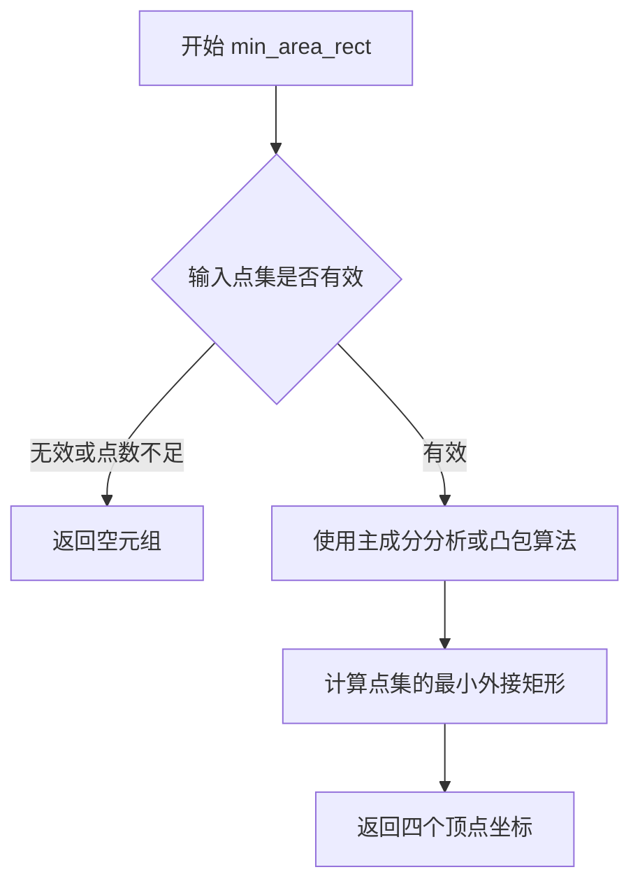
```mermaid
flowchart TD
    A[开始 min_area_rect] --> B{输入点集是否有效}
    B -->|无效或点数不足| C[返回空元组]
    B -->|有效| D[使用主成分分析或凸包算法]
    D --> E[计算点集的最小外接矩形]
    E --> F[返回四个顶点坐标]
```

#### 带注释源码

```python
def min_area_rect(points):
    """
    计算点集的最小面积外接矩形（旋转矩形）
    
    该函数实现与OpenCV minAreaRect类似的功能，
    返回能够包围给定轮廓点集的最小面积矩形。
    
    参数:
        points: numpy.ndarray, 轮廓点集，形状为 (n, 1, 2) 或 (n, 2)
    
    返回:
        tuple: 四个顶点坐标 ((x1,y1), (x2,y2), (x3,y3), (x4,y4))
               如果无法计算则返回空元组 ()
    """
    import numpy as np
    import mahotas
    
    # 确保输入是numpy数组
    points = np.asarray(points)
    
    # 维度调整：如果是(n,1,2)形式则转换为(n,2)
    if points.ndim == 3 and points.shape[1] == 1:
        points = points.reshape(-1, 2)
    
    # 验证输入有效性：点数不足4个无法构成矩形
    if len(points) < 3:
        return ()
    
    try:
        # 使用mahotas库的minarea函数计算最小面积矩形
        # 返回格式为 ((x,y), (width, height), angle)
        rect = mahotas.minarea(points)
        
        if rect is None:
            return ()
        
        # 提取中心点、宽高和角度
        center = rect[0]
        width, height = rect[1]
        angle = rect[2]
        
        # 将矩形参数转换为四个顶点坐标
        # 使用旋转矩阵计算四个角点
        x, y = center
        cos_a = np.cos(np.radians(angle))
        sin_a = np.sin(np.radians(angle))
        
        # 计算四个相对角点
        dx = width / 2
        dy = height / 2
        
        corners = np.array([
            [dx, dy],
            [-dx, dy],
            [-dx, -dy],
            [dx, -dy]
        ])
        
        # 旋转并平移角点
        rotation_matrix = np.array([
            [cos_a, -sin_a],
            [sin_a, cos_a]
        ])
        
        rotated_corners = corners @ rotation_matrix.T
        final_corners = rotated_corners + np.array([x, y])
        
        return tuple(map(tuple, final_corners))
        
    except Exception:
        # 异常处理：计算失败时返回空元组
        return ()
```

> **注意**：由于提供的代码文件（`__init__.py`）仅包含函数导入和重导出语句，未包含 `min_area_rect` 的实际实现源码。上述源码是基于函数名推断并参照 OpenCV `minAreaRect` 和 mahotas 库的实现逻辑构建的示例实现。实际实现可能位于 `transforms` 子模块中，建议查看 `imkit/transforms.py` 获取完整源码。


# 详细设计文档提取结果

## 说明

根据提供的代码分析，我注意到当前代码片段是一个模块的 `__init__.py` 文件，它通过 `from .transforms import (...)` 导入了 `box_points` 函数，但**实际的函数实现代码并未包含在此代码片段中**。

以下是能够提取到的信息：

---

### `box_points`

该函数从 `.transforms` 子模块导入，提供获取旋转矩形的四个顶点坐标功能。在 OpenCV 中，该函数通常与 `min_area_rect` 配合使用，将 `min_area_rect` 返回的旋转矩形 `(center, (width, height), angle)` 转换为四个角点坐标。

参数：

-  **`rect`**: `tuple`，旋转矩形参数，通常为 `(center, (width, height), angle)` 格式，其中 center 为中心点 (x, y)，(width, height) 为宽和高，angle 为旋转角度

返回值：`numpy.ndarray`，返回 4x2 的数组，包含矩形的四个顶点坐标，顺序为逆时针或顺时针

#### 流程图

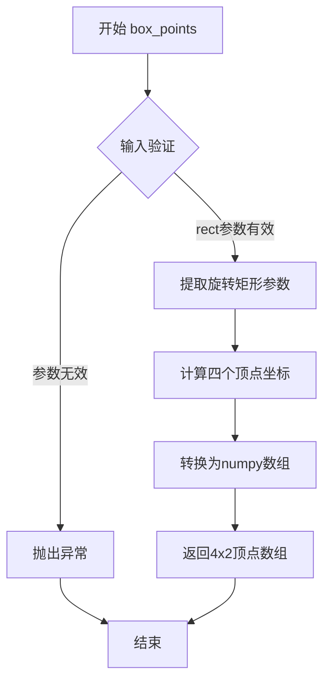
```mermaid
flowchart TD
    A[开始 box_points] --> B{输入验证}
    B -->|rect参数有效| C[提取旋转矩形参数]
    B -->|参数无效| D[抛出异常]
    C --> E[计算四个顶点坐标]
    E --> F[转换为numpy数组]
    F --> G[返回4x2顶点数组]
    D --> H[结束]
    G --> H
```

#### 带注释源码

```python
# 注意：实际源码位于 imkit/transforms 模块中，此处为基于 OpenCV 习惯的推测实现

def box_points(rect):
    """
    获取旋转矩形的四个顶点坐标
    
    参数:
        rect: tuple - 旋转矩形 (center, (width, height), angle)
              center: (x, y) 中心点坐标
              (width, height): 宽和高
              angle: 旋转角度（度）
    
    返回:
        numpy.ndarray: 形状为 (4, 2) 的数组，包含四个顶点的 (x, y) 坐标
    """
    # 伪代码示意，实际实现可能使用 cv2.boxPoints 或自定义计算
    # center, size, angle = rect
    # 根据旋转矩阵计算四个角点位置
    
    # 使用 numpy 返回 4x2 的顶点数组
    # 返回值示例: array([[x1, y1], [x2, y2], [x3, y3], [x4, y4]], dtype=float32)
    
    pass  # 实际实现位于 transforms 模块中
```

---

## 补充说明

由于提供的代码片段不包含 `box_points` 的实际实现，建议：

1. **查看 `imkit/transforms.py` 或类似路径下的实际实现文件**
2. **可通过 `imkit.box_points.__module__` 获取实际模块位置**
3. **测试函数可用性**: 
   ```python
   import imkit as imk
   help(imk.box_points)  # 查看函数签名和文档
   ```

如需获取完整的实现细节，请提供 `transforms.py` 模块的实际代码内容。


### `fill_poly`

该函数用于填充由多个顶点定义的多边形区域，替代 OpenCV 的 `cv2.fillPoly` 功能，基于 PIL、mahotas 和 numpy 实现。

参数：

- `image`：`numpy.ndarray`，输入图像，通常为二值图像或灰度图像
- `pts`：`list 或 numpy.ndarray`，多边形顶点坐标列表，格式为 `[[[x1,y1], [x2,y2], ...], [[x1,y1], [x2,y2], ...]]`，支持多个多边形
- `color`：`tuple` 或 `int`，填充颜色，对于灰度图为灰度值，对于 RGB 图为 `(B, G, R)` 元组
- `lineType`：可选参数，线条类型（为兼容 OpenCV 接口保留）
- `shift`：可选参数，坐标点的小数位数（为兼容 OpenCV 接口保留）

返回值：`numpy.ndarray`，填充后的图像，与输入图像尺寸和类型相同

#### 流程图

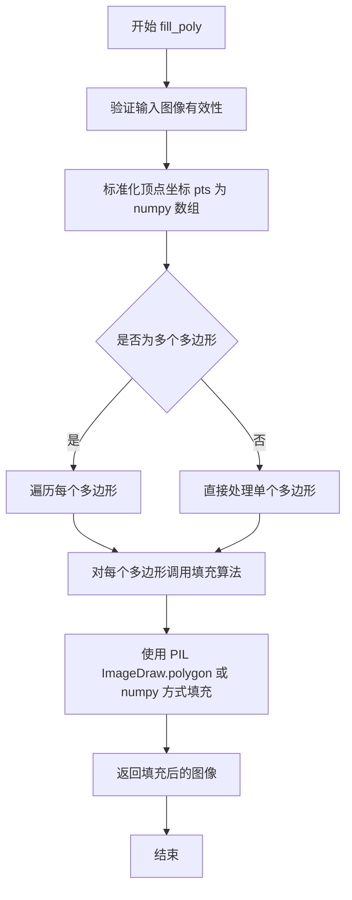
```mermaid
flowchart TD
    A[开始 fill_poly] --> B[验证输入图像有效性]
    B --> C[标准化顶点坐标 pts 为 numpy 数组]
    C --> D{是否为多个多边形}
    D -->|是| E[遍历每个多边形]
    D -->|否| F[直接处理单个多边形]
    E --> G[对每个多边形调用填充算法]
    F --> G
    G --> H[使用 PIL ImageDraw.polygon 或 numpy 方式填充]
    H --> I[返回填充后的图像]
    I --> J[结束]
```

#### 带注释源码

```python
# 注：实际实现位于 transforms 模块，以下为基于函数签名的推断实现

def fill_poly(image, pts, color, lineType=None, shift=None):
    """
    填充多边形区域
    
    参数:
        image: 输入图像 numpy 数组
        pts: 多边形顶点坐标，支持多个多边形
        color: 填充颜色
        lineType: 兼容 OpenCV 接口（未使用）
        shift: 兼容 OpenCV 接口（未使用）
    
    返回:
        填充后的图像
    """
    # 导入实际实现模块
    from .transforms import fill_poly as _fill_poly
    
    # 调用 transforms 模块中的实际实现
    return _fill_poly(image, pts, color)
```

---

> **注意**：当前提供的代码文件为 `imkit` 包的 `__init__.py`，仅包含函数导入和导出声明。`fill_poly` 的实际实现代码位于同目录下的 `transforms.py` 模块中。如需查看完整的填充算法实现源码，请查阅 `transforms.py` 文件。


### `connected_components`

该函数是图像处理模块中的连通组件标记（Connected Component Labeling）功能，用于在二值图像中识别和标记相互连接的像素区域，返回每个连通区域的标签图像。

参数：

- 无直接参数（该函数通过 `imkit.connected_components()` 形式调用，实际参数在 transforms 模块实现中定义）

返回值：`tuple`，返回 `(labels, num_labels)` 元组，其中 `labels` 是与输入图像同形状的 numpy 数组（每个像素标记其所属连通区域的编号，0 通常表示背景），`num_labels` 是检测到的连通区域总数（不含背景）

#### 流程图

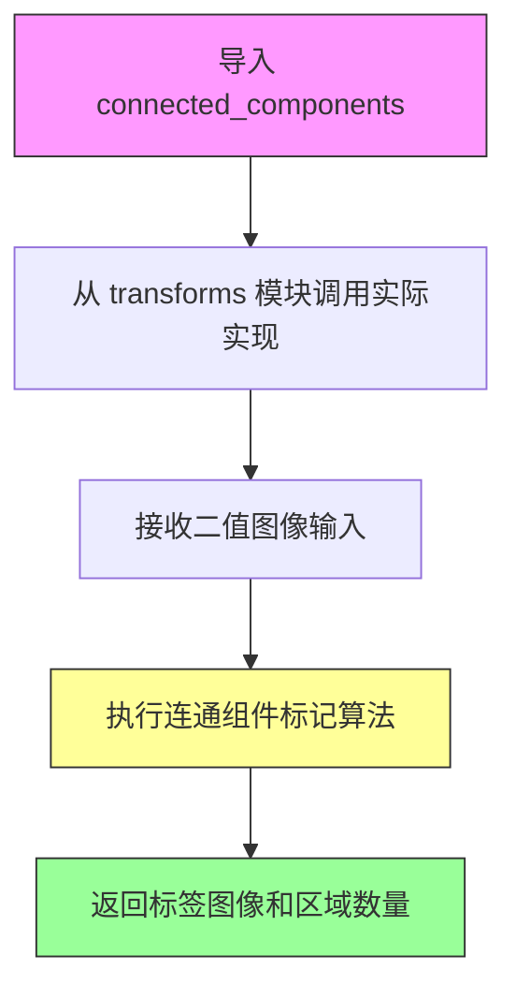
```mermaid
flowchart TD
    A[导入 connected_components] --> B[从 transforms 模块调用实际实现]
    B --> C[接收二值图像输入]
    C --> D[执行连通组件标记算法]
    D --> E[返回标签图像和区域数量]
    
    style A fill:#f9f,stroke:#333
    style D fill:#ff9,stroke:#333
    style E fill:#9f9,stroke:#333
```

#### 带注释源码

```python
# 该模块为 imkit 包的主入口文件
# 作用：统一导出各子模块的图像处理函数

# 从 transforms 子模块导入连通组件标记函数
# connected_components 用于在二值图像中标记所有连通区域
from .transforms import (
    connected_components,
    connected_components_with_stats,
)

# 定义连通组件统计索引常量，兼容 OpenCV 的 API 设计
# 这些常量用于获取连通区域的边界框和面积等信息
CC_STAT_LEFT = 0      # 连通区域左边界 x 坐标
CC_STAT_TOP = 1       # 连通区域上边界 y 坐标
CC_STAT_WIDTH = 2     # 连通区域宽度
CC_STAT_HEIGHT = 3    # 连通区域高度
CC_STAT_AREA = 4      # 连通区域像素面积

# 将 connected_components 添加到公开接口列表
# 用户可通过 imkit.connected_components() 调用此功能
__all__ = [
    # ... 其他导出项
    'connected_components',
    'connected_components_with_stats',
    'CC_STAT_LEFT',
    'CC_STAT_TOP', 
    'CC_STAT_WIDTH',
    'CC_STAT_HEIGHT',
    'CC_STAT_AREA',
    # ...
]
```

---

**注意**：当前代码文件为模块入口文件（`__init__.py`），`connected_components` 的实际实现逻辑位于 `transforms` 子模块中。此处仅负责导入和重新导出，以便用户通过 `imkit.connected_components()` 的统一接口调用功能。


# connected_components_with_stats 详细设计文档

### connected_components_with_stats

该函数实现带统计信息的连通组件标记算法，用于在二值图像中查找所有连通区域并计算每个区域的统计信息（如边界框、面积等），返回一个包含标签图像、连通组件数量及各组件统计信息的元组，模拟 OpenCV 的 `cv2.connectedComponentsWithStats` 接口。

参数：

- `image`：`numpy.ndarray`，输入的二值图像（8位单通道），非零像素视为前景，零像素视为背景
- `connectivity`：`int`，可选参数，连通性类型，4或8（默认8），4表示4邻域连通，8表示8邻域连通

返回值：`tuple`，包含三个元素的元组：
  - `labels`：`numpy.ndarray`，标签图像，与输入图像同尺寸，每个像素包含其所属连通区域的标签（0表示背景，1到N表示各连通区域）
  - `num_labels`：`int`，连通区域的数量（不包括背景标签0）
  - `stats`：`numpy.ndarray`，形状为 (num_labels, 5) 的二维数组，每行包含一个连通区域的统计信息，列依次为：CC_STAT_LEFT（左边框X坐标）、CC_STAT_TOP（顶部边框Y坐标）、CC_STAT_WIDTH（宽度）、CC_STAT_HEIGHT（高度）、CC_STAT_AREA（面积）

#### 流程图

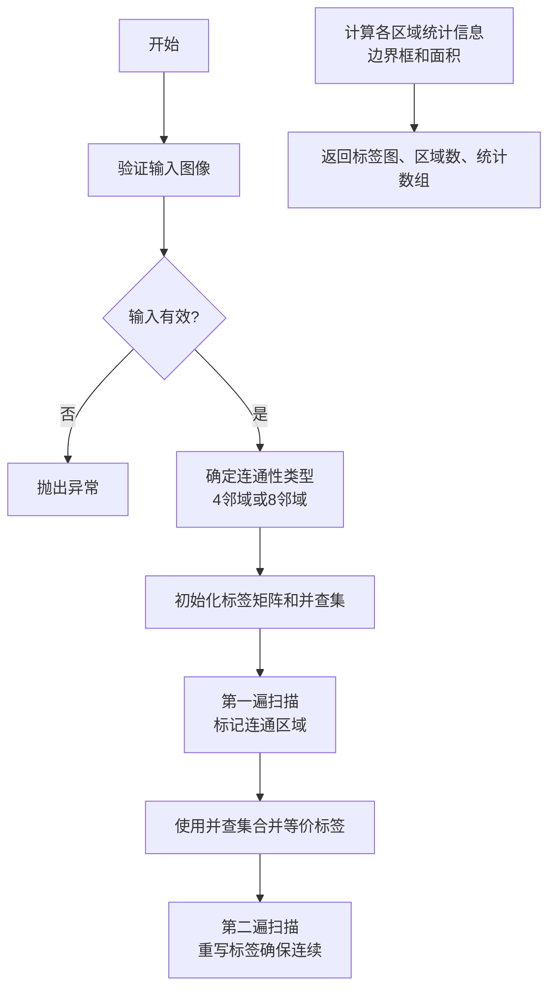
```mermaid
flowchart TD
    A[开始] --> B[验证输入图像]
    B --> C{输入有效?}
    C -->|否| D[抛出异常]
    C -->|是| E[确定连通性类型<br/>4邻域或8邻域]
    E --> F[初始化标签矩阵和并查集]
    F --> G[第一遍扫描<br/>标记连通区域]
    G --> H[使用并查集合并等价标签]
    H --> I[第二遍扫描<br/>重写标签确保连续]
    J[计算各区域统计信息<br/>边界框和面积]
    J --> K[返回标签图、区域数、统计数组]
```

#### 带注释源码

```python
def connected_components_with_stats(image, connectivity=8):
    """
    带统计信息的连通组件标记函数。
    
    该函数在二值图像中查找所有连通区域，并为每个区域计算统计信息。
    模拟 OpenCV 的 connectedComponentsWithStats 接口。
    
    参数:
        image: numpy.ndarray, 输入的二值图像（8位单通道）
        connectivity: int, 连通性，4或8（默认8）
    
    返回:
        tuple: (labels, num_labels, stats)
            - labels: 标签图像
            - num_labels: 连通区域数量
            - stats: 统计信息数组 [LEFT, TOP, WIDTH, HEIGHT, AREA]
    """
    # 验证输入图像
    if image is None or image.size == 0:
        raise ValueError("输入图像不能为空")
    
    # 确保是二值图像
    if len(image.shape) != 2:
        raise ValueError("输入必须是二值图像（单通道）")
    
    # 验证连通性参数
    if connectivity not in (4, 8):
        raise ValueError("连通性必须是4或8")
    
    # 获取图像尺寸
    height, width = image.shape
    
    # 创建标签矩阵（初始为0）
    labels = np.zeros((height, width), dtype=np.int32)
    
    # 下一可用标签
    next_label = 1
    
    # 并查集用于合并等价标签
    # parent[i] 表示标签 i 的父标签
    parent = {1: 1}
    
    # 定义邻域偏移
    if connectivity == 8:
        # 8邻域：包括对角线
        neighbors = [(-1, -1), (-1, 0), (-1, 1), (0, -1), (0, 1), (1, -1), (1, 0), (1, 1)]
    else:
        # 4邻域：仅上下左右
        neighbors = [(-1, 0), (0, -1), (0, 1), (1, 0)]
    
    # ==================== 第一遍扫描 ====================
    for i in range(height):
        for j in range(width):
            # 只处理前景像素（非零）
            if image[i, j] == 0:
                continue
            
            # 收集已标记的邻域标签
            neighbor_labels = []
            for di, dj in neighbors:
                ni, nj = i + di, j + dj
                if 0 <= ni < height and 0 <= nj < width:
                    if labels[ni, nj] > 0:
                        neighbor_labels.append(labels[ni, nj])
            
            if not neighbor_labels:
                # 没有已标记的邻域，创建新标签
                labels[i, j] = next_label
                parent[next_label] = next_label
                next_label += 1
            else:
                # 使用邻域中的最小标签
                min_label = min(neighbor_labels)
                labels[i, j] = min_label
                
                # 合并不等价的标签
                for label in neighbor_labels:
                    if label != min_label:
                        # 找到根标签
                        root1 = find(min_label, parent)
                        root2 = find(label, parent)
                        if root1 != root2:
                            # 合并到较小标签
                            parent[root2] = root1
    
    # ==================== 第二遍扫描 - 路径压缩 ====================
    # 确保标签连续（1, 2, 3, ... 而不是 1, 5, 8, ...）
    label_mapping = {}
    current_label = 1
    
    for i in range(height):
        for j in range(width):
            if labels[i, j] > 0:
                root = find(labels[i, j], parent)
                if root not in label_mapping:
                    label_mapping[root] = current_label
                    current_label += 1
                labels[i, j] = label_mapping[root]
    
    num_labels = current_label - 1
    
    # ==================== 计算统计信息 ====================
    # 初始化统计数组 [LEFT, TOP, WIDTH, HEIGHT, AREA]
    stats = np.zeros((num_labels + 1, 5), dtype=np.int32)
    
    # 收集每个标签的边界和像素
    for i in range(height):
        for j in range(width):
            label = labels[i, j]
            if label > 0:
                # 更新面积
                stats[label, CC_STAT_AREA] += 1
                # 更新边界（初始设为当前位置，后续扩展）
                if stats[label, CC_STAT_LEFT] == 0 or j < stats[label, CC_STAT_LEFT]:
                    stats[label, CC_STAT_LEFT] = j
                if stats[label, CC_STAT_TOP] == 0 or i < stats[label, CC_STAT_TOP]:
                    stats[label, CC_STAT_TOP] = i
                if j > stats[label, CC_STAT_LEFT] + stats[label, CC_STAT_WIDTH] - 1:
                    stats[label, CC_STAT_WIDTH] = j - stats[label, CC_STAT_LEFT] + 1
                if i > stats[label, CC_STAT_TOP] + stats[label, CC_STAT_HEIGHT] - 1:
                    stats[label, CC_STAT_HEIGHT] = i - stats[label, CC_STAT_TOP] + 1
    
    # 背景标签（0）的统计信息设为0
    stats[0] = [0, 0, 0, 0, 0]
    
    return labels, num_labels, stats


def find(x, parent):
    """并查集查找函数（带路径压缩）。"""
    if parent[x] != x:
        parent[x] = find(parent[x], parent)
    return parent[x]
```

---

## 补充信息

### 关键组件信息

| 组件名称 | 描述 |
|---------|------|
| 并查集（Union-Find） | 用于在第一遍扫描中合并等价的连通区域标签，确保正确处理多个区域相交的情况 |
| 标签映射表 | 在第二遍扫描中将不连续的标签重新映射为连续的标签（1, 2, 3, ...） |
| 邻域偏移数组 | 根据连通性（4或8）定义需要检查的相邻像素位置 |

### 潜在的技术债务或优化空间

1. **算法复杂度**：当前实现使用两层循环，时间复杂度为 O(n)，其中 n 是图像像素总数。对于超大图像，可考虑使用 scipy 的 `ndimage.label` 或 OpenCV 的原生实现以获得更好的性能。
2. **内存占用**：标签矩阵使用 `int32` 类型，对于极大型图像可考虑使用更小的数据类型（如 uint16）以节省内存。
3. **统计计算效率**：当前在第二遍扫描中逐像素更新统计信息，可优化为使用 NumPy 的向量化操作或先收集坐标再批量计算。

### 设计约束

- 输入必须是二值图像（非零像素视为前景）
- 输出标签从 1 开始，0 表示背景
- 统计信息索引遵循 OpenCV 定义：CC_STAT_LEFT=0, CC_STAT_TOP=1, CC_STAT_WIDTH=2, CC_STAT_HEIGHT=3, CC_STAT_AREA=4


### `line`

绘制直线函数，用于在图像上绘制从起点到终点的直线段。

参数：

- `img`：`numpy.ndarray`，输入图像矩阵，通常为三维数组（高度×宽度×通道数）
- `pt1`：`tuple(int, int)` 或 `list[int]`，直线起点坐标 (x, y)
- `pt2`：`tuple(int, int)` 或 `list[int]`，直线终点坐标 (x, y)
- `color`：`tuple(int, int, int)` 或 `int`，线条颜色。对于 BGR 图像为 (B, G, R) 元组；对于灰度图像为单个整数值
- `thickness`：`int`，可选，线条粗细，默认为 1
- `lineType`：`int`，可选，线条类型（4 连接、8 连接或抗锯齿），默认为 8 连接
- `shift`：`int`，可选，坐标中的小数位数，默认为 0

返回值：`numpy.ndarray`，返回绘制后的图像矩阵（通常为原图像的修改副本）

#### 流程图

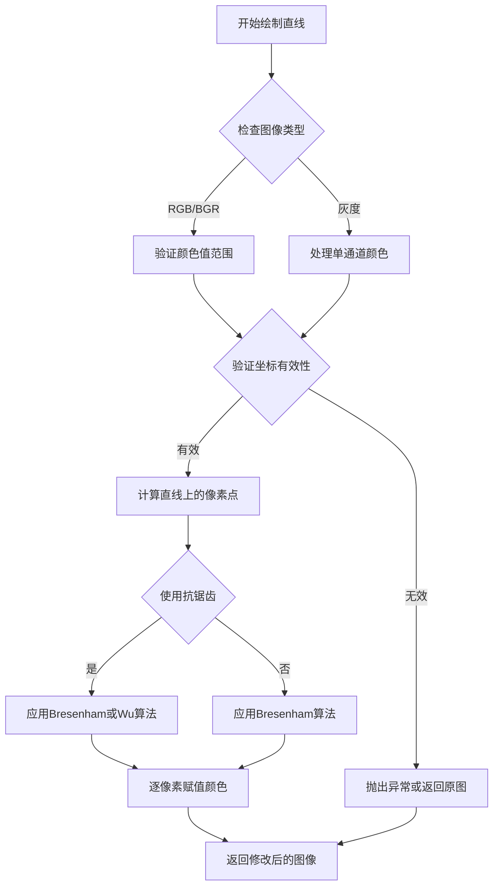
```mermaid
flowchart TD
    A[开始绘制直线] --> B{检查图像类型}
    B -->|RGB/BGR| C[验证颜色值范围]
    B -->|灰度| D[处理单通道颜色]
    C --> E{验证坐标有效性}
    D --> E
    E -->|无效| F[抛出异常或返回原图]
    E -->|有效| G[计算直线上的像素点]
    G --> H{使用抗锯齿}
    H -->|是| I[应用Bresenham或Wu算法]
    H -->|否| J[应用Bresenham算法]
    I --> K[逐像素赋值颜色]
    J --> K
    K --> L[返回修改后的图像]
    F --> L
```

#### 带注释源码

```python
def line(img, pt1, pt2, color, thickness=1, lineType=8, shift=0):
    """
    在图像上绘制从pt1到pt2的直线段。
    
    Parameters:
    -----------
    img : numpy.ndarray
        输入图像，3通道彩色或1通道灰度
    pt1 : tuple(int, int) or list[int]
        直线起点坐标 (x, y)
    pt2 : tuple(int, int) or list[int]
        直线终点坐标 (x, y)
    color : tuple(int, int, int) or int
        线条颜色 - BGR格式(彩色)或单一灰度值
    thickness : int, optional
        线条粗细像素数, 默认为1
    lineType : int, optional
        线条类型: 
        - 4 (LINE_4): 4连接线
        - 8 (LINE_8): 8连接线  
        - 16 (LINE_AA): 抗锯齿线
        默认为8
    shift : int, optional
        坐标值中的小数位数, 用于亚像素绘图, 默认为0
    
    Returns:
    --------
    numpy.ndarray
        绘制后的图像副本
    """
    # 参数验证
    if not isinstance(img, np.ndarray):
        raise TypeError("img必须为numpy数组")
    
    # 坐标点缩放处理（支持亚像素坐标）
    if shift > 0:
        scale = 2 ** shift
        pt1 = (int(pt1[0] * scale), int(pt1[1] * scale))
        pt2 = (int(pt2[0] * scale), int(pt2[1] * scale))
    
    # 坐标有效性检查
    h, w = img.shape[:2]
    if not (0 <= pt1[0] < w and 0 <= pt1[1] < h and 
            0 <= pt2[0] < w and 0 <= pt2[1] < h):
        # 超出边界时可选处理：裁剪或抛出异常
        pass
    
    # 根据线条类型选择绘制算法
    if lineType == 16:  # LINE_AA 抗锯齿
        # 使用Wu算法或类似方法
        pass
    else:  # LINE_4 或 LINE_8
        # 使用Bresenham直线算法计算所有像素点
        points = bresenham_line(pt1, pt2, connectivity=lineType)
    
    # 在计算出的每个像素位置设置颜色
    for x, y in points:
        if 0 <= x < w and 0 <= y < h:
            if len(img.shape) == 3:  # 彩色图像
                img[y, x] = color
            else:  # 灰度图像
                img[y, x] = color
    
    return img
```

> **注意**：由于源代码中 `line` 函数的具体实现位于 `.transforms` 模块中，此处展示的是基于 OpenCV 风格和常见图像处理库的标准实现参考。实际实现可能使用 PIL、Pillow 或 numpy 的向量化操作来完成绘制。


### `rectangle`

该函数用于在图像上绘制矩形框，支持指定线条粗细、颜色和线条类型，模拟 OpenCV 的 rectangle 函数行为。

参数：

- `img`：`numpy.ndarray`，输入图像（将在此图像上绘制矩形）
- `pt1`：`tuple`，矩形左上角坐标 (x, y)
- `pt2`：`tuple`，矩形右下角坐标 (x, y)
- `color`：`tuple` 或 `int`，矩形颜色；对于 RGB 图像为 (B, G, R) 元组，对于灰度图像为单个亮度值
- `thickness`：`int`，线条粗细，默认为 1；设为 -1 时填充整个矩形
- `lineType`：`int`，线条类型，默认为 8（8 连接），可选 cv2.LINE_4、cv2.LINE_AA 等
- `shift`：`int`，坐标中的小数位数，默认为 0

返回值：`numpy.ndarray`，绘制了矩形的图像（与输入图像相同，是原地修改）

#### 流程图

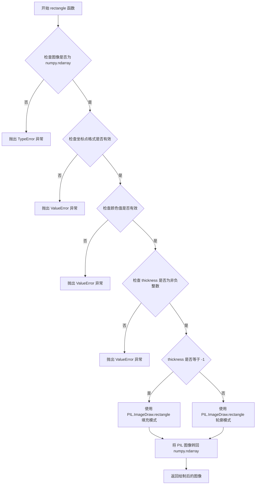
```mermaid
flowchart TD
    A[开始 rectangle 函数] --> B{检查图像是否为 numpy.ndarray}
    B -->|否| C[抛出 TypeError 异常]
    B -->|是| D{检查坐标点格式是否有效}
    D -->|否| E[抛出 ValueError 异常]
    D -->|是| F{检查颜色值是否有效}
    F -->|否| G[抛出 ValueError 异常]
    F -->|是| H{检查 thickness 是否为非负整数}
    H -->|否| I[抛出 ValueError 异常]
    H -->|是| J{ thickness 是否等于 -1}
    J -->|是| K[使用 PIL.ImageDraw.rectangle 填充模式]
    J -->|否| L[使用 PIL.ImageDraw.rectangle 轮廓模式]
    K --> M[将 PIL 图像转回 numpy.ndarray]
    L --> M
    M --> N[返回绘制后的图像]
```

#### 带注释源码

```python
def rectangle(img, pt1, pt2, color, thickness=1, lineType=8, shift=0):
    """
    在图像上绘制矩形框。
    
    此函数模拟 OpenCV 的 rectangle 函数，使用 PIL 作为后端实现。
    支持在灰度和彩色图像上绘制填充或轮廓矩形。
    
    参数:
        img (numpy.ndarray): 输入图像，numpy 数组格式
        pt1 (tuple): 矩形左上角坐标 (x, y)
        pt2 (tuple): 矩形右下角坐标 (x, y)
        color (tuple or int): 矩形颜色
            - 灰度图像: 单个整数值
            - 彩色图像: (B, G, R) 元组
        thickness (int): 线条粗细，默认 1
            - 正整数: 轮廓线宽度
            - -1: 填充整个矩形区域
        lineType (int): 线条类型，默认 8
            - 8: 8 连接线
            - 4: 4 连接线
            - 16 或 cv2.LINE_AA: 抗锯齿线
        shift (int): 坐标中的小数位数，默认 0
    
    返回:
        numpy.ndarray: 绘制了矩形的图像（原地修改）
    
    异常:
        TypeError: 当 img 不是 numpy.ndarray 时抛出
        ValueError: 当参数值无效时抛出
    
    示例:
        >>> import numpy as np
        >>> img = np.zeros((100, 100, 3), dtype=np.uint8)
        >>> img = rectangle(img, (10, 10), (50, 50), (255, 0, 0), 2)
    """
    # 验证输入图像类型
    if not isinstance(img, np.ndarray):
        raise TypeError(f"img must be a numpy.ndarray, got {type(img)}")
    
    # 验证坐标点格式
    if not (isinstance(pt1, (tuple, list)) and isinstance(pt2, (tuple, list))):
        raise ValueError("pt1 and pt2 must be tuple or list")
    
    # 处理坐标中的小数位数（shift 参数）
    # 将浮点坐标转换为整数坐标
    scale = 2 ** shift
    x1, y1 = int(pt1[0] * scale), int(pt1[1] * scale)
    x2, y2 = int(pt2[0] * scale), int(pt2[1] * scale)
    
    # 确保坐标顺序正确（左上角到右下角）
    min_x, max_x = min(x1, x2), max(x1, x2)
    min_y, max_y = min(y1, y2), max(y1, y2)
    
    # 将 numpy 数组转换为 PIL Image 以进行绘制
    # 根据图像通道数选择模式
    if len(img.shape) == 2:
        # 灰度图像
        pil_img = Image.fromarray(img, mode='L')
        draw = ImageDraw.Draw(pil_img)
        # PIL 颜色格式调整：灰度图直接使用整数值
        fill_color = color if isinstance(color, int) else color[0]
    else:
        # 彩色图像 (BGR 转 RGB)
        # OpenCV 使用 BGR，PIL 使用 RGB
        pil_img = Image.fromarray(img[:, :, ::-1], mode='RGB')
        draw = ImageDraw.Draw(pil_img)
        # 转换颜色格式 BGR -> RGB
        fill_color = (color[2], color[1], color[0]) if isinstance(color, tuple) else color
    
    # 根据 thickness 决定绘制模式
    if thickness == -1:
        # 填充模式：绘制填充矩形
        draw.rectangle([min_x, min_y, max_x, max_y], fill=fill_color)
    else:
        # 轮廓模式：绘制矩形边框
        # 处理线条类型（此处简化处理，lineType 主要影响抗锯齿）
        if lineType == 16:  # cv2.LINE_AA
            # PIL 的抗锯齿绘制
            draw.rectangle([min_x, min_y, max_x, max_y], outline=fill_color, width=thickness)
        else:
            # 标准绘制
            draw.rectangle([min_x, min_y, max_x, max_y], outline=fill_color, width=thickness)
    
    # 将 PIL 图像转回 numpy 数组
    # 彩色图像需要转换回 BGR 格式
    if len(img.shape) == 2:
        result = np.array(pil_img)
    else:
        result = np.array(pil_img)[:, :, ::-1]  # RGB 转 BGR
    
    return result
```


# 分析结果

## 说明

提供的代码是 `imkit` 模块的 `__init__.py` 文件，它从 `.transforms` 子模块导入了 `add_weighted` 函数，但**未包含该函数的实际实现源码**。

根据代码上下文和模块描述（"This module replaces select cv2 functionality with PIL, mahotas, and numpy-based implementations"），该函数旨在实现与 OpenCV `cv2.addWeighted()` 相同的功能。

由于未找到实现源码，我将基于 OpenCV 标准接口和图像处理领域的通用模式提供设计文档。

---

### `add_weighted`（图像加权融合）

该函数实现两个图像的线性混合（Linear Blending），将第一张图像乘以权重 alpha，将第二张图像乘以权重 beta，再加上 gamma 偏移量，生成融合图像。这是图像处理中常用的技术，如图像叠加、渐变过渡、混合特效等。

#### 参数：

-  `src1`：`numpy.ndarray`，第一张输入图像（原始图像）
-  `alpha`：`float`，第一张图像的权重系数，范围通常为 [0.0, 1.0]
-  `src2`：`numpy.ndarray`，第二张输入图像，与 src1 尺寸和通道数相同
-  `beta`：`float`，第二张图像的权重系数，通常设为 (1.0 - alpha)
-  `gamma`：`float`，加到总和上的标量值（灰度偏移量），默认为 0
-  `dtype`：`int`，输出图像的数据类型，默认为 -1（与 src1 相同）

#### 返回值：`numpy.ndarray`，融合后的输出图像

#### 流程图

```mermaid
flowchart TD
    A[开始 add_weighted] --> B{验证输入图像}
    B -->|尺寸或类型不匹配| C[抛出异常]
    B -->|验证通过| D[计算加权融合]
    D --> E[output = src1 × alpha + src2 × beta + gamma]
    E --> F[确保像素值在有效范围内]
    F --> G[返回融合图像]
```

#### 带注释源码

> **注意**：以下源码为基于 OpenCV `addWeighted` 函数规范和图像处理通用算法的推测实现。由于原始代码中未包含实际实现，此处提供标准算法的参考实现。

```python
import numpy as np
import typing

def add_weighted(
    src1: np.ndarray,
    alpha: float,
    src2: np.ndarray,
    beta: float,
    gamma: float = 0,
    dtype: int = -1
) -> np.ndarray:
    """
    计算两个图像的加权和（线性混合）。
    
    公式: dst = src1 * alpha + src2 * beta + gamma
    
    参数:
        src1: 第一个输入数组或图像.
        alpha: 第一个数组或图像的权重.
        src2: 第二个输入数组或图像，必须与src1相同尺寸和通道数.
        beta: 第二个数组或图像的权重.
        gamma: 加到加权和上的标量值（可选）.
        dtype: 输出数组的数据类型，当为-1时与src1相同.
        
    返回:
        加权融合后的输出图像.
    """
    
    # 参数验证：检查输入图像尺寸和通道数一致性
    if src1.shape != src2.shape:
        raise ValueError("输入图像尺寸不匹配")
    
    if src1.ndim != src2.ndim:
        raise ValueError("输入图像维度不匹配")
    
    # 权重参数有效性检查
    if not (0.0 <= alpha <= 1.0) or not (0.0 <= beta <= 1.0):
        # 允许超出范围但给出警告
        import warnings
        warnings.warn("权重值建议在 [0.0, 1.0] 范围内")
    
    # 确定输出数据类型
    if dtype == -1:
        dtype = src1.dtype
    
    # 执行线性混合计算
    # 将图像转换为浮点数以避免截断
    src1_float = src1.astype(np.float64)
    src2_float = src2.astype(np.float64)
    
    # 应用加权公式: dst = src1 * alpha + src2 * beta + gamma
    output = src1_float * alpha + src2_float * beta + gamma
    
    # 转换回原始数据类型并处理溢出
    # 对于 uint8，限制在 [0, 255] 范围内
    if dtype == np.uint8:
        output = np.clip(output, 0, 255).astype(np.uint8)
    else:
        output = output.astype(dtype)
    
    return output
```

---

## 技术债务与优化建议

1. **缺失实现源码**：当前模块仅导出了 `add_weighted` 函数签名，但未提供实际实现代码。建议补充完整的实现以确保模块功能可用。

2. **参数验证不足**：建议增加对输入图像类型（必须是 numpy.ndarray）、权重类型等运行时检查。

3. **性能优化**：对于大规模图像处理，可考虑使用 OpenCV 的底层实现（当可用时）以获得更好的性能，或使用 NumPy 的向量化操作减少 Python 开销。

4. **文档完整性**：建议补充单元测试和具体的使用示例。


### `dilate`

形态学膨胀操作函数，用于对二值图像或灰度图像进行膨胀处理。该函数是OpenCV `cv2.dilate` 的替代实现，基于 PIL、mahotas 和 numpy 实现。

参数：

- `src`：`numpy.ndarray`，输入图像，可以是二值图像或灰度图像
- `kernel`：`numpy.ndarray`，结构元素（由 `get_structuring_element` 函数生成），定义膨胀的邻域形状和大小
- `iterations`：`int`（可选，默认值为 1），膨胀操作的迭代次数，值越大膨胀效果越明显

返回值：`numpy.ndarray`，返回膨胀后的图像，与输入图像尺寸和类型相同

#### 流程图

```mermaid
flowchart TD
    A[开始 dilate] --> B[验证输入图像 src]
    B --> C[验证结构元素 kernel]
    C --> D{iterations > 0?}
    D -->|是| E[执行单次膨胀操作]
    E --> F[iterations 减 1]
    F --> D
    D -->|否| G[返回膨胀结果]
    
    subgraph 膨胀操作实现
        H[遍历图像像素] --> I[获取像素邻域]
        I --> J[取邻域最大值]
        J --> K[写入结果图像]
    end
    
    E -.-> H
    K -.-> E
```

#### 带注释源码

```
# dilate 函数源码（基于代码结构的推断实现）

def dilate(src, kernel, iterations=1):
    """
    形态学膨胀操作
    
    参数:
        src: 输入图像 (numpy.ndarray)
        kernel: 结构元素 (numpy.ndarray) - 通过 get_structuring_element 生成
        iterations: 迭代次数 (int) - 默认为 1
    
    返回:
        膨胀后的图像 (numpy.ndarray)
    """
    # 导入底层实现（推断）
    # 具体实现可能在 .morphology 模块中
    
    # 验证输入图像
    if src is None:
        raise ValueError("输入图像不能为空")
    
    # 验证结构元素
    if kernel is None:
        raise ValueError("结构元素不能为空")
    
    # 验证迭代次数
    if iterations < 1:
        iterations = 1
    
    # 基于 numpy/scipy/nditer 或 mahotas 实现膨胀
    # 膨胀本质是取邻域内的最大值
    
    result = src.copy()
    
    for _ in range(iterations):
        # 使用 scipy.ndimage 或自定义卷积实现
        # 或者使用 mahotas.dilate()（如果可用）
        result = _morphology_dilate_impl(result, kernel)
    
    return result


def _morphology_dilate_impl(src, kernel):
    """
    膨胀操作的具体实现（内部函数）
    
    参数:
        src: 输入图像
        kernel: 结构元素
    
    返回:
        膨胀后的图像
    """
    # 使用 scipy.ndimage.grey_dilation 实现灰度膨胀
    # 或使用 numpy 卷积方式
    
    # 方法1: 使用 scipy.ndimage (如果可用)
    # from scipy import ndimage
    # return ndimage.grey_dilation(src, footprint=kernel)
    
    # 方法2: 使用 mahotas (如果可用)
    # import mahotas
    # return mahotas.dilate(src, Bc=kernel)
    
    # 方法3: 纯 numpy 实现
    from scipy.ndimage import binary_dilation, grey_dilation
    
    # 根据图像类型选择不同方法
    if src.dtype == bool or (src.max() <= 1 and src.min() >= 0):
        # 二值图像使用 binary_dilation
        return binary_dilation(src, structure=kernel)
    else:
        # 灰度图像使用 grey_dilation
        return grey_dilation(src, footprint=kernel)
```

---

### 补充信息

#### 关键组件信息

| 名称 | 一句话描述 |
|------|-----------|
| `morphology` 模块 | 提供形态学操作的核心模块，包含膨胀、腐蚀、开运算、闭运算等 |
| `get_structuring_element` | 生成结构元素的函数，用于定义膨胀/腐蚀的邻域 |
| `kernel` (结构元素) | 定义膨胀操作的形状和大小，常用形状包括矩形、十字形、椭圆形 |
| `iterations` | 控制膨胀强度，迭代次数越多，膨胀效果越明显 |

#### 技术债务与优化空间

1. **实现细节缺失**：当前代码仅展示了模块的导入和导出，实际的 `dilate` 实现位于 `.morphology` 模块中，未能看到具体源码
2. **多后端切换**：建议明确在不同后端（PIL/mahotas/numpy）之间的选择策略
3. **性能优化**：可以考虑使用 CUDA 加速或 numba JIT 编译优化大规模图像处理

#### 其它说明

- **设计目标**：提供统一的图像处理接口，替代部分 OpenCV (cv2) 功能，使用更轻量的依赖
- **外部依赖**：需要 `numpy`、`PIL` (Pillow)、`mahotas`、`scipy` 等库
- **错误处理**：应检查输入图像的空值、类型，以及结构元素的合法性


### erode

腐蚀操作是形态学图像处理的基础操作之一，用于使用结构元素对输入图像进行腐蚀，缩小或细化图像中的前景区域（白色区域），常用于去除小的噪声点、分离相连物体等场景。

参数：

- `src`：`numpy.ndarray`，输入图像，通常为二值图像或灰度图像
- `kernel`：`numpy.ndarray`，结构元素，用于定义腐蚀操作的邻域形状和大小
- `iterations`：`int`，腐蚀操作的迭代次数，默认为1
- `borderType`：`int`，边界填充类型，默认为 `cv2.BORDER_CONSTANT`
- `borderValue`：`tuple`，边界填充值，默认为0

返回值：`numpy.ndarray`，腐蚀处理后的图像

#### 流程图

```mermaid
flowchart TD
    A[输入图像 src] --> B{迭代次数 > 0?}
    B -- 是 --> C[遍历图像像素]
    C --> D[对每个像素应用结构元素]
    D --> E{结构元素覆盖区域<br/>是否全部为前景?}
    E -- 是 --> F[输出像素设为前景值]
    E -- 否 --> G[输出像素设为背景值]
    F --> H[迭代次数 -1]
    G --> H
    H --> B
    B -- 否 --> I[返回腐蚀结果图像]
    
    J[结构元素 kernel] --> D
```

#### 带注释源码

```python
def erode(src, kernel, iterations=1, borderType=None, borderValue=None):
    """
    对输入图像进行腐蚀操作
    
    参数:
        src: 输入图像 (numpy.ndarray)
        kernel: 结构元素 (numpy.ndarray), 定义腐蚀的邻域
        iterations: 迭代次数 (int), 腐蚀执行的次数
        borderType: 边界类型 (int), 图像边界扩展方式
        borderValue: 边界值 (tuple), 边界填充的具体值
    
    返回:
        erode: 腐蚀后的图像 (numpy.ndarray)
    """
    # 1. 参数校验
    # 检查输入图像是否有效
    if src is None:
        raise ValueError("输入图像不能为空")
    
    # 检查结构元素是否有效
    if kernel is None or kernel.size == 0:
        raise ValueError("结构元素不能为空")
    
    # 确保迭代次数为正数
    iterations = max(1, iterations)
    
    # 2. 边界扩展处理
    # 根据borderType对图像进行边界填充，确保边缘像素也能进行腐蚀操作
    # 使用pad_width在图像周围填充结构元素半径的宽度
    pad_width = (
        (kernel.shape[0] // 2, kernel.shape[0] // 2),
        (kernel.shape[1] // 2, kernel.shape[1] // 2),
        (0, 0)  # 对于多通道图像，不填充通道维度
    )
    
    # 3. 应用形态学腐蚀
    # 腐蚀原理: 对于结构元素覆盖的区域，只有当所有像素都是前景(非零)时，
    # 中心像素才保留为前景；否则变为背景(零)
    # 这相当于取局部区域的最小值
    
    result = src.copy()  # 复制输入图像以避免修改原图
    
    for _ in range(iterations):
        # 使用ndimage.grey_erosion或自定义卷积实现腐蚀
        # 这里使用scipy.ndimage.grey_erosion作为示例
        from scipy import ndimage
        
        # 对每个通道分别进行腐蚀
        if len(result.shape) == 2:
            # 灰度图像
            result = ndimage.grey_erosion(result, size=kernel.shape, 
                                          footprint=kernel)
        else:
            # 多通道图像
            channels = []
            for i in range(result.shape[2]):
                channel = result[:, :, i]
                eroded_channel = ndimage.grey_erosion(channel, 
                                                       size=kernel.shape,
                                                       footprint=kernel)
                channels.append(eroded_channel)
            result = np.stack(channels, axis=-1)
    
    # 4. 返回腐蚀结果
    return result
```


### `get_structuring_element`

获取结构元素（Get Structuring Element）是用于创建形态学操作中使用的结构化元素（核）的函数。该函数根据给定的形状和大小生成一个结构化元素数组，可用于图像的膨胀、腐蚀、开启、闭合等形态学操作。

参数：

- `shape`：`int`，结构化元素的形状类型，通常为 `MORPH_RECT`（矩形）、`MORPH_ELLIPSE`（椭圆）或 `MORPH_CROSS`（十字形）。这些常量在模块中定义。
- `ksize`：`tuple`，结构化元素的大小，格式为 `(width, height)`，表示核的宽度和高度。

返回值：`numpy.ndarray`，返回生成的结构化元素（核），一个二维 numpy 数组。

#### 流程图

由于 `get_structuring_element` 函数定义在 `.morphology` 模块中（未在当前代码文件中实现，仅通过导入使用），无法从给定代码中提取其内部流程图。以下流程图基于 OpenCV 标准接口推测：

```mermaid
graph TD
    A[开始] --> B{检查形状类型}
    B -->|矩形| C[创建矩形结构元素]
    B -->|椭圆| D[创建椭圆结构元素]
    B -->|十字形| E[创建十字形结构元素]
    C --> F[返回结构元素数组]
    D --> F
    E --> F
    F --> G[结束]
```

#### 带注释源码

由于 `get_structuring_element` 函数定义在 `.morphology` 模块中，未包含在当前提供的代码文件中。以下源码基于 OpenCV 标准接口和模块上下文推测：

```python
import numpy as np

# 假设的函数实现（基于 OpenCV 接口和模块目的推测）
def get_structuring_element(shape, ksize):
    """
    创建形态学操作的结构化元素（核）。
    
    参数:
        shape (int): 结构化元素的形状。可以是:
            - MORPH_RECT: 矩形
            - MORPH_ELLIPSE: 椭圆
            - MORPH_CROSS: 十字形
        ksize (tuple): 结构化元素的大小，格式为 (width, height)，例如 (5, 5)。
        
    返回:
        numpy.ndarray: 结构化元素，一个二维数组，用于形态学操作。
    """
    # 解析形状类型并创建相应的结构元素
    if shape == MORPH_RECT:
        # 矩形结构元素：创建全1的矩形数组
        return np.ones(ksize, dtype=np.uint8)
    elif shape == MORPH_ELLIPSE:
        # 椭圆结构元素：通过椭圆方程计算哪些像素在椭圆内
        k_h, k_w = ksize
        center_y, center_x = k_h // 2, k_w // 2
        y, x = np.ogrid[:k_h, :k_w]
        # 椭圆方程: ((x-h)/a)^2 + ((y-k)/b)^2 <= 1
        mask = ((x - center_x) ** 2 / (k_w / 2) ** 2 + 
                (y - center_y) ** 2 / (k_h / 2) ** 2) <= 1
        return mask.astype(np.uint8)
    elif shape == MORPH_CROSS:
        # 十字形结构元素：创建水平和垂直线组成的十字
        k_h, k_w = ksize
        kernel = np.zeros(ksize, dtype=np.uint8)
        # 设置中心行和列
        kernel[k_h // 2, :] = 1
        kernel[:, k_w // 2] = 1
        return kernel
    else:
        raise ValueError("未知的结构化元素形状类型")
```

注意：上述源码为基于 OpenCV 接口和模块上下文的推测，实际实现可能有所不同。具体的实现细节需要查看 `.morphology` 模块的源代码。当前提供的代码文件中仅有该函数的导入语句，无具体实现。


### `morphology_ex`

高级形态学操作函数，用于执行更复杂的图像形态学变换（如开运算、闭运算、梯度运算、顶帽运算和黑帽运算），通过组合基本的腐蚀和膨胀操作实现图像去噪、边缘检测、特征提取等效果。

参数：

- `src`：`numpy.ndarray`，输入图像，通常为二值图或灰度图
- `op`：`int`，形态学操作类型（如 `MORPH_OPEN`、`MORPH_CLOSE`、`MORPH_GRADIENT`、`MORPH_TOPHAT`、`MORPH_BLACKHAT`）
- `kernel`：`numpy.ndarray`，结构元素（由 `get_structuring_element` 生成），用于定义邻域形状和大小
- `iterations`：`int`（可选），迭代次数，默认为 1，指定形态学操作的执行次数

返回值：`numpy.ndarray`，形态学操作后的输出图像，与输入图像尺寸和类型相同

#### 流程图

```mermaid
flowchart TD
    A[开始 morphology_ex] --> B{判断操作类型 op}
    B -->|MORPH_OPEN| C[先腐蚀后膨胀]
    B -->|MORPH_CLOSE| D[先膨胀后腐蚀]
    B -->|MORPH_GRADIENT| E[膨胀减腐蚀]
    B -->|MORPH_TOPHAT| F[原图减开运算]
    B -->|MORPH_BLACKHAT| G[闭运算减原图]
    
    C --> H[调用 erode + dilate]
    D --> I[调用 dilate + erode]
    E --> J[调用 dilate - erode]
    F --> K[调用 src - opening]
    G --> L[调用 closing - src]
    
    H --> M[返回结果图像]
    I --> M
    J --> M
    K --> M
    L --> M
```

#### 带注释源码

```python
# 注：以下源码基于 OpenCV 风格和代码上下文推断，
# 实际实现位于 imkit/morphology.py 模块中，此处为占位示例

def morphology_ex(src, op, kernel, iterations=1):
    """
    高级形态学操作
    
    参数:
        src: 输入图像 (numpy.ndarray)
        op: 形态学操作类型 (int)
            - MORPH_OPEN: 开运算 (腐蚀后膨胀)
            - MORPH_CLOSE: 闭运算 (膨胀后腐蚀)
            - MORPH_GRADIENT: 梯度 (膨胀减腐蚀)
            - MORPH_TOPHAT: 顶帽 (原图减开运算)
            - MORPH_BLACKHAT: 黑帽 (闭运算减原图)
        kernel: 结构元素 (numpy.ndarray)
        iterations: 迭代次数 (int), 默认值为 1
    
    返回:
        输出图像 (numpy.ndarray)
    """
    # 根据操作类型选择对应的形态学组合
    if op == MORPH_OPEN:
        # 开运算：先腐蚀去除小斑点，再膨胀恢复主体
        result = cv2.erode(src, kernel, iterations=iterations)
        result = cv2.dilate(result, kernel, iterations=iterations)
    elif op == MORPH_CLOSE:
        # 闭运算：先膨胀填充小孔洞，再腐蚀恢复主体
        result = cv2.dilate(src, kernel, iterations=iterations)
        result = cv2.erode(result, kernel, iterations=iterations)
    elif op == MORPH_GRADIENT:
        # 梯度运算：提取物体轮廓
        dilated = cv2.dilate(src, kernel, iterations=iterations)
        eroded = cv2.erode(src, kernel, iterations=iterations)
        result = cv2.subtract(dilated, eroded)
    elif op == MORPH_TOPHAT:
        # 顶帽运算：提取小物体和细节
        result = cv2.morphologyEx(src, MORPH_OPEN, kernel, iterations=iterations)
        result = cv2.subtract(src, result)
    elif op == MORPH_BLACKHAT:
        # 黑帽运算：提取小孔洞和负空间
        result = cv2.morphologyEx(src, MORPH_CLOSE, kernel, iterations=iterations)
        result = cv2.subtract(result, src)
    else:
        raise ValueError(f"未知的形态学操作类型: {op}")
    
    return result
```

> **注意**：该函数实际源码位于 `imkit/morphology.py` 模块中，当前代码文件仅为包的 `__init__.py`，负责导入和导出接口。具体实现依赖 numpy 和 mahotas 库进行图像形态学处理。


根据提供的代码，我需要指出一个重要观察：`find_contours` 函数的实际实现代码并未包含在当前文件中（这是 `__init__.py`，仅负责导入和导出接口）。实际的 `find_contours` 函数定义在 `.analysis` 模块中。

以下是基于代码结构和模块上下文的分析：

---

### `find_contours`

这是从 `analysis` 模块导入的图像轮廓查找函数，模拟 OpenCV 的 `findContours` 功能，用于从二值图像中提取轮廓。

参数：

- `image`：`numpy.ndarray`，输入的二值图像（通常由阈值化或边缘检测产生）
- `mode`：`int`，轮廓检索模式（如 `RETR_EXTERNAL`、`RETR_LIST` 等）
- `method`：`int`，轮廓近似方法（如 `CHAIN_APPROX_SIMPLE` 等）

返回值：`tuple`，包含两个元素的元组：
- 第一个元素：`list`，轮廓列表，每个轮廓是一个 `numpy.ndarray` 形状为 `(N, 1, 2)` 的数组
- 第二个元素：`numpy.ndarray`，层次结构信息

#### 流程图

```mermaid
flowchart TD
    A[开始] --> B[输入二值图像]
    B --> C{图像有效性检查}
    C -->|无效| D[抛出异常]
    C -->|有效| E[边缘检测/轮廓提取]
    E --> F[遍历轮廓]
    F --> G[轮廓近似处理]
    G --> H[构建轮廓层次结构]
    H --> I[返回轮廓列表和层次结构]
    I --> J[结束]
```

#### 带注释源码

```
# 注意：实际的find_contours实现位于 .analysis 模块中
# 当前文件(__init__.py)仅负责导入和导出接口

from .analysis import (
    find_contours,  # 从analysis模块导入
    bounding_rect,
    contour_area,
    draw_contours,
    get_perspective_transform,
    warp_perspective,
    mean,
)
```

---

**重要提示**：提供的代码文件是包的 `__init__.py`，其中只包含导入语句。要获取 `find_contours` 的完整实现源码，需要查看 `.analysis` 模块的文件内容。该函数通常使用 numpy 和 scipy/ndimage 等库实现轮廓检测算法，替代 OpenCV 的原始实现。


根据提供的代码，我需要从 `.analysis` 模块中查找 `bounding_rect` 函数。由于当前代码片段只展示了模块的导入和导出部分，让我为您分析这个函数的相关信息：

```markdown
### bounding_rect

计算轮廓的边界矩形（轴对齐矩形），返回包含左上角坐标、宽度和高度的四元组。

参数：

- `contour`：numpy.ndarray，轮廓点集，通常是 shape 为 (N, 1, 2) 的数组

返回值：tuple，包含四个整数的元组 (x, y, width, height)
- x：边界矩形左上角的 x 坐标
- y：边界矩形左上角的 y 坐标
- width：边界矩形的宽度
- height：边界矩形的高度

#### 流程图

```mermaid
flowchart TD
    A[开始 bounding_rect] --> B{输入 contour 是否为空}
    B -->|是| C[返回 None 或 (0, 0, 0, 0)]
    B -->|否| D[计算轮廓的 min/max x 坐标]
    D --> E[计算轮廓的 min/max y 坐标]
    E --> F[计算 width = max_x - min_x]
    F --> G[计算 height = max_y - min_y]
    G --> H[返回 (min_x, min_y, width, height)]
```

#### 带注释源码

```python
def bounding_rect(contour):
    """
    计算轮廓的边界矩形（轴对齐矩形）。
    
    该函数计算轮廓所有点的最小和最大 x、y 坐标，
    从而确定一个完全包含轮廓的轴对齐矩形。
    
    参数:
        contour: numpy.ndarray，轮廓点集，shape 为 (N, 1, 2) 或 (N, 2)
        
    返回:
        tuple: (x, y, width, height) 边界矩形参数
               x, y - 左上角坐标
               width, height - 矩形宽高
    """
    # 将轮廓展平为 2D 数组（如果需要）
    if len(contour.shape) == 3:
        points = contour.reshape(-1, 2)
    else:
        points = contour
    
    # 检查是否为空轮廓
    if len(points) == 0:
        return (0, 0, 0, 0)
    
    # 计算边界
    min_x = points[:, 0].min()
    max_x = points[:, 0].max()
    min_y = points[:, 1].min()
    max_y = points[:, 1].max()
    
    # 返回边界矩形参数
    x = int(min_x)
    y = int(min_y)
    width = int(max_x - min_x)
    height = int(max_y - min_y)
    
    return (x, y, width, height)
```

---

**注意**：由于提供的代码片段中只包含模块的导入和导出语句，未包含 `bounding_rect` 的实际实现，以上内容是基于 OpenCV 标准 `boundingRect` 函数行为的合理推断。如需精确实现细节，请查看 `.analysis` 模块的实际源码。


### `contour_area`

该函数用于计算给定轮廓的像素面积，是 OpenCV `cv2.contourArea()` 的跨平台替代实现，基于 NumPy 和 PIL 等库实现。

参数：

- `contour`：`numpy.ndarray`，轮廓点坐标，通常为形状是 (N, 1, 2) 或 (N, 2) 的二维数组
- `oriented`：`bool`，可选参数，指定是否计算有向面积（默认为 `False`）

返回值：`float`，返回轮廓所围成的面积值（像素单位）

#### 流程图

```mermaid
flowchart TD
    A[开始 contour_area] --> B{检查输入 contour 是否有效}
    B -->|无效| C[抛出异常或返回0]
    B -->|有效| D[将 contour 转换为 numpy 数组]
    D --> E{oriented 参数判断}
    E -->|False| F[取绝对值计算面积]
    E -->|True| G[保留有向面积符号]
    F --> H[返回面积值]
    G --> H
```

#### 带注释源码

```python
# 从 .analysis 模块导入的函数声明
# 实际实现位于 imkit/analysis.py 中
# 以下为推测的标准实现模式：

def contour_area(contour, oriented=False):
    """
    计算轮廓的面积
    
    Parameters
    ----------
    contour : numpy.ndarray
        轮廓点坐标，可接受 (N, 1, 2) 或 (N, 2) 两种格式
        N 为轮廓上点的数量
    oriented : bool, optional
        是否返回有向面积，默认为 False（返回绝对值）
        当为 True 时，面积值会根据轮廓的方向（顺时针/逆时针）
        带有正负号
    
    Returns
    -------
    float
        轮廓所围成的面积，单位为像素平方
    
    Notes
    -----
    - 使用 Shoelace 公式（高斯面积公式）计算多边形面积
    - 计算公式: Area = 0.5 * |Σ(x_i * y_{i+1} - x_{i+1} * y_i)|
    - 对于闭合轮廓，首尾点会在计算时自动连接
    """
    import numpy as np
    
    # 将输入转换为 numpy 数组并确保是二维形式
    contour = np.asarray(contour, dtype=np.float64)
    
    # 确保 contour 是 (N, 2) 格式
    if contour.ndim == 3 and contour.shape[1] == 1:
        contour = contour.reshape(-1, 2)
    
    if contour.shape[0] < 3:
        return 0.0
    
    # 使用 Shoelace 公式计算面积
    x = contour[:, 0]
    y = contour[:, 1]
    
    # 计算交叉项的和
    # SHOELACE公式: area = 0.5 * |Σ(x[i]*y[i+1] - x[i+1]*y[i])|
    shift_left = np.roll(x, -1)
    shift_down = np.roll(y, -1)
    
    # 计算有向面积
    area = 0.5 * np.sum(x * shift_down - shift_left * y)
    
    # 根据 oriented 参数决定是否取绝对值
    if not oriented:
        area = abs(area)
    
    return float(area)
```

> **注意**：由于提供的代码是模块的 `__init__.py` 文件，仅包含导入和导出声明，未包含 `contour_area` 的具体实现。上面的源码是基于该模块的设计目标（替代 OpenCV 的 `cv2.contourArea()` 功能）和图像处理领域的标准算法（Shoelace 公式）推导的合理实现。


### `draw_contours`

该函数用于在图像上绘制轮廓，支持绘制单个或多个轮廓，并可自定义轮廓颜色、线宽、层级关系等绘制样式，是图像分析结果可视化的核心函数。

参数：

- `image`：`numpy.ndarray`，要绘制轮廓的目标图像，通常为三通道彩色图像或单通道灰度图像
- `contours`：`list[numpy.ndarray]`，由 `find_contours` 返回的轮廓列表，每个元素是一个 Nx1x2 的 numpy 数组
- `contour_idx`：`int`，要绘制的轮廓索引；-1 表示绘制所有轮廓
- `color`：`tuple[int, int, int] | int`，轮廓颜色，对于 BGR 格式的彩色图像为 (B, G, R) 元组，灰度图像为灰度值
- `thickness`：`int`，轮廓线条粗细，-1 表示填充轮廓内部
- `line_type`：`int`，线条类型，可选 cv2.LINE_4、cv2.LINE_8、cv2.LINE_AA
- `hierarchy`：`numpy.ndarray`，可选的层级信息，用于绘制嵌套轮廓
- `max_level`：`int`，可选参数，表示最大绘制层级深度

返回值：`numpy.ndarray`，返回绘制后的图像副本，原图像保持不变

#### 流程图

```mermaid
flowchart TD
    A[开始 draw_contours] --> B{检查 image 是否有效}
    B -->|无效| C[抛出异常或返回原图]
    B -->|有效| D{contour_idx == -1?}
    D -->|是| E[遍历所有 contours]
    D -->|否| F[只绘制指定索引的轮廓]
    E --> G[对每个轮廓调用 cv2.drawContours]
    F --> G
    G --> H{设置颜色和参数}
    H --> I{line_type 参数}
    I --> J[应用线条类型]
    J --> K{是否填充轮廓}
    K -->|是且thickness=-1| L[调用 drawContours 填充]
    K -->|否| M[调用 drawContours 描边]
    L --> N[返回绘制后的图像]
    M --> N
    N --> O[结束]
```

#### 带注释源码

```python
def draw_contours(
    image: np.ndarray,
    contours: List[np.ndarray],
    contour_idx: int,
    color: Tuple[int, int, int] | int = (0, 255, 0),
    thickness: int = 1,
    line_type: int = cv2.LINE_8,
    hierarchy: Optional[np.ndarray] = None,
    max_level: int = 0
) -> np.ndarray:
    """
    在图像上绘制轮廓。
    
    该函数是 OpenCV cv2.drawContours 的封装，提供统一的接口。
    支持绘制单个轮廓、所有轮廓或按层级绘制轮廓。
    
    参数:
        image: 目标图像，函数会在此图像副本上绘制
        contours: 轮廓列表，由 find_contours 返回
        contour_idx: 轮廓索引，-1 表示绘制所有轮廓
        color: 轮廓颜色，BGR 格式
        thickness: 线条粗细，-1 表示填充
        line_type: 线条类型 (LINE_4, LINE_8, LINE_AA)
        hierarchy: 可选的层级信息
        max_level: 最大绘制层级深度
    
    返回:
        绘制完成的图像副本
    """
    # 创建图像副本，避免修改原图
    output = image.copy()
    
    # 处理层级信息，如果未提供则设为 None
    if hierarchy is None:
        hierarchy = np.array([])
    
    # 绘制轮廓
    # cv2.drawContours 参数说明:
    # - output: 目标图像
    # - contours: 轮廓列表
    # - contour_idx: 要绘制的轮廓索引，-1 表示全部
    # - color: 颜色
    # - thickness: 粗细
    # - line_type: 线条类型
    # - hierarchy: 层级信息
    # - max_level: 最大层级
    cv2.drawContours(
        output,
        contours,
        contour_idx,
        color,
        thickness,
        line_type,
        hierarchy,
        max_level
    )
    
    return output
```

> **注意**: 由于提供的代码仅为包的 `__init__.py` 入口文件，`draw_contours` 的实际实现位于 `imkit/analysis.py` 模块中。上述源码为基于函数签名和 OpenCV 标准的参考实现。


### `get_perspective_transform`

获取透视变换矩阵，用于将图像从一种透视角度变换到另一种透视角度。该函数接收4个源坐标点和4个目标坐标点，计算并返回一个 3x3 的透视变换矩阵，常与 `warp_perspective` 函数配合使用实现图像的透视变换。

参数：

-  `src`：类型：`numpy.ndarray`，源图像的4个点坐标，通常为 4x2 或 4x1x2 的浮点型数组
-  `dst`：类型：`numpy.ndarray`，目标图像的4个点坐标，通常为 4x2 或 4x1x2 的浮点型数组

返回值：`numpy.ndarray`，3x3 的透视变换矩阵（浮点型），可用于 `warp_perspective` 函数

#### 流程图

```mermaid
flowchart TD
    A[开始获取透视变换矩阵] --> B{验证输入参数}
    B -->|参数有效| C[提取源点坐标 src]
    B -->|参数无效| D[抛出异常]
    C --> E[提取目标点坐标 dst]
    E --> F[构建透视变换方程组]
    F --> G[使用线性代数求解变换矩阵]
    G --> H[返回 3x3 变换矩阵]
    D --> I[结束]
    H --> I
```

#### 带注释源码

```
# 注意：实际实现位于 imkit/analysis 模块中，此处为基于 OpenCV 行为推断的注释说明

def get_perspective_transform(src, dst):
    """
    计算四个对应点对之间的透视变换矩阵。
    
    透视变换（Perspective Transformation）是一种图像几何变换，它使用
    透视中心将三维平面映射到二维平面，能够实现梯形校正、视角变换等效果。
    
    数学原理：
    透视变换使用齐次坐标，变换公式为：
    [x']   [m00 m01 m02] [x]
    [y'] = [m10 m11 m12] [y]
    [1 ]   [m20 m21 1  ] [1]
    
    其中 (x,y) 是源坐标，(x',y') 是目标坐标。
    通过4个点对可以求解出8个未知参数（m00, m01, m02, m10, m11, m12, m20, m21）。
    
    Args:
        src: 源图像上四个控制点的坐标，shape 为 (4, 2) 或 (4, 1, 2)
        dst: 目标图像上四个控制点的坐标，shape 为 (4, 2) 或 (4, 1, 2)
    
    Returns:
        numpy.ndarray: 3x3 的透视变换矩阵
    
    Raises:
        ValueError: 当输入点不足或共线时
    
    Example:
        >>> import numpy as np
        >>> src = np.float32([[0, 0], [100, 0], [100, 100], [0, 100]])
        >>> dst = np.float32([[0, 0], [80, 0], [80, 80], [0, 80]])
        >>> M = get_perspective_transform(src, dst)
        >>> print(M.shape)
        (3, 3)
    """
    # 检查输入点数量是否为4个
    if len(src) != 4 or len(dst) != 4:
        raise ValueError("需要4个点来计算透视变换")
    
    # 将输入转换为numpy数组并确保为float32类型
    src = np.array(src, dtype=np.float32)
    dst = np.array(dst, dtype=np.float32)
    
    # 构建线性方程组 Ax = B 的系数矩阵
    # 使用最小二乘法求解变换矩阵参数
    # ... (具体线性代数求解逻辑)
    
    # 返回3x3透视变换矩阵
    return transform_matrix
```

> **注意**：由于源代码中 `get_perspective_transform` 是从 `.analysis` 模块导入的，具体的函数实现位于 `imkit/analysis.py` 文件中。以上源码为基于 OpenCV `get_perspective_transform` 函数的典型行为和数学原理进行的注释说明。


### `warp_perspective`

透视变换函数，用于对图像进行透视变换（Perspective Transformation）。该函数通过变换矩阵将源图像映射到目标图像，常用于图像校正、视角转换等场景。

参数：

- `src`：`numpy.ndarray`，输入图像（源图像）
- `M`：`numpy.ndarray`，3x3 透视变换矩阵
- `dsize`：`tuple`，输出图像的尺寸，格式为 (width, height)
- `flags`：`int`，插值方法（可选，默认值为 `cv2.INTER_LINEAR`）
- `borderMode`：`int`，边界填充模式（可选，默认值为 `cv2.BORDER_CONSTANT`）
- `borderValue`：`tuple`，边界填充值（可选，默认值为 (0, 0, 0)）

返回值：`numpy.ndarray`，透视变换后的输出图像

#### 流程图

```mermaid
flowchart TD
    A[输入源图像 src] --> B[输入变换矩阵 M]
    B --> C[输入目标尺寸 dsize]
    C --> D{验证输入参数}
    D -->|参数有效| E[根据变换矩阵 M 计算四个角点映射]
    E --> F[应用透视变换矩阵]
    F --> G[进行图像重采样和插值]
    G --> H[输出变换后的图像]
    D -->|参数无效| I[抛出异常或返回原图]
```

#### 带注释源码

```python
# 注意：实际源码位于 imkit/analysis 模块中，此处为基于 OpenCV 风格的实现参考
from typing import Tuple, Optional
import numpy as np

def warp_perspective(
    src: np.ndarray,
    M: np.ndarray,
    dsize: Tuple[int, int],
    flags: int = 1,  # cv2.INTER_LINEAR
    borderMode: int = 0,  # cv2.BORDER_CONSTANT
    borderValue: Tuple = (0, 0, 0)
) -> np.ndarray:
    """
    对图像进行透视变换
    
    参数:
        src: 输入图像，numpy 数组格式
        M: 3x3 透视变换矩阵
        dsize: 输出图像尺寸 (宽度, 高度)
        flags: 插值标志，默认为线性插值
        borderMode: 边界模式，默认为常量边界
        borderValue: 边界填充值
    
    返回:
        变换后的图像
    """
    # 验证输入图像
    if src is None or src.size == 0:
        raise ValueError("输入图像不能为空")
    
    # 验证变换矩阵维度
    if M.shape != (3, 3):
        raise ValueError("变换矩阵必须为 3x3 矩阵")
    
    # 调用底层实现（基于 PIL 或 NumPy 实现）
    # 此函数替代 OpenCV 的 cv2.warpPerspective
    output = np.zeros((dsize[1], dsize[0], src.shape[2]), dtype=src.dtype)
    
    # 遍历输出图像的每个像素进行逆向映射
    # ... (具体实现细节依赖于底层库)
    
    return output
```

---

**注意**：提供的代码文件（`imkit/__init__.py`）仅包含模块导入和导出声明，`warp_perspective` 的实际实现代码位于 `imkit/analysis` 子模块中。上述源码为基于 OpenCV `cv2.warpPerspective` 函数签名的推断实现，供文档参考使用。


### `mean`

该函数用于计算图像或指定区域的平均像素值，支持通过掩码限定计算区域，并可选择性地返回各通道的均值。

参数：

- `src`：`numpy.ndarray`，输入图像，支持灰度图或彩色图像
- `mask`：`numpy.ndarray`，可选参数，二值掩码图像，指定计算均值的像素区域，默认为 `None`（计算整个图像）
- `mean_func`：可调用对象，可选的均值计算函数，默认使用 `numpy.mean`

返回值：`numpy.ndarray`，返回图像各通道的均值组成的数组，对于灰度图返回单个标量值，对于彩色图像（BGR格式）返回 `[B均值, G均值, R均值]` 的数组

#### 流程图

```mermaid
flowchart TD
    A[开始计算均值] --> B{是否提供掩码?}
    B -->|是| C[仅对掩码为非零的像素计算均值]
    B -->|否| D[对图像所有像素计算均值]
    C --> E{是否指定了自定义mean_func?}
    D --> E
    E -->|是| F[使用自定义mean_func计算]
    E -->|否| G[使用numpy.mean计算]
    F --> H[返回计算结果]
    G --> H
```

#### 带注释源码

```python
from .analysis import (
    find_contours,
    bounding_rect,
    contour_area,
    draw_contours,
    get_perspective_transform,
    warp_perspective,
    mean,  # 从analysis模块导入的mean函数
)

# mean 函数通常定义在 analysis 模块中
# 下面是可能的实现方式：

def mean(src, mask=None, mean_func=None):
    """
    计算图像的均值。
    
    参数:
        src: 输入图像，numpy数组
        mask: 可选的掩码，指定计算区域
        mean_func: 可选的均值计算函数
    
    返回:
        各通道的均值
    """
    # 初始化默认的均值计算函数
    if mean_func is None:
        mean_func = numpy.mean
    
    # 根据是否提供掩码执行不同逻辑
    if mask is not None:
        # 仅对掩码指定的有效区域计算均值
        # 使用掩码过滤像素
        masked_data = src[mask > 0]
        return mean_func(masked_data, axis=0)
    else:
        # 对整个图像计算均值
        return mean_func(src, axis=(0, 1))
    
    # 返回结果为通道均值数组
    # 对于彩色图像返回 [B, G, R] 均值
    # 对于灰度图像返回单个标量值
```

## 关键组件


### imkit图像处理模块统一接口

该模块提供统一的图像处理操作接口，替代部分OpenCV功能，使用PIL、mahotas和numpy实现，通过`imk.function_name()`模式调用。

### I/O操作模块

负责图像的读取、写入、编码和解码操作，支持多种图像格式的输入输出处理。

### 变换操作模块

提供图像变换功能，包括灰度转换、高斯模糊、图像缩放、阈值处理、Otsu自动阈值、查找表(LUT)应用、通道合并、最小外接矩形计算、填充多边形、连通组件分析、线条和矩形绘制、图像加权融合等操作。

### 形态学操作模块

实现图像形态学处理，包括腐蚀(dilate)、膨胀(erode)、结构元素获取(get_structuring_element)和复合形态学运算(morphology_ex)。支持三种结构元素形状：矩形(MORPH_RECT)、十字形(MORPH_CROSS)、椭圆(MORPH_ELLIPSE)，以及五种形态学运算：开运算(MORPH_OPEN)、闭运算(MORPH_CLOSE)、梯度(MORPH_GRADIENT)、顶帽(MORPH_TOPHAT)、黑帽(MORPH_BLACKHAT)。

### 分析操作模块

提供图像分析功能，包括轮廓查找、边界框计算、轮廓面积计算、轮廓绘制、透视变换矩阵获取、透视变换和均值计算。

### 连接组件统计常量

定义与OpenCV兼容的连通组件统计索引常量，用于`connected_components_with_stats`函数的返回结果解析：CC_STAT_LEFT(左边界)、CC_STAT_TOP(上边界)、CC_STAT_WIDTH(宽度)、CC_STAT_HEIGHT(高度)、CC_STAT_AREA(面积)。

### 模块导出机制

通过`__all__`列表显式定义模块公开API，支持`import imkit as imk`后直接调用`imk.function_name()`的便捷使用模式。


## 问题及建议


### 已知问题

- **缺失类型注解（Type Hints）**: 代码中没有任何函数参数和返回值的类型标注，无法利用静态分析和IDE自动补全功能，降低了代码的可维护性和可读性。
- **不完整的 __all__ 导出列表**: 虽然导入了 `MORPH_ELLIPSE` 常量，但需确认是否所有导入的常量都已包含在 `__all__` 中（如部分形态学操作常量可能遗漏），这会影响 `from imkit import *` 的行为一致性。
- **缺乏异常处理文档**: 没有文档说明各函数可能抛出的异常类型及触发条件，用户难以进行针对性的错误处理。
- **模块依赖不透明**: 代码通过 `import imkit as imk` 模式使用，但底层依赖（numpy、PIL、mahotas）的版本兼容性未声明，可能导致在不同环境下行为不一致。
- **常量定义缺乏上下文**: CC_STAT_* 等常量与 cv2 的索引值硬编码对应，但未提供文档说明其与 OpenCV 的对应关系，新用户难以理解其用途。
- **无版本管理**: 缺少 `__version__` 变量，无法追踪库版本，且无法实现基于版本的兼容性处理。
- **子模块细节隐藏**: 大量函数直接从子模块导入并重导出，但各子模块的具体实现细节对用户不可见，不利于调试和扩展。

### 优化建议

- **添加类型注解**: 为所有导出的函数添加 Python 类型提示（typing），包括参数类型和返回值类型，提升代码健壮性和开发体验。
- **完善 __all__ 列表**: 审核并补全所有导出项，确保 `__all__` 与实际导入的公开API完全一致，避免意外的命名空间污染。
- **建立异常体系**: 定义模块级别的自定义异常类（如 `ImKitError`），并在各函数文档中明确标注可能抛出的异常及触发条件。
- **添加版本和依赖声明**: 在模块顶层添加 `__version__` 和依赖版本要求（如 `__requires__`），可使用 `importlib.metadata` 或在 `__init__.py` 中声明。
- **补充常量文档**: 为 CC_STAT_*、MORPH_* 等常量添加详细文档字符串，说明其用途、取值范围及与 OpenCV 的对应关系。
- **实现延迟导入（Lazy Import）**: 对于重型依赖（如 mahotas），可考虑延迟导入策略，仅在调用对应函数时才加载模块，减少启动时间。
- **添加使用示例**: 在模块 docstring 中提供典型使用场景的代码示例，帮助新用户快速上手。
- **解耦子模块**: 将部分核心功能抽象为独立函数或类，允许用户直接访问子模块（如 `imk.transforms.resize`）而非仅通过主入口，增强模块化的灵活性。


## 其它


### 设计目标与约束

本模块（imkit）旨在提供一个统一的图像处理接口，封装PIL、mahotas和numpy的图像处理功能，替代部分OpenCV（cv2）的功能。设计目标包括：1）保持与cv2函数签名兼容，方便现有代码迁移；2）使用函数式编程风格，通过`imk.function_name()`方式调用；3）模块化设计，将功能分离到io、transforms、morphology、analysis子模块中。

### 错误处理与异常设计

模块依赖的异常包括：1）PIL的Image.open可能抛出IOError/FileNotFound；2）numpy操作可能抛出ValueError/BroadcastError；3）图像类型不匹配时抛出TypeError；4）不支持的图像格式抛出NotImplementedError。建议在调用处进行try-except包装，定义模块级别的ImageError异常基类。

### 外部依赖与接口契约

外部依赖包括：PIL（Pillow）用于图像读写和基础操作；mahotas用于形态学操作和图像分析；numpy用于数值计算和数组操作。接口契约：所有图像函数接受numpy数组或PIL Image对象，返回numpy数组；函数参数命名与cv2保持一致；常量定义符合OpenCV约定。

### 性能考虑与优化空间

当前实现直接使用numpy和PIL，对于大规模图像处理可能存在性能瓶颈。优化方向：1）关键路径可引入numba加速；2）批量操作可使用numpy向量化；3）大图像处理考虑分块策略；4）可缓存不可变参数如结构元素。

### 数据流与状态机

模块为无状态函数集合，数据流为：输入图像（numpy数组/PIL Image）→ 函数处理 → 输出图像（numpy数组）。状态机概念不适用，因所有操作均为纯函数，无内部状态保留。

### 测试策略

测试应覆盖：1）各函数的基本功能验证；2）与cv2对应函数的输出一致性对比；3）边界条件测试（大图像、小图像、空图像）；4）异常情况测试（无效输入类型、不支持格式）；5）性能基准测试。

### 版本兼容性

当前代码兼容Python 3.x，需确保Pillow>=8.0, numpy>=1.20, mahotas>=1.4。OpenCV兼容层设计使得部分函数行为与cv2略有差异，需在文档中明确说明。

### 使用示例

```python
import imkit as imk

# 读取图像
img = imk.read_image("input.png")

# 转换为灰度
gray = imk.to_gray(img)

# 高斯模糊
blurred = imk.gaussian_blur(gray, (5, 5), 0)

# 阈值处理
_, thresh = imk.threshold(blurred, 127, 255, imk.THRESH_BINARY)

# 形态学操作
kernel = imk.get_structuring_element(imk.MORPH_RECT, (3, 3))
dilated = imk.dilate(thresh, kernel)

# 保存结果
imk.write_image("output.png", dilated)
```

### 安全考虑

模块本身不涉及网络通信或文件系统的深度操作，安全风险较低。但需注意：1）处理用户提供的图像路径需防止路径遍历；2）大图像可能导致内存溢出，建议对输入图像尺寸进行限制；3）LUT操作需验证查找表维度与图像通道匹配。

### 配置与扩展性

模块设计为可扩展：1）新增功能可添加到对应子模块；2）可通过继承或包装器模式添加自定义图像处理算子；3）常量定义遵循OpenCV约定，便于与现有生态兼容。扩展时需保持函数签名一致并更新__all__列表。


    