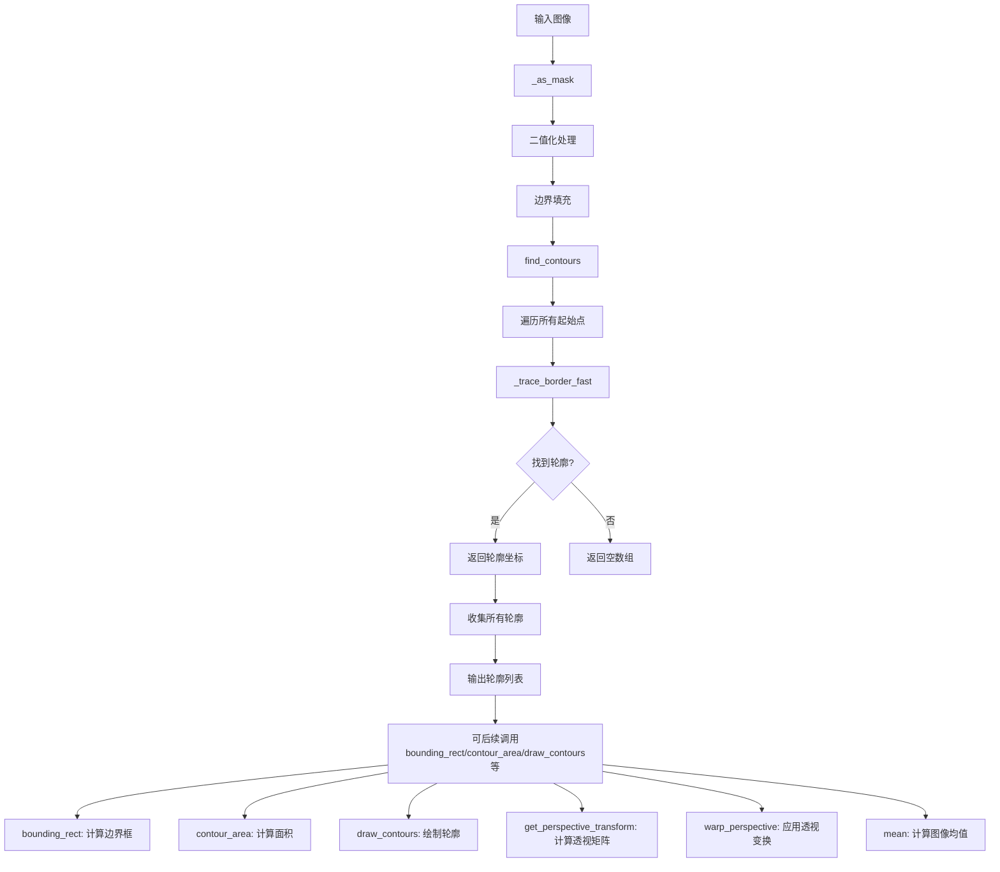
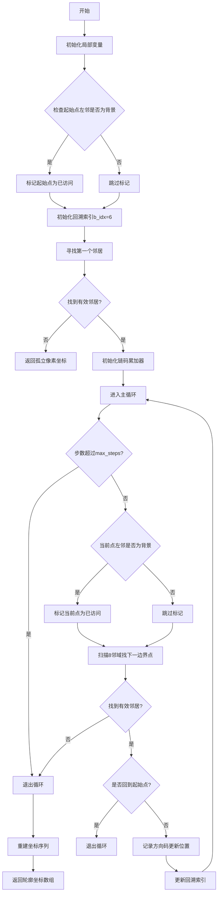
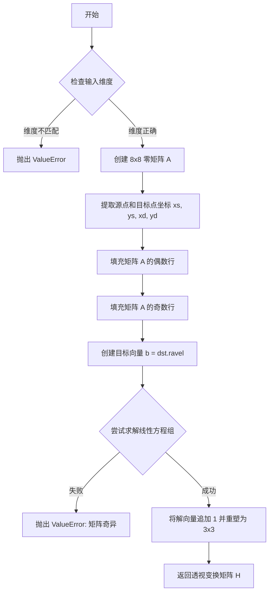
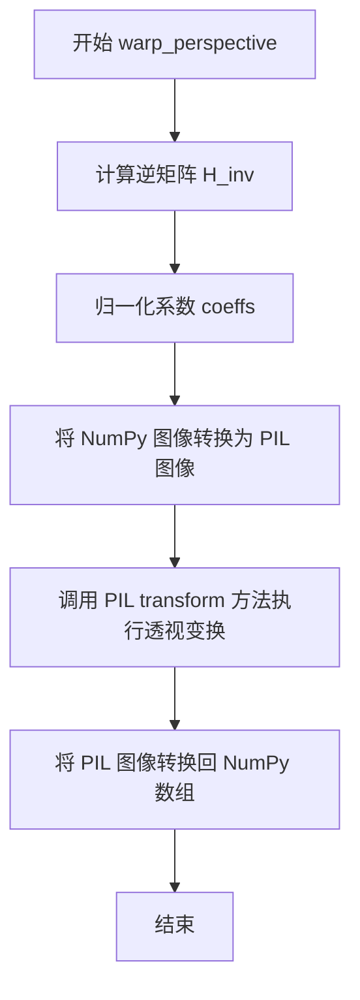

# `comic-translate\imkit\analysis.py` 详细设计文档

这是一个图像分析模块，提供类似OpenCV的图像轮廓检测、轮廓属性计算（边界框、面积）、轮廓绘制、透视变换以及图像均值计算等功能，使用NumPy和PIL实现，旨在作为OpenCV的轻量级替代方案。

## 整体流程



## 类结构

```
该模块为扁平结构，无类定义
直接暴露全局函数和全局变量
所有功能通过模块级函数提供
```

## 全局变量及字段


### `DI_ARR`
    
全局方向数组（行方向增量），用于轮廓追踪

类型：`numpy.ndarray[np.int32]`
    


### `DJ_ARR`
    
全局方向数组（列方向增量），用于轮廓追踪

类型：`numpy.ndarray[np.int32]`
    


    

## 全局函数及方法


### `_as_mask`

#### 描述

该函数是一个模块级的私有辅助函数，用于将输入的图像数据转换为二值掩码（Binary Mask）。它接受任意 array-like 的图像或 PIL Image 对象，将其统一转换为 NumPy 数组，处理多通道图像时默认提取第一通道，最后根据 `threshold`（阈值）进行二值化，并将数据类型定为 `uint8` 以保证兼容性。

#### 参数

- `img`：`Image.Image | np.ndarray | array-like`，输入的图像数据。可以是灰度图、彩色图或已经处理过的数组。
- `threshold`：`int`，二值化阈值。像素值大于此阈值被视为前景（像素值 1），小于等于此阈值被视为背景（像素值 0）。默认值为 0。

#### 返回值

- `np.ndarray`，返回转换后的二值掩码。类型为 `uint8`，维度为 2D（如果输入是彩色图，会被剥离通道维度）。其中 1 表示有效像素（前景），0 表示背景。

#### 流程图

```mermaid
graph TD
    A[开始: 输入图像 img] --> B{转换图像为NumPy数组}
    B --> C{a.ndim == 3?}
    C -- 是 --> D[提取第一通道: a = a[..., 0]]
    C -- 否 --> E[保持原数组]
    D --> F{应用阈值: a > threshold}
    E --> F
    F --> G[类型转换: astype(np.uint8)]
    G --> H[返回二值掩码]
```

#### 带注释源码

```python
def _as_mask(img, threshold: int = 0):
    """
    将输入图像转换为二值掩码。
    
    Args:
        img: 输入图像 (PIL Image 或 NumPy 数组)。
        threshold: 阈值，默认为 0。
    
    Returns:
        二值掩码 (uint8 类型的 NumPy 数组)。
    """
    # 将输入转换为 NumPy 数组，以便进行数值操作
    a = np.asarray(img)
    
    # 检查是否为多通道图像（例如 HxWx3）
    if a.ndim == 3:
        # 如果是彩色图像，取第一个通道（R通道）作为灰度处理
        # 这种处理方式假设输入图像的第一通道包含了主要的强度信息
        a = a[..., 0]
    
    # use uint8 or bool; uint8 keeps parity with many libs
    # 执行二值化：大于阈值为 True，否则为 False
    # 然后将其转换为 uint8 类型 (0 或 1)，以兼容 OpenCV 等库的数据类型expectations
    return (a > threshold).astype(np.uint8)
```


### `_trace_border_fast`

使用Suzuki算法快速追踪单个轮廓边界，返回边界点的坐标序列。该函数通过内存视图直接操作像素数据，采用方向编码压缩存储边界信息，并支持最大步数限制以防止无限循环。

参数：

- `m`：`memoryview`，输入的二值掩码图像的内存视图（经过padding处理）
- `W`：`int`，图像的宽度（包含padding后的宽度）
- `start_i`：`int`，起始追踪点的行坐标（图像坐标系，未padding）
- `start_j`：`int`，起始追踪点的列坐标（图像坐标系，未padding）
- `max_steps`：`int`，最大追踪步数限制，默认为 2,000,000，用于防止极端情况下的无限循环

返回值：`np.ndarray`，形状为 (N, 2) 的整数坐标数组，其中每行包含 (x, y) 坐标，表示轮廓边界点的像素位置

#### 流程图



#### 带注释源码

```python
def _trace_border_fast(
    m: memoryview,
    W: int, 
    start_i: int, 
    start_j: int, 
    max_steps: int = 2_000_000
) -> np.ndarray:
    # 局部变量提升：将偏移数组和memoryview缓存到局部变量
    # OFF数组定义8个方向的偏移量：(左上, 上, 右上, 右, 右下, 下, 左下, 左)
    # 对应坐标变化为：(-W-1, -W, -W+1, 1, W+1, W, W-1, -1)
    OFF = (-W, -W + 1, 1, W + 1, W, W - 1, -1, -W - 1)
    mv = m; o = OFF

    # 计算起始点在一维数组中的位置（考虑padding，图像实际从索引W+1开始）
    start_pos = start_i * W + start_j

    # 标记"起始点候选已消耗"：如果左邻是背景，则将起始点标记为2
    # 这是Suzuki算法的关键：用于区分"从外部进入"和"从内部离开"的起始点
    if mv[start_pos - 1] == 0:
        mv[start_pos] = 2

    # 初始回溯索引：假设从左边进入，方向索引为6 (对应左方向)
    b_idx = 6

    # 从回溯方向的下一位开始搜索第一个邻居
    # (b_idx + 1) & 7 实现循环加1
    s = (b_idx + 1) & 7
    p = start_pos
    
    # 展开的8邻域扫描：按顺时针方向查找第一个前景像素
    # 使用if-elif链避免循环开销，同时保证找到的是最小方向索引的邻居
    if   mv[p + o[s]]:             q_idx = s
    elif mv[p + o[(s + 1) & 7]]:   q_idx = (s + 1) & 7
    elif mv[p + o[(s + 2) & 7]]:   q_idx = (s + 2) & 7
    elif mv[p + o[(s + 3) & 7]]:   q_idx = (s + 3) & 7
    elif mv[p + o[(s + 4) & 7]]:   q_idx = (s + 4) & 7
    elif mv[p + o[(s + 5) & 7]]:   q_idx = (s + 5) & 7
    elif mv[p + o[(s + 6) & 7]]:   q_idx = (s + 6) & 7
    elif mv[p + o[(s + 7) & 7]]:   q_idx = (s + 7) & 7
    else:
        # 孤立像素处理：没有找到任何邻居，返回包含起始点但坐标偏移-1的数组
        out = np.empty((1, 2), dtype=np.int32)
        out[0, 0] = start_j - 1
        out[0, 1] = start_i - 1
        return out

    # 准备链码累积：使用bytearray高效存储方向编码
    codes = bytearray()
    # 计算第一个邻居位置和下一方向回溯索引
    pos = p + o[q_idx]
    first_next_pos = pos
    codes.append(q_idx)
    # 回溯索引设为当前方向的相反方向（加4模8）
    b_idx = (q_idx + 4) & 7

    steps = 1
    # 主追踪循环：持续扫描直到满足终止条件
    while True:
        if steps > max_steps: break
        
        # Suzuki算法：每次移动后检查左邻是否为背景
        # 如果是，则标记当前点为已访问状态2（防止重复访问）
        if mv[pos - 1] == 0:
            mv[pos] = 2

        # 从回溯方向开始扫描8邻域
        s = (b_idx + 1) & 7
        p = pos
        
        # 展开的邻域扫描（性能优化）
        if   mv[p + o[s]]:             q_idx = s
        elif mv[p + o[(s + 1) & 7]]:   q_idx = (s + 1) & 7
        elif mv[p + o[(s + 2) & 7]]:   q_idx = (s + 2) & 7
        elif mv[p + o[(s + 3) & 7]]:   q_idx = (s + 3) & 7
        elif mv[p + o[(s + 4) & 7]]:   q_idx = (s + 4) & 7
        elif mv[p + o[(s + 5) & 7]]:   q_idx = (s + 5) & 7
        elif mv[p + o[(s + 6) & 7]]:   q_idx = (s + 6) & 7
        elif mv[p + o[(s + 7) & 7]]:   q_idx = (s + 7) & 7
        else:
            # 未找到有效邻居，退出循环
            break

        next_pos = p + o[q_idx]

        # Suzuki算法终止条件：回到起始点且下一位置等于第一个下一位置
        # 这表示完整追踪了一个闭环轮廓
        if p == start_pos and next_pos == first_next_pos:
            break

        # 累积方向码并更新位置
        codes.append(q_idx)
        pos = next_pos
        b_idx = (q_idx + 4) & 7
        steps += 1

    # 从方向码重建坐标序列
    if not codes:
        # 无方向码（只有单像素）的情况
        out = np.empty((1, 2), dtype=np.int32)
        out[0, 0] = start_j - 1
        out[0, 1] = start_i - 1
        return out

    # 将方向码转换为坐标偏移并计算累积和
    # DI_ARR和DJ_ARR分别定义8个方向的(di, dj)增量
    code_arr = np.frombuffer(codes, dtype=np.uint8)
    dx = DJ_ARR[code_arr]  # 列方向偏移
    dy = DI_ARR[code_arr]  # 行方向偏移
    
    # 构建输出数组：第一行是起始点坐标（减1以抵消padding偏移）
    out = np.empty((code_arr.size + 1, 2), dtype=np.int32)
    out[0, 0] = start_j - 1
    out[0, 1] = start_i - 1
    # 后续行通过累积偏移计算
    out[1:, 0] = out[0, 0] + np.cumsum(dx, dtype=np.int32)
    out[1:, 1] = out[0, 1] + np.cumsum(dy, dtype=np.int32)
    return out
```


### `find_contours`

该函数实现了一个类似OpenCV的findContours功能，通过Suzuki-style边框追踪算法在二值图像中查找所有轮廓，并返回由(x,y)坐标组成的轮廓列表。

参数：

- `img`：`array-like`，灰度或二维数组形式的图像（或布尔掩码），值大于threshold的像素被视为前景
- `threshold`：`int`，用于创建二值掩码的阈值，默认为0

返回值：`tuple[list[np.ndarray], None]`，第一个元素是轮廓列表，每个轮廓是一个形状为(N,1,2)的int32坐标数组，第二个元素为None（保留用于兼容性）

#### 流程图

```mermaid
flowchart TD
    A[开始 find_contours] --> B[调用 _as_mask 转换为二值掩码]
    B --> C[确保掩码为 uint8 类型]
    C --> D[对掩码进行padding<br/>上下左右各加1像素边界]
    D --> E[计算起始点掩码<br/>center & (1 - left)]
    E --> F[使用 np.flatnonzero 找出所有起始点]
    F --> G{还有未处理的起始点?}
    G -->|是| H[获取起始点坐标 i, j]
    H --> I{该位置是否为前景像素?}
    I -->|是| J[调用 _trace_border_fast 追踪轮廓]
    I -->|否| K[跳过该起始点]
    J --> L[将追踪结果reshape为(N,1,2)并添加到轮廓列表]
    K --> G
    L --> G
    G -->|否| M[返回轮廓列表和None]
```

#### 带注释源码

```python
def find_contours(img, threshold: int = 0):
    """
        findContours-style border tracing that matches OpenCV ordering (Suzuki-style start tests + tracing).
        Returns list of contours, each an (N,1,2) int array of (x,y) coordinates.
        Roughly equivalent to cv2.findContours(img, cv2.RETR_LIST, cv2.CHAIN_APPROX_NONE).

        Parameters
        ----------
        img : array-like
            Grayscale or 2D array-like image (or already a boolean mask). Values > threshold are foreground.
        threshold : int
            Threshold to create binary mask.
        """
    
    # 第一步：将输入图像转换为二值掩码（0/1 uint8）
    m = _as_mask(img, threshold)              # produce 0/1 uint8
    if m.dtype != np.uint8:
        m = m.astype(np.uint8, copy=False)

    # 第二步：对掩码进行padding，四周各加1像素宽的边界（值为0）
    # 这样可以简化边界检测逻辑，无需额外检查边界条件
    p = np.pad(m, 1, mode='constant', constant_values=0)
    p_u8 = p  # already uint8
    H, W = p.shape

    # 第三步：计算起始点掩码
    # center: 中心像素（去除padding后的内部区域）
    # left: 中心像素的左邻居
    # start_mask = center & (1 - left) 表示：
    #   - 当前像素是前景(1)
    #   - 左邻居是背景(0)
    #   这种像素是Suzuki算法中定义的轮廓起始点候选
    center = p_u8[1:-1, 1:-1]
    left   = p_u8[1:-1, :-2]
    start_mask = center & (1 - left)
    starts_flat = np.flatnonzero(start_mask)

    # 将图像数据转换为memoryview以支持高效的元素修改
    mv = memoryview(p_u8).cast('B')

    # 初始化轮廓列表
    contours = []
    W0 = W - 2  # 原始图像宽度（不含padding）

    # 第四步：遍历所有起始点，追踪每个轮廓
    for k in starts_flat:
        # 将一维索引转换为二维坐标
        r = k // W0
        c = k - r * W0
        i = 1 + r  # padding后的坐标
        j = 1 + c
        pos = i * W + j

        # 检查该位置是否仍是未处理的前景像素
        # (可能被其他轮廓标记为已访问)
        if mv[pos] != 1:
            continue

        # 调用_fast版本进行轮廓追踪
        contour = _trace_border_fast(mv, W, int(i), int(j))
        if contour.size == 0:
            continue
        
        # 将轮廓 reshape 为 OpenCV 格式 (N,1,2)
        contours.append(contour.reshape(-1, 1, 2))

    # 返回轮廓列表和None（保留与OpenCV返回值兼容性）
    return contours, None
```


### `bounding_rect`

该函数是图像处理模块中的核心工具函数，用于计算轮廓（Contour）的轴对齐边界框（Axis-Aligned Bounding Box, AABB）。它接收一个包含坐标的 NumPy 数组，处理了 OpenCV 标准格式 `(N, 1, 2)` 和平铺格式 `(N, 2)` 的输入，通过计算坐标的最小最大值确定矩形左上角坐标 `(x, y)` 及宽高 `(w, h)`。该实现特别针对宽高的计算进行了 `+1` 偏移，以确保返回值与 OpenCV C++ 接口 `cv2.boundingRect` 在像素覆盖范围上的行为一致（即包含起始像素和结束像素）。

参数：
- `contour`：`np.ndarray`，输入的轮廓点数组，支持形状为 `(N, 1, 2)`（OpenCV 风格）或 `(N, 2)` 的整数坐标数组。

返回值：`tuple[int, int, int, int]`，返回一个元组，包含边界框的左上角坐标 `(x, y)` 以及宽度 `w` 和高度 `h`。

#### 流程图

```mermaid
flowchart TD
    A([Start bounding_rect]) --> B[Input contour]
    B --> C{Is contour.ndim == 3<br>and shape[1] == 1?}
    C -- Yes --> D[Reshape to (N, 2)]
    C -- No --> E[Reshape to (N, 2)]
    D --> F[Extract X coords: pts[:, 0]]
    E --> F
    F --> G[Extract Y coords: pts[:, 1]]
    G --> H[Calc x_min, x_max, y_min, y_max]
    H --> I[Calc width: x_max - x_min + 1]
    I --> J[Calc height: y_max - y_min + 1]
    J --> K[Return (x_min, y_min, w, h)]
```

#### 带注释源码

```python
def bounding_rect(contour: np.ndarray) -> tuple[int, int, int, int]:
    """OpenCV-style boundingRect replacement.

    Args:
        contour: np.ndarray shape (N,1,2) or (N,2) of integer point coords.
    Returns:
        (x, y, w, h) with +1 pixel width/height to match cv2.boundingRect behavior.
    """
    # 1. 标准化输入维度：将所有可能的三维形式 (N, 1, 2) 转换为二维形式 (N, 2)
    # 如果已经是二维 (N, 2)，reshape(-1, 2) 也不会改变数据
    if contour.ndim == 3 and contour.shape[1] == 1:
        pts = contour.reshape(-1, 2)
    else:
        pts = contour.reshape(-1, 2)
    
    # 2. 分离坐标轴
    xs = pts[:, 0]
    ys = pts[:, 1]
    
    # 3. 计算边界极值
    x_min = int(xs.min())
    y_min = int(ys.min())
    x_max = int(xs.max())
    y_max = int(ys.max())
    
    # 4. 计算宽高并返回
    # 注意：OpenCV 的 boundingRect 返回的宽高是基于像素数量的，
    # 即如果只有一个像素点 (x=0, y=0)，宽高应为 1。
    # 因此计算公式为 max - min + 1。
    return x_min, y_min, x_max - x_min + 1, y_max - y_min + 1
```

#### 关键组件信息

*   **输入规范化模块**：负责将 OpenCV 特有的 `(N, 1, 2)` 层级数据扁平化为标准的 `(N, 2)` 坐标对，以便统一计算。
*   **极值计算模块**：利用 NumPy 的向量化操作 `min()` 和 `max()` 快速遍历所有轮廓点，计算包围盒的上下界。

#### 潜在的技术债务或优化空间

1.  **空输入处理缺失**：当前代码未对空轮廓（`contour` 为空数组）进行防御性检查。如果传入空数组，调用 `.min()` 和 `.max()` 时会抛出 `ValueError: zero-size array to reduction operation minimum` 错误。建议在函数入口处增加 `if pts.size == 0: raise ValueError("Contour cannot be empty")`。
2.  **类型转换精度**：代码使用 `int(xs.min())` 进行强制转换。如果输入包含浮点数坐标（如经过几何变换后的 float 坐标），直接截断为整数可能会导致微小的坐标偏差。虽然文档声明输入为 "integer point coords"，但缺乏运行时类型校验。
3.  **重复计算风险**：虽然代码对 `contour` 做了 reshape，但在 `else` 分支中显式执行了 `contour.reshape(-1, 2)`，这一步在输入已经是 `(N, 2)` 时是安全的，但在极高性能敏感场景下，可以先检查 `contour.shape` 以避免不必要的内存操作。

#### 其它项目

*   **设计目标**：完全兼容 OpenCV 的 `cv2.boundingRect` 返回值格式（特别是宽高的 `+1` 行为），以便在替换 OpenCV 后端时保持图像裁剪或特征绘制的一致性。
*   **错误处理**：依赖于 NumPy 内部的异常抛出，外部调用者需要自行处理空数组或非法维度输入。
*   **数据流**：该函数是纯函数，无副作用，不修改全局状态，仅依赖输入参数计算并返回新的元组数据。


### `contour_area`

该函数使用鞋带公式（Shoelace Formula）计算由一组二维坐标点构成的多边形轮廓的面积。它首先对输入的 NumPy 数组进行维度标准化处理（统一为 (N, 2) 形状），随后提取坐标并利用向量化运算计算交叉乘积之和，最后取绝对值并乘以 0.5 得到多边形面积。

参数：

- `contour`：`np.ndarray`，轮廓坐标数组，支持 OpenCV 风格的形状 (N, 1, 2) 或标准的 (N, 2) 形状，包含多边形顶点的 (x, y) 坐标。

返回值：`float`，多边形的绝对面积。

#### 流程图

```mermaid
graph TD
    A[Start contour_area] --> B{Input contour shape is (N, 1, 2)?}
    B -- Yes --> C[Squeeze axis=1 to (N, 2)]
    B -- No --> D[Use input as is]
    C --> E[Extract x and y coordinates]
    D --> E
    E --> F[Calculate: 0.5 * abs<br/>sum<br/>(x[i] * y[i-1] - y[i] * x[i-1])]
    F --> G[Return Area]
```

#### 带注释源码

```python
def contour_area(contour: np.ndarray):
    """
    Calculates the area of a polygon defined by a contour using the Shoelace formula.
    
    Args:
        contour (np.ndarray): A NumPy array of shape (N, 1, 2) or (N, 2)
                              containing the (x, y) coordinates of the contour's vertices.
    
    Returns:
        float: The absolute area of the polygon.
    """
    # Reshape the contour array to (N, 2) if it has the OpenCV (N, 1, 2) shape
    # This ensures consistent coordinate access regardless of input format
    if contour.ndim == 3 and contour.shape[1] == 1:
        contour = contour.squeeze(axis=1)

    # Separate x and y coordinates into distinct 1D arrays
    x = contour[:, 0]
    y = contour[:, 1]
    
    # Use np.roll to implement the cyclic sum required by the formula
    # np.roll shifts elements: roll(y, 1) moves y[i] to y[i+1], wrapping the last to first.
    # This allows vectorized calculation of the cross-products across the closed loop.
    area = 0.5 * np.abs(np.dot(x, np.roll(y, 1)) - np.dot(y, np.roll(x, 1)))
    return area
```


### `draw_contours`

使用 Pillow 和 NumPy 模拟 OpenCV 的 `cv2.drawContours` 函数，将指定的轮廓绘制到图像上。支持绘制单个轮廓、全部轮廓或填充轮廓。

参数：

- `image`：`np.ndarray`，目标图像（numpy 数组，例如 (H, W, 3) 表示 RGB 图像）
- `contours`：`list`，轮廓列表，每个轮廓是一个包含 (x, y) 坐标的 numpy 数组，格式如 `[[[x1, y1]], [[x2, y2]], ...]`
- `contour_idx`：`int`，要绘制的轮廓索引（-1 表示绘制所有轮廓）
- `color`：`tuple`，填充或线条颜色，RGB 格式，例如 (255, 0, 0) 表示红色
- `thickness`：`int`，线条粗细（默认为 1），使用 -1 表示填充轮廓

返回值：`np.ndarray`，绘制了轮廓后的图像

#### 流程图

```mermaid
flowchart TD
    A[开始 draw_contours] --> B{image dtype 是否为 uint8?}
    B -->|否| C[将 image 转换为 uint8 类型]
    B -->|是| D[跳过转换]
    C --> E[将 numpy 数组转换为 PIL Image]
    D --> E
    E --> F[创建 ImageDraw 对象]
    F --> G{contour_idx == -1?}
    G -->|是| H[使用所有 contours]
    G -->|否| I{0 <= contour_idx < len(contours)?}
    I -->|是| J[使用单个 contours[contour_idx]]
    I -->|否| K[返回空列表]
    H --> L{遍历 contours_to_draw}
    J --> L
    K --> Q[将 PIL 图像转回 numpy 数组并返回]
    L --> M{contour size > 0?}
    M -->|否| L
    M -->|是| N[将 contour reshape 为点坐标元组]
    N --> O{thickness == -1?}
    O -->|是| P[使用 draw.polygon 填充轮廓]
    O -->|否| R[使用 draw.line 绘制轮廓线]
    P --> L
    R --> L
    L --> Q
```

#### 带注释源码

```python
def draw_contours(
    image: np.ndarray, 
    contours: list, 
    contour_idx: int, 
    color: tuple, 
    thickness: int = 1
) -> np.ndarray:
    """
    Emulates cv2.drawContours using Pillow and Numpy.

    Args:
        image (np.ndarray): The target image (numpy array, e.g., (H, W, 3) for RGB).
        contours (list): A list of contours, where each contour is a numpy array
                         of (x, y) coordinates, e.g., [[[x1, y1]], [[x2, y2]], ...].
        contour_idx (int): Index of the contour to draw (-1 for all).
        color (tuple): The fill or line color in RGB format, e.g., (255, 0, 0).
        thickness (int): Line thickness. Use -1 for a filled contour.

    Returns:
        np.ndarray: The image with contours drawn on it.
    """
    # 步骤1：检查并转换图像数据类型为 uint8
    # Pillow 需要 uint8 类型的图像数据
    if image.dtype != np.uint8:
        image = image.astype(np.uint8)
    
    # 步骤2：将 numpy 数组转换为 PIL Image 对象以便绘图
    # 使用 .copy() 避免修改原始图像
    pil_image = Image.fromarray(image.copy())
    
    # 步骤3：创建 ImageDraw 对象用于绘制图形
    draw = ImageDraw.Draw(pil_image)

    # 步骤4：根据 contour_idx 确定要绘制的轮廓
    contours_to_draw = []
    if contour_idx == -1:
        # -1 表示绘制所有轮廓
        contours_to_draw = contours
    elif 0 <= contour_idx < len(contours):
        # 指定索引的单个轮廓
        contours_to_draw = [contours[contour_idx]]
    # 如果索引无效，contours_to_draw 为空列表，后续循环不会执行
    
    # 步骤5：遍历每个需要绘制的轮廓
    for contour in contours_to_draw:
        # 重新格式化 numpy 轮廓数组为 PIL 可用的格式
        # 示例：从 [[[x1, y1]], [[x2, y2]], ...] 转换为 [(x1, y1), (x2, y2), ...]
        if contour.size > 0:
            # 将 contour 数组从 (N,1,2) 或 (N,1,1,2) 形状重塑为 (N,2) 的坐标点
            points = tuple(map(tuple, contour.reshape(-1, 2)))
            
            if thickness == -1:
                # 使用 ImageDraw.polygon 绘制填充轮廓
                # 适用于填充单个闭合区域
                draw.polygon(points, fill=color)
            else:
                # 使用 draw.line 绘制轮廓线
                # width 参数设置线条粗细，joint="curve" 使线条更平滑
                # 注意：PIL 的 line 方法不支持超过一定宽度的线条
                draw.line(points, fill=color, width=thickness, joint="curve")

    # 步骤6：将 PIL 图像转换回 numpy 数组并返回
    return np.array(pil_image)
```


### `get_perspective_transform`

计算两个4点集合之间的透视变换矩阵（3x3），基于线性代数求解方法将源坐标映射到目标坐标。

参数：

- `src`：`np.ndarray`，形状为 (4, 2) 的源点坐标数组，每行表示一个控制点的 (x, y) 坐标
- `dst`：`np.ndarray`，形状为 (4, 2) 的目标点坐标数组，每行表示一个控制点的 (x, y) 坐标

返回值：`np.ndarray`，3x3 的透视变换矩阵 H，用于将源图像上的点映射到目标位置

#### 流程图



#### 带注释源码

```python
def get_perspective_transform(src: np.ndarray, dst: np.ndarray) -> np.ndarray:
    """
    使用向量化的 NumPy 实现计算 3x3 透视变换矩阵。
    
    透视变换原理：
    对于源点 (x, y) 和目标点 (u, v)，透视变换定义为：
    u = (a*x + b*y + c) / (g*x + h*y + 1)
    v = (d*x + e*y + f) / (g*x + h*y + 1)
    
    通过代入4个对应点，可以构建8个线性方程求解8个未知参数 (a,b,c,d,e,f,g,h)。
    """
    # 参数校验：确保输入是4个2D点
    if src.shape != (4, 2) or dst.shape != (4, 2):
        raise ValueError("Source and destination must be 4x2 arrays.")

    # A 是 8x8 的系数矩阵，对应 8 个线性方程
    A = np.zeros((8, 8))
    
    # 解包源点和目标点的坐标
    xs, ys = src[:, 0], src[:, 1]  # 源点 x, y 坐标
    xd, yd = dst[:, 0], dst[:, 1]  # 目标点 x, y 坐标

    # 填充矩阵 A 的偶数行 (对应目标 x 坐标方程)
    # 方程: xd = (a*xs + b*ys + c) / (g*xs + h*ys + 1)
    # 重排后: a*xs + b*ys + c - g*xs*xd - h*ys*xd = xd
    A[::2, 0] = xs      # a 系数
    A[::2, 1] = ys      # b 系数
    A[::2, 2] = 1       # c 系数 (常数项)
    A[::2, 6] = -xs * xd # g 系数 (移项后)
    A[::2, 7] = -ys * xd # h 系数 (移项后)

    # 填充矩阵 A 的奇数行 (对应目标 y 坐标方程)
    # 方程: yd = (d*xs + e*ys + f) / (g*xs + h*ys + 1)
    A[1::2, 3] = xs      # d 系数
    A[1::2, 4] = ys      # e 系数
    A[1::2, 5] = 1       # f 系数 (常数项)
    A[1::2, 6] = -xs * yd # g 系数 (移项后)
    A[1::2, 7] = -ys * yd # h 系数 (移项后)
    
    # b 是 8x1 的目标向量，由目标点坐标扁平化组成
    b = dst.ravel()  # [xd0, yd0, xd1, yd1, xd2, yd2, xd3, yd3]

    # 求解线性方程组 A * h = b，得到 8 个变换参数
    try:
        # 使用 np.linalg.solve 求解，比求逆更稳定高效
        h = np.linalg.solve(A, b)
    except np.linalg.LinAlgError:
        # 矩阵奇异（行列式为0）通常意味着输入点共线或重复
        raise ValueError("Matrix is singular, cannot compute perspective transform.")

    # 将求解得到的 8 个参数追加常数 1（对应分母的 +1 项）
    # 构造成标准的 3x3 透视变换矩阵 H:
    # H = [[a, b, c],
    #      [d, e, f],
    #      [g, h, 1]]
    H = np.append(h, 1).reshape((3, 3))
    return H
```


### `warp_perspective`

使用 PIL (Pillow) 库对输入图像进行透视变换，通过逆矩阵计算变换系数并应用双三次插值返回变换后的图像。

参数：

- `image`：`np.ndarray`，输入的图像数据（NumPy 数组）。
- `matrix`：`np.ndarray`，3x3 的透视变换矩阵。
- `output_size`：`tuple`，输出图像的尺寸，格式为 (width, height)。

返回值：`np.ndarray`，经过透视变换后的图像数据。

#### 流程图



#### 带注释源码

```python
def warp_perspective(
    image: np.ndarray, 
    matrix: np.ndarray, 
    output_size: tuple
) -> np.ndarray:
    """
    Performs a perspective warp using PIL/Pillow.
    
    Args:
        image (np.ndarray): The input image.
        matrix (np.ndarray): The 3x3 perspective transformation matrix.
        output_size (tuple): The (width, height) of the output image.

    Returns:
        np.ndarray: The warped image as a numpy array.
    """
    # Pillow's transform method also requires the inverse matrix.
    # PIL 的透视变换需要逆矩阵来计算输出像素在原图中的位置
    H_inv = np.linalg.inv(matrix)
    
    # The `data` argument for PERSPECTIVE is a tuple of the first 8
    # elements of the inverse matrix, divided by the last element.
    # 提取逆矩阵的前8个元素并除以最后一个元素（齐次坐标归一化），构成变换系数元组
    coeffs = H_inv.flatten() / H_inv.flatten()[-1]
    
    # 将输入的 NumPy 数组转换为 PIL Image 对象
    pil_img = Image.fromarray(image)
    
    # 使用 PIL 的 transform 方法进行透视变换
    # output_size: 输出尺寸
    # Image.Transform.PERSPECTIVE: 指定变换类型为透视变换
    # data=coeffs: 传入归一化后的变换系数
    # resample=Image.Resampling.BICUBIC: 使用双三次插值算法进行像素重采样
    transformed = pil_img.transform(
        output_size,
        Image.Transform.PERSPECTIVE,
        data=coeffs,
        resample=Image.Resampling.BICUBIC
    )

    # 将变换后的 PIL Image 对象转换回 NumPy 数组并返回
    return np.array(transformed)
```


### `mean`

计算图像各通道均值，支持掩码，输出4元素元组，类似于cv2.mean()。

参数：

- `src`：`np.ndarray`，输入的图像数组
- `mask`：`np.ndarray | None`，可选的8位单通道掩码，非零像素值参与均值计算

返回值：`tuple`，包含各通道均值的4元素元组，若输入通道数少于4则其余位置为零

#### 流程图

```mermaid
flowchart TD
    A[开始 mean 函数] --> B[将输入转换为numpy数组]
    B --> C{判断维度}
    C -->|2维图像| D[设置通道数为1]
    C -->|3维图像| E[从shape获取通道数]
    D --> F[初始化4元素mean_values数组为0]
    E --> F
    F --> G{判断mask是否为None}
    G -->|是| H{判断图像维度}
    H -->|2维| I[计算整个数组均值, 存入mean_values[0]]
    H -->|3维| J[按行列计算各通道均值, 存入对应位置]
    G -->|否| K[将mask转为布尔数组]
    K --> L{判断mask是否有True值}
    L -->|否| M[返回全零元组]
    L -->|是| N{判断图像维度}
    N -->|2维| O[使用布尔索引计算均值, 存入mean_values[0]]
    N -->|3维| P[扩展mask为3维以便广播]
    P --> Q[对所有通道应用掩码]
    Q --> R[重塑掩码像素并计算各通道均值]
    O --> S[将mean_values转为元组返回]
    J --> S
    R --> S
    M --> S
```

#### 带注释源码

```python
def mean(src: np.ndarray, mask: np.ndarray | None = None) -> tuple:
    """
    Compute mean value similar to cv2.mean(), returning a 4-element tuple.

    Args:
        src (np.ndarray): The input array (image).
        mask (np.ndarray, optional): An optional 8-bit, single-channel mask.
                                     Pixels corresponding to non-zero mask values
                                     are included in the mean calculation.

    Returns:
        tuple: A 4-element tuple containing the mean of each channel, or zeros
               for channels not present in the input.
    """
    # 将输入转换为numpy数组以统一处理
    a = np.asarray(src)
    # 确定通道数：3维数组取第3维，否则为1（灰度图）
    num_channels = a.shape[2] if a.ndim == 3 else 1
    # 初始化4元素浮点数组，用于存储各通道均值
    mean_values = np.zeros(4, dtype=np.float64)

    # 无掩码情况：直接计算全局均值
    if mask is None:
        # 灰度图像：计算整个数组均值
        if a.ndim == 2:
            mean_values[0] = a.mean()
        # 多通道图像：按行列维度计算各通道均值
        else:
            mean_values[:num_channels] = a.mean(axis=(0, 1))
    else:
        # 有掩码情况：将掩码转换为布尔数组（非零为True）
        m = (np.asarray(mask) > 0)
        
        # 若掩码中无有效像素，直接返回全零结果
        if not m.any():
            return tuple(mean_values)

        # 灰度图掩码计算：直接使用布尔索引
        if a.ndim == 2:
            mean_values[0] = a[m].mean()
        else:
            # 多通道掩码计算：扩展mask维度以支持广播
            m_3d = m[..., np.newaxis]
            # 对所有通道应用相同掩码（通过重复掩码）
            masked_pixels = a[m_3d.repeat(num_channels, axis=2)]
            # 重塑为(像素数, 通道数)形状，计算每列均值即各通道均值
            masked_pixels = masked_pixels.reshape(-1, num_channels)
            mean_values[:num_channels] = masked_pixels.mean(axis=0)

    # 返回4元素元组，模拟cv2.mean()行为
    return tuple(mean_values)
```

## 关键组件


### 图像二值化 (_as_mask)

将输入图像转换为二值掩码，使用阈值分割将像素值大于阈值的设为前景(1)，否则设为背景(0)。支持多通道图像自动转换为单通道。

### 快速边界追踪 (_trace_border_fast)

基于Suzuki算法的轮廓边界追踪实现，使用内存视图(memoryview)进行高性能扫描，通过方向编码记录边界路径，支持最大步数限制防止无限循环，返回轮廓坐标数组。

### 轮廓查找 (find_contours)

模拟OpenCV的findContours功能，通过中心像素与左像素的与运算识别起始点，遍历所有起始点调用快速追踪算法，返回轮廓列表和层级信息(此处返回None)。

### 边界框计算 (bounding_rect)

OpenCV风格的外接矩形计算，根据轮廓点坐标计算最小外接矩形，返回(x, y, width, height)元组，宽度和高度包含边界像素以匹配OpenCV行为。

### 轮廓面积计算 (contour_area)

使用Shoelace公式计算多边形面积，支持(N,1,2)和(N,2)两种输入格式，通过循环求和计算带符号面积并取绝对值。

### 轮廓绘制 (draw_contours)

使用PIL/Pillow实现类似cv2.drawContours的功能，支持绘制单个或全部轮廓，支持填充模式(thickness=-1)和描边模式，可指定颜色和线宽。

### 透视变换矩阵计算 (get_perspective_transform)

根据4对源点和目标点计算3x3透视变换矩阵，使用NumPy线性代数求解器求解8个未知参数，矩阵奇异时抛出异常。

### 透视图像变换 (warp_perspective)

使用PIL的transform方法执行透视变换，需要先计算逆矩阵并转换为8参数形式，支持BICUBIC重采样，返回变换后的NumPy数组。

### 均值计算 (mean)

模拟cv2.mean函数计算图像各通道均值，支持可选掩码参数，仅计算掩码值为非零的像素，返回4元素元组(蓝、绿、红、Alpha)。


## 问题及建议


### 已知问题

-   **内存操作风险**：`_trace_border_fast` 函数中直接通过 `memoryview` 修改数据（`mv[pos] = 2`），这种副作用使得函数行为难以追踪，可能导致原始输入数据被意外修改。
-   **代码重复**：邻居扫描逻辑在 `_trace_border_fast` 中出现多次完全相同的 if-elif 模式（共约 6 处），违反 DRY 原则，可读性差且难以维护。
-   **API 设计不一致**：`find_contours` 返回 `(contours, None)`，第二个返回值硬编码为 `None`，这是为了兼容 OpenCV 接口但缺乏实际意义，造成 API 使用困惑。
-   **类型标注缺失**：多个函数缺少返回类型标注（如 `bounding_rect`、`contour_area`、`draw_contours` 等），影响静态类型检查和代码可读性。
-   **边界条件硬编码**：`max_steps = 2_000_000` 是魔数，缺乏注释说明其来源或调整依据，且达到限制时直接 break 可能导致不完整的轮廓。
-   **矩阵求逆无验证**：`warp_perspective` 中直接调用 `np.linalg.inv(matrix)`，未检查矩阵是否可逆，若输入奇异矩阵会抛出难以理解的异常。
-   **性能冗余**：`contour_area` 中使用了两次 `np.roll`，可以合并为一次计算；`mean` 函数中 mask 处理逻辑复杂且存在不必要的数组复制。
-   **输入验证不足**：`get_perspective_transform` 仅检查形状但未检查输入点是否共线；`bounding_rect` 未对空轮廓或非法形状做防护。
-   **模块职责不单一**：当前模块混合了轮廓处理、几何变换、图像统计等多种功能，与文档描述的 "imkit module" 定位不符，建议拆分。

### 优化建议

-   **重构邻居扫描**：将重复的 if-elif 模式提取为循环或使用查找表，减少约 80 行重复代码。
-   **完善类型标注**：为所有公共函数添加完整的类型注解，包括 `find_contours` 的返回类型应定义为 `tuple[list[np.ndarray], None]`。
-   **改进错误处理**：为 `warp_perspective` 添加矩阵可逆性检查，为关键函数添加输入验证并抛出有意义的异常信息。
-   **消除副作用**：考虑让 `_trace_border_fast` 接受副本而非直接修改原始 memoryview，或在文档中明确说明副作用。
-   **提取魔数**：将 `max_steps`、`threshold` 默认值等提取为模块级常量或配置参数。
-   **优化性能**：`contour_area` 可使用单次循环计算叉积和；`mean` 函数的 mask 处理可简化为 `np.ma` 模块。
-   **拆分模块**：将轮廓操作、几何变换、统计函数分离到独立子模块，提高代码组织性和可维护性。

## 其它


### 设计目标与约束

本模块旨在提供一套与OpenCV兼容的图像轮廓分析功能，主要目标包括：（1）实现findContours、boundingRect、contourArea等核心函数的功能等价替代；（2）使用纯Python/NumPy/Pillow实现，不依赖OpenCV库；（3）保持与OpenCV函数相似的接口签名和返回格式，降低用户迁移成本。约束条件包括：内存使用需控制在合理范围内，对于超大图像需考虑分块处理；性能目标为单次轮廓查找在1080P图像上不超过2秒；代码需兼容Python 3.8+和NumPy 1.20+。

### 错误处理与异常设计

代码中的异常处理主要通过以下方式实现：get_perspective_transform函数在矩阵奇异时抛出ValueError("Matrix is singular, cannot compute perspective transform.")；输入维度检查不通过时抛出ValueError("Source and destination must be 4x2 arrays.")；find_contours函数返回(None, None)表示未找到轮廓；draw_contours函数对空轮廓进行保护检查。异常设计原则：运行时错误优先使用ValueError，致命错误使用RuntimeError，验证错误在函数入口处检查。

### 数据流与状态机

模块的数据流如下：输入图像 → _as_mask生成二值掩码 → pad边缘填充 → start_mask计算起始点 → _trace_border_fast执行Suzuki轮廓追踪 → 坐标重建 → 轮廓列表返回。状态机主要体现在_trace_border_fast函数中：起始状态（寻找第一个邻居）→ 追踪状态（遍历边界像素）→ 终止状态（回到起点或达到最大步数）。_trace_border_fast内部使用memoryview直接操作内存，通过mv[pos]的值标记状态：0表示背景，1表示边界，2表示已访问的起始候选。

### 外部依赖与接口契约

核心依赖包括：numpy（数值计算）、PIL/Pillow（图像处理）。接口契约如下：find_contours输入img支持array-like类型和threshold参数，返回(None, None)表示无轮廓；bounding_rect输入contour支持(N,1,2)或(N,2)格式，返回(x,y,w,h)元组；contour_area输入格式同bounding_rect，返回float面积值；draw_contours的contour_idx为-1时绘制所有轮廓；get_perspective_transform和warp_perspective配合使用，矩阵为3x3齐次坐标；mean函数返回4元素元组支持最多4通道。

### 性能考虑与优化空间

当前代码已包含若干优化：使用memoryview避免复制；使用np.flatnonzero批量查找起始点；边界追踪使用预分配数组；方向码使用字节数组存储。然而仍存在优化空间：_trace_border_fast中的邻域查找可使用向量化操作替代顺序检查；多轮廓处理可考虑并行化；内存分配可使用对象池减少GC压力；max_steps默认值2000000对于超大轮廓可能不足。

### 线程安全与并发考虑

当前实现为线程不安全设计，原因包括：memoryview直接操作原始数据，无锁保护；全局变量DI_ARR和DJ_ARR为只读可安全访问；函数内部状态完全独立，理论上可重入。建议：在多线程场景下，对同一图像的并发操作需用户自行加锁；不同图像的操作可并行执行。

### 测试策略建议

建议补充以下测试用例：边界条件测试（空图像、单像素图像、全部背景、全部前景）；功能等价测试（与OpenCV输出对比）；性能基准测试（不同分辨率图像的处理时间）；异常输入测试（非法维度、奇异矩阵等）；内存泄漏测试（大批量处理）。

### 使用示例

```python
import numpy as np
from imkit import find_contours, bounding_rect, contour_area, draw_contours

# 创建测试图像
img = np.zeros((100, 100), dtype=np.uint8)
img[20:80, 20:80] = 255

# 查找轮廓
contours, _ = find_contours(img, threshold=128)
print(f"Found {len(contours)} contours")

# 计算边界框和面积
for contour in contours:
    x, y, w, h = bounding_rect(contour)
    area = contour_area(contour)
    print(f"Rect: ({x},{y},{w},{h}), Area: {area}")

# 绘制轮廓
result = draw_contours(img, contours, -1, (255, 255, 255), thickness=2)
```

### 版本兼容性与依赖管理

代码使用from __future__ import annotations实现Python 3.7兼容性；numpy类型提示使用np.ndarray表示；Pillow版本要求≥8.0.0以支持Image.Resampling枚举；Python版本要求≥3.8。建议在setup.py或pyproject.toml中明确声明依赖版本范围。


    