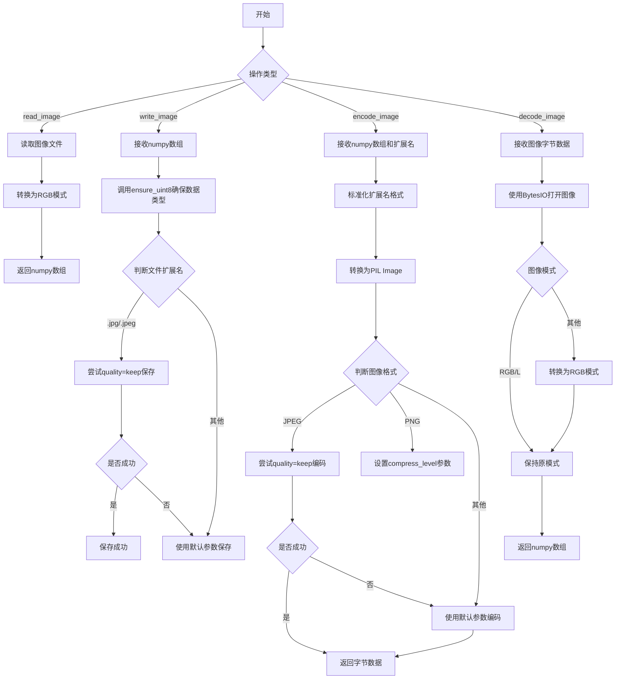
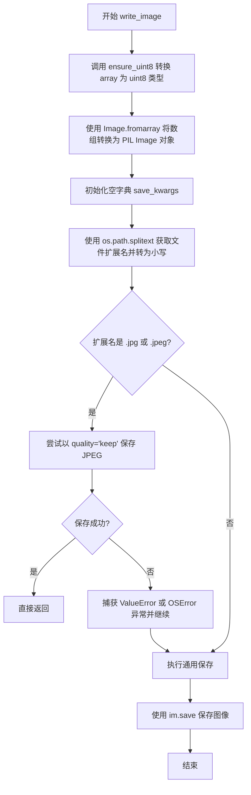
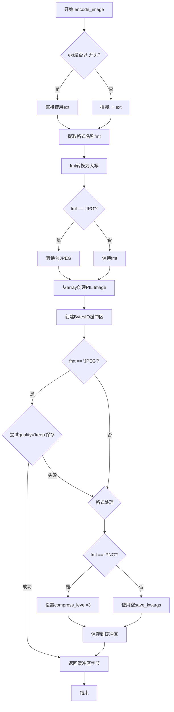
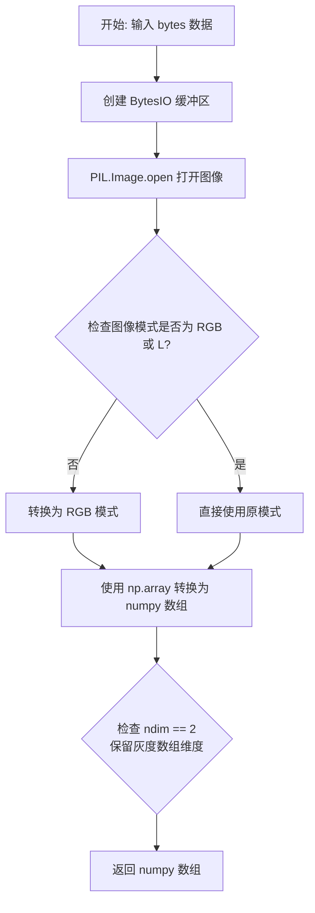
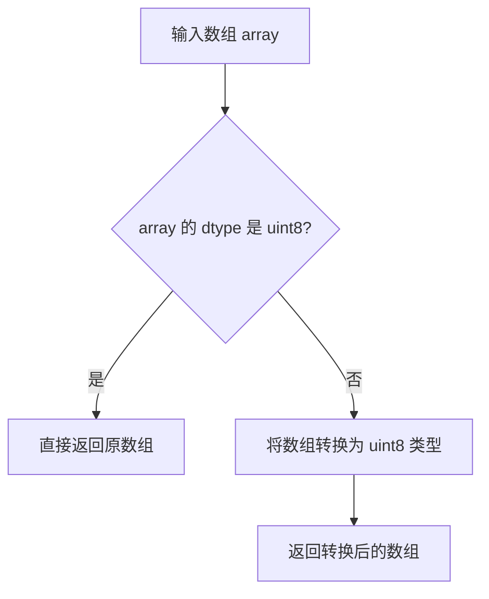

# `comic-translate\imkit\io.py` 详细设计文档

提供图像读写、编码解码功能的工具模块，支持numpy数组与图像文件/字节之间的相互转换

## 整体流程



## 类结构

```
无类定义，仅包含全局函数模块
```

## 全局变量及字段


### `os`
    
用于处理文件路径的操作系统模块

类型：`module`
    


### `BytesIO`
    
用于在内存中操作二进制数据的IO流

类型：`class`
    


### `np`
    
NumPy库，用于数值计算和数组操作

类型：`module`
    


### `Image`
    
PIL图像类，用于图像打开、转换和保存操作

类型：`class`
    


### `ensure_uint8`
    
工具函数，将数组转换为uint8类型

类型：`function`
    


### `im`
    
PIL图像对象，用于临时存储读取或转换后的图像

类型：`Image`
    


### `arr`
    
NumPy数组，存储图像的像素数据

类型：`np.ndarray`
    


### `path`
    
图像文件的完整路径字符串

类型：`str`
    


### `array`
    
表示图像数据的NumPy多维数组

类型：`np.ndarray`
    


### `save_kwargs`
    
图像保存时的可选参数字典

类型：`dict`
    


### `ext`
    
文件扩展名，包含点号的文件类型标识

类型：`str`
    


### `fmt`
    
图像格式名称，如PNG、JPEG等

类型：`str`
    


### `buf`
    
内存缓冲区，用于存储编码后的图像字节数据

类型：`BytesIO`
    


### `data`
    
原始图像字节数据，用于解码

类型：`bytes`
    


    

## 全局函数及方法


### `read_image`

该函数用于读取图像文件并将其转换为 RGB 格式的 NumPy 数组返回。

参数：

- `path`：`str`，待读取的图像文件路径

返回值：`np.ndarray`，RGB 格式的图像数据（形状为 H×W×3 的三维数组）

#### 流程图

```mermaid
flowchart TD
    A[开始] --> B[调用 Image.open 打开图像文件]
    B --> C{检查图像模式是否为 'RGB'}
    C -->|是| D[直接转换为 NumPy 数组]
    C -->|否| E[调用 convert('RGB') 转换模式]
    E --> D
    D --> F[返回 NumPy 数组]
    F --> G[结束]
```

#### 带注释源码

```python
def read_image(path: str) -> np.ndarray:
    """Read an image file and return as RGB numpy array."""
    # 使用 PIL 打开图像文件，获取 Image 对象
    im = Image.open(path)
    # 若图像模式不是 RGB（如灰度图、RGBA 等），则转换为 RGB 模式
    if im.mode != "RGB":
        im = im.convert("RGB")
    # 将 PIL Image 对象转换为 NumPy 数组并返回
    arr = np.array(im)
    return arr
```


### `write_image`

将 NumPy 数组保存为图像文件，根据文件扩展名自动处理 JPEG 格式的质量参数。

#### 参数

- `path`：`str`，图像文件的保存路径
- `array`：`np.ndarray`，要保存的图像数据 NumPy 数组

#### 返回值

`None`，无返回值；直接将图像写入指定路径

#### 流程图



#### 带注释源码

```python
def write_image(path: str, array: np.ndarray) -> None:
    """Write a numpy array as an image file."""
    # 第一步：将输入的 NumPy 数组转换为 uint8 类型，确保数据格式正确
    im = Image.fromarray(ensure_uint8(array))
    
    # 第二步：初始化保存参数字典（当前为空，留作扩展使用）
    save_kwargs: dict[str, object] = {}

    # 第三步：提取文件扩展名并转为小写，用于判断图像格式
    ext = os.path.splitext(path)[1].lower()
    
    # 第四步：特殊处理 JPEG 格式，尝试保持原始质量
    if ext in {".jpg", ".jpeg"}:
        try:
            # 尝试使用 quality="keep" 保留原始质量设置
            im.save(path, quality="keep", **save_kwargs)
            return  # 保存成功后直接返回，避免重复保存
        except (ValueError, OSError):
            # 如果 "keep" 质量设置不支持或发生写入错误，静默继续
            pass

    # 第五步：通用保存逻辑（用于非 JPEG 格式或 JPEG 保存失败的情况）
    im.save(path, **save_kwargs)
```


### `encode_image`

将 NumPy 数组编码为图像字节数据的函数，支持多种图像格式（如 PNG、JPEG）。

参数：

- `array`：`np.ndarray`，输入的图像数据，以 NumPy 数组形式传入
- `ext`：`str`，目标图像格式的扩展名，默认为 ".png"（可传入 ".jpg"、".png" 等）
- `**kwargs`：可选关键字参数，用于传递额外的保存选项（如 `compress_level`）

返回值：`bytes`，编码后的图像二进制数据

#### 流程图



#### 带注释源码

```python
def encode_image(array: np.ndarray, ext: str = ".png", **kwargs) -> bytes:
    """Encode a numpy array as image bytes."""
    # 确保扩展名以点开头，格式化为小写
    if not ext.startswith('.'):
        ext = '.' + ext

    # 提取格式名称并转换为大写
    fmt = ext.lstrip('.').upper()
    
    # 将NumPy数组转换为PIL图像对象
    im = Image.fromarray(ensure_uint8(array))
    
    # 创建内存缓冲区用于存储编码后的图像数据
    buf = BytesIO()
    
    # 初始化保存参数字典
    save_kwargs = {}

    # 处理JPG别名，转换为PIL支持的JPEG格式名
    fmt = "JPEG" if fmt == "JPG" else fmt
    
    # JPEG格式特殊处理：优先尝试保持原始质量
    if fmt == "JPEG":
        try:
            im.save(buf, format=fmt, quality="keep", **save_kwargs)
            return buf.getvalue()  # 成功则直接返回
        except (ValueError, OSError):
            pass  # 失败则继续尝试默认参数

    # PNG格式处理：设置压缩级别
    if fmt == "PNG":
        # Pillow压缩级别0-9，默认3（与cv2.IMWRITE_PNG_COMPRESSION一致）
        save_kwargs.setdefault("compress_level", kwargs.get("compress_level", 3))
    
    # 最终保存：支持所有其他格式
    im.save(buf, format=fmt, **save_kwargs)
    
    # 返回编码后的字节数据
    return buf.getvalue()
```


### `decode_image`

该函数接收图像字节数据，使用 PIL 将其解码为 numpy 数组，支持灰度和 RGB 图像，并保留单通道灰度数组的维度。

参数：

-  `data`：`bytes`，要解码的图像字节数据

返回值：`np.ndarray`，解码后的图像数组（RGB 或灰度）

#### 流程图



#### 带注释源码

```python
def decode_image(data: bytes) -> np.ndarray:
    """Decode image bytes to numpy array."""
    # 使用 BytesIO 将字节数据包装为文件对象，供 PIL Image.open 使用
    im = Image.open(BytesIO(data))
    
    # 检查图像模式：仅保留 RGB（3通道）和 L（灰度）模式
    # 其他模式（如 RGBA、P、1 等）需要转换为 RGB
    if im.mode not in ("RGB", "L"):
        im = im.convert("RGB")
    
    # 将 PIL Image 对象转换为 numpy 数组
    arr = np.array(im)
    
    # 保留单通道灰度数组的二维结构（ndim == 2）
    # 避免自动升维为三维数组，确保与原始图像维度一致
    return arr
```


### `ensure_uint8`

该函数用于将输入的 numpy 数组转换为 uint8 数据类型，确保其符合图像处理库（如 Pillow）的格式要求，处理浮点数组的自动归一化。

参数：

-  `array`：`np.ndarray`，需要转换的图像数组

返回值：`np.ndarray`，转换后的 uint8 类型数组

#### 流程图



#### 带注释源码

```python
def ensure_uint8(array: np.ndarray) -> np.ndarray:
    """Ensure the array is of type uint8.
    
    Args:
        array: Input numpy array, typically image data.
        
    Returns:
        numpy array with dtype uint8.
    """
    # 如果数组已经是 uint8 类型，直接返回，避免不必要的复制
    if array.dtype == np.uint8:
        return array
    
    # 对于其他数据类型（如 float32、int32 等），转换为 uint8
    # 注意：这可能会导致数据截断或归一化问题
    return array.astype(np.uint8)
```

**注意**：由于用户未提供 `.utils` 模块的源代码，上述源码为基于 `imkit` 模块调用方式的合理推断。实际实现可能包含额外的错误处理或浮点数组的自动归一化逻辑。


## 关键组件


### 图像读取模块

负责从文件系统读取图像文件，并转换为RGB格式的numpy数组。包含路径验证、模式转换和数组化功能。

### 图像写入模块

负责将numpy数组写入文件系统。支持JPEG和PNG格式，具有质量保持和错误处理机制。

### 图像编码模块

将numpy数组编码为字节流。支持多种格式（JPEG/PNG），包含压缩级别配置和格式规范化处理。

### 图像解码模块

将图像字节数据解码为numpy数组。处理RGB和灰度模式，并保持单通道灰度数组的维度特性。

### 图像类型转换工具

通过ensure_uint8确保图像数据为uint8类型，是反量化支持的核心组件，处理不同数据范围的图像数组。


## 问题及建议


### 已知问题

-   **资源泄漏风险**：`Image.open()` 返回的对象在使用后未显式关闭（未使用 `with` 语句或显式 `close()`），可能导致文件句柄泄漏
-   **无效代码**：`save_kwargs` 字典在 `write_image` 和 `encode_image` 函数中初始化后未被使用，代码冗余
-   **异常处理过于简单**：多处使用 `except (ValueError, OSError): pass` 静默吞掉异常，导致错误信息丢失，难以调试
-   **参数校验缺失**：未对输入的 `array` 进行形状、类型、数值范围验证，可能导致运行时错误
-   **PNG压缩级别硬编码**：PNG默认压缩级别为3，未提供灵活配置接口
-   **JPEG质量处理不一致**：`quality="keep"` 可能不被所有Pillow版本支持，缺乏fallback机制说明

### 优化建议

-   使用上下文管理器或显式关闭Image对象：`with Image.open(path) as im:`
-   删除未使用的 `save_kwargs` 变量，或在异常处理中使用它
-   增强异常处理，保留错误日志或抛出有意义的自定义异常
-   添加输入验证：检查array的dtype、shape（2D或3D）、value range
-   将PNG压缩级别、图像质量等参数提取为可配置选项
-   考虑使用 `try-except` 包装核心逻辑并添加详细的错误信息（如文件路径、图像尺寸等）

## 其它


### 设计目标与约束

**设计目标**：为imkit模块提供统一的图像读写、编码解码抽象层，屏蔽PIL与numpy之间的差异，支持多种图像格式（PNG、JPEG等），并确保输出的numpy数组为uint8类型。

**设计约束**：
- 仅处理RGB格式图像（自动转换非RGB图像）
- 依赖PIL（Pillow）进行图像编解码，依赖numpy进行数组操作
- 使用ensure_uint8工具函数确保数据类型一致性
- JPEG编码尝试使用"keep"质量参数，失败时降级到默认质量

### 错误处理与异常设计

**异常传播策略**：
- `read_image`：可能抛出PIL相关的异常（如文件不存在、格式不支持、文件损坏）
- `write_image`：可能抛出OSError（路径权限问题）、ValueError（格式参数错误）
- `encode_image`：可能抛出ValueError、OSError（编码失败时先尝试降级，仍失败则继续抛出）
- `decode_image`：可能抛出PIL相关异常（数据格式错误、损坏）

**降级处理**：
- JPEG编码失败时尝试不带quality参数保存
- 非RGB图像自动转换为RGB
- 灰度图像（"L"模式）保留，不强制转换为RGB

### 数据流与状态机

**数据流转路径**：
```
文件路径 → PIL Image对象 → numpy array (RGB)
numpy array → PIL Image对象 → 文件路径
numpy array → PIL Image对象 → BytesIO → bytes
bytes → BytesIO → PIL Image对象 → numpy array
```

**图像模式转换状态机**：
- 读取时：非RGB/L模式 → 转换为RGB
- 写入时：数组类型自动由ensure_uint8处理
- 编码时：PNG设置compress_level默认3，JPEG尝试quality="keep"

### 外部依赖与接口契约

**导入依赖**：
- `os`：文件扩展名提取
- `io.BytesIO`：内存缓冲区操作
- `numpy as np`：数组类型定义
- `PIL.Image`：图像处理
- `.utils.ensure_uint8`：数据类型转换工具

**公共接口契约**：
- `read_image(path: str) -> np.ndarray`：读取文件返回RGB数组
- `write_image(path: str, array: np.ndarray) -> None`：写入数组到文件
- `encode_image(array: np.ndarray, ext: str = ".png", **kwargs) -> bytes`：编码为字节
- `decode_image(data: bytes) -> np.ndarray`：解码字节为数组

### 性能考虑

**性能热点**：
- 图像到numpy数组的转换（np.array）涉及内存拷贝
- JPEG编码时quality="keep"可能触发额外处理
- BytesIO缓冲区在小图像时效率可接受，大图像需注意内存占用

**优化空间**：
- 可考虑使用memoryview减少不必要拷贝（当前未实现）
- 大图像批量处理时可考虑流式写入
- decode_image可通过PIL.Image.verify()先验证图像完整性

### 安全性考虑

**路径安全**：
- write_image未验证路径合法性，存在路径遍历风险（如传入"../../../etc/passwd"）
- read_image未验证文件类型，可能打开恶意构造的文件

**数据安全**：
- encode_image/decode_image在内存中处理，需注意大图像的内存消耗
- 无输入数据校验（如data为空字节串的行为）

### 兼容性考虑

**Python版本**：
- 使用`from __future__ import annotations`支持类型注解
- 依赖Python 3.8+的dict类型提示语法（dict[str, object]）

**库版本**：
- Pillow：需支持Image.save的quality和compress_level参数
- numpy：ensure_uint8依赖

### 使用示例

```python
# 读取图像
img = read_image("photo.jpg")

# 写入图像
write_image("output.png", img)

# 编码为PNG字节
png_bytes = encode_image(img, ".png", compress_level=6)

# 编码为JPEG字节
jpg_bytes = encode_image(img, ".jpg")

# 解码图像
img2 = decode_image(png_bytes)
```

### 配置参数说明

**write_image参数**：
- quality="keep"：尝试保留原图质量，仅适用于JPEG

**encode_image参数**：
- ext：文件扩展名（默认".png"），用于确定输出格式
- compress_level：PNG压缩级别，0-9（默认3），数值越大压缩越高

**decode_image行为**：
- 自动处理RGB和灰度图像，非这两种模式则转为RGB

### 限制与边界情况

**支持的格式**：
- 读取：PIL支持的所有格式
- 写入：PNG、JPEG（通过扩展名判断）

**不支持的场景**：
- 16位/32位深图像（会被ensure_uint8截断）
- 带透明通道的RGBA图像（写入时丢失Alpha）
- 动画图像（只处理第一帧）
- 路径中的符号链接（未验证）

**边界情况**：
- 空数组：可能产生警告或异常
- 极大图像：可能触发内存错误
- 损坏图像：异常信息可能不够明确
    