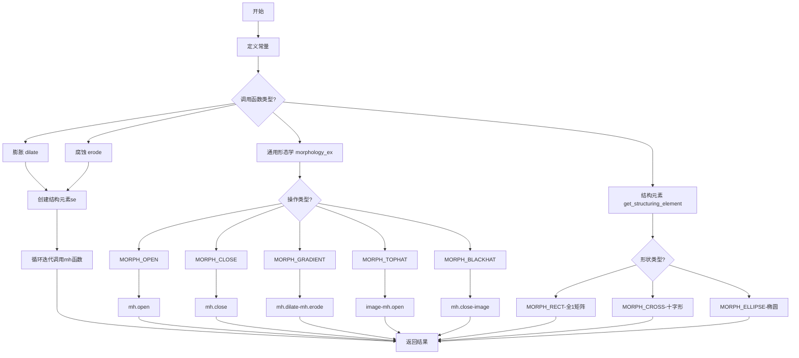
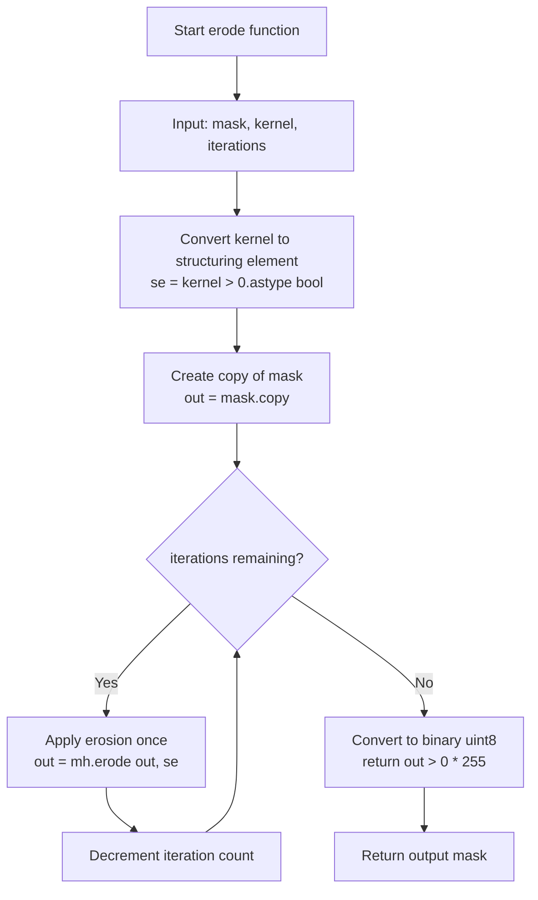
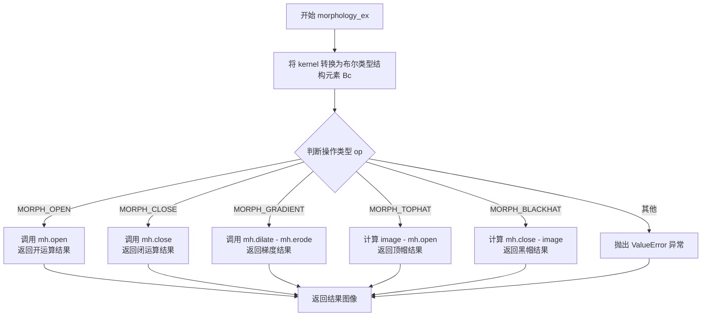
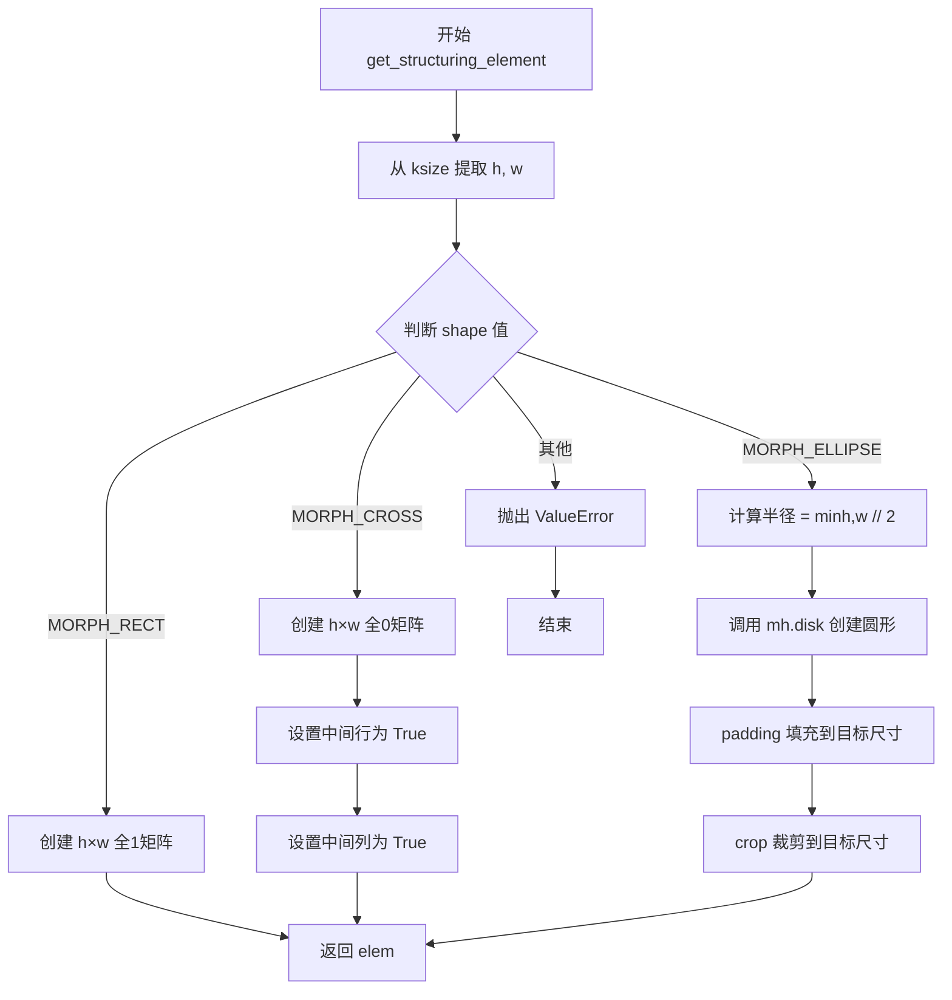

# `comic-translate\imkit\morphology.py` 详细设计文档

该模块提供了形态学图像处理操作，封装了mahotas库实现膨胀、腐蚀、开运算、闭运算、形态学梯度、顶帽和黑帽变换，并提供了类似OpenCV的API接口。

## 整体流程



## 类结构

```
模块级函数 (无类)
├── dilate (膨胀)
├── erode (腐蚀)
├── morphology_ex (通用形态学操作)
└── get_structuring_element (创建结构元素)
```

## 全局变量及字段


### `MORPH_RECT`
    
矩形形状常量，用于创建矩形结构元素

类型：`int`
    


### `MORPH_CROSS`
    
十字形形状常量，用于创建十字形结构元素

类型：`int`
    


### `MORPH_ELLIPSE`
    
椭圆形状常量，用于创建椭圆形结构元素

类型：`int`
    


### `MORPH_OPEN`
    
开运算操作类型，先腐蚀后膨胀，用于去除小亮点

类型：`str`
    


### `MORPH_CLOSE`
    
闭运算操作类型，先膨胀后腐蚀，用于填充小暗点

类型：`str`
    


### `MORPH_GRADIENT`
    
梯度操作类型，膨胀减腐蚀，获取图像边缘

类型：`str`
    


### `MORPH_TOPHAT`
    
顶帽操作类型，原图减开运算，提取小物体

类型：`str`
    


### `MORPH_BLACKHAT`
    
黑帽操作类型，闭运算减原图，提取小暗点

类型：`str`
    


    

## 全局函数及方法


### `dilate`

对输入的二值掩码进行形态学膨胀操作，通过指定的核结构和迭代次数扩展掩码的白色区域。

参数：

- `mask`：`np.ndarray`，输入的二值掩码图像
- `kernel`：`np.ndarray`，用于膨胀操作的2D核结构数组
- `iterations`：`int`，膨胀操作的迭代次数，默认为1

返回值：`np.ndarray`，膨胀后的二值掩码，类型为uint8，值为0或255

#### 流程图

```mermaid
flowchart TD
    A[开始] --> B[输入: mask, kernel, iterations]
    B --> C[将kernel转换为布尔结构元素: se = (kernel > 0).astype(bool)]
    C --> D[复制输入掩码: out = mask.copy()]
    D --> E{迭代次数 > 0?}
    E -->|是| F[执行膨胀: out = mh.dilate out, se]
    F --> E
    E -->|否| G[后处理: (out > 0).astypeuint8 * 255]
    G --> H[返回膨胀后的掩码]
    H --> I[结束]
```

#### 带注释源码

```python
def dilate(mask: np.ndarray, kernel: np.ndarray, iterations: int = 1) -> np.ndarray:
    """Apply dilation morphological operation to a mask.
    
    Args:
        mask: Input mask
        kernel: a 2D numpy array kernel
        iterations: Number of iterations
    """
    # 将核数组转换为布尔类型，保留大于0的值作为结构元素
    se = (kernel > 0).astype(bool)
    
    # 创建输入掩码的副本，避免修改原始数据
    out = mask.copy()
    
    # 根据迭代次数重复执行膨胀操作
    for _ in range(iterations):
        # 使用mahotas库的dilate函数进行膨胀
        # 膨胀会扩大掩码中的白色区域
        out = mh.dilate(out, se)
    
    # 将结果转换为uint8类型，值为0或255
    # 膨胀后的结果进行阈值处理，确保输出为标准二值掩码格式
    return (out > 0).astype(np.uint8) * 255
```


### `erode`

对输入的掩码执行腐蚀形态学操作，通过使用结构元素对图像进行迭代腐蚀，去除边缘像素并收缩区域。

参数：

- `mask`：`np.ndarray`，输入的掩码图像
- `kernel`：`np.ndarray`，2D numpy 数组核，用于定义腐蚀操作的结构元素
- `iterations`：`int`，腐蚀操作的迭代次数，默认为 1

返回值：`np.ndarray`，腐蚀操作后的输出掩码，类型为 uint8，值为 0 或 255

#### 流程图



#### 带注释源码

```python
def erode(mask: np.ndarray, kernel: np.ndarray, iterations: int = 1) -> np.ndarray:
    """Apply erosion morphological operation to a mask.
    
    Args:
        mask: Input mask
        kernel: a 2D numpy array kernel
        iterations: Number of iterations
    
    Returns:
        np.ndarray: Eroded mask with values 0 or 255
    """
    # 将核数组转换为布尔类型的结构元素
    # 核中值大于0的位置被视为结构元素的有效区域
    se = (kernel > 0).astype(bool)
    
    # 创建输入掩码的副本，避免修改原始数据
    out = mask.copy()
    
    # 迭代执行腐蚀操作指定次数
    # 每次迭代都会进一步侵蚀掩码的边缘
    for _ in range(iterations):
        # 使用mahotas库的erode函数执行单次腐蚀
        # se定义了哪些像素参与腐蚀计算
        out = mh.erode(out, se)
    
    # 将结果转换为二值图像
    # 腐蚀后像素值>0的位置设为255，其余设为0
    # 转换为uint8类型以保持一致性
    return (out > 0).astype(np.uint8) * 255
```


### `morphology_ex`

这是一个通用的形态学操作函数，支持多种形态学运算（开运算、闭运算、梯度、顶帽、黑帽），内部使用 mahotas 库实现，充当 OpenCV 形态学操作的替代方案。

参数：

- `image`：`np.ndarray`，输入图像矩阵
- `op`：`str`，形态学操作类型（支持 MORPH_OPEN、MORPH_CLOSE、MORPH_GRADIENT、MORPH_TOPHAT、MORPH_BLACKHAT）
- `kernel`：`np.ndarray`，结构元素（卷积核），用于定义形态学操作的邻域形状

返回值：`np.ndarray`，形态学操作后的输出图像

#### 流程图



#### 带注释源码

```python
def morphology_ex(image: np.ndarray, op: str, kernel: np.ndarray) -> np.ndarray:
    """
    通用形态学操作函数
    
    该函数提供统一的接口来执行多种形态学操作，
    内部使用 mahotas 库作为计算后端。
    
    Args:
        image: 输入的二值图像或灰度图像（numpy 数组）
        op: 形态学操作类型字符串，支持：
            - MORPH_OPEN: 开运算（先腐蚀后膨胀，去除小亮点）
            - MORPH_CLOSE: 闭运算（先膨胀后腐蚀，填充小暗点）
            - MORPH_GRADIENT: 梯度运算（膨胀减去腐蚀，获取边缘）
            - MORPH_TOPHAT: 顶帽运算（原图减去开运算，获取小物体）
            - MORPH_BLACKHAT: 黑帽运算（闭运算减去原图，获取小暗点）
        kernel: 结构元素，用于定义形态学操作的邻域形状和大小
    
    Returns:
        np.ndarray: 形态学操作后的输出图像
    
    Raises:
        ValueError: 当传入不支持的操作类型时抛出
    """
    
    # 将 OpenCV 风格的数值型 kernel 转换为 mahotas 所需的布尔类型结构元素
    # kernel 中大于 0 的位置视为结构元素的有效像素
    Bc = kernel.astype(bool)
    
    # 根据操作类型执行相应的形态学运算
    if op == MORPH_OPEN:  # 对应 cv2.MORPH_OPEN
        # 开运算：先腐蚀去除小物体，再膨胀恢复主体轮廓
        # 效果：去除小的亮点（噪声）
        return mh.open(image, Bc)
    
    elif op == MORPH_CLOSE:  # 对应 cv2.MORPH_CLOSE
        # 闭运算：先膨胀填充小暗点，再腐蚀恢复主体轮廓
        # 效果：去除小的暗点（噪声），连接临近物体
        return mh.close(image, Bc)
    
    elif op == MORPH_GRADIENT:  # 对应 cv2.MORPH_GRADIENT
        # 梯度运算：膨胀结果减去腐蚀结果
        # 效果：提取物体边缘轮廓
        return mh.dilate(image, Bc) - mh.erode(image, Bc)
    
    elif op == MORPH_TOPHAT:  # 对应 cv2.MORPH_TOPHAT
        # 顶帽运算（原帽）：原图像减去开运算结果
        # 效果：提取小于结构元素的亮区域
        return image - mh.open(image, Bc)
    
    elif op == MORPH_BLACKHAT:  # 对应 cv2.MORPH_BLACKHAT
        # 黑帽运算（黑帽）：闭运算结果减去原图像
        # 效果：提取小于结构元素的暗区域
        return mh.close(image, Bc) - image
    
    else:
        # 操作类型不支持，抛出明确的错误信息
        raise ValueError(f"Unsupported operation: {op}")
```


### `get_structuring_element`

创建结构元素（structuring element），用于图像形态学操作。该函数模拟 OpenCV 的 `getStructuringElement` 功能，支持三种形状：矩形（MORPH_RECT）、十字形（MORPH_CROSS）和椭圆（MORPH_ELLIPSE），返回布尔类型的 numpy 数组作为形态学操作的核心结构元素。

参数：

- `shape`：`int`，形态学结构元素的形状类型，取值为 `MORPH_RECT`（0）、`MORPH_CROSS`（1）或 `MORPH_ELLIPSE`（2）
- `ksize`：`tuple`，结构元素的尺寸，格式为 `(h, w)`，表示高度和宽度

返回值：`np.ndarray`，布尔类型的二维 numpy 数组，表示指定形状和尺寸的结构元素

#### 流程图



#### 带注释源码

```python
def get_structuring_element(shape: int, ksize: tuple) -> np.ndarray:
    """
    OpenCV-like getStructuringElement using Mahotas.

    Parameters
    ----------
    shape : int
        One of MORPH_RECT, MORPH_CROSS, MORPH_ELLIPSE
    ksize : (h, w) tuple
        Size of the structuring element
    """
    # 从元组中解包出结构元素的高度和宽度
    h, w = ksize

    # 根据形状类型创建不同的结构元素
    if shape == MORPH_RECT:
        # 矩形结构元素：创建全为 True 的矩阵
        # 用途：用于保留图像中的矩形区域
        elem = np.ones((h, w), dtype=bool)

    elif shape == MORPH_CROSS:
        # 十字形结构元素：创建十字形图案
        # 用途：用于检测线条或进行十字方向的操作
        elem = np.zeros((h, w), dtype=bool)
        elem[h//2, :] = True   # 设置中间行为 True
        elem[:, w//2] = True   # 设置中间列为 True

    elif shape == MORPH_ELLIPSE:
        # 椭圆结构元素：使用 Mahotas 的 disk 函数近似
        # 用途：用于平滑边缘的膨胀腐蚀操作
        # 使用 min(h, w)//2 作为半径近似椭圆
        radius = min(h, w) // 2
        # 调用 mh.disk 创建圆形结构元素，然后转为布尔类型
        elem = mh.disk(radius, dim=2).astype(bool)

        # 确保输出尺寸与请求的尺寸匹配，进行 padding 和 crop
        # 计算需要填充的边缘大小
        ph = max(0, h - elem.shape[0])  # 高度方向填充量
        pw = max(0, w - elem.shape[1])  # 宽度方向填充量
        # 对称填充，保持结构元素居中
        elem = np.pad(elem,
                      ((ph//2, ph - ph//2), (pw//2, pw - pw//2)),
                      mode='constant')
        # 裁剪到目标尺寸
        elem = elem[:h, :w]

    else:
        # 不支持的形状类型，抛出异常
        raise ValueError("Unknown shape flag")

    # 返回布尔类型的结构元素
    return elem
```

## 关键组件


### 形态学操作常量

定义了形态学操作所需的常量，包括结构元素形状（MORPH_RECT、MORPH_CROSS、MORPH_ELLIPSE）和操作类型（MORPH_OPEN、MORPH_CLOSE、MORPH_GRADIENT、MORPH_TOPHAT、MORPH_BLACKHAT）。

### dilate 函数

执行图像膨胀操作的函数，通过迭代使用mahotas库的dilate方法对输入掩码进行膨胀，可指定迭代次数，返回膨胀后的二值化掩码。

### erode 函数

执行图像腐蚀操作的函数，通过迭代使用mahotas库的erode方法对输入掩码进行腐蚀，可指定迭代次数，返回腐蚀后的二值化掩码。

### morphology_ex 函数

综合形态学操作函数，支持开运算、闭运算、形态学梯度、顶帽和黑帽操作，根据传入的操作类型参数调用相应的mahotas库函数实现。

### get_structuring_element 函数

创建结构元素的函数，支持矩形、十字形和椭圆三种形状，根据传入的形状类型和尺寸生成对应的二维布尔数组作为形态学操作的结构元素。


## 问题及建议


### 已知问题

-   **类型转换冗余**：`dilate`和`erode`函数中`(out > 0).astype(np.uint8)*255`进行了两次类型转换操作，可简化为直接使用`np.where(out > 0, 255, 0).astype(np.uint8)`
-   **返回类型不一致**：`morphology_ex`函数直接返回mahotas的运算结果（可能是浮点数或不同数据类型），而`dilate`和`erode`返回0/255的uint8图像，API使用不一致
-   **参数验证缺失**：所有函数均未对输入参数进行有效性检查，包括mask维度验证、kernel非空检查、iterations正整数验证等，可能导致运行时错误或难以调试
-   **十字形结构元素边界问题**：`get_structuring_element`中当ksize为偶数时，`h//2`和`w//2`计算的中心点不对称，可能导致形态学操作结果与OpenCV不一致
-   **椭圆近似不精确**：使用`mh.disk`近似椭圆结构元素，当h≠w时会产生圆形而非椭圆形结构元素，与OpenCV的MORPH_ELLIPSE行为不符
-   **形态学梯度返回值可能为负数**：`morphology_ex`中`mh.dilate(image, Bc) - mh.erode(image, Bc)`可能产生负值，与其他函数返回的uint8类型不一致

### 优化建议

-   **统一返回类型**：在`morphology_ex`中添加与`dilate`/`erode`一致的输出类型处理，确保所有函数返回相同格式的图像（0/255的uint8）
-   **添加输入验证**：实现参数校验函数，检查mask为2D数组、kernel为非空、iterations为正整数等，抛出明确的自定义异常信息
-   **修正椭圆结构元素**：根据h和w分别计算半径生成真正的椭圆结构元素，而非仅使用disk
-   **优化十字形中心**：使用`np.floor_divide`或考虑边界情况，确保偶数尺寸时的对称性
-   **添加类型注解完善**：为缺少返回类型注解的`morphology_ex`函数补充类型提示
-   **考虑使用numpy向量化**：将迭代循环中的mahotas调用改为一次性操作，mahotas可能已支持多iterations参数


## 其它


### 设计目标与约束

本模块旨在提供与OpenCV兼容的形态学操作接口，使用mahotas库作为后端实现。设计目标包括：1）保持与OpenCV API的兼容性，使得从OpenCV迁移到本模块的代码只需最小改动；2）支持常见的形态学操作（膨胀、腐蚀、开运算、闭运算、梯度变换、顶帽、黑帽）；3）提供结构元素生成功能，支持矩形、十字形和椭圆形结构元素。

### 错误处理与异常设计

代码中包含以下异常处理：
- `ValueError`: 当`morphology_ex`函数接收到不支持的操作类型时抛出
- `ValueError`: 当`get_structuring_element`函数接收到未知的shape标志时抛出
建议改进：增加对输入参数的类型检查（如mask和kernel是否为numpy数组）、数值范围验证（如iterations必须为正整数）、以及kernel维度验证（kernel必须为2D数组）。

### 数据流与状态机

输入数据流：numpy.ndarray格式的mask或image → 转换为布尔类型的结构元素 → 调用mahotas库函数执行形态学操作 → 输出numpy.ndarray格式的结果。状态转换：对于迭代操作（dilate/erode），每次迭代都会更新输出状态；对于复合操作（open/close/tophat/blackhat/gradient），通过组合基本操作实现状态转换。

### 外部依赖与接口契约

外部依赖：
- numpy: 用于数组操作和类型转换
- mahotas: 用于底层的形态学操作实现

接口契约：
- 输入图像必须为2D numpy数组
- kernel必须为2D numpy数组
- 输出为uint8类型的2D数组，像素值为0或255
- 所有函数在输入合法的情况下应返回有效的numpy数组

### 性能考虑

- dilate和erode函数使用循环迭代，当前实现为Python循环，可考虑使用numpy向量化或mahotas的迭代参数优化
- 每次迭代都创建新的数组副本，可考虑原地操作以减少内存开销
- morphology_ex函数中，对于某些操作（如gradient）计算了两次形态学操作，可考虑缓存中间结果

### 兼容性考虑

本模块设计为与OpenCV的形态学操作接口兼容，但存在以下差异：
- 输出类型：OpenCV输出为uint8（0或255），但某些操作（如morphology_ex中的gradient）返回可能包含更大范围的数值
- 椭圆近似：使用mahotas.disk近似椭圆，半径为min(h,w)//2，与OpenCV的椭圆生成算法不完全一致

### 使用示例

```python
import numpy as np
from imkit.morphology import dilate, erode, morphology_ex, get_structuring_element, MORPH_OPEN, MORPH_CLOSE

# 创建测试mask
mask = np.zeros((100, 100), dtype=np.uint8)
mask[40:60, 40:60] = 255

# 创建结构元素
kernel = get_structuring_element(0, (10, 10))  # 矩形

# 膨胀操作
dilated = dilate(mask, kernel, iterations=1)

# 腐蚀操作
eroded = erode(mask, kernel, iterations=1)

# 开运算
opened = morphology_ex(mask, MORPH_OPEN, kernel)

# 闭运算
closed = morphology_ex(mask, MORPH_CLOSE, kernel)
```

### 配置参数说明

- iterations参数：控制膨胀/腐蚀的迭代次数，默认为1，值越大效果越强
- kernel参数：结构元素，决定形态学操作的邻域形状和大小
- shape参数：结构元素类型（MORPH_RECT=0, MORPH_CROSS=1, MORPH_ELLIPSE=2）
- ksize参数：结构元素尺寸，格式为(h, w)

### 限制与注意事项

- 当前仅支持2D图像（灰度图），不支持3D或更高维度的数据
- 结构元素仅支持2D核，不支持3D核
- 对于非常大的图像和核，内存消耗可能成为瓶颈
- 在处理非二值图像时，结果可能不符合预期（代码会将输出转换为二值）
- 迭代操作使用Python循环，在iterations较大时性能较差

    