# `comic-translate\imkit\transforms.py` 详细设计文档

该模块提供图像变换操作，使用PIL、NumPy和mahotas库替代OpenCV的部分功能，包括灰度转换、高斯模糊、resize、几何计算（凸包、最小面积矩形）、绘图操作、连通分量分析、阈值处理和图像融合等。

## 整体流程

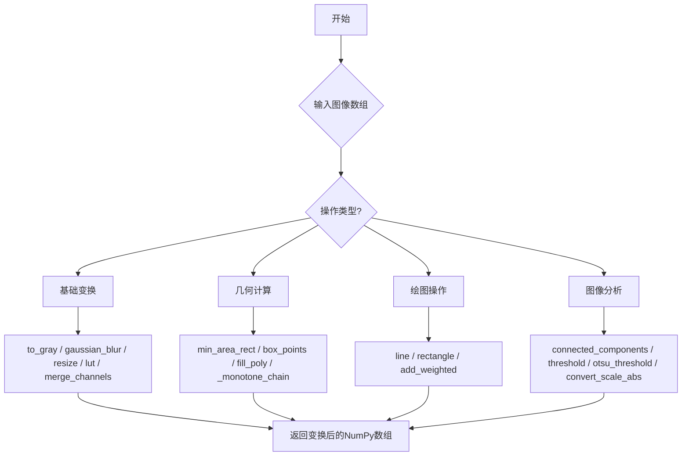

## 类结构

```
该文件为模块文件（无类定义）
所有函数均为模块级全局函数
主要依赖：PIL, NumPy, mahotas
```

## 全局变量及字段


### `to_gray`
    
将图像转换为灰度图，使用Pillow库进行处理

类型：`function`
    


### `gaussian_blur`
    
对图像数组应用高斯模糊效果

类型：`function`
    


### `resize`
    
将图像数组调整到指定大小

类型：`function`
    


### `lut`
    
应用查找表转换，替换cv2.LUT功能

类型：`function`
    


### `merge_channels`
    
将多个单通道数组合并为多通道图像

类型：`function`
    


### `_monotone_chain`
    
Andrew单调链凸包算法，计算二维点的凸包顶点

类型：`function`
    


### `min_area_rect`
    
计算点集的最小面积外接矩形，返回格式与cv2.minAreaRect一致

类型：`function`
    


### `box_points`
    
获取旋转矩形的四个角点坐标

类型：`function`
    


### `fill_poly`
    
使用mahotas库在图像上填充多边形

类型：`function`
    


### `connected_components`
    
使用mahotas进行连通组件标记

类型：`function`
    


### `connected_components_with_stats`
    
带统计信息的连通组件标记，返回标签、统计和质心

类型：`function`
    


### `line`
    
在图像上绘制直线，替换cv2.line功能

类型：`function`
    


### `convert_scale_abs`
    
应用缩放和偏移后转换为绝对值uint8，替换cv2.convertScaleAbs

类型：`function`
    


### `threshold`
    
对数组应用阈值处理，替换cv2.threshold功能

类型：`function`
    


### `otsu_threshold`
    
使用mahotas实现Otsu自动阈值分割

类型：`function`
    


### `rectangle`
    
在图像上绘制矩形，支持填充和描边

类型：`function`
    


### `add_weighted`
    
计算两个图像的加权融合，替换cv2.addWeighted功能

类型：`function`
    


    

## 全局函数及方法


### `to_gray`

将输入的彩色图像数组转换为灰度图像数组，使用 Pillow 库进行转换，支持 3 通道彩色图像和单通道灰度图像，并确保输出为 uint8 类型。

参数：

- `img`：`np.ndarray`，输入的图像数组，可以是 3 通道彩色图像或单通道灰度图像

返回值：`np.ndarray`，灰度图像数组，数据类型为 uint8

#### 流程图

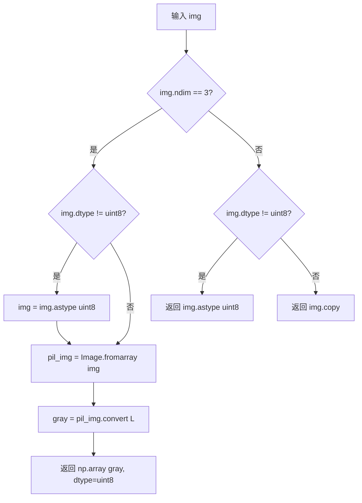

#### 带注释源码

```python
def to_gray(img: np.ndarray) -> np.ndarray:
    """Grayscale conversion using Pillow."""
    # 判断输入是否为彩色图像（3维数组）
    if img.ndim == 3:
        # 如果数据类型不是uint8，则进行类型转换
        if img.dtype != np.uint8:
            img = img.astype(np.uint8)
        # 将numpy数组转换为PIL图像
        pil_img = Image.fromarray(img)
        # 使用Pillow的L模式转换为灰度图像
        gray = pil_img.convert("L")  # Pillow grayscale
        # 将灰度PIL图像转回numpy数组，并确保数据类型为uint8
        return np.array(gray, dtype=np.uint8)
    # 如果输入不是彩色图像（非3维），检查是否需要类型转换
    elif img.dtype != np.uint8:
        return img.astype(np.uint8)
    # 对于已经是uint8类型的灰度图像，返回副本
    return img.copy()
```


### `gaussian_blur`

对输入的图像数组应用高斯模糊处理，通过 Pillow 库将图像转换为 PIL 格式后使用 GaussianBlur 滤镜进行模糊处理，最后再转换回 NumPy 数组返回。

参数：

- `array`：`np.ndarray`，输入的图像数组，支持任意维度的图像数据
- `radius`：`float`，高斯模糊的半径值，控制模糊程度，值越大模糊效果越强，默认值为 1.0

返回值：`np.ndarray`，应用高斯模糊后的图像数组，数据类型为 uint8

#### 流程图

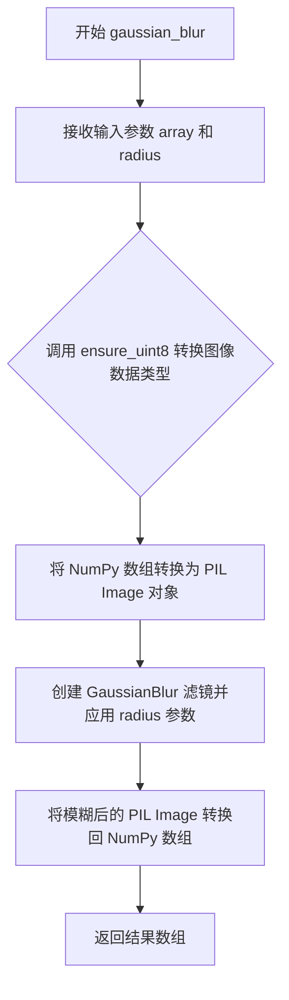

#### 带注释源码

```python
def gaussian_blur(array: np.ndarray, radius: float = 1.0) -> np.ndarray:
    """
    Apply Gaussian blur to an image array.
    
    Args:
        array: Input image array to be blurred
        radius: Radius of the Gaussian blur (default: 1.0)
        
    Returns:
        Blurred image as numpy array with uint8 dtype
    """
    # Step 1: Ensure input array is uint8 format for PIL compatibility
    # The ensure_uint8 utility handles type conversion safely
    im = Image.fromarray(ensure_uint8(array))
    
    # Step 2: Create GaussianBlur filter with specified radius
    # and apply it to the image
    blurred = im.filter(ImageFilter.GaussianBlur(radius=radius))
    
    # Step 3: Convert PIL Image back to NumPy array for consistent return type
    return np.array(blurred)
```


### `resize`

调整图像数组到指定的尺寸，使用PIL库进行重采样操作。

参数：

- `image`：`np.ndarray`，输入的图像数组
- `size`：`tuple[int, int]`，目标尺寸，格式为 (宽度, 高度)
- `mode`：`Image.Resampling`，重采样模式，默认为 `Image.Resampling.LANCZOS`

返回值：`np.ndarray`，调整尺寸后的图像数组

#### 流程图

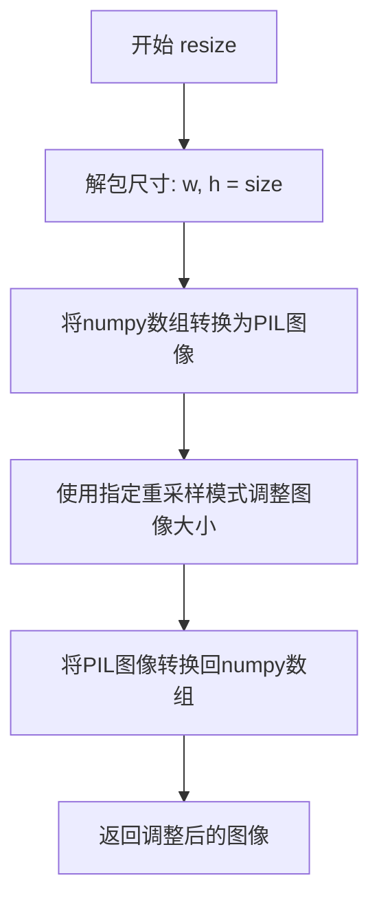

#### 带注释源码

```python
def resize(
    image: np.ndarray, 
    size: tuple[int, int], 
    mode: Image.Resampling = Image.Resampling.LANCZOS
) -> np.ndarray:
    """Resize an image array to the specified size."""
    # 解包目标尺寸为宽度和高度
    w, h = size
    
    # 将输入的numpy数组确保为uint8类型后，转换为PIL Image对象
    # ensure_uint8 来自同模块的utils工具函数，确保图像数据类型正确
    im = Image.fromarray(ensure_uint8(image))
    
    # 调用PIL的resize方法调整图像大小
    # resample参数指定重采样算法，默认使用LANCZOS（高质量插值）
    im = im.resize((w, h), resample=mode)
    
    # 将调整大小后的PIL Image对象转换回numpy数组并返回
    return np.array(im)
```


### `lut`

应用查找表转换，用 NumPy 数组索引实现替换 cv2.LUT 功能。该函数通过使用查找表对输入数组进行像素值映射转换，是图像处理中常用的灰度或颜色变换手段。

参数：

-  `array`：`np.ndarray`，输入数组，待转换的图像或数据数组
-  `lookup_table`：`np.ndarray`，查找表，用于对输入数组进行值映射转换

返回值：`np.ndarray`，转换后的数组

#### 流程图

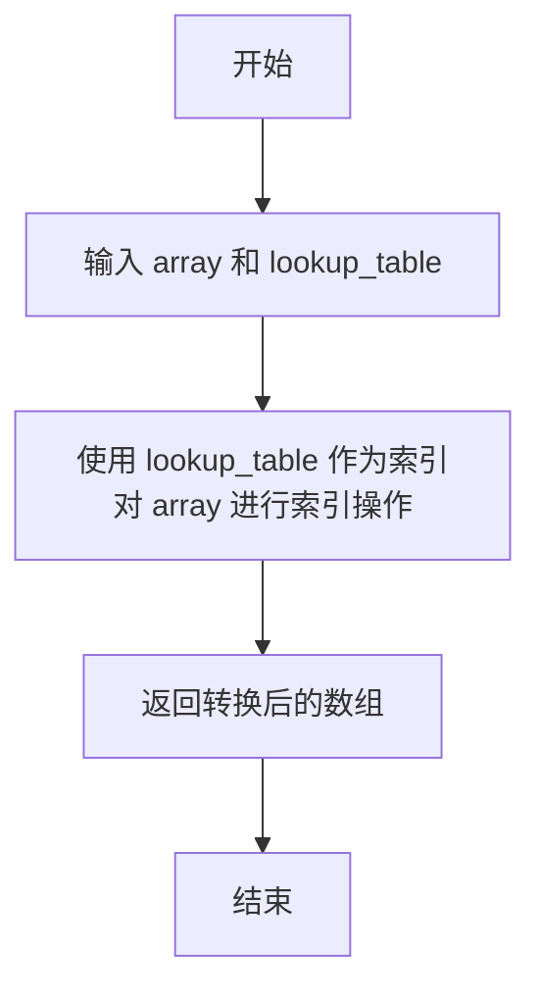

#### 带注释源码

```python
def lut(array: np.ndarray, lookup_table: np.ndarray) -> np.ndarray:
    """
    Apply lookup table transformation.
    Replaces cv2.LUT functionality.
    
    Args:
        array: Input array
        lookup_table: Lookup table for transformation
        
    Returns:
        Transformed array
    """
    # 使用 NumPy 的高级索引功能，直接用 array 作为索引从 lookup_table 中取值
    # 这相当于 cv2.LUT 的功能，将输入数组中的每个值映射到查找表对应位置的值
    # 例如：array[0] = 5 则 lookup_table[5] 成为输出数组的第一个元素
    return lookup_table[array]
```


### `merge_channels`

将单独的单通道图像数组合并成多通道图像数组，替换 cv2.merge 功能。

参数：

- `channels`：`list`，待合并的单通道数组列表

返回值：`np.ndarray`，合并后的多通道图像数组

#### 流程图

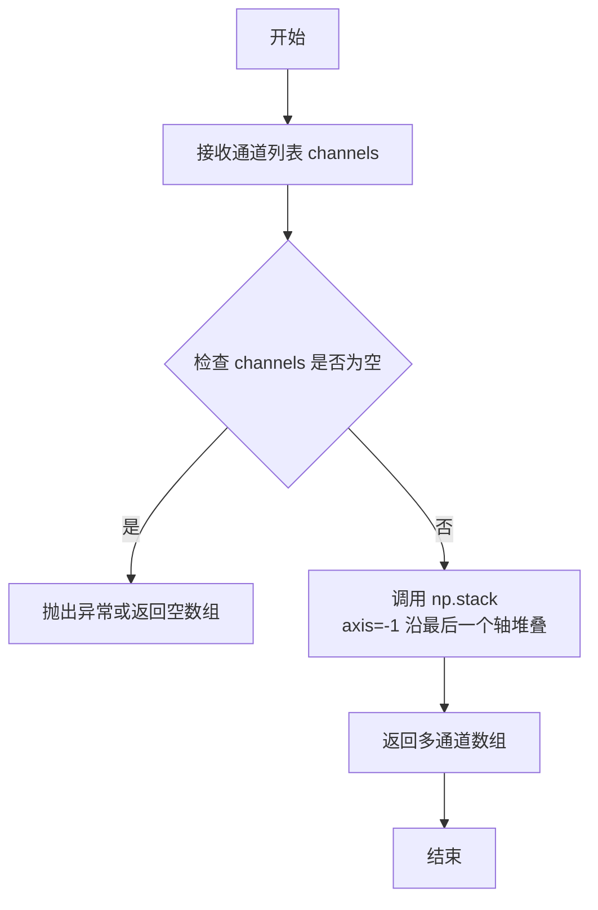

#### 带注释源码

```python
def merge_channels(channels: list) -> np.ndarray:
    """
    Merge separate channels into a multi-channel image.
    Replaces cv2.merge functionality.
    
    Args:
        channels: List of single-channel arrays
        
    Returns:
        Multi-channel array
    """
    # 使用 numpy 的 stack 函数沿最后一个轴（即通道轴）合并多个单通道数组
    # axis=-1 表示在最后一个维度进行堆叠
    # 例如：3个 (H, W) 的单通道数组堆叠后变为 (H, W, 3) 的多通道数组
    return np.stack(channels, axis=-1)
```


### `_monotone_chain`

使用 Andrew's monotone chain 算法计算二维点集的凸包。

参数：

-  `points`：`np.ndarray`，输入的点集，支持 Nx2 数组或 OpenCV 格式的 (N,1,2) 数组

返回值：`np.ndarray`，凸包顶点数组，逆时针排列，不包含重复的最后一个点

#### 流程图

```mermaid
flowchart TD
    A[开始: 输入点集 points] --> B{检查维度}
    B -->|3维且shape[1]==1| C[转换为Nx2格式]
    B -->|否则| D{点数 <= 1?}
    C --> D
    D -->|是| E[返回点的副本]
    D -->|否| F[按x,y字典序排序点]
    F --> G[构建下凸链: 遍历排序后的点]
    G --> H{下凸链长度 >= 2 且<br/>cross <= 0?}
    H -->|是| I[弹出最后一个点]
    H -->|否| J[添加当前点到下凸链]
    J --> G
    G --> K[构建上凸链: 逆序遍历排序后的点]
    K --> L{上凸链长度 >= 2 且<br/>cross <= 0?}
    L -->|是| M[弹出最后一个点]
    L -->|否| N[添加当前点到上凸链]
    N --> K
    K --> O[合并下凸链和上凸链<br/>去除重复端点]
    O --> P[返回凸包数组]
```

#### 带注释源码

```python
def _monotone_chain(points: np.ndarray) -> np.ndarray:
    """Andrew's monotone chain convex hull. 
    Input Nx2 array, returns hull vertices CCW (no duplicate last point).
    """
    # 将输入转换为 float64 类型的 numpy 数组
    pts = np.asarray(points, dtype=np.float64)
    
    # 处理 OpenCV 风格的轮廓格式 (N, 1, 2) -> (N, 2)
    # 这种格式常见于 cv2.findContours 的返回值
    if pts.ndim == 3 and pts.shape[1] == 1:
        pts = pts[:, 0, :]
    
    # 边界情况：0个或1个点直接返回
    if pts.shape[0] <= 1:
        return pts.copy()
    
    # 按 x 坐标排序，x 相同时按 y 排序
    pts_sorted = np.array(sorted(map(tuple, pts)))
    
    # 叉积计算：判断向量 OA 到 OB 的转向
    # >0 表示左转（逆时针），<0 表示右转（顺时针），=0 表示共线
    def cross(o, a, b):
        return (a[0]-o[0])*(b[1]-o[1]) - (a[1]-o[1])*(b[0]-o[0])
    
    # 构建下凸包（下链）
    # 从左到右遍历，剔除导致右转的点，保持凸性
    lower = []
    for p in pts_sorted:
        while len(lower) >= 2 and cross(lower[-2], lower[-1], p) <= 0:
            lower.pop()
        lower.append(tuple(p))
    
    # 构建上凸包（上链）
    # 从右到左遍历，剔除导致右转的点
    upper = []
    for p in reversed(pts_sorted):
        while len(upper) >= 2 and cross(upper[-2], upper[-1], p) <= 0:
            upper.pop()
        upper.append(tuple(p))
    
    # 合并上下凸链，去除重复的端点
    # lower[:-1] 去掉最后一个点（也是上凸链的起点）
    # upper[:-1] 去掉最后一个点（也是下凸链的终点）
    hull = np.array(lower[:-1] + upper[:-1], dtype=np.float64)
    
    return hull
```


### `min_area_rect`

计算一组2D点的最小面积外接矩形。该函数使用旋转卡尺（rotating-calipers）算法遍历凸包的每条边，计算与每条边对齐的边界框，找出面积最小的矩形。返回值格式与 OpenCV 的 `cv2.minAreaRect` 保持一致，包含中心点、尺寸（宽高）和角度。

参数：

- `points`：`np.ndarray`，输入的2D点集，可以是 (N, 2) 格式的坐标数组
- `assume_hull`：`bool`，可选，默认为 `False`。如果为 `True`，则直接使用输入点集作为凸包，不进行凸包计算

返回值：`tuple`，返回格式为 `((cx, cy), (width, height), angle)` 的元组，其中：
- `(cx, cy)`：矩形中心点坐标
- `(width, height)`：矩形的宽和高
- `angle`：矩形旋转角度（单位为度，范围 [0, 90)）

#### 流程图

```mermaid
flowchart TD
    A[开始: 输入点集 points] --> B{检查点集是否为空}
    B -->|是| C[抛出 ValueError: no points]
    B -->|否| D{assume_hull?}
    D -->|否| E[计算凸包 _monotone_chain]
    D -->|是| F[直接使用输入作为凸包]
    E --> G[检查凸包点数]
    G --> H{m == 0}
    H -->|是| I[抛出 ValueError: empty hull]
    H -->|否| J{m == 1}
    J -->|是| K[返回点: ((x,y), (0,0), 0.0)]
    J -->|否| L{m == 2}
    L -->|是| M[处理2点退化情况<br/>计算中点、长度、角度]
    L -->|否| N[多顶点凸包处理]
    
    M --> O[返回: ((cx,cy), (w,h), angle)]
    
    N --> P[计算每条边的单位向量<br/>ux: 边方向, uy: 垂直方向]
    P --> Q[将凸包投影到候选轴上<br/>proj_x, proj_y]
    Q --> R[计算每个方向的边界区间<br/>min_x, max_x, min_y, max_y]
    R --> S[计算宽、高、面积]
    S --> T[找出面积最小的方向 k]
    T --> U[根据最优方向计算中心点、尺寸、角度]
    U --> V[处理特殊情况:<br/>水平/垂直/非对齐情况]
    V --> W[标准化角度到 0, 90) 范围]
    W --> O
    
    O --> X[结束: 返回 rect 元组]
```

#### 带注释源码

```python
def min_area_rect(points, assume_hull=False):
    """
    Compute minimum-area bounding rectangle for a set of 2D points.

    Notes:
        - Uses a rotating-calipers style sweep over edges of the convex hull to find
            the rectangle of minimal area.
        - Tries to match OpenCV's cv2.minAreaRect conventions for (width, height, angle),
            including some quirks for degenerate 1- and 2-point inputs.

    Returns:
        rect = ((cx, cy), (w, h), angle) with same convention as cv2.minAreaRect:
                - angle in [0, 90) degrees  
                - width/height correspond to the edges, no forced ordering
    """
    # 将输入转换为 NumPy 数组，使用 float64 以保证计算精度
    pts = np.asarray(points, dtype=np.float64)
    
    # 检查点集是否为空
    if pts.size == 0:
        raise ValueError("no points")
    
    # 根据 assume_hull 参数决定是否计算凸包
    if not assume_hull:
        # 使用 Andrew's monotone chain 算法计算凸包
        hull = _monotone_chain(pts)
    else:
        hull = pts.copy()

    # 获取凸包顶点数
    m = hull.shape[0]
    
    # 处理空凸包
    if m == 0:
        raise ValueError("empty hull")
    
    # ========== 退化情况处理 ==========
    
    # 单点情况：返回一个点作为零面积矩形
    if m == 1:
        x, y = hull[0]
        rect = ((x, y), (0.0, 0.0), 0.0)
        return rect
    
    # 两点情况：模拟 OpenCV 对退化情况的处理
    if m == 2:
        (x0, y0), (x1, y1) = hull
        dx, dy = x1 - x0, y1 - y0
        
        # 计算边长度和中心点
        edge_len = np.hypot(dx, dy)
        cx, cy = (x0 + x1) / 2.0, (y0 + y1) / 2.0
        
        # OpenCV 将边长度放在宽度，高度设为 0
        width = edge_len
        height = 0.0
        
        # 使用线段角度作为矩形角度
        angle = np.degrees(np.arctan2(dy, dx))
        
        # 针对垂直、水平、对角线等特殊情况进行角度修正
        if abs(dx) < 1e-10:  # 垂直线
            angle = -90.0 if dy > 0 else 90.0
        elif abs(dy) < 1e-10:  # 水平线
            angle = 180.0 if dx > 0 else 0.0  # 正向水平线使用 180°
        else:  # 对角线 - 减去 180°
            angle -= 180.0

        rect = ((cx, cy), (width, height), angle)
        return rect

    # ========== 多顶点凸包处理 - 旋转卡尺算法 ==========
    
    # 计算每条边的向量
    # idx_next 计算下一个顶点的索引（循环）
    idx_next = (np.arange(m) + 1) % m
    edges = hull[idx_next] - hull[np.arange(m)]
    
    # 计算边长度并过滤掉短边（避免数值不稳定）
    edge_len = np.hypot(edges[:, 0], edges[:, 1])
    valid = edge_len > 1e-12
    edges = edges[valid]
    edge_len = edge_len[valid]
    
    # 如果所有边都被过滤掉，返回零面积矩形
    if edges.shape[0] == 0:
        x, y = hull[0]
        rect = ((x, y), (0.0, 0.0), 0.0)
        return rect

    # ========== 投影计算 ==========
    
    # 计算单位向量：ux 为边方向，uy 为垂直于边的方向
    ux = edges / edge_len[:, None]
    uy = np.column_stack((-ux[:, 1], ux[:, 0]))

    # 将凸包所有顶点投影到每个候选轴上
    proj_x = hull.dot(ux.T)  # 在 ux 方向上的投影
    proj_y = hull.dot(uy.T)  # 在 uy 方向上的投影

    # 计算每个投影的最小和最大边界
    min_x = proj_x.min(axis=0)
    max_x = proj_x.max(axis=0)
    min_y = proj_y.min(axis=0)
    max_y = proj_y.max(axis=0)

    # 计算每个方向的宽度、高度和面积
    widths = max_x - min_x
    heights = max_y - min_y
    areas = widths * heights

    # 找到面积最小的方向索引
    k = int(np.argmin(areas))
    best_ux = ux[k]
    best_uy = uy[k]

    # ========== 计算最终矩形参数 ==========
    
    # 计算旋转后坐标系中的中心点
    cx_rot = 0.5 * (min_x[k] + max_x[k])
    cy_rot = 0.5 * (min_y[k] + max_y[k])
    center = np.dot([cx_rot, cy_rot], np.column_stack((best_ux, best_uy)).T)

    # 获取最优方向上的尺寸
    dim_along_ux = float(widths[k])   # 沿 best_ux 的尺寸
    dim_along_uy = float(heights[k])  # 沿 best_uy 的尺寸（垂直方向）
    
    # 计算 best_ux 与水平线的夹角
    angle_ux = float(np.degrees(np.arctan2(best_ux[1], best_ux[0])))
    
    # 将角度标准化到 [-180, 180) 范围
    while angle_ux < -180:
        angle_ux += 360
    while angle_ux >= 180:
        angle_ux -= 360
    
    # ========== 角度标准化处理 ==========
    # OpenCV 约定：
    # - 轴对齐矩形使用 angle=90.0，并交换尺寸
    # - 旋转矩形使用实际角度
    
    # 检查是否接近水平或垂直
    is_horizontal = abs(angle_ux) < 1e-6 or abs(abs(angle_ux) - 180) < 1e-6
    is_vertical = abs(abs(angle_ux) - 90) < 1e-6
    
    if is_horizontal:
        # 水平边：OpenCV 使用 angle=90.0，交换尺寸
        width = dim_along_uy
        height = dim_along_ux
        angle = 90.0
    elif is_vertical:
        # 垂直边：OpenCV 使用 angle=90.0
        width = dim_along_ux
        height = dim_along_uy
        angle = 90.0
    else:
        # 非轴对齐：使用实际角度
        width = dim_along_ux
        height = dim_along_uy
        angle = angle_ux
        
        # 如果角度为负，转换为正角度并交换尺寸
        if angle < 0:
            angle += 90.0
            width, height = height, width

    # 组装最终的矩形元组
    rect = (tuple(center), (width, height), angle)

    return rect
```


### `box_points`

获取旋转矩形的四个角点坐标。这是一个纯 NumPy 实现，用于替代 OpenCV 的 `cv2.boxPoints` 函数。该函数接收一个由 `cv2.minAreaRect` 返回的矩形参数（中心点、尺寸、角度），计算出旋转矩形的四个顶点坐标。

参数：

-  `rect`：`tuple`，矩形参数，格式为 `((center_x, center_y), (width, height), angle_in_degrees)`，其中 center_x 和 center_y 是中心坐标，width 和 height 是矩形宽高，angle_in_degrees 是旋转角度（单位为度）

返回值：`np.ndarray`，形状为 (4, 2) 的 NumPy 数组，包含矩形的四个角点坐标

#### 流程图

```mermaid
flowchart TD
    A[开始] --> B[解包矩形参数 center, width, height, angle]
    B --> C[将角度转换为弧度 theta]
    C --> D[计算旋转矩阵 [cosθ, -sinθ; sinθ, cosθ]]
    E[定义半宽半高] --> F[定义四个角点坐标<br/>[-half_w, -half_h]<br/>[half_w, -half_h]<br/>[half_w, half_h]<br/>[-half_w, half_h]]
    F --> G[矩阵乘法旋转角点]
    G --> H[平移到中心点]
    H --> I[转换为float32类型]
    I --> J[返回4x2角点数组]
    
    D --> E
```

#### 带注释源码

```python
def box_points(rect: tuple) -> np.ndarray:
    """
    Get corner points of a rotated rectangle.
    This is a pure numpy implementation that replaces cv2.boxPoints.
    
    The `rect` input is expected to be in the format returned by cv2.minAreaRect:
    ((center_x, center_y), (width, height), angle_in_degrees)
    
    Args:
        rect: A tuple containing the center, size, and angle of the rectangle.
        
    Returns:
        A NumPy array of shape (4, 2) with the 4 corner points.
    """
    # 解包矩形数据：中心点坐标、宽高、旋转角度
    (center_x, center_y), (width, height), angle = rect
    # 将中心点转换为 NumPy 数组便于后续计算
    center = np.array([center_x, center_y])
    
    # 将角度转换为弧度
    # 注意：cv2.minAreaRect 返回的角度范围是 [-90, 0)
    theta = np.deg2rad(angle)
    
    # 计算旋转矩阵的 cosine 和 sine 分量
    c, s = np.cos(theta), np.sin(theta)
    
    # 创建旋转矩阵
    # 该矩阵用于绕原点旋转点
    # 旋转矩阵 R = [c -s]
    #              [s  c]
    rotation_matrix = np.array([[c, -s], 
                                [s, c]])
    
    # 计算半宽和半高
    half_w, half_h = width / 2, height / 2
    
    # 定义矩形在其局部坐标系中的四个角点（以原点为中心）
    # 顺序：左下 -> 右下 -> 右上 -> 左上（顺时针）
    unrotated_points = np.array([
        [-half_w, -half_h], # Bottom-left
        [ half_w, -half_h], # Bottom-right
        [ half_w,  half_h], # Top-right
        [-half_w,  half_h]  # Top-left
    ])
    
    # 绕原点旋转点
    # 使用矩阵乘法（@ 运算符）
    # 结果是一个 4x2 的旋转后点矩阵
    rotated_points = unrotated_points @ rotation_matrix.T
    
    # 将点平移到矩形的中心位置
    box = rotated_points + center
    
    # 转换为 float32 类型并返回
    return box.astype(np.float32)
```


### `fill_poly`

该函数用于在图像上填充一个或多个多边形。它接受图像数组和多边形顶点作为输入，支持cv2风格的(N, 2)和(N, 1, 2)两种坐标格式，将坐标转换为mahotas所需的(y, x)格式后进行填充。

参数：

- `image`：`np.ndarray`，画布（图像），mahotas将在此图像上进行就地修改
- `pts`：`Union[Sequence[np.ndarray], np.ndarray]`，要填充的多边形顶点数组，支持单多边形数组或多边形列表，每 个多边形可以是(N, 2)或(N, 1, 2)格式
- `color`：`int`，填充颜色值，默认为1

返回值：`np.ndarray`，填充后的图像（与输入image相同，就地修改）

#### 流程图

```mermaid
flowchart TD
    A[开始 fill_poly] --> B{pts是否为单个numpy数组}
    B -->|是| C[将pts包装为列表 polygons = [pts]
    B -->|否| D[polygons = pts]
    C --> E[遍历polygons中的每个polygon]
    D --> E
    E --> F{检查polygon维度}
    F -->|dim=2 and shape[1]==2| G[reshaped_poly = polygon]
    F -->|dim=3 and shape[1]==1 and shape[2]==2| H[reshaped_poly = polygon.reshape(-1, 2)]
    F -->|其他情况| I[reshaped_poly = polygon.reshape(-1, 2)]
    G --> J[交换x和y坐标: mahotas_poly = reshaped_poly[:, ::-1]]
    H --> J
    I --> J
    J --> K[转换为tuple列表: mahotas_poly_list = list(map(tuple, mahotas_poly))]
    K --> L[调用mh.polygon.fill_polygon填充多边形]
    L --> M{是否还有更多多边形}
    M -->|是| E
    M -->|否| N[返回image]
    N --> O[结束]
```

#### 带注释源码

```python
def fill_poly(
    image: np.ndarray,
    pts: Union[Sequence[np.ndarray], np.ndarray],
    color: int = 1
) -> np.ndarray:
    """
    Fills a polygon on an image using mahotas, after converting the polygon
    from the cv2 format.

    Args:
        image (np.ndarray): The canvas (image) on which to draw. This is
                            modified in-place by mahotas.
        pts (Union[Sequence[np.ndarray], np.ndarray]): Either:
                               - A list/sequence of polygons to fill (each polygon as NumPy array)
                               - A single polygon as NumPy array
                               Each polygon can be in either (N, 2) or (N, 1, 2) format with integer dtype.
                               Both formats are supported, similar to cv2.fillPoly.
        color (int, optional): The color value to fill the polygon with.
                               Defaults to 1.
    """
    
    # 处理单个数组输入（转换为列表以便统一处理）
    # 如果输入是单个numpy数组，包装为列表；否则直接使用
    if isinstance(pts, np.ndarray):
        polygons = [pts]
    else:
        polygons = pts
    
    # 遍历每个多边形进行填充
    for polygon in polygons:
        # 处理(N, 2)和(N, 1, 2)两种格式
        # 如果已经是(N, 2)格式，直接使用
        if polygon.ndim == 2 and polygon.shape[1] == 2:
            # Already in (N, 2) format
            reshaped_poly = polygon
        # 如果是(N, 1, 2)格式（OpenCV轮廓格式），重塑为(N, 2)
        elif polygon.ndim == 3 and polygon.shape[1] == 1 and polygon.shape[2] == 2:
            # In (N, 1, 2) format, reshape to (N, 2)
            reshaped_poly = polygon.reshape(-1, 2)
        # 尝试通用重塑处理两种情况
        else:
            # Try a generic reshape that handles both cases
            reshaped_poly = polygon.reshape(-1, 2)

        # 交换x和y坐标，将(x, y)格式转换为(y, x)格式
        # mahotas使用(row, col)即(y, x)格式，而OpenCV使用(x, y)
        # Swap x and y coordinates to convert from (x, y) to (y, x)
        mahotas_poly = reshaped_poly[:, ::-1]

        # mahotas.polygon.fill_polygon需要一个(y,x)元组列表
        # Convert to list of (y,x) tuples as required by mahotas
        mahotas_poly_list = list(map(tuple, mahotas_poly))
        
        # 调用mahotas库填充多边形，color参数指定填充值
        mh.polygon.fill_polygon(mahotas_poly_list, image, color=color)

    # 返回填充后的图像（就地修改）
    return image
```


### `connected_components`

该函数用于在二值图像中查找连通区域并对其进行标记，模拟 OpenCV 的 `cv2.connectedComponents` 功能。它使用 mahotas 库实现，支持 4-连通或 8-连通两种连接方式，并返回标签数量和标记后的图像数组。

参数：

- `image`：`np.ndarray`，输入的二值图像，将被转换为布尔值进行处理
- `connectivity`：`int`，连通性参数，值为 4 或 8，默认为 4

返回值：`tuple`，包含两个元素：(1) `num_labels` - 标签数量（包含背景，类型为 int）；(2) `labeled` - 标记后的图像数组（类型为 np.ndarray），背景为 0，其他连通区域从 1 开始编号

#### 流程图

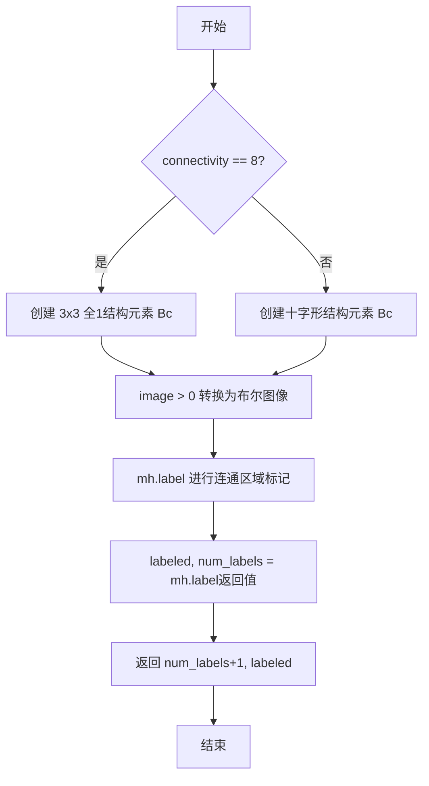

#### 带注释源码

```python
def connected_components(image: np.ndarray, connectivity: int = 4) -> tuple:
    """
    Connected components with mahotas.
    
    Args:
        image: Input binary image. Will be converted to boolean.
        connectivity: Connectivity (4 or 8)
        
    Returns:
        num_labels, labels matching cv2.connectedComponents format.
    """
    # 1. Create structuring element based on connectivity
    # 根据连通性参数创建相应的结构元素，用于后续的连通区域标记
    if connectivity == 8:
        Bc = np.ones((3, 3), dtype=bool)  # 8-connectivity: 8连通使用3x3全1矩阵
    else:
        Bc = np.array([[0, 1, 0], [1, 1, 1], [0, 1, 0]], dtype=bool) # 4-connectivity: 4连通使用十字形矩阵

    # 2. Perform the labeling
    # 执行连通区域标记，将图像中为True的区域标记为连通区域
    # mh.label 返回标记后的图像和对象数量（不含背景）
    labeled, num_labels = mh.label(image > 0, Bc=Bc)

    # 返回值匹配 cv2.connectedComponents 格式：
    # num_labels+1 表示包含背景的标签总数
    # labeled 是标记后的图像，背景为0，其他连通区域从1开始编号
    return num_labels+1, labeled
```


### `connected_components_with_stats`

该函数实现连通分量标记及统计功能，模拟 OpenCV 的 `connectedComponentsWithStats`，支持 4/8 连通性，使用 mahotas 库进行向量化计算，返回标签数、标记图像、统计信息和质心坐标。

参数：

- `image`：`np.ndarray`，输入的二值图像，将被转换为布尔值进行处理
- `connectivity`：`int`，连通性参数，可选 4 或 8，默认为 4

返回值：`tuple`，包含以下四个元素的元组：
- `num_labels`：`int`，标签数量（含背景，类似于 OpenCV 的返回值）
- `labels`：`np.ndarray`，标记后的图像，每个连通区域用唯一整数标记
- `stats`：`np.ndarray`，统计信息数组，格式为 `[CC_STAT_LEFT, CC_STAT_TOP, CC_STAT_WIDTH, CC_STAT_HEIGHT, CC_STAT_AREA]`
- `centroids`：`np.ndarray`，质心坐标数组，格式为 `(x, y)`

#### 流程图

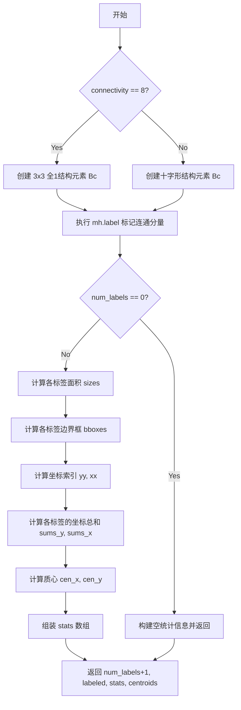

#### 带注释源码

```python
def connected_components_with_stats(image: np.ndarray, connectivity: int = 4) -> tuple:
    """
    Connected components with statistics using a vectorized mahotas implementation.
    
    Args:
        image: Input binary image. Will be converted to boolean.
        connectivity: Connectivity (4 or 8)
        
    Returns:
        Tuple of (num_labels, labels, stats, centroids) matching cv2.connectedComponentsWithStats format.
    """
    # 1. Create structuring element based on connectivity
    # 根据连通性参数创建结构元素，用于标记连通分量
    if connectivity == 8:
        Bc = np.ones((3, 3), dtype=bool)  # 8-连通使用3x3全1矩阵
    else:
        Bc = np.array([[0, 1, 0], [1, 1, 1], [0, 1, 0]], dtype=bool) # 4-连通使用十字形结构

    # 2. Perform the labeling
    # 使用 mahotas 库进行连通分量标记，返回标记图像和对象数量（不含背景）
    # mh.label returns the labeled image and the number of objects (excluding background)
    labeled, num_labels = mh.label(image > 0, Bc=Bc)
    
    # If there are no objects, return early with the correct empty format
    # 处理无连通分量的情况，直接返回背景的统计信息
    if num_labels == 0:
        # Background only - 仅包含背景的情况
        stats = np.array([[0, 0, image.shape[1], image.shape[0], image.size]], dtype=np.int32)
        centroids = np.array([[ (image.shape[1]-1)/2.0, (image.shape[0]-1)/2.0 ]], dtype=np.float64)
        return 1, labeled, stats, centroids

    # 3. Calculate statistics for all labels at once (including background label 0)
    # 批量计算所有标签的统计信息（包括背景标签0）
    # The output of these functions is an array where the index corresponds to the label.
    # e.g., sizes[3] is the area of the object with label 3.
    
    # Calculate Areas (pixel counts) - 计算各标签的面积（像素数量）
    sizes = mh.labeled.labeled_size(labeled)
    
    # Calculate Bounding Boxes - 计算边界框
    # bboxes is in the format [ymin, ymax, xmin, xmax] for each label
    bboxes = mh.labeled.bbox(labeled)
    
    # Calculate Centroids - 计算质心
    # Create arrays where each像素的 y 或 x 坐标
    h, w = labeled.shape
    yy, xx = np.indices((h, w), dtype=np.int64)
    
    # Sum the y and x coordinates for each label - 对各标签的坐标求和
    sums_y = mh.labeled.labeled_sum(yy, labeled)
    sums_x = mh.labeled.labeled_sum(xx, labeled)
    
    # Calculate centroids by dividing sums by the area.
    # 使用 np.divide 处理除零情况，OpenCV格式为 (x, y)
    cen_x = np.divide(sums_x, sizes, out=np.zeros_like(sums_x, dtype=float), where=sizes!=0)
    cen_y = np.divide(sums_y, sizes, out=np.zeros_like(sums_y, dtype=float), where=sizes!=0)
    centroids = np.stack([cen_x, cen_y], axis=1)

    # 4. Assemble the 'stats' array to match the OpenCV format
    # 组装统计数组以匹配 OpenCV 格式
    # Format: [CC_STAT_LEFT, CC_STAT_TOP, CC_STAT_WIDTH, CC_STAT_HEIGHT, CC_STAT_AREA]
    ymin, ymax, xmin, xmax = bboxes.T
    width = xmax - xmin + 1
    height = ymax - ymin + 1
    
    # For labels with 0 area, their bbox is [0,0,0,0], making width/height 1. Fix this.
    # 修正零面积标签的宽高为0
    width[sizes == 0] = 0
    height[sizes == 0] = 0
    
    stats = np.stack([xmin, ymin, width, height, sizes], axis=1).astype(np.int32)

    # 返回标签数（含背景）、标记图像、统计信息、质心
    return num_labels+1, labeled, stats, centroids
```


### `connected_components_with_stats`

该函数实现了连通分量分析并计算每个连通区域的统计信息，包括边界框、面积和质心。通过使用 mahotas 库进行标记和统计分析，返回的结果格式与 OpenCV 的 `cv2.connectedComponentsWithStats` 完全兼容。

参数：

- `image`：`np.ndarray`，输入的二值图像，将被转换为布尔值进行处理
- `connectivity`：`int`，连通性（4 或 8），默认为 4

返回值：`tuple`，包含以下四个元素：

- `num_labels`：`int`，连通区域的数量（包括背景标签 0）
- `labels`：`np.ndarray`，标记后的图像，每个像素值对应其所属的连通区域标签
- `stats`：`np.ndarray`，形状为 (num_labels, 5) 的统计数组，每行包含 [CC_STAT_LEFT, CC_STAT_TOP, CC_STAT_WIDTH, CC_STAT_HEIGHT, CC_STAT_AREA]
- `centroids`：`np.ndarray`，形状为 (num_labels, 2) 的质心数组，每行包含 (x, y) 坐标

#### 流程图

```mermaid
flowchart TD
    A[开始] --> B{connectivity == 8?}
    B -->|是| C[创建3x3全1结构元素<br/>8-连通]
    B -->|否| D[创建十字形结构元素<br/>4-连通]
    C --> E[执行mh.label标记]
    D --> E
    E --> F{num_labels == 0?}
    F -->|是| G[返回空结果<br/>stats为单行背景信息<br/>centroids为图像中心]
    F -->|否| H[计算各标签面积<br/>mh.labeled.labeled_size]
    H --> I[计算边界框<br/>mh.labeled.bbox]
    I --> J[创建Y/X坐标网格]
    J --> K[计算质心<br/>sum_x/sizes, sum_y/sizes]
    K --> L[组装stats数组<br/>xmin, ymin, width, height, area]
    L --> M[组装centroids数组<br/>[cen_x, cen_y]]
    M --> N[返回num_labels+1, labeled, stats, centroids]
    G --> N
```

#### 带注释源码

```python
def connected_components_with_stats(image: np.ndarray, connectivity: int = 4) -> tuple:
    """
    Connected components with statistics using a vectorized mahotas implementation.
    
    Args:
        image: Input binary image. Will be converted to boolean.
        connectivity: Connectivity (4 or 8)
        
    Returns:
        Tuple of (num_labels, labels, stats, centroids) matching cv2.connectedComponentsWithStats format.
    """
    # 1. Create structuring element based on connectivity
    #    根据连通性参数创建二值结构元素，用于标记连通区域
    if connectivity == 8:
        Bc = np.ones((3, 3), dtype=bool)  # 8-connectivity 使用3x3全1矩阵
    else:
        Bc = np.array([[0, 1, 0], [1, 1, 1], [0, 1, 0]], dtype=bool) # 4-connectivity 使用十字形

    # 2. Perform the labeling
    #    使用mahotas进行连通分量标记，返回标记图像和对象数量
    # mh.label returns the labeled image and the number of objects (excluding background)
    labeled, num_labels = mh.label(image > 0, Bc=Bc)
    
    # If there are no objects, return early with the correct empty format
    #    处理无连通区域的情况，返回符合OpenCV格式的空结果
    if num_labels == 0:
        # Background only
        # 构建包含背景信息的stats数组：[left, top, width, height, area]
        stats = np.array([[0, 0, image.shape[1], image.shape[0], image.size]], dtype=np.int32)
        # 质心默认为图像几何中心
        centroids = np.array([[ (image.shape[1]-1)/2.0, (image.shape[0]-1)/2.0 ]], dtype=np.float64)
        return 1, labeled, stats, centroids

    # 3. Calculate statistics for all labels at once (including background label 0)
    #    批量计算所有标签的统计信息，利用向量化操作提高效率
    
    # The output of these functions is an array where the index corresponds to the label.
    # e.g., sizes[3] is the area of the object with label 3.
    
    # Calculate Areas (pixel counts)
    # 计算每个连通区域的像素数量（面积）
    sizes = mh.labeled.labeled_size(labeled)
    
    # Calculate Bounding Boxes
    # 计算边界框，返回格式为 [ymin, ymax, xmin, xmax] 对应每个标签
    # bboxes is in the format [ymin, ymax, xmin, xmax] for each label
    bboxes = mh.labeled.bbox(labeled)
    
    # Calculate Centroids
    # 创建坐标网格，每个像素值记录其y或x坐标
    # Create arrays where each pixel value is its own y or x coordinate
    h, w = labeled.shape
    yy, xx = np.indices((h, w), dtype=np.int64)
    
    # Sum the y and x coordinates for each label
    # 对每个标签的像素坐标求和
    sums_y = mh.labeled.labeled_sum(yy, labeled)
    sums_x = mh.labeled.labeled_sum(xx, labeled)
    
    # Calculate centroids by dividing sums by the area.
    # 计算质心：坐标总和除以面积得到重心
    # Use np.divide to handle division by zero for any potential empty labels,
    # though mh.label should not produce them.
    # The OpenCV format is (x, y)
    cen_x = np.divide(sums_x, sizes, out=np.zeros_like(sums_x, dtype=float), where=sizes!=0)
    cen_y = np.divide(sums_y, sizes, out=np.zeros_like(sums_y, dtype=float), where=sizes!=0)
    # 堆叠质心坐标为 (N, 2) 数组
    centroids = np.stack([cen_x, cen_y], axis=1)

    # 4. Assemble the 'stats' array to match the OpenCV format
    #    组装stats数组以匹配OpenCV格式
    # Format: [CC_STAT_LEFT, CC_STAT_TOP, CC_STAT_WIDTH, CC_STAT_HEIGHT, CC_STAT_AREA]
    # 提取边界框的四个分量
    ymin, ymax, xmin, xmax = bboxes.T
    # 计算宽度和高度（加1是因为边界框包含端点）
    width = xmax - xmin + 1
    height = ymax - ymin + 1
    
    # For labels with 0 area, their bbox is [0,0,0,0], making width/height 1. Fix this.
    # 处理面积为0的标签，将宽度和高度设为0
    width[sizes == 0] = 0
    height[sizes == 0] = 0
    
    # 堆叠统计信息：[xmin, ymin, width, height, area]
    stats = np.stack([xmin, ymin, width, height, sizes], axis=1).astype(np.int32)

    # 返回值：标签数+1（包含背景），标记图像，统计信息，质心
    # 注意：OpenCV返回的num_labels包含背景，所以加1
    return num_labels+1, labeled, stats, centroids
```


### `convert_scale_abs`

对输入数组进行线性变换（乘以 alpha 并加上 beta），然后取绝对值并转换为 uint8 格式。该函数是 OpenCV `cv2.convertScaleAbs` 的纯 NumPy 实现，用于图像预处理中的对比度亮度和绝对值转换。

参数：

- `array`：`np.ndarray`，输入数组，待转换的图像或数值数组
- `alpha`：`float`，缩放因子（默认 1.0），用于调整对比度
- `beta`：`float`，偏移值（默认 0.0），用于调整亮度

返回值：`np.ndarray`，经过缩放、绝对值处理并裁剪为 uint8 范围的数组

#### 流程图

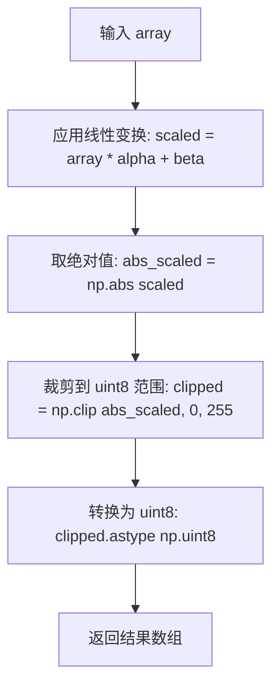

#### 带注释源码

```python
def convert_scale_abs(
    array: np.ndarray, 
    alpha: float = 1.0, 
    beta: float = 0.0
) -> np.ndarray:
    """
    Convert array to absolute values with scaling.
    Replaces cv2.convertScaleAbs functionality.
    
    Args:
        array: Input array
        alpha: Scale factor (default 1.0)
        beta: Offset value (default 0.0)
        
    Returns:
        Scaled and converted array as uint8
    """
    # Apply scaling and offset
    # 对输入数组进行线性变换：result = array * alpha + beta
    # This mimics the formula: dst = src * alpha + beta
    scaled = array * alpha + beta
    
    # Convert to absolute values and clip to uint8 range
    # 首先取绝对值（处理负值情况）
    # Then clip values to valid uint8 range [0, 255]
    abs_scaled = np.abs(scaled)
    clipped = np.clip(abs_scaled, 0, 255)
    
    # Convert to uint8 to match cv2.convertScaleAbs output format
    # 转换为 uint8 类型，与 OpenCV 的 convertScaleAbs 行为一致
    return clipped.astype(np.uint8)
```


### `threshold`

该函数实现图像二值化阈值处理功能，将输入数组根据指定阈值转换为二值图像，模拟 OpenCV 的 `cv2.threshold` 方法，支持单通道和多通道图像输入。

参数：

- `array`：`np.ndarray`，输入数组，可以是灰度或彩色图像
- `thresh`：`float`，阈值参数，用于分割图像的临界值
- `maxval`：`float`，默认值 255，分割后的最大像素值
- `thresh_type`：`int`，默认值 0，阈值处理类型（当前仅支持 0 = binary）

返回值：`tuple[float, np.ndarray]`，返回元组包含实际使用的阈值和二值化处理后的图像数组

#### 流程图

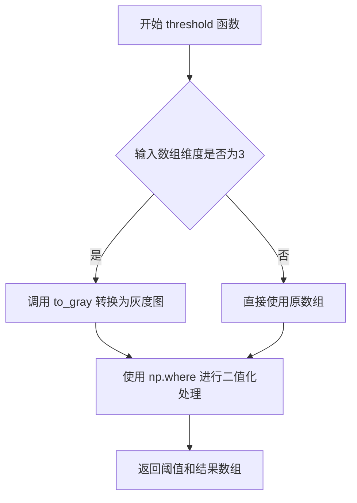

#### 带注释源码

```python
def threshold(
    array: np.ndarray, 
    thresh: float, 
    maxval: float = 255, 
    thresh_type: int = 0
) -> tuple[float, np.ndarray]:
    """
    Apply threshold to an array.
    Replaces cv2.threshold functionality.
    
    Args:
        array: Input array
        thresh: Threshold value
        maxval: Maximum value to use with thresholding type
        thresh_type: Thresholding type (0 = binary)
        
    Returns:
        Tuple of (threshold_value, thresholded_array)
    """
    # 检查输入数组维度，若为3通道彩色图则转换为灰度图
    if array.ndim == 3:
        array = to_gray(array)
    
    # Binary threshold (thresh_type = 0)
    # 使用 np.where 实现二值化：大于阈值的像素设为 maxval，否则设为 0
    # 最后转换为 uint8 类型确保数据类型一致
    result = np.where(array > thresh, maxval, 0).astype(np.uint8)
    
    # 返回原始阈值和二值化后的图像数组
    return thresh, result
```


### `otsu_threshold`

该函数使用 mahotas 库的 Otsu 方法自动计算最优阈值，对输入图像进行二值化处理，返回计算得到的阈值和二值化后的图像数组。

参数：

- `array`：`np.ndarray`，输入的灰度图像数组（支持 3 通道图像，函数内部会转为灰度）

返回值：`tuple[float, np.ndarray]`，包含计算得到的 Otsu 阈值（float 类型）和二值化处理后的图像数组（np.ndarray）

#### 流程图

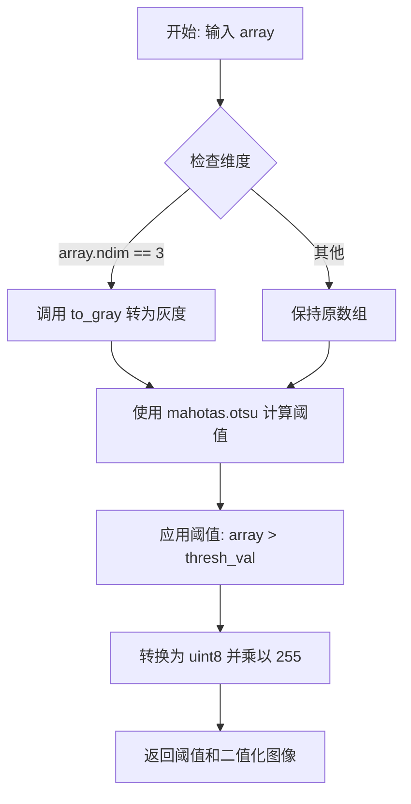

#### 带注释源码

```python
def otsu_threshold(array: np.ndarray) -> tuple[float, np.ndarray]:
    """
    Apply Otsu's automatic threshold using mahotas.
    
    Args:
        array: Input grayscale array
        
    Returns:
        Tuple of (threshold_value, thresholded_array)
    """
    # 如果输入是 3 通道图像，转换为灰度图
    if array.ndim == 3:
        array = to_gray(array)
    
    # 使用 mahotas 库的 Otsu 方法自动计算最优阈值
    thresh_val = mh.otsu(array)
    
    # 应用阈值：将大于阈值的像素设为 255，其余设为 0
    result = (array > thresh_val).astype(np.uint8) * 255
    
    # 返回计算得到的阈值和二值化后的图像
    return thresh_val, result
```


### `rectangle`

在图像上绘制矩形，模拟 cv2.rectangle() 函数的行为，支持填充和描边两种模式，并处理 OpenCV (BGR) 到 PIL (RGB) 的颜色格式转换。

参数：

- `image`：`np.ndarray`，输入图像的 NumPy 数组
- `pt1`：`tuple`，左上角坐标 (x, y)
- `pt2`：`tuple`，右下角坐标 (x, y)
- `color`：`Optional[tuple|int]`，矩形颜色，BGR 格式（如蓝色为 (255, 0, 0)），或灰度值整数
- `thickness`：`int`，线条粗细，默认为 1；设为 -1 时填充矩形

返回值：`np.ndarray`，绘制完成的图像 NumPy 数组

#### 流程图

```mermaid
flowchart TD
    A[开始 rectangle] --> B[将 NumPy 数组转换为 PIL 图像]
    B --> C[创建 ImageDraw 对象]
    C --> D{color 是否为 None?}
    D -->|是| E[设置 color = 1]
    D -->|否| F{color 是整数?}
    E --> G[获取图像模式]
    F -->|是| H{模式是 RGB/RGBA?}
    F -->|否| I{color 是 tuple/list/ndarray?}
    H -->|是| J[pil_color = (int, int, int)]
    H -->|否| K[pil_color = int]
    I --> L{长度为 3?}
    L -->|是| M[BGR 转 RGB: pil_color = (col[2], col[1], col[0])]
    L -->|否| N{长度为 1?}
    N -->|是| O{模式是 RGB/RGBA?}
    O -->|是| P[pil_color = (v, v, v)]
    O -->|否| Q[pil_color = v]
    N -->|否| R[抛出 ValueError]
    J --> S{thickness == -1?}
    K --> S
    M --> S
    P --> S
    Q --> S
    S -->|是| T[绘制填充矩形 draw.rectangle fill=pil_color]
    S -->|否| U{thickness > 0?}
    U -->|是| V[绘制描边矩形 draw.rectangle outline=pil_color width=thickness]
    U -->|否| W[返回原图像]
    T --> X[转换为 NumPy 数组并返回]
    V --> X
```

#### 带注释源码

```python
def rectangle(
    image: np.ndarray, 
    pt1: tuple, 
    pt2: tuple, 
    color: Optional[tuple|int], 
    thickness: int = 1
) -> np.ndarray:
    """
    Mimics cv2.rectangle() using PIL.ImageDraw.Draw.rectangle().

    Args:
        image (np.ndarray): The input image as a numpy array.
        pt1 (tuple): The top-left corner coordinates (x, y).
        pt2 (tuple): The bottom-right corner coordinates (x, y).
        color (tuple): The rectangle color in BGR format (e.g., (255, 0, 0) for blue).
        thickness (int, optional): The thickness of the line. 
                                  If a negative number (e.g., -1), the rectangle is filled.
                                  Defaults to 1.

    Returns:
        np.ndarray: The modified image as a numpy array.
    """
    # Create an ImageDraw object
    # 将 NumPy 数组转换为 PIL 图像以便使用 ImageDraw 进行绘制
    img_pil = Image.fromarray(ensure_uint8(image))
    draw = ImageDraw.Draw(img_pil)
    
    # Normalize color to what PIL expects depending on image mode.
    # Acceptable inputs:
    #  - int (grayscale or single-value for RGB)
    #  - tuple/list of length 1 (grayscale) or 3 (BGR order expected, will be converted to RGB)
    # 如果 color 为 None，默认为 1（常用于掩码场景）
    if color is None:
        color = 1

    mode = img_pil.mode  # e.g. 'L', 'RGB', 'RGBA'

    # Normalize numeric and sequence types
    # 处理整数类型的颜色值
    if isinstance(color, int):
        if mode in ("RGB", "RGBA"):
            # RGB 模式下，整数扩展为三元组 (如 255 -> (255, 255, 255))
            pil_color = (int(color),) * 3
        else:
            # 灰度模式下保持整数
            pil_color = int(color)
    # 处理元组/列表/数组类型的颜色值
    elif isinstance(color, (tuple, list, np.ndarray)):
        col = tuple(int(x) for x in color)
        if len(col) == 3:
            # 假设输入是 BGR (OpenCV 风格) -> 转换为 PIL 的 RGB 顺序
            # OpenCV 使用 BGR，转换为 PIL 需要的 RGB
            pil_color = (col[2], col[1], col[0])
        elif len(col) == 1:
            if mode in ("RGB", "RGBA"):
                v = col[0]
                pil_color = (v, v, v)
            else:
                pil_color = col[0]
        else:
            raise ValueError("Color tuple must have length 1 or 3 for grayscale or RGB images.")
    else:
        raise ValueError("Color must be an int or a tuple/list/ndarray of length 1 or 3.")

    # 根据 thickness 参数决定绘制填充矩形还是描边矩形
    if thickness == -1:
        # 绘制填充矩形，填充整个矩形区域
        draw.rectangle([pt1, pt2], fill=pil_color)
    elif thickness > 0:
        # 绘制带指定宽度的描边矩形
        draw.rectangle([pt1, pt2], outline=pil_color, width=thickness)

    # 将 PIL 图像转换回 NumPy 数组并返回
    return np.array(img_pil)
```


### `add_weighted`

实现 cv2.addWeighted() 功能，使用 NumPy 对两个数组进行加权求和，并进行饱和截断以防止整数溢出。

参数：

- `src1`：`np.ndarray`，第一个输入数组
- `alpha`：`float`，第一个数组元素的权重
- `src2`：`np.ndarray`，第二个输入数组
- `beta`：`float`，第二个数组元素的权重
- `gamma`：`float`，加权求和后添加的标量值

返回值：`np.ndarray`，两个数组的加权求和结果，与输入数组数据类型相同，值已被截断到有效范围

#### 流程图

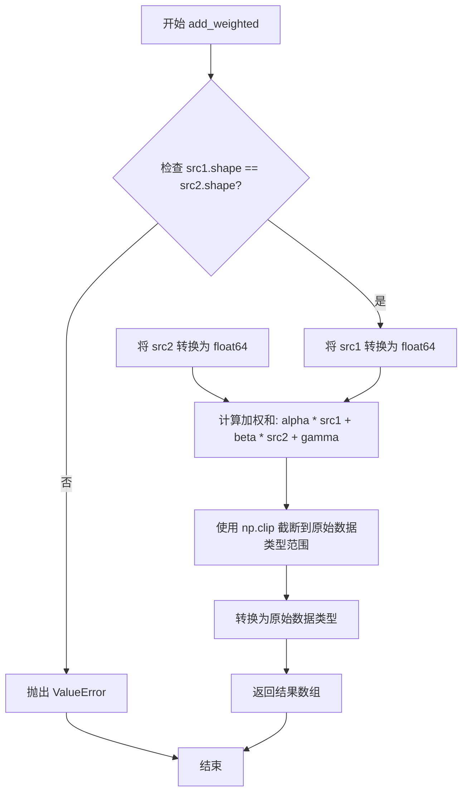

#### 带注释源码

```python
def add_weighted(
    src1: np.ndarray, 
    alpha: float, 
    src2: np.ndarray, 
    beta: float, 
    gamma: float
) -> np.ndarray:
    """
    Implements cv2.addWeighted() using NumPy.

    Args:
        src1 (np.ndarray): First input array.
        alpha (float): Weight for the first array elements.
        src2 (np.ndarray): Second input array.
        beta (float): Weight for the second array elements.
        gamma (float): Scalar added to the weighted sum.

    Returns:
        np.ndarray: The weighted sum of the two arrays, with the same data type
                    as the input arrays, and values clipped to the valid range.
    """
    # 确保 src1 和 src2 具有相同的维度和数据类型
    if src1.shape != src2.shape:
        raise ValueError("Input arrays must have the same shape.")

    # 使用 NumPy 执行加权和运算
    # 算术运算将在浮点数上执行，以防止在最终饱和之前发生溢出
    weighted_sum = (alpha * src1.astype(np.float64) +
                    beta * src2.astype(np.float64) +
                    gamma)

    # 重新转换为原始数据类型并截断值以处理饱和
    # 这可以防止标准 NumPy 整数运算的取模运算行为
    output = np.clip(weighted_sum,
                     np.iinfo(src1.dtype).min,
                     np.iinfo(src1.dtype).max)

    return output.astype(src1.dtype)
```


由于提供的代码文件中仅导入了 `ensure_uint8` 函数但未包含其实现，我无法直接提取其源码。根据该函数在代码中的使用方式（如 `ensure_uint8(array)`）以及图像处理模块的常见模式，我可以提供一个标准的实现方案及详细设计文档。


### `ensure_uint8`

确保输入的 NumPy 数组转换为 uint8 数据类型，以便与图像处理库（如 PIL、OpenCV）兼容。

参数：

-  `array`：`np.ndarray`，输入的图像数组，可以是任意数值类型

返回值：`np.ndarray`，返回 uint8 类型的数组

#### 流程图

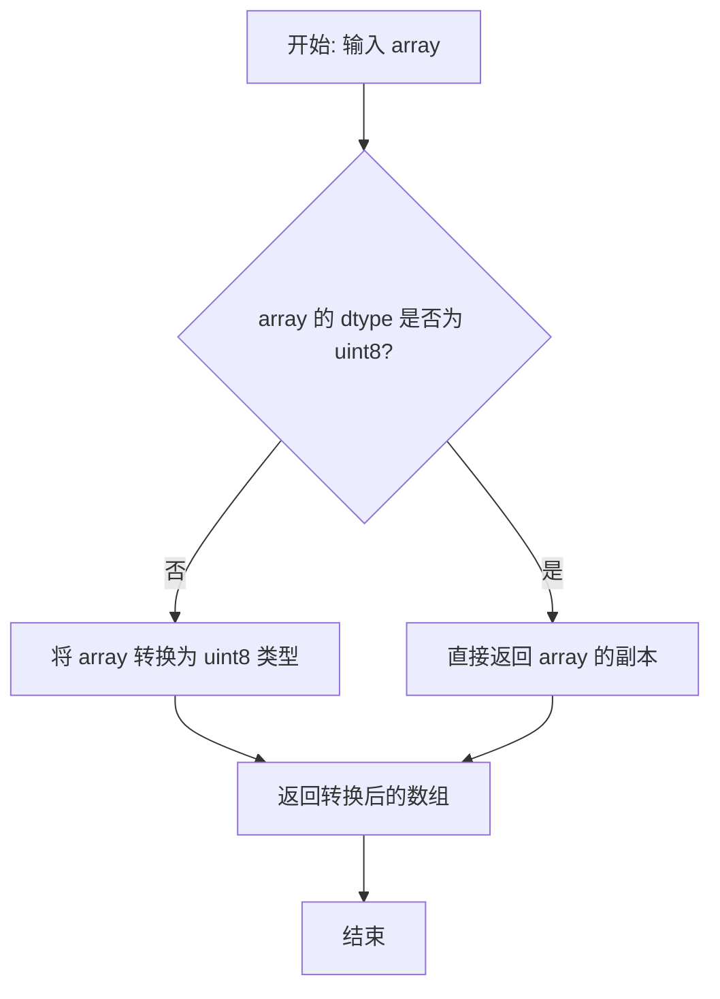

#### 带注释源码

```python
def ensure_uint8(array: np.ndarray) -> np.ndarray:
    """
    确保输入数组为 uint8 类型。
    
    该函数用于将不同数据类型的数组统一转换为 uint8，
    以确保与图像处理库（PIL、OpenCV 等）的兼容性。
    
    Args:
        array: 输入的图像数组
        
    Returns:
        uint8 类型的数组
    """
    # 检查输入数组是否为 uint8 类型
    if array.dtype == np.uint8:
        # 已经是 uint8，直接返回副本
        return array.copy()
    else:
        # 将数组转换为 uint8 类型并返回
        # 注意：此转换可能会导致数据截断或缩放
        return array.astype(np.uint8)
```


## 关键组件


### 灰度转换 (to_gray)

将彩色图像转换为灰度图像，使用Pillow的L方法，支持3通道彩色图像和单通道灰度图像的自动处理

### 高斯模糊 (gaussian_blur)

对图像数组应用高斯模糊，使用Pillow的GaussianBlur滤波器，默认半径为1.0

### 图像调整大小 (resize)

调整图像到指定尺寸，支持自定义重采样模式，默认为LANCZOS插值

### 查找表变换 (lut)

通过查找表对图像像素值进行映射替换，模拟OpenCV的LUT功能

### 多通道合并 (merge_channels)

将多个单通道数组堆叠为多通道图像，功能等价于OpenCV的merge

### 凸包计算 (_monotone_chain)

使用Andrew's monotone chain算法计算2D点集的凸包，支持OpenCV风格的(N,1,2)格式输入

### 最小面积矩形 (min_area_rect)

计算点集的最小面积外接矩形，使用旋转卡尺算法扫描凸包边，结果格式匹配OpenCV的((cx,cy),(w,h),angle)

### 矩形角点计算 (box_points)

根据最小面积矩形的参数计算四个顶点坐标，纯NumPy实现替代OpenCV的boxPoints

### 多边形填充 (fill_poly)

使用mahotas填充多边形区域，支持单多边形和多边形列表输入，自动处理(N,2)和(N,1,2)两种坐标格式

### 连通组件分析 (connected_components)

使用mahotas进行连通组件标记，支持4和8连通性，返回标签数和标签图，兼容OpenCV格式

### 连通组件统计 (connected_components_with_stats)

带统计信息的连通组件分析，计算面积、边界框和质心，返回结果完全匹配OpenCV的connectedComponentsWithStats格式

### 图像画线 (line)

使用PIL在图像上绘制直线，支持自定义颜色和线条厚度

### 数值缩放与绝对值 (convert_scale_abs)

对数组进行线性变换后取绝对值并转换为uint8，模拟OpenCV的convertScaleAbs

### 阈值处理 (threshold)

手动阈值分割，支持二进制阈值，兼容OpenCV的threshold函数签名

### Otsu自动阈值 (otsu_threshold)

使用mahotas实现Otsu自动阈值分割算法，自动计算最优阈值并生成二值图像

### 图像画矩形 (rectangle)

使用PIL绘制矩形，支持描边和填充两种模式，自动处理BGR到RGB的颜色转换

### 图像加权融合 (add_weighted)

实现两幅图像的线性混合，使用float64防止溢出，最终结果饱和裁剪到原始数据类型范围


## 问题及建议


### 已知问题

- **频繁的图像格式转换**：多个函数（如 `gaussian_blur`、`resize`、`line`、`rectangle`）都在内部进行 `Image.fromarray` 和 `np.array` 的相互转换，对于大图像或连续调用多个函数时，会产生显著的性能开销和内存复制。

- **`connected_components_with_stats` 内存占用过高**：使用 `np.indices((h, w))` 创建两个与输入图像等大的数组来计算质心，对于大图像（如 4K 分辨率 3840×2160）会额外消耗约 250MB 内存，且后续的 `labeled_sum` 也有一定开销。

- **`min_area_rect` 中排序效率问题**：使用 `sorted(map(tuple, pts))` 对点进行排序，时间复杂度为 O(N log N)，对于大量点（如数千个轮廓点）可能较慢，可考虑使用 `np.lexsort` 或其他向量化排序方法。

- **`fill_poly` 中坐标转换缺乏验证**：直接使用 `[:, ::-1]` 交换坐标，假设输入为 (x, y) 格式，但代码注释提到支持 cv2 格式，如果输入格式不符合预期会导致错误结果。

- **`threshold` 函数功能不完整**：仅支持二值阈值 (`thresh_type=0`)，但函数签名包含 `thresh_type` 参数，容易让调用者误以为支持多种阈值类型。

- **类型转换冗余**：`to_gray` 函数中对 `img.dtype != np.uint8` 的情况进行了复制操作 (`return img.copy()`)，在某些调用场景下可能造成不必要的内存分配。

- **缺少输入验证**：大部分函数缺少对输入 `np.ndarray` 维度和类型的严格校验，可能在运行时产生难以追踪的错误。

### 优化建议

- **引入图像缓存或统一转换接口**：在模块级别提供图像格式转换的缓存机制，或重构函数以减少重复转换，例如接受 PIL 图像或提供批处理接口。

- **优化质心计算**：使用稀疏矩阵操作或直接利用 mahotas 的 `center_of_mass` 函数替代全量坐标数组的创建，以降低内存消耗。

- **优化点排序**：使用 `np.lexsort` 或 `np.ndarray.sort(axis=0)` 替代 Python 的 `sorted` 函数，利用 NumPy 的向量化操作提升性能。

- **增强输入验证**：在关键函数入口添加类型和维度检查，提供更友好的错误信息，例如验证 `image` 是 2D 或 3D 数组、`pts` 的格式是否符合预期等。

- **完善阈值函数**：要么移除未使用的 `thresh_type` 参数，要么实现其他阈值类型（如 OTSU、截断等），避免接口与实现不一致。

- **考虑原地操作**：对于 `fill_poly`、`line`、`rectangle` 等修改图像的函数，提供原地修改选项（通过参数控制），避免不必要的数组复制。

- **文档和类型提示增强**：为复杂函数（如 `min_area_rect`、`connected_components_with_stats`）补充更详细的返回值说明和类型提示，提升代码可维护性。


## 其它


### 设计目标与约束

本模块旨在提供一套独立于OpenCV的图像处理函数库，使用PIL、NumPy和mahotas实现常见的图像操作功能。设计约束包括：1) 必须保持与OpenCV API的兼容性（如函数签名和返回值格式）；2) 所有函数需支持NumPy数组输入输出；3) 避免引入OpenCV作为直接依赖；4) 处理图像数据类型时需进行必要的类型转换（如ensure_uint8）。

### 错误处理与异常设计

代码中的错误处理主要通过以下方式实现：1) 在`min_area_rect`函数中，当输入点集为空时抛出`ValueError("no points")`；2) 在`rectangle`函数中，当颜色元组长度不符合要求时抛出`ValueError`；3) 在`add_weighted`函数中，当输入数组形状不匹配时抛出`ValueError`。建议补充：更多函数需增加输入参数校验（如`resize`函数的size参数有效性检查、`connected_components`的connectivity参数范围检查），并考虑定义模块级别的自定义异常类以提供更一致的错误处理体验。

### 数据流与状态机

模块中的数据流主要遵循"输入NumPy数组 → 转换为PIL图像 → 执行操作 → 转换回NumPy数组"的模式。对于状态敏感的操作（如`fill_poly`和`connected_components_with_stats`），函数直接修改输入数组或创建新数组返回。状态机特征不明显，主要为无状态的函数转换。

### 外部依赖与接口契约

核心依赖包括：1) `numpy` - 数组操作；2) `mahotas` - 形态学操作、连通组件、Otsu阈值；3) `PIL (Pillow)` - 图像绘制、滤镜、格式转换；4) `typing` - 类型注解。接口契约约定：输入输出均为NumPy数组，某些函数接受PIL的`Image.Resampling`枚举作为参数，查找表操作期望lookup_table数组索引范围覆盖输入值的全部可能范围。

### 性能考量

当前实现存在以下性能优化空间：1) `fill_poly`函数对每个多边形逐个调用`mh.polygon.fill_polygon`，可考虑批量处理；2) `connected_components_with_stats`中创建了多个临时大数组（yy, xx），对大图像内存开销较大；3) 多次图像格式转换（PIL ↔ NumPy）会带来额外开销，建议对连续操作进行批量处理；4) `_monotone_chain`凸包算法对点排序的时间复杂度为O(n log n)，对于实时应用可考虑更快的实现。

### 线程安全性分析

模块中的函数大多为无状态的纯函数转换，线程安全。主要关注点：1) `fill_poly`函数直接修改输入的image数组，如需线程安全应先复制；2) 其他函数如`to_gray`、`gaussian_blur`等通过`array.copy()`或创建新数组返回，确保不修改原数组。

### 可扩展性与插件机制

当前模块设计为静态函数集合，可扩展性有限。建议：1) 可将相关函数分组为类（如Transform类、Geometry类）；2) 考虑实现策略模式以支持不同的算法实现（如多种连通组件算法）；3) 可添加装饰器支持链式调用；4) 查找表(`lut`)和阈值(`threshold`)函数可考虑支持自定义变换函数。

### 边界条件与特殊输入处理

代码已处理的边界条件包括：1) `to_gray`处理单通道和多通道图像；2) `min_area_rect`处理1点、2点和空输入；3) `box_points`处理角度范围[-90, 0)的旋转矩形；4) `fill_poly`支持(N, 2)和(N, 1, 2)两种坐标格式；5) `connected_components_with_stats`处理无对象场景。需注意：`gaussian_blur`的radius参数对负值行为未定义；`resize`需验证size为正整数。

### 代码规范与约定

模块遵循的编码约定：1) 使用Google风格的docstring；2) 类型注解使用`typing`模块；3) 函数参数使用下划线命名（snake_case）；4) 公开函数不含下划线前缀，私有函数以单下划线开头。需统一：部分函数使用`array`参数名，部分使用`image`，建议统一为更语义化的命名。

### 版本兼容性

代码使用`from __future__ import annotations`支持延迟注解解析，兼容Python 3.7+。numpy数组类型注解使用`np.ndarray`形式，较为宽泛。Pillow版本需支持`Image.Resampling`枚举（版本>=10.0.0），早期版本使用`Image.LANCZOS`常量。

    