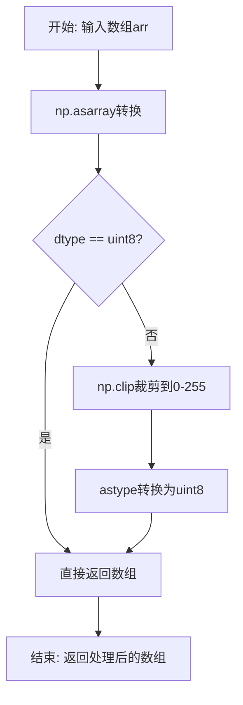
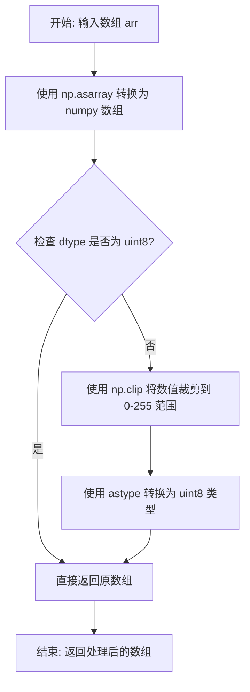

# `comic-translate\imkit\utils.py` 详细设计文档

该文件是imkit模块的工具函数集合，提供了一个用于确保数组为uint8 RGB格式的实用函数，以实现与PIL图像库的兼容性。

## 整体流程



## 类结构

```
无类层次结构（纯工具函数模块）
```

## 全局变量及字段


    

## 全局函数及方法


### `ensure_uint8`

将输入数组转换为 uint8 类型的 RGB 格式，确保与 PIL 库兼容。

参数：

- `arr`：`np.ndarray`，输入的 numpy 数组，可以是任意数值类型

返回值：`np.ndarray`，返回 uint8 类型的数组

#### 流程图



#### 带注释源码

```python
def ensure_uint8(arr: np.ndarray) -> np.ndarray:
    """Ensure array is uint8 RGB format for PIL compatibility."""
    # 将输入转换为 numpy 数组（如果还不是）
    arr = np.asarray(arr)
    
    # 检查数组数据类型是否为 uint8
    if arr.dtype != np.uint8:
        # 如果不是 uint8，先裁剪到有效范围 0-255，再转换为 uint8
        arr = np.clip(arr, 0, 255).astype(np.uint8)
    
    # 返回处理后的数组
    return arr
```


## 关键组件


### ensure_uint8 函数

确保输入数组转换为 uint8 类型的 RGB 格式，以便与 PIL 库兼容。


## 问题及建议


### 已知问题

-   **输入维度验证缺失**：函数未验证输入数组维度，对于非3D数组（如2D灰度图或5D数组）的处理行为不明确
-   **通道数未检查**：代码假设输入为RGB或RGBA格式，但未验证通道数是否合法（1通道、2通道、4通道以上均可能产生非预期结果）
-   **命名与功能不完全匹配**：函数名为`ensure_uint8`，但实际处理的是"RGB格式"相关操作，命名可能误导使用者
-   **错误信息缺失**：当输入类型不支持时，缺少有意义的错误提示
-   **PIL依赖未显式声明**：函数声称用于PIL兼容性，但代码中未导入PIL或验证PIL可用性

### 优化建议

-   **添加输入验证**：在函数开头增加数组维度、通道数和数据类型的验证，对非法输入抛出明确的异常或警告
-   **完善文档**：为函数添加更详细的文档说明，包括支持的输入格式、返回值格式、异常情况等
-   **重命名函数**：考虑将函数重命名为`ensure_rgb_uint8`或`ensure_pil_compatible`以更准确反映其功能
-   **增强错误处理**：为不支持的输入类型提供明确的错误信息和处理策略
-   **显式PIL依赖**：如确实依赖PIL，可考虑在模块级别导入PIL或添加类型提示说明
-   **支持批量处理**：考虑支持批量输入（如4D数组batch）的处理场景

## 其它


### 设计目标与约束

本模块的设计目标是提供数组类型转换的通用工具函数，确保图像数组数据符合PIL库要求的uint8格式。核心约束包括：输入必须为numpy数组或可转换为numpy数组的对象；输出必须为uint8类型的numpy数组；转换过程中需要保留数据的视觉一致性。

### 错误处理与异常设计

本函数采用防御式编程设计。对于dtype不是uint8的数组，使用np.clip进行值域限制（0-255范围），然后使用astype转换为uint8。潜在异常包括：输入无法转换为numpy数组时抛出TypeError；输入为空数组时返回空数组；输入包含非数值类型时可能抛出异常。当前实现未对输入类型进行显式验证，调用方需确保输入可被numpy处理。

### 外部依赖与接口契约

主要外部依赖为numpy库。函数接受任意numpy数组或类似数组对象作为输入，返回类型始终为numpy.ndarray，dtype为np.uint8。调用方需注意：输入数据应数值范围应在合理区间（转换前）；输出数组可用于PIL Image.fromarray等函数；函数不改变输入数组本身，返回新的numpy数组对象。

### 性能考量

当前实现对于大数据量数组可能存在性能瓶颈。np.clip和astype操作都会复制数组数据，对于大型图像数组（4K及以上分辨率）可能产生显著内存开销。潜在的优化方向包括：使用np.ndarray.astype的copy参数避免额外复制；对于已知范围的数据可跳过clip操作；考虑使用原地操作（in-place）减少内存分配。

### 安全考虑

当前实现对输入验证较为宽松，可能存在以下安全风险：传入异常数据可能导致内存问题；未对输入数据的来源进行验证。建议调用方在数据传入前进行必要的校验，特别是处理来自不可信来源的数据时。

### 使用示例

```python
import numpy as np
from imkit.utils import ensure_uint8

# 示例1：float数组转换
float_arr = np.random.rand(100, 100, 3) * 255
uint8_arr = ensure_uint8(float_arr)

# 示例2：已转换数组直接返回
uint8_arr = np.zeros((100, 100, 3), dtype=np.uint8)
result = ensure_uint8(uint8_arr)  # 直接返回，不复制

# 示例3：超出范围值自动截断
arr = np.array([[[300, -10, 150]]], dtype=np.int16)
result = ensure_uint8(arr)  # 结果为 [[[255, 0, 150]]]
```

### 测试策略建议

建议包含以下测试用例：正常uint8数组输入应直接返回；float类型数组应正确转换为uint8；超出0-255范围的值应被正确截断；空数组输入应正确处理；多维数组（2D、3D、4D）应正确处理；非numpy数组对象（list、tuple）输入应正确转换。

### 版本信息

当前版本：1.0.0
代码行数：12行
复杂度：低


    