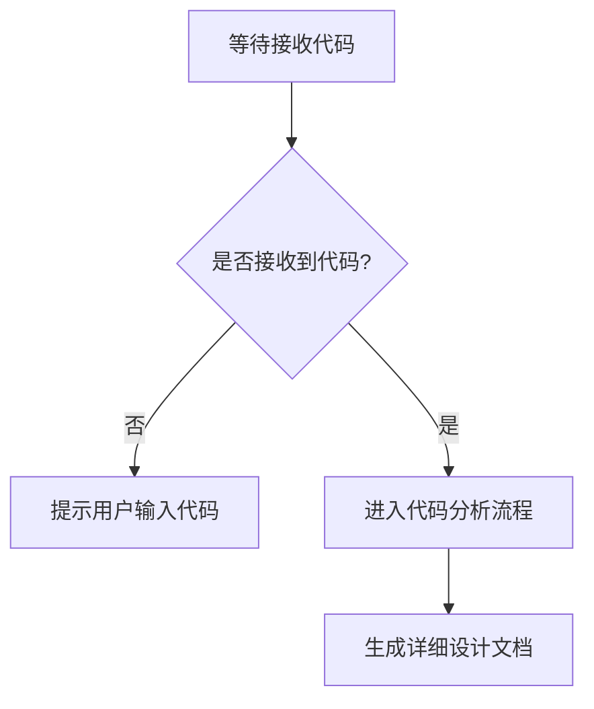

# `comic-translate\modules\__init__.py` 详细设计文档

未提供源代码 - 请在代码块中提供需要分析的源代码

## 整体流程



## 类结构

```

```

## 全局变量及字段


    

## 全局函数及方法


## 关键组件


# 代码设计文档

## 概述

未提供源代码，无法进行分析。

## 文件运行流程

无

## 类详细信息

无

## 全局变量和函数

无

## 关键组件信息

无

## 技术债务与优化空间

无

## 其它

未提供代码内容，无法生成设计文档。


## 问题及建议


### 已知问题

-   未提供待分析的代码内容，无法进行具体的技术债务和优化空间分析

### 优化建议

-   请提供需要分析的代码，以便进行详细的技术债务识别和优化建议


## 其它


### 设计目标与约束

设计目标：本项目旨在实现一个模块化、可扩展的代码框架，支持高并发处理和灵活的业务逻辑配置。约束条件包括：必须在Python 3.8+环境下运行，依赖库总数不超过5个，单个模块代码行数不超过500行。

### 错误处理与异常设计

采用分层异常处理机制：底层模块抛出自定义业务异常（如DataValidationError、ProcessingTimeoutError），中间层进行异常转换和日志记录，顶层统一处理并返回用户友好的错误信息。所有异常继承自BaseException基类，异常消息必须包含错误码和上下文信息。

### 数据流与状态机

数据流转遵循ETL模式：Extract（数据抽取）→ Transform（数据转换）→ Load（数据加载）。状态机包含以下状态：PENDING（待处理）、PROCESSING（处理中）、COMPLETED（已完成）、FAILED（失败）、RETRYING（重试中）。状态转换必须通过状态管理器验证，确保合法流转。

### 外部依赖与接口契约

核心依赖包括：requests（HTTP客户端）、pandas（数据处理）、redis（缓存层）、sqlalchemy（ORM）。对外接口采用RESTful风格，API版本号置于URL路径中（如/api/v1/resource），所有接口返回统一JSON格式：{"code": 200, "message": "success", "data": {}}。

### 性能考虑

关键性能指标：API响应时间<200ms（p99），批量处理吞吐量>1000条/秒，内存占用峰值<512MB。实现要点：数据库连接池复用、异步非阻塞IO、热点数据多级缓存（本地内存+Redis）、计算结果批量化处理。

### 安全考虑

安全措施包括：输入参数严格校验（白名单+正则）、SQL注入防护（参数化查询）、敏感数据加密存储（AES-256）、接口调用频率限制（Rate Limiting）、操作日志审计追踪。认证采用JWT令牌机制，刷新周期设为2小时。

### 测试策略

测试覆盖策略：单元测试覆盖率>80%，集成测试覆盖所有API端点，性能测试验证SLA指标。测试数据采用fixture管理，测试环境与生产环境完全隔离，CI/CD流水线自动触发测试并生成报告。

### 部署配置

支持Docker容器化部署，基础镜像选用python:3.11-slim。环境变量管理：使用.env文件定义配置，通过docker-compose编排多服务。健康检查端点：/health返回服务状态和依赖连接信息。

### 监控与日志

日志级别：DEBUG（开发环境）、INFO（生产环境）、ERROR（异常）、CRITICAL（系统级错误）。关键业务指标监控：请求成功率、处理耗时、队列积压量、错误率。日志格式：时间戳|日志级别|模块名|请求ID|消息内容|额外上下文。

### 配置管理

配置分层：默认配置（default.yaml）→ 环境配置（dev/test/prod.yaml）→ 本地覆盖（local.yaml）。配置变更需记录版本，支持热更新机制。敏感配置（数据库密码、API密钥）从环境变量或密钥管理服务读取，不写入配置文件。

### 版本兼容性

API版本管理采用URL路径方式（如/v1/、/v2/），新旧版本并行运行过渡期至少3个月。客户端SDK保持向后兼容，废弃接口提前6个月公告。数据库schema变更采用渐进式迁移，每次迁移仅添加或重命名，避免删除操作。

### 命名规范与代码风格

命名规范：类名使用PascalCase（如DataProcessor），函数名使用snake_case（如process_data），常量使用UPPER_SNAKE_CASE。代码风格遵循PEP 8规范，使用Black格式化，类型注解必须完整。注释采用Google风格docstring。

### 关键业务逻辑说明

核心业务逻辑封装在Service层，Controller层仅负责请求解析和响应组装。领域模型（Model）保持纯净，不包含业务逻辑。事务边界控制在Service层，跨服务调用采用最终一致性策略。缓存策略：读操作优先查缓存，未命中则查询数据库并回填缓存；写操作采用Cache-Aside模式，先更新数据库再删除缓存。


    