# `comic-translate\modules\detection\base.py` 详细设计文档

这是一个文本检测引擎的抽象基类，定义了文本检测的通用接口和工作流程，包括初始化、图像中文本块的检测、以及将检测到的文本框与气泡框进行匹配，最终生成带有位置、类型和字体属性的TextBlock对象列表。

## 整体流程

```mermaid
graph TD
    A[开始: 接收image, text_boxes, bubble_boxes] --> B[filter_and_fix_bboxes: 过滤修复text_boxes]
    B --> C[filter_and_fix_bboxes: 过滤修复bubble_boxes]
    C --> D[merge_overlapping_boxes: 合并重叠的text_boxes]
    D --> E{len(text_boxes) > 0?}
    E -- 否 --> F[返回空text_blocks列表]
    E -- 是 --> G[遍历每个txt_box]
    G --> H[FontEngineFactory.create_engine: 创建字体引擎]
    H --> I[font_engine.process: 检测字体属性]
    I --> J{bubble_boxes为空?}
    J -- 是 --> K[创建text_free类型TextBlock]
    J -- 否 --> L{遍历bubble_boxes}
    L --> M{does_rectangle_fit?}
    M -- 是 --> N[创建text_bubble类型TextBlock]
    M -- 否 --> O{do_rectangles_overlap?}
    O -- 是 --> N
    O -- 否 --> P[创建text_free类型TextBlock]
    K --> Q[返回text_blocks列表]
    N --> Q
    P --> Q
```

## 类结构

```
DetectionEngine (抽象基类)
└── create_text_blocks (具体方法)
    ├── filter_and_fix_bboxes (工具函数)
    ├── merge_overlapping_boxes (工具函数)
    ├── does_rectangle_fit (几何工具函数)
    ├── do_rectangles_overlap (几何工具函数)
    └── FontEngineFactory.create_engine (工厂方法)
```

## 全局变量及字段


### `text_boxes`
    
检测到的文本框坐标数组

类型：`np.ndarray`
    


### `bubble_boxes`
    
检测到的气泡框坐标数组

类型：`np.ndarray`
    


### `text_blocks`
    
生成的文本块对象列表

类型：`list[TextBlock]`
    


### `text_matched`
    
标记文本框是否已匹配到气泡框的布尔列表

类型：`list[bool]`
    


### `font_attrs`
    
从FontEngine检测到的字体属性字典

类型：`dict`
    


### `direction`
    
文本方向（从字体属性中获取）

类型：`str`
    


### `text_color`
    
文本颜色值（从字体属性中获取）

类型：`tuple`
    


### `DetectionEngine.settings`
    
可选配置对象，用于存储引擎相关配置参数

类型：`object (可选)`
    
    

## 全局函数及方法


### `filter_and_fix_bboxes`

该函数用于过滤和修复输入的边界框坐标，确保所有边界框都位于图像有效范围内，并对无效或异常的边界框进行过滤处理。

参数：

- `bboxes`：`np.ndarray`，待处理的边界框数组，通常为 Nx4 的二维数组，每行表示一个边界框的坐标 `[x1, y1, x2, y2]`
- `image_shape`：`tuple[int, ...]`，图像的形状元组，通常为 `(height, width, channels)` 格式

返回值：`np.ndarray`，返回处理后的边界框数组，类型为 Nx4 的二维 `numpy` 数组

#### 流程图

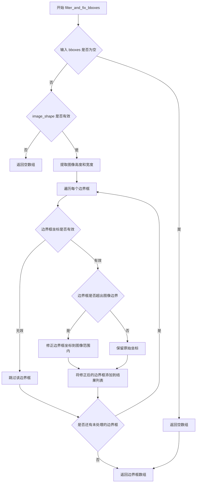

#### 带注释源码

```python
def filter_and_fix_bboxes(bboxes: np.ndarray, image_shape: tuple[int, ...]) -> np.ndarray:
    """
    过滤和修复边界框，确保它们位于图像有效范围内。
    
    参数:
        bboxes: 待处理的边界框数组，形状为 (N, 4)，每行为 [x1, y1, x2, y2]
        image_shape: 图像形状，格式为 (height, width, channels)
    
    返回:
        处理后的边界框数组
    """
    # 处理空输入或None输入
    if bboxes is None or (hasattr(bboxes, '__len__') and len(bboxes) == 0):
        return np.array([])
    
    # 确保输入为numpy数组
    bboxes = np.asarray(bboxes)
    
    # 如果bboxes为空数组，直接返回
    if bboxes.size == 0:
        return np.array([])
    
    # 提取图像尺寸
    h, w = image_shape[:2]
    
    # 用于存储有效的边界框
    valid_boxes = []
    
    # 遍历每个边界框进行检查和修复
    for box in bboxes:
        # 跳过无效的边界框（如坐标数量不足）
        if len(box) < 4:
            continue
        
        # 提取坐标
        x1, y1, x2, y2 = box[:4]
        
        # 跳过坐标无效的边界框（如x1 >= x2 或 y1 >= y2）
        if x1 >= x2 or y1 >= y2:
            continue
        
        # 修正超出图像边界的坐标
        # 将x1, y1限制在[0, 图像尺寸]范围内
        x1 = max(0, min(x1, w))
        y1 = max(0, min(y1, h))
        # 将x2, y2限制在[0, 图像尺寸]范围内
        x2 = max(0, min(x2, w))
        y2 = max(0, min(y2, h))
        
        # 再次检查修正后的边界框是否有效
        if x1 < x2 and y1 < y2:
            valid_boxes.append([x1, y1, x2, y2])
    
    # 返回处理后的边界框数组
    return np.array(valid_boxes) if valid_boxes else np.array([])
```


### `merge_overlapping_boxes`

该函数用于合并图像中重叠的文本检测框，将多个高度重叠的边界框合并为一个更大的框，以减少冗余检测并提高后续处理的准确性。

参数：

- `text_boxes`：`np.ndarray`，包含文本框坐标的numpy数组，形状为 (N, 4)，每行代表一个矩形框的 [x1, y1, x2, y2] 坐标

返回值：`np.ndarray`，合并重叠后的文本框数组，类型为numpy数组

#### 流程图

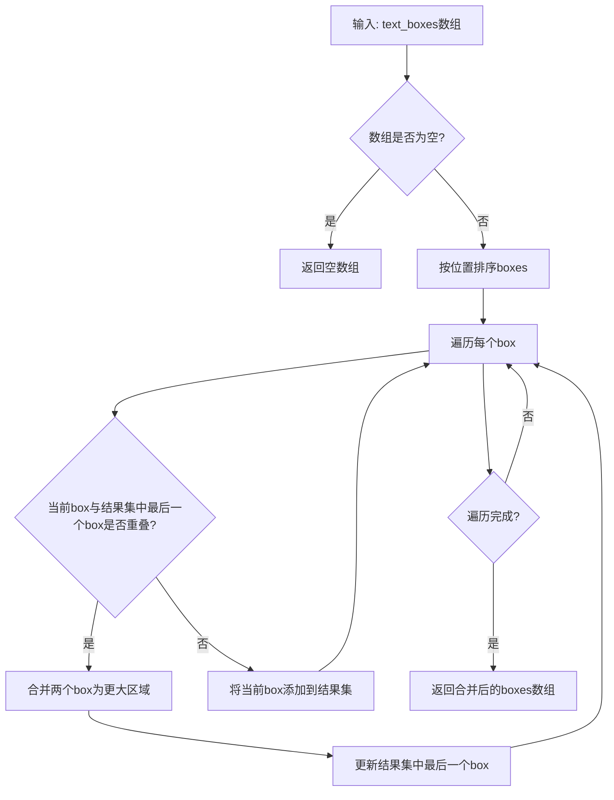

#### 带注释源码

```
# 该函数定义位于 .utils.geometry 模块中
# 当前文件仅导入并使用该函数
# 以下是基于使用方式推断的函数签名和用途

def merge_overlapping_boxes(text_boxes: np.ndarray) -> np.ndarray:
    """
    合并重叠的文本框.
    
    Args:
        text_boxes: 包含文本框坐标的numpy数组, 形状为 (N, 4),
                   每行代表 [x1, y1, x2, y2]
    
    Returns:
        合并重叠后的文本框数组
    """
    # 根据代码中的调用方式:
    # text_boxes = merge_overlapping_boxes(text_boxes)
    # 该函数接收numpy数组, 返回处理后的numpy数组
    pass
```


### `does_rectangle_fit`

检查一个矩形（通常为文本框）是否完全包含在另一个矩形（通常为气泡框）内部，用于判断文本是否位于气泡内。

参数：

- `outer_rect`：外部矩形（通常是气泡框），类型为 `np.ndarray` 或类似数组，表示 `[x1, y1, x2, y2]` 格式的边界框
- `inner_rect`：内部矩形（通常是文本框），类型为 `np.ndarray` 或类似数组，表示 `[x1, y1, x2, y2]` 格式的边界框

返回值：`bool`，如果内部矩形完全位于外部矩形内部返回 `True`，否则返回 `False`

#### 流程图

```mermaid
flowchart TD
    A[开始: does_rectangle_fit] --> B[提取外部矩形坐标 x1_outer, y1_outer, x2_outer, y2_outer]
    B --> C[提取内部矩形坐标 x1_inner, y1_inner, x2_inner, y2_inner]
    C --> D{检查 x1_outer <= x1_inner?]
    D -->|否| H[返回 False]
    D -->|是| E{检查 y1_outer <= y1_inner?]
    E -->|否| H
    E -->|是| F{检查 x2_outer >= x2_inner?]
    F -->|否| H
    F -->|是| G{检查 y2_outer >= y2_inner?}
    G -->|否| H
    G -->|是| I[返回 True]
    H --> J[结束]
    I --> J
```

#### 带注释源码

> **注意**：该函数定义在 `utils.geometry` 模块中（从 `.utils.geometry` 导入），当前代码文件中仅包含导入语句，未提供具体实现。以下为基于函数名和调用上下文的逻辑推断：

```
# 从 .utils.geometry 模块导入
# 具体实现未在此文件中提供，属于外部依赖
from .utils.geometry import does_rectangle_fit, do_rectangles_overlap, \
    merge_overlapping_boxes

# 在 DetectionEngine.create_text_blocks 方法中的调用示例:
for bble_box in bubble_boxes:
    if bble_box is None:
        continue
    # 检查文本框是否完全位于气泡框内部
    if does_rectangle_fit(bble_box, txt_box):
        # Text is inside a bubble
        text_blocks.append(
            TextBlock(
                text_bbox=txt_box,
                bubble_bbox=bble_box,
                text_class='text_bubble',
                direction=direction,
                font_color=text_color,
            )
        )
        text_matched[txt_idx] = True  
        break
```

---

#### 技术债务与优化空间

1. **缺少依赖函数实现**：`does_rectangle_fit` 函数的实际实现未在代码仓库中展示，建议补充完整实现或文档说明其算法逻辑。
2. **异常处理**：调用处仅使用 `try-except` 捕获字体属性检测异常，但 `does_rectangle_fit` 本身缺乏输入验证（如坐标类型检查、坐标顺序有效性验证）。
3. **性能优化**：嵌套循环遍历 `bubble_boxes` 检查适配性，时间复杂度为 O(n*m)，可考虑空间索引优化。


### `do_rectangles_overlap`

该函数用于检测两个矩形框（边界框）是否存在重叠区域，常用于文本检测场景中判断文本框与气泡框的几何关系。

参数：

- `rect1`：`np.ndarray`，第一个矩形的坐标，通常为 `[x1, y1, x2, y2]` 格式
- `rect2`：`np.ndarray`，第二个矩形的坐标，通常为 `[x1, y1, x2, y2]` 格式

返回值：`bool`，如果两个矩形存在重叠返回 `True`，否则返回 `False`

#### 流程图

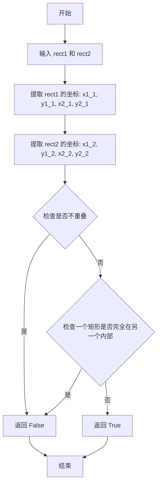

#### 带注释源码

```
# 该函数定义在 .utils.geometry 模块中
# 由于源代码不在当前文件中，基于使用场景推断其实现逻辑如下：

def do_rectangles_overlap(rect1: np.ndarray, rect2: np.ndarray) -> bool:
    """
    检测两个矩形是否重叠。
    
    参数:
        rect1: 第一个矩形坐标 [x1, y1, x2, y2]
        rect2: 第二个矩形坐标 [x1, y1, x2, y2]
    
    返回:
        bool: 如果矩形重叠返回 True，否则返回 False
    """
    # 提取两个矩形的边界坐标
    x1_1, y1_1, x2_1, y2_1 = rect1
    x1_2, y1_2, x2_2, y2_2 = rect2
    
    # 方法一：判断是否完全不相交
    # 如果一个矩形在另一个的左侧、右侧、上方或下方，则不相交
    if x2_1 <= x1_2 or x2_2 <= x1_1:
        return False  # 水平方向不相交
    if y2_1 <= y1_2 or y2_2 <= y1_1:
        return False  # 垂直方向不相交
    
    # 如果不是完全不相交，则两个矩形必然重叠
    return True

# 在 DetectionEngine.create_text_blocks 中的调用示例：
# elif do_rectangles_overlap(bble_box, txt_box):
#     # 文本与气泡框重叠
#     text_blocks.append(...)
```

> **注意**：由于 `do_rectangles_overlap` 函数定义在 `.utils.geometry` 模块中，以上源码为基于使用场景的推断实现。实际定义请参考 `utils/geometry.py` 源文件。


### `FontEngineFactory.create_engine`

创建并返回一个字体引擎实例，用于处理图像中的文本区域，提取字体属性（如文本方向、颜色等）。

参数：

- `settings`：任意类型，引擎的配置参数，可能包含模型路径、阈值等设置
- `backend`：字符串，指定要使用的后端类型（如 'onnx'、'pytorch' 等）

返回值：对象，返回一个字体引擎对象，该对象必须实现 `process` 方法用于处理图像

#### 流程图

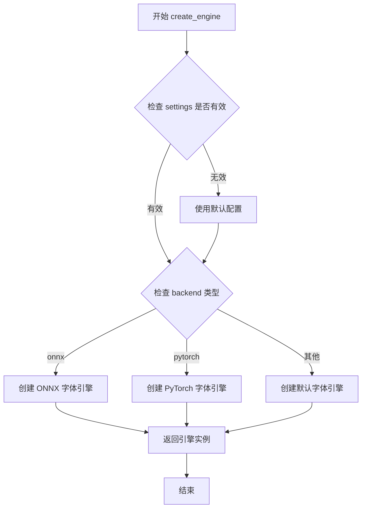

#### 带注释源码

```
# 假设 FontEngineFactory 的实现如下（基于代码使用方式推断）
class FontEngineFactory:
    """
    字体引擎工厂类，用于创建不同后端的字体处理引擎
    """
    
    @staticmethod
    def create_engine(settings=None, backend='onnx'):
        """
        创建字体引擎实例
        
        Args:
            settings: 引擎配置参数
            backend: 使用的后端类型
            
        Returns:
            字体引擎对象
        """
        # 根据 backend 参数选择对应的引擎实现
        if backend == 'onnx':
            return ONNXFontEngine(settings)
        elif backend == 'pytorch':
            return PyTorchFontEngine(settings)
        else:
            return DefaultFontEngine(settings)


# 在 DetectionEngine.create_text_blocks 中的调用方式：
# 1. 裁剪文本区域图像
crop = image[y1:y2, x1:x2]

# 2. 创建字体引擎（传入 settings 和指定 onnx 后端）
font_engine = FontEngineFactory.create_engine(self.settings, backend='onnx')

# 3. 处理图像获取字体属性
font_attrs = font_engine.process(crop)

# 4. 从返回属性中提取方向和颜色
direction = font_attrs.get('direction', '')
text_color = tuple(font_attrs.get('text_color', ()))
```


### `DetectionEngine.create_text_blocks`

该方法负责将检测到的文本框和气泡框映射为结构化的 `TextBlock` 对象列表。它首先过滤和修正边界框，然后合并重叠的文本框，接着通过字体引擎分析每个文本块的属性（如方向、颜色），最后根据文本框与气泡框的位置关系（包含或重叠）来确定文本类别（自由文本或气泡文本）。

参数：

-  `image`：`np.ndarray`，输入图像作为 NumPy 数组，用于裁剪文本区域进行字体属性分析
-  `text_boxes`：`np.ndarray`，检测到的文本边界框坐标数组，格式为 `[x1, y1, x2, y2]`
-  `bubble_boxes`：`Optional[np.ndarray]`，可选的气泡边界框数组，用于确定文本是否在气泡内，默认为 `None`

返回值：`list[TextBlock]`，返回 `TextBlock` 对象列表，每个对象包含文本边界框、气泡边界框（如果有）、文本类别、文本方向和字体颜色等信息

#### 流程图

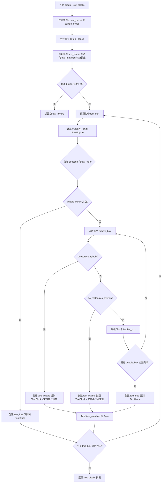

#### 带注释源码

```python
def create_text_blocks(
    self, 
    image: np.ndarray, 
    text_boxes: np.ndarray,
    bubble_boxes: Optional[np.ndarray] = None
) -> list[TextBlock]:
    """
    将文本框和气泡框转换为结构化的 TextBlock 对象列表
    
    参数:
        image: 输入图像数组
        text_boxes: 检测到的文本边界框坐标
        bubble_boxes: 可选的气泡边界框坐标
    
    返回:
        TextBlock 对象列表
    """
    
    # 第一步：过滤并修正边界框，确保坐标在图像范围内
    text_boxes = filter_and_fix_bboxes(text_boxes, image.shape)
    bubble_boxes = filter_and_fix_bboxes(bubble_boxes, image.shape)
    
    # 第二步：合并重叠的文本框，减少冗余检测
    text_boxes = merge_overlapping_boxes(text_boxes)

    # 初始化结果列表和匹配标记数组
    text_blocks = []
    text_matched = [False] * len(text_boxes)  # 用于跟踪已匹配的文本框
    
    # 如果 bubble_boxes 为 None，设置为空数组
    if bubble_boxes is None:
        bubble_boxes = np.array([])
    
    # 第三步：处理每个文本框
    if len(text_boxes) > 0:
        for txt_idx, txt_box in enumerate(text_boxes):
            font_attrs = {}
            
            # 第四步：使用 FontEngine 计算字体属性
            try:
                # 将坐标转换为整数并确保在图像边界内
                x1, y1, x2, y2 = map(int, txt_box)
                h, w = image.shape[:2]
                x1 = max(0, x1)
                y1 = max(0, y1)
                x2 = min(w, x2)
                y2 = min(h, y2)
                
                # 只有当有效区域时才进行字体分析
                if x2 > x1 and y2 > y1:
                    # 裁剪文本区域用于字体分析
                    crop = image[y1:y2, x1:x2]
                    # 创建字体引擎并处理
                    font_engine = FontEngineFactory.create_engine(self.settings, backend='onnx')
                    font_attrs = font_engine.process(crop)
            except Exception as e:
                print(f"Failed to detect font attributes for text block {txt_idx}: {e}")

            # 提取字体属性
            direction = font_attrs.get('direction', '')
            text_color = tuple(font_attrs.get('text_color', ()))

            # 第五步：如果没有气泡框，所有文本都是自由文本
            if len(bubble_boxes) == 0:
                text_blocks.append(
                    TextBlock(
                        text_bbox=txt_box,
                        text_class='text_free',
                        direction=direction,
                        font_color=text_color,
                    )
                )
                continue
            
            # 第六步：检查文本框与每个气泡框的关系
            for bble_box in bubble_boxes:
                if bble_box is None:
                    continue
                    
                # 检查文本是否在气泡内
                if does_rectangle_fit(bble_box, txt_box):
                    text_blocks.append(
                        TextBlock(
                            text_bbox=txt_box,
                            bubble_bbox=bble_box,
                            text_class='text_bubble',
                            direction=direction,
                            font_color=text_color,
                        )
                    )
                    text_matched[txt_idx] = True  # 标记为已匹配
                    break
                # 检查文本是否与气泡重叠
                elif do_rectangles_overlap(bble_box, txt_box):
                    text_blocks.append(
                        TextBlock(
                            text_bbox=txt_box,
                            bubble_bbox=bble_box,
                            text_class='text_bubble',
                            direction=direction,
                            font_color=text_color,
                        )
                    )
                    text_matched[txt_idx] = True  # 标记为已匹配
                    break
            
            # 第七步：如果文本框未被任何气泡匹配，标记为自由文本
            if not text_matched[txt_idx]:
                text_blocks.append(
                    TextBlock(
                        text_bbox=txt_box,
                        text_class='text_free',
                        direction=direction,
                        font_color=text_color,
                    )
                )
    
    # 返回构建的文本块列表
    return text_blocks
```


### DetectionEngine.create_text_blocks

该方法是一个文本块创建引擎，用于在给定图像中检测文本区域，并根据文本框与气泡框的位置关系将其分类为“气泡内文本”或“自由文本”，同时利用字体引擎识别字体属性。

参数：

- `image`：`np.ndarray`，输入图像，以NumPy数组形式表示
- `text_boxes`：`np.ndarray`，文本框坐标数组，每行表示一个文本区域的边界框坐标
- `bubble_boxes`：`Optional[np.ndarray]`，气泡框坐标数组，可选参数，默认为None

返回值：`list[TextBlock]`，返回TextBlock对象列表，包含检测到的文本块及其分类信息

#### 流程图

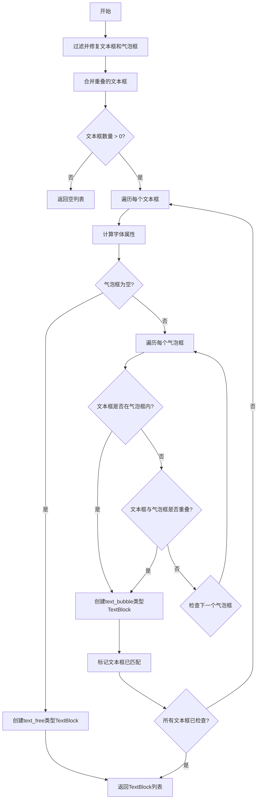

#### 带注释源码

```python
def create_text_blocks(
    self, 
    image: np.ndarray, 
    text_boxes: np.ndarray,
    bubble_boxes: Optional[np.ndarray] = None
) -> list[TextBlock]:
    """
    创建文本块对象列表，根据文本框与气泡框的位置关系进行分类
    
    参数:
        image: 输入图像数组
        text_boxes: 文本框坐标数组
        bubble_boxes: 气泡框坐标数组，可选
    
    返回:
        TextBlock对象列表
    """
    
    # 过滤并修复边界框，确保坐标在图像范围内
    text_boxes = filter_and_fix_bboxes(text_boxes, image.shape)
    bubble_boxes = filter_and_fix_bboxes(bubble_boxes, image.shape)
    # 合并重叠的文本框，减少重复检测
    text_boxes = merge_overlapping_boxes(text_boxes)

    text_blocks = []  # 存储最终创建的TextBlock对象
    text_matched = [False] * len(text_boxes)  # 标记每个文本框是否已匹配到气泡
    
    # 如果气泡框为None，则设置为空数组
    if bubble_boxes is None:
        bubble_boxes = np.array([])
    
    # 处理文本框
    if len(text_boxes) > 0:
        # 遍历每个文本框
        for txt_idx, txt_box in enumerate(text_boxes):
            font_attrs = {}  # 存储字体属性
            # 尝试使用FontEngine计算字体属性
            try:
                # 将边界框坐标转换为整数
                x1, y1, x2, y2 = map(int, txt_box)
                # 确保坐标在图像范围内
                h, w = image.shape[:2]
                x1 = max(0, x1)
                y1 = max(0, y1)
                x2 = min(w, x2)
                y2 = min(h, y2)
                
                # 裁剪文本区域并处理
                if x2 > x1 and y2 > y1:
                    crop = image[y1:y2, x1:x2]
                    # 创建字体引擎处理图像
                    font_engine = FontEngineFactory.create_engine(self.settings, backend='onnx')
                    font_attrs = font_engine.process(crop)
            except Exception as e:
                print(f"Failed to detect font attributes for text block {txt_idx}: {e}")

            # 获取字体属性
            direction = font_attrs.get('direction', '')
            text_color = tuple(font_attrs.get('text_color', ()))

            # 如果没有气泡框，所有文本都是自由文本
            if len(bubble_boxes) == 0:
                text_blocks.append(
                    TextBlock(
                        text_bbox=txt_box,
                        text_class='text_free',
                        direction=direction,
                        font_color=text_color,
                    )
                )
                continue
            
            # 遍历每个气泡框，检查文本框与气泡框的位置关系
            for bble_box in bubble_boxes:
                if bble_box is None:
                    continue
                # 检查文本框是否在气泡框内
                if does_rectangle_fit(bble_box, txt_box):
                    # 文本在气泡内
                    text_blocks.append(
                        TextBlock(
                            text_bbox=txt_box,
                            bubble_bbox=bble_box,
                            text_class='text_bubble',
                            direction=direction,
                            font_color=text_color,
                        )
                    )
                    text_matched[txt_idx] = True  # 标记为已匹配
                    break
                # 检查文本框是否与气泡框重叠
                elif do_rectangles_overlap(bble_box, txt_box):
                    # 文本与气泡重叠
                    text_blocks.append(
                        TextBlock(
                            text_bbox=txt_box,
                            bubble_bbox=bble_box,
                            text_class='text_bubble',
                            direction=direction,
                            font_color=text_color,
                        )
                    )
                    text_matched[txt_idx] = True  # 标记为已匹配
                    break
            
            # 如果文本框未匹配到任何气泡框，则创建自由文本块
            if not text_matched[txt_idx]:
                text_blocks.append(
                    TextBlock(
                        text_bbox=txt_box,
                        text_class='text_free',
                        direction=direction,
                        font_color=text_color,
                    )
                )
    
    return text_blocks
```


### `DetectionEngine.create_text_blocks`

该方法接收图像、文本框坐标和气泡框坐标，通过过滤、重叠合并、字体属性检测等步骤，将文本框分类为「自由文本」(text_free) 或「气泡内文本」(text_bubble)，最终返回 `TextBlock` 对象列表。

参数：

- `image`：`np.ndarray`，输入图像的 NumPy 数组
- `text_boxes`：`np.ndarray`，检测到的文本区域边界框坐标数组
- `bubble_boxes`：`Optional[np.ndarray]`，可选的气泡区域边界框坐标数组，默认为 None

返回值：`list[TextBlock]`，包含分类后文本块的 `TextBlock` 对象列表

#### 流程图

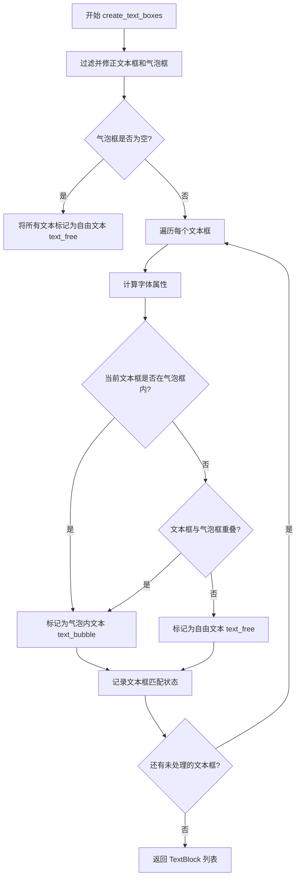

#### 带注释源码

```python
def create_text_blocks(
    self, 
    image: np.ndarray, 
    text_boxes: np.ndarray,
    bubble_boxes: Optional[np.ndarray] = None
) -> list[TextBlock]:
    """
    根据文本框和气泡框创建文本块列表
    
    参数:
        image: 输入图像数组
        text_boxes: 文本边界框坐标
        bubble_boxes: 可选的气泡边界框坐标
    返回:
        TextBlock 对象列表
    """
    # 1. 过滤并修正边界框，确保在图像范围内
    text_boxes = filter_and_fix_bboxes(text_boxes, image.shape)
    bubble_boxes = filter_and_fix_bboxes(bubble_boxes, image.shape)
    # 2. 合并重叠的文本框
    text_boxes = merge_overlapping_boxes(text_boxes)

    text_blocks = []
    text_matched = [False] * len(text_boxes)  # 跟踪已匹配的文本框
    
    # 3. 如果气泡框为 None，设为空数组
    if bubble_boxes is None:
        bubble_boxes = np.array([])
    
    # 4. 处理每个文本框
    if len(text_boxes) > 0:
        for txt_idx, txt_box in enumerate(text_boxes):
            font_attrs = {}
            # 5. 使用 FontEngine 计算字体属性
            try:
                x1, y1, x2, y2 = map(int, txt_box)
                # 确保坐标在图像范围内
                h, w = image.shape[:2]
                x1 = max(0, x1)
                y1 = max(0, y1)
                x2 = min(w, x2)
                y2 = min(h, y2)
                
                if x2 > x1 and y2 > y1:
                    crop = image[y1:y2, x1:x2]
                    font_engine = FontEngineFactory.create_engine(self.settings, backend='onnx')
                    font_attrs = font_engine.process(crop)
            except Exception as e:
                print(f"Failed to detect font attributes for text block {txt_idx}: {e}")

            direction = font_attrs.get('direction', '')
            text_color = tuple(font_attrs.get('text_color', ()))

            # 6. 如果没有气泡框，所有文本都是自由文本
            if len(bubble_boxes) == 0:
                text_blocks.append(
                    TextBlock(
                        text_bbox=txt_box,
                        text_class='text_free',
                        direction=direction,
                        font_color=text_color,
                    )
                )
                continue
            
            # 7. 检查文本框是否在气泡框内或与气泡框重叠
            for bble_box in bubble_boxes:
                if bble_box is None:
                    continue
                if does_rectangle_fit(bble_box, txt_box):
                    # 文本在气泡内
                    text_blocks.append(
                        TextBlock(
                            text_bbox=txt_box,
                            bubble_bbox=bble_box,
                            text_class='text_bubble',
                            direction=direction,
                            font_color=text_color,
                        )
                    )
                    text_matched[txt_idx] = True  
                    break
                elif do_rectangles_overlap(bble_box, txt_box):
                    # 文本与气泡重叠
                    text_blocks.append(
                        TextBlock(
                            text_bbox=txt_box,
                            bubble_bbox=bble_box,
                            text_class='text_bubble',
                            direction=direction,
                            font_color=text_color,
                        )
                    )
                    text_matched[txt_idx] = True  
                    break
            
            # 8. 未匹配到气泡的文本标记为自由文本
            if not text_matched[txt_idx]:
                text_blocks.append(
                    TextBlock(
                        text_bbox=txt_box,
                        text_class='text_free',
                        direction=direction,
                        font_color=text_color,
                    )
                )
    
    return text_blocks
```


### `DetectionEngine.create_text_blocks`

该方法负责将检测到的文本框和气泡框转换为结构化的 TextBlock 对象列表，同时处理字体属性检测、框的重叠判断以及自由文本与气泡文本的分类。

参数：

- `self`：隐式参数，当前 DetectionEngine 实例
- `image`：`np.ndarray`，输入图像作为 numpy 数组，用于裁剪文本区域进行字体属性检测
- `text_boxes`：`np.ndarray`，检测到的文本框坐标数组，形状为 (N, 4)，每行为 [x1, y1, x2, y2]
- `bubble_boxes`：`Optional[np.ndarray]`（可选），检测到的气泡框坐标数组，形状为 (M, 4)，用于判断文本是否位于气泡内，默认为 None

返回值：`list[TextBlock]`，返回 TextBlock 对象列表，每个对象包含文本框坐标、气泡框坐标（如有）、文本类别（text_free 或 text_bubble）、文本方向和字体颜色等信息

#### 流程图

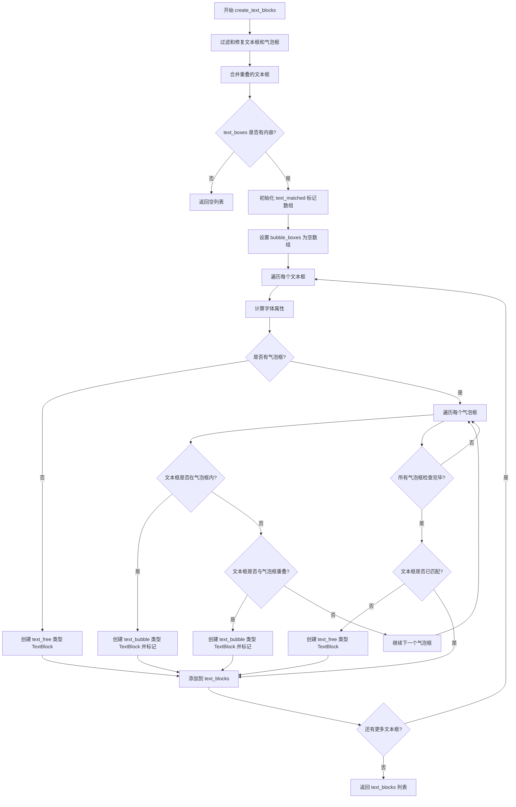

#### 带注释源码

```python
def create_text_blocks(
    self, 
    image: np.ndarray, 
    text_boxes: np.ndarray,
    bubble_boxes: Optional[np.ndarray] = None
) -> list[TextBlock]:
    """
    将文本框和气泡框转换为 TextBlock 对象列表
    
    参数:
        image: 输入图像作为 numpy 数组
        text_boxes: 检测到的文本框坐标数组
        bubble_boxes: 检测到的气泡框坐标数组，可选
    
    返回:
        TextBlock 对象列表
    """
    
    # 过滤并修复边界框，确保坐标在图像范围内
    text_boxes = filter_and_fix_bboxes(text_boxes, image.shape)
    bubble_boxes = filter_and_fix_bboxes(bubble_boxes, image.shape)
    
    # 合并重叠的文本框，减少冗余检测
    text_boxes = merge_overlapping_boxes(text_boxes)

    text_blocks = []  # 存储最终的 TextBlock 对象列表
    text_matched = [False] * len(text_boxes)  # 标记每个文本框是否已匹配到气泡框
    
    # 如果没有气泡框，设置为空数组以便统一处理
    if bubble_boxes is None:
        bubble_boxes = np.array([])
    
    # 处理每个文本框
    if len(text_boxes) > 0:
        for txt_idx, txt_box in enumerate(text_boxes):
            font_attrs = {}  # 存储字体属性
            
            # 使用 FontEngine 计算字体属性
            try:
                # 将坐标转换为整数并确保在图像边界内
                x1, y1, x2, y2 = map(int, txt_box)
                h, w = image.shape[:2]
                x1 = max(0, x1)
                y1 = max(0, y1)
                x2 = min(w, x2)
                y2 = min(h, y2)
                
                # 只有当有效区域时才进行处理
                if x2 > x1 and y2 > y1:
                    # 裁剪文本区域用于字体分析
                    crop = image[y1:y2, x1:x2]
                    # 创建字体引擎并处理
                    font_engine = FontEngineFactory.create_engine(self.settings, backend='onnx')
                    font_attrs = font_engine.process(crop)
            except Exception as e:
                # 打印错误信息（这是代码中唯一的 print 语句）
                print(f"Failed to detect font attributes for text block {txt_idx}: {e}")

            # 从字体属性中获取文本方向和颜色
            direction = font_attrs.get('direction', '')
            text_color = tuple(font_attrs.get('text_color', ()))

            # 如果没有气泡框，所有文本都是自由文本
            if len(bubble_boxes) == 0:
                text_blocks.append(
                    TextBlock(
                        text_bbox=txt_box,
                        text_class='text_free',
                        direction=direction,
                        font_color=text_color,
                    )
                )
                continue
            
            # 遍历每个气泡框，检查文本框与气泡框的关系
            for bble_box in bubble_boxes:
                if bble_box is None:
                    continue
                if does_rectangle_fit(bble_box, txt_box):
                    # 文本完全在气泡框内
                    text_blocks.append(
                        TextBlock(
                            text_bbox=txt_box,
                            bubble_bbox=bble_box,
                            text_class='text_bubble',
                            direction=direction,
                            font_color=text_color,
                        )
                    )
                    text_matched[txt_idx] = True  # 标记为已匹配
                    break
                elif do_rectangles_overlap(bble_box, txt_box):
                    # 文本与气泡框重叠
                    text_blocks.append(
                        TextBlock(
                            text_bbox=txt_box,
                            bubble_bbox=bble_box,
                            text_class='text_bubble',
                            direction=direction,
                            font_color=text_color,
                        )
                    )
                    text_matched[txt_idx] = True  # 标记为已匹配
                    break
            
            # 如果文本框未匹配到任何气泡框，标记为自由文本
            if not text_matched[txt_idx]:
                text_blocks.append(
                    TextBlock(
                        text_bbox=txt_box,
                        text_class='text_free',
                        direction=direction,
                        font_color=text_color,
                    )
                )
    
    return text_blocks
```


### `DetectionEngine.__init__`

这是 `DetectionEngine` 抽象基类的初始化方法，用于创建检测引擎实例并配置基本设置。

参数：

- `self`：隐式的实例参数，代表当前创建的 `DetectionEngine` 对象实例
- `settings`：`Optional[Any]` 或 `None`，用于配置检测引擎的可选设置参数，默认为 `None`

返回值：`None`，该方法仅初始化实例属性，不返回任何值

#### 流程图

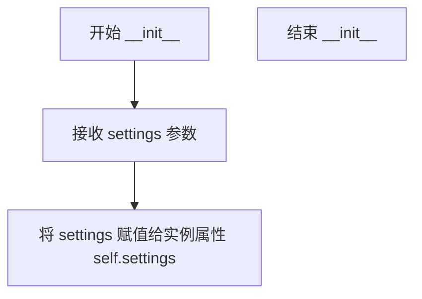

#### 带注释源码

```python
def __init__(self, settings=None):
    """
    初始化检测引擎的基本设置。
    
    Args:
        settings: 可选的引擎配置参数，用于定制检测行为
    """
    self.settings = settings  # 将传入的配置存储为实例属性，供后续方法使用
```

---

#### 补充说明

该方法是 `DetectionEngine` 抽象基类的构造函数，设计简洁，体现了**依赖注入**的思想：

- **参数设计**：通过可选的 `settings` 参数接收外部配置，体现了开闭原则（对扩展开放，对修改关闭）
- **职责单一**：仅负责初始化基础状态，不涉及具体检测逻辑
- **设计模式**：采用抽象基类（ABC）模式，定义统一的接口规范，子类需实现 `initialize()` 和 `detect()` 抽象方法


### `DetectionEngine.initialize`

该方法是 DetectionEngine 抽象基类中定义的抽象方法，用于初始化检测模型的具体实现，接收引擎特定的参数并配置检测模型。

参数：

- `**kwargs`：`任意关键字参数`，引擎特定的初始化参数，如模型路径、配置选项、设备参数等

返回值：`None`，无返回值

#### 流程图

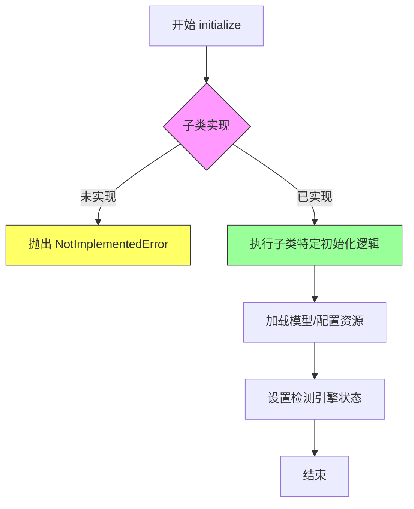

#### 带注释源码

```python
@abstractmethod
def initialize(self, **kwargs) -> None:
    """
    Initialize the detection model with necessary parameters.
    
    Args:
        **kwargs: Engine-specific initialization parameters
    """
    pass
```

#### 补充说明

1. **设计目标**：此方法采用抽象方法模式，定义检测引擎的初始化接口契约，允许各子类（具体检测模型实现）根据自身需求自定义初始化逻辑。

2. **约束条件**：子类必须实现此方法，否则无法实例化；父类提供方法签名和文档规范，确保各实现具有一致的调用接口。

3. **潜在的技术债务**：当前 kwargs 参数完全自由，可能导致接口不够清晰，建议在子类文档中明确列出支持的参数列表。

4. **使用示例**（子类实现示意）：
   ```python
   class YoloDetectionEngine(DetectionEngine):
       def initialize(self, model_path=None, confidence_threshold=0.5, **kwargs):
           # 子类具体实现
           self.model = load_model(model_path)
           self.confidence_threshold = confidence_threshold
   ```


### `DetectionEngine.detect`

该方法是抽象基类 `DetectionEngine` 的核心抽象方法，定义了检测文本区域的标准接口。具体的检测实现（如基于 OCR 或深度学习模型的检测器）需要继承该类并实现此方法，以从输入图像中识别并返回文本块列表。

参数：

- `self`：隐式参数，指向类实例本身
- `image`：`np.ndarray`，输入的图像数据，以 NumPy 数组形式表示（通常为 H×W×C 格式）

返回值：`list[TextBlock]`，检测到的文本块对象列表，每个 `TextBlock` 包含文本区域的边界框、类别（如文本气泡 free text 或文本气泡 text bubble）、方向和字体颜色等属性

#### 流程图

```mermaid
flowchart TD
    A[开始 detect 方法] --> B{子类实现?}
    B -->|是| C[执行具体检测逻辑]
    B -->|否| D[返回空列表或抛出异常]
    C --> E[返回 List[TextBlock]]
    D --> E
```

#### 带注释源码

```python
@abstractmethod
def detect(self, image: np.ndarray) -> list[TextBlock]:
    """
    Detect text blocks in an image.
    
    Args:
        image: Input image as numpy array
        
    Returns:
        List of TextBlock objects with detected regions
    """
    pass
```

---

### 类 `DetectionEngine` 详细信息

#### 类字段

- `settings`：`Any`（类型由传入参数决定，默认 `None`），存储检测引擎的配置参数，用于初始化和控制检测行为

#### 类方法

| 方法名 | 参数 | 返回值 | 描述 |
|--------|------|--------|------|
| `__init__` | `settings=None` | `None` | 构造函数，初始化检测引擎的设置参数 |
| `initialize` | `**kwargs` | `None` | 抽象方法，子类需实现以加载检测模型和配置 |
| `detect` | `image: np.ndarray` | `list[TextBlock]` | **核心抽象方法**，执行文本区域检测并返回结果 |
| `create_text_blocks` | `image: np.ndarray`, `text_boxes: np.ndarray`, `bubble_boxes: Optional[np.ndarray] = None` | `list[TextBlock]` | 将检测到的文本框和气泡框转换为 `TextBlock` 对象列表，包含字体属性检测和分类逻辑 |

---

### 关键组件信息

| 组件名称 | 一句话描述 |
|----------|------------|
| `TextBlock` | 表示图像中检测到的文本区域的数据结构，包含边界框、文本类别、方向和颜色等信息 |
| `FontEngine` | 字体属性检测引擎，用于分析文本区域的字体方向和颜色特征 |
| `filter_and_fix_bboxes` | 工具函数，用于过滤和修正边界框坐标，确保其位于图像有效范围内 |
| `merge_overlapping_boxes` | 工具函数，用于合并重叠的边界框，减少冗余检测 |
| `does_rectangle_fit` | 几何工具函数，判断一个矩形是否完全包含在另一个矩形内 |
| `do_rectangles_overlap` | 几何工具函数，判断两个矩形是否发生重叠 |

---

### 潜在技术债务或优化空间

1. **异常处理过于简单**：`create_text_blocks` 方法中捕获异常后仅使用 `print` 输出错误信息，建议使用日志框架（如 `logging`）进行规范化日志记录
2. **字体引擎重复创建**：循环中每次都调用 `FontEngineFactory.create_engine`，未进行缓存复用，会导致性能开销
3. **类型注解不完整**：`settings` 变量的类型注解为 `None`，应明确其具体类型（如 `Dict[str, Any]` 或定义专门的 `Settings` 数据类）
4. **抽象方法文档可以增强**：可增加更多关于子实现期望行为的说明，如模型加载路径、推理批处理大小限制等
5. **气泡框为空时的处理逻辑**：当 `bubble_boxes` 为空数组时，所有文本都被标记为 `text_free`，这部分逻辑可以提取为独立方法以提升可读性

---

### 其它项目

#### 设计目标与约束

- **设计目标**：提供统一的文本检测接口，支持多种检测模型实现（如 OCR、深度学习检测器等）的灵活切换
- **设计约束**：子类必须实现 `initialize` 和 `detect` 方法；`detect` 方法接收的图像应为 NumPy 数组格式

#### 错误处理与异常设计

- `detect` 方法本身不处理错误，依赖子类实现时自行定义错误处理策略
- `create_text_blocks` 方法对字体属性检测失败进行了 try-except 捕获，但仅打印错误并继续执行，可能导致部分文本块缺少字体属性

#### 数据流与状态机

1. 输入图像 → 调用 `detect` 方法 → 获取原始文本框和气泡框坐标
2. 坐标数据经过 `filter_and_fix_bboxes` 过滤修正和 `merge_overlapping_boxes` 合并处理
3. 遍历文本框，使用 `FontEngine` 分析字体属性（方向、颜色）
4. 判断每个文本框与气泡框的空间关系（包含或重叠），确定文本类别（`text_free` 或 `text_bubble`）
5. 组装 `TextBlock` 对象列表并返回

#### 外部依赖与接口契约

- 依赖 `numpy` 进行数值计算和数组操作
- 依赖 `abc` 模块实现抽象基类模式
- 依赖 `TextBlock` 数据类定义返回对象结构
- 依赖 `FontEngineFactory` 创建字体分析引擎实例
- 依赖几何工具函数（`does_rectangle_fit`、`do_rectangles_overlap`）进行空间关系判断


### `DetectionEngine.create_text_blocks`

该方法接收输入图像、文本框坐标和可选的气泡框坐标，对文本框进行过滤、修正和合并后，判断每个文本框属于气泡内文本（text_bubble）还是自由文本（text_free），并使用字体引擎分析文本属性，最终返回包含完整信息的TextBlock对象列表。

参数：

- `image`：`np.ndarray`，输入图像作为numpy数组
- `text_boxes`：`np.ndarray`，检测到的文本框坐标数组
- `bubble_boxes`：`Optional[np.ndarray]`，可选的气泡框坐标数组，默认为None

返回值：`list[TextBlock]`，包含检测到的文本块信息的TextBlock对象列表

#### 流程图

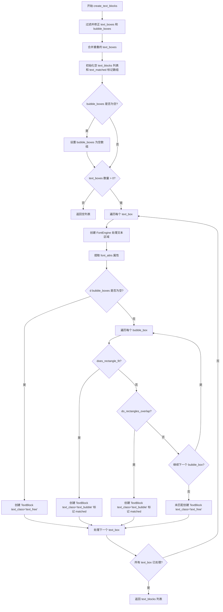

#### 带注释源码

```python
def create_text_blocks(
    self, 
    image: np.ndarray, 
    text_boxes: np.ndarray,
    bubble_boxes: Optional[np.ndarray] = None
) -> list[TextBlock]:
    # 步骤1: 过滤并修正文本框和气泡框的边界，确保在图像范围内
    text_boxes = filter_and_fix_bboxes(text_boxes, image.shape)
    bubble_boxes = filter_and_fix_bboxes(bubble_boxes, image.shape)
    
    # 步骤2: 合并重叠的文本框，减少冗余检测
    text_boxes = merge_overlapping_boxes(text_boxes)

    # 步骤3: 初始化结果列表和匹配标记数组
    text_blocks = []
    text_matched = [False] * len(text_boxes)  # 用于跟踪哪些文本框已匹配到气泡
    
    # 步骤4: 如果气泡框为None，设置为空数组
    if bubble_boxes is None:
        bubble_boxes = np.array([])
    
    # 步骤5: 处理每个文本框
    if len(text_boxes) > 0:
        for txt_idx, txt_box in enumerate(text_boxes):
            font_attrs = {}
            
            # 步骤6: 使用FontEngine计算字体属性
            try:
                # 将坐标转换为整数并确保在图像边界内
                x1, y1, x2, y2 = map(int, txt_box)
                h, w = image.shape[:2]
                x1 = max(0, x1)
                y1 = max(0, y1)
                x2 = min(w, x2)
                y2 = min(h, y2)
                
                # 如果有效区域存在，裁剪并处理
                if x2 > x1 and y2 > y1:
                    crop = image[y1:y2, x1:x2]
                    font_engine = FontEngineFactory.create_engine(self.settings, backend='onnx')
                    font_attrs = font_engine.process(crop)
            except Exception as e:
                # 异常处理：打印错误但继续处理
                print(f"Failed to detect font attributes for text block {txt_idx}: {e}")

            # 从字体属性中获取文本方向和颜色
            direction = font_attrs.get('direction', '')
            text_color = tuple(font_attrs.get('text_color', ()))

            # 步骤7: 如果没有气泡框，所有文本都是自由文本
            if len(bubble_boxes) == 0:
                text_blocks.append(
                    TextBlock(
                        text_bbox=txt_box,
                        text_class='text_free',
                        direction=direction,
                        font_color=text_color,
                    )
                )
                continue
            
            # 步骤8: 遍历气泡框，检查文本框位置关系
            for bble_box in bubble_boxes:
                if bble_box is None:
                    continue
                    
                # 检查文本是否完全在气泡内
                if does_rectangle_fit(bble_box, txt_box):
                    text_blocks.append(
                        TextBlock(
                            text_bbox=txt_box,
                            bubble_bbox=bble_box,
                            text_class='text_bubble',
                            direction=direction,
                            font_color=text_color,
                        )
                    )
                    text_matched[txt_idx] = True  # 标记为已匹配
                    break
                # 检查文本是否与气泡重叠
                elif do_rectangles_overlap(bble_box, txt_box):
                    text_blocks.append(
                        TextBlock(
                            text_bbox=txt_box,
                            bubble_bbox=bble_box,
                            text_class='text_bubble',
                            direction=direction,
                            font_color=text_color,
                        )
                    )
                    text_matched[txt_idx] = True  # 标记为已匹配
                    break
            
            # 步骤9: 未匹配到任何气泡的文本，作为自由文本处理
            if not text_matched[txt_idx]:
                text_blocks.append(
                    TextBlock(
                        text_bbox=txt_box,
                        text_class='text_free',
                        direction=direction,
                        font_color=text_color,
                    )
                )
    
    # 步骤10: 返回结果列表
    return text_blocks
```

## 关键组件


### DetectionEngine 抽象基类

检测引擎的抽象基类，定义了检测模型的接口规范，提供了文本块创建的通用实现，支持自由文本和气泡内文本的分类识别。

### create_text_blocks 方法

核心业务方法，负责将检测到的文本框和气泡框转换为结构化的 TextBlock 对象，包含文本分类、字体属性计算和几何关系处理逻辑。

### FontEngineFactory 字体引擎工厂

根据设置创建字体处理引擎的后端工厂类，用于分析图像区域的字体属性（方向、颜色等），支持 ONNX 后端。

### TextBlock 文本块数据结构

表示检测到的文本区域的数据结构，包含文本边界框、气泡边界框（可选）、文本类别（text_free/text_bubble）、方向和字体颜色等属性。

### 几何关系处理模块

包含 does_rectangle_fit（判断文本是否完全在气泡内）、do_rectangles_overlap（判断文本与气泡是否重叠）、merge_overlapping_boxes（合并重叠的文本框）等工具函数。

### filter_and_fix_bboxes 边界框过滤修复工具

对输入的边界框进行有效性检查和修复，确保坐标在图像范围内，处理异常或无效的边界框数据。

### 文本分类逻辑

根据文本框与气泡框的几何关系自动分类文本类型：完全位于气泡内或与气泡重叠的标记为 text_bubble，其余标记为 text_free。

### 字体属性处理模块

通过 FontEngine 提取文本区域的字体属性，包括文字方向（direction）和字体颜色（text_color），用于后续渲染和分析。

### 异常处理机制

使用 try-except 捕获字体属性检测过程中的异常，确保单个文本块处理失败不影响整体流程，并输出错误日志。


## 问题及建议


### 已知问题

-   **性能瓶颈**：在 `for txt_box in text_boxes` 循环内部每次都创建新的 `FontEngine` 实例（`FontEngineFactory.create_engine`），导致重复加载模型，造成严重性能开销
-   **重复代码**：`TextBlock` 对象的创建在多处重复，违反了 DRY 原则，降低了可维护性
-   **异常处理不完善**：仅使用 `print` 输出错误信息，缺乏适当的降级策略和日志记录机制
-   **魔法字符串**：`'text_free'` 和 `'text_bubble'` 作为文本类别硬编码在代码中，应提取为常量或枚举
-   **冗余的坐标边界检查**：在 `filter_and_fix_bboxes` 之后又手动进行坐标裁剪（`max(0, x1)`、`min(w, x2)` 等），存在重复逻辑
-   **类型假设不一致**：代码中检查 `if bble_box is None`，但 `bubble_boxes` 是 numpy 数组，这种类型假设不清晰
-   **资源未释放**：`FontEngine` 可能涉及 GPU 显存或模型资源，未实现上下文管理器或显式的资源释放
-   **循环提前终止逻辑**：内层循环 `for bble_box in bubble_boxes` 使用 `break` 跳出，意味着一个文本框只会匹配第一个符合条件的气泡框，可能遗漏更合适的匹配

### 优化建议

-   **提取 FontEngine 到循环外**：在处理文本框之前创建单个 `FontEngine` 实例并复用，或者使用单例模式/缓存机制
-   **封装 TextBlock 创建逻辑**：将重复的 `TextBlock` 构造代码抽取为私有方法，如 `_create_text_block(txt_box, ...)`
-   **定义常量或枚举**：创建 `TextClass` 枚举或常量类，统一管理 `'text_free'` 和 `'text_bubble'`
-   **统一坐标处理**：移除手动边界检查代码，依赖 `filter_and_fix_bboxes` 或在 `TextBlock` 构造时统一处理
-   **改进异常处理**：使用结构化日志记录，捕获特定异常类型，并根据错误类型采取不同策略（如跳过该文本块或使用默认值）
-   **实现资源管理**：如 `FontEngine` 支持上下文管理器，使用 `with` 语句确保资源释放
-   **优化匹配逻辑**：考虑所有重叠气泡框的评分机制，而非仅匹配第一个
-   **添加类型注解和文档**：完善参数和返回值的类型提示，增加复杂逻辑的说明

## 其它


### 设计目标与约束

本模块的设计目标是提供一个可扩展的文本检测框架，支持多种检测模型的集成。主要约束包括：1）必须继承DetectionEngine抽象类实现具体检测器；2）支持两种文本类型（自由文本和气泡文本）的识别；3）依赖FontEngine进行字体属性检测；4）使用numpy进行高效的数值计算和几何运算。

### 错误处理与异常设计

代码中的异常处理采用try-except块，在字体属性检测失败时仅打印错误信息并继续执行。具体改进建议：1）应定义自定义异常类（如DetectionError、FontEngineError）用于不同类型的错误；2）create_text_blocks方法应在异常发生时返回部分结果而非完全失败；3）建议添加错误回调机制或错误日志记录；4）对于关键参数（如image、text_boxes）应进行前置校验并抛出ValueError。

### 数据流与状态机

数据流：image输入 → filter_and_fix_bboxes预处理 → merge_overlapping_boxes合并 → 遍历text_boxes → 调用FontEngine检测字体属性 → 与bubble_boxes进行几何关系判断 → 创建TextBlock对象。状态机：初始状态(接收原始数据) → 预处理状态(过滤和修复坐标) → 检测状态(字体属性分析) → 匹配状态(气泡关联判断) → 完成状态(生成TextBlock列表)。

### 外部依赖与接口契约

核心依赖包括：1）numpy提供数组操作和数值计算；2）TextBlock（来自utils.textblock）作为输出数据结构；3）FontEngineFactory创建字体引擎；4）geometry工具函数（does_rectangle_fit、do_rectangles_overlap、merge_overlapping_boxes）；5）content工具（filter_and_fix_bboxes）。接口契约：detect方法必须返回list[TextBlock]；create_text_blocks必须返回list[TextBlock]；initialize方法接收任意关键字参数。

### 性能考虑

当前实现中每次循环都创建新的FontEngine实例，应提取到循环外部复用。图像裁剪操作（crop = image[y1:y2, x1:x2]）在循环内重复执行，建议批量处理。text_matched列表使用Python列表，可考虑使用numpy数组提升性能。对于大量文本框的情况，应考虑并行处理或批处理机制。

### 安全性考虑

代码存在以下安全风险：1）坐标边界未完全验证，可能导致数组越界（已部分修复）；2）未对输入image进行类型和有效性校验；3）font_attrs.get()调用未指定默认值可能导致KeyError；4）print语句泄露敏感信息到标准输出，应使用日志框架。建议添加输入验证、敏感信息脱敏和安全的日志记录。

### 测试策略

建议的测试用例：1）单元测试：测试geometry工具函数的几何计算；2）集成测试：测试create_text_blocks的完整流程；3）边界测试：空输入、单文本框、多气泡框、文本框完全在气泡内/外/重叠等场景；4）性能测试：大图像多文本框的处理时间；5）Mock测试：模拟FontEngine返回预期属性。

### 版本兼容性

代码使用Python 3.9+的list类型注解语法（如list[TextBlock]），需确保运行时Python版本支持。numpy应为1.20+版本以支持所有数组操作。typing.Optional在Python 3.10+可使用|X语法简化。

    