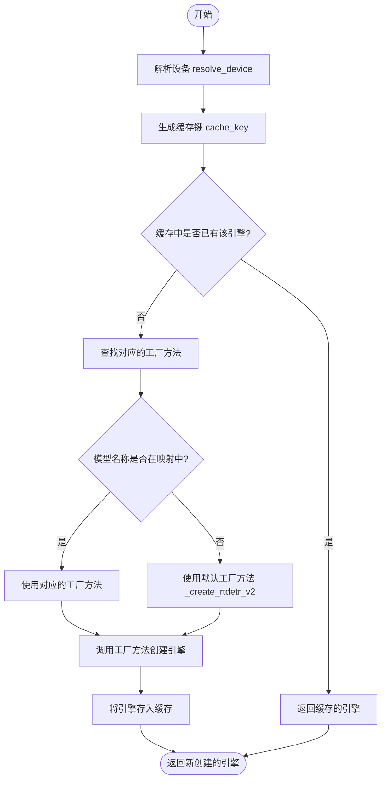
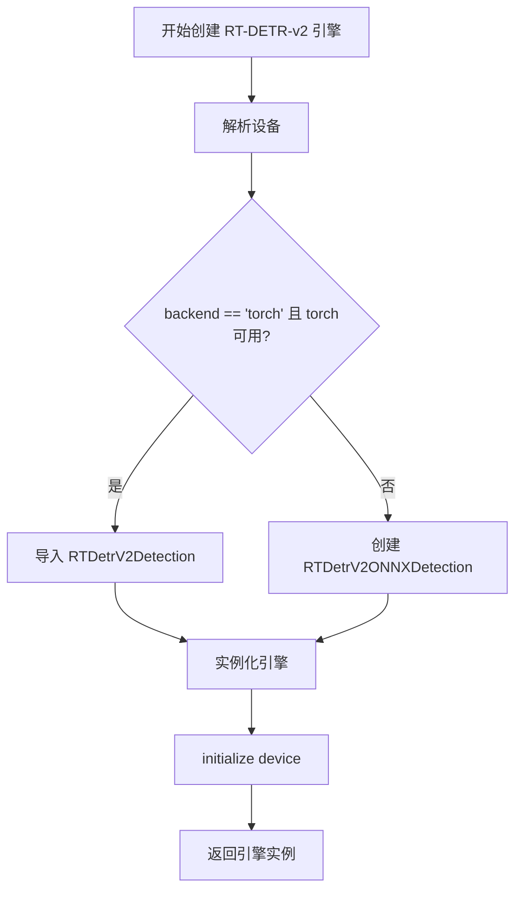

# `comic-translate\modules\detection\factory.py` 详细设计文档

检测引擎工厂类，通过配置和模型名称创建并缓存适当的检测引擎实例，支持RT-DETR-v2模型和ONNX/Torch后端切换

## 整体流程

```mermaid
graph TD
A[开始 create_engine] --> B[解析设备信息]
B --> C[生成缓存键]
C --> D{缓存命中?}
D -- 是 --> E[返回缓存引擎]
D -- 否 --> F[查找工厂方法]
F --> G[调用工厂方法创建引擎]
G --> H[缓存引擎实例]
H --> I[返回新引擎]
J[_create_rtdetr_v2] --> K{backend == torch?}
K -- 是 --> L[创建RTDetrV2Detection]
K -- 否 --> M[创建RTDetrV2ONNXDetection]
L --> N[initialize(device)]
M --> N
```

## 类结构

```
DetectionEngineFactory (工厂类)
├── DetectionEngine (抽象基类，被导入)
│   ├── RTDetrV2ONNXDetection (被导入)
│   └── RTDetrV2Detection (条件导入)
```

## 全局变量及字段


### `DetectionEngineFactory._engines`
    
类变量，缓存已创建的检测引擎实例，键为model_backend_device组合

类型：`dict`
    
    

## 全局函数及方法


### DetectionEngineFactory.create_engine

创建或检索适当的检测引擎实例，支持缓存机制以提高性能。

参数：

- `settings`：`Settings`，包含检测配置的对象
- `model_name`：`str`，检测模型名称，默认为RT-DETR-v2
- `backend`：`str`，后端类型，onnx或torch

返回值：`DetectionEngine`，检测引擎实例

#### 流程图



#### 带注释源码

```python
@classmethod
def create_engine(
    cls, 
    settings, 
    model_name: str = 'RT-DETR-v2', 
    backend: str = 'onnx'
) -> DetectionEngine:
    """
    Create or retrieve an appropriate detection engine.
    
    Args:
        settings: Settings object with detection configuration
        model_name: Name of the detection model to use
        backend: Backend to use ('onnx' or 'torch')
        
    Returns:
        Appropriate detection engine instance
    """
    # Step 1: 解析设备 - 根据是否启用GPU和后端类型确定运行设备
    device = resolve_device(settings.is_gpu_enabled(), backend)
    
    # Step 2: 生成缓存键 - 组合模型名、后端和设备作为唯一标识
    cache_key = f"{model_name}_{backend}_{device}"

    # Step 3: 检查缓存 - 如果已有缓存的引擎则直接返回
    if cache_key in cls._engines:
        return cls._engines[cache_key]
    
    # Step 4: 映射模型名称到对应的工厂方法
    engine_factories = {
        'RT-DETR-v2': cls._create_rtdetr_v2,
    }
    
    # Step 5: 获取工厂方法 - 未找到时使用默认的RT-DETR-v2
    factory_method = engine_factories.get(model_name, cls._create_rtdetr_v2)

    # Step 6: 创建引擎并缓存
    engine = factory_method(settings, backend)
    cls._engines[cache_key] = engine
    return engine
```


### `DetectionEngineFactory._create_rtdetr_v2`

该方法是一个静态工厂方法，用于根据设置和后端类型动态创建并初始化 RT-DETR-v2 检测引擎。它首先解析计算设备，然后根据后端类型（PyTorch 或 ONNX）条件导入并实例化相应的检测引擎类，最后完成设备初始化并返回引擎实例。

参数：

- `settings`：`Settings`，包含检测配置的对象
- `backend`：`str`，后端类型，默认为 `'onnx'`

返回值：`DetectionEngine`，RT-DETR-v2 检测引擎实例

#### 流程图



#### 带注释源码

```python
@staticmethod
def _create_rtdetr_v2(settings, backend: str = 'onnx'):
    """
    创建并初始化 RT-DETR-v2 检测引擎。
    
    Args:
        settings: Settings 对象，包含检测配置
        backend: str，后端类型，'onnx' 或 'torch'
    
    Returns:
        DetectionEngine: RT-DETR-v2 检测引擎实例
    """
    # 步骤1: 解析计算设备
    # 根据 settings.is_gpu_enabled() 和 backend 确定使用 CPU 或 GPU
    device = resolve_device(settings.is_gpu_enabled(), backend)
    
    # 步骤2: 根据 backend 类型条件创建引擎
    if backend.lower() == 'torch' and torch_available():
        # 条件导入 PyTorch 版本的检测引擎
        from .rtdetr_v2 import RTDetrV2Detection
        # 实例化 PyTorch 后端引擎
        engine = RTDetrV2Detection(settings)
    else:
        # 默认使用 ONNX 版本的检测引擎
        engine = RTDetrV2ONNXDetection(settings)
    
    # 步骤3: 使用解析的设备初始化引擎
    engine.initialize(device=device)
    
    # 步骤4: 返回完全初始化的检测引擎
    return engine
```

## 关键组件


### DetectionEngineFactory

工厂类，负责根据配置创建或检索适当的检测引擎实例。支持RT-DETR-v2模型，支持ONNX和Torch后端，并使用缓存机制避免重复创建引擎。

### DetectionEngine（基类）

从.base模块导入的检测引擎抽象基类，定义了检测引擎的标准接口。

### RTDetrV2ONNXDetection

ONNX运行时的RT-DETR-v2检测引擎实现，用于在CPU或GPU上进行目标检测推理。

### RTDetrV2Detection（条件导入）

Torch运行时的RT-DETR-v2检测引擎实现，仅在torch可用时导入使用。

### resolve_device（工具函数）

根据是否启用GPU和后端类型解析并返回适当的计算设备（CPU/CUDA）。

### torch_available（工具函数）

检查Torch库是否可用，返回布尔值用于条件分支逻辑。

### 引擎缓存机制

使用类变量`_engines`字典存储已创建的引擎实例，通过组合model_name、backend和device生成缓存键，实现引擎实例的复用。

### 引擎工厂映射

使用engine_factories字典将模型名称映射到对应的工厂方法，支持扩展更多模型。


## 问题及建议


### 已知问题

- **缓存键设计缺陷**：cache_key 仅包含 model_name、backend、device，未考虑 settings 对象的变化。当 settings 改变时，可能返回不适用当前配置的缓存引擎，导致检测结果异常。
- **设备解析重复调用**：`resolve_device` 在 `create_engine` 和 `_create_rtdetr_v2` 中被调用两次，增加了不必要的计算开销，且存在结果不一致的风险。
- **硬编码模型映射**：`engine_factories` 字典采用硬编码方式，新增检测模型需要修改工厂类源码，不符合开闭原则，缺乏扩展性。
- **缺少后端有效性验证**：未对 backend 参数进行校验，非 'onnx'/'torch' 值会被默认当作 'onnx' 处理，可能导致隐式错误。
- **线程安全问题**：`_engines` 类字典的读写操作非原子性，在多线程环境下可能出现竞态条件，导致缓存不一致或创建多余实例。
- **缺失错误处理**：未处理 torch 不可用时的明确提示，也未处理模型导入失败的情况。
- **类型提示不完整**：settings 参数缺少类型注解，降低了代码的可读性和 IDE 智能提示效果。

### 优化建议

- **改进缓存机制**：使用 settings 的哈希值或序列化内容作为 cache_key 的一部分，或者在 settings 变化时主动清除相关缓存；添加缓存过期或最大数量限制以防止内存泄漏。
- **消除重复设备解析**：将设备信息作为参数传递给 `_create_rtdetr_v2`，避免重复计算。
- **实现插件式模型注册**：将 `engine_factories` 改为注册机制，支持运行时动态注册模型工厂类，提高可扩展性。
- **添加参数校验**：对 backend 参数进行白名单校验，无效值时抛出明确的 ValueError 异常。
- **实现线程安全**：使用 threading.Lock 保护缓存字典的读写操作，或使用线程安全的数据结构。
- **完善类型提示**：为 settings 参数添加类型注解，如 `settings: DetectionSettings`，提升代码可维护性。
- **增强错误处理**：为 torch 不可用和模型导入失败的情况添加友好的错误提示和降级策略。

## 其它


### 设计目标与约束

该模块旨在提供一个灵活的检测引擎工厂，通过统一的接口创建不同后端的检测引擎实例。设计约束包括：支持RT-DETR-v2模型、兼容ONNX和Torch后端、利用缓存机制提高性能、依赖设备类型进行引擎管理。

### 错误处理与异常设计

工厂方法在以下场景可能抛出异常：模型名称不支持时默认使用RT-DETR-v2；Torch后端但torch不可用时自动回退到ONNX；设备解析失败时可能导致引擎初始化失败。异常处理采用静默回退策略，保证系统可用性。

### 数据流与状态机

工厂使用内存字典`_engines`作为缓存容器，生命周期贯穿应用运行期。状态转换：创建请求→检查缓存→缓存命中直接返回→缓存未命中→选择工厂方法→创建引擎→存入缓存→返回引擎实例。

### 外部依赖与接口契约

主要依赖包括：DetectionEngine基类、RTDetrV2ONNXDetection和RTDetrV2Detection实现类、resolve_device工具函数、torch_available检查函数。工厂方法接受settings对象、model_name字符串和backend字符串，约定返回DetectionEngine接口实例。

### 配置说明

create_engine方法参数：settings（检测配置对象）、model_name（默认'RT-DETR-v2'）、backend（默认'onnx'）。缓存键格式为`{model_name}_{backend}_{device}`，确保相同配置的引擎只创建一次。

### 使用示例

```python
factory = DetectionEngineFactory()
engine = factory.create_engine(settings, model_name='RT-DETR-v2', backend='onnx')
# 再次调用会从缓存返回
engine2 = factory.create_engine(settings, model_name='RT-DETR-v2', backend='onnx')
# engine 和 engine2 是同一实例
```

### 性能考虑

缓存机制避免重复创建引擎实例，减少内存占用和初始化开销。缓存键包含设备信息，确保不同设备配置使用独立引擎实例。静态字典作为缓存容器，无线程安全保护。

### 安全性考虑

模块未直接处理敏感数据，但缓存机制可能导致同一引擎实例被多用户共享，需注意状态隔离。动态导入torch模块时需验证可用性。

### 测试策略

建议测试场景：缓存命中和未命中行为、Torch不可用时的回退逻辑、相同配置返回同一实例、不同配置返回不同实例、异常场景下的优雅降级。

    