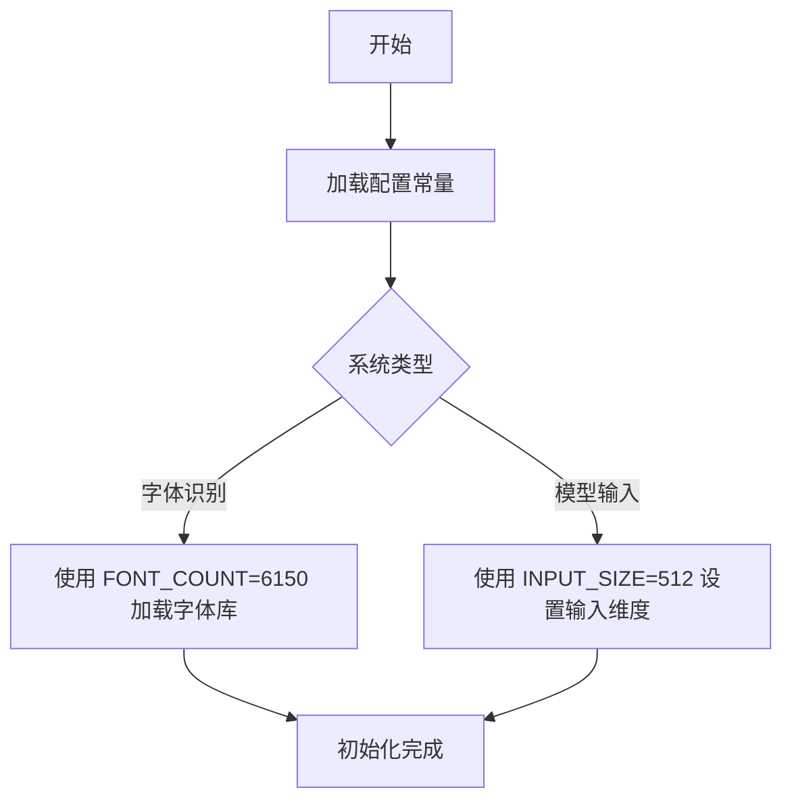

# `comic-translate\modules\detection\font\config.py` 详细设计文档

该代码定义了两个全局配置常量，用于字体处理或文本识别系统的参数配置。INPUT_SIZE设置为512，表示模型输入的尺寸为512x512像素；FONT_COUNT为6150，表示系统支持处理6150种不同的字体。这两个常量通常用于字体识别、OCR文字识别或文本生成模型的初始化阶段。

## 整体流程



## 类结构

```
无类层次结构（此文件仅包含全局常量定义）
```

## 全局变量及字段


### `INPUT_SIZE`
    
输入数据的尺寸大小，通常指图像或特征的维度

类型：`int`
    


### `FONT_COUNT`
    
字体库中可用的字体总数

类型：`int`
    


    

## 全局函数及方法


## 关键组件


### 常量定义

本代码文件定义了两个全局常量，用于配置字体渲染系统的基本参数：输入尺寸为512像素，字体数量为6150个。

### 文件运行流程

该代码文件为纯配置性质，不包含任何可执行逻辑，仅在模块加载时定义两个全局整型常量，供其他模块导入使用。

### 全局变量

| 名称 | 类型 | 描述 |
|------|------|------|
| INPUT_SIZE | int | 输入图像的宽度或高度像素值 |
| FONT_COUNT | int | 可用字体的总数 |

### 关键组件信息

本代码文件仅包含配置常量，无复杂组件。

### 潜在的技术债务或优化空间

1. 缺少常量合法性校验（如INPUT_SIZE应为2的幂次、字体数量应大于0）
2. 无配置说明文档或注释
3. 缺乏配置管理机制，配置硬编码在全局作用域

### 其它项目

- **设计目标**：提供字体渲染系统的静态配置参数
- **错误处理**：无错误处理逻辑
- **外部依赖**：无外部依赖
- **接口契约**：其他模块可直接导入这两个常量使用


## 问题及建议


### 已知问题

- **缺少文档注释**：两个全局常量 `INPUT_SIZE` 和 `FONT_COUNT` 没有任何注释说明其用途、含义和使用场景
- **魔法数字问题**：数值 512 和 6150 为硬编码的魔法数字（magic numbers），缺乏上下文解释，难以理解其设计依据
- **缺乏类型注解**：未使用 Python 类型注解（如 `int`），降低代码可读性和 IDE 辅助支持
- **无访问控制说明**：作为配置类常量，未明确其作用域和使用限制
- **可读性不足**：变量命名虽然有一定描述性，但缺乏业务语义（如与字体识别、图像处理相关的具体场景）

### 优化建议

- 为两个常量添加详细的 docstring 或行内注释，说明其来源、用途和计算依据
- 考虑使用类型注解：`INPUT_SIZE: int = 512` 和 `FONT_COUNT: int = 6150`
- 若这些配置与特定模块相关，建议移入配置类或配置模块中统一管理
- 如常量有业务含义（如 FONT_COUNT=6150 可能指字体库大小），可添加枚举或常量类封装
- 提供配置来源说明（如从配置文件读取或基于数据集统计得出），便于后续维护和调整
- 建议添加默认值说明和取值范围验证逻辑，提高代码健壮性


## 其它


### 设计目标与约束

本模块作为配置定义文件，旨在为上层业务逻辑提供可调整的全局参数。INPUT_SIZE定义了输入图像的标准尺寸，FONT_COUNT定义了字体库的总数量。设计约束包括：INPUT_SIZE必须为2的幂次方以便于后续图像处理算法（如傅里叶变换）的性能优化，FONT_COUNT需与实际的字体库资源保持同步更新。

### 错误处理与异常设计

由于本文件仅包含常量定义，不涉及运行时错误处理逻辑。若常量值设置不当（如INPUT_SIZE为负数或0），将在引用该常量的模块中触发相应的异常。建议在业务层调用前进行参数合法性校验。

### 数据流与状态机

本文件为纯静态配置，不涉及数据流处理或状态机设计。INPUT_SIZE和FONT_COUNT作为只读常量被其他模块引用，属于单向数据传递场景。

### 外部依赖与接口契约

本文件无外部依赖，仅作为基础配置层被其他模块引用。接口契约为：所有引用方必须遵循INPUT_SIZE和FONT_COUNT的数值约束，不得在运行时修改这些常量值（Python中常量仅为约定俗成，实际仍可修改）。

### 性能要求

INPUT_SIZE设为512可在内存占用和图像处理精度之间取得平衡，适合中等规模的图像处理任务。FONT_COUNT为6150时应确保字体库的加载策略采用懒加载或内存映射机制，避免启动时占用过多内存。

### 安全性考虑

本文件不涉及敏感数据处理，安全性风险较低。但需注意FONT_COUNT对应的字体库资源来源应经过安全审计，防止字体文件携带恶意代码。

### 可扩展性设计

当前设计支持通过修改常量值实现功能扩展。后续可考虑将配置抽离为独立的配置文件（如YAML或JSON），支持不同环境（开发、测试、生产）的差异化配置需求。

### 配置管理

当前采用硬编码方式管理配置，建议引入配置管理模块实现：1）环境变量覆盖；2）配置文件热加载；3）配置变更审计日志。

### 版本兼容性

当前版本号为1.0.0（假设）。若后续修改INPUT_SIZE或FONT_COUNT的默认值，需同步更新版本号并记录变更说明，确保上下游模块的兼容性。

### 测试策略

由于本文件为纯常量定义，测试重点应放在：1）常量值合法性校验（INPUT_SIZE为正整数且为2的幂次方）；2）常量值与实际资源的一致性验证（字体库实际数量与FONT_COUNT是否匹配）；3）跨模块引用时的类型兼容性测试。

### 部署考虑

本文件应随项目源码一并部署，建议纳入版本控制管理。部署时应确保字体库资源与FONT_COUNT常量保持同步更新。

### 监控与日志

本文件不涉及运行时监控与日志记录。若需要监控配置变更，建议在配置管理模块中实现配置读取的日志记录功能。

### 命名规范

常量命名采用全大写字母加下划线的蛇形命名法（SCREAMING_SNAKE_CASE），符合Python社区惯例。INPUT_SIZE和FONT_COUNT命名清晰表达了其语义和用途。

### 代码风格指南

遵循PEP 8编码规范，模块级常量放置在文件头部，辅以文档字符串说明常量的用途、取值范围及默认值。


    