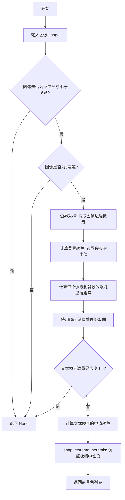
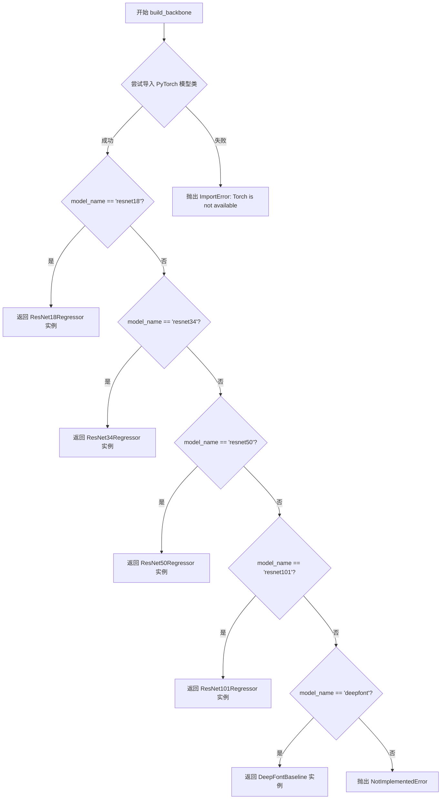
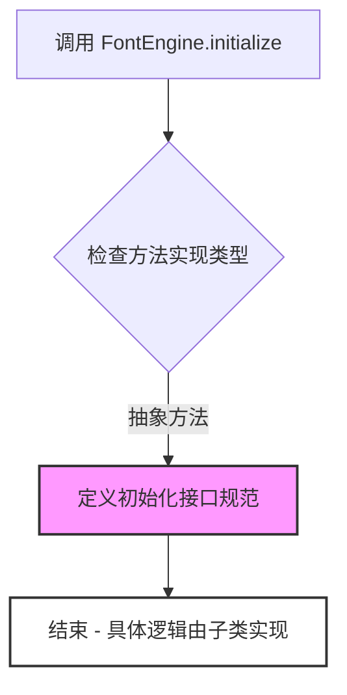
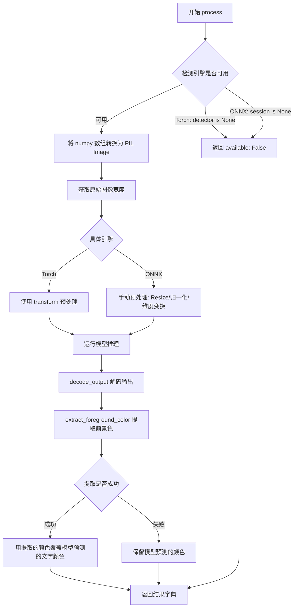
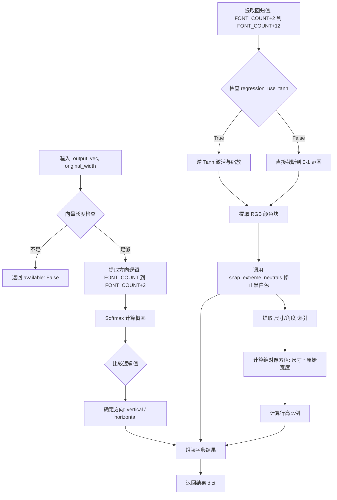
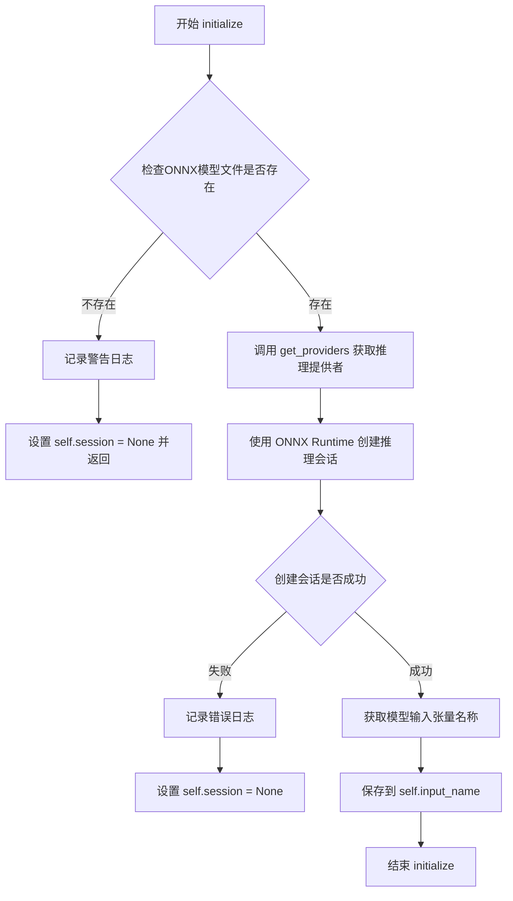
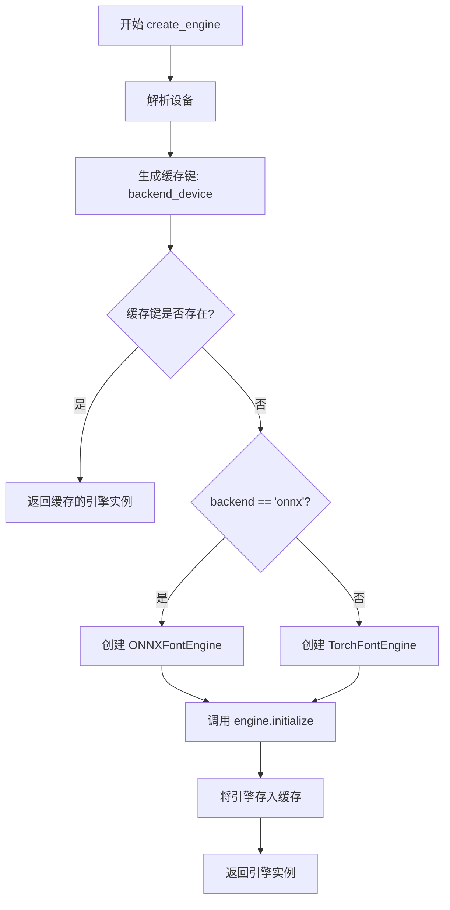

# `comic-translate\modules\detection\font\engine.py` 详细设计文档

这是一个模块化的字体检测引擎框架，支持基于PyTorch (TorchFontEngine) 和 ONNX Runtime (ONNXFontEngine) 两种后端进行图像字体属性（颜色、方向、大小、角度等）的检测，并集成了计算机视觉算法（Otsu阈值）来增强颜色提取的准确性。

## 整体流程

```mermaid
graph TD
    Start[开始] --> Factory[FontEngineFactory.create_engine]
    Factory --> CheckBackend{Backend Type?}
    CheckBackend -- 'onnx' --> CreateONNX[创建 ONNXFontEngine]
    CheckBackend -- 'torch' --> CreateTorch[创建 TorchFontEngine]
    CreateONNX --> InitONNX[Engine.initialize: 加载 ONNX 模型]
    CreateTorch --> InitTorch[Engine.initialize: 加载 PyTorch Checkpoint]
    InitONNX --> Ready[引擎就绪]
    InitTorch --> Ready
    Ready --> Process[调用 engine.process(image)]
    Process --> Preprocess[图像预处理 (Resize, ToTensor)]
    Preprocess --> Inference[模型推理]
    Inference --> Decode[decode_output: 解析向量]
    Decode --> CVExtract[extract_foreground_color: 视觉算法提取颜色]
    CVExtract --> Override[颜色覆盖: 用CV结果修正模型预测]
    Override --> ReturnResult[返回结果字典]
```

## 类结构

```
FontEngine (抽象基类)
├── TorchFontEngine (PyTorch后端实现)
└── ONNXFontEngine (ONNX Runtime后端实现)
FontEngineFactory (工厂类)
```

## 全局变量及字段


### `logger`
    
模块级日志对象，用于记录字体检测引擎的运行信息

类型：`logging.Logger`
    


### `FontEngine.settings`
    
配置参数对象，用于传递引擎运行配置

类型：`Any`
    


### `FontEngine.input_size`
    
输入图像尺寸，默认512

类型：`int`
    


### `FontEngine.regression_use_tanh`
    
回归是否使用tanh激活

类型：`bool`
    


### `TorchFontEngine.device`
    
计算设备

类型：`torch.device`
    


### `TorchFontEngine.model_name`
    
模型名称

类型：`str`
    


### `TorchFontEngine.detector`
    
PyTorch模型对象

类型：`FontDetector`
    


### `TorchFontEngine.transform`
    
图像预处理转换

类型：`transforms.Compose`
    


### `ONNXFontEngine.session`
    
ONNX推理会话

类型：`ort.InferenceSession`
    


### `ONNXFontEngine.input_name`
    
模型输入节点名称

类型：`str`
    


### `FontEngineFactory._engines`
    
引擎缓存池

类型：`dict`
    
    

## 全局函数及方法


### `extract_foreground_color`

该函数通过空间分析技术从文本边界框裁剪中提取前景（文本）颜色。它首先采集图像边缘的边界像素作为背景样本，计算每个像素到背景颜色的欧几里得距离，然后使用Otsu阈值算法在距离图上分离文本像素和背景像素，最后返回文本像素的中值颜色，并经过极端中性色调整处理。

参数：
- `image`：`np.ndarray`，输入的RGB图像数组

返回值：`list[int] | None`，提取的前景色RGB值列表，或无法提取时返回None

#### 流程图



#### 带注释源码

```python
def extract_foreground_color(image: np.ndarray) -> list[int] | None:
    """Extract the foreground (text) color from a text bounding box crop.

    Uses spatial analysis: border pixels define the background colour,
    then Otsu thresholding on the colour-distance-from-background map
    cleanly separates text from background.  The median colour of
    the text pixels is returned.

    This avoids the regression-to-the-mean problem that neural
    regressors suffer from, and correctly handles:
      - black text on white bubble
      - white text on dark/coloured bubble
      - coloured text on any background
    """
    # 检查图像是否有效：为空或尺寸为0则返回None
    if image is None or image.size == 0:
        return None

    # 获取图像高度和宽度
    h, w = image.shape[:2]
    # 图像尺寸过小（小于6x6）无法有效分析，返回None
    if h < 6 or w < 6:
        return None

    # 确保图像是3通道RGB格式，否则返回None
    if len(image.shape) != 3 or image.shape[2] < 3:
        return None

    # 丢弃Alpha通道，只保留RGB三通道
    img = image[:, :, :3]  # drop alpha if present

    # 1. 边界采样 — 收集图像边缘的一圈像素。
    #    在文本边界框中，这些像素几乎总是背景色。
    bw = max(2, min(h, w) // 8)  # 边界宽度为图像尺寸的1/8，最小为2
    top    = img[:bw, :]         # 顶部边界
    bottom = img[-bw:, :]        # 底部边界
    left   = img[bw:-bw, :bw]    # 左侧边界
    right  = img[bw:-bw, -bw:]   # 右侧边界

    # 将所有边界像素合并为一个数组并转换为float64以提高精度
    border_pixels = np.concatenate([
        top.reshape(-1, 3),
        bottom.reshape(-1, 3),
        left.reshape(-1, 3),
        right.reshape(-1, 3),
    ], axis=0).astype(np.float64)

    # 计算背景颜色：边界像素的中值
    bg = np.median(border_pixels, axis=0)

    # 2. 计算每个像素到背景颜色的欧几里得距离。
    # 将图像展平为像素列表并转换为float64
    flat = img.reshape(-1, 3).astype(np.float64)
    # 计算每个像素RGB值与背景颜色的差的平方和，然后开平方得到欧几里得距离
    dist = np.sqrt(np.sum((flat - bg) ** 2, axis=1))

    # 3. 在距离图上使用Otsu阈值算法找到"类似背景"和"类似文本"像素之间的自然边界。
    # 将距离值裁剪到0-255范围并转换为uint8以用于Otsu算法
    dist_u8 = np.clip(dist, 0, 255).astype(np.uint8)
    # 使用imkit库的Otsu阈值函数计算最佳阈值
    otsu_thresh, _ = imk.otsu_threshold(dist_u8)
    # 设置下限：即使Otsu选择了非常低的分割值，也忽略微小的噪声
    threshold = max(float(otsu_thresh), 25.0)

    # 4. 提取文本像素并计算其中值颜色。
    # 创建文本像素掩码：距离大于阈值的像素被视为文本像素
    text_mask = dist > threshold
    # 统计文本像素数量
    n_text = int(np.sum(text_mask))
    # 如果文本像素少于5个，认为提取失败，返回None
    if n_text < 5:
        return None

    # 计算文本像素的中值颜色，四舍五入后转换为整数并转为列表
    fg = np.median(flat[text_mask], axis=0).round().astype(int).tolist()
    # 调用snap_extreme_neutrals函数处理极端中性色（黑/白）
    return snap_extreme_neutrals(fg)
```


### `snap_extreme_neutrals`

该函数用于将检测到的中性色（低色度）修正为纯黑或纯白。它通过计算输入 RGB 颜色的色度（Chroma）来判断是否为中性色，若色度低于阈值（40），则根据亮度（Luma）判定为黑色或白色并返回；若色度较高，则保持原始颜色不变。这通常用于修正漫画或文档图像中检测到的文本颜色。

参数：
- `rgb`：`list[int]`，输入的 RGB 颜色列表，包含 [R, G, B] 三个整数。

返回值：`list[int]`，修正后的 RGB 颜色列表。

#### 流程图

```mermaid
graph TD
    A([开始 snap_extreme_neutrals]) --> B[输入: rgb list[int]]
    B --> C[提取 r, g, b]
    C --> D[计算亮度 Luma = 0.299r + 0.587g + 0.114b]
    C --> E[计算色度 Chroma = max(r,g,b) - min(r,g,b)]
    E --> F{色度 Chroma < 40?}
    F -- 是 --> G{亮度 Luma < 128?}
    G -- 是 --> H[返回 [0, 0, 0]]
    G -- 否 --> I[返回 [255, 255, 255]]
    F -- 否 --> J[返回原始 [r, g, b]]
```

#### 带注释源码

```python
def snap_extreme_neutrals(rgb: list[int]) -> list[int]:
    """Snap achromatic colours to pure black or white.

    Comic text is almost never intentionally grey.  If the detected
    colour is achromatic (low chroma) it is meant to be either black
    or white, so snap to whichever is closer.  Coloured text (high
    chroma) is returned unchanged.
    """
    r, g, b = int(rgb[0]), int(rgb[1]), int(rgb[2])
    # 使用标准亮度公式计算亮度
    luma = 0.299 * r + 0.587 * g + 0.114 * b
    # 计算色度：最大值与最小值之差
    chroma = max(r, g, b) - min(r, g, b)

    # 如果色度小于阈值（40），认为是中性色（灰度），进行修正
    if chroma < 40:
        # 亮度小于128视为黑色，否则视为白色
        return [0, 0, 0] if luma < 128 else [255, 255, 255]

    # 否则保持原有颜色
    return [r, g, b]
```


### `build_backbone`

该函数根据传入的模型名称字符串动态构建并返回对应的 ResNet（ResNet18/34/50/101）或 DeepFont 回归骨架模型实例，用于字体检测任务中的特征提取与回归预测。

参数：

- `model_name`：`str`，要构建的骨架模型名称，支持 "resnet18"、"resnet34"、"resnet50"、"resnet101" 和 "deepfont"
- `regression_use_tanh`：`bool`，关键字参数，指定回归输出是否使用 tanh 激活函数进行归一化（通常用于将输出映射到 [0, 1] 区间）

返回值：`Any`（具体为 ResNet18Regressor / ResNet34Regressor / ResNet50Regressor / ResNet101Regressor / DeepFontBaseline 中的一种），返回对应的 PyTorch 骨架模型实例，用于后续作为 FontDetector 的 backbone

#### 流程图



#### 带注释源码

```python
def build_backbone(model_name: str, *, regression_use_tanh: bool):
    """
    根据名称构建ResNet或DeepFont回归骨架模型。
    
    Args:
        model_name: 骨架模型名称，支持 resnet18/34/50/101 和 deepfont
        regression_use_tanh: 回归任务是否使用 tanh 激活（影响输出层配置）
    
    Returns:
        对应的 PyTorch 回归模型实例
    
    Raises:
        ImportError: 当 PyTorch 不可用时抛出
        NotImplementedError: 当传入不支持的 model_name 时抛出
    """
    # 1. 动态导入 PyTorch 模型类，若失败则说明环境未安装 torch
    try:
        from .model import ResNet18Regressor, ResNet34Regressor, \
            ResNet50Regressor, ResNet101Regressor, DeepFontBaseline
    except ImportError:
        raise ImportError("Torch is not available")
        
    # 2. 根据 model_name 匹配并实例化对应的骨架模型
    if model_name == "resnet18":
        # ResNet18 轻量级回归头，适用于资源受限场景
        return ResNet18Regressor(regression_use_tanh=regression_use_tanh)
    if model_name == "resnet34":
        # ResNet34 中等规模，在精度与速度间取得平衡
        return ResNet34Regressor(regression_use_tanh=regression_use_tanh)
    if model_name == "resnet50":
        # ResNet50 常用选择，具有较好的特征提取能力
        return ResNet50Regressor(regression_use_tanh=regression_use_tanh)
    if model_name == "resnet101":
        # ResNet101 深层网络，适合高精度要求的场景
        return ResNet101Regressor(regression_use_tanh=regression_use_tanh)
    if model_name == "deepfont":
        # DeepFont 专用基线模型，针对字体识别任务优化
        return DeepFontBaseline()
    
    # 3. 未匹配到任何已知模型，抛出异常
    raise NotImplementedError(model_name)
```


### `FontEngine.initialize`

定义字体检测引擎的抽象初始化接口。子类需重写此方法以实现具体的资源加载（如模型权重加载、推理会话创建、设备绑定等）。

参数：

-  `self`：`FontEngine`，当前引擎实例本身。
-  `device`：`Any`，指定运行设备（CPU/GPU），默认为 `None`。
-  `**kwargs`：`Any`，用于传递额外的初始化关键字参数。

返回值：`None`，无返回值。

#### 流程图



#### 带注释源码

```python
@abstractmethod
def initialize(self, device=None, **kwargs) -> None:
    """
    初始化引擎的抽象方法。
    
    Args:
        device: 计算设备，默认为 None。
        **kwargs: 额外的关键字参数。
    """
    pass
```


### `FontEngine.process`

处理输入的图像裁剪（numpy 数组格式），通过深度学习模型推理或 ONNX 推理获取字体属性，并使用计算机视觉技术提取前景色，最终返回包含字体角度、方向、颜色等属性的字典。

参数：

- `self`：隐式参数，FontEngine 实例本身
- `image`：`np.ndarray`，图像数据，形状为 (H, W, C) 的 RGB 格式 numpy 数组

返回值：`dict`，包含以下键值的字典：
- `available`：`bool`，表示是否成功检测到字体属性
- `direction`：`str`，文字方向（"horizontal" 或 "vertical"）
- `direction_probs`：`list`，方向概率分布
- `text_color`：`list`，文字颜色 RGB 值
- `stroke_color`：`list`，描边颜色 RGB 值
- `font_size_px`：`float`，字体大小（像素）
- `stroke_width_px`：`float`，描边宽度（像素）
- `line_height`：`float`，行高比例
- `angle`：`float`，文字角度（度）

#### 流程图



#### 带注释源码

```python
@abstractmethod
def process(self, image: np.ndarray) -> dict:
    """
    Process an image crop and return font attributes.
    Args:
        image: numpy array (H, W, C) RGB
    Returns:
        dict with keys: angle, direction, text_color, etc.
    """
    pass

# --------------------------------------------
# TorchFontEngine 实现
# --------------------------------------------
def process(self, image: np.ndarray) -> dict:
    """使用 PyTorch 模型处理图像"""
    # 检查模型是否成功加载
    if self.detector is None:
        return {"available": False}

    import torch

    try:
        # 1. 将 numpy 数组 (H, W, C) 转换为 PIL Image 并转为 RGB 模式
        pil_image = Image.fromarray(image).convert("RGB")
        
        # 2. 保存原始宽度用于后续尺寸还原
        original_width = pil_image.width
        
        # 3. 使用 torchvision transforms 进行预处理
        #    - Resize 到 (512, 512)
        #    - 转换为 Tensor 并归一化到 [0, 1]
        x = self.transform(pil_image).unsqueeze(0).to(self.device)
        
        # 4. 模型推理 (eval 模式下不需要梯度)
        with torch.no_grad():
            # out shape: (N,) 包含分类 logits 和回归值
            out = self.detector(x)[0].float().cpu().numpy()
            
        # 5. 解码模型输出为易读的字典格式
        result = self.decode_output(out, original_width)

        # 6. 使用计算机视觉方法提取前景色（文字颜色）
        #    这比神经网络回归的颜色更准确
        cv_color = extract_foreground_color(image)
        if cv_color is not None:
            # 用 CV 提取的颜色覆盖模型预测的颜色
            result["text_color"] = cv_color

        return result
        
    except Exception as e:
        logger.error(f"Error in font detection (Torch): {e}")
        return {"available": False}

# --------------------------------------------
# ONNXFontEngine 实现
# --------------------------------------------
def process(self, image: np.ndarray) -> dict:
    """使用 ONNX Runtime 模型处理图像"""
    # 检查 ONNX session 是否成功加载
    if self.session is None:
        return {"available": False}

    try:
        # 1. 将 numpy 数组转换为 PIL Image 并转为 RGB
        pil_image = Image.fromarray(image).convert("RGB")
        original_width = pil_image.width
        
        # 2. 手动预处理 (替代 torchvision transforms)
        #    a. Resize 到模型输入尺寸 (512x512)
        img = pil_image.resize((self.input_size, self.input_size), Image.BILINEAR)
        
        #    b. 归一化: 像素值从 [0, 255] 映射到 [0, 1]
        img_data = np.array(img).astype(np.float32) / 255.0
        
        #    c. 通道变换: HWC (H, W, C) -> CHW (C, H, W)
        img_data = img_data.transpose(2, 0, 1)
        
        #    d. 添加批次维度: (C, H, W) -> (1, C, H, W)
        img_data = np.expand_dims(img_data, axis=0)
        
        # 3. 运行 ONNX 推理
        outputs = self.session.run(None, {self.input_name: img_data})
        
        # 4. 提取第一个批次的结果
        out = outputs[0][0]  # shape: (N,)
        
        # 5. 解码输出
        result = self.decode_output(out, original_width)

        # 6. 同样使用 CV 方法提取前景色
        cv_color = extract_foreground_color(image)
        if cv_color is not None:
            result["text_color"] = cv_color

        return result
            
    except Exception as e:
        logger.error(f"Error in font detection (ONNX): {e}")
        return {"available": False}
```


### `FontEngine.decode_output`

该方法负责将神经网络（无论是 Torch 还是 ONNX）输出的原始向量（Raw Output Vector）转换为具体的、可供应用层使用的字体属性（如方向、颜色、尺寸、角度等）。它主要完成从数值向量到语义实体的解码工作，并处理模型输出的归一化与后处理。

参数：

- `self`：隐式参数，当前 `FontEngine` 实例的上下文。
- `output_vec`：`np.ndarray`，模型输出的原始向量，通常包含分类逻辑（Font Count）和回归逻辑（回归值），形状为 (N,)。
- `original_width`：`int`，原始输入图像的宽度（像素），用于将归一化的模型输出（0.0-1.0）反解为绝对像素值（如字体大小、边框宽度）。

返回值：`dict`，包含以下键值对：
- `available` (bool): 输出向量是否有效。
- `direction` (str): 文字方向 ("horizontal" 或 "vertical")。
- `direction_probs` (list): 方向预测的概率分布。
- `text_color` (list): 文字颜色的 RGB 值。
- `stroke_color` (list): 边框/描边颜色的 RGB 值。
- `font_size_px` (float): 估算的字体大小（像素）。
- `stroke_width_px` (float): 估算的描边宽度（像素）。
- `line_height` (float): 估算的行高比例。
- `angle` (float): 文字倾斜角度（度）。

#### 流程图



#### 带注释源码

```python
def decode_output(self, output_vec: np.ndarray, original_width: int) -> dict:
    """
    解码检测器输出的非字体属性（方向、颜色、尺寸等）。
    :param output_vec: 模型输出的原始 numpy 数组
    :param original_width: 原始输入图像宽度，用于反归一化
    """
    
    # 1. 基础检查：计算解码所需的最少向量长度
    # FONT_COUNT 通常指分类的字体种类数量，后面跟的是回归任务的12个数值
    needed = config.FONT_COUNT + 12
    
    # 如果向量维度不够，返回不可用状态
    if output_vec.size < needed:
        return {"available": False}

    # ---------------------------------------------------------
    # 2. 方向 (Direction) 解码
    # ---------------------------------------------------------
    # 提取方向分类的 Logits (2个值：水平/垂直)
    direction_logits = output_vec[config.FONT_COUNT : config.FONT_COUNT + 2]
    
    # 简单的 argmax 判断方向
    direction = "vertical" if direction_logits[1] > direction_logits[0] else "horizontal"
    
    # 计算 Softmax 概率，以便了解模型的置信度
    exp_logits = np.exp(direction_logits - np.max(direction_logits))
    direction_probs = exp_logits / exp_logits.sum()

    # ---------------------------------------------------------
    # 3. 回归值 (Regression) 提取与归一化
    # ---------------------------------------------------------
    # 提取回归部分的向量 (10个 float 值)
    # 排列: [TextR, TextG, TextB, FontSize, StrokeWidth, StrokeR, StrokeG, StrokeB, LineSpacing, Angle]
    reg = output_vec[config.FONT_COUNT + 2 : config.FONT_COUNT + 12]

    # 如果模型使用了 Tanh 激活（输出范围 -1~1），则需要先映射回 0~1
    if self.regression_use_tanh:
        # (val + 1.0) * 0.5 是 Tanh 逆变换的近似或对应训练时的预处理
        reg = (reg + 1.0) * 0.5

    # 强制截断到 [0.0, 1.0] 区间，防止异常值
    reg = np.clip(reg, 0.0, 1.0)

    # ---------------------------------------------------------
    # 4. 颜色处理 (Color Processing)
    # ---------------------------------------------------------
    def _rgb(start: int):
        """辅助函数：从回归向量中提取3个连续值作为RGB，并转换到 0-255 整数范围"""
        return (reg[start : start + 3] * 255.0).round().astype(int).tolist()

    # 提取文字颜色 (索引 0,1,2) 并进行极端中性色修正（snap to black/white）
    text_color = snap_extreme_neutrals(_rgb(0))
    
    # 提取描边颜色 (索引 5,6,7)
    stroke_color = snap_extreme_neutrals(_rgb(5))

    # ---------------------------------------------------------
    # 5. 尺寸与几何属性计算
    # ---------------------------------------------------------
    # 字体大小 (索引 3) -> 乘以原图宽度得到绝对像素值
    font_size_px = float(reg[3] * original_width)
    
    # 描边宽度 (索引 4) -> 乘以原图宽度
    stroke_width_px = float(reg[4] * original_width)
    
    # 行间距 (索引 8) -> 乘以原图宽度
    line_spacing_px = float(reg[8] * original_width)
    
    # 计算相对行高 (Line Height)
    # 公式: 1.0 + (行间距 / 字体大小). 如果字体大小为0，默认为 1.2
    line_height = 1.0 + (line_spacing_px / font_size_px) if font_size_px > 0 else 1.2

    # 角度 (索引 9) -> 假设模型输出归一化到 0-1，对应 -90 到 90 度
    angle_deg = float((reg[9] - 0.5) * 180.0)

    # ---------------------------------------------------------
    # 6. 返回结果封装
    # ---------------------------------------------------------
    return {
        "available": True,
        "direction": direction,
        "direction_probs": direction_probs.tolist(),
        "text_color": text_color,
        "stroke_color": stroke_color,
        "font_size_px": font_size_px,
        "stroke_width_px": stroke_width_px,
        "line_height": line_height,
        "angle": angle_deg, # 统一命名
    }
```


### `TorchFontEngine.initialize`

该方法负责初始化基于 PyTorch 的字体检测引擎。它尝试导入必要的深度学习库（PyTorch, TorchVision），构建基于 ResNet 的骨干网络，加载预训练的检查点（Checkpoint），并将模型移至指定的计算设备（CPU/GPU），同时配置图像预处理转换器。

参数：

- `device`：`str | None`，指定模型运行的目标设备（如 'cuda:0' 或 'cpu'），默认为 None。
- `**kwargs`：`Any`，接收额外的关键字参数，用于未来扩展或传递给底层模型。

返回值：`None`，该方法无返回值，通过修改对象内部状态（`self.detector`, `self.transform`, `self.device`）来完成初始化。

#### 流程图

```mermaid
flowchart TD
    A[开始初始化] --> B{尝试导入 torch, torchvision, FontDetector}
    B -- 失败 --> C[记录警告: Torch 不可用]
    C --> D[设置 self.detector = None]
    D --> Z[结束]
    
    B -- 成功 --> E[确定 device 设备]
    E --> F{检查检查点文件是否存在}
    F -- 文件缺失 --> G[记录警告: 文件未找到]
    G --> D
    
    F -- 文件存在 --> H[构建骨干网络模型 build_backbone]
    H --> I[实例化 FontDetector 封装模型]
    
    I --> J{尝试加载 .ckpt 文件}
    J -- 加载失败 --> K[记录错误: 加载失败]
    K --> L[设置 self.detector = None]
    L --> Z
    
    J -- 加载成功 --> M[处理 state_dict 键 (去除 _orig_mod)]
    M --> N[加载权重到模型]
    N --> O[模型移至 device 并设置为 eval 模式]
    O --> P[初始化图像预处理 transform]
    P --> Z
```

#### 带注释源码

```python
def initialize(self, device=None, **kwargs) -> None:
    """
    初始化 PyTorch 字体检测模型。
    包含依赖检查、模型构建、权重加载和设备配置。
    """
    # 1. 依赖检查：确保 PyTorch 环境可用
    try:
        import torch
        from torchvision import transforms
        from .model import FontDetector
    except ImportError:
        logger.warning("Warning: Torch not available, cannot initialize TorchFontEngine")
        self.detector = None
        return

    # 2. 设备配置：解析传入的设备参数
    self.device = torch.device(device)   
    self.model_name = "resnet50"
    
    # 3. 资源定位：获取模型检查点文件路径
    ckpt_path = ModelDownloader.get_file_path(ModelID.FONT_DETECTOR_TORCH, 'font-detector.ckpt')
        
    # 4. 前置条件检查：验证模型文件是否存在
    if not os.path.exists(ckpt_path):
        logger.warning(f"Warning: Font detection checkpoint not found at {ckpt_path}")
        self.detector = None
        return

    # 5. 模型构建：实例化 ResNet 骨干网络
    # regression_use_tanh 决定了回归层是否使用 tanh 激活
    model = build_backbone(self.model_name, regression_use_tanh=self.regression_use_tanh)
    
    # 6. 模型封装：构建完整的检测器（包括损失函数和优化器配置，虽然此处为推理模式）
    self.detector = FontDetector(
        model=model,
        lambda_font=1,
        lambda_direction=1,
        lambda_regression=1,
        font_classification_only=False,
        lr=1,
        betas=(1, 1),
        num_warmup_iters=1,
        num_iters=1e9,
        num_epochs=1e9,
    )

    # 7. 权重加载：核心逻辑
    try:
        # 加载检查点对象
        ckpt_obj = torch.load(ckpt_path, map_location=self.device, weights_only=False)
        # 兼容不同的检查点格式（有 state_dict 键或直接是 state）
        state = ckpt_obj["state_dict"] if "state_dict" in ckpt_obj else ckpt_obj
        
        # 8. 键名修正：处理 TorchScript 导出时产生的前缀 (_orig_mod)
        fixed_state = {}
        for k, v in state.items():
            parts = [p for p in k.split(".") if p != "_orig_mod"]
            fixed_state[".".join(parts)] = v
        
        # 加载权重并移至设备
        self.detector.load_state_dict(fixed_state, strict=True)
        self.detector = self.detector.to(self.device)
        self.detector.eval() # 设置为推理模式，禁用 Dropout 和 BatchNorm 更新
        
        # 9. 预处理配置：定义图像变换流程
        self.transform = transforms.Compose([
            transforms.Resize((self.input_size, self.input_size)),
            transforms.ToTensor(),
        ])
        
    except Exception as e:
        logger.error(f"Error loading font detector: {e}")
        self.detector = None
```


### `TorchFontEngine.process`

该方法是 `TorchFontEngine` 的核心推理入口。它接收图像数据，首先验证模型是否已加载，随后将图像转换为 PyTorch 张量并送入神经网络进行前向传播。推理结果（原始向量）被解码为可读的字体验证属性（如方向、尺寸、角度等），最后通过经典的计算机视觉算法（Otsu 阈值分割）提取前景色，以修正神经网络在颜色回归上的偏差，从而提高颜色识别的准确性。

参数：

-  `image`：`np.ndarray`，输入的 RGB 图像数据，形状为 (H, W, C)，通常为字体的裁剪区域。

返回值：`dict`，包含检测到的字体属性字典。返回字段包括 `available`（模型是否可用）、`direction`（文字方向）、`text_color`（文字颜色）、`font_size_px`（字体大小）、`stroke_width_px`（描边宽度）、`angle`（倾斜角度）等。如果模型未初始化或推理失败，返回 `{"available": False}`。

#### 流程图

```mermaid
flowchart TD
    A([Start process]) --> B{self.detector is None?}
    B -- Yes --> C[Return {'available': False}]
    B -- No --> D[Convert image to PIL RGB]
    D --> E[Transform & Add Batch]
    E --> F[Move to Device]
    F --> G[Run Inference (torch.no_grad)]
    G --> H[Decode Output to Dict]
    H --> I[Extract Color via CV]
    I --> J{Color Extracted?}
    J -- Yes --> K[Override text_color with CV Result]
    J -- No --> L[Keep Model Color]
    K --> M[Return Result]
    L --> M
    G --> N[Exception Handler]
    N --> O[Log Error]
    O --> C
```

#### 带注释源码

```python
def process(self, image: np.ndarray) -> dict:
    """Process an image crop and return font attributes.
    
    Args:
        image: numpy array (H, W, C) RGB
        
    Returns:
        dict with keys: angle, direction, text_color, etc.
    """
    # 1. 检查模型是否成功加载，若未加载直接返回不可用状态
    if self.detector is None:
        return {"available": False}

    import torch

    try:
        # 2. 数据预处理：将 NumPy 数组转换为 PIL Image 并转为 RGB 模式
        pil_image = Image.fromarray(image).convert("RGB")
        # 记录原始宽度，用于后续将归一化的回归值反解为像素值
        original_width = pil_image.width
        
        # 3. 图像变换：Resize、ToTensor、Device Transfer
        #    transform 在 initialize 中定义为 Compose
        x = self.transform(pil_image).unsqueeze(0).to(self.device)
        
        # 4. 执行推理：使用 no_grad 上下文以节省显存并加速
        with torch.no_grad():
            # model output: (1, N) -> [0] 取第一个 batch 的结果
            # .float() 确保精度 .cpu() 移回 CPU .numpy() 转为 numpy array
            out = self.detector(x)[0].float().cpu().numpy()
            
        # 5. 解码输出：将原始向量解码为具体的物理属性（方向、颜色、尺寸等）
        result = self.decode_output(out, original_width)

        # 6. 颜色修正：使用计算机视觉算法提取真实前景色
        #    神经网络倾向于回归“平均色”，此处使用 Otsu 阈值法进行修正
        cv_color = extract_foreground_color(image)
        if cv_color is not None:
            result["text_color"] = cv_color

        return result
        
    except Exception as e:
        # 7. 异常处理：记录错误日志并返回失败状态
        logger.error(f"Error in font detection (Torch): {e}")
        return {"available": False}
```


### `ONNXFontEngine.initialize`

加载ONNX字体检测模型，初始化ONNX Runtime推理会话，为后续图像处理提供模型支持。

参数：

- `self`：隐式参数，ONNXFontEngine实例本身
- `device`：`str | None`，指定运行设备（如 'cpu', 'cuda' 等），传递给 providers 解析
- `**kwargs`：关键字参数，用于未来扩展，当前未使用

返回值：`None`，该方法无返回值，通过设置实例属性 `self.session` 来表示初始化状态

#### 流程图



#### 带注释源码

```python
def initialize(self, device=None, **kwargs) -> None:
    """
    初始化ONNX字体检测模型。
    
    尝试从ModelDownloader获取ONNX模型文件路径，检查文件是否存在，
    然后使用ONNX Runtime创建推理会话。如果加载失败，将self.session
    设置为None以表示引擎不可用。
    
    Args:
        device: 运行设备标识符，会被传递给get_providers()解析为
                ONNX Runtime支持的providers列表（如CPUExecutionProvider,
                CUDAExecutionProvider等）
        **kwargs: 保留参数，用于未来扩展
    
    Returns:
        None: 无直接返回值，通过self.session属性反映初始化状态
    """
    # 步骤1: 获取ONNX模型文件路径
    model_path = ModelDownloader.get_file_path(ModelID.FONT_DETECTOR_ONNX, 'font-detector.onnx')
    
    # 步骤2: 检查模型文件是否存在
    if not os.path.exists(model_path):
        # 文件不存在，记录警告并标记引擎未初始化
        logger.warning(f"Warning: Font detection ONNX model not found at {model_path}")
        self.session = None
        return

    # 步骤3: 尝试加载ONNX模型
    try:
        # 根据设备获取ONNX Runtime的providers列表
        # get_providers() 会根据device参数返回合适的执行提供者
        providers = get_providers(device)            
        
        # 创建ONNX Runtime推理会话
        # InferenceSession 加载模型并配置providers
        self.session = ort.InferenceSession(model_path, providers=providers)
        
        # 获取模型的输入张量名称
        # 后续推理时需要用这个名称来提供输入数据
        self.input_name = self.session.get_inputs()[0].name
        
    except Exception as e:
        # 加载失败，记录错误并标记引擎未初始化
        logger.error(f"Error loading ONNX font detector: {e}")
        self.session = None
```


### `ONNXFontEngine.process`

执行ONNX推理流程，接收图像数组，进行预处理、ONNX模型推理、输出解码，并使用计算机视觉技术提取前景色，最终返回字体属性字典。

参数：

- `image`：`np.ndarray`，输入的图像数据，形状为 (H, W, C) 的 RGB 图像数组

返回值：`dict`，包含字体检测结果的字典，键值包括 `available`（是否可用）、`direction`（文本方向）、`text_color`（文本颜色）、`font_size_px`（字体大小）、`stroke_width_px`（描边宽度）、`stroke_color`（描边颜色）、`line_height`（行高）、`angle`（角度）等属性

#### 流程图

```mermaid
flowchart TD
    A[开始 process] --> B{session 是否为 None}
    B -->|是| C[返回 {'available': False}]
    B -->|否| D[将 numpy 数组转为 PIL Image]
    D --> E[获取原始宽度 original_width]
    E --> F[图像预处理: 缩放、归一化、转置、扩展维度]
    F --> G[调用 ONNX session.run 执行推理]
    G --> H[获取输出 out]
    H --> I[调用 decode_output 解码输出]
    I --> J[调用 extract_foreground_color 提取前景色]
    J --> K{前景色是否有效}
    K -->|是| L[用提取的前景色覆盖 text_color]
    K -->|否| M[保持模型预测的 text_color]
    L --> N[返回结果字典]
    M --> N
    C --> N
```

#### 带注释源码

```python
def process(self, image: np.ndarray) -> dict:
    """
    处理图像并返回字体属性。
    
    Args:
        image: numpy array (H, W, C) RGB
        
    Returns:
        dict with keys: angle, direction, text_color, etc.
    """
    # 检查 ONNX session 是否已正确初始化
    if self.session is None:
        return {"available": False}

    try:
        # 将 numpy 数组格式的图像转换为 PIL Image 对象并转为 RGB 模式
        pil_image = Image.fromarray(image).convert("RGB")
        # 保存原始图像宽度，用于后续属性值的尺度变换
        original_width = pil_image.width
        
        # ---------- 图像预处理 ----------
        # 1. 调整图像大小为模型输入尺寸 (512x512)
        img = pil_image.resize((self.input_size, self.input_size), Image.BILINEAR)
        # 2. 转换为 numpy 数组并归一化到 [0, 1] 范围 (float32)
        img_data = np.array(img).astype(np.float32) / 255.0
        # 3. 转换维度顺序: HWC (高x宽x通道) -> CHW (通道x高x宽)
        img_data = img_data.transpose(2, 0, 1)
        # 4. 添加批次维度: (C, H, W) -> (1, C, H, W)
        img_data = np.expand_dims(img_data, axis=0)
        
        # ---------- ONNX 推理 ----------
        # 执行 ONNX 模型推理，输入为预处理后的图像数据
        outputs = self.session.run(None, {self.input_name: img_data})
        # 获取第一个批次的结果 (batch_size=1)
        out = outputs[0][0]
        
        # ---------- 输出解码 ----------
        # 将模型原始输出解码为可读的字体属性字典
        result = self.decode_output(out, original_width)

        # ---------- 颜色校正 ----------
        # 使用计算机视觉方法 (Otsu阈值) 独立提取前景色
        # 这可以纠正神经网络回归器可能产生的色彩偏差
        cv_color = extract_foreground_color(image)
        if cv_color is not None:
            # 用更准确的颜色覆盖模型预测的文本颜色
            result["text_color"] = cv_color

        return result
        
    except Exception as e:
        # 记录推理过程中的错误并返回不可用状态
        logger.error(f"Error in font detection (ONNX): {e}")
        return {"available": False}
```


### `FontEngineFactory.create_engine`

创建或获取缓存的字体检测引擎实例，根据后端类型（ONNX或Torch）初始化相应的引擎，并使用设备解析逻辑进行缓存管理。

参数：

- `settings`：配置对象，包含设备设置等信息，用于判断是否启用GPU。如果为 None，则默认视为不使用 GPU。
- `backend`：字符串，指定使用的后端类型，默认为 `'onnx'`。可选值包括 `'onnx'` 或其他后端（如 `'torch'`）。

返回值：`FontEngine`，返回初始化好的字体检测引擎实例。如果缓存中已存在对应后端和设备的引擎，则直接返回缓存实例。

#### 流程图



#### 带注释源码

```python
@classmethod
def create_engine(cls, settings, backend='onnx') -> FontEngine:
    """
    创建或获取缓存的字体检测引擎实例。
    
    参数:
        settings: 配置对象，用于获取GPU启用状态。如果为None，则默认不使用GPU。
        backend: 字符串，指定后端类型，默认为 'onnx'。
    
    返回值:
        FontEngine: 初始化好的引擎实例。
    """
    
    # 1. 根据settings和backend解析合适的设备（CPU/GPU）
    #    resolve_device 内部会处理 ONNX 的 providers 和 Torch 的 device
    device = resolve_device(settings.is_gpu_enabled() if settings else True, backend)
    
    # 2. 构建缓存键，格式为 "backend_device"，例如 "onnx_cuda"
    cache_key = f"{backend}_{device}"
    
    # 3. 检查缓存中是否已存在该后端+设备组合的引擎
    if cache_key in cls._engines:
        # 缓存命中，直接返回已有的引擎实例，避免重复初始化
        return cls._engines[cache_key]
        
    # 4. 缓存未命中，根据backend创建对应的引擎实现
    if backend == 'onnx':
        engine = ONNXFontEngine(settings)
    else:
        # 默认使用Torch后端
        engine = TorchFontEngine(settings)
        
    # 5. 初始化引擎，传入解析好的设备
    engine.initialize(device=device)
    
    # 6. 将新创建的引擎存入缓存，以便后续复用
    cls._engines[cache_key] = engine
    
    # 7. 返回初始化好的引擎
    return engine
```

## 关键组件


### 字体检测核心引擎

该模块实现了一个支持PyTorch和ONNX两种后端的字体属性检测系统，能够从图像中提取文字的颜色、大小、stroke宽度、行间距、角度和方向等属性，并使用计算机视觉技术（Otsu阈值）辅助提取文本前景色。

### 前景色提取模块

实现`extract_foreground_color`函数，通过边界像素采样获取背景色，计算每个像素到背景的欧氏距离，使用Otsu阈值分割文本与背景区域，最后返回文本像素的中值颜色。解决神经回归器常见的均值回归问题。

### 中性色校正模块

实现`snap_extreme_neutrals`函数，根据色度（chroma）判断颜色是否为中性色，若是则根据亮度（luma）将颜色 snap 到纯黑或纯白，适用于漫画文本中几乎不存在刻意灰色的情况。

### 骨干网络构建器

实现`build_backbone`函数，根据model_name动态创建ResNet18/34/50/101或DeepFont回归模型，支持配置regression_use_tanh参数，用于将回归输出映射到tanh范围。

### 字体引擎抽象基类

定义`FontEngine`抽象基类，封装通用逻辑：`input_size`设置为512，`decode_output`方法解析模型输出向量，提取direction、text_color、stroke_color、font_size_px、stroke_width_px、line_height和angle等属性。

### PyTorch后端引擎

实现`TorchFontEngine`类，继承自FontEngine。使用torch加载ResNet50骨干网络配合FontDetector，通过ModelDownloader获取checkpoint，初始化transforms管道。在`process`方法中执行推理并使用CV方法覆盖模型预测的颜色。

### ONNX后端引擎

实现`ONNXFontEngine`类，继承自FontEngine。使用onnxruntime加载ONNX模型，通过ModelDownloader获取模型文件，手动执行图像预处理（resize、归一化、CHW转换）。与TorchFontEngine共享`decode_output`和颜色提取逻辑。

### 引擎工厂类

实现`FontEngineFactory`类，使用类变量`_engines`缓存已创建的引擎实例。根据backend和device生成cache_key，实现引擎的惰性加载和单例复用，避免重复初始化。

## 问题及建议


### 已知问题

-   **硬编码的模型名称**：`TorchFontEngine` 类中将 `self.model_name` 硬编码为 `"resnet50"`，但在 `build_backbone` 调用时使用的是这个硬编码值，而不是从设置或参数中动态获取，导致模型选择缺乏灵活性。
-   **重复的图像预处理逻辑**：`TorchFontEngine` 和 `ONNXFontEngine` 中的图像预处理代码（转换为 PIL Image、Resize、归一化）存在重复，未抽象到基类或工具函数中。
-   **魔法数字缺乏文档**：`decode_output` 方法中使用的 `config.FONT_COUNT + 12`、`config.FONT_COUNT + 2` 等索引值缺乏明确注释，不清楚这些数字的具体含义和来源。
- **全局状态修改**：`FontEngine.__init__` 中直接修改 `config.INPUT_SIZE = self.input_size`，这种全局状态修改可能导致并发问题和难以追踪的副作用。
- **缓存键设计不完整**：`FontEngineFactory` 的缓存键只包含 `backend` 和 `device`，但实际引擎初始化还依赖 `settings` 对象，缓存可能返回不合适的引擎实例。
- **异常捕获过于宽泛**：`process` 方法中使用 `except Exception as e` 捕获所有异常并返回 `{"available": False}`，掩盖了具体错误信息，不利于调试和问题诊断。
- **未使用的导入**：`TorchFontEngine.initialize` 中导入了 `transforms`，但实际只使用了 `transforms.Compose`，存在冗余。

### 优化建议

-   将模型名称作为参数或配置项提取，允许通过 settings 或构造函数参数指定；将图像预处理逻辑抽象到基类或单独的预处理器类中，减少重复代码；为索引常量定义具名常量或枚举，提高代码可读性；避免直接修改全局配置，考虑通过依赖注入或上下文传递配置；完善缓存键设计，确保包含所有影响引擎行为的因素；改进异常处理，区分可恢复和不可恢复错误，保留有意义的错误日志；清理未使用的导入，保持代码整洁。

## 其它


### 设计目标与约束

该模块的核心设计目标是提供一个跨平台的字体属性检测引擎，能够从图像中准确提取字体颜色、方向、角度、大小等属性。设计约束包括：1）必须支持CPU和GPU推理；2）ONNX后端为主要推荐方案以确保部署灵活性；3）Torch后端作为备选方案用于研究与开发；4）输入图像尺寸固定为512x512；5）字体颜色提取采用CV方法而非纯深度学习，以避免回归到均值的问题。

### 错误处理与异常设计

错误处理采用分层策略：1）引擎初始化失败时记录警告日志并设置detector/session为None，后续process调用直接返回{"available": False}；2）模型加载异常捕获包括文件不存在、模型格式错误、权重不匹配等多种情况；3）推理过程中的异常（如图像格式错误、维度不匹配）也被捕获并返回错误状态；4）extract_foreground_color函数对输入进行严格校验（None检查、空数组检查、尺寸检查、通道数检查），任何不符合条件的输入直接返回None；5）全局异常处理通过logger记录详细错误信息，便于问题追踪。

### 数据流与状态机

数据流主要分为三条路径：1）图像输入路径：numpy数组(PIL Image) → Resize/ToTensor → 模型输入；2）模型输出路径：原始输出向量 → decode_output解码 → 颜色/方向/角度等属性；3）颜色校正路径：decode_output产生的回归颜色 → extract_foreground_color的CV结果覆盖。状态机方面：FontEngine初始化状态包括UNINITIALIZED、INITIALIZING、READY、ERROR四种；每个engine实例在首次创建后保持READY状态，除非发生运行时错误；工厂类使用缓存机制，同一device+backend组合复用同一engine实例。

### 外部依赖与接口契约

核心依赖包括：1）深度学习框架：torch（TorchFontEngine）或onnxruntime（ONNXFontEngine）；2）图像处理：PIL、numpy；3）工具库：imkit（提供otsu_threshold函数）、modules.utils.device（设备解析）、modules.utils.download（模型下载）；4）配置文件：modules.config模块（INPUT_SIZE、FONT_COUNT等常量）。接口契约方面：FontEngine.initialize(device, **kwargs)必须在首次调用process之前执行；process方法接受HWC格式的RGB numpy数组，返回包含available键的字典；extract_foreground_color接受任意尺寸的numpy数组，返回RGB列表或None。

### 配置信息

关键配置项存储在config模块：1）INPUT_SIZE = 512：模型输入尺寸；2）FONT_COUNT：字体类别数量；3）ModelID枚举定义了两个模型标识：FONT_DETECTOR_TORCH和FONT_DETECTOR_ONNX；4）ModelDownloader.get_file_path根据ModelID获取模型文件路径；5）resolve_device和get_providers用于设备解析和推理提供者选择；6）回归模型默认不使用tanh激活（regression_use_tanh=False），可在build_backbone时通过参数覆盖。

### 性能考虑与优化空间

当前实现的主要性能特征：1）ONNX后端通过batch维度为1的单次推理实现低延迟；2）Torch后端需先将图像转为Tensor并移动到指定设备，首次推理有GPU内存分配开销；3）extract_foreground_color的Otsu阈值计算对大图像可能较慢，但实际处理的是文本 bounding box crop，尺寸通常较小。优化方向包括：1）engine缓存策略可增加LRU淘汰机制防止内存无限增长；2）可预计算background颜色而无需每次调用都进行border采样；3）ONNX session可配置graph优化选项；4）多线程/批处理支持可提升吞吐量；5）extract_foreground_color可考虑使用Numba加速。

### 安全性考虑

当前版本未包含输入验证和恶意输入防护，存在以下安全风险：1）过大的图像输入可能导致内存溢出；2）特制的畸形图像可能触发深度学习模型的对抗性攻击；3）模型文件路径未做路径遍历检查。改进建议：1）在process方法中添加图像尺寸上限检查（如不超过4096x4096）；2）对异常输入返回安全默认值而非抛出异常；3）模型文件路径应从可信配置源加载而非用户可控路径。

### 测试策略建议

建议补充的测试覆盖：1）单元测试：extract_foreground_color的各种边界情况（全黑、全白、彩色背景、灰度图等）；decode_output的数值正确性验证；snap_extreme_neutrals的颜色捕捉逻辑。2）集成测试：完整流程测试（图像输入到结果输出）；Torch与ONNX后端结果一致性测试；不同设备（CPU/CUDA）的兼容性测试。3）性能基准：推理延迟测试；内存占用测试；大批量处理吞吐量测试。

### 部署注意事项

部署时需注意：1）模型文件必须预先下载到指定路径，否则engine初始化失败但不影响程序继续运行；2）ONNX后端依赖onnxruntime-gpu或onnxruntime需根据设备类型选择；3）imkit库需要正确安装并提供otsu_threshold函数；4）生产环境建议使用ONNX后端以获得更好的可移植性和推理性能；5）设备选择逻辑resolve_device需要正确配置CUDA_VISIBLE_DEVICES环境变量；6）日志级别应配置为INFO或WARNING以避免过多调试输出。

    