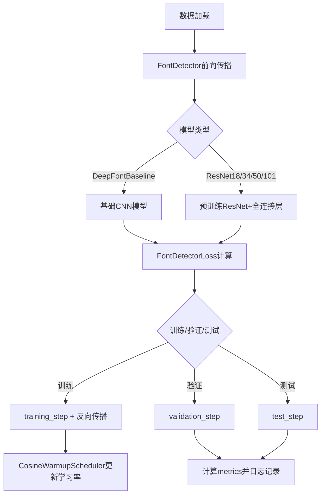
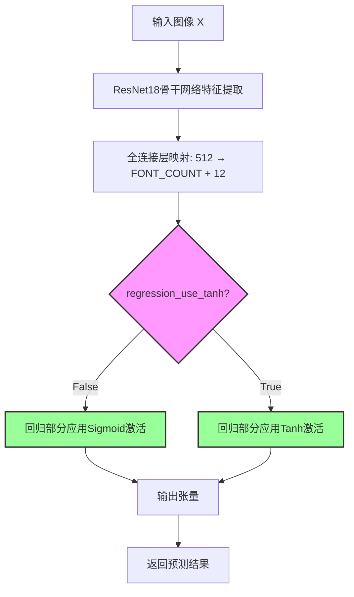
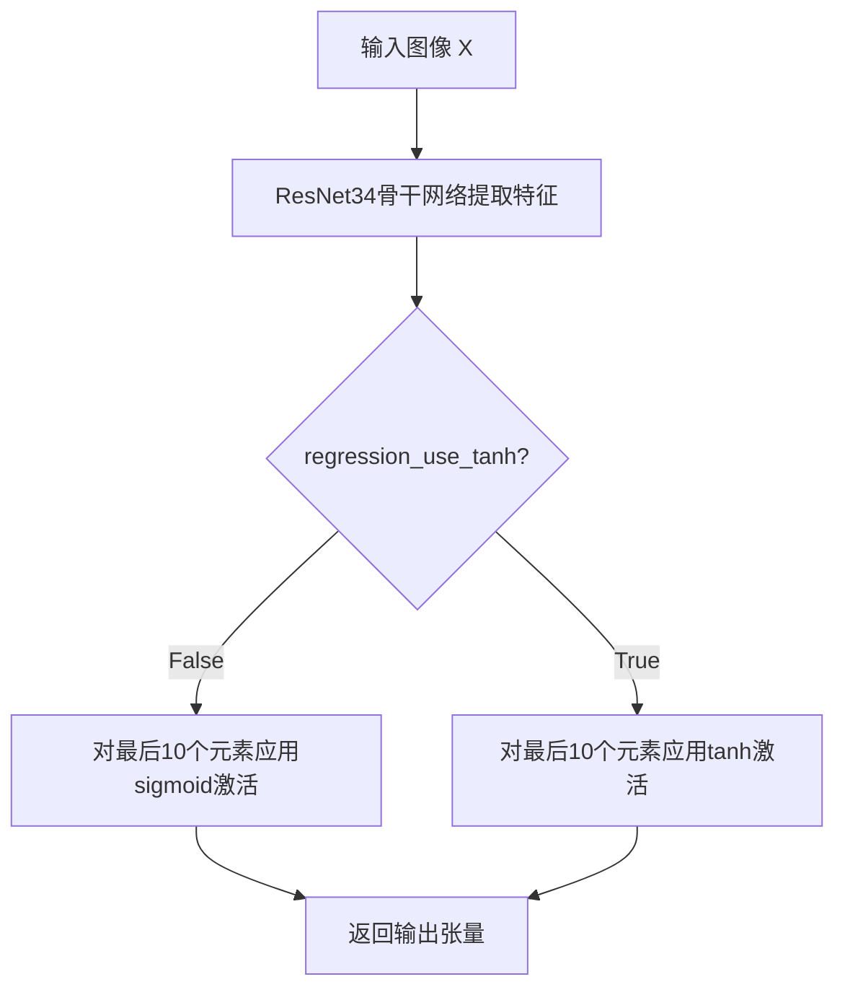
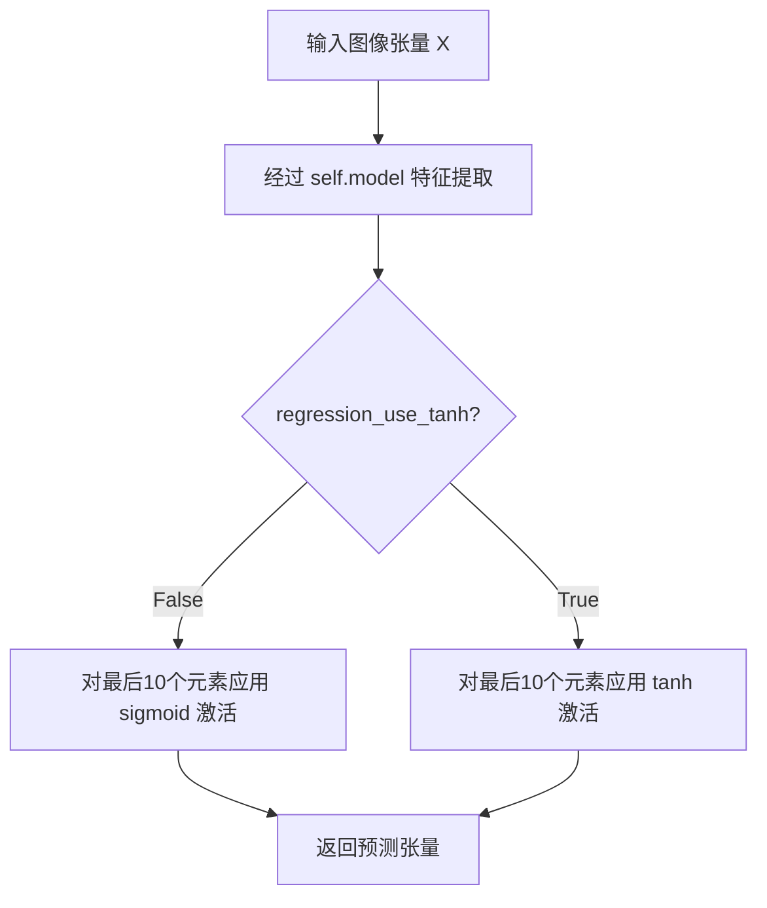
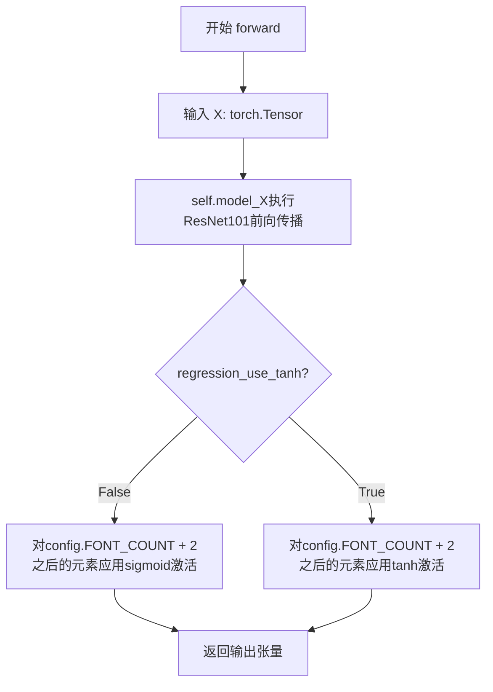
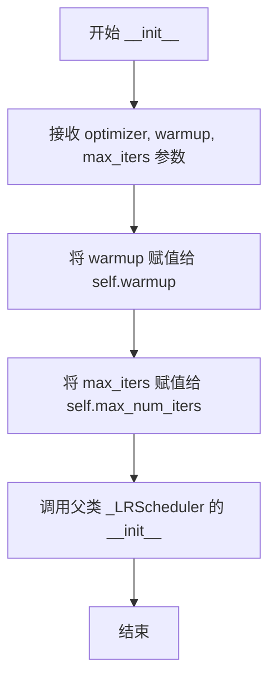
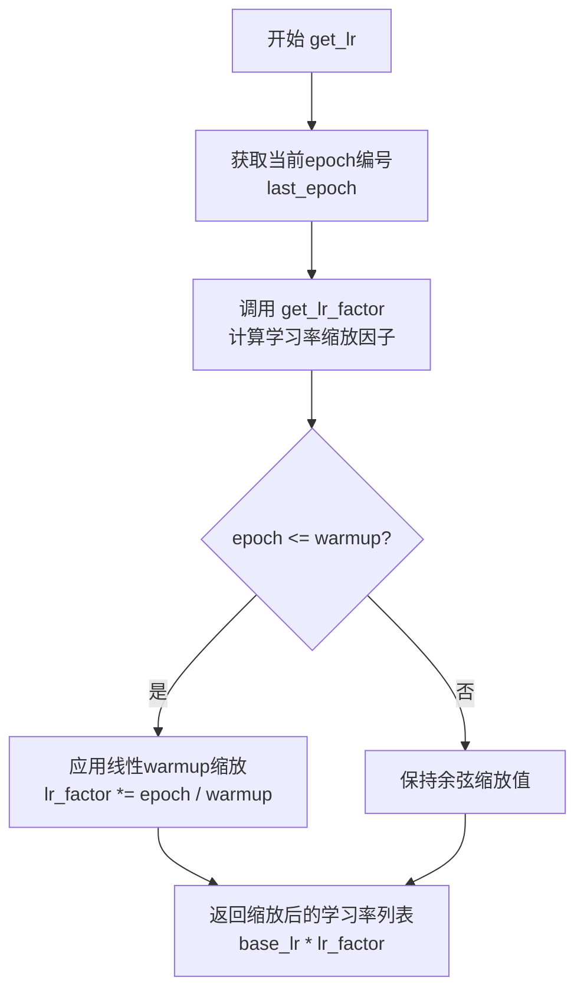
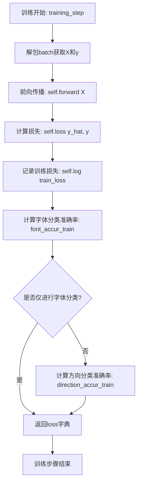
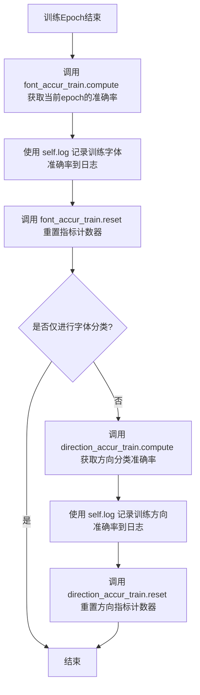

# `comic-translate\modules\detection\font\model.py` 详细设计文档

这是一个基于PyTorch和PyTorch Lightning的字体检测与识别系统，包含多种深度学习模型（CNN baseline和预训练ResNet系列）用于字体分类、方向预测和坐标回归，并实现了自定义损失函数和学习率调度器。

## 整体流程



## 类结构

```
nn.Module
├── DeepFontBaseline
├── ResNet18Regressor
├── ResNet34Regressor
├── ResNet50Regressor
├── ResNet101Regressor
├── FontDetectorLoss
└── CosineWarmupScheduler
ptl.LightningModule
└── FontDetector
```

## 全局变量及字段


### `config.FONT_COUNT`
    
全局配置 - 字体类别数

类型：`int`
    


### `DeepFontBaseline.self.model`
    
CNN特征提取网络

类型：`nn.Sequential`
    


### `ResNet18Regressor.self.model`
    
预训练ResNet18

类型：`resnet18`
    


### `ResNet18Regressor.self.regression_use_tanh`
    
回归激活方式

类型：`bool`
    


### `ResNet34Regressor.self.model`
    
预训练ResNet34

类型：`resnet34`
    


### `ResNet34Regressor.self.regression_use_tanh`
    
回归激活方式

类型：`bool`
    


### `ResNet50Regressor.self.model`
    
预训练ResNet50

类型：`resnet50`
    


### `ResNet50Regressor.self.regression_use_tanh`
    
回归激活方式

类型：`bool`
    


### `ResNet101Regressor.self.model`
    
预训练ResNet101

类型：`resnet101`
    


### `ResNet101Regressor.self.regression_use_tanh`
    
回归激活方式

类型：`bool`
    


### `FontDetectorLoss.self.category_loss`
    
字体分类损失

类型：`nn.CrossEntropyLoss`
    


### `FontDetectorLoss.self.regression_loss`
    
回归损失

类型：`nn.MSELoss`
    


### `FontDetectorLoss.self.lambda_font`
    
字体损失权重

类型：`float`
    


### `FontDetectorLoss.self.lambda_direction`
    
方向损失权重

类型：`float`
    


### `FontDetectorLoss.self.lambda_regression`
    
回归损失权重

类型：`float`
    


### `FontDetectorLoss.self.font_classfiication_only`
    
仅分类标志

类型：`bool`
    


### `CosineWarmupScheduler.self.warmup`
    
预热迭代数

类型：`int`
    


### `CosineWarmupScheduler.self.max_num_iters`
    
总迭代数

类型：`int`
    


### `FontDetector.self.model`
    
基础模型

类型：`nn.Module`
    


### `FontDetector.self.loss`
    
损失函数

类型：`FontDetectorLoss`
    


### `FontDetector.self.font_accur_train`
    
训练字体准确率

类型：`torchmetrics.Accuracy`
    


### `FontDetector.self.font_accur_val`
    
验证字体准确率

类型：`torchmetrics.Accuracy`
    


### `FontDetector.self.font_accur_test`
    
测试字体准确率

类型：`torchmetrics.Accuracy`
    


### `FontDetector.self.direction_accur_train`
    
训练方向准确率

类型：`torchmetrics.Accuracy`
    


### `FontDetector.self.direction_accur_val`
    
验证方向准确率

类型：`torchmetrics.Accuracy`
    


### `FontDetector.self.direction_accur_test`
    
测试方向准确率

类型：`torchmetrics.Accuracy`
    


### `FontDetector.self.lr`
    
学习率

类型：`float`
    


### `FontDetector.self.betas`
    
Adam动量参数

类型：`Tuple[float, float]`
    


### `FontDetector.self.num_warmup_iters`
    
预热迭代数

类型：`int`
    


### `FontDetector.self.num_iters`
    
总迭代数

类型：`int`
    


### `FontDetector.self.num_epochs`
    
总轮数

类型：`int`
    


### `FontDetector.self.load_epoch`
    
加载的轮数

类型：`int`
    


### `FontDetector.self.font_classification_only`
    
仅分类标志

类型：`bool`
    
    

## 全局函数及方法


### `DeepFontBaseline.__init__`

该方法是 `DeepFontBaseline` 类的构造函数，用于初始化一个基于自定义卷积神经网络的字体识别基线模型。方法内部通过 `nn.Sequential` 构建了一个包含5个卷积层、3个最大池化层、2个批归一化层、ReLU激活函数以及3个全连接层的串行网络结构，用于将输入图像映射到字体类别空间。

参数：

- `self`：实例本身，无需显式传递

返回值：`None`，无返回值（构造函数）

#### 流程图

```mermaid
graph TD
    A[__init__ 调用] --> B[super().__init__ 初始化基类]
    B --> C[构建卷积层1: Conv2d 3→64, kernel=11, stride=2]
    C --> D[添加BatchNorm2d 64]
    D --> E[添加ReLU激活]
    E --> F[添加MaxPool2d kernel=2, stride=2]
    F --> G[构建卷积层2: Conv2d 64→128, kernel=3, stride=1, padding=1]
    G --> H[添加BatchNorm2d 128]
    H --> I[添加ReLU激活]
    I --> J[添加MaxPool2d kernel=2, stride=2]
    J --> K[构建卷积层3: Conv2d 128→256, kernel=3, stride=1, padding=1]
    K --> L[添加ReLU激活]
    L --> M[构建卷积层4: Conv2d 256→256, kernel=3, stride=1, padding=1]
    M --> N[添加ReLU激活]
    N --> O[构建卷积层5: Conv2d 256→256, kernel=3, stride=1, padding=1]
    O --> P[添加ReLU激活]
    P --> Q[添加Flatten层展平特征]
    Q --> R[构建全连接层1: Linear 256*12*12→4096]
    R --> S[添加ReLU激活]
    S --> T[构建全连接层2: Linear 4096→4096]
    T --> U[添加ReLU激活]
    U --> V[构建全连接层3: Linear 4096→config.FONT_COUNT]
    V --> W[模型构建完成，赋值给self.model]
```

#### 带注释源码

```python
def __init__(self) -> None:
    """
    初始化DeepFontBaseline模型，构建自定义卷积神经网络结构。
    
    该基线模型包含：
    - 5个卷积层用于特征提取
    - 3个最大池化层用于下采样
    - 2个批归一化层用于稳定训练
    - 3个全连接层用于分类输出
    """
    # 调用父类nn.Module的初始化方法，建立模型的基础结构
    super().__init__()
    
    # 构建串行神经网络模型结构
    self.model = nn.Sequential(
        # ===== 卷积块1 =====
        # 输入通道3（RGB图像），输出通道64，卷积核大小11x11，步长2
        # 输出特征图尺寸约为原图的1/2（假设输入96x96，则输出约45x45）
        nn.Conv2d(3, 64, 11, 2),
        
        # 批归一化层，对64个通道的特征进行标准化，加速训练收敛
        nn.BatchNorm2d(64),
        
        # ReLU激活函数，引入非线性变换
        nn.ReLU(),
        
        # 最大池化层，窗口2x2，步长2，进一步下采样
        nn.MaxPool2d(2, 2),
        
        # ===== 卷积块2 =====
        # 输入通道64，输出通道128，卷积核3x3，步长1，padding=1保持尺寸
        nn.Conv2d(64, 128, 3, 1, 1),
        nn.BatchNorm2d(128),
        nn.ReLU(),
        nn.MaxPool2d(2, 2),
        
        # ===== 卷积块3 =====
        # 输入通道128，输出通道256，卷积核3x3
        nn.Conv2d(128, 256, 3, 1, 1),
        nn.ReLU(),
        
        # ===== 卷积块4 =====
        # 继续256通道，保持深层特征提取
        nn.Conv2d(256, 256, 3, 1, 1),
        nn.ReLU(),
        
        # ===== 卷积块5 =====
        nn.Conv2d(256, 256, 3, 1, 1),
        nn.ReLU(),
        
        # ===== 全连接层 =====
        # 将卷积输出的特征图展平为一维向量
        # 特征图尺寸：256通道 x 12 x 12（经过多次下采样）
        nn.Flatten(),
        
        # 全连接层1：输入256*12*12=36864维，输出4096维
        nn.Linear(256 * 12 * 12, 4096),
        nn.ReLU(),
        
        # 全连接层2：4096维到4096维的特征变换
        nn.Linear(4096, 4096),
        nn.ReLU(),
        
        # 全连接层3（输出层）：4096维映射到字体类别数
        # config.FONT_COUNT为配置的字体类别数量
        nn.Linear(4096, config.FONT_COUNT),
    )
```


### `DeepFontBaseline.forward`

该方法是 DeepFontBaseline 模型的前向传播函数，将输入图像通过卷积神经网络进行处理，输出字体类别的分类结果。

参数：

-  `X`：`torch.Tensor`，输入的图像张量，通常为批量数据，形状为 (batch_size, 3, height, width)，其中 3 表示 RGB 三通道

返回值：`torch.Tensor`，返回模型对输入图像的字体分类预测结果，张量形状为 (batch_size, config.FONT_COUNT)，表示每个样本属于各个字体类别的分数或概率

#### 流程图

```mermaid
flowchart TD
    A[输入图像 X] --> B[卷积块1: Conv2d(3,64,11,2) + BatchNorm + ReLU + MaxPool]
    B --> C[卷积块2: Conv2d(64,128,3,1,1) + BatchNorm + ReLU + MaxPool]
    C --> D[卷积块3: Conv2d(128,256,3,1,1) + ReLU]
    D --> E[卷积块4: Conv2d(256,256,3,1,1) + ReLU]
    E --> F[卷积块5: Conv2d(256,256,3,1,1) + ReLU]
    F --> G[Flatten层: 将特征张量展平]
    G --> H[全连接层1: Linear(256*12*12, 4096) + ReLU]
    H --> I[全连接层2: Linear(4096, 4096) + ReLU]
    I --> J[全连接层3: Linear(4096, config.FONT_COUNT)]
    J --> K[输出字体分类预测结果]
```

#### 带注释源码

```python
def forward(self, X):
    """
    DeepFontBaseline 模型的前向传播方法
    
    参数:
        X: 输入的图像张量，形状为 (batch_size, 3, height, width)
           height 和 width 需要与模型期望的输入尺寸匹配
    
    返回:
        torch.Tensor: 字体分类预测结果，形状为 (batch_size, config.FONT_COUNT)
                      每个通道的值代表对应字体类别的得分/概率
    """
    # 将输入 X 传递给 nn.Sequential 模型进行前向计算
    # 模型结构:
    # 1. Conv2d(3, 64, 11, 2): 3通道输入，64个卷积核，核大小11，步长2
    # 2. BatchNorm2d(64): 批归一化
    # 3. ReLU: 激活函数
    # 4. MaxPool2d(2, 2): 池化，核大小2，步长2
    # 5-10. 多个卷积块进一步提取特征
    # 11. Flatten: 展平张量
    # 12-14. 三个全连接层，最终输出 FONT_COUNT 维向量
    
    return self.model(X)
```


### `ResNet18Regressor.__init__`

该方法是 `ResNet18Regressor` 类的构造函数，用于初始化一个基于 ResNet18 的字体检测回归模型。它会根据参数决定是否加载预训练权重，并修改最后的全连接层以适应字体分类和回归任务的输出维度。

参数：

- `self`：隐式参数，`ResNet18Regressor` 实例本身
- `pretrained`：`bool` 类型，默认值为 `False`，指定是否加载 ImageNet 预训练的 ResNet18 权重
- `regression_use_tanh`：`bool` 类型，默认值为 `False`，指定回归任务部分是否使用 tanh 激活函数（若为 False 则使用 sigmoid）

返回值：`None`，构造函数无显式返回值

#### 流程图

```mermaid
flowchart TD
    A[开始 __init__] --> B[调用 super().__init__ 初始化父类]
    B --> C{pretrained 参数?}
    C -->|True| D[使用 torchvision.models.ResNet18_Weights.DEFAULT]
    C -->|False| E[weights 设为 None]
    D --> F[创建 resnet18 模型实例]
    E --> F
    F --> G[替换 model.fc 为新的 Linear 层]
    G --> H[输入维度: 512, 输出维度: FONT_COUNT + 12]
    H --> I[保存 regression_use_tanh 到实例属性]
    I --> J[结束 __init__]
```

#### 带注释源码

```python
def __init__(self, pretrained: bool = False, regression_use_tanh: bool = False):
    """
    初始化 ResNet18 回归模型
    
    参数:
        pretrained: 是否使用 ImageNet 预训练权重
        regression_use_tanh: 回归任务是否使用 tanh 激活（否则使用 sigmoid）
    """
    # 调用 PyTorch nn.Module 父类的初始化方法
    super().__init__()
    
    # 根据 pretrained 参数决定加载的权重
    # 若为 True，加载默认的预训练权重；若为 False，则不加载权重（随机初始化）
    weights = torchvision.models.ResNet18_Weights.DEFAULT if pretrained else None
    
    # 创建 ResNet18 模型实例，传入权重参数
    self.model = torchvision.models.resnet18(weights=weights)
    
    # 替换原始 ResNet18 的全连接层
    # 原模型 fc 层输入为 512（ResNet18 最后一层特征维度），输出为 1000（ImageNet 类别数）
    # 这里修改为输出 FONT_COUNT + 12：
    #   - FONT_COUNT: 字体类别数量（用于分类任务）
    #   - 12: 回归任务输出维度（包括方向分类 2 维 + 回归值 10 维）
    self.model.fc = nn.Linear(512, config.FONT_COUNT + 12)
    
    # 保存回归激活函数配置，供 forward 方法中使用
    # 若 regression_use_tanh 为 True，回归部分使用 tanh 激活
    # 否则使用 sigmoid 激活，将输出映射到 [0, 1] 区间
    self.regression_use_tanh = regression_use_tanh
```


### `ResNet18Regressor.forward`

该方法实现了ResNet18回归器的前向传播过程，将输入图像通过预训练的ResNet18骨干网络提取特征，然后通过全连接层映射到目标空间（字体类别+方向+回归值），并根据配置对回归部分应用Sigmoid或Tanh激活函数进行范围约束。

参数：

- `X`：`torch.Tensor`，输入的图像张量，通常为(batch_size, 3, height, width)形状的RGB图像

返回值：`torch.Tensor`，输出张量，形状为(batch_size, FONT_COUNT + 12)，包含FONT_COUNT个字体分类logits、2个方向分类logits和10个回归值

#### 流程图



#### 带注释源码

```python
def forward(self, X):
    """
    ResNet18Regressor的前向传播方法
    
    参数:
        X: 输入的图像张量，形状为(batch_size, 3, H, W)的RGB图像
    
    返回:
        输出张量，形状为(batch_size, FONT_COUNT + 12)
        - 前FONT_COUNT个值: 字体类别的logits
        - 接下来的2个值: 方向类别的logits  
        - 最后的10个值: 回归预测值（经过激活函数处理）
    """
    # 第一步：将输入图像通过ResNet18骨干网络进行特征提取
    # ResNet18输出的特征维度为512维
    X = self.model(X)
    
    # 第二步：根据配置对回归部分应用激活函数
    # config.FONT_COUNT + 2之后的值为回归预测值（共10个）
    # [0, 1]
    if not self.regression_use_tanh:
        # 使用Sigmoid激活函数将回归值约束到[0, 1]范围
        X[..., config.FONT_COUNT + 2 :] = X[..., config.FONT_COUNT + 2 :].sigmoid()
    else:
        # 使用Tanh激活函数将回归值约束到[-1, 1]范围
        X[..., config.FONT_COUNT + 2 :] = X[..., config.FONT_COUNT + 2 :].tanh()
    
    # 返回最终的预测结果
    return X
```


### ResNet34Regressor.__init__

该方法是 `ResNet34Regressor` 类的构造函数，用于初始化一个基于 ResNet34 架构的回归模型。它加载 ResNet34 骨干网络，替换最后的全连接层以适应字体类别和回归任务（方向和位置），并根据参数配置激活函数。

参数：

- `pretrained`：`bool`，是否加载在 ImageNet 上预训练的 ResNet34 权重，默认为 `False`
- `regression_use_tanh`：`bool`，回归任务输出是否使用 tanh 激活函数（输出范围 [-1, 1]），否则使用 sigmoid 激活（输出范围 [0, 1]），默认为 `False`

返回值：`None`，构造函数不返回任何值

#### 流程图

```mermaid
flowchart TD
    A[开始 __init__] --> B[调用 super().__init__]
    B --> C{pretrained 参数?}
    C -->|True| D[weights = ResNet34_Weights.DEFAULT]
    C -->|False| E[weights = None]
    D --> F[加载 torchvision.models.resnet34]
    E --> F
    F --> G[self.model = resnet34 with weights]
    G --> H[替换 fc 层: nn.Linear(512, FONT_COUNT + 12)]
    H --> I[保存 regression_use_tanh 参数]
    I --> J[结束 __init__]
```

#### 带注释源码

```python
def __init__(self, pretrained: bool = False, regression_use_tanh: bool = False):
    """
    初始化 ResNet34 回归器模型
    
    参数:
        pretrained: 是否使用在 ImageNet 上预训练的权重
        regression_use_tanh: 回归任务输出是否使用 tanh 激活
    """
    # 调用父类 nn.Module 的初始化方法
    super().__init__()
    
    # 根据 pretrained 参数决定加载预训练权重或随机初始化权重
    # ResNet34_Weights.DEFAULT 包含 ImageNet 预训练的权重
    weights = torchvision.models.ResNet34_Weights.DEFAULT if pretrained else None
    
    # 使用 torchvision 加载 ResNet34 模型，并传入权重参数
    self.model = torchvision.models.resnet34(weights=weights)
    
    # 替换原始 ResNet34 的全连接层
    # 原始 fc 层输出维度为 1000 (ImageNet 类别数)
    # 新 fc 层输出维度为 FONT_COUNT (字体类别数) + 12 (回归任务: 2方向 + 10其他回归值)
    # ResNet34 的特征提取层输出维度为 512
    self.model.fc = nn.Linear(512, config.FONT_COUNT + 12)
    
    # 保存回归激活函数配置，用于前向传播时决定使用 sigmoid 还是 tanh
    self.regression_use_tanh = regression_use_tanh
```


### ResNet34Regressor.forward

该方法是ResNet34Regressor模型的前向传播函数，接收图像输入，通过预训练的ResNet34骨干网络提取特征，并将输出转换为指定格式（字体分类、方向分类和回归值），根据配置对回归部分应用sigmoid或tanh激活函数。

参数：

- `X`：`torch.Tensor`，输入的图像张量，形状为 [batch_size, channels, height, width]，通常为3通道RGB图像

返回值：`torch.Tensor`，模型输出张量，形状为 [batch_size, config.FONT_COUNT + 12]，包含三部分：
- 前 config.FONT_COUNT 个元素：字体分类的logits
- 接下来的2个元素：方向分类的logits  
- 最后10个元素：回归值（经过sigmoid或tanh激活）

#### 流程图



#### 带注释源码

```python
def forward(self, X):
    """
    ResNet34Regressor的前向传播方法
    
    参数:
        X: torch.Tensor, 输入图像张量 [batch_size, 3, H, W]
    
    返回:
        torch.Tensor: 输出张量 [batch_size, FONT_COUNT + 12]
    """
    # Step 1: 将输入传入ResNet34模型进行特征提取和分类
    # 模型内部已经将最后的全连接层修改为输出 FONT_COUNT + 12 维
    X = self.model(X)
    
    # Step 2: 对回归部分（最后10个元素）进行激活函数处理
    # 这部分输出需要被约束到指定范围内
    # [0, 1]
    if not self.regression_use_tanh:
        # 使用sigmoid激活，将输出约束到[0, 1]范围
        X[..., config.FONT_COUNT + 2 :] = X[..., config.FONT_COUNT + 2 :].sigmoid()
    else:
        # 使用tanh激活，将输出约束到[-1, 1]范围
        X[..., config.FONT_COUNT + 2 :] = X[..., config.FONT_COUNT + 2 :].tanh()
    
    # Step 3: 返回处理后的输出张量
    return X
```


### `ResNet50Regressor.__init__`

该方法是`ResNet50Regressor`类的构造函数，用于初始化一个基于ResNet50的回归模型。它根据参数加载预训练权重（可选），并修改ResNet50的最后的全连接层以适应字体分类和回归任务（包括字体类别、方向和回归值）。

参数：

- `self`：隐式参数，类实例本身
- `pretrained`：`bool`，可选参数，默认为`False`。指定是否使用在ImageNet上预训练的ResNet50权重。如果为`True`，则加载预训练权重；否则使用随机初始化的权重
- `regression_use_tanh`：`bool`，可选参数，默认为`False`。指定回归任务中是否使用`tanh`激活函数。如果为`False`，则使用`sigmoid`激活函数将输出限制在[0, 1]范围

返回值：`None`，该方法不返回任何值，仅初始化对象状态

#### 流程图

```mermaid
flowchart TD
    A[开始 __init__] --> B[调用 super().__init__ 初始化nn.Module]
    B --> C{pretrained 参数?}
    C -->|True| D[weights = ResNet50_Weights.DEFAULT]
    C -->|False| E[weights = None]
    D --> F[创建 resnet50 模型]
    E --> F
    F --> G[修改 model.fc 为 nn.Linear(2048, config.FONT_COUNT + 12)]
    G --> H[保存 regression_use_tanh 到 self.regression_use_tanh]
    H --> I[结束 __init__]
```

#### 带注释源码

```python
def __init__(self, pretrained: bool = False, regression_use_tanh: bool = False):
    """
    初始化 ResNet50Regressor 模型
    
    参数:
        pretrained: bool, 是否使用预训练权重
        regression_use_tanh: bool, 回归任务是否使用tanh激活
    """
    # 调用父类 nn.Module 的初始化方法
    super().__init__()
    
    # 根据 pretrained 参数决定加载的权重
    # 如果为 True，使用 ImageNet 预训练的权重；否则为 None（随机初始化）
    weights = torchvision.models.ResNet50_Weights.DEFAULT if pretrained else None
    
    # 创建 ResNet50 模型实例
    self.model = torchvision.models.resnet50(weights=weights)
    
    # 修改原始 ResNet50 的全连接层
    # 原全连接层输出为 1000 (ImageNet 类别数)
    # 修改为 FONT_COUNT + 12:
    #   - FONT_COUNT: 字体类别数（分类任务）
    #   - 12: 包含方向分类(2) + 回归值(10)
    self.model.fc = nn.Linear(2048, config.FONT_COUNT + 12)
    
    # 保存回归激活函数类型配置
    # 用于在前向传播中决定使用 sigmoid 还是 tanh
    self.regression_use_tanh = regression_use_tanh
```


### `ResNet50Regressor.forward`

该方法是基于ResNet50骨干网络的字体检测回归模型的前向传播函数，接收图像张量输入，经过预训练的ResNet50特征提取器后，根据配置对回归输出进行激活函数处理（sigmoid或tanh），最终输出包含字体类别、方向类别和回归值的融合预测结果。

参数：

- `X`：`torch.Tensor`，输入的图像张量，形状为 (batch_size, 3, height, width)，其中3为RGB通道数

返回值：`torch.Tensor`，输出预测张量，形状为 (batch_size, FONT_COUNT + 12)，前 FONT_COUNT 个元素为字体类别的logits，随后的2个元素为方向类别的logits，最后10个元素为回归值

#### 流程图



#### 带注释源码

```python
def forward(self, X):
    """
    ResNet50Regressor 的前向传播方法
    
    参数:
        X: torch.Tensor, 输入图像张量, 形状为 (batch_size, 3, H, W)
    
    返回:
        torch.Tensor, 预测结果, 形状为 (batch_size, FONT_COUNT + 12)
            - [:FONT_COUNT]: 字体类别 logits
            - [FONT_COUNT:FONT_COUNT+2]: 方向类别 logits
            - [FONT_COUNT+2:]: 回归值 (经过激活函数处理)
    """
    # Step 1: 将输入通过 ResNet50 骨干网络进行特征提取和全连接层
    # 输出形状: (batch_size, FONT_COUNT + 12)
    X = self.model(X)
    
    # Step 2: 根据配置对回归部分进行激活函数处理
    # 回归值位于输出的最后10个位置 (索引 FONT_COUNT+2 到末尾)
    # 判断是否使用 tanh 激活函数 (tanh 输出范围 [-1, 1], sigmoid 输出范围 [0, 1])
    if not self.regression_use_tanh:
        # 使用 sigmoid 将回归值限制在 [0, 1] 范围
        X[..., config.FONT_COUNT + 2 :] = X[..., config.FONT_COUNT + 2 :].sigmoid()
    else:
        # 使用 tanh 将回归值限制在 [-1, 1] 范围
        X[..., config.FONT_COUNT + 2 :] = X[..., config.FONT_COUNT + 2 :].tanh()
    
    # Step 3: 返回包含分类和回归结果的融合张量
    return X
```


### `ResNet101Regressor.__init__`

该方法用于初始化 ResNet101 回归模型。它根据 `pretrained` 参数决定是否加载 ImageNet 预训练权重，并实例化 ResNet101 骨干网络。核心操作是替换原始 ResNet 的全连接层（FC Layer），使其输出维度适配字体分类任务（`FONT_COUNT`）和回归任务（12个数值），同时保存回归激活函数的选择配置。

参数：

- `pretrained`：`bool`，是否加载在 ImageNet 上的预训练权重。如果为 `True`，则使用 `ResNet101_Weights.DEFAULT`；否则权重为 `None`。
- `regression_use_tanh`：`bool`，指定回归任务部分是否使用 `tanh` 激活函数。如果为 `False`（默认），则使用 `sigmoid` 激活函数将输出映射到 [0, 1] 区间。

返回值：`None`（构造函数无返回值）

#### 流程图

```mermaid
flowchart TD
    A([Start __init__]) --> B[Call super().__init__]
    B --> C{pretrained is True?}
    C -->|Yes| D[weights = ResNet101_Weights.DEFAULT]
    C -->|No| E[weights = None]
    D --> F[model = torchvision.models.resnet101<br/>weights=weights]
    E --> F
    F --> G[Replace model.fc: Linear<br/>in_features=2048, out_features=FONT_COUNT+12]
    G --> H[self.regression_use_tanh = regression_use_tanh]
    H --> I([End __init__])
```

#### 带注释源码

```python
def __init__(self, pretrained: bool = False, regression_use_tanh: bool = False):
    """
    初始化 ResNet101 回归器。

    参数:
        pretrained (bool): 是否使用预训练权重。
        regression_use_tanh (bool): 回归输出是否使用 tanh 激活。
    """
    # 1. 调用父类 nn.Module 的初始化方法
    super().__init__()
    
    # 2. 根据是否需要预训练模型，选择对应的权重配置
    # torchvision.models.ResNet101_Weights.DEFAULT 包含了最佳的预训练权重
    weights = torchvision.models.ResNet101_Weights.DEFAULT if pretrained else None
    
    # 3. 实例化 resnet101 模型，并传入权重
    self.model = torchvision.models.resnet101(weights=weights)
    
    # 4. 【关键修改】替换原始的全连接层
    # ResNet101 原有的 fc 层输入为 2048 维（特征维度），输出为 1000 维（ImageNet 类别数）
    # 此处将其替换为适应任务的输出：
    # - FONT_COUNT: 字体类别的分类头
    # - 12: 回归任务的目标数量（例如边界框坐标、角度等）
    self.model.fc = nn.Linear(2048, config.FONT_COUNT + 12)
    
    # 5. 保存回归激活函数的配置，供 forward 方法中使用
    self.regression_use_tanh = regression_use_tanh
```


### `ResNet101Regressor.forward`

该方法是ResNet101Regressor模型的前向传播函数，接收图像张量输入，经过预训练的ResNet101骨干网络处理后，输出包含字体类别（分类）、方向类别（分类）和回归值的预测结果，并对回归部分应用激活函数以约束输出范围。

参数：

- `X`：`torch.Tensor`，输入的图像张量，形状通常为(batch_size, 3, height, width)

返回值：`torch.Tensor`，模型输出张量，形状为(batch_size, config.FONT_COUNT + 12)，其中前config.FONT_COUNT个元素为字体分类logits，随后的2个元素为方向分类logits，最后10个元素为回归值（经过sigmoid或tanh激活）

#### 流程图



#### 带注释源码

```python
def forward(self, X):
    """
    ResNet101回归器的前向传播方法
    
    参数:
        X: 输入的图像张量，形状为 (batch_size, 3, H, W)
    
    返回:
        包含分类和回归结果的张量，形状为 (batch_size, FONT_COUNT + 12)
    """
    # Step 1: 将输入传入ResNet101模型进行特征提取和预测
    # self.model 是 torchvision.models.resnet101，输出形状为 (batch_size, 2048)
    # 随后经过修改后的fc层，输出形状变为 (batch_size, config.FONT_COUNT + 12)
    X = self.model(X)
    
    # Step 2: 对回归部分应用激活函数
    # 根据配置决定使用sigmoid还是tanh激活函数
    # sigmoid: 输出范围 [0, 1]
    # tanh: 输出范围 [-1, 1]
    # [0, 1]
    if not self.regression_use_tanh:
        # 使用sigmoid激活，将最后10个回归值映射到[0,1]区间
        X[..., config.FONT_COUNT + 2 :] = X[..., config.FONT_COUNT + 2 :].sigmoid()
    else:
        # 使用tanh激活，将最后10个回归值映射到[-1,1]区间
        X[..., config.FONT_COUNT + 2 :] = X[..., config.FONT_COUNT + 2 :].tanh()
    
    # Step 3: 返回最终预测结果
    # 输出结构: [字体分类logits, 方向分类logits, 回归值]
    return X
```


### `FontDetectorLoss.__init__`

这是 `FontDetectorLoss` 类的初始化方法，用于配置字体检测任务的损失函数，包括分类损失、回归损失以及各损失项的权重参数。

参数：

- `lambda_font`：`float`，字体分类损失的权重系数
- `lambda_direction`：`float`，方向分类损失的权重系数
- `lambda_regression`：`float`，回归损失的权重系数
- `font_classification_only`：`bool`，是否仅使用字体分类损失（当为 True 时忽略方向和回归损失）

返回值：`None`，`__init__` 方法不返回值，仅完成对象初始化

#### 流程图

```mermaid
flowchart TD
    A[开始 __init__] --> B[调用 super().__init__ 初始化 nn.Module]
    C[创建 CrossEntropyLoss 实例] --> D[赋值给 self.category_loss]
    E[创建 MSELoss 实例] --> F[赋值给 self.regression_loss]
    G[赋值 lambda_font 参数] --> H[赋值 lambda_direction 参数]
    I[赋值 lambda_regression 参数] --> J[赋值 font_classification_only 参数]
    B --> C
    C --> E
    E --> G
    H --> I
    I --> J
    J --> K[结束 __init__]
```

#### 带注释源码

```python
def __init__(
    self, lambda_font, lambda_direction, lambda_regression, font_classification_only
):
    """
    初始化 FontDetectorLoss 损失函数
    
    参数:
        lambda_font: 字体分类损失的权重系数
        lambda_direction: 方向分类损失的权重系数
        lambda_regression: 回归损失的权重系数
        font_classification_only: 是否仅使用字体分类损失
    """
    # 调用父类 nn.Module 的初始化方法
    super().__init__()
    
    # 创建交叉熵损失函数，用于字体类别分类
    self.category_loss = nn.CrossEntropyLoss()
    
    # 创建均方误差损失函数，用于回归任务（如边界框坐标等）
    self.regression_loss = nn.MSELoss()
    
    # 保存字体分类损失的权重系数
    self.lambda_font = lambda_font
    
    # 保存方向分类损失的权重系数
    self.lambda_direction = lambda_direction
    
    # 保存回归损失的权重系数
    self.lambda_regression = lambda_regression
    
    # 保存是否仅使用字体分类的标志位
    # 注意：这里有个拼写错误 'classfiication' 应为 'classification'
    self.font_classfiication_only = font_classification_only
```


### `FontDetectorLoss.forward`

该方法实现了字体检测任务的复合损失函数计算，支持仅字体分类模式和包含方向分类与回归的多任务模式，根据配置对字体分类损失、方向分类损失和回归损失进行加权求和。

参数：

- `y_hat`：`torch.Tensor`，模型预测输出，形状为 `(..., FONT_COUNT + 12)`，其中前 FONT_COUNT 个元素为字体分类 logits，接下来 2 个元素为方向分类 logits，最后 10 个元素为回归预测值
- `y`：`torch.Tensor`，真实标签，形状为 `(..., 12)`，第 0 个元素为字体类别索引（整数），第 1 个元素为方向类别索引（整数），第 2-11 个元素为回归目标值

返回值：`torch.Tensor`，标量损失值，根据模式返回加权后的字体分类损失或字体分类、方向分类、回归损失的加权和

#### 流程图

```mermaid
flowchart TD
    A[forward 调用] --> B[计算字体分类损失 font_cat]
    B --> C{font_classification_only?}
    C -->|True| D[返回 lambda_font × font_cat]
    C -->|False| E[计算方向分类损失 direction_cat]
    E --> F[计算回归损失 regression]
    F --> G[返回加权总损失<br/>lambda_font × font_cat<br/>+ lambda_direction × direction_cat<br/>+ lambda_regression × regression]
    
    B -.-> B1[CrossEntropyLoss<br/>y_hat[..., :FONT_COUNT]<br/>vs y[..., 0].long]
    E -.-> E1[CrossEntropyLoss<br/>y_hat[..., FONT_COUNT:FONT_COUNT+2]<br/>vs y[..., 1].long]
    F -.-> F1[MSELoss<br/>y_hat[..., FONT_COUNT+2:]<br/>vs y[..., 2:]
```

#### 带注释源码

```python
def forward(self, y_hat, y):
    """
    计算字体检测任务的损失值
    
    参数:
        y_hat: 模型预测输出，包含字体分类logits、方向分类logits和回归值
        y: 真实标签，包含字体类别索引、方向类别索引和回归目标值
    
    返回:
        加权后的损失值标量
    """
    # 步骤1: 计算字体分类损失 (CrossEntropyLoss)
    # 使用预测输出的前 FONT_COUNT 个元素作为字体分类 logits
    # 真实标签为 y 的第0个元素，转换为长整数类型
    font_cat = self.category_loss(y_hat[..., : config.FONT_COUNT], y[..., 0].long())
    
    # 步骤2: 判断是否为仅字体分类模式
    if self.font_classfiication_only:
        # 如果是仅分类模式，直接返回加权后的字体分类损失
        return self.lambda_font * font_cat
    
    # 步骤3: 计算方向分类损失 (仅在非仅分类模式下执行)
    # 使用预测输出的 FONT_COUNT 到 FONT_COUNT+2 位置作为方向分类 logits
    direction_cat = self.category_loss(
        y_hat[..., config.FONT_COUNT : config.FONT_COUNT + 2], y[..., 1].long()
    )
    
    # 步骤4: 计算回归损失 (仅在非仅分类模式下执行)
    # 使用预测输出的 FONT_COUNT+2 之后的位置作为回归预测
    # 与真实标签的第2个元素之后的值计算均方误差损失
    regression = self.regression_loss(
        y_hat[..., config.FONT_COUNT + 2 :], y[..., 2:]
    )
    
    # 步骤5: 返回加权总损失
    # 损失 = lambda_font × font_cat + lambda_direction × direction_cat + lambda_regression × regression
    return (
        self.lambda_font * font_cat
        + self.lambda_direction * direction_cat
        + self.lambda_regression * regression
    )
```


### `CosineWarmupScheduler.__init__`

该方法是`CosineWarmupScheduler`类的构造函数，用于初始化余弦退火学习率调度器（带warmup阶段）。它接受一个优化器、warmup迭代次数和最大迭代次数作为参数，将这些参数存储为实例属性，并调用父类`_LRScheduler`的初始化方法完成调度器的基础配置。

参数：

- `self`：隐式参数，实例本身
- `optimizer`：`torch.optim.Optimizer`，PyTorch优化器实例，用于调整学习率
- `warmup`：`int`，warmup阶段的迭代次数，在warmup阶段学习率会从0线性增长到基础学习率
- `max_iters`：`int`，训练的总迭代次数，用于计算余弦退火曲线的周期

返回值：`None`，构造函数没有显式返回值

#### 流程图



#### 带注释源码

```python
def __init__(self, optimizer, warmup, max_iters):
    """
    CosineWarmupScheduler 类的构造函数
    
    参数:
        optimizer: PyTorch 优化器实例
        warmup: warmup 阶段的迭代次数
        max_iters: 训练的总迭代次数
    """
    # 将 warmup 参数存储为实例属性，用于后续计算学习率因子
    self.warmup = warmup
    
    # 将最大迭代次数存储为实例属性，用于余弦退火计算
    self.max_num_iters = max_iters
    
    # 调用父类 _LRScheduler 的初始化方法，完成调度器的基础配置
    # 父类会保存 optimizer 的引用，并初始化一些内部状态
    super().__init__(optimizer)
```


### `CosineWarmupScheduler.get_lr`

该方法是学习率调度器的核心方法，基于余弦退火（Cosine Annealing）和warmup策略计算当前epoch的学习率缩放因子，并将调整后的学习率列表返回给优化器。

参数：

- 此方法无显式参数，但内部使用继承自`torch.optim.lr_scheduler._LRScheduler`的属性：
  - `self.last_epoch`：`int`，当前已经完成的epoch数（从0开始计数）
  - `self.base_lrs`：`List[float]`，优化器的初始学习率列表

返回值：`List[float]`，返回调整后的学习率列表，每个参数组的学习率等于其基础学习率乘以当前计算得到的缩放因子。

#### 流程图



#### 带注释源码

```python
def get_lr(self):
    """
    获取当前epoch的学习率。
    
    该方法继承自 _LRScheduler，在每个epoch结束时被调用，
    用于计算并返回调整后的学习率。
    
    实现步骤：
    1. 通过 get_lr_factor 方法基于当前 epoch 计算学习率缩放因子
    2. 将每个参数组的基础学习率与缩放因子相乘
    3. 返回调整后的学习率列表
    """
    # 获取当前epoch的学习率缩放因子
    # last_epoch 是 PyTorch LR Scheduler 提供的属性，表示已完成的epoch数
    lr_factor = self.get_lr_factor(epoch=self.last_epoch)
    
    # 对每个参数组的基础学习率应用缩放因子
    # base_lrs 存储了优化器各参数组的初始学习率
    return [base_lr * lr_factor for base_lr in self.base_lrs]
```


### `CosineWarmupScheduler.get_lr_factor`

计算当前训练轮次（epoch）的学习率缩放因子。该方法实现了结合线性预热（Linear Warmup）和余弦退火（Cosine Annealing）的学习率调度策略。在预热阶段，学习率从零线性增长；在预热结束后，学习率随余弦曲线逐渐衰减。

参数：

- `epoch`：`int`，当前训练的轮次或迭代索引。

返回值：`float`，返回用于缩放基础学习率的因子（通常在 0 到 1 之间）。

#### 流程图

```mermaid
graph TD
    A([开始计算]) --> B[计算基础余弦因子<br>factor = 0.5 * (1 + cos(π * epoch / max_iters))]
    B --> C{判断是否在预热期<br>epoch <= warmup?}
    C -- 是 --> D[应用线性预热乘数<br>factor *= epoch / warmup]
    C -- 否 --> E[保持当前因子]
    D --> F([返回因子])
    E --> F
```

#### 带注释源码

```python
def get_lr_factor(self, epoch):
    """
    计算特定 epoch 的学习率因子。

    逻辑分为两部分：
    1. 余弦退火部分：在整个训练过程中，基于 epoch 与总迭代数的比例计算衰减因子。
       公式: 0.5 * (1 + cos(pi * epoch / max_iters))
       - 起始 (epoch=0) 时，因子为 1.0。
       - 结束 (epoch=max_iters) 时，因子为 0.0。
    2. 线性预热部分：如果当前 epoch 小于预热轮数，则乘以一个线性增长的比例，
       使学习率在预热期内从 0 增长到目标值。
    """
    # 步骤1: 计算余弦退火因子
    lr_factor = 0.5 * (1 + np.cos(np.pi * epoch / self.max_num_iters))
    
    # 步骤2: 如果处于预热阶段，应用线性预热乘法器
    if epoch <= self.warmup:
        lr_factor *= epoch * 1.0 / self.warmup
        
    # 步骤3: 返回最终计算得到的学习率因子
    return lr_factor
```


### `FontDetector.__init__`

FontDetector 类的初始化方法，负责构建字体检测模型的 PyTorch Lightning 模块，配置损失函数、准确率指标、优化器和学习率调度器等训练所需的所有组件。

参数：

- `model`：`nn.Module`，用于字体检测的主干神经网络模型
- `lambda_font`：`float`，字体分类损失函数的权重系数
- `lambda_direction`：`float`，方向分类损失函数的权重系数
- `lambda_regression`：`float`，回归损失函数的权重系数
- `font_classification_only`：`bool`，是否仅进行字体分类（不包含方向分类和回归任务）
- `lr`：`float`，学习率，控制梯度下降的步长
- `betas`：`Tuple[float, float]`，Adam 优化器的动量参数 (beta1, beta2)
- `num_warmup_iters`：`int`，学习率预热阶段的迭代次数
- `num_iters`：`int`，总的迭代次数，用于学习率调度
- `num_epochs`：`int`，总的训练轮数

返回值：`None`，该方法为构造函数，不返回任何值

#### 流程图

```mermaid
flowchart TD
    A[开始 __init__] --> B[调用 super().__init__ 初始化 LightningModule]
    B --> C[保存 model 到 self.model]
    C --> D[创建 FontDetectorLoss 实例并保存到 self.loss]
    D --> E[创建字体分类准确率指标: train/val/test]
    E --> F{font_classification_only?}
    F -->|Yes| G[跳过方向分类指标创建]
    F -->|No| H[创建方向分类准确率指标: train/val/test]
    H --> I
    G --> I[保存 lr, betas, num_warmup_iters, num_iters, num_epochs]
    I --> J[初始化 self.load_epoch = -1]
    J --> K[保存 self.font_classification_only]
    K --> L[结束 __init__]
```

#### 带注释源码

```python
def __init__(
    self,
    model: nn.Module,
    lambda_font: float,
    lambda_direction: float,
    lambda_regression: float,
    font_classification_only: bool,
    lr: float,
    betas: Tuple[float, float],
    num_warmup_iters: int,
    num_iters: int,
    num_epochs: int,
):
    # 调用父类 ptl.LightningModule 的初始化方法
    # 建立 PyTorch Lightning 框架所需的基础结构
    super().__init__()
    
    # 保存传入的神经网络模型作为实例属性
    self.model = model
    
    # 创建复合损失函数实例，包含字体分类、方向分类和回归损失
    # 根据 lambda 参数加权组合不同类型的损失
    self.loss = FontDetectorLoss(
        lambda_font, lambda_direction, lambda_regression, font_classification_only
    )
    
    # 创建字体分类准确率指标，用于训练、验证和测试阶段
    # 使用 torchmetrics 的多分类准确率，类别数由 config.FONT_COUNT 决定
    self.font_accur_train = torchmetrics.Accuracy(
        task="multiclass", num_classes=config.FONT_COUNT
    )
    self.font_accur_val = torchmetrics.Accuracy(
        task="multiclass", num_classes=config.FONT_COUNT
    )
    self.font_accur_test = torchmetrics.Accuracy(
        task="multiclass", num_classes=config.FONT_COUNT
    )
    
    # 如果不是仅做字体分类，则创建方向分类的准确率指标
    # 方向是二分类问题（2个类别）
    if not font_classification_only:
        self.direction_accur_train = torchmetrics.Accuracy(
            task="multiclass", num_classes=2
        )
        self.direction_accur_val = torchmetrics.Accuracy(
            task="multiclass", num_classes=2
        )
        self.direction_accur_test = torchmetrics.Accuracy(
            task="multiclass", num_classes=2
        )
    
    # 保存学习率配置参数
    self.lr = lr
    
    # 保存 Adam 优化器的动量参数 (beta1, beta2)
    self.betas = betas
    
    # 保存学习率预热阶段的迭代次数
    self.num_warmup_iters = num_warmup_iters
    
    # 保存总迭代次数，用于余弦退火调度器
    self.num_iters = num_iters
    
    # 保存总训练轮数
    self.num_epochs = num_epochs
    
    # 初始化加载的 epoch 为 -1，表示尚未加载任何检查点
    # 在 on_load_checkpoint 中会被更新为实际的 epoch 数
    self.load_epoch = -1
    
    # 保存是否仅进行字体分类的配置标志
    self.font_classification_only = font_classification_only
```


### `FontDetector.forward`

该方法是FontDetector类的核心前向传播方法，负责将输入图像通过内置的深度学习模型进行处理并返回预测结果。

参数：

- `x`：`torch.Tensor`，输入的图像张量，通常为批次数据，形状为 (batch_size, channels, height, width)

返回值：`torch.Tensor`，模型的输出张量，包含字体分类预测结果，如果启用回归还包括方向分类和回归预测

#### 流程图

```mermaid
graph TD
    A[输入图像张量 x] --> B[调用 self.model(x)]
    B --> C[返回模型输出]
    
    subgraph FontDetector
    D[__init__] --> E[forward]
    end
    
    subgraph 内部模型
    F[model: nn.Module] -->|forward| C
    end
```

#### 带注释源码

```python
def forward(self, x):
    """
    FontDetector 类的前向传播方法。
    将输入图像传递给内部模型进行推理。
    
    参数:
        x: torch.Tensor - 输入的图像张量
        
    返回:
        torch.Tensor - 模型的预测输出
    """
    # 调用内部持有的模型对象进行前向计算
    # self.model 可以是 DeepFontBaseline, ResNet18Regressor,
    # ResNet34Regressor, ResNet50Regressor 或 ResNet101Regressor 的实例
    return self.model(x)
```


### `FontDetector.training_step`

该方法是 PyTorch Lightning 模型训练流程中的核心步骤，负责执行单个训练批次的计算：获取输入数据和标签，通过前向传播计算预测结果，计算损失函数值，并记录训练指标（损失和准确率）。如果模型配置为同时进行字体分类和方向分类，还会额外记录方向分类的准确率。

参数：

- `self`：FontDetector 实例本身，包含模型、损失函数和指标计算器等组件
- `batch`：`Tuple[torch.Tensor, torch.Tensor]`，训练批次数据，包含输入图像张量 X 和标签张量 y，其中 X 形状为 (batch_size, channels, height, width)，y 包含字体类别、方向类别和回归目标
- `batch_idx`：`int`，当前训练批次的索引编号，用于日志记录和调试

返回值：`Dict[str, Any]`，返回一个字典，包含键 "loss"，其值为计算得到的损失张量，用于反向传播和梯度更新

#### 流程图



#### 带注释源码

```python
def training_step(
    self, batch: Tuple[torch.Tensor, torch.Tensor], batch_idx: int
) -> Dict[str, Any]:
    """
    执行单个训练步骤的前向传播、损失计算和指标记录
    
    参数:
        batch: 训练批次元组 (输入张量X, 标签张量y)
        batch_idx: 批次索引用于日志记录
    
    返回:
        包含损失值的字典，供Lightning后端进行梯度反向传播
    """
    # 从批次中解包输入数据和标签
    # X: (batch_size, 3, H, W) RGB图像张量
    # y: (batch_size, 14) 标签张量 [font_class, direction_class, 12回归值]
    X, y = batch
    
    # 通过模型执行前向传播
    # 返回预测张量形状: (batch_size, FONT_COUNT + 12)
    # 前 FONT_COUNT 个通道为字体分类logits
    # 接下来的2个通道为方向分类logits
    # 最后12个通道为回归预测值
    y_hat = self.forward(X)
    
    # 计算损失函数
    # 损失由字体分类损失、方向分类损失（如适用）和回归损失（如适用）组成
    # 使用加权系数 lambda_font, lambda_direction, lambda_regression 进行加权求和
    loss = self.loss(y_hat, y)
    
    # 记录训练损失到日志，prog_bar=True显示在进度条，sync_dist=True支持分布式训练同步
    self.log("train_loss", loss, prog_bar=True, sync_dist=True)
    
    # 计算并记录字体分类准确率
    # 使用预测logits的前FONT_COUNT个通道与真实标签的第0维（字体类别）计算准确率
    # y[..., 0] 提取字体类别标签
    self.log(
        "train_font_accur",
        self.font_accur_train(y_hat[..., : config.FONT_COUNT], y[..., 0]),
        sync_dist=True,
    )
    
    # 如果不是仅进行字体分类（包含方向分类和回归任务）
    # 则额外记录方向分类准确率
    if not self.font_classification_only:
        self.log(
            "train_direction_accur",
            self.direction_accur_train(
                # 提取方向分类logits: FONT_COUNT 到 FONT_COUNT+2
                y_hat[..., config.FONT_COUNT : config.FONT_COUNT + 2], 
                # 提取方向类别标签: y的第1维
                y[..., 1]
            ),
            sync_dist=True,
        )
    
    # 返回字典，PyTorch Lightning 会自动提取 'loss' 键进行反向传播
    return {"loss": loss}
```


### `FontDetector.on_train_epoch_end`

该方法是PyTorch Lightning训练循环的回调函数，在每个训练epoch结束时自动调用，主要用于计算并记录当前epoch的训练指标（字体分类准确率和可选的方向分类准确率），然后重置这些指标以便下一个epoch使用。

参数：

- `self`：`FontDetector`类实例，隐式参数，表示当前模型实例本身

返回值：`None`，无返回值（方法声明为`-> None`）

#### 流程图



#### 带注释源码

```python
def on_train_epoch_end(self) -> None:
    """
    在训练epoch结束时调用的回调方法。
    用于计算并记录训练指标，然后重置指标以便下一epoch使用。
    """
    
    # 记录字体分类的准确率，使用 compute() 获取累积的准确率值
    # sync_dist=True 确保在分布式训练中同步各进程的指标
    self.log("train_font_accur", self.font_accur_train.compute(), sync_dist=True)
    
    # 重置字体准确率计数器，避免与下一个epoch的数据混淆
    self.font_accur_train.reset()
    
    # 如果不是仅进行字体分类（即启用了方向分类功能）
    if not self.font_classification_only:
        # 记录方向分类的准确率
        self.log(
            "train_direction_accur",
            self.direction_accur_train.compute(),
            sync_dist=True,
        )
        
        # 重置方向准确率计数器
        self.direction_accur_train.reset()
```


### `FontDetector.validation_step`

该方法是 PyTorch Lightning 模型 FontDetector 的验证步骤，在每个验证批次运行时执行前向传播、计算损失、更新验证指标（字体分类准确率和方向分类准确率），并返回包含损失的字典。

参数：

- `batch`：`Tuple[torch.Tensor, torch.Tensor]`，验证批次数据，包含输入特征 X 和标签 y
- `batch_idx`：`int`，当前验证批次的索引

返回值：`Dict[str, Any]`，返回包含损失值的字典，如 `{"loss": loss}`

#### 流程图

```mermaid
flowchart TD
    A[开始 validation_step] --> B[从 batch 解包 X, y]
    B --> C[执行前向传播 y_hat = self.forward(X)]
    C --> D[计算损失 loss = self.loss(y_hat, y)]
    D --> E[记录验证损失: self.log val_loss]
    E --> F[更新字体准确率: font_accur_val.update]
    F --> G{font_classification_only?}
    G -->|是| H[返回字典 {"loss": loss}]
    G -->|否| I[更新方向准确率: direction_accur_val.update]
    I --> H
```

#### 带注释源码

```python
def validation_step(
    self, batch: Tuple[torch.Tensor, torch.Tensor], batch_idx: int
) -> Dict[str, Any]:
    """
    验证步骤：执行前向传播、计算损失并更新验证指标
    
    参数:
        batch: 验证批次，包含 (X, y) 元组
            X: 输入特征张量，形状为 (batch_size, channels, height, width)
            y: 标签张量，形状为 (batch_size, label_dim)
        batch_idx: 批次索引
    
    返回:
        包含损失值的字典 {"loss": loss}
    """
    # 从批次中解包输入和标签
    X, y = batch
    
    # 通过模型执行前向传播
    y_hat = self.forward(X)
    
    # 计算损失
    loss = self.loss(y_hat, y)
    
    # 记录验证损失到日志
    self.log("val_loss", loss, prog_bar=True, sync_dist=True)
    
    # 更新字体分类验证准确率
    # 使用预测结果的前 FONT_COUNT 个通道与标签的第 0 个元素进行比较
    self.font_accur_val.update(y_hat[..., : config.FONT_COUNT], y[..., 0])
    
    # 如果不是仅进行字体分类，则同时更新方向分类准确率
    if not self.font_classification_only:
        # 使用预测结果的 FONT_COUNT 到 FONT_COUNT+2 通道与标签的第 1 个元素比较
        self.direction_accur_val.update(
            y_hat[..., config.FONT_COUNT : config.FONT_COUNT + 2], y[..., 1]
        )
    
    # 返回包含损失的字典，供 Lightning 使用
    return {"loss": loss}
```


### `FontDetector.on_validation_epoch_end`

该方法是 PyTorch Lightning 的回调函数，在每个验证epoch结束时被调用。它负责计算并记录验证集上的字体分类准确率和方向分类准确率（如适用），同时重置相应的度量指标以便下一个epoch使用。

参数：
- 该方法无显式参数（仅使用 `self` 访问类属性）

返回值：`None`，无返回值

#### 流程图

```mermaid
flowchart TD
    A[开始 on_validation_epoch_end] --> B[日志记录 val_font_accur]
    B --> C[重置 font_accur_val 指标]
    C --> D{font_classification_only?}
    D -->|True| E[结束]
    D -->|False| F[日志记录 val_direction_accur]
    F --> G[重置 direction_accur_val 指标]
    G --> E
```

#### 带注释源码

```python
def on_validation_epoch_end(self):
    """
    在验证epoch结束时调用的回调函数。
    用于计算并记录验证集上的准确率指标，然后重置指标以供下一个epoch使用。
    """
    # 记录验证集上字体分类的准确率，使用 sync_dist=True 确保分布式训练时同步
    self.log("val_font_accur", self.font_accur_val.compute(), sync_dist=True)
    # 重置字体准确率计数器，避免累积到下一个epoch
    self.font_accur_val.reset()
    
    # 如果不是仅进行字体分类（则包含方向分类任务）
    if not self.font_classification_only:
        # 记录验证集上方向分类的准确率
        self.log(
            "val_direction_accur",
            self.direction_accur_val.compute(),
            sync_dist=True,
        )
        # 重置方向准确率计数器
        self.direction_accur_val.reset()
```


### `FontDetector.test_step`

该方法是 `FontDetector` 类中的测试步骤实现，用于在测试集上执行单次前向传播、计算损失并更新测试指标。

参数：

-  `batch`：`Tuple[torch.Tensor, torch.Tensor]`，输入批次，包含特征张量 X 和标签张量 y
-  `batch_idx`：`int`，当前批次的索引

返回值：`Dict[str, Any]`，包含损失值的字典

#### 流程图

```mermaid
flowchart TD
    A[开始 test_step] --> B[解包 batch: X, y = batch]
    B --> C[前向传播: y_hat = self.forward(X)]
    C --> D[计算损失: loss = self.loss(y_hat, y)]
    D --> E[记录测试损失: self.log test_loss]
    E --> F[更新字体准确率: font_accur_test.update]
    F --> G{font_classification_only?}
    G -->|True| H[跳过方向准确率更新]
    G -->|False| I[更新方向准确率: direction_accur_test.update]
    H --> J[返回字典: {"loss": loss}]
    I --> J
    J --> K[结束 test_step]
```

#### 带注释源码

```python
def test_step(self, batch: Tuple[torch.Tensor, torch.Tensor], batch_idx: int):
    """
    在测试集上执行单次前向传播和指标更新
    
    参数:
        batch: 包含输入特征和标签的元组 (X, y)
        batch_idx: 当前批次的索引
    
    返回:
        包含损失值的字典
    """
    # 从批次中解包输入特征 X 和标签 y
    X, y = batch
    # 通过模型进行前向传播获取预测结果
    y_hat = self.forward(X)
    # 使用损失函数计算预测值与真实值之间的损失
    loss = self.loss(y_hat, y)
    # 记录测试损失到日志，prog_bar=True 显示在进度条，sync_dist=True 跨设备同步
    self.log("test_loss", loss, prog_bar=True, sync_dist=True)
    # 更新字体分类准确率指标（使用预测结果的前 FONT_COUNT 个类别）
    self.font_accur_test.update(y_hat[..., : config.FONT_COUNT], y[..., 0])
    # 如果不是仅进行字体分类，则更新方向分类准确率
    if not self.font_classification_only:
        self.direction_accur_test.update(
            y_hat[..., config.FONT_COUNT : config.FONT_COUNT + 2], y[..., 1]
        )
    # 返回包含损失的字典，供 Lightning 框架使用
    return {"loss": loss}
```


### `FontDetector.on_test_epoch_end`

该方法是 PyTorch Lightning 模块 `FontDetector` 的回调方法，在每个测试 epoch 结束后被调用，用于计算并记录测试集上的字体分类准确率和方向分类准确率（如果启用），然后重置相应的指标对象以准备下一个 epoch 的计算。

参数：

- 该方法无显式参数（隐式参数 `self` 为实例自身）

返回值：`None`，该方法无返回值，仅执行日志记录和指标重置操作

#### 流程图

```mermaid
flowchart TD
    A[开始 on_test_epoch_end] --> B[计算 test_font_accur]
    B --> C[记录 test_font_accur 到日志]
    C --> D[重置 font_accur_test 指标]
    D --> E{font_classification_only?}
    E -->|是| H[结束]
    E -->|否| F[计算 test_direction_accur]
    F --> G[记录 test_direction_accur 到日志]
    G --> I[重置 direction_accur_test 指标]
    I --> H
```

#### 带注释源码

```python
def on_test_epoch_end(self) -> None:
    """
    在测试 epoch 结束后调用的回调方法。
    用于计算测试集上的准确率指标并记录到日志，然后重置指标以便下次使用。
    """
    # 计算测试集上字体分类的准确率并记录到日志
    # sync_dist=True 确保在分布式训练中同步各进程的结果
    self.log("test_font_accur", self.font_accur_test.compute(), sync_dist=True)
    
    # 重置字体分类准确率指标，为下一个测试 epoch 做准备
    # 避免指标累积导致内存泄漏
    self.font_accur_test.reset()
    
    # 检查是否启用了仅字体分类模式
    if not self.font_classification_only:
        # 如果不是仅分类模式，则计算方向分类的准确率
        self.log(
            "test_direction_accur",
            self.direction_accur_test.compute(),
            sync_dist=True,
        )
        # 重置方向分类准确率指标
        self.direction_accur_test.reset()
```


### `FontDetector.configure_optimizers`

配置优化器和学习率调度器，用于训练深度学习模型。该方法创建Adam优化器，初始化余弦预热调度器，并根据已加载的检查点epoch预热调度器到当前状态。

参数：

- 该方法无显式参数（除 `self` 外）

返回值：`torch.optim.Adam`，返回配置好的Adam优化器实例

#### 流程图

```mermaid
flowchart TD
    A[开始 configure_optimizers] --> B[创建 Adam 优化器]
    B --> C[使用 self.model.parameters, lr, betas]
    C --> D[创建 CosineWarmupScheduler]
    D --> E[传入 optimizer, num_warmup_iters, num_iters]
    E --> F[预热调度器]
    F --> G[计算步数: num_iters * (load_epoch + 1) // num_epochs]
    G --> H[循环调用 scheduler.step]
    H --> I[记录当前学习率]
    I --> J[返回 optimizer]
```

#### 带注释源码

```
def configure_optimizers(self):
    # 创建 Adam 优化器，使用类中存储的学习率(lr)和beta参数
    optimizer = torch.optim.Adam(
        self.model.parameters(), lr=self.lr, betas=self.betas
    )
    
    # 创建余弦预热学习率调度器
    # 参数: 优化器、预热迭代次数、总迭代次数
    self.scheduler = CosineWarmupScheduler(
        optimizer, self.num_warmup_iters, self.num_iters
    )
    
    # 打印加载的epoch信息（用于调试）
    print("Load epoch:", self.load_epoch)
    
    # 根据已加载的epoch预热调度器
    # 计算需要步进的次数，使学习率调整到当前epoch的预期值
    for _ in range(self.num_iters * (self.load_epoch + 1) // self.num_epochs):
        self.scheduler.step()
    
    # 打印当前学习率（用于调试和验证）
    print("Current learning rate set to:", self.scheduler.get_last_lr())
    
    # 返回配置好的优化器
    return optimizer
```


### `FontDetector.optimizer_step`

该方法是 PyTorch Lightning 模块的训练钩子，在每个训练步骤（batch）后被调用，用于执行学习率调度器的步进并记录当前学习率。它继承自父类的 `optimizer_step` 方法，并在此基础上添加了学习率日志记录和调度器更新逻辑。

参数：

- `self`：隐式参数，FontDetector 实例本身
- `epoch`：`int`，当前训练的轮次（epoch）
- `batch_idx`：`int`，当前批次的索引（batch index）
- `optimizer`：`torch.optim.Optimizer`，PyTorch 优化器实例
- `optimizer_idx`：`int`，优化器索引（默认为 0），当使用多个优化器时用于区分
- `*args`：可变位置参数，传递给父类 `optimizer_step` 方法
- `**kwargs`：可变关键字参数，传递给父类 `optimizer_step` 方法

返回值：`None`，该方法无返回值，仅执行副作用操作（更新学习率、记录日志）

#### 流程图

```mermaid
flowchart TD
    A[optimizer_step 被调用] --> B{检查是否需要执行}
    B -->|是| C[调用父类 optimizer_step]
    C --> D[获取当前学习率]
    D --> E[记录学习率到日志]
    E --> F[执行调度器 step]
    F --> G[返回]
    
    B -->|否| G
```

#### 带注释源码

```python
def optimizer_step(
    self,
    epoch: int,
    batch_idx: int,
    optimizer,
    optimizer_idx: int = 0,
    *args,
    **kwargs
):
    """
    在每个训练步骤后调用的优化器钩子，用于更新学习率调度器并记录学习率。
    
    参数:
        epoch: 当前训练的轮次
        batch_idx: 当前批次的索引
        optimizer: PyTorch 优化器实例
        optimizer_idx: 优化器索引（多优化器场景）
        *args: 传递给父类的可变位置参数
        **kwargs: 传递给父类的可变关键字参数
    """
    # 调用父类的 optimizer_step 方法，执行标准的 PyTorch Lightning 优化器步骤
    # 这包括梯度清零、反向传播、梯度裁剪（如有配置）等操作
    super().optimizer_step(
        epoch, batch_idx, optimizer, optimizer_idx, *args, **kwargs
    )
    
    # 获取当前学习率并记录到 PyTorch Lightning 的日志系统中
    # self.scheduler.get_last_lr() 返回一个列表，因为可能有多个参数组
    # 这里记录第一个参数组的学习率
    self.log("lr", self.scheduler.get_last_lr()[0])
    
    # 执行学习率调度器的 step，更新学习率
    # CosineWarmupScheduler 会根据当前的 epoch/batch 索引计算新的学习率
    self.scheduler.step()
```


### `FontDetector.on_load_checkpoint`

该方法用于从检查点（checkpoint）中恢复训练轮次（epoch）信息，确保模型在加载后能够正确地从中断的训练状态继续进行。

参数：

-  `checkpoint`：`Dict[str, Any]`，包含模型检查点数据的字典，必须包含 "epoch" 键来存储训练轮次信息

返回值：`None`，该方法无返回值，仅执行状态恢复操作

#### 流程图

```mermaid
flowchart TD
    A[开始 on_load_checkpoint] --> B[接收 checkpoint 字典]
    B --> C{检查 checkpoint 包含 'epoch' 键}
    C -->|是| D[从 checkpoint 提取 epoch 值]
    D --> E[将 epoch 赋值给 self.load_epoch]
    E --> F[结束]
    C -->|否| F
```

#### 带注释源码

```python
def on_load_checkpoint(self, checkpoint: Dict[str, Any]) -> None:
    """
    从检查点加载模型状态信息
    
    参数:
        checkpoint: 包含模型权重和训练状态的字典，必须包含 'epoch' 键
        
    返回:
        None
        
    说明:
        该方法继承自 pytorch_lightning.LightningModule
        在加载检查点时被调用，用于恢复训练过程中的元数据
        load_epoch 用于记录已经完成的训练轮次，配合 CosineWarmupScheduler
        确保学习率能够从正确的位置继续递减
    """
    # 从检查点字典中提取 epoch 信息并保存到实例变量
    self.load_epoch = checkpoint["epoch"]
```

## 关键组件


### DeepFontBaseline

一个基于CNN的字体识别基线模型，采用多层卷积和全连接层结构，用于从图像中识别字体类别。

### ResNet18Regressor / ResNet34Regressor / ResNet50Regressor / ResNet101Regressor

基于预训练ResNet架构的回归模型，输出包括字体分类和回归任务（方向和边界框），支持sigmoid或tanh激活函数进行范围约束。

### FontDetectorLoss

多任务损失函数，组合了字体分类的交叉熵损失、方向分类的交叉熵损失和回归任务的均方误差损失，支持可调节的权重系数。

### CosineWarmupScheduler

学习率调度器，实现余弦退火预热策略，在预热阶段线性增加学习率，随后余弦衰减到最小值。

### FontDetector

基于PyTorch Lightning的主模型类，整合了模型、损失函数和评估指标，负责训练、验证和测试流程，支持分布式训练和检查点管理。


## 问题及建议


### 已知问题

-   **ResNet模型类代码重复**：ResNet18Regressor、ResNet34Regressor、ResNet50Regressor、ResNet101Regressor四个类存在大量重复代码（forward方法几乎完全相同，初始化逻辑高度相似），违反DRY原则。
-   **拼写错误**：`font_classfiication_only`（两处）应为`font_classification_only`，影响代码可读性。
-   **scheduler.step()调用位置不当**：在`configure_optimizers`方法中循环调用`self.scheduler.step()`来追赶学习率，这不是标准用法，可能导致学习率状态不一致。
-   **硬编码的Magic Numbers**：多处硬编码数值如`256 * 12 * 12`、`config.FONT_COUNT + 2`、`config.FONT_COUNT + 12`、索引`0`、`1`、`2`等，缺乏常量定义，可维护性差。
-   **print语句用于调试**：`configure_optimizers`中使用`print()`输出训练信息，应替换为日志记录。
-   **load_epoch初始化逻辑**：在`__init__`中设置`self.load_epoch = -1`，但在`configure_optimizers`中假设其已被正确更新，若从checkpoint恢复时`on_load_checkpoint`未正确触发，会导致问题。
-   **loss计算中lambda参数未使用**：虽然初始化了`self.lambda_direction`和`self.lambda_regression`，但当`font_classification_only=True`时直接返回，忽略了这些参数。
-   **分布式训练指标同步不完整**：使用`sync_dist=True`但未考虑多GPU环境下指标的正确聚合。
-   **权重加载方式不一致**：使用旧版`weights`参数写法（`weights=weights`），但赋值逻辑`weights = ... if pretrained else None`与新版API风格不统一。

### 优化建议

-   使用工厂函数或基类+参数化方式重构ResNet模型，消除重复代码。
-   修复拼写错误，统一变量命名。
-   重新设计学习率恢复逻辑，可考虑在`on_load_checkpoint`中直接恢复scheduler状态，或使用Lightning内置的`fit`函数配合`lr_scheduler_configs`。
-   提取Magic Numbers为命名常量或枚举类，如定义`FONT_OFFSET`、`DIRECTION_OFFSET`、`REGRESSION_START`等。
-   将print语句替换为`self.logger.info()`或`logging`模块。
-   简化`FontDetectorLoss`，当`font_classification_only=True`时也应该记录其他损失为0或移除不必要的参数。
-   考虑使用`torchmetrics.Metric`子类实现分布式兼容的指标，或确认当前方式在多GPU下的正确性。
-   更新为新版`torchvision.models` API写法（如`weights='DEFAULT'`或`weights=None`）。


## 其它


### 设计目标与约束

本项目旨在构建一个字体检测系统，能够同时进行字体分类、方向分类和回归任务。系统支持多种预训练ResNet backbone（ResNet18/34/50/101）和自定义CNN基线模型，通过PyTorch Lightning框架实现统一的训练、验证和测试流程。设计约束包括：输入图像为3通道 RGB 图像，输出包含FONT_COUNT个字体类别概率、2个方向类别概率和10个回归值（可能代表边界框坐标或其他连续属性）。训练支持分布式同步（sync_dist=True），并可通过font_classification_only标志切换仅分类模式。

### 错误处理与异常设计

代码中的错误处理主要依赖PyTorch Lightning框架的内部机制。关键异常场景包括：
1. 模型输出维度不匹配：损失函数假设输出张量维度固定为FONT_COUNT+12，若模型输出维度改变会导致索引越界。
2. 预训练权重加载失败：torchvision.models.resnet18(weights=weights)若weights=None且pretrained=True时会抛出异常，当前实现通过weights参数控制。
3. 调度器迭代次数不足：configure_optimizers中假设num_iters * (load_epoch + 1)能够被num_epochs整除，否则可能产生逻辑错误。
4. 指标计算中的维度问题：torchmetrics.Accuracy假设输入为类别索引，若传入连续值会产生错误结果。

### 数据流与状态机

训练数据流：训练集batch (X, y) -> FontDetector.training_step -> model.forward(X) -> y_hat -> loss(y_hat, y) -> 反向传播
验证数据流：验证集batch -> FontDetector.validation_step -> model.forward -> loss计算 + 指标更新 -> on_validation_epoch_end输出指标
测试数据流：测试集batch -> FontDetector.test_step -> model.forward -> loss计算 + 指标更新 -> on_test_epoch_end输出指标
状态转换：模型在训练过程中会保存checkpoint，包含epoch信息用于恢复训练状态。调度器状态通过on_load_checkpoint恢复load_epoch。

### 外部依赖与接口契约

外部依赖包括：
1. torch >= 1.x：深度学习框架核心
2. torchvision >= 0.x：提供预训练ResNet模型和权重
3. pytorch_lightning >= 2.x：训练循环封装
4. torchmetrics >= 0.x：多分类准确率计算
5. numpy：数值计算
6. config模块：提供FONT_COUNT等配置参数

接口契约：
- 模型输入：形状为(batch_size, 3, height, width)的torch.Tensor，图像像素值需归一化
- 模型输出：形状为(batch_size, FONT_COUNT + 12)的torch.Tensor，前FONT_COUNT为字体分类logits，config.FONT_COUNT:config.FONT_COUNT+2为方向分类logits，config.FONT_COUNT+2:为回归值
- 损失函数输入：y_hat为模型输出，y为形状(batch_size, 12)的标签张量，y[...,0]为字体类别索引，y[...,1]为方向类别索引，y[...,2:]为回归目标值
- 优化器配置：返回PyTorch Adam优化器，配合CosineWarmupScheduler调度器

### 配置与超参数说明

关键超参数：
- lambda_font：字体分类损失权重，默认值需查看config
- lambda_direction：方向分类损失权重
- lambda_regression：回归损失权重
- font_classification_only：布尔标志，控制在仅分类模式下的损失计算
- lr：学习率
- betas：Adam优化器的动量参数
- num_warmup_iters：学习率预热迭代次数
- num_iters：总迭代次数（用于调度器计算）
- num_epochs：总训练轮数
- pretrained：是否使用ImageNet预训练权重
- regression_use_tanh：回归输出是否使用tanh激活（输出范围[-1,1]），否则使用sigmoid（输出范围[0,1]）

### 版本兼容性注意事项

1. torchvision.models.ResNet18_Weights等权重API在torchvision 0.12+中引入，早期版本需使用pretrained参数
2. torchmetrics的task参数在torchmetrics 0.11+中引入，早期版本需使用pos_label等参数
3. pytorch_lightning 2.x版本API有变化，如optimizer_step参数
4. 调度器继承自torch.optim.lr_scheduler._LRScheduler，需确保last_epoch属性正确初始化

    