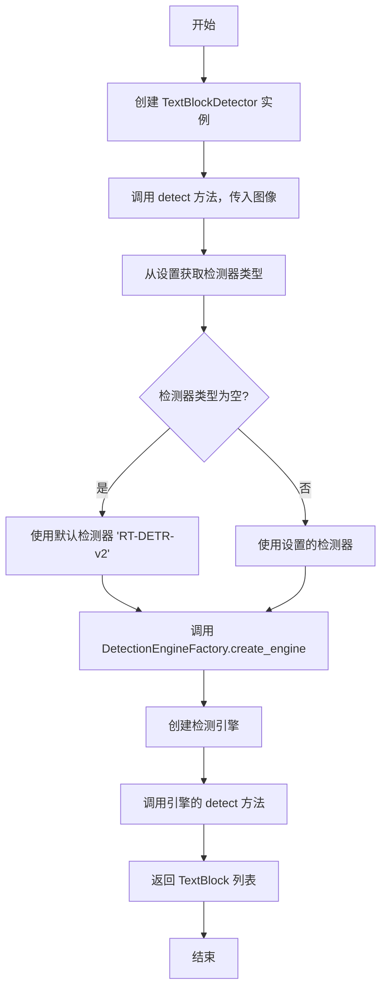
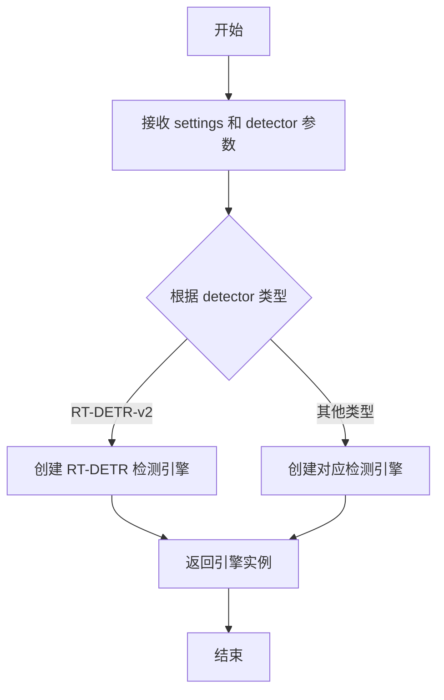
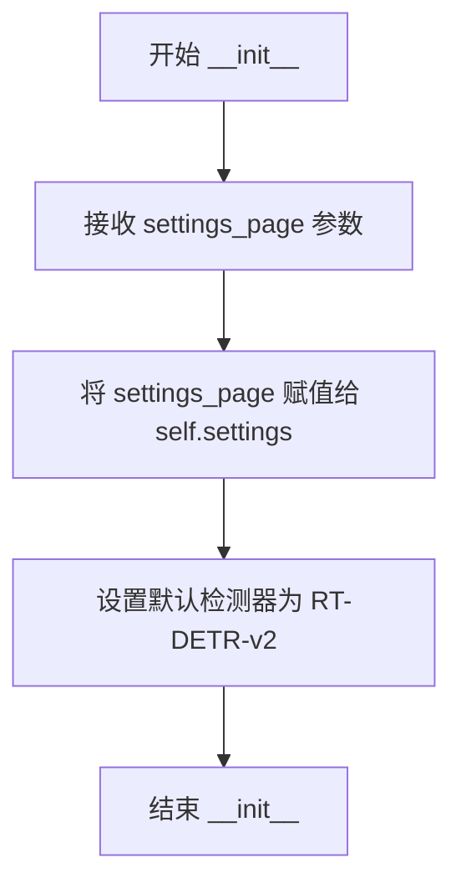

# `comic-translate\modules\detection\processor.py` 详细设计文档

一个文本块检测器类，用于在图像中查找文本区域，通过检测引擎工厂动态创建相应的检测引擎（默认为RT-DETR-v2），并返回检测到的TextBlock列表。

## 整体流程



## 类结构

```
TextBlockDetector (文本块检测器)
├── __init__ (初始化方法)
└── detect (检测方法)
    └── DetectionEngineFactory.create_engine (依赖)
    └── TextBlock (返回类型)
```

## 全局变量及字段


### `TextBlockDetector.settings`
    
页面设置对象，用于获取工具选择和配置

类型：`settings_page`
    


### `TextBlockDetector.detector`
    
检测器类型字符串，默认值为 'RT-DETR-v2'

类型：`str`
    
    

## 全局函数及方法


### `DetectionEngineFactory.create_engine`

工厂方法，用于根据配置动态创建检测引擎实例，支持多种检测器的灵活切换。

参数：

- `settings`：`object`，包含页面设置和工具选择配置的对象，用于获取检测器相关配置
- `detector`：`str`，检测器类型标识符（如 'RT-DETR-v2'），指定要创建的检测引擎类型

返回值：`object`，检测引擎实例，需实现 `detect(img)` 方法用于执行文本块检测

#### 流程图



#### 带注释源码

```python
# 从工厂模块导入检测引擎工厂类
from .factory import DetectionEngineFactory

# 在 TextBlockDetector 的 detect 方法中调用工厂方法
def detect(self, img: np.ndarray) -> list[TextBlock]:
    # 获取用户配置的检测器类型，若未配置则使用默认值 'RT-DETR-v2'
    self.detector = self.settings.get_tool_selection('detector') or self.detector
    
    # 调用工厂方法创建检测引擎实例
    # 参数1: settings - 传递页面配置对象
    # 参数2: detector - 传递检测器类型字符串
    engine = DetectionEngineFactory.create_engine(
        self.settings, self.detector
    )
    
    # 使用创建的引擎执行图像检测并返回结果
    return engine.detect(img)
```


### `TextBlockDetector.__init__`

初始化文本块检测器实例，设置页面配置对象和默认检测器模型。

参数：

- `settings_page`：`Any`，页面配置对象，用于获取检测器相关设置

返回值：`None`，构造函数无返回值

#### 流程图



#### 带注释源码

```python
def __init__(self, settings_page):
    """
    初始化 TextBlockDetector 检测器实例。
    
    参数:
        settings_page: 页面配置对象，用于获取检测器选择等设置
    """
    self.settings = settings_page  # 存储页面配置对象供后续detect方法使用
    self.detector = 'RT-DETR-v2'    # 设置默认检测器模型为RT-DETR-v2
```


### `TextBlockDetector.detect`

该方法为核心检测接口，首先从设置中获取用户选择的检测器（如RT-DETR-v2），然后通过工厂模式创建对应的检测引擎，最后调用引擎的detect方法对输入图像进行文本块检测，返回检测到的所有文本块列表。

参数：

- `img`：`np.ndarray`，输入的图像数据，通常为OpenCV或PIL读取的图像数组

返回值：`list[TextBlock]`，检测到的文本块对象列表，每个TextBlock代表图像中识别出的一个文本区域

#### 流程图

```mermaid
flowchart TD
    A[开始 detect 方法] --> B[获取 detector 设置]
    B --> C{检测器是否已选择?}
    C -->|是| D[使用用户选择的检测器]
    C -->|否| E[使用默认检测器 RT-DETR-v2]
    D --> F[调用 DetectionEngineFactory.create_engine]
    E --> F
    F --> G[创建具体的检测引擎实例]
    G --> H[调用 engine.detect img]
    H --> I[返回检测结果 list[TextBlock]]
    I --> J[结束]
```

#### 带注释源码

```python
def detect(self, img: np.ndarray) -> list[TextBlock]:
    """
    Detect text blocks in the given image.
    
    Args:
        img: Input image as numpy array (typically from OpenCV or PIL)
    
    Returns:
        List of TextBlock objects representing detected text regions
    """
    # 从设置中获取用户选择的检测器，若未选择则使用默认值
    self.detector = self.settings.get_tool_selection('detector') or self.detector
    
    # 使用工厂模式根据检测器类型创建对应的检测引擎
    engine = DetectionEngineFactory.create_engine(
        self.settings, self.detector
    )
    
    # 调用引擎的detect方法执行实际的文本块检测
    return engine.detect(img)
```

## 关键组件


### TextBlockDetector 类

文本块检测器主类，负责在图像中查找文本块，支持可配置的检测引擎。

### DetectionEngineFactory.create_engine 工厂方法

工厂方法，根据配置动态创建检测引擎实例，实现检测器类型的可插拔架构。

### TextBlock 数据模型

文本块数据结构，表示检测到的文本区域，包含位置、尺寸等属性。

### settings_page 配置对象

设置页面对象，提供工具选择等配置信息的访问接口。

### detect 检测方法

核心检测方法，接收图像输入，返回检测到的文本块列表。

### 量化策略支持

代码通过工厂模式支持多种检测器，便于扩展量化策略和不同的推理引擎。

### RT-DETR-v2 默认检测器

预置的默认检测器模型，提供开箱即用的文本检测能力。


## 问题及建议


### 已知问题

- 硬编码检测器名称 `'RT-DETR-v2'` 作为默认值，缺乏配置灵活性
- 每次调用 `detect` 方法都会通过工厂重新创建检测引擎实例，未实现引擎缓存机制，性能开销较大
- 缺少异常处理逻辑，未对 `settings` 为 `None`、`get_tool_selection` 返回无效值、`engine.detect(img)` 抛出异常等情况进行捕获
- 类型注解不标准，`list[TextBlock]` 应使用 `typing.List[TextBlock]` 以确保 Python 3.9 以下版本的兼容性
- `settings_page` 参数缺乏类型提示，且无文档说明其预期结构和必需方法
- 未实现资源管理（如引擎的 `close()` 或 `cleanup()` 方法），可能导致检测引擎占用的 GPU/内存资源无法及时释放

### 优化建议

- 将默认检测器名称提取为配置文件或类常量，提升可维护性
- 引入引擎实例缓存机制（如使用 `functools.lru_cache` 或手动缓存），避免重复创建相同配置下的检测引擎
- 添加完整的异常处理和输入验证逻辑，确保代码健壮性
- 统一使用 `from typing import List` 进行类型注解
- 为 `settings_page` 参数添加类型提示（如 `Any` 或定义具体类型），并在类文档中说明其接口契约
- 实现上下文管理器协议（`__enter__`/`__exit__`）或添加资源清理方法，确保资源正确释放

## 其它


### 设计目标与约束

本模块旨在实现一个灵活的文本块检测框架，支持多种检测引擎的动态切换。设计目标包括：解耦检测器实现与业务逻辑，通过工厂模式实现可扩展的检测引擎管理，支持运行时动态选择检测算法。约束条件包括：依赖Python 3.9+的类型注解特性，需与settings_page对象紧密耦合，检测器必须继承自DetectionEngineBase接口。

### 错误处理与异常设计

异常处理策略采用分层设计：DetectionEngineFactory.create_engine()可能抛出EngineNotFoundError(检测器不存在)、ConfigurationError(配置错误)等异常；engine.detect()可能抛出DetectionError(检测失败)、ImageFormatError(图像格式错误)等异常。调用方需捕获并处理这些异常，建议记录日志后返回空列表或重新抛出上层异常。所有异常应继承自自定义的TextBlockDetectorException基类。

### 数据流与状态机

数据流为：输入图像(np.ndarray) → Settings获取检测器配置 → Factory创建检测引擎 → Engine执行检测 → 返回TextBlock列表。状态机包含三种状态：IDLE(初始状态)、PROCESSING(检测中)、COMPLETED(完成)或ERROR(错误)。状态转换由detect()方法触发，检测完成后自动重置回IDLE状态。

### 外部依赖与接口契约

核心依赖包括：numpy(图像数据处理)、DetectionEngineFactory(引擎工厂类)、DetectionEngine基类(所有检测器需继承)、TextBlock(结果数据模型)、settings_page对象(需实现get_tool_selection()方法)。接口契约规定：DetectionEngine需实现detect(img: np.ndarray) -> list[TextBlock]方法；settings_page需实现get_tool_selection(key: str) -> Optional[str]方法；TextBlock需包含bbox、text、confidence等属性。

### 性能要求与限制

检测性能要求：单张图像处理时间应低于500ms(720p分辨率)，内存占用应控制在200MB以内。支持的最大图像尺寸为4096x4096像素，超出部分需进行下采样处理。建议对连续调用进行批处理优化，避免频繁创建检测引擎实例。

### 配置管理

检测器配置通过settings_page统一管理，支持运行时动态切换。配置项包括：detector(检测器类型)、confidence_threshold(置信度阈值)、nms_threshold(NMS阈值)等。配置变更后需重新创建检测引擎实例以生效。建议在应用启动时验证配置合法性。

### 安全性考虑

图像输入需进行基本校验：检查是否为numpy数组、是否为三维矩阵(高度x宽度x通道数)、数据类型是否为uint8或float32。防止通过恶意构造的图像数据导致内存溢出或检测器崩溃。建议对图像尺寸进行上限检查，对异常输入返回空列表而非抛出异常。

### 版本兼容性

本模块需与DetectionEngineFactory的版本保持兼容，建议在初始化时进行接口版本检查。TextBlock的数据结构需保持向后兼容，新版本应在不影响旧代码的前提下扩展字段。建议在文档中明确标注各组件的版本依赖关系。


    