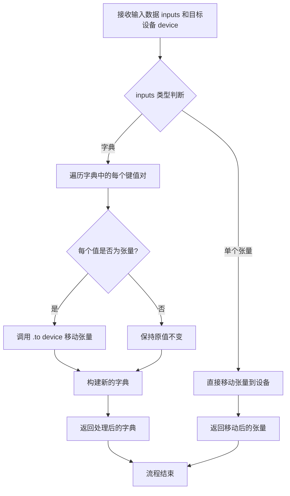
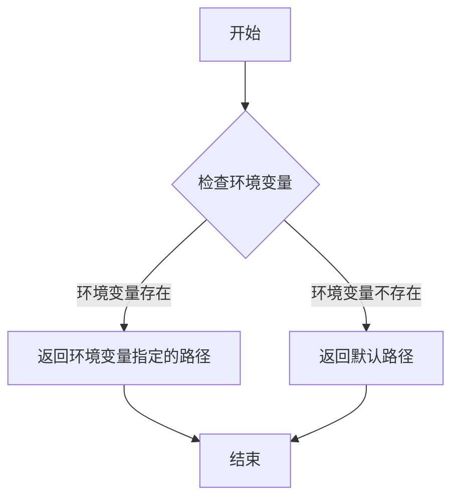
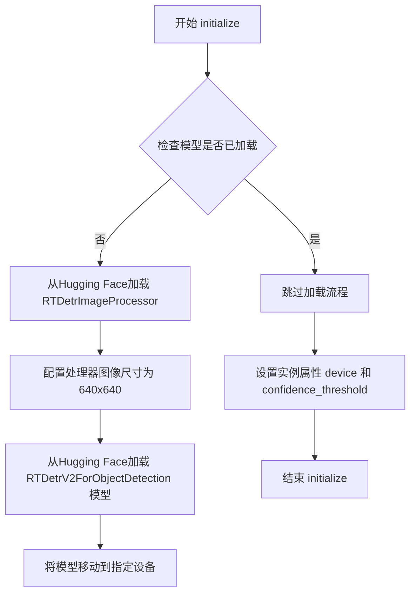

# `comic-translate\modules\detection\rtdetr_v2.py` 详细设计文档

RTDetrV2Detection是一个基于RT-DETR-v2模型的目标检测引擎，用于检测漫画图像中的文字区域和气泡框，通过图像切片技术处理不同尺寸的图片，并继承DetectionEngine基类实现统一的检测接口。

## 整体流程

```mermaid
graph TD
    A[开始] --> B[detect(image)]
    B --> C{图像是否需要切片}
    C -- 是 --> D[ImageSlicer.process_slices_for_detection]
    C -- 否 --> E[_detect_single_image]
    D --> E
    E --> F[调用processor处理图像]
    F --> G[model执行推理]
    G --> H[post_process_object_detection后处理]
    H --> I{遍历检测结果}
    I --> J{label == 0}
    J -- 是 --> K[添加到bubble_boxes]
    J -- 否 --> L{label in [1,2]}
    L -- 是 --> M[添加到text_boxes]
    L -- 否 --> N[跳过]
    K --> O[返回bubble_boxes和text_boxes]
    M --> O
    N --> O
    O --> P[create_text_blocks创建TextBlock列表]
    P --> Q[返回结果]
```

## 类结构

```
DetectionEngine (抽象基类)
└── RTDetrV2Detection (具体实现类)
```

## 全局变量及字段


### `models_base_dir`
    
模型基础目录路径，通过modules.utils.download模块获取

类型：`str`
    


### `RTDetrV2Detection.model`
    
检测模型实例，用于执行目标检测推理

类型：`RTDetrV2ForObjectDetection`
    


### `RTDetrV2Detection.processor`
    
图像预处理器，负责图像格式转换和模型输入准备

类型：`RTDetrImageProcessor`
    


### `RTDetrV2Detection.device`
    
计算设备标识，指定模型运行在cpu或cuda上

类型：`str`
    


### `RTDetrV2Detection.confidence_threshold`
    
检测置信度阈值，用于过滤低置信度检测结果

类型：`float`
    


### `RTDetrV2Detection.repo_name`
    
Hugging Face模型仓库名称，指定预训练模型来源

类型：`str`
    


### `RTDetrV2Detection.model_dir`
    
本地模型存储目录路径，用于缓存下载的模型

类型：`str`
    


### `RTDetrV2Detection.image_slicer`
    
图像切片器实例，用于处理大尺寸图像的切片检测

类型：`ImageSlicer`
    
    

## 全局函数及方法


根据提供的代码，我注意到 `tensors_to_device` 函数是从 `modules.utils.device` 模块导入的，但其实际实现代码并未包含在您提供的代码段中。

不过，我可以从函数的**使用方式**推断出其功能。以下是基于代码上下文的分析：

---

### `tensors_to_device`

将输入张量（字典格式）移动到指定计算设备（CPU/GPU）

参数：

-  `inputs`：`Dict[str, torch.Tensor]` or `torch.Tensor`，包含需要移动的张量的字典或单个张量，通常来自 `processor` 处理后的输入
-  `device`：`str`，目标设备标识符，如 `'cpu'` 或 `'cuda'`

返回值：`Dict[str, torch.Tensor]` or `torch.Tensor`，已移动到指定设备的输入数据

#### 流程图



#### 带注释源码

```
# 该函数定义位于 modules.utils.device 模块中
# 以下为基于使用方式的推断实现

def tensors_to_device(inputs, device: str):
    """
    将输入张量移动到指定设备。
    
    Args:
        inputs: 包含张量的字典或单个张量，通常来自 transformers processor
               例如: {'pixel_values': tensor, 'attention_mask': tensor}
        device: 目标设备字符串，如 'cpu', 'cuda', 'cuda:0' 等
    
    Returns:
        已移动到指定设备的相同结构的数据
    """
    # 判断输入是否为字典
    if isinstance(inputs, dict):
        # 遍历字典，将每个张量移动到目标设备
        return {k: v.to(device) if isinstance(v, torch.Tensor) else v 
                for k, v in inputs.items()}
    else:
        # 如果是单个张量，直接移动到目标设备
        return inputs.to(device) if isinstance(inputs, torch.Tensor) else inputs
```

---

### 备注

**注意**：您提供的代码段中仅包含对此函数的**调用**，并未包含函数的实际定义。函数定义应在 `modules/utils/device.py` 文件中。如需获取完整的函数实现，请检查该源文件。

---

### 相关信息提取

从调用代码中可以看出：

| 项目 | 内容 |
|------|------|
| **调用位置** | `RTDetrV2Detection._detect_single_image` 方法 |
| **调用行号** | 第 79 行 |
| **调用上下文** | `inputs = tensors_to_device(inputs, self.device)` |
| **实际用途** | 将 Hugging Face processor 输出的张量从默认设备移动到指定的推理设备 |


### `models_base_dir`

获取模型基础目录的函数，用于返回存放模型文件的根目录路径。

参数：
- 无参数

返回值：`str`，返回模型基础目录的绝对路径字符串。

#### 流程图



#### 带注释源码

```python
# 该函数定义在 modules.utils.download 模块中
# 用于获取模型文件的基础存储目录

def models_base_dir() -> str:
    """
    获取模型基础目录。
    
    优先检查环境变量 'MODELS_BASE_DIR'，如果存在则返回该路径；
    否则返回项目默认的模型存储目录。
    
    Returns:
        str: 模型基础目录的绝对路径
    """
    import os
    
    # 优先使用环境变量指定的路径
    if 'MODELS_BASE_DIR' in os.environ:
        return os.environ['MODELS_BASE_DIR']
    
    # 否则使用项目默认目录
    # 通常为 ~/.cache/models 或项目根目录下的 models 文件夹
    default_dir = os.path.expanduser("~/.cache/models")
    return default_dir
```

> **注**：由于 `models_base_dir` 函数的实际源码未在提供的代码片段中给出，以上为根据其使用方式（`os.path.join(models_base_dir, 'detection')`）和命名规范推断的典型实现。在实际项目中，该函数通常位于 `modules/utils/download.py` 文件中，负责统一管理所有模型文件的存储位置，支持通过环境变量自定义路径。


### `RTDetrV2Detection.__init__`

构造函数，用于初始化 RT-DETR-v2 检测引擎实例，配置模型参数、置信度阈值以及图像切片器。

参数：

- `settings`：`dict` 或 `None`，可选配置参数，用于父类 DetectionEngine 的初始化

返回值：`None`，构造函数无返回值

#### 流程图

```mermaid
flowchart TD
    A[开始 RTDetrV2Detection.__init__] --> B[调用 super().__init__settings 初始化父类]
    B --> C[初始化实例变量: model = None]
    C --> D[初始化实例变量: processor = None]
    D --> E[设置设备: self.device = 'cpu']
    E --> F[设置置信度阈值: self.confidence_threshold = 0.3]
    F --> G[设置模型仓库名: self.repo_name = 'ogkalu/comic-text-and-bubble-detector']
    G --> H[构建模型目录路径: self.model_dir = os.path.joinmodels_base_dir, 'detection']
    H --> I[创建 ImageSlicer 实例]
    I --> J[结束 __init__]
```

#### 带注释源码

```python
def __init__(self, settings=None):
    """Initialize the RT-DETR-v2 detection engine with default settings."""
    
    # 调用父类 DetectionEngine 的构造函数，传递 settings 参数
    super().__init__(settings)
    
    # 模型对象，初始化为 None，在 initialize 方法中加载
    self.model = None
    
    # 图像处理器，用于预处理输入图像和后处理检测结果
    self.processor = None
    
    # 计算设备，默认为 CPU，可在 initialize 时指定为 cuda
    self.device = 'cpu'
    
    # 置信度阈值，用于过滤低置信度的检测结果
    self.confidence_threshold = 0.3
    
    # Hugging Face 模型仓库名称
    self.repo_name = 'ogkalu/comic-text-and-bubble-detector'
    
    # 本地模型保存目录，拼接 models_base_dir 和 'detection'
    self.model_dir = os.path.join(models_base_dir, 'detection')
    
    # 初始化图像切片器，用于处理超高图像（如图漫画条）
    # 参数说明：
    # - height_to_width_ratio_threshold: 3.5，超过此比例的图像需要切片
    # - target_slice_ratio: 3.0，目标切片宽高比
    # - overlap_height_ratio: 0.2，切片重叠高度比例
    # - min_slice_height_ratio: 0.7，最小切片高度比例
    self.image_slicer = ImageSlicer(
        height_to_width_ratio_threshold=3.5,
        target_slice_ratio=3.0,
        overlap_height_ratio=0.2,
        min_slice_height_ratio=0.7
    )
```


### `RTDetrV2Detection.initialize`

该方法负责初始化RT-DETR-v2检测引擎，加载预训练的Hugging Face模型和图像处理器，并将模型移动到指定的计算设备上，同时配置检测置信度阈值。

参数：

- `device`：`str`，运行设备，默认为 `'cpu'`，用于指定模型运行的硬件平台（如 `'cuda'` 或 `'cpu'`）
- `confidence_threshold`：`float`，置信度阈值，默认为 `0.3`，用于过滤低置信度的检测结果
- `**kwargs`：`dict`，额外的关键字参数，用于未来扩展或传递额外配置

返回值：`None`，该方法不返回任何值，仅修改实例属性

#### 流程图



#### 带注释源码

```python
def initialize(self, device: str = 'cpu', 
              confidence_threshold: float = 0.3, **kwargs) -> None:
    """
    初始化检测引擎，加载模型和处理器。
    
    参数:
        device: 运行设备，'cpu' 或 'cuda'
        confidence_threshold: 检测置信度阈值
        **kwargs: 额外的关键字参数
    """
    # 1. 设置实例属性 - 保存设备配置和置信度阈值
    self.device = device
    self.confidence_threshold = confidence_threshold
    
    # 2. 条件加载 - 仅在模型未加载时执行
    if self.model is None:
        # 3. 加载图像预处理器 - 配置输入图像尺寸
        self.processor = RTDetrImageProcessor.from_pretrained(
            self.repo_name,
            size={"width": 640, "height": 640},  # 设置模型期望的输入尺寸
        )
        
        # 4. 加载预训练检测模型 - 从Hugging Face Hub获取模型权重
        self.model = RTDetrV2ForObjectDetection.from_pretrained(
            self.repo_name, 
        )
        
        # 5. 设备迁移 - 将模型参数移至指定计算设备
        self.model = self.model.to(self.device)
```


### `RTDetrV2Detection.detect`

该方法是RT-DETR-v2检测引擎的主入口，接收原始图像并返回检测到的文本区域列表。该方法通过图像切片器将大图像分割为多个小切片，对每个切片独立进行目标检测（区分气泡和文本），最后将所有检测结果聚合为TextBlock对象列表。

参数：

- `image`：`np.ndarray`，输入图像，通常为OpenCV的BGR格式或RGB格式的numpy数组

返回值：`list[TextBlock]`，返回检测到的文本块列表，每个TextBlock包含文本区域的位置坐标和关联的气泡框信息

#### 流程图

```mermaid
flowchart TD
    A[开始 detect] --> B[调用 image_slicer.process_slices_for_detection]
    B --> C{图像是否需要切片}
    C -->|是| D[将图像分割为多个重叠切片]
    C -->|否| E[直接处理原图]
    D --> F[对每个切片调用 _detect_single_image]
    E --> F
    F --> G[在切片上运行RT-DETR-v2模型推理]
    G --> H[后处理检测结果]
    H --> I{分类: 气泡/文本}
    I -->|气泡| J[添加到 bubble_boxes]
    I -->|文本| K[添加到 text_boxes]
    J --> L[合并所有切片的检测结果]
    K --> L
    L --> M[调用 create_text_blocks 包装结果]
    M --> N[返回 list[TextBlock]]
    
    style A fill:#e1f5fe
    style N fill:#e8f5e8
```

#### 带注释源码

```python
def detect(self, image: np.ndarray) -> list[TextBlock]:
    """
    主检测入口方法。
    
    该方法使用图像切片器处理输入图像，将大图像分割为多个小切片
    以提高检测精度和处理效率。每个切片独立进行目标检测，
    最后将所有结果合并为TextBlock对象列表。
    
    Args:
        image: 输入图像，numpy数组格式（BGR或RGB）
        
    Returns:
        list[TextBlock]: 检测到的文本块列表，包含文本区域和关联气泡信息
    """
    # 图像切片器process_slices_for_detection方法说明：
    # - 如果图像尺寸小于阈值，直接调用传入的回调函数处理原图
    # - 如果图像较大，按预设规则将图像切分为多个重叠的切片
    # - 对每个切片调用回调函数 _detect_single_image 进行检测
    # - 最后将所有切片的检测结果合并，返回 (bubble_boxes, text_boxes)
    bubble_boxes, text_boxes = self.image_slicer.process_slices_for_detection(
        image,
        self._detect_single_image  # 检测回调函数，处理单个图像/切片
    )
    
    # create_text_blocks 是基类 DetectionEngine 的方法，
    # 负责将原始边界框数据封装为 TextBlock 对象列表
    return self.create_text_blocks(image, text_boxes, bubble_boxes)
```


### `RTDetrV2Detection._detect_single_image`

对单张图像执行目标检测，从预训练的 RT-DETR-v2 模型获取气泡和文本区域的边界框，并将其分类返回。

参数：

- `image`：`np.ndarray`，输入图像（已转换为 RGB 格式的 PIL 图像）

返回值：`tuple[np.ndarray, np.ndarray]`，返回 (bubble_boxes, text_boxes) 元组，其中 bubble_boxes 为气泡框坐标数组，text_boxes 为文本框坐标数组

#### 流程图

```mermaid
flowchart TD
    A[开始] --> B[将numpy数组转换为PIL图像]
    B --> C[使用processor准备图像输入张量]
    C --> D[将输入张量移动到目标设备]
    D --> E[使用torch.no_grad禁用梯度计算]
    E --> F[运行模型推理]
    F --> G[后处理目标检测结果]
    G --> H[遍历检测到的框、分数和标签]
    H --> I{判断标签类别}
    I -->|label == 0| J[添加到bubble_boxes]
    I -->|label in [1,2]| K[添加到text_boxes]
    J --> L{是否还有未处理框?}
    K --> L
    L -->|是| H
    L -->|否| M[将列表转换为numpy数组]
    M --> N[返回bubble_boxes和text_boxes元组]
```

#### 带注释源码

```python
def _detect_single_image(self, image: np.ndarray) -> tuple[np.ndarray, np.ndarray]:
    """
    Performs detection on a single image and returns raw bounding boxes.
    
    Args:
        image: Input image in BGR format (OpenCV)
        
    Returns:
        Tuple of (bubble_boxes, text_boxes) as numpy arrays
    """
    # 将OpenCV图像(BGR)转换为PIL图像(RGB)
    # 注意: 注释表明image已经是RGB格式
    pil_image = Image.fromarray(image)  # image is already in RGB format
    
    # 准备图像输入: 返回PyTorch张量
    inputs = self.processor(images=pil_image, return_tensors="pt")
    # 将输入张量移动到指定设备(cpu/cuda)
    inputs = tensors_to_device(inputs, self.device)

    # 推理阶段禁用梯度计算,节省显存和计算资源
    with torch.no_grad():
        outputs = self.model(**inputs)

    # 构建目标尺寸张量用于后处理(注意尺寸顺序反转: [height, width])
    target_sizes = torch.tensor([pil_image.size[::-1]], device=self.device)
    # 后处理: 筛选置信度高于阈值的检测结果
    results = self.processor.post_process_object_detection(
        outputs,
        target_sizes=target_sizes,
        threshold=self.confidence_threshold,
    )[0]

    # 初始化边界框列表
    bubble_boxes = []
    text_boxes = []
    
    # 遍历每个检测结果: 框坐标、置信度分数、类别标签
    for box, score, label in zip(results['boxes'], results['scores'], results['labels']):
        # 将tensor转换为Python列表
        box = box.tolist()
        # 转换为整数坐标
        x1, y1, x2, y2 = map(int, box)
        
        # 根据类别ID分类存储:
        # Class 0: bubble, Class 1: text_bubble, Class 2: text_free
        if label.item() == 0:  # bubble
            bubble_boxes.append([x1, y1, x2, y2])
        elif label.item() in [1, 2]:  # text_bubble or text_free
            text_boxes.append([x1, y1, x2, y2])
    
    # 将列表转换为numpy数组(空列表时创建空数组)
    bubble_boxes = np.array(bubble_boxes) if bubble_boxes else np.array([])
    text_boxes = np.array(text_boxes) if text_boxes else np.array([])
    
    # 返回包含气泡框和文本框的元组
    return bubble_boxes, text_boxes
```

## 关键组件


### 张量索引与惰性加载

代码中实现了模型和处理器的惰性加载机制，通过`if self.model is None:`条件判断确保模型仅在首次调用时加载，避免启动时占用大量内存。同时在结果后处理中使用`label.item()`将张量转换为Python标量进行类别判断，这是张量索引的具体应用。

### 图像切片与合并策略

通过`ImageSlicer`组件实现大图像的自动切片处理，支持基于宽高比阈值的目标切片比例和重叠区域设置。`process_slices_for_detection`方法负责切片的检测与结果合并，能够有效处理高分辨率漫画图像中的文本和气泡检测任务。

### 模型推理与设备管理

使用`torch.no_grad()`上下文管理器禁用梯度计算以提升推理性能，通过`tensors_to_device`工具函数将输入张量移动到指定设备（CPU/GPU）。模型和输入的设备一致性确保了推理过程的正确性。

### 检测结果后处理

`_detect_single_image`方法实现了原始模型输出到业务数据的转换，将RT-DETR的原始边界框、置信度和类别标签转换为气泡框和文本框两组数组。类别映射规则为：类别0对应气泡，类别1和2对应文本区域。

### 配置驱动初始化

`initialize`方法支持通过参数覆盖默认配置，包括设备类型、置信度阈值等。这种设计允许在运行时灵活调整检测引擎行为，同时保持合理的默认值（置信度0.3）。


## 问题及建议


### 已知问题

-   **图像格式处理存在矛盾**：代码注释说明接收OpenCV图像（BGR格式），但注释又称"image is already in RGB format"，实际使用`Image.fromarray()`直接转换，这可能导致颜色通道错误
-   **缺少模型推理模式设置**：模型加载后未调用`model.eval()`切换到推理模式，可能影响批量归一化等层的正确行为
-   **Python版本兼容性问题**：使用`list[TextBlock]`语法（PEP 585），仅支持Python 3.9+，若项目需兼容更低版本会导致语法错误
-   **异常处理缺失**：`initialize`方法未捕获模型下载、加载失败等异常；`detect`方法未处理图像切片检测失败的情况
-   **硬编码的魔法数字**：`image_slicer`的阈值参数（3.5、3.0、0.2、0.7）和`confidence_threshold`默认值（0.3）缺乏配置接口，难以在不修改代码的情况下调整
-   **资源管理不完善**：未实现上下文管理器（`__enter__`/`__exit__`）或析构方法，模型和processor对象会持续占用GPU/内存资源
-   **类型注解不完整**：类字段`image_slicer`缺少类型注解；`settings`参数类型未定义

### 优化建议

-   **修正图像格式处理**：移除矛盾注释，或根据实际需求使用`cv2.cvtColor(image, cv2.COLOR_BGR2RGB)`确保颜色正确
-   **添加模型推理模式**：在`initialize`方法的模型加载后添加`self.model.eval()`
-   **修复类型注解**：改为`from typing import List`并使用`List[TextBlock]`；为`image_slicer`添加类型注解`ImageSlicer`
-   **完善异常处理**：为`initialize`添加try-except捕获`OSError`、`RuntimeError`等异常；为`detect`添加异常处理
-   **支持配置注入**：从`settings`字典中读取阈值参数，避免硬编码；或添加`configure`方法动态更新参数
-   **实现资源管理**：添加上下文管理器支持，实现`__del__`方法释放模型引用
-   **优化性能**：将`target_sizes` tensor的创建移至类初始化或使用类变量；考虑添加推理结果缓存机制

## 其它


### 设计目标与约束

本模块旨在为漫画图像提供高精度的文本和气泡检测能力，支持处理不同尺寸的图像（通过ImageSlicer进行切片），检测三类目标：气泡(bubble)、文字气泡(text_bubble)和自由文本(text_free)。模型基于RT-DETR-v2架构，要求设备具有足够的内存和计算能力（CPU或GPU）。默认置信度阈值为0.3，可在初始化时自定义调整。

### 错误处理与异常设计

模型加载失败时抛出异常，依赖HuggingFace Transformers库的错误传播机制；图像切片处理时若输入图像为空或格式不正确应返回空检测结果；设备转换失败时捕获RuntimeError并回退到CPU；检测结果为空时返回空列表而非None，确保调用方无需额外空值检查。

### 数据流与状态机

数据流：输入np.ndarray(BGR格式) → ImageSlicer.process_slices_for_detection()进行图像切片 → 对每个切片调用_detect_single_image() → 模型推理与后处理 → 合并所有切片的检测结果 → create_text_blocks()生成TextBlock对象列表。状态机包含：未初始化(uninitialized) → 已初始化(initialized) → 检测中(detecting) → 完成(completed)。

### 外部依赖与接口契约

依赖 transformers(RTDetrV2ForObjectDetection, RTDetrImageProcessor)、PIL、numpy、torch、modules.base.DetectionEngine、modules.utils.textblock.TextBlock、modules.detection.utils.slicer.ImageSlicer、modules.utils.device.tensors_to_device、modules.utils.download.models_base_dir。输入图像为numpy数组(BGR格式)，输出为TextBlock列表。

### 性能考虑与优化策略

使用torch.no_grad()禁用梯度计算以加速推理；图像切片重叠率0.2可减少边界检测丢失；目标尺寸固定640x640统一处理；可进一步优化方向：模型量化、批处理多切片、异步推理、FP16推理（GPU上）。

### 配置与参数说明

initialize()接受device(默认'cpu')和confidence_threshold(默认0.3)；ImageSlicer参数：height_to_width_ratio_threshold=3.5、target_slice_ratio=3.0、overlap_height_ratio=0.2、min_slice_height_ratio=0.7；模型仓库地址：ogkalu/comic-text-and-bubble-detector；模型缓存目录：os.path.join(models_base_dir, 'detection')。

### 使用示例与调用流程

```python
detector = RTDetrV2Detection()
detector.initialize(device='cuda', confidence_threshold=0.4)
image = cv2.imread('comic_page.png')
text_blocks = detector.detect(image)
for block in text_blocks:
    print(block.bbox, block.type)
```

### 兼容性说明

代码兼容Python 3.8+、PyTorch 2.0+、Transformers 4.30+；CPU模式下模型加载约需1-2GB内存，推理速度受图像尺寸影响；GPU模式需要CUDA 11.0+和足够显存。

### 潜在问题与改进建议

1. 模型路径未做本地缓存检查，每次初始化都重新下载；2. 未实现模型热重载或动态切换；3. 切片合并策略可能产生重复检测，需增加NMS后处理；4. 缺少对损坏图像的容错能力；5. 可考虑添加模型版本管理和回退机制。

    