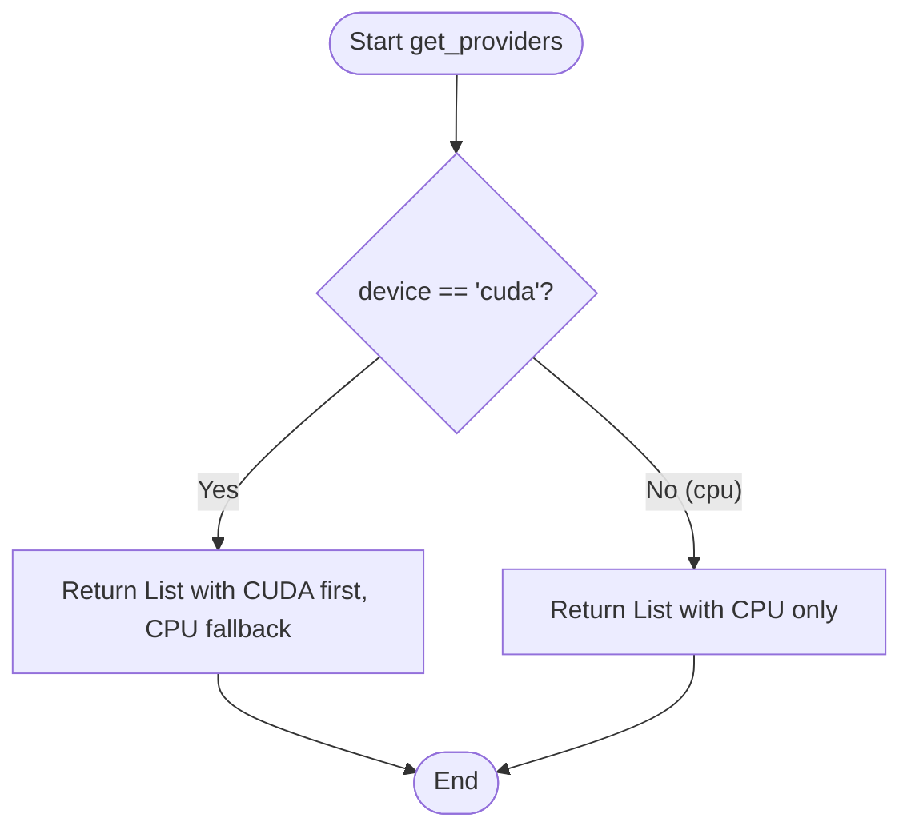
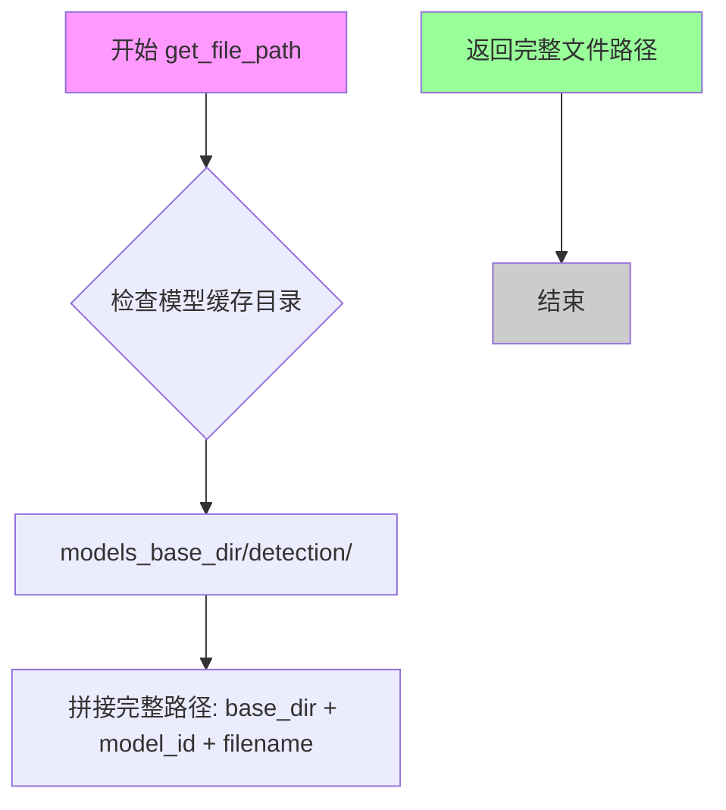
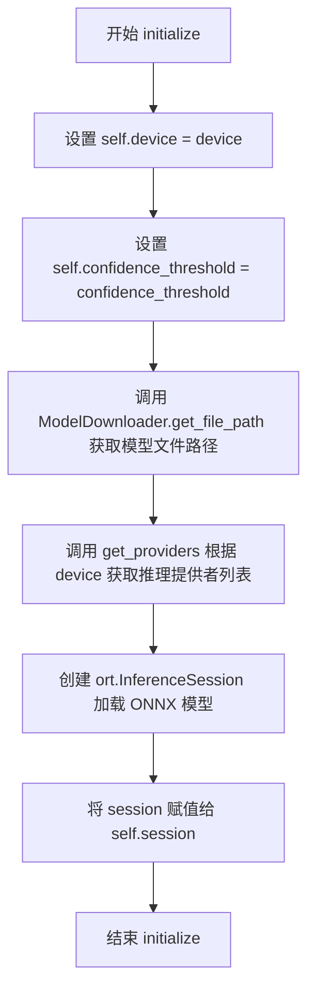
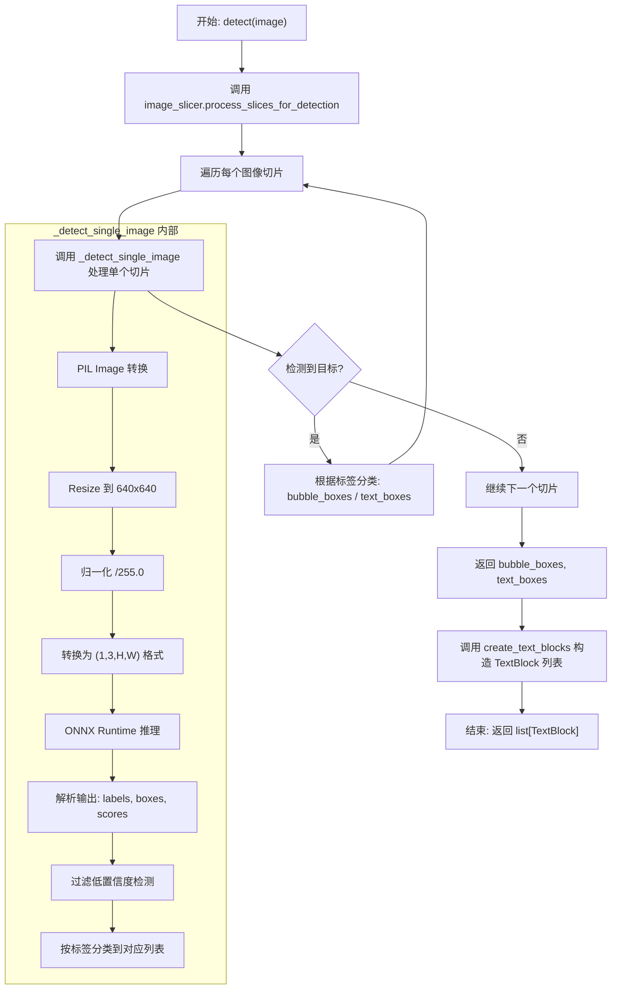
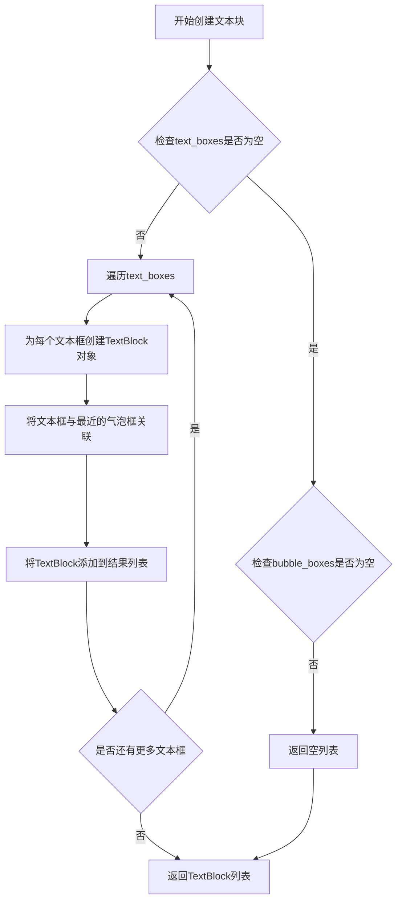

# `comic-translate\modules\detection\rtdetr_v2_onnx.py` 详细设计文档

RTDetrV2ONNXDetection是一个基于RT-DETR-v2 ONNX模型的目标检测引擎，用于检测图像中的文本区域和气泡框。该类继承自DetectionEngine抽象基类，通过ONNX Runtime进行推理，利用ImageSlicer对大图像进行切片处理，最终返回TextBlock列表。

## 整体流程

```mermaid
graph TD
A[开始检测] --> B[调用 detect 方法]
B --> C[使用 image_slicer 对图像进行切片处理]
C --> D[对每个切片调用 _detect_single_image]
D --> E[图像预处理: 缩放到640x640, 归一化, 转换维度]
E --> F[调用 ONNX session.run 进行推理]
F --> G[解析输出: labels, boxes, scores]
G --> H{置信度 > confidence_threshold?}
H -- 否 --> I[跳过该检测结果]
H -- 是 --> J{label_id == 0?}
J -- 是 --> K[添加到 bubble_boxes]
J -- 否 --> L{label_id in [1,2]?}
L -- 是 --> M[添加到 text_boxes]
L -- 否 --> N[跳过]
K --> O[所有检测框处理完成]
M --> O
N --> O
O --> P[调用 create_text_blocks 创建 TextBlock 列表]
P --> Q[返回 TextBlock 列表]
```

## 类结构

```
DetectionEngine (抽象基类)
└── RTDetrV2ONNXDetection (ONNX检测引擎实现)
```

## 全局变量及字段


### `os`
    
Python标准库，提供操作系统交互功能

类型：`module`
    


### `np`
    
NumPy库，提供高效的数值计算和数组操作功能

类型：`module`
    


### `Image`
    
PIL图像库，提供图像打开、处理和转换功能

类型：`module`
    


### `ort`
    
ONNX Runtime库，提供ONNX模型推理功能

类型：`module`
    


### `get_providers`
    
获取ONNX Runtime可用的计算提供者列表

类型：`function`
    


### `ModelDownloader`
    
模型下载器，用于下载和管理模型文件

类型：`class`
    


### `ModelID`
    
模型标识符，定义模型ID和版本信息

类型：`class`
    


### `models_base_dir`
    
模型基础目录，存储所有模型文件的根目录

类型：`str`
    


### `TextBlock`
    
文本块数据结构，包含文本区域的位置和信息

类型：`class`
    


### `ImageSlicer`
    
图像切片处理器，用于将大图切分为小图进行检测

类型：`class`
    


### `DetectionEngine`
    
检测引擎基类，定义检测接口和通用方法

类型：`class`
    


### `RTDetrV2ONNXDetection.session`
    
ONNX推理会话，用于执行模型推理

类型：`ort.InferenceSession`
    


### `RTDetrV2ONNXDetection.device`
    
运行设备，指定在CPU或CUDA上运行

类型：`str`
    


### `RTDetrV2ONNXDetection.confidence_threshold`
    
置信度阈值，用于过滤低置信度的检测结果

类型：`float`
    


### `RTDetrV2ONNXDetection.model_dir`
    
模型目录路径，存储检测模型的目录

类型：`str`
    


### `RTDetrV2ONNXDetection.image_slicer`
    
图像切片处理器，用于处理大尺寸图像的切片和拼接

类型：`ImageSlicer`
    
    

## 全局函数及方法


### `modules.utils.device.get_providers`

该函数是一个工具函数，用于根据传入的设备字符串（`device`）返回对应的 ONNX Runtime 执行提供者（Execution Providers）列表。通常在创建 ONNX Runtime 推理会话（`InferenceSession`）时使用，以确保模型在指定的硬件（如 CPU 或 GPU）上运行。如果指定了 CUDA 设备，通常会返回包含 CUDA 和 CPU（作为后备）的列表，以确保兼容性。

参数：

- `device`：`str`，指定运行设备，常见值为 `'cpu'` 或 `'cuda'`。

返回值：`list[str]`，返回包含 ONNX Runtime provider 字符串的列表（例如 `['CPUExecutionProvider']` 或 `['CUDAExecutionProvider', 'CPUExecutionProvider']`）。

#### 流程图



#### 带注释源码

*注：由于源代码未直接提供，以下源码为基于 `RTDetrV2ONNXDetection` 类中的调用方式及 ONNX Runtime 常规用法推断的典型实现。*

```python
def get_providers(device: str = 'cpu') -> list[str]:
    """
    获取ONNX Runtime的providers列表。
    
    根据指定的设备类型，返回适合的ONNX Runtime执行提供者。
    通常CUDA作为首选，CPU作为后备，以保证在CUDA不可用时自动回退到CPU。

    参数:
        device (str): 目标设备标识符。例如 'cpu', 'cuda', 'cuda:0'。

    返回:
        list[str]: 包含provider名称的列表。
    """
    if device == 'cuda':
        # 如果设备是CUDA，优先使用GPU执行提供者，其次回退到CPU
        return ['CUDAExecutionProvider', 'CPUExecutionProvider']
    else:
        # 默认或CPU设备，仅使用CPU执行提供者
        return ['CPUExecutionProvider']
```


### `ModelDownloader.get_file_path`

获取模型文件的完整磁盘路径，用于定位预下载的ONNX模型文件。

参数：

- `model_id`：`ModelID`，模型标识符枚举值，指定要获取的模型类型（如 `ModelID.RTDETR_V2_ONNX`）
- `filename`：`str`，模型文件的名称（如 `'detector.onnx'`）

返回值：`str`，模型文件的完整磁盘路径

#### 流程图



#### 带注释源码

```python
# 注意：以下是基于调用方式推断的实现逻辑，并非原始源码
# 实际源码位于 modules/utils/download.py

# 静态方法调用示例（来自 RTDetrV2ONNXDetection.initialize）
file_path = ModelDownloader.get_file_path(ModelID.RTDETR_V2_ONNX, 'detector.onnx')

# 方法签名推断：
@staticmethod
def get_file_path(model_id: ModelID, filename: str) -> str:
    """
    获取模型文件的完整路径
    
    参数:
        model_id: ModelID 枚举，标识模型类型
        filename: str，要获取的文件名
    
    返回:
        str，模型文件的完整路径
    """
    # 1. 获取基础模型目录（来自全局变量 models_base_dir）
    # 2. 根据 model_id 确定子目录（如 'detection'）
    # 3. 拼接完整路径并返回
    
    # 示例返回路径：
    # /path/to/models/detection/RTDETR_V2_ONNX/detector.onnx
    pass
```

> **说明**：由于 `ModelDownloader` 类的源码未在当前代码片段中提供，以上为基于调用方式的逻辑推断。实际实现可能包含缓存检查、下载触发、路径验证等逻辑。


### `RTDetrV2ONNXDetection.__init__`

构造函数，初始化 RT-DETR-v2 ONNX 检测引擎的各个核心字段，包括会话、设备、置信度阈值、模型目录，以及用于图像切片处理的 ImageSlicer 实例。

参数：

- `settings`：`dict` 或 `None`，可选配置参数，用于传递给父类 DetectionEngine 的初始化配置，默认为 None

返回值：`None`，构造函数无显式返回值

#### 流程图

```mermaid
flowchart TD
    A[开始 __init__] --> B[调用 super().__init__(settings)]
    B --> C[初始化 self.session = None]
    C --> D[设置 self.device = 'cpu']
    D --> E[设置 self.confidence_threshold = 0.3]
    E --> F[构建 self.model_dir = os.path.join(models_base_dir, 'detection')]
    F --> G[创建 ImageSlicer 实例赋值给 self.image_slicer]
    G --> H[结束 __init__]

    G -.-> G1[height_to_width_ratio_threshold: 3.5]
    G -.-> G2[target_slice_ratio: 3.0]
    G -.-> G3[overlap_height_ratio: 0.2]
    G -.-> G4[min_slice_height_ratio: 0.7]
```

#### 带注释源码

```python
def __init__(self, settings=None):
    # 调用父类 DetectionEngine 的构造函数，传递 settings 参数
    # 父类可能负责加载基础配置、验证参数等初始化工作
    super().__init__(settings)
    
    # 初始化 ONNX Runtime 会话为 None
    # 该字段将在 initialize() 方法中被赋值为实际的推理会话对象
    self.session = None
    
    # 设置默认设备为 CPU
    # 可在后续通过 initialize() 方法指定为 'cuda' 等其他设备
    self.device = 'cpu'
    
    # 设置默认置信度阈值为 0.3
    # 用于过滤低置信度的检测结果，低于此阈值的检测框将被忽略
    self.confidence_threshold = 0.3
    
    # 构建模型目录路径
    # models_base_dir 为基础模型目录，'detection' 子目录存放检测模型文件
    self.model_dir = os.path.join(models_base_dir, 'detection')

    # 创建图像切片器 ImageSlicer 实例
    # 用于将大图像分割成多个小块进行检测，解决高宽比过大的图像检测问题
    # 参数说明：
    # - height_to_width_ratio_threshold: 3.5 - 高宽比阈值，超过此比例的图像需要切片
    # - target_slice_ratio: 3.0 - 目标切片的高宽比
    # - overlap_height_ratio: 0.2 - 切片间的高度重叠比例，防止边界检测遗漏
    # - min_slice_height_ratio: 0.7 - 最小切片高度相对于原图的比例
    self.image_slicer = ImageSlicer(
        height_to_width_ratio_threshold=3.5,
        target_slice_ratio=3.0,
        overlap_height_ratio=0.2,
        min_slice_height_ratio=0.7
    )
```


### `RTDetrV2ONNXDetection.initialize`

该方法用于初始化RT-DETR-v2 ONNX检测引擎，加载预训练的ONNX模型并创建推理会话，同时配置运行设备和置信度阈值。

参数：

- `self`：实例本身，包含模型推理会话和配置参数
- `device`：`str`，指定运行推理的设备，默认为'cpu'（可选值包括'cpu'、'cuda'等）
- `confidence_threshold`：`float`，检测结果的可信度阈值，低于该阈值的检测框将被过滤，默认为0.3

返回值：`None`，该方法无返回值，仅完成初始化配置

#### 流程图



#### 带注释源码

```python
def initialize(
    self, 
    device: str = 'cpu', 
    confidence_threshold: float = 0.3, 
) -> None:
    # 1. 将传入的 device 参数保存为实例变量
    self.device = device
    # 2. 将传入的 confidence_threshold 参数保存为实例变量，用于后续检测时过滤低置信度结果
    self.confidence_threshold = confidence_threshold

    # 3. 通过 ModelDownloader 获取 RT-DETR-v2 ONNX 模型的本地文件路径
    #    如果模型不存在会自动下载
    file_path = ModelDownloader.get_file_path(ModelID.RTDETR_V2_ONNX, 'detector.onnx')
    # 4. 根据 device 参数获取对应的 ONNX Runtime 提供者列表
    #    例如：CPU 使用 CPUExecutionProvider，CUDA 使用 CUDAExecutionProvider
    providers = get_providers(self.device)
    # 5. 创建 ONNX Runtime 推理会话，加载模型并指定使用的提供者
    self.session = ort.InferenceSession(file_path, providers=providers)
```


### `RTDetrV2ONNXDetection.detect`

该方法是 RT-DETR-v2 ONNX 检测引擎的主入口，接收原始图像数组，通过图像切片器将大图分割为多个小图进行检测，最后合并结果并生成 TextBlock 列表返回。

参数：

- `self`：隐含的实例引用，无需显式传递
- `image`：`np.ndarray`，输入的 RGB 格式图像数据

返回值：`list[TextBlock]`，包含检测到的文本块信息，每个 TextBlock 包含文本位置、类型等属性

#### 流程图



#### 带注释源码

```python
def detect(self, image: np.ndarray) -> list[TextBlock]:
    """主检测入口，处理图像并返回文本块列表。
    
    Args:
        image: RGB 格式的输入图像 (H, W, 3)
    
    Returns:
        包含所有检测到的文本块的列表
    """
    # 使用图像切片器处理图像:
    # 1. 将大图像分割为多个重叠的小切片
    # 2. 对每个切片调用 _detect_single_image 进行检测
    # 3. 合并所有切片的检测结果，去除重复
    bubble_boxes, text_boxes = self.image_slicer.process_slices_for_detection(
        image, self._detect_single_image
    )
    
    # 根据检测到的气泡框和文本框，创建 TextBlock 对象列表
    return self.create_text_blocks(image, text_boxes, bubble_boxes)
```


### `RTDetrV2ONNXDetection._detect_single_image`

该方法是 RT-DETR-v2 ONNX 检测引擎的内部核心方法，负责对单张输入图像进行预处理、ONNX 推理以及后处理，最终根据置信度阈值筛选并分类出气泡框和文本框。

参数：

- `self`：`RTDetrV2ONNXDetection`，调用此方法的类实例本身，包含模型会话(`session`)和配置参数。
- `image`：`np.ndarray`，RGB 格式的输入图像数据数组。

返回值：`tuple[np.ndarray, np.ndarray]`，返回一个元组，包含两个 numpy 数组。第一个数组为检测到的气泡框（Bubble Boxes），形状为 `(N, 4)`；第二个数组为检测到的文本框（Text Boxes），形状为 `(M, 4)`。若某类检测结果为空，则对应数组可能为空数组。

#### 流程图

```mermaid
graph TD
    A[输入: image np.ndarray] --> B[转换为 PIL Image]
    B --> C[Resize 至 640x640]
    C --> D[归一化: 除以 255.0]
    D --> E[维度转换: HWC -> CHW]
    E --> F[增加Batch维度: (1, 3, H, W)]
    F --> G[获取原始图像尺寸]
    G --> H[ONNX 推理: session.run]
    H --> I[解包输出: labels, boxes, scores]
    I --> J[压缩Batch维度]
    J --> K{遍历检测结果}
    K --> L{置信度 > confidence_threshold?}
    L -- 否 --> K
    L -- 是 --> M{Label ID == 0?}
    M -- 是 --> N[加入 bubble_boxes]
    M -- 否 --> O{Label ID in [1, 2]?}
    O -- 是 --> P[加入 text_boxes]
    N --> Q[返回 tuple(bubble_boxes, text_boxes)]
    P --> Q
    O -- 否 --> K
```

#### 带注释源码

```python
def _detect_single_image(self, image: np.ndarray) -> tuple[np.ndarray, np.ndarray]:
    """对单张图像执行检测推理和后处理。
    
    Args:
        image: RGB 格式的图像数据 (H, W, 3)。
        
    Returns:
        包含 (bubble_boxes, text_boxes) 的元组。
    """
    # 将 numpy 数组转换为 PIL 图像对象，便于进行 resize 操作
    # 假设输入 image 已经是 RGB 格式
    pil_image = Image.fromarray(image)

    # --- 预处理 (Preprocessing) ---
    # 1. 将图像缩放到模型要求的输入尺寸 640x640
    im_resized = pil_image.resize((640, 640))
    
    # 2. 转换为 numpy 数组并归一化到 [0.0, 1.0]
    arr = np.asarray(im_resized, dtype=np.float32) / 255.0  # (H,W,3)
    
    # 3. 调整维度顺序：从 (Height, Width, Channel) 转为 (Channel, Height, Width)
    arr = np.transpose(arr, (2, 0, 1))  # (3,H,W)
    
    # 4. 增加 Batch 维度，符合 ONNX 输入要求 (1, 3, H, W)
    im_data = arr[np.newaxis, ...]

    # 获取原始图像的宽和高，用于后处理时的坐标还原
    w, h = pil_image.size
    orig_size = np.array([[w, h]], dtype=np.int64)

    # --- 推理 (Inference) ---
    # 调用 ONNX Runtime 执行推理
    # 输入节点名: "images" (图像张量), "orig_target_sizes" (原始尺寸，用于后处理)
    outputs = self.session.run(None, {
        "images": im_data,
        "orig_target_sizes": orig_size
    })

    # --- 后处理 (Postprocessing) ---
    # 解包模型输出：通常包含 labels (标签), boxes (坐标), scores (置信度)
    labels, boxes, scores = outputs[:3]

    # 处理可能的批量维度：如果输出是 (1, N) 则压缩掉第一维变为 (N,)
    if isinstance(labels, np.ndarray) and labels.ndim == 2 and labels.shape[0] == 1:
        labels = labels[0]
    if isinstance(scores, np.ndarray) and scores.ndim == 2 and scores.shape[0] == 1:
        scores = scores[0]
    if isinstance(boxes, np.ndarray) and boxes.ndim == 3 and boxes.shape[0] == 1:
        boxes = boxes[0]

    bubble_boxes = []
    text_boxes = []

    # 遍历所有检测结果进行过滤和分类
    for lab, box, scr in zip(labels, boxes, scores):
        # 1. 置信度过滤
        if float(scr) < float(self.confidence_threshold):
            continue
            
        # 2. 坐标取整
        x1, y1, x2, y2 = map(int, box)
        label_id = int(lab)
        
        # 3. 根据类别 ID 分类存储
        # 假设 ID 0 为气泡 (Bubble)，ID 1, 2 为文本 (Text)
        if label_id == 0:
            bubble_boxes.append([x1, y1, x2, y2])
        elif label_id in [1, 2]:
            text_boxes.append([x1, y1, x2, y2])

    # 转换为 numpy 数组，若为空列表则返回空数组
    bubble_boxes = np.array(bubble_boxes) if bubble_boxes else np.array([])
    text_boxes = np.array(text_boxes) if text_boxes else np.array([])
    
    return bubble_boxes, text_boxes
```


### `RTDetrV2ONNXDetection.detect`

该方法是 RT-DETR-v2 ONNX 检测引擎的核心检测接口，接收输入图像，通过图像切片处理和单图像检测，最终返回识别出的文本块列表。

参数：

- `self`：实例本身，包含检测引擎的配置和状态
- `image`：`np.ndarray`，输入的 RGB 格式图像数据

返回值：`list[TextBlock]`，检测到的文本块列表，每个 TextBlock 包含文本区域的位置和可能的文本内容信息

#### 流程图

```mermaid
flowchart TD
    A[开始 detect] --> B[调用 image_slicer.process_slices_for_detection]
    B --> C[对图像切片进行遍历]
    C --> D[对每个切片调用 _detect_single_image]
    D --> E[获取 bubble_boxes 和 text_boxes]
    E --> F[调用 create_text_blocks]
    F --> G[返回 list[TextBlock]]
```

#### 带注释源码

```python
def detect(self, image: np.ndarray) -> list[TextBlock]:
    """检测输入图像中的文本区域
    
    Args:
        image: 输入的 RGB 格式图像，类型为 numpy 数组
        
    Returns:
        包含检测到的文本块的列表，每个元素为 TextBlock 对象
    """
    # 使用图像切片处理器对图像进行分块检测
    # process_slices_for_detection 会遍历图像的各个切片
    # 对每个切片调用 self._detect_single_image 进行实际检测
    # 最终合并所有切片的检测结果
    bubble_boxes, text_boxes = self.image_slicer.process_slices_for_detection(
        image, self._detect_single_image
    )
    
    # 根据检测到的气泡框和文本框创建 TextBlock 对象列表
    # create_text_blocks 是基类 DetectionEngine 的方法
    # 用于将原始检测框转换为结构化的 TextBlock 对象
    return self.create_text_blocks(image, text_boxes, bubble_boxes)
```


### `DetectionEngine.create_text_blocks`

创建文本块的辅助方法，将检测到的文本框和气泡框转换为结构化的TextBlock对象列表。

参数：

- `image`：`np.ndarray`，输入图像数据
- `text_boxes`：`np.ndarray`，检测到的文本框坐标数组，形状为 (N, 4)，每行包含 [x1, y1, x2, y2]
- `bubble_boxes`：`np.ndarray`，检测到的气泡框坐标数组，形状为 (M, 4)，每行包含 [x1, y1, x2, y2]

返回值：`list[TextBlock]`，返回结构化的文本块对象列表，每个TextBlock包含位置信息和关联的气泡信息

#### 流程图



#### 带注释源码

```
def create_text_blocks(
    self, 
    image: np.ndarray, 
    text_boxes: np.ndarray, 
    bubble_boxes: np.ndarray
) -> list[TextBlock]:
    """Create text blocks from detected text and bubble boxes.
    
    This is a helper method that converts raw detection results (bounding boxes)
    into structured TextBlock objects. It associates each text box with its
    corresponding bubble if available.
    
    Args:
        image: The original input image as numpy array
        text_boxes: Array of text bounding boxes with shape (N, 4)
        bubble_boxes: Array of bubble bounding boxes with shape (M, 4)
    
    Returns:
        List of TextBlock objects containing structured detection results
    """
    # Initialize empty list to store TextBlock objects
    text_blocks = []
    
    # Handle case when no text boxes are detected
    if len(text_boxes) == 0:
        return text_blocks
    
    # Iterate through each detected text box
    for text_box in text_boxes:
        # Extract coordinates from the bounding box
        x1, y1, x2, y2 = text_box
        
        # Find the associated bubble box for this text box
        # Typically uses IoU or distance calculation to match
        associated_bubble = None
        if len(bubble_boxes) > 0:
            # Calculate center point of text box
            text_center_x = (x1 + x2) / 2
            text_center_y = (y1 + y2) / 2
            
            # Find the bubble that contains or is closest to this text box
            min_distance = float('inf')
            for bubble_box in bubble_boxes:
                bx1, by1, bx2, by2 = bubble_box
                # Check if text box is inside bubble or calculate distance
                if bx1 <= x1 and by1 <= y1 and bx2 >= x2 and by2 >= y2:
                    # Text is inside bubble - calculate center distance
                    bubble_center_x = (bx1 + bx2) / 2
                    bubble_center_y = (by1 + by2) / 2
                    distance = ((text_center_x - bubble_center_x) ** 2 + 
                              (text_center_y - bubble_center_y) ** 2) ** 0.5
                    if distance < min_distance:
                        min_distance = distance
                        associated_bubble = bubble_box
        
        # Create TextBlock object with detected information
        text_block = TextBlock(
            text_box=text_box,
            bubble_box=associated_bubble,
            image=image
        )
        
        # Add to results list
        text_blocks.append(text_block)
    
    return text_blocks
```

#### 备注

由于 `DetectionEngine` 基类源码未在当前代码片段中提供，以上是基于 `RTDetrV2ONNXDetection.detect` 方法中调用方式的合理推断。实际实现可能包含以下关键逻辑：

1. **坐标验证**：确保输入的边界框坐标有效
2. **气泡匹配算法**：使用IoU（交并比）或中心点距离将文本框与对应的气泡框关联
3. **TextBlock构造**：创建包含文本位置、气泡关联和图像引用的结构化对象
4. **去重和过滤**：可能包含对重叠框的处理逻辑


## 关键组件


### RTDetrV2ONNXDetection 类

RT-DETR-v2 ONNX 后端检测引擎，继承自 DetectionEngine，负责加载 ONNX 模型并进行目标检测。

### 图像切片器 (ImageSlicer)

将大图像切片处理以支持不同长宽比图像的检测，包含高度宽度比阈值、目标切片比例、重叠高度比例等配置。

### ONNX 推理会话

使用 onnxruntime 加载模型进行推理，输入为预处理后的图像张量和原始目标尺寸，输出检测标签、边界框和置信度分数。

### 图像预处理组件

将 PIL 图像 resize 到 640x640，转换为 (1,3,H,W) 格式的 float32 张量并进行归一化。

### 后处理逻辑

解析模型输出，根据置信度阈值过滤低置信度检测结果，将标签 ID 为 0 的检测框分类为气泡框，标签 ID 为 1 或 2 的分类为文本框。

### 模型下载组件

通过 ModelDownloader 和 ModelID 获取 RT-DETR-v2 ONNX 模型文件路径。

### 设备管理组件

使用 get_providers 函数根据指定设备(cpu/cuda)获取对应的 ONNX Runtime 提供者。


## 问题及建议


### 已知问题

- **硬编码配置参数**：图像预处理尺寸(640x640)、image_slicer参数、置信度阈值等均硬编码在类中，settings参数未被充分利用，导致配置不灵活
- **缺少模型文件存在性检查**：initialize方法中直接使用get_file_path获取路径，但没有检查文件是否存在或下载，模型加载失败时错误信息不明确
- **空数组维度不一致**：当没有检测到框时，`np.array([])`创建的是一维数组，而其他情况返回二维数组，可能导致下游处理出现维度错误
- **缺少异常处理**：session.run、模型文件加载、PIL图像转换等关键操作均无异常捕获，推理过程中的错误可能导致程序崩溃
- **类型标注不完整**：detect方法返回类型标注为list[TextBlock]，但实际调用create_text_blocks的返回值类型未明确
- **图像预处理效率**：每次检测都创建新的PIL Image对象并进行resize，可考虑复用或优化预处理流程
- **ONNX Session未显式释放**：推理完成后没有显式释放session资源，虽有GC但在长时运行任务中可能导致资源泄漏

### 优化建议

- **配置外部化**：将模型路径、预处理尺寸、slicer参数等提取到配置文件或settings字典中，支持运行时配置
- **添加模型校验**：在initialize中添加模型文件存在性检查和完整性校验，提供清晰的错误提示
- **统一数组维度**：将空的bubble_boxes和text_boxes初始化为统一的二维数组格式如`np.zeros((0, 4))`，确保返回类型一致性
- **添加异常处理**：为模型加载、推理过程、图像处理等关键节点添加try-except包装，捕获并合理处理各类异常
- **预处理优化**：考虑使用numpy直接进行图像resize或使用cv2替代PIL减少对象创建开销
- **资源管理**：实现context manager或添加close方法显式释放ONNX session
- **提取公共逻辑**：将labels、scores、boxes的维度压缩逻辑提取为私有方法，减少重复代码


## 其它


### 设计目标与约束

本模块旨在实现基于RT-DETR-v2 ONNX模型的目标检测功能，支持对图像中的气泡框（bubble boxes）和文字框（text boxes）进行检测，并通过图像切片技术处理高宽比异常的图像。设计约束包括：仅支持CPU/GPU推理，模型输入固定为640x640分辨率，依赖ONNX Runtime作为推理后端，置信度阈值默认为0.3。

### 错误处理与异常设计

文件路径获取失败时抛出FileNotFoundError；ONNX模型加载失败时捕获onnxruntime Exception并抛出RuntimeError；图像预处理失败时返回空检测结果；推理输出格式异常时进行降级处理返回空数组；模型目录不存在时自动创建。

### 数据流与状态机

数据流：输入图像 → ImageSlicer图像切片 → _detect_single_image单图推理 → 后处理筛选 → 合并切片结果 → TextBlock输出。状态机包含初始化状态（initialize未调用）、就绪状态（模型已加载）、检测状态（detect执行中）。

### 外部依赖与接口契约

依赖模块：modules.utils.device.get_providers、modules.utils.download.ModelDownloader/ModelID/models_base_dir、modules.utils.textblock.TextBlock、modules.detection.utils.slicer.ImageSlicer、modules.detection.base.DetectionEngine。接口契约：DetectionEngine基类定义initialize和detect方法，本类实现这两个方法，detect方法接收numpy数组图像返回TextBlock列表。

### 性能考量与优化空间

当前每次检测都重新创建PIL Image对象，可缓存；图像resize每次调用，可使用GPU加速；模型session可设计为单例模式避免重复加载；切片重叠区域可优化减少重复计算；可添加批处理支持提升吞吐量。

### 安全性考虑

模型文件路径通过ModelDownloader获取，防止路径遍历攻击；输入图像需验证是否为有效numpy数组；ONNX模型加载需验证文件完整性和签名；敏感信息（如模型路径）不应暴露在日志中。

### 配置管理

通过构造函数settings参数和initialize方法参数提供配置能力，支持设备类型和置信度阈值动态配置；模型目录路径可配置；ImageSlicer切片参数可在构造时自定义。

### 监控与日志

建议添加模型推理耗时日志；建议添加检测结果数量统计；建议添加异常时的堆栈信息记录；建议添加性能指标（如FPS）监控。

### 版本兼容性

依赖ONNX Runtime版本需与模型版本匹配；依赖PIL版本需支持Image.fromarray；依赖numpy版本需支持ndarray操作；需确保ONNX模型与onnxruntime版本兼容。

    