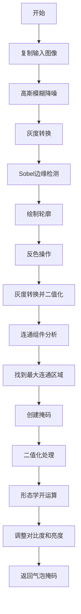
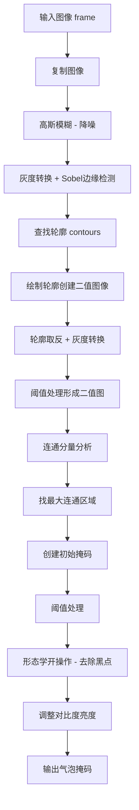
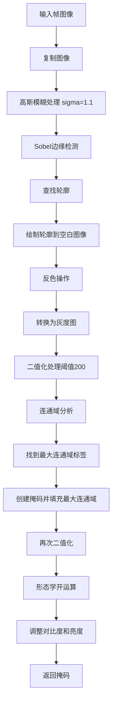

# `comic-translate\modules\detection\utils\bubbles.py` 详细设计文档

这是一个语音气泡处理工具模块，主要用于从图像中检测并创建语音气泡的掩码，通过边缘检测、轮廓查找、连通组件分析和形态学操作来提取气泡区域，并提供图像对比度和亮度调整功能。

## 整体流程



## 类结构

```
模块: bubble_processing (无类定义)
├── 全局函数
│   ├── adjust_contrast_brightness
│   └── make_bubble_mask
```

## 全局变量及字段


### `np`
    
NumPy库别名，用于数值计算和图像数组操作

类型：`numpy module`
    


### `mahotas`
    
图像处理库，提供Sobel等边缘检测算法

类型：`module`
    


### `imk`
    
imkit库别名，提供图像处理相关函数如高斯模糊、轮廓查找、形态学操作等

类型：`module`
    


    

## 全局函数及方法


### `adjust_contrast_brightness`

该函数用于调整 uint8 图像的对比度和亮度，通过计算亮度偏移量并使用加权混合方法对图像进行处理，返回调整后的图像。

**参数：**

- `img`：`np.ndarray`，输入图像
- `contrast`：`float`，对比度调整因子，默认为 1.0
- `brightness`：`int`，亮度调整值，默认为 0

**返回值：** `np.ndarray`，调整后的图像

#### 流程图

```mermaid
flowchart TD
    A[接收输入参数: img, contrast, brightness] --> B[计算亮度偏移量]
    B --> C{brightness 是否为 0}
    C -->|否| D[brightness 已有自定义值]
    C -->|是| E[使用默认值 0]
    D --> F[计算偏移: int(round(255 * (1 - contrast) / 2))]
    E --> F
    F --> G[调用 imkit.add_weighted 加权混合]
    G --> H[返回调整后的图像]
    
    style F fill:#f9f,stroke:#333
    style G fill:#9f9,stroke:#333
```

#### 带注释源码

```python
def adjust_contrast_brightness(img: np.ndarray, contrast: float = 1.0, brightness: int = 0):
    """
    Adjusts contrast and brightness of an uint8 image.
    
    Args:
        img: Input image
        contrast: Contrast adjustment factor
        brightness: Brightness adjustment value
    
    Returns:
        Adjusted image
    """
    # 根据对比度因子计算亮度偏移量
    # 当 contrast = 1.0 时，偏移量为 0（保持原样）
    # 当 contrast < 1.0 时，偏移量为正，使图像变亮
    # 当 contrast > 1.0 时，偏移量为负，使图像变暗
    brightness += int(round(255 * (1 - contrast) / 2))
    
    # 使用加权混合函数: result = contrast * img1 + 1.0 * img2 * 0 + brightness
    # 实际上是: result = contrast * img + brightness
    return imk.add_weighted(img, contrast, img, 0, brightness)
```


### `make_bubble_mask`

该函数用于从输入图像中检测并创建语音气泡（speech bubble）的二值掩码，通过边缘检测、轮廓绘制、连通分量分析和形态学操作来提取最大的气泡区域。

参数：

- `frame`：`np.ndarray`，输入的原始图像

返回值：`np.ndarray`，处理后的气泡掩码图像

#### 流程图



#### 带注释源码

```python
def make_bubble_mask(frame: np.ndarray):
    """
    Create a mask for speech bubbles.
    
    Args:
        frame: Input image
    
    Returns:
        Bubble mask
    """
    # 复制输入图像，避免修改原始数据
    image = frame.copy()
    
    # 步骤1: 应用高斯模糊减少噪声
    # sigma=1.1，控制模糊程度
    blurred = imk.gaussian_blur(image, 1.1)

    # 步骤2: 转换为灰度图并使用Sobel算子进行边缘检测
    # Sobel算子用于检测图像中的边缘特征
    edges = mahotas.sobel(imk.to_gray(blurred))

    # 步骤3: 在边缘图像中查找轮廓
    # 返回轮廓列表和层次信息
    contours, _ = imk.find_contours(edges)

    # 步骤4: 创建与原图同尺寸的全黑图像，绘制轮廓
    # -1表示绘制所有轮廓，thickness=2表示线条粗细
    stage_1 = imk.draw_contours(np.zeros_like(image), contours, -1, (255, 255, 255), thickness=2)
    
    # 对绘制结果取反（白变黑，黑变白）
    stage_1 = np.bitwise_not(stage_1)
    
    # 转换为灰度图
    stage_1 = imk.to_gray(stage_1)
    
    # 步骤5: 阈值处理，将灰度图转换为二值图
    # 阈值200，灰度值大于200的变为255（白色），否则为0（黑色）
    _, binary_image = imk.threshold(stage_1, 200, 255)

    # 步骤6: 查找连通分量（Connected Components）
    # num_labels: 连通区域数量
    # labels: 每个像素的标签（所属区域编号）
    num_labels, labels = imk.connected_components(binary_image)
    
    # 步骤7: 找到最大的连通区域
    # np.bincount统计每个标签的像素数量，[1:]排除背景（标签0）
    # +1是因为标签从1开始
    largest_island_label = np.bincount(labels.flat)[1:].argmax() + 1
    
    # 创建与原图同尺寸的全黑掩码
    mask = np.zeros_like(image)
    
    # 将最大连通区域的像素设为255（白色）
    mask[labels == largest_island_label] = 255

    # 步骤8: 再次阈值处理确保掩码为标准二值图
    _, mask = imk.threshold(mask, 200, 255)

    # 步骤9: 应用形态学操作去除黑色斑点
    # MORPH_OPEN（开操作）：先腐蚀后膨胀，消除小型亮点
    kernel = imk.get_structuring_element(imk.MORPH_ELLIPSE, (3, 3))
    mask = imk.morphology_ex(mask, imk.MORPH_OPEN, kernel)

    # 步骤10: 调整对比度和亮度后返回
    # contrast=100（高对比度）, brightness=0（不调整亮度）
    return adjust_contrast_brightness(mask, 100)
```

## 关键组件


### 对比度与亮度调整

该函数实现图像对比度和亮度的调整，使用加权混合方法实现线性变换

### 高斯模糊预处理

使用1.1 sigma参数的高斯模糊对输入图像进行降噪处理

### Canny边缘检测

基于Sobel算子实现边缘检测，用于提取语音气泡的轮廓特征

### 轮廓查找与绘制

在二值化边缘图像上查找轮廓，并绘制白色轮廓线形成闭合区域

### 连通组件分析

通过连通组件标记识别最大的连通区域，作为气泡主体

### 形态学开运算

使用3x3椭圆结构元进行开运算，去除掩膜中的小噪声点和孤立点

### 图像类型转换

实现灰度图与彩色图之间的相互转换，以及二值化处理


## 问题及建议


### 已知问题

-   **对比度参数异常**：调用 `adjust_contrast_brightness(mask, 100)` 时传递对比度值为100，而默认值和其他调用都使用1.0左右的小数，可能导致图像处理结果严重偏离预期
-   **硬编码magic numbers过多**：高斯模糊sigma(1.1)、阈值(200)、形态学核大小(3,3)、轮廓线宽(2)等参数直接写死在代码中，降低了代码的可维护性和可配置性
-   **输入验证缺失**：函数未对输入图像的有效性进行检查（如None值、维度、类型等），可能导致运行时错误
-   **异常处理缺失**：缺少try-except捕获可能的异常（如imkit库操作失败、轮廓查找为空等），程序鲁棒性不足
-   **变量命名不清晰**：使用`stage_1`等临时性命名，缺乏业务语义，降低了代码可读性
-   **文档注释不完整**：缺少对关键处理步骤的说明，如为何使用Sobel算子、为何选择最大连通域等
-   **类型注解不够精确**：仅使用`np.ndarray`，未标注图像的shape和dtype
-   **numpy位运算使用不当**：对图像使用`np.bitwise_not`不够直观，`np.logical_not`在语义上更合适

### 优化建议

-   **修复对比度参数**：确认`adjust_contrast_brightness(mask, 100)`是否为笔误，如果是应该改为合理值如1.0；如果是业务需要，应在文档中说明
-   **提取配置参数**：将magic numbers抽取为模块级常量或配置文件，提升可维护性
-   **添加输入验证**：在函数入口检查图像是否为None、维度是否正确、数据类型是否支持等
-   **添加异常处理**：对关键操作（特别是imkit库调用）添加try-except，捕获并合理处理可能的异常
-   **改进变量命名**：使用更具业务含义的命名，如`edge_mask`、`bubble_candidates`等
-   **完善文档注释**：补充关键算法步骤的原理说明，提升代码可理解性
-   **改进类型注解**：使用Literal或泛型标注具体类型，如`np.ndarray[np.uint8, ...]`
-   **考虑使用numpy逻辑运算**：将`np.bitwise_not`替换为`np.logical_not`或直接使用imkit库的取反函数

## 其它


### 一段话描述

该模块是一个语音气泡处理工具集，主要用于从视频帧中提取和生成语音气泡的掩码图像，通过边缘检测、轮廓查找、连通域分析等图像处理技术来识别并分割出字幕或对话中的气泡区域。

### 文件的整体运行流程

该模块的执行流程从make_bubble_mask函数开始：首先对输入帧进行高斯模糊去噪，然后使用Sobel边缘检测算子进行边缘提取，接着查找图像轮廓并绘制轮廓，将结果转换为二值图像后进行连通域分析找到最大的连通区域作为气泡掩码，最后通过形态学开运算去除噪点，并调用adjust_contrast_brightness函数调整掩码的对比度和亮度后返回。

### 全局变量和全局函数信息

#### 全局函数

##### adjust_contrast_brightness

- **函数名称**: adjust_contrast_brightness
- **参数名称**: img, contrast, brightness
- **参数类型**: img: np.ndarray, contrast: float, brightness: int
- **参数描述**: img为输入的uint8类型图像，contrast为对比度调整因子，brightness为亮度调整值
- **返回值类型**: np.ndarray
- **返回值描述**: 返回调整对比度和亮度后的图像
- **mermaid流程图**: 
```mermaid
flowchart TD
    A[开始] --> B[计算亮度调整值]
    B --> C{brightness参数}
    C -->|有额外偏移| D[brightness += int(round(255 * (1 - contrast) / 2))]
    C -->|无额外偏移| E[使用原始brightness]
    D --> F[调用imkit.add_weighted进行加权融合]
    E --> F
    F --> G[返回调整后的图像]
```
- **带注释源码**:
```python
def adjust_contrast_brightness(img: np.ndarray, contrast: float = 1.0, brightness: int = 0):
    """
    Adjusts contrast and brightness of an uint8 image.
    
    Args:
        img: Input image
        contrast: Contrast adjustment factor
        brightness: Brightness adjustment value
    
    Returns:
        Adjusted image
    """
    # 计算基于对比度的基础亮度调整值，使图像整体亮度保持合理范围
    brightness += int(round(255 * (1 - contrast) / 2))
    # 使用imkit的加权融合函数进行对比度和亮度调整
    # contrast参数控制原图的权重，实现对比度调整
    # brightness作为偏移量添加到结果中
    return imk.add_weighted(img, contrast, img, 0, brightness)
```

##### make_bubble_mask

- **函数名称**: make_bubble_mask
- **参数名称**: frame
- **参数类型**: frame: np.ndarray
- **参数描述**: 输入的原始视频帧图像
- **返回值类型**: np.ndarray
- **返回值描述**: 返回处理后的气泡掩码图像
- **mermaid流程图**:

- **带注释源码**:
```python
def make_bubble_mask(frame: np.ndarray):
    """
    Create a mask for speech bubbles.
    
    Args:
        frame: Input image
    
    Returns:
        Bubble mask
    """
    # 复制输入图像以避免修改原始数据
    image = frame.copy()
    # 应用高斯模糊减小噪声干扰，sigma=1.1
    blurred = imk.gaussian_blur(image, 1.1)

    # 使用Canny边缘检测算法（通过Sobel算子实现）
    # 将图像转换为灰度后进行Sobel边缘检测
    edges = mahotas.sobel(imk.to_gray(blurred))

    # 查找图像中的轮廓
    contours, _ = imk.find_contours(edges)

    # 创建与原图相同大小的黑色图像
    # 将所有找到的轮廓绘制为白色，-1表示绘制所有轮廓，thickness=2
    stage_1 = imk.draw_contours(np.zeros_like(image), contours, -1, (255, 255, 255), thickness=2)
    # 反色操作，将白底黑线变为黑底白线
    stage_1 = np.bitwise_not(stage_1)
    # 转换为灰度图便于后续处理
    stage_1 = imk.to_gray(stage_1)
    # 二值化处理，阈值200将图像转换为黑白二值图
    _, binary_image = imk.threshold(stage_1, 200, 255)

    # 在二值图像中查找连通分量
    num_labels, labels = imk.connected_components(binary_image)
    # 找到最大的连通区域（排除背景标签0）
    # bincount排除第一个元素[1:]，然后argmax找到最大区域的索引
    largest_island_label = np.argmax(np.bincount(labels.flat)[1:]) + 1
    # 创建空白掩码并填充最大连通区域
    mask = np.zeros_like(image)
    mask[labels == largest_island_label] = 255

    # 再次二值化确保掩码质量
    _, mask = imk.threshold(mask, 200, 255)

    # 应用形态学开运算去除小的孤立点
    # 使用椭圆结构元素，大小为3x3
    kernel = imk.get_structuring_element(imk.MORPH_ELLIPSE, (3, 3))
    mask = imk.morphology_ex(mask, imk.MORPH_OPEN, kernel)

    # 最后调整对比度和亮度后返回
    # 注意：这里contrast=100可能是一个错误，应该是较小的值如1.0-2.0
    return adjust_contrast_brightness(mask, 100)
```

### 关键组件信息

- **高斯模糊**: 使用imkit.gaussian_blur对图像进行平滑处理，减少噪声对边缘检测的干扰
- **Sobel边缘检测**: 使用mahotas.sobel算子进行边缘提取，是图像分割的关键步骤
- **轮廓查找与绘制**: imkit.find_contours和imkit.draw_contours用于定位气泡边界
- **连通域分析**: imk.connected_components用于识别最大的气泡区域
- **形态学运算**: imk.morphology_ex执行开运算，消除小的噪点和孤立区域
- **对比度亮度调整**: adjust_contrast_brightness函数用于优化最终掩码质量

### 潜在的技术债务或优化空间

1. **contrast参数错误**: make_bubble_mask最后调用adjust_contrast_brightness时传入contrast=100，这会导致计算出的亮度调整值极大（约为12750），可能产生溢出或完全错误的输出，应该改为1.0-2.0之间的值
2. **硬编码阈值**: 二值化阈值200和形态学核大小3x3都是硬编码，应该提取为可配置参数
3. **缺乏错误处理**: 函数没有对输入图像进行有效性检查（如空图像、通道数不匹配等）
4. **注释与代码不一致**: 函数注释说使用Canny边缘检测，但实际使用的是Sobel算子
5. **缺乏类型提示完整性**: imkit模块的函数没有类型标注
6. **numpy函数混用**: 同时使用了imkit的函数和numpy的函数（如np.bitwise_not），增加了维护成本
7. **缺少返回值校验**: 没有对返回的掩码进行有效性验证
8. **性能优化空间**: 连续多次图像转换（复制、转灰度、二值化）可以合并减少开销

### 设计目标与约束

该模块的设计目标是提供一个可靠的语音气泡掩码生成工具，用于视频处理或字幕提取场景。核心约束包括：输入必须是uint8类型的numpy数组图像；输出是单通道的二值掩码；依赖imkit图像处理库和mahotas库；处理流程假定气泡在图像中呈现为较亮的区域且面积足够大；运行在Python 3.x环境下。

### 错误处理与异常设计

当前代码缺乏显式的错误处理机制。需要增加的异常处理包括：输入图像为空或维度不符合预期时抛出ValueError；图像数据类型不是uint8时抛出TypeError；当找不到任何轮廓时返回全零掩码或抛出警告；当连通域分析结果为空时返回空白掩码；imkit或mahotas库函数调用失败时应向上传播原始异常并添加上下文信息；建议使用try-except包装关键操作并记录详细错误日志。

### 数据流与状态机

数据流从输入帧开始，经历以下状态转换：原始帧（3通道彩色）→高斯模糊后图像→灰度边缘图→轮廓列表→二值化图像→连通域标签图→二值掩码→形态学处理后掩码→最终调整后掩码。每个状态转换都有明确的数据格式约定：模糊后保持原尺寸通道数；灰度图为单通道H×W；轮廓为点坐标列表；二值图和掩码为单通道；最终掩码为单通道uint8类型。

### 外部依赖与接口契约

主要外部依赖包括：numpy用于数值计算和数组操作；mahotas库提供Sobel边缘检测算子；imkit库提供图像处理函数包括gaussian_blur、to_gray、find_contours、draw_contours、threshold、connected_components、get_structuring_element、morphology_ex、add_weighted。接口契约规定：adjust_contrast_brightness接受任意尺寸的uint8图像和浮点数对比度参数、整型亮度参数，返回调整后的uint8图像；make_bubble_mask接受任意尺寸的彩色或灰度图像，返回单通道uint8掩码。

### 性能考虑与优化建议

当前实现的主要性能瓶颈在于多次图像格式转换和重复内存分配。优化建议包括：避免frame.copy()直接操作原图除非必要；合并连续的二值化和灰度转换操作；使用in-place操作减少内存分配；将硬编码参数提取为模块级常量便于后续优化；考虑使用OpenCV替代imkit可能获得更好的性能；对大尺寸图像可以考虑先降采样处理再上采样回。

### 使用示例与调用场景

基本调用示例：mask = make_bubble_mask(video_frame)，其中video_frame是numpy数组格式的图像。典型应用场景包括：视频字幕提取系统中的气泡区域定位；语音识别前端的气泡检测；视频编辑软件中的气泡跟踪预处理；教学视频中对话区域的自动标注。该函数通常作为预处理步骤，后续会配合OCR模块进行文字识别或配合分割网络进行实例分割。

### 测试策略建议

建议补充以下测试用例：输入空图像应触发异常或返回空掩码；输入单通道灰度图应正常工作；输入极小尺寸图像（如1x1）应能处理；无气泡场景应返回空白掩码；多气泡场景应选择最大的那个；边界情况测试包括全黑图像、全白图像、纯噪声图像；单元测试应覆盖adjust_contrast_brightness函数的对比度和亮度调整逻辑；集成测试应验证完整流程输出的掩码格式正确。

    