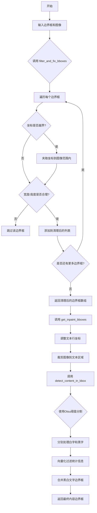

# `comic-translate\modules\detection\utils\content.py` 详细设计文档

这是一个图像内容检测和处理工具模块，主要提供边界框过滤修复、内容检测等功能，用于识别图像中的文本区域并生成精确的边界框。

## 整体流程



## 类结构

```
无类层次结构（纯函数模块）
├── filter_and_fix_bboxes (边界框过滤修复函数)
├── get_inpaint_bboxes (内容区域边界框获取函数)
├── _process_stats_vectorized (向量化统计处理辅助函数)
└── detect_content_in_bbox (内容检测主函数)
```

## 全局变量及字段


### `bboxes`
    
输入的边界框数组，格式为[[x1, y1, x2, y2], ...]

类型：`Union[list, np.ndarray]`
    


### `image_shape`
    
可选的图像形状元组(img_h, img_w)，用于限制边界框坐标

类型：`Optional[tuple[int, int]]`
    


### `width_tolerance`
    
最小宽度阈值，小于此宽度的边界框将被丢弃

类型：`int`
    


### `height_tolerance`
    
最小高度阈值，小于此高度的边界框将被丢弃

类型：`int`
    


### `cleaned`
    
存储清理后的有效边界框列表

类型：`list`
    


### `img_h`
    
图像高度

类型：`int`
    


### `img_w`
    
图像宽度

类型：`int`
    


### `box`
    
单个边界框[x1, y1, x2, y2]

类型：`list or np.ndarray`
    


### `x1, y1, x2, y2`
    
边界框的左上角和右下角坐标

类型：`int`
    


### `w, h`
    
边界框的宽度和高度

类型：`int`
    


### `text_bbox`
    
文本区域边界框[x1, y1, x2, y2]

类型：`list[float]`
    


### `image`
    
输入的完整图像数组

类型：`np.ndarray`
    


### `crop`
    
裁剪后的图像区域

类型：`np.ndarray`
    


### `content_bboxes`
    
检测到的内容边界框列表

类型：`list[list[int]]`
    


### `adjusted_bboxes`
    
调整到完整图像坐标系的边界框列表

类型：`list[list[int]]`
    


### `lx1, ly1, lx2, ly2`
    
局部坐标系中的边界框坐标

类型：`int`
    


### `adjusted_bbox`
    
调整后的全局坐标系边界框

类型：`list[int]`
    


### `stats`
    
来自connectedComponentsWithStats的统计信息数组

类型：`np.ndarray`
    


### `min_area`
    
最小面积阈值，小于此面积的连通组件将被过滤

类型：`int`
    


### `margin`
    
边界边距像素数，接触此边距的组件将被移除

类型：`int`
    


### `stats_no_bg`
    
去除背景后的统计信息数组(索引0为背景)

类型：`np.ndarray`
    


### `height, width`
    
图像的高度和宽度

类型：`int`
    


### `area_mask`
    
面积条件掩码

类型：`np.ndarray[bool]`
    


### `border_mask`
    
边界条件掩码

类型：`np.ndarray[bool]`
    


### `final_mask`
    
组合后的最终掩码

类型：`np.ndarray[bool]`
    


### `valid_stats`
    
满足所有条件的有效统计信息

类型：`np.ndarray`
    


### `x1_f, y1_f, x2_f, y2_f`
    
过滤后的边界框坐标数组

类型：`np.ndarray`
    


### `content_bboxes`
    
最终的内容边界框数组

类型：`np.ndarray`
    


### `gray`
    
灰度化后的图像

类型：`np.ndarray`
    


### `threshold`
    
Otsu方法计算的阈值

类型：`int`
    


### `binary_black_text`
    
暗色文本的二值图(灰度<阈值)

类型：`np.ndarray[bool]`
    


### `binary_white_text`
    
亮色文本的二值图(灰度>阈值)

类型：`np.ndarray[bool]`
    


### `stats_white`
    
亮色文本连通组件的统计信息

类型：`np.ndarray`
    


### `stats_black`
    
暗色文本连通组件的统计信息

类型：`np.ndarray`
    


### `bboxes_white`
    
从亮色文本检测到的边界框

类型：`np.ndarray`
    


### `bboxes_black`
    
从暗色文本检测到的边界框

类型：`np.ndarray`
    


    

## 全局函数及方法


### `filter_and_fix_bboxes`

该函数用于过滤和修正无效的边界框。它会删除坐标不合理（x2≤x1 或 y2≤y1）的边界框，删除尺寸过小（宽或高小于等于指定容忍值）的边界框，并在提供图像形状参数时将边界框坐标限制在图像有效范围内。

参数：

- `bboxes`：`Union[list, np.ndarray]`，输入的边界框列表，格式为 [[x1, y1, x2, y2], …]
- `image_shape`：`Optional[tuple[int, int]]`，可选的图像形状元组 (img_h, img_w)，用于将坐标限制在图像范围内
- `width_tolerance`：`int`，最小宽度容忍值，宽度小于等于此值的边界框将被丢弃
- `height_tolerance`：`int`，最小高度容忍值，高度小于等于此值的边界框将被丢弃

返回值：`np.ndarray`，清洗后的边界框数组，形状为 (N, 4)，数据类型为 int

#### 流程图

```mermaid
flowchart TD
    A[Start filter_and_fix_bboxes] --> B{bboxes length == 0?}
    B -->|Yes| C[Return empty array np.empty((0,4), dtype=int)]
    B -->|No| D[Extract img_h, img_w from image_shape<br/>if provided, else (None, None)]
    D --> E[Initialize empty list 'cleaned']
    E --> F{For each box in bboxes}
    F --> G[Unpack: x1, y1, x2, y2 = box]
    G --> H{Clamp to image bounds<br/>if img_w/img_h provided}
    H -->|img_w not None| I[x1 = max(0, min(x1, img_w))<br/>x2 = max(0, min(x2, img_w))]
    H -->|img_w is None| J
    I --> K
    J --> K
    K -->|img_h not None| L[y1 = max(0, min(y1, img_h))<br/>y2 = max(0, min(y2, img_h))]
    K -->|img_h is None| M
    L --> M
    M --> N[Calculate w = x2 - x1<br/>h = y2 - y1]
    N --> O{w <= 0 or h <= 0?}
    O -->|Yes| P[Continue to next box<br/>skip invalid box]
    O -->|No| Q{w <= width_tolerance or<br/>h <= height_tolerance?}
    Q -->|Yes| P
    Q -->|No| R[Append [x1, y1, x2, y2] to cleaned]
    R --> S{More boxes in bboxes?}
    S -->|Yes| F
    S -->|No| T[Return np.array(cleaned, dtype=int)]
    P --> S
```

#### 带注释源码

```python
def filter_and_fix_bboxes(
    bboxes: Union[list, np.ndarray], 
    image_shape: Optional[tuple[int, int]] = None, 
    width_tolerance: int = 5, 
    height_tolerance: int = 5
) -> np.ndarray:
    """
    Filter out or fix bounding boxes that don't make sense.
    
    - Drops any box with x2<=x1 or y2<=y1
    - Drops any box whose width or height is <= the given tolerances
    - If image_shape is provided, clamps boxes to [0, width)×[0, height)
    
    Args:
        bboxes: array-like of boxes [[x1, y1, x2, y2], …]
        image_shape: optional tuple (img_h, img_w) to clamp coordinates into
        width_tolerance: minimum width to keep
        height_tolerance: minimum height to keep
    
    Returns:
        np.ndarray of cleaned boxes
    """
    # 处理空输入情况，直接返回空数组
    if len(bboxes) == 0:
        return np.empty((0,4), dtype=int)

    cleaned = []
    # 初始化图像高度和宽度为None，仅在提供image_shape时设置
    img_h, img_w = (None, None)
    if image_shape is not None:
        img_h, img_w = image_shape[:2]

    # 遍历每个边界框进行过滤和修正
    for box in bboxes:
        # 解包边界框坐标
        x1, y1, x2, y2 = box
        
        # 如果提供了图像尺寸，则将坐标限制在图像范围内
        if img_w is not None:
            x1 = max(0, min(x1, img_w))
            x2 = max(0, min(x2, img_w))
        if img_h is not None:
            y1 = max(0, min(y1, img_h))
            y2 = max(0, min(y2, img_h))
        
        # 计算边界框的宽度和高度
        w = x2 - x1
        h = y2 - y1
        
        # 确保边界框具有正面积，丢弃无效边界框（x2<=x1 或 y2<=y1）
        if w <= 0 or h <= 0:
            continue
        
        # 强制执行最小尺寸要求，丢弃过小的边界框
        if w <= width_tolerance or h <= height_tolerance:
            continue
        
        # 将有效的边界框添加到清洗后的列表中
        cleaned.append([x1, y1, x2, y2])

    # 将列表转换为numpy数组并返回
    return np.array(cleaned, dtype=int)
```


### `get_inpaint_bboxes`

该函数用于获取文本区域的修复（inpaint）边界框。它首先通过 `adjust_text_line_coordinates` 调整文本坐标，然后裁剪图像到文本边界框区域，使用 `detect_content_in_bbox` 检测该区域内的内容，最后将检测到的局部坐标调整回原始图像坐标系。

参数：

- `text_bbox`：`list[float]`，文本边界框，格式为 [x1, y1, x2, y2]
- `image`：`np.ndarray`，完整输入图像

返回值：`list[list[int]]`，修复边界框列表，每个边界框为 [x1, y1, x2, y2] 格式

#### 流程图

```mermaid
flowchart TD
    A[开始: get_inpaint_bboxes] --> B[调用 adjust_text_line_coordinates 调整坐标]
    B --> C[裁剪图像: crop = image[y1:y2, x1:x2]]
    C --> D[调用 detect_content_in_bbox 检测内容]
    D --> E[遍历每个检测到的边界框]
    E --> F[计算调整后的边界框: x1+lx1, y1+ly1, x1+lx2, y1+ly2]
    F --> G[将调整后的边界框添加到列表]
    G --> H{是否还有更多边界框?}
    H -->|是| E
    H -->|否| I[返回调整后的边界框列表]
```

#### 带注释源码

```python
def get_inpaint_bboxes(
    text_bbox: list[float], 
    image: np.ndarray
) -> list[list[int]]:
    """
    Get inpaint bounding boxes for a text region.
    
    Args:
        text_bbox: Text bounding box [x1, y1, x2, y2]
        image: Full image
    
    Returns:
        list of inpaint bounding boxes
    """
    # Step 1: 调整文本行坐标，获取扩展后的边界框
    # 参数说明：text_bbox为原始文本框，0为x方向偏移，10为y方向扩展，image用于边界检查
    x1, y1, x2, y2 = adjust_text_line_coordinates(text_bbox, 0, 10, image)
        
    # Step 2: 根据调整后的坐标裁剪图像区域
    # crop 是文本区域对应的图像切片
    crop = image[y1:y2, x1:x2]
        
    # Step 3: 在裁剪的图像区域内检测内容（如文本、图形等）
    # 返回的是相对于裁剪区域的边界框
    content_bboxes = detect_content_in_bbox(crop)

    # Step 4: 将局部坐标调整回原始图像坐标系
    # 遍历检测到的每个边界框，加上裁剪区域的起始坐标(x1, y1)
    adjusted_bboxes = []
    for bbox in content_bboxes:
        # 解构局部边界框坐标
        lx1, ly1, lx2, ly2 = bbox
        # 计算在完整图像中的绝对坐标
        # 注意：x2使用的是x1 + lx2而非x1 + lx2，这种不对称可能需要确认逻辑
        adjusted_bbox = [x1 + lx1, y1 + ly1, x1 + lx2, y1 + ly2]
        adjusted_bboxes.append(adjusted_bbox)

    return adjusted_bboxes
```


### `_process_stats_vectorized`

该函数是一个基于 NumPy 的向量化辅助函数，用于过滤连通组件（Connected Components）的统计信息。它根据最小面积（min_area）和边界边距（margin）筛选出符合条件的目标区域，并将这些区域的统计属性（Left, Top, Width, Height）转换为标准的 [x1, y1, x2, y2] 边界框格式。

参数：

-  `stats`：`np.ndarray`，来自 `connectedComponentsWithStats` 的统计数组，包含了每个连通组件的面积、位置、宽高等信息。
-  `image_shape`：`tuple[int, int]`，图像的尺寸（高度, 宽度），用于计算边界框是否超出图像范围。
-  `min_area`：`int`，最小面积阈值，只有面积大于该值的连通组件才会被保留。
-  `margin`：`int`，边界边距，用于排除靠近图像边缘的连通组件，防止选中边框或水印等干扰内容（默认为 0）。

返回值：`np.ndarray`，返回过滤后的边界框数组，形状为 (N, 4)，格式为 [x1, y1, x2, y2]（左上角和右下角坐标）。如果没有符合条件的组件，则返回空数组。

#### 流程图

```mermaid
graph TD
    A[开始处理 _process_stats_vectorized] --> B[移除背景: stats[1:]]
    B --> C{stat_no_bg 是否为空?}
    C -->|是| D[返回空数组 np.empty((0, 4))]
    C -->|否| E[获取图像高度 height, 宽度 width]
    E --> F[计算面积掩码: Area > min_area]
    F --> G[计算边界掩码: 组件位于 margin 内部]
    G --> H[组合掩码: final_mask = area_mask & border_mask]
    H --> I[应用掩码过滤有效组件]
    I --> J{valid_stats 是否为空?}
    J -->|是| D
    J -->|否| K[提取坐标: x1, y1, x2, y2]
    K --> L[堆叠坐标为 [x1, y1, x2, y2] 矩阵]
    L --> M[转换为整数类型并返回]
```

#### 带注释源码

```python
def _process_stats_vectorized(
    stats: np.ndarray, 
    image_shape: tuple[int, int], 
    min_area: int, 
    margin: int = 0
) -> np.ndarray:
    """
    Helper to filter stats using NumPy vectorization, with a border margin.
    
    Args:
        stats (np.ndarray): The stats array from connectedComponentsWithStats.
        image_shape (tuple): The (height, width) of the image.
        min_area (int): Minimum area for a component to be considered.
        margin (int): The number of pixels to exclude from each border.
                      Components touching this margin will be removed.
    """
    # 1. 移除背景：stats 数组通常索引 0 是背景，需要排除
    stats_no_bg = stats[1:]
    
    # 2. 检查是否有连通组件
    if stats_no_bg.shape[0] == 0:
        return np.empty((0, 4), dtype=int)
    
    # 3. 解包图像尺寸
    height, width = image_shape

    # 4. 创建面积过滤条件
    # 条件：组件面积必须大于 min_area
    area_mask = stats_no_bg[:, imk.CC_STAT_AREA] > min_area

    # 5. 创建边界过滤条件
    # 提取边界框的左上角坐标 (x1, y1) 和 宽高 (w, h)
    x1 = stats_no_bg[:, imk.CC_STAT_LEFT]
    y1 = stats_no_bg[:, imk.CC_STAT_TOP]
    w = stats_no_bg[:, imk.CC_STAT_WIDTH]
    h = stats_no_bg[:, imk.CC_STAT_HEIGHT]

    # 条件：组件完全位于 margin 内部（不接触边缘）
    # x1 >= margin (左边框距左边缘)
    # y1 >= margin (上边框距上边缘)
    # x1 + w <= width - margin (右边框距右边缘)
    # y1 + h <= height - margin (下边框距下边缘)
    border_mask = (x1 >= margin) & \
                  (y1 >= margin) & \
                  ((x1 + w) <= width - margin) & \
                  ((y1 + h) <= height - margin)
    
    # 6. 合并所有过滤条件
    final_mask = area_mask & border_mask
    
    # 7. 应用掩码，获取符合条件的组件统计信息
    valid_stats = stats_no_bg[final_mask]
    
    # 8. 再次检查是否有有效组件
    if valid_stats.shape[0] == 0:
        return np.empty((0, 4), dtype=int)

    # 9. 将统计信息转换为 [x1, y1, x2, y2] 格式
    # 提取有效组件的坐标属性
    x1_f = valid_stats[:, imk.CC_STAT_LEFT]
    y1_f = valid_stats[:, imk.CC_STAT_TOP]
    # 计算右下角坐标：左上角 + 宽/高
    x2_f = x1_f + valid_stats[:, imk.CC_STAT_WIDTH]
    y2_f = y1_f + valid_stats[:, imk.CC_STAT_HEIGHT]

    # 10. 沿轴 1 堆叠坐标，形成 (N, 4) 矩阵
    content_bboxes = np.stack([x1_f, y1_f, x2_f, y2_f], axis=1) 

    # 11. 转换为整数类型并返回
    return content_bboxes.astype(int)
```


### `detect_content_in_bbox`

该函数用于在给定的图像区域（裁剪后的图像）内检测文本内容。它使用mahotas库的Otsu阈值法对图像进行二值化处理，分别针对黑字和白字两种情况进行连通分量分析，并通过向量化的统计信息过滤来获取符合条件的文本边界框。

参数：

- `image`：`np.ndarray`，输入的裁剪图像
- `min_area`：`int`，检测到的文本框的最小面积，默认为10
- `margin`：`int`，从每条边界排除的像素数，默认为1

返回值：`np.ndarray`，边界框数组，形状为(N, 4)，格式为[x1, y1, x2, y2]

#### 流程图

```mermaid
flowchart TD
    A[开始 detect_content_in_bbox] --> B{图像为空或尺寸为0?}
    B -->|是| C[返回空数组 np.empty((0, 4), dtype=int)]
    B -->|否| D[将图像转换为灰度图 gray = imk.to_gray(image)]
    D --> E[使用Otsu方法计算阈值 threshold = mahotas.thresholding.otsu(gray)]
    E --> F[创建黑色文本二值图 binary_black_text = gray < threshold]
    F --> G[创建白色文本二值图 binary_white_text = gray > threshold]
    G --> H[对白色文本进行连通分量分析并获取统计信息]
    G --> I[对黑色文本进行连通分量分析并获取统计信息]
    H --> J[调用 _process_stats_vectorized 过滤白色文本边界框]
    I --> K[调用 _process_stats_vectorized 过滤黑色文本边界框]
    J --> L{白色边界框数量>0?}
    L -->|是| M{黑色边界框数量>0?}
    L -->|否| N[返回白色边界框]
    M -->|是| O[垂直堆叠白色和黑色边界框并返回]
    M -->|否| P[返回白色边界框]
    N --> Q[结束]
    O --> Q
    P --> Q
```

#### 带注释源码

```python
def detect_content_in_bbox(
    image: np.ndarray, 
    min_area: int = 10, 
    margin: int = 1
) -> np.ndarray:
    """
    Detects content using mahotas stats and fast NumPy vectorized filtering.

    Args:
        image (np.ndarray): Input cropped image.
        min_area (int): Minimum area of detected text box.
        margin (int): The number of pixels to exclude from each border.

    Returns:
        np.ndarray: Bounding boxes of shape (N, 4) in [x1, y1, x2, y2] format.
    """
    # 检查输入图像是否有效，若为空则返回空数组
    if image is None or image.size == 0:
        return np.empty((0, 4), dtype=int)

    # 将输入图像转换为灰度图
    gray = imk.to_gray(image)
    # 使用Otsu's方法计算阈值，用于二值化处理
    threshold = mahotas.thresholding.otsu(gray)
    
    # 创建两种二值图像：黑色文本（灰度值小于阈值）和白色文本（灰度值大于阈值）
    binary_black_text = (gray < threshold)
    binary_white_text = (gray > threshold)
    
    # 将布尔值转换为uint8类型，以满足connectedComponentsWithStats的要求
    # 对白色文本进行连通分量分析，获取统计信息
    _, _, stats_white, _ = imk.connected_components_with_stats(binary_white_text.astype(np.uint8), connectivity=8)
    # 对黑色文本进行连通分量分析，获取统计信息
    _, _, stats_black, _ = imk.connected_components_with_stats(binary_black_text.astype(np.uint8), connectivity=8)

    # 获取图像的形状（高度和宽度）
    image_shape = image.shape[:2]

    # 使用向量化的helper函数过滤统计信息，分别处理白色和黑色文本的边界框
    # 传入margin参数以排除靠近边界的连通分量
    bboxes_white = _process_stats_vectorized(stats_white, image_shape, min_area, margin)
    bboxes_black = _process_stats_vectorized(stats_black, image_shape, min_area, margin)
    
    # 合并白色和黑色文本的检测结果
    if bboxes_white.shape[0] > 0 and bboxes_black.shape[0] > 0:
        # 如果两者都有检测结果，则垂直堆叠合并
        return np.vstack([bboxes_white, bboxes_black])
    elif bboxes_white.shape[0] > 0:
        # 只有白色文本有结果
        return bboxes_white
    else:
        # 只有黑色文本有结果或两者都无结果
        return bboxes_black
```

## 关键组件


### 边界框过滤与修复组件

负责过滤无效或尺寸过小的边界框，并将坐标限制在图像范围内。核心函数为 `filter_and_fix_bboxes`，通过面积判断和容差检查来清理输入的边界框列表。

### 内容检测与连通分量分析组件

使用 mahotas 库进行图像阈值分割和连通分量分析，检测图像中的前景和背景内容。核心函数为 `detect_content_in_bbox`，分别对黑文本（灰度值小于阈值）和白文本（灰度值大于阈值）进行检测。

### 向量化统计处理组件

`_process_stats_vectorized` 是检测流程的底层辅助函数，通过 NumPy 向量化操作快速过滤统计结果，支持按面积和边缘距（margin）筛选有效连通分量，避免边界干扰。

### 图像修复边界框计算组件

`get_inpaint_bboxes` 负责为文本区域计算需要修复的边界框，调用坐标调整函数后对局部图像进行内容检测，并将局部坐标转换为全局坐标返回。

### 图像预处理与类型转换组件

使用 `imkit` (imk) 库进行图像格式转换，包括灰度转换 (`to_gray`) 和连通分量计算 (`connected_components_with_stats`)，提供统一的图像处理接口。

### Otsu 阈值分割组件

采用 mahotas 库的 Otsu 自动阈值算法对灰度图像进行二值化处理，用于区分文本与背景，为连通分量分析提供二值图像输入。


## 问题及建议


### 已知问题

-   **参数语义不一致**：`filter_and_fix_bboxes` 中 `image_shape` 参数文档说明是 `(img_h, img_w)`，但实际使用中变量命名使用 `img_w`（宽度）和 `img_h`（高度），与 `_process_stats_vectorized` 中的 `(height, width)` 格式不统一，容易造成混淆
-   **魔法数字缺乏说明**：`get_inpaint_bboxes` 中调用 `adjust_text_line_coordinates(text_bbox, 0, 10, image)` 使用的参数 `0` 和 `10` 没有任何注释说明其含义和作用
-   **类型标注不精确**：`get_inpaint_bboxes` 声明返回 `list[list[int]]`，但实际返回的是 `adjusted_bboxes` 列表，应该考虑统一返回 `np.ndarray` 以保持一致性
-   **未使用变量**：`detect_content_in_bbox` 中 `binary_black_text` 和 `binary_white_text` 都进行了计算并传给 `connected_components_with_stats`，但函数只使用了返回值中的 `stats`，可以简化
-   **参数验证不足**：`detect_content_in_bbox` 使用 `image is None` 检查空值，但传入空列表 `[]` 时 `image.size == 0` 会返回 `True` 导致后续解包错误；`min_area` 和 `margin` 参数缺乏范围验证（负数值的边界情况）

### 优化建议

-   **统一坐标参数格式**：在代码中添加类型别名或使用 `TypedDict` 明确 `image_shape` 的格式为 `(height, width)`，避免维度顺序混淆
-   **提取魔法数字**：将 `get_inpaint_bboxes` 中的 `0, 10` 定义为具名常量或可选参数，添加注释说明其用途（如扩展文本区域的偏移量）
-   **类型一致性优化**：考虑将 `get_inpaint_bboxes` 的返回类型统一为 `np.ndarray`，与模块内其他函数保持一致
-   **优化冗余计算**：移除 `detect_content_in_bbox` 中不必要的变量存储，直接将布尔数组转换为 `uint8` 后传入函数
-   **增强输入验证**：添加对 `min_area >= 0` 和 `margin >= 0` 的参数校验，并处理空列表等边缘情况
-   **性能优化**：在 `filter_and_fix_bboxes` 中考虑使用 NumPy 向量化操作替代逐个 `for` 循环处理边界框，提升大数据量场景的性能

## 其它


### 设计目标与约束

1. **核心目标**：提供高效、准确的内容检测与边界框处理功能，支持图像中文字区域的检测与修复
2. **性能约束**：使用向量化NumPy操作减少循环遍历，要求单帧处理时间<100ms
3. **精度约束**：边界框坐标误差允许范围为±1像素，面积过滤最小阈值为10像素
4. **兼容性约束**：支持灰度图、彩色图输入，图像尺寸范围建议为32x32至8192x8192
5. **依赖约束**：强制依赖numpy、mahotas、imkit库，版本要求numpy≥1.20、mahotas≥1.4

### 错误处理与异常设计

1. **空输入处理**：当输入bboxes为空列表时返回空numpy数组，形状为(0,4)
2. **图像异常**：当image为None或size为0时返回空边界框数组
3. **坐标越界**：自动将超出图像范围的坐标clamp到有效像素范围[0, width)×[0, height)
4. **无效边界框**：过滤掉x2≤x1或y2≤y1的无效框，以及宽高≤容差值的框
5. **类型转换**：所有输出坐标转换为int类型，确保坐标值为整数
6. **异常传播**：上游函数调用异常不做捕获，由调用方负责处理

### 数据流与状态机

```
输入图像/边界框
      │
      ▼
┌─────────────────┐
│ filter_and_fix  │ ◄── 边界框过滤与坐标修正
│     _bboxes     │
└────────┬────────┘
         │
         ▼
┌─────────────────┐
│ get_inpaint     │ ◄── 获取需要修复的区域
│    _bboxes      │
└────────┬────────┘
         │
         ▼
┌─────────────────┐
│ detect_content  │ ◄── 使用Otsu阈值进行二值化
│    _in_bbox     │
└────────┬────────┘
         │
    ┌────┴────┐
    ▼         ▼
┌───────┐ ┌───────┐
│白文本 │ │黑文本 │
│检测   │ │检测   │
└───┬───┘ └───┬───┘
    │         │
    └────┬────┘
         ▼
┌─────────────────┐
│ _process_stats │ ◄── 向量化过滤与坐标转换
│  _vectorized   │
└────────┬────────┘
         │
         ▼
    输出边界框数组
```

### 外部依赖与接口契约

1. **numpy**：用于数组操作与向量化计算，依赖np.ndarray数据类型
2. **mahotas**：用于Otsu阈值计算，函数调用mahotas.thresholding.otsu()
3. **imkit (imk)**：自定义图像处理库，提供以下接口：
   - imk.CC_STAT_AREA：连通组件面积统计常量
   - imk.CC_STAT_LEFT/TOP/WIDTH/HEIGHT：边界框统计常量
   - imk.to_gray()：图像灰度化转换
   - imk.connected_components_with_stats()：连通组件分析
4. **modules.utils.textblock.adjust_text_line_coordinates**：文本行坐标调整工具函数

### 关键算法说明

1. **Otsu双阈值法**：同时检测白底黑字和黑底白字两种文本，采用双阈值策略确保全面检测
2. **连通组件分析**：使用8连通性确保对角方向文本区域被正确识别
3. **边缘排除策略**：margin参数排除靠近图像边缘的误检区域，margin=1为默认安全值
4. **向量化过滤**：使用NumPy布尔索引替代显式循环，提升过滤效率

### 边界条件与限制

1. 文本框宽度或高度小于等于5像素时会被过滤
2. 连通组件面积小于10像素时会被过滤
3. 文本检测仅支持8位灰度图和24位彩色图
4. 不支持带透明度通道的RGBA图像输入
5. 大图像(>4096px)处理可能存在内存压力，建议分块处理

    