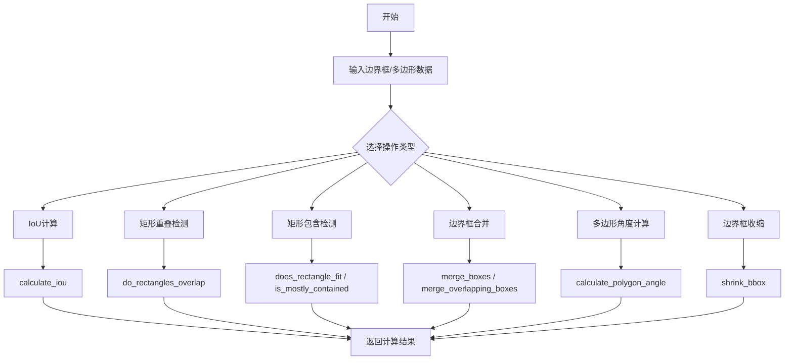
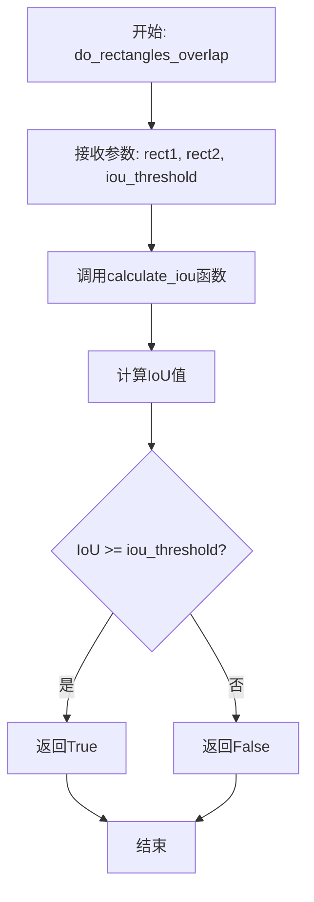
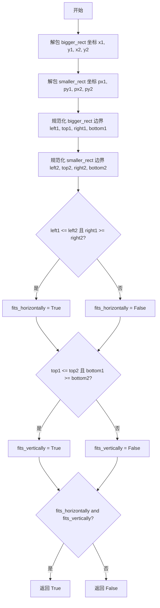
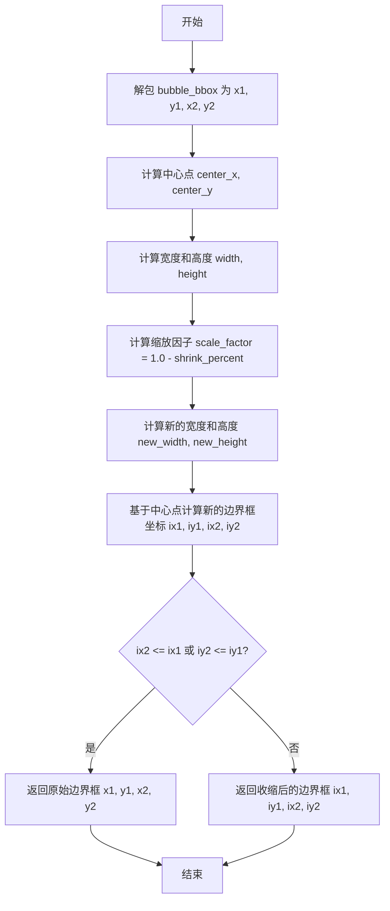

# `comic-translate\modules\detection\utils\geometry.py` 详细设计文档

一个用于目标检测的几何运算模块，提供边界框(Bounding Box)和多边形的计算功能，包括IoU计算、矩形重叠检测、边界框合并与裁剪、多边形角度计算、以及边界框收缩等操作。

## 整体流程



## 类结构

```
无类层次结构 (模块级函数集合)
└── 全局函数集合
    ├── 类型别名定义 (RectLike, BBox)
    ├── IoU相关函数
    ├── 矩形操作函数
    ├── 边界框合并函数
    ├── 多边形操作函数
    └── 边界框收缩函数
```

## 全局变量及字段


### `RectLike`
    
类型别名，表示一个矩形，期望长度为4，格式为(x1, y1, x2, y2)

类型：`Sequence[int]`
    


### `BBox`
    
类型别名，表示边界框的坐标元组，格式为(x1, y1, x2, y2)

类型：`tuple[int, int, int, int]`
    


    

## 全局函数及方法


### `calculate_iou`

该函数用于计算两个矩形框的交并比（IoU，Intersection over Union），这是目标检测中衡量两个矩形重叠程度的常用指标。

参数：

- `rect1`：`list[float]`，第一个矩形，格式为 [x1, y1, x2, y2]，其中 (x1, y1) 为左上角坐标，(x2, y2) 为右下角坐标
- `rect2`：`list[float]`，第二个矩形，格式为 [x1, y1, x2, y2]

返回值：`float`，IoU 值，范围为 0 到 1，0 表示完全不相交，1 表示完全重合

#### 流程图

```mermaid
flowchart TD
    A[开始: calculate_iou] --> B[输入: rect1, rect2]
    B --> C[计算交集左上角: x1 = max(rect1[0], rect2[0])<br/>y1 = max(rect1[1], rect2[1])]
    C --> D[计算交集右下角: x2 = min(rect1[2], rect2[2])<br/>y2 = min(rect1[3], rect2[3])]
    D --> E{判断交集面积: x2 > x1 and y2 > y1?}
    E -->|是| F[intersection_area = (x2-x1) × (y2-y1)]
    E -->|否| G[intersection_area = 0]
    F --> H[计算矩形1面积: rect1_area = (rect1[2]-rect1[0]) × (rect1[3]-rect1[1])]
    G --> H
    H --> I[计算矩形2面积: rect2_area = (rect2[2]-rect2[0]) × (rect2[3]-rect2[1])]
    I --> J[计算并集面积: union = rect1_area + rect2_area - intersection_area]
    J --> K{union != 0?}
    K -->|是| L[iou = intersection_area / union]
    K -->|否| M[iou = 0]
    L --> N[返回 iou]
    M --> N
```

#### 带注释源码

```python
def calculate_iou(rect1: list[float], rect2: list[float]) -> float:
    """
    计算两个矩形的交并比（IoU）
    
    参数:
        rect1: 第一个矩形，格式为 [x1, y1, x2, y2]
        rect2: 第二个矩形，格式为 [x1, y1, x2, y2]
    
    返回值:
        IoU 值，范围 0~1
    """
    # ==================== 第1步：计算交集区域的边界坐标 ====================
    # 取两个矩形左上角坐标的最大值（取最右下的起点）
    x1 = max(rect1[0], rect2[0])
    y1 = max(rect1[1], rect2[1])
    # 取两个矩形右下角坐标的最小值（取最左上的终点）
    x2 = min(rect1[2], rect2[2])
    y2 = min(rect1[3], rect2[3])
    
    # ==================== 第2步：计算交集面积 ====================
    # 使用 max(0, ...) 确保当矩形不相交时面积为 0
    # 只有当 x2 > x1 且 y2 > y1 时才存在有效交集区域
    intersection_area = max(0, x2 - x1) * max(0, y2 - y1)
    
    # ==================== 第3步：计算各自矩形面积 ====================
    # 面积 = 宽度 × 高度
    rect1_area = (rect1[2] - rect1[0]) * (rect1[3] - rect1[1])
    rect2_area = (rect2[2] - rect2[0]) * (rect2[3] - rect2[1])
    
    # ==================== 第4步：计算并集面积 ====================
    # 并集面积 = 面积1 + 面积2 - 交集面积（避免重复计算交集部分）
    union_area = rect1_area + rect2_area - intersection_area
    
    # ==================== 第5步：计算并返回 IoU ====================
    # IoU = 交集面积 / 并集面积
    # 防止除以零的情况（当两个矩形面积都为0时）
    iou = intersection_area / union_area if union_area != 0 else 0
    
    return iou
```


### `do_rectangles_overlap`

该函数用于检测两个矩形是否在给定的IoU（Intersection over Union）阈值下重叠，通过计算两个矩形的IoU值并与阈值比较来判断重叠情况。

参数：

- `rect1`：`list[float]`，第一个矩形，格式为 [x1, y1, x2, y2]，表示矩形的左上角和右下角坐标
- `rect2`：`list[float]`，第二个矩形，格式为 [x1, y1, x2, y2]，表示矩形的左上角和右下角坐标
- `iou_threshold`：`float`，最小IoU阈值，默认为0.2，用于判断是否为有效重叠

返回值：`bool`，如果两个矩形的IoU值大于等于iou_threshold则返回True，否则返回False

#### 流程图



#### 带注释源码

```python
def do_rectangles_overlap(
    rect1: list[float], 
    rect2: list[float], 
    iou_threshold: float = 0.2
) -> bool:
    """
    Check if two rectangles overlap based on IoU threshold.
    
    Args:
        rect1: First rectangle as [x1, y1, x2, y2]
        rect2: Second rectangle as [x1, y1, x2, y2]
        iou_threshold: Minimum IoU to consider as overlap
    
    Returns:
        True if rectangles overlap above threshold
    """
    # 调用calculate_iou函数计算两个矩形的IoU值
    iou = calculate_iou(rect1, rect2)
    
    # 比较计算得到的IoU值与阈值，返回布尔结果
    return iou >= iou_threshold
```


### `does_rectangle_fit`

检查较小的矩形是否完全位于较大的矩形内部。

参数：

- `bigger_rect`：`list[float]`，潜在的包含矩形，格式为 [x1, y1, x2, y2]
- `smaller_rect`：`list[float]`，潜在的被包含矩形，格式为 [x1, y1, x2, y2]

返回值：`bool`，如果 smaller_rect 完全位于 bigger_rect 内部返回 True，否则返回 False

#### 流程图



#### 带注释源码

```python
def does_rectangle_fit(bigger_rect: list[float], smaller_rect: list[float]) -> bool:
    """
    Check if smaller_rect fits entirely inside bigger_rect.
    
    Args:
        bigger_rect: Potential containing rectangle as [x1, y1, x2, y2]
        smaller_rect: Potential contained rectangle as [x1, y1, x2, y2]
    
    Returns:
        True if smaller_rect fits inside bigger_rect
    """
    # 从较大矩形中解包坐标
    x1, y1, x2, y2 = bigger_rect
    # 从较小矩形中解包坐标
    px1, py1, px2, py2 = smaller_rect
    
    # 确保坐标正确排序（处理可能存在的无序坐标输入）
    # 计算较大矩形的左、上、右、下边界
    left1, top1, right1, bottom1 = min(x1, x2), min(y1, y2), max(x1, x2), max(y1, y2)
    # 计算较小矩形的左、上、右、下边界
    left2, top2, right2, bottom2 = min(px1, px2), min(py1, py2), max(px1, px2), max(py1, py2)
    
    # 检查水平方向：较大矩形的左边界需小于等于较小矩形的左边界，
    # 且较大矩形的右边界需大于等于较小矩形的右边界
    fits_horizontally = left1 <= left2 and right1 >= right2
    # 检查垂直方向：较大矩形的上边界需小于等于较小矩形的上边界，
    # 且较大矩形的下边界需大于等于较小矩形的下边界
    fits_vertically = top1 <= top2 and bottom1 >= bottom2
    
    # 只有同时满足水平和垂直方向的条件，才表示小矩形完全位于大矩形内部
    return fits_horizontally and fits_vertically
```


### `is_mostly_contained`

检查内部边界框是否大部分被外部边界框所包含，通过计算内部框与外部框的交集面积占内部框面积的比例来判断。

参数：

- `outer_box`：`list[float]`，外部包围盒，格式为 [x1, y1, x2, y2]
- `inner_box`：`list[float]`，内部包围盒，格式为 [x1, y1, x2, y2]
- `threshold`：`float`，内部框必须位于外部框内的比例阈值

返回值：`bool`，如果内部框大部分包含在外部框中返回 True，否则返回 False

#### 流程图

```mermaid
flowchart TD
    A[开始 is_mostly_contained] --> B[解包 inner_box 坐标: ix1, iy1, ix2, iy2]
    B --> C[解包 outer_box 坐标: ox1, oy1, ox2, oy2]
    C --> D[计算 inner_area = (ix2-ix1) * (iy2-iy1)]
    D --> E[计算 outer_area = (ox2-ox1) * (oy2-oy1)]
    E --> F{outer_area < inner_area<br>or inner_area == 0?}
    F -->|是| G[返回 False]
    F -->|否| H[计算交集面积: max(0, min(ix2,ox2)-max(ix1,ox1)) * max(0, min(iy2,oy2)-max(iy1,oy1))]
    H --> I[计算比例: intersection_area / inner_area]
    I --> J{比例 >= threshold?}
    J -->|是| K[返回 True]
    J -->|否| L[返回 False]
    G --> M[结束]
    K --> M
    L --> M
```

#### 带注释源码

```python
def is_mostly_contained(
    outer_box: list[float], 
    inner_box: list[float], 
    threshold: float
) -> bool:
    """
    Check if inner_box is mostly contained within outer_box.
    
    Args:
        outer_box: The larger bounding box (x1, y1, x2, y2)
        inner_box: The smaller bounding box (x1, y1, x2, y2)
        threshold: The proportion of inner_box that must be inside outer_box
    
    Returns:
        Boolean indicating if inner_box is mostly contained in outer_box
    """
    # 解包内部框的坐标 (inner box coordinates)
    ix1, iy1, ix2, iy2 = inner_box
    # 解包外部框的坐标 (outer box coordinates)
    ox1, oy1, ox2, oy2 = outer_box
    
    # 计算内部框和外部框的面积 (Calculate the area of the inner and outer boxes)
    inner_area = (ix2 - ix1) * (iy2 - iy1)
    outer_area = (ox2 - ox1) * (oy2 - oy1)
    
    # 如果外部框比内部框小，或者内部框面积为0，则返回False
    # (Return False if the outer box is smaller than the inner box)
    if outer_area < inner_area or inner_area == 0:
        return False
    
    # 计算交集区域的面积 (Calculate the area of intersection)
    # 使用 max(0, ...) 确保只计算正的重叠部分
    intersection_area = max(0, min(ix2, ox2) - max(ix1, ox1)) * max(0, min(iy2, oy2) - max(iy1, oy1))
    
    # 检查交集面积占内部框面积的比例是否大于阈值
    # (Check if the proportion of intersection to inner area is greater than the threshold)
    return intersection_area / inner_area >= threshold
```


### `merge_boxes`

合并两个边界框，返回一个能够包含两个输入边界框的最小边界框。

参数：

- `box1`：`list[float]`，第一个边界框，格式为 [x1, y1, x2, y2]
- `box2`：`list[float]`，第二个边界框，格式为 [x1, y1, x2, y2]

返回值：`list[float]`，合并后的边界框，格式为 [x1, y1, x2, y2]

#### 流程图

```mermaid
graph TD
    A[Start] --> B[Input: box1, box2]
    B --> C[new_x1 = minbox1[0], box2[0]]
    C --> D[new_y1 = minbox1[1], box2[1]]
    D --> E[new_x2 = maxbox1[2], box2[2]]
    E --> F[new_y2 = maxbox1[3], box2[3]]
    F --> G[Return new_x1, new_y1, new_x2, new_y2]
```

#### 带注释源码

```
def merge_boxes(box1: list[float], box2: list[float]) -> list[float]:
    """
    Merge two bounding boxes.
    
    Args:
        box1: First bounding box [x1, y1, x2, y2]
        box2: Second bounding box [x1, y1, x2, y2]
    
    Returns:
        Merged bounding box [x1, y1, x2, y2]
    """
    # 计算合并后边界框的左上角坐标（取两个框x1、y1的最小值）
    return [
        min(box1[0], box2[0]),  # 新边界框的左边界 x1
        min(box1[1], box2[1]),  # 新边界框的上边界 y1
        max(box1[2], box2[2]),  # 新边界框的右边界 x2
        max(box1[3], box2[3])   # 新边界框的下边界 y2
    ]
```


### `merge_overlapping_boxes`

该函数用于合并检测结果中相互重叠或包含的边界框，通过迭代处理输入的边界框数组，基于包含关系进行合并，同时在遍历过程中实时过滤掉重复或过度重叠的边界框，最终返回一组去重且合并后的边界框。

参数：

- `bboxes`：`np.ndarray`，输入的边界框数组，每个边界框为 `[x1, y1, x2, y2]` 格式
- `containment_threshold`：`float`，包含阈值，默认为 0.3，用于判断两个边界框是否存在足够的包含关系
- `overlap_threshold`：`float`，重叠阈值，默认为 0.5，用于判断边界框之间是否存在过度重叠需要过滤

返回值：`np.ndarray`，返回合并和过滤后的边界框数组

#### 流程图

```mermaid
flowchart TD
    A[开始 merge_overlapping_boxes] --> B[初始化空列表 accepted]
    B --> C[遍历输入边界框 bboxes]
    C --> D{当前索引 i < len(bboxes)?}
    D -->|是| E[取当前边界框 box]
    D -->|否| M[返回 np.array(accepted)]
    E --> F[merged = box.copy]
    F --> G[遍历所有其他边界框 bboxes]
    G --> H{存在包含关系?}
    H -->|是| I[合并边界框 merged = merge_boxes]
    H -->|否| J{继续遍历}
    I --> J
    J -->|j < len| K[j += 1, 返回 G]
    J -->|j >= len| L[完成合并, 检查冲突]
    K --> G
    L --> N{merged 与 accepted 中任意框冲突?}
    N -->|是| O[跳过当前 box, i += 1]
    N -->|否| P[从 accepted 中移除与 merged 重叠的框]
    P --> Q[将 merged 加入 accepted]
    Q --> O
    O --> C
```

#### 带注释源码

```python
def merge_overlapping_boxes(
    bboxes: np.ndarray,
    containment_threshold: float = 0.3,
    overlap_threshold: float = 0.5,
) -> np.ndarray:
    """
    Merge boxes that are mostly contained within each other, and
    prune out duplicates/overlaps immediately as you go.
    
    参数说明:
        bboxes: 输入的边界框数组，形状为 (N, 4)，每行为 [x1, y1, x2, y2]
        containment_threshold: 包含阈值，用于 is_mostly_contained 判断，
                              默认为 0.3，表示内部框至少有 30% 包含在外部框中
        overlap_threshold: 重叠阈值，用于 do_rectangles_overlap 判断，
                          默认为 0.5，表示 IoU 超过 0.5 时视为冲突
    
    返回值:
        np.ndarray: 去重合并后的边界框数组，形状为 (M, 4)
    """
    # 用于存储最终接受的边界框
    accepted = []

    # 外层循环：遍历每一个输入边界框
    for i, box in enumerate(bboxes):
        # 第一步：基于包含关系合并当前边界框与其他边界框
        # 初始化 merged 为当前边界框的副本
        merged = box.copy()
        
        # 内层循环：将当前边界框与所有其他边界框进行包含关系检查
        for j, other in enumerate(bboxes):
            # 跳过自身
            if i == j:
                continue
            
            # 检查 merged 是否大部分包含 other，或 other 是否大部分包含 merged
            # 如果满足包含阈值，则合并这两个边界框
            if (is_mostly_contained(merged, other, containment_threshold)
             or is_mostly_contained(other, merged, containment_threshold)):
                # 执行边界框合并，取两个框的最小 x1, y1 和最大 x2, y2
                merged = merge_boxes(merged, other)

        # 第二步：即时剪枝 - 检查合并后的框是否与已接受的框冲突
        # 冲突判断：完全相同 或 IoU 超过重叠阈值
        conflict = False
        for acc in accepted:
            # 检查是否完全相同
            if np.array_equal(merged, acc) or do_rectangles_overlap(merged, acc, overlap_threshold):
                conflict = True
                break

        # 如果存在冲突，则跳过当前边界框，不加入 accepted 列表
        if conflict:
            continue

        # 第三步：反向清理 - 移除已接受框中与新合并框过度重叠的框
        # 这确保了最终结果中不包含冗余的边界框
        accepted = [
            acc for acc in accepted
            if not (np.array_equal(acc, merged)
                    or do_rectangles_overlap(merged, acc, overlap_threshold))
        ]

        # 第四步：将处理后的合并框加入最终接受列表
        accepted.append(merged)

    # 将列表转换为 numpy 数组返回
    return np.array(accepted)
```


### `calculate_polygon_angle`

该函数通过计算多边形的主边缘方向来确定多边形的角度。它取多边形顶点数组，提取顶部和底部边缘向量，计算其平均值作为主导方向，最后使用 arctan2 计算角度并归一化到 0-360 度范围。

参数：

- `polygon_points`：`list[list[float]]`，定义多边形的点序列，每个点为 [x, y] 坐标

返回值：`float`，多边形角度（0-360 度）

#### 流程图

```mermaid
flowchart TD
    A[开始: calculate_polygon_angle] --> B{polygon_points 长度 >= 4?}
    B -->|否| C[返回 0]
    B -->|是| D[将输入转换为 NumPy 数组]
    D --> E{len(points) >= 4?}
    E -->|否| C
    E -->|是| F[计算顶部边缘向量: points[1] - points[0]]
    F --> G[计算底部边缘向量: points[2] - points[3]]
    G --> H[计算平均向量: avg_vector = (top_vector + bottom_vector) / 2]
    H --> I[计算角度: angle = degrees(arctan2_avg_vector[1], avg_vector[0])]
    I --> J{angle < 0?}
    J -->|是| K[angle += 360]
    J -->|否| L[返回 angle]
    K --> L
```

#### 带注释源码

```python
def calculate_polygon_angle(polygon_points: list[list[float]]) -> float:
    """
    Calculate the angle of a polygon by finding the dominant edge direction.
    
    Args:
        polygon_points: Array of points defining the polygon [(x1,y1), (x2,y2), ...]
    
    Returns:
        Angle in degrees (0-360)
    """
    # 多边形需要至少4个点才能形成有效的四边形
    if len(polygon_points) < 4:
        return 0
    
    # 将输入转换为NumPy数组以便于向量计算
    points = np.array(polygon_points)
    
    # 使用顶部和底部边缘计算主方向
    # 假设点按顺序排列：左上、右上、右下、左下
    if len(points) >= 4:
        # 顶部边缘向量：从第一个点到第二个点
        top_vector = points[1] - points[0]
        # 底部边缘向量：从第四个点到第三个点
        bottom_vector = points[2] - points[3]
        
        # 对两个向量取平均以获得主导方向
        avg_vector = (top_vector + bottom_vector) / 2
        
        # 使用arctan2计算角度（返回弧度），然后转换为度数
        # arctan2(y, x) 返回从x轴正方向到向量的角度
        angle = np.degrees(np.arctan2(avg_vector[1], avg_vector[0]))
        
        # 归一化到0-360度范围（arctan2返回-180到180）
        if angle < 0:
            angle += 360
            
        return angle
    
    return 0
```


### `find_polygons_in_textblock`

该函数用于从检测结果中筛选出属于特定文本块的所有多边形。它通过计算文本块边界框与每个检测多边形边界框之间的重叠比率，判断多边形是否"属于"该文本块，支持双向包含检查（多边形在文本块内或文本块在多边形内）。

参数：

- `text_bbox`：`list[float]`，文本块的边界框，格式为 [x1, y1, x2, y2]，分别表示左上角和右下角坐标
- `detection_polygons`：`list[list[list[float]]]`，检测结果返回的多边形坐标列表，每个多边形是一个点坐标列表，如 [[x1,y1], [x2,y2], [x3,y3], [x4,y4]]
- `containment_threshold`：`float`，最小重叠比率阈值，默认为 0.7，表示交集面积占多边形或文本块面积的比例需达到此值才认为属于该文本块

返回值：`list[list[list[float]]]`，返回与该文本块匹配的所有多边形列表

#### 流程图

```mermaid
flowchart TD
    A[开始: find_polygons_in_textblock] --> B{ detection_polygons 为空?}
    B -->|是| C[返回空列表 matching_polygons]
    B -->|否| D[提取 text_bbox 坐标并计算 text_area]
    D --> E[初始化: matching_polygons = []]
    E --> F[遍历 detection_polygons 中的每个 polygon]
    F --> G{ polygon 顶点数 < 4?}
    G -->|是| H[跳过当前 polygon, 继续下一个]
    G -->|否| I[将多边形转换为边界框 poly_bbox]
    I --> J[计算 poly_bbox 的面积 poly_area]
    J --> K[计算 text_bbox 与 poly_bbox 的交集区域]
    K --> L{ 存在有效交集区域?}
    L -->|否| H
    L -->|是| M[计算 intersect_area]
    M --> N[计算 polygon_containment = intersect_area / poly_area]
    N --> O{ polygon_containment >= containment_threshold?}
    O -->|是| P[将 polygon 添加到 matching_polygons]
    O -->|否| Q[计算 text_containment = intersect_area / text_area]
    Q --> R{ text_containment >= containment_threshold?}
    R -->|是| P
    R -->|否| H
    P --> S[遍历完成?]
    S -->|否| F
    S -->|是| T[返回 matching_polygons]
    C --> T
```

#### 带注释源码

```python
def find_polygons_in_textblock(
    text_bbox: list[float], 
    detection_polygons: list[list[list[float]]], 
    containment_threshold: float = 0.7
) -> list[list[list[float]]]:
    """
    Find detection polygons that belong to a specific text block.
    
    Args:
        text_bbox: Text block bounding box [x1, y1, x2, y2]
        detection_polygons: list of polygon coordinates from detection results
        containment_threshold: Minimum overlap ratio to consider a polygon as belonging to the text block
    
    Returns:
        list of polygons that belong to this text block
    """
    # 初始化结果列表，用于存储匹配的多边形
    matching_polygons = []
    
    # 边界检查：如果检测多边形列表为空，直接返回空列表
    # 避免后续不必要的计算，提高性能
    if not detection_polygons:
        return matching_polygons
    
    # 解析文本块的边界框坐标
    text_x1, text_y1, text_x2, text_y2 = text_bbox
    # 计算文本块的面积，用于后续的比例计算
    text_area = (text_x2 - text_x1) * (text_y2 - text_y1)
    
    # 遍历检测结果中的每个多边形
    for polygon in detection_polygons:
        # 跳过顶点数少于4的多边形（多边形至少需要4个顶点才能构成封闭图形）
        if len(polygon) < 4:
            continue
            
        # 将多边形顶点转换为numpy数组以便进行向量化计算
        # 这样可以方便地计算所有顶点的x和y坐标的最小最大值
        poly_points = np.array(polygon)
        # 计算多边形边界框的最小外接矩形
        poly_x1, poly_y1 = poly_points[:, 0].min(), poly_points[:, 1].min()
        poly_x2, poly_y2 = poly_points[:, 0].max(), poly_points[:, 1].max()
        # 计算多边形边界框的面积
        poly_area = (poly_x2 - poly_x1) * (poly_y2 - poly_y1)
        
        # 计算两个边界框的交集区域坐标
        # 使用max确保交集起始点位于较大位置，min确保结束点位于较小位置
        intersect_x1 = max(text_x1, poly_x1)
        intersect_y1 = max(text_y1, poly_y1)
        intersect_x2 = min(text_x2, poly_x2)
        intersect_y2 = min(text_y2, poly_y2)
        
        # 检查是否存在有效的交集区域
        # 有效交集要求x方向和y方向都有正的长度
        if intersect_x2 > intersect_x1 and intersect_y2 > intersect_y1:
            # 计算交集区域的面积
            intersect_area = (intersect_x2 - intersect_x1) * (intersect_y2 - intersect_y1)
            
            # 检查方式一：多边形是否大部分包含在文本块中
            # 计算交集面积占多边形面积的比例
            polygon_containment = intersect_area / poly_area if poly_area > 0 else 0
            
            # 如果多边形大部分包含在文本块中，将其添加到结果列表
            if polygon_containment >= containment_threshold:
                matching_polygons.append(polygon)
            # 检查方式二：文本块是否大部分包含在多边形中
            # 这是为了处理检测结果比实际文本块更大的情况
            elif intersect_area / text_area >= containment_threshold:
                matching_polygons.append(polygon)
    
    # 返回所有匹配该文本块的多边形
    return matching_polygons
```


### `shrink_bbox`

该函数通过按比例缩小给定边界框的尺寸并保持中心点不变，计算出一个内部边界框。

参数：

- `bubble_bbox`：`BBox`，原始的气泡边界框，格式为 (x1, y1, x2, y2)
- `shrink_percent`：`float`，边界框的收缩百分比（例如 0.03 表示每边缩小 3%），默认为 0.05

返回值：`BBox`，收缩后的内部边界框坐标元组 (x1, y1, x2, y2)

#### 流程图



#### 带注释源码

```python
def shrink_bbox(
    bubble_bbox: BBox, 
    shrink_percent: float = 0.05
) -> BBox:
    """
    Finds an interior bounding box by shrinking the given bounding box uniformly from the center.
    
    Args:
        bubble_bbox: The bubble bounding box (x1, y1, x2, y2)
        shrink_percent: The percentage to shrink the bounding box by (0.03 = 3% smaller on each side).
    
    Returns:
        A tuple (x1, y1, x2, y2) for the interior bounds.
    """
    # 解包原始边界框坐标
    x1, y1, x2, y2 = bubble_bbox
    
    # 计算边界框的中心点坐标
    center_x = (x1 + x2) / 2
    center_y = (y1 + y2) / 2
    
    # 计算原始边界框的宽度和高度
    width = x2 - x1
    height = y2 - y1
    
    # 计算缩放因子（1.0 表示不缩放，0.95 表示缩小到 95%）
    scale_factor = 1.0 - shrink_percent
    # 应用缩放因子得到新的宽度和高度
    new_width = width * scale_factor
    new_height = height * scale_factor
    
    # 基于原始中心点计算新的边界框坐标（保持中心点不变）
    ix1 = int(center_x - new_width / 2)
    iy1 = int(center_y - new_height / 2)
    ix2 = int(center_x + new_width / 2)
    iy2 = int(center_y + new_height / 2)
    
    # 检查收缩后的边界框是否仍有有效面积（确保 ix2 > ix1 且 iy2 > iy1）
    # 如果收缩后面积为 0 或负数，则返回原始边界框
    if ix2 <= ix1 or iy2 <= iy1:
        return x1, y1, x2, y2
    
    # 返回收缩后的内部边界框
    return ix1, iy1, ix2, iy2
```

## 关键组件


### 关键组件识别

### IoU（交并比）计算模块

负责计算两个矩形框之间的交并比（Intersection over Union），是目标检测中评估框重叠程度的核心算法。通过计算交集面积与并集面积的比值，为后续的重叠检测提供量化指标。

### 矩形重叠检测模块

基于IoU阈值判断两个矩形是否重叠，支持可配置的iou_threshold参数，用于灵活控制重叠判定标准。是边界框过滤和筛选的基础组件。

### 边界框包含关系判断模块

提供两种包含关系检测：一是完全包含判断（does_rectangle_fit），二是大部分包含判断（is_mostly_contained），支持自定义包含阈值，适用于复杂场景下的框关系分析。

### 边界框合并模块

提供单次合并（merge_boxes）和批量合并（merge_overlapping_boxes）功能。批量合并实现 containment_threshold 和 overlap_threshold 双阈值策略，在合并过程中即时去重，支持高效的边界框过滤。

### 多边形角度计算模块

根据多边形顶点计算主方向角度，通过分析上下边缘向量的平均值得到多边形的旋转角度，适用于文本方向检测等场景。

### 多边形与文本块匹配模块

find_polygons_in_textblock 实现文本块与多边形的双向包含判断，支持 containment_threshold 参数，返回属于特定文本块的检测多边形。

### 边界框收缩模块

shrink_bbox 实现从中心均匀收缩边界框的功能，shrink_percent 参数控制收缩比例，返回内部边界框坐标。

### 类型定义与全局符号

RectLike 和 BBox 类型别名提供清晰的类型标注，增强代码可读性和类型安全。


## 问题及建议


### 已知问题

- **类型注解不一致**：`RectLike` 定义为 `Sequence[int]`，但函数实际使用 `list[float]`，且 `BBox` 定义为 `tuple[int, int, int, int]` 与实际使用场景不符
- **坐标顺序假设不统一**：`does_rectangle_fit` 函数内部做了坐标排序处理（`min`/`max`），但 `calculate_iou`、`merge_boxes` 等其他函数假设坐标已经是有序的（x1<x2, y1<2），可能导致不一致行为
- **边界条件处理不一致**：`calculate_iou` 在 `union_area == 0` 时返回 0，而 `is_mostly_contained` 在类似情况下返回 False，行为不统一
- **O(n²) 性能问题**：`merge_overlapping_boxes` 使用双重循环且每次迭代都创建新列表，时间复杂度较高，缺乏剪枝优化
- **参数范围缺少验证**：`shrink_bbox` 的 `shrink_percent` 参数未验证是否在合理范围 (0-1) 内，可能导致负值或超过1的值
- **输入验证不足**：`calculate_polygon_angle` 仅检查点数量 >= 4，未验证多边形有效性或点是否共线
- **代码重复**：多处矩形面积计算代码重复（如 `(x2-x1)*(y2-y1)`），且 `do_rectangles_overlap` 内部调用 `calculate_iou` 存在功能重叠
- **数值精度问题**：`calculate_iou` 和其他函数使用 `float` 类型进行面积计算，可能累积浮点误差

### 优化建议

- **统一类型注解**：修正 `RectLike` 为 `Sequence[float]`，并确保 `BBox` 与实际使用场景一致
- **添加输入验证**：在函数入口处验证坐标有效性，如检查 x1 <= x2, y1 <= y2，或统一由调用方保证
- **提取公共函数**：将矩形面积计算、坐标提取等重复代码抽取为独立函数
- **优化合并算法**：使用并查集（Union-Find）或空间索引（如 R-tree）优化 `merge_overlapping_boxes` 的性能
- **添加参数校验**：为 `shrink_percent`、`threshold` 等参数添加范围检查，增强函数健壮性
- **统一边界行为**：明确当无效输入（如零面积矩形）时的返回值策略，并在文档中说明
- **增加类型检查**：使用 `@overload` 或 Pydantic 等工具强化运行时类型检查

## 其它


### 设计目标与约束

本模块旨在为目标检测提供几何运算功能，包括边界框（bbox）的IoU计算、重叠检测、包含关系判断、多边形角度计算以及边界框的合并与裁剪等核心操作。设计约束包括：1）输入坐标均为浮点数列表或numpy数组；2）所有坐标遵循(x1, y1, x2, y2)格式，其中(x1,y1)为左上角，(x2,y2)为右下角；3）边界框面积必须为正数；4）IoU阈值和包含阈值应在[0,1]范围内；5）函数应保持纯函数特性，无副作用。

### 错误处理与异常设计

本模块采用防御式编程策略，主要通过返回值处理异常情况而非抛出异常。关键处理包括：1）IoU计算时若union_area为0返回0；2）包含检测时若外部区域小于内部区域或内部面积为0返回False；3）shrink_bbox当收缩后面积为非正时返回原始边界框；4）find_polygons_in_textblock对空列表和多边形点数少于4的情况进行跳过处理。建议调用方在调用前验证输入合法性，模块本身可考虑添加输入类型检查装饰器。

### 数据流与状态机

数据流主要分为三类：1）边界框计算流程：输入原始边界框列表 → 计算两两IoU → 根据阈值判断重叠/包含 → 合并符合条件的边界框 → 输出去重后的边界框数组；2）多边形匹配流程：输入文本块边界框和检测到的多边形列表 → 计算交集面积 → 判断包含比例 → 输出匹配的多边形；3）边界框收缩流程：输入边界框和收缩比例 → 计算中心点和尺寸 → 按比例缩放 → 输出内部边界框。无状态机设计，所有函数均为无状态纯函数。

### 外部依赖与接口契约

本模块外部依赖包括：1）numpy库（np）- 用于数组操作和数值计算；2）typing模块 - 用于类型提示。接口契约规定：1）所有边界框输入应为4元素序列或列表；2）多边形输入应为嵌套列表结构[[x1,y1],[x2,y2],...]；3）阈值参数默认为合理值但可由调用方自定义；4）函数返回值类型已在类型提示中明确声明。调用方需确保输入数据格式正确，模块不负责格式验证。

### 性能考虑

当前实现存在以下性能优化空间：1）merge_overlapping_boxes使用O(n²)双重循环，可考虑使用空间划分算法（如R-tree）优化；2）is_mostly_contained每次调用都计算面积，可缓存结果；3）重复的np.array_equal检查可合并；4）对于大规模边界框处理，建议批量向量化操作替代逐个遍历。建议在处理万级以上边界框时进行性能测试，必要时引入空间索引结构。

### 安全性考虑

当前模块安全性风险较低，因其仅进行数值计算不涉及文件I/O或网络操作。潜在风险包括：1）除零操作已通过条件判断处理；2）浮点数精度问题可能导致边界情况判断不准确；3）numpy数组操作需确保不发生数组索引越界。建议对精度敏感场景添加epsilon比较。

### 可扩展性设计

模块设计遵循开闭原则，扩展点包括：1）新增几何运算函数可直接添加；2）merge_overlapping_boxes的合并策略可通过策略模式扩展；3）find_polygons_in_textblock的匹配算法可通过参数化或子类化扩展；4）可考虑将相关函数封装为类以支持更复杂的状态管理。建议未来添加：1）更多IoU变体（如GIoU、DIoU、CIoU）；2）旋转边界框支持；3）多边形布尔运算。

### 测试策略

建议测试覆盖：1）边界条件测试：零面积框、负坐标、重叠阈值的临界值；2）功能正确性测试：使用已知结果的测试用例验证IoU、包含判断等；3）性能基准测试：大规模数据下的执行时间；4）数值稳定性测试：浮点数精度边界情况；5）类型兼容性测试：确保不同输入类型（list、tuple、np.array）均能正常工作。

### 使用示例

```python
import numpy as np
from geometric_ops import calculate_iou, merge_overlapping_boxes, shrink_bbox

# IoU计算
box1 = [0, 0, 10, 10]
box2 = [5, 5, 15, 15]
iou = calculate_iou(box1, box2)

# 边界框合并
bboxes = np.array([[0, 0, 10, 10], [5, 5, 15, 15], [20, 20, 30, 30]])
merged = merge_overlapping_boxes(bboxes)

# 边界框收缩
original = (0, 0, 100, 100)
shrunk = shrink_bbox(original, 0.1)
```

### 配置说明

本模块无运行时配置要求，所有参数通过函数参数传入。关键参数默认值：1）do_rectangles_overlap的iou_threshold默认0.2；2）merge_overlapping_boxes的containment_threshold默认0.3，overlap_threshold默认0.5；3）find_polygons_in_textblock的containment_threshold默认0.7；4）shrink_bbox的shrink_percent默认0.05。建议根据具体使用场景调整这些阈值。

### 命名规范

本模块命名遵循：1）函数使用snake_case命名法；2）类型别名使用PascalCase（BBox、RectLike）；3）参数名称具有描述性；4）文档字符串遵循Google风格。类型提示使用Sequence而非list以提高泛用性。

### 版本历史与变更记录

当前版本为1.0.0。初始版本包含：1）IoU计算与重叠检测；2）矩形包含关系判断；3）边界框合并与去重；4）多边形角度计算；5）文本块与多边形匹配；6）边界框收缩功能。未来计划添加：1）旋转边界框支持；2）高级IoU度量；3）性能优化。

    