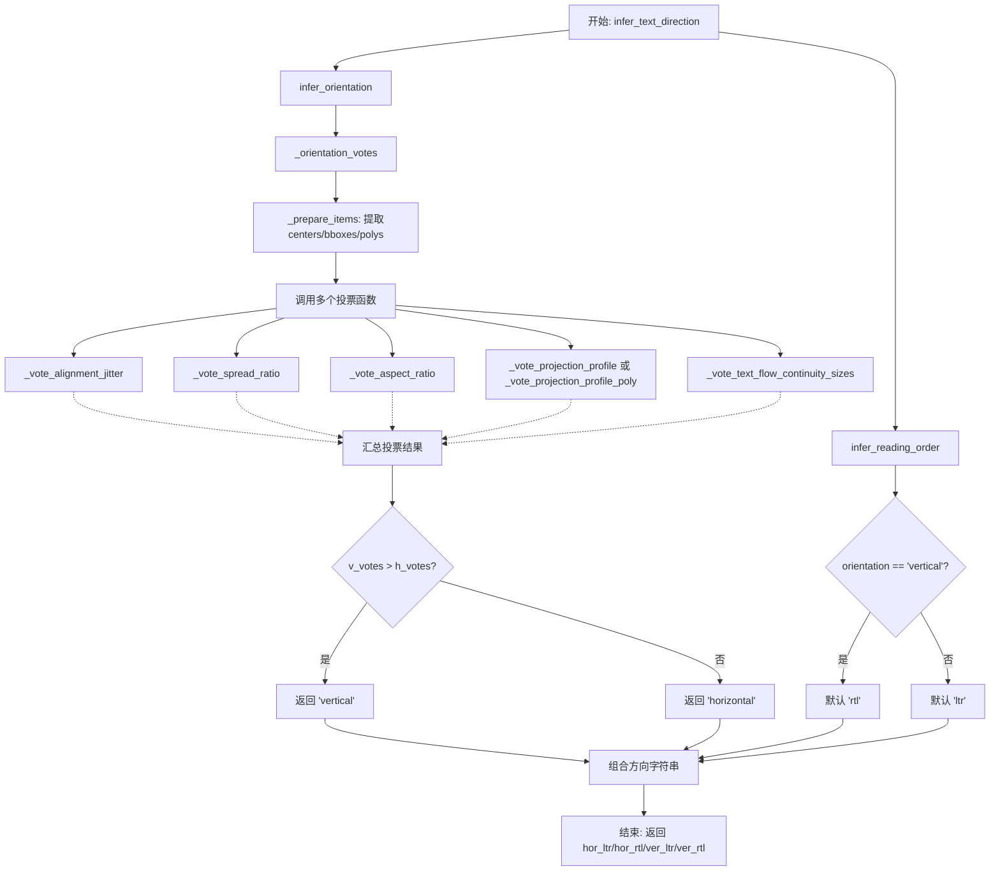
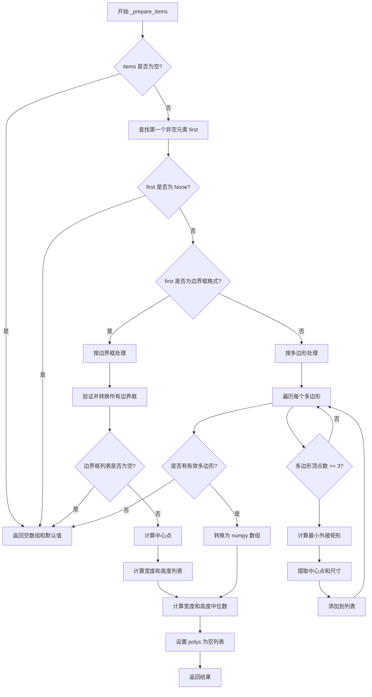
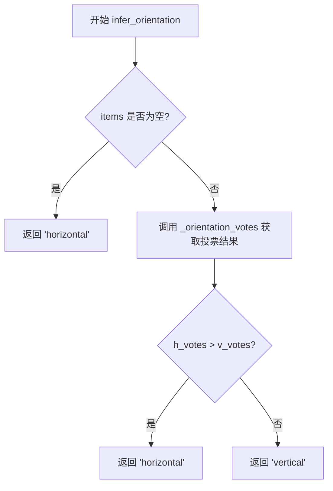
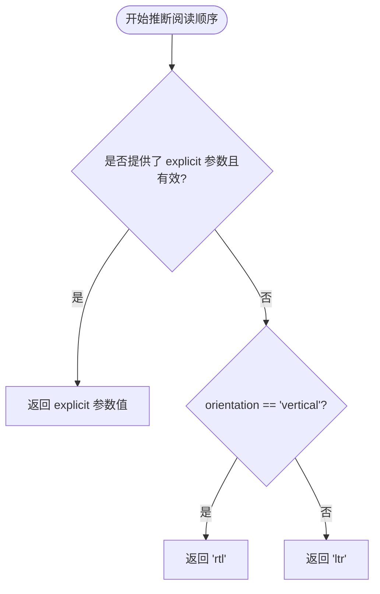
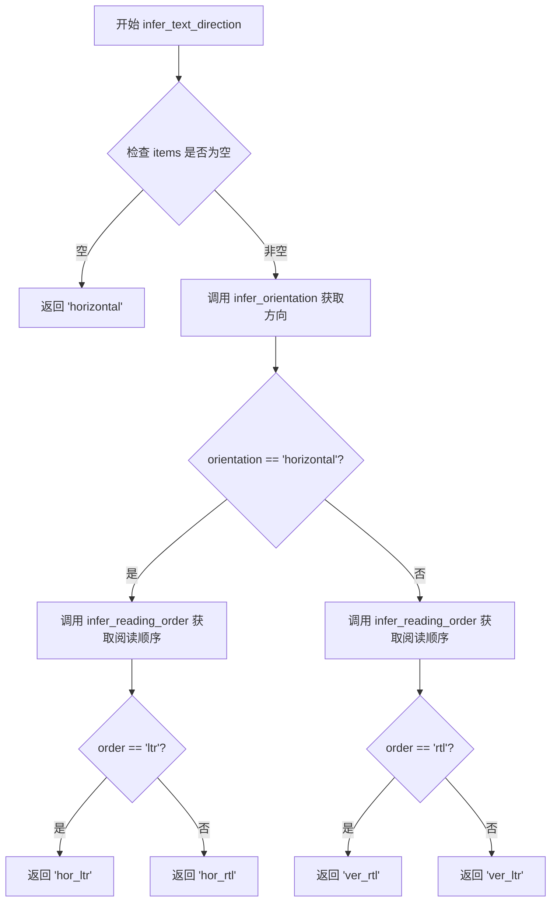

# `comic-translate\modules\detection\utils\orientation.py` 详细设计文档

A text orientation detection module that analyzes text bounding boxes or polygons to determine if text layout is horizontal or vertical, and derives reading order (LTR/RTL). Uses multiple voting strategies including spread ratio, aspect ratio, projection profile, alignment jitter, and text flow continuity.

## 整体流程



## 类结构

```
模块: text_orientation.py (扁平函数结构)
├── 投票函数 (内部使用)
│   ├── _vote_spread_ratio
│   ├── _vote_aspect_ratio
│   ├── _vote_projection_profile
│   ├── _vote_alignment_jitter
│   ├── _vote_projection_profile_poly
│   └── _vote_text_flow_continuity_sizes
├── 预处理函数
│   └── _prepare_items
├── 核心投票入口
│   └── _orientation_votes
└── 公开API
    ├── infer_orientation
    ├── infer_reading_order
    └── infer_text_direction
```

## 全局变量及字段


    

## 全局函数及方法


### `_vote_spread_ratio`

该函数通过计算文本框中心点在垂直方向与水平方向的分布范围之比（spread_ratio），判断文本的整体分布趋势。若垂直方向分布显著大于水平方向（比例超过1.5），则投票给垂直方向；否则投票给水平方向。

参数：

- `centers`：`np.ndarray`，包含所有文本框中心点的坐标数组，形状为 (n, 2)，其中 n 为文本框数量

返回值：`tuple[int, int]`，返回 (horizontal_votes, vertical_votes) 元组，值为 (1, 0) 表示水平方向，值为 (0, 1) 表示垂直方向

#### 流程图

```mermaid
flowchart TD
    A[开始] --> B[提取 centers 中的 x 坐标和 y 坐标]
    B --> C[计算 x 方向范围: range_x = xs.max - xs.min + 1e-6]
    C --> D[计算 y 方向范围: range_y = ys.max - ys.min + 1e-6]
    D --> E[计算扩展比率: spread_ratio = range_y / range_x]
    E --> F{spread_ratio > 1.5?}
    F -->|是| G[返回 (0, 1) 垂直方向]
    F -->|否| H[返回 (1, 0) 水平方向]
```

#### 带注释源码

```python
def _vote_spread_ratio(centers: np.ndarray) -> tuple[int, int]:
    """Vote based on overall spread ratio of text distribution."""
    # 从中心点数组中分离 x 和 y 坐标
    xs, ys = centers[:, 0], centers[:, 1]
    
    # 计算 x 方向的分布范围，加上小量 1e-6 防止除零
    range_x = xs.max() - xs.min() + 1e-6
    
    # 计算 y 方向的分布范围，加上小量 1e-6 防止除零
    range_y = ys.max() - ys.min() + 1e-6
    
    # 计算垂直与水平方向的扩展比率
    spread_ratio = range_y / range_x
    
    # 判断方向：若垂直分布显著大于水平分布（比率 > 1.5），则返回垂直投票
    if spread_ratio > 1.5:
        return 0, 1  # vertical
    else:
        return 1, 0  # horizontal
```

#### 技术说明

- **阈值 1.5**：该阈值是经验值，用于区分垂直和水平布局。当文本在垂直方向的分布范围是水平方向的 1.5 倍以上时，判定为垂直布局
- **防除零处理**：添加 `1e-6` 防止在所有中心点重合时导致除零错误
- **返回值语义**：返回 `(horizontal_votes, vertical_votes)`，用于后续与其他投票函数的结果累加


### `_vote_aspect_ratio`

基于文本框或多边形的中位数宽高比进行投票，以判断文本方向是水平还是垂直。

参数：

- `items`：`list`，输入的文本项列表，每个项可以是轴对齐边界框 `(x1, y1, x2, y2)` 或多边形点集 `[[x, y], ...]`

返回值：`tuple[int, int]`，返回元组 `(horizontal_votes, vertical_votes)`，其中第一个元素表示水平方向投票，第二个元素表示垂直方向投票。如果中位数宽高比大于 1.2 则返回 `(0, 1)`（垂直），否则返回 `(1, 0)`（水平）。

#### 流程图

```mermaid
flowchart TD
    A[开始 _vote_aspect_ratio] --> B[初始化空列表 aspects]
    B --> C{遍历 items 中的每个元素 it}
    C --> D{it 是否为空}
    D -->|是| C
    D -->|否| E{it 是否为边界框}
    E -->|是| F[提取 x1, y1, x2, y2]
    F --> G[计算 w = max(1, x2 - x1), h = max(1, y2 - y1)]
    G --> I[计算 aspects.append h / w]
    E -->|否| J[将 it 转为 numpy 数组 poly]
    J --> K{poly 维度是否为 2 且列数是否为 2}
    K -->|否| C
    K -->|是| L[提取 xs, ys]
    L --> M[计算 w = max(1, xs.max - xs.min), h = max(1, ys.max - ys.min)]
    M --> I
    C --> N{aspects 列表是否为空}
    N -->|是| O[median_aspect = 1.0]
    N -->|否| P[median_aspect = np.median ascepts]
    O --> Q{median_aspect > 1.2}
    P --> Q
    Q -->|是| R[返回 (0, 1) 垂直]
    Q -->|否| S[返回 (1, 0) 水平]
```

#### 带注释源码

```python
def _vote_aspect_ratio(items: list) -> tuple[int, int]:
    """Vote based on median aspect ratio of text boxes or polygons."""
    aspects = []  # 用于存储所有文本项的宽高比
    
    # 遍历每个文本项（可能是边界框或多边形）
    for it in items:
        if not it:  # 跳过空项
            continue
        
        # 判断是否为轴对齐边界框 (x1, y1, x2, y2)
        if isinstance(it, (list, tuple, np.ndarray)) and len(it) == 4 and not isinstance(it[0], (list, tuple, np.ndarray)):
            # 边界框情况：提取四个坐标
            x1, y1, x2, y2 = it
            # 计算宽度和高度，确保最小值为 1 避免除零
            w = max(1, x2 - x1)
            h = max(1, y2 - y1)
        else:
            # 多边形情况：处理点集 [[x,y],...]
            # 将输入转换为 numpy 数组
            poly = np.asarray(it, dtype=float)
            
            # 检查多边形有效性：必须是二维数组且每行有两个坐标
            if poly.ndim != 2 or poly.shape[1] != 2:
                continue
            
            # 提取 x 和 y 坐标
            xs, ys = poly[:, 0], poly[:, 1]
            # 计算多边形的轴对齐包围盒宽度和高度
            w = max(1.0, xs.max() - xs.min())
            h = max(1.0, ys.max() - ys.min())
        
        # 计算当前项的宽高比并添加到列表
        aspects.append(h / w)
    
    # 计算中位数宽高比，如果列表为空则默认为 1.0
    median_aspect = float(np.median(aspects)) if aspects else 1.0

    # 根据中位数宽高比决定方向
    # 宽高比 > 1.2 表示文本更倾向于垂直方向
    if median_aspect > 1.2:
        return 0, 1  # vertical (垂直)
    else:
        return 1, 0  # horizontal (水平)
```


### `_vote_projection_profile`

基于占用网格的投影轮廓各向异性来投票判断文本方向（水平或垂直）。该函数通过将文本边界框映射到网格上，计算行和列的方差分布来判断文本的主要排列方向。

参数：

- `centers`：`np.ndarray`，文本框的中心点坐标数组，形状为 (N, 2)
- `bboxes`：`list[tuple[int, int, int, int]]`，文本框的边界框列表，每个元素为 (x1, y1, x2, y2)

返回值：`tuple[int, int]`，返回 (horizontal_votes, vertical_votes) 元组，其中第一个元素表示水平方向投票，第二个元素表示垂直方向投票

#### 流程图

```mermaid
flowchart TD
    A[开始: 输入 centers, bboxes] --> B{len<br/>centers < 2?}
    B -->|Yes| C[返回 (0, 0)]
    B -->|No| D[计算边界: x_min, x_max, y_min, y_max]
    D --> E[计算总宽度 w_total 和高度 h_total]
    E --> F[根据宽高比选择网格大小 gw, gh<br/>范围: 32-96]
    F --> G[创建空 mask 网格 gh x gw]
    G --> H[遍历每个 bbox]
    H --> I{遍历完成?}
    I -->|No| J[将 bbox 映射到网格坐标<br/>gx1, gx2, gy1, gy2]
    J --> K[确保坐标顺序正确<br/>gx1 ≤ gx2, gy1 ≤ gy2]
    K --> L[mask[gy1:gy2+1, gx1:gx2+1] = 1]
    L --> I
    I -->|Yes| M[计算行方向和列方向的和<br/>row_sums, col_sums]
    M --> N[计算行方差 r_var 和列方差 c_var]
    N --> O{c_var > r_var * 1.3?}
    O -->|Yes| P[返回 (0, 1) 垂直]
    O -->|No| Q{r_var > c_var * 1.3?}
    Q -->|Yes| R[返回 (1, 0) 水平]
    Q -->|No| S[返回 (0, 0)]
    P --> T[结束]
    R --> T
    S --> T
    C --> T
```

#### 带注释源码

```python
def _vote_projection_profile(centers: np.ndarray, bboxes: list[tuple[int, int, int, int]]) -> tuple[int, int]:
    """Vote based on projection profile anisotropy from occupancy grid."""
    # 如果中心点数量少于2，无法判断方向，返回 (0, 0)
    if len(centers) < 2:
        return 0, 0
    
    try:
        # 提取所有中心点的 x 和 y 坐标
        xs, ys = centers[:, 0], centers[:, 1]
        
        # 计算文本区域的边界框（添加微小值避免除零）
        x_min = int(np.floor(xs.min()))
        x_max = int(np.ceil(xs.max()))
        y_min = int(np.floor(ys.min()))
        y_max = int(np.ceil(ys.max()))
        
        # 计算总宽度和高度（至少为1，避免除零）
        w_total = max(1, x_max - x_min)
        h_total = max(1, y_max - y_min)
        
        # 选择网格大小，与目标区域的宽高比成正比，限制在 [32, 96] 范围内
        # base = 64 是基准网格大小
        base = 64
        gw = int(np.clip(round(base * (w_total / max(w_total, h_total))), 32, 96))
        gh = int(np.clip(round(base * (h_total / max(w_total, h_total))), 32, 96))
        
        # 创建空的占用网格 mask（gh 行 x gw 列）
        mask = np.zeros((gh, gw), dtype=np.uint8)
        
        # 将每个文本边界框映射到网格并标记为已占用
        # Paint each bbox (clip to bounds)
        for (x1, y1, x2, y2) in bboxes:
            # 将原始坐标映射到网格坐标 [0, gw-1] 和 [0, gh-1]
            gx1 = int(np.clip(round((x1 - x_min) / w_total * (gw - 1)), 0, gw - 1))
            gx2 = int(np.clip(round((x2 - x_min) / w_total * (gw - 1)), 0, gw - 1))
            gy1 = int(np.clip(round((y1 - y_min) / h_total * (gh - 1)), 0, gh - 1))
            gy2 = int(np.clip(round((y2 - y_min) / h_total * (gh - 1)), 0, gh - 1))
            
            # 确保坐标顺序正确（x1 ≤ x2, y1 ≤ y2）
            if gx2 < gx1:
                gx1, gx2 = gx2, gx1
            if gy2 < gy1:
                gy1, gy2 = gy2, gy1
            
            # 将该区域标记为已占用（在 mask 上设为 1）
            mask[gy1:gy2 + 1, gx1:gx2 + 1] = 1
        
        # 计算投影轮廓：每行和每列的占用像素数量
        row_sums = mask.sum(axis=1).astype(float)  # 垂直方向的投影
        col_sums = mask.sum(axis=0).astype(float)  # 水平方向的投影
        
        # 计算方差：方差越大表示分布越不均匀
        r_var = float(np.var(row_sums))
        c_var = float(np.var(col_sums))
        
        # 根据方差比较判断方向：
        # - 如果列方差显著大于行方差（>1.3倍），说明垂直方向分布更不均匀，返回垂直 (0, 1)
        # - 如果行方差显著大于列方差（>1.3倍），说明水平方向分布更不均匀，返回水平 (1, 0)
        if c_var > r_var * 1.3:
            return 0, 1  # vertical
        elif r_var > c_var * 1.3:
            return 1, 0  # horizontal
    except Exception:
        # 任何异常都返回 (0, 0)，表示无法判断
        pass
    return 0, 0
```


### `_vote_alignment_jitter`

该函数通过计算文本质心坐标的对齐“抖动”（Jitter）来投票判定文本的排列方向（水平或垂直）。它首先对质心进行排序，分别计算水平方向（按X排序后的Y方差）和垂直方向（按Y排序后的X方差）的归一化方差，并结合滑动窗口局部方差来增强对局部对齐的敏感度。抖动值越小表示对齐越好，从而据此给出水平或垂直的投票。

参数：

-  `centers`：`np.ndarray`，形状为 (N, 2) 的数组，包含所有文本元素的质心坐标 (x, y)。

返回值：`tuple[int, int]`，返回 (horizontal_votes, vertical_votes)。(1, 0) 表示水平排列，(0, 1) 表示垂直排列，(0, 0) 表示无法判断或异常。

#### 流程图

```mermaid
flowchart TD
    A[Start _vote_alignment_jitter] --> B{len(centers) < 3?}
    B -- Yes --> C[Return (0, 0)]
    B -- No --> D[Try Block]
    D --> E[Extract xs, ys]
    E --> F[Calculate x_range, y_range]
    F --> G[sorted_by_x = centers sorted by X]
    F --> H[sorted_by_y = centers sorted by Y]
    G --> I[y_coords = sorted_by_x[:, 1]]
    H --> J[x_coords = sorted_by_y[:, 0]]
    I --> K[y_var_norm = Var(y_coords) / y_range]
    J --> L[x_var_norm = Var(x_coords) / x_range]
    K --> M{n >= 5?}
    L --> M
    M -- Yes --> N[Sliding window Y variance]
    M -- Yes --> O[Sliding window X variance]
    N --> P[y_sliding_jitter = mean(vars) / y_range]
    O --> Q[x_sliding_jitter = mean(vars) / x_range]
    P --> R[horiz_jitter = (y_var_norm + y_sliding_jitter) / 2]
    Q --> S[vert_jitter = (x_var_norm + x_sliding_jitter) / 2]
    M -- No --> T[horiz_jitter = y_var_norm]
    M -- No --> U[vert_jitter = x_var_norm]
    T --> V{horiz_jitter < vert_jitter * 0.6?}
    U --> V
    R --> V
    S --> V
    V -- Yes --> W[Return (1, 0) Horizontal]
    V -- No --> X{vert_jitter < horiz_jitter * 0.6?}
    X -- Yes --> Y[Return (0, 1) Vertical]
    X -- No --> Z[Return (0, 0)]
    W --> AA[End]
    Y --> AA
    Z --> AA
    D --> AB[Exception]
    AB --> AC[Print Error]
    AC --> Z
```

#### 带注释源码

```python
def _vote_alignment_jitter(centers: np.ndarray) -> tuple[int, int]:
    """Vote based on alignment jitter - measures how well-aligned text is in each direction."""
    # If there are too few points, alignment jitter is unreliable
    if len(centers) < 3:
        return 0, 0
    
    try:
        xs, ys = centers[:, 0], centers[:, 1]
        n = len(centers)
        
        # Simple normalization using ranges to make variance scale-invariant
        x_range = xs.max() - xs.min() + 1e-6
        y_range = ys.max() - ys.min() + 1e-6
        
        # Test horizontal alignment: variance of Y coordinates when sorted by X
        # If text is horizontal, Y coords should be very similar (low variance)
        sorted_by_x = centers[centers[:, 0].argsort()]
        y_coords_sorted_by_x = sorted_by_x[:, 1]
        
        # Test vertical alignment: variance of X coordinates when sorted by Y  
        # If text is vertical, X coords should be very similar (low variance)
        sorted_by_y = centers[centers[:, 1].argsort()]
        x_coords_sorted_by_y = sorted_by_y[:, 0]
        
        # Use coefficient of variation for scale-invariant comparison
        # Normalized variance = raw variance / range
        y_var_normalized = np.var(y_coords_sorted_by_x) / (y_range + 1e-6)
        x_var_normalized = np.var(x_coords_sorted_by_y) / (x_range + 1e-6)
        
        # Additional check: sliding window variance for better alignment detection
        # This helps detect alignment in sub-groups of text
        if n >= 5:
            win_size = min(max(3, n // 3), 8)
            
            # Y variance in sliding windows along X-sorted sequence
            y_sliding_vars = []
            for i in range(len(y_coords_sorted_by_x) - win_size + 1):
                window_y = y_coords_sorted_by_x[i:i + win_size]
                y_sliding_vars.append(np.var(window_y))
            y_sliding_jitter = np.mean(y_sliding_vars) / (y_range + 1e-6)
            
            # X variance in sliding windows along Y-sorted sequence  
            x_sliding_vars = []
            for i in range(len(x_coords_sorted_by_y) - win_size + 1):
                window_x = x_coords_sorted_by_y[i:i + win_size]
                x_sliding_vars.append(np.var(window_x))
            x_sliding_jitter = np.mean(x_sliding_vars) / (x_range + 1e-6)
            
            # Combine global and local variance measures
            horiz_jitter = (y_var_normalized + y_sliding_jitter) / 2
            vert_jitter = (x_var_normalized + x_sliding_jitter) / 2
        else:
            horiz_jitter = y_var_normalized
            vert_jitter = x_var_normalized

        # Lower jitter indicates better alignment
        # Use conservative thresholds (0.6 ratio) for better discrimination
        if horiz_jitter < vert_jitter * 0.6:
            return 1, 0  # horizontal (low Y jitter)
        elif vert_jitter < horiz_jitter * 0.6:
            return 0, 1  # vertical (low X jitter)
    except Exception as e:
        print(f"Error in alignment jitter calculation: {e}")
    return 0, 0
```


### `_vote_projection_profile_poly`

基于多边形的光栅化投影轮廓分析，评估文本区域在各方向上的分布差异以投票确定文本取向（水平或垂直）。该函数通过将多边形光栅化到occupancy grid并计算行列方差的比值来判断主方向。

参数：

- `polygons`：`list[np.ndarray]`，多边形列表，每个元素为包含至少3个顶点的numpy数组，形状为`(N, 2)`，表示多边形的顶点坐标

返回值：`tuple[int, int]`，返回`(horizontal_votes, vertical_votes)`元组。当列方差大于行方差的1.3倍时返回`(0, 1)`表示垂直取向；当行方差大于列方差的1.3倍时返回`(1, 0)`表示水平取向；否则返回`(0, 0)`表示无法确定

#### 流程图

```mermaid
flowchart TD
    A[开始: _vote_projection_profile_poly] --> B{polygons长度 < 2?}
    B -->|是| C[返回 (0, 0)]
    B -->|否| D[try块开始]
    D --> E[合并所有多边形顶点]
    E --> F[计算全局边界: x_min, x_max, y_min, y_max]
    F --> G[计算总宽度 w_total 和总高度 h_total]
    G --> H[根据宽高比计算网格尺寸 gw, gh]
    H --> I[创建gh×gw的零mask矩阵]
    I --> J{遍历每个多边形}
    J -->|当前多边形| K{多边形维度检查}
    K -->|无效| J
    K -->|有效| L[将顶点坐标缩放到网格空间]
    L --> M[对缩放后的顶点取整并裁剪到网格范围]
    M --> N[调用imk.fill_poly填充多边形到mask]
    N --> J
    J --> O[计算每行和每列的sum]
    O --> P[计算行方差 r_var 和列方差 c_var]
    P --> Q{c_var > r_var * 1.3?}
    Q -->|是| R[返回 (0, 1) 垂直]
    Q -->|否| S{r_var > c_var * 1.3?}
    S -->|是| T[返回 (1, 0) 水平]
    S -->|否| U[返回 (0, 0) 不确定]
    R --> V[结束]
    T --> V
    U --> V
    C --> V
    D --> W[except块: 捕获所有异常]
    W --> X[pass静默处理]
    X --> Y[返回 (0, 0)]
    Y --> V
```

#### 带注释源码

```python
# polygon-aware projection profile (rasterize polygons instead of painting AABBs)
def _vote_projection_profile_poly(polygons: list[np.ndarray]) -> tuple[int, int]:
    """基于多边形投影轮廓的投票方法，使用栅格化而非轴对齐包围盒。
    
    Args:
        polygons: 多边形列表，每个元素为形状(N, 2)的numpy数组，表示多边形顶点
        
    Returns:
        tuple[int, int]: (horizontal_votes, vertical_votes)
            - (0, 1): 垂直方向占优
            - (1, 0): 水平方向占优
            - (0, 0): 无法确定方向
    """
    # 输入验证：多边形数量不足2个时无法有效分析方向
    if len(polygons) < 2:
        return 0, 0
    
    try:
        # 全局范围计算：将所有多边形的顶点堆叠在一起
        # vstack将所有多边形点合并为一个Nx2的数组
        all_pts = np.vstack(polygons)
        xs, ys = all_pts[:, 0], all_pts[:, 1]
        
        # 计算坐标边界，使用floor/ceil确保覆盖所有点
        x_min = float(np.floor(xs.min()))
        x_max = float(np.ceil(xs.max()))
        y_min = float(np.floor(ys.min()))
        y_max = float(np.ceil(ys.max()))
        
        # 计算总宽度和高度，最小值为1避免除零
        w_total = max(1.0, x_max - x_min)
        h_total = max(1.0, y_max - y_min)

        # 网格尺寸计算：基础值为64，根据宽高比在[32, 96]范围内调整
        # 保持宽高比一致性的同时限制网格大小以平衡精度和性能
        base = 64
        gw = int(np.clip(round(base * (w_total / max(w_total, h_total))), 32, 96))
        gh = int(np.clip(round(base * (h_total / max(w_total, h_total))), 32, 96))
        
        # 创建occupancy grid mask，用于记录多边形填充区域
        # uint8类型足够存储二值掩码
        mask = np.zeros((gh, gw), dtype=np.uint8)

        # 遍历每个多边形并栅格化填充到mask中
        for cnt in polygons:
            # 验证多边形有效性：需要是2D数组且至少3个顶点（三角形）
            if cnt.ndim != 2 or cnt.shape[0] < 3:
                continue
            
            # 坐标归一化：将原始坐标映射到[0, gw-1]和[0, gh-1]的网格空间
            gx = (cnt[:, 0] - x_min) / w_total * (gw - 1)
            gy = (cnt[:, 1] - y_min) / h_total * (gh - 1)
            
            # 顶点量化：四舍五入到整数坐标，并裁剪到有效网格范围
            pts = np.stack([np.clip(np.round(gx), 0, gw - 1),
                            np.clip(np.round(gy), 0, gh - 1)], axis=1).astype(np.int32)
            
            # 调用imkit库的光栅化函数填充多边形
            # 填充值为1，表示被文本区域占据
            mask = imk.fill_poly(mask, [pts], 1)

        # 投影轮廓分析：计算每行和每列的像素数量
        row_sums = mask.sum(axis=1).astype(float)  # 沿x轴求和得到每行填充数
        col_sums = mask.sum(axis=0).astype(float)  # 沿y轴求和得到每列填充数
        
        # 计算方差：方差大表示分布不均匀，即该方向为文本的主要排列方向
        r_var = float(np.var(row_sums))
        c_var = float(np.var(col_sums))

        # 方向判定：使用1.3倍阈值进行区分
        # 列方差大 -> 垂直方向文本（列方向分布不均）
        if c_var > r_var * 1.3:
            return 0, 1  # vertical
        # 行方差大 -> 水平方向文本（行方向分布不均）
        elif r_var > c_var * 1.3:
            return 1, 0  # horizontal
    except Exception:
        # 静默处理所有异常，保证投票框架的鲁棒性
        pass
    
    # 默认返回不确定
    return 0, 0
```


### `_vote_text_flow_continuity_sizes`

基于文本中心点的相对位置关系（右侧候选点和下方候选点），计算文本流连续性得分，判断文本方向是水平还是垂直流动。

参数：

- `centers`：`np.ndarray`，文本区域的中心点坐标数组，形状为 (N, 2)，其中 N 为文本块数量
- `med_w`：`float`，文本区域的宽度中位数，用于判断水平流动的距离阈值（阈值为 med_w * 3）
- `med_h`：`float`，文本区域的高度中位数，用于判断垂直流动的距离阈值（阈值为 med_h * 3）

返回值：`tuple[int, int]`，返回 (horizontal_votes, vertical_votes)，分别表示水平流动和垂直流动的票数

#### 流程图

```mermaid
flowchart TD
    A[开始] --> B{len(centers) < 3?}
    B -->|是| C[返回 (0, 0)]
    B -->|否| D[初始化 flow_scores = {'horizontal': 0, 'vertical': 0}]
    D --> E[遍历 i, ci in enumerate(centers)]
    E --> F[初始化 candidates_right = [], candidates_down = []]
    F --> G[遍历 j, cj in enumerate(centers)]
    G --> H{i == j?]
    H -->|是| G
    H -->|否| I[计算 dx = cj[0] - ci[0], dy = cj[1] - ci[1]]
    I --> J[dist = hypot(dx, dy)]
    J --> K{dx > 0 and |dy| < |dx| * 0.5?]
    K -->|是| L[candidates_right.append(dist)]
    K -->|否| M
    M --> N{dy > 0 and |dx| < |dy| * 0.5?}
    N -->|是| O[candidates_down.append(dist)]
    N -->|否| G
    L --> G
    O --> G
    G --> P{candidates_right and min < med_w * 3?]
    P -->|是| Q[flow_scores['horizontal'] += 1]
    P -->|否| R
    Q --> R
    R --> S{candidates_down and min < med_h * 3?]
    S -->|是| T[flow_scores['vertical'] += 1]
    S -->|否| E
    T --> E
    E --> U{horizontal > vertical * 1.2?]
    U -->|是| V[返回 (1, 0)]
    U -->|否| W{vertical > horizontal * 1.2?}
    W -->|是| X[返回 (0, 1)]
    W -->|否| Y[返回 (0, 0)]
    C --> Z[结束]
    V --> Z
    X --> Z
    Y --> Z
```

#### 带注释源码

```python
def _vote_text_flow_continuity_sizes(centers: np.ndarray, med_w: float, med_h: float) -> tuple[int, int]:
    """Vote based on text flow continuity using median sizes from oriented text.
    
    Analyzes the relative positions between text center points to determine
    whether the text flows horizontally (left-to-right) or vertically (top-to-bottom).
    
    Args:
        centers: Array of shape (N, 2) containing text center coordinates
        med_w: Median width of text regions, used as horizontal distance threshold
        med_h: Median height of text regions, used as vertical distance threshold
    
    Returns:
        Tuple of (horizontal_votes, vertical_votes)
    """
    # Need at least 3 points to determine flow direction meaningfully
    if len(centers) < 3:
        return 0, 0
    
    try:
        # Initialize flow direction scores
        flow_scores = {'horizontal': 0, 'vertical': 0}
        
        # For each center point, find candidate neighbors in right and down directions
        for i, ci in enumerate(centers):
            candidates_right = []  # Points to the right of ci
            candidates_down = []   # Points below ci
            
            # Compare with all other center points
            for j, cj in enumerate(centers):
                if i == j:
                    continue
                
                # Calculate displacement vector
                dx = cj[0] - ci[0]
                dy = cj[1] - ci[1]
                dist = float(np.hypot(dx, dy))  # Euclidean distance
                
                # Check if cj is to the right of ci:
                # - dx > 0: cj has larger x coordinate
                # - |dy| < |dx| * 0.5: vertical offset is less than half horizontal offset
                #   This ensures the candidate is predominantly horizontally aligned
                if dx > 0 and abs(dy) < abs(dx) * 0.5:
                    candidates_right.append(dist)
                
                # Check if cj is below ci:
                # - dy > 0: cj has larger y coordinate
                # - |dx| < |dy| * 0.5: horizontal offset is less than half vertical offset
                #   This ensures the candidate is predominantly vertically aligned
                if dy > 0 and abs(dx) < abs(dy) * 0.5:
                    candidates_down.append(dist)
            
            # Vote for horizontal flow if there's a nearby right neighbor
            # Threshold: 3 times median width (captures typical character spacing)
            if candidates_right and min(candidates_right) < med_w * 3:
                flow_scores['horizontal'] += 1
            
            # Vote for vertical flow if there's a nearby below neighbor
            # Threshold: 3 times median height
            if candidates_down and min(candidates_down) < med_h * 3:
                flow_scores['vertical'] += 1

        # Determine final direction based on score comparison
        # Use 1.2x threshold to require meaningful difference
        if flow_scores['horizontal'] > flow_scores['vertical'] * 1.2:
            return 1, 0  # horizontal
        elif flow_scores['vertical'] > flow_scores['horizontal'] * 1.2:
            return 0, 1  # vertical
    except Exception:
        # Fail gracefully - return neutral vote on any error
        pass
    return 0, 0
```


### `_prepare_items`

该函数负责将输入的文本项（可以是边界框或多边形）统一转换为标准化的中心点、中位数尺寸、以及对应的边界框或多边形列表，为后续的方向投票提供统一的输入格式。

参数：

- `items`：`list`，输入的文本项列表，每个元素可以是边界框 `(x1, y1, x2, y2)` 或多边形点列表 `[[x, y], ...]`

返回值：`tuple`，包含以下五个元素：
- `centers`：`np.ndarray`，形状为 `(N, 2)` 的中心点坐标数组
- `med_w`：`float`，宽度中位数
- `med_h`：`float`，高度中位数
- `bboxes`：`list[tuple[int, int, int, int]]`，边界框列表（若输入为多边形则为空列表）
- `polys`：`list[np.ndarray]`，多边形列表（若输入为边界框则为空列表）

#### 流程图



#### 带注释源码

```python
def _prepare_items(items):
    """Prepare centers, median sizes, and canonical bboxes/polys from either bboxes or polygons.
    
    该函数是方向推理的预处理步骤，统一的输入格式。
    支持两种输入格式：
    1. 边界框: [(x1,y1,x2,y2), ...]
    2. 多边形: [[[x,y],...], ...]
    """
    # 空输入检查：直接返回默认值，避免后续处理空列表出错
    if not items:
        return np.zeros((0, 2), dtype=float), 1.0, 1.0, [], []

    # 查找第一个非空元素：用于类型推断
    # 多边形可能为空（如面积为0），需要跳过这些无效元素
    first = None
    for it in items:
        if it:
            first = it
            break
    # 所有元素都为空的情况
    if first is None:
        return np.zeros((0, 2), dtype=float), 1.0, 1.0, [], []

    # 边界框检测逻辑：
    # 边界框特征：长度为4的序列，且第一个元素不是嵌套序列
    # 多边形特征：每个元素是点序列的序列
    is_bbox_candidate = isinstance(first, (list, tuple, np.ndarray)) and len(first) == 4 and not isinstance(first[0], (list, tuple, np.ndarray))
    
    # 分支1：处理边界框输入
    if is_bbox_candidate:
        # 将所有输入转换为整数边界框
        # 过滤掉长度不为4的元素，防止异常数据
        bboxes = [(int(x1), int(y1), int(x2), int(y2)) for x1, y1, x2, y2 in items if len((x1, y1, x2, y2)) == 4]
        if not bboxes:
            return np.zeros((0, 2), dtype=float), 1.0, 1.0, [], []
        
        # 计算每个边界框的中心点：(x1+x2)/2, (y1+y2)/2
        centers = np.array([[(x1 + x2) / 2.0, (y1 + y2) / 2.0] for x1, y1, x2, y2 in bboxes], dtype=float)
        
        # 计算宽度和高度，最小值为1防止除零
        widths = [max(1, x2 - x1) for x1, y1, x2, y2 in bboxes]
        heights = [max(1, y2 - y1) for x1, y1, x2, y2 in bboxes]
        
        # 使用中位数作为典型尺寸，对异常值更鲁棒
        med_w = float(np.median(widths)) if widths else 1.0
        med_h = float(np.median(heights)) if heights else 1.0
        
        polys = []  # 多边形列表为空
        return centers, med_w, med_h, bboxes, polys

    # 分支2：处理多边形输入
    # 初始化存储结构
    polys = []
    centers_list = []
    widths = []
    heights = []
    
    # 遍历每个多边形：过滤无效多边形（顶点数<3）
    for poly in items:
        if not poly or len(poly) < 3:
            continue
        
        # 转换为numpy数组以便后续计算
        cnt = np.asarray(poly, dtype=np.float32)
        polys.append(cnt)
        
        # 使用 imkit 库计算最小面积外接矩形
        # 返回格式：((cx, cy), (w, h), angle)
        rect = imk.min_area_rect(cnt)
        (cx, cy), (w, h), _ = rect
        centers_list.append([cx, cy])
        
        # 记录尺寸，同样保证最小值为1
        widths.append(max(float(w), 1.0))
        heights.append(max(float(h), 1.0))

    # 处理后仍无可用多边形的情况
    if not centers_list:
        return np.zeros((0, 2), dtype=float), 1.0, 1.0, [], []
    
    # 转换为numpy数组格式
    centers = np.asarray(centers_list, dtype=float)
    med_w = float(np.median(widths)) if widths else 1.0
    med_h = float(np.median(heights)) if heights else 1.0
    
    bboxes = []  # 边界框列表为空，可按需派生
    return centers, med_w, med_h, bboxes, polys
```


### `_orientation_votes`

统一的方向投票入口点，接收边界框或边形列表，通过多种投票策略（对齐抖动、分布比率、长宽比、投影轮廓、文本流连续性）综合判断文本是水平还是垂直排列，并返回水平票数和垂直票数。

参数：

-  `items`：`list`，待检测方向的元素列表，可以是边界框列表 `[(x1, y1, x2, y2), ...]` 或多边形列表 `[[[x, y], ...], ...]`

返回值：`tuple[int, int]`，返回值为元组 `(horizontal_votes, vertical_votes)`，分别表示水平排列和垂直排列的投票得分。

#### 流程图

```mermaid
flowchart TD
    A[开始 _orientation_votes] --> B[调用 _prepare_items 准备数据]
    B --> C{centers 是否为空?}
    C -->|是| D[返回 (0, 0)]
    C -->|否| E[初始化 horizontal_votes=0, vertical_votes=0]
    E --> F1[调用 _vote_alignment_jitter 投票]
    F1 --> F2[调用 _vote_spread_ratio 投票]
    F2 --> F3[调用 _vote_aspect_ratio 投票]
    F3 --> F4{是否有 polys?}
    F4 -->|是| F5[调用 _vote_projection_profile_poly 投票]
    F4 -->|否| F6{是否有 bboxes?}
    F6 -->|是| F7[调用 _vote_projection_profile 投票]
    F6 -->|否| F8[投票 (0, 0)]
    F5 --> F9
    F7 --> F9
    F8 --> F9
    F9 --> F10[调用 _vote_text_flow_continuity_sizes 投票]
    F10 --> G[返回 (horizontal_votes, vertical_votes)]
```

#### 带注释源码

```python
def _orientation_votes(items: list) -> tuple[int, int]:
    """Unified orientation voting entry point.
    'items' may be a list of bboxes [(x1,y1,x2,y2), ...] or polygons [[[x,y],...], ...].
    Returns (horizontal_votes, vertical_votes).
    """
    # 步骤1：准备数据 - 从输入items中提取中心点、中位数尺寸、边界框或多边形
    centers, med_w, med_h, bboxes, polys = _prepare_items(items)
    
    # 步骤2：如果没有有效的中心点，直接返回(0, 0)表示无投票
    if centers.size == 0:
        return 0, 0

    # 步骤3：初始化投票计数器
    horizontal_votes = 0
    vertical_votes = 0

    # 步骤4：基于中心点对齐抖动进行投票（检测文本对齐的一致性）
    for vote_func in [_vote_alignment_jitter]:
        try:
            h, v = vote_func(centers)
            horizontal_votes += h
            vertical_votes += v
        except Exception:
            pass

    # 步骤5：基于整体分布比率进行投票（文本分布的宽高比）
    try:
        h, v = _vote_spread_ratio(centers)
        horizontal_votes += h
        vertical_votes += v
    except Exception:
        pass

    # 步骤6：基于中位数长宽比进行投票（文本框或多变形的宽高比中位数）
    try:
        items = bboxes or polys  # 使用可用数据（边界框或多边形）
        h, v = _vote_aspect_ratio(items)
        horizontal_votes += h
        vertical_votes += v
    except Exception:
        pass

    # 步骤7：基于投影轮廓投票（如果有多边形使用多边形感知版本，否则使用AABB版本）
    try:
        if polys:
            # 有多边形数据，使用多边形感知的投影轮廓投票
            h, v = _vote_projection_profile_poly(polygons)
        else:
            # 无多边形，检查是否有边界框，有则使用轴对齐投影轮廓
            if bboxes:
                h, v = _vote_projection_profile(centers, bboxes)
            else:
                # 无有效数据，投票(0, 0)
                h, v = 0, 0
        horizontal_votes += h
        vertical_votes += v
    except Exception:
        pass

    # 步骤8：基于文本流连续性尺寸进行投票（检测水平和垂直方向的连续性）
    try:
        h, v = _vote_text_flow_continuity_sizes(centers, med_w, med_h)
        horizontal_votes += h
        vertical_votes += v
    except Exception:
        pass

    # 步骤9：返回最终的水平和垂直投票结果
    return horizontal_votes, vertical_votes
```


### `infer_orientation`

该函数是文本方向推理的入口函数，接收文本元素列表（边界框或多边形），通过投票机制综合多种启发式算法判断文本是水平还是垂直排列，并返回对应的方向字符串。

参数：

- `items`：`list`，文本元素列表，每个元素可以是边界框 `(x1, y1, x2, y2)` 或是多边形点列表 `[[x, y], ...]`

返回值：`str`，返回 `'horizontal'` 表示水平排列，返回 `'vertical'` 表示垂直排列

#### 流程图



#### 带注释源码

```python
def infer_orientation(items: list) -> str:
    """Infer orientation only: returns 'horizontal' or 'vertical'."""
    # 空列表默认为水平方向
    if not items:
        return 'horizontal'
    # 获取水平和垂直方向的投票分数
    h_votes, v_votes = _orientation_votes(items)
    # 垂直票数多则返回 vertical，否则返回 horizontal
    return 'vertical' if v_votes > h_votes else 'horizontal'
```


### `infer_reading_order`

该函数用于根据文本的排版方向（orientation）确定阅读顺序（reading order）。它优先响应用户显式指定的阅读方向（explicit），若未指定，则依据排版方向应用默认规则：垂直排版对应从右向左（rtl），水平排版对应从左向右（ltr）。

参数：

-  `orientation`：`str`，表示文本的排版方向，通常为 'horizontal'（水平）或 'vertical'（垂直）。
-  `explicit`：`str | None`，可选参数，显式指定的阅读顺序（如 'ltr' 或 'rtl'），用于覆盖默认逻辑。

返回值：`str`，返回阅读顺序字符串，值为 'ltr'（从左到右）或 'rtl'（从右到左）。

#### 流程图



#### 带注释源码

```python
def infer_reading_order(orientation: str, explicit: str | None = None) -> str:
    """Determine reading order 'ltr' or 'rtl'.

    Defaults requested: horizontal -> ltr, vertical -> rtl unless explicitly overridden."""
    # 如果显式指定了阅读方向（explicit），且其值在允许的集合 {'ltr', 'rtl'} 中，则直接返回该值
    if explicit in {'ltr', 'rtl'}:
        return explicit
    
    # 否则，根据排版方向（orientation）应用默认规则：
    # 垂直排版（vertical）默认对应从右向左（rtl）
    # 水平排版（horizontal）默认对应从左向右（ltr）
    return 'rtl' if orientation == 'vertical' else 'ltr'
```


### `infer_text_direction`

该函数是向后兼容的组合方向字符串接口，通过调用 `infer_orientation` 获取文本方向（水平/垂直），再调用 `infer_reading_order` 获取阅读顺序（LTR/RTL），最终将两者组合为传统的方向标记字符串（如 hor_ltr、hor_rtl、ver_ltr、ver_rtl）。

参数：

- `items`：`list`，输入的文本项目列表，可以是边界框 `[(x1,y1,x2,y2),...]` 或多边形 `[[[x,y],...],...]`

返回值：`str`，返回组合后的方向字符串，可能的值包括 `'hor_ltr'`（水平从左到右）、`'hor_rtl'`（水平从右到左）、`'ver_ltr'`（垂直从左到右）、`'ver_rtl'`（垂直从右到左）

#### 流程图



#### 带注释源码

```python
def infer_text_direction(items: list) -> str:
    """Backward-compatible combined direction string.

    Combines orientation + reading order into legacy token (hor_ltr, hor_rtl, ver_ltr, ver_rtl)."""
    # 第一步：推断文本方向（水平或垂直）
    # 内部调用 _orientation_votes 汇总多种投票策略
    orientation = infer_orientation(items)
    
    # 第二步：根据方向推断阅读顺序（LTR 或 RTL）
    # 水平默认 LTR，垂直默认 RTL
    order = infer_reading_order(orientation)
    
    # 第三步：组合方向和阅读顺序为传统格式字符串
    if orientation == 'horizontal':
        # 水平方向：根据阅读顺序返回 hor_ltr 或 hor_rtl
        return 'hor_ltr' if order == 'ltr' else 'hor_rtl'
    
    # 垂直方向：根据阅读顺序返回 ver_ltr 或 ver_rtl
    # 注意：垂直方向默认返回 rtl，与常规垂直排版习惯一致
    return 'ver_rtl' if order == 'rtl' else 'ver_ltr'
```

## 关键组件


### _vote_spread_ratio

基于文本分布的整体展开比率进行投票，判断文本是水平还是垂直排列。

### _vote_aspect_ratio

基于文本框或多边形的中位宽高比进行投票，判断文本方向。

### _vote_projection_profile

基于占用网格的投影轮廓各向异性进行投票，使用AABB绘制方式。

### _vote_alignment_jitter

基于对齐抖动进行投票，测量文本在每个方向上的对齐程度。

### _vote_projection_profile_poly

多边形感知的投影轮廓，使用多边形栅格化代替AABB绘制。

### _vote_text_flow_continuity_sizes

基于方向尺寸中位数的文本流连续性投票。

### _prepare_items

从边界框或多边形准备中心点、中位尺寸和规范边界框/多边形。

### _orientation_votes

统一的方向投票入口点，汇总多种投票策略的结果。

### infer_orientation

推理文本方向，仅返回'horizontal'或'vertical'。

### infer_reading_order

确定阅读顺序，返回'ltr'或'rtl'。

### infer_text_direction

向后兼容的组合方向字符串，生成如hor_ltr、hor_rtl、ver_ltr、ver_rtl等legacy token。

## 问题及建议


### 已知问题

-   **异常处理过于宽泛**：大量使用 `try-except pass` 捕获所有异常，可能隐藏真正的错误，导致调试困难。
-   **变量遮蔽**：在 `_orientation_votes` 函数中，`items = bboxes or polys` 遮蔽了输入参数 `items`，易引发混淆和潜在bug。
-   **魔法数字散落**：多处硬编码阈值（1.5、1.2、1.3、0.6、3.0、64、32、96 等）缺乏常量定义，降低可维护性。
-   **类型标注不完整**：部分函数参数缺少类型标注（如 `_vote_aspect_ratio(items: list)` 中 items 元素类型未知）。
-   **代码重复**：`_vote_projection_profile` 和 `_vote_projection_profile_poly` 存在大量重复逻辑，应合并或抽象公共基类。
-   **边界处理不显式**：使用 `+ 1e-6`、`max(1, ...)` 等隐式方式避免除零，不如显式的零值检查清晰。
-   **外部依赖无显式检查**：依赖 `imkit` 模块的 `imk.fill_poly` 和 `imk.min_area_rect`，但无导入验证或 fallback 机制。
-   **投票权重不可配置**：各投票算法权重固定为 1，无法针对不同场景调整，影响灵活性。

### 优化建议

-   **重构异常处理**：为不同异常类型设计具体处理策略，必要时记录日志而非静默忽略。
-   **消除变量遮蔽**：将 `items = bboxes or polys` 改为其他变量名，如 `vote_items`。
-   **提取常量**：创建配置类或常量模块集中管理阈值和魔法数字。
-   **完善类型标注**：使用泛型或 Protocol 明确 items 中元素的类型（如 `list[tuple[int, int, int, int]]`）。
-   **抽象公共逻辑**：将投影 profile 的公共逻辑提取为独立函数，减少重复代码。
-   **显式边界检查**：使用条件分支显式处理零值和边界情况，提高代码可读性。
-   **添加依赖检查**：在模块初始化时验证 `imkit` 是否可用，提供明确的错误信息。
-   **引入投票权重配置**：允许通过参数或配置文件调整各投票算法的权重，增强适应性。

## 其它


### 设计目标与约束

本模块的设计目标是提供一个轻量级的文本方向检测解决方案，能够从文本框坐标或多边形中推断出文本的排列方向（水平/垂直）以及阅读顺序（从左到右/从右到左）。核心约束包括：输入可以是边界框列表或多边形列表，输出为方向字符串；模块依赖numpy和imkit两个外部库；所有投票函数应返回(h, v)元组表示水平和垂直票数。

### 错误处理与异常设计

代码采用防御式编程策略，主要通过try-except块捕获异常并返回默认值。具体表现为：_vote_projection_profile、_vote_alignment_jitter、_vote_projection_profile_poly和_vote_text_flow_continuity_sizes函数在捕获异常后返回(0,0)或(0,1)表示无法确定方向；_vote_aspect_ratio函数对无效输入进行跳过处理；_prepare_items函数对空输入和类型不匹配的输入返回默认值（如空数组和1.0的中值宽高）。所有异常均被静默处理，仅在_vote_alignment_jitter中打印错误信息。

### 数据流与状态机

数据流从infer_text_direction入口函数开始，首先调用infer_orientation获取方向，然后调用infer_reading_order获取阅读顺序，最后组合为四字符方向字符串。_orientation_votes是核心投票函数，它调用_prepare_items进行数据预处理（包括中心点计算、中值尺寸计算、边界框与多边形分离），然后依次调用五种投票策略：_vote_alignment_jitter（对齐抖动）、_vote_spread_ratio（分布范围比）、_vote_aspect_ratio（宽高比中值）、_vote_projection_profile/_vote_projection_profile_poly（投影轮廓）、_vote_text_flow_continuity_sizes（文本流连续性）。投票结果累加后比较总票数决定方向。

### 外部依赖与接口契约

模块依赖两个外部库：numpy提供数值计算功能，imkit（别名imk）提供fill_poly（多边形填充）和min_area_rect（最小面积矩形）功能。公开接口包括三个函数：infer_orientation(items: list) -> str返回'horizontal'或'vertical'；infer_reading_order(orientation: str, explicit: str | None = None) -> str返回'ltr'或'rtl'；infer_text_direction(items: list) -> str返回组合方向字符串。输入items可以是边界框列表[(x1,y1,x2,y2),...]或多边形列表[[[x,y],...],...]。

### 性能考虑

模块在性能方面做了多项优化：使用numpy向量化操作替代Python循环计算中心点、范围、方差等；投影轮廓函数根据数据范围动态调整网格大小（32-96）以平衡精度和效率；_vote_text_flow_continuity_sizes使用距离阈值过滤候选点减少计算量。但_vote_text_flow_continuity_sizes仍使用O(n²)的双重循环，在元素数量较多时可能存在性能瓶颈。

### 边界条件处理

代码对多种边界情况进行了处理：空输入返回默认值（水平方向和ltr）；单个或少数元素时部分投票函数返回(0,0)表示票数不足；宽高比计算中使用max(1, ...)防止除零；使用1e-6的epsilon值防止对数或除法运算中的零值问题；坐标裁剪使用np.clip确保网格索引在有效范围内；多边形顶点数少于3个时被跳过。

### 扩展性考虑

模块设计支持多种投票策略的灵活组合，新增投票方法只需实现返回(h,v)元组的函数并在_orientation_votes中调用即可。_prepare_items函数预留了从多边形提取边界框的扩展点。当前仅支持水平和垂直两种方向判断，未来可扩展支持倾斜文本的检测。

### 测试考虑

建议针对以下场景编写测试用例：空输入列表；单个边界框/多边形；边界框和多边形混合输入；宽高比接近1:1的方块文本；极宽或极高的文本；坐标值极大的情况；多边形顶点数不满足要求的情况。测试应验证输出方向字符串的正确性以及各种异常输入不会导致程序崩溃。

    