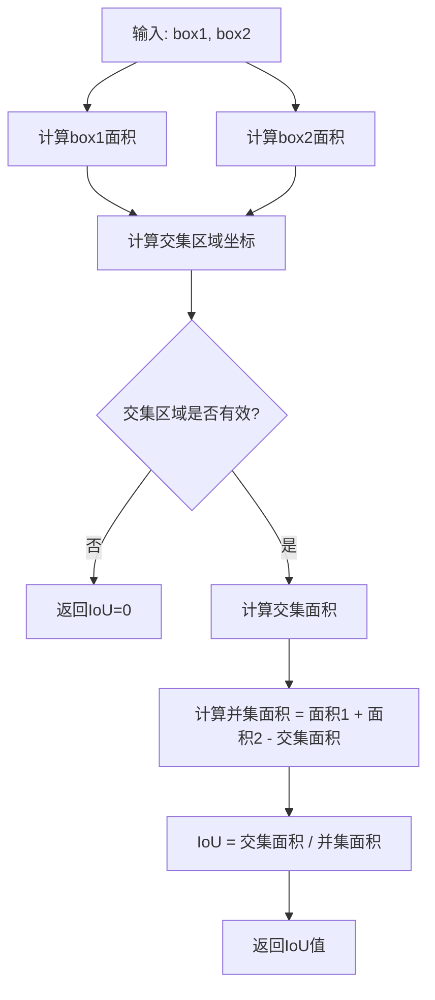
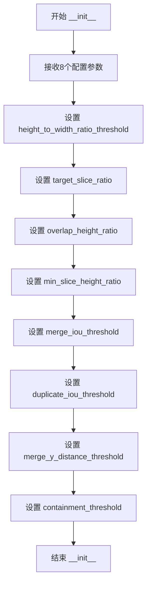
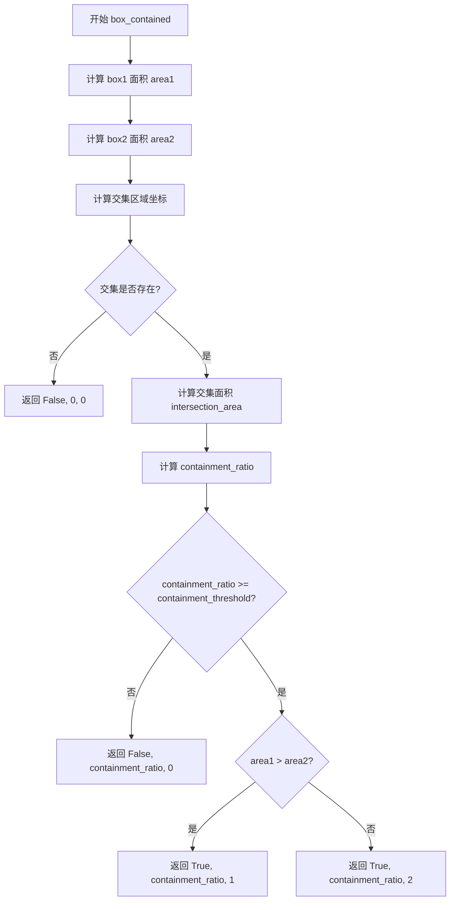
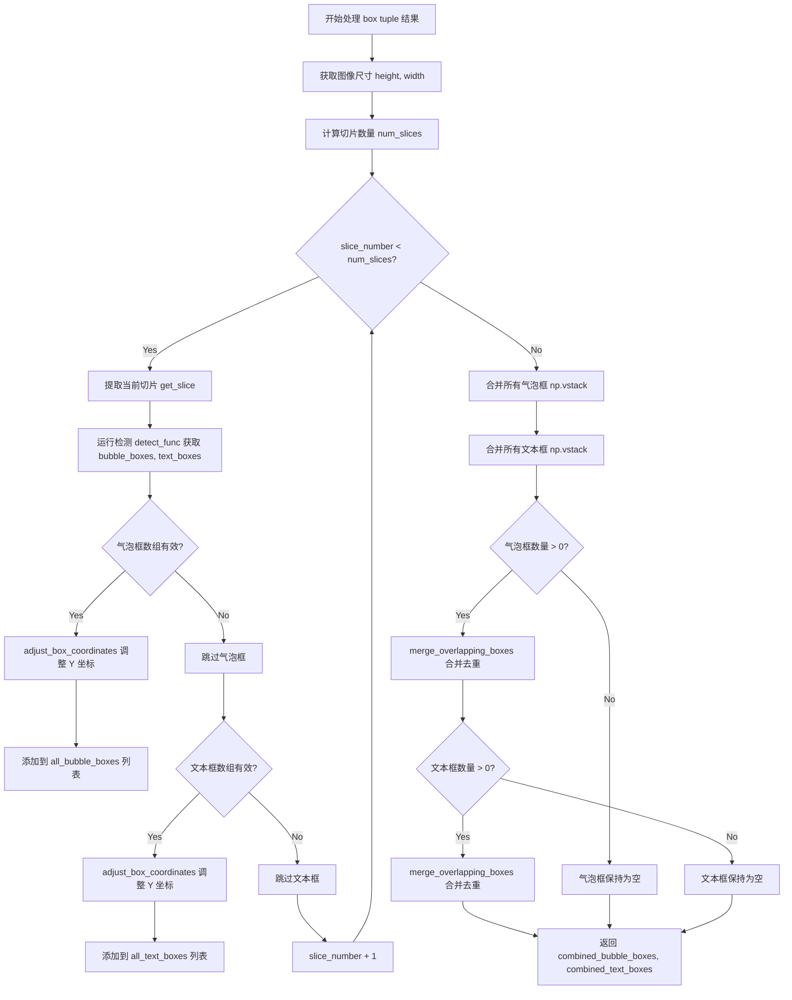

# `comic-translate\modules\detection\utils\slicer.py` 详细设计文档

一个用于处理超高图像（如Webtoons）的切片、对象检测和结果重组的工具类，通过将高宽比超过阈值的图像垂直切分为多个重叠的切片，分别进行检测，然后合并检测结果并去除重复框。

## 整体流程

```mermaid
graph TD
    A[开始] --> B{should_slice(image)}
    B -- 否 --> C[直接调用detect_func(image)]
    B -- 是 --> D[calculate_slice_params计算切片参数]
    D --> E[调用detect_func处理第一个切片]
    E --> F{first_result类型?}
    F -- tuple --> G[_process_box_tuple_results]
    F -- np.ndarray --> H[_process_single_box_array_results]
    G --> I[遍历所有切片]
    H --> I
    I --> J[对每个切片调用detect_func]
    J --> K[adjust_box_coordinates调整坐标]
    K --> L[合并所有检测结果]
    L --> M[merge_overlapping_boxes去重合并]
    M --> N[返回最终结果]
```

## 类结构

```
ImageSlicer (图像切片处理类)
```

## 全局变量及字段


### `math`
    
Python标准数学库，提供ceil等数学函数

类型：`module`
    


### `numpy as np`
    
Python数值计算库，用于数组操作和数值计算

类型：`module`
    


### `Callable, Any`
    
类型提示，用于标注函数类型和任意类型

类型：`typing`
    


### `calculate_iou`
    
从geometry模块导入的IoU计算函数，用于计算两个框的交并比

类型：`function`
    


### `ImageSlicer.height_to_width_ratio_threshold`
    
触发切片的宽高比阈值

类型：`float`
    


### `ImageSlicer.target_slice_ratio`
    
每个切片的期望高宽比

类型：`float`
    


### `ImageSlicer.overlap_height_ratio`
    
垂直切片间的重叠比例

类型：`float`
    


### `ImageSlicer.min_slice_height_ratio`
    
最后切片与目标高度的最小比例

类型：`float`
    


### `ImageSlicer.merge_iou_threshold`
    
合并框的IoU阈值

类型：`float`
    


### `ImageSlicer.duplicate_iou_threshold`
    
识别重复检测的IoU阈值

类型：`float`
    


### `ImageSlicer.merge_y_distance_threshold`
    
合并框的最大垂直距离阈值

类型：`float`
    


### `ImageSlicer.containment_threshold`
    
判断框包含关系的阈值

类型：`float`
    
    

## 全局函数及方法


### `calculate_iou`

此函数用于计算两个边界框（bounding box）之间的交并比（Intersection over Union，IoU），是目标检测中衡量框重叠程度的核心指标。**注意：该函数从外部模块 `.geometry` 导入，具体实现未在当前代码文件中提供。**

参数：

- `box1`：`list[float]`，第一个边界框，格式为 `[x1, y1, x2, y2]`，其中 (x1, y1) 为左上角坐标，(x2, y2) 为右下角坐标
- `box2`：`list[float]`，第二个边界框，格式为 `[x1, y1, x2, y2]`

返回值：`float`，返回两个边界框的交并比（IoU）值，范围为 [0, 1]，0 表示完全不重叠，1 表示完全重合

#### 流程图

由于该函数源码不在当前文件中，无法直接生成其内部流程图。以下是基于其典型实现的逻辑流程：



#### 带注释源码

```python
def calculate_iou(box1: list[float], box2: list[float]) -> float:
    """
    计算两个边界框之间的交并比（IoU）
    
    Args:
        box1: 第一个边界框 [x1, y1, x2, y2]
        box2: 第二个边界框 [x1, y1, x2, y2]
    
    Returns:
        IoU值，范围 [0, 1]
    """
    # 计算各自面积
    area1 = (box1[2] - box1[0]) * (box1[3] - box1[1])
    area2 = (box2[2] - box2[0]) * (box2[3] - box2[1])
    
    # 计算交集区域坐标
    x1 = max(box1[0], box2[0])
    y1 = max(box1[1], box2[1])
    x2 = min(box1[2], box2[2])
    y2 = min(box1[3], box2[3])
    
    # 计算交集面积
    intersection = max(0, x2 - x1) * max(0, y2 - y1)
    
    # 计算并集面积
    union = area1 + area2 - intersection
    
    # 返回IoU
    return intersection / union if union > 0 else 0.0
```

---

### ⚠️ 重要说明

**该函数的实际源码并未包含在提供的代码文件中**。当前 `ImageSlicer` 类通过以下方式导入并使用：

```python
from .geometry import calculate_iou
```

在 `merge_overlapping_boxes` 方法中，该函数被用于：
- 识别重复检测（当 `iou >= self.duplicate_iou_threshold`）
- 作为判断框是否需要合并的条件之一

如需完整文档，建议获取 `geometry.py` 模块的源代码以获取 `calculate_iou` 的精确实现。


### `ImageSlicer.__init__`

初始化图像切片器（ImageSlicer）实例，配置用于处理超长图片（如Webtoons）的切片、检测和结果合并的各项参数。

参数：

- `height_to_width_ratio_threshold`：`float`，触发切片的长宽比阈值，当图片高宽比超过此值时进行切片处理
- `target_slice_ratio`：`float`，每个切片的期望高宽比，用于计算切片高度
- `overlap_height_ratio`：`float`，垂直切片之间的重叠比率，用于保持切片边界处检测的连续性
- `min_slice_height_ratio`：`float`，最后切片高度与目标切片高度的最小比率，用于决定是否与前一切片合并
- `merge_iou_threshold`：`float`，跨切片框合并的IoU阈值，用于判断相邻切片的检测框是否属于同一对象
- `duplicate_iou_threshold`：`float`，重复检测识别的IoU阈值，用于识别和去除重复的检测框
- `merge_y_distance_threshold`：`float`，框之间可合并的最大垂直距离（相对于图像高度的比例）
- `containment_threshold`：`float`，判断一个框是否被另一个框包含的阈值

返回值：`None`，该方法为构造函数，不返回任何值

#### 流程图



#### 带注释源码

```python
def __init__(self, 
             height_to_width_ratio_threshold: float = 3.5,
             target_slice_ratio: float = 3.0,
             overlap_height_ratio: float = 0.2,
             min_slice_height_ratio: float = 0.7,
             merge_iou_threshold: float = 0.2,
             duplicate_iou_threshold: float = 0.5,
             merge_y_distance_threshold: float = 0.1,
             containment_threshold: float = 0.85):  
    """
    Initialize the image slicer with configuration parameters.
    
    Args:
        height_to_width_ratio_threshold: Aspect ratio threshold to trigger slicing
        target_slice_ratio: Desired height/width ratio for each slice
        overlap_height_ratio: Overlap ratio between vertical slices
        min_slice_height_ratio: Minimum ratio of last slice height to target height
                               before merging with previous slice
        merge_iou_threshold: IoU threshold for merging boxes across slices
        duplicate_iou_threshold: IoU threshold for identifying duplicate detections
        merge_y_distance_threshold: Maximum distance (relative to image height) 
                                  between boxes to be considered for merging
        containment_threshold: Threshold for determining if one box is contained within another
    """
    # 存储触发切片的长宽比阈值
    self.height_to_width_ratio_threshold = height_to_width_ratio_threshold
    # 存储期望的切片高宽比
    self.target_slice_ratio = target_slice_ratio
    # 存储切片重叠高度比例
    self.overlap_height_ratio = overlap_height_ratio
    # 存储最小切片高度比例
    self.min_slice_height_ratio = min_slice_height_ratio
    # 存储合并框的IoU阈值
    self.merge_iou_threshold = merge_iou_threshold
    # 存储重复检测的IoU阈值
    self.duplicate_iou_threshold = duplicate_iou_threshold
    # 存储合并时的垂直距离阈值
    self.merge_y_distance_threshold = merge_y_distance_threshold
    # 存储包含关系判断阈值
    self.containment_threshold = containment_threshold
```


### `ImageSlicer.should_slice`

判断给定图像是否需要根据高宽比进行切片处理。

参数：

- `self`：ImageSlicer，类的实例本身
- `image`：`np.ndarray`，输入的图像数组

返回值：`bool`，如果图像的高宽比大于等于阈值（`height_to_width_ratio_threshold`），返回 `True` 表示需要切片；否则返回 `False`。

#### 流程图

```mermaid
flowchart TD
    A[开始 should_slice] --> B[获取图像高度和宽度<br/>height, width = image.shape[:2]]
    B --> C[计算高宽比<br/>aspect_ratio = height / width]
    C --> D{aspect_ratio > height_to_width_ratio_threshold?}
    D -->|是| E[返回 True<br/>需要切片]
    D -->|否| F[返回 False<br/>不需要切片]
    E --> G[结束]
    F --> G
```

#### 带注释源码

```python
def should_slice(self, image: np.ndarray) -> bool:
    """
    判断图像是否需要进行切片处理。
    
    Args:
        image: 输入的图像数组，通常为三维numpy数组 (height, width, channels)
        
    Returns:
        bool: 如果图像的高宽比大于配置的阈值返回True，否则返回False
    """
    # 从图像数组中提取高度和宽度（取前两个维度）
    height, width = image.shape[:2]
    
    # 计算图像的高宽比（纵向长宽比）
    aspect_ratio = height / width
    
    # 将计算结果与初始化时设定的阈值进行比较
    # 当 aspect_ratio > threshold 时返回 True，表示需要进行切片
    # 例如：threshold=3.5 表示高度是宽度的3.5倍以上时才需要切片
    return aspect_ratio > self.height_to_width_ratio_threshold
```


### `ImageSlicer.calculate_slice_params`

该方法用于计算图像切片的参数，根据图像尺寸和配置的目标宽高比、重叠比例等参数，计算切片宽度、切面高度、有效切片高度（减去重叠后）以及需要的切片数量，并确保最后一个切片不会过小。

参数：

- `image`：`np.ndarray`，输入的图像数组，用于获取图像的高度和宽度

返回值：`tuple[int, int, int, int]`，返回一个包含四个整数的元组，依次为 slice_width（切片宽度，等于图像完整宽度）、slice_height（切片总高度，基于目标宽高比计算）、effective_slice_height（有效切片高度，减去重叠区域后的高度）、num_slices（需要切分的切片数量）

#### 流程图

```mermaid
flowchart TD
    A[开始: calculate_slice_params] --> B[获取图像尺寸]
    B --> C[提取 height, width]
    C --> D[设置 slice_width = width]
    D --> E[计算 slice_height = width × target_slice_ratio]
    E --> F[计算 effective_slice_height = slice_height × (1 - overlap_height_ratio)]
    F --> G[计算 num_slices = ceil(height / effective_slice_height)]
    G --> H[计算最后一个切片的起始位置和高度]
    H --> I{last_slice_height_ratio < min_slice_height_ratio<br/>且 num_slices > 1?}
    I -->|是| J[num_slices -= 1]
    I -->|否| K[返回 (slice_width, slice_height, effective_slice_height, num_slices)]
    J --> K
```

#### 带注释源码

```python
def calculate_slice_params(self, image: np.ndarray) -> tuple[int, int, int, int]:
    """
    计算图像切片的参数。
    
    Args:
        image: 输入的图像数组
        
    Returns:
        包含切片参数的元组 (slice_width, slice_height, effective_slice_height, num_slices)
    """
    # 从图像数组中获取高度和宽度
    height, width = image.shape[:2]
    
    # 切片宽度设置为图像的完整宽度
    slice_width = width  # Full width of the image
    
    # 根据目标宽高比计算每个切片的总高度
    slice_height = int(slice_width * self.target_slice_ratio)
    
    # 计算有效切片高度（减去重叠区域后的实际高度）
    effective_slice_height = int(slice_height * (1 - self.overlap_height_ratio))
    
    # 计算覆盖整个图像所需的最少切片数量
    # 使用向上取整确保能完整覆盖
    num_slices = math.ceil(height / effective_slice_height)
    
    # 检查最后一个切片是否会太小
    # 计算最后一个切片的起始位置
    last_slice_start = (num_slices - 1) * effective_slice_height
    
    # 计算最后一个切片的高度
    last_slice_height = height - last_slice_start
    
    # 计算最后一个切片高度与目标切片高度的比值
    last_slice_height_ratio = last_slice_height / slice_height
    
    # 如果最后一个切片太小（小于最小高度比例阈值）且不止一个切片，
    # 则将最后一个切片合并到前一个切片中
    if last_slice_height_ratio < self.min_slice_height_ratio and num_slices > 1:
        num_slices -= 1
        
    # 返回切片参数：宽度、总高度、有效高度、数量
    return slice_width, slice_height, effective_slice_height, num_slices
```


### `ImageSlicer.get_slice`

该方法负责从输入的超高图像（如Webtoon漫画）中提取指定的垂直切片区域，是图像切分处理的核心步骤。通过计算切片的起始和结束Y坐标，确保切片能够正确覆盖图像的各个部分，特别是最后一片会延伸至图像底部。

参数：

- `self`：`ImageSlicer`，ImageSlicer类的实例，隐含参数
- `image`：`np.ndarray`，输入的图像数据，为numpy数组格式
- `slice_number`：`int`，要提取的切片的索引编号，从0开始
- `effective_slice_height`：`int`，有效切片高度（不含重叠区域），用于计算切片起始位置
- `slice_height`：`int`，包含重叠区域的切片总高度，用于确定切片结束位置

返回值：`tuple[np.ndarray, int, int]`，返回一个包含三个元素的元组——(切片图像数组, 起始Y坐标, 结束Y坐标)

#### 流程图

```mermaid
flowchart TD
    A[开始 get_slice] --> B[获取图像尺寸 height, width]
    B --> C[计算起始Y坐标 start_y = slice_number * effective_slice_height]
    C --> D{是否为最后一片?}
    D -->|是| E[end_y = height]
    D -->|否| F[end_y = min(start_y + slice_height, height)]
    E --> G[提取切片 slice_image = image[start_y:end_y, 0:width].copy]
    F --> G
    G --> H[返回 (slice_image, start_y, end_y)]
```

#### 带注释源码

```python
def get_slice(self, image: np.ndarray, slice_number: int, 
             effective_slice_height: int, slice_height: int) -> tuple[np.ndarray, int, int]:
    """
    Extract a slice from the image.
    
    Args:
        image: Input image as numpy array
        slice_number: Index of the slice to extract
        effective_slice_height: Height of slice minus overlap
        slice_height: Total height of a slice including overlap
        
    Returns:
        Tuple of (slice image, start_y, end_y)
    """
    # 获取图像的高度和宽度维度
    height, width = image.shape[:2]
    
    # 根据切片编号计算该切片的起始Y坐标
    # 公式：起始Y = 切片编号 × 有效切片高度（不含重叠）
    start_y = slice_number * effective_slice_height
    
    # 判断当前切片是否为最后一片
    # 通过计算总切片数与当前切片编号比较来确定
    if slice_number == math.ceil(height / effective_slice_height) - 1:
        # 最后一片：确保切片的结束位置为图像底部
        end_y = height
    else:
        # 非最后一片：计算结束位置，考虑图像边界限制
        # 取(起始Y + 切片高度)和图像总高度中较小的值，防止越界
        end_y = min(start_y + slice_height, height)
    
    # 从原始图像中提取切片区域
    # 行索引：start_y 到 end_y（垂直方向）
    # 列索引：0 到 width（整宽度）
    # 使用.copy()确保返回的是独立副本，避免修改原图像数据
    slice_image = image[start_y:end_y, 0:width].copy()
    
    # 返回三元组：切片图像、起始Y坐标、结束Y坐标
    # 起始和结束坐标用于后续将检测框坐标映射回原始图像坐标系
    return slice_image, start_y, end_y
```


### ImageSlicer.adjust_box_coordinates

该方法用于将目标检测框从切片图像的局部坐标系统转换回原始完整图像的全局坐标系统，通过加上切片在原始图像中的起始 Y 坐标偏移量来实现坐标调整。

参数：

- `self`：`ImageSlicer`，调用此方法的 ImageSlicer 实例本身
- `boxes`：`np.ndarray`，边界框数组，格式为 `[x1, y1, x2, y2]`，其中 (x1, y1) 为左上角坐标，(x2, y2) 为右下角坐标
- `start_y`：`int`，切片在原始图像中的起始 Y 坐标偏移量，用于将局部坐标转换为全局坐标

返回值：`np.ndarray`，调整后的边界框数组，坐标已映射回原始图像坐标系

#### 流程图

```mermaid
flowchart TD
    A[开始 adjust_box_coordinates] --> B{boxes 是否为空?}
    B -->|是| C[直接返回 boxes]
    B -->|否| D[复制 boxes 到 adjusted_boxes]
    D --> E[adjusted_boxes[:, 1] += start_y]
    E --> F[adjusted_boxes[:, 3] += start_y]
    F --> G[返回 adjusted_boxes]
```

#### 带注释源码

```python
def adjust_box_coordinates(self, boxes: np.ndarray, start_y: int) -> np.ndarray:
    """
    Adjust box coordinates to match original image.
    
    Args:
        boxes: Array of boxes in format [x1, y1, x2, y2]
        start_y: Y-coordinate offset for this slice
        
    Returns:
        Adjusted boxes
    """
    # 如果输入的边界框数组为空，直接返回空数组
    # 避免后续操作中出现索引错误或不必要的计算
    if boxes.size == 0:
        return boxes
        
    # 创建边界框数组的副本，避免修改原始数据
    # 这一步很重要，因为传入的 boxes 可能被其他代码段共享使用
    adjusted_boxes = boxes.copy()
    
    # 将所有边界框的 y1 坐标（左上角 Y 坐标）加上起始 Y 偏移量
    # 这会将坐标从切片图像的局部坐标系转换到原始图像的全局坐标系
    adjusted_boxes[:, 1] += start_y  # y1
    
    # 将所有边界框的 y2 坐标（右下角 Y 坐标）加上起始 Y 偏移量
    # x1 和 x2 坐标保持不变，因为切片在水平方向上是完整的（slice_width = width）
    adjusted_boxes[:, 3] += start_y  # y2
    
    # 返回调整后的边界框数组
    return adjusted_boxes
```


### `ImageSlicer.box_contained`

判断一个边界框是否被另一个边界框所包含，用于在合并重叠检测结果时识别并移除被完全包含的重复检测框。

参数：

- `box1`：`list[float]`，第一个边界框，格式为 [x1, y1, x2, y2]，其中 (x1, y1) 为左上角坐标，(x2, y2) 为右下角坐标
- `box2`：`list[float]`，第二个边界框，格式为 [x1, y1, x2, y2]

返回值：`tuple[bool, float, int]`，包含三个元素的元组：
- `is_contained`：布尔值，如果一个边界框被另一个包含则返回 True，否则返回 False
- `containment_ratio`：浮点数，交集面积与较小边界框面积的比值
- `which_contains`：整数，1 表示 box1 包含 box2，2 表示 box2 包含 box1，0 表示无包含关系

#### 流程图



#### 带注释源码

```python
def box_contained(self, box1: list[float], box2: list[float]) -> tuple[bool, float, int]:
    """
    检查一个边界框是否被另一个边界框所包含。
    
    参数:
        box1, box2: 边界框，格式为 [x1, y1, x2, y2]
        
    返回值:
        (is_contained, containment_ratio, which_contains) 组成的元组
            is_contained: 如果一个边界框被另一个包含则返回 True
            containment_ratio: 交集面积与较小边界框面积的比值
            which_contains: 1 表示 box1 包含 box2，2 表示 box2 包含 box1，0 表示无包含关系
    """
    # 计算 box1 的面积：宽度 * 高度
    area1 = (box1[2] - box1[0]) * (box1[3] - box1[1])
    # 计算 box2 的面积：宽度 * 高度
    area2 = (box2[2] - box2[0]) * (box2[3] - box2[1])
    
    # 计算两个边界框的交集区域坐标
    # 交集左上角：取两个框左上角坐标的最大值
    intersection_x1 = max(box1[0], box2[0])
    intersection_y1 = max(box1[1], box2[1])
    # 交集右下角：取两个框右下角坐标的最小值
    intersection_x2 = min(box1[2], box2[2])
    intersection_y2 = min(box1[3], box2[3])
    
    # 如果没有交集区域（坐标无效），直接返回 False
    # 条件：交集右下角 <= 交集左上角（宽度或高度为负或零）
    if intersection_x2 <= intersection_x1 or intersection_y2 <= intersection_y1:
        return False, 0, 0
        
    # 计算交集面积
    intersection_area = (intersection_x2 - intersection_x1) * (intersection_y2 - intersection_y1)
    
    # 确定较小的边界框面积，用于计算包含比例
    smaller_area = min(area1, area2)
    # 计算包含比例：交集面积 / 较小边界框面积
    containment_ratio = intersection_area / smaller_area
    
    # 检查包含比例是否超过阈值（默认为 0.85）
    if containment_ratio >= self.containment_threshold:
        # 判断哪个框更大
        if area1 > area2:  # box1 包含 box2
            return True, containment_ratio, 1
        else:  # box2 包含 box1
            return True, containment_ratio, 2
    
    # 不满足包含条件，返回 False
    return False, containment_ratio, 0
```


### `ImageSlicer.merge_overlapping_boxes`

该方法用于合并来自不同切片的可能属于同一对象的检测框，并去除重叠切片中的重复检测结果。

参数：

- `boxes`：`np.ndarray`，格式为 [x1, y1, x2, y2] 的边界框数组
- `class_ids`：`np.ndarray`，可选，对应每个边界框的类别 ID 数组
- `image_height`：`int`，原始图像的高度（用于缩放距离阈值）

返回值：`tuple[np.ndarray, np.ndarray]`，返回合并后的边界框数组和对应的类别 ID 数组

#### 流程图

```mermaid
flowchart TD
    A[开始 merge_overlapping_boxes] --> B{boxes 为空?}
    B -->|是| C[返回空 boxes 和空 class_ids]
    B -->|否| D[将 boxes 和 class_ids 转换为列表]
    D --> E[计算全局 y_distance_threshold = merge_y_distance_threshold * image_height]
    E --> F[初始化外层循环 i = 0]
    F --> G{i < len(box_list) - 1?}
    G -->|否| H[转换为 numpy 数组并返回]
    G -->|是| I[初始化内层循环 j = i + 1]
    I --> J{j < len(box_list)?}
    J -->|否| K[i += 1, 返回 G]
    J --> |是| L{class_ids 不为 None 且 class_list[i] != class_list[j]?}
    L -->|是| M[j += 1, 继续内层循环]
    L -->|否| N[计算 box1 和 box2 的 IoU]
    N --> O[计算框的尺寸和面积]
    O --> P{box_contained 检测包含关系}
    P -->|是-containment| Q{which_contains == 1?}
    Q -->|是| R[删除 box2]
    Q -->|否| S[用 box2 替换 box1, 删除 box2]
    R --> T[继续内层循环]
    S --> T
    P -->|否| U{IoU >= duplicate_iou_threshold?}
    U -->|是| V{box2_area > box1_area?}
    V -->|是| W[用 box2 替换 box1]
    V -->|否| X[保持 box1]
    W --> Y[删除 box2]
    X --> Y
    Y --> T
    U -->|否| Z[计算垂直距离 y_dist]
    Z --> AA[计算局部阈值 local_y_threshold]
    AA --> AB[计算水平重叠 x_overlap_ratio]
    AB --> AC[计算面积比 size_ratio]
    AC --> AD{满足合并条件?}
    AD -->|是| AE[合并 box1 和 box2 为新 box]
    AD -->|否| AF[j += 1, 继续内层循环]
    AE --> AG{合并后面积 <= 3 * max?}
    AG -->|是| AH[用合并框替换 box1, 删除 box2]
    AG -->|否| AF
    AH --> T
```

#### 带注释源码

```python
def merge_overlapping_boxes(self, boxes: np.ndarray, class_ids: np.ndarray = None, 
                           image_height: int = 1) -> tuple[np.ndarray, np.ndarray]:
    """
    Merge boxes that are likely part of the same object across slices and
    remove duplicate detections from overlapping slices.
    
    Args:
        boxes: Array of boxes in format [x1, y1, x2, y2]
        class_ids: Array of class IDs corresponding to each box
        image_height: Height of the original image (for scaling distance threshold)
        
    Returns:
        Tuple of (merged_boxes, merged_class_ids)
    """
    # 空盒检查：直接返回空结果
    if boxes.size == 0:
        return boxes, np.array([]) if class_ids is not None else boxes
        
    # 转换为列表以便于操作（numpy数组在循环中删除元素效率较低）
    box_list = boxes.tolist()
    class_list = class_ids.tolist() if class_ids is not None else [0] * len(box_list)
    
    # 计算全局垂直距离阈值（基于图像高度）
    # 仍会对每对框进行局部限制，避免在极高图像上合并相距很远的框
    y_distance_threshold = self.merge_y_distance_threshold * image_height
    
    # 外层循环：从第一个框开始逐一处理
    i = 0
    while i < len(box_list) - 1:
        # 内层循环：与后面的每个框进行比较
        j = i + 1
        while j < len(box_list):
            # 仅当提供了 class_ids 时才合并同类别的框
            if class_ids is not None and class_list[i] != class_list[j]:
                j += 1
                continue
                
            box1 = box_list[i]
            box2 = box_list[j]
            
            # 计算 IoU 以识别重复或高度重叠的框
            iou = calculate_iou(box1, box2)
            
            # 计算框的尺寸
            box1_width = box1[2] - box1[0]
            box1_height = box1[3] - box1[1]
            box2_width = box2[2] - box2[0]
            box2_height = box2[3] - box2[1]
            box1_area = box1_width * box1_height
            box2_area = box2_width * box2_height
            
            # 检查包含关系（一个框基本在另一个内部）
            is_contained, containment_ratio, which_contains = self.box_contained(box1, box2)
            
            # 情况1：一个框被另一个框包含
            if is_contained:
                # 保留较大的框
                if which_contains == 1:  # box1 包含 box2
                    # 删除 box2
                    box_list.pop(j)
                    if class_ids is not None:
                        class_list.pop(j)
                else:  # box2 包含 box1
                    # 用 box2 替换 box1 并删除 box2
                    box_list[i] = box2
                    box_list.pop(j)
                    if class_ids is not None:
                        class_list.pop(j)
                continue
            
            # 情况2：高 IoU - 可能是同一对象的重复检测
            if iou >= self.duplicate_iou_threshold:
                # 选择较大的框（通常覆盖更好）
                if box2_area > box1_area:
                    box_list[i] = box2  # 保留较大的框
                
                # 删除重复框
                box_list.pop(j)
                if class_ids is not None:
                    class_list.pop(j)
                continue
            
            # 计算框之间的垂直距离
            y_dist = min(abs(box1[1] - box2[3]), abs(box1[3] - box2[1]))

            # 使用局部框高度限制垂直间隙，避免在极高图像上
            # 将相距很远的框合并成一个大区域
            local_y_threshold = min(
                y_distance_threshold,
                max(box1_height, box2_height) * 0.1
            )
            
            # 计算水平重叠
            x_overlap = max(0, min(box1[2], box2[2]) - max(box1[0], box2[0]))
            x_overlap_ratio = x_overlap / min(box1_width, box2_width) if min(box1_width, box2_width) > 0 else 0
            
            # 计算尺寸比以防止合并尺寸差异很大的框
            size_ratio = min(box1_area, box2_area) / max(box1_area, box2_area) if max(box1_area, box2_area) > 0 else 0
            
            # 情况3：框可能是同一对象跨切片的部分
            # 更严格的条件以防止过度合并
            if (y_dist < local_y_threshold and  # 垂直距离近
                x_overlap_ratio > self.merge_iou_threshold and  # 足够水平重叠
                size_ratio > 0.3 and  # 尺寸相似（防止合并尺寸差异大的框）
                # 检查水平方向不太远
                abs(box1[0] - box2[0]) < 0.5 * max(box1_width, box2_width) and
                abs(box1[2] - box2[2]) < 0.5 * max(box1_width, box2_width)):
                
                # 合并框
                merged_box = [
                    min(box1[0], box2[0]),
                    min(box1[1], box2[1]),
                    max(box1[2], box2[2]),
                    max(box1[3], box2[3])
                ]
                
                # 额外检查：不允许合并后的框过大
                merged_width = merged_box[2] - merged_box[0]
                merged_height = merged_box[3] - merged_box[1]
                merged_area = merged_width * merged_height
                
                # 如果合并框比任一原框大 3 倍以上，不合并
                if merged_area > 3 * max(box1_area, box2_area):
                    j += 1
                    continue
                    
                box_list[i] = merged_box
                box_list.pop(j)
                if class_ids is not None:
                    class_list.pop(j)
            else:
                j += 1
        i += 1
        
    # 转换回 numpy 数组
    merged_boxes = np.array(box_list)
    merged_class_ids = np.array(class_list) if class_ids is not None else None
    
    return merged_boxes, merged_class_ids
```


### `ImageSlicer.process_slices_for_detection`

该方法用于处理需要切片的高大图像（如Webtoons），通过将图像分割为多个重叠切片，对每个切片分别运行目标检测，最后合并并去重所有切片的检测结果，同时调整坐标以匹配原始图像。

参数：

- `image`：`np.ndarray`，输入图像作为NumPy数组
- `detect_func`：`Callable`，用于在单个切片上执行目标检测的函数，可以返回不同类型（单数组或二元组）

返回值：`Any`，合并后的检测结果，其类型与 detect_func 的返回值类型匹配

#### 流程图

```mermaid
flowchart TD
    A[开始: process_slices_for_detection] --> B{should_slice(image)?}
    B -->|是| C[计算切片参数: calculate_slice_params]
    B -->|否| D[直接处理整个图像: detect_func(image)]
    D --> Z[返回检测结果]
    C --> E[获取第一个切片]
    E --> F[调用detect_func获取第一个切片结果]
    F --> G{返回类型判断}
    G -->|tuple of 2 arrays| H[调用_process_box_tuple_results]
    G -->|single np.ndarray| I[调用_process_single_box_array_results]
    G -->|其他类型| J[抛出NotImplementedError]
    H --> K[遍历所有切片]
    I --> K
    K --> L[获取切片并运行检测]
    L --> M[调整边界框坐标]
    M --> N[收集所有检测结果]
    N --> O{还有更多切片?}
    O -->|是| K
    O -->|否| P[合并重叠框并去重]
    P --> Q[返回合并后的结果]
    J --> Z
```

#### 带注释源码

```python
def process_slices_for_detection(self, 
                                image: np.ndarray, 
                                detect_func: Callable) -> Any:
    """
    Process an image by slicing it and running detection on each slice.
    Flexible implementation that adapts to the return type of the detect_func.
    
    Args:
        image: Input image as numpy array
        detect_func: Function that performs detection on a slice
                    Can return different types based on detector implementation
        
    Returns:
        Detection results combined from all slices, matching the return type of detect_func
    """
    # Step 1: 判断图像是否需要切片
    # 如果图像的高宽比不超过阈值，则无需切片，直接处理整个图像
    if not self.should_slice(image):
        # If image doesn't need slicing, process it directly
        return detect_func(image)
        
    # Step 2: 计算切片参数
    # 获取切片的宽度、高度、有效高度（减去重叠部分）和切片数量
    slice_width, slice_height, effective_slice_height, num_slices = self.calculate_slice_params(image)
    
    # Step 3: 通过第一个切片探测返回类型
    # 为了支持不同检测器的返回格式，先在第一个切片上运行检测
    # 根据返回类型选择不同的处理策略
    slice_img, start_y, _ = self.get_slice(
        image, 0, effective_slice_height, slice_height
    )
    first_result = detect_func(slice_img)
    
    # Step 4: 根据返回类型分发到不同的处理方法
    # 检查返回类型以确定如何合并结果
    if isinstance(first_result, tuple) and len(first_result) == 2:
        # Case 1: 函数返回两个数组的元组（如bubble_boxes, text_boxes）
        # 将结果作为边界框元组处理
        return self._process_box_tuple_results(image, detect_func, effective_slice_height)
    elif isinstance(first_result, np.ndarray):
        # Case 2: 函数返回单个边界框数组
        # 将结果作为单一数组处理
        return self._process_single_box_array_results(image, detect_func, effective_slice_height)
    else:
        # 不支持的返回类型，抛出异常
        # For any other return type, we'll need to handle it specifically
        # This is just a placeholder for custom implementations
        raise NotImplementedError(
            "Detector return type not supported. Please implement custom slicing logic."
        )
```


### `ImageSlicer._process_box_tuple_results`

处理返回气泡框和文本框元组的检测器，对超长图像（如Webtoons）进行切片检测，收集各切片检测结果，调整坐标后合并重叠框并去除重复检测，最终返回组合后的气泡框和文本框。

参数：

- `image`：`np.ndarray`，输入的超长图像
- `detect_func`：`Callable[[np.ndarray], tuple[np.ndarray, np.ndarray]]`，检测函数，接收切片图像并返回元组(气泡框数组, 文本框数组)
- `effective_slice_height`：`int`，切片有效高度（减去重叠区域后的高度）

返回值：`tuple[np.ndarray, np.ndarray]`，返回组合后的(合并后的气泡框, 合并后的文本框)

#### 流程图



#### 带注释源码

```python
def _process_box_tuple_results(self, 
                              image: np.ndarray,
                              detect_func: Callable[[np.ndarray], tuple[np.ndarray, np.ndarray]],
                              effective_slice_height: int) -> tuple[np.ndarray, np.ndarray]:
    """
    处理返回 (bubble_boxes, text_boxes) 元组的检测器。
    
    该方法对超长图像进行切片，对每个切片运行检测器，
    然后将检测到的边界框调整回原始图像坐标系，
    最后合并重叠的边界框并去除重复检测。
    
    Args:
        image: 输入的超长图像
        detect_func: 检测函数，输入切片图像，返回 (bubble_boxes, text_boxes) 元组
        effective_slice_height: 切片有效高度（减去重叠区域后的高度）
        
    Returns:
        Tuple of (combined_bubble_boxes, combined_text_boxes)
        组合并去重后的气泡框和文本框
    """
    # 获取原始图像的高度和宽度
    height, width = image.shape[:2]
    
    # 计算需要切片的数量，向上取整
    num_slices = math.ceil(height / effective_slice_height)
    
    # 根据目标宽高比计算切片高度
    slice_height = int(width * self.target_slice_ratio)
    
    # 初始化列表用于收集所有切片中的检测结果
    all_bubble_boxes = []
    all_text_boxes = []
    
    # 遍历每个切片
    for slice_number in range(num_slices):
        # 从原始图像中提取当前切片，返回切片图像、起始Y坐标、结束Y坐标
        slice_img, start_y, _ = self.get_slice(
            image, slice_number, effective_slice_height, slice_height
        )
        
        # 对当前切片运行检测，获取气泡框和文本框
        bubble_boxes, text_boxes = detect_func(slice_img)
        
        # 处理气泡框：如果数组有效且非空
        if isinstance(bubble_boxes, np.ndarray) and bubble_boxes.size > 0:
            # 调整边界框坐标：将切片中的相对坐标转换为原始图像中的绝对坐标
            bubble_boxes = self.adjust_box_coordinates(bubble_boxes, start_y)
            # 收集调整后的气泡框
            all_bubble_boxes.append(bubble_boxes)
            
        # 处理文本框：如果数组有效且非空
        if isinstance(text_boxes, np.ndarray) and text_boxes.size > 0:
            # 调整边界框坐标：将切片中的相对坐标转换为原始图像中的绝对坐标
            text_boxes = self.adjust_box_coordinates(text_boxes, start_y)
            # 收集调整后的文本框
            all_text_boxes.append(text_boxes)
    
    # 合并所有切片中检测到的气泡框（垂直堆叠）
    # 如果没有检测到气泡框，返回空数组
    combined_bubble_boxes = np.vstack(all_bubble_boxes) if all_bubble_boxes else np.array([])
    
    # 合并所有切片中检测到的文本框（垂直堆叠）
    # 如果没有检测到文本框，返回空数组
    combined_text_boxes = np.vstack(all_text_boxes) if all_text_boxes else np.array([])
    
    # 对气泡框进行合并去重处理
    # 使用 merge_overlapping_boxes 方法合并跨切片重叠的框，并去除重复检测
    if combined_bubble_boxes.size > 0:
        combined_bubble_boxes, _ = self.merge_overlapping_boxes(
            combined_bubble_boxes, 
            image_height=image.shape[0]  # 传入原始图像高度用于计算距离阈值
        )
        
    # 对文本框进行合并去重处理
    if combined_text_boxes.size > 0:
        combined_text_boxes, _ = self.merge_overlapping_boxes(
            combined_text_boxes,
            image_height=image.shape[0]
        )
        
    # 返回最终合并去重后的气泡框和文本框
    return combined_bubble_boxes, combined_text_boxes
```


### `ImageSlicer._process_single_box_array_results`

处理返回单个边界框数组的检测器的切片图像，将所有切片的检测结果合并并去重。

参数：

- `self`：隐式参数，ImageSlicer 实例本身
- `image`：`np.ndarray`，输入图像
- `detect_func`：`Callable[[np.ndarray], np.ndarray]`，检测函数，接收切片图像并返回边界框数组
- `effective_slice_height`：`int`，切片高度减去重叠区域后的有效高度

返回值：`np.ndarray`，合并后的边界框数组

#### 流程图

```mermaid
flowchart TD
    A[开始] --> B[获取图像尺寸<br/>height, width = image.shape[:2]]
    B --> C[计算切片数量<br/>num_slices = ceil(height / effective_slice_height)]
    C --> D[计算切片高度<br/>slice_height = width * target_slice_ratio]
    D --> E[初始化空列表<br/>all_boxes = []]
    E --> F{遍历切片<br/>slice_number in range(num_slices)}
    
    F -->|是| G[获取切片<br/>get_slice]
    G --> H[运行检测<br/>boxes = detect_func(slice_img)]
    H --> I{检测结果有效<br/>isinstance(boxes, np.ndarray)<br/>and boxes.size > 0}
    
    I -->|是| J[调整边界框坐标<br/>adjust_box_coordinates]
    J --> K[添加到列表<br/>all_boxes.append(boxes)]
    I -->|否| L[跳过]
    K --> F
    
    F -->|否| M{有检测结果<br/>all_boxes非空}
    
    M -->|是| N[垂直合并所有边界框<br/>np.vstack(all_boxes)]
    M -->|否| O[创建空数组<br/>np.array([])]
    
    N --> P{合并后有结果<br/>combined_boxes.size > 0}
    P -->|是| Q[合并重叠框和去重<br/>merge_overlapping_boxes]
    Q --> R[返回合并后的边界框]
    P -->|否| R
    M -->|否| O
    O --> R
    
    L --> F
```

#### 带注释源码

```python
def _process_single_box_array_results(self, 
                                      image: np.ndarray, 
                                      detect_func: Callable[[np.ndarray], np.ndarray],
                                      effective_slice_height: int) -> np.ndarray:
    """
    处理返回单个边界框数组的检测器的切片图像。
    
    Args:
        image: 输入图像
        detect_func: 检测函数
        effective_slice_height: 切片高度减去重叠区域后的有效高度
        
    Returns:
        合并后的边界框数组
    """
    # 获取图像的高度和宽度
    height, width = image.shape[:2]
    
    # 计算需要分割的切片数量
    # 使用向上取整确保覆盖整个图像高度
    num_slices = math.ceil(height / effective_slice_height)
    
    # 计算每个切片的实际高度（包含重叠区域）
    # 基于图像宽度和目标宽高比计算
    slice_height = int(width * self.target_slice_ratio)
    
    # 初始化空列表用于收集所有切片的检测结果
    all_boxes = []
    
    # 遍历每个切片进行检测
    for slice_number in range(num_slices):
        # 从原始图像中提取当前切片
        # 返回: (切片图像, 起始y坐标, 结束y坐标)
        slice_img, start_y, _ = self.get_slice(
            image, slice_number, effective_slice_height, slice_height
        )
        
        # 在当前切片上运行检测函数
        boxes = detect_func(slice_img)
        
        # 检查检测结果是否有效
        # 1. 必须是numpy数组
        # 2. 必须包含检测结果（非空）
        if isinstance(boxes, np.ndarray) and boxes.size > 0:
            # 调整边界框坐标以匹配原始图像坐标系
            # 因为切片是在原图基础上截取的，需要加上start_y偏移量
            boxes = self.adjust_box_coordinates(boxes, start_y)
            
            # 将调整后的边界框添加到结果列表
            all_boxes.append(boxes)
    
    # 合并所有切片的检测结果
    # 使用vstack垂直堆叠所有边界框数组
    # 如果没有检测结果，创建空数组
    combined_boxes = np.vstack(all_boxes) if all_boxes else np.array([])
    
    # 合并重叠的边界框并去除重复检测
    # 仅当有检测结果时才执行合并操作
    if combined_boxes.size > 0:
        # 调用merge_overlapping_boxes进行:
        # 1. 跨切片合并同一物体的多个检测框
        # 2. 去除重复检测
        combined_boxes, _ = self.merge_overlapping_boxes(
            combined_boxes, 
            image_height=image.shape[0]
        )
        
    # 返回最终合并后的边界框数组
    return combined_boxes
```

## 关键组件


### 图像切片与坐标调整机制

用于将超长图像（如Webtoons）分割成多个重叠的垂直切片，处理后再将检测结果的坐标映射回原始图像坐标系。

### 动态切片参数计算

根据图像尺寸和配置参数（目标宽高比、重叠比例等）自动计算切片数量和高度，确保切片适合目标检测模型输入。

### 重叠框合并与去重算法

通过IoU计算、 containment检测和垂直距离判断，合并跨切片的同一目标检测框，并去除重复检测结果。

### 多格式检测结果适配器

支持不同检测器返回格式（单数组boxes或tuple数组），通过运行时类型检查动态选择对应的处理流程。

### 切片坐标映射系统

每个切片独立处理后，通过start_y偏移量将局部坐标转换为全局坐标，确保所有检测框位置相对于原始完整图像。

### 框包含关系判断器

计算两个边界框的交集面积与较小框面积的比率，判断是否存在包含关系，用于过滤冗余或重叠的检测框。

### 懒加载切片提取器

按需从原始图像中提取指定索引的切片，仅在调用时执行numpy数组切片操作，实现内存高效访问。

## 问题及建议


### 已知问题

-   **硬编码的魔法数字**：多处使用硬编码的阈值和系数（如 `size_ratio > 0.3`、`abs(box1[0] - box2[0]) < 0.5 * max(box1_width, box2_width)`、`merged_area > 3 * max(box1_area, box2_area)`、`max(box1_height, box2_height) * 0.1`），这些值难以调整和维护，降低了代码的通用性。
-   **代码重复**：`process_slices_for_detection` 方法通过运行时类型检查来分发到 `_process_box_tuple_results` 和 `_process_single_box_array_results`，这两个方法内部存在大量重复的代码逻辑（计算 num_slices、slice_height，循环处理切片，合并结果），违反了 DRY 原则。
-   **重复计算**：`math.ceil(height / effective_slice_height)` 在 `calculate_slice_params`、`get_slice` 以及两个结果处理方法中被多次重复计算。
-   **类型注解不完整**：`merge_overlapping_boxes` 方法中 `class_ids` 参数默认为 `None`，但返回类型处理存在不一致，当 `class_ids` 为 `None` 时返回 `boxes` 或 `None`，逻辑不清晰。
-   **缺乏输入验证**：没有对输入图像的有效性进行验证（如空图像、非 numpy 数组、异常形状等），可能导致隐藏的运行时错误。
-   **边界条件处理分散**：当 `boxes.size == 0` 或 `num_slices == 0` 时的处理逻辑分散在多个方法中，缺乏统一的边界条件管理。
-   **方法职责不单一**：`process_slices_for_detection` 既负责判断返回类型，又负责分发处理逻辑，违背了单一职责原则。
-   **性能隐患**：`merge_overlapping_boxes` 方法中使用 `list.pop(j)` 在嵌套循环中操作列表，时间复杂度较高；频繁的 `np.vstack` 在处理大量切片时可能存在性能问题。

### 优化建议

-   **参数化魔法数字**：将所有硬编码的阈值提取为类属性或配置参数，参考构造函数中已有的其他阈值的设计模式，提供统一的配置接口。
-   **提取公共逻辑**：将 `_process_box_tuple_results` 和 `_process_single_box_array_results` 中的公共逻辑抽取为私有方法（如 `_run_detection_on_slices`、`_combine_and_merge_results`），减少代码重复。
-   **缓存计算结果**：在 `process_slices_for_detection` 中计算一次 `num_slices` 和 `slice_height`，通过参数传递给后续方法，避免重复计算。
-   **完善类型注解与文档**：明确 `merge_overlapping_boxes` 方法在不同输入情况下的返回类型，确保 `class_ids=None` 时的行为清晰且一致。
-   **添加输入验证**：在关键方法（如 `should_slice`、`calculate_slice_params`、`get_slice`、`process_slices_for_detection`）中添加输入参数验证，确保图像符合预期格式和尺寸。
-   **提取边界条件处理**：创建专门的边界条件处理方法或使用提前返回（early return）模式，统一管理空输入、单切片等边界情况。
-   **重构类型分发逻辑**：考虑使用策略模式或注册机制替代运行时类型检查，将类型处理逻辑从 `process_slices_for_detection` 中分离出来。
-   **优化数据结构**：考虑使用 `np.concatenate` 替代 `np.vstack`（在已知维度时更高效），或预先分配数组空间；评估是否可以使用集合（Set）替代列表进行去重操作以提升性能。

## 其它


### 设计目标与约束

本模块旨在解决超长图像（如Webtoon漫画）的对象检测问题，通过将图像垂直切片为多个重叠的_slice_，在每个_slice_上独立运行检测算法，最后将检测结果合并回原始坐标系。主要设计目标包括：1）自动识别需要切片的图像（基于高宽比阈值）；2）确保切片间有足够的重叠以避免丢失边界对象；3）智能合并跨切片的重复检测结果；4）保持API的通用性以适配不同类型的检测器。约束条件包括：仅支持垂直切片、不支持水平切片、多线程处理需外部实现、依赖numpy和geometry模块的calculate_iou函数。

### 错误处理与异常设计

代码采用了以下错误处理策略：1）空数组检查：在adjust_box_coordinates和merge_overlapping_boxes中检查boxes是否为空；2）返回类型验证：在process_slices_for_detection中检查detect_func返回类型，不支持时抛出NotImplementedError；3）索引安全：get_slice方法中通过math.ceil计算最后一片的索引防止越界；4）除零保护：box_contained和merge_overlapping_boxes中在计算比值前检查分母是否为零。异常设计遵循：运行时异常应尽量避免，通过前置条件检查将错误转化为返回值（如空数组）而非抛出异常，仅在接口不兼容时抛出NotImplementedError。

### 数据流与状态机

数据流主要分为三个阶段：切片阶段、检测阶段、合并阶段。切片阶段由should_slice判断是否需要切片，calculate_slice_params计算切片参数，get_slice提取单个切片；检测阶段由process_slices_for_detection根据返回类型分发到_process_box_tuple_results或_process_single_box_array_results；合并阶段调用merge_overlapping_boxes进行去重和合并。状态机转换如下：初始状态→（should_slice?）→是→切片计算状态→循环检测状态→合并状态→完成；或初始状态→（should_slice?）→否→直接检测状态→完成。状态转换由图像特征和检测结果驱动。

### 外部依赖与接口契约

本模块依赖以下外部组件：1）numpy：用于数组操作和数值计算；2）math：用于ceil和abs等数学函数；3）typing：用于类型注解（Callable、Any）；4）geometry模块的calculate_iou函数：用于计算两个边界框的IoU值。接口契约如下：detect_func必须接受numpy.ndarray类型的图像参数，返回类型必须是np.ndarray或tuple[np.ndarray, np.ndarray]；图像格式必须为HWC或HW（灰度）；boxes格式必须为[x1, y1, x2, y2]；class_ids必须为numpy数组且与boxes一一对应。

### 性能考虑与优化空间

当前实现的主要性能瓶颈：1）双重循环合并算法时间复杂度为O(n²)；2）多次numpy数组拷贝（.copy()、np.array()）；3）每帧重新计算切片参数。优化建议：1）使用空间索引（如R-tree）或网格划分加速重叠检测；2）使用列表推导式批量构造数组减少拷贝；3）缓存切片参数（当同一图像多次处理时）；4）考虑使用numba加速数值计算；5）并行化切片检测（利用multiprocessing）。实测建议：在1000+检测框场景下，当前实现可能出现明显延迟，建议进行性能基准测试。

### 边界条件与限制

以下边界条件已处理：1）空图像：should_slice会返回False，process_slices_for_detection直接处理；2）极小最后切片：通过min_slice_height_ratio合并到前一切片；3）重叠区域无检测：空数组处理；4）全部 containment：containment_threshold确保严格判定。限制条件：1）仅支持垂直切片，水平长图不适用；2）假设检测框格式固定为[x1,y1,x2,y2]；3）merge_y_distance_threshold为相对值（乘以image_height），极端高宽比图像可能需要手动调整；4）不支持批量图像处理。

### 使用示例与典型场景

典型使用场景一（Webtoon气泡检测）：```python
slicer = ImageSlicer(height_to_width_ratio_threshold=3.5, target_slice_ratio=3.0, overlap_height_ratio=0.2)
def detect_bubble_text(slice_img):
    # 调用你的检测模型
    return bubble_boxes, text_boxes
merged_bubbles, merged_text = slicer.process_slices_for_detection(webtoon_image, detect_bubble_text)
```典型使用场景二（通用对象检测）：```python
slicer = ImageSlicer()
def detect_objects(slice_img):
    # 返回单一数组 [N,4]
    return detector.predict(slice_img)
all_boxes = slicer.process_slices_for_detection(tall_image, detect_objects)
```典型使用场景三（参数调优）：当检测到过多重复框时增大duplicate_iou_threshold；当边界对象被截断时增大overlap_height_ratio；当不相关对象被错误合并时增大merge_y_distance_threshold或减小merge_iou_threshold。

### 配置参数参考表

| 参数名 | 默认值 | 建议调整场景 | 风险 |
|--------|--------|--------------|------|
| height_to_width_ratio_threshold | 3.5 | Webtoon为3.0-4.0，普通长图可降低 | 过低导致不必要切片 |
| target_slice_ratio | 3.0 | 目标高宽比，影响切片数量 | 过小增加计算量 |
| overlap_height_ratio | 0.2 | 边界对象丢失时增大 | 过大增加重复检测 |
| min_slice_height_ratio | 0.7 | 最后切片过小时调整 | 过小可能导致切片质量差 |
| merge_iou_threshold | 0.2 | 水平重叠判定阈值 | 过小错误合并，过大漏合并 |
| duplicate_iou_threshold | 0.5 | 重复检测判定阈值 | 过小保留重复，过大误删 |
| merge_y_distance_threshold | 0.1 | 垂直距离阈值（相对高度） | 过高错误合并垂直相邻对象 |
| containment_threshold | 0.85 | 包含关系判定阈值 | 过低误判包含关系 |


    