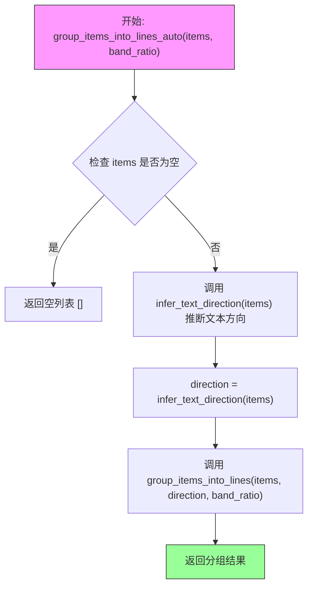
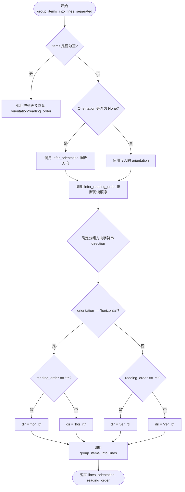
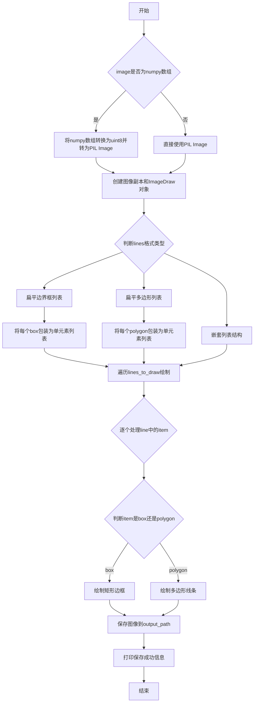

# `comic-translate\modules\detection\utils\text_lines.py` 详细设计文档

该模块实现了一套用于将空间检测项（边界框或多边形）按阅读顺序分组、排序、合并为旋转矩形，并提供可视化功能的工具函数集。

## 整体流程

```mermaid
graph TD
    Start(开始: 输入 Items 列表) --> IsEmpty{列表是否为空?}
    IsEmpty -- 是 --> ReturnEmpty[返回空列表]
    IsEmpty -- 否 --> InferDir[确定方向: infer_text_direction]
    InferDir --> CalcGeo[计算几何中心与 BBox]
    CalcGeo --> AdaptiveBand[计算自适应阈值 (adaptive_band)]
    AdaptiveBand --> UnionFind[Union-Find 算法分组]
    UnionFind --> SortItems[按方向排序组内元素]
    SortItems --> SortLines[按位置排序各行]
    SortLines --> OutputLines[输出: Lines 列表]
    OutputLines --> MergeOrVis{后续操作?}
    MergeOrVis -- Merge --> MergeItems[合并为旋转矩形] --> EndMerge
    MergeOrVis -- Visualize --> DrawLines[绘制可视化图像] --> EndVis
```

## 类结构

```
grouping.py (Functional Module)
├── 辅助函数 (Helpers)
│   ├── _is_box(item)
│   ├── _bbox_from_item(item)
│   └── _center_from_item(item)
├── 核心分组 (Core Grouping)
│   ├── group_items_into_lines(items, direction, band_ratio)
│   ├── group_items_into_lines_auto(items, band_ratio)
│   └── group_items_into_lines_separated(items, orientation, reading_order)
├── 合并工具 (Merging)
│   ├── merge_items_in_line(line)
│   └── merge_line_groups(lines)
└── 可视化 (Visualization)
    └── visualize_text_lines(lines, image, output_path)
```

## 全局变量及字段


### `np`
    
NumPy库，提供高效的数值计算和数组操作功能

类型：`module (numpy)`
    


### `imk`
    
imkit图像处理库，提供最小面积矩形和轮廓点转换等功能

类型：`module (imkit)`
    


### `infer_orientation`
    
从项目列表中推断文本方向（水平或垂直）

类型：`function`
    


### `infer_reading_order`
    
根据方向推断阅读顺序（LTR或RTL）

类型：`function`
    


### `infer_text_direction`
    
自动推断文本方向，返回hor_ltr、hor_rtl、ver_ltr或ver_rtl

类型：`function`
    


    

## 全局函数及方法


### `_is_box`

该函数用于判断给定的数据项是否为边界框（Bounding Box），即一个四元组 `[x1, y1, x2, y2]`，而非多边形（Polygon）表示。

参数：

- `item`：任意类型，输入的检测项，可以是 list、tuple 或 numpy array，表示边界框或多边形点集

返回值：`bool`，如果 item 是边界框返回 `True`，否则返回 `False`

#### 流程图

```mermaid
flowchart TD
    A[开始: _is_box] --> B{item 是 list/tuple/np.ndarray?}
    B -->|否| C[返回 False]
    B -->|是| D{len(item) == 4?}
    D -->|否| C
    D -->|是| E{item[0] 是 list/tuple/np.ndarray?}
    E -->|是| C
    E -->|否| F[返回 True]
```

#### 带注释源码

```python
def _is_box(item):
    """
    判断 item 是否为边界框 (bbox) 而非多边形 (polygon)。
    
    bbox 格式: [x1, y1, x2, y2] - 长度为 4 的平面向量
    polygon 格式: [[x1, y1], [x2, y2], ...] - 元素本身是点列表
    """
    return (
        isinstance(item, (list, tuple, np.ndarray))  # 首先必须是列表、元组或numpy数组
        and len(item) == 4                            # 长度必须为4（x1, y1, x2, y2）
        and not isinstance(item[0], (list, tuple, np.ndarray))  # 第一个元素不能是列表（否则是多边形）
    )
```


### `_bbox_from_item`

该函数将输入的item（边界框或多边形）统一转换为标准的整数边界框格式 `(x1, y1, x2, y2)`。如果item是边界框，则直接提取并转换坐标；如果item是多边形，则计算所有顶点的最小和最大坐标来构建边界框。

参数：

-  `item`：`list/tuple/np.ndarray`，输入的几何对象，可以是边界框 `[x1, y1, x2, y2]` 或多边形点列表 `[[x1, y1], [x2, y2], ...]`。

返回值：`tuple[int, int, int, int]`，返回整数形式的边界框坐标元组 `(x1, y1, x2, y2)`。

#### 流程图

```mermaid
flowchart TD
    A[开始 _bbox_from_item] --> B{_is_box(item)}
    B -->|Yes| C[提取 x1, y1, x2, y2]
    C --> D[转换为整数 int(x1), int(y1), int(x2), int(y2)]
    D --> E[返回 (x1, y1, x2, y2)]
    B -->|No| F[提取多边形所有点]
    F --> G[获取所有 x 坐标 xs = [p[0] for p in item]]
    G --> H[获取所有 y 坐标 ys = [p[1] for p in item]]
    H --> I[计算 min_x, min_y, max_x, max_y]
    I --> J[转换为整数]
    J --> E
    E --> K[结束]
```

#### 带注释源码

```python
def _bbox_from_item(item):
    """
    将边界框或多边形转换为标准边界框格式 (x1, y1, x2, y2)。
    
    参数:
        item: 可以是 [x1, y1, x2, y2] 形式的边界框，
              或者是 [[x1,y1], [x2,y2], ...] 形式的多边形点列表。
    
    返回:
        tuple: (x1, y1, x2, y2) 形式的整数边界框。
    """
    # 如果是边界框形式，直接提取坐标并转换为整数
    if _is_box(item):
        x1, y1, x2, y2 = item
        return (int(x1), int(y1), int(x2), int(y2))
    
    # 否则视为多边形，提取所有点的坐标
    # 提取所有点的 x 坐标
    xs = [p[0] for p in item]
    # 提取所有点的 y 坐标
    ys = [p[1] for p in item]
    
    # 计算多边形的边界框：取 x 和 y 的最小最大值
    return (int(min(xs)), int(min(ys)), int(max(xs)), int(max(ys)))
```


### `_center_from_item`

该函数用于计算给定项目（边界框或多项式）的几何中心点坐标。如果是边界框，则计算两对角点的中点；如果是多项式，则计算所有顶点坐标的算术平均值。

参数：

- `item`：`list` 或 `np.ndarray`，需要计算中心的项目，可以是边界框 `[x1, y1, x2, y2]` 或多项式 `[[x1, y1], [x2, y2], ...]`

返回值：`tuple[float, float]`，返回项目的中心点坐标 `(center_x, center_y)`

#### 流程图

```mermaid
flowchart TD
    A[开始: 输入 item] --> B{_is_box(item)?}
    B -->|True| C[是边界框]
    B -->|False| D[是多项式]
    C --> E[解包: x1, y1, x2, y2 = item]
    E --> F[计算: center_x = (x1 + x2) / 2.0]
    F --> G[计算: center_y = (y1 + y2) / 2.0]
    D --> H[提取所有x坐标: xs = [p[0] for p in item]]
    H --> I[提取所有y坐标: ys = [p[1] for p in item]]
    I --> J[计算: center_x = sum(xs) / len(xs)]
    J --> K[计算: center_y = sum(ys) / len(ys)]
    G --> L[返回: (center_x, center_y)]
    K --> L
```

#### 带注释源码

```python
def _center_from_item(item):
    """
    计算给定项目（边界框或多项式）的几何中心点坐标。
    
    参数:
        item: 边界框 [x1, y1, x2, y2] 或多项式 [[x1, y1], [x2, y2], ...]
    
    返回:
        中心点坐标元组 (center_x, center_y)
    """
    # 判断是否为边界框格式
    if _is_box(item):
        # 边界框：解包四个坐标值
        x1, y1, x2, y2 = item
        # 计算边界框的中心点：取x和y坐标的中点
        return ((x1 + x2) / 2.0, (y1 + y2) / 2.0)
    
    # 多项式格式：提取所有顶点的x坐标和y坐标
    xs = [p[0] for p in item]  # 收集所有x坐标
    ys = [p[1] for p in item]  # 收集所有y坐标
    
    # 计算所有顶点的算术平均值作为中心点
    return (sum(xs) / len(xs), sum(ys) / len(ys))
```


### `group_items_into_lines`

该函数将检测到的文本项（边界框或多边形）按照阅读顺序分组到行中，使用Union-Find算法基于自适应带宽判断项是否在同一行，并根据指定方向对行及行内项目进行排序。

参数：

- `items`：`list`，待分组的项列表，每个项可以是边界框 `[x1, y1, x2, y2]` 或多边形 `[[x, y], ...]`
- `direction`：`str`，阅读方向，默认为 `'hor_ltr'`，可选值包括 `'hor_ltr'`（水平从左到右）、`'hor_rtl'`（水平从右到左）、`'ver_ltr'`（垂直从左到右）、`'ver_rtl'`（垂直从右到左）
- `band_ratio`：`float`，用于计算自适应行带宽的比例因子，默认为 `0.5`

返回值：`list[list]`，分组后的行列表，其中每个元素是一个列表，包含属于同一行的原始项（保留原始格式，非边界框）

#### 流程图

```mermaid
flowchart TD
    A[开始: group_items_into_lines] --> B{items 是否为空?}
    B -->|是| C[返回空列表]
    B -->|否| D[计算所有项的边界框]
    D --> E[计算宽度和高度的中位数]
    E --> F{方向是否包含 'hor'?}
    F -->|是| G[adaptive_band = band_ratio × median_h]
    F -->|否| H[adaptive_band = band_ratio × median_w]
    G --> I[定义 in_same_line 函数]
    H --> I
    I --> J[初始化 Union-Find 父节点数组]
    J --> K[遍历所有项对]
    K --> L{项 i 和 j 在同一行?}
    L -->|是| M[union(i, j)]
    L -->|否| N[继续下一对]
    M --> N
    N --> K
    K --> O[根据根节点构建分组字典]
    O --> P[从字典获取所有行列表]
    P --> Q{direction == 'hor_ltr'?}
    Q -->|是| R[按 min_x_of 升序排序]
    Q -->|否| S{direction == 'hor_rtl'?}
    S -->|是| T[按 min_x_of 降序排序]
    S -->|否| U[按 min_y_of 升序排序]
    R --> V[所有行排序完成?]
    T --> V
    U --> V
    V --> W{方向包含 'hor'?}
    W -->|是| X[按行的 min_y_of 升序排列行]
    W -->|否| Y{direction == 'ver_ltr'?}
    Y -->|是| Z[按行的 min_x_of 升序排列行]
    Y -->|否| AA[按行的 min_x_of 降序排列行]
    X --> AB[返回行列表]
    Z --> AB
    AA --> AB
```

#### 带注释源码

```python
def group_items_into_lines(
    items: list, 
    direction: str = 'hor_ltr', 
    band_ratio: float = 0.5,
) -> list[list]:
    """Group detections (either boxes [x1,y1,x2,y2] or polygons [[x,y],...]) into reading lines.

    Returns list of lines where each line is a list of the original items (not their bboxes).
    """
    # 空列表检查，直接返回空结果
    if not items:
        return []

    # 步骤1: 计算所有项的边界框，用于后续的带宽计算和排序
    # 每个项可能是边界框 [x1,y1,x2,y2] 或多边形 [[x,y],...]
    bboxes = [_bbox_from_item(it) for it in items]

    # 步骤2: 计算边界框宽度和高度的统计信息
    widths = [(x2 - x1) for x1, y1, x2, y2 in bboxes]
    heights = [(y2 - y1) for x1, y1, x2, y2 in bboxes]
    
    # 使用中位数作为代表值，对异常值更具鲁棒性
    median_w = np.median(widths) if widths else 1.0
    median_h = np.median(heights) if heights else 1.0

    # 步骤3: 根据方向计算自适应带宽
    # 水平方向使用高度中位数，垂直方向使用宽度中位数
    if 'hor' in direction:
        adaptive_band = band_ratio * median_h
    else:
        adaptive_band = band_ratio * median_w

    # 定义判断两个项是否在同一行的函数
    def in_same_line(i, j):
        """判断项 i 和 j 是否在同一行"""
        # 获取两项的中心点坐标
        center_i = _center_from_item(items[i])
        center_j = _center_from_item(items[j])
        
        # 水平方向：比较 y 坐标差值
        if 'hor' in direction:
            return abs(center_i[1] - center_j[1]) <= adaptive_band
        # 垂直方向：比较 x 坐标差值
        return abs(center_i[0] - center_j[0]) <= adaptive_band

    # 步骤4: 使用 Union-Find (并查集) 算法进行分组
    # 初始化父节点，每个项自成一个集合
    parent = list(range(len(items)))
    
    def find(u):
        """路径压缩查找根节点"""
        if parent[u] == u:
            return u
        parent[u] = find(parent[u])
        return parent[u]
    
    def union(u, v):
        """合并两个集合"""
        ru, rv = find(u), find(v)
        if ru != rv:
            parent[rv] = ru

    # 遍历所有项的组合，判断是否在同一行
    for i in range(len(items)):
        for j in range(i + 1, len(items)):
            if in_same_line(i, j):
                union(i, j)

    # 步骤5: 根据根节点构建分组字典
    groups = {}
    for idx, it in enumerate(items):
        root = find(idx)
        groups.setdefault(root, []).append(it)

    # 获取所有行（分组）
    lines = list(groups.values())

    # 步骤6: 定义排序辅助函数
    def min_x_of(it):
        """获取项的最小 x 坐标"""
        if _is_box(it):
            return it[0]
        return min(p[0] for p in it)
    
    def min_y_of(it):
        """获取项的最小 y 坐标"""
        if _is_box(it):
            return it[1]
        return min(p[1] for p in it)

    # 步骤7: 根据阅读方向排序每行内的项
    for idx, line in enumerate(lines):
        if direction == 'hor_ltr':
            # 水平从左到右：按 x 坐标升序
            lines[idx] = sorted(line, key=min_x_of)
        elif direction == 'hor_rtl':
            # 水平从右到左：按 x 坐标降序
            lines[idx] = sorted(line, key=lambda it: -min_x_of(it))
        else:  # vertical
            # 垂直方向：按 y 坐标升序
            lines[idx] = sorted(line, key=min_y_of)

    # 步骤8: 根据方向排序所有行（行间排序）
    if 'hor' in direction:
        # 水平方向：按行的最小 y 坐标升序排列（从上到下）
        lines.sort(key=lambda line: min(min_y_of(it) for it in line))
    elif direction == 'ver_ltr':
        # 垂直从左到右：按行的最小 x 坐标升序排列
        lines.sort(key=lambda line: min(min_x_of(it) for it in line))
    else:  # ver_rtl
        # 垂直从右到左：按行的最小 x 坐标降序排列
        lines.sort(key=lambda line: min(min_x_of(it) for it in line), reverse=True)

    return lines
```


### `group_items_into_lines_auto`

自动推断文本方向并将检测到的项目（边界框或多边形）分组到阅读行中的核心函数。该函数内部调用方向推断模块确定文本流向，然后委托给 `group_items_into_lines` 完成实际分组逻辑。

参数：

- `items`：`list`，待分组的元素列表，每个元素可以是边界框 `[x1, y1, x2, y2]` 或多边形 `[[x, y], ...]`
- `band_ratio`：`float`，默认为 0.5，用于计算自适应行间距阈值（相对于中位数高度或宽度的比例）

返回值：`list[list]`，分组后的行列表，每一行是一个包含原始元素的列表

#### 流程图



#### 带注释源码

```python
def group_items_into_lines_auto(items: list, band_ratio: float = 0.5) -> list[list]:
    """Auto infer combined direction and group lines for boxes or polygons.
    
    Args:
        items: List of items to group, each item is either:
            - A bounding box [x1, y1, x2, y2]
            - A polygon [[x1, y1], [x2, y2], ...]
        band_ratio: Float ratio (default 0.5) used to compute adaptive band threshold
                    for determining if two items belong to the same line.
                    The threshold = band_ratio * median_height (for horizontal) or
                    band_ratio * median_width (for vertical).
    
    Returns:
        A list of lines, where each line is a list of the original items
        (preserving their original structure, not converted to bboxes).
        Returns empty list [] if input items is empty.
    """
    # Step 1: Handle empty input - return empty list immediately
    if not items:
        return []
    
    # Step 2: Infer the text direction automatically using orientation module
    # The infer_text_direction function examines the spatial distribution
    # of items and determines whether text flows:
    #   - 'hor_ltr' (horizontal left-to-right)
    #   - 'hor_rtl' (horizontal right-to-left)
    #   - 'ver_ltr' (vertical left-to-right / top-to-bottom)
    #   - 'ver_rtl' (vertical right-to-left / bottom-to-top)
    direction = infer_text_direction(items)
    
    # Step 3: Delegate the actual grouping work to group_items_into_lines
    # which implements the Union-Find algorithm to cluster items into lines
    # based on the computed direction and adaptive band threshold.
    return group_items_into_lines(items, direction=direction, band_ratio=band_ratio)
```


### `group_items_into_lines_separated`

该函数是一个高级封装接口，用于将输入的几何项（边界框或多边形）分组为文本行。它首先检查输入是否为空，然后自动推断文本的排列方向（水平/垂直）和阅读顺序（左到右/右到左），如果参数未提供。最后，它调用核心的 `group_items_into_lines` 算法执行具体的分组计算，并返回分组结果及推断出的排版参数。

参数：

-  `items`：`list`，待分组的项列表。每个项可以是边界框 `[x1, y1, x2, y2]` 或多边形 `[[x, y], ...]`。
-  `orientation`：`str | None`，文本的排列方向。如果为 `None`，则自动推断（'horizontal' 或 'vertical'）。
-  `reading_order`：`str | None`，阅读顺序。如果为 `None`，则根据 `orientation` 自动推断默认值（水平为 'ltr'，垂直为 'rtl'）。
-  `band_ratio`：`float`，用于确定分组阈值的带宽比率，默认为 `0.5`。

返回值：`tuple[list[list], str, str]`，返回一个元组，包含：
1.  `lines`：分组后的行列表，每行是一个包含原始项的列表。
2.  `orientation`：最终确定的排列方向字符串。
3.  `reading_order`：最终确定的阅读顺序字符串。

#### 流程图



#### 带注释源码

```python
def group_items_into_lines_separated(
    items: list,
    orientation: str | None = None,
    reading_order: str | None = None,
    band_ratio: float = 0.5,
) -> tuple[list[list], str, str]:
    """Group items returning (lines, orientation, reading_order).

    Args:
        items: List of items (boxes or polygons).
        orientation: 'horizontal' | 'vertical' (auto if None).
        reading_order: 'ltr' | 'rtl' (auto defaults: hor->ltr, ver->rtl).
        band_ratio: Ratio for adaptive band calculation.

    Returns:
        A tuple containing:
        - lines: List of grouped lines.
        - orientation: The determined orientation.
        - reading_order: The determined reading order.
    """
    # 1. Handle empty input: return defaults to avoid inference errors
    if not items:
        # default orientation/reading_order when empty
        return [], (orientation or 'horizontal'), (reading_order or 'ltr')

    # 2. Choose orientation inference based on item shape if not provided
    if orientation is None:
        orientation = infer_orientation(items)

    # 3. Infer or validate reading order based on orientation
    reading_order = infer_reading_order(orientation, reading_order)

    # 4. Map orientation and reading_order to internal direction string
    if orientation == 'horizontal':
        direction = 'hor_ltr' if reading_order == 'ltr' else 'hor_rtl'
    else:
        direction = 'ver_rtl' if reading_order == 'rtl' else 'ver_ltr'

    # 5. Delegate to the core grouping implementation
    lines = group_items_into_lines(items, direction=direction, band_ratio=band_ratio)
    
    # 6. Return results along with inferred parameters
    return lines, orientation, reading_order
```


### `merge_items_in_line(line)`

该函数将同一行内的多个检测项（边界框或 polygon 形式）合并计算出一个最小面积旋转矩形的四个顶点坐标，返回值为一个包含 4 个坐标点的多边形列表，常用于 OCR 后处理将同一条文本线内的多个字符框合并为一个整体文本行框。

参数：

-  `line`：`list`，待合并的检测项列表，每个元素可以是 `[x1, y1, x2, y2]` 形式的边界框，也可以是 `[[x1,y1], [x2,y2], ...]` 形式的多边形点列表

返回值：`list[list[int]]`，返回合并后的旋转矩形多边形，由 4 个 `[x, y]` 整数坐标点组成，表示最小面积外接矩形

#### 流程图

```mermaid
flowchart TD
    A[开始: merge_items_in_line] --> B{line 是否为空?}
    B -->|是| C[返回空列表 []]
    B -->|否| D[初始化空列表 pts]
    E[遍历 line 中的每个元素 it] --> F{it 是否为边界框?}
    F -->|是| G[解析边界框 x1,y1,x2,y2]
    G --> H[将四个角点加入 pts]
    H --> I{继续遍历?}
    F -->|否| J[直接将多边形顶点加入 pts]
    J --> I
    I -->|还有元素| E
    I -->|遍历完成| K[将 pts 转换为 numpy 数组]
    K --> L{数组长度是否为 0?}
    L -->|是| C
    L -->|否| M[调用 imkit.min_area_rect 计算最小面积矩形]
    M --> N[调用 imk.box_points 获取矩形四个角点]
    N --> O[将角点转换为整数坐标列表]
    O --> P[返回结果]
```

#### 带注释源码

```
def merge_items_in_line(line: list) -> list[list[int]]:
    """Merge items (boxes or polygons) in a line into a single rotated rectangle polygon (4 points).
    
    该函数接收一行中的多个检测项（边界框或 polygon），将它们合并计算出一个
    最小面积的旋转矩形（rotated rectangle），返回该矩形的四个顶点坐标。
    
    Args:
        line: 包含多个检测项的列表，每个检测项可以是:
              - 边界框 [x1, y1, x2, y2]
              - 多边形 [[x1,y1], [x2,y2], ...]
    
    Returns:
        一个包含 4 个 [x, y] 整数坐标点的列表，代表最小面积旋转矩形的四个角
    """
    # 初始化空列表用于收集所有点
    pts = []
    
    # 遍历行中的每个检测项
    for it in line:
        # 判断当前项是否为边界框 (4个数值而非嵌套列表)
        if _is_box(it):
            # It's a bounding box [x1, y1, x2, y2]
            # 解析边界框的四个坐标
            x1, y1, x2, y2 = it
            # 将边界框的四个角点展开添加到点列表中
            # 顺序: 左上 -> 右上 -> 右下 -> 左下
            pts.extend([[x1, y1], [x2, y1], [x2, y2], [x1, y2]])
        else:
            # It's a polygon [[x1,y1], [x2,y2], ...]
            # 多边形形式，直接将顶点展开添加到点列表
            pts.extend(it)
    
    # 将点列表转换为 numpy 数组，使用 float32 类型以满足后续计算要求
    pts_np = np.array(pts, dtype=np.float32)
    
    # 空值检查：如果没有有效的点数据，返回空列表
    if len(pts_np) == 0:
        return []
    
    # 使用最小面积矩形算法计算最佳拟合的旋转矩形
    # imkit.min_area_rect 返回中心点坐标、宽高、旋转角度
    rect = imk.min_area_rect(pts_np)
    
    # 将旋转矩形信息转换为四个角的坐标点
    box = imk.box_points(rect)
    
    # 将坐标转换为整数并格式化为列表形式返回
    # 返回格式: [[x1,y1], [x2,y2], [x3,y3], [x4,y4]]
    return [[int(x), int(y)] for x, y in box]
```


### `merge_line_groups`

该函数接收按阅读顺序分组的线条列表（每条线包含边界框或多边形），遍历每条线并调用 `merge_items_in_line` 将其内的多个检测框或多边形合并为单个旋转矩形多边形，最终返回合并后的多边形列表。

参数：

- `lines`：`list[list]`，输入的线条列表，其中每个内部列表代表一行项目，每个项目可以是边界框 `[x1, y1, x2, y2]` 或多边形 `[[x1,y1], [x2,y2], ...]`

返回值：`list[list[list[int]]]`，返回合并后的旋转边界框多边形列表，每个多边形由4个点组成，每个点为 `[int, int]`

#### 流程图

```mermaid
flowchart TD
    A[开始 merge_line_groups] --> B{lines 是否为空}
    B -->|是| C[返回空列表 []]
    B -->|否| D[初始化空列表 out]
    D --> E[遍历 lines 中的每一条 line]
    E --> F[调用 merge_items_in_line 合并当前行]
    F --> G{merged_item 是否为空}
    G -->|是| E
    G -->|否| H[将 merged_item 添加到 out]
    H --> E
    E --> I[所有行处理完毕]
    I --> J[返回 out]
```

#### 带注释源码

```python
def merge_line_groups(lines: list[list]) -> list[list[list[int]]]:
    """将按方向分组的线条列表（边界框或多边形）转换为每条线一个旋转边界框（多边形）。
    
    该函数是线条合并的入口函数，接收由 group_items_into_lines 系列函数产生的分组结果，
    每一组代表文本的一个阅读行。函数遍历每一行，调用 merge_items_in_line 将该行内的
    所有检测项（可能是边界框或复杂多边形）合并为最小的外接旋转矩形。
    
    Args:
        lines: 线条列表，其中每个元素是一个列表，包含该行中的多个检测项。
               每个检测项可以是 [x1, y1, x2, y2] 格式的边界框，
               或 [[x1,y1], [x2,y2], ...] 格式的多边形。
    
    Returns:
        合并后的多边形列表，每个元素是一个旋转边界框，格式为 
        [[x1,y1], [x2,y2], [x3,y3], [x4,y4]]，其中每个点都是整数坐标。
        如果输入为空或所有行都为空，则返回空列表。
    """
    # 初始化输出列表，用于存储合并后的多边形
    out = []
    
    # 遍历每一行（每行代表一个文本行）
    for line in lines:
        # 调用 merge_items_in_line 将当前行的所有项目合并为一个多边形
        # merge_items_in_line 内部会处理边界框和多边形两种情况
        merged_item = merge_items_in_line(line)
        
        # 如果合并结果非空（返回了有效的4点旋转矩形），则添加到输出列表
        if merged_item:
            out.append(merged_item)
    
    # 返回所有合并后的多边形
    return out
```


### `visualize_text_lines`

该函数用于将分组后的文本行（边界框或多边形形式）绘制在图像上，并使用不同颜色区分各文本行，最终将可视化结果保存为图像文件。

参数：

- `lines`：`list`，包含文本行的列表，支持多种格式：嵌套列表（行包含多个边界框/多边形）、扁平边界框列表 `list[tuple[int, int, int, int]]`、扁平多边形列表 `list[list[list[int]]]`
- `image`：`PIL.Image.Image | np.ndarray`，要绘制文本行的图像，支持 PIL 图像或 numpy 数组
- `output_path`：`str`，输出图像的保存路径
- `line_thickness`：`int`，绘制边界框或多边形线条的粗细程度，默认为 3

返回值：`None`，函数执行完成后无返回值，直接将结果保存至指定路径并打印提示信息

#### 流程图



#### 带注释源码

```
def visualize_text_lines(lines, image, output_path: str, line_thickness: int = 3):
    """
    将分组后的文本行绘制在图像上并保存到文件。
    
    参数:
        lines: 文本行列表，支持以下格式:
            - 嵌套列表: list[list[tuple[int, int, int, int]]] 或 list[list[list[list[int]]]]
            - 扁平边界框: list[tuple[int, int, int, int]]
            - 扁平多边形: list[list[list[int]]]
        image: PIL Image对象或numpy数组
        output_path: 输出图像保存路径
        line_thickness: 边界框线条粗细
    
    返回: None
    """
    from PIL import Image, ImageDraw
    import numpy as np
    
    # ---------- 步骤1: 图像格式标准化 ----------
    # 如果输入是numpy数组，转换为PIL Image以便后续绘制
    if isinstance(image, np.ndarray):
        # 确保数据类型为uint8（0-255范围的整数像素值）
        if image.dtype != np.uint8:
            image = (image * 255).astype(np.uint8)
        # 从numpy数组创建PIL Image
        image = Image.fromarray(image)
    
    # 创建图像副本，避免修改原始图像
    img_copy = image.copy()
    # 创建绘图对象
    draw = ImageDraw.Draw(img_copy)
    
    # ---------- 步骤2: 定义可视化颜色 ----------
    # 预定义10种颜色用于区分不同文本行，循环使用
    colors = [
        (255, 0, 0),    # 红色
        (0, 255, 0),    # 绿色
        (0, 0, 255),    # 蓝色
        (255, 255, 0),  # 黄色
        (255, 0, 255),  # 洋红色
        (0, 255, 255),  # 青色
        (255, 128, 0),  # 橙色
        (128, 0, 255),  # 紫色
        (255, 192, 203), # 粉色
        (128, 128, 128), # 灰色
    ]
    
    # ---------- 步骤3: 类型判断辅助函数 ----------
    # 判断对象是否为边界框 [x1, y1, x2, y2]
    def _is_box(obj):
        if isinstance(obj, (list, tuple, np.ndarray)) and len(obj) == 4 and not (
            isinstance(obj[0], (list, tuple, np.ndarray))
        ):
            try:
                # 尝试将四个元素转换为浮点数，验证是数值类型
                float(obj[0]); float(obj[1]); float(obj[2]); float(obj[3])
                return True
            except Exception:
                return False
        return False

    # 判断对象是否为单点 [x, y]
    def _is_point(obj):
        return (
            isinstance(obj, (list, tuple, np.ndarray))
            and len(obj) == 2
            and all(isinstance(v, (int, float, np.integer, np.floating)) for v in (obj[0], obj[1]))
        )

    # 判断对象是否为多边形（至少3个点）
    def _is_polygon(obj):
        if isinstance(obj, (list, tuple, np.ndarray)) and len(obj) >= 3:
            first = obj[0]
            return _is_point(first)
        return False

    # ---------- 步骤4: 标准化输入格式 ----------
    if lines and all(_is_box(item) for item in lines):
        # 情况A: 扁平边界框列表 -> 每个box作为单独的一行
        lines_to_draw = [[box] for box in lines]
    elif lines and all(_is_polygon(item) for item in lines):
        # 情况B: 扁平多边形列表 -> 每个polygon作为单独的一行
        lines_to_draw = [[poly] for poly in lines]
    else:
        # 情况C: 已经是嵌套列表结构，直接使用
        lines_to_draw = lines

    # ---------- 步骤5: 绘制文本行 ----------
    # 遍历每一行，使用不同颜色区分
    for line_idx, line in enumerate(lines_to_draw):
        # 循环选择颜色
        color = colors[line_idx % len(colors)]
        # 遍历当前行中的每个文本项
        for item in line:
            if _is_box(item):
                # 绘制矩形边界框
                x1, y1, x2, y2 = map(int, item)
                draw.rectangle([x1, y1, x2, y2], outline=color, width=line_thickness)
            elif _is_polygon(item):
                # 绘制多边形轮廓
                pts = [(int(p[0]), int(p[1])) for p in item]
                # 如果多边形未闭合，则闭合它
                if pts[0] != pts[-1]:
                    pts.append(pts[0])
                draw.line(pts, fill=color, width=line_thickness)
            else:
                # 跳过格式错误的项
                continue
    
    # ---------- 步骤6: 保存结果 ----------
    img_copy.save(output_path)
    print(f"Text lines visualization saved to: {output_path}")
```

## 关键组件


### 统一几何处理模块

处理边界框（bbox）和多边形（polygon）两种格式的输入，提供_is_box()、_bbox_from_item()和_center_from_item()三个核心函数，用于判断数据类型、提取边界框和计算中心点，确保后续处理逻辑的统一性。

### 自适应带机制

根据检测框的宽度和高度中位数动态计算分组阈值，支持水平和垂直方向的行分组，通过band_ratio参数控制带的宽度比例，实现自适应的文本行划分逻辑。

### 并查集（Union-Find）行分组算法

使用路径压缩和秩优化实现高效的集合合并，将检测项按阅读方向聚类到同一行，时间复杂度接近O(n²)，通过find()和union()函数实现连通分量判定。

### 自动方向推断模块

group_items_into_lines_auto()函数调用infer_text_direction()自动推断文本方向，结合自适应带机制实现无配置的行分组，适用于未知布局的检测结果。

### 分离式方向推断与分组

group_items_into_lines_separated()分别处理方向（horizontal/vertical）和阅读顺序（ltr/rtl）的推断，返回分组结果、推断的方向和阅读顺序，提供更细粒度的控制能力。

### 旋转矩形合并算法

merge_items_in_line()使用imkit.min_area_rect()计算点集的最小面积矩形，将一行内的多个检测框或多边形合并为单个旋转边界框，支持4点坐标输出。

### 多行分组合并管道

merge_line_groups()将分组后的行列表转换为旋转边界框列表，提供从检测结果到最终合并结果的完整处理流程。

### 文本行可视化工具

visualize_text_lines()支持多种输入格式（边界框/多边形/扁平列表），使用PIL绘制彩色线条，支持自动格式检测和颜色轮转分配，便于调试和结果展示。

### 方向排序与对齐

根据阅读方向（hor_ltr/hor_rtl/ver_ltr/ver_rtl）实现行内和行间的多级排序，使用min_x_of()和min_y_of()提取关键坐标，确保输出符合预期的阅读顺序。


## 问题及建议


### 已知问题

-   **重复代码**：`_is_box()` 函数在模块级别和 `visualize_text_lines()` 函数内部重复定义，导致维护困难；`_is_point()` 和 `_is_polygon()` 仅在可视化函数内部定义，其他模块无法复用
-   **算法效率低下**：`group_items_into_lines()` 中使用 O(n²) 的双重循环进行行分组，对于大量 items 性能较差，缺少空间索引（如 KD-Tree）优化
-   **类型转换风险**：多处使用 `int()` 强制转换坐标，可能导致精度丢失；`_bbox_from_item()` 中对 polygon 转换时直接取整而未考虑负数情况
-   **边界条件处理不足**：空列表输入虽然返回空结果，但未对单个 item、非法输入（如 None、维度错误的数组）进行校验，可能导致运行时错误
-   **Union-Find 实现冗余**：在每次调用时重新定义 `find` 和 `union` 嵌套函数，增加了函数调用开销且代码可读性差
-   **魔数与硬编码**：颜色数组、默认值 `band_ratio=0.5` 等硬编码在代码中，缺乏配置机制
-   **外部依赖耦合**：直接依赖 `imkit.min_area_rect` 和 `imk.box_points`，若接口变化会导致整体失效，缺少抽象层或错误处理

### 优化建议

-   将重复的 `_is_box()`、`_is_point()`、`_is_polygon()` 提取为模块级工具函数或工具类
-   对 `group_items_into_lines()` 引入空间分区或排序优化，将双重循环改为 O(n log n) 复杂度
-   添加输入类型校验和异常处理，对非法输入返回明确错误或降级处理
-   将 Union-Find 实现为独立类或使用 `scipy` 等库的现成实现
-   将颜色、阈值等配置抽取为模块级常量或配置文件
-   对外部依赖 `imkit` 添加 try-except 包装，提供 fallback 方案或明确错误信息
-   增强类型注解，考虑使用 `dataclass` 或 `NamedTuple` 封装 bbox/polygon 等数据结构

## 其它


### 设计目标与约束

本模块的设计目标是为OCR或文档分析任务提供统一的几何元素（边界框或多边形）分组功能，能够根据不同的阅读方向（水平从左到右、水平从右到左、垂直从左到右、垂直从右到左）将离散的检测结果组织为符合阅读顺序的文本行，并支持将同一行内的多个元素合并为最小面积矩形。核心约束包括：输入items必须为4元素坐标数组（bbox形式）或至少3个点的坐标列表（polygon形式），不支持混合形式；direction参数仅接受预定义的字符串字面值；自适应 band's width/height 计算依赖中位数，对极端异常值敏感。

### 错误处理与异常设计

代码采用了防御式编程风格，但错误处理机制较为薄弱。主要异常来源包括：空输入列表（返回空列表而非抛异常）、无效的direction参数（仅通过字符串包含判断，未校验合法性）、多边形点数不足导致`min_area_rect`返回异常结果、图像类型不符合PIL或numpy.ndarray时的转换失败。改进建议：针对`group_items_into_lines`的direction参数添加白名单校验并对非法值抛出`ValueError`；在`merge_items_in_line`中检测`pts_np`长度少于3点的情况并返回空列表或抛出明确异常；在`visualize_text_lines`中对非预期输入类型捕获`TypeError`并给出友好提示。

### 数据流与状态机

模块的数据流遵循以下路径：外部调用者提供待分组的items列表 → `group_items_into_lines_auto`或`group_items_into_lines_separated`进行入口处理 → 根据需要调用`infer_orientation`、`infer_reading_order`、`infer_text_direction`推理方向 → 核心函数`group_items_into_lines`执行Union-Find分组 → 对每组内元素按方向排序 → 返回lines列表 → 可选的`merge_items_in_line`将单行内items合并为旋转矩形 → `merge_line_groups`批量处理多行 → `visualize_text_lines`生成可视化结果。状态机隐含在direction参数中：hor_ltr、hor_rtl、ver_ltr、ver_rtl四种状态决定分组逻辑和排序方向。

### 外部依赖与接口契约

模块依赖以下外部包：numpy（数值计算、中位数、数组操作）、imkit（`imk.min_area_rect`和`imk.box_points`，需确保安装并可用）、PIL/Pillow（图像绘制）。所有函数均采用Python原生类型注解，未使用复杂泛型。核心接口契约：`group_items_into_lines`接受items列表、direction字符串、band_ratio浮点数，返回list[list]；`merge_items_in_line`接受单行items列表，返回旋转矩形多边形list[list[int]]；`visualize_text_lines`接受lines、image、output_path、line_thickness，无返回值。

### 性能考虑

当前实现的时间复杂度为O(n²)因为使用了双重循环进行两两比较（Union-Find构建阶段），空间复杂度为O(n)用于存储bboxes和parent数组。性能优化方向：可采用基于排序的线性扫描算法替代O(n²)比较；`bboxes`、`widths`、`heights`的列表推导式可合并以减少遍历次数；多次调用`min_x_of`/`min_y_of`会造成重复计算，建议在排序前预处理各item的极值。

### 可测试性

代码的可测试性中等。优点：纯函数居多（除`visualize_text_lines`的I/O副作用），输入输出确定；辅助函数`_is_box`、`_bbox_from_item`、`_center_from_item`可独立单元测试。不足：依赖外部不可控的`imkit`模块和图像I/O，建议通过依赖注入或mock的方式隔离；缺少单元测试文件和测试用例覆盖。

### 配置与参数说明

关键配置参数包括：`band_ratio`（默认0.5）控制自适应 band's width/height，值越大则分组越宽松；`direction`控制阅读方向，需与`infer_orientation`/`infer_reading_order`的结果匹配；`line_thickness`（默认3）仅影响可视化输出。参数校验规则：band_ratio建议限制在0.1~2.0之间；direction仅接受包含'hot'或'ver'的字符串。

### 使用示例

```python
# 示例1：自动推断方向并分组
items = [[10, 10, 50, 30], [60, 12, 100, 28], [15, 50, 80, 70]]
lines = group_items_into_lines_auto(items)

# 示例2：指定方向并合并
lines, orient, order = group_items_into_lines_separated(
    items, orientation='horizontal', reading_order='ltr'
)
merged = merge_line_groups(lines)

# 示例3：可视化结果
visualize_text_lines(lines, image_array, 'output.png')
```


    