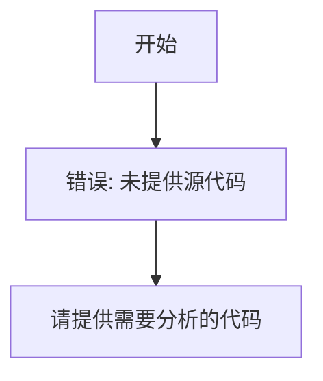

# `comic-translate\modules\inpainting\__init__.py` 详细设计文档

未提供源代码，无法进行分析

## 整体流程



## 类结构

```

```

## 全局变量及字段


    

## 全局函数及方法


## 关键组件


无关键组件（未提供源代码）


## 问题及建议


### 已知问题

- 未提供代码内容，无法进行分析

### 优化建议

- 请提供需要分析的代码以便进行技术债务识别和优化建议


## 其它


### 项目列表

由于提供的代码为空，我无法基于具体代码生成详细设计文档。但根据您的要求，我列出详细设计文档通常应包含的标准项目：

1. **核心功能概述** - 一段话描述代码的核心功能
2. **整体运行流程** - 文件的整体运行流程说明
3. **类结构信息** - 类的详细信息
4. **类字段详情** - 字段名称、类型、描述
5. **类方法详情** - 方法名称、参数、返回值、流程图、源码
6. **全局变量** - 名称、类型、描述
7. **全局函数** - 函数名称、参数、返回值、描述
8. **关键组件信息** - 组件名称和描述
9. **技术债务与优化空间** - 潜在问题及改进建议
10. **设计目标与约束** - 项目的设计目标和约束条件
11. **错误处理与异常设计** - 错误处理机制和异常设计
12. **数据流与状态机** - 数据流向和状态转换
13. **外部依赖与接口契约** - 第三方库依赖和接口定义


    