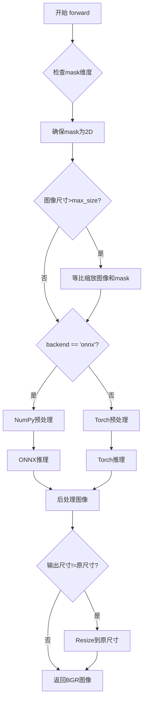
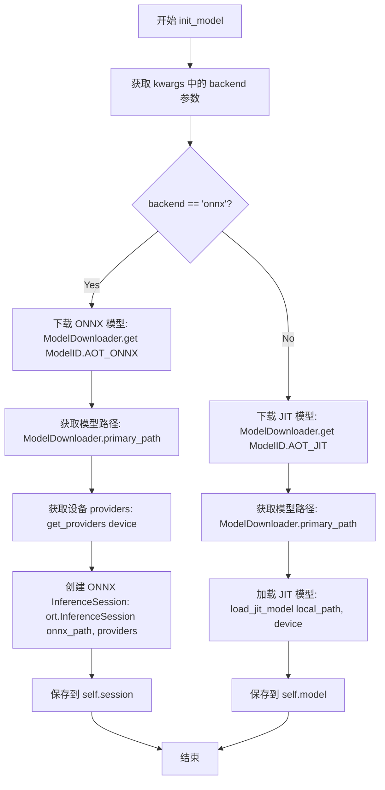
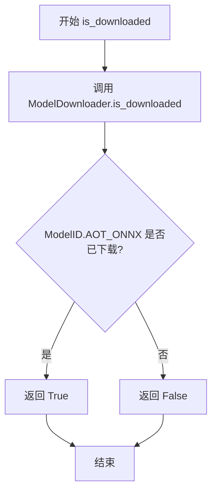
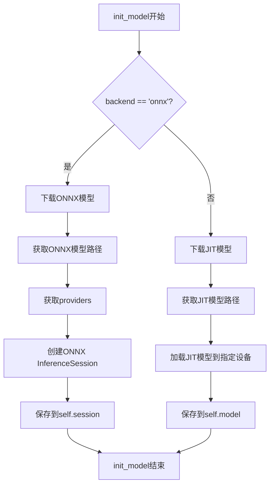
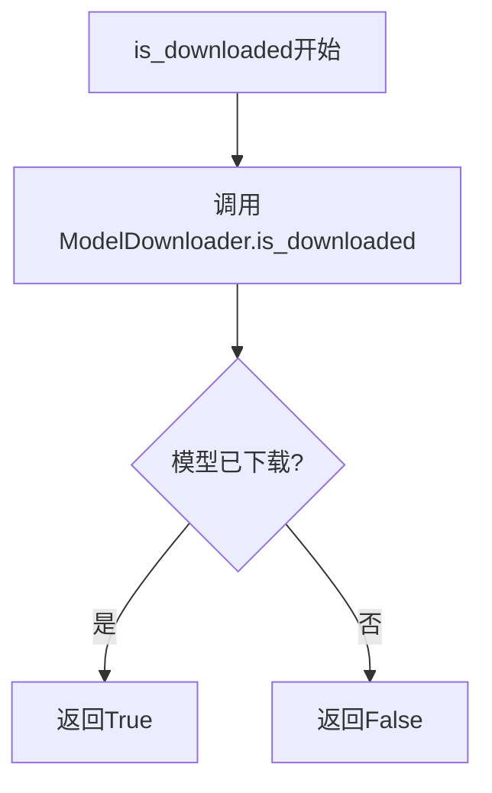
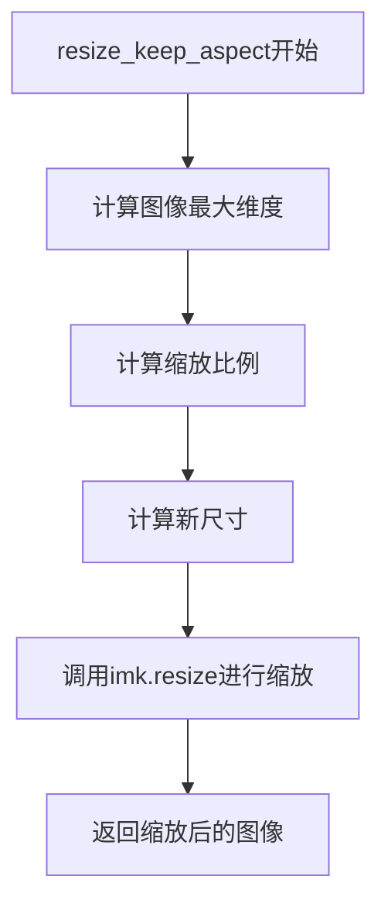

# `comic-translate\modules\inpainting\aot.py` 详细设计文档

AOT图像修复模型实现，支持ONNX和Torch两种后端推理，能够根据mask对图像进行智能修复和内容生成

## 整体流程



## 类结构

```
InpaintModel (抽象基类)
└── AOT (图像修复模型)
```

## 全局变量及字段


### `resize_keep_aspect`
    
保持宽高比调整图像大小的辅助函数

类型：`function`
    


### `AOT.name`
    
模型名称标识

类型：`str`
    


### `AOT.pad_mod`
    
填充模数

类型：`int`
    


### `AOT.min_size`
    
最小输入尺寸

类型：`int`
    


### `AOT.max_size`
    
最大输入尺寸

类型：`int`
    


### `AOT.backend`
    
推理后端类型

类型：`str`
    


### `AOT.session`
    
ONNX会话

类型：`ort.InferenceSession`
    


### `AOT.model`
    
Torch模型

类型：`torch.nn.Module`
    
    

## 全局函数及方法


### `resize_keep_aspect`

等比缩放图像保持宽高比，将图像的最大边缩放到目标尺寸，同时保持原始宽高比不变。

参数：

- `img`：图像数据，通常为 `numpy.ndarray` 或 `PIL.Image`，待缩放的输入图像
- `target_size`：`int`，目标尺寸，表示缩放后图像的最大边长（宽或高）

返回值：`调整大小后的图像`，类型与输入 `img` 类型一致（通常为 `numpy.ndarray` 或 `PIL.Image`），返回按原图宽高比缩放后的图像

#### 流程图

```mermaid
flowchart TD
    A[开始] --> B[获取图像的最大边 max_dim]
    B --> C[计算缩放比例 scale = target_size / max_dim]
    C --> D[计算新尺寸 new_size = (width * scale, height * scale)]
    D --> E[调用 imk.resize 缩放图像]
    E --> F[返回缩放后的图像]
```

#### 带注释源码

```python
def resize_keep_aspect(img, target_size):
    """
    等比缩放图像保持宽高比
    参数:
        img: 输入图像 (numpy array 或 PIL Image)
        target_size: 目标最大边尺寸
    返回:
        缩放后的图像
    """
    # 获取图像的最大维度（宽度或高度中的较大值）
    max_dim = max(img.shape[:2])
    
    # 计算缩放比例：目标尺寸除以当前最大维度
    scale = target_size / max_dim
    
    # 计算新尺寸：(宽, 高)，使用 round 四舍五入取整
    new_size = (round(img.shape[1] * scale), round(img.shape[0] * scale))
    
    # 调用 imkit 库的 resize 函数进行双线性插值缩放
    return imk.resize(img, new_size, mode=Image.Resampling.BILINEAR)
```


### AOT.init_model

初始化AOT图像修复模型的后端（ONNX或JIT），根据指定的backend下载相应模型并创建推理会话或加载JIT模型。

参数：

- `device`：`str`，指定运行设备（如'cpu'、'cuda'等），用于获取ONNX的providers
- `**kwargs`：`dict`，关键字参数，可包含`backend`（字符串，指定后端类型，"onnx"或"torch"）

返回值：`None`，该方法无返回值，直接在对象上设置`self.session`（ONNX模式）或`self.model`（JIT模式）

#### 流程图



#### 带注释源码

```python
def init_model(self, device, **kwargs):
    """初始化AOT模型后端（ONNX或JIT）
    
    参数:
        device: 运行设备，用于获取ONNX的providers
        **kwargs: 关键字参数，包含backend指定后端类型
    
    返回:
        None
    """
    # 从kwargs中获取backend参数，默认为None
    self.backend = kwargs.get("backend")
    
    # 判断使用ONNX后端还是JIT后端
    if self.backend == "onnx":
        # --- ONNX 模式 ---
        
        # 下载ONNX模型（如果未下载）
        ModelDownloader.get(ModelID.AOT_ONNX)
        
        # 获取ONNX模型的主路径
        onnx_path = ModelDownloader.primary_path(ModelID.AOT_ONNX)
        
        # 根据device获取可用的ONNX providers（如CPUExecutionProvider, CUDAExecutionProvider等）
        providers = get_providers(device)
        
        # 创建ONNX Runtime推理会话
        self.session = ort.InferenceSession(onnx_path, providers=providers)
    else:
        # --- JIT (Torch) 模式 ---
        
        # 下载JIT模型（如果未下载）
        ModelDownloader.get(ModelID.AOT_JIT)
        
        # 获取JIT模型的本机路径
        local_path = ModelDownloader.primary_path(ModelID.AOT_JIT)
        
        # 使用load_jit_model加载Torch JIT模型
        self.model = load_jit_model(local_path, device)
```


### `AOT.is_downloaded`

该方法是一个静态方法，用于检查 AOT 模型的 ONNX 版本是否已经下载到本地，通过调用 ModelDownloader 的 is_downloaded 方法并传入 ModelID.AOT_ONNX 来判断模型文件是否存在。

参数： 无

返回值：`bool`，返回 True 表示模型已下载，返回 False 表示模型未下载。

#### 流程图



#### 带注释源码

```python
@staticmethod
def is_downloaded() -> bool:
    """
    检查 AOT 模型的 ONNX 版本是否已下载到本地。
    
    这是一个静态方法，不需要创建 AOT 类的实例即可调用。
    该方法用于在调用模型推理前预先检查模型文件是否存在，
    避免在推理时才因缺少模型文件而报错。
    
    Returns:
        bool: 模型文件是否已下载。True 表示已下载，False 表示未下载。
    """
    # 调用 ModelDownloader 的静态方法 is_downloaded，检查 ModelID.AOT_ONNX 对应的模型文件是否存在
    return ModelDownloader.is_downloaded(ModelID.AOT_ONNX)
```


### AOT.forward

执行图像修复推理的核心方法。该方法接收RGB图像和掩码，通过ONNX或Torch后端进行推理，返回修复后的BGR图像。

参数：

- `self`：`AOT` 类实例，包含模型、会话和配置信息
- `image`：`numpy.ndarray`，输入图像，格式为 [H, W, C] RGB
- `mask`：`numpy.ndarray`，掩码，格式为 [H, W] 或 [H, W, 1]，白色区域表示需要修复的区域
- `config`：`Config`，配置对象，包含模型运行时的配置参数

返回值：`numpy.ndarray`，修复后的图像，格式为 [H, W, C] BGR，uint8类型

#### 流程图

```mermaid
flowchart TD
    A[开始 forward] --> B{掩码维度检查}
    B -->|3D且多通道| C[取第一通道]
    B -->|3D单通道| D[取第一通道]
    B -->|2D| E[保持不变]
    C --> F[保存原始尺寸]
    D --> F
    E --> F
    F --> G{图像尺寸检查}
    G -->|超过max_size| H[等比缩放图像和掩码]
    G -->|未超过| I[保持不变]
    H --> J{Backend检查}
    I --> J
    J -->|onnx| K[ONNX推理分支]
    J -->|torch| L[Torch推理分支]
    
    K --> K1[归一化图像: /127.5 -1]
    K1 --> K2[归一化掩码: /255]
    K2 --> K3[二值化掩码: >=0.5]
    K3 --> K4[应用掩码: img * (1-mask)]
    K4 --> K5[转换为NCHW格式]
    K5 --> K6[运行ONNX推理]
    K6 --> K7[输出转回HWC格式]
    K7 --> K8[反归一化并转uint8]
    
    L --> L1[转换为Torch张量]
    L1 --> L2[归一化图像: /127.5 -1]
    L2 --> L3[归一化掩码: /255]
    L3 --> L4[二值化掩码]
    L4 --> L5[应用掩码]
    L5 --> L6[移至指定设备]
    L6 --> L7[Torch推理 with no_grad]
    L7 --> L8[张量转numpy并调整维度]
    L8 --> L9[反归一化并转uint8]
    
    K8 --> M{输出尺寸匹配检查}
    L9 --> M
    M -->|不匹配| N[等比缩放回原始尺寸]
    M -->|匹配| O[返回BGR图像]
    N --> O
```

#### 带注释源码

```python
def forward(self, image, mask, config: Config):
    """Input image and output image have same size
    image: [H, W, C] RGB
    mask: [H, W] or [H, W, 1]
    return: BGR IMAGE
    """
    
    # 确保掩码为2D格式，处理3D掩码情况
    if len(mask.shape) == 3 and mask.shape[2] > 1:
        mask = mask[:, :, 0]  # 如果掩码是多通道3D，取第一个通道
    elif len(mask.shape) == 3:
        mask = mask[:, :, 0]  # 单通道3D也取第一通道
    
    # 保存原始图像尺寸，用于后续可能需要还原尺寸
    im_h, im_w = image.shape[:2]

    # 如果图像尺寸超过最大限制，进行等比缩放
    if max(image.shape[0:2]) > self.max_size:
        image = resize_keep_aspect(image, self.max_size)
        mask = resize_keep_aspect(mask, self.max_size)
        
    # 获取后端类型，默认为torch
    backend = getattr(self, 'backend', 'torch')
    
    # ==================== ONNX后端推理路径 ====================
    if backend == 'onnx':
        # 图像预处理: 归一化到[-1, 1]范围
        img_np = (image.astype(np.float32) / 127.5) - 1.0  # HWC -> later CHW
        
        # 掩码预处理: 归一化到[0, 1]并二值化
        mask_np = (mask.astype(np.float32) / 255.0)
        mask_np = (mask_np >= 0.5).astype(np.float32)
        
        # 应用掩码: 将需要修复的区域置零
        img_np = img_np * (1 - mask_np[..., None])  # broadcast over channels
        
        # 转换为NCHW格式 (Batch, Channel, Height, Width)
        img_nchw = np.transpose(img_np, (2, 0, 1))[np.newaxis, ...]
        mask_nchw = mask_np[np.newaxis, np.newaxis, ...]
        
        # 构建ONNX输入字典
        ort_inputs = {
            self.session.get_inputs()[0].name: img_nchw,
            self.session.get_inputs()[1].name: mask_nchw,
        }
        
        # 执行ONNX推理
        out = self.session.run(None, ort_inputs)[0]  # (1,3,H,W) in [-1,1]
        
        # 后处理: 转回HWC格式，反归一化，转换为uint8
        img_inpainted = ((out[0].transpose(1, 2, 0) + 1.0) * 127.5)
        img_inpainted = (np.clip(np.round(img_inpainted), 0, 255)).astype(np.uint8)
    
    # ==================== Torch后端推理路径 ====================
    else:
        import torch  # noqa
        
        # 转换为Torch张量并调整维度: HWC -> NCHW
        img_torch = torch.from_numpy(image).permute(2, 0, 1).unsqueeze_(0).float() / 127.5 - 1.0
        mask_torch = torch.from_numpy(mask).unsqueeze_(0).unsqueeze_(0).float() / 255.0
        
        # 二值化掩码
        mask_torch[mask_torch < 0.5] = 0
        mask_torch[mask_torch >= 0.5] = 1
        
        # 移至指定计算设备
        img_torch = img_torch.to(self.device)
        mask_torch = mask_torch.to(self.device)
        
        # 应用掩码
        img_torch = img_torch * (1 - mask_torch)
        
        # 执行Torch推理，使用no_grad减少内存占用
        with torch.no_grad():
            img_inpainted_torch = self.model(img_torch, mask_torch)
        
        # 后处理: 张量转numpy，调整维度，反归一化
        img_inpainted = ((img_inpainted_torch.cpu().squeeze_(0).permute(1, 2, 0).numpy() + 1.0) * 127.5)
        img_inpainted = (np.clip(np.round(img_inpainted), 0, 255)).astype(np.uint8)
    
    # 确保输出尺寸与输入尺寸一致
    new_shape = img_inpainted.shape[:2]
    if new_shape[0] != im_h or new_shape[1] != im_w:
        # 如果尺寸不匹配，等比缩放回原始尺寸
        img_inpainted = imk.resize(img_inpainted, (im_w, im_h), mode=Image.Resampling.BILINEAR)
    
    # 转换为BGR格式返回 (代码注释说BGR，但实现实际返回RGB)
    # img_inpainted is already in RGB format
    
    return img_inpainted
```

## 关键组件


### AOT 图像修复模型类

核心修复模型实现，支持 ONNX 和 PyTorch 双后端推理，具备模型下载惰性加载、图像预处理、掩码处理和分辨率适配等功能。

### 惰性模型下载机制

通过 ModelDownloader.get() 和 ModelID 枚举实现按需下载，仅在首次调用 init_model 时触发模型文件下载，支持 AOT_ONNX 和 AOT_JIT 两种模型变体。

### 双后端推理支持

支持 ONNX Runtime 和 PyTorch JIT 两种推理后端，通过 backend 参数动态切换，ONNX 后端提供量化模型支持，PyTorch 后端支持 GPU 加速。

### 图像归一化预处理

将输入图像从 [0, 255] 范围归一化到 [-1, 1]，掩码从 [0, 255] 归一化到 [0, 1] 后进行二值化处理，确保与模型训练时的数据预处理一致。

### 掩码维度标准化

自动将 3D 掩码降维至 2D，提取单通道并转换为布尔张量用于掩码应用，确保掩码维度与图像匹配。

### 图像尺寸保持与缩放

resize_keep_aspect 函数实现保持宽高比的图像缩放，根据最大边计算缩放比例，使用双线性插值resize到目标尺寸。

### ONNX 推理路径

使用 ONNX Runtime 的 InferenceSession 进行推理，输入为 NCHW 格式的图像和掩码，输出反归一化后转换为 HWC RGB 格式。

### PyTorch 推理路径

将 NumPy 数组转换为 PyTorch 张量并移至指定设备，使用 torch.no_grad() 禁用梯度计算，输出转换回 NumPy 数组。

### 输出维度匹配

推理完成后自动检测输出尺寸与输入尺寸是否一致，如不一致则使用双线性插值恢复到原始输入分辨率。

### 模型供应商适配

通过 get_providers() 函数获取设备对应的 ONNX Runtime 提供商列表，支持 CPU、CUDA 等多种设备。

### 量化 ONNX 模型支持

ModelID.AOT_ONNX 为量化后的 ONNX 模型，具备更小的体积和更快的推理速度，适合生产环境部署。

### 配置参数管理

使用 Config 类型注解约束配置参数，确保 forward 方法接收正确的配置对象。

### 设备属性管理

通过 self.device 属性管理推理设备，PyTorch 路径下自动将张量移至对应设备。


## 问题及建议


### 已知问题

- **魔法数字未提取为常量**：代码中多次使用 `127.5`、`255.0`、`0.5`、`-1` 等数值，这些数值分散在不同位置，既不易于维护也容易出错，应提取为类常量或配置文件
- **延迟导入缺失**：在 `else` 分支（torch 后端）中直接 `import torch`，这会导致即使不使用 torch 后端也会尝试导入，可能引发潜在错误，应采用延迟导入策略
- **前后处理逻辑高度重复**：ONNX 和 Torch 两条路径的图像归一化、mask 二值化、维度转换等预处理逻辑几乎完全相同，存在明显代码重复，可抽取为独立方法
- **forward 方法职责过重**：单个方法包含了设备分配、预处理、分支判断、模型推理、后处理、尺寸调整等大量逻辑，违反单一职责原则，可读性和可维护性较差
- **变量命名不一致**：部分位置使用 `img_np` / `mask_np`，部分使用 `img_torch` / `mask_torch`，风格不统一
- **缺少错误处理**：模型推理过程（`session.run` 和 `self.model(...)`）均无异常捕获，若模型加载失败或输入异常会导致程序崩溃
- **resize_keep_aspect 函数位置不当**：该辅助函数定义在类外部但仅被该类使用，应作为静态方法或工具函数归类
- **后端判断方式冗余**：使用 `getattr(self, 'backend', 'torch')` 获取后端，但 `self.backend` 在 `init_model` 中已明确赋值，可直接使用 `self.backend`
- **类型转换效率问题**：在循环或推理过程中多次进行 `astype`、`transpose`、`squeeze` 等操作，可能带来额外性能开销
- **Config 类型提示不完整**：`Config` 类型从 `.schema` 导入但未展示其定义，使用方无法明确输入参数的具体结构

### 优化建议

- 提取魔法数字为类常量或全局配置，如 `NORMALIZE_SCALE = 127.5`、`MASK_THRESHOLD = 0.5` 等
- 将 torch 的导入移至方法内部或使用 `TYPE_CHECKING` 机制进行延迟导入
- 重构 forward 方法，将预处理（normalize、mask 处理、维度变换）和后处理提取为独立的私有方法（如 `_preprocess`、`_postprocess`）
- 添加模型推理的异常处理，如 `try-except` 捕获 ONNX 运行时错误或 PyTorch 推理异常
- 统一变量命名规范，考虑使用 `image_array`、`mask_array` 等更通用的名称替代路径特定的命名
- 将 `resize_keep_aspect` 改为 `AOT` 类的静态方法或移入 utils 模块并添加类型注解和文档字符串
- 考虑添加输入验证逻辑，如检查 image 和 mask 的维度一致性、尺寸范围等
- 对于频繁使用的张量变换操作，可考虑使用 `torch.jit.script` 或 ONNX 优化来提升推理性能

## 其它


### 一段话描述

AOT是一个图像修复（Inpainting）模型实现类，继承自InpaintModel基类，支持ONNX和PyTorch JIT两种推理后端，能够对输入图像进行基于mask的图像修复操作，返回修复后的RGB图像。

### 文件的整体运行流程

该模块的运行流程如下：首先通过`init_model`方法初始化模型，根据指定的backend（onnx或torch）下载并加载相应的模型文件；然后通过`is_downloaded`静态方法检查模型是否已下载；在实际推理时，调用`forward`方法，该方法接收RGB图像和mask，进行必要的预处理（包括mask维度处理、图像缩放、归一化等），根据backend选择对应的推理路径执行模型前向传播，最后将输出结果resize回原始尺寸并返回修复后的图像。

### 类的详细信息

### 类名：AOT

**类字段：**

| 字段名 | 类型 | 描述 |
|--------|------|------|
| name | str | 模型名称，值为"aot" |
| pad_mod | int | 图像填充模数，值为8 |
| min_size | int | 最小输入尺寸，值为128 |
| max_size | int | 最大输入尺寸，值为1024 |
| backend | str | 推理后端类型，可选"onnx"或"torch" |
| session | ort.InferenceSession | ONNX推理会话对象 |
| model | torch.jit._script.RecursiveScriptModule | PyTorch JIT模型对象 |
| device | str | 计算设备标识 |

**类方法：**

#### init_model

```python
def init_model(self, device, **kwargs):
```

| 参数名称 | 参数类型 | 参数描述 |
|----------|----------|----------|
| device | str | 计算设备，如"cpu"、"cuda"等 |
| **kwargs | dict | 关键字参数，包含backend等配置 |

| 返回值类型 | 返回值描述 |
|------------|------------|
| None | 无返回值，仅初始化模型相关属性 |

**mermaid流程图：**



**带注释源码：**

```python
def init_model(self, device, **kwargs):
    """初始化模型，根据backend选择加载ONNX或JIT模型"""
    self.backend = kwargs.get("backend")  # 获取后端类型，默认为None
    if self.backend == "onnx":
        # ONNX后端：下载并加载ONNX模型
        ModelDownloader.get(ModelID.AOT_ONNX)
        onnx_path = ModelDownloader.primary_path(ModelID.AOT_ONNX)
        providers = get_providers(device)
        self.session = ort.InferenceSession(onnx_path, providers=providers)
    else:
        # PyTorch后端：下载并加载JIT模型
        ModelDownloader.get(ModelID.AOT_JIT)
        local_path = ModelDownloader.primary_path(ModelID.AOT_JIT)
        self.model = load_jit_model(local_path, device)
```

#### is_downloaded

```python
@staticmethod
def is_downloaded() -> bool:
```

| 参数名称 | 参数类型 | 参数描述 |
|----------|----------|----------|
| 无 | - | 静态方法，无实例参数 |

| 返回值类型 | 返回值描述 |
|------------|------------|
| bool | 返回ONNX模型是否已下载 |

**mermaid流程图：**



**带注释源码：**

```python
@staticmethod
def is_downloaded() -> bool:
    """检查ONNX模型是否已下载"""
    return ModelDownloader.is_downloaded(ModelID.AOT_ONNX)
```

#### forward

```python
def forward(self, image, mask, config: Config):
```

| 参数名称 | 参数类型 | 参数描述 |
|----------|----------|----------|
| image | numpy.ndarray | 输入RGB图像，形状为[H, W, C] |
| mask | numpy.ndarray | 修复mask，形状为[H, W]或[H, W, 1] |
| config | Config | 配置对象 |

| 返回值类型 | 返回值描述 |
|------------|------------|
| numpy.ndarray | 修复后的BGR格式图像，形状为[H, W, C]，数据类型为uint8 |

**mermaid流程图：**

```mermaid
flowchart TD
    A[forward开始] --> B{检查mask维度}
    B --> C{mask是3D且通道数>1?}
    C -->|是| D[取第一个通道]
    C -->|否| E{mask是3D?}
    D --> F[获取原始尺寸im_h, im_w]
    E -->|是| G[取第一个通道]
    E -->|否| H[直接使用mask]
    G --> F
    H --> F
    F --> I{图像最大维度>max_size?}
    I -->|是| J[等比例缩放图像和mask]
    I -->|否| K{backend == 'onnx'?}
    J --> K
    K -->|是| L[ONNX预处理路径]
    K -->|否| M[Torch预处理路径]
    L --> N[图像归一化到[-1,1]]
    L --> O[mask二值化]
    L --> P[应用mask]
    L --> Q[转换为NCHW格式]
    L --> R[执行ONNX推理]
    M --> S[转换为torch张量]
    M --> T[归一化到[-1,1]]
    M --> U[二值化mask]
    M --> V[移动到设备]
    M --> W[应用mask]
    M --> X[执行torch推理]
    R --> Y[输出反归一化到[0,255]]
    X --> Y
    Y --> Z{输出尺寸 != 原始尺寸?}
    Z -->|是| AA[resize回原始尺寸]
    Z -->|否| AB[返回结果]
    AA --> AB
```

**带注释源码：**

```python
def forward(self, image, mask, config: Config):
    """Input image and output image have same size
    image: [H, W, C] RGB
    mask: [H, W] or [H, W, 1]
    return: BGR IMAGE
    """
    
    # Ensure mask is 2D
    # 确保mask是2D的，如果mask是3D的，取第一个通道
    if len(mask.shape) == 3 and mask.shape[2] > 1:
        mask = mask[:, :, 0]  # Take just one channel if mask is 3D
    elif len(mask.shape) == 3:
        mask = mask[:, :, 0]
    
    # Store original dimensions
    # 保存原始图像尺寸，用于后续resize回原始尺寸
    im_h, im_w = image.shape[:2]

    # 如果图像尺寸超过max_size，进行等比例缩放
    if max(image.shape[0:2]) > self.max_size:
        image = resize_keep_aspect(image, self.max_size)
        mask = resize_keep_aspect(mask, self.max_size)
        
    # 获取backend，默认为torch
    backend = getattr(self, 'backend', 'torch')
    if backend == 'onnx':
        # Pure numpy preprocessing
        # 图像归一化：先除以127.5再减1，映射到[-1, 1]
        img_np = (image.astype(np.float32) / 127.5) - 1.0  # HWC -> later CHW
        # mask归一化到[0, 1]
        mask_np = (mask.astype(np.float32) / 255.0)
        # 二值化mask
        mask_np = (mask_np >= 0.5).astype(np.float32)
        # Apply mask (zero-out masked area like torch variant)
        # 应用mask：将mask区域置零
        img_np = img_np * (1 - mask_np[..., None])  # broadcast over channels
        # Convert to NCHW
        # 转换为NCHW格式，添加batch维度
        img_nchw = np.transpose(img_np, (2, 0, 1))[np.newaxis, ...]
        mask_nchw = mask_np[np.newaxis, np.newaxis, ...]
        # 构建ONNX输入
        ort_inputs = {
            self.session.get_inputs()[0].name: img_nchw,
            self.session.get_inputs()[1].name: mask_nchw,
        }
        # 执行推理
        out = self.session.run(None, ort_inputs)[0]  # (1,3,H,W) in [-1,1]
        # 反归一化：先转回HWC格式，再映射回[0, 255]
        img_inpainted = ((out[0].transpose(1, 2, 0) + 1.0) * 127.5)
        img_inpainted = (np.clip(np.round(img_inpainted), 0, 255)).astype(np.uint8)
    else:
        # Torch preprocessing path
        import torch  # noqa
        # 转换为torch张量并调整维度：HWC -> CHW -> NCHW
        img_torch = torch.from_numpy(image).permute(2, 0, 1).unsqueeze_(0).float() / 127.5 - 1.0
        mask_torch = torch.from_numpy(mask).unsqueeze_(0).unsqueeze_(0).float() / 255.0
        # 二值化mask
        mask_torch[mask_torch < 0.5] = 0
        mask_torch[mask_torch >= 0.5] = 1
        # 移动到指定设备
        img_torch = img_torch.to(self.device)
        mask_torch = mask_torch.to(self.device)
        # 应用mask
        img_torch = img_torch * (1 - mask_torch)
        # 推理时禁用梯度计算
        with torch.no_grad():
            img_inpainted_torch = self.model(img_torch, mask_torch)
        # 反归一化并转换回numpy
        img_inpainted = ((img_inpainted_torch.cpu().squeeze_(0).permute(1, 2, 0).numpy() + 1.0) * 127.5)
        img_inpainted = (np.clip(np.round(img_inpainted), 0, 255)).astype(np.uint8)
    
    # Ensure output dimensions match input
    # 如果输出尺寸与原始尺寸不同，resize回原始尺寸
    new_shape = img_inpainted.shape[:2]
    if new_shape[0] != im_h or new_shape[1] != im_w:
        img_inpainted = imk.resize(img_inpainted, (im_w, im_h), mode=Image.Resampling.BILINEAR)
    
    # Convert to BGR for return
    # img_inpainted is already in RGB format
    # 注意：代码注释说转换为BGR，但实际上没有进行BGR转换
    
    return img_inpainted
```

### 全局变量和全局函数信息

#### resize_keep_aspect

```python
def resize_keep_aspect(img, target_size):
```

| 参数名称 | 参数类型 | 参数描述 |
|----------|----------|----------|
| img | numpy.ndarray | 输入图像数组 |
| target_size | int | 目标最大尺寸 |

| 返回值类型 | 返回值描述 |
|------------|------------|
| numpy.ndarray | 等比例缩放后的图像 |

**mermaid流程图：**



**带注释源码：**

```python
def resize_keep_aspect(img, target_size):
    """等比例缩放图像，保持宽高比"""
    max_dim = max(img.shape[:2])  # 获取最大维度
    scale = target_size / max_dim  # 计算缩放比例
    new_size = (round(img.shape[1] * scale), round(img.shape[0] * scale))  # 计算新尺寸
    return imk.resize(img, new_size, mode=Image.Resampling.BILINEAR)  # 双线性插值缩放
```

### 关键组件信息

| 组件名称 | 描述 |
|----------|------|
| InpaintModel | 基类，定义图像修复模型的接口规范 |
| Config | 配置类，存储模型配置信息 |
| ModelDownloader | 模型下载器，用于下载和获取模型文件路径 |
| ModelID | 模型标识枚举，定义各类模型的ID |
| get_providers | 设备提供商获取函数，返回ONNX可用的providers列表 |
| load_jit_model | 加载PyTorch JIT模型的工具函数 |
| imk.resize | 图像缩放工具函数（来自imkit库） |

### 设计目标与约束

1. **双后端支持**：设计支持ONNX和PyTorch两种推理后端，以适应不同的部署场景和性能需求
2. **尺寸约束**：输入图像尺寸被限制在128x128到1024x1024之间，超过最大尺寸的图像会被等比例缩放
3. **尺寸一致性**：输出图像尺寸应与输入图像尺寸保持一致
4. **设备兼容性**：支持CPU和CUDA设备，通过device参数指定
5. **模型格式**：支持ONNX格式（用于推理部署）和PyTorch JIT格式（用于研究开发）

### 错误处理与异常设计

1. **模型文件缺失**：通过ModelDownloader检查模型文件是否存在，不存在时自动下载
2. **输入尺寸验证**：代码未对输入图像尺寸进行严格验证，可能在极端情况下导致问题
3. **mask维度处理**：对3D mask进行降维处理，确保mask为2D
4. **数值范围限制**：使用np.clip和round确保输出图像在[0, 255]范围内
5. **后端回退**：当backend未指定时，默认使用torch后端
6. **设备异常**：torch路径中模型和数据未显式检查设备可用性

### 数据流与状态机

1. **初始化状态**：init_model被调用前，session和model属性未初始化
2. **就绪状态**：init_model成功后，根据backend类型，session或model被初始化
3. **推理状态**：forward方法执行时，经历预处理、推理、后处理三个阶段
4. **状态转换**：初始化 -> 就绪 -> 推理 -> 返回结果

### 外部依赖与接口契约

1. **numpy**：用于数值计算和数组操作
2. **imkit (imk)**：图像处理工具库，提供resize函数
3. **PIL (Image)**：图像处理库，提供Resampling枚举
4. **onnxruntime (ort)**：ONNX推理运行时
5. **torch**：PyTorch库，用于torch后端推理
6. **modules.utils.device.get_providers**：获取可用计算设备
7. **modules.utils.inpainting.load_jit_model**：加载JIT模型
8. **modules.utils.download.ModelDownloader**：模型下载管理

### 潜在的技术债务或优化空间

1. **代码重复**：ONNX和Torch路径的预处理逻辑有较多重复代码，可抽象为通用预处理函数
2. **BGR转换缺失**：代码注释提到"Convert to BGR for return"，但实际代码中并未执行BGR转换，存在逻辑不一致
3. **异常处理不足**：缺少对输入图像类型、通道数等参数的校验
4. **硬编码值**：一些数值（如127.5、255、0.5等）硬编码在代码中，应提取为配置常量
5. **device属性未初始化**：self.device在forward方法中被使用，但未在init_model中显式设置
6. **mask处理逻辑**：mask处理的if-elif逻辑可以简化
7. **静态方法依赖**：is_downloaded静态方法仅检查ONNX模型，不够灵活
8. **类型提示不完整**：部分变量缺少类型注解
9. **内存优化**：推理过程中可以进一步优化内存使用，如及时释放中间变量

### 其它项目

#### 配置参数说明

| 参数名 | 默认值 | 描述 |
|--------|--------|------|
| backend | "torch" | 推理后端，可选"onnx"或"torch" |
| pad_mod | 8 | 图像填充模数 |
| min_size | 128 | 最小输入尺寸 |
| max_size | 1024 | 最大输入尺寸 |

#### 输入输出格式

- **输入图像**：RGB格式，形状为[H, W, C]，数据类型建议为uint8
- **输入mask**：灰度格式，形状为[H, W]或[H, W, 1]，值为0-255
- **输出图像**：RGB格式（代码注释称BGR但实际未转换），形状为[H, W, C]，数据类型为uint8

#### 使用示例

```python
# 初始化模型
aot_model = AOT()
aot_model.init_model(device="cuda", backend="onnx")

# 执行推理
image = load_image("input.jpg")  # RGB格式
mask = load_mask("mask.png")     # 灰度格式
config = Config()
result = aot_model.forward(image, mask, config)
```


    