# `comic-translate\modules\inpainting\base.py` 详细设计文档

该代码定义了一个图像修复（Inpainting）的模型框架，主要通过抽象基类 `InpaintModel` 实现，支持多种高分辨率处理策略（裁剪或缩放），并提供了针对扩散模型的特定实现 `DiffusionInpaintModel`，包含图像预处理、推理和后处理（如下采样、histogram matching）的完整流程。

## 整体流程

```mermaid
graph TD
    Start[输入: Image, Mask, Config]
    CheckBackend{Backend Type?}
    CheckBackend -- Torch --> ImportTorch[import torch]
    CheckBackend -- ONNX --> NoGradCtx[nullcontext]
    CheckStrategy Config{hd_strategy}
    
        
subgraph Strategy_CROP [HDStrategy.CROP
```

## 类结构

```
InpaintModel (抽象基类)
└── DiffusionInpaintModel
```

## 全局变量及字段


### `logger`
    
模块级日志记录器，用于记录运行信息

类型：`logging.Logger`
    


### `np`
    
NumPy库别名，用于数值计算和数组操作

类型：`numpy module`
    


### `Image`
    
Pillow图像处理库，用于图像Resize和采样

类型：`PIL.Image module`
    


### `imk`
    
图像处理工具库，提供图像Resize、LUT和通道合并等功能

类型：`imkit module`
    


### `logging`
    
标准库日志模块，用于配置和管理日志

类型：`logging module`
    


### `nullcontext`
    
空上下文管理器，在ONNX后端时替代torch.no_grad

类型：`contextlib.nullcontext`
    


### `Config`
    
配置类，定义InpaintModel的运行参数和策略配置

类型：`class`
    


### `HDStrategy`
    
高清策略枚举，定义CROP和RESIZE两种高分辨率图像处理策略

类型：`enum/class`
    


### `InpaintModel.name (类属性)`
    
模型名称标识，默认为'base'

类型：`str`
    


### `InpaintModel.min_size (类属性)`
    
图像最小尺寸限制，用于padding和resize策略

类型：`Optional[int]`
    


### `InpaintModel.pad_mod (类属性)`
    
图像padding模数，确保图像尺寸能被8整除

类型：`int`
    


### `InpaintModel.pad_to_square (类属性)`
    
是否将图像padding成正方形

类型：`bool`
    


### `InpaintModel.device (实例属性)`
    
计算设备标识，决定模型在CPU/GPU上运行

类型：`Any`
    


### `InpaintModel.backend (实例属性)`
    
后端类型，'torch'或'onnx'，用于确定推理引擎

类型：`str`
    
    

## 全局函数及方法


### `boxes_from_mask`

**描述**：该函数是位于 `..utils.inpainting` 模块中的全局函数。它接收一个图像掩码（mask）作为输入，通过分析掩码中的非零像素区域，计算并返回一个包含所有连通域最小外接矩形的列表。此函数主要用于图像修复中的分块策略（HDStrategy.CROP），以定位需要重点处理的区域。

参数：

- `mask`：`numpy.ndarray`，输入的掩码图像。形状通常为 `[H, W]`（灰度图）。其中像素值 255（或 > 127）表示需要修复的区域（掩码区域），0 表示背景。

返回值：`List[Union[List[int], Tuple[int, int, int, int]]]` 或 `List[numpy.ndarray]`，返回一组边界框。每个边界框是一个包含四个整数的列表或元组，格式为 `[x1, y1, x2, y2]`（分别代表左、上、右、下坐标），对应掩码中每个连通区域的边界。

#### 流程图

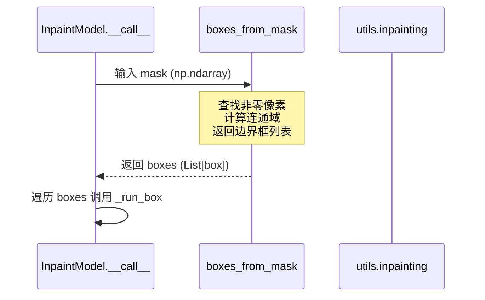

#### 带注释源码

```python
# 1. 导入声明 (来自代码第 11 行)
from ..utils.inpainting import (
    boxes_from_mask,  # 函数定义未在当前代码片段中显示
    resize_max_size,
    pad_img_to_modulo,
)

# 2. 函数调用上下文 (位于 InpaintModel.__call__ 方法中)
# 该函数用于在 HDStrategy.CROP 策略下，提取需要处理的区域坐标
if config.hd_strategy == HDStrategy.CROP:
    # ... 前置检查 ...
    if max(image.shape) > config.hd_strategy_crop_trigger_size:
        logger.info(f"Run crop strategy")
        
        # 调用 boxes_from_mask 获取掩码的边界框
        # 输入: mask (形状 HxW, 类型 uint8)
        # 输出: boxes (例如 [[x1,y1,x2,y2], [x1,y1,x2,y2], ...])
        boxes = boxes_from_mask(mask)
        
        crop_result = []
        # 遍历每个检测到的区域进行单独处理
        for box in boxes:
            # box 参数被传递给 _run_box，类型推断为 List[int] 或 Tuple[int, ...]
            crop_image, crop_box = self._run_box(image, mask, box, config)
            crop_result.append((crop_image, crop_box))

# 注意：由于该函数的实现细节未在提供的代码片段中定义，
# 以上源码展示了其典型的使用方式和调用上下文。
```

> **文档说明**：该函数的实现源码未包含在用户提供的代码片段中，仅在 `InpaintModel` 类的方法中被调用。上述信息（参数类型、返回值格式）是根据其调用方式及常见图像处理逻辑推断而来。


### `resize_max_size`

该函数是一个图像/掩码缩放工具函数，用于将输入的图像或掩码数组调整到指定的最大尺寸限制，同时保持原始宽高比。当图像的宽度或高度超过设定的限制时，会按比例缩小图像，使其最长的边等于限制值。

参数：

- `image`：图像数组（numpy array），输入的图像数据，支持灰度或彩色图像
- `size_limit`：整数，限制图像最长边的目标尺寸

返回值：调整大小后的图像或掩码数组（numpy array），保持原始数据类型和通道数

#### 流程图

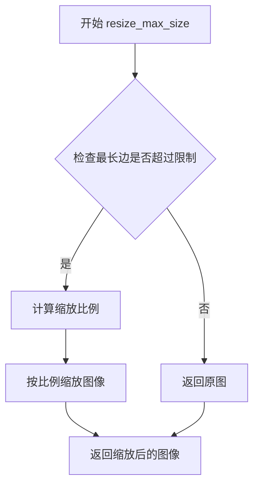

#### 带注释源码

```
# 注意：该函数定义在 ..utils.inpainting 模块中，此处仅展示调用方式
# 根据代码中的使用推断的函数签名和逻辑：

def resize_max_size(image, size_limit):
    """
    将图像调整到指定的最大尺寸，保持宽高比
    
    Args:
        image: 输入图像 (H, W, C) 或 (H, W)
        size_limit: 允许的最大边长
    
    Returns:
        调整大小后的图像
    """
    # 获取图像当前尺寸
    height, width = image.shape[:2]
    
    # 计算最大边
    max_side = max(height, width)
    
    # 如果超过限制则按比例缩放
    if max_side > size_limit:
        scale = size_limit / max_side
        new_height = int(height * scale)
        new_width = int(width * scale)
        # 使用 imk.resize 或类似方法进行缩放
        image = imk.resize(image, (new_width, new_height), mode=Image.Resampling.BICUBIC)
    
    return image

# 代码中的实际调用示例：
# downsize_image = resize_max_size(image, size_limit=config.hd_strategy_resize_limit)
# downsize_mask = resize_max_size(mask, size_limit=config.hd_strategy_resize_limit)
```


### `pad_img_to_modulo`

该函数用于将图像或掩码填充到指定模数的倍数，以确保尺寸满足后续处理（如神经网络推理）的要求。支持可选的方形填充和最小尺寸限制。

参数：

-  `image`：`numpy.ndarray`，待填充的图像，形状为 [H, W, C] RGB 或 [H, W]
-  `mod`：`int`，填充后尺寸需要满足的模数（默认为 8）
-  `square`：`bool`，是否将图像填充为正方形（默认为 False）
-  `min_size`：`Optional[int]`，填充后的最小尺寸限制（默认为 None）

返回值：`numpy.ndarray`，填充后的图像，形状为新的高度和宽度（通常为原始尺寸向上取整到满足模数要求的值）

#### 流程图

```mermaid
flowchart TD
    A[开始 pad_img_to_modulo] --> B{参数校验}
    B --> C{是否需要填充为正方形?}
    C -->|是| D[计算最大边长]
    C -->|否| E[使用原始宽度和高度]
    D --> F[将高度和宽度都设置为最大边长]
    E --> G{高度是否满足模数要求?}
    G -->|否| H[计算填充后的高度<br/>new_h = (h + mod - 1) // mod * mod]
    G -->|是| I{宽度是否满足模数要求?}
    I -->|否| J[计算填充后的宽度<br/>new_w = (w + mod - 1) // mod * mod]
    I -->|是| K{是否有最小尺寸限制?}
    K -->|是| L[确保填充后尺寸不小于min_size]
    K -->|否| M[返回原始尺寸]
    H --> N[应用填充]
    J --> N
    L --> N
    M --> O[返回原始图像]
    N --> P[使用 numpy.pad 或类似方式填充]
    P --> Q[结束]
    
    style A fill:#f9f,stroke:#333
    style Q fill:#9f9,stroke:#333
```

#### 带注释源码

```python
# 注：由于 pad_img_to_modulo 定义在 ..utils.inpainting 模块中
# 以下为基于调用方式和典型实现的推测源码

def pad_img_to_modulo(image: np.ndarray, mod: int = 8, square: bool = False, min_size: Optional[int] = None) -> np.ndarray:
    """
    将图像填充到满足模数要求的尺寸
    
    Args:
        image: 输入图像，形状为 [H, W, C] 或 [H, W]
        mod: 填充后尺寸需要满足的模数
        square: 是否将图像填充为正方形
        min_size: 填充后的最小尺寸
    
    Returns:
        填充后的图像
    """
    h, w = image.shape[:2]
    
    # 计算填充后的高度
    new_h = h
    if h % mod != 0:
        new_h = (h + mod - 1) // mod * mod
    
    # 计算填充后的宽度
    new_w = w
    if w % mod != 0:
        new_w = (w + mod - 1) // mod * mod
    
    # 如果需要填充为正方形
    if square:
        max_size = max(new_h, new_w)
        new_h = max_size
        new_w = max_size
    
    # 应用最小尺寸限制
    if min_size is not None:
        new_h = max(new_h, min_size)
        new_w = max(new_w, min_size)
    
    # 如果尺寸未变化，直接返回原图
    if new_h == h and new_w == w:
        return image
    
    # 计算需要填充的像素数
    pad_h = new_h - h
    pad_w = new_w - w
    
    # 填充图像（通常在底部和右侧填充）
    # 注意：PIL 和 numpy 的填充方式可能不同
    if len(image.shape) == 3:
        return np.pad(image, 
                      ((0, pad_h), (0, pad_w), (0, 0)), 
                      mode='constant', 
                      constant_values=0)
    else:
        return np.pad(image, 
                      ((0, pad_h), (0, pad_w)), 
                      mode='constant', 
                      constant_values=0)
```


### `imk.resize`

这是 `imkit` 库提供的图像缩放函数，用于将图像调整到指定尺寸。在代码中用于将修复后的图像从推理尺寸恢复到原始尺寸。

参数：

- `img`：待缩放的图像，通常是 NumPy 数组（BGR 格式）
- `size`：目标尺寸，类型为元组 `(width, height)`，对应原始图像的 `(宽, 高)`
- `mode`：重采样模式，类型为 `Image.Resampling`，代码中使用 `Image.Resampling.BICUBIC`（双三次插值）

返回值：`numpy.ndarray`，缩放后的图像数组

#### 流程图

```mermaid
graph TD
    A[输入: 推理后的图像 inpaint_result] --> B[获取原始尺寸 origin_size[1], origin_size[0]]
    B --> C[调用 imk.resize 调整图像大小]
    C --> D[使用 BICUBIC 插值模式]
    D --> E[输出: 恢复原始尺寸的图像]
    
    F[原始图像数组] --> G[获取需要保留的像素位置 mask < 127]
    G --> H[将原始像素复制回结果图像]
    H --> E
```

#### 带注释源码

```python
# 在 InpaintModel.__call__ 方法中（约第118-122行）
# 当使用 HDStrategy.RESIZE 策略时，推理完成后需要将图像恢复到原始尺寸
inpaint_result = imk.resize(
    inpaint_result,                              # 输入: 经过 inpainting 推理后的图像（缩小版）
    (origin_size[1], origin_size[0]),            # 目标尺寸: (原始宽度, 原始高度) - 注意是 (W, H) 顺序
    mode=Image.Resampling.BICUBIC,               # 重采样模式: 使用双三次插值进行高质量缩放
)

# 在 DiffusionInpaintModel._scaled_pad_forward 方法中（约第256-260行）
# 类似的用法，用于 SD 缩放策略后的图像尺寸恢复
inpaint_result = imk.resize(
    inpaint_result,
    (origin_size[1], origin_size[0]),
    mode=Image.Resampling.BICUBIC,
)
```

> **注意**：由于 `imk.resize` 来自外部库 `imkit`，其完整函数签名需要参考该库的官方文档。以上信息是基于代码调用方式的推断。


### `imk.lut`

该函数是图像处理库 imkit 中的查找表(LUT)应用函数，用于将输入图像通道按照给定的查找表进行像素值映射，实现图像的直方图匹配或色调调整功能。

参数：

- `source_channel`：`numpy.ndarray`，源图像的单个通道数据，形状为 [H, W]，值为 0-255 的灰度像素
- `lookup`：`numpy.ndarray`，256 个元素的查找表数组，用于将源像素值映射到新的像素值

返回值：`numpy.ndarray`，应用查找表变换后的通道数据，形状与 source_channel 相同，值为 0-255

#### 流程图

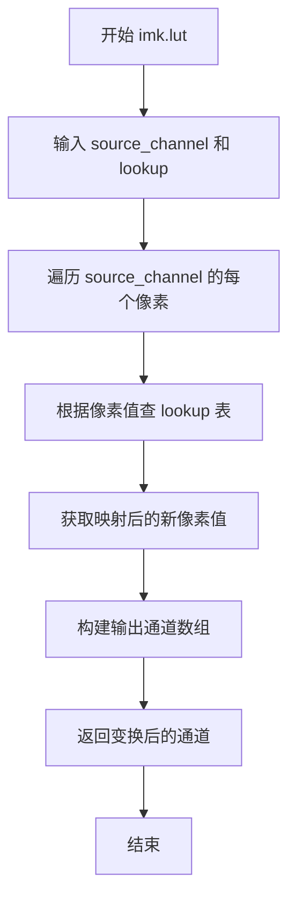

#### 带注释源码

```python
# imk.lut 函数在代码中的调用位置（位于 InpaintModel 类的 _match_histograms 方法中）
# 该函数用于对图像通道应用直方图匹配查找表

transformed_channels.append(imk.lut(source_channel, lookup))
# 参数说明：
# - source_channel: 源图像的单个通道，numpy.ndarray 类型，形状为 [H, W]
# - lookup: 直方图匹配计算出的查找表，numpy.ndarray 类型，长度为 256
# 返回值：应用查找表变换后的通道数据，形状不变

# 完整上下文（_match_histograms 方法片段）：
def _match_histograms(self, source, reference, mask):
    transformed_channels = []
    for channel in range(source.shape[-1]):
        source_channel = source[:, :, channel]  # 提取当前通道
        reference_channel = reference[:, :, channel]
        
        # 仅对非遮罩区域计算直方图
        source_histogram, _ = np.histogram(source_channel[mask == 0], 256, [0, 256])
        reference_histogram, _ = np.histogram(
            reference_channel[mask == 0], 256, [0, 256]
        )
        
        # 计算累积分布函数 CDF
        source_cdf = self._calculate_cdf(source_histogram)
        reference_cdf = self._calculate_cdf(reference_histogram)
        
        # 计算查找表
        lookup = self._calculate_lookup(source_cdf, reference_cdf)
        
        # 应用查找表变换到当前通道 - 调用 imk.lut
        transformed_channels.append(imk.lut(source_channel, lookup))
    
    # 合并变换后的通道并转换格式
    result = imk.merge_channels(transformed_channels)
    result = imk.convert_scale_abs(result)
    
    return result
```


### `imk.merge_channels`

该函数是 `imkit` 库中的工具函数，用于将多个单通道图像数组合并成一个多通道图像数组。在 `_match_histograms` 方法中，它将经过直方图匹配和查找表变换后的多个单通道结果合并回完整的多通道图像，然后进行缩放处理。

参数：

-  `channels`：`List[np.ndarray]`，包含多个单通道图像数组的列表，每个数组应为二维数组（高度×宽度），通道顺序通常为 BGR 或 RGB

返回值：`np.ndarray`，合并后的多通道图像数组，形状为（高度，宽度，通道数）

#### 流程图

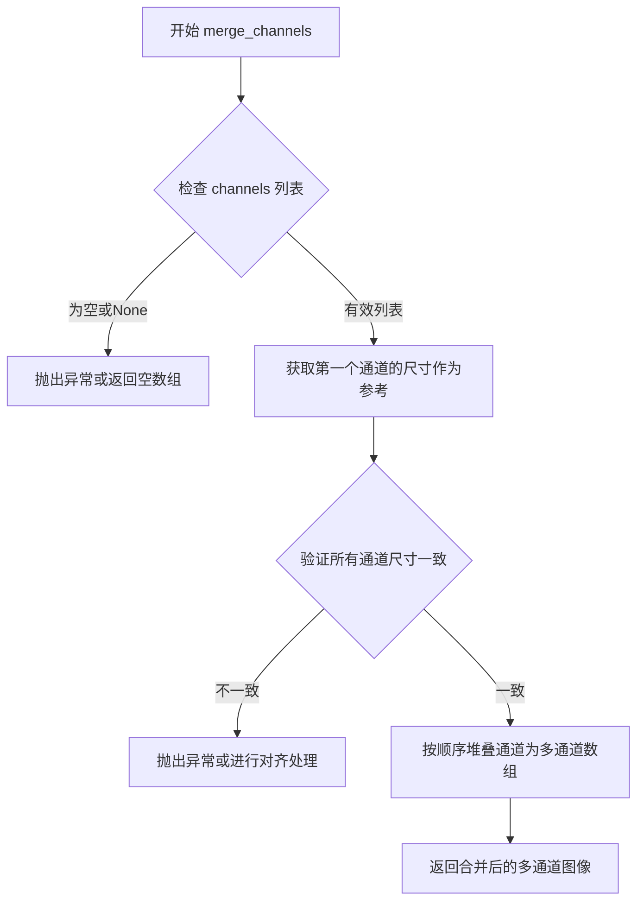

#### 带注释源码

```python
# 从 _match_histograms 方法中提取的相关调用代码
# 这是 imk.merge_channels 的调用上下文

# transformed_channels 是经过直方图匹配后的单通道列表
transformed_channels = []
for channel in range(source.shape[-1]):
    # ...（直方图计算和查找表应用代码省略）
    
    # 对每个通道应用查找表变换
    transformed_channels.append(imk.lut(source_channel, lookup))

# 核心操作：合并多个单通道为多通道图像
# 输入：transformed_channels - 包含多个单通道numpy数组的列表
# 输出：result - 合并后的多通道numpy数组，形状为 [H, W, C]
result = imk.merge_channels(transformed_channels)

# 转换结果为8位无符号整数格式
result = imk.convert_scale_abs(result)

return result
```

#### 补充说明

`imk.merge_channels` 是 `imkit` 库（`imk` 模块）的内部函数，其具体实现细节需要参考 `imkit` 库的源码。从使用方式可以推断：

1. **设计目的**：将分离的通道数据合并为多通道图像，这在图像处理流水线中很常见，特别是当需要对每个通道独立处理后重新组合时。

2. **典型使用场景**：在 `_match_histograms` 方法中，用于将经过直方图匹配的各个颜色通道重新合并，形成完整的彩色图像。

3. **参数要求**：通常要求所有输入通道具有相同的宽高尺寸。

4. **后续处理**：合并后通常会调用 `imk.convert_scale_abs` 将浮点或较大范围的像素值转换为标准的 8 位整数范围 [0, 255]。


### `imk.convert_scale_abs`

将图像数组转换为标准的8位无符号整数格式（CV_8U），通常用于直方图匹配后确保像素值在有效范围内。

参数：

-  `src`：`numpy.ndarray`，输入图像数组，通常是浮点型图像数据

返回值：`numpy.ndarray`，返回转换后的8位无符号整数图像数组

#### 流程图

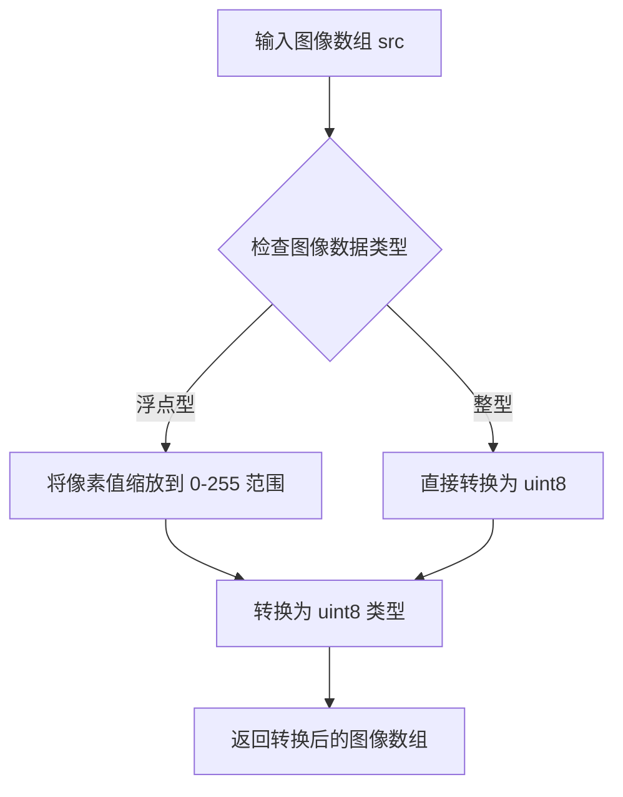

#### 带注释源码

```python
# 在 InpaintModel 类的 _match_histograms 方法中使用
def _match_histograms(self, source, reference, mask):
    """
    对图像进行直方图匹配，使其具有与参考图像相似的颜色分布
    
    Args:
        source: 源图像数组 [H, W, C]
        reference: 参考图像数组 [H, W, C]
        mask: 掩码数组 [H, W]，用于标识需要修复的区域
    
    Returns:
        直方图匹配后的图像数组
    """
    transformed_channels = []
    for channel in range(source.shape[-1]):
        source_channel = source[:, :, channel]
        reference_channel = reference[:, :, channel]

        # 只对非掩码区域计算直方图
        source_histogram, _ = np.histogram(source_channel[mask == 0], 256, [0, 256])
        reference_histogram, _ = np.histogram(
            reference_channel[mask == 0], 256, [0, 256]
        )

        # 计算累积分布函数 (CDF)
        source_cdf = self._calculate_cdf(source_histogram)
        reference_cdf = self._calculate_cdf(reference_histogram)

        # 计算查找表 (Lookup Table)
        lookup = self._calculate_lookup(source_cdf, reference_cdf)

        # 应用 LUT 变换到每个通道
        transformed_channels.append(imk.lut(source_channel, lookup))

    # 合并变换后的通道
    result = imk.merge_channels(transformed_channels)
    
    # 转换为标准的8位无符号整数格式 (CV_8U)
    # 确保像素值在 0-255 范围内，并使用 uint8 类型存储
    result = imk.convert_scale_abs(result)

    return result
```

> **注意**：`imk.convert_scale_abs` 是来自 `imkit` 库（`imk` 模块）的外部函数。从代码中的使用上下文来看，它的主要作用是在直方图匹配过程结束后，将浮点型或超出范围的值图像数据转换为标准的8位无符号整数格式，这是 OpenCV 图像处理中常见的 `cv2.convertScaleAbs` 函数的封装。该函数通常执行以下操作：
> 1. 将输入图像转换为浮点型（如果还不是）
> 2. 将像素值缩放到 0-255 范围
> 3. 取绝对值（对于可能的负值）
> 4. 转换为 uint8 类型


### `np.histogram`

该函数是NumPy库提供的用于计算数组直方图的函数，在代码中用于图像直方图匹配处理。代码在`_match_histograms`方法中调用此函数来计算源图像和参考图像各通道的直方图，以便进行直方图均衡化匹配。

参数：

-  `a`：`numpy.ndarray`，输入数据，这里传入`source_channel[mask == 0]`或`reference_channel[mask == 0]`，即去除掩膜区域后的图像通道数据
-  `bins`：`int`，直方图的bin数量，这里固定为256，对应8位图像的灰度级数量
-  `range`：`list`，像素值的范围，这里指定为`[0, 256]`，表示统计0到255的像素值

返回值：`tuple`，返回两个numpy数组
-  第一个数组：`numpy.ndarray`，直方图的频数数组，长度为bins的数量
-  第二个数组：`numpy.ndarray`，直方图的bin边界数组，长度为bins+1

#### 流程图

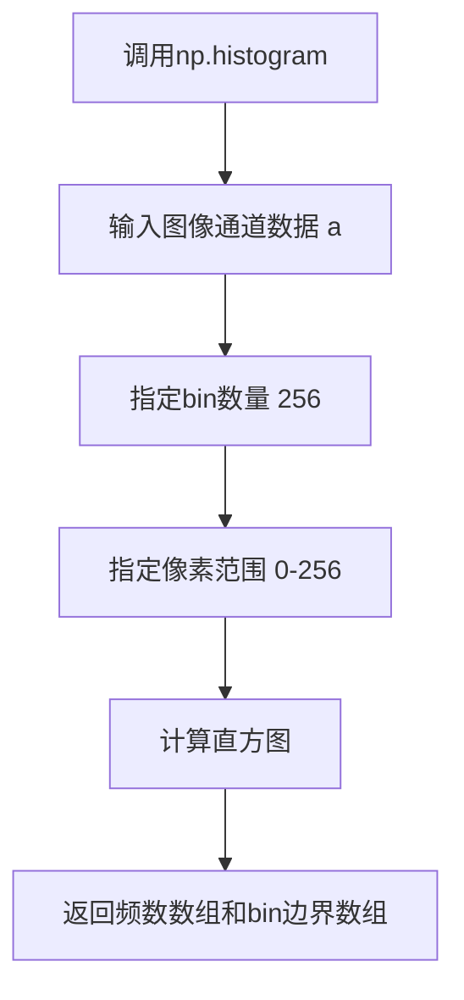

#### 带注释源码

```python
# 在 _match_histograms 方法中调用 np.histogram 的源码片段

def _match_histograms(self, source, reference, mask):
    transformed_channels = []
    for channel in range(source.shape[-1]):
        source_channel = source[:, :, channel]
        reference_channel = reference[:, :, channel]

        # 只对非掩膜区域计算直方图
        # np.histogram 计算源图像通道的直方图
        # 参数1: a - 输入数组，即去除掩膜后的通道数据
        # 参数2: bins - 直方图的bin数量，256对应8位灰度
        # 参数3: range - 像素值范围 [0, 256)
        source_histogram, _ = np.histogram(source_channel[mask == 0], 256, [0, 256])
        
        # 计算参考图像通道的直方图
        # 使用相同的参数确保一致性
        reference_histogram, _ = np.histogram(
            reference_channel[mask == 0], 256, [0, 256]
        )

        # 计算累积分布函数 CDF
        source_cdf = self._calculate_cdf(source_histogram)
        reference_cdf = self._calculate_cdf(reference_histogram)

        # 计算查找表进行直方图匹配
        lookup = self._calculate_lookup(source_cdf, reference_cdf)

        # 应用查找表变换通道
        transformed_channels.append(imk.lut(source_channel, lookup))

    # 合并通道并转换格式
    result = imk.merge_channels(transformed_channels)
    result = imk.convert_scale_abs(result)

    return result
```

#### 完整方法源码

```python
def _match_histograms(self, source, reference, mask):
    """
    对源图像进行直方图匹配，使其具有与参考图像相似的直方图分布
    
    Args:
        source: 源图像 [H, W, C] RGB
        reference: 参考图像 [H, W, C] RGB  
        mask: 掩膜图像 [H, W, 1], 255为需要修复的区域
    
    Returns:
        直方图匹配后的图像
    """
    transformed_channels = []
    for channel in range(source.shape[-1]):
        source_channel = source[:, :, channel]
        reference_channel = reference[:, :, channel]

        # 只计算非掩膜区域的直方图（mask==0表示非修复区域）
        # np.histogram 返回:
        #   - histogram: 频数数组, 长度256
        #   - bin_edges: 边界数组, 长度257
        source_histogram, _ = np.histogram(source_channel[mask == 0], 256, [0, 256])
        reference_histogram, _ = np.histogram(
            reference_channel[mask == 0], 256, [0, 256]
        )

        # 计算累积分布函数
        source_cdf = self._calculate_cdf(source_histogram)
        reference_cdf = self._calculate_cdf(reference_histogram)

        # 计算映射查找表
        lookup = self._calculate_lookup(source_cdf, reference_cdf)

        # 使用查找表变换图像通道
        transformed_channels.append(imk.lut(source_channel, lookup))

    # 合并RGB通道并转换为8位图像
    result = imk.merge_channels(transformed_channels)
    result = imk.convert_scale_abs(result)

    return result
```


### `InpaintModel._pad_forward`

该方法是 InpaintModel 类的内部方法，负责对输入图像和 mask 进行填充后执行前向推理，然后根据原始尺寸裁剪结果，并使用 mask 对修复后的图像和原始图像进行混合。其中使用 `np.newaxis` 将二维 mask 扩展为三维以进行广播运算。

参数：

- `image`：`numpy.ndarray`，输入图像，形状为 [H, W, C] RGB 格式
- `mask`：`numpy.ndarray`，输入 mask，形状为 [H, W]，255 表示需要修复的区域
- `config`：`Config`，配置对象，包含填充和后处理参数

返回值：`numpy.ndarray`，返回修复后的图像，形状为 [H, W, C] BGR 格式

#### 流程图

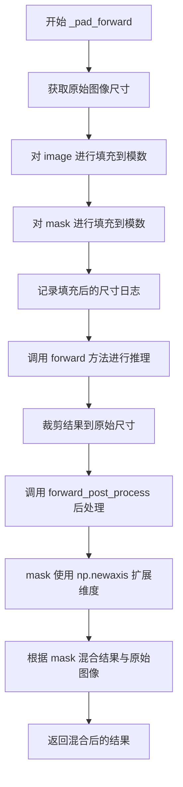

#### 带注释源码

```python
def _pad_forward(self, image, mask, config: Config):
    """
    对图像和 mask 进行填充后执行前向推理，然后裁剪并混合结果
    
    Args:
        image: 输入图像 [H, W, C] RGB 格式
        mask: 输入 mask [H, W]，255 表示需要修复的区域
        config: 配置对象
    
    Returns:
        修复后的图像 [H, W, C] BGR 格式
    """
    # 记录原始图像的高度和宽度，用于后续裁剪回原始尺寸
    origin_height, origin_width = image.shape[:2]
    
    # 将图像填充到模数倍数（如8的倍数），以适配模型输入要求
    # pad_mod: 填充模数（默认8）
    # pad_to_square: 是否填充为正方形
    # min_size: 最小尺寸限制
    pad_image = pad_img_to_modulo(
        image, mod=self.pad_mod, square=self.pad_to_square, min_size=self.min_size
    )
    
    # 对 mask 进行同样的填充操作
    pad_mask = pad_img_to_modulo(
        mask, mod=self.pad_mod, square=self.pad_to_square, min_size=self.min_size
    )

    # 记录最终填充后的图像尺寸日志
    logger.info(f"final forward pad size: {pad_image.shape}")

    # 执行模型前向推理，获取修复结果
    result = self.forward(pad_image, pad_mask, config)
    
    # 将结果裁剪回原始尺寸，去除填充部分
    result = result[0:origin_height, 0:origin_width, :]

    # 执行后处理（默认为空实现，可被子类重写）
    result, image, mask = self.forward_post_process(result, image, mask, config)

    # === 关键代码：np.newaxis 的使用 ===
    # 将 mask 从 [H, W] 扩展为 [H, W, 1]
    # 这是为了与 result [H, W, C] 和 image [H, W, C] 进行广播运算
    # 使得 mask 可以正确地与每个通道进行逐元素运算
    mask = mask[:, :, np.newaxis]
    
    # 根据 mask 混合修复结果和原始图像
    # mask / 255: 将 mask 归一化到 [0, 1]
    # (mask / 255): 修复区域权重
    # (1 - (mask / 255)): 原始区域权重
    # 修复区域使用 result，原始区域保留原始 image
    result = result * (mask / 255) + image * (1 - (mask / 255))
    
    return result
```

#### `np.newaxis` 使用说明

在 `mask = mask[:, :, np.newaxis]` 这行代码中：

| 属性 | 值 |
|------|-----|
| 操作前 mask 形状 | [H, W] |
| 操作后 mask 形状 | [H, W, 1] |
| 目的 | 将二维 mask 扩展为三维，以便与三维图像进行广播运算 |
| 广播机制 | result [H,W,C] × mask [H,W,1] → 每个通道应用相同的 mask |

这种技术在图像修复中至关重要，因为它允许使用同一个二维 mask 对多通道图像进行像素级混合，而无需为每个通道复制 mask。


### `InpaintModel.__init__`

该方法是 `InpaintModel` 类的构造函数，用于初始化图像修复模型的基本属性。它接收设备参数并将设备信息存储在实例属性中，同时调用抽象方法 `init_model` 来完成子类特定的模型初始化逻辑。

参数：

- `device`：`Any`，设备对象，用于指定模型运行设备（如 'cuda'、'cpu'、'mps' 等）
- `**kwargs`：`Dict[str, Any]`，可变关键字参数，用于传递额外的配置参数传递给子类的 `init_model` 方法

返回值：`None`，无返回值（`__init__` 方法）

#### 流程图

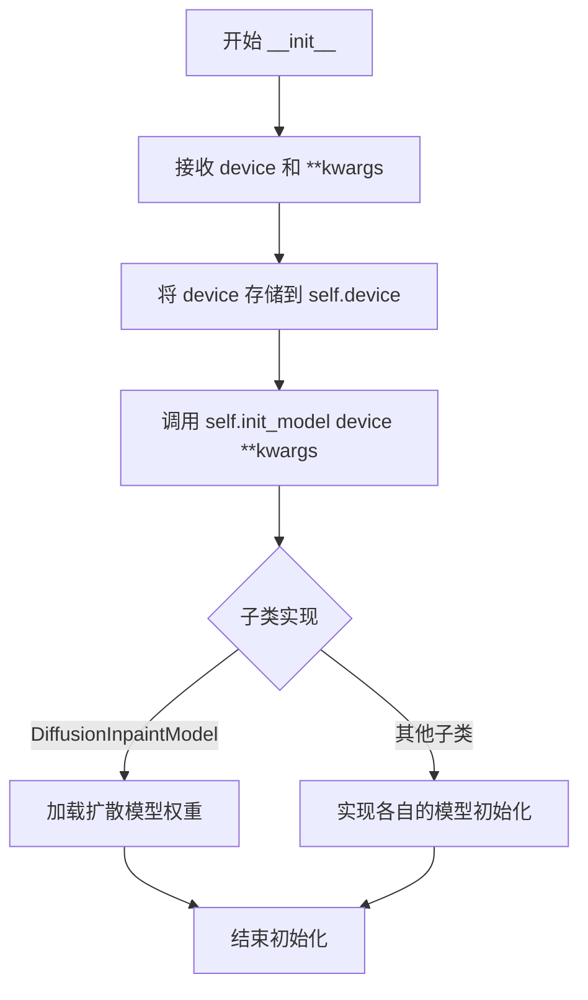

#### 带注释源码

```python
def __init__(self, device, **kwargs):
    """
    初始化 InpaintModel 实例

    Args:
        device: 设备对象，用于指定模型运行设备（如 'cuda', 'cpu', 'mps' 等）
    """
    # 注释：此处原本可能有 switch_mps_device 的调用，用于自动切换 MPS 设备
    # device = switch_mps_device(self.name, device)
    
    # 将传入的设备参数存储为实例属性，供后续方法使用
    self.device = device
    
    # 调用抽象方法 init_model，由子类实现具体的模型加载逻辑
    # 子类需要在此方法中完成模型权重的加载、模型结构的初始化等工作
    self.init_model(device, **kwargs)
```


### `InpaintModel.init_model`

该方法是 `InpaintModel` 类的抽象方法，用于初始化具体的修复模型。它是一个模板方法，由子类实现具体的模型加载逻辑。方法接收计算设备和可选的配置参数，完成模型权重加载、设备转移等初始化工作。

参数：

- `self`：`InpaintModel`，InpaintModel 实例本身
- `device`：`str` 或 `torch.device`，计算设备标识（如 'cuda'、'cpu'、'mps'），指定模型运行的硬件设备
- `**kwargs`：`dict`，可选的关键字参数，用于传递额外的配置信息，如模型路径、精度设置等

返回值：`None`，该方法为抽象方法，无返回值（具体实现由子类决定）

#### 流程图

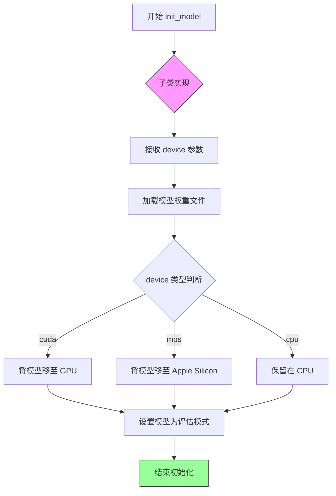

#### 带注释源码

```python
@abc.abstractmethod
def init_model(self, device, **kwargs):
    """
    抽象方法：初始化具体的修复模型
    
    该方法是一个抽象接口，定义了模型初始化的标准契约。
    子类必须实现此方法以完成具体的模型加载和设备配置。
    
    Args:
        device: 计算设备标识字符串或设备对象
               常见值: 'cuda' (GPU), 'cpu', 'mps' (Apple Silicon)
        **kwargs: 额外的初始化参数
                 可能包含: model_path, precision, compile 等
    
    Returns:
        None: 抽象方法不定义返回值，由子类实现决定
    
    Note:
        - 此方法在 __init__ 中被调用，确保模型在使用前完成初始化
        - 子类实现应处理模型文件的下载/加载逻辑
        - 应将模型设置为 eval() 模式以确保推理行为一致
    """
    ...  # 子类必须实现此方法
```


### `InpaintModel.is_downloaded`

该方法是 `InpaintModel` 类的静态抽象方法，用于检查模型权重是否已下载到本地。由于是抽象方法，具体实现由子类完成，通常用于在推理前验证模型资源是否就绪。

参数： 无

返回值：`bool`，返回 `True` 表示模型已下载/就绪，返回 `False` 表示模型未下载。

#### 流程图

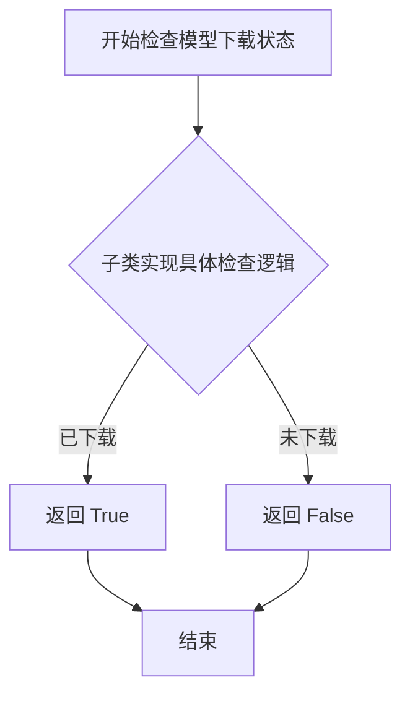

#### 带注释源码

```python
@staticmethod
@abc.abstractmethod
def is_downloaded() -> bool:
    """
    检查模型权重是否已下载
    
    这是一个抽象静态方法，要求子类实现具体的检查逻辑。
    通常用于：
    - 验证模型文件是否存在
    - 检查模型权重是否可用
    - 在推理前确保资源就绪
    
    Returns:
        bool: 模型是否已下载就绪
              - True: 模型已下载，可以进行推理
              - False: 模型未下载，需要先下载模型
    """
    ...  # 抽象方法，由子类实现
```


### `InpaintModel.forward`

该方法是一个抽象（Abstract）方法，定义了图像修复（Inpainting）的核心推理接口。接收经过填充（Padding）处理的 RGB 图像和对应的掩码（Mask），根据传入的 `Config` 配置调用具体的模型推理逻辑，并返回修复后的 BGR 图像。此方法需由子类（如具体的深度学习模型）实现具体的前向传播逻辑。

参数：

- `self`：`InpaintModel`，模型实例本身。
- `image`：`numpy.ndarray`，输入的填充后图像，形状为 [H, W, C]，RGB 格式。
- `mask`：`numpy.ndarray`，输入的填充后掩码，形状为 [H, W, 1] 或 [H, W]，其中 255 表示需要修复的区域。
- `config`：`Config`，包含推理配置参数的对象。

返回值：`numpy.ndarray`，修复后的图像，BGR 格式，形状与输入的 `image` 相同。

#### 流程图

```mermaid
graph LR
    A[输入: Padded Image (RGB), Mask, Config] --> B{Abstract forward}
    B --> C[输出: Inpainted Image (BGR)]
    style B fill:#f9f,stroke:#333,stroke-width:2px
```

#### 带注释源码

```python
@abc.abstractmethod
def forward(self, image, mask, config: Config):
    """Input images and output images have same size
    images: [H, W, C] RGB
    masks: [H, W, 1] 255 为 masks 区域
    return: BGR IMAGE
    """
    ...
```


### `InpaintModel._pad_forward`

该方法负责在图像修复前对输入图像和掩码进行填充（Padding）操作，以满足模型的尺寸要求（模运算要求），然后调用实际的 `forward` 方法进行推理，最后将结果裁剪回原始尺寸并进行后处理和图像混合，最终返回修复后的图像。

参数：

- `image`：`numpy.ndarray`，输入的 RGB 图像，形状为 [H, W, C]，未归一化。
- `mask`：`numpy.ndarray`，输入的掩码，形状为 [H, W]，其中 255 表示需要修复的区域。
- `config`：`Config`，配置对象，包含模型运行所需的配置参数。

返回值：`numpy.ndarray`，处理后的图像，形状为 [H, W, C]，BGR 格式。

#### 流程图

```mermaid
graph TD
    A[开始 _pad_forward] --> B[获取原始图像尺寸 origin_height, origin_width]
    B --> C[调用 pad_img_to_modulo 对图像进行填充]
    C --> D[调用 pad_img_to_modulo 对掩码进行填充]
    D --> E[调用 forward 方法进行模型推理]
    E --> F[裁剪结果至原始尺寸 result[0:origin_height, 0:origin_width, :]]
    F --> G[调用 forward_post_process 后处理]
    G --> H[调整掩码维度 mask[:, :, np.newaxis]]
    H --> I[根据掩码混合原始图像和修复结果]
    I --> J[返回最终结果]
```

#### 带注释源码

```python
def _pad_forward(self, image, mask, config: Config):
    """
    对图像和掩码进行填充后调用模型推理，然后裁剪回原始尺寸并混合。

    Args:
        image: 输入的 RGB 图像 [H, W, C]，未归一化。
        mask: 输入的掩码 [H, W]，255 表示需要修复的区域。
        config: 配置对象。

    Returns:
        修复后的图像 [H, W, C]，BGR 格式。
    """
    # 1. 获取原始图像的尺寸，用于后续裁剪回原始大小
    origin_height, origin_width = image.shape[:2]

    # 2. 对图像进行填充，使其尺寸满足模运算要求（pad_mod）
    #    pad_img_to_modulo 是工具函数，确保图像尺寸是 pad_mod 的倍数
    pad_image = pad_img_to_modulo(
        image, mod=self.pad_mod, square=self.pad_to_square, min_size=self.min_size
    )

    # 3. 对掩码进行同样的填充操作
    pad_mask = pad_img_to_modulo(
        mask, mod=self.pad_mod, square=self.pad_to_square, min_size=self.min_size
    )

    # 4. 记录填充后的尺寸，用于调试和日志
    logger.info(f"final forward pad size: {pad_image.shape}")

    # 5. 调用抽象方法 forward 进行实际的模型推理
    #    输入是填充后的图像和掩码
    result = self.forward(pad_image, pad_mask, config)

    # 6. 将推理结果裁剪回原始图像的尺寸
    #    因为填充是为了满足模型输入要求，结果只需要原始尺寸部分
    result = result[0:origin_height, 0:origin_width, :]

    # 7. 调用后处理方法，允许子类自定义后处理逻辑
    #    默认实现只是原样返回 result, image, mask
    result, image, mask = self.forward_post_process(result, image, mask, config)

    # 8. 调整掩码维度，从 [H, W] 变为 [H, W, 1]，以便与图像进行广播运算
    mask = mask[:, :, np.newaxis]

    # 9. 混合原始图像和修复结果
    #    公式: result = result * (mask / 255) + image * (1 - (mask / 255))
    #    即：掩码区域使用修复结果，非掩码区域保留原始图像
    result = result * (mask / 255) + image * (1 - (mask / 255))

    # 10. 返回最终的修复结果
    return result
```


### `InpaintModel.forward_post_process`

该方法是 `InpaintModel` 类的后处理方法，用于对图像修复结果进行进一步处理。当前实现为基类默认实现，直接返回原始结果、子图像和掩码，不进行任何实际处理。子类可通过重写此方法实现自定义后处理逻辑（如颜色匹配、边缘融合等）。

参数：

- `result`：`np.ndarray`，修复后的图像结果，格式为 [H, W, C]，通常为 BGR 格式
- `image`：`np.ndarray`，原始输入图像，格式为 [H, W, C]，RGB 格式
- `mask`：`np.ndarray`，掩码图像，格式为 [H, W]，255 表示需要修复的区域
- `config`：`Config`，配置对象，包含后处理相关的配置参数

返回值：`tuple[np.ndarray, np.ndarray, np.ndarray]`，返回一个元组，包含 (处理后的结果图像, 原始图像, 掩码)

#### 流程图

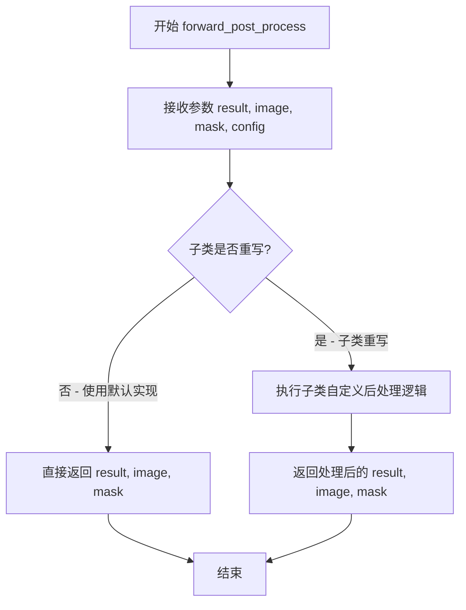

#### 带注释源码

```python
def forward_post_process(self, result, image, mask, config):
    """
    后处理方法，用于对修复结果进行进一步处理
    
    Args:
        result: 修复后的图像结果 [H, W, C]，BGR格式
        image: 原始输入图像 [H, W, C]，RGB格式  
        mask: 掩码图像 [H, W]，255表示需修复区域
        config: 配置对象，包含后处理相关配置
    
    Returns:
        tuple: (处理后的结果图像, 原始图像, 掩码)
    """
    # 默认实现：直接返回原始输入，不做任何处理
    # 子类可以重写此方法实现自定义后处理逻辑
    return result, image, mask
```


### `InpaintModel.__call__`

该方法是 `InpaintModel` 类的主入口方法，接收图像和掩码，根据配置中的 `hd_strategy`（高分辨率策略）选择合适的处理流程：裁剪策略（CROP）会从掩码中提取候选框并逐个修复后拼接；调整大小策略（RESIZE）会先缩小图像再修复并放大回原始尺寸；若未指定策略则直接调用 `_pad_forward` 进行处理，最终返回 BGR 格式的修复结果图像。

参数：

- `image`：`numpy.ndarray`，形状为 [H, W, C] 的 RGB 图像，未归一化
- `mask`：`numpy.ndarray`，形状为 [H, W] 的掩码数组，255 表示需要修复的区域
- `config`：`Config`，包含高分辨率策略、裁剪参数、缩放参数等配置信息

返回值：`numpy.ndarray`，BGR 格式的图像修复结果

#### 流程图

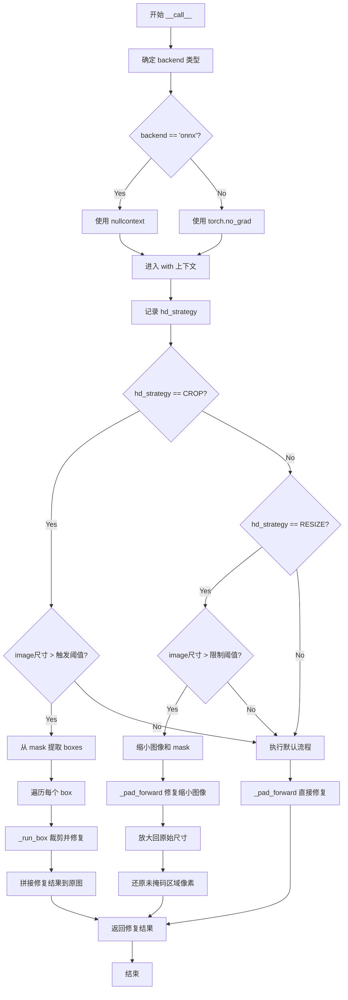

#### 带注释源码

```python
def __call__(self, image, mask, config: Config):
    """
    images: [H, W, C] RGB, not normalized
    masks: [H, W]
    return: BGR IMAGE
    """
    # 确定使用的后端类型，默认为 'torch'
    # 只有 torch 后端需要使用 torch.no_grad() 来禁用梯度计算以节省显存
    backend = getattr(self, 'backend', 'torch')
    
    # ONNX 后端不需要梯度上下文，直接使用 nullcontext
    if backend == 'onnx':
        no_grad_ctx = nullcontext()
    else:
        # 尝试导入 torch，如果未安装则抛出运行时错误
        try:
            import torch  # noqa
            no_grad_ctx = torch.no_grad()
        except ImportError as e:
            raise RuntimeError("Torch backend selected but torch is not installed. Install torch or use backend='onnx'.") from e
    
    # 在指定上下文中执行推理（禁用梯度计算）
    with no_grad_ctx:
        inpaint_result = None  # 初始化修复结果为 None
        
        # 记录当前使用的高分辨率策略
        logger.info(f"hd_strategy: {config.hd_strategy}")
        
        # === 策略 1: CROP（裁剪策略）===
        # 当图像尺寸超过裁剪触发阈值时启用
        if config.hd_strategy == HDStrategy.CROP:
            if max(image.shape) > config.hd_strategy_crop_trigger_size:
                logger.info(f"Run crop strategy")
                
                # 从掩码中提取可能需要独立处理的候选框
                boxes = boxes_from_mask(mask)
                crop_result = []
                
                # 遍历每个候选框，分别进行修复
                for box in boxes:
                    crop_image, crop_box = self._run_box(image, mask, box, config)
                    crop_result.append((crop_image, crop_box))
                
                # 初始化结果为原始图像，然后逐个将修复后的裁剪区域粘贴回去
                inpaint_result = image
                for crop_image, crop_box in crop_result:
                    x1, y1, x2, y2 = crop_box
                    inpaint_result[y1:y2, x1:x2, :] = crop_image
        
        # === 策略 2: RESIZE（缩放策略）===
        # 当图像尺寸超过缩放限制时启用，先缩小再放大
        elif config.hd_strategy == HDStrategy.RESIZE:
            if max(image.shape) > config.hd_strategy_resize_limit:
                origin_size = image.shape[:2]  # 记录原始尺寸
                
                # 将图像和掩码缩小到限制尺寸以内
                downsize_image = resize_max_size(
                    image, size_limit=config.hd_strategy_resize_limit
                )
                downsize_mask = resize_max_size(
                    mask, size_limit=config.hd_strategy_resize_limit
                )
                
                logger.info(
                    f"Run resize strategy, origin size: {image.shape} forward size: {downsize_image.shape}"
                )
                
                # 对缩小后的图像进行修复
                inpaint_result = self._pad_forward(
                    downsize_image, downsize_mask, config
                )
                
                # 将修复结果放大回原始尺寸
                inpaint_result = imk.resize(
                    inpaint_result,
                    (origin_size[1], origin_size[0]),
                    mode=Image.Resampling.BICUBIC,
                )
                
                # 仅保留掩码区域的修复结果，未掩码区域还原为原始像素
                original_pixel_indices = mask < 127
                inpaint_result[original_pixel_indices] = image[
                    original_pixel_indices
                ]
        
        # === 默认流程 ===
        # 如果没有触发任何策略，直接使用 pad_forward 进行修复
        if inpaint_result is None:
            inpaint_result = self._pad_forward(image, mask, config)
        
        return inpaint_result
```


### `InpaintModel._crop_box`

该方法负责根据给定的边界框从图像和掩码中裁剪出包含目标区域及其上下文的图像块。函数会考虑配置的边距，并处理裁剪区域超出图像边界的情况，确保返回的裁剪区域始终在图像有效范围内。

参数：

- `image`：`numpy.ndarray`，输入图像，形状为 [H, W, C]，RGB 格式
- `mask`：`numpy.ndarray`，输入掩码，形状为 [H, W, 1]
- `box`：`List[int]`，裁剪框坐标，格式为 [left, top, right, bottom]
- `config`：`Config`，配置对象，包含 `hd_strategy_crop_margin` 等参数

返回值：

- `crop_img`：`numpy.ndarray`，裁剪后的图像
- `crop_mask`：`numpy.ndarray`，裁剪后的掩码
- `[l, t, r, b]`：`List[int]`，最终裁剪框坐标 [左、上、右、下]

#### 流程图

```mermaid
flowchart TD
    A[开始 _crop_box] --> B[计算 box 高度和宽度<br/>box_h = box[3] - box[1]<br/>box_w = box[2] - box[0]]
    B --> C[计算中心点坐标<br/>cx = (box[0] + box[2]) // 2<br/>cy = (box[1] + box[3]) // 2]
    C --> D[获取图像尺寸<br/>img_h, img_w = image.shape[:2]]
    D --> E[根据 margin 扩展裁剪区域<br/>w = box_w + margin * 2<br/>h = box_h + margin * 2]
    E --> F[计算扩展后的边界<br/>_l = cx - w // 2<br/>_r = cx + w // 2<br/>_t = cy - h // 2<br/>_b = cy + h // 2]
    F --> G{_l < 0?}
    G -->|是| H[r += abs(_l) 扩展右侧]
    G -->|否| I{_r > img_w?}
    H --> I
    I -->|是| J[l -= _r - img_w 收缩左侧]
    I -->|否| K{_t < 0?}
    J --> K
    K -->|是| L[b += abs(_t) 扩展底部]
    K -->|否| M{_b > img_h?}
    L --> M
    M -->|是| N[t -= _b - img_h 收缩顶部]
    M -->|否| O[限制裁剪框在图像范围内<br/>l = max(l, 0)<br/>r = min(r, img_w)<br/>t = max(t, 0)<br/>b = min(b, img_h)]
    N --> O
    O --> P[执行裁剪<br/>crop_img = image[t:b, l:r, :]<br/>crop_mask = mask[t:b, l:r]]
    P --> Q[记录日志<br/>box size, crop size]
    Q --> R[返回 crop_img, crop_mask, [l, t, r, b]]
```

#### 带注释源码

```python
def _crop_box(self, image, mask, box, config: Config):
    """
    根据给定的边界框裁剪图像和掩码区域
    
    Args:
        image: [H, W, C] RGB 输入图像
        mask: [H, W, 1] 输入掩码
        box: [left, top, right, bottom] 原始边界框坐标
        config: Config 配置对象，包含 hd_strategy_crop_margin

    Returns:
        crop_img: 裁剪后的图像 [H, W, C]
        crop_mask: 裁剪后的掩码 [H, W, 1]
        [l, t, r, b]: 最终裁剪框坐标列表 [左, 上, 右, 下]
    """
    # 步骤1: 计算原始边界框的尺寸
    box_h = box[3] - box[1]  # 边界框高度
    box_w = box[2] - box[0]  # 边界框宽度
    
    # 步骤2: 计算边界框中心点坐标
    cx = (box[0] + box[2]) // 2  # 中心点 x 坐标
    cy = (box[1] + box[3]) // 2  # 中心点 y 坐标
    
    # 步骤3: 获取原始图像尺寸
    img_h, img_w = image.shape[:2]

    # 步骤4: 根据配置的边距扩展裁剪区域尺寸
    w = box_w + config.hd_strategy_crop_margin * 2  # 扩展后的宽度
    h = box_h + config.hd_strategy_crop_margin * 2  # 扩展后的高度

    # 步骤5: 计算以中心点为基准的扩展边界（可能超出图像范围）
    _l = cx - w // 2  # 左侧边界（扩展后）
    _r = cx + w // 2  # 右侧边界（扩展后）
    _t = cy - h // 2  # 顶部边界（扩展后）
    _b = cy + h // 2  # 底部边界（扩展后）

    # 步骤6: 初始化裁剪边界（在图像范围内）
    l = max(_l, 0)   # 确保左边界不小于 0
    r = min(_r, img_w)  # 确保右边界不超过图像宽度
    t = max(_t, 0)   # 确保上边界不小于 0
    b = min(_b, img_h)  # 确保下边界不超过图像高度

    # 步骤7: 边界处理 - 当裁剪区域靠近图像边缘时，尝试扩展对侧以获取更多上下文
    # 如果左侧超出图像边界（_l < 0），则向右扩展右侧边界
    if _l < 0:
        r += abs(_l)
    # 如果右侧超出图像边界（_r > img_w），则向左收缩左侧边界
    if _r > img_w:
        l -= _r - img_w
    # 如果顶部超出图像边界（_t < 0），则向下扩展底部边界
    if _t < 0:
        b += abs(_t)
    # 如果底部超出图像边界（_b > img_h），则向上收缩顶部边界
    if _b > img_h:
        t -= _b - img_h

    # 步骤8: 再次限制裁剪框在图像有效范围内
    l = max(l, 0)   # 确保左边界有效
    r = min(r, img_w)  # 确保右边界有效
    t = max(t, 0)   # 确保上边界有效
    b = min(b, img_h)  # 确保下边界有效

    # 步骤9: 执行实际的裁剪操作
    crop_img = image[t:b, l:r, :]  # 裁剪图像区域
    crop_mask = mask[t:b, l:r]     # 裁剪掩码区域

    # 步骤10: 记录裁剪日志信息
    logger.info(f"box size: ({box_h},{box_w}) crop size: {crop_img.shape}")

    # 步骤11: 返回裁剪结果及最终坐标
    return crop_img, crop_mask, [l, t, r, b]
```


### `InpaintModel._calculate_cdf`

该方法用于计算给定直方图的累积分布函数（Cumulative Distribution Function, CDF），并对其进行归一化处理，使CDF值域映射到[0, 1]范围内。这通常用于直方图匹配（Histogram Matching）操作中，以便将源图像的色调分布调整为与参考图像一致。

参数：

- `histogram`：`numpy.ndarray`，输入的直方图数组，通常是通过 `np.histogram()` 计算得到的256个bin的频数数组

返回值：`numpy.ndarray`，归一化后的累积分布函数数组，值域在 [0, 1] 之间

#### 流程图

```mermaid
flowchart TD
    A[输入: histogram 直方图] --> B[计算累积和: cdf = histogram.cumsum]
    B --> C[计算最大值: max_val = cdf.max]
    C --> D[归一化处理: normalized_cdf = cdf / float(max_val)]
    D --> E[输出: normalized_cdf 归一化CDF]
```

#### 带注释源码

```python
def _calculate_cdf(self, histogram):
    """
    计算直方图的累积分布函数（CDF）并进行归一化
    
    Args:
        histogram: numpy.ndarray, 输入的直方图数组，通常为256个bin的频数分布
        
    Returns:
        numpy.ndarray: 归一化后的CDF数组，值域在[0, 1]之间
    """
    # 使用NumPy的cumsum方法计算累积和，得到累积分布函数
    # 例如：histogram = [1, 2, 3, 4] -> cdf = [1, 3, 6, 10]
    cdf = histogram.cumsum()
    
    # 计算CDF的最大值，用于后续归一化
    # 将CDF除以最大值，使结果归一化到[0, 1]范围
    normalized_cdf = cdf / float(cdf.max())
    
    # 返回归一化后的CDF数组
    return normalized_cdf
```


### `InpaintModel._calculate_lookup`

该方法实现了直方图匹配（Histogram Matching）算法中的查找表计算功能。它通过遍历源图像和参考图像的累积分布函数（CDF），为每个源像素值找到对应的参考像素值，生成一个256大小的查找表，用于后续图像像素值的转换。

参数：

- `source_cdf`：`numpy.ndarray`，源图像的累积分布函数（CDF），是一个包含256个元素的一维数组，表示源图像各灰度级的累积概率。
- `reference_cdf`：`numpy.ndarray`，参考图像的累积分布函数（CDF），是一个包含256个元素的一维数组，表示参考图像各灰度级的累积概率。

返回值：`numpy.ndarray`，返回值为一个包含256个元素的查找表（lookup_table），用于将源图像的像素值映射到参考图像的像素值，实现直方图匹配效果。

#### 流程图

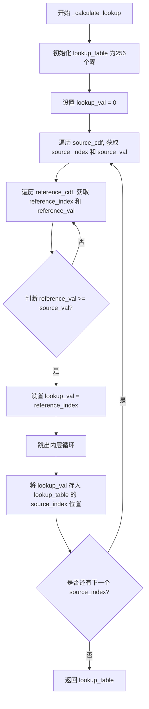

#### 带注释源码

```python
def _calculate_lookup(self, source_cdf, reference_cdf):
    """
    计算直方图匹配的查找表
    
    通过比较源图像和参考图像的累积分布函数(CDF)，
    为每个源像素值找到最接近的参考像素值
    
    Args:
        source_cdf: 源图像的累积分布函数数组
        reference_cdf: 参考图像的累积分布函数数组
    
    Returns:
        lookup_table: 256大小的查找表，用于像素值映射
    """
    # 初始化一个256大小的查找表，用于存储映射关系
    lookup_table = np.zeros(256)
    # 当前映射值，初始化为0
    lookup_val = 0
    
    # 遍历源图像CDF的每个灰度级
    for source_index, source_val in enumerate(source_cdf):
        # 对于每个源灰度级，在参考CDF中查找第一个 >= 源CDF值的索引
        for reference_index, reference_val in enumerate(reference_cdf):
            # 找到第一个参考CDF值 >= 源CDF值的位置
            if reference_val >= source_val:
                # 更新映射值为该参考索引
                lookup_val = reference_index
                # 找到后跳出内层循环
                break
        
        # 将计算出的映射值存入查找表对应位置
        lookup_table[source_index] = lookup_val
    
    # 返回完整的查找表
    return lookup_table
```


### `InpaintModel._match_histograms`

该函数实现了基于直方图匹配的图像色彩转换功能，通过计算源图像和参考图像在非掩码区域的直方图分布，构建查找表并将源图像的色彩分布调整为与参考图像相似。

参数：

- `source`：`numpy.ndarray`，源图像数组，形状为 [H, W, C]，RGB 格式
- `reference`：`numpy.ndarray`，参考图像数组，形状为 [H, W, C]，用于获取目标色彩分布
- `mask`：`numpy.ndarray`，二值掩码数组，形状为 [H, W]，值为 0 的区域为需要处理的区域

返回值：`numpy.ndarray`，转换后的图像数组，形状与 source 相同，BGR 格式

#### 流程图

```mermaid
flowchart TD
    A[开始 _match_histograms] --> B[初始化空列表 transformed_channels]
    B --> C{遍历所有通道<br/>channel in range(source.shape[-1])}
    C -->|当前通道| D[提取源图像当前通道数据<br/>source_channel = source[:,:,channel]]
    D --> E[提取参考图像当前通道数据<br/>reference_channel = reference[:,:,channel]]
    E --> F[根据mask==0计算源通道直方图<br/>np.histogram]
    F --> G[根据mask==0计算参考通道直方图<br/>np.histogram]
    G --> H[计算源通道CDF<br/>_calculate_cdf]
    H --> I[计算参考通道CDF<br/>_calculate_cdf]
    I --> J[构建查找表<br/>_calculate_lookup]
    J --> K[使用LUT转换源通道<br/>imk.lut]
    K --> L[将转换后的通道添加到列表]
    L --> C
    C -->|所有通道遍历完成| M[合并所有通道<br/>imk.merge_channels]
    M --> N[转换尺度为绝对值<br/>imk.convert_scale_abs]
    N --> O[返回结果]
```

#### 带注释源码

```python
def _match_histograms(self, source, reference, mask):
    """对源图像进行直方图匹配，使其色彩分布接近参考图像
    
    该方法主要用于图像修复后的色彩校正，通过匹配非掩码区域的
    直方图分布，使修复区域与原图保持视觉一致性。
    
    Args:
        source: 源图像数组 [H, W, C] RGB格式
        reference: 参考图像数组 [H, W, C] RGB格式  
        mask: 二值掩码数组 [H, W]，0表示需要处理的区域
    
    Returns:
        直方图匹配后的图像数组 [H, W, C] BGR格式
    """
    # 用于存储转换后各通道结果的列表
    transformed_channels = []
    
    # 遍历图像的每个通道（通常是RGB三个通道）
    for channel in range(source.shape[-1]):
        # 提取当前通道的源图像数据
        source_channel = source[:, :, channel]
        # 提取当前通道的参考图像数据
        reference_channel = reference[:, :, channel]

        # 仅对非掩码区域（mask == 0）计算直方图
        # 这样可以避免掩码区域对直方图统计的干扰
        source_histogram, _ = np.histogram(source_channel[mask == 0], 256, [0, 256])
        reference_histogram, _ = np.histogram(
            reference_channel[mask == 0], 256, [0, 256]
        )

        # 计算源图像和参考图像的累积分布函数（CDF）
        # CDF用于建立像素值与累积概率之间的映射关系
        source_cdf = self._calculate_cdf(source_histogram)
        reference_cdf = self._calculate_cdf(reference_histogram)

        # 根据源CDF和参考CDF构建查找表（Lookup Table）
        # 查找表将源图像的像素值映射到目标像素值
        lookup = self._calculate_lookup(source_cdf, reference_cdf)

        # 使用查找表对源通道进行变换
        # imk.lut 是基于查找表的像素变换函数
        transformed_channels.append(imk.lut(source_channel, lookup))

    # 将分离的通道重新合并为多通道图像
    result = imk.merge_channels(transformed_channels)
    # 转换为绝对值格式（确保像素值在有效范围内）
    result = imk.convert_scale_abs(result)

    return result
```


### `InpaintModel._apply_cropper`

该方法根据配置中的裁剪器参数（x, y, width, height）对输入的图像和掩码进行区域裁剪，并在裁剪前对边界进行有效性检查，确保裁剪区域不超出图像范围。

参数：

- `self`：`InpaintModel`，InpaintModel 类实例本身
- `image`：`numpy.ndarray`，原始输入图像，形状为 [H, W, C] 的 RGB 格式
- `mask`：`numpy.ndarray`，输入掩码，形状为 [H, W]
- `config`：`Config`，配置对象，包含裁剪器的坐标和尺寸信息（croper_x, croper_y, croper_width, croper_height）

返回值：`Tuple[numpy.ndarray, numpy.ndarray, Tuple[int, int, int, int]]`，返回一个元组，包含裁剪后的图像、裁剪后的掩码、以及裁剪区域的边界坐标 (left, top, right, bottom)

#### 流程图

```mermaid
flowchart TD
    A[开始 _apply_cropper] --> B[获取图像尺寸 img_h, img_w]
    B --> C[从 config 提取裁剪参数 l, t, w, h]
    C --> D[计算右边界 r = l + w<br/>计算下边界 b = t + h]
    D --> E{边界有效性检查}
    E --> F1[l = max l, 0]
    E --> F2[r = min r, img_w]
    E --> F3[t = max t, 0]
    E --> F4[b = min b, img_h]
    F1 --> G[裁剪图像: crop_img = image[t:b, l:r, :]]
    F2 --> G
    F3 --> G
    F4 --> G
    G --> H[裁剪掩码: crop_mask = mask[t:b, l:r]]
    H --> I[返回 crop_img, crop_mask, (l, t, r, b)]
```

#### 带注释源码

```python
def _apply_cropper(self, image, mask, config: Config):
    """
    根据配置参数对图像和掩码进行裁剪

    Args:
        image: 输入图像 [H, W, C] RGB 格式
        mask: 输入掩码 [H, W]
        config: 配置对象，包含裁剪器参数

    Returns:
        裁剪后的图像、掩码和边界坐标元组
    """
    # 获取输入图像的高度和宽度
    img_h, img_w = image.shape[:2]
    
    # 从配置中提取裁剪器的位置和尺寸参数
    l, t, w, h = (
        config.croper_x,       # 裁剪区域左边界 x 坐标
        config.croper_y,       # 裁剪区域上边界 y 坐标
        config.croper_width,   # 裁剪区域宽度
        config.croper_height,  # 裁剪区域高度
    )
    
    # 计算右边界和下边界坐标
    r = l + w
    b = t + h

    # 边界有效性检查：确保裁剪区域不超出图像范围
    # 如果裁剪坐标为负数，则置为 0
    l = max(l, 0)
    # 如果右边界超出图像宽度，则限制为图像宽度
    r = min(r, img_w)
    # 如果上边界坐标为负数，则置为 0
    t = max(t, 0)
    # 如果下边界超出图像高度，则限制为图像高度
    b = min(b, img_h)

    # 使用 numpy 切片从原始图像中裁剪出指定区域
    # 格式: image[top:bottom, left:right, :]
    crop_img = image[t:b, l:r, :]
    # 同样方式裁剪掩码
    crop_mask = mask[t:b, l:r]
    
    # 返回裁剪后的图像、掩码以及实际裁剪的边界坐标
    return crop_img, crop_mask, (l, t, r, b)
```


### `InpaintModel._run_box`

该方法是图像修复模型中处理特定区域块的核心实现。它接收原始图像、掩码、目标框坐标及配置，首先利用 `_crop_box` 提取目标区域（并扩展边缘以获取更多上下文），随后调用 `_pad_forward` 执行填充和模型前向推理，最后将修复后的局部图像块及其在原图中的坐标返回，供上层方法将结果拼贴回原图。

参数：

-  `self`：`InpaintModel` 实例，隐式参数，表示模型本身。
-  `image`：`numpy.ndarray`，输入的 RGB 图像，形状为 `[H, W, C]`。
-  `mask`：`numpy.ndarray`，输入的掩码，形状为 `[H, W, 1]`，其中 255 表示需修复区域。
-  `box`：`list` 或 `tuple`，目标框坐标，格式为 `[left, top, right, bottom]`。
-  `config`：`Config`，配置对象，包含修复策略、边距、填充参数等。

返回值：`Tuple[numpy.ndarray, list]`，返回一个元组。
-  第一个元素为修复后的图像块（BGR 格式），类型 `numpy.ndarray`。
-  第二个元素为该图像块在原始图像中的坐标列表 `[l, t, r, b]`，类型 `list`。

#### 流程图

```mermaid
flowchart TD
    A[Start _run_box] --> B[调用 _crop_box]
    B --> C[输入: image, mask, box, config]
    C --> D{执行裁剪与边缘扩展}
    D --> E[输出: crop_img, crop_mask, [l, t, r, b]]
    E --> F[调用 _pad_forward]
    F --> G[输入: crop_img, crop_mask, config]
    G --> H{执行填充与模型推理}
    H --> I[输出: inpaint_result]
    I --> J[End: 返回 (inpaint_result, [l, t, r, b])]
```

#### 带注释源码

```python
def _run_box(self, image, mask, box, config: Config):
    """
    在指定的盒子区域内运行修复模型。

    Args:
        image: [H, W, C] RGB 原始图像
        mask: [H, W, 1] 掩码图像
        box: [left,top,right,bottom] 目标修复区域坐标
        config: Config 配置对象

    Returns:
        BGR IMAGE, (l, r, r, b) 修复后的图像块和坐标
    """
    # 1. 调用 _crop_box 方法，根据 box 坐标裁剪出图像块。
    #    注意：_crop_box 内部会处理边缘情况（如超出图像边界），并扩展边距以获得更好的上下文。
    #    返回值包括：裁剪后的图像、裁剪后的掩码、以及最终使用的坐标 [l, t, r, b]。
    crop_img, crop_mask, [l, t, r, b] = self._crop_box(image, mask, box, config)

    # 2. 调用 _pad_forward 方法。
    #    该方法会将图像填充至模型要求的尺寸（通常为 8 的倍数），执行 forward，
    #    然后裁剪回原始输入尺寸，并利用掩码将修复结果与原始像素混合。
    #    返回值即为处理好的局部修复结果 BGR Image。
    return self._pad_forward(crop_img, crop_mask, config), [l, t, r, b]
```


### DiffusionInpaintModel.__call__

该方法是 `DiffusionInpaintModel` 类的可调用接口（重写了父类的 `__call__` 方法），用于执行基于扩散模型的图像修复（inpainting）任务。它根据配置选择是否使用裁剪器（croper），并通过缩放后处理的方式调用底层修复逻辑，最终返回修复后的 BGR 格式图像。

参数：

- `self`：`DiffusionInpaintModel` 实例，隐式参数，表示模型对象本身
- `image`：`numpy.ndarray`，形状为 [H, W, C] 的 RGB 格式图像，未经过归一化处理
- `mask`：`numpy.ndarray`，形状为 [H, W] 的掩码图像，255 表示需要修复的区域
- `config`：`Config` 对象，包含模型配置信息（如是否使用裁剪器、扩散模型缩放比例等）

返回值：`numpy.ndarray`，返回修复后的 BGR 格式图像

#### 流程图

```mermaid
flowchart TD
    A[开始 __call__] --> B{获取 backend 属性}
    B --> C{backend == 'onnx'}
    C -->|是| D[使用 nullcontext]
    C -->|否| E{尝试导入 torch}
    E -->|成功| F[使用 torch.no_grad]
    E -->|失败| G[抛出 RuntimeError]
    D --> H[进入 no_grad_ctx 上下文]
    F --> H
    H --> I{config.use_croper 为真?}
    I -->|是| J[调用 _apply_cropper 裁剪图像]
    I -->|否| K[直接使用原图]
    J --> L[调用 _scaled_pad_forward 处理裁剪区域]
    K --> L
    L --> M[将修复结果填回原图对应位置]
    M --> N[返回修复后的图像]
    K --> O[调用 _scaled_pad_forward 处理全图]
    O --> N
```

#### 带注释源码

```python
def __call__(self, image, mask, config: Config):
    """
    images: [H, W, C] RGB, not normalized
    masks: [H, W]
    return: BGR IMAGE
    """
    # 获取后端类型，默认为 'torch'
    backend = getattr(self, 'backend', 'torch')
    
    # 根据后端类型选择是否启用梯度计算上下文
    if backend == 'onnx':
        # ONNX 后端不需要 no_grad 上下文
        no_grad_ctx = nullcontext()
    else:
        try:
            import torch  # noqa
            # PyTorch 后端使用 no_grad 上下文以节省显存
            no_grad_ctx = torch.no_grad()
        except ImportError as e:
            # 如果选择了 torch 后端但未安装 torch，则抛出异常
            raise RuntimeError("Torch backend selected but torch is not installed. Install torch or use backend='onnx'.") from e
    
    # 在 no_grad 上下文中执行推理
    with no_grad_ctx:
        # 根据配置判断是否使用裁剪器
        if config.use_croper:
            # 使用裁剪器：从原图中裁剪出指定区域
            crop_img, crop_mask, (l, t, r, b) = self._apply_cropper(image, mask, config)
            
            # 对裁剪区域进行缩放后修复处理
            crop_image = self._scaled_pad_forward(crop_img, crop_mask, config)
            
            # 创建结果图像并将修复结果填回原图对应位置
            inpaint_result = image
            inpaint_result[t:b, l:r, :] = crop_image
        else:
            # 不使用裁剪器：直接对全图进行缩放后修复处理
            inpaint_result = self._scaled_pad_forward(image, mask, config)

        # 返回修复后的图像
        return inpaint_result
```


### `DiffusionInpaintModel._scaled_pad_forward`

该方法实现了基于Stable Diffusion的图像修复的缩放前处理逻辑，通过将输入图像和掩码缩放到由`sd_scale`参数指定的目标尺寸，执行修复操作后再将结果缩放回原始尺寸，并保留原始未掩码区域的像素值。

参数：

- `self`：`DiffusionInpaintModel` 实例本身，隐式传递
- `image`：`np.ndarray`，输入的RGB图像，形状为 [H, W, C]，未归一化
- `mask`：`np.ndarray`，输入的掩码，形状为 [H, W]，255表示需要修复的区域
- `config`：`Config`，配置对象，包含 `sd_scale` 等参数

返回值：`np.ndarray`，返回修复后的BGR图像，形状为 [origin_height, origin_width, C]

#### 流程图

```mermaid
flowchart TD
    A[开始 _scaled_pad_forward] --> B[计算目标边长<br/>longer_side_length = config.sd_scale * max<br/>image.shape[:2]]
    B --> C[保存原始图像尺寸<br/>origin_size = image.shape[:2]]
    C --> D[调用 resize_max_size 缩放图像<br/>downsize_image = resize_max_size<br/>image, size_limit=longer_side_length]
    D --> E[调用 resize_max_size 缩放掩码<br/>downsize_mask = resize_max_size<br/>mask, size_limit=longer_side_length]
    E --> F{config.sd_scale != 1?}
    F -->|是 G[记录日志<br/>Resize image to do sd inpainting]
    F -->|否 H[跳过日志]
    G --> I[调用 _pad_forward 执行修复<br/>inpaint_result = self._pad_forward<br/>downsize_image, downsize_mask, config]
    H --> I
    I --> J[将结果缩放回原始尺寸<br/>imk.resize inpaint_result to origin_size]
    J --> K[获取原始像素索引<br/>original_pixel_indices = mask < 127]
    K --> L[仅保留掩码区域的修复结果<br/>inpaint_result[original_pixel_indices] =<br/>image[original_pixel_indices]]
    L --> M[返回修复结果]
```

#### 带注释源码

```python
def _scaled_pad_forward(self, image, mask, config: Config):
    """
    基于sd_scale对图像进行缩放修复的核心方法
    
    Args:
        image: 输入RGB图像 [H, W, C]，未归一化
        mask: 输入掩码 [H, W]，255表示需要修复的区域
        config: 配置对象，包含sd_scale等参数
        
    Returns:
        修复后的BGR图像
    """
    # 根据sd_scale计算目标长边长度，用于控制修复时的图像分辨率
    # 例如sd_scale=0.5时，会将图像缩小到原来的一半进行修复
    longer_side_length = int(config.sd_scale * max(image.shape[:2]))
    
    # 保存原始图像尺寸，后续用于将修复结果缩放回原始尺寸
    origin_size = image.shape[:2]
    
    # 将图像和掩码缩放到目标尺寸（长边不超过longer_side_length）
    # 这是一个下采样过程，用于在较小的分辨率下执行SD修复以提高效率
    downsize_image = resize_max_size(image, size_limit=longer_side_length)
    downsize_mask = resize_max_size(mask, size_limit=longer_side_length)
    
    # 当sd_scale不等于1时，记录日志说明进行了图像缩放
    if config.sd_scale != 1:
        logger.info(
            f"Resize image to do sd inpainting: {image.shape} -> {downsize_image.shape}"
        )
    
    # 调用父类的_pad_forward方法执行实际的图像修复
    # 这里会进行padding、模型推理、裁剪等操作
    inpaint_result = self._pad_forward(downsize_image, downsize_mask, config)
    
    # 将修复结果从缩放后的尺寸缩放回原始图像尺寸
    # 使用双三次插值进行高质量的图像放大
    inpaint_result = imk.resize(
        inpaint_result,
        (origin_size[1], origin_size[0]),
        mode=Image.Resampling.BICUBIC,
    )
    
    # 获取原始掩码中需要修复的像素位置（mask < 127表示非掩码区域）
    # 这样可以保留原始未损坏的像素，只替换需要修复的区域
    original_pixel_indices = mask < 127
    inpaint_result[original_pixel_indices] = image[
        original_pixel_indices
    ]
    
    # 返回最终修复结果
    return inpaint_result
```

## 关键组件


### InpaintModel (基类)

核心的图像修复模型抽象基类，定义了模型接口、forward方法、高清策略处理（CROP/RESIZE）、图像padding和后处理流程。

### DiffusionInpaintModel (扩散修复模型)

继承自InpaintModel的扩散模型实现，增加了缩放padding forward、裁剪器应用和支持croper配置的功能。

### 高清策略 (HDStrategy)

支持两种高清图像修复策略：CROP策略通过mask区域裁剪分别处理，RESIZE策略通过图像缩放后处理再还原。

### 张量索引与惰性加载

通过_pad_forward方法实现图像padding至模数尺寸，使用切片[0:origin_height, 0:origin_width, :]进行裁剪还原，实现惰性处理。

### 多后端支持 (Torch/ONNX)

通过backend属性动态切换推理后端，torch后端使用torch.no_grad()，onnx后端使用nullcontext()，实现后端无关的接口设计。

### 直方图匹配 (_match_histograms)

基于CDF和查找表的直方图匹配算法，对修复区域进行颜色分布对齐，包含_calculate_cdf和_calculate_lookup辅助方法。

### 图像Padding工具

pad_img_to_modulo将图像padding至指定模数，resize_max_size限制图像最大尺寸，_crop_box实现边界安全的区域裁剪。

### 配置管理 (Config)

通过Config类封装修复配置，包含hd_strategy、hd_strategy_crop_trigger_size、sd_scale等参数，用于控制不同修复策略。


## 问题及建议


### 已知问题

-   **代码重复**：`InpaintModel.__call__` 和 `DiffusionInpaintModel.__call__` 中存在大量重复的 backend 检查和 `no_grad` 上下文管理代码，可提取为基类方法或工具函数。
-   **魔法数字散落**：`mask < 127` 在多处作为硬编码阈值使用（判断是否为原像素），应提取为类级别常量（如 `ORIGINAL_PIXEL_THRESHOLD = 127`）。
-   **未使用的方法**：`InpaintModel` 中定义了 `_match_histograms`、`_calculate_cdf`、`_calculate_lookup` 等直方图匹配相关方法，但从未被调用，可能是遗留代码。
-   **图像格式注释与实现不符**：多处注释声明返回 "BGR IMAGE"，但代码实际处理和返回的是 RGB 格式图像，易造成误解。
-   **类型注解不完整**：部分方法如 `_crop_box`、`_run_box` 缺少返回类型注解；`forward_post_process` 方法签名与实际使用不一致。
-   **性能隐患**：`_calculate_lookup` 方法使用双重 for 循环（O(n²) 复杂度），可使用 NumPy 的 `searchsorted` 向量化优化。
-   **日志级别不一致**：部分关键操作（如 cropper 执行）缺少日志记录，不利于调试和问题追踪。

### 优化建议

-   提取公共的 backend 检查和 context manager 逻辑到基类或独立工具函数中，消除重复代码。
-   将 `127`、策略触发阈值等魔法数字定义为模块级或类级常量，并添加文档说明其含义。
-   若 `_match_histograms` 功能无需保留，建议删除以减少代码复杂度；否则补充单元测试并集成到实际业务流程中。
-   统一代码中的图像格式注释，确保与实现一致；或添加断言验证输入输出格式。
-   完善所有方法的类型注解，特别是返回类型，提高代码可读性和 IDE 支持。
-   重写 `_calculate_lookup` 方法，利用 NumPy 向量化操作替代嵌套循环，提升计算效率。
-   在关键分支路径（如 cropper 执行、不同 HD 策略切换）添加统一的日志记录，便于生产环境问题排查。

## 其它


### 设计目标与约束

1. **多后端支持**：代码设计支持Torch和ONNX两种推理后端，通过`backend`属性动态切换，满足不同部署环境的需求。
2. **高分辨率图像处理**：通过HDStrategy枚举实现CROP和RESIZE两种策略，处理超大分辨率图像时避免显存溢出。
3. **模块化设计**：抽象基类InpaintModel定义了统一的接口规范，子类DiffusionInpaintModel实现具体的扩散模型推理逻辑。
4. **图像尺寸约束**：支持pad_to_square和pad_mod参数，确保输入图像尺寸符合模型的步长要求（默认为8）。
5. **颜色空间约定**：输入图像为RGB格式[H, W, C]，返回图像为BGR格式[H, W, C]。

### 错误处理与异常设计

1. **Torch后端缺失处理**：当backend设为'torch'但torch未安装时，抛出RuntimeError并提示安装torch或使用onnx后端。
2. **边界检查**：在crop_box和_apply_cropper方法中对坐标进行边界检查，确保裁剪区域不超出图像范围。
3. **空值保护**：在histogram匹配中，仅对mask为0的区域计算直方图，避免全mask区域导致的问题。
4. **Resize尺寸限制**：resize_max_size函数确保图像尺寸不超过指定限制，防止内存溢出。
5. **日志记录**：使用logging模块记录关键决策点（如使用的hd_strategy、图像尺寸变化等），便于问题排查。

### 数据流与状态机

1. **主处理流程**：
   - 输入验证 → 后端上下文创建 → HD策略选择 → 图像修复 → 后处理 → 结果返回
   
2. **HD策略状态机**：
   - **CROP策略**：检测到图像大于触发阈值时，从mask生成boxes，对每个box执行crop→pad_forward→paste流程
   - **RESIZE策略**：检测到图像大于限制时，下采样→pad_forward→上采样→原始像素恢复
   - **默认策略**：图像尺寸小于阈值时，直接执行_pad_forward

3. **DiffusionInpaintModel特殊流程**：
   - 支持croper配置：应用cropper区域→scaled_pad_forward→结果paste
   - 支持sd_scale缩放：根据缩放因子调整输入尺寸后再进行推理

4. **后处理流程**：
   - _pad_forward返回结果后，执行forward_post_process
   - 应用mask融合：result * (mask/255) + image * (1 - mask/255)
   - 裁剪回原始尺寸

### 外部依赖与接口契约

1. **核心依赖**：
   - `numpy`：数值计算、图像数组操作
   - `PIL (Pillow)`：图像Resize操作
   - `imkit`：图像处理工具（resize、lut、convert_scale_abs、merge_channels）
   - `torch`（可选）：深度学习推理后端

2. **内部模块依赖**：
   - `..utils.inpainting.boxes_from_mask`：从mask生成检测框
   - `..utils.inpainting.resize_max_size`：最大尺寸限制的resize
   - `..utils.inpainting.pad_img_to_modulo`：图像填充到指定模数
   - `.schema.Config`：配置数据类
   - `.schema.HDStrategy`：HD策略枚举

3. **输入接口契约**：
   - image: numpy数组 [H, W, C]，RGB格式，未归一化
   - mask: numpy数组 [H, W]，255表示需修复区域，0表示原图保留区域
   - config: Config对象，包含hd_strategy、hd_strategy_crop_trigger_size等配置

4. **输出接口契约**：
   - 返回numpy数组 [H, W, C]，BGR格式

### 性能考虑

1. **多次Resize开销**：CROP和RESIZE策略都会进行多次resize操作，大图像场景下性能开销明显，可考虑缓存中间结果。
2. **Pad冗余计算**：_pad_forward会对图像四周进行填充，对于大图像可能造成额外的计算浪费。
3. **Histograms匹配复杂度**：_match_histograms中使用双重循环构建lookup table，时间复杂度O(256*256)，可优化为二分查找。
4. **Torch no_grad上下文**：已正确使用torch.no_grad()减少梯度计算开销。
5. **Mask阈值硬编码**：original_pixel_indices = mask < 127 硬编码阈值，建议提取为配置参数。

### 兼容性考虑

1. **Python版本**：依赖typing.Optional，需Python 3.5+；abc.abstractmethod需要Python 3.0+。
2. **后端兼容性**：通过backend属性抽象，ONNX后端可兼容无torch环境。
3. **NumPy版本**：histogram函数兼容NumPy 1.x版本。
4. **PIL版本**：Image.Resampling.BICUBIC在Pillow 9.1.0+推荐使用，早期版本使用Image.BICUBIC。
5. **设备兼容性**：device参数支持CPU/GPU，但switch_mps_device函数被注释，可能存在MPS设备兼容性问题。

### 配置说明

1. **Config对象属性**：
   - hd_strategy: HDStrategy枚举（CROP/RESIZE）
   - hd_strategy_crop_trigger_size: CROP策略触发阈值
   - hd_strategy_resize_limit: RESIZE策略尺寸限制
   - hd_strategy_crop_margin: CROP策略边距
   - use_croper: 是否启用croper
   - croper_x/y/width/height: croper区域坐标
   - sd_scale: Diffusion模型的缩放因子

2. **InpaintModel类属性**：
   - pad_mod: 填充模数（默认8）
   - pad_to_square: 是否填充为正方形
   - min_size: 最小尺寸限制

### 使用示例

```python
# 基本使用
model = DiffusionInpaintModel(device='cuda')
config = Config(
    hd_strategy=HDStrategy.RESIZE,
    hd_strategy_resize_limit=1024
)
result = model(image, mask, config)

# 使用ONNX后端
model = DiffusionInpaintModel(device='cpu', backend='onnx')
result = model(image, mask, config)

# 使用CROP策略
config = Config(
    hd_strategy=HDStrategy.CROP,
    hd_strategy_crop_trigger_size=512,
    hd_strategy_crop_margin=64
)
```

### 安全性考虑

1. **依赖安全**：torch模块动态导入避免强制依赖，安装时可根据部署环境选择是否安装torch。
2. **数值安全**：直方图计算时使用mask==0过滤，避免对全零区域计算导致除零错误。
3. **索引安全**：所有数组切片操作前都进行边界检查，防止索引越界。
4. **类型安全**：使用类型提示(Optional[int])和abc抽象方法确保接口一致性。

    