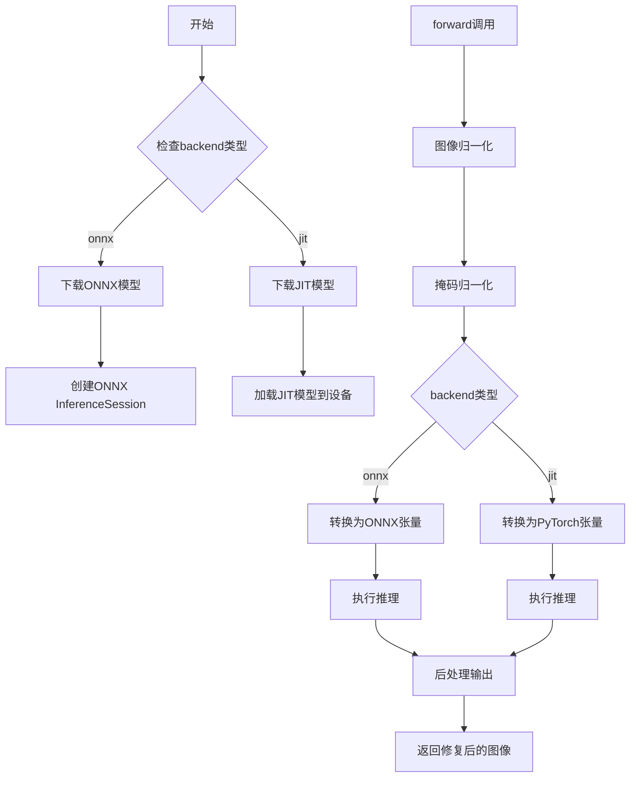
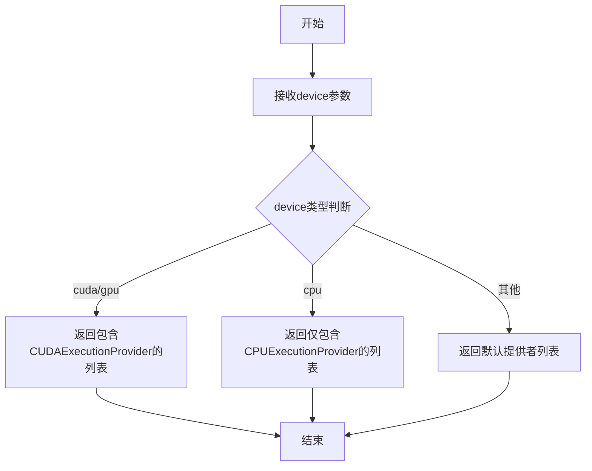
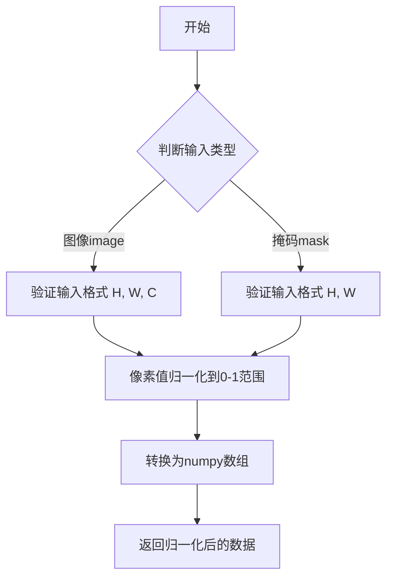
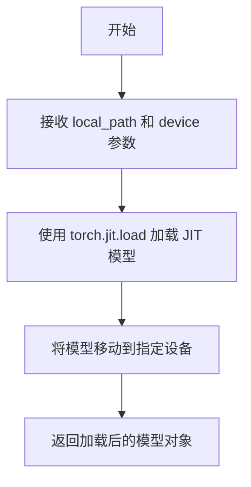
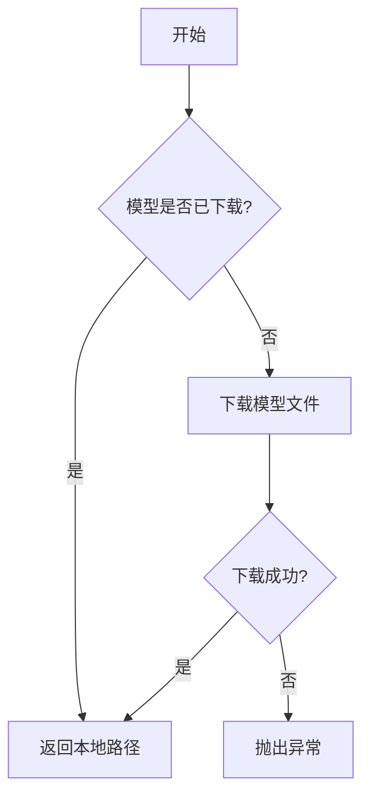
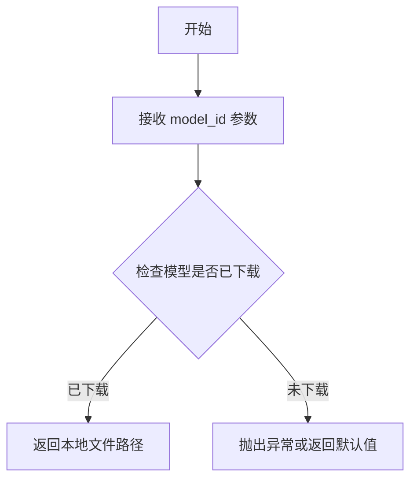
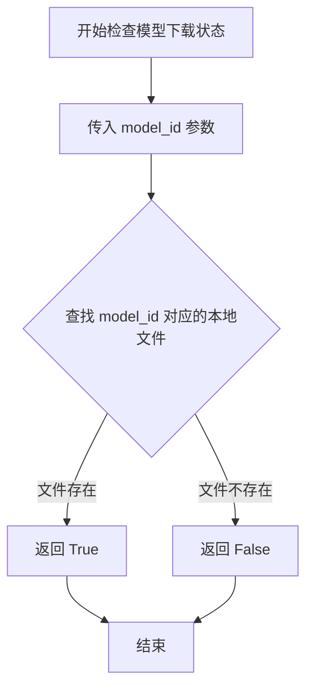
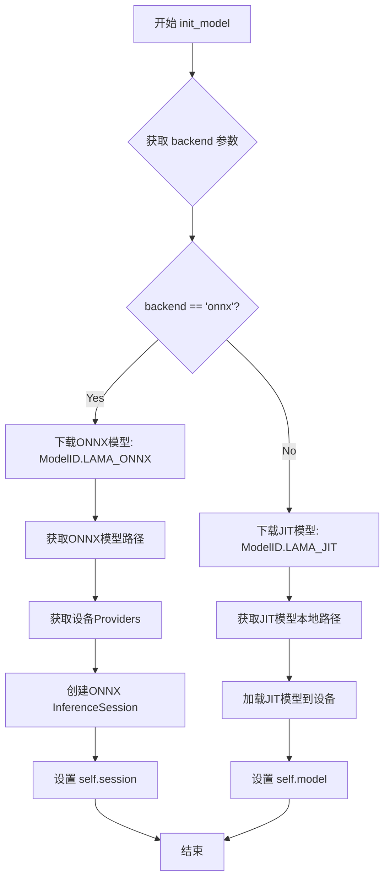
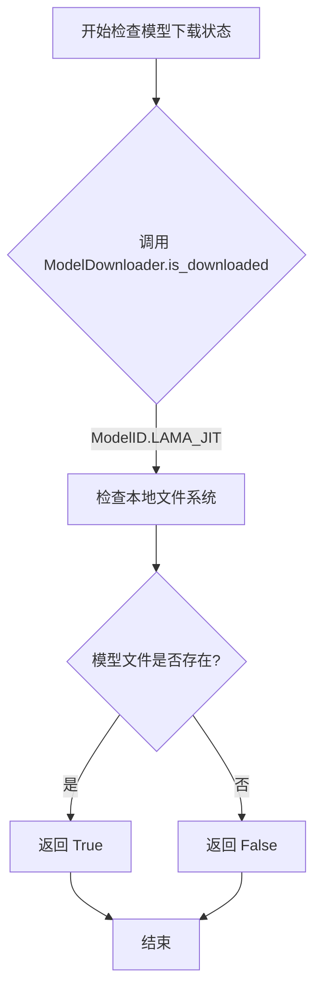
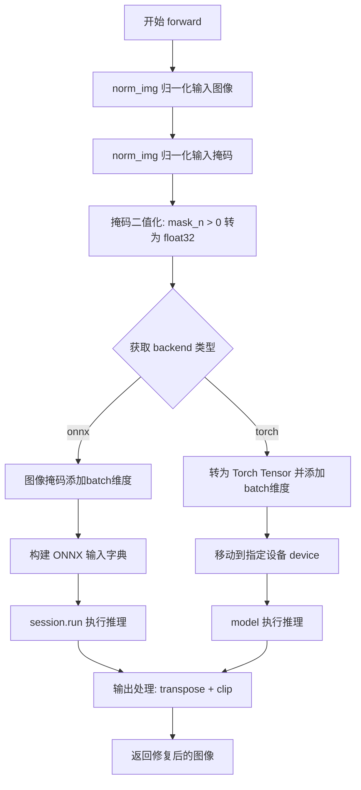

# `comic-translate\modules\inpainting\lama.py` 详细设计文档

该代码实现了LaMa图像修复（Inpainting）模型，支持ONNX和PyTorch JIT两种推理后端，能够对输入图像进行指定区域的智能填充和修复。

## 整体流程



## 类结构

```
InpaintModel (抽象基类)
└── LaMa (图像修复模型实现类)
```

## 全局变量及字段


### `np`
    
NumPy库别名，用于数值计算和数组操作

类型：`module`
    


### `ort`
    
ONNXRuntime库别名，用于ONNX模型推理

类型：`module`
    


### `get_providers`
    
获取可用计算提供者（CPU/GPU）的函数

类型：`function`
    


### `norm_img`
    
图像归一化函数，将图像像素值转换到0-1范围

类型：`function`
    


### `load_jit_model`
    
加载JIT编译的PyTorch模型函数

类型：`function`
    


### `ModelDownloader`
    
模型下载器类，负责模型文件的下载和管理

类型：`class`
    


### `ModelID`
    
模型标识枚举类，定义不同模型的唯一标识

类型：`class`
    


### `InpaintModel`
    
图像修复模型基类，定义模型的标准接口和方法

类型：`class`
    


### `Config`
    
配置数据类，用于存储模型推理的配置参数

类型：`class`
    


### `LaMa.name`
    
模型名称标识

类型：`str`
    


### `LaMa.pad_mod`
    
填充模数，用于图像预处理时的padding对齐

类型：`int`
    


### `LaMa.backend`
    
推理后端类型，支持'onnx'或'torch'

类型：`str`
    


### `LaMa.session`
    
ONNX推理会话对象

类型：`onnxruntime.InferenceSession`
    


### `LaMa.model`
    
PyTorch JIT编译的模型对象

类型：`torch.jit.RecursiveScriptModule`
    


### `LaMa.device`
    
计算设备标识，如'cpu'或'cuda'

类型：`str`
    
    

## 全局函数及方法


### `get_providers`

该函数用于获取ONNX Runtime可用的计算设备提供者列表，根据传入的设备参数返回对应的ONNX执行提供者（如CUDA、CPU等），以支持在不同的硬件平台上运行ONNX模型推理。

参数：

- `device`：`str` 或 `Device`，目标设备类型，用于确定返回的ONNX执行提供者（例如"cuda"返回CUDA提供者，"cpu"返回CPU提供者）

返回值：`List[str]`，返回ONNX Runtime可用的执行提供者列表

#### 流程图



#### 带注释源码

```
# 该函数源码位于 ..utils.device 模块中
# 以下是基于代码调用上下文的推断实现

def get_providers(device):
    """
    获取ONNX Runtime可用的计算设备提供者
    
    参数:
        device: 目标设备，字符串类型（如"cuda", "cpu"）或Device对象
    
    返回:
        providers: 可用的ONNX执行提供者列表
    """
    # 尝试获取CUDA提供者
    available_providers = ort.get_available_providers()
    
    # 根据device参数确定返回的提供者
    if str(device) in ['cuda', 'gpu'] and 'CUDAExecutionProvider' in available_providers:
        return ['CUDAExecutionProvider', 'CPUExecutionProvider']
    else:
        # 默认返回CPU提供者
        return ['CPUExecutionProvider']
```

> **注意**：由于原始代码中仅导入了`get_providers`函数并在其处调用，未提供该函数的具体实现。以上源码为基于`ort.InferenceSession`调用方式和ONNX Runtime API的合理推断。实际实现可能略有差异，建议查看`..utils.device`模块获取完整源码。


# norm_img 函数分析

## 注意事项

在提供的代码中，`norm_img` 函数并未直接定义，而是从 `..utils.inpainting` 模块导入。以下分析基于代码中的使用方式进行推断。

---

### `norm_img`

图像归一化预处理函数，用于将图像或掩码数据标准化为模型输入所需的格式。

参数：

-  `image`：`numpy.ndarray`，输入图像，格式为 `[H, W, C]` RGB 格式
-  `mask`：`numpy.ndarray`，输入掩码，格式为 `[H, W]`

返回值：`numpy.ndarray`，归一化后的图像或掩码数据

#### 流程图



#### 带注释源码

```python
# 从 ..utils.inpainting 模块导入的函数
# 实际定义未在当前代码文件中显示

# 使用示例（在 LaMa.forward 方法中）:
image_n = norm_img(image)  # 对RGB图像进行归一化
mask_n = norm_img(mask)    # 对掩码进行归一化

# 后续处理:
# 归一化后的掩码被转换为float32类型
mask_n = (mask_n > 0).astype('float32')
```

---

## 补充说明

由于 `norm_img` 函数的实际定义不在当前代码文件中，无法提供完整的带注释源码。如需完整信息，请提供 `..utils.inpainting` 模块中 `norm_img` 函数的实现代码。

根据代码中的使用方式推断，该函数主要完成以下任务：
1. 将输入图像/掩码转换为 `numpy` 数组格式
2. 将像素值归一化到 `[0, 1]` 范围
3. 确保数据格式符合模型输入要求


```json
### `load_jit_model`

加载 PyTorch JIT 编译的模型文件，并将其移动到指定设备上。

参数：

- `local_path`：`str`，模型文件的本地路径
- `device`：设备标识符（字符串或设备对象），指定模型加载到的目标设备

返回值：`torch.nn.Module` 或等效的 JIT 模型对象，返回加载并移动到指定设备的 PyTorch 模型

#### 流程图



#### 带注释源码

```python
def load_jit_model(local_path, device):
    """
    加载 PyTorch JIT 编译的模型
    
    参数:
        local_path: JIT 模型文件的路径
        device: 目标设备（如 'cuda' 或 'cpu'）
    
    返回:
        加载并移动到指定设备的 JIT 模型
    """
    import torch
    # 加载 JIT 编译的模型文件
    model = torch.jit.load(local_path)
    # 将模型移动到指定设备
    model = model.to(device)
    return model
```

> **注意**：该函数定义在 `..utils.inpainting` 模块中，当前代码段仅展示了其被导入和调用的方式。具体实现细节需查看 `src/utils/inpainting.py` 源文件。


### `ModelDownloader.get`

该方法用于下载指定的模型文件，如果模型已经存在则跳过下载，确保模型可用于后续的推理操作。

参数：

- `model_id`：`ModelID`，模型标识符，指定需要下载的模型类型（如 LAMA_ONNX 或 LAMA_JIT）

返回值：`str`，返回下载的模型文件本地路径

#### 流程图



#### 带注释源码

```python
# 从 utils.download 模块导入 ModelDownloader 类和 ModelID 枚举
from ..utils.download import ModelDownloader, ModelID

# 在 LaMa 类的 init_model 方法中调用 ModelDownloader.get
# 用于下载 ONNX 格式的 LaMa 模型
ModelDownloader.get(ModelID.LAMA_ONNX)

# 用于下载 JIT 格式的 LaMa 模型
ModelDownloader.get(ModelID.LAMA_JIT)

# 相关方法：
# - ModelDownloader.primary_path(ModelID.LAMA_ONNX): 获取模型文件的本地存储路径
# - ModelDownloader.is_downloaded(ModelID.LAMA_JIT): 检查模型是否已下载
```


### `ModelDownloader.primary_path`

获取指定模型ID对应的本地模型文件的绝对路径。

参数：

- `model_id`：`ModelID`，模型的唯一标识符，用于指定要获取路径的模型（如 `ModelID.LAMA_ONNX` 或 `ModelID.LAMA_JIT`）

返回值：`str`，返回模型文件的本地存储路径（绝对路径）

#### 流程图



#### 带注释源码

```python
# 注：以下源码为基于代码上下文的推断实现
# 实际实现位于 ..utils.download 模块中

@staticmethod
def primary_path(model_id: ModelID) -> str:
    """
    获取模型本地存储路径
    
    参数:
        model_id: ModelID 枚举值，指定要查询的模型
        
    返回值:
        str: 模型文件的本地绝对路径
    """
    # 1. 根据 model_id 获取模型的配置信息
    # 2. 拼接完整的本地文件路径
    # 3. 返回路径字符串
    pass
```


### `ModelDownloader.is_downloaded`

该函数用于检查指定的模型是否已经下载到本地存储，返回布尔值表示下载状态。

参数：

- `model_id`：`ModelID`，模型标识符，用于指定要检查下载状态的模型

返回值：`bool`，如果模型已下载返回 `True`，否则返回 `False`

#### 流程图



#### 带注释源码

```
# 注意：由于提供的代码片段中未包含 ModelDownloader 类的完整实现
# 以下是基于代码调用方式的推断

# 在 LaMa 类中的调用方式：
@staticmethod
def is_downloaded() -> bool:
    return ModelDownloader.is_downloaded(ModelID.LAMA_JIT)

# 推断的函数签名和实现逻辑：
def is_downloaded(model_id: ModelID) -> bool:
    """
    检查指定模型是否已下载到本地
    
    参数:
        model_id: ModelID枚举值，指定要检查的模型
    
    返回:
        bool: 模型是否已下载
    """
    # 获取模型的主存储路径
    primary_path = ModelDownloader.primary_path(model_id)
    
    # 检查文件是否存在
    # 推断使用 os.path.exists() 或类似的文件检查机制
    return os.path.exists(primary_path)
```

> **注**：由于原始代码中未提供 `ModelDownloader` 类的完整实现（包括 `is_downloaded` 方法的源码），以上内容是基于代码中调用方式的合理推断。`ModelDownloader` 类似乎是项目内部的模型下载管理工具类，位于 `..utils.download` 模块中。


### `LaMa.init_model`

初始化LaMa图像修复模型，根据backend参数选择ONNX Runtime会话或JIT模型加载方式，并将模型配置到指定设备上。

参数：

- `device`：设备类型（如"cpu"、"cuda"），用于指定模型运行设备
- `**kwargs`：关键字参数，包含：
  - `backend`：`str`，后端类型，"onnx"使用ONNX Runtime，"jit"使用PyTorch JIT模型（默认为None）

返回值：`None`，该方法通过设置实例属性（`self.session`或`self.model`）完成模型初始化，无显式返回值。

#### 流程图



#### 带注释源码

```python
def init_model(self, device, **kwargs):
    """初始化LaMa模型，支持ONNX或JIT后端
    
    参数:
        device: 设备类型（如'cpu', 'cuda'）
        **kwargs: 关键字参数，包含backend配置
    """
    # 从kwargs中获取backend参数，默认为None
    self.backend = kwargs.get("backend")
    
    # 判断使用ONNX后端
    if self.backend == "onnx":
        # 下载ONNX模型（如果尚未下载）
        ModelDownloader.get(ModelID.LAMA_ONNX)
        # 获取ONNX模型的本地路径
        onnx_path = ModelDownloader.primary_path(ModelID.LAMA_ONNX)
        # 根据device获取ONNX Runtime的providers（如CUDAExecutionProvider或CPUExecutionProvider）
        providers = get_providers(device)
        # 创建ONNX推理会话并存储为实例属性
        self.session = ort.InferenceSession(onnx_path, providers=providers)
    else:
        # JIT后端：下载JIT模型
        ModelDownloader.get(ModelID.LAMA_JIT)
        # 获取JIT模型的本地路径
        local_path = ModelDownloader.primary_path(ModelID.LAMA_JIT)
        # 加载JIT模型到指定设备，并存储为实例属性
        self.model = load_jit_model(local_path, device)
```


### `LaMa.is_downloaded`

检查模型（LAMA_JIT）是否已下载的静态方法，通过调用 `ModelDownloader` 的 `is_downloaded` 方法来判断本地是否存在模型文件。

参数： 无

返回值：`bool`，返回 `True` 表示模型已下载并存在于本地；返回 `False` 表示模型尚未下载。

#### 流程图



#### 带注释源码

```python
@staticmethod
def is_downloaded() -> bool:
    """
    静态方法：检查 LAMA_JIT 模型是否已下载到本地
    
    该方法不接收任何参数，通过调用 ModelDownloader 的 is_downloaded 方法
    来查询指定模型（ModelID.LAMA_JIT）是否已经存在于下载目录中。
    
    Returns:
        bool: 模型已下载返回 True，否则返回 False
    """
    # 调用 ModelDownloader 的静态方法 is_downloaded
    # 传入 ModelID.LAMA_JIT 作为模型标识符
    return ModelDownloader.is_downloaded(ModelID.LAMA_JIT)
```


### `LaMa.forward`

执行图像修复（inpainting）的前向推理过程，接收RGB图像和掩码，根据配置的后端类型（ONNX或Torch）执行推理并输出修复后的图像。

参数：
- `image`：`numpy.ndarray`，输入图像，形状为[H, W, C]的RGB图像
- `mask`：`numpy.ndarray`，输入掩码，形状为[H, W]，用于指示需要修复的区域
- `config`：`Config`，推理配置参数，包含模型运行时的相关配置

返回值：`numpy.ndarray`，修复后的图像，形状为[H, W, C]，数据类型为uint8

#### 流程图



#### 带注释源码

```python
def forward(self, image, mask, config: Config):
    """Input image and output image have same size
    image: [H, W, C] RGB
    mask: [H, W]
    return: BGR IMAGE
    """
    # 步骤1: 对输入图像进行归一化处理
    image_n = norm_img(image)
    # 步骤2: 对输入掩码进行归一化处理
    mask_n = norm_img(mask)
    # 步骤3: 将掩码二值化，保留区域为1.0，背景为0.0
    # mask_n = (mask_n > 0) * 1  # 原始注释掉的代码
    mask_n = (mask_n > 0).astype('float32')
    
    # 步骤4: 获取后端类型，默认为 'torch'
    backend = getattr(self, 'backend', 'torch')
    
    # 步骤5: 根据后端类型执行不同的推理路径
    if backend == 'onnx':
        # ===== ONNX 后端推理路径 =====
        # 为图像和掩码添加batch维度，从 [H,W,C] 变为 [1,H,W,C]
        image_tensor = image_n[np.newaxis, ...]
        mask_tensor = mask_n[np.newaxis, ...]
        
        # 构建ONNX运行时输入字典，使用模型输入层的名称作为key
        ort_inputs = {self.session.get_inputs()[0].name: image_tensor,
                      self.session.get_inputs()[1].name: mask_tensor}
        
        # 执行ONNX推理
        inpainted = self.session.run(None, ort_inputs)[0]
        
        # 处理输出: 转置维度从 [1,C,H,W] 变为 [H,W,C]，并转换到 [0,255] 范围
        cur_res = inpainted[0].transpose(1, 2, 0)
        cur_res = np.clip(cur_res * 255, 0, 255).astype("uint8")
        # cur_res is already in RGB format
        return cur_res
    else:
        # ===== Torch 后端推理路径 =====
        import torch  # noqa
        
        # 转换为PyTorch张量，添加batch维度，并移动到指定设备
        image_t = torch.from_numpy(image_n).unsqueeze(0).to(self.device)
        mask_t = torch.from_numpy(mask_n).unsqueeze(0).to(self.device)
        
        # 执行模型推理
        inpainted_image = self.model(image_t, mask_t)
        
        # 处理输出: 转置维度，detach脱离计算图，转换为numpy数组，并转换到 [0,255] 范围
        cur_res = inpainted_image[0].permute(1, 2, 0).detach().cpu().numpy()
        cur_res = np.clip(cur_res * 255, 0, 255).astype("uint8")
        # cur_res is already in RGB format
        return cur_res
```

## 关键组件


### LaMa 类

LaMa 图像修复模型类，继承自 InpaintModel，负责加载和执行 LaMa 模型的图像修复推理，支持 ONNX 和 Torch 两种后端推理。

### init_model 方法

模型初始化方法，根据指定的 backend 类型（onnx 或 torch）下载并加载对应的模型文件，ONNX 后端使用 onnxruntime.InferenceSession，Torch 后端使用 JIT 编译的模型。

### forward 方法

模型前向传播方法，接收图像和掩码，执行修复推理并返回修复后的图像。支持两种后端的推理流程：ONNX 后端使用 numpy 处理输入输出，Torch 后端使用 PyTorch 张量处理，最后统一转换为 RGB 格式的 uint8 数组。

### is_downloaded 静态方法

检查模型是否已下载的静态方法，返回布尔值表示 JIT 模型是否已下载到本地。

### 双后端支持

支持 onnx 和 torch 两种推理后端的切换逻辑，通过 `backend` 属性判断使用哪条推理路径，使模型具备灵活的部署适应性。

### 模型下载与惰性加载

使用 ModelDownloader 进行模型的按需下载，通过 ModelID.LAMA_ONNX 和 ModelID.LAMA_JIT 标识不同的模型文件，实现模型的惰性加载机制。

### 张量索引与形状变换

在 forward 方法中处理图像和掩码的张量维度变换，包括 np.newaxis 增加批次维度、transpose/permute 调整通道顺序等操作，确保不同后端间的数据格式兼容。

### 归一化与反量化处理

使用 norm_img 函数对输入图像和掩码进行归一化处理，输出时通过乘以 255 和 np.clip 裁剪将浮点数反量化为 0-255 范围的 uint8 图像。

### Config 模式

使用 Config 模式（schema.Config）定义推理配置的类型提示，确保传入配置的结构化和类型安全。


## 问题及建议


### 已知问题

- **重复代码** - `forward` 方法中 ONNX 和 Torch 后端存在大量重复逻辑，如 `norm_img` 调用、numpy 数组操作、clip 和 astype 转换等，未进行代码复用
- **硬编码残留** - 第 42 行存在注释掉的代码 `mask_n = (mask_n > 0) * 1`，应清理
- **注释与实现不一致** - 方法文档注释声明返回 "BGR IMAGE"，但代码实际返回 RGB 格式，存在文档错误
- **类型注解缺失** - `init_model` 方法未定义返回类型注解
- **设备传递不明确** - `init_model` 接收 `device` 参数但 ONNX 后端使用 `get_providers(device)`，Torch 后端依赖 `self.device` 属性，设备管理逻辑不一致
- **运行时导入** - Torch 在 `forward` 方法内部动态导入，增加了运行时开销且不符合最佳实践
- **模型输入顺序假设** - 代码假设 `session.get_inputs()` 返回的输入顺序固定（image在前，mask在后），缺乏显式验证
- **异常处理缺失** - `ModelDownloader.get()` 和模型加载过程未捕获可能的异常

### 优化建议

- 提取公共的后处理逻辑（如 clip 和类型转换）为独立方法，复用代码
- 清理注释掉的代码，补充缺失的类型注解
- 修正文档注释，统一返回格式说明为 RGB
- 在 `__init__` 或 `init_model` 中初始化 `self.backend` 默认值，避免使用 `getattr` 动态获取
- 将 Torch import 移至文件顶部或模块级别延迟导入
- 使用显式命名映射或配置定义输入张量名称，而非依赖顺序假设
- 添加 try-except 块处理模型下载和加载失败的情况

## 其它


### 设计目标与约束

设计目标：实现LaMa图像修复模型，支持ONNX和Torch两种推理后端，提供统一的图像修复接口

设计约束：
- 设备支持：CPU和GPU
- 输入图像格式：RGB [H, W, C]
- 输入掩码格式：灰度 [H, W]
- 输出图像格式：RGB [H, W, C]，uint8类型
- 模型填充模数：8（pad_mod=8）
- ONNX模型输入名：需要从session获取
- Torch模型：支持JIT编译格式

### 错误处理与异常设计

异常处理场景：
1. 模型下载失败：ModelDownloader抛出异常
2. ONNX会话创建失败：ort.InferenceSession异常
3. 模型加载失败：load_jit_model异常
4. 输入图像格式错误：shape或dtype不匹配
5. 设备不支持：get_providers返回空列表
6. 推理过程中显存不足：torch.cuda.OutOfMemoryError

错误返回机制：
- forward方法返回修复后的图像，异常时返回None或抛出
- is_downloaded返回布尔值表示模型是否已下载
- init_model通过异常传递错误信息

### 数据流与状态机

数据流程：
1. 输入验证：检查image和mask的维度
2. 图像归一化：norm_img将图像转换为[0,1]范围的numpy数组
3. 掩码处理：将掩码转换为float32类型，二值化处理
4. 后端分发：根据self.backend选择ONNX或Torch推理路径
5. 后处理：维度转换、类型转换、像素值映射到[0,255]

状态转换：
- 初始化状态：init_model前model/session为None
- 就绪状态：init_model后model/session已初始化
- 推理状态：forward执行中
- 完成状态：返回修复结果

### 外部依赖与接口契约

外部依赖：
- numpy：数值计算
- onnxruntime：ONNX推理引擎
- torch：PyTorch推理（条件导入）
- ModelDownloader：模型下载管理
- get_providers：设备提供商获取
- norm_img：图像归一化
- load_jit_model：JIT模型加载

接口契约：
- InpaintModel基类：定义init_model、forward、is_downloaded接口
- Config配置类：传递推理配置参数
- ModelID枚举：模型标识（LAMA_ONNX, LAMA_JIT）
- 输入图像：numpy数组，RGB格式
- 输入掩码：numpy数组，灰度格式
- 返回值：numpy数组，uint8类型，RGB格式

### 配置与参数说明

Config参数：
- 包含推理相关的配置选项
- 具体字段需参考schema.Config定义

设备参数：
- device：指定运行设备，如'cpu'、'cuda'、'cuda:0'

后端参数：
- backend：可选'onnx'或'torch'，默认为'torch'
- kwargs：其他可选参数

### 性能考虑

性能优化点：
1. ONNX后端：使用session.run获取结果，避免不必要的拷贝
2. Torch后端：使用detach()避免梯度计算，使用cpu()转回numpy
3. 图像处理：使用numpy向量化操作，避免循环
4. 内存管理：使用transpose而非reshape进行维度转换

性能瓶颈：
1. 模型推理时间
2. 图像数据传输开销
3. 动态形状处理

### 安全性考虑

安全检查：
1. 输入图像尺寸验证
2. 掩码值范围验证
3. 模型文件完整性检查
4. 下载链接安全性验证

资源限制：
1. 模型文件大小限制
2. 显存使用限制
3. 并发请求限制

### 测试策略

单元测试：
1. init_model初始化测试
2. forward推理测试（ONNX和Torch）
3. is_downloaded下载状态测试
4. 异常场景测试

集成测试：
1. 完整修复流程测试
2. 不同设备测试
3. 不同后端测试

### 版本兼容性

Python版本：建议3.8+
依赖版本：
- numpy>=1.19.0
- onnxruntime>=1.8.0
- torch>=1.8.0（可选）

### 资源管理

内存管理：
- 模型加载后常驻内存
- 推理完成后释放临时张量
- 使用numpy数组避免过度内存拷贝

模型缓存：
- 下载的模型文件缓存
- 加载的JIT模型缓存
- ONNX会话复用

### 部署注意事项

部署要求：
1. 模型文件预下载或打包
2. 依赖库正确安装
3. 设备驱动正常（CUDA等）

容器化：
- ONNXRuntime可能需要额外依赖
- GPU支持需要nvidia-docker

### 使用示例

```python
# 初始化
lama = LaMa()
lama.init_model(device='cuda', backend='onnx')

# 推理
image = cv2.imread('input.png')  # RGB
mask = cv2.imread('mask.png', 0)  # Gray
config = Config()
result = lama.forward(image, mask, config)
```


    