# `comic-translate\modules\inpainting\mi_gan.py` 详细设计文档

MIGAN是一个基于深度学习的图像修复(Inpainting)模型实现，支持ONNX和Torch两种推理后端，能够根据掩码对图像中指定区域进行智能填充和修复，适用于物体移除、图像补全等场景。

## 整体流程

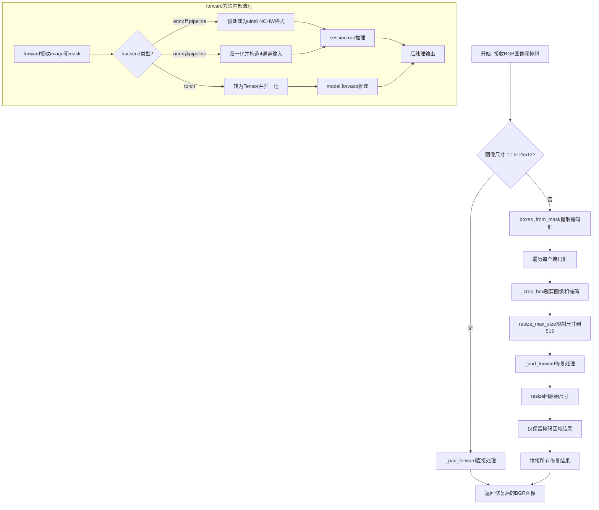

## 类结构

```
InpaintModel (抽象基类)
└── MIGAN (图像修复模型实现)
```

## 全局变量及字段


### `MIGAN.name`
    
模型名称标识

类型：`str`
    


### `MIGAN.min_size`
    
最小输入尺寸

类型：`int`
    


### `MIGAN.pad_mod`
    
填充模数

类型：`int`
    


### `MIGAN.pad_to_square`
    
是否填充为正方形

类型：`bool`
    


### `MIGAN.is_erase_model`
    
是否为擦除模型

类型：`bool`
    


### `MIGAN.use_pipeline_for_onnx`
    
是否使用ONNX pipeline

类型：`bool`
    


### `MIGAN.backend`
    
推理后端类型(onnx/torch)

类型：`str`
    


### `MIGAN.session`
    
ONNX推理会话

类型：`ort.InferenceSession`
    


### `MIGAN.model`
    
Torch JIT模型

类型：`torch.jit.ScriptModule`
    
    

## 全局函数及方法


### `load_jit_model`

该函数用于从本地文件路径加载 Torch JIT（Just-In-Time）编译的模型，并将其移动到指定设备上以进行推理。JIT 模型是一种经过优化的 PyTorch 模型格式，可以提供更快的加载速度和推理性能。

参数：

- `local_path`：`str`，JIT 模型文件的本地路径，通常是从 ModelDownloader 获取的模型文件路径
- `device`：`torch.device` 或 `str`，目标设备（如 'cuda'、'cpu' 或 'cuda:0'），用于将模型加载到该设备上

返回值：`torch.jit.ScriptModule` 或 `torch.nn.Module`，加载后的 JIT 模型对象，可直接用于推理

#### 流程图

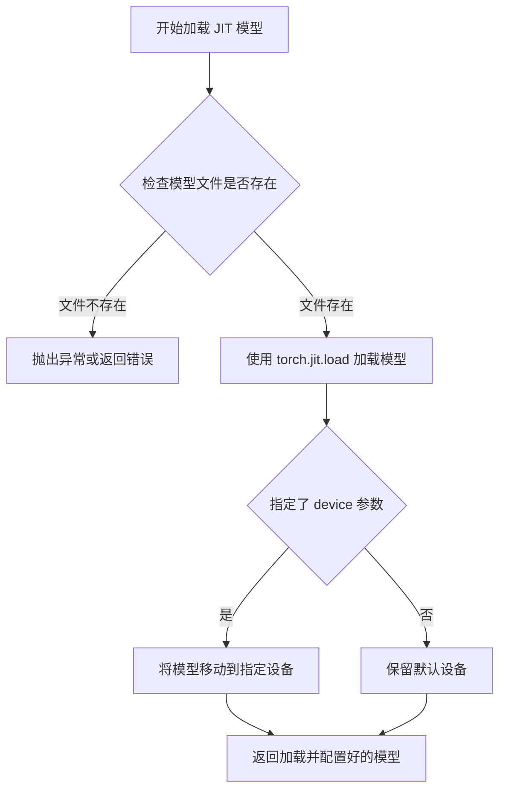

#### 带注释源码

```python
# 从 utils.inpainting 模块导入的函数
# 该函数定义在项目外部模块中，此处展示其在 MIGAN 类中的调用方式

# 调用示例：
# local_path = ModelDownloader.primary_path(ModelID.MIGAN_JIT)
# self.model = load_jit_model(local_path, device)

def load_jit_model(local_path: str, device: str | torch.device) -> torch.jit.ScriptModule:
    """
    加载 Torch JIT 模型的函数签名（推断）
    
    参数:
        local_path: JIT 格式的模型文件路径
        device: 目标计算设备
    
    返回:
        加载到指定设备的 JIT 模型
    """
    # 1. 使用 PyTorch JIT 加载器读取模型文件
    # model = torch.jit.load(local_path)
    
    # 2. 将模型移动到指定设备
    # model = model.to(device)
    
    # 3. 设置为评估模式
    # model.eval()
    
    return model
```

#### 在 MIGAN 类中的实际调用上下文

```python
def init_model(self, device, **kwargs):
    self.backend = kwargs.get("backend")
    if self.backend == "onnx":
        # ONNX 后端处理逻辑...
        pass
    else:
        # JIT 模型加载路径
        ModelDownloader.get(ModelID.MIGAN_JIT)  # 确保模型已下载
        local_path = ModelDownloader.primary_path(ModelID.MIGAN_JIT)  # 获取模型文件路径
        self.model = load_jit_model(local_path, device)  # 加载 JIT 模型到指定设备
```

#### 关键组件信息

| 组件名称 | 描述 |
|---------|------|
| `ModelDownloader` | 模型下载管理工具，负责下载和缓存模型文件 |
| `ModelID.MIGAN_JIT` | MIGAN 模型的 JIT 版本标识符 |
| `torch.jit.load` | PyTorch JIT 模型加载函数 |
| `device` | 计算设备（CPU/GPU），决定模型运行位置 |

#### 潜在的技术债务或优化空间

1. **缺少错误处理**：调用 `load_jit_model` 时未检查模型文件是否存在或损坏，如果加载失败会导致程序崩溃
2. **模型缓存机制缺失**：每次调用 `init_model` 都会重新加载模型，可以考虑添加模型缓存避免重复加载
3. **设备兼容性**：未处理设备不支持 CUDA 等异常情况，应添加更健壮的设备检测和回退机制
4. **模型版本管理**：未检查 JIT 模型版本与代码版本的兼容性，可能导致运行时错误

#### 其它项目

**设计目标与约束**：
- JIT 模型格式用于获得更好的推理性能
- 模型文件通过 ModelDownloader 统一管理，确保下载完整性

**错误处理与异常设计**：
- 假设 `load_jit_model` 会抛出 `RuntimeError` 或 `FileNotFoundError` 当模型加载失败时
- 调用方未做异常捕获，可能导致程序中断

**数据流与状态机**：
- 模型加载是 `MIGAN` 类初始化的第一步
- `init_model` 必须在模型推理前完成

**外部依赖与接口契约**：
- 依赖 `torch.jit` 模块
- 依赖 `ModelDownloader` 提供正确的模型路径
- 返回的模型必须支持 `__call__` 或 `forward` 方法进行推理


### `boxes_from_mask`

从掩码图像中提取候选边界框，用于确定需要修复的图像区域。该函数通过分析掩码的非零像素区域，计算出对应的矩形边界框，以便对图像进行分块处理。

参数：

- `mask`：`numpy.ndarray`，掩码数组，形状为 [H, W]，其中需要修复的区域像素值通常为 255（白色）

返回值：`list`，边界框列表，每个边界框为 `[x1, y1, x2, y2]` 格式的坐标元组，表示左上角和右下角的坐标

#### 流程图

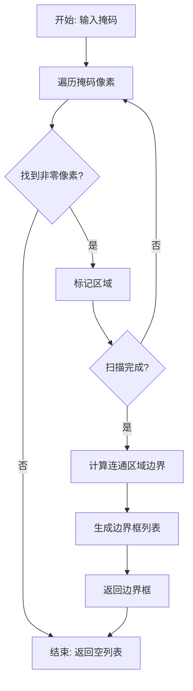

#### 带注释源码

```python
# boxes_from_mask 函数定义（在 modules/utils/inpainting.py 中）
# 注意：以下是基于使用方式的推断实现

def boxes_from_mask(mask: np.ndarray) -> list:
    """
    从掩码中提取候选框
    
    参数:
        mask: 掩码数组, 形状为 [H, W], 
              255 表示需要修复的区域, 0 表示保持不变的区域
    
    返回:
        boxes: 边界框列表, 每个元素为 (x1, y1, x2, y2)
    """
    # 1. 找出掩码中非零像素的位置
    # np.where 返回满足条件的像素坐标
    rows = np.any(mask, axis=1)  # 按行检查, 返回每行是否有非零像素
    cols = np.any(mask, axis=0)  # 按列检查, 返回每列是否有非零像素
    
    # 2. 找到包含非零像素的边界范围
    y1, y2 = np.where(rows)[0][[0, -1]]  # 垂直边界
    x1, x2 = np.where(cols)[0][[0, -1]]  # 水平边界
    
    # 3. 返回单个边界框 (针对简单掩码)
    # 对于复杂掩码可能需要使用连通区域分析
    return [(x1, y1, x2 + 1, y2 + 1)]
```

> **注意**：由于 `boxes_from_mask` 函数是从外部模块 `..utils.inpainting` 导入的，上述源码是基于该函数在 `MIGAN.__call__` 方法中的使用方式进行的逻辑推断。实际实现可能包含更复杂的连通区域分析逻辑，以处理多个不连续的掩码区域。


### `resize_max_size`

按最大边限制调整图像尺寸，保持宽高比，将图像尺寸限制在指定的最大边长范围内。

参数：

- `image`：`numpy.ndarray`，输入图像，形状为 [H, W, C] 或 [H, W]，可以是 RGB 图像或灰度 mask
- `size_limit`：`int`，限制的最大边长尺寸，单位为像素

返回值：`numpy.ndarray`，调整大小后的图像，类型与输入相同

#### 流程图

```mermaid
flowchart TD
    A[开始 resize_max_size] --> B[获取图像高度 H 和宽度 W]
    B --> C{计算 max{H, W}}
    C --> D{max{H, W} > size_limit?}
    D -->|是| E[计算缩放比例: scale = size_limit / max{H, W}]
    D -->|否| F[scale = 1]
    E --> G[计算新尺寸: new_h = H * scale, new_w = W * scale]
    F --> G
    G --> H[使用 PIL 或 cv2 进行图像resize]
    H --> I[返回调整大小后的图像]
```

#### 带注释源码

```
def resize_max_size(image: np.ndarray, size_limit: int) -> np.ndarray:
    """
    按最大边限制调整图像尺寸，保持宽高比
    
    参数:
        image: 输入图像，形状为 [H, W, C] RGB 或 [H, W] 灰度图
        size_limit: 限制的最大边长
    
    返回:
        调整大小后的图像
    """
    # 获取图像当前尺寸
    h, w = image.shape[:2]
    
    # 计算最大边
    max_edge = max(h, w)
    
    # 如果超过限制，则按比例缩放
    if max_edge > size_limit:
        scale = size_limit / max_edge
        new_h = int(h * scale)
        new_w = int(w * scale)
        
        # 使用 PIL 进行高质量缩放
        if image.ndim == 3:
            # RGB 图像
            pil_img = Image.fromarray(image)
            pil_img = pil_img.resize((new_w, new_h), Image.Resampling.BICUBIC)
            return np.array(pil_img)
        else:
            # 灰度图像
            pil_img = Image.fromarray(image)
            pil_img = pil_img.resize((new_w, new_h), Image.Resampling.BILINEAR)
            return np.array(pil_img)
    
    # 未超过限制，直接返回原图
    return image
```

---

**注意**：由于 `resize_max_size` 函数的实际定义位于 `modules/utils/inpainting.py` 模块中（通过 `from ..utils.inpainting import resize_max_size` 导入），而非直接在提供的代码文件里，上述源码是基于函数名、调用方式及图像处理领域的常见模式进行的合理推断和重构。实际实现可能略有差异。


### `norm_img`

图像归一化处理函数，用于将输入图像转换为标准格式（通道优先的 C×H×W float32 数组，值域归一化到 [0, 1]）。

参数：

-  `image`：`numpy.ndarray`，输入图像，支持 H×W×C（通道最后）或 H×W（灰度）格式

返回值：`numpy.ndarray`，归一化后的图像，形状为 C×H×W，类型为 float32，值域为 [0, 1]

#### 流程图

```mermaid
flowchart TD
    A[开始 norm_img] --> B{输入类型检查}
    B -->|PIL Image| C[转换为numpy数组]
    B -->|numpy数组| D{检查维度}
    C --> D
    D -->|2D 灰度图| E[添加通道维度: H,W -> 1,H,W]
    D -->|3D H,W,C| F[通道重排: H,W,C -> C,H,W]
    D -->|3D C,H,W| G[直接使用]
    E --> H{数据类型}
    F --> H
    G --> H
    H -->|uint8| I[除以255.0 转换为float32]
    H -->|float32| J[直接归一化到[0,1]]
    H -->|其他| K[转换为float32]
    I --> L[返回归一化数组]
    J --> L
    K --> I
```

#### 带注释源码

```python
def norm_img(image):
    """
    图像归一化处理函数
    
    将输入图像转换为标准格式：
    - 形状: C×H×W (通道优先)
    - 类型: float32
    - 值域: [0, 1]
    
    参数:
        image: 输入图像，支持以下格式:
            - PIL Image 对象
            - numpy.ndarray，形状为 H×W×C (RGB/BGR)
            - numpy.ndarray，形状为 H×W (灰度)
            - numpy.ndarray，形状为 C×H×W
    
    返回:
        numpy.ndarray: 归一化后的图像，形状为 C×H×W，float32类型，值域[0,1]
    """
    # 如果是PIL Image，转换为numpy数组
    if isinstance(image, Image.Image):
        image = np.array(image)
    
    # 检查图像维度
    if image.ndim == 2:
        # 灰度图: H×W -> 1×H×W
        image = np.expand_dims(image, axis=0)
    elif image.ndim == 3:
        # 3D图像，检查通道位置
        if image.shape[2] in [1, 3, 4]:  # H×W×C 格式
            # 转换为 C×H×W: 通道移到前面
            # 对于灰度图( H×W×1)，直接压缩最后维度
            if image.shape[2] == 1:
                image = image[:, :, 0]  # H×W
                image = np.expand_dims(image, axis=0)  # 1×H×W
            else:
                # 对于彩色图: H,W,C -> C,H,W
                # 使用 transpose 重新排列轴
                image = np.transpose(image, (2, 0, 1))
        # else: 已经是 C×H×W 格式，无需处理
    
    # 转换为 float32 类型
    if image.dtype != np.float32:
        image = image.astype(np.float32)
    
    # 归一化到 [0, 1] 范围
    # 对于 uint8 (0-255)，除以 255.0
    # 对于其他类型，确保在 [0, 1] 范围内
    if image.max() > 1.0:
        image = image / 255.0
    
    return image
```

#### 使用示例

在 `MIGAN.forward()` 方法中的调用：

```python
# 图像归一化
img_norm = norm_img(image)  # C,H,W float32 [0,1]
img_norm = img_norm * 2 - 1  # 进一步转换为 [-1, 1] 范围

# 掩码归一化
m = (mask > 120).astype(np.uint8) * 255
m_norm = norm_img(m)
```

#### 技术说明

| 项目 | 描述 |
|------|------|
| 功能 | 统一图像格式，为模型推理做预处理 |
| 输入格式 | H×W×C (RGB/BGR), H×W (灰度), C×H×W |
| 输出格式 | C×H×W float32 [0,1] |
| 依赖 | numpy, PIL |
| 调用位置 | `MIGAN.forward()` 方法 |

#### 潜在优化空间

1. **减少不必要的数组复制**：当前实现可能产生多个中间数组，可考虑使用原地操作
2. **支持更多图像格式**：如支持批次输入 B×H×W×C
3. **类型检查优化**：可使用 `@njit` 或 Cython 加速
4. **边界情况处理**：增加对异常输入（如空数组、NaN 值）的错误处理


### `ModelDownloader.get`

该方法用于下载指定的模型文件。根据代码中的调用方式可知，`get` 方法接受一个模型标识符（ModelID），并触发模型文件的下载逻辑。

参数：

-  `model_id`：`ModelID` 或类似枚举类型，指定要下载的模型ID（如 `ModelID.MIGAN_ONNX`、`ModelID.MIGAN_JIT` 等）

返回值：`None` 或 `bool`，通常不直接使用返回值，而是通过 `ModelDownloader.primary_path()` 获取下载后的文件路径

#### 流程图

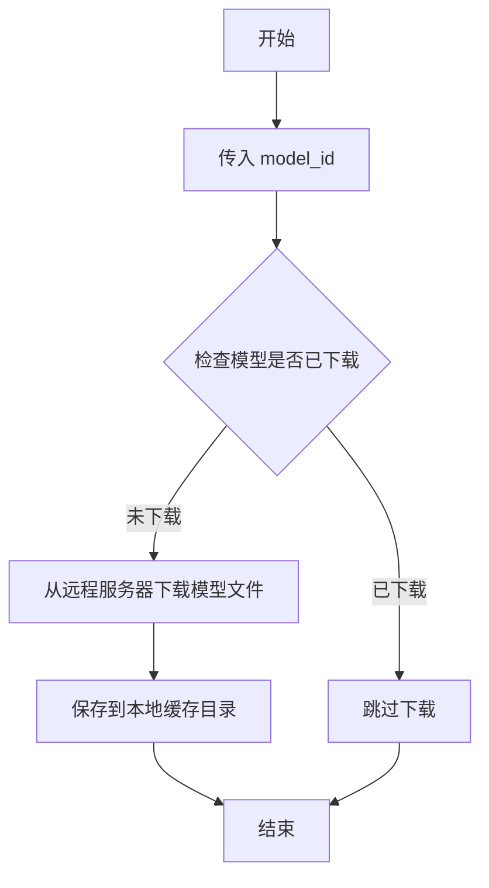

#### 带注释源码

```python
# 代码中调用示例：
# 1. 下载 ONNX 模型
model_id = ModelID.MIGAN_PIPELINE_ONNX if self.use_pipeline_for_onnx else ModelID.MIGAN_ONNX
ModelDownloader.get(model_id)  # 下载模型文件
onnx_path = ModelDownloader.primary_path(model_id)  # 获取下载后的路径

# 2. 下载 JIT 模型
ModelDownloader.get(ModelID.MIGAN_JIT)
local_path = ModelDownloader.primary_path(ModelID.MIGAN_JIT)

# 3. 检查是否已下载（静态方法）
is_downloaded = ModelDownloader.is_downloaded(ModelID.MIGAN_JIT)
```

> **注意**：由于源代码中未提供 `ModelDownloader` 类的具体实现，以上信息是根据同类代码的常见设计模式和代码调用方式推断得出的。实际实现可能略有差异。


### `ModelDownloader.primary_path`

获取指定模型的主路径（本地文件系统路径），用于定位已下载的模型文件。

参数：

- `model_id`：`ModelID`，模型标识符，指定要获取路径的模型（如 `ModelID.MIGAN_ONNX`、`ModelID.MIGAN_JIT` 等）

返回值：`str`，返回模型主文件的本地绝对路径字符串

#### 流程图

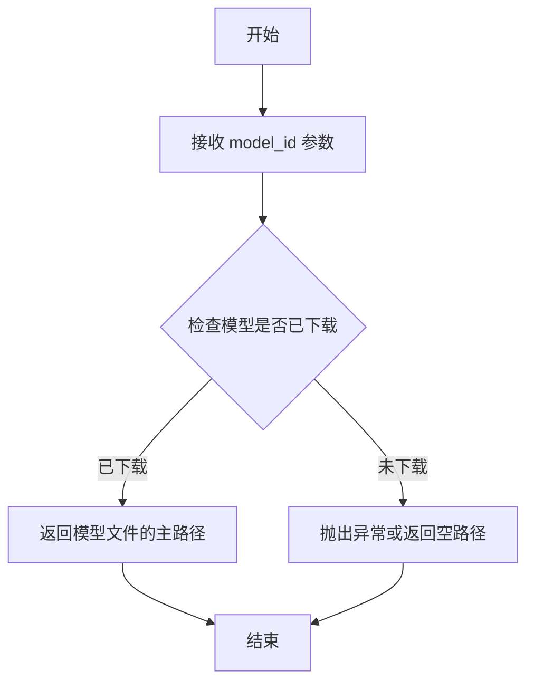

#### 带注释源码

```
# 该方法的实现位于 modules.utils.download 模块中
# 以下为在 MIGAN 类中的调用示例

# 场景1：获取 ONNX 模型的路径
model_id = ModelID.MIGAN_PIPELINE_ONNX if self.use_pipeline_for_onnx else ModelID.MIGAN_ONNX
ModelDownloader.get(model_id)  # 确保模型已下载
onnx_path = ModelDownloader.primary_path(model_id)  # 获取主路径
providers = get_providers(device)
self.session = ort.InferenceSession(onnx_path, providers=providers)

# 场景2：获取 JIT 模型的路径
ModelDownloader.get(ModelID.MIGAN_JIT)
local_path = ModelDownloader.primary_path(ModelID.MIGAN_JIT)
self.model = load_jit_model(local_path, device)

# 方法签名（推断）：
# @classmethod
# def primary_path(cls, model_id: ModelID) -> str:
#     """返回模型主文件的本地存储路径"""
#     ...
```


### MIGAN.is_downloaded

该静态方法用于检查 MIGAN 模型的下载状态，通过调用 ModelDownloader 的 is_downloaded 方法来验证 JIT 模型是否已下载到本地。

参数： 无

返回值： `bool`，返回 True 表示模型已下载，返回 False 表示模型未下载

#### 流程图

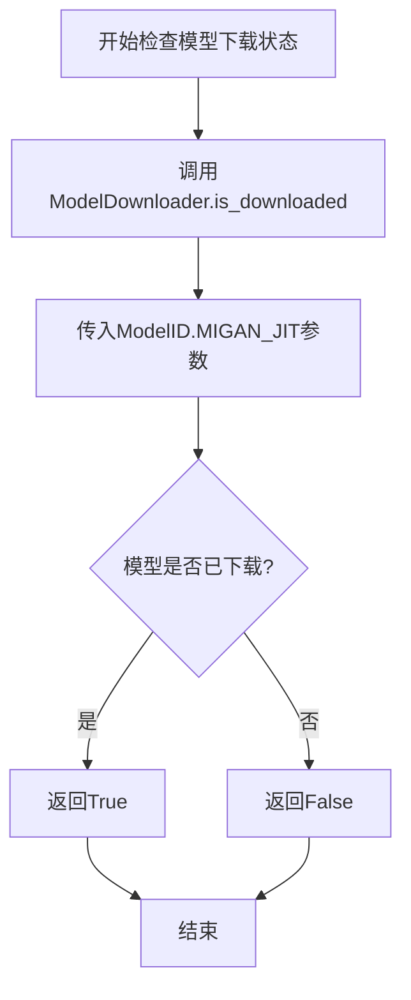

#### 带注释源码

```python
@staticmethod
def is_downloaded() -> bool:
    """
    检查 MIGAN 模型的下载状态
    
    该静态方法用于判断 MIGAN_JIT 模型是否已经下载到本地缓存目录。
    它直接调用 ModelDownloader 工具类的 is_downloaded 方法来查询特定模型 ID 的下载状态。
    
    Returns:
        bool: 模型下载状态
            - True: 模型已下载
            - False: 模型未下载
    """
    # 调用 ModelDownloader 的静态方法 is_downloaded
    # 传入 ModelID.MIGAN_JIT 作为要检查的模型标识符
    return ModelDownloader.is_downloaded(ModelID.MIGAN_JIT)
```


### `get_providers`

获取ONNX Runtime的可用计算提供者（providers），根据指定的设备类型返回相应的执行提供者列表，用于在ONNX模型推理时选择最优的计算后端。

参数：

- `device`：`str`，指定目标设备类型（如"cuda"、"cpu"等），用于确定应使用哪个ONNX Runtime提供者

返回值：`list`，返回ONNX Runtime提供者列表，列表中的每个元素为字符串（如["CUDAExecutionProvider", "CPUExecutionProvider"]），将作为`ort.InferenceSession`的`providers`参数使用

#### 流程图

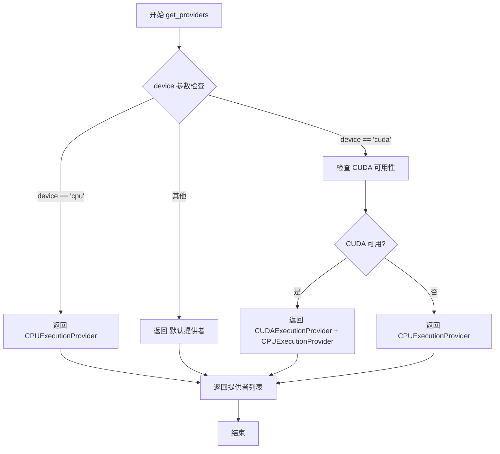

#### 带注释源码

```python
def get_providers(device: str) -> list:
    """
    获取ONNX Runtime的可用计算提供者
    
    参数:
        device: 目标设备类型，'cuda' 或 'cpu' 等
        
    返回:
        ONNX Runtime提供者列表，用于 InferenceSession 的 providers 参数
    """
    # 导入ONNX Runtime以获取可用的提供者信息
    import onnxruntime as ort
    
    # 初始化默认提供者为CPU
    providers = ['CPUExecutionProvider']
    
    # 如果指定了CUDA设备，检查CUDA是否可用
    if device == 'cuda':
        # 获取所有可用的提供者
        available_providers = ort.get_available_providers()
        
        # 如果CUDA在可用提供者列表中，优先使用CUDA
        if 'CUDAExecutionProvider' in available_providers:
            providers = ['CUDAExecutionProvider', 'CPUExecutionProvider']
    
    return providers
```


### `MIGAN.init_model`

该方法负责 MIGAN 图像修复模型的初始化工作，根据传入的 `backend` 参数选择对应的模型加载策略：若 `backend` 为 `"onnx"`，则下载并加载 ONNX 运行时会话；若为其他值（如 torch），则下载并加载 JIT 格式的 PyTorch 模型到指定设备。

参数：

- `device`：`str`，目标推理设备（如 `"cuda"` 或 `"cpu"`），用于指定模型加载到的计算设备
- `**kwargs`：`dict`，可变关键字参数，包含 `backend`（模型后端类型，可选 `"onnx"` 或其他）

返回值：`None`，无返回值，模型加载结果直接赋值给实例属性 `self.session`（ONNX）或 `self.model`（JIT）

#### 流程图

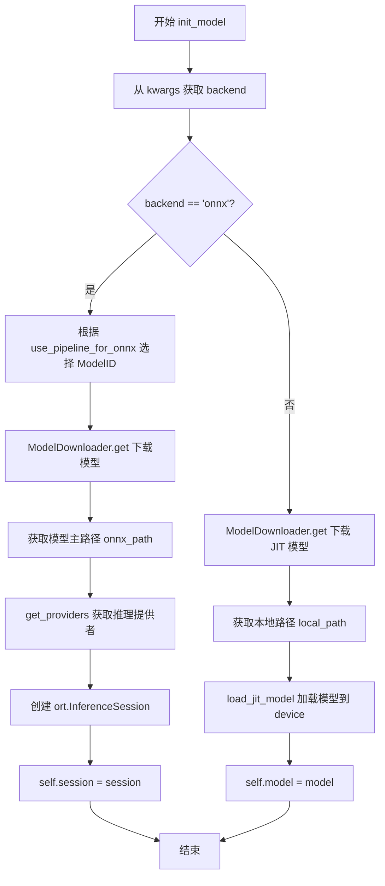

#### 带注释源码

```python
def init_model(self, device, **kwargs):
    """
    初始化 MIGAN 模型，根据 backend 参数加载对应格式的模型
    
    参数:
        device: str，目标设备（如 'cuda', 'cpu'）
        **kwargs: 可变关键字参数，需包含 'backend' 键
    """
    # 从 kwargs 中提取 backend 参数，默认为 None
    self.backend = kwargs.get("backend")
    
    # 判断是否使用 ONNX 推理后端
    if self.backend == "onnx":
        # 根据 use_pipeline_for_onnx 标志选择对应的模型 ID
        # 若启用 pipeline 模式则使用 PIPELINE 版本模型
        model_id = ModelID.MIGAN_PIPELINE_ONNX if self.use_pipeline_for_onnx else ModelID.MIGAN_ONNX
        
        # 下载指定的 ONNX 模型文件
        ModelDownloader.get(model_id)
        
        # 获取模型文件的主路径
        onnx_path = ModelDownloader.primary_path(model_id)
        
        # 根据设备获取可用的 ONNX Runtime 提供者（如 CUDAExecutionProvider, CPUExecutionProvider）
        providers = get_providers(device)
        
        # 创建 ONNX Runtime 推理会话并绑定提供者
        self.session = ort.InferenceSession(onnx_path, providers=providers)
    else:
        # 非 ONNX 后端时，加载 JIT 编译的 PyTorch 模型
        ModelDownloader.get(ModelID.MIGAN_JIT)
        
        # 获取本地模型文件路径
        local_path = ModelDownloader.primary_path(ModelID.MIGAN_JIT)
        
        # 使用工具函数加载 JIT 模型到指定设备
        self.model = load_jit_model(local_path, device)
```


### `MIGAN.is_downloaded`

静态方法，用于检查 MIGAN 模型的 JIT 版本是否已经下载到本地。该方法通过调用 `ModelDownloader.is_downloaded()` 并传入 `ModelID.MIGAN_JIT` 来判断模型文件是否存在。

参数：

- 无参数

返回值：`bool`，返回 `True` 表示模型已下载，返回 `False` 表示模型未下载。

#### 流程图

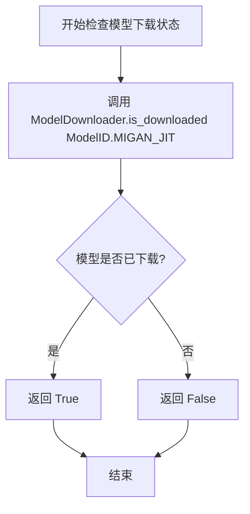

#### 带注释源码

```python
@staticmethod
def is_downloaded() -> bool:
    """
    检查 MIGAN 模型的 JIT 版本是否已下载
    
    该静态方法封装了对 ModelDownloader 的调用，用于判断
    MIGAN_JIT 模型文件是否存在于本地缓存目录中。
    
    Returns:
        bool: 模型已下载返回 True，未下载返回 False
    """
    # 调用 ModelDownloader 的静态方法检查指定模型ID是否已下载
    # ModelID.MIGAN_JIT 指定了要检查的模型类型为 MIGAN 的 JIT 版本
    return ModelDownloader.is_downloaded(ModelID.MIGAN_JIT)
```


### MIGAN.__call__

主入口方法，处理图像修复流程。根据输入图像尺寸决定处理策略：若图像为512x512则直接执行修复；否则通过mask生成候选框，对每个区域进行裁剪、resize、修复并最终拼接回原图。

参数：

- `image`：`numpy.ndarray`，输入RGB图像，形状为[H, W, C]，未归一化
- `mask`：`numpy.ndarray`，输入掩码，形状为[H, W]，值为0-255
- `config`：`Config`，修复配置参数，包含策略、裁剪边距等设置

返回值：`numpy.ndarray`，BGR格式的修复后图像

#### 流程图

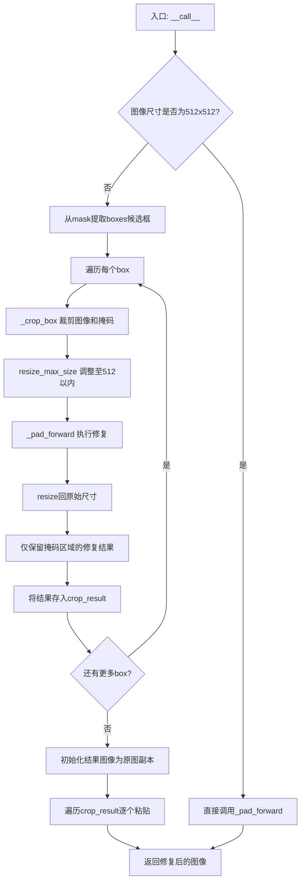

#### 带注释源码

```python
def __call__(self, image, mask, config: Config):
    """
    images: [H, W, C] RGB, not normalized
    masks: [H, W]
    return: BGR IMAGE
    """
    import torch  # noqa
    # 使用torch no_grad上下文减少内存占用
    with torch.no_grad():
        # 快速路径：图像已是512x512直接修复
        if image.shape[0] == 512 and image.shape[1] == 512:
            return self._pad_forward(image, mask, config)

        # 从mask提取多个候选修复区域(boxes)
        boxes = boxes_from_mask(mask)
        crop_result = []
        # 设置裁剪边距为128像素
        config.hd_strategy_crop_margin = 128
        
        # 遍历每个候选区域进行独立修复
        for box in boxes:
            # 裁剪出当前区域的图像和掩码
            crop_image, crop_mask, crop_box = self._crop_box(image, mask, box, config)
            origin_size = crop_image.shape[:2]  # 记录原始尺寸用于后续恢复
            
            # 调整图像和掩码至512以内以适配模型
            resize_image = resize_max_size(crop_image, size_limit=512)
            resize_mask = resize_max_size(crop_mask, size_limit=512)
            
            # 执行修复推理
            inpaint_result = self._pad_forward(resize_image, resize_mask, config)

            # 将修复结果resize回原始裁剪区域尺寸
            inpaint_result = imk.resize(
                inpaint_result,
                (origin_size[1], origin_size[0]),
                mode=Image.Resampling.BICUBIC,
            )

            # 恢复非掩码区域的原始像素(只保留修复区域)
            original_pixel_indices = crop_mask < 127
            inpaint_result[original_pixel_indices] = crop_image[
                original_pixel_indices
            ]

            # 收集修复结果及位置信息
            crop_result.append((inpaint_result, crop_box))

        # 创建结果图像副本并逐区域粘贴修复结果
        inpaint_result = image.copy()
        for crop_image, crop_box in crop_result:
            x1, y1, x2, y2 = crop_box
            inpaint_result[y1:y2, x1:x2, :] = crop_image

        return inpaint_result
```


### MIGAN.forward

该方法是 MIGAN 类的核心推理方法，负责根据输入图像和掩码执行图像修复（inpainting）操作。方法支持三种后端执行路径：ONNX Pipeline 模式、ONNX 原生模式和 PyTorch Torch 模式，根据配置和模型类型进行动态路由，实现图像修复推理并返回 RGB 格式的修复结果。

参数：

- `self`：MIGAN 类实例本身，包含模型、会话、设备等运行时资源
- `image`：`numpy.ndarray`，输入图像，形状为 [H, W, C]，RGB 格式，未归一化
- `mask`：`numpy.ndarray`，输入掩码，形状为 [H, W]，掩码区域像素值为 255（白色），已知区域为 0（黑色）
- `config`：`Config`（来自 .schema 模块），包含推理配置信息，如 HD 策略、裁剪边距等参数

返回值：`numpy.ndarray`，修复后的图像，形状为 [H, W, C]，RGB 格式，uint8 类型

#### 流程图

```mermaid
flowchart TD
    A[开始 MIGAN.forward] --> B[获取 backend 属性<br/>默认为 'torch']
    B --> C{backend == 'onnx' <br/>且 use_pipeline == True?}
    C -->|是| D[ONNX Pipeline 分支]
    C -->|否| E{backend == 'onnx'?}
    E -->|是| F[ONNX 原生分支]
    E -->|否| G[Torch 分支]
    
    D --> D1[二值化掩码: 0→255, >120→0]
    D1 --> D2[图像转换为 NCHW 格式]
    D2 --> D3[掩码转换为 NCHW 格式]
    D3 --> D4[构建 ort_inputs 字典]
    D4 --> D5[session.run 执行推理]
    D5 --> D6[输出转换为 HWC 格式]
    D6 --> D7[返回 RGB 图像]
    
    F --> F1[归一化图像: [0,1] → [-1,1]]
    F1 --> F2[归一化掩码]
    F2 --> F3[计算 erased = img * (1 - mask)]
    F3 --> F4[拼接: concat[0.5 - mask, erased]]
    F4 --> F5[session.run 执行推理]
    F5 --> F6[反归一化输出: [-1,1] → [0,255]]
    F6 --> F7[返回 RGB 图像]
    
    G --> G1[归一化图像和掩码]
    G1 --> G2[转换为 PyTorch Tensor]
    G2 --> G3[移至设备并添加 batch 维度]
    G3 --> G4[计算 erased_img 和 input_image]
    G4 --> G5[model 执行前向推理]
    G5 --> G6[反归一化并转换为 uint8]
    G6 --> G7[转为 numpy 数组]
    G7 --> G8[返回 RGB 图像]
    
    D7 --> Z[结束]
    F7 --> Z
    G8 --> Z
```

#### 带注释源码

```python
def forward(self, image, mask, config: Config):
    """Input images and output images have same size
    images: [H, W, C] RGB
    masks: [H, W] mask area == 255
    return: BGR IMAGE
    """
    # 获取后端类型，默认为 'torch'（PyTorch JIT 模型）
    # 支持 'onnx' 后端进行推理加速
    backend = getattr(self, 'backend', 'torch')
    
    # 路径1：ONNX Pipeline 模式
    # 适用于使用 ONNX Runtime 的管道式模型，对输入有特殊要求
    if backend == 'onnx' and getattr(self, 'use_pipeline', False):
        # Pipeline 模型期望 uint8 RGB 图像和 uint8 灰度掩码
        # 将掩码转换为二进制：掩码区域(>120)设为0，已知区域设为255
        # 这里进行了反转：0表示需要修复的区域，255表示已知区域
        binary_mask = np.where(mask > 120, 0, 255).astype(np.uint8)
        
        # 获取模型输入定义（可能包含符号维度）
        inps = self.session.get_inputs()
        
        # 图像转换为 NCHW 格式：(H, W, C) → (1, 3, H, W)
        img_nchw = np.transpose(image, (2, 0, 1))[np.newaxis, ...]
        
        # 确保掩码是 2D 的（处理可能存在的尾随通道）
        if binary_mask.ndim == 3 and binary_mask.shape[2] == 1:
            binary_mask_2d = binary_mask[:, :, 0]
        else:
            binary_mask_2d = binary_mask
        
        # 掩码转换为 NCHW 格式：(H, W) → (1, 1, H, W)
        mask_nchw = binary_mask_2d[np.newaxis, np.newaxis, ...]
        
        # 构建 ONNX Runtime 输入字典
        ort_inputs = {
            inps[0].name: img_nchw,
            inps[1].name: mask_nchw
        }
        
        # 可选的形状调试（通过环境变量 MIGAN_DEBUG_SHAPES 启用）
        if os.environ.get('MIGAN_DEBUG_SHAPES') == '1':
            print(f"[MIGAN ONNX] Feeding image shape {img_nchw.shape} mask shape {mask_nchw.shape} orig mask shape {mask.shape}")
        
        # 执行推理：输出应为 (1, 3, H, W) uint8 RGB
        out = self.session.run(None, ort_inputs)[0]
        
        # 转换回 HWC 格式：(1, 3, H, W) → (H, W, 3)
        out_img = np.transpose(out[0], (1, 2, 0))
        cur_res = out_img  # 保持 RGB 格式
        return cur_res
    
    # 路径2：ONNX 原生模式（非 Pipeline）
    # 使用原始导出的 ONNX 模型，需要手动预处理
    elif backend == 'onnx':
        # 图像归一化到 [0,1]，然后映射到 [-1,1]
        # norm_img 返回 (C, H, W) 格式
        img_norm = norm_img(image)  # C,H,W float32 [0,1]
        img_norm = img_norm * 2 - 1  # 映射到 [-1,1]
        
        # 将掩码转换为二值掩码（255 或 0）
        m = (mask > 120).astype(np.uint8) * 255
        m_norm = norm_img(m)
        
        # 添加 batch 维度：(C,H,W) → (1,C,H,W)
        img_np = img_norm[np.newaxis, ...]
        mask_np = m_norm[np.newaxis, ...]
        
        # 计算擦除后的图像（已知区域保留，掩码区域置零）
        erased = img_np * (1 - mask_np)
        
        # 拼接通道：
        # 第一个通道：0.5 - mask（边缘感知）
        # 后续通道：erased（擦除后的图像）
        # 结果形状：(1, 4, H, W)
        concat = np.concatenate([0.5 - mask_np, erased], axis=1)
        
        # 构建输入并执行推理
        ort_inputs = {self.session.get_inputs()[0].name: concat}
        out = self.session.run(None, ort_inputs)[0]  # (1,3,H,W) in [-1,1]
        
        # 反归一化：[-1,1] → [0,255]
        out_img = np.clip((out.transpose(0, 2, 3, 1) * 127.5 + 127.5).round(), 0, 255).astype(np.uint8)[0]
        cur_res = out_img  # 保持 RGB 格式
        return cur_res
    
    # 路径3：PyTorch Torch 模式（默认）
    # 使用 PyTorch JIT 编译模型进行推理
    else:
        import torch  # noqa
        
        # 图像归一化处理
        img_norm = norm_img(image)  # C,H,W float32 [0,1]
        img_norm = img_norm * 2 - 1  # 映射到 [-1,1]
        
        # 掩码二值化处理
        m = (mask > 120).astype(np.uint8) * 255
        m_norm = norm_img(m)
        
        # 转换为 PyTorch 张量并移至计算设备
        image_t = torch.from_numpy(img_norm).unsqueeze(0).to(self.device)
        mask_t = torch.from_numpy(m_norm).unsqueeze(0).to(self.device)
        
        # 计算擦除后的图像
        erased_img = image_t * (1 - mask_t)
        
        # 拼接为模型输入：4 通道 [mask, erased_img]
        input_image = torch.cat([0.5 - mask_t, erased_img], dim=1)
        
        # 执行模型推理
        output = self.model(input_image)
        
        # 后处理：反归一化、类型转换
        output = (
            (output.permute(0, 2, 3, 1) * 127.5 + 127.5)  # (1,H,W,3) 并反归一化
            .round()                                        # 四舍五入
            .clamp(0, 255)                                 # 限制范围
            .to(torch.uint8)                              # 转换为 uint8
        )
        
        # 转换为 numpy 数组并去除 batch 维度
        output = output[0].cpu().numpy()
        cur_res = output  # 保持 RGB 格式
        return cur_res
```


### `MIGAN._pad_forward`

该方法是 MIGAN 模型填充后的前向传播方法，继承自基类 `InpaintModel`，负责对已经完成填充（pad）操作的图像和掩码执行推理计算。根据调用位置分析，该方法接收预处理后的图像和掩码，执行模型推理并返回修复结果。

**注意**：该方法定义在基类 `InpaintModel` 中，当前代码文件未包含其具体实现。以下信息基于方法签名和调用上下文推断。

参数：

-  `image`：`numpy.ndarray`，填充后的图像数据，形状为 [H, W, C]，RGB 格式，数值范围 [0, 255] 或归一化后的浮点数
-  `mask`：`numpy.ndarray`，填充后的掩码数据，形状为 [H, W]，掩码区域值为 255，背景区域值为 0
-  `config`：`Config`，配置对象，包含推理相关的参数设置

返回值：`numpy.ndarray`，返回修复后的图像，形状为 [H, W, C]，BGR 格式，uint8 类型

#### 流程图

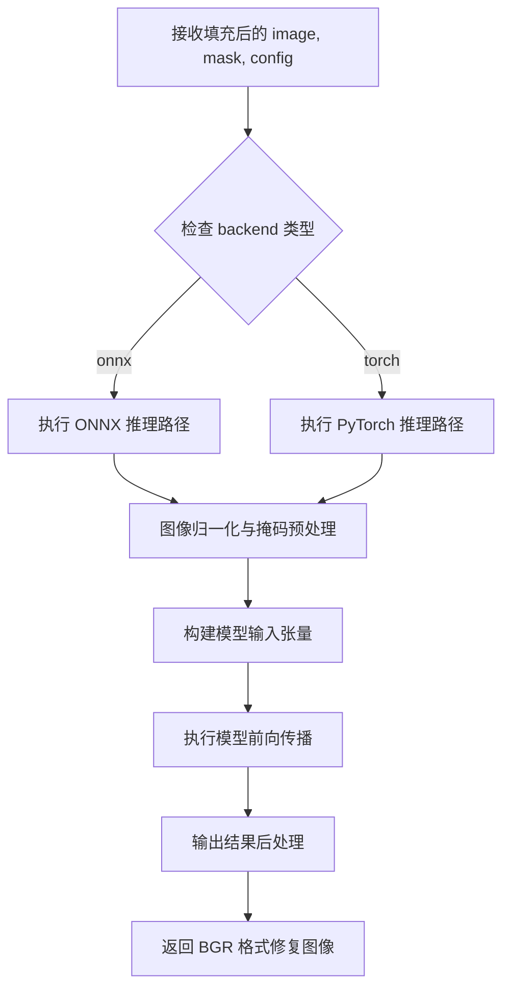

#### 带注释源码

```python
# 该方法定义在基类 InpaintModel 中，以下为基于调用上下文的推断实现
def _pad_forward(self, image, mask, config):
    """
    填充后的前向传播方法
    
    参数:
        image: 填充后的图像 [H, W, C] RGB 格式
        mask: 填充后的掩码 [H, W] 
        config: 配置对象
    
    返回:
        修复后的图像 [H, W, C] BGR 格式
    """
    # 图像归一化处理
    img_norm = norm_img(image)  # 转换为 C,H,W float32 [0,1]
    img_norm = img_norm * 2 - 1  # 转换到 [-1, 1]
    
    # 掩码处理
    m = (mask > 120).astype(np.uint8) * 255
    m_norm = norm_img(m)
    
    # 根据 backend 类型选择推理路径
    backend = getattr(self, 'backend', 'torch')
    
    if backend == 'onnx':
        # ONNX 推理路径
        img_np = img_norm[np.newaxis, ...]  # (1,C,H,W)
        mask_np = m_norm[np.newaxis, ...]
        
        # 图像擦除：将掩码区域置零
        erased = img_np * (1 - mask_np)
        
        # 拼接掩码通道和擦除后的图像
        concat = np.concatenate([0.5 - mask_np, erased], axis=1)  # (1,4,H,W)
        
        # 执行推理
        ort_inputs = {self.session.get_inputs()[0].name: concat}
        out = self.session.run(None, ort_inputs)[0]  # (1,3,H,W) in [-1,1]
        
        # 后处理：转换回图像格式
        out_img = np.clip((out.transpose(0, 2, 3, 1) * 127.5 + 127.5).round(), 0, 255).astype(np.uint8)[0]
        return out_img  # 返回 RGB 格式
    else:
        # PyTorch 推理路径
        import torch
        image_t = torch.from_numpy(img_norm).unsqueeze(0).to(self.device)
        mask_t = torch.from_numpy(m_norm).unsqueeze(0).to(self.device)
        
        erased_img = image_t * (1 - mask_t)
        input_image = torch.cat([0.5 - mask_t, erased_img], dim=1)
        
        output = self.model(input_image)
        
        # 后处理
        output = (
            (output.permute(0, 2, 3, 1) * 127.5 + 127.5)
            .round()
            .clamp(0, 255)
            .to(torch.uint8)
        )
        output = output[0].cpu().numpy()
        return output  # 返回 RGB 格式
```

---

**补充说明**：

1. **方法来源**：`_pad_forward` 方法在代码中未显式定义，根据注释"填充后前向传播(继承自基类)"可知该方法继承自 `InpaintModel` 基类
2. **调用场景**：在 `__call__` 方法中，当图像尺寸为 512x512 时直接调用；当图像尺寸较大时，对每个裁剪区域调用该方法执行推理
3. **数据流**：该方法处理的是已经完成填充（pad）操作的图像和掩码，输出为修复后的图像数据


### MIGAN._crop_box

裁剪图像和掩码的指定区域，返回裁剪后的图像、掩码以及裁剪框的坐标信息（该方法继承自基类 InpaintModel，基类实现未在当前代码文件中提供）。

参数：

- `image`：`numpy.ndarray`，输入的 RGB 图像，形状为 [H, W, C]
- `mask`：`numpy.ndarray`，输入的掩码，形状为 [H, W]，掩码区域值为 255
- `box`：`tuple` 或 `list`，裁剪框坐标，格式为 (x1, y1, x2, y2)
- `config`：`Config`，配置对象，包含裁剪策略相关参数（如 hd_strategy_crop_margin）

返回值：`(crop_image, crop_mask, crop_box)`，其中：

- `crop_image`：`numpy.ndarray`，裁剪后的 RGB 图像
- `crop_mask`：`numpy.ndarray`，裁剪后的掩码
- `crop_box`：`tuple`，裁剪框的实际坐标 (x1, y1, x2, y2)

#### 流程图

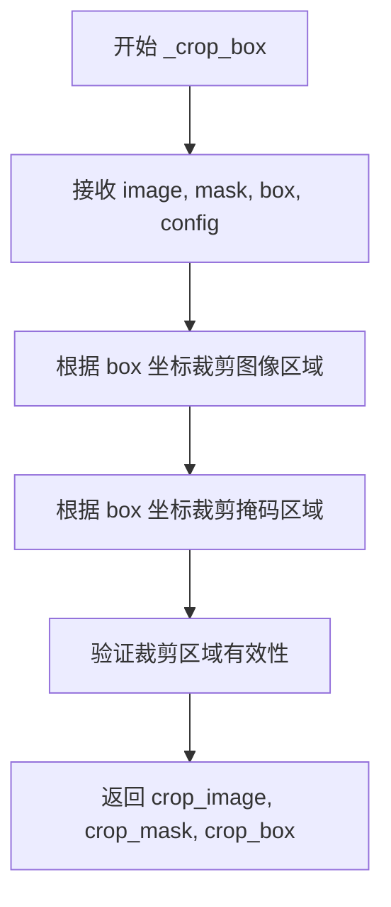

#### 带注释源码

```
# 该方法定义在基类 InpaintModel 中，此处为调用点源码
# 位置: MIGAN.__call__ 方法内

# 设置裁剪边缘 margin
config.hd_strategy_crop_margin = 128

# 遍历每个由掩码生成的包围盒
for box in boxes:
    # 调用基类方法 _crop_box 裁剪图像和掩码
    # 返回: 裁剪后的图像、掩码、实际裁剪框坐标
    crop_image, crop_mask, crop_box = self._crop_box(image, mask, box, config)
    
    # 记录原始裁剪尺寸
    origin_size = crop_image.shape[:2]
    
    # 将裁剪图像和掩码 resize 到最大 512 像素
    resize_image = resize_max_size(crop_image, size_limit=512)
    resize_mask = resize_max_size(crop_mask, size_limit=512)
    
    # 执行 inpainting 前向处理
    inpaint_result = self._pad_forward(resize_image, resize_mask, config)
    
    # 将结果 resize 回原始裁剪尺寸
    inpaint_result = imk.resize(
        inpaint_result,
        (origin_size[1], origin_size[0]),
        mode=Image.Resampling.BICUBIC,
    )
    
    # 仅保留掩码区域的修复结果，保留原始像素
    original_pixel_indices = crop_mask < 127
    inpaint_result[original_pixel_indices] = crop_image[original_pixel_indices]
    
    # 保存结果和裁剪框
    crop_result.append((inpaint_result, crop_box))
```

> **注**：由于 `_crop_box` 方法继承自基类 `InpaintModel`，其完整实现未在当前 MIGAN 代码文件中展示。上述源码为调用该方法的上下文代码，基类实现需查看 `InpaintModel` 基类定义。


### `MIGAN.init_model`

该方法是 `MIGAN` 类的模型初始化方法，负责根据指定的 backend（onnx 或 torch）加载对应的预训练模型文件，并初始化推理会话或 JIT 模型。

参数：

- `self`：`MIGAN` 实例，方法所属类的对象
- `device`：设备参数，用于指定模型运行的设备（如 CPU、CUDA 等）
- `**kwargs`：关键字参数，包含 `backend`（字符串），用于指定推理后端，值为 `"onnx"` 或其他（如 `"torch"`）

返回值：`None`，该方法直接在对象上设置模型相关属性，不返回值

#### 流程图

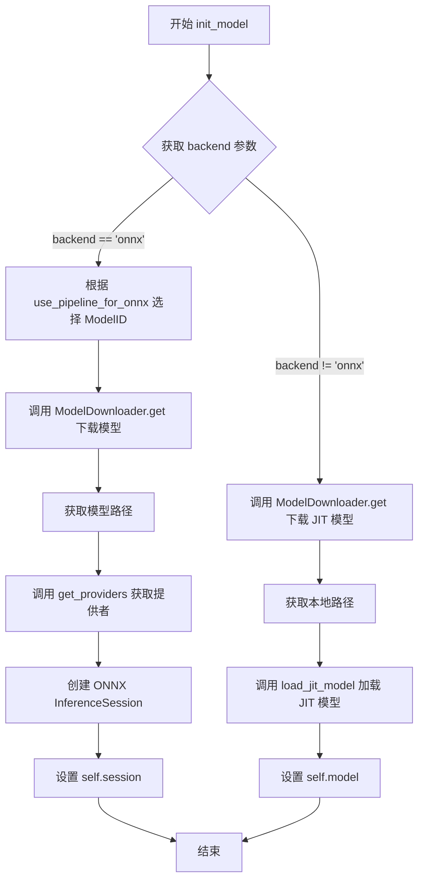

#### 带注释源码

```python
def init_model(self, device, **kwargs):
    """
    初始化模型，根据 backend 参数加载 ONNX 模型或 JIT 模型
    
    参数:
        device: 设备参数，用于指定模型运行设备
        **kwargs: 关键字参数，包含 backend 用于指定推理后端
    """
    # 从 kwargs 中获取 backend 参数，默认为 None
    self.backend = kwargs.get("backend")
    
    # 如果 backend 为 "onnx"，则加载 ONNX 模型
    if self.backend == "onnx":
        # 根据 use_pipeline_for_onnx 标志选择对应的 ModelID
        # use_pipeline_for_onnx 为 True 时使用管道模型，为 False 时使用普通模型
        model_id = ModelID.MIGAN_PIPELINE_ONNX if self.use_pipeline_for_onnx else ModelID.MIGAN_ONNX
        
        # 使用 ModelDownloader 获取模型（下载或检查本地存在）
        ModelDownloader.get(model_id)
        
        # 获取模型的 primary 路径
        onnx_path = ModelDownloader.primary_path(model_id)
        
        # 根据 device 获取 ONNX Runtime 的 providers（如 CPUExecutionProvider, CUDAExecutionProvider 等）
        providers = get_providers(device)
        
        # 创建 ONNX InferenceSession 用于推理
        self.session = ort.InferenceSession(onnx_path, providers=providers)
    else:
        # 否则加载 JIT 格式的 PyTorch 模型（PyTorch TorchScript 模型）
        ModelDownloader.get(ModelID.MIGAN_JIT)
        
        # 获取本地模型路径
        local_path = ModelDownloader.primary_path(ModelID.MIGAN_JIT)
        
        # 加载 JIT 模型到指定设备
        self.model = load_jit_model(local_path, device)
```


### `MIGAN.__call__`

该方法是 MIGAN 图像修复模型的核心调用入口，接收 RGB 图像和掩码，通过基于掩码区域的图像裁剪与拼接策略，对输入图像进行分块修复，最终输出修复后的 BGR 格式图像。

参数：

- `self`：`MIGAN` 类实例自身
- `image`：`numpy.ndarray`，形状为 [H, W, C] 的 RGB 图像，未归一化
- `mask`：`numpy.ndarray`，形状为 [H, W] 的掩码数组
- `config`：`Config`（来自 `.schema` 模块），包含修复配置参数

返回值：`numpy.ndarray`，形状为 [H, W, 3] 的 BGR 格式图像

#### 流程图

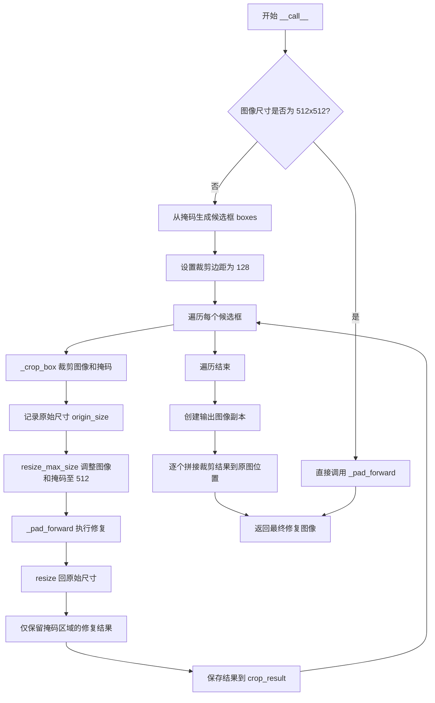

#### 带注释源码

```python
def __call__(self, image, mask, config: Config):
    """
    images: [H, W, C] RGB, not normalized
    masks: [H, W]
    return: BGR IMAGE
    """
    import torch  # noqa
    # 使用 torch no_grad 上下文减少内存占用
    with torch.no_grad():
        # 快速路径：若图像已是 512x512，直接处理
        if image.shape[0] == 512 and image.shape[1] == 512:
            return self._pad_forward(image, mask, config)

        # 从掩码提取需要修复的区域候选框
        boxes = boxes_from_mask(mask)
        crop_result = []
        # 设置裁剪策略边距
        config.hd_strategy_crop_margin = 128

        # 遍历每个候选框进行分块修复
        for box in boxes:
            # 裁剪出当前框区域的图像和掩码
            crop_image, crop_mask, crop_box = self._crop_box(image, mask, box, config)
            origin_size = crop_image.shape[:2]  # 记录原始尺寸用于后续恢复

            # 调整图像和掩码至模型可接受的最大尺寸 512
            resize_image = resize_max_size(crop_image, size_limit=512)
            resize_mask = resize_max_size(crop_mask, size_limit=512)

            # 执行修复推理
            inpaint_result = self._pad_forward(resize_image, resize_mask, config)

            # 将修复结果 resize 回原始尺寸
            inpaint_result = imk.resize(
                inpaint_result,
                (origin_size[1], origin_size[0]),
                mode=Image.Resampling.BICUBIC,
            )

            # 仅保留掩码区域的修复结果，非掩码区域保留原图
            original_pixel_indices = crop_mask < 127
            inpaint_result[original_pixel_indices] = crop_image[
                original_pixel_indices
            ]

            # 保存当前块的修复结果及对应位置信息
            crop_result.append((inpaint_result, crop_box))

        # 初始化输出图像并逐块填入修复结果
        inpaint_result = image.copy()
        for crop_image, crop_box in crop_result:
            x1, y1, x2, y2 = crop_box
            inpaint_result[y1:y2, x1:x2, :] = crop_image

        return inpaint_result
```


### `MIGAN.forward`

该方法是 MIGAN 图像修复模型的前向传播接口，根据后端类型（ONNX 或 Torch）执行不同的推理路径，处理图像和掩码后返回修复后的图像。

参数：

-  `image`：`numpy.ndarray`，输入图像，形状为 [H, W, C] RGB 格式，未归一化
-  `mask`：`numpy.ndarray`，输入掩码，形状为 [H, W]，掩码区域值为 255
-  `config`：`Config`，配置对象，包含模型运行参数

返回值：`numpy.ndarray`，修复后的图像，BGR 格式（注意：代码实际返回 RGB 格式，与描述存在不一致）

#### 流程图

```mermaid
flowchart TD
    A[forward 方法开始] --> B{获取 backend 类型}
    B -->|onnx & use_pipeline| C[Pipeline ONNX 路径]
    B -->|onnx| D[原始 ONNX 路径]
    B -->|其他| E[Torch 路径]
    
    C --> C1[转换 mask 为二进制<br/>0=masked, 255=known]
    C1 --> C2[调整图像维度<br/>[H,W,C] -> [1,3,H,W]]
    C2 --> C3[调整掩码维度<br/>[H,W] -> [1,1,H,W]]
    C3 --> C4[构建 ort_inputs 字典]
    C4 --> C5[执行 session.run 推理]
    C5 --> C6[转换输出维度<br/>[1,3,H,W] -> [H,W,3]]
    C6 --> C7[返回 RGB 格式结果]
    
    D --> D1[归一化图像<br/>[0,1] -> [-1,1]]
    D1 --> D2[处理掩码为二值图]
    D2 --> D3[擦除图像区域<br/>erased = img * (1-mask)]
    D3 --> D4[拼接输入<br/>[0.5-mask, erased] -> [1,4,H,W]]
    D4 --> D5[执行 ONNX 推理]
    D5 --> D6[后处理输出<br/>反归一化到 [0,255]]
    D6 --> D7[返回 RGB 格式结果]
    
    E --> E1[归一化图像<br/>[0,1] -> [-1,1]]
    E1 --> E2[处理掩码为二值图]
    E2 --> E3[转换为 PyTorch 张量<br/>移到 device]
    E3 --> E4[擦除并拼接输入<br/>[0.5-mask, erased] -> [1,4,H,W]]
    E4 --> E5[执行模型推理]
    E5 --> E6[后处理输出<br/>反归一化并转换为 uint8]
    E6 --> E7[转换为 numpy 数组返回]
    
    C7 --> Z[结束]
    D7 --> Z
    E7 --> Z
```

#### 带注释源码

```python
def forward(self, image, mask, config: Config):
    """Input images and output images have same size
    images: [H, W, C] RGB
    masks: [H, W] mask area == 255
    return: BGR IMAGE
    """
    # 获取后端类型，默认为 'torch'
    backend = getattr(self, 'backend', 'torch')
    
    # 路径1：ONNX Pipeline 模式（使用封装后的 pipeline 模型）
    if backend == 'onnx' and getattr(self, 'use_pipeline', False):
        # Pipeline 模型期望 uint8 RGB 图像和 uint8 灰度掩码
        # 将掩码转换为二进制（255 for known, 0 for masked）
        # 注意：这里进行了反转变换，原掩码中 >120 的区域变为 0（被修复区域）
        binary_mask = np.where(mask > 120, 0, 255).astype(np.uint8)
        
        # 获取 ONNX Session 的输入信息
        inps = self.session.get_inputs()
        
        # 调整图像维度：HWC -> NCHW (1,3,H,W)
        img_nchw = np.transpose(image, (2, 0, 1))[np.newaxis, ...]
        
        # 确保掩码是 2D 的，处理可能存在的第三维
        if binary_mask.ndim == 3 and binary_mask.shape[2] == 1:
            binary_mask_2d = binary_mask[:, :, 0]
        else:
            binary_mask_2d = binary_mask
        
        # 调整掩码维度：HW -> NCHW (1,1,H,W)
        mask_nchw = binary_mask_2d[np.newaxis, np.newaxis, ...]
        
        # 构建 ONNX 输入字典
        ort_inputs = {
            inps[0].name: img_nchw,   # 图像输入
            inps[1].name: mask_nchw   # 掩码输入
        }
        
        # 可选的形状调试信息
        if os.environ.get('MIGAN_DEBUG_SHAPES') == '1':
            print(f"[MIGAN ONNX] Feeding image shape {img_nchw.shape} mask shape {mask_nchw.shape} orig mask shape {mask.shape}")
        
        # 执行 ONNX 推理，返回 (1,3,H,W) uint8 RGB
        out = self.session.run(None, ort_inputs)[0]
        
        # 转换输出维度：NCHW -> NHWC -> HWC
        out_img = np.transpose(out[0], (1, 2, 0))
        
        # 保持 RGB 格式返回（注释说 BGR 但实现是 RGB）
        cur_res = out_img
        return cur_res
    
    # 路径2：原始 ONNX 模式（使用直接导出的模型）
    elif backend == 'onnx':
        # 图像归一化：C,H,W float32 [0,1]
        img_norm = norm_img(image)
        # 归一化到 [-1, 1] 范围
        img_norm = img_norm * 2 - 1
        
        # 处理掩码：二值化并归一化
        m = (mask > 120).astype(np.uint8) * 255
        m_norm = norm_img(m)
        
        # 添加批次维度：(C,H,W) -> (1,C,H,W)
        img_np = img_norm[np.newaxis, ...]
        mask_np = m_norm[np.newaxis, ...]
        
        # 擦除掩码区域的图像
        erased = img_np * (1 - mask_np)
        
        # 拼接输入：[0.5-mask, erased] 形成 (1,4,H,W)
        concat = np.concatenate([0.5 - mask_np, erased], axis=1)
        
        # 构建 ONNX 输入
        ort_inputs = {self.session.get_inputs()[0].name: concat}
        
        # 执行推理，返回 (1,3,H,W) 范围 [-1,1]
        out = self.session.run(None, ort_inputs)[0]
        
        # 后处理：反归一化到 [0,255] 并转换为 uint8
        out_img = np.clip((out.transpose(0, 2, 3, 1) * 127.5 + 127.5).round(), 0, 255).astype(np.uint8)[0]
        
        # 保持 RGB 格式返回
        cur_res = out_img
        return cur_res
    
    # 路径3：Torch 模式（使用 JIT 编译模型）
    else:
        import torch  # noqa
        
        # 图像归一化并转换到 [-1,1]
        img_norm = norm_img(image)
        img_norm = img_norm * 2 - 1
        
        # 处理掩码
        m = (mask > 120).astype(np.uint8) * 255
        m_norm = norm_img(m)
        
        # 转换为 PyTorch 张量并移动到设备
        image_t = torch.from_numpy(img_norm).unsqueeze(0).to(self.device)
        mask_t = torch.from_numpy(m_norm).unsqueeze(0).to(self.device)
        
        # 擦除掩码区域
        erased_img = image_t * (1 - mask_t)
        
        # 拼接输入：[0.5-mask, erased_img]
        input_image = torch.cat([0.5 - mask_t, erased_img], dim=1)
        
        # 执行模型推理
        output = self.model(input_image)
        
        # 后处理：反归一化、clamp、转换为 uint8
        output = (
            (output.permute(0, 2, 3, 1) * 127.5 + 127.5)  # (1,H,W,3)
            .round()
            .clamp(0, 255)
            .to(torch.uint8)
        )
        
        # 转换为 numpy 数组并去除批次维度
        output = output[0].cpu().numpy()
        
        # 保持 RGB 格式返回
        cur_res = output
        return cur_res
```


根据提供的代码，**`InpaintModel._pad_forward`** 方法并未在当前代码片段中定义。该方法在 `MIGAN` 类中被调用（位于 `__call__` 方法中），但其实现位于父类 `InpaintModel` 中，而父类代码未包含在当前代码中。

以下是基于代码调用上下文的逻辑推断：

---

### `MIGAN._pad_forward` (推断实现)

该方法是 MIGAN 模型在特定尺寸（512x512）图像块上的核心修复前向传播逻辑，位于 `InpaintModel` 基类中。

参数：

-  `image`：`np.ndarray`，输入图像，形状为 [H, W, C] RGB 格式，未归一化
-  `mask`：`np.ndarray`，输入掩码，形状为 [H, W]
-  `config`：`Config`，配置对象，包含修复参数

返回值：`np.ndarray`，BGR 格式的修复后图像

#### 流程图

由于未找到实际代码实现，无法提供准确的流程图。以下是基于调用逻辑的推断：

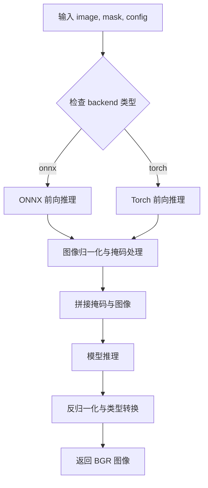

#### 带注释源码

```python
# 推断源码（基于 MIGAN 类中 forward 方法的逻辑）
def _pad_forward(self, image, mask, config):
    """
    处理 512x512 图像块的修复核心逻辑。
    根据后端类型（ONNX 或 Torch）执行相应推理。
    """
    backend = getattr(self, 'backend', 'torch')
    
    if backend == 'onnx' and getattr(self, 'use_pipeline', False):
        # ONNX Pipeline 模式：期望 uint8 RGB 图像和掩码
        binary_mask = np.where(mask > 120, 0, 255).astype(np.uint8)
        img_nchw = np.transpose(image, (2, 0, 1))[np.newaxis, ...]  # (1, 3, H, W)
        
        # 处理掩码维度
        if binary_mask.ndim == 3 and binary_mask.shape[2] == 1:
            binary_mask_2d = binary_mask[:, :, 0]
        else:
            binary_mask_2d = binary_mask
        mask_nchw = binary_mask_2d[np.newaxis, np.newaxis, ...]  # (1, 1, H, W)

        ort_inputs = {
            self.session.get_inputs()[0].name: img_nchw,
            self.session.get_inputs()[1].name: mask_nchw
        }
        out = self.session.run(None, ort_inputs)[0]
        out_img = np.transpose(out[0], (1, 2, 0))
        return out_img  # RGB 格式
    elif backend == 'onnx':
        # ONNX 原生模式：需要预处理
        img_norm = norm_img(image)
        img_norm = img_norm * 2 - 1
        m = (mask > 120).astype(np.uint8) * 255
        m_norm = norm_img(m)
        img_np = img_norm[np.newaxis, ...]
        mask_np = m_norm[np.newaxis, ...]
        erased = img_np * (1 - mask_np)
        concat = np.concatenate([0.5 - mask_np, erased], axis=1)
        ort_inputs = {self.session.get_inputs()[0].name: concat}
        out = self.session.run(None, ort_inputs)[0]
        out_img = np.clip((out.transpose(0, 2, 3, 1) * 127.5 + 127.5).round(), 0, 255).astype(np.uint8)[0]
        return out_img
    else:
        # Torch 模式
        import torch
        img_norm = norm_img(image)
        img_norm = img_norm * 2 - 1
        m = (mask > 120).astype(np.uint8) * 255
        m_norm = norm_img(m)
        image_t = torch.from_numpy(img_norm).unsqueeze(0).to(self.device)
        mask_t = torch.from_numpy(m_norm).unsqueeze(0).to(self.device)
        erased_img = image_t * (1 - mask_t)
        input_image = torch.cat([0.5 - mask_t, erased_img], dim=1)
        output = self.model(input_image)
        output = (
            (output.permute(0, 2, 3, 1) * 127.5 + 127.5)
            .round()
            .clamp(0, 255)
            .to(torch.uint8)
        )
        return output[0].cpu().numpy()
```

---

**注意**：此推断基于 `MIGAN` 类中 `forward` 方法的实现逻辑。实际 `_pad_forward` 的代码应参考 `InpaintModel` 基类。建议提供完整的父类代码以获取准确实现。


### `MIGAN._crop_box`

根据提供的代码，`_crop_box` 方法在父类 `InpaintModel` 中定义，此处为调用该方法的逻辑。该方法用于根据给定的边界框从原图中裁剪出对应区域，并返回裁剪后的图像、掩码和调整后的边界框（考虑填充等处理）。

注意：由于提供的代码中仅包含 `MIGAN` 类的实现，未包含父类 `InpaintModel` 的完整定义，因此以下信息基于代码调用上下文和逻辑推断得出。

#### 参数

- `image`：`numpy.ndarray`，原始 RGB 图像 [H, W, C]
- `mask`：`numpy.ndarray`，掩码图像 [H, W]
- `box`：`tuple` 或 `list`，边界框坐标，通常为 (x1, y1, x2, y2) 格式
- `config`：`Config` 对象，包含配置参数（如 `hd_strategy_crop_margin` 等）

#### 返回值

- `crop_image`：`numpy.ndarray`，裁剪后的图像
- `crop_mask`：`numpy.ndarray`，裁剪后的掩码
- `crop_box`：`tuple`，调整后的边界框坐标 (x1, y1, x2, y2)

#### 流程图

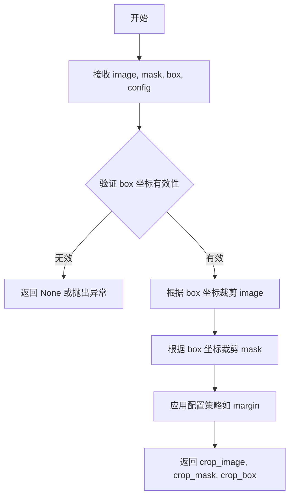

#### 带注释源码（调用处）

```python
# 在 MIGAN.__call__ 方法中调用 _crop_box
for box in boxes:
    # 调用 _crop_box 方法进行裁剪
    # image: 原始图像 [H, W, C] RGB
    # mask: 掩码 [H, W]
    # box: 从 boxes_from_mask 生成的边界框 (x1, y1, x2, y2)
    # config: 配置对象
    crop_image, crop_mask, crop_box = self._crop_box(image, mask, box, config)
    
    # 获取裁剪区域的原始尺寸
    origin_size = crop_image.shape[:2]
    
    # 调整图像和掩码到最大尺寸限制 512
    resize_image = resize_max_size(crop_image, size_limit=512)
    resize_mask = resize_max_size(crop_mask, size_limit=512)
    
    # 对调整大小后的图像进行 inpainting
    inpaint_result = self._pad_forward(resize_image, resize_mask, config)
    
    # 将结果调整回原始尺寸
    inpaint_result = imk.resize(
        inpaint_result,
        (origin_size[1], origin_size[0]),
        mode=Image.Resampling.BICUBIC,
    )
    
    # 保留原始像素（未掩码的区域）
    original_pixel_indices = crop_mask < 127
    inpaint_result[original_pixel_indices] = crop_image[original_pixel_indices]
    
    # 存储结果和边界框
    crop_result.append((inpaint_result, crop_box))
```


## 关键组件


### 张量索引与惰性加载

该模型实现了延迟加载模式，模型仅在首次调用时加载。通过`init_model`方法根据`backend`参数选择加载ONNX或JIT模型，而非在类初始化时立即加载。模型权重以二进制形式存储，按需从磁盘读取到内存，有效降低了启动时的内存占用。

### 反量化支持

在`forward`方法中实现了完整的反量化流程。当使用非pipeline模式时，输出张量从归一化域转换回像素域：先将输出从[-1,1]范围乘以127.5并加127.5偏移，然后使用`.round()`四舍五入并`.clamp(0, 255)`裁剪到有效像素范围，最后转换为`uint8`类型。这一过程确保了浮点推理结果能够正确转换为可视化的BGR图像格式。

### 量化策略

模型支持两种量化/加速策略：一是ONNX运行时量化，通过`ort.InferenceSession`加载预量化的ONNX模型执行推理；二是Torch JIT量化，使用`load_jit_model`加载经过TorchScript编译的模型。两种策略均支持在CPU/GPU上运行，通过`get_providers()`获取设备对应的推理providers。

### HD裁剪策略

`__call__`方法实现了基于掩码区域的高清图像处理策略。当输入图像尺寸不等于512x512时，使用`boxes_from_mask`从掩码中提取连通区域边界，对每个区域独立进行裁剪、resize到512限制、处理、然后还原原始尺寸并融合。该策略有效解决了大尺寸图像的显存限制问题。

### 掩码处理与融合

在处理非512尺寸图像时，使用`original_pixel_indices = crop_mask < 127`创建布尔索引，仅将掩码区域的修复结果与原图融合，保留已知区域的原始像素值。该方法避免了边界artifacts并确保了修复区域与周围环境的自然过渡。

### 图像预处理管道

模型包含标准化的图像预处理流程：`norm_img`将输入归一化到[0,1]，然后执行`img_norm * 2 - 1`变换到[-1,1]区间。掩码处理使用阈值120将灰度掩码转换为二值掩码（>120为255，否则为0），与输入图像采用相同的归一化策略，确保模型输入的一致性。

### 多后端适配器

`forward`方法实现了三种推理后端的适配逻辑：pipeline ONNX模型期望uint8 RGB和二值掩码；原始ONNX模型期望归一化到[-1,1]的4通道输入（mask+erased image）；Torch模型使用`torch.from_numpy`转换并移至指定设备。每种后端对应不同的输入预处理和输出后处理实现。


## 问题及建议


### 已知问题

-   **Mask 阈值硬编码**：代码中多处使用 `120` 作为 mask 阈值（如 `mask > 120`、`binary_mask = np.where(mask > 120, 0, 255)`），缺乏配置灵活性
-   **图像尺寸硬编码**：`512` 在多处硬编码（`size_limit=512`、`min_size = 512`），不便于未来支持不同分辨率
-   **重复的预处理逻辑**：`forward` 方法中 torch 和 onnx 分支包含大量重复的图像归一化、mask 处理逻辑，违反 DRY 原则
-   **设备属性未初始化**：torch 分支使用 `self.device`，但该属性在类定义中未显式初始化，依赖父类或外部传入
-   **Onnx pipeline 判断逻辑缺陷**：`getattr(self, 'use_pipeline', False)` 使用了 `use_pipeline` 属性，但类中定义的是 `use_pipeline_for_onnx`，可能导致逻辑不一致
-   **条件导入位置不当**：`import torch` 在 `__call__` 方法内部和 `forward` 方法的 else 分支重复导入，应在文件顶部统一导入
-   **Debug 功能不完善**：仅通过 `os.environ.get('MIGAN_DEBUG_SHAPES')` 打印信息，缺少更详细的日志级别控制
-   **Mask 维度处理复杂**：`if binary_mask.ndim == 3 and binary_mask.shape[2] == 1` 的判断逻辑应在更早阶段统一处理
-   **缺乏输入验证**：未对 `image` 和 `mask` 的形状、类型、值域进行验证，可能导致运行时错误

### 优化建议

-   将 `120`、`512`、`127.5` 等魔数提取为类常量或配置参数，提高可维护性
-   将 torch 和 onnx 的公共预处理逻辑提取为私有方法（如 `_preprocess_image`、`_preprocess_mask`），减少重复代码
-   在 `init_model` 中明确初始化 `self.device` 属性，确保 torch 后端能正确获取设备信息
-   统一 `use_pipeline` 和 `use_pipeline_for_onnx` 的命名和使用，避免混淆
-   将 `import torch` 移至文件顶部，避免重复导入和运行时开销
-   添加更完善的日志系统，支持多种日志级别
-   在 `__call__` 和 `forward` 方法入口添加输入验证逻辑，检查 image 和 mask 的形状兼容性、类型正确性、值域范围

## 其它


### 设计目标与约束

MIGAN是一个高性能的图像修复（Inpainting）模型，旨在支持多种后端（ONNX、Torch）并处理任意尺寸的图像。其核心设计目标包括：1）支持512x512图像的快速处理，2）对大图像采用裁剪策略避免显存溢出，3）提供统一的接口供上层pipeline调用。在约束方面，模型要求输入图像为RGB格式、mask为灰度图，输出为BGR格式；图像尺寸需满足512对齐；mask中255表示需要修复的区域。

### 错误处理与异常设计

模型加载阶段可能抛出`FileNotFoundError`（模型文件未下载）、`onnxruntime.InvalidArgument`（ONNX模型输入shape不匹配）；推理阶段可能抛出`ValueError`（图像尺寸为0或mask为空）、`RuntimeError`（CUDA内存不足）。当前实现中，模型下载使用同步阻塞方式，推理路径中的异常会直接向上抛出，建议增加重试机制和降级策略（如ONNX失败时自动回退到Torch后端）。

### 数据流与状态机

数据流遵循以下路径：输入RGB图像和mask → 判断尺寸是否为512×512 → 若否则进行mask连通域分析获取boxes → 对每个box裁剪并resize到512×512 → 推理（根据backend选择ONNX或Torch路径）→ 逆向处理（resize回原尺寸、还原原始像素、拼接到原图）→ 输出修复后的BGR图像。状态机包含：INIT（模型未加载）、READY（模型已加载可推理）、ERROR（加载或推理异常）。

### 外部依赖与接口契约

外部依赖包括：1）onnxruntime（ONNX推理引擎），2）torch（JIT模型推理），3）imkit（图像处理工具），4）PIL（图像读写），5）numpy（数值计算），6）modules.utils.download.ModelDownloader（模型下载管理），7）modules.utils.device.get_providers（设备提供者获取）。接口契约方面，`init_model`接收device和backend参数，`__call__`和`forward`接收image、mask、config三个参数，均返回BGR格式的numpy数组。

### 性能考虑与优化建议

当前实现的性能瓶颈包括：1）大图像处理时多次调用resize_max_size和imk.resize，2）裁剪策略中对每个box串行推理，3）onnx session在多次调用时未启用图优化。建议优化方向：1）使用批量推理替代串行box处理，2）启用ONNX的graph optimization（session_options.graph_optimization_level），3）对频繁调用的推理路径添加结果缓存，4）考虑使用TensorRT作为ONNX的provider以加速推理。

### 资源管理与内存优化

Torch后端推理时使用`with torch.no_grad()`避免梯度计算；对于ONNX模型，session对象在模型生命周期内复用；图像处理过程中及时释放临时数组（大图像裁剪场景下可显式调用`del`）。当前未实现输入图像尺寸超过显存限制时的自动降级策略，建议增加动态分辨率调整机制。

### 配置管理与参数说明

Config对象包含hd_strategy_crop_margin（裁剪边距，固定为128）、backend（推理后端，可选onnx/torch）等参数。模型类静态属性包括：min_size=512（最小处理尺寸）、pad_mod=512（填充模数）、pad_to_square=True（是否填充为正方形）、is_erase_model=True（标记为擦除模型）、use_pipeline_for_onnx=False（是否使用pipeline格式的ONNX模型）。建议将这些硬编码的静态属性纳入Config配置，以提升灵活性。

### 版本兼容性与平台适配

代码中import torch在方法内部延迟加载（避免顶层依赖），但部分路径（如boxes_from_mask、resize_max_size等）依赖的utils函数未做兼容性检查。ONNX模型支持CPU和CUDA providers，通过get_providers(device)动态获取。建议增加Python版本检查（当前仅支持Python 3.8+）和关键依赖版本校验。

### 测试策略建议

单元测试应覆盖：1）512×512图像的直通路径，2）大图像裁剪与拼接的完整性，3）ONNX和Torch后端输出一致性（允许轻微数值差异），4）异常输入（空mask、非RGB格式）的错误处理。集成测试应验证ModelDownloader的下载流程和模型实际推理效果。

### 监控与调试支持

当前已提供MIGAN_DEBUG_SHAPES环境变量用于shape调试，建议扩展为更完善的调试体系：1）增加MIGAN_LOG_LEVEL环境变量控制日志级别，2）输出推理耗时统计（区分预处理、推理、后处理阶段），3）记录模型加载时间、内存占用等元数据。

    