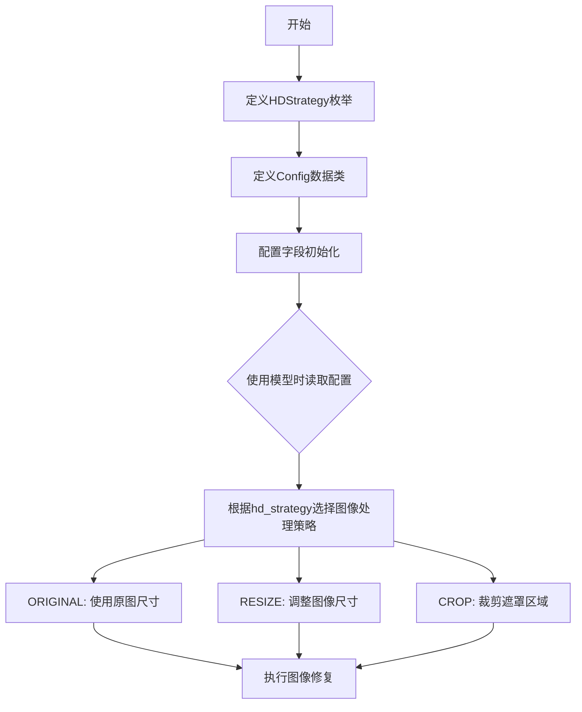

# `comic-translate\modules\inpainting\schema.py` 详细设计文档

定义lama-cleaner图像修复工具的配置模式，包含高清策略枚举（HDStrategy）和配置数据类（Config），用于控制图像预处理方式、遮罩处理、模型参数等核心功能

## 整体流程



## 类结构

```
HDStrategy (str, Enum)
└── ORIGINAL / RESIZE / CROP

Config (dataclass)
└── zits_wireframe
└── hd_strategy
└── hd_strategy_crop_margin
└── hd_strategy_crop_trigger_size
└── hd_strategy_resize_limit
```

## 全局变量及字段


### `HDStrategy`
    
高清图像修复策略枚举类，定义三种图像处理策略：原图尺寸、调整尺寸、裁剪遮罩区域

类型：`Enum(str, Enum)`
    


### `Config`
    
图像修复配置数据类，封装ZITS模型参数和高清策略配置选项

类型：`dataclass`
    


### `HDStrategy.ORIGINAL`
    
使用原图尺寸进行修复

类型：`str`
    


### `HDStrategy.RESIZE`
    
调整图像长边至限定值后修复

类型：`str`
    


### `HDStrategy.CROP`
    
从原图裁剪遮罩区域进行修复

类型：`str`
    


### `Config.zits_wireframe`
    
ZITS模型线框渲染开关

类型：`bool`
    


### `Config.hd_strategy`
    
高清策略类型

类型：`str`
    


### `Config.hd_strategy_crop_margin`
    
裁剪策略的边缘margin

类型：`int`
    


### `Config.hd_strategy_crop_trigger_size`
    
触发裁剪策略的图像尺寸阈值

类型：`int`
    


### `Config.hd_strategy_resize_limit`
    
调整尺寸策略的限定值

类型：`int`
    
    

## 全局函数及方法


## 关键组件


### HDStrategy 枚举类

定义高分辨率图像修复策略的枚举类型，包含三种策略：ORIGINAL（使用原始尺寸）、RESIZE（调整尺寸后修复再还原）、CROP（裁剪遮罩区域进行修复）。

### Config 数据类

图像修复配置的数据类，封装了ZITS模型和高分辨率处理策略的所有配置参数，包括线框检测开关、高分辨率策略类型、裁剪边距、触发裁剪的图像尺寸阈值以及调整尺寸的限制值。


## 问题及建议


### 已知问题

-   **类型注解错误**：`hd_strategy` 字段类型声明为 `str`，但实际应使用 `HDStrategy` 枚举类型，导致类型检查失效，枚举形同虚设。
-   **大量注释代码**：存在大段被注释掉的配置（如 LDMSampler、SDSampler、各模型配置等），这些遗留注释增加维护成本且可能被误读。
-   **缺少配置验证**：Config 类没有对数值字段（如 `hd_strategy_resize_limit`、`hd_strategy_crop_margin` 等）进行有效性验证，可能接受非法值（如负数或零）。
-   **类型声明不一致**：部分注释提到 `use_croper: bool = False`，但实际代码中被注释，类型一致性无法验证。

### 优化建议

-   修正 `hd_strategy` 的类型声明为 `HDStrategy`，确保类型安全：`hd_strategy: HDStrategy = HDStrategy.ORIGINAL`
-   移除或整理被注释掉的代码块，若需保留历史配置建议迁移到 CHANGELOG 或文档中
-   在 Config 类中添加 `__post_init__` 方法或使用 Pydantic 替代 dataclasses，以实现配置值的运行时验证
-   为关键配置字段添加详细的 docstring 说明其用途和约束条件
-   考虑使用 Pydantic 的 Field 验证器替代纯 dataclass，以获得更好的类型验证和自动文档生成能力


## 其它


### 设计目标与约束

本模块旨在为图像修复（inpainting）功能提供统一的配置管理框架，支持多种高清策略（HDStrategy）的灵活配置。设计约束包括：1）Config类采用dataclass实现，保证配置对象的不可变性和自动生成方法；2）HDStrategy继承str和Enum，确保与字符串类型兼容并提供枚举安全；3）配置项预留了多种模型参数（已注释），体现可扩展性设计。

### 错误处理与异常设计

本模块作为纯配置定义层，不涉及运行时错误处理。预期异常场景包括：1）hd_strategy_crop_margin和hd_strategy_resize_limit为负数或零时的值域错误；2）hd_strategy_crop_trigger_size小于等于0的配置错误；3）hd_strategy值不在HDStrategy枚举范围内的类型错误。建议在配置解析层（如从JSON/YAML加载时）增加Schema验证，使用Pydantic或自定义校验器进行预处理。

### 数据流与状态机

配置数据流如下：1）外部调用方创建Config实例或从持久化存储（JSON/YAML）反序列化；2）Config对象作为参数传递给具体的修复模型（如ZITS、SD、CV2等）；3）模型内部根据hd_strategy字段决定图像预处理策略（原始尺寸/缩放/裁剪）；4）处理完成后根据策略反向还原图像尺寸。状态机体现在hd_strategy的三个状态转换：ORIGINAL（保持原图）→ RESIZE（缩放处理）→ CROP（裁剪区域处理）。

### 外部依赖与接口契约

本模块依赖Python标准库：typing.Optional、enum.Enum、dataclasses.dataclass。接口契约方面：1）HDStrategy枚举值必须为字符串类型，实现str和Enum多重继承确保兼容性；2）Config类字段提供类型注解和默认值，支持dict配置与对象的相互转换；3）预留的模型配置字段（注释部分）体现与LDM、Stable Diffusion、OpenCV、Paint by Example、InstructPix2Pix、ControlNet等外部模块的契约关系。

### 扩展性考虑

Config类采用dataclass定义，便于未来添加新配置项：1）新增配置只需声明字段名、类型和默认值，无需修改现有代码结构；2）HDStrategy枚举可轻松扩展新的策略（如HYBRID混合策略）；3）注释中的多模型配置预留了扩展接口，当前仅启用ZITS模型相关配置，其他模型配置可通过取消注释方式激活。建议未来使用Pydantic替代dataclass以获得更强大的验证和序列化能力。

### 版本兼容性说明

当前代码基于Python 3.7+（dataclass支持），兼容Python 3.8+的typing模块优化。Config类的field默认值与Python版本对应关系：Python 3.10+可使用kw_only=True实现强制关键字参数。HDStrategy的str, Enum多重继承模式适用于Python 3.11+的枚举优化。建议在项目requirements.txt中明确Python版本要求（≥3.9）。

### 安全性考虑

当前配置模块不涉及敏感信息存储，但预留的sd_seed、paint_by_example_seed等字段可能用于随机数生成，建议：1）若配置从外部文件加载，需确保文件权限最小化；2）未来若添加API密钥等敏感配置，应使用环境变量或密钥管理服务而非明文配置；3）Config对象在序列化（如to_json）时需注意敏感字段的脱敏处理。

### 配置使用示例与默认值策略

默认值策略说明：hd_strategy默认为ORIGINAL策略，确保最保守的图片处理方式；hd_strategy_crop_margin=512、hd_strategy_crop_trigger_size=512、hd_strategy_resize_limit=512三个参数保持一致，确保触发裁剪和缩放的阈值统一。zits_wireframe默认为True，启用ZITS模型的线框检测功能。使用示例：config = Config(hd_strategy=HDStrategy.RESIZE, hd_strategy_resize_limit=1024)可覆盖默认配置。


    