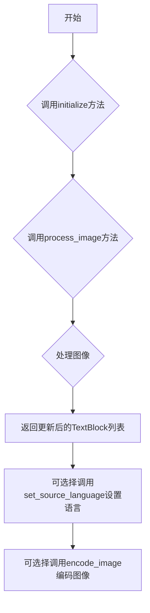
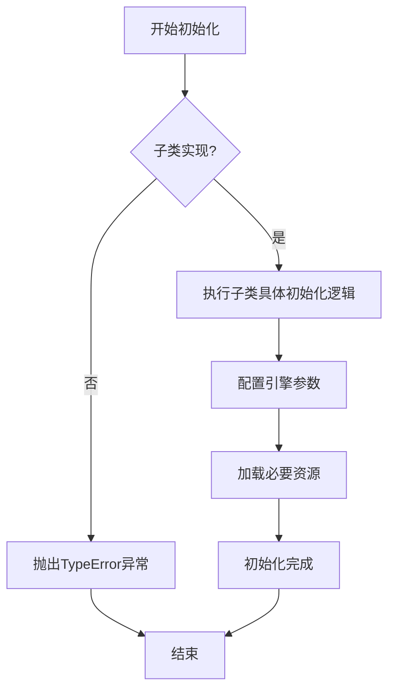
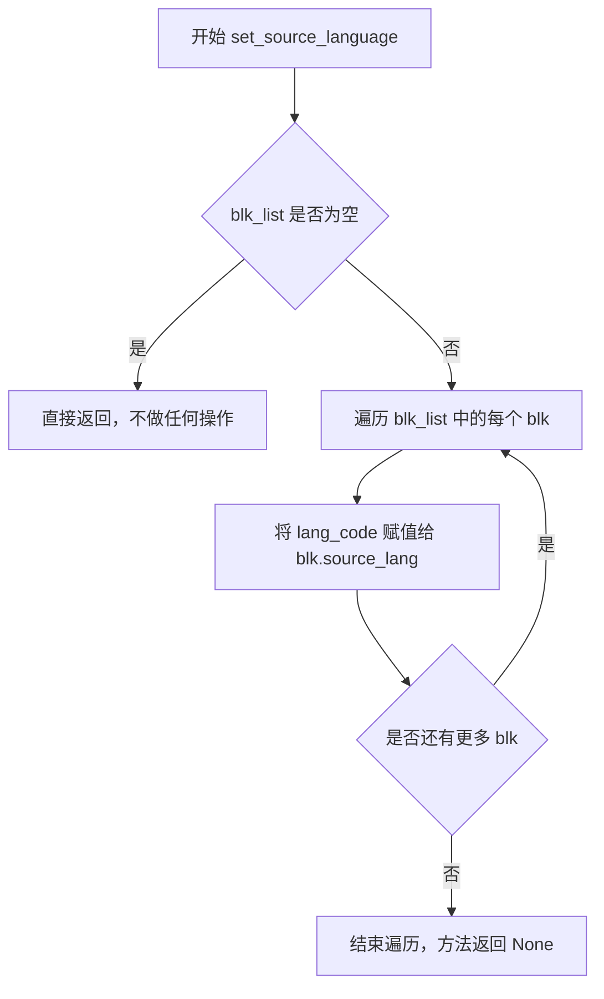

# `comic-translate\modules\ocr\base.py` 详细设计文档

这是一个OCR引擎的抽象基类，定义了OCR引擎的标准接口和通用工具方法。所有具体的OCR实现（如Tesseract、PaddleOCR等）都应继承此类并实现抽象方法。

## 整体流程



## 类结构

```
OCREngine (抽象基类)
└── 子类实现 (需实现process_image和initialize方法)
```

## 全局变量及字段


    

## 全局函数及方法


### `OCREngine.process_image`

这是 OCR 引擎的抽象方法，用于对图像进行 OCR 识别并更新文本块中的识别文本。所有具体的 OCR 实现类都应继承 `OCREngine` 类并实现此方法。

参数：

- `self`：隐式参数，调用该方法的实例对象
- `img`：`np.ndarray`，输入的图像数据，以 NumPy 数组形式表示
- `blk_list`：`list[TextBlock]`，需要进行 OCR 处理的 TextBlock 对象列表，这些对象将被更新包含识别出的文本

返回值：`list[TextBlock]`，返回更新后的 TextBlock 对象列表，每个对象都包含了从图像中识别出的文本内容

#### 流程图

```mermaid
flowchart TD
    A[开始 process_image] --> B{子类实现}
    B -->|接收到图像 img 和文本块列表 blk_list|
    C[对图像进行 OCR 识别] --> D[遍历每个 TextBlock]
    D --> E[更新 TextBlock 的文本内容]
    E --> F[返回更新后的 blk_list]
    
    style B fill:#ff9900,stroke:#333,stroke-width:2px
    style C fill:#ff6666,stroke:#333,stroke-width:2px
    style F fill:#66ff66,stroke:#333,stroke-width:2px
```

#### 带注释源码

```python
@abstractmethod
def process_image(self, img: np.ndarray, blk_list: list[TextBlock]) -> list[TextBlock]:
    """
    Process an image with OCR and update text blocks with recognized text.
    
    Args:
        img: Input image as numpy array
        blk_list: List of TextBlock objects to update with OCR text
        
    Returns:
        List of updated TextBlock objects with recognized text
    """
    pass
```


### `OCREngine.initialize`

该方法是OCR引擎的抽象初始化方法，由子类实现，用于配置引擎所需的参数和资源。

参数：

- `self`：隐式参数，指向类实例本身
- `**kwargs`：可变关键字参数，用于传递引擎特定的初始化参数

返回值：`None`，无返回值

#### 流程图



#### 带注释源码

```python
@abstractmethod
def initialize(self, **kwargs) -> None:
    """
    Initialize the OCR engine with necessary parameters.
    
    Args:
        **kwargs: Engine-specific initialization parameters
    """
    pass
```


### `OCREngine.set_source_language`

该静态方法用于批量设置文本块的源语言代码，遍历文本块列表并将指定的语言代码分配给每个文本块的 source_lang 属性。

参数：

- `blk_list`：`list[TextBlock]`，包含需要设置语言代码的 TextBlock 对象列表
- `lang_code`：`str`，要设置的源语言代码（如 "en"、"zh-CN" 等）

返回值：`None`，该方法直接修改 blk_list 中各元素的 source_lang 属性，无返回值

#### 流程图



#### 带注释源码

```python
@staticmethod
def set_source_language(blk_list: list[TextBlock], lang_code: str) -> None:
    """
    Set source language code for all text blocks.
    
    Args:
        blk_list: List of TextBlock objects
        lang_code: Language code to set for source language
    """
    # 遍历文本块列表，为每个文本块设置源语言代码
    for blk in blk_list:
        blk.source_lang = lang_code
```


### `OCREngine.encode_image`

将图像编码为Base64字符串的静态方法，用于图像传输或存储。

参数：

- `image`：`np.ndarray`，输入图像作为numpy数组
- `ext`：`str`，图像格式扩展名（默认为.jpg）

返回值：`str`，Base64编码的图像字符串

#### 流程图

```mermaid
flowchart TD
    A[开始 encode_image] --> B[接收参数 image, ext]
    B --> C[调用 imk.encode_image 编码图像]
    C --> D[调用 base64.b64encode 转换为base64字节]
    D --> E[调用 decode('utf-8') 解码为字符串]
    E --> F[返回 base64 字符串]
```

#### 带注释源码

```python
@staticmethod
def encode_image(image: np.ndarray, ext: str = '.jpg') -> str:
    """
    Encode an image as base64 string.
    
    Args:
        image: Image as numpy array
        ext: Image format extension (default is .jpg)
    Returns:
        Base64 encoded image string
    """
    # 去除扩展名前的点（如果存在），因为 imkit.encode_image 可能需要不带点的格式
    img_buffer = imk.encode_image(image, ext.lstrip('.'))
    
    # 将图像编码结果转换为 base64 字节，然后解码为 UTF-8 字符串
    return base64.b64encode(img_buffer).decode('utf-8')
```

## 关键组件


### OCREngine 抽象基类

OCR引擎的抽象基类，定义了所有OCR引擎必须实现的接口和通用工具方法，采用模板方法模式规范引擎实现。

### process_image 抽象方法

子类必须实现的图像OCR处理方法，用于识别图像中的文字并更新文本块列表。

### initialize 抽象方法

子类必须实现的引擎初始化方法，接受可变关键字参数用于引擎特定配置。

### set_source_language 静态方法

批量设置文本块的源语言代码，遍历并更新所有TextBlock对象的source_lang属性。

### encode_image 静态方法

将NumPy数组格式的图像编码为Base64字符串，调用imkit库进行图像编码，支持指定输出格式。

### TextBlock 依赖类型

从utils.textblock模块导入的文本块数据类，用于存储OCR识别结果和元信息。

### imkit 外部依赖库

imkit库（别名imk）提供图像编码功能，是图像处理的关键外部依赖。


## 问题及建议


### 已知问题

-   **类型提示不一致**：代码使用了 `list[TextBlock]` 语法（Python 3.9+），但未考虑 Python 3.8 及以下版本的兼容性，应使用 `List[TextBlock]` 并从 `typing` 导入
-   **encode_image 方法设计不当**：该方法不依赖任何 OCR 引擎特有逻辑，属于通用工具函数，放在抽象基类中职责不清，应提取到独立的工具模块
-   **initialize 方法签名模糊**：使用 `**kwargs` 但无文档说明所需参数，子类实现者无法得知需要哪些初始化参数
-   **静态方法设计不合理**：`set_source_language` 操作 TextBlock 对象属性但定义为静态方法，语义上更适合作为 TextBlock 类的类方法或普通方法
-   **缺少错误处理**：encode_image 方法未处理 imk.encode_image 可能出现的异常（如无效图像格式、编码失败等）
-   **process_image 返回值语义不明确**：文档描述为"update text blocks"，暗示可能是原地修改，但返回 List 意味着可能创建新对象，设计意图模糊
-   **外部依赖无保护**：直接导入 imkit 模块，无备选方案或错误提示
-   **文档可改进**：缺少对异常情况、线程安全性、使用示例的说明

### 优化建议

-   迁移至 `from typing import List` 并使用 `List[TextBlock]` 以兼容 Python 3.8
-   将 encode_image 提取为独立工具函数或放入 utils 模块
-   为 initialize 方法定义明确的参数 schema 或使用 dataclass/TypedDict 替代 **kwargs
-   考虑将 set_source_language 移至 TextBlock 类作为类方法
-   为 encode_image 添加 try-except 异常处理和明确的异常类型
-   明确 process_image 的设计意图（修改原对象还是返回新对象），并在文档中说明
-   为 imkit 依赖添加可选导入或文档说明其必要性
-   增加文档字符串，说明抽象方法的实现要求、异常抛出、线程安全等约束


## 其它


### 设计目标与约束

本OCREngine抽象类的设计目标是定义一个统一的OCR引擎接口规范，使得不同的OCR实现（如Tesseract、百度OCR、Google Cloud Vision等）能够遵循统一的接口进行图像文字识别。设计约束包括：1）所有具体实现必须继承自本类并实现process_image和initialize抽象方法；2）支持numpy数组格式的图像输入；3）使用TextBlock对象作为文本块的数据结构；4）提供静态工具方法set_source_language和encode_image以简化通用操作。

### 错误处理与异常设计

由于本类为抽象基类，具体的错误处理由子类实现。抽象层定义以下异常处理原则：1）process_image方法应捕获图像处理过程中的异常并返回原始blk_list或抛出自定义OCRException；2）initialize方法应验证输入参数的合法性，对于无效参数应抛出ValueError或TypeError；3）encode_image方法应处理图像编码失败的情况，捕获imkit库可能抛出的异常并重新抛出为更具体的OCREngineException；4）所有公开方法应包含基本的参数类型检查，确保img为numpy.ndarray类型，blk_list为list类型。

### 数据流与状态机

OCREngine的数据流如下：1）客户端调用initialize进行初始化配置；2）客户端准备输入图像（numpy数组）和文本块列表；3）调用process_image方法，图像经过OCR引擎识别，识别结果更新到TextBlock对象中；4）返回更新后的TextBlock列表。整个过程状态机包含三个状态：UNINITIALIZED（未初始化）-> INITIALIZED（已初始化）-> PROCESSING（处理中）-> COMPLETED（完成）。需要注意的是，本抽象类本身不维护状态，具体状态管理由子类实现。

### 外部依赖与接口契约

本类的外部依赖包括：1）numpy库，用于图像数据的矩阵表示；2）base64库，用于图像编码；3）imkit库（imk别名），提供图像编码功能；4）TextBlock类，来自内部模块..utils.textblock。接口契约方面：1）process_image的输入img必须是三维numpy数组（高度x宽度x通道），blk_list必须是TextBlock对象列表；2）initialize接受任意关键字参数，具体参数由子类定义；3）encode_image返回base64编码的UTF-8字符串；4）set_source_language方法直接修改TextBlock对象的source_lang属性，不返回新对象。

### 使用场景与用例

典型使用场景包括：1）在文档扫描应用中集成OCR功能，从扫描图像中提取文字；2）在图像处理流水线中作为文字识别模块；3）在自动化测试中作为OCR功能的mock基础类。典型用例流程为：实例化具体的OCR引擎子类 -> 调用initialize配置语言和识别参数 -> 准备图像和文本块列表 -> 调用process_image执行识别 -> 处理返回的带文字的TextBlock列表。

### 扩展点与插件机制

本类提供以下扩展点：1）子类化扩展：具体OCR引擎继承OCREngine并实现抽象方法；2）initialize方法可接受任意kwargs参数，子类可定义自己的配置参数；3）process_image方法的blk_list参数允许在识别前进行预处理或在识别后进行后处理；4）可添加装饰器模式实现日志、缓存、监控等横切关注点。插件机制方面，建议在子类实现中支持插件化的后处理器（post-processor），用于拼写检查、语言检测等附加功能。

### 性能考虑

性能设计考虑包括：1）encode_image方法使用base64编码可能带来一定的性能开销，大图像场景下需考虑是否必需；2）process_image方法的实现应尽量减少不必要的内存复制；3）set_source_language作为静态方法遍历整个blk_list，时间复杂度为O(n)，其中n为文本块数量，建议在批量处理时缓存语言设置；4）子类实现应考虑是否需要批处理能力以提升大规模图像处理效率。

### 安全性考虑

安全设计考虑包括：1）encode_image方法处理图像数据时应确保不泄露敏感像素信息到日志或错误消息中；2）initialize方法接收的kwargs参数应进行输入校验，防止注入攻击；3）process_image方法处理的图像数据可能包含敏感信息，实现类应注意数据生命周期管理；4）如果OCR引擎需要网络调用（如云端API），应实现传输层加密和数据脱敏。

### 配置与参数说明

本类本身不定义配置参数，具体配置由子类实现。推荐的通用配置参数包括：1）language参数，用于设置OCR识别语言；2）confidence_threshold参数，用于设置识别置信度阈值；3）dpi参数，用于设置图像分辨率；4）enable_preprocessing参数，用于控制是否启用图像预处理。TextBlock对象的source_lang属性用于存储文本块的源语言代码，应遵循ISO 639-1标准（如"en"、"zh-CN"等）。


    