# `comic-translate\modules\ocr\factory.py` 详细设计文档

这是一个 OCR 工厂类（OCRFactory），实现了工厂模式用于创建各种光学字符识别（OCR）引擎。它根据传入的设置（settings）、语言（source_lang_english）、模型名称（ocr_model）和后端类型（backend）来实例化相应的引擎（如 Microsoft, Google, GPT, Gemini, PPOCR 等），并通过缓存机制（_engines）提升性能，避免重复创建相同的引擎实例。

## 整体流程

```mermaid
graph TD
    A[create_engine] --> B[_create_cache_key]
    B --> C{缓存命中?}
    C -- 是 --> D[返回缓存引擎]
    C -- 否 --> E{检查Token与UserOCR}
    E -- 是 --> F[创建 UserOCR]
    E -- 否 --> G[_create_new_engine]
    G --> H{匹配通用模型?}
    H -- 是 --> I[调用特定工厂方法<br>(Microsoft/Google/GPT/Gemini)]
    H -- 否 --> J{默认模型 & 匹配语言?}
    J -- 是 --> K[调用语言工厂方法<br>(Manga/Pororo/PPOCR)]
    J -- 否 --> L[返回 None]
    F --> M[缓存引擎]
    I --> M
    K --> M
    M --> D
```

## 类结构

```
OCRFactory (工厂类)
└── 依赖与返回: OCREngine (抽象基类)
    ├── MicrosoftOCR (微软云 OCR)
    ├── GoogleOCR (谷歌云 OCR)
    ├── GPTOCR (GPT 模型 OCR)
    ├── GeminiOCR (Gemini 模型 OCR)
    ├── UserOCR (用户自定义 OCR)
    ├── PPOCRv5Engine (PPOCR v5)
    ├── MangaOCREngineONNX (漫画 OCR)
    └── PororoOCREngineONNX (韩语 OCR)
```

## 全局变量及字段


### `json`
    
JSON处理模块，用于JSON序列化和反序列化

类型：`module`
    


### `hashlib`
    
哈希计算模块，用于生成SHA256缓存键摘要

类型：`module`
    


### `resolve_device`
    
设备解析函数，根据GPU启用状态和后端类型解析计算设备

类型：`function`
    


### `torch_available`
    
PyTorch可用性检查函数，检查PyTorch库是否可用

类型：`function`
    


### `get_token`
    
账户Token获取函数，从Token存储中获取访问令牌

类型：`function`
    


### `OCRFactory._engines`
    
引擎实例缓存字典，存储已创建的OCR引擎实例以复用

类型：`dict`
    


### `OCRFactory.LLM_ENGINE_IDENTIFIERS`
    
LLM引擎标识符映射，存储LLM引擎类名与引擎类的对应关系

类型：`dict`
    
    

## 全局函数及方法


### `resolve_device`

该函数根据GPU是否启用以及指定的计算后端（ONNX或Torch），智能解析并返回最适合的设备标识符（如 'cpu'、'cuda'、'mps' 等），以确保OCR引擎能够在正确的硬件上运行。

参数：

- `is_gpu_enabled`：`bool`，表示是否启用GPU加速的布尔值，通常来自设置的 `settings.is_gpu_enabled()` 方法
- `backend`：`str`，计算后端类型，值为 `'onnx'` 或 `'torch'`，用于确定设备解析的策略

返回值：`str`，返回设备标识符，如 `'cpu'`（CPU设备）、`'cuda'`（CUDA GPU）、`'cuda:0'`（指定GPU设备）或 `'mps'`（Apple Silicon GPU）等

#### 流程图

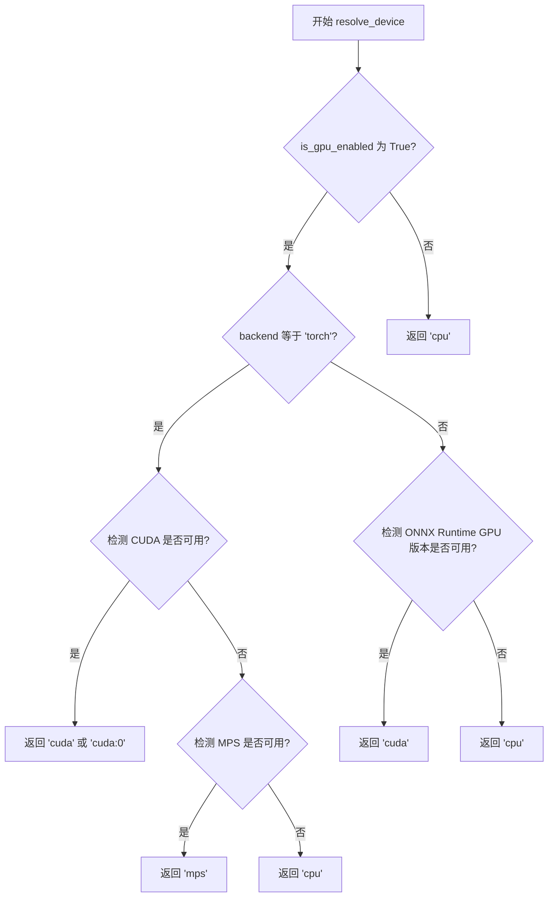

#### 带注释源码

```python
# 假设的 modules/utils/device.py 中的实现

import torch
import onnxruntime as ort

def resolve_device(is_gpu_enabled: bool, backend: str) -> str:
    """
    根据GPU启用状态和后端类型解析计算设备。
    
    Args:
        is_gpu_enabled: 是否启用GPU加速
        backend: 计算后端，'onnx' 或 'torch'
    
    Returns:
        设备标识符字符串，如 'cpu', 'cuda', 'mps' 等
    """
    # 如果未启用GPU，直接返回CPU
    if not is_gpu_enabled:
        return 'cpu'
    
    # 根据后端类型选择设备解析策略
    if backend.lower() == 'torch':
        # PyTorch 后端设备检测
        if torch.cuda.is_available():
            # CUDA 可用，返回第一个GPU设备
            return 'cuda' if torch.cuda.device_count() == 1 else 'cuda:0'
        elif torch.backends.mps.is_available():
            # Apple Silicon MPS 可用
            return 'mps'
        else:
            # 无GPU可用，回退到CPU
            return 'cpu'
    else:
        # ONNX 后端设备检测
        # 检查ONNX Runtime是否有GPU支持
        available_providers = ort.get_available_providers()
        if 'CUDAExecutionProvider' in available_providers:
            # ONNX Runtime CUDA 可用
            return 'cuda'
        elif 'CoreMLExecutionProvider' in available_providers:
            # Apple CoreML 可用（MPS等价）
            return 'mps'
        else:
            # 无GPU支持，回退到CPU
            return 'cpu'
```


### `torch_available`

该函数用于检测当前环境中 PyTorch 是否可用，通常用于决定使用 ONNX 运行时还是 PyTorch 运行时引擎。

参数： 无

返回值：`bool`，返回 `True` 表示 PyTorch 可用，返回 `False` 表示不可用。

#### 流程图

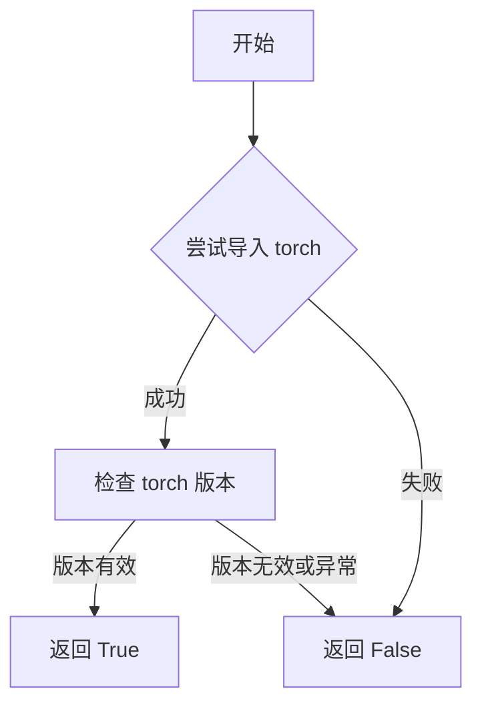

#### 带注释源码

```
# 注：此函数定义位于 modules.utils.device 模块中
# 以下为基于函数调用方式的推断实现

def torch_available() -> bool:
    """
    检测 PyTorch 是否在当前环境中可用。
    
    通常的实现方式如下：
    1. 尝试导入 torch 模块
    2. 如果导入成功，返回 True
    3. 如果导入失败（模块不存在），返回 False
    
    Returns:
        bool: PyTorch 可用返回 True，否则返回 False
    """
    try:
        import torch
        # 可选：进一步检查 torch 版本是否符合要求
        # if hasattr(torch, '__version__'):
        #     return True
        return True
    except ImportError:
        return False
```

> **注意**：由于 `torch_available()` 函数定义在 `modules.utils.device` 模块中，未包含在当前代码片段内。以上源码为基于函数调用方式的合理推断。实际实现请参考 `modules/utils/device.py` 文件。


### `get_token`

从 `app.account.auth.token_storage` 模块导入的函数，用于获取存储的认证令牌（如访问令牌、刷新令牌等）。

参数：

-  `token_type`：`str`，令牌类型标识符（如 `"access_token"`、`"refresh_token"` 等）

返回值：`str | None`，返回指定类型的令牌值，如果令牌不存在或已过期则返回 `None`

#### 流程图

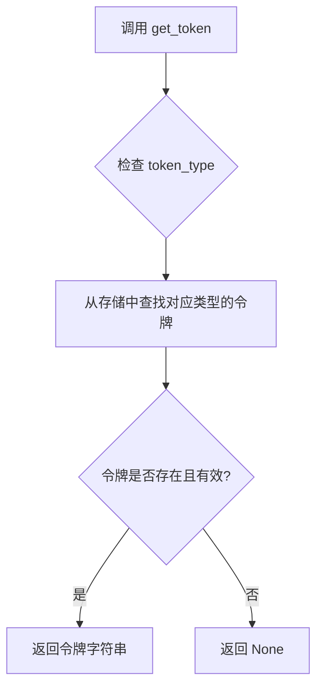

#### 带注释源码

```python
# 注意：此函数定义不在当前提供的代码文件中
# 而是从 app.account.auth.token_storage 模块导入
from app.account.auth.token_storage import get_token

# 在 OCRFactory.create_engine 中的使用示例：
# 
# # 2) For account holders using a remote model
# token = get_token("access_token")  # 获取 access_token 类型的令牌
# if token and (
#     ocr_model in UserOCR.LLM_OCR_KEYS
#     or ocr_model in UserOCR.FULL_PAGE_OCR_KEYS
# ):
#     # 如果令牌存在且模型需要远程认证
#     engine = UserOCR()
#     engine.initialize(settings, source_lang_english, ocr_model)
#     cls._engines[cache_key] = engine
#     return engine
```


### `OCRFactory.create_engine`

创建或获取适当的 OCR 引擎实例，基于设置、源语言、OCR 模型和后端类型。该方法首先检查缓存中是否已存在对应引擎，如有则直接返回；否则根据模型类型创建新引擎（优先处理需要远程账户的 UserOCR，或根据语言/模型类型选择本地引擎），并将新创建的引擎存入缓存以供后续复用。

参数：

- `cls`：类本身（类方法隐式参数），用于访问类方法和其他类属性
- `settings`：`Settings` 对象，包含 OCR 配置信息（如凭证、设备设置等）
- `source_lang_english`：`str`，源语言（英文），用于确定特定语言的 OCR 引擎（如 Japanese、Korean、Chinese 等）
- `ocr_model`：`str`，要使用的 OCR 模型标识符（如 'Microsoft OCR'、'Google Cloud Vision'、'GPT-4.1-mini'、'Default' 等）
- `backend`：`str`，后端类型，默认为 `'onnx'`，可选 `'onnx'` 或 `'torch'`

返回值：`OCREngine`，返回适当的 OCR 引擎实例

#### 流程图

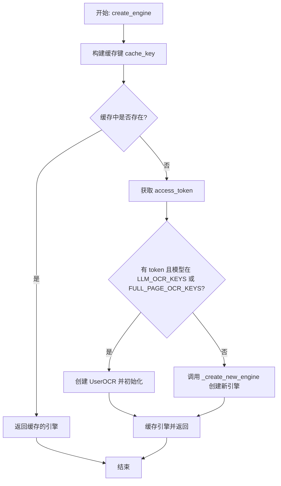

#### 带注释源码

```python
@classmethod
def create_engine(
    cls, 
    settings, 
    source_lang_english: str, 
    ocr_model: str, 
    backend: str = 'onnx'
) -> OCREngine:
    """
    Create or retrieve an appropriate OCR engine based on settings.
    
    Args:
        settings: Settings object with OCR configuration
        source_lang_english: Source language in English
        ocr_model: OCR model to use
        backend: Backend to use ('onnx' or 'torch')
        
    Returns:
        Appropriate OCR engine instance
    """
    # 使用模型、语言、设置和后端构建缓存键
    # 如果凭证或设备配置变化，缓存键会不同，确保创建新引擎
    cache_key = cls._create_cache_key(
        ocr_model, 
        source_lang_english, 
        settings, 
        backend
    )

    # 1) 如果已创建过该引擎，直接从缓存返回
    if cache_key in cls._engines:
        return cls._engines[cache_key]

    # 2) 对于使用远程模型的账户持有人
    # 检查是否存在有效的 access_token，并判断模型是否为远程 LLM 模型
    token = get_token("access_token")
    if token and (
        ocr_model in UserOCR.LLM_OCR_KEYS
        or ocr_model in UserOCR.FULL_PAGE_OCR_KEYS
    ):
        engine = UserOCR()
        engine.initialize(settings, source_lang_english, ocr_model)
        cls._engines[cache_key] = engine
        return engine

    # 3) 否则，回退到本地工厂方法创建新引擎
    engine = cls._create_new_engine(settings, source_lang_english, ocr_model, backend)
    cls._engines[cache_key] = engine
    return engine
```


### `OCRFactory._create_cache_key`

生成 OCR 引擎缓存键，用于根据配置动态生成唯一的缓存标识，确保当凭据、设备或其他设置发生变化时能够触发引擎重新创建。

参数：

- `ocr_key`：`str`，OCR 模型标识符（如 'Microsoft OCR'、'GPT-4.1-mini' 等）
- `source_lang`：`str`，源语言英文名称（如 'Japanese'、'Chinese' 等）
- `settings`：`Settings`，应用程序设置对象，包含凭据和配置信息
- `backend`：`str`，后端类型，默认为 'onnx'（可选值为 'onnx' 或 'torch'）

返回值：`str`，缓存键字符串，格式为 `{ocr_key}_{source_lang}_{backend}` 或 `{ocr_key}_{source_lang}_{backend}_{sha256_hash}`

#### 流程图

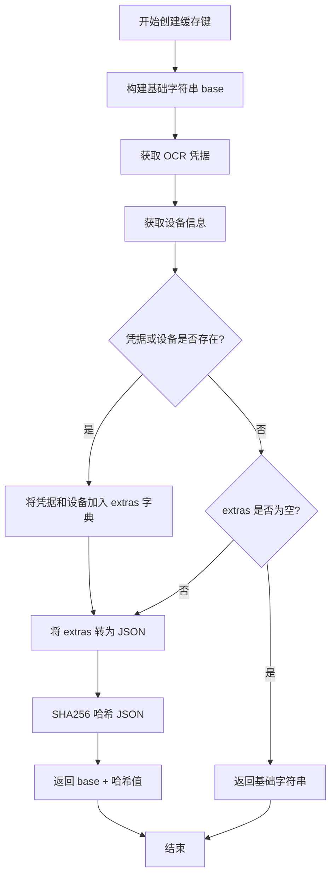

#### 带注释源码

```python
@classmethod
def _create_cache_key(
    cls, 
    ocr_key: str,        # OCR 模型标识符
    source_lang: str,    # 源语言
    settings,            # 应用程序设置对象
    backend: str = 'onnx' # 推理后端类型
) -> str:
    """
    Build a cache key for all ocr engines.

    - Always includes per-ocr credentials (if available),
      so changing any API key, URL, region, etc. triggers a new engine.
    - For LLM engines, also includes all LLM-specific settings
      (temperature, top_p, context, etc.).
    - The cache key is a hash of these dynamic values, combined with
      the ocr key and source language.
    - If no dynamic values are found, falls back to a simple key
      based on ocr and source language.
    """
    
    # Step 1: 构建基础缓存键格式
    base = f"{ocr_key}_{source_lang}_{backend}"

    # Step 2: 初始化动态配置字典
    extras = {}

    # Step 3: 获取 OCR 特定凭据（如 API Key、Endpoint 等）
    creds = settings.get_credentials(ocr_key)
    
    # Step 4: 根据后端类型和 GPU 设置解析设备
    device = resolve_device(settings.is_gpu_enabled(), backend)

    # Step 5: 将凭据信息加入动态配置（确保凭据变化时触发引擎重建）
    if creds:
        extras["credentials"] = creds
    
    # Step 6: 将设备信息加入动态配置
    if device:
        extras["device"] = device

    # Note: LLM OCR 引擎当前不使用 LLMs Tab 中的设置，故暂时排除
    # 预留代码用于未来支持 LLM 特定设置（temperature、top_p 等）
    # 
    # is_llm = any(identifier in ocr_key
    #              for identifier in cls.LLM_ENGINE_IDENTIFIERS)
    # if is_llm:
    #     extras["llm"] = settings.get_llm_settings()

    # Step 7: 无动态配置时返回简单缓存键
    if not extras:
        return base

    # Step 8: 存在动态配置时，生成哈希指纹
    # 使用 sort_keys=True 确保字典顺序一致性
    # 使用 separators=(",", ":") 最小化 JSON 字符串
    # 使用 default=str 处理不可序列化对象
    extras_json = json.dumps(
        extras,
        sort_keys=True,
        separators=(",", ":"),
        default=str
    )
    
    # Step 9: 计算 SHA256 哈希值作为配置指纹
    digest = hashlib.sha256(extras_json.encode("utf-8")).hexdigest()

    # Step 10: 返回带指纹的完整缓存键
    return f"{base}_{digest}"
```


### OCRFactory._create_new_engine

该方法是OCR工厂类的核心分发逻辑，根据传入的OCR模型名称和源语言参数，从预定义的工厂函数映射表中选择并创建相应的OCR引擎实例。

#### 参数

- `settings`：`Any`（Settings对象），包含OCR配置信息的设置对象
- `source_lang_english`：`str`，源语言英文名称（如"Japanese"、"Chinese"等）
- `ocr_model`：`str`，要使用的OCR模型标识符（如"Microsoft OCR"、"Default"等）
- `backend`：`str`，后端类型，默认为 `'onnx'`，可选 `'torch'`

#### 返回值

`OCREngine`，返回创建好的OCR引擎实例，若无匹配模型则返回 `None`

#### 流程图

```mermaid
flowchart TD
    A[开始 _create_new_engine] --> B{ocr_model 在 general 字典中?}
    B -->|是| C[调用 general[ocr_model] 创建引擎]
    B -->|否| D{ocr_model == 'Default'?}
    D -->|是| E{source_lang_english 在 language_factories 中?}
    E -->|是| F[调用 language_factories[source_lang_english] 创建引擎]
    E -->|否| G[返回 None]
    D -->|否| G
    C --> H[返回 OCREngine 实例]
    F --> H
    
    style C fill:#e1f5fe
    style F fill:#e1f5fe
    style G fill:#ffcdd2
```

#### 带注释源码

```python
@classmethod
def _create_new_engine(
    cls, 
    settings, 
    source_lang_english: str, 
    ocr_model: str, 
    backend: str = 'onnx'
) -> OCREngine:
    """Create a new OCR engine instance based on model and language."""
    
    # 通用模型工厂函数映射表
    # 特定OCR服务使用直接调用对应创建方法
    general = {
        'Microsoft OCR': cls._create_microsoft_ocr,
        'Google Cloud Vision': cls._create_google_ocr,
        'GPT-4.1-mini': lambda s: cls._create_gpt_ocr(s, ocr_model),
        'Gemini-2.0-Flash': lambda s: cls._create_gemini_ocr(s, ocr_model),
    }
    
    # 语言特定的工厂函数映射表（用于Default模型）
    # 根据源语言选择对应的本地OCR引擎
    language_factories = {
        'Japanese': lambda s: cls._create_manga_ocr(s, backend),       # 日语使用MangaOCR
        'Korean': lambda s: cls._create_pororo_ocr(s, backend),        # 韩语使用Pororo OCR
        'Chinese': lambda s: cls._create_ppocr(s, 'ch', backend),      # 中文使用PPOCR中文模型
        'Russian': lambda s: cls._create_ppocr(s, 'ru', backend),      # 俄语使用PPOCR俄语模型
        'French': lambda s: cls._create_ppocr(s, 'latin', backend),   # 法语使用PPOCR拉丁语系模型
        'English': lambda s: cls._create_ppocr(s, 'en', backend),     # 英语使用PPOCR英语模型
        'Spanish': lambda s: cls._create_ppocr(s, 'latin', backend),  # 西班牙语使用PPOCR拉丁语系模型
        'Italian': lambda s: cls._create_ppocr(s, 'latin', backend),  # 意大利语使用PPOCR拉丁语系模型
        'German': lambda s: cls._create_ppocr(s, 'latin', backend),   # 德语使用PPOCR拉丁语系模型
        'Dutch': lambda s: cls._create_ppocr(s, 'latin', backend),    # 荷兰语使用PPOCR拉丁语系模型
    }
    
    # 检查是否为特定模型（如Microsoft、Google、GPT等云服务）
    if ocr_model in general:
        return general[ocr_model](settings)
    
    # 检查是否为Default模型且源语言有对应的本地引擎
    if ocr_model == 'Default' and source_lang_english in language_factories:
        return language_factories[source_lang_english](settings)
    
    # 无匹配引擎时返回None
    return 
```


### `OCRFactory._create_microsoft_ocr`

用于创建 Microsoft Azure OCR 引擎实例的工厂方法，从设置中获取 API 凭据并初始化引擎。

参数：

- `settings`：`object`，应用设置对象，通过 `get_credentials` 方法获取 Microsoft Azure 的 API 密钥和端点

返回值：`OCREngine`，已初始化的 Microsoft OCR 引擎实例

#### 流程图

```mermaid
flowchart TD
    A[开始 _create_microsoft_ocr] --> B[获取 Microsoft Azure 凭据]
    B --> C[settings.get_credentials settings.ui.tr('Microsoft Azure')]
    C --> D[创建 MicrosoftOCR 实例]
    D --> E[调用 engine.initialize]
    E --> F[传入 api_key 和 endpoint]
    F --> G[返回初始化后的 engine]
    G --> H[结束]
```

#### 带注释源码

```python
@staticmethod
def _create_microsoft_ocr(settings) -> OCREngine:
    """
    创建 Microsoft Azure OCR 引擎实例。
    
    Args:
        settings: 应用设置对象，包含 OCR 配置信息
        
    Returns:
        已初始化的 MicrosoftOCR 引擎实例
    """
    # 从设置中获取 Microsoft Azure 的凭据信息
    # 包括 API 密钥和端点配置
    credentials = settings.get_credentials(settings.ui.tr("Microsoft Azure"))
    
    # 创建 MicrosoftOCR 引擎实例
    engine = MicrosoftOCR()
    
    # 使用凭据中的 api_key_ocr 和 endpoint 初始化引擎
    engine.initialize(
        api_key=credentials['api_key_ocr'],
        endpoint=credentials['endpoint']
    )
    
    # 返回已初始化的 OCR 引擎
    return engine
```


### `OCRFactory._create_google_ocr`

创建并初始化一个 Google Cloud Vision OCR 引擎实例，根据设置中的凭证信息进行配置。

参数：

- `settings`：`object`，应用程序设置对象，包含 OCR 配置和凭据信息

返回值：`OCREngine`，已初始化的 Google Cloud Vision OCR 引擎实例

#### 流程图

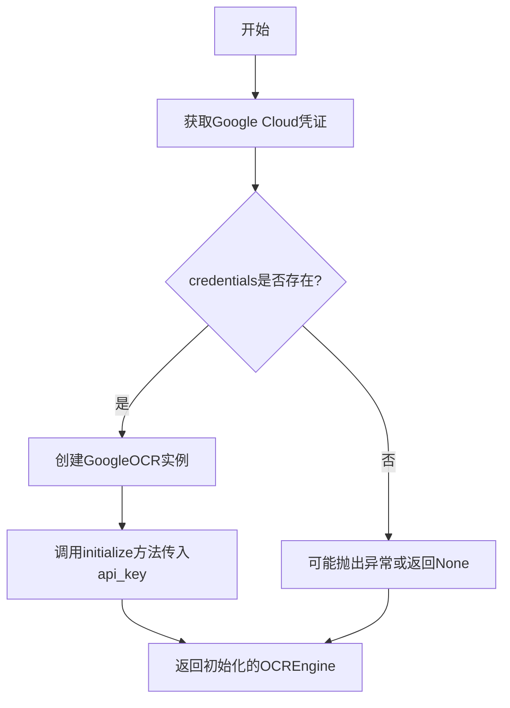

#### 带注释源码

```python
@staticmethod
def _create_google_ocr(settings) -> OCREngine:
    """
    创建Google Cloud Vision OCR引擎实例。
    
    从settings中获取Google Cloud的API凭证，
    然后创建GoogleOCR实例并用api_key初始化。
    
    Args:
        settings: 应用程序设置对象，包含OCR配置
        
    Returns:
        初始化后的GoogleOCR引擎实例
    """
    # 从settings获取Google Cloud的凭据信息
    # settings.ui.tr("Google Cloud")用于获取本地化的服务名称
    credentials = settings.get_credentials(settings.ui.tr("Google Cloud"))
    
    # 创建GoogleOCR引擎实例
    engine = GoogleOCR()
    
    # 使用凭据中的api_key初始化引擎
    engine.initialize(api_key=credentials['api_key'])
    
    # 返回已初始化的OCR引擎
    return engine
```


### OCRFactory._create_gpt_ocr

创建并初始化一个基于GPT模型的OCR引擎实例。

参数：

- `settings`：`Settings`，包含应用程序配置和凭据信息的设置对象
- `model`：`str`，要使用的GPT模型标识符（如'GPT-4.1-mini'）

返回值：`OCREngine`，初始化完成的GPT OCR引擎实例

#### 流程图

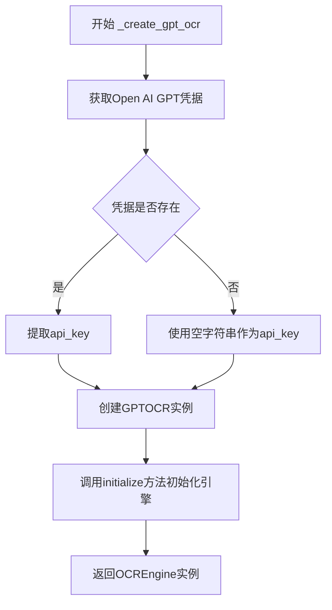

#### 带注释源码

```python
@staticmethod
def _create_gpt_ocr(settings, model) -> OCREngine:
    """
    创建GPT OCR引擎实例。
    
    Args:
        settings: 应用程序设置对象，包含API凭据
        model: 要使用的GPT模型名称
        
    Returns:
        初始化完成的GPTOCR引擎实例
    """
    # 从settings中获取Open AI GPT的凭据信息
    # settings.ui.tr()用于获取本地化的服务名称
    credentials = settings.get_credentials(settings.ui.tr("Open AI GPT"))
    
    # 从凭据字典中提取api_key，若不存在则默认为空字符串
    api_key = credentials.get('api_key', '')
    
    # 创建GPTOCR引擎实例
    engine = GPTOCR()
    
    # 使用api_key和指定的model初始化引擎
    engine.initialize(api_key=api_key, model=model)
    
    # 返回初始化后的OCR引擎实例
    return engine
```


### OCRFactory._create_gemini_ocr

创建并初始化一个Gemini OCR引擎实例，用于处理基于Google Gemini模型的OCR任务。

参数：

- `settings`：`Settings` 对象，包含OCR配置信息（如API密钥、端点等）
- `model`：`str`，要使用的Gemini模型名称（如 "Gemini-2.0-Flash"）

返回值：`OCREngine`，返回初始化后的Gemini OCR引擎实例

#### 流程图

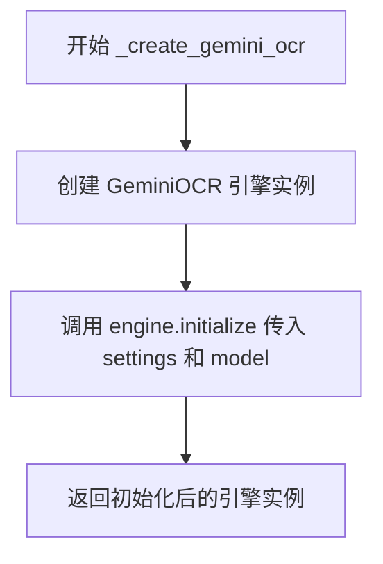

#### 带注释源码

```python
@staticmethod
def _create_gemini_ocr(settings, model) -> OCREngine:
    """
    创建并初始化Gemini OCR引擎。
    
    Args:
        settings: Settings对象，包含OCR配置信息
        model: str，要使用的Gemini模型名称
        
    Returns:
        OCREngine: 初始化后的Gemini OCR引擎实例
    """
    # 实例化GeminiOCR引擎类
    engine = GeminiOCR()
    
    # 使用settings配置和model参数初始化引擎
    # settings包含API密钥等认证信息，model指定具体模型版本
    engine.initialize(settings, model)
    
    # 返回已初始化的OCR引擎供调用方使用
    return engine
```


### `OCRFactory._create_manga_ocr`

根据设置和后端类型创建日语（漫画）OCR引擎。如果后端指定为'torch'且PyTorch可用，则使用基于PyTorch的MangaOCREngine；否则使用ONNX版本的MangaOCREngineONNX。

参数：

-  `settings`：`object`，包含OCR配置的Settings对象
-  `backend`：`str`，后端类型，'onnx'或'torch'，默认为'onnx'

返回值：`OCREngine`，返回已初始化的漫画OCR引擎实例

#### 流程图

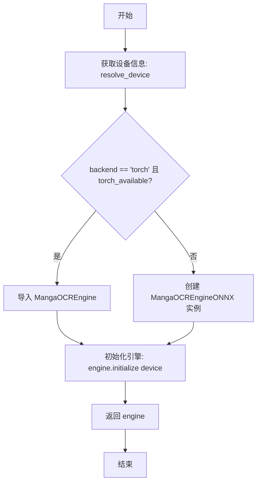

#### 带注释源码

```
@staticmethod
def _create_manga_ocr(settings, backend: str = 'onnx') -> OCREngine:
    """
    创建漫画OCR引擎实例
    
    Args:
        settings: 应用程序设置对象
        backend: 要使用的后端类型 ('onnx' 或 'torch')
    
    Returns:
        已初始化的OCR引擎实例
    """
    # 根据设置和后端类型解析计算设备（CPU/GPU）
    device = resolve_device(settings.is_gpu_enabled(), backend)
    
    # 判断条件：后端为torch且PyTorch可用
    if backend.lower() == 'torch' and torch_available():
        # 动态导入PyTorch版本的漫画OCR引擎
        from .manga_ocr.engine import MangaOCREngine
        # 创建PyTorch引擎实例
        engine = MangaOCREngine()
        # 使用解析出的设备初始化引擎
        engine.initialize(device=device)
    else:
        # 创建ONNX版本的漫画OCR引擎（默认fallback）
        engine = MangaOCREngineONNX()
        # 使用解析出的设备初始化引擎
        engine.initialize(device=device)
    
    # 返回已初始化的OCR引擎
    return engine
```


### `OCRFactory._create_pororo_ocr`

创建用于韩文识别的 Pororo OCR 引擎实例，根据后端类型选择 ONNX 或 Torch 版本。

参数：

- `settings`：`Settings`，包含 OCR 配置信息的设置对象，用于获取 GPU 启用状态
- `backend`：`str`，可选参数，指定使用的后端类型（`'onnx'` 或 `'torch'`），默认为 `'onnx'`

返回值：`OCREngine`，返回初始化后的 Pororo OCR 引擎实例

#### 流程图

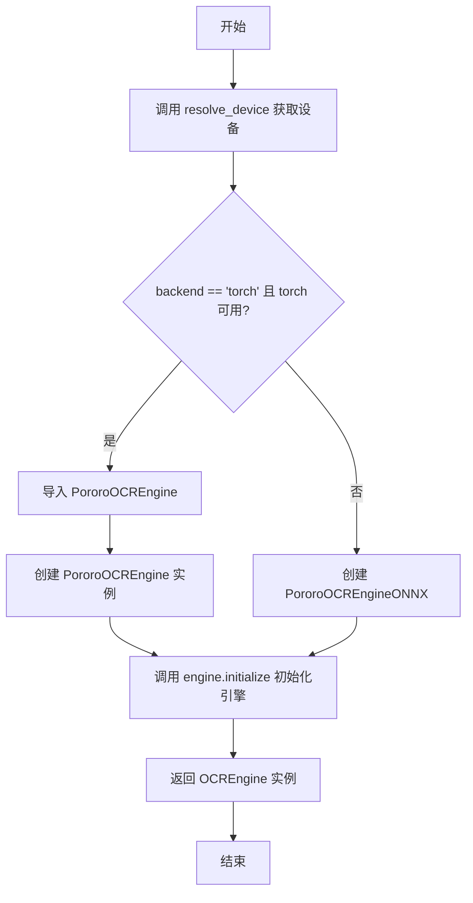

#### 带注释源码

```python
@staticmethod
def _create_pororo_ocr(settings, backend: str = 'onnx') -> OCREngine:
    """
    创建用于韩文识别的 Pororo OCR 引擎。
    
    Args:
        settings: 应用程序设置对象
        backend: 运行后端，可选 'onnx' 或 'torch'
    
    Returns:
        初始化后的 OCR 引擎实例
    """
    
    # 根据设置和后端类型解析计算设备（CPU/GPU）
    device = resolve_device(settings.is_gpu_enabled(), backend)
    
    # 判断条件：后端为 torch 且 torch 库可用
    if backend.lower() == 'torch' and torch_available():
        # 动态导入 PyTorch 版本的引擎
        from .pororo.engine import PororoOCREngine
        # 实例化 PyTorch 引擎
        engine = PororoOCREngine()
        # 使用指定设备初始化引擎
        engine.initialize(device=device)
    else:
        # 默认使用 ONNX 版本引擎（无需 PyTorch 依赖）
        engine = PororoOCREngineONNX()
        # 使用指定设备初始化引擎
        engine.initialize(device=device)
    
    # 返回初始化完成的 OCR 引擎
    return engine
```


### `OCRFactory._create_ppocr`

创建一个基于 PaddleOCR 的 OCR 引擎实例，根据后端类型选择 ONNX 或 Torch 版本，并初始化语言和设备配置。

参数：

- `settings`：`object`，设置对象，包含 GPU 启用状态等配置信息
- `lang`：`str`，语言代码，如 'ch'(中文)、'en'(英文)、'latin'(拉丁语系)等
- `backend`：`str`，后端类型，默认为 'onnx'，可选 'torch'

返回值：`OCREngine`，返回初始化后的 PaddleOCR 引擎实例

#### 流程图

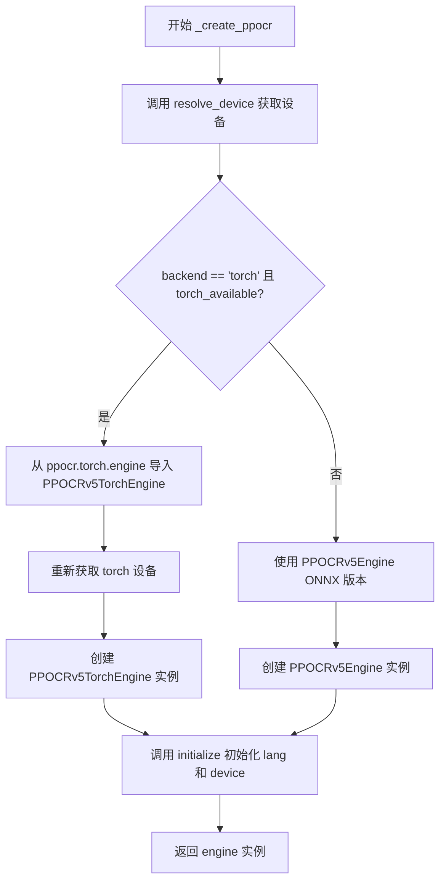

#### 带注释源码

```python
@staticmethod
def _create_ppocr(settings, lang: str, backend: str = 'onnx') -> OCREngine:
    """
    创建 PaddleOCR 引擎实例
    
    根据 backend 参数选择使用 ONNX 或 Torch 版本的 PaddleOCR 引擎，
    并使用指定语言和设备进行初始化。
    
    Args:
        settings: 应用设置对象，用于获取 GPU 配置
        lang: OCR 识别语言代码
        backend: 运行后端，'onnx' 或 'torch'
    
    Returns:
        初始化完成的 OCR 引擎实例
    """
    # 根据设置和后端类型解析计算设备（CPU/GPU）
    device = resolve_device(settings.is_gpu_enabled(), backend)
    
    # 判断条件：使用 Torch 后端且 Torch 可用
    if backend.lower() == 'torch' and torch_available():
        # 动态导入 Torch 版本的引擎类
        from .ppocr.torch.engine import PPOCRv5TorchEngine
        
        # 重新获取 torch 后端的设备配置
        device = resolve_device(settings.is_gpu_enabled(), 'torch')
        
        # 创建 Torch 版本引擎实例
        engine = PPOCRv5TorchEngine()
        # 初始化引擎：设置语言和计算设备
        engine.initialize(lang=lang, device=device)
    else:
        # 创建 ONNX 版本引擎实例（默认）
        engine = PPOCRv5Engine()
        # 初始化引擎：设置语言和计算设备
        engine.initialize(lang=lang, device=device)
    
    # 返回初始化后的引擎实例
    return engine
```

## 关键组件


### OCRFactory 工厂类

负责根据配置动态创建和管理OCR引擎实例的核心工厂类，提供引擎缓存机制以避免重复创建相同配置的引擎。

### 引擎缓存机制 (_engines 字典)

通过字典缓存已创建的OCR引擎实例，结合缓存键实现相同配置的引擎复用，提升性能。

### 缓存键生成逻辑 (_create_cache_key 方法)

根据OCR模型、源语言、后端设置动态生成唯一缓存键，包含凭证信息和设备信息，变化时触发新引擎创建。

### LLM引擎标识符 (LLM_ENGINE_IDENTIFIERS)

映射LLM引擎名称到对应实现类（GPT、Gemini），用于识别需要特殊处理的远程模型。

### 远程用户模型支持 (UserOCR)

检测并使用用户账户绑定的远程OCR模型（UserOCR.LLM_OCR_KEYS和UserOCR.FULL_PAGE_OCR_KEYS），提供个性化OCR服务。

### 本地引擎工厂方法集合

包含针对不同OCR引擎的创建方法：Microsoft OCR、Google Cloud Vision、GPT OCR、Gemini OCR、MangaOCR、PororoOCR、PaddleOCR等，根据语言和后端选择合适实现。

### 设备解析与后端选择

根据设置和后端参数（onnx/torch）解析计算设备，支持GPU加速和CPU推理的灵活切换。


## 问题及建议


### 已知问题

-   **缓存键生成逻辑不完整**：代码中注释掉了LLM设置的获取逻辑（第70-74行），导致使用LLM引擎时缓存键不包含LLM特定设置（如temperature、top_p等），不同设置可能复用同一个缓存引擎
-   **缺少错误处理和默认值**：`_create_new_engine`方法在找不到匹配的OCR模型时返回`None`（第134行），调用方未做空值检查，可能导致后续调用失败
-   **硬编码的模型标识符**：`general`字典（第110-114行）和`language_factories`字典（第117-128行）中硬编码了模型名称（如'GPT-4.1-mini'、'Gemini-2.0-Flash'），扩展性差，每次新增模型需修改代码
-   **字典访问未做防护**：在`_create_microsoft_ocr`等方法中直接使用`credentials['api_key_ocr']`访问字典，若凭证不存在或格式错误会抛出`KeyError`异常
-   **缓存无清理机制**：类变量`_engines`字典作为无限缓存，缺乏LRU或TTL机制，长期运行可能导致内存持续增长
-   **token变化未反映到缓存**：缓存键不包含token信息，但第46-54行根据token决定是否使用UserOCR，token失效后可能返回过期缓存的引擎
-   **重复导入逻辑**：在`_create_manga_ocr`、`_create_pororo_ocr`、`_create_ppocr`中均调用`resolve_device`和`torch_available`，存在重复计算

### 优化建议

-   **完善缓存键逻辑**：取消注释第70-74行，为LLM引擎也包含LLM设置到缓存键中，确保不同配置使用不同引擎实例
-   **添加异常处理和默认值**：在`_create_new_engine`中抛出明确异常或返回带有默认行为的引擎，避免返回`None`
-   **配置化模型映射**：将`general`和`language_factories`字典外置到配置文件或注册机制，采用注册模式替代硬编码
-   **防御性字典访问**：使用`credentials.get()`方法并提供默认值或显式检查凭证完整性
-   **实现缓存淘汰策略**：引入`functools.lru_cache`或手动实现基于最大数量/时间的淘汰机制
-   **统一缓存与认证逻辑**：在缓存键生成时考虑token状态，或在缓存命中时重新验证token有效性
-   **提取设备解析逻辑**：将`resolve_device`和`torch_available`调用结果缓存到局部变量，避免重复计算

## 其它


### 设计目标与约束

**设计目标**：
- 提供统一的OCR引擎创建接口，根据配置和语言自动选择合适的OCR引擎
- 通过缓存机制避免重复创建相同的引擎实例，提高性能和资源利用率
- 支持多种OCR后端（ONNX、Torch）和多种OCR服务（Microsoft、Google、GPT、Gemini等）

**设计约束**：
- 必须实现OCREngine基类接口
- 缓存键生成需考虑凭证变化，确保凭证变更时重新创建引擎
- LLM相关设置暂未纳入缓存键计算（代码中已注释）
- 后端必须为'onnx'或'torch'之一

### 错误处理与异常设计

**异常处理策略**：
- **Token获取失败**：当get_token("access_token")返回None时，继续走本地引擎创建流程
- **凭证缺失**：get_credentials返回None时，extras字典不包含credentials，仍使用基础缓存键
- **不支持的模型**：当ocr_model不在general字典且不为'Default'时，_create_new_engine返回None
- **设备解析失败**：resolve_device可能返回None或无效设备

**潜在异常点**：
- settings.get_credentials()可能抛出KeyError（凭证配置不存在）
- 动态导入模块（如MangaOCREngine、PororoOCREngine）可能失败
- JSON序列化extras时default=str可能隐藏类型错误

### 数据流与状态机

**主要数据流**：
1. 外部调用create_engine()入口
2. 生成缓存键（_create_cache_key）
3. 检查缓存是否命中
4. 若未命中，检查token并创建UserOCR或调用_create_new_engine
5. 存入缓存并返回引擎实例

**状态管理**：
- 引擎缓存存储在类变量_engines字典中
- 缓存键格式：{ocr_key}_{source_lang}_{backend}_[digest]
- 无显式缓存失效机制，依赖进程生命周期

### 外部依赖与接口契约

**核心依赖**：
- OCREngine基类：所有引擎必须继承此类
- 具体引擎类：MicrosoftOCR、GoogleOCR、GPTOCR、GeminiOCR、UserOCR、PPOCRv5Engine、MangaOCREngineONNX、PororoOCREngineONNX
- settings对象：提供get_credentials()、is_gpu_enabled()方法
- token存储：app.account.auth.token_storage.get_token
- 工具函数：modules.utils.device.resolve_device、torch_available

**接口契约**：
- OCREngine.initialize()方法签名因引擎而异
- settings.get_credentials(key)返回字典，需包含api_key、endpoint等字段
- 缓存键生成依赖settings.get_credentials和resolve_device的返回值结构

### 性能考虑

**缓存优化**：
- 使用类级别字典缓存引擎实例，避免重复初始化
- 缓存键包含凭证哈希，凭证变化时自动重新创建
- 相同配置多次调用直接返回缓存引用

**潜在性能问题**：
- 缓存键使用SHA256哈希，JSON序列化开销较大
- 缓存无大小限制，长时间运行可能导致内存增长
- 动态import在首次创建时可能阻塞

### 安全性考虑

**敏感信息处理**：
- API密钥通过settings.get_credentials获取，不在代码中硬编码
- 缓存键包含凭证哈希，但仅用于标识缓存，不存储实际密钥
- get_token("access_token")可能涉及令牌安全管理

**安全建议**：
- 考虑对缓存键中的digest进行截断（当前为完整64位hex）
- 凭证变更时应显式清理相关缓存条目
- 动态导入的模块路径需验证可信性

### 扩展性设计

**当前扩展方式**：
- 在general字典添加新模型条目
- 在language_factories字典添加新语言支持
- 在LLM_ENGINE_IDENTIFIERS字典注册新的LLM引擎

**扩展建议**：
- 可通过插件机制动态注册引擎类型
- 支持配置优先级的外部定义
- 考虑使用策略模式替代当前的字典映射

### 版本兼容性

**依赖版本要求**：
- Python 3.8+（字典推导式、f-string）
- torch可用性检查（torch_available函数）
- JSON标准库（无额外依赖）

**兼容性考虑**：
- torch和onnx后端的选择具有运行时灵活性
- 动态导入允许部分模块缺失时仍使用其他引擎
</content>
    