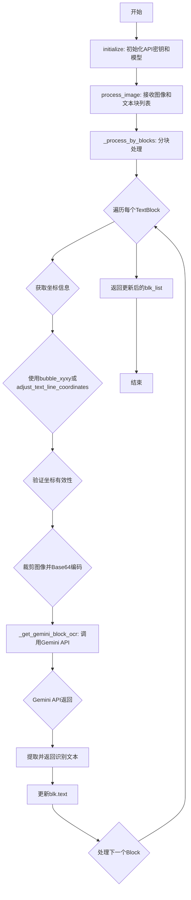
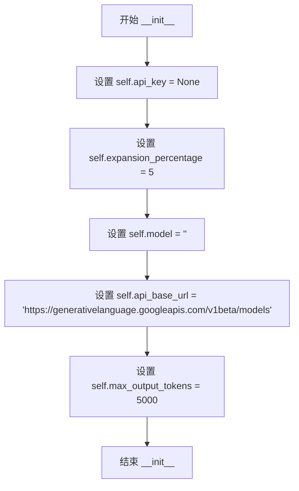
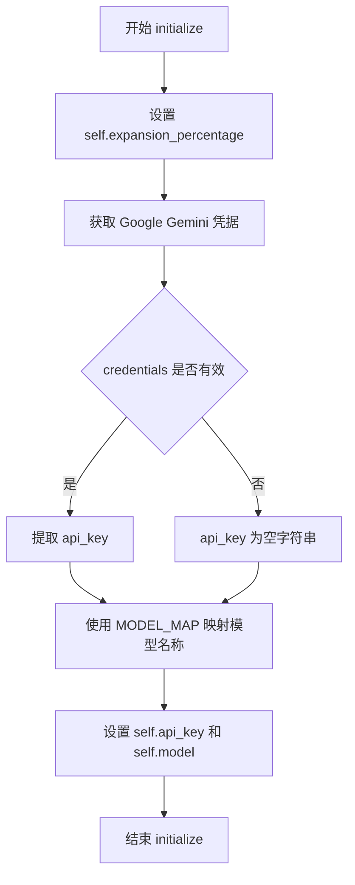
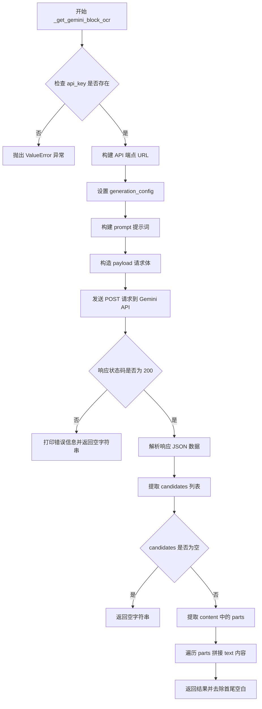

# `comic-translate\modules\ocr\gemini_ocr.py` 详细设计文档

基于Google Gemini模型的OCR引擎，通过REST API调用Gemini模型进行图像文本识别，采用分块处理策略将图像中的文本区域逐个裁剪并识别，支持从设置页面获取API密钥，可扩展文本边界框以提高识别准确率。

## 整体流程



## 类结构

```
OCREngine (抽象基类)
└── GeminiOCR (Gemini OCR实现)
```

## 全局变量及字段


### `GeminiOCR.api_key`
    
Google Gemini API密钥

类型：`str`
    


### `GeminiOCR.expansion_percentage`
    
文本边界框扩展百分比

类型：`int`
    


### `GeminiOCR.model`
    
使用的Gemini模型名称

类型：`str`
    


### `GeminiOCR.api_base_url`
    
Gemini API基础URL

类型：`str`
    


### `GeminiOCR.max_output_tokens`
    
最大输出token数

类型：`int`
    
    

## 全局函数及方法


### `GeminiOCR.__init__`

构造函数，初始化 GeminiOCR 类的实例属性，设置默认的 API 密钥为 None、文本框扩展百分比为 5、模型为空字符串、API 基础 URL 为 Google Gemini REST API 端点、以及最大输出 token 数为 5000。

参数：

- 无（构造函数不接受除 self 外的外部参数）

返回值：`None`，无返回值，仅初始化实例属性

#### 流程图



#### 带注释源码

```python
def __init__(self):
    """
    构造函数，初始化 GeminiOCR 实例的默认属性值。
    """
    self.api_key = None                                          # API 密钥，初始化为 None，后续通过 initialize() 设置
    self.expansion_percentage = 5                                 # 文本框扩展百分比，用于扩大检测区域
    self.model = ''                                               # 使用的 Gemini 模型名称，初始化为空字符串
    self.api_base_url = "https://generativelanguage.googleapis.com/v1beta/models"  # Google Gemini REST API 基础 URL
    self.max_output_tokens = 5000                                 # API 响应最大输出 token 数量限制
```


### `GeminiOCR.initialize`

初始化 Gemini OCR 引擎的 API 密钥和模型参数。该方法从设置页面获取 Google Gemini 的凭据，提取 API 密钥，并根据提供的模型名称映射到实际使用的模型标识符，同时配置文本边界框扩展百分比。

参数：

- `settings`：`SettingsPage`，包含凭据的设置页面对象，用于获取 API 密钥
- `model`：`str`，要用于 OCR 的 Gemini 模型（默认为 'Gemini-2.0-Flash'）
- `expansion_percentage`：`int`，用于扩展文本边界框的百分比（默认为 5）

返回值：`None`，该方法不返回任何值，仅初始化实例变量

#### 流程图



#### 带注释源码

```python
def initialize(self, settings: SettingsPage, model: str = 'Gemini-2.0-Flash', 
               expansion_percentage: int = 5) -> None:
    """
    Initialize the Gemini OCR with API key and parameters.
    
    Args:
        settings: Settings page containing credentials    # 设置页面对象，包含凭据信息
        model: Gemini model to use for OCR (defaults to Gemini-2.0-Flash)  # 模型名称，默认使用 Flash 模型
        expansion_percentage: Percentage to expand text bounding boxes    # 文本框扩展百分比
    """
    # 1. 将传入的扩展百分比参数保存到实例变量
    self.expansion_percentage = expansion_percentage
    
    # 2. 从设置页面获取 Google Gemini 的凭据
    #    使用 tr('Google Gemini') 作为翻译键获取本地化的服务名称
    credentials = settings.get_credentials(settings.ui.tr('Google Gemini'))
    
    # 3. 从凭据字典中提取 API 密钥，若不存在则默认为空字符串
    self.api_key = credentials.get('api_key', '')
    
    # 4. 使用 MODEL_MAP 将易读的模型名称映射为实际的模型标识符
    #    例如 'Gemini-2.0-Flash' 可能映射为 'gemini-2.0-flash'
    self.model = MODEL_MAP.get(model)
```


### `GeminiOCR.process_image`

该方法是 GeminiOCR 引擎处理图像的主入口方法，接收输入图像和文本块列表，通过调用内部方法 `_process_by_blocks` 对每个文本块区域进行裁剪和 OCR 识别，最终返回带有识别文本的更新后 TextBlock 列表。

参数：

- `img`：`np.ndarray`，输入图像作为 numpy 数组
- `blk_list`：`list[TextBlock]]`，需要进行 OCR 识别的 TextBlock 对象列表

返回值：`list[TextBlock]]`，完成 OCR 识别后更新了 `text` 属性的 TextBlock 对象列表

#### 流程图

```mermaid
flowchart TD
    A[开始 process_image] --> B[调用 _process_by_blocks]
    
    B --> C{遍历 blk_list 中的每个 TextBlock}
    
    C --> D[获取文本块坐标 bubble_xyxy 或 xyxy]
    D --> E[验证坐标有效性]
    
    E --> F{坐标有效?}
    F -->|否| G[跳过当前块]
    F -->|是| H[裁剪图像: img[y1:y2, x1:x2]]
    
    H --> I[调用 encode_image 编码为 base64]
    I --> J[调用 _get_gemini_block_ocr 获取 OCR 结果]
    J --> K[将识别结果写入 blk.text]
    K --> C
    
    G --> C
    
    C --> L{所有块处理完成?}
    L -->|否| C
    L -->|是| M[返回更新后的 blk_list]
    
    N[_get_gemini_block_ocr] --> O[验证 API Key]
    O --> P{API Key 存在?}
    P -->|否| Q[抛出 ValueError]
    P -->|是| R[构建 API 请求 URL]
    
    R --> S[构建 generation_config 和 prompt]
    S --> T[构建请求 payload]
    T --> U[发送 POST 请求到 Gemini API]
    
    U --> V{响应状态码 200?}
    V -->|否| W[打印错误信息, 返回空字符串]
    V -->|是| X[解析 JSON 响应]
    
    X --> Y[提取 candidates 内容]
    Y --> Z[提取 text parts]
    Z --> AA[拼接所有文本]
    AA --> AB[去除首尾空白]
    AB --> M
```

#### 带注释源码

```python
def process_image(self, img: np.ndarray, blk_list: list[TextBlock]) -> list[TextBlock]:
    """
    Process an image with Gemini-based OCR using block processing approach.
    使用基于块的处理方法处理 Gemini OCR 图像
    
    Args:
        img: Input image as numpy array 输入图像作为 numpy 数组
        blk_list: List of TextBlock objects to update with OCR text 需要更新 OCR 文本的 TextBlock 对象列表
        
    Returns:
        List of updated TextBlock objects with recognized text 带有识别文本的更新后 TextBlock 对象列表
    """
    # 委托给内部方法 _process_by_blocks 进行实际的块处理逻辑
    # Delegate to internal method for actual block processing logic
    return self._process_by_blocks(img, blk_list)
```


### `GeminiOCR._process_by_blocks`

分块处理图像中的文本区域，遍历每个TextBlock，提取坐标、裁剪图像、调用Gemini API进行OCR识别，并将识别结果更新到对应的TextBlock中，最后返回更新后的文本块列表。

参数：

- `img`：`np.ndarray`，输入图像的numpy数组形式
- `blk_list`：`list[TextBlock]]`，需要进行OCR识别的TextBlock对象列表

返回值：`list[TextBlock]]`，包含识别后文本内容的TextBlock对象列表

#### 流程图

```mermaid
flowchart TD
    A[开始处理] --> B[遍历 blk_list 中的每个 blk]
    B --> C{检查 blk.bubble_xyxy 是否存在}
    C -->|是| D[使用 bubble_xyxy 坐标]
    C -->|否| E[调用 adjust_text_line_coordinates 扩展 xyxy 坐标]
    D --> F{验证坐标有效性}
    E --> F
    F -->|无效| G[跳过当前块]
    F -->|有效| H[裁剪图像 img[y1:y2, x1:x2]]
    H --> I[调用 encode_image 编码图像为 base64]
    I --> J[调用 _get_gemini_block_ocr 获取OCR结果]
    J --> K[更新 blk.text 为识别结果]
    G --> L{是否还有未处理的块}
    K --> L
    L -->|是| B
    L -->|否| M[返回 blk_list]
```

#### 带注释源码

```python
def _process_by_blocks(self, img: np.ndarray, blk_list: list[TextBlock]) -> list[TextBlock]:
    """
    Process an image by processing individual text regions separately.
    Similar to GPTOCR approach, each text block is cropped and sent individually.
    
    Args:
        img: Input image as numpy array
        blk_list: List of TextBlock objects to update with OCR text
        
    Returns:
        List of updated TextBlock objects with recognized text
    """
    # 遍历每个文本块
    for blk in blk_list:
        # 获取文本区域的边界框坐标
        if blk.bubble_xyxy is not None:
            # 如果存在气泡坐标则使用气泡坐标
            x1, y1, x2, y2 = blk.bubble_xyxy
        else:
            # 否则根据 expansion_percentage 扩展原始坐标
            x1, y1, x2, y2 = adjust_text_line_coordinates(
                blk.xyxy, 
                self.expansion_percentage, 
                self.expansion_percentage, 
                img
            )
        
        # 验证坐标是否有效：确保坐标在图像范围内且x1<x2, y1<y2
        if x1 < x2 and y1 < y2 and x1 >= 0 and y1 >= 0 and x2 <= img.shape[1] and y2 <= img.shape[0]:
            # 裁剪图像并编码为base64格式
            cropped_img = img[y1:y2, x1:x2]
            encoded_img = self.encode_image(cropped_img)
            
            # 调用Gemini API进行OCR识别并更新文本块内容
            blk.text = self._get_gemini_block_ocr(encoded_img)
            
    # 返回更新后的文本块列表
    return blk_list
```


### `GeminiOCR._get_gemini_block_ocr`

该方法负责将单张图像（已Base64编码）通过HTTP POST请求发送至Google Gemini REST API，解析返回的JSON响应并提取识别出的文本内容，实现对图像中单一块区域（TextBlock）的OCR识别功能。

参数：

- `self`：隐式参数，类型为 `GeminiOCR` 实例本身，表示调用该方法的OCR引擎对象
- `base64_image`：`str`，Base64编码后的图像数据字符串，通常为JPEG格式的图像内容

返回值：`str`，从Gemini API返回的OCR识别结果文本，若识别失败或无结果则返回空字符串

#### 流程图



#### 带注释源码

```python
def _get_gemini_block_ocr(self, base64_image: str) -> str:
    """
    Get OCR result for a single block from Gemini model.
    
    Args:
        base64_image: Base64 encoded image
        
    Returns:
        OCR result text
    """
    # 检查 API 密钥是否已初始化，若未初始化则抛出异常
    if not self.api_key:
        raise ValueError("API key not initialized. Call initialize() first.")
        
    # 创建 API 端点 URL，格式为: https://generativelanguage.googleapis.com/v1beta/models/{model}:generateContent?key={api_key}
    url = f"{self.api_base_url}/{self.model}:generateContent?key={self.api_key}"
    
    # 配置生成参数，限制最大输出 tokens 数量
    generation_config = {
        "maxOutputTokens": self.max_output_tokens,
    }
    
    # 定义发送给 Gemini 模型的提示词，要求模型精确提取图像中的文本内容
    prompt = """
    Extract the text in this image exactly as it appears. 
    Only output the raw text with no additional comments or descriptions.
    """
    
    # 构造请求体 payload，包含图像数据和提示词
    payload = {
        "contents": [{
            "parts": [
                # 图像数据部分，使用 inline_data 传输 Base64 编码的图像
                {
                    "inline_data": {
                        "mime_type": "image/jpeg",
                        "data": base64_image
                    }
                },
                # 文本提示部分
                {
                    "text": prompt
                }
            ]
        }],
        "generationConfig": generation_config,
    }
    
    # 设置请求头，指定内容类型为 JSON 格式
    headers = {"Content-Type": "application/json"}
    
    # 向 Gemini API 发送 POST 请求，设置超时时间为 20 秒
    response = requests.post(
        url,
        headers=headers, 
        json=payload,
        timeout=20
    )
    
    # 处理 API 响应
    if response.status_code == 200:
        # 解析响应 JSON 数据
        response_data = response.json()
        
        # 提取 candidates 列表（候选响应列表）
        candidates = response_data.get("candidates", [])
        
        # 若无候选响应，则返回空字符串
        if not candidates:
            return ""
            
        # 获取第一个候选响应的 content 内容
        content = candidates[0].get("content", {})
        
        # 提取 parts 列表（包含文本和可能的图像响应）
        parts = content.get("parts", [])
        
        # 遍历所有 parts，拼接其中的文本内容
        result = ""
        for part in parts:
            if "text" in part:
                result += part["text"]
        
        # 去除结果字符串的首尾空白字符后返回
        return result.strip()
    else:
        # API 调用失败时打印错误信息并返回空字符串
        print(f"API error: {response.status_code} {response.text}")
        return ""
```

## 关键组件


### 张量索引与图像裁剪

代码使用NumPy数组切片操作实现图像裁剪，通过`img[y1:y2, x1:x2]`方式从原始图像中提取文本区域。该操作在`_process_by_blocks`方法中执行，支持基于`bubble_xyxy`或扩展后的`xyxy`坐标进行区域提取，实现惰性加载模式，仅在需要时裁剪图像区域。

### 文本块坐标调整

通过`adjust_text_line_coordinates`函数根据`expansion_percentage`参数动态扩展文本边界框，扩展比例默认为5%。该函数接收原始坐标、扩展百分比和图像尺寸，确保扩展后的坐标不超出图像边界，保持裁剪区域的有效性。

### 图像编码与传输格式

`encode_image`方法将裁剪后的NumPy数组图像转换为Base64编码字符串，用于构建Gemini API请求的`inline_data`负载。图像被编码为JPEG格式（`mime_type: image/jpeg`），通过HTTP POST请求发送至Gemini REST端点。

### 分块OCR处理策略

`_process_by_blocks`方法实现分块处理策略，遍历`TextBlock`列表逐个处理每个文本区域。每个区块独立调用Gemini API进行OCR识别，将返回的文本结果更新到对应`TextBlock`对象的`text`属性中。该方法包含坐标有效性检查，确保裁剪区域在图像范围内。

### API请求构建与配置

`_get_gemini_block_ocr`方法负责构建Gemini API请求，包括生成端点URL、设置`generationConfig`（包含`maxOutputTokens`参数）、构造多模态prompt（包含图像和文本指令）。使用固定提示词"Extract the text in this image exactly as it appears"要求模型精确输出原始文本。

### 响应解析与错误处理

API响应解析逻辑从`candidates`数组中提取`content.parts`文本内容，支持多部分结果拼接。错误处理涵盖API返回非200状态码、响应中无candidates、parts为空等情况，返回空字符串作为降级方案。

### 量化策略与模型映射

通过`MODEL_MAP`字典映射友好模型名称（如'Gemini-2.0-Flash'）为Gemini API实际模型标识符，支持灵活的模型切换。API配置中设置`max_output_tokens=5000`限制单次响应长度。


## 问题及建议


### 已知问题

-   **异常处理不完整**：`process_image` 和 `_process_by_blocks` 方法没有异常处理，当 OCR 处理失败时会导致整个流程中断
-   **API 错误处理过于简单**：`_get_gemini_block_ocr` 方法在 API 返回非 200 状态码时仅打印错误并返回空字符串，调用者无法获知具体错误原因
-   **缺少输入验证**：未对 `img` 参数和 `blk_list` 进行有效性检查，可能导致后续处理出现难以追踪的异常
-   **模型映射未验证**：`initialize` 方法中 `MODEL_MAP.get(model)` 可能返回 `None`，但后续未对此进行检查，会导致 API 请求失败
-   **资源未正确释放**：使用 `requests.post` 未显式关闭连接，未使用会话（Session）复用 TCP 连接
-   **坐标边界处理不完善**：仅做了基本的坐标范围检查，未处理坐标为负数或超出图像尺寸时的边缘情况

### 优化建议

-   **添加重试机制**：对网络请求添加重试逻辑（如使用 `urllib3.util.retry` 或 `tenacity` 库），提高 OCR 成功率
-   **使用会话复用连接**：创建 `requests.Session` 对象以复用 TCP 连接，减少网络开销
-   **增加日志记录**：将 `print` 语句替换为标准日志模块 `logging`，便于生产环境调试
-   **完善错误传播**：在 API 调用失败时抛出自定义异常或返回错误码，而非静默返回空字符串
-   **添加速率限制处理**：考虑 Google API 的速率限制，添加适当的等待和退避策略
-   **异步批量处理**：使用 `asyncio` 或线程池并行处理多个文本块，提升整体处理效率
-   **增加单元测试**：为关键方法添加测试用例，确保边界条件和异常场景的正确处理

## 其它


### 设计目标与约束

本模块旨在通过Google Gemini的REST API实现高效的OCR文字识别功能，支持基于文本块（TextBlock）的分块处理方式，能够处理包含多个文本区域的图像。设计约束包括：必须使用有效的Google Gemini API密钥、图像需转换为base64编码、每次API调用超时时间为20秒、模型输出令牌上限为5000。

### 错误处理与异常设计

本类主要处理以下异常情况：API密钥未初始化时抛出ValueError；HTTP请求失败时打印错误信息并返回空字符串；API返回非200状态码时记录错误响应；坐标验证失败时跳过该文本块的处理。当捕获到网络异常或API响应解析失败时，系统会返回空字符串而非中断整个OCR流程，保证其他文本块的正常处理。

### 数据流与状态机

数据流如下：1）initialize()方法从设置页面加载API密钥和模型配置；2）process_image()接收原始图像和文本块列表；3）_process_by_blocks()遍历每个TextBlock，计算其边界坐标；4）对有效坐标的文本块进行图像裁剪和base64编码；5）调用_get_gemini_block_ocr()向Gemini API发送请求；6）将识别结果写入TextBlock.text属性并返回更新后的列表。

### 外部依赖与接口契约

本模块依赖以下外部组件：numpy库用于图像数组操作；requests库用于HTTP POST请求；OCREngine基类定义了process_image()接口规范；TextBlock类定义了文本块的数据结构；SettingsPage类提供凭据获取接口；MODEL_MAP字典提供模型名称映射。调用方需保证传入的img为有效的numpy数组、blk_list中的TextBlock对象包含xyxy坐标属性、settings对象包含Google Gemini凭据。

### 性能考虑

当前实现按顺序处理每个文本块，API调用为同步阻塞模式。单张图片的文本块数量直接影响总处理时间。可优化方向包括：1）使用异步请求或线程池并发处理多个文本块；2）添加API速率限制避免触发Google配额限制；3）考虑批量处理多个文本块减少网络开销；4）对小尺寸文本块可设置最小面积阈值跳过OCR。

### 安全性考虑

API密钥通过settings.get_credentials()获取，应确保凭据存储和传输过程安全。代码中API密钥直接拼接在URL参数中，建议改为使用请求头Authorization Bearer方式。超时时间设置为20秒，需根据实际网络状况调整。日志中可能打印敏感错误信息，应进行脱敏处理。

### 日志与监控

建议在关键节点添加日志记录：initialize()成功加载配置时记录使用的模型；每次API调用前记录文本块索引；API响应状态码非200时记录完整错误信息；OCR完成时记录处理耗时。可集成Python logging模块实现分级日志输出。

### 版本兼容性

当前使用Gemini API v1beta版本，该版本为测试版本可能在未来发生变化。需关注Google Generative Language API的版本更新公告，及时迁移到稳定版本。numpy和requests库版本应保持与项目其他模块一致。

### 配置管理

通过initialize()方法注入配置参数，支持运行时动态修改模型选择和膨胀百分比。api_base_url和max_output_tokens目前为硬编码值，建议迁移到配置文件或数据库ettings表中统一管理，支持多环境配置切换。

    