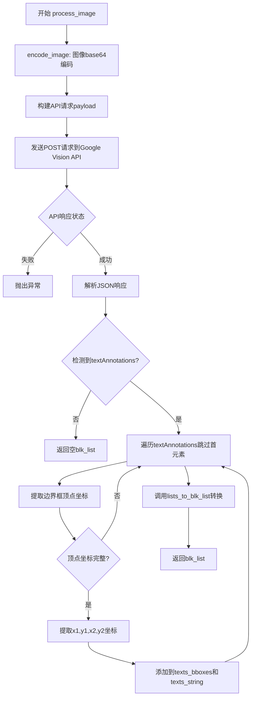
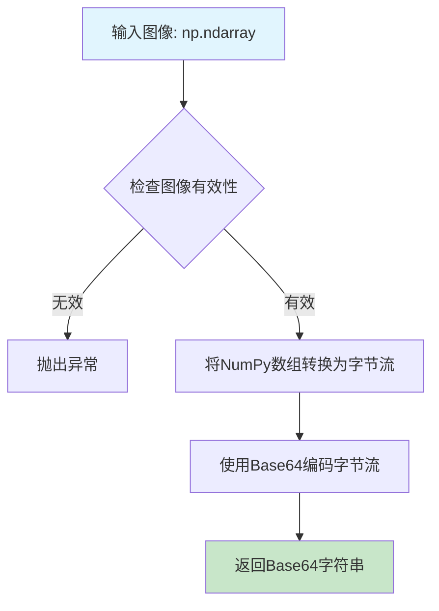
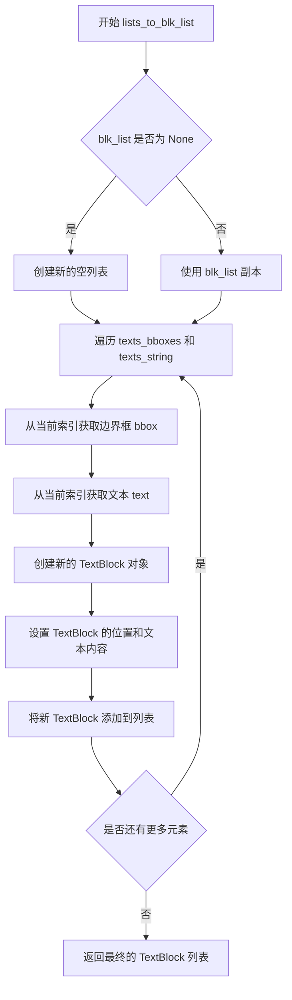
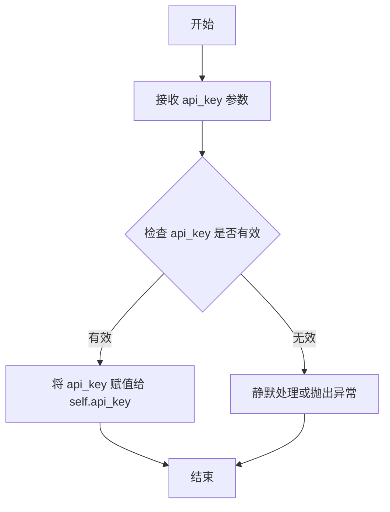
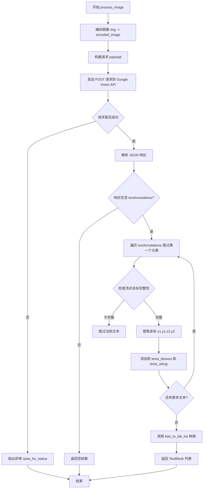

# `comic-translate\modules\ocr\google_ocr.py` 详细设计文档

使用 Google Cloud Vision API 实现的光学字符识别（OCR）引擎，通过将图像编码为 base64 并发送到 Google Vision API 进行文本检测，然后将检测到的文本及其边界框转换为 TextBlock 列表返回。

## 整体流程



## 类结构

```
OCREngine (抽象基类)
└── GoogleOCR (Google Cloud Vision API实现)
```

## 全局变量及字段


### `json`
    
JSON编码和解码模块

类型：`module`
    


### `np`
    
NumPy数值计算库

类型：`module`
    


### `requests`
    
Python HTTP客户端库

类型：`module`
    


### `OCREngine`
    
OCR引擎抽象基类

类型：`class`
    


### `TextBlock`
    
文本块数据类

类型：`class`
    


### `lists_to_blk_list`
    
将边界框和文本列表转换为TextBlock列表的工具函数

类型：`function`
    


### `GoogleOCR.api_key`
    
Google Cloud API密钥

类型：`str | None`
    
    

## 全局函数及方法


### `GoogleOCR.encode_image`

将 NumPy 数组格式的图像数据转换为 Base64 编码的字符串，供 Google Cloud Vision API 请求体使用。

参数：

- `img`：`np.ndarray`，待编码的输入图像，以 NumPy 数组形式表示（通常为 BGR 或 RGB 格式）

返回值：`str`，返回图像的 Base64 编码字符串，可直接用于 JSON 请求 payload 中的 `image.content` 字段

#### 流程图



#### 带注释源码

```python
def encode_image(self, img: np.ndarray) -> str:
    """
    将图像编码为base64字符串（继承自基类或工具方法）。
    
    Args:
        img: 输入图像，numpy数组格式
        
    Returns:
        base64编码后的图像字符串
    """
    # 方法未在当前类中实现，继承自 OCREngine 基类
    # 典型实现逻辑如下：
    
    # 1. 将NumPy数组转换为字节流
    # img_bytes = cv2.imencode('.png', img)[1].tobytes()
    
    # 2. 使用base64编码
    # import base64
    # encoded = base64.b64encode(img_bytes).decode('utf-8')
    
    # 3. 返回编码字符串
    # return encoded
```

#### 补充说明

该方法继承自 `OCREngine` 基类，当前代码中通过 `self.encode_image(img)` 调用。从调用上下文分析，其功能是将图像转换为 Google Cloud Vision API 所要求的 Base64 编码格式，以便在 JSON 请求 payload 中传输图像数据。


### `lists_to_blk_list`

将边界框坐标和对应的文本字符串转换为 TextBlock 对象列表的函数。

参数：

- `blk_list`：`list[TextBlock]`，输入的原始 TextBlock 列表，用于追加或更新新的文本块
- `texts_bboxes`：`list[tuple[int, int, int, int]]`，边界框坐标列表，每个元素为 (x1, y1, x2, y2) 格式的元组，表示左上角和右下角坐标
- `texts_string`：`list[str]`，与边界框对应的文本字符串列表

返回值：`list[TextBlock]`，返回更新后的 TextBlock 列表，包含原始块以及从边界框和文本字符串构建的新文本块

#### 流程图



#### 带注释源码

```python
def lists_to_blk_list(blk_list: list[TextBlock], texts_bboxes: list[tuple], texts_string: list[str]) -> list[TextBlock]:
    """
    将边界框坐标和文本字符串转换为 TextBlock 列表
    
    Args:
        blk_list: 原始的 TextBlock 列表，作为基础列表
        texts_bboxes: 边界框坐标列表，每个元素为 (x1, y1, x2, y2) 格式
        texts_string: 对应的文本字符串列表
        
    Returns:
        包含所有 TextBlock 的列表
    """
    # 如果 blk_list 为 None，创建一个新的空列表；否则使用其副本
    if blk_list is None:
        result = []
    else:
        result = blk_list[:]
    
    # 遍历所有边界框和文本字符串
    for bbox, text in zip(texts_bboxes, texts_string):
        # 解构边界框坐标
        x1, y1, x2, y2 = bbox
        
        # 创建新的 TextBlock 对象
        new_block = TextBlock()
        
        # 设置文本块的坐标范围 (使用 (x1, y1) 作为起点，(x2-x1, y2-y1) 作为宽高)
        new_block.set_bbox(x1, y1, x2 - x1, y2 - y1)
        
        # 设置文本内容
        new_block.set_text(text)
        
        # 将新创建的文本块添加到结果列表中
        result.append(new_block)
    
    # 返回包含所有文本块的列表
    return result
```

#### 补充说明

该函数是 GoogleOCR 引擎中的关键辅助函数，负责将 Google Cloud Vision API 返回的原始检测结果（边界框顶点坐标和文本描述）转换为内部统一的 `TextBlock` 对象结构。在 `GoogleOCR.process_image` 方法中，首先调用 Google Vision API 进行文本检测，然后跳过返回结果的第一个元素（因为它包含整个图像的完整文本），对剩余的每个文本片段提取边界框坐标和文本内容，最后通过本函数将数据封装为 `TextBlock` 对象列表返回给调用者。

---

### `GoogleOCR.process_image`

处理图像并返回识别到的文本块列表。

参数：

- `img`：`np.ndarray`，输入的图像数据
- `blk_list`：`list[TextBlock]`，输入的原始 TextBlock 列表

返回值：`list[TextBlock]`，识别并转换后的 TextBlock 列表

#### 带注释源码

```python
def process_image(self, img: np.ndarray, blk_list: list[TextBlock]) -> list[TextBlock]:
    """使用 Google Cloud Vision API 处理图像并提取文本"""
    texts_bboxes = []  # 存储边界框坐标
    texts_string = []  # 存储文本内容
    
    # 将图像编码为 base64 字符串
    encoded_image = self.encode_image(img)
    
    # 构建请求载荷
    payload = {
        "requests": [{
            "image": {"content": encoded_image}, 
            "features": [{"type": "TEXT_DETECTION"}]
        }]
    }
    
    headers = {"Content-Type": "application/json"}
    # 调用 Google Vision API
    response = requests.post(
        "https://vision.googleapis.com/v1/images:annotate",
        headers=headers,
        params={"key": self.api_key},
        data=json.dumps(payload),
        timeout=10  # 设置超时时间
    )
    
    # 检查 HTTP 响应状态
    response.raise_for_status()
    result = response.json()
    
    # 解析 API 返回结果
    if 'responses' in result and result['responses'] and 'textAnnotations' in result['responses'][0]:
        texts = result['responses'][0]['textAnnotations']
        
        # 跳过第一个元素（包含完整文本），处理单个文本块
        for text in texts[1:]:
            vertices = text['boundingPoly']['vertices']
            
            # 检查顶点坐标完整性
            if all('x' in vertex and 'y' in vertex for vertex in vertices):
                x1 = vertices[0]['x']
                y1 = vertices[0]['y']
                x2 = vertices[2]['x']
                y2 = vertices[2]['y']
                
                # 收集边界框和文本
                texts_bboxes.append((x1, y1, x2, y2))
                texts_string.append(text['description'])
            
    # 转换为 TextBlock 列表并返回
    return lists_to_blk_list(blk_list, texts_bboxes, texts_string)
```

#### 潜在技术债务与优化空间

1. **错误处理不足**：当前仅依赖 `raise_for_status()` 捕获 HTTP 错误，缺乏对 API 返回业务错误（如配额不足、API 密钥无效）的处理
2. **超时配置硬编码**：超时时间 10 秒硬编码在请求中，应抽取为配置参数
3. **边界框顶点假设**：代码假设顶点顺序为左上、右下（索引 0 和 2），未处理顶点顺序可能不同的情况
4. **缺少重试机制**：网络请求失败时无重试逻辑
5. **TextBlock 实现未知**：由于 `lists_to_blk_list` 的实现不可见，无法确认其错误处理和边界条件处理是否完善


### `GoogleOCR.initialize`

该方法用于使用提供的 Google Cloud API 密钥初始化 Google OCR 引擎，将 API 密钥存储在实例变量中以供后续的图像处理请求使用。

参数：

- `api_key`：`str`，Google Cloud API 密钥，用于身份验证和访问 Google Cloud Vision API

返回值：`None`，无返回值，仅初始化实例属性

#### 流程图



#### 带注释源码

```python
def initialize(self, api_key: str) -> None:
    """
    Initialize the Google OCR with API key.
    
    Args:
        api_key: Google Cloud API key
    """
    # 将传入的 API 密钥存储到实例变量中，供后续 process_image 方法使用
    self.api_key = api_key
```


### `GoogleOCR.process_image`

该方法是 Google Cloud Vision OCR 引擎的核心处理方法，接收图像数据和现有文本块列表作为输入，通过 Base64 编码图像后调用 Google Cloud Vision API 的 TEXT_DETECTION 功能进行光学字符识别，然后解析 API 返回的文本注释和边界框信息，将其转换为标准化的 TextBlock 列表返回。

参数：

- `img`：`np.ndarray`，输入的图像数据，以 NumPy 数组格式表示
- `blk_list`：`list[TextBlock]`，现有的文本块列表，用于在转换过程中保留原始结构信息

返回值：`list[TextBlock]`，处理后的文本块列表，包含从图像中识别出的所有文本及其对应的边界框坐标

#### 流程图



#### 带注释源码

```python
def process_image(self, img: np.ndarray, blk_list: list[TextBlock]) -> list[TextBlock]:
    """
    处理图像并使用 Google Cloud Vision API 进行 OCR 识别。
    
    Args:
        img: 输入的图像数据（NumPy 数组格式）
        blk_list: 现有的文本块列表，用于保留结构信息
        
    Returns:
        包含识别文本及边界框的 TextBlock 列表
    """
    # 初始化用于存储边界框和文本的列表
    texts_bboxes = []
    texts_string = []
    
    # 将图像编码为 Base64 格式以供 API 使用
    encoded_image = self.encode_image(img)
    
    # 构建 Google Cloud Vision API 请求 payload
    # 指定 TEXT_DETECTION 功能进行文本检测
    payload = {
        "requests": [{
            "image": {"content": encoded_image}, 
            "features": [{"type": "TEXT_DETECTION"}]
        }]
    }
    
    # 设置请求头
    headers = {"Content-Type": "application/json"}
    
    # 发送 POST 请求到 Google Vision API
    # timeout=10 限制请求超时时间为 10 秒
    response = requests.post(
        "https://vision.googleapis.com/v1/images:annotate",
        headers=headers,
        params={"key": self.api_key},
        data=json.dumps(payload),
        timeout=10
    )
    
    # 检查 HTTP 响应状态，若出错则抛出异常
    response.raise_for_status()
    
    # 解析 JSON 响应
    result = response.json()
    
    # 检查响应中是否包含有效的文本注释数据
    if 'responses' in result and result['responses'] and 'textAnnotations' in result['responses'][0]:
        # 获取所有文本注释
        texts = result['responses'][0]['textAnnotations']
        
        # 跳过第一个元素（它包含所有文本的合并内容）
        for text in texts[1:]:
            # 获取边界框顶点
            vertices = text['boundingPoly']['vertices']
            
            # 验证所有顶点都包含 x 和 y 坐标
            if all('x' in vertex and 'y' in vertex for vertex in vertices):
                # 提取左上角和右下角坐标
                x1 = vertices[0]['x']
                y1 = vertices[0]['y']
                x2 = vertices[2]['x']
                y2 = vertices[2]['y']
                
                # 将边界框和文本内容添加到列表
                texts_bboxes.append((x1, y1, x2, y2))
                texts_string.append(text['description'])
    
    # 将原始 blk_list 与检测到的文本和边界框合并
    # 返回标准化的 TextBlock 列表
    return lists_to_blk_list(blk_list, texts_bboxes, texts_string)
```

## 关键组件


### GoogleOCR 类

核心OCR引擎类，继承自OCREngine，负责调用Google Cloud Vision API进行文字识别，并将识别结果转换为TextBlock列表。

### initialize 方法

初始化方法，用于设置Google Cloud API密钥。该方法接收api_key字符串参数，无返回值。

### process_image 方法

核心图像处理方法，接收图像数组和文本块列表，调用Google Vision API进行OCR识别，解析返回的JSON结果，提取文字和边界框信息，最终返回更新后的TextBlock列表。

### encode_image 方法（隐含）

图像编码模块，将NumPy数组格式的图像编码为Base64字符串，以符合Google Cloud Vision API的输入要求。

### API通信层

负责与Google Cloud Vision API的HTTP通信，包含请求构建、请求发送和响应接收。使用requests库发送POST请求，设置超时时间为10秒，并通过URL参数传递API密钥。

### 响应解析模块

解析Google API返回的JSON响应，提取textAnnotations数组，跳过第一个包含全部文本的元素，遍历其余元素获取单独的文本检测结果。

### 边界框提取模块

从API返回的vertices坐标中提取文本区域边界框，提取四个顶点中的左上(x1,y1)和右下(x2,y2)坐标组成矩形框。

### lists_to_blk_list 转换函数

将提取的边界框坐标和文本字符串转换为TextBlock对象列表的工具函数，完成数据格式的最终转换。

### 异常处理机制

通过requests的timeout参数设置请求超时，使用raise_for_status()方法检查HTTP错误状态码，确保API调用失败时能够及时抛出异常。


## 问题及建议


### 已知问题

- **API密钥未初始化检查**：`process_image` 方法直接使用 `self.api_key`，但未在调用前检查是否为 `None`，如果未先调用 `initialize` 方法会导致运行时错误
- **缺少异常处理**：网络请求可能因连接超时、DNS错误、SSL错误等失败，仅使用 `raise_for_status()` 不足以处理所有网络异常场景
- **API响应缺少验证**：未检查 Google API 返回的错误状态（如 `error` 字段或 `status` 字段），可能导致静默失败
- **硬编码配置**：API端点URL、超时时间（10秒）均为硬编码，缺乏可配置性
- **缺少日志记录**：代码中没有任何日志输出，难以进行问题排查和监控
- **图像编码方法未定义**：`encode_image` 方法在代码中被调用但未在此类中定义（可能继承自父类 `OCREngine`），但缺少显式文档说明
- **响应数据访问风险**：直接使用下标访问嵌套字典（如 `texts[1:]`、`vertices[0]`、`vertices[2]`），未做边界检查，可能引发 `IndexError`
- **缺少重试机制**：网络请求一次性失败即抛出异常，缺乏指数退避重试策略
- **类型标注不一致**：参数 `blk_list` 标注为 `list[TextBlock]`，但该参数在方法内部似乎未被实际使用（仅作为返回值转换的输入），语义不明确

### 优化建议

- 在 `process_image` 方法开始处添加 `api_key` 为 `None` 的检查，必要时抛出明确的 `ValueError` 异常
- 使用 `try-except` 包裹网络请求，捕获 `requests.RequestException` 并进行适当处理或重试
- 在解析响应前检查 `result` 中是否存在 `error` 字段，对 API 错误响应进行统一处理
- 将 API 端点、超时时间等配置提取为类属性或构造函数参数，支持外部注入
- 添加 Python 标准 `logging` 模块的日志记录，记录请求状态、耗时、错误信息等
- 明确 `encode_image` 方法的定义位置，或在类文档中说明其来源
- 使用 `.get()` 方法安全访问字典嵌套字段，避免 `KeyError`；添加顶点数组长度检查防止索引越界
- 实现基于指数退避的重试装饰器或逻辑，处理临时性网络故障
- 明确 `blk_list` 参数的实际用途，如果是预留参数应在文档中说明，或考虑移除未使用的参数

## 其它


### 设计目标与约束

本模块旨在实现一个基于Google Cloud Vision API的OCR引擎，将图像中的文本内容提取为结构化的TextBlock列表。设计约束包括：1) 必须继承基类OCREngine以保持框架一致性；2) 仅支持Google Cloud Vision API的TEXT_DETECTION功能；3) 调用超时设置为10秒；4) 仅处理包含有效边界框顶点的文本区域。

### 错误处理与异常设计

主要异常场景包括：1) API密钥未初始化异常（api_key为None时调用）；2) 网络连接超时异常（requests超时）；3) HTTP错误响应异常（response.raise_for_status()）；4) JSON解析异常（响应格式不符合预期）；5) 图像编码异常。当前代码通过requests.raise_for_status()捕获HTTP错误，但缺少对api_key为None的检查和图像编码失败的异常处理。建议在initialize方法中添加api_key有效性验证，并在try-except块中包装API调用过程。

### 数据流与状态机

数据流如下：1) 初始化状态 - 通过initialize(api_key)设置API密钥；2) 处理状态 - process_image接收图像数组和初始文本块列表；3) 编码状态 - encode_image将numpy数组转换为base64编码；4) 请求状态 - 发送POST请求到Google Vision API；5) 解析状态 - 提取textAnnotations并过滤有效顶点；6) 转换状态 - 调用lists_to_blk_list将边界框和文本转换为TextBlock列表返回。状态转换中任何环节失败都应抛出异常或返回原始blk_list。

### 外部依赖与接口契约

外部依赖包括：1) json库 - 序列化请求载荷；2) numpy库 - 处理图像数组；3) requests库 - HTTP请求；4) OCREngine基类 - 继承关系；5) TextBlock和lists_to_blk_list工具函数。接口契约：initialize方法接受字符串api_key无返回值；process_image方法接受numpy.ndarray类型的img和list类型的blk_list，返回list[TextBlock]。

### 性能考虑与优化

当前实现存在以下性能优化空间：1) 未实现请求重试机制，网络波动可能导致直接失败；2) 超时时间固定为10秒，对于大图像可能不足；3) 每次调用都创建新的requests连接，可考虑使用会话对象；4) 未实现批量处理能力，单次仅处理一张图像；5) 缺少缓存机制，相同图像重复调用API浪费资源。建议添加重试策略、连接池复用和结果缓存。

### 安全性考虑

安全相关问题：1) API密钥以明文存储在对象属性中，存在内存泄漏风险；2) 请求参数直接拼接URL，验证不足；3) 缺少输入验证，img参数可能为None或空数组；4) 未对返回的文本内容进行消毒处理。建议：1) 使用环境变量或密钥管理服务存储API密钥；2) 添加输入参数有效性检查；3) 对API响应进行内容安全审查。

### 配置与参数说明

关键配置项：1) api_key - Google Cloud API密钥，必需参数；2) API端点 - 固定为https://vision.googleapis.com/v1/images:annotate；3) timeout - 请求超时时间，当前硬编码为10秒；4) features.type - 固定为TEXT_DETECTION。建议将超时时间和API端点提取为可配置参数，支持通过初始化方法或配置文件设置。

### 使用示例

```python
# 初始化引擎
ocr = GoogleOCR()
ocr.initialize("YOUR_API_KEY")

# 处理图像
import numpy as np
img = np.random.randint(0, 255, (100, 200, 3), dtype=np.uint8)
result = ocr.process_image(img, [])
for block in result:
    print(f"文本: {block.text}, 位置: {block.bbox}")
```

### 限制与注意事项

已知限制：1) 依赖Google Cloud服务，需联网使用；2) 首次调用存在网络延迟；3) 对手写体识别准确率有限；4) 不支持表格和复杂布局的精确还原；5) API调用产生费用，需控制调用频率；6) 图像尺寸过大会导致请求失败或响应延迟；7) 仅返回文本和矩形边界框，不支持段落级别布局。

### 测试策略

建议测试覆盖：1) 单元测试 - 测试encode_image方法、边界框解析逻辑；2) 集成测试 - 使用模拟API响应测试完整流程；3) 异常测试 - 测试无API密钥、网络超时、非法响应格式等场景；4) 性能测试 - 测试大图像处理时间和内存占用；5) 回归测试 - 确保修改后原有功能不受影响。可使用unittest和responses库进行模拟测试。

### 版本兼容性

依赖版本要求：1) Python 3.8+（支持类型注解）；2) numpy - 兼容1.x版本；3) requests - 2.x或更高版本；4) Google Cloud Vision API - v1版本。代码中使用list[TextBlock]语法需Python 3.9+，如需兼容3.8需使用List[TextBlock]导入语法。

    