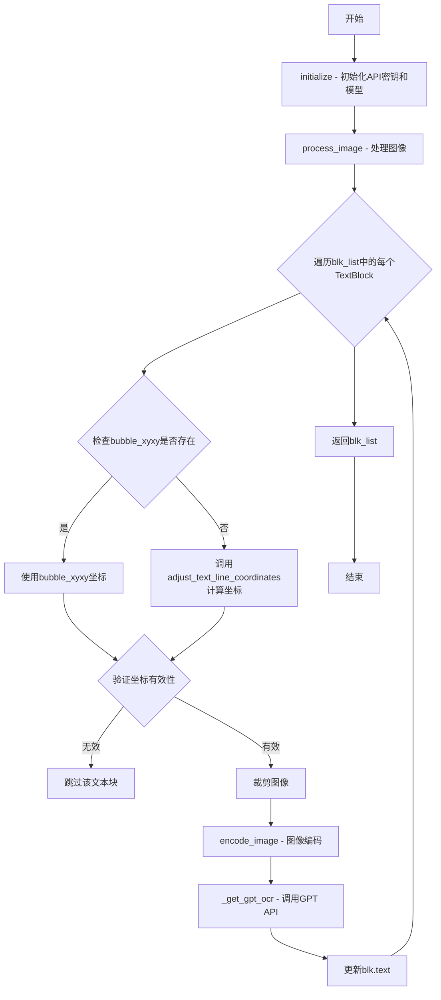
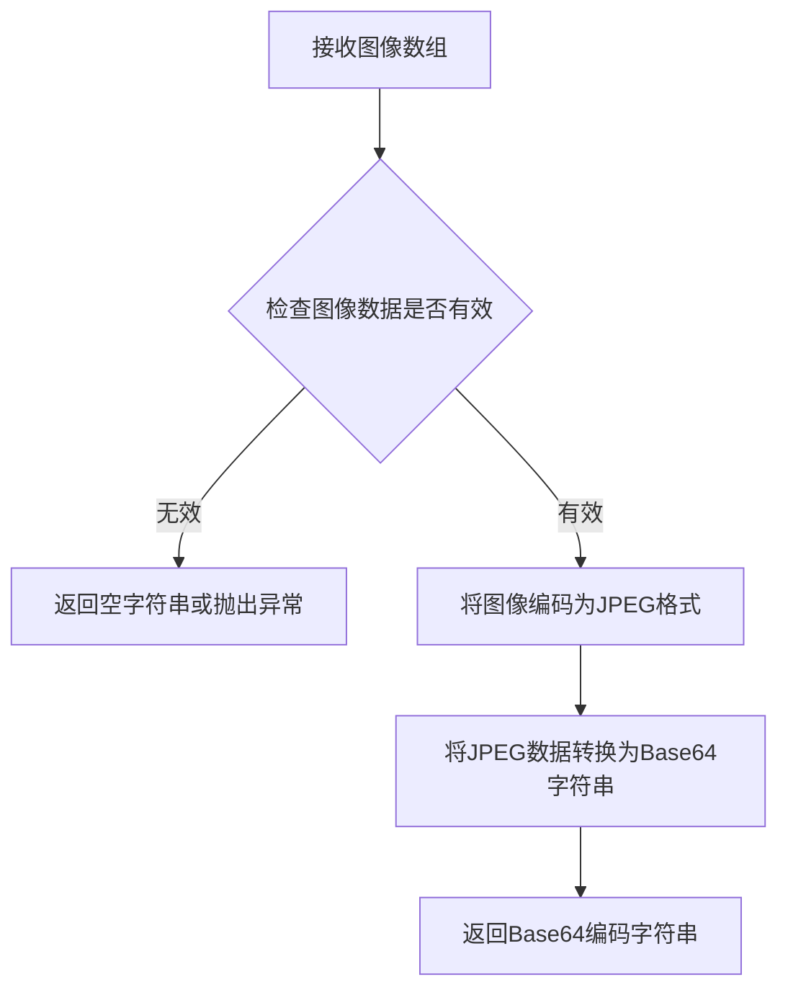
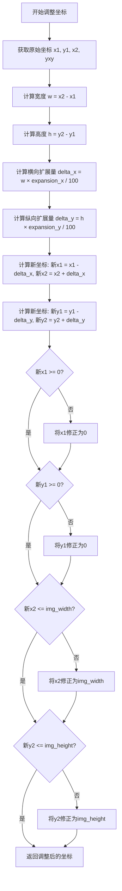
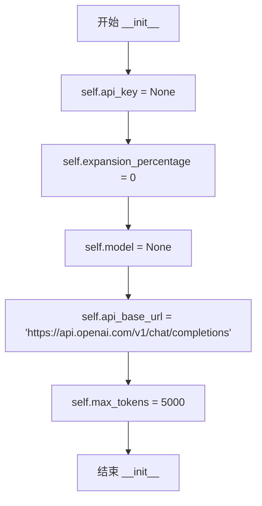
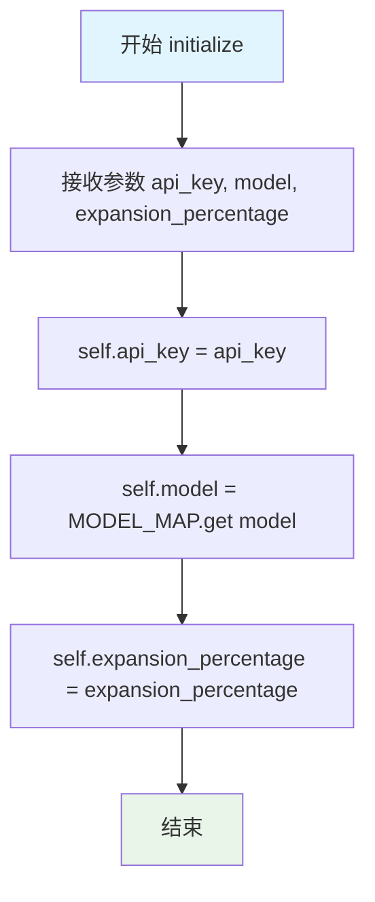
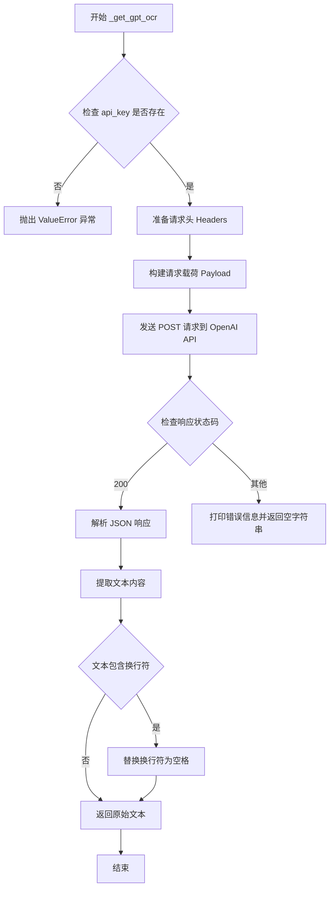

# `comic-translate\modules\ocr\gpt_ocr.py` 详细设计文档

基于GPT视觉能力的OCR引擎，通过调用OpenAI REST API识别图像中的文字，支持文本区域扩展和批量处理

## 整体流程



## 类结构

```
OCREngine (抽象基类)
└── GPTOCR (GPT视觉OCR引擎实现)
```

## 全局变量及字段


### `GPTOCR.api_key`
    
OpenAI API密钥，用于API请求认证

类型：`str`
    


### `GPTOCR.expansion_percentage`
    
文本框扩展百分比，用于调整识别区域大小

类型：`int`
    


### `GPTOCR.model`
    
使用的GPT模型名称，用于OCR识别

类型：`str`
    


### `GPTOCR.api_base_url`
    
OpenAI API端点URL，用于发送请求

类型：`str`
    


### `GPTOCR.max_tokens`
    
最大生成令牌数，限制API响应长度

类型：`int`
    
    

## 全局函数及方法


### `OCREngine.encode_image`

该函数是 `OCREngine` 基类中的方法，用于将图像转换为 Base64 编码字符串，以便后续发送给 GPT 模型进行 OCR 识别。

参数：

- `img`：`np.ndarray`，输入的图像数据（通常为裁剪后的图像区域）

返回值：`str`，返回图像的 Base64 编码字符串，格式为 `data:image/jpeg;base64,{编码数据}`

#### 流程图



#### 带注释源码

```python
def encode_image(self, img: np.ndarray) -> str:
    """
    Encode a numpy image array to base64 string for API transmission.
    
    This method converts an image from numpy array format to a base64
    encoded string that can be directly used in GPT API requests.
    
    Args:
        img: Input image as numpy array (H, W, C) format
        
    Returns:
        Base64 encoded string of the image in format suitable for API
    """
    import base64
    import cv2
    
    # Encode numpy array to JPEG format in memory
    # cv2.imencode returns a tuple (success, buffer)
    success, buffer = cv2.imencode('.jpg', img)
    
    if not success:
        # Handle encoding failure
        return ""
    
    # Convert bytes to base64 encoded string
    # First convert buffer to bytes, then encode
    base64_image = base64.b64encode(buffer).decode('utf-8')
    
    return base64_image
```

> **注意**：由于提供的代码片段中未包含 `OCREngine` 基类的完整定义，上述源码为基于 `GPTOCR` 类中调用方式 (`self.encode_image(cropped_img)`) 和 `_get_gpt_ocr` 方法参数预期 (`base64_image: str`) 的推断实现。实际实现可能略有差异，建议参考 `OCREngine` 基类的完整源代码。


### `adjust_text_line_coordinates`

调整文本行坐标的工具函数，根据扩展百分比和图像尺寸对文本块的边界框坐标进行调整，确保坐标在图像范围内。

参数：

- `xyxy`：tuple，原始文本块的边界框坐标，格式为 (x1, y1, x2, y2)
- `expansion_x`：int，横向扩展百分比，用于扩大文本区域的宽度
- `expansion_y`：int，纵向扩展百分比，用于扩大文本区域的高度
- `img`：np.ndarray，输入图像的 numpy 数组，用于获取图像尺寸以进行边界检查

返回值：tuple，返回调整后的边界框坐标，格式为 (x1, y1, x2, y2)

#### 流程图



#### 带注释源码

```python
def adjust_text_line_coordinates(xyxy: tuple, expansion_x: int, 
                                  expansion_y: int, img: np.ndarray) -> tuple:
    """
    调整文本行坐标，根据扩展百分比扩展边界框并确保坐标在图像范围内。
    
    Args:
        xyxy: 原始边界框坐标 (x1, y1, x2, y2)
        expansion_x: 横向扩展百分比
        expansion_y: 纵向扩展百分比
        img: 输入图像数组，用于获取图像尺寸
    
    Returns:
        调整后的边界框坐标 (x1, y1, x2, y2)
    """
    # 获取原始坐标
    x1, y1, x2, y2 = xyxy
    
    # 计算原始边界框的宽度和高度
    width = x2 - x1
    height = y2 - y1
    
    # 根据扩展百分比计算扩展偏移量
    # expansion_x/expansion_y 为 0 时表示不扩展
    offset_x = width * expansion_x / 100
    offset_y = height * expansion_y / 100
    
    # 应用扩展，创建更大的检测区域
    new_x1 = x1 - offset_x
    new_x2 = x2 + offset_x
    new_y1 = y1 - offset_y
    new_y2 = y2 + offset_y
    
    # 获取图像尺寸用于边界检查
    img_height, img_width = img.shape[:2]
    
    # 确保坐标不超出图像边界，进行必要的裁剪
    # 左侧边界检查
    if new_x1 < 0:
        new_x1 = 0
    
    # 顶部边界检查
    if new_y1 < 0:
        new_y1 = 0
    
    # 右侧边界检查
    if new_x2 > img_width:
        new_x2 = img_width
    
    # 底部边界检查
    if new_y2 > img_height:
        new_y2 = img_height
    
    # 返回调整后的坐标元组
    return (new_x1, new_y1, new_x2, new_y2)
```


### `GPTOCR.__init__`

构造函数，初始化 GPT OCR 引擎的默认属性，包括 API 密钥、模型名称、API 基础 URL 和最大令牌数等配置项。

参数：此方法无显式参数（隐式接收 `self` 参数）

返回值：`None`，无返回值（构造函数）

#### 流程图



#### 带注释源码

```python
def __init__(self):
    """
    构造函数，初始化 GPT OCR 引擎的默认属性。
    这些属性将在 initialize() 方法中被实际配置值覆盖。
    """
    
    # OpenAI API 密钥，初始化为 None，后续通过 initialize() 设置
    self.api_key = None
    
    # 文本边界框扩展百分比，用于调整检测区域
    # 默认为 0，表示不扩展
    self.expansion_percentage = 0
    
    # 使用的 GPT 模型，初始化为 None
    # 后续通过 MODEL_MAP 映射表获取实际模型名称
    self.model = None
    
    # OpenAI Chat Completions API 的基础 URL
    # 用于发送 OCR 请求
    self.api_base_url = 'https://api.openai.com/v1/chat/completions'
    
    # API 响应的最大令牌数
    # 控制 OCR 结果的最大长度
    self.max_tokens = 5000
```


### `GPTOCR.initialize`

初始化GPT OCR引擎的API密钥和模型参数，为后续图像OCR处理做好准备。

参数：

- `self`：实例方法隐式参数，GPTOCR类实例本身
- `api_key`：`str`，OpenAI API密钥，用于API调用身份验证
- `model`：`str`，可选参数（默认值为'GPT-4.1-mini'），要使用的GPT模型标识符
- `expansion_percentage`：`int`，可选参数（默认值为0），文本边界框扩展百分比，用于调整检测区域

返回值：`None`，无返回值，仅更新实例属性

#### 流程图



#### 带注释源码

```python
def initialize(self, api_key: str, model: str = 'GPT-4.1-mini', 
              expansion_percentage: int = 0) -> None:
    """
    Initialize the GPT OCR with API key and parameters.
    
    Args:
        api_key: OpenAI API key for authentication
        model: GPT model to use for OCR (defaults to gpt-4o)
        expansion_percentage: Percentage to expand text bounding boxes
    """
    # 将传入的API密钥存储到实例变量，供后续API调用使用
    self.api_key = api_key
    
    # 通过MODEL_MAP字典获取实际模型名称，若model不在MAP中则返回None
    self.model = MODEL_MAP.get(model)
    
    # 存储文本区域扩展百分比，用于调整OCR检测框大小
    self.expansion_percentage = expansion_percentage
```


### `GPTOCR.process_image`

处理图像并执行OCR识别，通过遍历文本块列表，提取每个文本区域的坐标，裁剪图像并编码后调用GPT模型进行光学字符识别，最终返回更新后的文本块列表。

参数：

- `img`：`np.ndarray`，输入图像的NumPy数组表示
- `blk_list`：`list[TextBlock]`，需要更新OCR文本的TextBlock对象列表

返回值：`list[TextBlock]` ，包含识别后文本内容的TextBlock对象列表

#### 流程图

```mermaid
flowchart TD
    A[开始 process_image] --> B[遍历 blk_list 中的每个 blk]
    B --> C{检查 blk.bubble_xyxy 是否存在}
    C -->|是| D[使用 bubble_xyxy 坐标]
    C -->|否| E[调用 adjust_text_line_coordinates 计算扩展坐标]
    D --> F{验证坐标有效性}
    E --> F
    F -->|无效| B
    F -->|有效| G[裁剪图像: img[y1:y2, x1:x2]]
    G --> H[调用 encode_image 编码图像为 base64]
    H --> I[调用 _get_gpt_ocr 获取OCR结果]
    I --> J[将识别文本赋值给 blk.text]
    J --> B
    K[返回更新后的 blk_list] --> L[结束]
```

#### 带注释源码

```python
def process_image(self, img: np.ndarray, blk_list: list[TextBlock]) -> list[TextBlock]:
    """
    Process an image with GPT-based OCR by processing individual text regions.
    
    Args:
        img: Input image as numpy array
        blk_list: List of TextBlock objects to update with OCR text
        
    Returns:
        List of updated TextBlock objects with recognized text
    """
    # 遍历所有待处理的文本块
    for blk in blk_list:
        # 获取文本区域的边界框坐标
        # 优先使用预设的气泡坐标 bubble_xyxy
        if blk.bubble_xyxy is not None:
            x1, y1, x2, y2 = blk.bubble_xyxy
        else:
            # 如果没有预设坐标，则根据膨胀百分比计算扩展后的坐标
            x1, y1, x2, y2 = adjust_text_line_coordinates(
                blk.xyxy, 
                self.expansion_percentage, 
                self.expansion_percentage, 
                img
            )
        
        # 检查裁剪坐标是否有效：确保坐标在图像范围内且宽高为正
        if x1 < x2 and y1 < y2 and x1 >= 0 and y1 >= 0 and x2 <= img.shape[1] and y2 <= img.shape[0]:
            # 根据有效坐标裁剪图像区域
            cropped_img = img[y1:y2, x1:x2]
            # 将裁剪后的图像编码为base64格式以发送给GPT API
            img_to_gpt = self.encode_image(cropped_img)
            
            # 调用GPT模型执行OCR识别并将结果写入文本块
            blk.text = self._get_gpt_ocr(img_to_gpt)
            
    # 返回包含识别文本的更新后的文本块列表
    return blk_list
```


### `GPTOCR._get_gpt_ocr`

该私有方法接收Base64编码的图像，通过调用OpenAI GPT Vision API进行OCR识别，构建符合API规范的请求头和载荷，发送POST请求并解析返回的JSON响应，最终返回识别出的文本内容或空字符串。

参数：

- `base64_image`：`str`，Base64编码的图像数据

返回值：`str`，OCR识别结果文本，如果API调用失败则返回空字符串

#### 流程图



#### 带注释源码

```python
def _get_gpt_ocr(self, base64_image: str) -> str:
    """
    Get OCR result from GPT model using direct REST API call.
    
    Args:
        base64_image: Base64 encoded image
        
    Returns:
        OCR result text
    """
    # 检查 API key 是否已初始化，若未初始化则抛出异常
    if not self.api_key:
        raise ValueError("API key not initialized. Call initialize() first.")
        
    # 准备 HTTP 请求头，包含内容类型和授权信息
    headers = {
        "Content-Type": "application/json",
        "Authorization": f"Bearer {self.api_key}"
    }
    
    # 准备请求载荷，指定模型、消息内容和最大令牌数
    payload = {
        "model": self.model,
        "messages": [
            {
                "role": "user",
                "content": [
                    # 文本提示，要求模型仅输出图像中的文本，不进行翻译
                    {"type": "text", "text": "Write out the text in this image. Do NOT Translate. Do not write anything else"},
                    # 图像 URL，采用 data URI 格式
                    {"type": "image_url", "image_url": {"url": f"data:image/jpeg;base64,{base64_image}"}}
                ]
            }
        ],
        "max_completion_tokens": self.max_tokens
    }
    
    # 发送 POST 请求到 OpenAI API 端点，设置超时时间为 20 秒
    response = requests.post(
        self.api_base_url,
        headers=headers,
        data=json.dumps(payload),
        timeout=20
    )
    
    # 检查响应状态码是否为 200（成功）
    if response.status_code == 200:
        # 解析 JSON 响应
        response_json = response.json()
        # 从响应中提取文本内容（位于 choices[0].message.content）
        text = response_json['choices'][0]['message']['content']
        # 如果文本包含换行符，则替换为空格
        return text.replace('\n', ' ') if '\n' in text else text
    else:
        # API 调用失败时打印错误信息并返回空字符串
        print(f"API error: {response.status_code} {response.text}")
        return ""
```

## 关键组件


### GPTOCR 类

核心 OCR 引擎类，继承自 OCREngine，利用 GPT 视觉能力通过 REST API 调用实现文字识别功能。

### initialize 方法

初始化方法，配置 API 密钥、模型名称和文本框扩展百分比，将配置存储为实例变量供后续调用。

### process_image 方法

主处理方法，遍历文本块列表，根据每个 TextBlock 的坐标裁剪图像区域，调用 GPT API 识别文字并更新 TextBlock 对象。

### _get_gpt_ocr 方法

私有方法，构建 OpenAI Chat Completion API 请求payload，发送 POST 请求并解析返回的 OCR 结果文本。

### API 请求构建

使用 requests 库向 OpenAI API 端点发送 POST 请求，包含 Authorization 请求头和 JSON 格式的消息体，消息内容包含 base64 编码的图像数据。

### 图像裁剪与坐标处理

根据 TextBlock 的 bubble_xyxy 或 xyxy 坐标计算裁剪区域，支持 expansion_percentage 参数扩展文本框边界，并进行坐标有效性验证。

### 错误处理机制

检查 API 密钥初始化状态，验证裁剪坐标有效性，处理 API 响应非 200 状态码并打印错误信息，返回空字符串作为失败结果。

### MODEL_MAP 集成

通过 MODEL_MAP 字典映射模型名称，将用户提供的模型参数转换为 OpenAI API 要求的模型标识符。


## 问题及建议


### 已知问题

- **错误处理不完善**：API调用失败时仅打印错误并返回空字符串，没有重试机制、异常抛出或错误分类处理
- **串行处理效率低**：逐个处理TextBlock导致多次网络请求，无法利用批量处理或并发调用
- **API Key明文存储**：api_key以明文存储在实例变量中，缺乏加密或安全存储机制
- **硬编码配置值**：max_tokens、timeout、api_base_url等硬编码，缺乏灵活的配置接口
- **缺少日志记录**：完全使用print输出，无标准日志框架，难以生产环境调试
- **图像编码内存风险**：大图像直接Base64编码可能导致内存溢出，缺乏分块或压缩策略
- **无效坐标处理不完善**：坐标无效时静默跳过该文本块，不通知调用者
- **API响应验证不足**：未验证response_json结构直接访问，可能引发KeyError异常
- **父类初始化可能缺失**：未调用super().__init__()，可能破坏继承链
- **返回值语义不一致**：成功时返回str，失败时返回空串，调用方难以区分处理

### 优化建议

- 引入重试装饰器或指数退避策略处理临时性API失败
- 考虑实现批量OCR或异步并发请求提升吞吐量
- 支持环境变量或密钥管理服务注入API Key
- 将超时、token限制等参数暴露为可配置选项
- 统一使用logging模块替代print，配置不同日志级别
- 对大图像进行预处理压缩或分块编码，控制Base64字符串长度
- 坐标无效时抛出明确异常或返回错误标记
- 使用response.get()安全访问JSON字段，添加响应体验证
- 在initialize方法中调用super().__init__()
- 定义自定义异常类，返回结果增加成功/失败状态标识

## 其它


### 设计目标与约束

本模块旨在利用OpenAI GPT模型的视觉能力实现图像文字识别（OCR），通过直接调用REST API将图像内容转换为文本。设计约束包括：1）必须使用有效的OpenAI API密钥；2）支持的模型需在MODEL_MAP中定义；3）图像坐标必须在图像有效范围内；4）API调用超时时间设置为20秒；5）单次请求最大token限制为5000。

### 错误处理与异常设计

本模块包含以下错误处理机制：1）API密钥未初始化时抛出ValueError异常；2）坐标验证失败时跳过该文本块处理；3）API响应非200状态码时打印错误信息并返回空字符串；4）图像编码失败会导致后续处理中断；5）网络请求超时捕获（timeout=20秒）。建议增加：自定义OCRException异常类、详细的错误码定义、指数退避重试机制、日志记录替代print输出。

### 数据流与状态机

数据流如下：1）初始化状态（initialize）→ 2）处理图像状态（process_image）→ 3）循环处理每个TextBlock → 4）坐标调整/获取 → 5）图像裁剪 → 6）图像编码 → 7）GPT API调用 → 8）结果更新 → 9）返回更新后的blk_list。状态转换无分支，每个TextBlock独立处理，API调用为同步阻塞操作。

### 外部依赖与接口契约

外部依赖包括：1）numpy库（图像数组处理）；2）requests库（HTTP请求）；3）json库（Payload序列化）；4）OCREngine基类（抽象接口）；5）TextBlock和adjust_text_line_coordinates工具类；6）MODEL_MAP配置映射。接口契约：initialize(api_key, model, expansion_percentage)无返回值；process_image返回List[TextBlock]；_get_gpt_ocr返回str；encode_image方法需由子类实现或继承。

### 性能考虑与优化空间

当前实现存在以下性能问题：1）同步阻塞的HTTP请求，每个TextBlock串行处理；2）无并发控制，可能触发API速率限制；3）每次请求都创建新连接；4）无缓存机制，相同图像重复处理；5）base64编码未压缩处理。优化建议：使用aiohttp实现异步并发、添加请求池和速率控制、实现结果缓存、使用连接池、考虑图像压缩。

### 安全性考虑

涉及的安全问题：1）API密钥以明文存储在内存中；2）日志输出可能泄露敏感信息；3）无请求签名或防篡改机制；4）无输入验证和清理。安全建议：使用环境变量或密钥管理服务存储API密钥、移除print输出改用安全日志、实施请求签名、添加输入验证。

### 配置管理

当前配置通过initialize参数传入，建议统一管理以下配置：API基础URL、超时时间、最大token数、默认模型选择、扩展百分比默认值、重试策略配置、请求头默认值。配置文件可采用YAML或JSON格式，支持环境变量覆盖。

### 测试策略建议

建议补充以下测试用例：1）单元测试：initialize参数验证、坐标计算逻辑、响应解析；2）集成测试：模拟API响应测试完整流程；3）异常测试：无效API密钥、网络超时、API错误响应；4）边界测试：空图像、超大图像、无效坐标；5）性能测试：批量处理延迟、并发处理能力。

### 日志记录设计

当前使用print输出，建议改用标准logging模块：1）INFO级别：处理开始/结束、处理的文本块数量；2）WARNING级别：坐标验证失败跳过的块；3）ERROR级别：API调用失败、异常捕获；4）DEBUG级别：请求payload、响应状态码。日志应包含时间戳、模块名、请求ID便于追踪。

### 版本兼容性

依赖版本要求：numpy>=1.20.0、requests>=2.25.0。Python版本建议3.9+以支持类型提示的完整特性。API兼容性：当前使用OpenAI v1接口，需关注API版本更新公告，MODEL_MAP需与支持的模型列表同步更新。

    