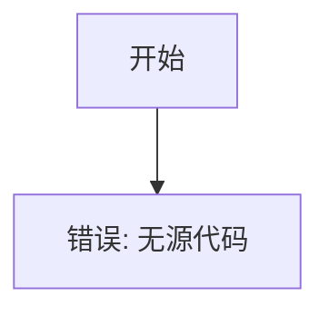

# `comic-translate\modules\ocr\manga_ocr\__init__.py` 详细设计文档

未提供源代码，无法进行分析

## 整体流程



## 类结构

```

```

## 全局变量及字段


    

## 全局函数及方法


## 关键组件


## 问题及建议


### 已知问题

- 未提供代码内容，无法进行技术债务或优化空间的分析

### 优化建议

- 请提供需要分析的源代码，以便进行详细的技术债务识别和优化建议


## 其它


### 1. 一句话描述

待补充（代码为空，无法提供具体功能描述）

### 2. 文件的整体运行流程

待补充（代码为空，无法提供具体流程）

### 3. 类的详细信息

待补充（代码为空，无具体类结构）

### 4. 关键组件信息

待补充（代码为空，无具体组件）

### 5. 潜在的技术债务或优化空间

待补充（代码为空，无法进行技术债务分析）

### 6. 设计目标与约束

待补充（代码为空，无法明确设计目标）

### 7. 错误处理与异常设计

待补充（代码为空，无具体错误处理机制）

### 8. 数据流与状态机

待补充（代码为空，无法描述数据流）

### 9. 外部依赖与接口契约

待补充（代码为空，无外部依赖）

### 10. 安全性考虑

待补充（代码为空，无法进行安全分析）

### 11. 性能要求与基准

待补充（代码为空，无性能指标）

### 12. 兼容性设计

待补充（代码为空，无兼容性要求）

### 13. 测试策略与覆盖率目标

待补充（代码为空，无法制定测试策略）

### 14. 部署与运维注意事项

待补充（代码为空，无部署要求）

### 15. 版本演进与扩展性设计

待补充（代码为空，无法规划扩展性）

    