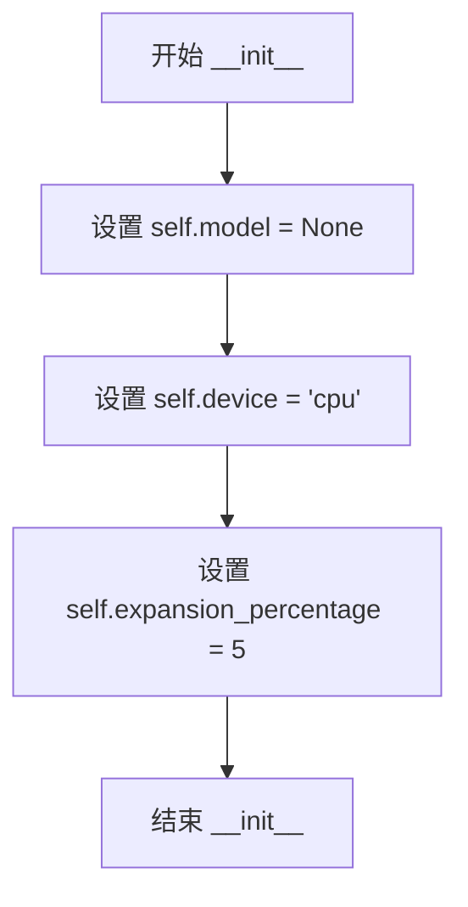
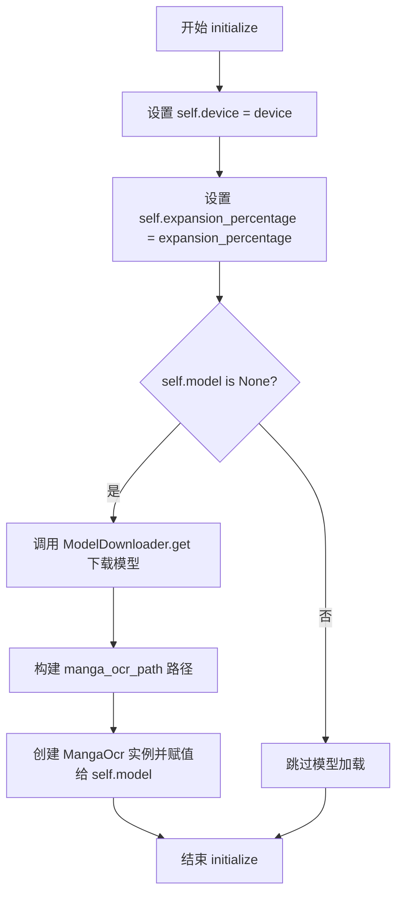
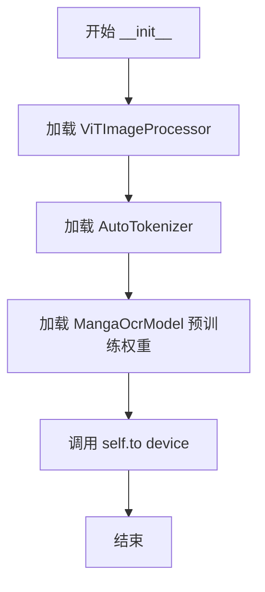
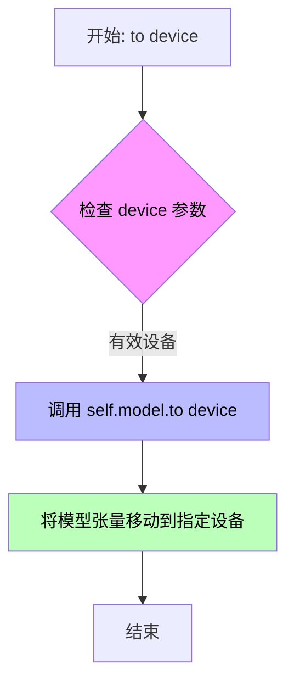
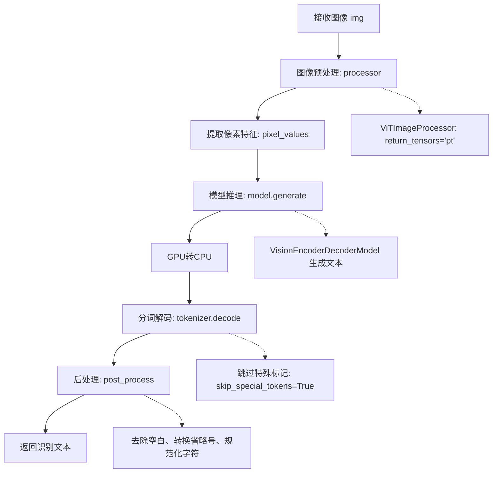

# `comic-translate\modules\ocr\manga_ocr\engine.py` 详细设计文档

一个用于识别日语漫画文本的OCR引擎，基于VisionEncoderDecoderModel架构，通过MangaOCR模型对漫画图像中的文字进行检测、识别和后处理，支持文本框坐标调整和日文全角/半角转换。

## 整体流程

```mermaid
graph TD
    A[开始] --> B[initialize() 初始化引擎]
    B --> C[ModelDownloader.get() 下载模型]
    C --> D[MangaOcr 实例化]
    D --> E[process_image() 处理图像和文本块]
    E --> F{遍历 blk_list 中的每个 TextBlock}
    F --> G{bubble_xyxy 是否存在?}
    G -- 是 --> H[直接使用 bubble_xyxy 坐标]
    G -- 否 --> I[adjust_text_line_coordinates 调整坐标]
    H --> J{坐标验证: x1<x2, y1<2, 范围有效}
    I --> J
    J -- 有效 --> K[cropped_img = img[y1:y2, x1:x2] 裁剪图像]
    J -- 无效 --> L[打印错误, text设为空字符串]
    K --> M[self.model(cropped_img) 调用 MangaOcr]
    M --> N[processor 处理图像 → pixel_values]
    N --> O[model.generate() 生成token]
    O --> P[tokenizer.decode() 解码token]
    P --> Q[post_process() 后处理文本]
    Q --> R[返回处理后的 blk_list]
    L --> R
    F --> S{下一个 TextBlock?}
    S -- 是 --> F
    S -- 否 --> T[结束]
```

## 类结构

```
OCREngine (抽象基类)
└── MangaOCREngine
MangaOcrModel (VisionEncoderDecoderModel + GenerationMixin)
└── MangaOcr (模型包装类)
```

## 全局变量及字段


### `manga_ocr_path`
    
MangaOCR模型路径

类型：`str`
    


### `MangaOCREngine.model`
    
OCR模型实例

类型：`MangaOcr`
    


### `MangaOCREngine.device`
    
计算设备(cpu/cuda)

类型：`str`
    


### `MangaOCREngine.expansion_percentage`
    
文本框扩展百分比

类型：`int`
    


### `MangaOcr.processor`
    
图像预处理器

类型：`ViTImageProcessor`
    


### `MangaOcr.tokenizer`
    
文本分词器

类型：`AutoTokenizer`
    


### `MangaOcr.model`
    
视觉编码器-解码器模型

类型：`MangaOcrModel`
    
    

## 全局函数及方法


### `post_process`

文本后处理函数，用于去除空白、规范化标点、并进行日文全角半角转换。

参数：

- `text`：`str`，需要处理的原始文本

返回值：`str`，处理后的文本

#### 流程图

```mermaid
flowchart TD
    A[开始: 输入原始文本] --> B[去除空白字符<br>text.split() + ''.join]
    B --> C[规范化省略号<br>将 '…' 替换为 '...']
    C --> D[规范化连续分隔符<br>正则替换连续 '・' 或 '.' ]
    D --> E[日文全角半角转换<br>jaconv.h2z]
    E --> F[返回处理后的文本]
```

#### 带注释源码

```python
def post_process(text):
    """
    文本后处理函数
    
    处理步骤：
    1. 去除所有空白字符（空格、换行、制表符等）
    2. 将省略号 '…' 转换为标准格式 '...'
    3. 将连续的 '・' 或 '.' 替换为相应数量的点
    4. 将日文字符从半角转换为全角（ASCII和数字）
    
    Args:
        text: 需要处理的原始文本字符串
        
    Returns:
        处理后的文本字符串
    """
    # 步骤1: 去除所有空白字符
    # text.split() 会按空白字符分割成列表，''.join() 再合并为空字符串
    text = ''.join(text.split())
    
    # 步骤2: 将省略号 '…' 替换为标准三个点 '...'
    text = text.replace('…', '...')
    
    # 步骤3: 规范化连续的分隔符（点或中点）
    # 正则匹配连续2个或更多的 '・' 或 '.'
    # lambda 函数计算匹配长度，用相应数量的点替换
    # 例如: '.....' (5个点) -> '.....' (保持5个点)
    #      '・・' (2个中点) -> '..' (2个点)
    text = re.sub('[・.]{2,}', lambda x: (x.end() - x.start()) * '.', text)
    
    # 步骤4: 日文全角半角转换
    # jaconv.h2z: 将半角字符转换为全角
    # ascii=True: 转换ASCII字符（字母、数字、符号）
    # digit=True: 转换数字
    # 例如: 'abc123' -> 'ａｂｃ１２３'
    text = jaconv.h2z(text, ascii=True, digit=True)
    
    # 返回处理后的文本
    return text
```


### `MangaOCREngine.__init__`

该方法是 `MangaOCREngine` 类的构造函数，负责初始化引擎的基本属性，包括模型引用、设备类型和文本框扩展百分比，为后续的 OCR 识别任务准备基础配置。

参数：无（隐含参数 `self` 为实例本身）

返回值：`None`，无返回值

#### 流程图



#### 带注释源码

```python
def __init__(self):
    """
    初始化 MangaOCREngine 引擎的基本属性。
    
    该构造函数设置默认的引擎参数：
    - model: 设置为 None，表示模型尚未加载
    - device: 默认为 'cpu' 设备
    - expansion_percentage: 默认为 5，用于文本框扩展
    """
    self.model = None          # 模型对象，初始化时为 None，后续 initialize 时加载
    self.device = 'cpu'        # 计算设备，默认为 CPU，可切换至 CUDA
    self.expansion_percentage = 5  # 文本框扩展百分比，用于增加识别区域
```

#### 类字段详细信息

| 字段名称 | 类型 | 描述 |
|---------|------|------|
| `model` | `Optional[MangaOcr]` | OCR 模型实例，初始化时为 None |
| `device` | `str` | 计算设备，'cpu' 或 'cuda' |
| `expansion_percentage` | `int` | 文本框扩展百分比，用于扩大识别区域 |

#### 关联方法

| 方法名称 | 功能描述 |
|---------|---------|
| `initialize()` | 加载模型并初始化 OCR 引擎 |
| `process_image()` | 对图像进行 OCR 识别处理 |

#### 技术债务与优化空间

1. **硬编码默认值**：`device` 和 `expansion_percentage` 的默认值直接写在 `__init__` 中，建议提取为配置常量或配置文件
2. **模型延迟加载**：模型在 `__init__` 中未加载，符合延迟加载设计，但缺少错误处理机制
3. **类型注解缺失**：未使用 `typing.Optional` 对 `model` 字段进行类型注解


### `MangaOCREngine.initialize`

该方法用于初始化 MangaOCR 引擎，加载预训练的 MangaOCR 模型，并根据传入的参数设置设备类型和文本框扩展百分比。

参数：

- `device`：`str`，指定运行设备（'cpu' 或 'cuda'），默认为 'cpu'
- `expansion_percentage`：`int`，文本边界框扩展百分比，用于调整检测区域大小，默认为 5

返回值：`None`，该方法无返回值，仅初始化实例属性

#### 流程图



#### 带注释源码

```python
def initialize(self, device: str = 'cpu', expansion_percentage: int = 5) -> None:
    """
     Initialize the MangaOCR engine.
     
     Args:
         device: Device to use ('cpu' or 'cuda')
         expansion_percentage: Percentage to expand text bounding boxes
     """

    # 将传入的设备参数保存到实例属性
    self.device = device
    
    # 将传入的扩展百分比保存到实例属性
    self.expansion_percentage = expansion_percentage
    
    # 仅在模型尚未加载时执行初始化
    if self.model is None:
        # 下载 MangaOCR 基础模型（如果本地不存在）
        ModelDownloader.get(ModelID.MANGA_OCR_BASE)
        
        # 构建模型文件的完整路径
        manga_ocr_path = os.path.join(models_base_dir, 'ocr', 'manga-ocr-base')
        
        # 创建 MangaOcr 实例，加载预训练模型并配置设备
        self.model = MangaOcr(pretrained_model_name_or_path=manga_ocr_path, device=device)
```


### `MangaOCREngine.process_image`

该方法接收待处理的图像数组和文本块列表，遍历每个文本块获取或计算其边界框坐标，裁剪图像区域后调用MangaOCR模型进行文字识别，并将识别结果存储到文本块中，最终返回处理完成的文本块列表。

参数：

- `img`：`np.ndarray`，输入的原始图像数据
- `blk_list`：`list[TextBlock]`，待处理的文本块列表，每个TextBlock对象包含边界框坐标和识别结果存储字段

返回值：`list[TextBlock]`，返回经过OCR识别处理后的文本块列表，识别后的文本存储在每个blk的text字段中

#### 流程图

```mermaid
flowchart TD
    A[开始处理] --> B[遍历blk_list中的每个TextBlock]
    B --> C{判断blk.bubble_xyxy是否存在?}
    C -->|是| D[使用blk.bubble_xyxy作为坐标]
    C -->|否| E[调用adjust_text_line_coordinates计算扩展后的坐标]
    D --> F[验证坐标有效性: x1<x2, y1<y2, 坐标>=0, 坐标<=图像边界]
    E --> F
    F --> G{坐标是否有效?}
    G -->|是| H[裁剪图像: img[y1:y2, x1:x2]]
    G -->|否| I[打印错误信息, 设置blk.text为空字符串]
    H --> J[调用self.model进行OCR识别]
    J --> K[将识别结果存储到blk.text]
    I --> L[继续下一个文本块]
    K --> L
    L --> M{是否还有未处理的文本块?}
    M -->|是| B
    M -->|否| N[返回blk_list]
```

#### 带注释源码

```python
def process_image(self, img: np.ndarray, blk_list: list[TextBlock]) -> list[TextBlock]:
    """
    处理图像并识别文本
    
    Args:
        img: 输入的图像数组
        blk_list: 待处理的文本块列表
    
    Returns:
        处理完成的文本块列表
    """
    # 遍历每一个文本块进行OCR处理
    for blk in blk_list:
        # 获取文本块的边界框坐标
        if blk.bubble_xyxy is not None:
            # 如果存在气泡坐标，则优先使用气泡坐标
            x1, y1, x2, y2 = blk.bubble_xyxy
        else:
            # 否则使用adjust_text_line_coordinates函数计算扩展后的坐标
            # expansion_percentage控制边界扩展百分比
            x1, y1, x2, y2 = adjust_text_line_coordinates(
                blk.xyxy, 
                self.expansion_percentage, 
                self.expansion_percentage, 
                img
            )
        
        # 检查坐标是否在图像范围内且有效
        # 条件: x1<x2, y1<y2, 坐标非负, 坐标不超过图像宽高
        if x1 < x2 and y1 < y2 and x1 >= 0 and y1 >= 0 and x2 <= img.shape[1] and y2 <= img.shape[0]:
            # 裁剪图像区域 [y1:y2, x1:x2] 注意numpy数组是row,col顺序
            cropped_img = img[y1:y2, x1:x2]
            # 调用MangaOCR模型进行文字识别,结果存入blk.text
            blk.text = self.model(cropped_img)
        else:
            # 坐标无效时打印警告并置空识别结果
            print('Invalid textbbox to target img')
            blk.text = ""
            
    # 返回处理完成的文本块列表
    return blk_list
```


### `MangaOcr.__init__`

该方法是 `MangaOcr` 类的构造函数，用于初始化 MangaOCR 模型的核心组件，包括图像处理器（ViTImageProcessor）、文本分词器（AutoTokenizer）和视觉编码器-解码器模型（VisionEncoderDecoderModel），并将模型移动到指定的计算设备上。

参数：

- `pretrained_model_name_or_path`：`str`，预训练模型的路径或模型名称，默认为 `manga_ocr_path`（指向本地 manga-ocr-base 模型目录）
- `device`：`str`，指定运行模型的设备，默认为 `'cpu'`，支持 `'cuda'` 等其他设备

返回值：`None`，该方法为构造函数，不返回任何值

#### 流程图



#### 带注释源码

```python
def __init__(self, pretrained_model_name_or_path=manga_ocr_path, device='cpu'):
    """
    初始化 MangaOCR 模型，加载预训练模型、处理器和分词器。
    
    Args:
        pretrained_model_name_or_path: 预训练模型路径或HuggingFace模型ID
        device: 运行设备，'cpu' 或 'cuda'
    """
    # 从预训练模型路径加载 Vision Transformer 图像处理器
    # 负责将图像预处理为模型输入格式
    self.processor = ViTImageProcessor.from_pretrained(pretrained_model_name_or_path)
    
    # 加载与模型配套的 tokenizer
    # 用于将模型输出解码为可读文本
    self.tokenizer = AutoTokenizer.from_pretrained(pretrained_model_name_or_path)
    
    # 加载预训练的 VisionEncoderDecoderModel
    # 这是一个视觉到文本的编码器-解码器架构
    self.model = MangaOcrModel.from_pretrained(pretrained_model_name_or_path)
    
    # 将模型权重移动到指定设备（CPU/CUDA）
    # 注意：此处调用的是 MangaOcr 类的 to 方法，而非直接调用 model.to()
    self.to(device)

def to(self, device):
    """将模型移动到指定设备"""
    self.model.to(device)
```


### `MangaOcr.to(device)`

将 MangaOCR 模型移动到指定设备（CPU 或 CUDA GPU）。

参数：

- `device`：`str`，目标设备类型，'cpu' 表示中央处理器，'cuda' 表示 NVIDIA GPU

返回值：`None`，无返回值，该方法直接修改模型在内存中的位置

#### 流程图



#### 带注释源码

```python
def to(self, device):
    """
    将模型移动到指定设备
    
    参数:
        device: 目标设备，'cpu' 或 'cuda'
    """
    # 调用 transformers 库的 to 方法，将内部模型移动到指定设备
    # 这会移动模型的所有参数到 GPU（如果 device='cuda'）或 CPU（如果 device='cpu'）
    self.model.to(device)
```


### `MangaOcr.__call__`

该方法是 MangaOCR 的核心调用接口，接收图像数据并使用预训练的 VisionEncoderDecoder 模型进行日文漫画文本识别，经过图像处理、模型推理、分词解码和后处理后返回识别的文本字符串。

参数：

- `img`：`np.ndarray`，输入的图像数据（待识别的图像）

返回值：`str`，识别后的日文文本结果

#### 流程图



#### 带注释源码

```python
@torch.no_grad()  # 禁用梯度计算，节省内存并提高推理速度
def __call__(self, img: np.ndarray):
    """
    对输入的图像进行OCR识别，识别日文漫画文本
    
    Args:
        img: 输入的图像，numpy数组格式
        
    Returns:
        识别后的文本字符串
    """
    # Step 1: 使用ViTImageProcessor对图像进行预处理
    # 将numpy图像转换为PyTorch张量，并提取像素特征
    x = self.processor(img, return_tensors="pt").pixel_values.squeeze()
    
    # Step 2: 将图像特征送入VisionEncoderDecoder模型进行文本生成
    # x[None]添加batch维度，.to(self.model.device)将数据移动到模型所在设备
    # [0]取第一个结果，[0].cpu()将结果从GPU转回CPU
    x = self.model.generate(x[None].to(self.model.device))[0].cpu()
    
    # Step 3: 使用tokenizer将模型输出的token id解码为文本字符串
    # skip_special_tokens=True 跳过特殊标记（如<pad>、</s>等）
    x = self.tokenizer.decode(x, skip_special_tokens=True)
    
    # Step 4: 对解码后的文本进行后处理
    # 包括：去除多余空白、转换省略号、字符规范化（全角/半角转换）
    x = post_process(x)
    
    return x  # 返回识别结果
```

## 关键组件


### MangaOCREngine

MangaOCR引擎主类，继承自OCREngine，负责初始化MangaOCR模型并处理图像文本识别，支持文本框扩展和坐标验证。

### MangaOcrModel

模型封装类，继承自VisionEncoderDecoderModel和GenerationMixin，用于加载预训练的MangaOCR基础模型。

### MangaOcr

OCR处理核心类，负责加载ViTImageProcessor、AutoTokenizer和MangaOcrModel，并执行图像到文本的推理，包含模型设备转换和推理调用。

### post_process

文本后处理函数，对识别结果进行规范化处理，包括去除空白、替换省略号、统一日文字符集（半角转全角）等操作。

### 张量索引与惰性加载

在MangaOcr.__call__方法中使用x[None]为张量添加批次维度，支持单图像推理；使用@torch.no_grad()装饰器实现惰性加载，减少内存占用。

### 反量化支持

通过post_process函数将识别文本中的半角字符（日文ASCII和数字）转换为全角字符（h2z转换），实现文本规范化。

### 量化策略

使用transformers库的ViTImageProcessor和AutoTokenizer处理图像和文本，支持从预训练模型加载参数，未使用量化推理。


## 问题及建议


### 已知问题

- **资源管理缺失**：模型加载后没有提供释放资源的方法（如`close()`或`cleanup()`），无法显式释放GPU内存
- **错误处理不足**：`process_image`中仅使用`print()`输出错误信息，未使用正式日志框架，且坐标无效时直接返回空文本，可能导致静默失败
- **重复代码**：`manga_ocr_path`在模块级别定义后，又在`MangaOcr.__init__`参数默认值中重复定义；注释中有重复的URL
- **冗余类定义**：`MangaOcrModel`类继承`VisionEncoderDecoderModel`和`GenerationMixin`但未添加任何实际功能，仅用于类型标记
- **类型注解不完整**：`process_image`方法使用了Python 3.9+的`list[TextBlock]`语法但未做兼容处理；缺少返回类型注解
- **性能优化缺失**：每个TextBlock逐个调用OCR模型，未实现批处理；每次推理都进行GPU-CPU数据拷贝
- **边界条件处理不完善**：坐标验证逻辑中`x2 <= img.shape[1] and y2 <= img.shape[0]`应该是严格小于，否则可能索引越界；未处理x2或y2为0的空区域情况

### 优化建议

- 实现`close()`方法用于释放模型资源，实现`__enter__`和`__exit__`以支持上下文管理器协议
- 使用`logging`模块替换`print()`，并根据严重程度决定是否抛出异常或降级处理
- 移除`MangaOcrModel`的重复定义，直接使用`VisionEncoderDecoderModel`；删除重复的全局变量和注释URL
- 统一使用`typing.List`或添加`from __future__ import annotations`以兼容不同Python版本
- 考虑添加批处理逻辑：将多个TextBlock区域合并后一次性送入模型推理，或在单图推理时复用tensor设备
- 修正边界检查为`x2 < img.shape[1] and y2 < img.shape[0]`，并添加对空区域的提前返回或跳过逻辑
- 为`MangaOcr`类和`post_process`函数添加完整的文档字符串，说明其职责和参数含义

## 其它


### 设计目标与约束

本模块旨在为漫画图像提供高精度的日文OCR识别能力，支持在CPU和GPU环境下运行，能够处理不同尺寸的图像并准确提取文字信息。设计约束包括：模型文件较大需支持增量下载、需要在资源受限环境下保持可接受的识别速度、必须与现有OCREngine基类接口保持一致。

### 错误处理与异常设计

模型加载失败时抛出RuntimeError并提示检查网络连接或模型路径；图像坐标无效时返回空文本并打印警告日志；设备不支持时回退到CPU；后处理阶段异常捕获后返回原始识别结果。所有异常均不中断程序执行，保证批量处理的稳定性。

### 数据流与状态机

主流程：初始化→加载模型→接收图像和文本块列表→遍历每个文本块→提取坐标→验证边界→裁剪图像→调用模型推理→后处理→更新文本块内容→返回列表。状态转换：未初始化→已初始化→处理中→完成。

### 外部依赖与接口契约

依赖transformers库提供模型加载和推理、numpy处理图像数组、jaconv进行日文字符转换、re进行正则处理、os和torch提供基础运算。接口契约：initialize方法接受device和expansion_percentage参数、process_image方法接收numpy数组和TextBlock列表并返回更新后的列表、模型路径遵循models_base_dir/ocr/manga-ocr-base结构。

### 性能考量与优化空间

当前每次调用都执行模型generate操作，可批量处理多个文本块以减少推理开销；processor和tokenizer可缓存避免重复加载；设备转换可优化减少CPU-GPU数据传输；expansion_percentage参数可根据图像分辨率动态调整以提升识别准确率。

### 安全性考虑

模型文件路径使用os.path.join防止路径注入、输入图像尺寸需校验防止内存溢出、模型设备切换需确认CUDA可用性、下载模型需验证完整性。

### 兼容性设计

支持Python 3.8+、PyTorch 1.8+、transformers 4.20+、numpy 1.21+；设备字符串'cpu'和'cuda'需标准化处理；不同版本模型可能存在接口差异需版本适配。


    