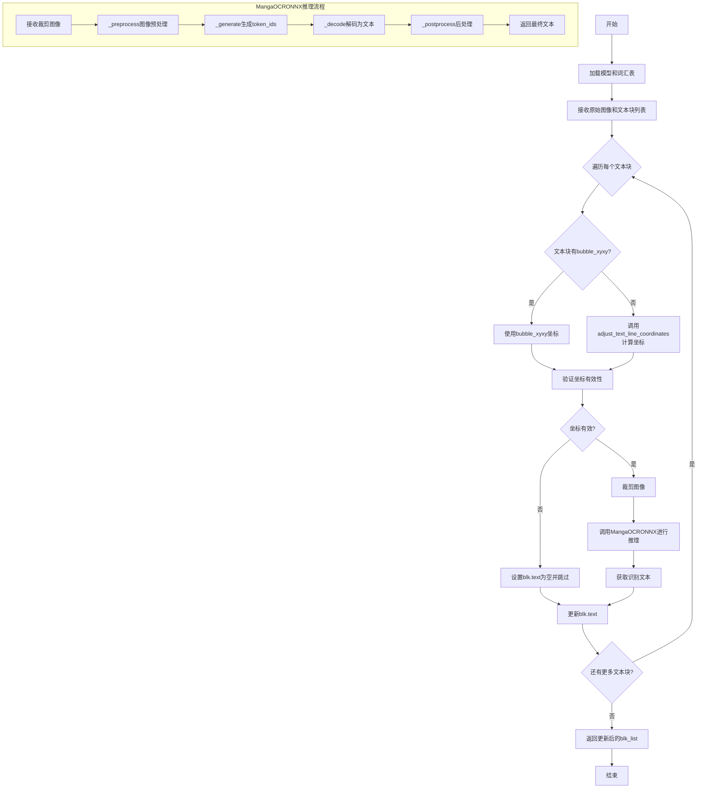
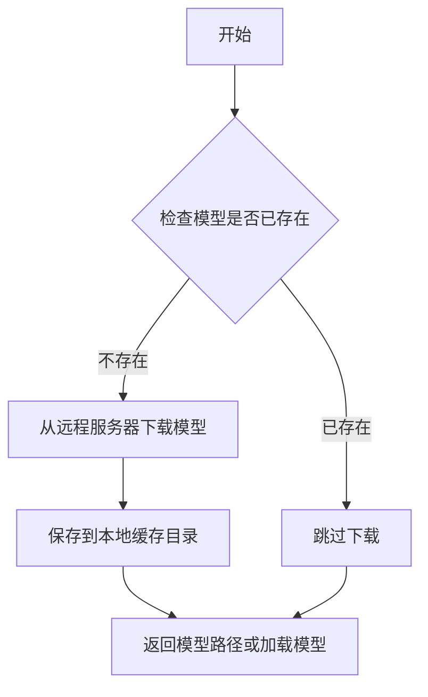
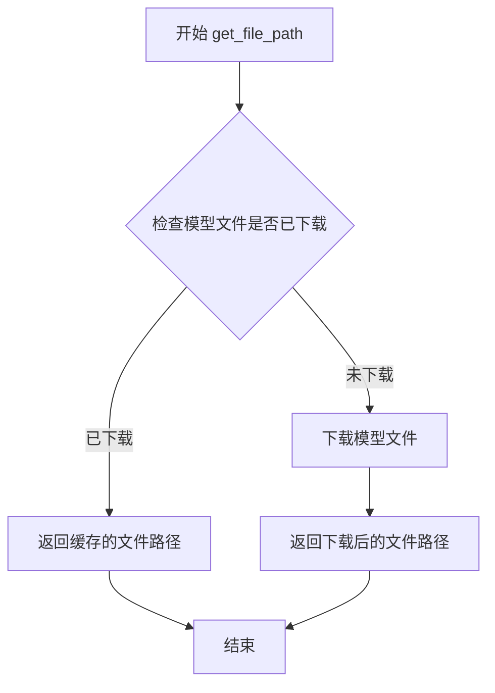
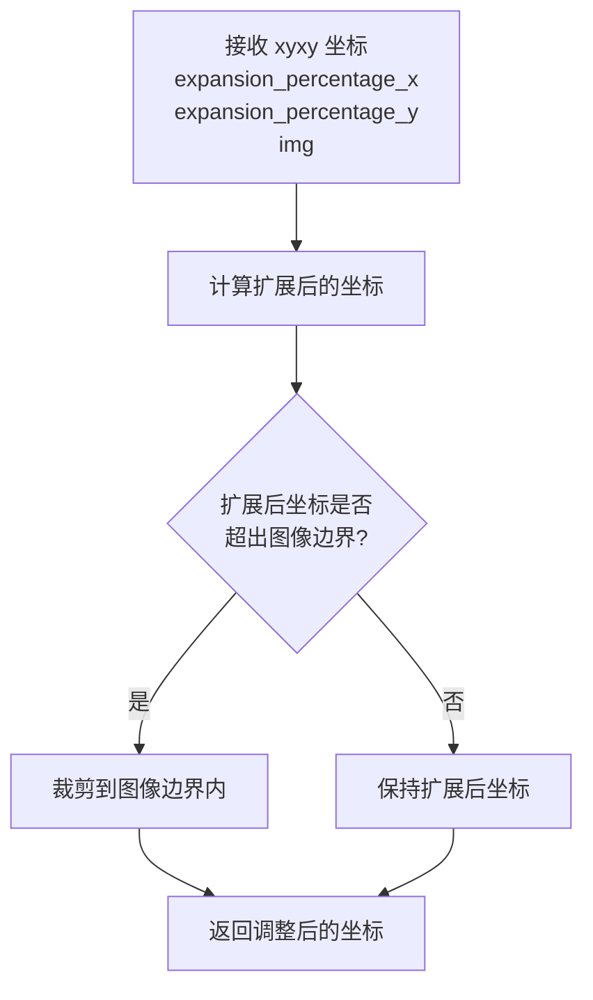
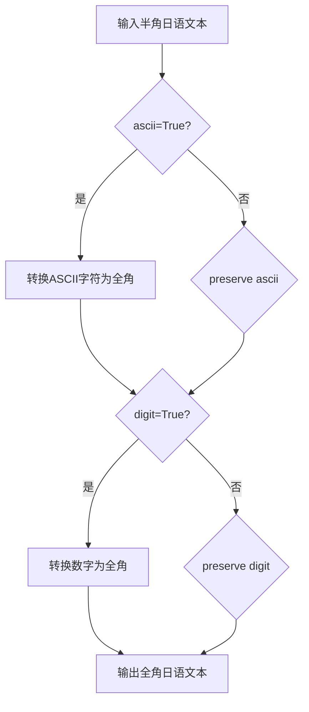
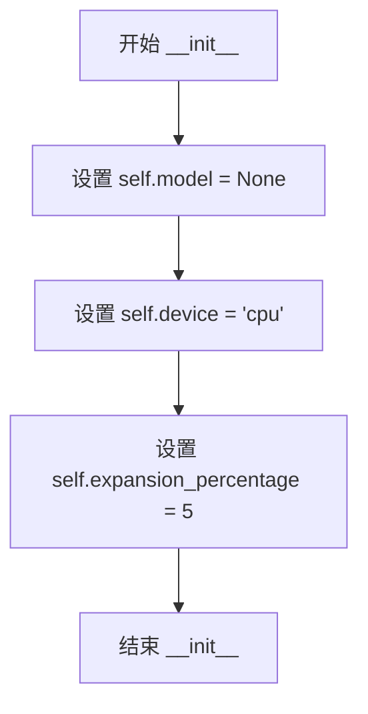
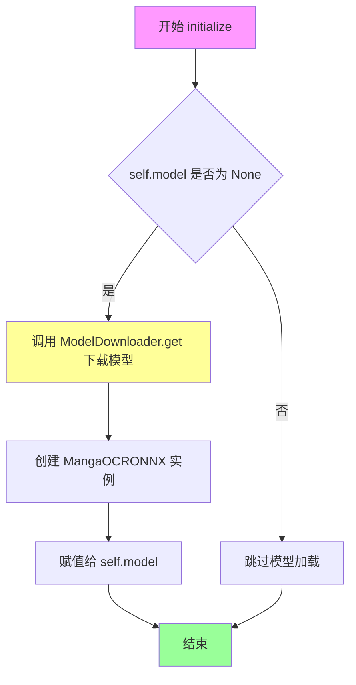
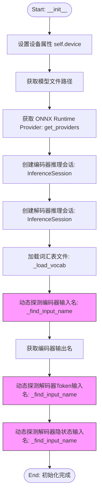
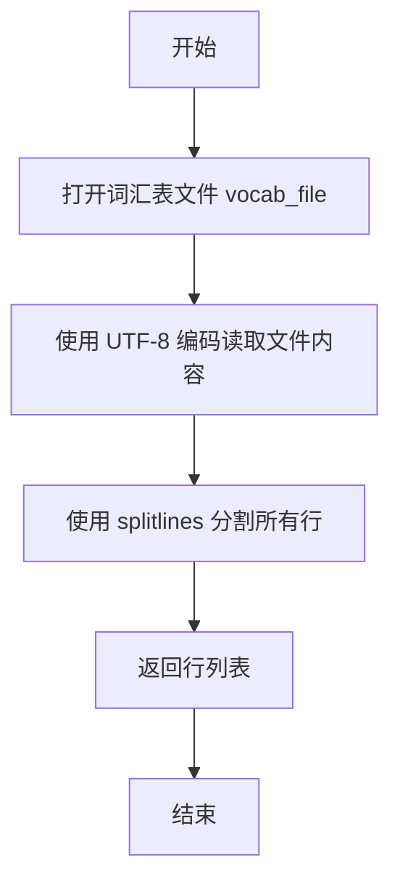
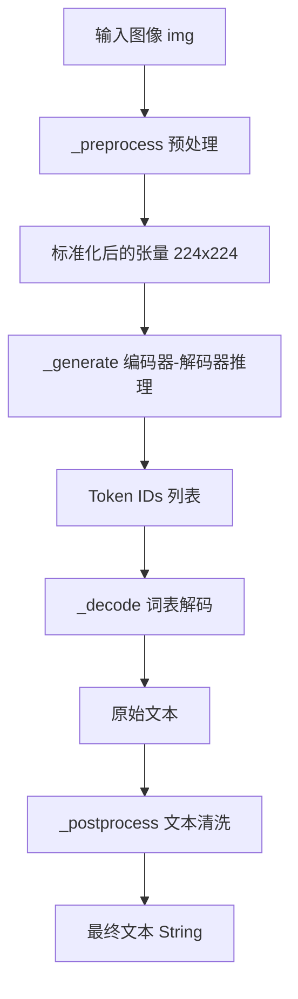

# `comic-translate\modules\ocr\manga_ocr\onnx_engine.py` 详细设计文档

这是一个基于ONNX的MangaOCR引擎，用于识别漫画中的日文字符。该引擎包含两个主要类：MangaOCREngineONNX负责整体OCR流程管理，包括图像预处理和文本块处理；MangaOCRONNX是ONNX模型的包装器，负责加载编码器和解码器模型，执行推理并将token id转换为可读文本。

## 整体流程



## 类结构

```
OCREngine (抽象基类)
└── MangaOCREngineONNX

MangaOCRONNX (ONNX模型包装器)
```

## 全局变量及字段


### `encoder_path`
    
编码器模型文件路径

类型：`str`
    


### `decoder_path`
    
解码器模型文件路径

类型：`str`
    


### `vocab_path`
    
词汇表文件路径

类型：`str`
    


### `providers`
    
ONNX运行时提供者列表

类型：`list`
    


### `img_in`
    
预处理后的图像数组

类型：`np.ndarray`
    


### `token_ids`
    
生成的token id列表

类型：`list`
    


### `text`
    
解码后的文本

类型：`str`
    


### `arr`
    
图像数值数组

类型：`np.ndarray`
    


### `MangaOCREngineONNX.self.model`
    
ONNX模型实例

类型：`MangaOCRONNX`
    


### `MangaOCREngineONNX.self.device`
    
计算设备('cpu'或'cuda')

类型：`str`
    


### `MangaOCREngineONNX.self.expansion_percentage`
    
边界框扩展百分比

类型：`int`
    


### `MangaOCRONNX.self.device`
    
计算设备

类型：`str`
    


### `MangaOCRONNX.self.encoder`
    
ONNX编码器推理会话

类型：`InferenceSession`
    


### `MangaOCRONNX.self.decoder`
    
ONNX解码器推理会话

类型：`InferenceSession`
    


### `MangaOCRONNX.self.vocab`
    
词汇表列表

类型：`list`
    


### `MangaOCRONNX.self.encoder_image_input`
    
编码器图像输入名称

类型：`str`
    


### `MangaOCRONNX.self.encoder_output_name`
    
编码器输出名称

类型：`str`
    


### `MangaOCRONNX.self.decoder_token_input`
    
解码器token输入名称

类型：`str`
    


### `MangaOCRONNX.self.decoder_encoder_input`
    
解码器编码器输入名称

类型：`str`
    
    

## 全局函数及方法


### `get_providers`

该函数根据传入的设备参数返回对应的 ONNX Runtime 提供者列表，用于在模型推理时选择合适的执行设备。

参数：

- `device`：`str`，设备标识符，'cpu' 或包含 'cuda' 的字符串

返回值：`list[str]`，ONNX Runtime 提供者名称列表

#### 流程图

```mermaid
flowchart TD
    A[开始] --> B{device 是否为 'cpu'}
    B -->|是| C[返回 ['CPUExecutionProvider']]
    B -->|否| D{device 是否包含 'cuda'}
    D -->|是| E[返回 ['CUDAExecutionProvider', 'CPUExecutionProvider']]
    D -->|否| F[返回 ['CPUExecutionProvider']]
```

#### 带注释源码

```python
# 注意：以下为基于代码上下文推断的源码实现
# 实际源码位于 modules.utils.device 模块中

def get_providers(device: str) -> list:
    """获取 ONNX Runtime 提供者列表。
    
    Args:
        device: 设备标识符，'cpu' 或包含 'cuda' 的字符串
        
    Returns:
        ONNX Runtime 提供者名称列表
    """
    if device == 'cpu':
        # CPU 设备仅使用 CPU 执行提供者
        return ['CPUExecutionProvider']
    
    # 尝试使用 CUDA 提供者（如果可用），同时保留 CPU 作为后备
    # 注意：实际上 onnxruntime 会自动回退到 CPUExecutionProvider
    # 如果 CUDA 不可用，因此通常直接返回 ['CUDAExecutionProvider', 'CPUExecutionProvider']
    return ['CUDAExecutionProvider', 'CPUExecutionProvider']
```

---

**说明**：由于 `get_providers` 函数定义在 `modules.utils.device` 模块中，而该模块的源码未在当前给定的代码片段中提供，因此上述源码是基于该函数在 `MangaOCRONNX.__init__` 方法中的使用方式（`providers = get_providers(self.device)`）以及 ONNX Runtime 的常见用法推断得出的。实际实现可能略有差异。


### `ModelDownloader.get`

该方法为静态方法，用于下载指定的机器学习模型文件。根据代码调用方式推断，它会检查模型是否已存在，若不存在则从远程服务器下载，并返回下载后的模型路径或直接加载模型。

注意：由于原始代码中未提供 `ModelDownloader` 类的完整定义，以下信息基于代码中的调用方式推断得出。

参数：

-  `model_id`：`ModelID`，模型标识符，指定要下载的模型类型（这里传入的是 `ModelID.MANGA_OCR_BASE_ONNX`）

返回值：`Any`，根据实现可能返回模型路径或模型对象。在代码中该返回值未被接收（直接调用），表明可能返回 `None` 或执行下载操作。

#### 流程图



#### 带注释源码

```python
# 基于代码调用方式推断的源码结构
class ModelDownloader:
    """模型下载器类"""
    
    @staticmethod
    def get(model_id: ModelID) -> Any:
        """下载指定模型
        
        Args:
            model_id: 模型标识符，指定要下载的模型
            
        Returns:
            返回值类型不确定，可能是模型路径或None
        """
        # 检查本地是否已存在模型文件
        local_path = ModelDownloader.get_file_path(model_id, "")
        if local_path and os.path.exists(local_path):
            return  # 模型已存在，直接返回
            
        # 模型不存在，触发下载逻辑
        # ... (下载实现细节)
        
# 代码中的调用示例
ModelDownloader.get(ModelID.MANGA_OCR_BASE_ONNX)
```

#### 补充说明

由于原始代码中未包含 `ModelDownloader` 类的完整实现，无法提供准确的方法签名和详细逻辑。建议提供完整的 `ModelDownloader` 类源码以获得更精确的分析。

此外，代码中还使用了 `ModelDownloader.get_file_path` 静态方法：

```python
# 获取模型文件的本地路径
encoder_path = ModelDownloader.get_file_path(ModelID.MANGA_OCR_BASE_ONNX, "encoder_model.onnx")
decoder_path = ModelDownloader.get_file_path(ModelID.MANGA_OCR_BASE_ONNX, "decoder_model.onnx")
vocab_path = ModelDownloader.get_file_path(ModelID.MANGA_OCR_BASE_ONNX, "vocab.txt")
```

该方法的参数包括 `model_id`（ModelID类型）和 `filename`（str类型），返回文件路径字符串（str类型）。


### `ModelDownloader.get_file_path`

获取模型文件的完整文件系统路径，用于加载ONNX模型和词汇表文件。

参数：

- `model_id`：`ModelID`，模型标识符，指定要获取文件的模型（如 `ModelID.MANGA_OCR_BASE_ONNX`）
- `filename`：`str`，要获取的文件名（如 "encoder_model.onnx"、"decoder_model.onnx"、"vocab.txt"）

返回值：`str`，返回模型文件的完整文件系统路径

#### 流程图



#### 带注释源码

```
# 该方法是外部导入的，以下为基于代码用法的推断实现
# 实际实现位于 modules.utils.download 模块中

def get_file_path(model_id: ModelID, filename: str) -> str:
    """
    获取指定模型文件的完整路径。
    
    参数:
        model_id: ModelID枚举值，标识模型类型
        filename: str，要获取的文件名
    
    返回:
        str，模型文件的完整文件系统路径
    
    用法示例:
        encoder_path = ModelDownloader.get_file_path(ModelID.MANGA_OCR_BASE_ONNX, "encoder_model.onnx")
        decoder_path = ModelDownloader.get_file_path(ModelID.MANGA_OCR_BASE_ONNX, "decoder_model.onnx")
        vocab_path = ModelDownloader.get_file_path(ModelID.MANGA_OCR_BASE_ONNX, "vocab.txt")
    """
    # 根据 model_id 和 filename 拼接完整路径
    # 可能涉及模型缓存目录的查找
    pass
```

---

**注意**：该方法是从 `modules.utils.download` 模块导入的，在提供的代码片段中仅展示了其调用方式，实际实现逻辑并未包含在此代码中。从调用方式来看，该方法接收 `ModelID` 枚举和文件名作为参数，返回模型文件的完整路径，用于后续 ONNX 推理会话的初始化（加载 encoder_model.onnx、decoder_model.onnx）和词汇表读取（vocab.txt）。


### `adjust_text_line_coordinates`

该函数用于根据给定的扩展百分比调整文本行的坐标边界框，确保扩展后的坐标不会超出图像范围。从 `modules.utils.textblock` 模块导入，但在当前代码片段中未提供实现。

参数：

- `xyxy`：坐标元组，原始文本行的边界框坐标 (x1, y1, x2, y2)
- `expansion_percentage_x`：浮点数或整数，水平方向的扩展百分比
- `expansion_percentage_y`：浮点数或整数，垂直方向的扩展百分比
- `img`：numpy.ndarray，原始图像数组，用于边界验证

返回值：`(x1, y1, x2, y2)`，调整后的边界框坐标元组

#### 流程图



#### 带注释源码

```python
# 源代码未在当前文件中提供
# 该函数从 modules.utils.textblock 模块导入
# 以下为基于调用方式的推测实现

def adjust_text_line_coordinates(xyxy, expansion_percentage_x, expansion_percentage_y, img):
    """
    调整文本行坐标边界框的函数。
    
    Args:
        xyxy: tuple, 原始边界框坐标 (x1, y1, x2, y2)
        expansion_percentage_x: float, 水平扩展百分比
        expansion_percentage_y: float, 垂直扩展百分比
        img: numpy.ndarray, 输入图像用于边界检查
    
    Returns:
        tuple: 调整后的边界框坐标 (x1, y1, x2, y2)
    """
    # 注意：实际源代码未在提供代码中显示
    pass
```

---

> **注意**：提供的代码片段中仅包含该函数的导入语句和调用方式，实际实现位于 `modules.utils.textblock` 模块中，未在当前代码片段里提供。如需查看完整源码，请检查 `modules/utils/textblock.py` 文件。


### `jaconv.h2z`

将日文字符从半角转换为全角，用于文本后处理规范化。

参数：

- `text`：`str`，需要转换的日语文本
- `ascii`：`bool`，是否将ASCII字符（英文字母、数字、符号）转换为全角，设为`True`
- `digit`：`bool`，是否将数字转换为全角，设为`True`

返回值：`str`，转换后的全角日语文本

#### 流程图



#### 带注释源码

```python
def _postprocess(self, text: str) -> str:
    """后处理识别结果，包括清理和规范化文本。
    
    Args:
        text: 原始识别文本
        
    Returns:
        规范化后的文本
    """
    # 移除所有空白字符（空格、换行、制表符等）
    text = ''.join(text.split())
    
    # 将省略号...替换为三个英文句号
    text = text.replace('…', '...')
    
    # 将连续的日文中点・或英文句号.压缩为对应数量的英文句号
    # 例如：。。或..转换为...，。。。。。转换为.....
    text = re.sub('[・.]{2,}', lambda x: (x.end() - x.start()) * '.', text)
    
    # 核心转换：将半角字符转换为全角字符
    # ascii=True: 将英文字母、数字、符号转为全角
    # digit=True: 将数字转为全角（与ascii=True配合使用）
    # 例如：abc123 → ａｂｃ１２３
    text = jaconv.h2z(text, ascii=True, digit=True)
    
    return text
```


### `MangaOCREngineONNX.__init__`

这是 `MangaOCREngineONNX` 类的构造函数，用于初始化 OCR 引擎的基本属性，包括模型对象、设备类型和边界框扩展百分比。

参数：

- `self`：隐式参数，类的实例本身，无需显式传递

返回值：`None`，构造函数不返回任何值

#### 流程图



#### 带注释源码

```
def __init__(self):
    """初始化 MangaOCREngineONNX 类的实例。
    
    该构造函数设置默认的实例属性：
    - model: 设置为 None，表示模型尚未加载
    - device: 设置为 'cpu'，默认使用 CPU 进行推理
    - expansion_percentage: 设置为 5，表示文本块边界框扩展百分比为 5%
    """
    self.model = None            # 模型对象，初始化时为 None，后续在 initialize() 中加载
    self.device = 'cpu'          # 运行设备，默认为 CPU，可通过 initialize() 参数修改
    self.expansion_percentage = 5 # 边界框扩展百分比，用于文本行坐标调整
```


### `MangaOCREngineONNX.initialize`

初始化ONNX Manga OCR引擎，加载模型并配置设备参数。

参数：

- `device`：`str`，指定运行设备，'cpu' 或包含 'cuda' 的字符串以尝试使用GPU提供程序
- `expansion_percentage`：`int`，裁剪时使用的边界框扩展百分比

返回值：`None`，该方法无返回值，仅初始化实例状态

#### 流程图



#### 带注释源码

```
def initialize(self, device: str = 'cpu', expansion_percentage: int = 5) -> None:
    """Initialize the ONNX Manga OCR engine.

    Args:
        device: 'cpu' or a device string containing 'cuda' to attempt GPU provider.
        expansion_percentage: bounding box expansion percentage used when cropping.
    """

    # 1. 保存设备参数到实例变量
    self.device = device
    
    # 2. 保存扩展百分比参数到实例变量
    self.expansion_percentage = expansion_percentage

    # 3. 检查模型是否已加载（避免重复加载）
    if self.model is None:
        # 4. 下载ONNX模型文件（encoder、decoder、vocab）
        ModelDownloader.get(ModelID.MANGA_OCR_BASE_ONNX)
        
        # 5. 创建ONNX推理会话包装器实例
        self.model = MangaOCRONNX(device=device)
```


### MangaOCREngineONNX.process_image

该方法是MangaOCREngineONNX类的核心图像处理方法，负责接收输入图像和文本块列表，对每个文本块进行坐标提取、图像裁剪和OCR识别，最终返回包含识别文本的文本块列表。

参数：
- `img`：`np.ndarray`，输入的原始图像数组（BGR格式）
- `blk_list`：`list[TextBlock]]`，包含位置信息的文本块列表，每个TextBlock对象包含边界框坐标

返回值：`list[TextBlock]]`，处理完成后的文本块列表，每个块的text属性被填充识别结果

#### 流程图

```mermaid
flowchart TD
    A[开始处理图像] --> B[遍历blk_list中的每个TextBlock]
    B --> C{检查blk.bubble_xyxy是否存在}
    C -->|是| D[使用bubble_xyxy作为坐标]
    C -->|否| E[调用adjust_text_line_coordinates计算扩展坐标]
    D --> F{验证坐标有效性}
    E --> F
    F -->|有效| G[裁剪图像: img[y1:y2, x1:x2]]
    F -->|无效| H[设置blk.text为空字符串]
    G --> I{尝试OCR识别}
    I -->|成功| J[调用self.model进行识别]
    I -->|失败| K[捕获异常并置空文本]
    J --> L[将识别结果写入blk.text]
    H --> M[处理下一个blk]
    K --> M
    L --> M
    M --> N{是否还有未处理的blk}
    N -->|是| B
    N -->|否| O[返回blk_list]
```

#### 带注释源码

```python
def process_image(self, img: np.ndarray, blk_list: list[TextBlock]) -> list[TextBlock]:
    """对图像中的多个文本区域进行OCR识别处理。
    
    遍历文本块列表，提取每个文本块的图像区域，
    调用ONNX模型进行OCR识别，并将结果存储回文本块中。
    
    Args:
        img: 输入图像的numpy数组，形状为(H, W, C)，BGR格式
        blk_list: TextBlock对象列表，每个对象包含xyxy坐标信息
        
    Returns:
        处理后的TextBlock列表，识别结果存储在text属性中
    """
    for blk in blk_list:
        # 获取文本区域的边界框坐标
        # 优先使用bubble_xyxy（气泡坐标），否则使用普通文本框坐标
        if blk.bubble_xyxy is not None:
            x1, y1, x2, y2 = blk.bubble_xyxy
        else:
            # 使用adjust_text_line_coordinates根据膨胀百分比调整坐标
            x1, y1, x2, y2 = adjust_text_line_coordinates(
                blk.xyxy,
                self.expansion_percentage,  # 水平膨胀百分比
                self.expansion_percentage,  # 垂直膨胀百分比
                img,
            )

        # 坐标有效性验证：确保边界框在图像范围内
        # 检查：x1<x2, y1<y2, 坐标非负, 坐标不超过图像宽高
        if x1 < x2 and y1 < y2 and x1 >= 0 and y1 >= 0 and x2 <= img.shape[1] and y2 <= img.shape[0]:
            # 裁剪图像区域 [y1:y2, x1:x2] 使用numpy数组切片
            cropped_img = img[y1:y2, x1:x2]
            try:
                # 调用ONNX模型进行OCR识别
                # MangaOCRONNX.__call__方法返回识别文本字符串
                blk.text = self.model(cropped_img)
            except Exception:
                # 异常处理：识别失败时置空文本，避免程序中断
                blk.text = ""
        else:
            # 无效坐标：直接置空文本
            blk.text = ""

    return blk_list
```

#### 关键组件信息

| 组件名称 | 一句话描述 |
|---------|-----------|
| MangaOCREngineONNX | 基于ONNX运行时环境的漫画OCR引擎封装类 |
| MangaOCRONNX | ONNX模型推理会话管理器，负责编码器/解码器模型调用 |
| TextBlock | 文本块数据结构，存储边界框坐标和识别文本 |
| adjust_text_line_coordinates | 坐标调整函数，根据膨胀百分比扩展文本区域 |
| ModelDownloader | 模型下载器，负责获取ONNX模型文件和词汇表 |
| get_providers | 设备提供商获取函数，返回ONNX运行时可用设备列表 |

#### 潜在的技术债务或优化空间

1. **异常处理过于宽泛**：捕获所有Exception类型并静默置空文本，建议区分异常类型并记录日志
2. **坐标验证逻辑分散**：边界框验证条件硬编码在方法中，可提取为独立验证函数提高可测试性
3. **缺少并发处理**：串行处理每个文本块，对于多区域图像可考虑并行化以提升性能
4. **模型调用无重试机制**：OCR识别失败直接返回空字符串，缺乏重试逻辑
5. **图像裁剪未做边界检查容错**：虽然有坐标验证，但极端情况下numpy切片可能返回空数组

#### 其它项目

**设计目标与约束**
- 目标：高效识别漫画/图像中的文字区域
- 约束：输入图像为BGR格式的numpy数组，模型输入需resize至224x224

**错误处理与异常设计**
- 坐标无效时返回空文本而非抛出异常，保持流程延续性
- OCR模型调用使用try-except包装，捕获未知模型推理错误

**数据流与状态机**
- 输入：原始图像 + 文本块位置列表
- 处理：坐标提取 → 坐标验证 → 图像裁剪 → ONNX推理 → 结果存储
- 输出：带识别文本的文本块列表

**外部依赖与接口契约**
- 依赖`onnxruntime.InferenceSession`进行模型推理
- 依赖`TextBlock`数据结构定义（需包含xyxy和bubble_xyxy属性）
- 依赖`adjust_text_line_coordinates`进行坐标调整


### `MangaOCRONNX.__init__`

该方法是 `MangaOCRONNX` 类的构造函数，负责初始化 ONNX 运行时环境。它根据传入的设备参数加载编码器和解码器模型文件，构建推理会话（InferenceSession），并动态探测模型输入输出的张量名称，以确保对模型微小版本差异的兼容性，同时加载词汇表用于后续的解码操作。

参数：

-  `device`：`str`，指定运行设备，默认为 `'cpu'`。如果包含 `'cuda'` 且环境支持，则尝试使用 GPU 推理。

返回值：`None`，该方法为构造函数，不返回任何值。

#### 流程图



#### 带注释源码

```python
def __init__(self, device: str = 'cpu'):
    """初始化 ONNX Manga OCR 模型加载器。

    Args:
        device: 设备标识符，'cpu' 或包含 'cuda' 的字符串。
    """
    self.device = device

    # 1. 获取模型文件路径 (encoder, decoder, vocab)
    encoder_path = ModelDownloader.get_file_path(ModelID.MANGA_OCR_BASE_ONNX, "encoder_model.onnx")
    decoder_path = ModelDownloader.get_file_path(ModelID.MANGA_OCR_BASE_ONNX, "decoder_model.onnx")
    vocab_path = ModelDownloader.get_file_path(ModelID.MANGA_OCR_BASE_ONNX, "vocab.txt")

    # 2. 获取推理提供者 (CPU 或 CUDA)
    providers = get_providers(self.device)
    
    # 3. 创建推理会话
    # 防御式编程：确保模型文件存在，否则在此处抛出异常
    self.encoder = InferenceSession(encoder_path, providers=providers)
    self.decoder = InferenceSession(decoder_path, providers=providers)

    # 4. 加载词汇表
    self.vocab = self._load_vocab(vocab_path)

    # 5. 动态发现输入输出名称
    # 这是核心的防御性逻辑：避免因 ONNX 模型导出工具版本不同导致输入张量名称（如 'input' vs 'pixel_values'）变化而报错
    self.encoder_image_input = self._find_input_name(self.encoder, candidates=('image', 'pixel_values', 'input'))
    self.encoder_output_name = self.encoder.get_outputs()[0].name

    self.decoder_token_input = self._find_input_name(self.decoder, candidates=('token_ids', 'input_ids', 'input'))
    # 推理解码器通常需要编码器的隐状态，尝试匹配常见的名称
    self.decoder_encoder_input = self._find_input_name(self.decoder, candidates=('encoder_hidden_states', 'encoder_outputs', 'encoder_last_hidden_state'))
```

---

#### 1. 文件整体运行流程 (Context)

在 `modules/ocr/manga_ocr_onnx.pyxx` 文件中：
1.  **定义类**：定义 `MangaOCRONNX` 封装类。
2.  **初始化 (`__init__`)**：加载模型、词汇表并建立 ONNX 推理会话。
3.  **调用 (`__call__`)**：外部调用此对象时，进行图像预处理、循环生成 token、解码、 后处理，最终返回识别文本。

#### 2. 类的详细信息

**类名：** `MangaOCRONNX`

**类字段（Attributes）：**

-  `device`：`str`，存储当前使用的计算设备。
-  `encoder`：`onnxruntime.InferenceSession`，编码器推理会话对象。
-  `decoder`：`onnxruntime.InferenceSession`，解码器推理会话对象。
-  `vocab`：`list`，词汇表列表，用于将 ID 映射为字符。
-  `encoder_image_input`：`str`，编码器图像输入的张量名称（动态发现）。
-  `encoder_output_name`：`str`，编码器输出张量的名称。
-  `decoder_token_input`：`str`，解码器 token 输入的张量名称（动态发现）。
-  `decoder_encoder_input`：`str`，解码器接收编码器隐状态的输入张量名称（动态发现）。

**类方法（Methods）：**

-  `__init__`：构造函数，初始化模型和会话。
-  `_find_input_name`：防御性辅助方法，用于从 ONNX 图中查找匹配的张量名称。
-  `_load_vocab`：加载并解析 vocab.txt 文件。
-  `__call__`：`img -> str`，主入口，执行预处理、生成、解码和后处理。
-  `_preprocess`：图像预处理（Resize, Normalize, BGR->RGB）。
-  `_generate`：执行编码器推理和循环解码（greedy search）。
-  `_decode`：将 token IDs 转换为文本。
-  `_postprocess`：文本后处理（全角转换、清理特殊字符）。

#### 3. 关键组件信息

-   **ONNX Runtime (`InferenceSession`)**：作为底层推理引擎，负责高效执行 ONNX 模型。
-   **ModelDownloader**：负责从远程仓库或本地缓存获取模型文件（`.onnx` 和 `.txt`）。
-   **动态图遍历 (`_find_input_name`)**：该组件通过遍历候选名称列表来适配不同的模型导出环境，提高了代码的鲁棒性。

#### 4. 潜在的技术债务或优化空间

1.  **硬编码的候选名称**：虽然使用了候选列表，但如果模型使用了完全不在候选列表中的新名称（如 `x`），虽然有 Fallback 逻辑，但可能无法正确匹配到正确的输入（如果模型有多个输入）。
2.  **Greedy Search 解码**：当前使用简单的.argmax（贪心算法）进行解码。为了提高准确率，可以考虑引入 Beam Search（集束搜索）。
3.  **同步阻塞**：推理过程（`_generate`中的循环）是同步阻塞的，对于大规模并发处理可能成为瓶颈。
4.  **最大长度硬编码**：解码循环固定为 300 个 token，可能对超长文本截断或对短文本浪费算力。

#### 5. 其它项目

**设计目标与约束：**
-   **鲁棒性优先**：通过动态发现输入名称，避免因 PyTorch 版本或 ONNX 导出工具差异导致的兼容性问题是核心设计目标。
-   **输入格式**：模型期望输入为 224x224 的 RGB 图像（预处理后）。

**错误处理与异常设计：**
-   **模型加载**：如果模型文件缺失，`ModelDownloader.get_file_path` 或 `InferenceSession` 构造时会抛出异常，向上传递给调用者。
-   **空图处理**：在 `process_image` 中对坐标进行了严格校验，防止越界。

**外部依赖与接口契约：**
-   依赖 `onnxruntime` 进行推理。
-   依赖 `ModelID.MANGA_OCR_BASE_ONNX` 定义模型资源。


### `MangaOCRONNX._find_input_name`

该方法是一个防御性实现，用于从ONNX推理会话中动态发现输入节点的名称。它通过遍历预定义的候选名称列表，在ONNX模型的输入名称中查找匹配项，从而确保包装器对模型版本间的微小命名差异具有鲁棒性。如果所有候选名称都未匹配，则回退使用第一个输入名称。

参数：

- `self`：隐式参数，类实例本身
- `session`：`InferenceSession`，ONNX运行时推理会话对象，用于获取模型的输入信息
- `candidates`：`tuple`，候选输入名称元组，默认为 `('input',)`，表示要查找的输入名称模式

返回值：`str`，返回在ONNX模型输入中发现的第一个匹配名称，如果未找到匹配则返回第一个输入名称作为回退

#### 流程图

```mermaid
flowchart TD
    A[开始 _find_input_name] --> B[获取session.get_inputs所有输入]
    B --> C[提取所有输入名称到列表 names]
    C --> D[遍历 candidates 中的每个候选词]
    D --> E{找到匹配?}
    E -->|是| F[返回匹配的名称]
    E -->|否| G{还有更多候选词?}
    G -->|是| D
    G -->|否| H[返回 names[0] 作为fallback]
    F --> I[结束]
    H --> I
```

#### 带注释源码

```python
def _find_input_name(self, session: InferenceSession, candidates=('input',)) -> str:
    """从ONNX会话中发现输入名称。
    
    这是一个防御性实现，尝试在模型的输入名称中查找与候选列表
    匹配的名称。如果未找到匹配，则回退到第一个输入名称。
    
    Args:
        session: ONNX Runtime InferenceSession对象
        candidates: 要搜索的候选名称元组，按优先级排序
        
    Returns:
        发现的输入节点名称字符串
    """
    # 获取ONNX模型的所有输入节点名称
    names = [inp.name for inp in session.get_inputs()]
    
    # 遍历每个候选名称
    for cand in candidates:
        # 遍历模型的所有输入名称
        for n in names:
            # 检查候选词是否作为子字符串出现在输入名称中
            if cand in n:
                # 找到匹配，返回第一个匹配的名称
                return n
    
    # fallback机制：如果所有候选都未匹配，返回第一个输入名称
    # 这确保了函数总是返回一个有效的输入名称
    return names[0]
```


### `MangaOCRONNX._load_vocab`

该方法负责从指定的词汇表文件中加载所有词汇条目，并将其作为字符串列表返回，供后续的token解码过程使用。

参数：

- `vocab_file`：`str`，词汇表文件的路径，通常为 `vocab.txt`

返回值：`list[str]`，包含词汇文件中所有行的字符串列表

#### 流程图



#### 带注释源码

```
def _load_vocab(self, vocab_file: str) -> list:
    """Load vocabulary from file.
    
    Args:
        vocab_file: Path to the vocabulary text file.
        
    Returns:
        A list of strings, each representing a vocabulary entry.
    """
    # 打开词汇表文件，使用 UTF-8 编码确保兼容多语言字符
    with open(vocab_file, 'r', encoding='utf-8') as f:
        # 读取文件所有内容并按行分割，去除换行符
        lines = f.read().splitlines()
    # 返回词汇列表，供 _decode 方法将 token ID 转换为对应文字
    return lines
```


### `MangaOCRONNX.__call__`

这是 MangaOCR ONNX 模型的核心推理入口方法。它接收一张图像（通常为裁剪后的文本区域），依次调用预处理、序列生成、令牌解码和后处理四个步骤，最终输出识别后的文本字符串。

参数：
- `img`：`np.ndarray`，输入的图像数据，通常是一个被裁剪的文本区域（OpenCV BGR 或 PIL RGB 格式）。

返回值：`str`，识别并经过清洗处理后的文本字符串。

#### 流程图



#### 带注释源码

```python
def __call__(self, img: np.ndarray) -> str:
    """执行完整的 OCR 流程：预处理 -> 生成 -> 解码 -> 后处理。

    Args:
        img: 输入的图像数组。

    Returns:
        识别出的文本字符串。
    """
    # 1. 预处理：将图像转换为模型所需的 224x224 浮点张量
    # 并进行归一化处理（减去均值并除以标准差）
    img_in = self._preprocess(img)
    
    # 2. 生成：运行 ONNX 编码器和解码器循环，
    # 根据图像输入自回归地生成 token ID 序列
    token_ids = self._generate(img_in)
    
    # 3. 解码：根据生成的 token ID 序列，
    # 对照词表（vocab）将 ID 映射回具体的字符
    text = self._decode(token_ids)
    
    # 4. 后处理：对原始文本进行清洗，
    # 包括去除多余空格、转换全角字符、规范化标点等
    text = self._postprocess(text)
    
    return text
```


### `MangaOCRONNX._preprocess`

该方法负责将输入的图像数组进行预处理，包括格式转换、归一化和维度调整，以适配ONNX MangaOCR模型的输入要求（224x224 RGB图像）。

参数：

- `img`：`np.ndarray`，待处理的图像数据，为裁剪后的图像NumPy数组

返回值：`np.ndarray`，预处理后的图像数组，形状为(1, 3, 224, 224)，dtype为float32

#### 流程图

```mermaid
flowchart TD
    A[开始: 接收img数组] --> B{检查图像是否为空}
    B -->|是| C[抛出ValueError异常]
    B -->|否| D{判断img类型}
    D -->|np.ndarray| E[使用Image.fromarray转换]
    D -->|Image.Image| F[直接使用]
    D -->|其他类型| G[先转np.array再转Image]
    E --> H[转换为灰度再转RGB]
    F --> H
    G --> H
    H[调整图像尺寸为224x224] --> I[转为float32数组]
    I[J[归一化: 除以255.0] --> K[中心化: 减0.5除0.5]
    K --> L[维度转换: HWC转CHW]
    L[M[添加批次维度] --> N[返回预处理结果]
```

#### 带注释源码

```python
def _preprocess(self, img: np.ndarray) -> np.ndarray:
    """Preprocess image for ONNX model input.
    
    处理流程:
    1. 检查图像有效性
    2. 转换为PIL Image
    3. 灰度转RGB (匹配训练预处理)
    4. 调整尺寸到224x224
    5. 归一化到[-1, 1]范围
    6. 转换维度从HWC到CHW并添加批次维度
    
    Args:
        img: Input image as numpy array (H, W, C) format
        
    Returns:
        Preprocessed image array with shape (1, 3, 224, 224), dtype float32
    """
    # Expecting BGR (OpenCV) numpy array from cropping logic used elsewhere.
    # 检查图像是否为空,防止后续处理出错
    if img is None or img.size == 0:
        raise ValueError('Empty image passed to MangaOCRONNX')

    # convert BGR->RGB and to PIL
    # 根据输入类型进行相应的PIL Image转换
    if isinstance(img, np.ndarray):
        img = Image.fromarray(img)  # img is already in RGB format
    elif isinstance(img, Image.Image):
        img = img
    else:
        img = Image.fromarray(np.array(img))

    # convert to grayscale and back to RGB to match training preproc
    # 转换为灰度再转回RGB,模拟训练时的预处理流程
    img = img.convert('L').convert('RGB')
    # 调整图像尺寸到模型要求的224x224
    img = img.resize((224, 224), resample=Image.BILINEAR)

    # 将PIL Image转换为NumPy数组并归一化
    arr = np.array(img, dtype=np.float32)
    arr /= 255.0  # 归一化到[0, 1]范围
    arr = (arr - 0.5) / 0.5  # 归一化到[-1, 1]范围
    
    # (H, W, C) -> (C, H, W)  转换通道顺序以匹配ONNX模型输入
    arr = arr.transpose((2, 0, 1)).astype(np.float32)
    
    # add batch  添加批次维度,变为(1, 3, 224, 224)
    arr = arr[None]

    return arr
```


### `MangaOCRONNX._generate`

该方法是 MangaOCR ONNX 模型的核心推理逻辑，通过编码器-解码器架构将输入图像转换为 token ID 序列。编码器处理图像生成上下文向量，解码器自回归生成文本 token，直到遇到结束 token 或达到最大长度限制。

参数：

-  `image`：`np.ndarray`，经过预处理的图像数组，形状为 (1, 3, 224, 224)，数值为归一化后的浮点数

返回值：`list`，生成的 token ID 列表，包含起始 token 和所有解码出的 token

#### 流程图

```mermaid
flowchart TD
    A[开始] --> B[运行编码器推断]
    B --> C[encoder_feed = {encoder_image_input: image}]
    C --> D[encoder_outs = encoder.run(None, encoder_feed)]
    D --> E[encoder_hidden = encoder_outs[0]]
    E --> F[token_ids = [2]]
    F --> G{迭代次数 < 300?}
    G -->|是| H[准备解码器输入]
    G -->|否| L[返回 token_ids]
    H --> I[decoder_feed 构建]
    I --> J[outs = decoder.run(None, decoder_feed)]
    J --> K[logits = outs[0]]
    K --> M[next_token = argmax(logits[0, -1, :])]
    M --> N[token_ids.append(next_token)]
    N --> O{next_token == 3?}
    O -->|是| L
    O -->|否| G
```

#### 带注释源码

```python
def _generate(self, image: np.ndarray) -> list:
    """
    使用编码器-解码器架构生成文本 token 序列。
    
    编码器处理输入图像一次，生成上下文向量（encoder_hidden_states），
    然后解码器以此向量为条件，自回归地生成下一个 token，直到遇到
    结束 token (3) 或达到最大长度限制。
    
    Args:
        image: 预处理后的图像数组，形状 (1, 3, 224, 224)
        
    Returns:
        生成的 token ID 列表，包含起始 token [2] 和所有解码 token
    """
    
    # Step 1: 运行编码器一次，处理输入图像生成上下文向量
    # 使用预定义的输入名称 encoder_image_input 构建输入字典
    encoder_feed = {self.encoder_image_input: image}
    # 执行 ONNX 编码器推断
    encoder_outs = self.encoder.run(None, encoder_feed)
    # 假设第一个输出是编码器的隐藏状态向量
    encoder_hidden = encoder_outs[0]

    # Step 2: 初始化 token 序列，使用起始 token ID 2 (BOS: Beginning Of Sequence)
    token_ids = [2]

    # Step 3: 自回归解码循环，最多迭代 300 次
    for _ in range(300):
        # 准备解码器输入：
        # - 当前已生成的 token 序列（作为输入）
        # - 编码器输出的上下文向量（作为条件）
        decoder_feed = {
            self.decoder_token_input: np.array([token_ids], dtype=np.int64),
            self.decoder_encoder_input: encoder_hidden,
        }

        # 执行 ONNX 解码器推断，获取 logits 输出
        outs = self.decoder.run(None, decoder_feed)
        
        # 假设第一个输出是 logits，形状为 [batch, seq_len, vocab_size]
        # 取最后一个时间步的 logits 预测下一个 token
        logits = outs[0]
        
        # 使用贪心策略选择概率最高的 token ID
        # logits[0, -1, :] 获取第一个样本的最后一个时间步
        next_token = int(np.argmax(logits[0, -1, :]))
        
        # 将预测的 token 添加到序列中
        token_ids.append(next_token)

        # 检查是否遇到结束 token ID 3 (EOS: End Of Sequence)
        if next_token == 3:
            break

    # 返回完整的 token ID 序列
    return token_ids
```


### `MangaOCRONNX._decode`

该方法接收模型生成的 token ID 序列，通过查词汇表（vocab）将 token ID 转换为对应的字符，过滤掉特殊 token（如 start、end、pad 等），最终返回解码后的文本字符串。

参数：

-  `token_ids`：`list`，模型推理过程中生成的 token ID 序列，通常包含起始符、词汇 token 和结束符

返回值：`str`，从 token ID 序列解码得到的文本字符串

#### 流程图

```mermaid
flowchart TD
    A[开始 _decode] --> B[初始化空字符串 text]
    B --> C{遍历 token_ids 中的每个 tid}
    C --> D{tid < 5?}
    D -->|是| E[跳过 - 继续下一个 token]
    D -->|否| F{tid < len(self.vocab)?}
    F -->|否| E
    F -->|是| G[text += self.vocab[tid]]
    G --> E
    E --> C
    C -->|遍历完成| H[返回 text]
    H --> I[结束]
```

#### 带注释源码

```python
def _decode(self, token_ids: list) -> str:
    """将 token ID 序列解码为文本字符串。
    
    该方法遍历模型生成的 token ID 序列，跳过特殊 token（ID < 5），
    通过查词汇表将有效的 token ID 转换为对应的字符。
    
    Args:
        token_ids: 模型生成的 token ID 列表
        
    Returns:
        解码后的文本字符串
    """
    # 初始化结果字符串
    text = ''
    
    # 遍历 token 序列
    for tid in token_ids:
        # 跳过特殊 token（通常 ID 0-4 为特殊标记：pad, bos, eos, unk 等）
        if tid < 5:
            continue
        # 确保 token ID 在词汇表范围内
        if tid < len(self.vocab):
            # 查词汇表获取对应字符并拼接
            text += self.vocab[tid]
    
    # 返回解码后的文本
    return text
```


### `MangaOCRONNX._postprocess`

该方法对 OCR 识别后的文本进行后处理，包括去除多余空白、统一省略号格式、规范化标点符号以及将半角字符转换为全角字符。

参数：

- `text`：`str`，需要后处理的原始文本字符串

返回值：`str`，后处理完成后的文本字符串

#### 流程图

```mermaid
flowchart TD
    A[开始] --> B[text = ''.join(text.split())<br/>去除所有空白字符]
    B --> C[text.replace('…', '...')<br/>将Unicode省略号替换为三个点]
    C --> D[re.sub('[・.]{2,}', ...)<br/>将连续的中点或句点合并为对应数量的点]
    D --> E[jaconv.h2z(text, ascii=True, digit=True)<br/>将半角字母和数字转换为全角]
    E --> F[返回处理后的文本]
```

#### 带注释源码

```python
def _postprocess(self, text: str) -> str:
    """Post-process the recognized text.
    
    This method performs several cleaning operations:
    1. Remove all whitespace characters
    2. Normalize ellipsis characters
    3. Collapse consecutive middle dots or periods
    4. Convert half-width characters to full-width
    
    Args:
        text: Raw text string from OCR decoding
        
    Returns:
        Cleaned and normalized text string
    """
    # Step 1: Remove all whitespace characters (spaces, newlines, tabs, etc.)
    # by splitting on whitespace and rejoining without separators
    text = ''.join(text.split())
    
    # Step 2: Replace Unicode ellipsis character '…' (U+2026) with three periods
    text = text.replace('…', '...')
    
    # Step 3: Replace consecutive middle dots '・' or periods '.' (2 or more)
    # with the same number of plain periods
    # Example: '......' -> '......', '・.' -> '..', 'test・' -> 'test.'
    text = re.sub('[・.]{2,}', lambda x: (x.end() - x.start()) * '.', text)
    
    # Step 4: Convert half-width ASCII letters and digits to full-width equivalents
    # This is common for Japanese text processing where full-width characters are preferred
    # ascii=True: convert ASCII letters
    # digit=True: convert digits
    text = jaconv.h2z(text, ascii=True, digit=True)
    
    return text
```

## 关键组件


### 张量索引与惰性加载

代码通过 `ModelDownloader.get()` 和 `ModelDownloader.get_file_path()` 实现模型的惰性加载，仅在首次调用 `initialize()` 时下载并加载 ONNX 模型文件（encoder_model.onnx、decoder_model.onnx、vocab.txt），避免启动时占用大量内存。

### 图像预处理与归一化

`_preprocess` 方法将输入图像转换为 224x224 固定尺寸，执行归一化操作（像素值除以 255.0，然后映射到 [-1, 1] 区间），将 HWC 格式转换为 CHW 格式并添加 batch 维度，为 ONNX 模型推理准备标准输入张量。

### Encoder-Decoder 架构

代码实现了经典的 seq2seq 架构：encoder 处理输入图像生成 `encoder_hidden_states`，decoder 接收 token_ids 和 encoder 输出进行自回归生成，每次迭代通过 `np.argmax` 选取最高概率的 token，直到遇到结束 token（id=3）或达到最大长度（300）。

### 词汇表解码机制

`_decode` 方法将 token ID 序列映射回文本字符，跳过特殊 token（id < 5），使用预加载的 vocab.txt 词汇表进行转换，实现序列到文本的转换。

### 文本后处理管道

`_postprocess` 执行多个清洗步骤：去除空白字符、规范化省略号、合并连续分隔符、使用 jaconv 进行全角/半角转换，确保输出文本的一致性和可读性。

### 防御性输入发现

`_find_input_name` 方法通过候选名称列表动态发现 ONNX 模型的输入节点名称，增强了对模型版本变化的适应性，避免因输入名称差异导致推理失败。

### 异常处理与容错

`process_image` 方法对边界坐标进行验证，确保裁剪区域有效；捕获推理异常并将对应文本块内容置为空字符串，保证 OCR 流程的稳定性。


## 问题及建议


### 已知问题

-   **ModelDownloader 调用位置错误**：在 `MangaOCREngineONNX.initialize()` 方法中，`ModelDownloader.get(ModelID.MANGA_OCR_BASE_ONNX)` 被放在 `if self.model is None:` 条件内部，这意味着只有当模型为 None 时才会下载模型，但实际上应该先下载模型文件再创建模型实例，否则可能导致模型文件未下载而直接使用已存在的旧模型
-   **异常处理过于宽泛**：`process_image` 方法中使用 `except Exception:` 捕获所有异常并静默设置为空字符串，隐藏了真正的错误信息，不利于调试和问题排查
-   **硬编码的 Magic Numbers**：代码中多处使用硬编码值，如 `300`（最大生成token数）、`2`（BOS token）、`3`（EOS token）、`224`（图像尺寸）、`5`（默认扩展百分比），这些值应该作为类属性或配置参数
-   **图像预处理逻辑混乱**：`_preprocess` 方法中注释说"Expecting BGR (OpenCV)"，但代码直接使用 `Image.fromarray(img)` 将 numpy 数组转为 PIL Image，没有进行 BGR 到 RGB 的转换，逻辑不一致
-   **vocab 文件重复加载**：每次创建 `MangaOCRONNX` 实例都会重新加载 vocab 文件，但 vocab 在推理过程中不会改变，应该在类级别缓存
-   **缺少 ONNX Session 加载验证**：创建 `InferenceSession` 后没有验证是否成功加载，没有错误处理机制
-   **输入名称发现方法脆弱**：`_find_input_name` 方法的候选匹配逻辑 `cand in n` 可能匹配到非目标输入（如 'input' 匹配到 'input_image'），缺乏精确性
-   **无日志记录**：整个模块没有任何日志输出，难以追踪运行时状态和调试
-   **坐标调整逻辑重复**：`process_image` 中先检查 `bubble_xyxy`，然后用 `adjust_text_line_coordinates` 调整 `xyxy`，但这两个坐标系的关系和处理逻辑可以更清晰

### 优化建议

-   **修复 ModelDownloader 调用逻辑**：将 `ModelDownloader.get()` 调用移到 `if self.model is None:` 条件之前，确保模型文件在创建模型前已下载
-   **改进异常处理**：捕获具体异常类型，记录日志并根据错误类型返回合理的默认值，而不是静默忽略
-   **提取 Magic Numbers**：将硬编码值定义为类属性或配置常量，如 `self.max_length = 300`、`self.bos_token_id = 2`、`self.eos_token_id = 3`、`self.image_size = 224`
-   **统一图像预处理逻辑**：明确输入图像格式（BGR或RGB），移除冗余的类型检查和转换代码，确保注释与实现一致
-   **缓存 vocab 文件**：在类级别或模块级别缓存 vocab 列表，避免重复读取文件
-   **添加模型加载验证**：在创建 InferenceSession 后验证模型是否成功加载，或使用 try-except 包裹并提供清晰的错误信息
-   **改进输入名称发现逻辑**：使用更精确的匹配方式，或在模型加载时明确指定输入输出名称
-   **添加日志记录**：使用 Python logging 模块记录关键操作，如模型加载、推理过程、异常信息等
-   **优化坐标处理**：考虑将坐标验证和调整逻辑封装到独立方法中，提高代码可读性和可测试性
-   **支持批量处理**：考虑在 `process_image` 中支持批量处理多个 TextBlock，提高推理效率


## 其它


### 设计目标与约束

本模块旨在为漫画图像提供高效、准确的OCR文字识别能力。设计目标包括：1) 支持CPU和GPU推理，通过ONNX Runtime实现跨平台部署；2) 采用encoder-decoder架构处理变长文本；3) 通过防御性编程确保模型输入输出的鲁棒性；4) 支持文本区域边界框的自动扩展。约束条件包括：输入图像需resize至224x224，模型词汇表大小受限，最大解码长度为300个token。

### 错误处理与异常设计

异常处理策略采用分层设计。在MangaOCREngineONNX.process_image中，使用try-except捕获推理异常并返回空字符串，确保单个文本块识别失败不影响整体流程。MangaOCRONNX在预处理阶段对空图像raise ValueError。模型加载失败时通过ModelDownloader重试。decoder推理时假设logits为第一输出，若模型结构变化可能导致错误。潜在改进：添加详细的错误日志记录、区分可恢复与不可恢复错误、引入重试机制与超时控制。

### 数据流与状态机

数据流遵循：图像输入 → 坐标提取与验证 → 图像裁剪 → ONNX推理 → 后处理 → 文本输出。状态转换包括：初始化状态（model=None）→ 就绪状态（model加载完成）→ 处理状态（process_image执行中）。MangaOCRONNX内部状态：待机 → 预处理 → 编码器推理 → 解码器循环生成 → 解码 → 后处理 → 返回结果。文本块列表在处理过程中被原地修改，blk.text字段被更新。

### 外部依赖与接口契约

核心依赖包括：onnxruntime（ONNX模型推理）、PIL（图像处理）、numpy（数值计算）、jaconv（日文全角半角转换）、modules.utils模块（设备管理、模型下载、文本块定义）。ModelDownloader.get_file_path约定返回模型文件绝对路径。OCREngine基类定义initialize和process_image接口契约。TextBlock需包含xyxy或bubble_xyxy属性以及text字段。get_providers约定返回ONNX Runtime provider列表。

### 性能考虑与基准测试

性能瓶颈主要集中在：1) 解码器循环迭代最多300次，串行推理耗时；2) 每次处理单个文本块，未利用批处理；3) 图像预处理包含多次格式转换。优化方向：1) 批量处理多个文本块以提高GPU利用率；2) 预先缓存vocab列表而非每次加载；3) 考虑使用beam search替代greedy decode；4) 图像预处理可使用numpy向量化操作。当前未提供性能基准测试数据，建议添加推理延迟、吞吐量、内存占用等指标。

### 安全性考虑

当前代码安全性措施有限。模型文件路径通过ModelDownloader获取，需确保路径验证防止路径遍历攻击。vocab文件读取使用utf-8编码，应处理编码错误。外部输入img和blk_list未进行类型严格验证，恶意输入可能导致异常。建议：添加输入类型与形状验证、限制内存分配大小、对模型输出进行长度限制。

### 配置与可扩展性

配置参数通过initialize方法注入，支持运行时调整device和expansion_percentage。模型发现逻辑使用候选名称匹配提供一定灵活性，但硬编码的候选列表可能需随模型更新维护。扩展方向：1) 支持自定义vocab文件路径；2) 添加后处理规则的可配置化；3) 支持beam width等解码策略参数化；4) 抽象出后处理器接口以便替换。ModelID枚举需同步更新以支持新模型。

### 测试策略建议

建议补充单元测试覆盖：1) MangaOCRONNX._preprocess的图像格式转换与归一化；2) _decode的vocab映射逻辑；3) _postprocess的正则替换与全半角转换。集成测试应验证：模型文件完整下载、CPU/GPU推理一致性、边界框扩展的边界情况处理。Mock InferenceSession以加速单元测试。性能测试应覆盖不同分辨率图像与不同文本长度的推理时间。

### 部署与运维注意事项

部署时需确保：1) onnxruntime版本与模型opset兼容；2) 模型文件完整下载到可访问路径；3) GPU版本需安装对应CUDA版本的onnxruntime。运维建议：1) 记录模型加载失败日志；2) 监控OCR处理耗时与成功率；3) 定期更新模型文件；4) 内存泄漏风险：InferenceSession对象生命周期需妥善管理。当前未实现模型热更新机制。

    