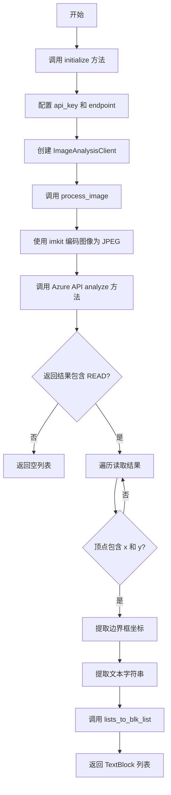
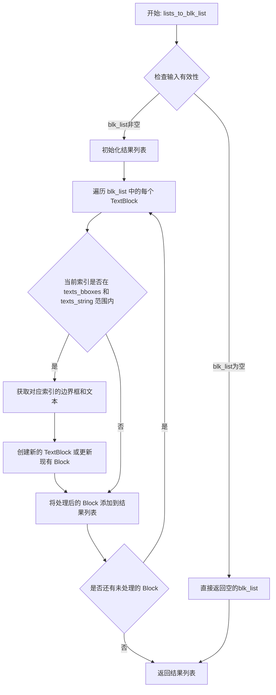
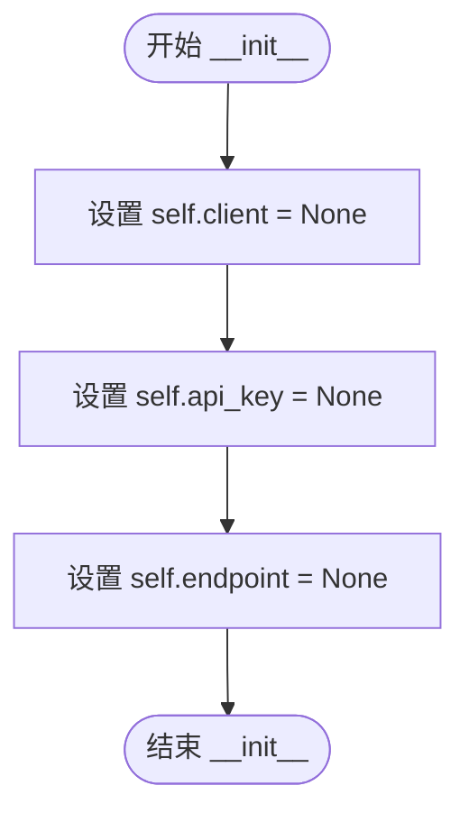
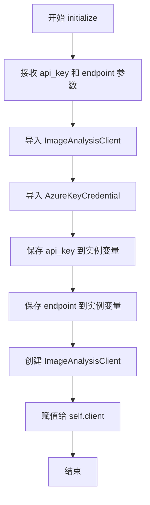

# `comic-translate\modules\ocr\microsoft_ocr.py` 详细设计文档

这是一个基于 Microsoft Azure Computer Vision API 的 OCR 引擎实现，负责将图像中的文本识别并转换为结构化的 TextBlock 列表

## 整体流程



## 类结构

```
OCREngine (抽象基类)
└── MicrosoftOCR (Azure OCR 实现)
```

## 全局变量及字段


### `MicrosoftOCR.client`
    
Microsoft Azure 计算机视觉 API 客户端实例，用于执行图像分析请求

类型：`ImageAnalysisClient`
    


### `MicrosoftOCR.api_key`
    
Microsoft Azure API 密钥，用于身份验证

类型：`str`
    


### `MicrosoftOCR.endpoint`
    
Microsoft Azure 端点 URL，指定计算机视觉服务的访问地址

类型：`str`
    
    

## 全局函数及方法


### `lists_to_blk_list`

该函数接收原始的 TextBlock 列表、OCR 识别出的文本边界框坐标列表以及对应的文本字符串列表，将识别结果整合到原始的 TextBlock 列表中并返回。

参数：

- `blk_list`：`list[TextBlock]` ，原始的 TextBlock 列表
- `texts_bboxes`：`list[tuple[float, float, float, float]]` ，OCR 识别出的文本边界框坐标列表，每个元素为 (x1, y1, x2, y2) 元组
- `texts_string`：`list[str]` ，OCR 识别出的文本字符串列表，与边界框列表一一对应

返回值：`list[TextBlock]` ，整合了 OCR 识别结果后的 TextBlock 列表

#### 流程图



#### 带注释源码

```python
# 该函数定义在 ..utils.textblock 模块中
# 当前代码段仅展示其使用方式，具体实现需参考 utils/textblock.py

def lists_to_blk_list(
    blk_list: list[TextBlock],  # 原始 TextBlock 列表作为模板
    texts_bboxes: list[tuple[float, float, float, float]],  # OCR 识别出的边界框坐标
    texts_string: list[str]  # OCR 识别出的文本内容
) -> list[TextBlock]:
    """
    将 OCR 识别结果整合到原始 TextBlock 列表中。
    
    该函数遍历原始的 blk_list，对于每个位置，尝试从 texts_bboxes 和 
    texts_string 中获取对应的 OCR 识别结果，并创建新的 TextBlock 对象
    或更新现有的 TextBlock。
    
    Args:
        blk_list: 原始的 TextBlock 列表，提供了需要填充的块结构
        texts_bboxes: OCR 识别出的文本边界框坐标列表
        texts_string: OCR 识别出的文本字符串列表
    
    Returns:
        整合了 OCR 识别结果的新 TextBlock 列表
    """
    result = []
    
    for idx, blk in enumerate(blk_list):
        # 检查当前索引是否在 OCR 结果范围内
        if idx < len(texts_bboxes) and idx < len(texts_string):
            bbox = texts_bboxes[idx]
            text = texts_string[idx]
            
            # 创建新的 TextBlock，整合原始块属性和 OCR 结果
            new_blk = TextBlock(
                x1=bbox[0],
                y1=bbox[1],
                x2=bbox[2],
                y2=bbox[3],
                text=text,
                # 可以保留原始块的其他属性
                confidence=getattr(blk, 'confidence', None),
                # ... 其他属性传递
            )
            result.append(new_blk)
        else:
            # 如果没有对应的 OCR 结果，保留原始块
            result.append(blk)
    
    return result
```


### `MicrosoftOCR.__init__`

该方法是 `MicrosoftOCR` 类的构造函数，用于初始化 OCR 引擎实例，预先设置 Azure 计算机视觉客户端、API 密钥和端点为 None，以便后续通过 `initialize` 方法进行配置。

参数：

- 无（除隐式参数 `self`）

返回值：`None`，无返回值

#### 流程图



#### 带注释源码

```python
def __init__(self):
    """初始化 MicrosoftOCR 类的实例。"""
    
    # Azure 计算机视觉客户端实例，初始化为 None
    # 将在 initialize 方法中被赋值 ImageAnalysisClient 对象
    self.client = None
    
    # Azure API 密钥，初始化为 None
    # 将在 initialize 方法中被赋值有效的 API 密钥字符串
    self.api_key = None
    
    # Azure 端点 URL，初始化为 None
    # 将在 initialize 方法中被赋值有效的端点字符串
    self.endpoint = None
```


### MicrosoftOCR.initialize

该方法用于初始化 Microsoft Azure OCR 引擎，接收 API 密钥和端点 URL，创建 Azure ImageAnalysisClient 实例供后续图像识别使用。

参数：

- `api_key`：`str`，Microsoft Azure API 密钥
- `endpoint`：`str`，Microsoft Azure 端点 URL

返回值：`None`，无返回值，仅完成初始化操作

#### 流程图



#### 带注释源码

```python
def initialize(self, api_key: str, endpoint: str) -> None:
    """
    Initialize the Microsoft OCR with API key and endpoint.
    
    Args:
        api_key: Microsoft Azure API key
        endpoint: Microsoft Azure endpoint URL
        **kwargs: Additional parameters (ignored)
    """
    # 从 Azure AI Vision 导入图像分析客户端类
    from azure.ai.vision.imageanalysis import ImageAnalysisClient
    # 从 Azure Core 导入密钥凭证类
    from azure.core.credentials import AzureKeyCredential

    # 将传入的 API 密钥保存到实例变量
    self.api_key = api_key
    # 将传入的端点 URL 保存到实例变量
    self.endpoint = endpoint
    # 使用端点和密钥凭证创建 Azure 图像分析客户端
    self.client = ImageAnalysisClient(
        endpoint=endpoint, credential=AzureKeyCredential(api_key)
    )
```


### `MicrosoftOCR.process_image`

该方法使用 Microsoft Azure Computer Vision API 对输入图像进行 OCR 识别，从图像中提取文本内容和边界框信息，并将其转换为结构化的 TextBlock 列表返回。

参数：

- `img`：`np.ndarray`，输入的图像数据，通常为 OpenCV 或 NumPy 格式的图像数组
- `blk_list`：`list[TextBlock]`，预定义的 TextBlock 列表，用于指定预期输出的文本块结构，方法将在此基础上填充识别结果

返回值：`list[TextBlock]`：包含识别出的文本内容及其对应边界框坐标的 TextBlock 列表

#### 流程图

```mermaid
flowchart TD
    A([开始 process_image]) --> B[初始化空列表: texts_bboxes, texts_string]
    B --> C[使用 imkit.encode_image 将图像编码为 JPEG 格式]
    C --> D[调用 self.client.analyze 分析图像]
    D --> E{result.read 是否存在且有内容?}
    E -->|否| F[直接调用 lists_to_blk_list 返回]
    E -->|是| G[遍历 result.read.blocks[0].lines]
    G --> H{顶点坐标是否包含 x 和 y?}
    H -->|否| G
    H --> I[提取顶点坐标: x1,y1,x2,y2]
    I --> J[将边界框添加到 texts_bboxes]
    J --> K[将文本内容添加到 texts_string]
    K --> G
    L[调用 lists_to_blk_list 转换结果] --> M([返回 TextBlock 列表])
    F --> L
```

#### 带注释源码

```python
def process_image(self, img: np.ndarray, blk_list: list[TextBlock]) -> list[TextBlock]:
    """
    使用 Microsoft Azure OCR API 处理图像并提取文本块。
    
    Args:
        img: 输入图像的 NumPy 数组表示
        blk_list: 预定义的 TextBlock 列表模板
        
    Returns:
        包含识别文本及其边界框的 TextBlock 列表
    """

    # 导入 Azure 视觉特征枚举类
    from azure.ai.vision.imageanalysis.models import VisualFeatures

    # 初始化存储识别结果的列表
    texts_bboxes = []  # 存储文本的边界框坐标 (x1, y1, x2, y2)
    texts_string = []  # 存储识别出的文本内容
    
    # 将输入图像编码为 JPEG 格式的二进制数据
    # imkit 是项目自定义的图像处理工具库
    image_buffer = imk.encode_image(img, 'jpg')
    
    # 调用 Azure Computer Vision API 进行图像分析
    # 仅请求 READ 视觉特征（即 OCR 文本识别）
    result = self.client.analyze(
        image_data=image_buffer, 
        visual_features=[VisualFeatures.READ]
    )
    
    # 检查 API 返回结果中是否包含读取（OCR）数据
    if result.read and result.read.blocks:
        # 遍历识别出的第一个块中的所有行
        for line in result.read.blocks[0].lines:
            # 获取当前文本行的边界多边形顶点
            vertices = line.bounding_polygon
            
            # 安全检查：确保所有顶点都包含 x 和 y 坐标
            # 防止 API 返回不完整坐标数据导致异常
            if all('x' in vertex and 'y' in vertex for vertex in vertices):
                # 提取对角顶点坐标（左上角和右下角）
                x1 = vertices[0]['x']
                y1 = vertices[0]['y']
                x2 = vertices[2]['x']
                y2 = vertices[2]['y']
                
                # 将边界框坐标添加到结果列表
                texts_bboxes.append((x1, y1, x2, y2))
                # 将识别文本添加到结果列表
                texts_string.append(line.text)
            
    # 使用工具函数将分离的边界框和文本数据合并为结构化 TextBlock 列表
    # 该函数会根据 blk_list 的模板结构填充识别结果
    return lists_to_blk_list(blk_list, texts_bboxes, texts_string)
```

## 关键组件


### MicrosoftOCR类

OCR引擎实现类，继承自OCREngine基类，负责调用Microsoft Azure Computer Vision API进行文字识别。

### 初始化模块

负责设置API密钥和端点，建立与Azure服务的连接。

### 图像处理模块

将NumPy数组编码为Azure SDK所需的图像格式，并调用分析接口。

### 文本提取模块

解析Azure返回的识别结果，提取文本内容和边界框信息。

### 数据转换模块

将原始文本和边界框数据转换为TextBlock对象列表。

### Azure SDK集成模块

封装Azure AI Vision客户端调用，包括ImageAnalysisClient和VisualFeatures配置。


## 问题及建议


### 已知问题

- **内部导入语句**：在`initialize`和`process_image`方法内部导入Azure SDK模块，每次调用都会重复执行导入操作，影响性能且不符合Python最佳实践
- **缺少错误处理**：Azure API调用（`self.client.analyze`）没有任何try-except包装，网络异常、超时、API错误等会导致未捕获的异常向上传播
- **资源未显式管理**：`image_buffer`（图像数据）未使用上下文管理器或显式关闭，可能导致资源泄漏
- **参数验证缺失**：`process_image`的`img`和`blk_list`参数没有任何验证，传入None或非法数据会导致运行时错误
- **返回值处理不明确**：当API返回空结果时，`lists_to_blk_list`的行为不明确，可能返回空列表或未预期的结果
- **类字段缺少类型注解**：`client`、`api_key`、`endpoint`字段声明缺少类型注解，降低了代码可读性和IDE支持
- **API配置灵活性不足**：`initialize`方法不支持传递超时、重试次数等额外配置参数，无法根据实际场景调整
- **blk_list参数未实际使用**：`process_image`接收`blk_list`参数但未在逻辑中使用，该参数的存在意义不明确
- **依赖可用性无检查**：未检查Azure SDK是否已安装，导入失败时错误信息不够友好

### 优化建议

- 将所有第三方导入（azure、imkit）移至文件顶部统一导入，便于依赖管理和静态分析
- 为所有API调用添加try-except块，捕获`AzureError`、`ServiceRequestError`等特定异常，并返回有意义的错误信息或降级处理
- 使用`with`语句或显式关闭管理`image_buffer`生命周期，或考虑使用生成器模式
- 在方法入口添加参数验证：检查`img`不为None且为numpy数组、`blk_list`为list类型
- 为类字段添加类型注解：`client: ImageAnalysisClient | None`、`api_key: str | None`、`endpoint: str | None`
- 在`initialize`中添加`**kwargs`参数支持，将额外配置传递给客户端初始化（如超时设置）
- 考虑添加重试机制（使用`tenacity`库或手动实现指数退避）
- 如`blk_list`确实无需使用，可从方法签名中移除以减少接口复杂度；如需要预过滤或合并，应在逻辑中体现
- 添加日志记录（使用标准`logging`模块），记录API调用、异常、关键处理节点等信息，便于问题排查和监控

## 其它


### 设计目标与约束

本文档描述的MicrosoftOCR模块是一个基于Microsoft Azure Computer Vision API的OCR识别引擎，其核心设计目标是将图像中的文本内容识别并转换为结构化的TextBlock列表。该模块作为OCREngine基类的具体实现，需要遵循基类定义的接口契约，同时需要满足以下约束：1）仅支持Azure的Read API功能；2）依赖Azure SDK进行API调用；3）输入图像需通过imkit库进行编码；4）输出结果需转换为TextBlock列表格式。

### 错误处理与异常设计

代码中的错误处理主要体现在以下几个方面：1）顶点坐标验证：在处理bounding_polygon时，代码通过if all('x' in vertex and 'y' in vertex for vertex in vertices)检查确保每个顶点都包含x和y坐标，避免因坐标缺失导致的KeyError；2）API响应检查：通过if result.read and result.read.blocks判断API返回结果的有效性；3）缺少异常捕获机制：当前代码未对网络错误、API密钥错误、图像编码失败等情况进行异常捕获和处理，这是需要改进的地方。建议在initialize方法中添加API连接测试，在process_image中添加try-except块捕获azure.core.exceptions相关异常。

### 数据流与状态机

该模块的数据流如下：1）初始化阶段：调用initialize方法，传入api_key和endpoint，创建ImageAnalysisClient实例；2）图像处理阶段：接收numpy数组格式的图像和已有的blk_list，通过imkit.encode_image将图像编码为JPEG格式；3）API调用阶段：调用client.analyze方法，指定VisualFeatures.READ特性；4）结果解析阶段：遍历返回的blocks、lines，提取bounding_polygon和text信息；5）结果转换阶段：调用lists_to_blk_list函数将边界框坐标和文本字符串转换为TextBlock列表。整个流程是同步阻塞的，未实现异步处理机制。

### 外部依赖与接口契约

该模块依赖以下外部组件：1）numpy库：用于处理图像数组；2）imkit库：提供encode_image函数进行图像编码；3）azure.ai.vision.imageanalysis：Azure Vision SDK，提供ImageAnalysisClient和VisualFeatures；4）azure.core.credentials：提供AzureKeyCredential进行身份认证；5）同项目内的base.OCREngine：抽象基类，定义接口契约；6）utils.textblock：提供TextBlock类和lists_to_blk_list函数。模块实现的接口契约包括：initialize(api_key, endpoint)方法进行初始化，process_image(img, blk_list)方法执行OCR识别并返回list[TextBlock]。

### 性能考虑

当前实现存在以下性能优化空间：1）每次调用process_image都会创建新的image_buffer，如果对同一图像进行多次识别，会造成重复编码开销；2）API调用是同步的，大批量图像处理时效率较低，建议考虑异步或批量处理；3）未实现结果缓存机制，相同图像的重复识别会浪费API调用配额；4）顶点坐标提取仅使用了第0个和第2个顶点（对角线），假设了多边形是矩形，但实际上应该处理任意多边形情况。

### 安全性考虑

代码中涉及敏感信息的处理：1）api_key以明文存储在self.api_key属性中，建议进行加密存储或使用环境变量；2）endpoint直接存储在self.endpoint中，需要确保传输过程使用HTTPS；3）AzureKeyCredential的创建和传递需要确保安全，避免日志泄露。建议将api_key存储在环境变量或密钥管理系统中，而不是作为参数传入。

### 配置管理

当前模块的配置通过initialize方法的参数传入，包括api_key和endpoint。这种方式虽然灵活，但缺乏默认值和配置验证机制。建议增加：1）配置文件支持（如config.yaml或.ini）；2）环境变量回退机制；3）配置验证逻辑（如endpoint格式验证、api_key长度检查）；4）重试策略配置（连接超时、重试次数等）。

### 测试策略

针对该模块应设计以下测试用例：1）单元测试：测试initialize方法正确创建client；测试process_image对有效图像的识别；测试边界条件（空图像、纯色图像等）；2）集成测试：使用Mock或真实Azure账户测试完整流程；3）异常测试：测试无效api_key、invalid endpoint、网络超时等情况；4）性能测试：测试大批量图像处理的时间复杂度。

### 版本兼容性与依赖管理

代码中使用了from azure.ai.vision.imageanalysis import ImageAnalysisClient和VisualFeatures，这些API可能随Azure SDK版本变化。建议：1）在项目requirements.txt或pyproject.toml中明确指定azure-ai-vision版本范围；2）添加版本兼容性检查；3）记录已测试的SDK版本；4）考虑使用try-except处理ImportError以支持不同版本的API。

### 错误恢复与重试机制

当前代码缺少重试机制，当遇到临时性网络错误或Azure服务繁忙时，调用会直接失败。建议实现：1）指数退避重试策略（建议使用tenacity或backoff库）；2）重试次数可配置；3）区分可重试错误（如429 Too Many Requests、503 Service Unavailable）和不可重试错误（如401 Unauthorized）；4）重试日志记录便于问题排查。

### 资源管理与生命周期

当前模块的资源管理较为简单：1）client对象在initialize时创建，但未提供close或cleanup方法；2）未实现上下文管理器（__enter__/__exit__）支持；3）未实现连接池管理。建议增加：1）提供destroy或close方法释放资源；2）实现上下文管理器协议；3）添加__del__方法确保资源清理；4）考虑使用weakref避免循环引用导致的内存泄漏。

    