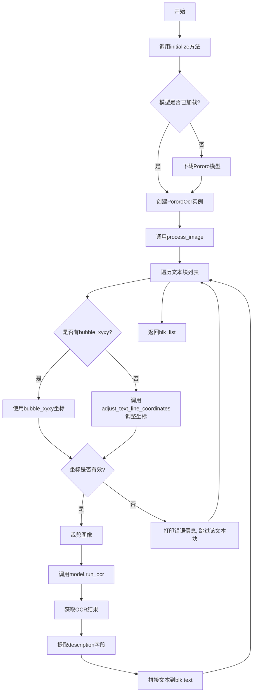
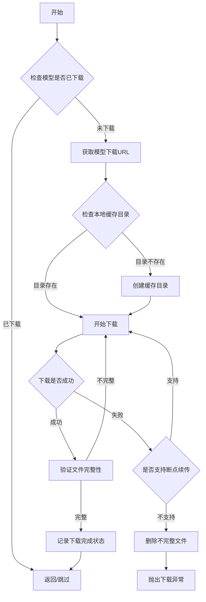
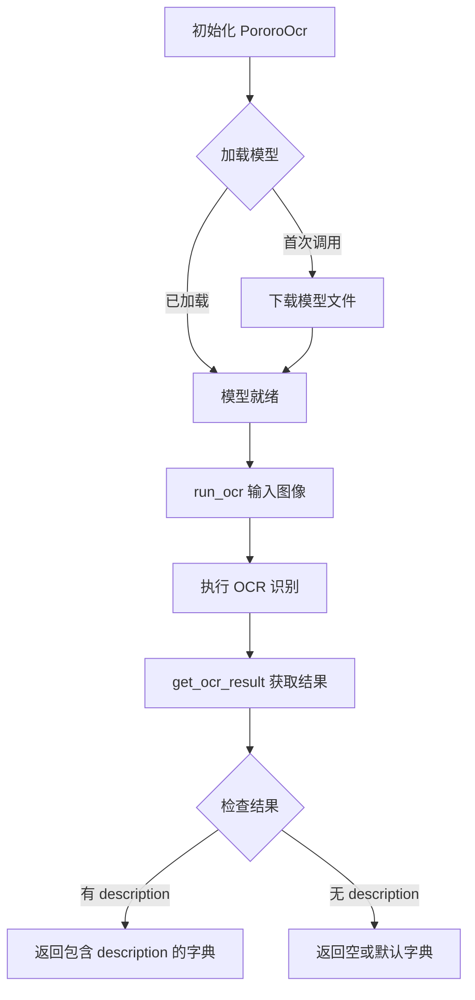
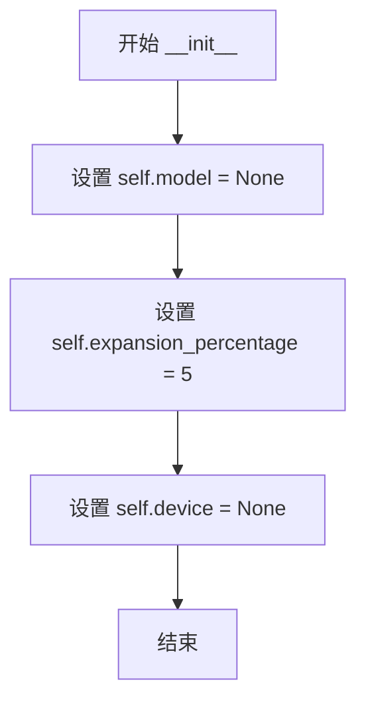
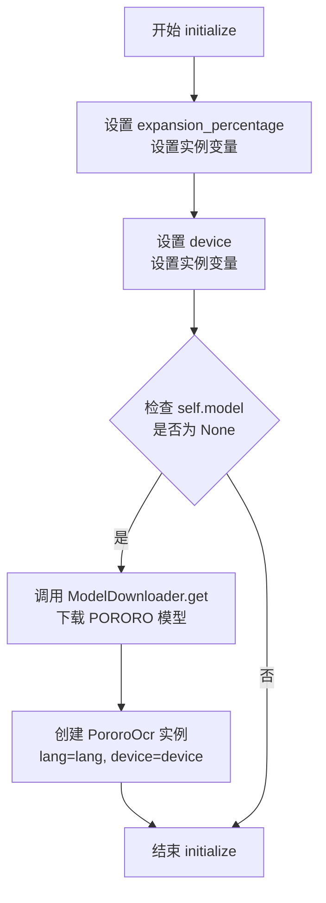

# `comic-translate\modules\ocr\pororo\engine.py` 详细设计文档

这是一个基于Pororo库的OCR引擎实现，用于识别图像中的韩文文本。该引擎继承自OCREngine基类，通过加载Pororo OCR模型处理图像中的文本区域，提取并返回文本内容。

## 整体流程



## 类结构

```
OCREngine (抽象基类)
└── PororoOCREngine
```

## 全局变量及字段


### `np`
    
NumPy库，用于数值计算和图像数组操作

类型：`module`
    


### `OCREngine`
    
OCR引擎基类，定义OCR引擎的标准接口

类型：`class`
    


### `TextBlock`
    
文本块数据结构，包含文本位置和内容信息

类型：`class`
    


### `adjust_text_line_coordinates`
    
调整文本行坐标的辅助函数，根据扩展百分比修改边界框

类型：`function`
    


### `ModelDownloader`
    
模型下载器类，负责从远程源下载机器学习模型

类型：`class`
    


### `ModelID`
    
模型ID枚举，定义可下载模型的唯一标识符

类型：`enum/class`
    


### `PororoOCREngine.self.model`
    
PororoOcr实例，OCR模型对象，用于执行实际的文字识别

类型：`PororoOcr`
    


### `PororoOCREngine.self.expansion_percentage`
    
文本框扩展百分比，用于扩大检测框以包含完整文字

类型：`int`
    


### `PororoOCREngine.self.device`
    
运行设备，指定模型在CPU或GPU上运行

类型：`str`
    
    

## 全局函数及方法


### `adjust_text_line_coordinates`

该函数用于根据指定的扩展百分比调整文本行边界框的坐标，确保扩展后的坐标不会超出图像边界。

参数：

- `xyxy`：`tuple` 或 `list`，原始文本行边界框坐标，格式为 (x1, y1, x2, y2)
- `expansion_x`：`int`，水平方向扩展百分比
- `expansion_y`：`int`，垂直方向扩展百分比  
- `img`：`np.ndarray`，原始图像数据，用于获取图像尺寸以防止坐标越界

返回值：`tuple`，返回调整后的边界框坐标 (x1, y1, x2, y2)

#### 流程图

```mermaid
flowchart TD
    A[接收原始坐标 xyxy, 扩展百分比, 图像] --> B{检查 expansion_x 和 expansion_y 是否为 0}
    B -->|是| C[返回原始坐标 xyxy]
    B -->|否| D[计算水平扩展量: (x2 - x1) × expansion_x / 100]
    D --> E[计算垂直扩展量: (y2 - y1) × expansion_y / 100]
    E --> F[计算调整后的坐标<br/>x1' = max(0, x1 - 水平扩展量)<br/>y1' = max(0, y1 - 垂直扩展量)<br/>x2' = min(img宽度, x2 + 水平扩展量)<br/>y2' = min(img高度, y2 + 垂直扩展量)]
    F --> G[返回调整后的坐标]
```

#### 带注释源码

```python
def adjust_text_line_coordinates(xyxy, expansion_x, expansion_y, img):
    """
    根据扩展百分比调整文本行边界框坐标。
    
    Args:
        xyxy: 原始边界框坐标 (x1, y1, x2, y2)
        expansion_x: 水平方向扩展百分比
        expansion_y: 垂直方向扩展百分比
        img: 原始图像数组
    
    Returns:
        tuple: 调整后的边界框坐标 (x1, y1, x2, y2)
    """
    # 如果扩展百分比为0，直接返回原始坐标
    if expansion_x == 0 and expansion_y == 0:
        return xyxy
    
    # 解包原始坐标
    x1, y1, x2, y2 = xyxy
    
    # 计算原始边界框的宽度和高度
    width = x2 - x1
    height = y2 - y1
    
    # 根据扩展百分比计算需要扩展的像素量
    # 水平扩展量 = 原始宽度 × 扩展百分比
    expansion_amount_x = width * expansion_x / 100
    # 垂直扩展量 = 原始高度 × 扩展百分比  
    expansion_amount_y = height * expansion_y / 100
    
    # 计算新的边界框坐标
    # 使用 max(0, ...) 确保不会超出图像左/上边界
    # 使用 min(img.shape[...], ...) 确保不会超出图像右/下边界
    new_x1 = max(0, x1 - expansion_amount_x)
    new_y1 = max(0, y1 - expansion_amount_y)
    new_x2 = min(img.shape[1], x2 + expansion_amount_x)  # shape[1] 是图像宽度
    new_y2 = min(img.shape[0], y2 + expansion_amount_y)  # shape[0] 是图像高度
    
    return (new_x1, new_y1, new_x2, new_y2)
```

#### 调用示例

在 `PororoOCREngine.process_image` 方法中的实际调用：

```python
# 当 TextBlock 没有 bubble_xyxy 时，使用 adjust_text_line_coordinates 扩展文本区域
x1, y1, x2, y2 = adjust_text_line_coordinates(
    blk.xyxy,                    # 原始文本边界框
    self.expansion_percentage,   # 水平扩展百分比 (默认5)
    self.expansion_percentage,   # 垂直扩展百分比 (默认5)
    img                          # 原始图像，用于边界检查
)
```


### `ModelDownloader.get`

该函数用于下载指定的机器学习模型，支持断点续传和版本管理，确保模型文件完整可用。

参数：

- `model_id`：`ModelID`，要下载的模型的唯一标识符（如 `ModelID.PORORO`）

返回值：`None`，该方法直接下载模型到本地缓存，不返回任何值。

#### 流程图



#### 带注释源码

```python
# 注意：以下源码为基于代码调用的推断，并非原始完整源码
# 从代码中的使用方式推断：
# ModelDownloader.get(ModelID.PORORO)

def get(model_id: ModelID) -> None:
    """
    下载指定的模型到本地缓存目录。
    
    Args:
        model_id: ModelID枚举值，指定要下载的模型类型
        
    Returns:
        None: 直接下载模型到本地，不返回任何值
        
    Raises:
        DownloadError: 当下载失败且无法恢复时抛出
        IntegrityError: 当文件校验失败时抛出
    """
    # 1. 检查模型是否已存在于缓存中
    cached_path = _get_cached_path(model_id)
    if os.path.exists(cached_path):
        # 2. 如果存在，验证文件完整性
        if _verify_model_integrity(cached_path, model_id):
            return  # 模型已存在且完整，直接返回
    
    # 3. 获取模型下载链接和元信息
    download_info = _get_download_info(model_id)
    
    # 4. 确保缓存目录存在
    os.makedirs(_get_cache_dir(), exist_ok=True)
    
    # 5. 执行下载（可能支持断点续传）
    _download_file(
        url=download_info.url,
        dest_path=cached_path,
        expected_hash=download_info.sha256,
        resume=True  # 支持断点续传
    )
```

---

> **注意**：提供的代码片段中仅包含 `ModelDownloader.get` 的调用位置，并未包含该方法的完整实现源码。上述流程图和源码是基于调用方式 `ModelDownloader.get(ModelID.PORORO)` 进行的合理推断。要获取准确的实现细节，建议提供 `modules.utils.download` 模块的完整源代码。


### PororoOcr

描述：`PororoOcr` 是来自 `.main` 模块的 OCR 引擎类，用于处理朝鲜语（韩语）文本识别。该类在 `PororoOCREngine` 中被实例化为模型对象，负责执行实际的 OCR 识别操作。通过接收图像输入并返回包含文本描述的结构化结果，实现对图像中文字的高效提取。

参数：

- `lang`： `str`，语言代码，默认为 `'ko'`（韩语），指定 OCR 模型使用的语言
- `device`： `str`，运行设备，默认为 `'cpu'`，支持 `'cuda'` 等其他设备

#### 流程图



#### 带注释源码

```python
# PororoOcr 类接口定义（基于 PororoOCREngine 中的使用方式推断）
class PororoOcr:
    """
    Pororo OCR 引擎类
    
    该类封装了 Pororo OCR 模型的加载和推理功能，
    支持多语言文本识别，特别优化了韩语识别能力。
    """
    
    def __init__(self, lang: str = 'ko', device: str = 'cpu'):
        """
        初始化 Pororo OCR 引擎
        
        Args:
            lang: 语言代码，默认为 'ko' (韩语)
            device: 运行设备，'cpu' 或 'cuda' 等
        """
        self.lang = lang
        self.device = device
        self.model = None  # 底层模型实例
        self._result_cache = None  # OCR 结果缓存
        
        # 加载底层 OCR 模型
        self._load_model()
    
    def _load_model(self):
        """加载 Pororo OCR 底层模型"""
        # 实际模型加载逻辑（由 Pororo 库实现）
        pass
    
    def run_ocr(self, image: np.ndarray) -> None:
        """
        在输入图像上执行 OCR 识别
        
        Args:
            image: NumPy 数组格式的输入图像，形状为 (height, width, channels)
        """
        # 将图像传递给底层模型进行处理
        # 结果存储在内部缓存中，等待通过 get_ocr_result 获取
        self._result_cache = self._process_ocr(image)
    
    def _process_ocr(self, image: np.ndarray) -> dict:
        """
        底层 OCR 处理逻辑
        
        Args:
            image: 输入图像
            
        Returns:
            包含 OCR 结果的字典
        """
        # 由 Pororo 库实现的内部处理
        pass
    
    def get_ocr_result(self) -> dict:
        """
        获取上次 OCR 操作的結果
        
        Returns:
            字典，包含以下键值：
            - 'description': 识别出的文本列表
            - 其他可能的识别元数据
        """
        return self._result_cache if self._result_cache else {}
```


### `PororoOCREngine.__init__`

这是 PororoOCREngine 类的构造函数，用于初始化 OCR 引擎的基本属性。在实例化时设置模型对象为 None、设备为 None、文本框扩展百分比为默认的 5%。

参数：

- `self`：隐式参数，PororoOCREngine 实例本身，无需显式传递

返回值：`None`，无返回值（构造函数）

#### 流程图



#### 带注释源码

```python
def __init__(self):
    """Initialize PororoOCREngine with default values."""
    
    # Initialize the OCR model placeholder (will be loaded in initialize method)
    # Type: PororoOcr or None
    self.model = None
    
    # Default expansion percentage for text bounding box expansion
    # Type: int
    # Default value: 5 (5%)
    self.expansion_percentage = 5
    
    # Device placeholder for model execution
    # Type: str or None (will be set to 'cpu', 'cuda', etc. in initialize)
    self.device = None
```


### PororoOCREngine.initialize

初始化 PororoOCR 引擎，加载指定的语言模型，配置文本边界框扩展百分比，并设置运行设备。

参数：

- `lang`：`str`，语言代码，默认值为 'ko'（韩语），用于指定 OCR 模型识别的语言
- `expansion_percentage`：`int`，文本边界框扩展百分比，默认值为 5，用于扩大检测到的文本区域边界
- `device`：`str`，运行模型的设备（'cpu', 'cuda' 等），默认值为 'cpu'。如果为 None，则自动检测

返回值：`None`，无返回值，此方法仅执行初始化操作不返回任何数据

#### 流程图



#### 带注释源码

```python
def initialize(
    self, 
    lang: str = 'ko', 
    expansion_percentage: int = 5, 
    device: str = 'cpu'
) -> None:
    """
    Initialize the PororoOCR engine.
    
    Args:
        lang: Language code for OCR model - default is 'ko' (Korean)
        expansion_percentage: Percentage to expand text bounding boxes
        device: Device to run the model on ('cpu', 'cuda', etc.). If None, auto-detects.
    """
    # 延迟导入 PororoOcr 类，避免在模块加载时过早引入依赖
    from .main import PororoOcr

    # 1. 设置文本边界框扩展百分比，用于在 OCR 前扩大检测区域
    self.expansion_percentage = expansion_percentage
    
    # 2. 设置运行设备的类型（CPU 或 CUDA 等）
    self.device = device
    
    # 3. 检查模型是否已加载，避免重复初始化
    if self.model is None:
        # 4. 下载所需的 PORORO OCR 模型（如果本地不存在）
        ModelDownloader.get(ModelID.PORORO)
        
        # 5. 使用指定语言和设备创建 PororoOcr 模型实例
        self.model = PororoOcr(lang=lang, device=device)
```


### `PororoOCREngine.process_image`

该方法接收图像数组和文本块列表，遍历每个文本块获取或计算文本区域坐标，验证坐标有效性后裁剪图像区域并调用PororoOCR模型进行文本识别，将识别结果合并到文本块的text字段中，最终返回处理完成的文本块列表。

参数：

- `self`：隐式参数，PororoOCREngine实例本身
- `img`：`np.ndarray`，输入的图像数据（NumPy数组格式）
- `blk_list`：`list[TextBlock]`，待处理的文本块列表，每个TextBlock包含位置信息和文本内容

返回值：`list[TextBlock]`，处理完成的文本块列表，识别出的文本已写入各文本块的text字段

#### 流程图

```mermaid
flowchart TD
    A[开始 process_image] --> B[遍历 blk_list 中的每个 blk]
    B --> C{检查 blk.bubble_xyxy 是否存在}
    C -->|是| D[使用 bubble_xyxy 作为坐标 x1, y1, x2, y2]
    C -->|否| E[调用 adjust_text_line_coordinates 计算扩展坐标]
    D --> F{验证坐标有效性: x1<x2 且 y1<y2 且坐标在图像范围内}
    E --> F
    F -->|有效| G[裁剪图像: img[y1:y2, x1:x2]]
    F -->|无效| H[打印错误信息, 设置 blk.text = ""]
    G --> I[调用 self.model.run_ocr 识别裁剪图像]
    I --> J[调用 self.model.get_ocr_result 获取结果]
    J --> K[从结果中提取 description 列表]
    K --> L[将 descriptions 用空格连接并赋值给 blk.text]
    L --> M{blk_list 是否还有下一个元素}
    M -->|是| B
    M -->|否| N[返回处理后的 blk_list]
    H --> M
```

#### 带注释源码

```python
def process_image(self, img: np.ndarray, blk_list: list[TextBlock]) -> list[TextBlock]:
    """
    处理图像并识别文本块中的文字。
    
    Args:
        img: 输入图像的NumPy数组表示
        blk_list: 包含文本块位置的列表，每个元素是TextBlock对象
        
    Returns:
        更新了text字段的TextBlock列表
    """
    # 遍历待处理的每个文本块
    for blk in blk_list:
        # 判断文本块是否具有气泡坐标信息
        if blk.bubble_xyxy is not None:
            # 使用预设的气泡坐标作为识别区域
            x1, y1, x2, y2 = blk.bubble_xyxy
        else:
            # 无气泡坐标时，根据扩展百分比计算文本行坐标
            # 扩展机制可容纳OCR检测容差
            x1, y1, x2, y2 = adjust_text_line_coordinates(
                blk.xyxy, 
                self.expansion_percentage, 
                self.expansion_percentage, 
                img
            )
        
        # 坐标合法性校验：确保坐标为正且在图像尺寸内
        if x1 < x2 and y1 < y2 and x1 >= 0 and y1 >= 0 and x2 <= img.shape[1] and y2 <= img.shape[0]:
            # 提取ROI区域进行OCR识别
            cropped_img = img[y1:y2, x1:x2]
            # 执行OCR模型推理
            self.model.run_ocr(cropped_img)
            # 提取识别结果
            result = self.model.get_ocr_result()
            # 获取文本描述列表（可能包含多行）
            descriptions = result.get('description', [])
            # 合并多行文本为单字符串
            blk.text = ' '.join(descriptions)
        else:
            # 坐标异常时输出警告并跳过识别
            print('Invalid textbbox to target img')
            blk.text = ""
            
    # 返回完成OCR处理的文本块列表
    return blk_list
```

## 关键组件


### PororoOCREngine 类

OCR引擎实现类，继承自OCREngine基类，负责使用PororoOCR库对图像中的韩文文本进行识别。该类实现了模型的惰性加载、文本区域坐标扩展、图像裁剪与边界验证等功能。

### 模型惰性加载机制

在initialize方法中，通过检查self.model是否为None来控制模型仅在首次调用时加载，配合ModelDownloader确保模型文件已下载后再初始化PororoOcr实例，实现按需加载避免启动时资源浪费。

### 文本区域坐标扩展

使用adjust_text_line_coordinates函数结合expansion_percentage参数对TextBlock的xyxy坐标进行扩展，默认扩展比例为5%，用于增加文本检测框的边界以确保完整包含文字内容。

### 图像裁剪与边界验证

在process_image方法中，对裁剪坐标进行有效性验证，检查x1<x2、y1<2且坐标均在图像范围内，使用NumPy数组切片语法[y1:y2, x1:x2]进行高效裁剪。

### OCR结果处理

调用self.model.run_ocr执行识别，通过self.model.get_ocr_result获取结果字典，提取description字段并用空格拼接为最终文本内容。


## 问题及建议


### 已知问题

- **异常处理缺失**：`process_image`方法中调用`self.model.run_ocr`和`self.model.get_ocr_result()`时没有try-except捕获异常，OCR模型运行可能抛出未知异常导致程序中断
- **无效输入未充分验证**：未检查`img`是否为None、空数组或通道数不匹配的情况；未检查`blk_list`是否为None或空列表
- **副作用问题**：`process_image`直接修改传入的`blk_list`对象中的`text`属性，可能导致调用方意外修改原始数据，建议返回新列表或明确文档说明
- **日志记录不规范**：使用`print`语句输出错误信息，无法满足生产环境日志级别配置需求
- **模块导入位置不当**：在`initialize`方法内部使用`from .main import PororoOcr`延迟导入，影响代码可读性和维护性
- **设备自动检测逻辑缺失**：虽然文档说明支持自动检测设备，但代码中`device`参数直接传递给模型，未实现自动检测逻辑
- **类型注解不完整**：缺少对`blk_list`元素类型的运行时验证，`TextBlock`对象的`bubble_xyxy`和`xyxy`属性未进行空值检查
- **边界条件处理不够健壮**：仅检查坐标非负和不超过图像尺寸，未处理坐标为浮点数或越界幅度较大的情况

### 优化建议

- 添加try-except块捕获OCR处理过程中的异常，记录错误日志并将`blk.text`设为空字符串或标记为识别失败
- 在方法入口处添加参数校验：`if img is None or img.size == 0: raise ValueError("Image cannot be None or empty")`
- 考虑使用`logging`模块替代`print`语句，并支持配置不同日志级别
- 将`PororoOcr`的导入移至文件顶部，或使用懒加载模式在类初始化时统一管理
- 实现设备自动检测逻辑：当`device`为None时使用`torch.cuda.is_available()`或类似方式自动选择
- 考虑添加批量处理能力或使用多线程/多进程并行处理多个TextBlock以提升性能
- 在边界检查处添加类型检查，确保坐标为数值类型，并使用`math.ceil`或`int`转换浮点数坐标

## 其它


### 设计目标与约束

本模块旨在实现基于Pororo OCR引擎的文本识别功能，支持韩文（默认）及其他语言的文本检测与识别。设计约束包括：依赖PororoOcr模型库，必须通过ModelDownloader下载ModelID.PORORO模型；设备支持CPU和CUDA，默认使用CPU；输入图像为NumPy数组格式，文本块列表需包含xyxy坐标信息；文本框扩展百分比默认为5%，用于增加识别区域。

### 错误处理与异常设计

代码采用基础错误处理机制：坐标验证部分检查边界框有效性（x1<x2, y1<2, 坐标非负且在图像范围内），无效时打印"Invalid textbbox to target img"并置空文本内容。潜在风险包括：模型初始化失败未捕获异常、PororoOcr.run_ocr执行异常未处理、图像格式不符合要求可能导致索引错误、模型下载网络异常未处理。建议增加try-except包装OCR调用过程，记录详细错误日志，并设置超时机制。

### 数据流与状态机

数据流遵循以下路径：输入图像(NumPy数组) + 文本块列表(TextBlock[]) → 遍历每个TextBlock → 获取或计算扩展后坐标 → 坐标有效性校验 → 图像裁剪 → OCR模型推理 → 结果解析与文本赋值 → 返回更新后的文本块列表。状态机包含三个状态：UNINITIALIZED(model=None) → INITIALIZED(model已加载) → PROCESSING(处理中) → COMPLETED(单块处理完成)，整体流程为一次性初始化、循环处理模式。

### 外部依赖与接口契约

核心依赖包括：numpy提供数组处理能力；modules.ocr.base.OCREngine提供基类抽象；modules.utils.textblock.TextBlock和adjust_text_line_coordinates用于文本块操作；modules.utils.download.ModelDownloader和ModelID用于模型管理；PororoOcr(.main模块)为实际OCR推理引擎。接口契约要求：initialize方法接收lang(str)、expansion_percentage(int)、device(str)参数并返回None；process_image方法接收img(np.ndarray)和blk_list(list[TextBlock])参数并返回list[TextBlock]；TextBlock对象需具备xyxy或bubble_xyxy属性以及text可写属性。

### 性能考虑与优化空间

当前实现逐个处理文本块，未利用批处理能力。可优化方向包括：收集所有裁剪图像后批量送入OCR模型推理；OCR结果通过异步或线程池并行处理；预计算或缓存文本框扩展结果避免重复计算；模型推理使用FP16或INT8量化提升速度；考虑使用GPU加速时将图像数据传输与模型推理流水线化。

### 安全性与边界条件

代码存在以下安全边界：未验证输入img是否为有效NumPy数组（可能为None或空数组）；未检查blk_list元素类型是否为TextBlock；裁剪坐标未做整数类型转换可能引发浮点索引问题；文本描述列表为空时join结果为空字符串但未做进一步处理。建议增加输入参数类型检查、添加图像尺寸与通道数验证、确保坐标为整数类型、处理空结果情况的业务逻辑。

    