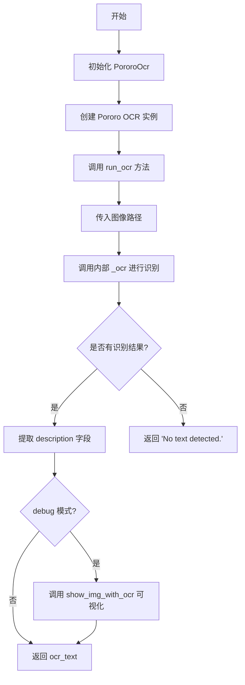
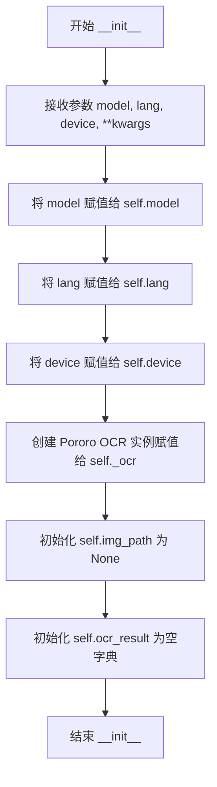
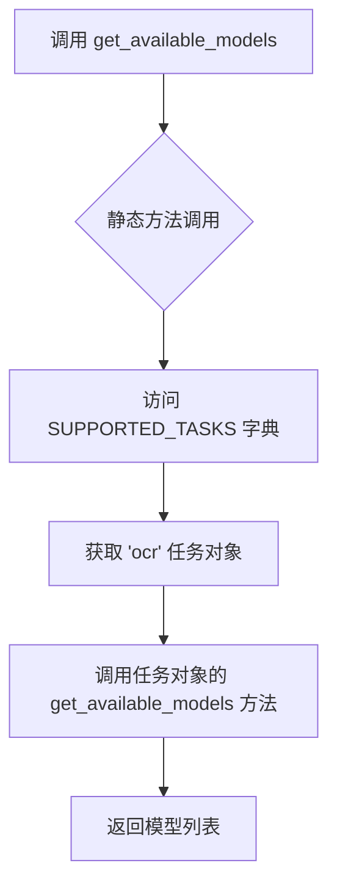
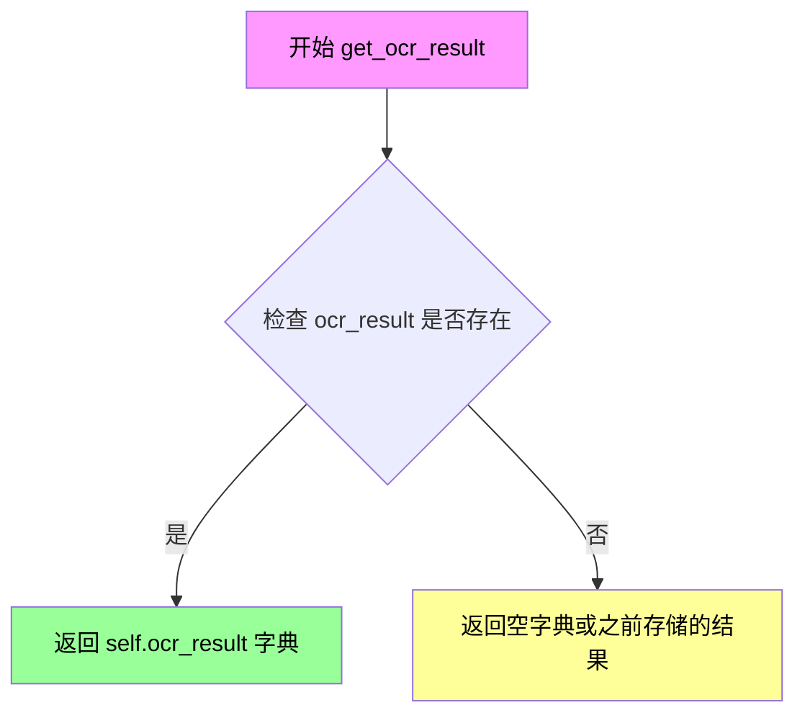
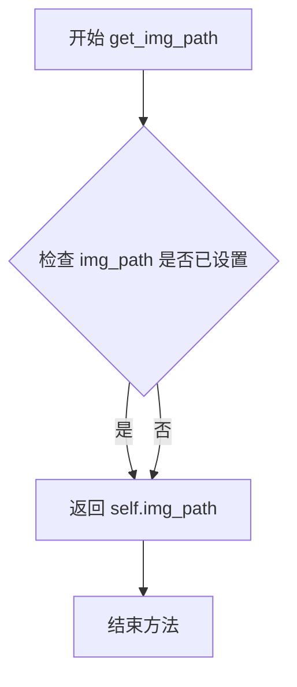

# `comic-translate\modules\ocr\pororo\main.py` 详细设计文档

这是一个基于Pororo库的OCR（光学字符识别）封装类，提供便捷的图像文字识别功能，支持多语言和多模型选择，并返回结构化的识别结果。

## 整体流程



## 类结构

```
PororoOcr (OCR封装类)
```

## 全局变量及字段


### `SUPPORTED_TASKS`
    
从pororo.pororo导入的任务配置字典，包含所有支持的OCR任务信息

类型：`dict`
    


### `PororoOcr.self.model`
    
OCR模型名称，用于指定使用的OCR模型（如brainocr等）

类型：`str`
    


### `PororoOcr.self.lang`
    
识别语言，指定OCR识别使用的语言（如ko/en等）

类型：`str`
    


### `PororoOcr.self.device`
    
运行设备，指定模型运行在cpu或cuda上

类型：`str`
    


### `PororoOcr.self._ocr`
    
底层OCR实例，通过Pororo类封装的OCR功能对象

类型：`Pororo`
    


### `PororoOcr.self.img_path`
    
图像路径，当前待识别或已识别的图像文件路径

类型：`str/None`
    


### `PororoOcr.self.ocr_result`
    
识别结果字典，包含OCR识别返回的详细结果数据

类型：`dict`
    
    

## 全局函数及方法


### `PororoOcr.__init__`

这是 `PororoOcr` 类的构造函数，用于初始化 OCR 引擎实例。它接收模型名称、语言、运行设备等参数，并创建底层的 `Pororo` OCR 对象，同时初始化图像路径和 OCR 结果存储变量。

参数：

- `model`：`str`，要使用的 OCR 模型名称，默认为 `'brainocr'`
- `lang`：`str`，OCR 识别的语言，默认为 `"ko"`（韩语）
- `device`：`str`，运行设备，默认为 `'cpu'`，可选择 `'cuda'` 等
- `**kwargs`：可变关键字参数传递给底层的 `Pororo` OCR 引擎

返回值：`None`，构造函数不返回任何值，仅初始化实例状态

#### 流程图



#### 带注释源码

```python
def __init__(
    self, 
    model: str = 'brainocr',    # 指定OCR模型，默认为brainocr
    lang: str = "ko",           # 指定识别语言，默认为韩语(ko)
    device: str = 'cpu',         # 指定运行设备，默认为CPU
    **kwargs                    # 其他关键字参数传递给Pororo底层
):
    """
    初始化 PororoOcr 类的实例
    """
    # 保存模型名称到实例变量
    self.model = model
    
    # 保存语言设置到实例变量
    self.lang = lang
    
    # 保存设备设置到实例变量
    self.device = device
    
    # 创建底层的 Pororo OCR 引擎实例
    # task="ocr" 指定任务类型为OCR
    # lang, model, device 传递配置参数
    # **kwargs 传递额外的自定义参数
    self._ocr = Pororo(
        task="ocr", 
        lang=lang, 
        model=model, 
        device=device, 
        **kwargs
    )
    
    # 初始化图像路径为 None，表示尚未加载图像
    self.img_path = None
    
    # 初始化 OCR 结果为空字典，用于存储识别结果
    self.ocr_result = {}
```


### `PororoOcr.run_ocr`

该方法接收图像路径，执行 OCR 识别并返回识别结果文本，支持调试模式显示带OCR标注的图像。

参数：

- `img_path`：`str`，待识别图像的文件路径
- `debug`：`bool`，是否启用调试模式显示带OCR标注的图像（可选，默认为 False）

返回值：`str`，识别到的文本内容，若未检测到文本则返回 "No text detected."

#### 流程图

```mermaid
flowchart TD
    A[开始 run_ocr] --> B[保存 img_path 到实例属性]
    B --> C[调用 self._ocr 执行 OCR 识别]
    C --> D{ocr_result['description'] 是否有内容?}
    D -->|有| E[提取 ocr_text = ocr_result['description']]
    D -->|无| F[设置 ocr_text = 'No text detected.']
    E --> G{debug == True?}
    F --> G
    G -->|是| H[调用 self.show_img_with_ocr 显示图像]
    G -->|否| I[跳过显示]
    H --> J[返回 ocr_text]
    I --> J
```

#### 带注释源码

```python
def run_ocr(self, img_path: str, debug: bool = False):
    """
    执行 OCR 识别并返回识别结果
    
    Args:
        img_path: 待识别图像的文件路径
        debug: 是否在识别后显示带标注的图像用于调试
    
    Returns:
        识别到的文本内容，若未检测到文本则返回 'No text detected.'
    """
    # 1. 将传入的图像路径保存到实例属性，供后续方法使用
    self.img_path = img_path
    
    # 2. 调用 Pororo OCR 模型进行识别
    #    detail=True 表示返回完整的结果包含边界框等信息
    self.ocr_result = self._ocr(img_path, detail=True)
    
    # 3. 检查识别结果中是否存在文本描述
    if self.ocr_result['description']:
        # 存在文本，提取文本内容
        ocr_text = self.ocr_result["description"]
    else:
        # 未检测到任何文本
        ocr_text = "No text detected."
    
    # 4. 如果开启调试模式，显示带 OCR 标注的图像
    if debug:
        self.show_img_with_ocr()
    
    # 5. 返回识别结果文本
    return ocr_text
```


### `PororoOcr.get_available_langs`

该方法是一个静态方法，用于获取 Pororo OCR 所支持的所有可用语言列表。它通过访问预定义的 `SUPPORTED_TASKS` 字典中 OCR 任务对应的 `get_available_langs` 方法来获取支持的语言信息。

参数：

- （无参数）

返回值：`List[str]` 或类似的集合类型，返回 OCR 任务所支持的所有可用语言列表。

#### 流程图

```mermaid
flowchart TD
    A[调用 PororoOcr.get_available_langs] --> B{静态方法}
    B --> C[访问全局变量 SUPPORTED_TASKS]
    C --> D[获取 SUPPORTED_TASKS['ocr']]
    D --> E[调用 .get_available_langs 方法]
    E --> F[返回支持的语言列表]
```

#### 带注释源码

```python
@staticmethod
def get_available_langs():
    """
    获取 OCR 模型支持的所有可用语言列表。
    
    这是一个静态方法，无需创建类的实例即可调用。
    它委托给 SUPPORTED_TASKS 字典中 OCR 任务对象的 get_available_langs 方法。
    
    Returns:
        List[str]: 支持的语言代码列表，例如 ['ko', 'en', 'ja', 'zh', ...]
    """
    return SUPPORTED_TASKS["ocr"].get_available_langs()
```

#### 补充说明

- **设计目标**：提供一种便捷的方式让用户在不实例化 `PororoOcr` 类的情况下查询 OCR 功能支持的语言
- **外部依赖**：依赖于从 `.pororo.pororo` 模块导入的 `SUPPORTED_TASKS` 全局变量，该变量包含所有支持任务的配置信息
- **潜在优化空间**：
  1. 可以考虑添加缓存机制，避免重复查询语言列表
  2. 可以添加参数以支持按特定条件过滤语言（如只返回官方支持的语言 vs 实验性语言）
  3. 当前实现对 `SUPPORTED_TASKS["ocr"]` 没有任何错误处理，如果该键不存在会抛出 `KeyError`


### `PororoOcr.get_available_models`

获取当前PororoOCR框架所支持的所有可用OCR模型列表。该方法是一个静态方法，直接调用内部支持的任務字典中OCR任务对象的get_available_models方法，返回可用的模型名称集合。

参数：此方法为静态方法，不接受任何显式参数。

返回值：`Any`，返回SUPPORTED_TASKS["ocr"].get_available_models()的调用结果，通常为包含可用模型名称的列表或其他可迭代数据结构，描述了当前OCR任务所支持的所有模型。

#### 流程图



#### 带注释源码

```python
@staticmethod
def get_available_models():
    """
    静态方法：获取可用的OCR模型列表
    
    该方法不需要实例化PororoOcr类，可以直接通过类名调用。
    它内部委托给SUPPORTED_TASKS字典中OCR任务对象的get_available_models方法，
    以获取当前框架所支持的所有OCR模型。
    
    Returns:
        Any: 支持的OCR模型列表，具体类型取决于底层实现的返回值
    """
    # 直接返回SUPPORTED_TASKS中ocr任务对象的模型列表
    return SUPPORTED_TASKS["ocr"].get_available_models()
```


### `PororoOcr.get_ocr_result`

该方法用于获取上一次OCR操作的完整结果字典，包含检测到的文本描述和边界框信息等详细数据。

参数：

- 该方法无参数（仅包含 `self` 参数）

返回值：`dict`，返回包含OCR详细结果的字典，其中包含 `description`（识别文本）和 `bounding_poly`（边界框信息）等键。

#### 流程图



#### 带注释源码

```python
def get_ocr_result(self):
    """
    获取OCR识别结果详情
    
    该方法返回上一次调用 run_ocr() 后存储的完整OCR结果字典。
    字典包含以下常见键值：
    - 'description': 识别出的文本内容
    - 'bounding_poly': 文本的边界框坐标信息
    - 'bounding_score': 边界框置信度
    
    Returns:
        dict: 包含OCR识别详情的字典结果
    """
    return self.ocr_result
```


### `PororoOcr.get_img_path`

该方法是一个简单的getter访问器，用于获取当前OCR任务处理的图像路径。

参数：

- `self`：`PororoOcr`，PororoOcr类的实例本身

返回值：`str | None`，返回当前设置的图像路径，如果在OCR任务前调用则返回None

#### 流程图



#### 带注释源码

```python
def get_img_path(self):
    """
    获取当前OCR任务处理的图像路径。
    
    该方法是一个简单的getter访问器，用于返回在run_ocr方法中设置的img_path属性。
    如果在调用run_ocr之前调用此方法，将返回None（因为__init__中self.img_path = None）。
    
    Returns:
        str | None: 图像文件路径，如果尚未设置则为None
        
    Example:
        >>> ocr = PororoOcr()
        >>> ocr.run_ocr("image.png")
        >>> print(ocr.get_img_path())
        'image.png'
    """
    return self.img_path  # 返回实例变量img_path，该变量存储最近一次OCR处理的图像路径
```


### `PororoOcr.show_img`

该方法用于显示当前OCR处理的原始图像，已被注释停用。原本功能为调用图像可视化工具展示存储在self.img_path中的图片。

参数：无额外参数（仅包含self隐式参数）

返回值：`None`，无返回值

#### 流程图

```mermaid
flowchart TD
    A[开始show_img] --> B{检查self.img_path是否存在}
    B -->|是› C[调用plt_imshow显示图像]
    B -->|否› D[不执行或抛出异常]
    C --> E[结束]
    D --> E
```

#### 带注释源码

```python
# def show_img(self):
#     """
#     显示当前加载的图像
#     使用plt_imshow将self.img_path对应的图像展示出来
#     """
#     plt_imshow(img=self.img_path)
```

**备注**：该方法在代码中已被注释停用，属于未实现功能。若需使用图像可视化功能，可参考注释中的`show_img_with_ocr`方法实现。


### `PororoOcr.show_img_with_ocr`

该方法用于在图像上绘制 OCR 识别结果的边界框和识别文本，并使用可视化工具显示原始图像与标注后的图像。

参数：
- 该方法无显式参数（`self` 为隐式参数）

返回值：`None`，无返回值（直接在屏幕上显示图像）

#### 流程图

```mermaid
flowchart TD
    A([开始 show_img_with_ocr]) --> B{self.img_path 是否为字符串?}
    B -->|是| C[使用PIL打开图像文件]
    B -->|否| D[直接使用传入的图像对象]
    C --> E[将图像转换为numpy数组]
    D --> E
    E --> F[将numpy数组转换为PIL Image]
    F --> G[创建ImageDraw对象]
    G --> H{遍历 ocr_result['bounding_poly']}
    H -->|遍历每个文本结果| I[提取文本description]
    I --> J[提取四个顶点坐标tlX, tlY, trX, trY, brX, brY, blX, blY]
    J --> K[计算四个角点坐标]
    K --> L[绘制四条绿色边界线]
    L --> M[将图像转回numpy数组]
    M --> N[调用put_text在左上角添加文本标注]
    N --> O[将numpy数组转回PIL Image]
    O --> P[更新ImageDraw对象]
    P --> H
    H -->|遍历完成| Q[将最终图像转换为numpy数组]
    Q --> R[调用plt_imshow显示原图和标注图]
    R --> S([结束])
```

#### 带注释源码

```python
def show_img_with_ocr(self):
    """
    在图像上绘制OCR识别结果的边界框和文本，并显示结果
    """
    # 判断img_path是文件路径还是已经加载的图像对象
    if isinstance(self.img_path, str):
        # 如果是字符串路径，使用PIL打开图像文件
        from PIL import Image
        img = np.array(Image.open(self.img_path))
    else:
        # 如果不是字符串，则直接使用传入的图像对象
        img = self.img_path
    
    # 导入PIL的Image和ImageDraw模块，用于绘图
    from PIL import Image, ImageDraw
    # 将numpy数组转换为PIL Image对象以便绘制
    pil_img = Image.fromarray(img)
    # 创建绘图对象
    draw = ImageDraw.Draw(pil_img)

    # 遍历OCR结果中的每个 bounding_poly（边界框）
    for text_result in self.ocr_result['bounding_poly']:
        # 获取识别出的文本内容
        text = text_result['description']
        # 提取四个顶点的坐标
        tlX = text_result['vertices'][0]['x']  # 左上角X坐标
        tlY = text_result['vertices'][0]['y']  # 左上角Y坐标
        trX = text_result['vertices'][1]['x']  # 右上角X坐标
        trY = text_result['vertices'][1]['y']  # 右上角Y坐标
        brX = text_result['vertices'][2]['x']  # 右下角X坐标
        brY = text_result['vertices'][2]['y']  # 右下角Y坐标
        blX = text_result['vertices'][3]['x']  # 左下角X坐标
        blY = text_result['vertices'][3]['y']  # 左下角Y坐标

        # 构建四个角点的元组坐标
        pts = ((tlX, tlY), (trX, trY), (brX, brY), (blX, blY))

        # 提取四个角点以便绘制
        topLeft = pts[0]      # 左上角
        topRight = pts[1]     # 右上角
        bottomRight = pts[2]  # 右下角
        bottomLeft = pts[3]   # 左下角

        # 绘制四条边界线组成矩形框（绿色，线宽2）
        draw.line([topLeft, topRight], fill=(0, 255, 0), width=2)        # 上边
        draw.line([topRight, bottomRight], fill=(0, 255, 0), width=2)    # 右边
        draw.line([bottomRight, bottomLeft], fill=(0, 255, 0), width=2)  # 下边
        draw.line([bottomLeft, topLeft], fill=(0, 255, 0), width=2)       # 左边
        
        # 将PIL图像转回numpy数组，以便使用put_text函数
        roi_img = np.array(pil_img)
        # 在边界框左上角上方添加文本标注（向上偏移20像素）
        roi_img = put_text(roi_img, text, topLeft[0], topLeft[1] - 20, font_size=15)
        # 再次转换为PIL Image以更新绘图对象
        pil_img = Image.fromarray(roi_img)
        # 重新创建绘图对象以绘制下一个边界框
        draw = ImageDraw.Draw(pil_img)

        # 打印识别文本（可选）
        # print(text)

    # 最终处理完成后，将图像转换为numpy数组
    roi_img = np.array(pil_img)
    # 调用plt_imshow显示原始图像和标注后的图像
    plt_imshow(["Original", "ROI"], [img, roi_img], figsize=(16, 10))
```

## 关键组件


### PororoOcr 类

OCR 任务的封装类，通过调用 Pororo 库的底层 OCR 模型实现图像文字识别功能，支持多语言和多模型的灵活配置。

### 模型初始化组件

在 `__init__` 方法中完成，负责加载指定的 OCR 模型（默认 brainocr），并配置语言和设备参数。

### run_ocr 方法

核心 OCR 识别方法，接收图像路径，执行文字识别并返回识别结果，支持 debug 模式显示识别结果。

### 静态方法 get_available_langs / get_available_models

提供运行时查询能力，允许用户动态获取当前 OCR 任务支持的语言列表和可用模型列表。

### 图像路径与结果存储

通过实例变量 `img_path` 和 `ocr_result` 维护当前处理的图像路径及完整的 OCR 识别结果（包含文本描述和边界框信息）。


## 问题及建议


### 已知问题

-   **大量注释代码未清理**：类中存在大段被注释掉的 `show_img` 和 `show_img_with_ocr` 方法实现，这些代码应该被删除或完整实现，否则会造成代码冗余和维护困难
-   **缺少错误处理机制**：代码没有对以下情况进行异常处理：无效的图片路径、模型加载失败、OCR识别返回空结果时的边界情况、Pororo库调用异常等
-   **未验证模型和语言的可用性**：构造函数接收 `model` 和 `lang` 参数，但未检查所选模型和语言是否在 `SUPPORTED_TASKS` 中可用，可能导致运行时错误
-   **字典结构假设缺乏验证**：代码直接访问 `self.ocr_result['description']` 和 `self.ocr_result['bounding_poly']` 等键，没有验证这些键是否存在，容易引发 KeyError
-   **状态管理不规范**：`img_path` 和 `ocr_result` 作为实例变量在多次调用 `run_ocr` 时会累积状态，可能导致数据混淆，且没有重置机制
-   **缺少资源清理**：没有实现 `__del__` 方法或上下文管理器（`__enter__`/`__exit__`），无法确保 OCR 模型等资源被正确释放
-   **日志记录缺失**：仅使用 `print` 输出结果，缺少统一的日志记录机制，不利于生产环境的问题排查
-   **类型注解不完整**：部分方法的返回值类型注解缺失，如 `get_available_langs()` 和 `get_available_models()` 的返回类型未明确指定
-   **入口点缺乏健壮性**：`if __name__ == "__main__"` 块中的 `input()` 调用没有任何异常处理，用户输入无效路径时程序会直接崩溃

### 优化建议

-   **移除或完整实现注释代码**：删除未使用的注释代码块，或将其重构为独立的工具类以提高代码整洁度
-   **添加完整的异常处理**：使用 try-except 捕获文件读取异常、模型加载异常、OCR识别异常等，并提供有意义的错误信息和回退策略
-   **在构造函数中验证参数**：调用 `get_available_langs()` 和 `get_available_models()` 验证传入的 lang 和 model 参数，无效时抛出 `ValueError` 并给出可用选项
-   **使用 `.get()` 方法安全访问字典**：将 `self.ocr_result['description']` 改为 `self.ocr_result.get('description', '')` 并添加键存在性检查
-   **实现状态重置方法**：添加 `reset()` 方法或在 `run_ocr` 开始时清理上一次的状态，避免状态污染
-   **实现上下文管理器协议**：添加 `__enter__`、`__exit__` 或 `__del__` 方法确保资源释放
-   **引入日志模块**：使用 Python 标准库 `logging` 替代 print 语句，配置不同级别的日志输出
-   **完善类型注解**：为所有方法的返回类型添加完整注解，提高代码可读性和 IDE 支持
-   **增强入口点健壮性**：在 main 块中添加异常捕获和用户友好的错误提示，考虑添加循环让用户重试输入

## 其它


### 设计目标与约束

本模块旨在封装Pororo OCR功能，提供简洁的接口用于图像文字识别。设计目标包括：简化OCR调用流程、统一返回格式、支持多种语言和模型选择、便于集成到其他项目中。约束条件包括：依赖Pororo库、仅支持Pororo支持的图像格式、需要在支持PyTorch的环境中运行。

### 错误处理与异常设计

代码中未显式处理异常，主要依赖Pororo库自身的异常机制。改进建议包括：
1. 文件不存在时抛出FileNotFoundError
2. OCR识别失败时返回空字符串或特定错误码
3. 设备不支持时抛出RuntimeError
4. 模型或语言不支持时抛出ValueError
5. 网络相关错误应捕获并提供友好提示

### 数据流与状态机

数据流如下：
1. 用户调用run_ocr()方法传入图像路径
2. 内部调用Pororo对象的__call__方法执行OCR
3. 返回包含description和bounding_poly的字典
4. 从结果中提取description字段
5. 若debug=True则调用可视化方法

状态机包含：初始化状态（设置模型/语言/设备）→ 就绪状态 → 运行中状态 → 结果可用状态。

### 外部依赖与接口契约

外部依赖包括：
1. Pororo库（核心OCR功能）
2. PIL库（图像处理，可选用于可视化）
3. NumPy（数组处理）
4. PyTorch（模型运行）

接口契约：
- run_ocr()接受img_path字符串参数，返回识别文本字符串
- get_available_langs()返回可用语言列表
- get_available_models()返回可用模型列表
- get_ocr_result()返回完整OCR结果字典
- get_img_path()返回当前图像路径

### 性能考虑

1. 模型加载在初始化时完成，适合批量处理场景
2. CPU模式性能较低，建议生产环境使用GPU
3. 大图像可能占用较多内存，应考虑图像预处理
4. 重复初始化会产生额外开销，建议单例模式或连接池

### 安全性考虑

1. 文件路径应进行验证，防止路径遍历攻击
2. 用户输入的图像路径应进行清理
3. 不应在错误信息中暴露敏感路径信息
4. 考虑添加超时机制防止无限等待

### 使用示例

```python
# 基本用法
ocr = PororoOcr(model='brainocr', lang='ko', device='cpu')
text = ocr.run_ocr('image.jpg')
print(text)

# 获取可用语言和模型
langs = PororoOcr.get_available_langs()
models = PororoOcr.get_available_models()

# 获取完整结果
result = ocr.get_ocr_result()
bounding_boxes = result['bounding_poly']
```

### 测试策略

1. 单元测试：测试各方法的基本功能
2. 集成测试：测试与Pororo库的集成
3. 边界测试：测试空图像、无文字图像、损坏文件
4. 性能测试：测试不同大小图像的处理时间
5. 兼容性测试：测试不同语言和模型组合

### 部署注意事项

1. 确保Pororo及其依赖正确安装
2. GPU版本需要CUDA和PyTorch GPU版本
3. 首次使用会下载模型文件，需保证网络畅通
4. 考虑模型文件的缓存策略
5. 容器化部署时需安装相关系统依赖

### 版本历史

当前版本：1.0.0
- 初始版本，支持基础OCR功能
- 支持多种语言和模型
- 提供调试可视化功能（注释中）

    