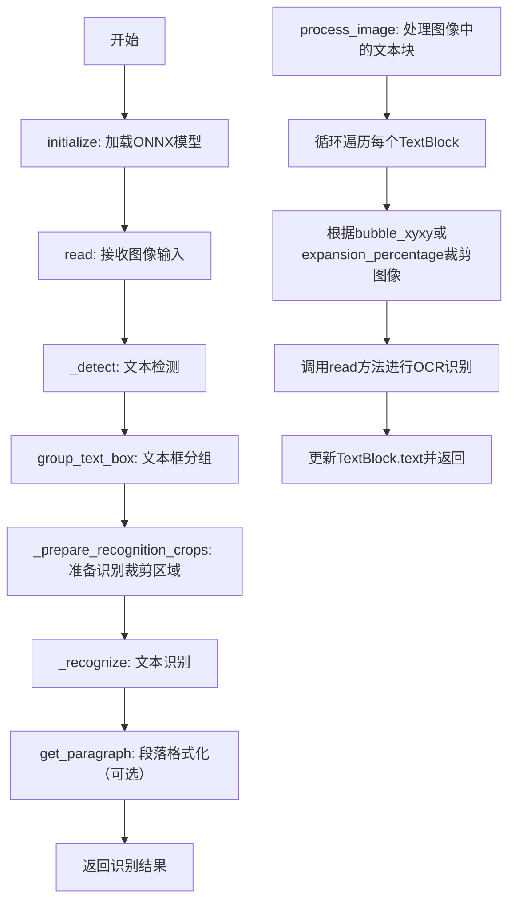
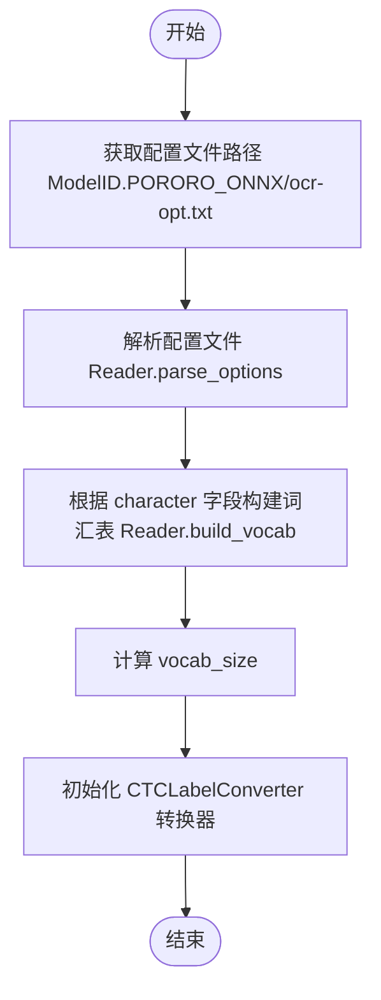
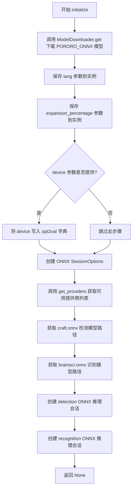
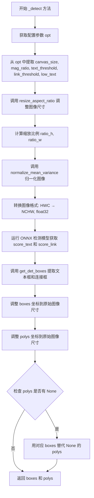
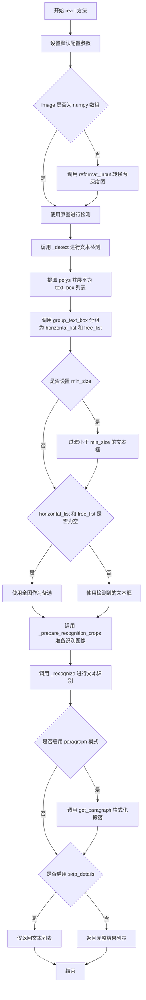

# `comic-translate\modules\ocr\pororo\onnx_engine.py` 详细设计文档

基于ONNX Runtime的Pororo OCR引擎实现，实现了文本检测与识别全流程，支持多语言OCR处理

## 整体流程



## 类结构

```
OCREngine (抽象基类)
└── PororoOCREngineONNX (ONNX OCR引擎实现)
```

## 全局变量及字段


### `PororoOCREngineONNX.opt2val`
    
配置选项和模型参数

类型：`dict`
    


### `PororoOCREngineONNX.converter`
    
CTC标签转换器

类型：`CTCLabelConverter`
    


### `PororoOCREngineONNX.lang`
    
语言设置

类型：`str`
    


### `PororoOCREngineONNX.expansion_percentage`
    
文本区域扩展百分比

类型：`int`
    


### `PororoOCREngineONNX.det_path`
    
检测模型路径

类型：`str`
    


### `PororoOCREngineONNX.rec_path`
    
识别模型路径

类型：`str`
    


### `PororoOCREngineONNX.det_sess`
    
检测ONNX会话

类型：`ort.InferenceSession`
    


### `PororoOCREngineONNX.rec_sess`
    
识别ONNX会话

类型：`ort.InferenceSession`
    
    

## 全局函数及方法


### `PororoOCREngineONNX.__init__`

该函数是 `PororoOCREngineONNX` 类的构造函数。它负责在对象实例化时加载 OCR 模型的配置文件，解析其中的参数，构建用于识别解码的字符集词汇表（vocab），并初始化 CTC（Connectionist Temporal Classification）标签转换器。

参数：

-  `self`：`PororoOCREngineONNX`，表示类的实例本身。

返回值：`None`，无返回值，仅用于初始化实例状态。

#### 流程图



#### 带注释源码

```python
def __init__(self):
    # 1. 获取 OCR 优化配置文件 (ocr-opt.txt) 的本地路径
    opt_file = ModelDownloader.get_file_path(ModelID.PORORO_ONNX, "ocr-opt.txt")
    
    # 2. 解析配置文件，获取包含模型参数、字符集等信息的字典
    self.opt2val = Reader.parse_options(opt_file)
    
    # 3. 使用解析出的字符集 (character) 构建词汇表列表 (vocab)
    self.opt2val["vocab"] = Reader.build_vocab(self.opt2val["character"])  # type: ignore
    
    # 4. 计算并保存词汇表的大小，用于模型配置
    self.opt2val["vocab_size"] = len(self.opt2val["vocab"])
    
    # 5. 初始化 CTCLabelConverter，该转换器用于将模型输出的索引转换为实际文本
    self.converter = CTCLabelConverter(self.opt2val["vocab"])  # type: ignore
```


### `PororoOCREngineONNX.initialize`

该方法负责初始化 Pororo OCR 引擎的运行时选项，包括下载 ONNX 模型文件、配置设备提供商、创建检测和识别两个阶段的 ONNX Runtime 推理会话，并为后续的文本检测与识别任务做好准备。

参数：

- `self`：隐式参数，类的实例本身
- `lang`：`str`，默认值 `'ko'`，指定 OCR 识别语言代码（如 'ko' 表示韩语）
- `expansion_percentage`：`int`，默认值 `5`，文本框扩展百分比，用于调整检测文本区域的边距
- `device`：`Optional[str]`，可选参数，设备提示字符串（如 'cpu' 或 'cuda'），用于控制 ONNX 提供商选择

返回值：`None`，该方法不返回任何值，仅通过修改实例属性完成初始化

#### 流程图



#### 带注释源码

```python
def initialize(self, lang: str = 'ko', expansion_percentage: int = 5, device: Optional[str] = None):
    """Initialize engine runtime options and create ONNX sessions with device hint.

    Args:
        lang: Language code for OCR (default 'ko' for Korean).
        expansion_percentage: Percentage for expanding text bounding boxes.
        device: Optional device hint (e.g. 'cpu' or 'cuda') that controls ONNX provider selection.
    """
    # Step 1: Ensure the ONNX model files are downloaded
    # This will download PORORO_ONNX models if not already present
    ModelDownloader.get(ModelID.PORORO_ONNX)
    
    # Step 2: Store language setting as instance variable
    self.lang = lang
    
    # Step 3: Store text expansion percentage as instance variable
    self.expansion_percentage = expansion_percentage

    # Step 4: If device hint is provided, store it in options dictionary
    # This will influence provider selection in get_providers()
    if device:
        self.opt2val["device"] = device

    # Step 5: Create ONNX Runtime session options
    sess_opts = ort.SessionOptions()
    
    # Step 6: Get available ONNX providers based on device setting
    # Returns list of providers like ['CUDAExecutionProvider', 'CPUExecutionProvider']
    providers = get_providers(self.opt2val.get("device"))
    
    # Step 7: Get paths to ONNX model files
    # craft.onnx: Text detection model ( CRAFT-based )
    # brainocr.onnx: Text recognition model ( BrainOCR-based )
    self.det_path = ModelDownloader.get_file_path(ModelID.PORORO_ONNX, "craft.onnx")
    self.rec_path = ModelDownloader.get_file_path(ModelID.PORORO_ONNX, "brainocr.onnx")
    
    # Step 8: Create ONNX Runtime inference sessions
    # det_sess: Handles text detection (finding text regions)
    # rec_sess: Handles text recognition (converting regions to text)
    self.det_sess = ort.InferenceSession(self.det_path, sess_options=sess_opts, providers=providers)
    self.rec_sess = ort.InferenceSession(self.rec_path, sess_options=sess_opts, providers=providers)
    
    # Step 9: Return None indicating successful initialization
    return None
```


### `PororoOCREngineONNX._detect`

该方法是 PororoOCREngineONNX 类的核心文本检测方法，负责对输入图像进行文本区域检测。它首先读取配置参数，对图像进行宽高比保持的缩放和归一化处理，然后将处理后的图像转换为 ONNX Runtime 所需的 NCHW 格式，输入到检测模型（craft.onnx）中获取文本和链接分数，最后通过后处理算法提取文本边界框和多点坐标，并进行坐标还原。

参数：

- `self`：类的实例本身，包含 ONNX 会话和配置参数
- `image`：`np.ndarray`，输入的图像数据，通常为 HWC 格式的 RGB 或灰度图像

返回值：`tuple[list[np.ndarray], list[np.ndarray]]`，返回两个列表——第一个是文本检测的边界框列表（boxes），第二个是文本区域的多点坐标列表（polys），两者一一对应

#### 流程图



#### 带注释源码

```python
def _detect(self, image: np.ndarray) -> tuple[list[np.ndarray], list[np.ndarray]]:
    """
    对输入图像进行文本区域检测
    
    参数:
        image: np.ndarray, 输入图像 (HWC 格式)
    
    返回:
        tuple: (boxes, polys) 文本边界框列表和多点坐标列表
    """
    # 获取配置参数
    opt = self.opt2val
    
    # 提取检测相关的参数，使用默认值
    canvas_size = opt.get("canvas_size", 2560)       # 画布大小，默认 2560
    mag_ratio = opt.get("mag_ratio", 1.0)           # 放大比例，默认 1.0
    text_threshold = opt.get("text_threshold", 0.7)  # 文本置信度阈值
    link_threshold = opt.get("link_threshold", 0.4)  # 连接置信度阈值
    low_text = opt.get("low_text", 0.4)              # 低文本阈值
    
    # 步骤1: 按宽高比调整图像大小，保持文本比例
    # 返回: 调整后的图像、目标缩放比例、原始尺寸信息
    img_resized, target_ratio, _ = resize_aspect_ratio(
        image,
        canvas_size,
        interpolation=Image.Resampling.BILINEAR,
        mag_ratio=mag_ratio,
    )
    
    # 步骤2: 计算缩放比例的倒数，用于后续坐标还原
    ratio_h = ratio_w = 1 / target_ratio
    
    # 步骤3: 归一化处理，使用均值方差归一化
    x = normalize_mean_variance(img_resized)
    
    # 步骤4: 转换图像格式以适应 ONNX Runtime
    # 从 HWC (高度, 宽度, 通道) 转换为 NCHW (批次, 通道, 高度, 宽度)
    # 并增加批次维度 [np.newaxis, ...]
    x_np = np.transpose(x, (2, 0, 1))[np.newaxis, ...].astype(np.float32)
    
    # 步骤5: 运行 ONNX 检测模型推理
    # 使用检测会话获取文本和链接分数图
    # 返回: y[0,:,:,0] 为文本分数, y[0,:,:,1] 为链接分数
    y, feature = self.det_sess.run(None, {self.det_sess.get_inputs()[0].name: x_np})
    
    # 步骤6: 分离文本分数和链接分数
    score_text = y[0, :, :, 0]   # 文本区域概率图
    score_link = y[0, :, :, 1]   # 文本连接关系概率图
    
    # 步骤7: 使用后处理算法获取文本框
    # 基于分数阈值和连通区域分析提取边界框
    boxes, polys = get_det_boxes(
        score_text, score_link, text_threshold, link_threshold, low_text
    )
    
    # 步骤8: 将坐标从缩放后的图像还原到原始图像尺寸
    boxes = adjust_result_coordinates(boxes, ratio_w, ratio_h)
    polys = adjust_result_coordinates(polys, ratio_w, ratio_h)
    
    # 步骤9: 处理 polys 中可能存在的 None 值
    # 如果某个 polys 为 None，则使用对应的 boxes 替代
    for k in range(len(polys)):
        if polys[k] is None:
            polys[k] = boxes[k]
    
    # 返回检测结果: 边界框列表和多点坐标列表
    return boxes, polys
```


### `PororoOCREngineONNX._prepare_recognition_crops`

该方法负责为OCR识别阶段准备图像裁剪区域。当检测阶段未发现任何文本区域时，将整个灰度图像作为单个裁剪区域；否则，根据检测阶段输出的水平文本区域列表和自由文本区域列表，调用工具函数生成对应的图像裁剪列表。

参数：

- `self`：隐式参数，指向 `PororoOCREngineONNX` 类的实例，用于访问配置选项 `self.opt2val`
- `img_cv_grey`：`np.ndarray`，输入的灰度图像数据（二维NumPy数组）
- `horizontal_list`：`list` 或 `None`，检测阶段识别出的水平文本区域坐标列表，若无水平文本则为 `None`
- `free_list`：`list` 或 `None`，检测阶段识别出的自由角度（倾斜/垂直）文本区域坐标列表，若无自由文本则为 `None`

返回值：`list`，返回图像裁剪列表，其中每个元素为元组 `([坐标点列表], 裁剪后的图像)`。坐标点列表包含四个 `[x, y]` 形式的顶点坐标（分别对应左上、右上、右下、左下角），用于后续识别结果的位置映射。

#### 流程图

```mermaid
flowchart TD
    A[开始 _prepare_recognition_crops] --> B[获取 imgH 默认值 64]
    B --> C{horizontal_list 和 free_list 是否都为 None?}
    C -->|是| D[获取灰度图像尺寸 y_max, x_max]
    D --> E[计算宽高比 ratio = x_max / y_max]
    E --> F[计算最大宽度 max_width = int(imgH * ratio)]
    F --> G[使用 imk.resize 调整图像大小为 max_width × imgH]
    G --> H[构建完整图像裁剪列表: [[[0,0], [x_max,0], [x_max,y_max], [0,y_max]], crop_img]]
    C -->|否| I[调用 get_image_list 函数]
    I --> J[传入 horizontal_list, free_list, img_cv_grey, model_height=imgH]
    J --> K[获取图像裁剪列表 image_list]
    H --> L[返回 image_list]
    K --> L
```

#### 带注释源码

```python
def _prepare_recognition_crops(self, img_cv_grey: np.ndarray, horizontal_list, free_list):
    """Prepare image crops for OCR recognition stage.
    
    When no text regions are detected (both horizontal_list and free_list are None),
    treat the entire image as a single crop. Otherwise, generate crops based on
    detected text regions.
    
    Args:
        img_cv_grey: Input grey-scale image as numpy array (height, width).
        horizontal_list: List of horizontal text region bounding boxes, or None.
        free_list: List of free-angle text region bounding boxes, or None.
    
    Returns:
        List of tuples (coordinates, cropped_image), where coordinates is a list
        of 4 [x, y] points representing the quadrilateral boundary.
    """
    # 从配置选项中获取目标图像高度，默认值为64像素
    imgH = self.opt2val.get("imgH", 64)
    
    # 判断逻辑分支：如果检测阶段未发现任何文本区域
    if (horizontal_list is None) and (free_list is None):
        # 获取灰度图像的维度：高度和宽度
        y_max, x_max = img_cv_grey.shape
        
        # 计算图像宽高比，用于保持纵横比地进行resize
        ratio = x_max / y_max
        
        # 根据目标高度和宽高比计算目标宽度
        max_width = int(imgH * ratio)
        
        # 使用LANZOS插值方法对图像进行缩放（保持纵横比）
        # imk.resize 返回 PIL Image 对象
        crop_img = imk.resize(
            img_cv_grey, 
            (max_width, imgH), 
            mode=Image.Resampling.LANCZOS
        )
        
        # 构建完整的图像裁剪列表：将整个图像作为一个裁剪区域
        # 坐标点按顺时针顺序：左上 -> 右上 -> 右下 -> 左下
        image_list = [
            (
                [[0, 0], [x_max, 0], [x_max, y_max], [0, y_max]], 
                crop_img
            )
        ]
    else:
        # 检测到了文本区域，调用工具函数生成基于文本区域的裁剪列表
        # 该函数会根据 bounding box 坐标从原图中裁剪出对应的图像区域
        image_list, _ = get_image_list(
            horizontal_list, 
            free_list, 
            img_cv_grey, 
            model_height=imgH
        )
    
    # 返回用于OCR识别阶段的图像裁剪列表
    return image_list
```


### `PororoOCREngineONNX._recognize`

该方法是PororoOCREngineONNX类的核心识别方法，负责将预处理好的图像块列表（包含文字区域坐标和对应图像）进行批量ONNX推理、CTC解码，最终返回每个文字区域的识别文本、置信度分数和坐标信息。

参数：

- `image_list`：`list`，包含多个元组的列表，每个元组为`(坐标列表, 图像numpy数组)`，坐标列表表示文字块的四个顶点坐标，图像为灰度图像数据

返回值：`list`，返回识别结果列表，每个元素为`(坐标框, 文本, 分数)`的三元组，其中坐标框为原始输入坐标，文本为识别出的字符串，分数为识别置信度（0-1之间的浮点数）

#### 流程图

```mermaid
flowchart TD
    A[开始 _recognize] --> B[获取配置参数 imgH, imgW, adjust_contrast, batch_size]
    B --> C[从 image_list 提取坐标列表 coord 和图像列表 img_list]
    C --> D{遍历每个图像进行预处理}
    D -->|对每个图像| E[调用 _resize 调整图像大小]
    E --> F[调用 normalize_pad_numpy 归一化并填充]
    F --> G[将处理好的tensor加入列表]
    D --> H{所有图像处理完成?}
    H -->|否| D
    H -->是| I[沿batch维度拼接所有tensor形成批量张量]
    I --> J{按batch_size分批进行ONNX推理}
    J -->|每批数据| K[调用 rec_sess.run 执行推理获取 preds]
    K --> L[计算softmax得到概率分布]
    L --> M[使用 argmax 获取最大概率类别索引]
    M --> N[调用 converter.decode_greedy 进行CTC解码]
    N --> O[计算每个识别结果的置信度]
    O --> P[将文本和置信度加入结果列表]
    J --> Q{所有批次处理完成?}
    Q -->|否| J
    Q -->是| R[组装最终输出列表每个元素为 coord_box, text, score]
    R --> S[返回结果列表]
```

#### 带注释源码

```python
def _recognize(self, image_list):
    """
    对输入的图像块列表进行OCR识别
    image_list: 列表，每个元素为 (坐标列表, 灰度图像numpy数组)
    返回: 列表，每个元素为 (坐标框, 识别文本, 置信度分数)
    """
    opt = self.opt2val
    # 从配置中获取识别参数
    imgH = opt.get("imgH", 64)           # 输入图像高度
    imgW = opt.get("imgW", 640)          # 输入图像宽度
    adjust_contrast = opt.get("adjust_contrast", 0.5)  # 对比度调整参数
    batch_size = opt.get("batch_size", 1)  # 批处理大小

    import math
    # 定义归一化并填充的辅助函数，避免依赖torch
    def normalize_pad_numpy(pil_image: Image.Image, max_size=(1, imgH, imgW)) -> np.ndarray:
        """
        将PIL图像归一化到[-1, 1]范围并填充到目标尺寸
        pil_image: 输入的PIL图像（模式'L'即灰度）
        max_size: 目标尺寸 (通道数, 高度, 宽度)
        返回: 归一化后的numpy数组
        """
        # 将图像转换为numpy数组并归一化到[0, 1]
        arr = np.asarray(pil_image).astype(np.float32) / 255.0  # [H,W]
        # 类似于torchvision的ToTensor: 将[0,1]映射到[-1,1]
        arr = arr * 2.0 - 1.0
        H, W = arr.shape
        C, target_H, target_W = max_size
        assert H == target_H, "unexpected image height"
        # 创建目标尺寸的零矩阵
        out = np.zeros((C, target_H, target_W), dtype=np.float32)
        # 放置归一化后的图像数据
        out[0, :, :W] = arr
        # 如果需要填充宽度，复制最后一列进行填充
        if target_W != W:
            last_col = arr[:, W - 1:W]
            out[0, :, W:] = np.repeat(last_col, target_W - W, axis=1)
        return out
    
    # 分离坐标和图像数据
    coord = [item[0] for item in image_list]   # 提取所有坐标框
    img_list = [item[1] for item in image_list]  # 提取所有图像

    def _resize(image):
        """
        调整图像大小以适应模型输入
        image: 输入的灰度图像numpy数组
        返回: 调整大小后的PIL图像
        """
        pil = Image.fromarray(image, "L")
        w, h = pil.size
        # 根据配置决定是否调整对比度
        if adjust_contrast > 0:
            arr = np.array(pil.convert("L"))
            arr = adjust_contrast_grey(arr, target=adjust_contrast)
            pil = Image.fromarray(arr, "L")
        # 计算宽高比，确定调整后的宽度
        ratio = w / float(h)
        if math.ceil(imgH * ratio) > imgW:
            resized_w = imgW
        else:
            resized_w = math.ceil(imgH * ratio)
        return pil.resize((resized_w, imgH), Image.BICUBIC)

    # 对所有图像进行预处理
    tensors = []
    for im in img_list:
        resized = _resize(im)  # 调整大小
        # 归一化并填充到固定尺寸 (1, imgH, imgW)
        t = normalize_pad_numpy(resized, max_size=(1, imgH, imgW))  # (1,H,Wpad)
        tensors.append(t[np.newaxis, ...])  # 添加batch维度
    # 批量tensor shape: (N, 1, H, W)
    batch_tensor = np.concatenate(tensors, axis=0).astype(np.float32)

    # 执行识别
    results = []
    converter = self.converter  # CTC标签转换器
    # 按batch_size分批处理
    for start in range(0, batch_tensor.shape[0], batch_size):
        chunk = batch_tensor[start:start+batch_size]  # 获取当前批次数据
        # ONNX推理，返回预测结果
        preds = self.rec_sess.run(None, {self.rec_sess.get_inputs()[0].name: chunk})[0]
        # preds: (N, length, num_classes) - N为batch大小，length为序列长度，num_classes为类别数
        # 计算softmax得到概率分布
        exp = np.exp(preds - np.max(preds, axis=2, keepdims=True))
        probs = exp / exp.sum(axis=2, keepdims=True)
        # 预测的序列长度
        preds_lengths = np.full((probs.shape[0],), probs.shape[1], dtype=np.int32)
        # 获取概率最大的类别索引
        max_indices = probs.argmax(axis=2)  # (N, length)
        flat = max_indices.reshape(-1)
        # 使用CTC greedy解码将索引转换为文本
        strings = converter.decode_greedy(flat, preds_lengths)
        # 计算每个识别结果的置信度
        max_prob = probs.max(axis=2)  # 取每个时间步的最大概率
        cumprods = np.cumprod(max_prob, axis=1)  # 累积乘积作为置信度
        confs = cumprods[:, -1]  # 取最后一个时间步的累积概率作为整体置信度
        # 将识别文本和置信度配对
        for s, conf in zip(strings, confs.tolist()):
            results.append([s, float(conf)])

    # 组装最终输出格式
    out = []
    for coord_box, (text, score) in zip(coord, results):
        out.append((coord_box, text, score))
    return out
```


### `PororoOCREngineONNX.read`

该方法是OCR引擎的核心公共接口，负责接收输入图像并返回识别出的文本结果。方法内部协调文本检测、文本框分组、图像裁剪和文本识别四个关键阶段，根据配置参数（如是否返回详细结果、是否进行段落格式化等）输出不同格式的识别结果。

参数：

-  `self`：PororoOCREngineONNX，方法所属的实例对象
-  `image`：PIL.Image 或 np.ndarray，输入的待识别图像

返回值：`list`，返回识别结果列表。每个元素可以是元组 (坐标框, 文本, 置信度) 或字符串形式的文本，取决于 `skip_details` 配置选项。

#### 流程图



#### 带注释源码

```
def read(self, image):  # type: ignore
    """执行完整的 OCR 流程：检测 -> 分组 -> 识别
    
    Args:
        image: PIL.Image 或 np.ndarray 格式的输入图像
    
    Returns:
        list: 识别结果列表，格式取决于 skip_details 配置
    """
    opt = self.opt2val
    
    # ========== 1. 设置默认配置参数 ==========
    # batch_size: 批处理大小，默认为 1
    opt.setdefault("batch_size", 1)
    # skip_details: 是否跳过详细信息，仅返回文本
    opt.setdefault("skip_details", False)
    # paragraph: 是否将结果格式化为段落
    opt.setdefault("paragraph", False)
    # min_size: 文本框最小尺寸阈值
    opt.setdefault("min_size", 20)
    
    # 文本框分组阈值（默认值匹配 Reader.__call__）
    slope_ths = opt.setdefault("slope_ths", 0.1)       # 斜率阈值
    ycenter_ths = opt.setdefault("ycenter_ths", 0.5)  # Y轴中心阈值
    height_ths = opt.setdefault("height_ths", 0.5)    # 高度阈值
    width_ths = opt.setdefault("width_ths", 0.5)      # 宽度阈值
    add_margin = opt.setdefault("add_margin", 0.1)    # 边距扩展比例

    # ========== 2. 图像预处理与文本检测 ==========
    # 重新格式化输入图像（统一转换为灰度图）
    _, img_cv_grey = reformat_input(image)
    
    # 根据图像类型决定使用哪个图像进行检测
    # numpy 数组直接使用，否则使用灰度图
    detection_image = image if isinstance(image, np.ndarray) else img_cv_grey
    
    # 调用内部检测方法，返回文本框和轮廓多边形
    boxes, polys = self._detect(detection_image)

    # ========== 3. 重建并分组文本框 ==========
    # 将多边形列表展平为一维坐标数组
    text_box = []
    for p in polys:
        # 将多边形转换为 int32 类型并展平为 8 元素数组 [x1,y1,x2,y2,x3,y3,x4,y4]
        flat = np.array(p).astype(np.int32).reshape(-1)
        if flat.size == 8:  # 仅保留有效的四边形
            text_box.append(flat)

    # 调用 group_text_box 将文本框分为水平列表和自由角度列表
    # slope_ths: 斜率阈值，用于判断是否水平排列
    # ycenter_ths: Y轴中心阈值，用于行对齐判断
    # height_ths: 高度阈值，用于同一行判断
    # width_ths: 宽度阈值，用于单词间隔判断
    # add_margin: 扩展边距，用于合并相邻文本框
    horizontal_list, free_list = group_text_box(
        text_box,
        slope_ths,
        ycenter_ths,
        height_ths,
        width_ths,
        add_margin,
    )

    # ========== 4. 根据最小尺寸过滤文本框 ==========
    min_size = opt["min_size"]
    if min_size:
        # 过滤水平列表中尺寸过小的文本框
        horizontal_list = [
            i for i in horizontal_list 
            if max(i[1]-i[0], i[3]-i[2]) > min_size
        ]
        # 过滤自由列表中尺寸过小的文本框
        free_list = [
            i for i in free_list
            if max(diff([c[0] for c in i]), diff([c[1] for c in i])) > min_size
        ]

    # ========== 5. 准备识别图像 ==========
    # 备选方案：如果没有检测到任何文本框，则对整张图像进行识别
    if not horizontal_list and not free_list:
        # 使用全图作为输入
        image_list = self._prepare_recognition_crops(img_cv_grey, None, None)
    else:
        # 使用检测到的文本区域进行识别
        image_list = self._prepare_recognition_crops(
            img_cv_grey, 
            horizontal_list, 
            free_list
        )

    # ========== 6. 执行文本识别 ==========
    # 防御性检查：确保图像列表不为空
    if not image_list:
        # 返回空列表（根据 skip_details 返回不同格式）
        return [] if opt["skip_details"] else []
    
    # 调用识别方法，获取识别结果
    result = self._recognize(image_list)

    # ========== 7. 后处理 ==========
    # 段落格式化：将识别结果按从左到右顺序组合成段落
    if opt["paragraph"]:
        result = get_paragraph(result, mode="ltr")

    # ========== 8. 返回结果 ==========
    # 根据配置决定返回格式
    if opt["skip_details"]:
        # 仅返回文本内容列表
        return [item[1] for item in result]
    
    # 返回完整结果：包含坐标、文本和置信度
    return result
```


### `PororoOCREngineONNX.process_image`

该方法是 `PororoOCREngineONNX` 类的核心公共接口，用于对输入图像中的多个文本区域（TextBlock）进行 OCR 识别。它遍历文本块列表，根据每个文本块的坐标裁剪图像区域，调用内部 `read` 方法执行完整的检测+识别流程，并将识别结果填充回文本块的 `text` 属性中。

参数：

- `img`：`np.ndarray`，输入的完整图像数据，通常为 NumPy 数组格式（可能为 HWC 或灰度格式）
- `blk_list`：`list[TextBlock]`，文本块列表，每个元素包含坐标信息（`xyxy` 或 `bubble_xyxy`）和待填充的 `text` 属性

返回值：`list[TextBlock]`，返回处理后的文本块列表，每个文本块的 `text` 属性已被 OCR 识别结果填充

#### 流程图

```mermaid
flowchart TD
    A[开始 process_image] --> B[设置默认配置参数]
    B --> C{遍历 blk_list 中的每个 TextBlock}
    C --> D{检查 blk.bubble_xyxy 是否存在}
    D -->|存在| E[从 bubble_xyxy 获取坐标 x1, y1, x2, y2]
    D -->|不存在| F[调用 adjust_text_line_coordinates 计算扩展后的坐标]
    F --> E
    E --> G{验证坐标有效性: x1<x2, y1<2, 坐标在图像范围内}
    G -->|无效| H[设置 blk.text = '']
    G -->|有效| I[裁剪图像: cropped = img[y1:y2, x1:x2]]
    I --> J[调用 self.read 执行 OCR 识别]
    J --> K{检查识别结果 res 的类型}
    K -->|list 且元素为 tuple| L[提取所有 tuple 的第二个元素并用空格连接]
    K -->|list 但元素非 tuple| M[直接用空格连接所有元素]
    K -->|其他| N[设置 blk.text = '']
    L --> O[设置 blk.text 为连接后的字符串]
    M --> O
    N --> O
    O --> C
    H --> C
    C --> P[返回 blk_list]
    P --> Q[结束]
```

#### 带注释源码

```python
def process_image(self, img: np.ndarray, blk_list: list[TextBlock]): 
    """对图像中的多个文本区域进行 OCR 识别并填充结果到 TextBlock 对象
    
    Args:
        img: 输入图像的 NumPy 数组表示
        blk_list: 包含文本块坐标的列表，每个元素会被填充识别结果
    
    Returns:
        处理完成后的文本块列表
    """
    # 确保默认配置参数存在，若不存在则设置默认值
    self.opt2val.setdefault("batch_size", 1)        # 批处理大小，默认为1
    self.opt2val.setdefault("skip_details", False)  # 是否跳过详细信息
    self.opt2val.setdefault("paragraph", False)     # 是否按段落处理
    self.opt2val.setdefault("min_size", 20)         # 最小文本尺寸阈值

    # 遍历所有待处理的文本块
    for blk in blk_list:
        # 优先使用 bubble_xyxy（气泡坐标），否则使用 xyxy（标准坐标）
        if getattr(blk, 'bubble_xyxy', None) is not None:
            # 如果文本块绑定了气泡区域，直接使用气泡坐标
            x1, y1, x2, y2 = blk.bubble_xyxy
        else:
            # 根据 expansion_percentage 扩展坐标边界，获取感兴趣区域
            x1, y1, x2, y2 = adjust_text_line_coordinates(
                blk.xyxy,
                getattr(self, 'expansion_percentage', 5),  # 水平扩展百分比
                getattr(self, 'expansion_percentage', 5),  # 垂直扩展百分比
                img,
            )
        
        # 验证裁剪坐标的有效性：确保坐标在图像范围内且区域有效
        if x1 < x2 and y1 < y2 and x1 >= 0 and y1 >= 0 and x2 <= img.shape[1] and y2 <= img.shape[0]:
            # 根据有效坐标裁剪图像区域
            cropped = img[y1:y2, x1:x2]
            
            # 对裁剪后的图像区域执行完整的 OCR 流程（检测+识别）
            # read 方法返回: [(坐标框, 识别文本, 置信度), ...]
            res = self.read(cropped)
            
            # 将识别结果填充到 TextBlock 的 text 属性
            # 处理两种可能的返回格式
            if isinstance(res, list) and len(res) > 0 and isinstance(res[0], tuple):
                # 格式1: [(box, text, score), ...] - 提取所有文本并用空格连接
                blk.text = ' '.join([r[1] for r in res])
            elif isinstance(res, list):
                # 格式2: [text1, text2, ...] - 直接连接
                blk.text = ' '.join(res)
            else:
                # 其他异常情况置空
                blk.text = ''
        else:
            # 坐标无效（越界或非法区域），直接置空
            blk.text = ''
    
    # 返回填充了识别结果的文本块列表
    return blk_list
```

## 关键组件


### PororoOCREngineONNX 核心引擎类

实现基于ONNXRuntime的Pororo OCR引擎，支持文本检测与识别全流程

### 张量索引与惰性加载

使用numpy数组的维度变换和索引实现图像到ONNX输入张量的转换，通过InferenceSession延迟加载模型

### 反量化支持

在识别阶段使用numpy实现softmax计算和CTC解码，无需依赖PyTorch

### CTCLabelConverter 标签转换器

将识别输出索引转换为实际文本字符串，支持CTC greedy解码

### 图像预处理管道

包含resize_aspect_ratio保持宽高比缩放、normalize_mean_variance均值方差归一化等预处理方法

### 文本框分组与坐标调整

使用group_text_box根据斜率、中心点、高度宽度阈值将检测到的文本框分为水平列表和自由列表

### ONNX模型推理接口

_detect方法执行文字检测ONNX模型推理，_recognize方法执行文字识别ONNX模型推理

### 文本块区域裁剪与处理

process_image方法支持按TextBlock区域裁剪图像并运行完整OCR pipeline

## 问题及建议


### 已知问题

-   **异常处理缺失**：代码中未对 ONNX 推理过程进行异常捕获，模型加载失败、推理异常或输入图像损坏时可能导致程序崩溃
-   **类型注解不完整**：`read()` 方法参数缺少类型注解，返回值也存在 `# type: ignore` 混用情况，影响代码可维护性和 IDE 提示
-   **魔法数字硬编码**：`process_image` 中直接使用 `5` 作为 `expansion_percentage`，`adjust_text_line_coordinates` 调用缺乏配置化
-   **资源未显式释放**：ONNX Session 对象在类销毁时未显式关闭，缺乏上下文管理器支持，可能导致资源泄漏
-   **内联 import 语句**：`math` 模块在 `_recognize` 方法内部导入，应提升至文件顶部统一管理
-   **冗余的默认值设置**：`read()` 方法中多次调用 `opt.setdefault`，每次推理都会重复执行，可提取至 `initialize` 方法
-   **循环中的向量化缺失**：`_recognize` 中对批量结果逐个处理（`for start in range...`），可进一步利用 NumPy 向量化提升性能

### 优化建议

-   **添加异常包装**：对 `ort.InferenceSession` 调用和 `run` 方法添加 try-except 块，捕获 `onnxruntime.RuntimeException` 并返回空结果或降级处理
-   **完善类型注解**：为 `read()` 添加 `image: np.ndarray` 参数类型，为 `process_image` 添加返回类型 `-> list[TextBlock]`
-   **配置外置**：将 `expansion_percentage`、`batch_size` 等运行时参数提取为类属性或配置文件，减少硬编码
-   **实现上下文管理器**：为 `PororoOCREngineONNX` 实现 `__enter__` 和 `__exit__` 方法，确保 Session 资源正确释放
-   **整理导入顺序**：将 `import math` 移至文件顶部，保持导入语句的一致性
-   **初始化时设置默认值**：将 `opt.setdefault` 调用移至 `initialize()` 方法末尾，避免每次 `read()` 调用时重复执行
-   **批量推理优化**：在 `_recognize` 中可预先分配结果数组，减少 Python 循环开销，提升吞吐量

## 其它


### 设计目标与约束

设计目标：实现一个基于ONNXRuntime的OCR引擎，用于检测和识别图像中的文本，支持多语言（默认韩语），通过ONNX模型提高推理效率，减少对PyTorch的依赖，实现高效、低延迟的文本识别流程。约束：模型文件需预先下载，图像输入需为numpy数组或PIL Image，支持CPU和CUDA设备，必须继承OCREngine接口，确保与现有系统集成。

### 错误处理与异常设计

错误处理：
- 在`process_image`方法中，检查裁剪区域坐标有效性（x1 < x2, y1 < y2, 坐标非负，不超出图像尺寸），避免索引越界。
- 在`_detect`和`_recognize`中，假设输入已预处理，未进行显式异常捕获，运行时错误可能导致流程中断。
- 模型加载失败时，ONNXRuntime会抛出异常，需在`initialize`中处理，建议增加模型文件存在性检查。
- 建议：增加图像格式验证（如RGB、灰度）、空输入检查、推理超时处理。

### 数据流与状态机

数据流：
1. 输入图像（numpy数组或PIL Image）。
2. `read`方法调用`_detect`进行文本检测，得到边界框（boxes, polys）。
3. `group_text_box`对边界框进行分组，分为水平列表（horizontal_list）和自由列表（free_list）。
4. `_prepare_recognition_crops`根据分组裁剪图像区域，得到图像列表（image_list）。
5. `_recognize`对图像列表进行识别，计算文本和置信度，返回坐标、文本、分数列表。
6. 可选地，`get_paragraph`进行段落重组。
7. 输出文本块列表或纯文本列表（取决于`skip_details`参数）。
状态机：引擎处于初始化状态（已加载模型） -> 处理状态（执行检测和识别） -> 返回结果。

### 外部依赖与接口契约

外部依赖：
- `onnxruntime`：ONNX模型推理，提供CPU和CUDA支持。
- `PIL`：图像处理，用于图像格式转换和resize。
- `numpy`：数值计算，用于图像数组操作。
- `imkit`：图像缩放工具。
- `modules.utils.download`：模型下载管理（ModelDownloader, ModelID）。
- `modules.ocr.base`：OCR引擎基类（OCREngine）。
- `modules.utils.textblock`：文本块工具（TextBlock, adjust_text_line_coordinates）。
接口契约：
- 继承`OCREngine`类。
- 实现`initialize(lang, expansion_percentage, device)`方法，初始化模型会话和配置。
- 实现`read(image)`方法，接受图像，返回文本块列表或文本列表。
- 实现`process_image(img, blk_list)`方法，接受图像和文本块列表，更新文本块内容。

### 性能优化策略

性能优化：
- 使用ONNXRuntime的CPU或CUDA provider提高推理速度，根据设备自动选择。
- 批处理识别：在`_recognize`中支持批量处理（batch_size），减少推理次数。
- 图像预处理：使用numpy操作避免PyTorch依赖，减少开销和安装复杂性。
- 缓存：模型会话在初始化时创建，避免重复加载。
- 内存优化：重复使用numpy数组，减少内存分配。

### 配置管理

配置管理：
- 配置存储在`opt2val`字典中，包括模型路径、推理参数（如text_threshold、link_threshold、imgH、imgW、batch_size）。
- 通过`initialize`方法动态设置设备、语言（lang）、扩展百分比（expansion_percentage）。
- 使用`ModelDownloader`下载模型文件，模型ID为`ModelID.PORORO_ONNX`。
- 支持运行时参数覆盖，如在`read`方法中设置默认值。

### 安全性与隐私

安全性：
- 模型文件来自外部源，需验证完整性，建议在下载后校验哈希值。
- 图像处理在本地进行，不上传云端，保护用户隐私。
- 代码中无用户输入直接处理，建议增加输入验证，防止恶意图像导致崩溃。
- ONNXRuntime会话需设置安全选项，如限制并发数。

### 测试与验证

测试策略：
- 单元测试：测试各个方法（如`_detect`、`_recognize`）的正确性，使用模拟数据。
- 集成测试：测试完整流程，输入标准图像到输出文本，验证准确性。
- 性能测试：比较ONNXRuntime与PyTorch的推理速度，评估批处理效果。
- 边界条件：测试空图像、小图像、大图像、多语言图像等。
- 回归测试：确保更新代码后功能不受影响。

### 部署环境要求

部署环境：
- Python 3.8+
- 需安装onnxruntime、PIL、numpy、imkit等依赖。
- 模型文件（craft.onnx, brainocr.ocr）需放置在指定目录，通过ModelDownloader管理。
- 支持Linux、Windows、macOS，需根据平台选择合适的ONNXRuntime provider。
- 内存要求：至少4GB RAM，推荐8GB以上以处理大图像。

### 未来扩展与维护

扩展与维护：
- 支持更多语言：目前默认韩语，可扩展到英语、中文等，需下载相应模型和配置。
- 模型更新：随着Pororo模型更新，需适配新版本接口和参数。
- 代码重构：将预处理和后处理函数解耦，提高可读性和可测试性。
- 日志记录：增加日志以便调试和监控推理过程。
- 异步处理：支持异步调用，提高吞吐量。
    