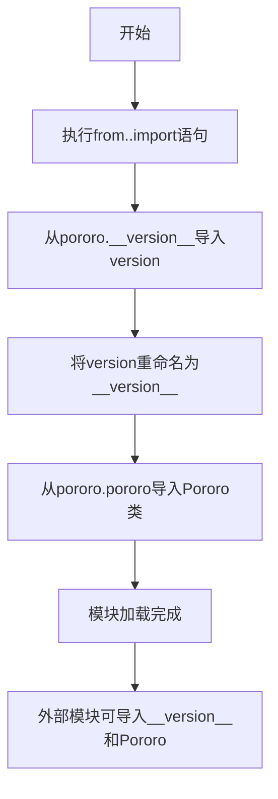

# `comic-translate\modules\ocr\pororo\pororo\__init__.py` 详细设计文档

这是一个Python包的初始化文件，主要功能是从上级包的pororo模块导入版本信息和Pororo主类，供外部包或模块使用，实现模块的版本统一管理和核心类的快捷访问。

## 整体流程



## 类结构

```
当前模块 (导出模块)
└── __init__.py (入口文件)
    ├── 导出: __version__ (版本号)
    └── 导出: Pororo (主类)
```

## 全局变量及字段


### `__version__`
    
Pororo包的版本号字符串，用于标识当前安装的Pororo库版本

类型：`str`
    


### `Pororo`
    
Pororo库的主类，提供各种自然语言处理任务的统一接口

类型：`class`
    


    

## 全局函数及方法


## 关键组件


### Pororo 类

从 `..pororo.pororo` 模块导入的主类，代表 Pororo 机器学习框架的核心接口，用于执行各种 NLP 和多模态任务。

### `__version__` 全局变量

从 `..pororo.__version__` 导入的版本信息变量，用于追踪当前 Pororo 框架的版本号。


## 问题及建议


### 已知问题

-   **相对导入依赖强耦合**：使用 `..pororo` 相对导入方式，假定特定的包结构，若包结构调整或作为顶层模块运行可能导致 `ImportError`
-   **静默忽略警告**：两个导入均使用 `# noqa`，表明存在静态分析工具警告但被刻意忽略，可能隐藏潜在的导入问题
-   **缺乏版本控制透明度**：`__version__` 直接从内部模块导入再导出，无法控制版本信息的来源和准确性
-   **零错误处理**：导入语句无任何异常捕获机制，若 `pororo` 包缺失或模块结构变化，错误信息不够友好
-   **模块职责不明确**：作为包入口文件（推测为 `__init__.py`），仅进行简单重导出，缺乏包级别文档和初始化逻辑
-   **导入路径脆弱**：依赖 `pororo.pororo` 模块路径，若该内部模块重命名或重构将导致级联失败

### 优化建议

-   添加 `try-except` 块处理导入异常，提供清晰的错误信息或优雅降级
-   考虑在包级别添加 `__all__` 明确导出接口，增强命名空间控制
-   增加文档字符串说明此包的用途和导出内容
-   评估是否可直接依赖 `pororo` 包的公共接口，而非直接导入内部模块
-   移除 `# noqa` 注释并解决静态分析工具警告，从源头保证代码质量


## 其它


### 设计目标与约束

该模块作为Pororo库的入口文件，主要目标是提供一个简洁的公共API接口层，使得用户能够方便地导入版本信息和核心类。设计约束包括：保持最小的代码复杂度、仅依赖pororo内部模块、不引入额外的外部依赖。

### 错误处理与异常设计

由于该文件仅包含导入语句，错误处理主要依赖于导入时Python的模块解析机制。常见的异常情况包括：导入路径错误（ModuleNotFoundError）、循环导入问题（ImportError）、以及版本模块缺失导致的属性错误。建议在pororo包的__init__.py中统一处理导入异常，提供清晰的错误提示信息。

### 外部依赖与接口契约

该文件不直接依赖外部第三方库，仅依赖Pororo内部模块。接口契约包括：Pororo类必须从pororo.pororo模块正确导出，version变量必须从pororo.__version__模块正确导出。导入方通过这些公共接口与该模块进行交互。

### 性能考虑

该模块在导入时会立即执行两个导入操作，可能影响首次导入性能。建议采用延迟导入（lazy import）策略，仅在实际使用时才导入Pororo类，以减少初始化时间和内存占用。

### 安全性考虑

该模块不涉及用户输入处理、网络请求或敏感数据操作，安全性风险较低。但需确保从pororo.pororo导入的类不包含恶意代码，建议在pororo包发布前进行代码审计。

### 测试策略

建议编写单元测试验证：__version__变量类型为字符串、Pororo类可正确实例化、导入路径正确、模块属性可访问。测试文件应覆盖导入异常场景，确保错误信息清晰。

### 版本兼容性

该模块需要与Python 3.6+版本兼容。建议使用type hints标注类型（虽然当前代码未使用），并确保在不同Python版本的导入行为一致。Pororo类的接口在不同版本间应保持向后兼容。

### 部署与发布注意事项

该文件作为pororo包的__init__.py或入口模块，在pip安装时会被自动调用。建议在setup.py或pyproject.toml中正确配置package结构，确保导入路径解析正确。发布时应包含完整的__init__.py文件，避免出现导入错误。

### 维护建议

当前代码结构简单，维护性较好。长期建议：添加文档字符串说明模块用途、考虑使用__all__显式定义导出的公共接口、定期检查并更新依赖关系以避免循环依赖。


    