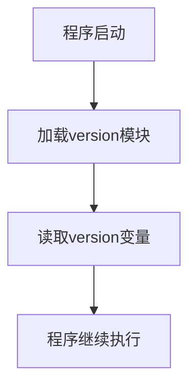

# `comic-translate\modules\ocr\pororo\pororo\__version__.py` 详细设计文档

该代码文件定义了一个全局版本号变量version，用于标识当前软件的版本为0.4.1，通常用于版本管理和兼容性检查等场景。

## 整体流程



## 类结构

```
无类层次结构（该文件仅为简单的变量定义）
```

## 全局变量及字段


### `version`
    
项目当前版本号标识

类型：`string`
    


    

## 全局函数及方法


## 关键组件


## 代码概述

该代码片段仅包含一个版本标识符字符串，定义了当前软件包的版本号为"0.4.1"，无任何功能性实现逻辑。

## 关键组件信息

### 版本标识符

- **组件名称**: version
- **类型**: 字符串 (String)
- **描述**: 定义当前代码库的版本号，用于版本追踪和依赖管理


---

**说明**: 当前提供的源代码仅包含一个版本字符串变量，不包含任何类、方法、函数或复杂逻辑组件，因此无法生成完整的设计文档所需的其他内容（如类详细信息、流程图、mermaid图等）。若需要完整的架构设计文档，请提供实际的实现代码。

## 问题及建议


### 已知问题

-   版本号以硬编码方式直接写在代码中，缺乏版本管理的灵活性
-   仅包含版本号字符串，未提供版本信息的结构化表示（如Major、Minor、Patch分离）
-   版本号0.4.1无法判断其语义化版本规则是否被遵循
-   缺乏版本变更历史记录，无法追溯版本迭代
-   版本号未与构建系统或发布流程集成

### 优化建议

-   将版本号提取至独立配置文件（如version.json）或环境变量，实现版本与代码解耦
-   采用结构化方式管理版本（如Pydantic BaseModel），分离Major、Minor、Patch版本号
-   遵循语义化版本规范（SemVer），在代码注释中明确版本规则
-   建立版本变更日志（CHANGELOG.md），记录每个版本的变更内容
-   集成版本校验机制，确保版本号与实际发布包一致
-   考虑使用setuptools或poetry等构建工具的版本管理功能自动注入版本号
-   添加版本兼容性检查逻辑，避免不兼容变更


## 其它


### 项目概述

这是一个版本声明文件，用于记录当前项目的版本号为"0.4.1"。该文件通常作为项目配置的一部分，用于版本追踪和依赖管理。

### 整体运行流程

本文件为静态配置文件，不涉及运行时流程。版本号在项目构建或运行时被读取，用于显示当前版本信息或进行版本兼容性检查。

### 全局变量

| 名称 | 类型 | 描述 |
|------|------|------|
| version | 字符串 | 表示当前项目的版本号，格式为"主版本号.次版本号.修订号" |

### 关键组件信息

| 名称 | 一句话描述 |
|------|------------|
| 版本声明模块 | 存储项目版本信息的简单配置单元 |

### 潜在的技术债务或优化空间

1. 缺乏版本管理机制：当前仅使用硬编码的版本号，建议使用版本控制工具或构建系统自动管理版本
2. 无版本语义：0.4.1版本号的语义不明确，建议添加版本angelog或版本说明文档
3. 缺少版本校验：没有对版本号格式的校验机制

### 设计目标与约束

- 目标：提供项目版本的统一声明和追踪
- 约束：版本号格式应遵循语义化版本规范（Semantic Versioning）

### 错误处理与异常设计

- 当前无错误处理机制
- 建议：添加版本号格式验证，确保符合语义化版本规范

### 数据流与状态机

- 数据流：版本号作为只读配置被项目其他模块引用
- 状态机：不适用

### 外部依赖与接口契约

- 无外部依赖
- 接口契约：提供version变量供其他模块读取

### 版本管理策略

建议采用语义化版本（SemVer）规范，主版本号.次版本号.修订号的格式，当前版本0.4.1表示第4个次版本迭代的第1个修订版本。

### 配置文件规范

此文件应作为项目配置的一部分，与CHANGELOG、package.json或其他版本管理工具配合使用。


    