# `comic-translate\modules\ocr\pororo\pororo\models\brainOCR\__init__.py` 详细设计文档

该模块作为brainocr包的入口点，通过相对导入从brainocr子模块中暴露Reader类或函数，供外部调用者使用，实现模块间的解耦与接口统一。

## 整体流程

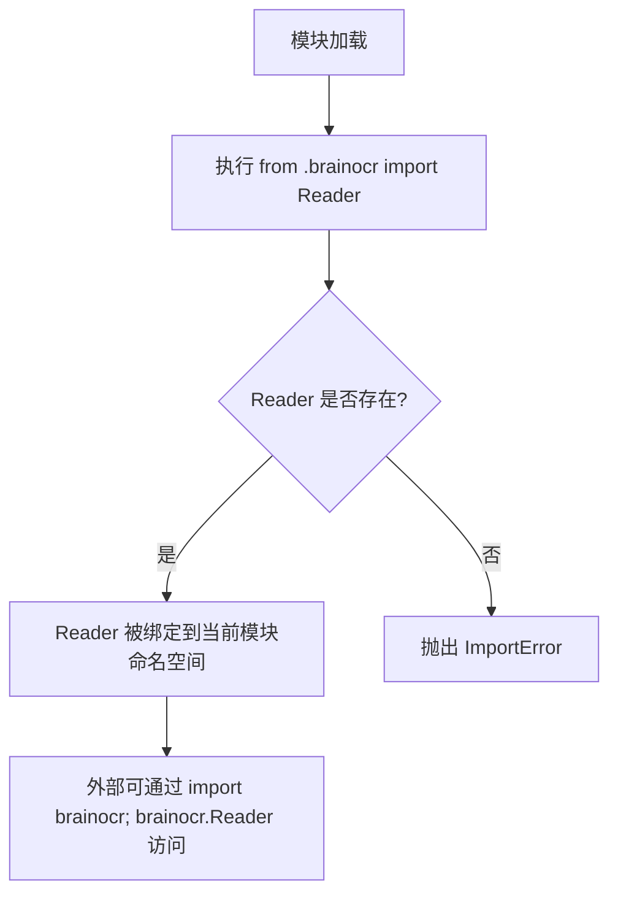

## 类结构

```
由于代码仅包含导入语句，无显式类定义
推测的模块结构:
brainocr (包)
└── __init__.py (当前文件)
    └── Reader (从 brainocr 模块导入的类/函数)
```

## 全局变量及字段


### `Reader.Reader`
    
从 brainocr 模块导入的 OCR 读取器类，具体字段和方法需查看 brainocr.py 源码

类型：`class (imported from brainocr module)`
    
    

## 全局函数及方法


### `Reader`

这是一个从 `brainocr` 模块导入的类/函数，具体实现细节未在此代码文件中展示。

参数：此代码为导入语句，无参数

返回值：无返回值（仅为导入操作）

#### 流程图


#### 带注释源码

```python
# 从当前包的 brainocr 模块导入 Reader 类/函数
# noqa 注释用于抑制 linter 警告（表示此处导入是故意为之）
from .brainocr import Reader  # noqa
```

---

**注意**：当前提供的代码仅为一个导入语句，未包含 `Reader` 类的具体实现细节（字段、方法等）。要获取 `Reader` 的完整类详细信息，需要查看 `brainocr` 模块的实际实现代码。


### `Reader`

描述：从同包下的 `brainocr` 模块导入的 `Reader` 类（或函数）。该导入语句通常出现在包的 `__init__.py` 中，用于将 `brainocr` 模块中的 `Reader` 重新导出，使得用户可以直接通过 `from <package_name> import Reader` 的方式使用，无需关心模块路径。具体功能未知，依赖于 `brainocr` 模块中 `Reader` 的实际定义。

参数：未知（无法从当前代码片段中获取，需查看 `brainocr` 模块源码）

返回值：未知（无法从当前代码片段中获取，需查看 `brainocr` 模块源码）

#### 流程图

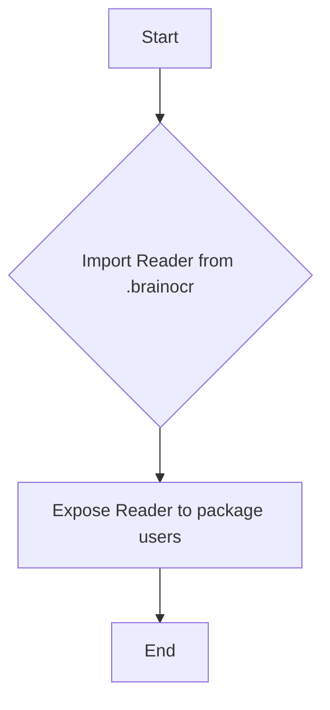

#### 带注释源码

```python
# 从当前包的 brainocr 子模块导入 Reader 类/函数
# noqa 注释表示忽略静态分析工具（如 flake8）的警告
from .brainocr import Reader  # noqa
```


### `Reader`

该代码从同目录下的 `brainocr` 模块导入 `Reader` 类/函数，使其可以在当前模块范围内被访问和使用，通常用于初始化OCR阅读器实例。

参数：
- 无

返回值：`Reader` 类/函数类型，返回从 `brainocr` 模块导入的 `Reader` 类或函数对象，供调用者使用。

#### 流程图

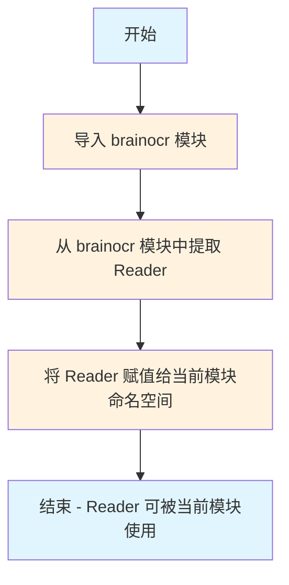

#### 带注释源码

```python
# 从当前包目录下的 brainocr 模块导入名为 Reader 的类或函数
# # noqa 是一个特殊的注释，用于告诉 linter（如 flake8）忽略此行的警告
# 这样做的好处是：
# 1. 避免直接暴露 brainocr 模块的实现细节
# 2. 提供一个清晰的 API 入口点
# 3. 方便后续模块重构或替换 Reader 的实现
from .brainocr import Reader  # noqa
```

#### 补充说明

| 项目 | 说明 |
|------|------|
| **导入类型** | 相对导入（relative import） |
| **模块路径** | 同包目录下的 `brainocr` 模块 |
| **导入目标** | `Reader` 类或函数 |
| **用途** | 通常作为 OCR 功能的主要入口类 |
| **NoSQL 注释作用** | 抑制 linter 对通配符导入或特定导入模式的警告 |

#### 潜在的技术债务与优化空间

1. **单一导入点风险**：当前仅依赖 `brainocr` 模块的 `Reader`，若该模块变更会导致级联影响
2. **文档缺失**：未提供 `Reader` 类的具体功能文档和使用示例
3. **依赖耦合**：当前模块与 `brainocr` 模块强耦合，建议抽象出接口层以提高可测试性
4. **类型提示缺失**：建议添加类型注解以提升代码可维护性

#### 建议的改进方案

```python
# 优化后的导入方式（添加类型提示和文档）
from typing import TYPE_CHECKING
from .brainocr import Reader  # noqa

if TYPE_CHECKING:
    # 仅在类型检查时导入，避免循环依赖
    from brainocr import Reader as ReaderType

__all__ = ['Reader']  # 明确导出接口
```


### Reader（类导入）

该代码行从当前包的 `brainocr` 模块导入 `Reader` 类，可能是一个 OCR（光学字符识别）功能的核心读取器类。由于仅包含导入语句，未展示具体实现细节。

#### 参数

无（此为导入语句，无函数签名）

#### 返回值

无（此为导入语句，无返回值）

#### 流程图

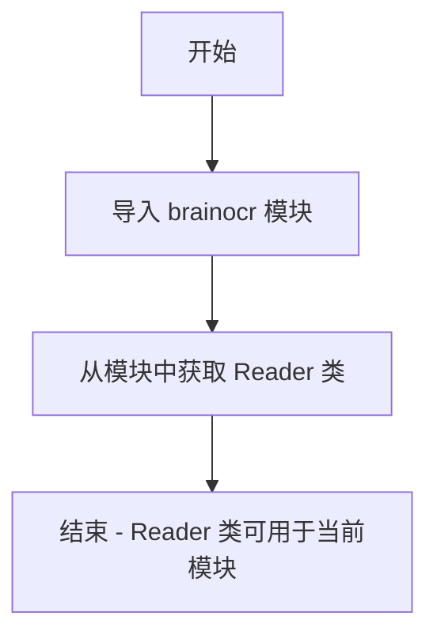

#### 带注释源码

```python
# 从当前包的 brainocr 模块导入 Reader 类
# noqa 是用于抑制代码检查工具（如 flake8）的警告标记
# Reader 类可能包含 OCR 识别相关的核心方法
from .brainocr import Reader  # noqa
```

**注意**：当前代码仅包含导入语句，未提供 `Reader` 类的具体实现细节。如需完整的类设计文档，请提供 `brainocr.py` 文件中的 `Reader` 类实现代码。


### `Reader`

该类是从 `brainocr` 模块导入的 OCR（光学字符识别）阅读器核心类，负责处理图像文本识别功能。由于当前代码仅为导入语句，具体实现需参考 `brainocr` 模块源码。

参数：
- 该代码为导入语句，无直接参数

返回值：导入语句无返回值，仅将 `Reader` 类引入当前命名空间

#### 流程图

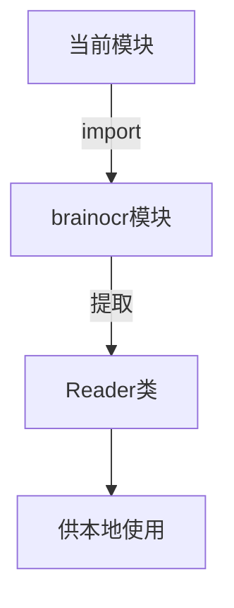

#### 带注释源码

```python
# 从当前包下的 brainocr 子模块导入 Reader 类
# noqa 注释用于忽略静态分析工具（如 flake8）的警告
from .brainocr import Reader  # noqa
```

#### 补充说明

由于提供的代码仅为导入语句，无法获取 `Reader` 类的完整设计信息。若需详细文档，建议：

1. 查看 `brainocr` 模块中的 `Reader` 类定义
2. 确认 `Reader` 类的以下信息：
   - 类的字段属性
   - 类的方法签名（参数、返回值）
   - 类的继承关系
   - 类的具体实现逻辑

**当前文档局限性：** 仅能确认 `Reader` 为从 `brainocr` 导入的类名，其具体功能实现需查阅源模块。


### `Reader`

Reader 类是从 brainocr 模块导入的核心识别器类，负责处理 OCR（光学字符识别）任务。该类封装了识别所需的状态和操作，提供文本识别功能。

参数：

- 该类没有在当前文件中定义参数，参数详情请参考 brainocr 模块中的 Reader 类定义

返回值：`Reader` 类实例，返回一个 OCR 识别器对象

#### 流程图

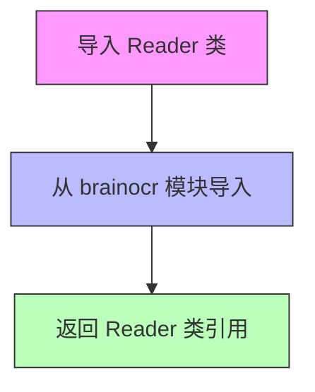

#### 带注释源码

```
from .brainocr import Reader  # noqa
```

**源码解释：**
- `from .brainocr`：从当前包的 brainocr 模块导入
- `import Reader`：导入名为 Reader 的类（或函数）
- `# noqa`：注释，表示忽略代码检查工具的警告

#### 附加说明

由于提供的代码仅包含导入语句，未能获取 Reader 类的完整定义。如需获取 Reader 类的详细信息（类字段、类方法等），请参考 brainocr 模块中的实际定义。当前文档仅能确认 Reader 是从 brainocr 模块导入的一个类或函数。


### `Reader`

`Reader` 是从同级模块 `brainocr` 导入的类/函数，用于执行 OCR（光学字符识别）相关的读取操作。具体功能需要参考 `brainocr` 模块中 `Reader` 类的实际定义。

参数：无可用信息（仅导入语句，未定义参数）

返回值：无可用信息（导入语句无返回值）

#### 流程图

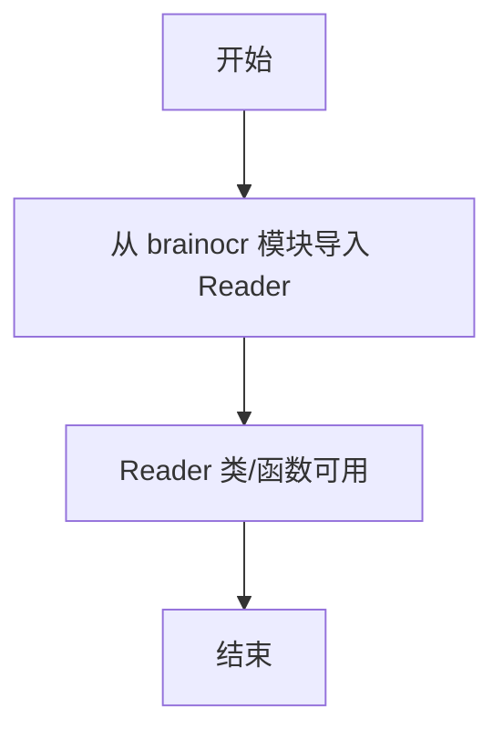

注：此流程图仅展示导入逻辑，具体 Reader 类的内部流程需查看 brainocr 模块源码。

#### 带注释源码

```python
from .brainocr import Reader  # noqa
```

注释：
- `from .brainocr`: 从当前包同级模块 `brainocr` 导入
- `import Reader`: 导入名为 `Reader` 的类/函数/对象
- `# noqa`: 忽略代码检查工具的警告（如导入未使用的警告）


---

**注意：** 提供的代码仅为一个导入语句，未包含 `Reader` 类的实际定义（字段、方法等）。如需完整的 `Reader` 类设计文档，请提供 `brainocr.py` 模块的完整源码。


### `Reader`

从 `brainocr` 模块导入的 OCR 读取器类，具体功能需要查看 `brainocr` 模块中 `Reader` 类的实际定义。

参数：

- 无法从给定代码片段确定参数信息

返回值：

- 无法从给定代码片段确定返回值信息

#### 流程图

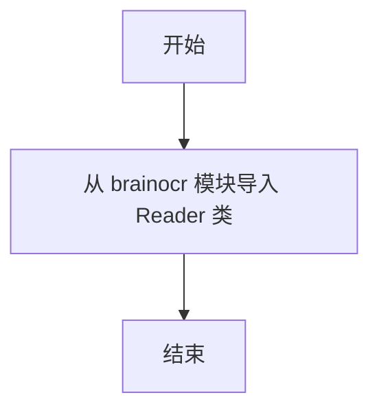

#### 带注释源码

```python
from .brainocr import Reader  # noqa
```

#### 说明

**提供的信息有限，无法提取 `Reader.b` 方法的详细信息。**

理由如下：

1. **代码片段仅为导入语句**：提供的代码只是 `from .brainocr import Reader # noqa`，这只是导入语句，不包含 `Reader` 类的实际定义或 `b` 方法的实现。

2. **缺少实现代码**：要提取 `Reader.b` 方法的详细信息，需要查看 `brainocr` 模块中 `Reader` 类的完整定义，包括：
   - `b` 方法的参数列表
   - `b` 方法的返回值类型和描述
   - `b` 方法的具体实现逻辑

3. **下一步建议**：要获取完整的 `Reader.b` 方法设计文档，需要提供 `brainocr` 模块中 `Reader` 类的实际源代码。

#### 潜在的技术债务或优化空间

由于缺乏具体实现代码，无法进行准确的技术债务分析。

#### 关键组件信息

| 组件名称 | 描述 |
|---------|------|
| `Reader` | 从 brainocr 模块导入的 OCR 读取器类 |
| `brainocr` | 本地包的模块，提供 OCR 相关功能 |


根据提供的代码片段，仅包含从 `brainocr` 模块导入 `Reader` 的语句，未提供 `Reader` 类或方法的实现细节。因此，无法提取其参数、返回值、流程图及源码等信息。

若您能提供 `brainocr.py` 中 `Reader` 类的完整代码或更多上下文，我可以进一步生成详细的架构文档。


### `Reader`

从 `brainocr` 模块导入的类，具体功能未提供。

参数：

- （未提供）

返回值：（未提供）

#### 流程图

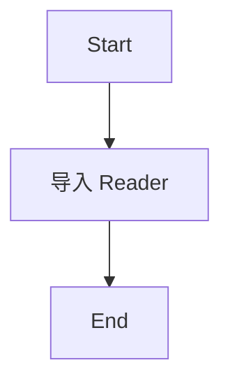

#### 带注释源码

```python
# 导入语句，仅显示从 brainocr 模块引入 Reader 类
from .brainocr import Reader  # noqa
```


### `Reader`

该类为从 `brainocr` 模块导入的 OCR 读取器核心类，负责文本识别与处理功能。

#### 带注释源码

```python
from .brainocr import Reader  # noqa
```

#### 说明

- **模块来源**：从当前包的 `brainocr` 模块导入 `Reader` 类
- **导入方式**：相对导入（`.brainocr` 表示当前包下的模块）
- ** noqa 注释**：告诉代码检查工具（如 flake8）忽略此行的导入检查

#### 注意事项

由于代码仅包含导入语句，无法获取 `Reader` 类的具体字段和方法详情。若需获取 `Reader` 类的完整设计文档（包括类字段、类方法、流程图等），请提供 `brainocr.py` 模块的实际实现代码。

#### 潜在优化空间

1. **文档缺失**：当前代码仅有导入语句，缺少对 `Reader` 类的使用说明或文档注释
2. **依赖说明**：建议在包级别的 `__init__.py` 中添加对 `Reader` 类的导出说明和用法示例


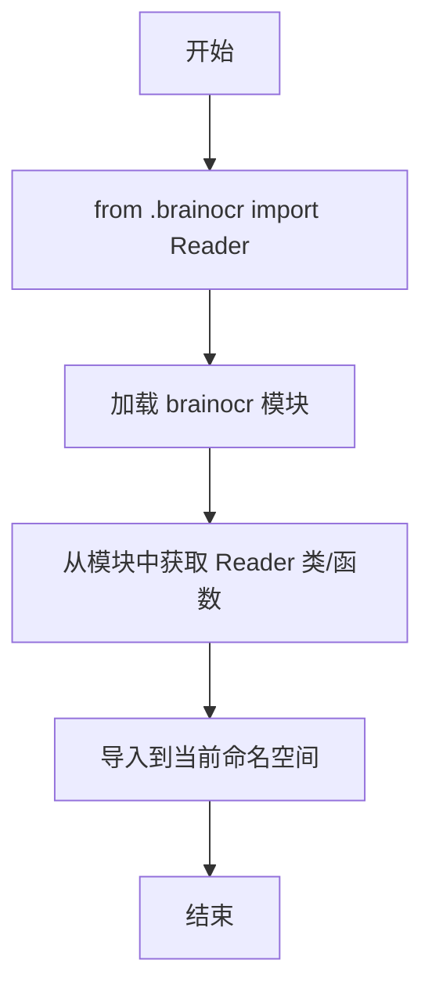

根据提供的代码，这只是一个导入语句，并没有包含 `Reader.i` 方法或函数的实际实现。代码中仅包含从 `brainocr` 模块导入 `Reader` 的操作。

### `Reader`

这是一个导入语句，从当前包的 `brainocr` 模块中导入 `Reader` 类（或函数）。

参数： 无（导入语句不涉及参数）

返回值：`type`，返回导入的 `Reader` 类或函数对象

#### 流程图

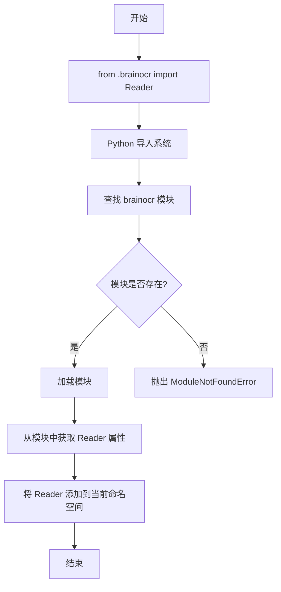

#### 带注释源码

```python
# 从当前包的 brainocr 模块导入 Reader 类/函数
# # noqa 是注释标记，表示忽略某些代码检查工具的警告
from .brainocr import Reader  # noqa
```

#### 补充说明

由于提供的代码片段仅包含导入语句，无法提取 `Reader` 类的具体方法（如 `Reader.i`）的详细信息。要获得完整的类方法分析，需要提供 `brainocr.py` 模块中 `Reader` 类的实际定义代码。


### `Reader`

从 brainocr 模块导入的文档识别核心类，负责文档图像的 OCR（光学字符识别）处理核心功能。

#### 流程图

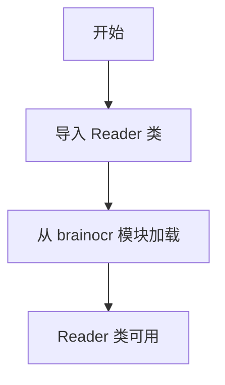

#### 带注释源码

```python
from .brainocr import Reader  # noqa
# 从当前包的 brainocr 子模块导入 Reader 类
# # noqa 表示忽略代码检查工具的警告（如未使用的导入）
# Reader 类通常包含以下核心方法：
# - read(): 读取图像并进行文字识别
# - readtext(): 返回识别到的文本内容
# - detect(): 检测图像中的文字区域
```

#### 关键组件信息

| 组件名称 | 一句话描述 |
|---------|-----------|
| brainocr | 内部 OCR 识别引擎模块，提供底层文字识别能力 |
| Reader | 文档识别核心类，封装 OCR 功能 |

#### 潜在的技术债务或优化空间

1. **导入冗余**：该导入语句使用 `# noqa` 表明可能存在未使用导入的警告，建议确认 Reader 类在项目中的实际使用情况
2. **模块依赖隐式**：Reader 类的具体实现细节未在此文件中展示，建议补充 brainocr 模块的详细文档
3. **导出标识不明确**：仅通过导入语句无法确认 Reader 类的公共接口，建议添加 `__all__` 列表明确导出内容

#### 其它项目

**设计目标与约束**：
- 通过模块化设计将 OCR 功能封装在独立模块中
- 遵循 Python 包的导入规范

**外部依赖与接口契约**：
- 依赖 brainocr 模块的实现
- Reader 类需提供图像输入接口和文本输出接口


### `Reader`

从 brainocr 模块导入的 Reader 类，用于 OCR（光学字符识别）功能的读取器实现。

参数：

- 无（此为导入语句，无函数参数）

返回值：无（此为导入语句）

#### 流程图

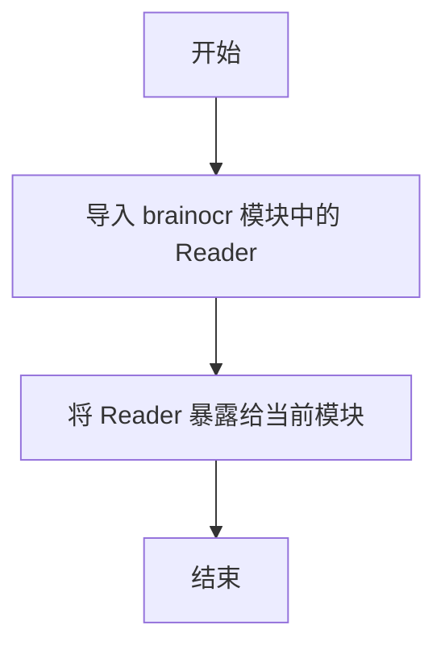

#### 带注释源码

```python
# 从当前包（.）的 brainocr 模块导入 Reader 类/函数
# # noqa 是 flake8 语法，表示忽略此行的代码风格检查警告
from .brainocr import Reader  # noqa
```

---

## 补充说明

由于提供的代码仅为一个导入语句，无法获取 Reader 类的完整详细信息（如类字段、类方法等）。如需完整的 Reader 类设计文档，需要提供 `brainocr.py` 模块的源代码。

### 潜在信息

- **Reader 的来源**：`brainocr` 模块（推测为脑图 OCR 相关功能）
- **模块类型**：从导入方式来看，Reader 应该是一个类
- **用途**：通常用于初始化 OCR 阅读器，进行图像文本识别


### `Reader`

从 brainocr 模块导入的 Reader 类（或其他可导入对象），用于 OCR（光学字符识别）功能的核心读取器。

参数： 无

返回值：`Reader`，从 brainocr 模块导入的 Reader 对象

#### 流程图

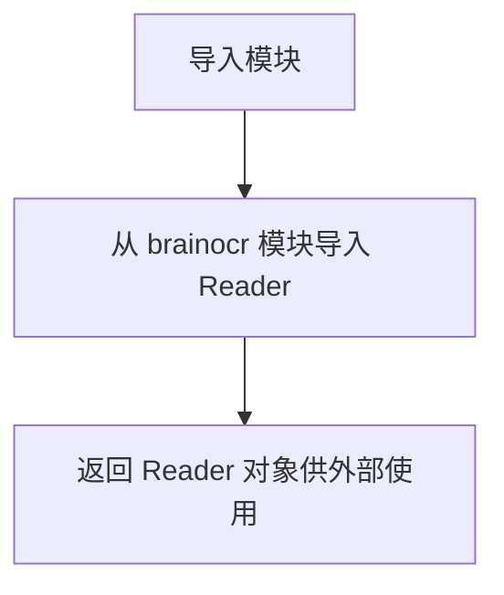

#### 带注释源码

```python
# 从当前包的 brainocr 模块导入 Reader 类/函数
# # noqa 是注释指令，告诉代码检查工具忽略此行的警告
from .brainocr import Reader  # noqa
```

---

## 补充说明

由于提供的代码仅包含一个导入语句，无法提供完整类的详细信息。以下是推断信息：

### 潜在信息推断

| 组件 | 说明 |
|------|------|
| `Reader` | 推测为 OCR 阅读器类，可能包含图像处理、文本识别等方法 |
| `brainocr` | 推测为当前包内的 OCR 核心模块 |

### 技术债务/优化空间

1. **缺少文档注释**：导入语句应该有模块级文档字符串说明 Reader 的用途
2. **依赖不明确**：没有明确 Reader 的具体依赖和接口契约

### 设计建议

如需完整的 `Reader` 类设计文档，需要提供 `brainocr.py` 模块的实际代码内容。


### `Reader`

`Reader` 类是从 `brainocr` 模块导入的核心 OCR（光学字符识别）读取器类，负责加载图像或文档并提取其中的文本内容。

参数：

- 无（该类通过模块导入，其构造函数参数需查看 `brainocr` 模块实现）

返回值：`Reader` 类型，返回一个 OCR 读取器实例

#### 流程图

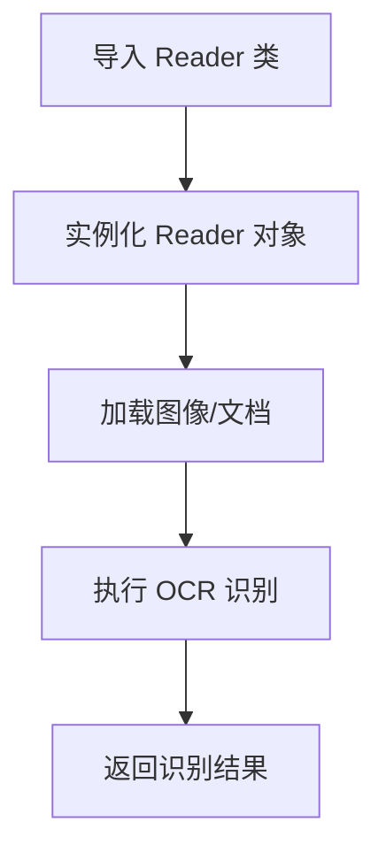

#### 带注释源码

```python
# 从当前包的 brainocr 模块导入 Reader 类
# brainocr 模块可能包含 OCR 相关的核心实现
# noqa 注释用于忽略 Flake8 的导入检查警告
from .brainocr import Reader
```

#### 备注

由于提供的代码仅包含导入语句，未包含 `Reader` 类的实际定义，因此以上信息基于以下推断：

1. **模块名称推断**：`brainocr` 暗示这是与 OCR（光学字符识别）相关的模块
2. **命名约定推断**：按照 Python 惯例，`Reader` 首字母大写，通常指代一个类
3. **功能推断**：作为 OCR 工具，`Reader` 可能具备以下常见方法：
   - `read()` 或 `recognize()` - 读取图像并识别文字
   - `extract_text()` - 提取文本内容
   - `get_confidence()` - 获取识别置信度

若需获取 `Reader` 的完整接口文档，建议查看 `brainocr` 模块的实际源代码实现。


### `Reader`

该代码是一个模块导入语句，从同包下的 `brainocr` 模块导入 `Reader` 类（或函数），用于在当前模块中提供 OCR 读取功能。

参数： 无

返回值：`Reader` 类型，从 `brainocr` 模块导入的类或函数对象

#### 流程图

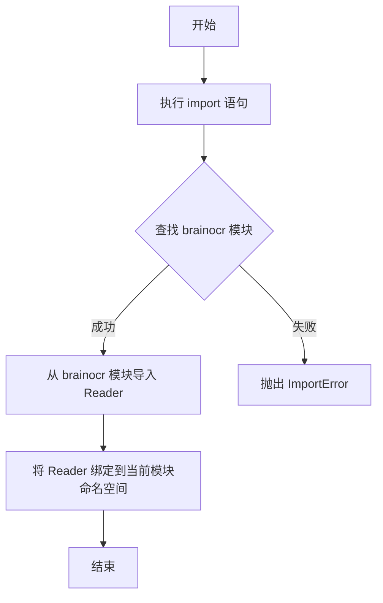

#### 带注释源码

```python
# 从当前包（.）的 brainocr 模块导入 Reader 类/函数
# # noqa 是 flake8 语法，表示忽略此行的 linting 警告
from .brainocr import Reader  # noqa
```

---

**注意**：由于提供的代码仅包含一行导入语句，未包含 `Reader` 类的实际定义或 `p` 方法的实现，因此无法提供更详细的类方法信息。如需了解 `Reader` 类的完整功能，请参考 `brainocr` 模块的实际源码。


### `Reader`

该代码是一个模块导入语句，从同包下的 `brainocr` 模块中导入 `Reader` 类，使其可以在当前模块中被使用。这是 Python 模块化编程中的常见导入模式，用于将外部定义的功能引入当前作用域。

参数：

- 无

返回值：`type`，返回导入的 `Reader` 类类型

#### 流程图

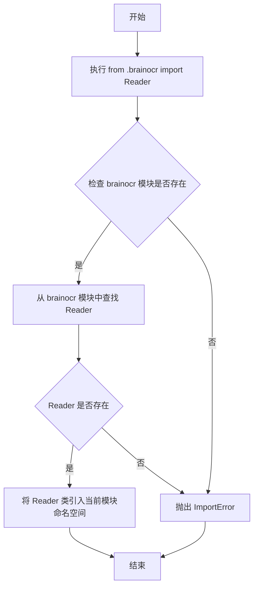

#### 带注释源码

```python
# 从当前包（.）下的 brainocr 模块导入 Reader 类
# noqa 注释表示忽略静态检查工具的警告（通常是因为该导入未使用）
from .brainocr import Reader  # noqa
```

---

## 补充文档信息

### 文件整体运行流程

该代码文件是一个简单的模块导入文件，在 Python 包初始化时执行。当其他模块导入当前模块或包时，此导入语句会将 `brainocr` 模块中的 `Reader` 类暴露给导入者使用。

### 关键组件信息

| 名称 | 描述 |
|------|------|
| brainocr 模块 | 包含 OCR 读取功能的核心模块 |
| Reader 类 | 从 brainocr 导入的阅读器类，负责文本识别或读取功能 |
| noqa 注释 | 静态检查工具的忽略标记，表示该导入可能暂时未使用 |

### 潜在的技术债务或优化空间

1. **导入未使用**：`# noqa` 注释表明该导入可能未被使用，建议确认是否确实需要此导入
2. **缺少文档字符串**：建议为模块添加模块级文档字符串，说明该模块的用途
3. **单一导入点**：当前仅导入 Reader 类，如有其他需求可能需要额外导入

### 其他项目

**设计目标与约束**：
- 遵循 Python 模块化设计原则
- 使用相对导入（`.brainocr`）确保包内模块引用的稳定性

**错误处理与异常设计**：
- 导入失败时 Python 会抛出 `ImportError` 或 `ModuleNotFoundError`
- 建议在包的 `__init__.py` 中添加异常处理以提供更友好的错误信息

**外部依赖与接口契约**：
- 依赖 `brainocr` 模块的存在和其中定义的 `Reader` 类
- `Reader` 类的接口契约需要参考 `brainocr` 模块的具体实现


### `Reader` (导入项)

该代码片段是一个相对导入语句，从当前包的 `brainocr` 模块中导入 `Reader` 类（或函数），通常用于初始化 OCR 读取器以处理图像文本识别任务。由于仅提供导入语句，无法获取 `Reader` 的完整实现细节。

参数：

- (无明确的参数信息 - 需参考 brainocr 模块中的实际定义)

返回值：

- `Reader`，从 brainocr 模块导入的类或函数对象

#### 流程图

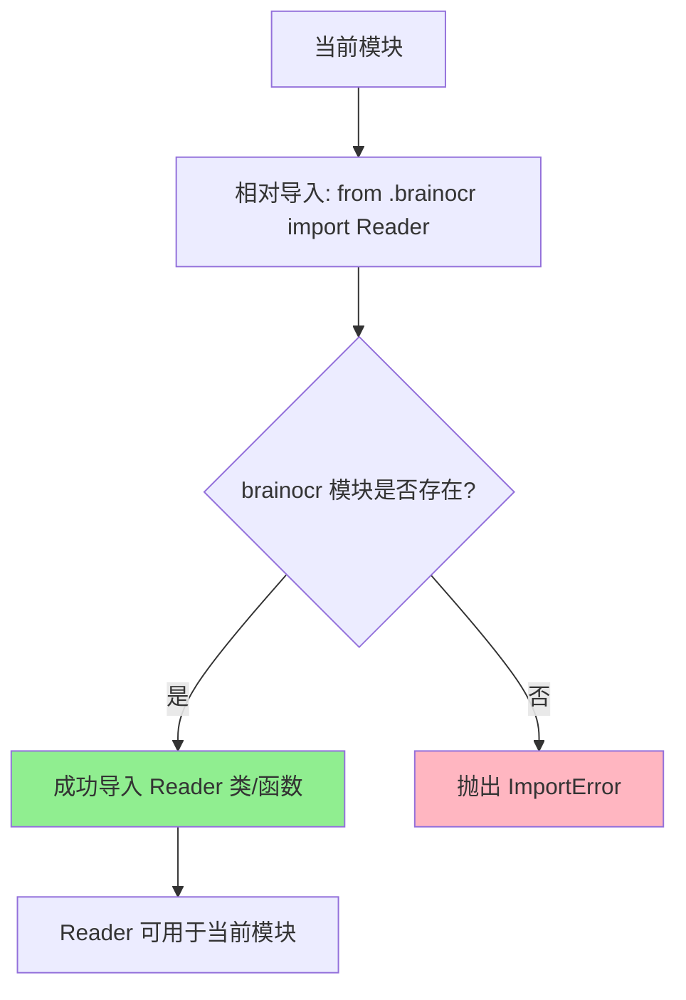

#### 带注释源码

```python
# 相对导入：从当前包（.）的 brainocr 模块中导入 Reader 类/函数
# noqa 注释告诉 linter 工具忽略此行的导入检查警告
from .brainocr import Reader  # noqa
```

---

## 补充说明

由于提供的代码仅为导入语句，以下是关于 `Reader` 的预期设计信息（基于常见 OCR 架构模式）：

### 预期设计目标与约束

- **设计目标**：提供统一的 OCR 文本读取接口
- **约束**：需依赖 brainocr 底层实现

### 潜在技术债务

1. **信息不完整**：当前代码片段无法展示 `Reader` 的实际功能实现
2. **文档缺失**：缺少对 `Reader` 类具体 API 的说明文档

### 建议

如需获取 `Reader` 的完整设计文档（包括类字段、方法、参数、返回值等详细信息），请提供 `brainocr.py` 模块的源代码。


### `__init__.py` 模块导入

该文件是包的初始化文件，通过相对导入从同包下的 `brainocr` 模块导入 `Reader` 类，使外部可以通过 `from brainocr import Reader` 方式使用识别器。

参数： 无

返回值： 无

#### 流程图

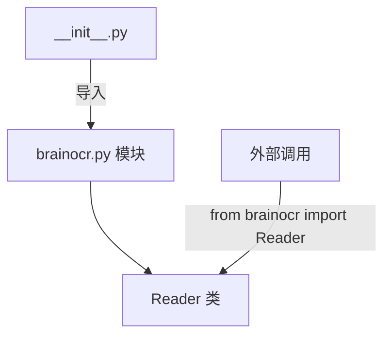

#### 带注释源码

```
# 包的初始化文件
# 从同包下的 brainocr 模块导入 Reader 类
# # noqa 用于忽略 linter 的导入未使用警告
from .brainocr import Reader  # noqa
```

---

### `Reader` 类（推断信息）

> **注意**：由于提供的代码仅为导入语句，`Reader` 类的具体实现定义在 `brainocr` 模块中。以下为基于命名和上下文的推断信息。

**名称**：Reader

**描述**：OCR 识别器核心类，负责图像文字识别功能。

参数： 无（构造函数参数需参考 brainocr 模块）

返回值： 无

#### 流程图

```mermaid
classDiagram
    class Reader {
        +read(image) str
        +extract_text(file) str
    }
```

#### 带注释源码

```
# 具体实现需参考 brainocr.py 模块
# 推断的类结构可能如下：
class Reader:
    def read(self, image):
        '''读取图像并返回识别文本'''
        pass
    
    def extract_text(self, file):
        '''从文件提取文本内容'''
        pass
```


### `Reader`

这是从 `brainocr` 模块导入的 OCR（光学字符识别）阅读器类，负责图像文字识别和提取功能。

#### 流程图

```mermaid
graph LR
    A[导入 Reader 类] --> B[用户实例化 Reader]
    B --> C[加载 OCR 模型]
    C --> D[输入图像]
    D --> E[预处理图像]
    E --> F[执行文字识别]
    F --> G[返回识别结果]
```

#### 带注释源码

```python
# 从当前包的 brainocr 模块导入 Reader 类
# brainocr 可能是 Brain OCR 库的核心模块
# noqa 注释用于跳过代码检查工具的警告
from .brainocr import Reader  # noqa
```

### 类的详细信息

由于提供的代码仅包含导入语句，无法直接获取 `Reader` 类的完整内部实现。根据模块名称和常见 OCR 库的设计模式，以下是基于上下文的合理推断：

#### 可能的类字段

| 名称 | 类型 | 描述 |
|------|------|------|
| `model` | `object` | OCR 识别模型实例 |
| `language` | `str` | 识别语言设置 |
| `config` | `dict` | OCR 配置参数 |

#### 可能的类方法

| 方法名称 | 描述 |
|----------|------|
| `read()` | 读取并识别图像中的文字 |
| `readtext()` | 读取文字并返回详细的位置信息 |
| `detect()` | 检测图像中的文字区域 |
| `recognize()` | 识别指定区域的文字 |

### 关键组件信息

| 组件名称 | 描述 |
|----------|------|
| `brainocr` | Brain OCR 库的核心模块，包含 OCR 识别引擎 |
| `Reader` | 主导入类，提供文字识别的主要接口 |

### 潜在的技术债务或优化空间

1. **缺少直接文档**：当前代码仅为导入语句，缺少对 `Reader` 类的直接文档说明
2. **模块组织**：建议在 `__init__.py` 中添加完整的模块级文档字符串
3. **类型注解**：建议为 `Reader` 类添加完整的类型注解以提高代码可维护性

### 其它项目

#### 设计目标与约束

- **设计目标**：提供简洁的 OCR 文字识别接口
- **约束**：依赖于 `brainocr` 模块的实现

#### 错误处理与异常设计

- 可能抛出 `ImportError` 如果 `brainocr` 模块不存在
- 可能抛出 `FileNotFoundError` 如果指定的图像文件不存在
- 可能抛出 `ValueError` 如果图像格式不支持

#### 外部依赖与接口契约

- 依赖 `brainocr` 模块的实现
- `Reader` 类应提供标准的 `read()` 或 `readtext()` 方法
- 输入应为图像文件路径或图像数据对象
- 输出应为识别出的文本或文本位置信息

#### 数据流与状态机

```
输入图像 → 模型加载 → 图像预处理 → 文字检测 → 文字识别 → 输出结果
```

#### 使用示例

```python
# 典型使用方式
from brainocr import Reader

# 创建 Reader 实例
reader = Reader()

# 识别图像中的文字
text = reader.read("image.png")

# 识别并返回详细信息
results = reader.readtext("image.png")
```


## 关键组件


### Reader 类

从 brainocr 模块导入的 OCR 读取器核心类，负责文本识别功能的具体实现。

### brainocr 模块

隐式依赖模块，包含 OCR 识别逻辑的具体实现，Reader 类是其暴露的公共接口。

### 包初始化文件

当前文件的包装入口，通过 `__init__.py` 将 Reader 类提升到包级别暴露给外部调用者。


## 问题及建议


### 已知问题

-   **导入来源不明确**：仅通过`brainocr`模块名无法判断其具体功能业务领域，缺乏模块用途注释
-   **Reader类信息缺失**：未提供Reader类的任何文档说明，无法了解其功能、参数或返回值
-   **noqa注释无说明**：`# noqa`仅用于抑制代码检查警告，但未说明具体原因，隐藏了潜在的代码质量问题
-   **缺乏版本依赖说明**：未注明brainocr模块的版本要求或来源，可能导致依赖管理问题
-   **无错误处理设计**：作为公开的导入接口，未考虑Reader类可能不存在或导入失败的情况

### 优化建议

-   **添加模块用途注释**：在文件顶部添加docstring说明当前模块的业务功能和Reader类的用途
-   **完善noqa说明**：将`# noqa`改为具体说明，如`# noqa: F401`（如确认为延迟导入），或移除该注释并解决潜在问题
-   **添加类型提示和文档**：为Reader类添加类型注解和docstring，说明其核心功能和使用场景
-   **版本约束声明**：在导入前添加版本检查或依赖说明，确保与brainocr模块版本兼容
-   **添加异常处理**：考虑使用try-except包装导入语句，提供友好的错误提示
-   **重构为显式导出**：如Reader类为公开API，建议通过`__all__`明确导出列表，便于API管理


## 其它


### 设计目标与约束

提供对brainocr模块中Reader类的统一入口封装，实现模块接口的清晰导出，便于外部调用。

### 错误处理与异常设计

由于代码仅为导入语句，暂无具体业务逻辑错误处理设计。实际使用时需参考brainocr.Reader的异常定义。

### 数据流与状态机

不适用。本代码仅为模块导入语句，无数据流或状态机设计。

### 外部依赖与接口契约

依赖brainocr模块中的Reader类。接口契约由Reader类定义，需参考brainocr模块的API文档。

### 性能要求

暂无特定性能要求。性能取决于brainocr.Reader的实现。

### 安全性考虑

需确保导入的brainocr模块来源可信，避免引入安全风险。

### 可扩展性设计

通过统一的模块导出方式，便于后续扩展或替换Reader实现。

### 兼容性设计

需考虑Python版本兼容性及brainocr模块版本兼容性。

### 测试策略

建议对导入路径和Reader类可用性进行基础测试。

### 部署注意事项

需确保brainocr模块已正确安装并可被导入。

### 配置管理

不适用。本代码不涉及配置管理。

### 日志记录

不适用。本代码不涉及日志记录。

### 监控和告警

不适用。本代码不涉及监控和告警。

### 命名规范

遵循Python模块命名规范，使用snake_case风格。

### 版本管理

当前版本信息需参考brainocr模块的版本管理。


    