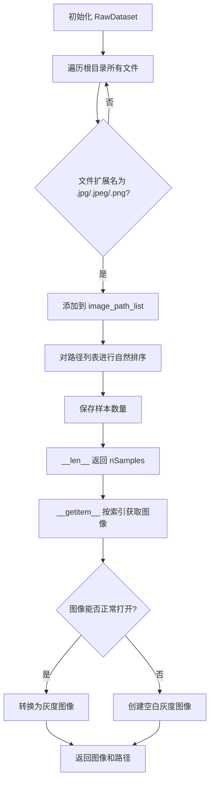
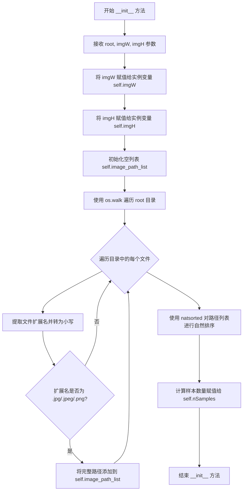
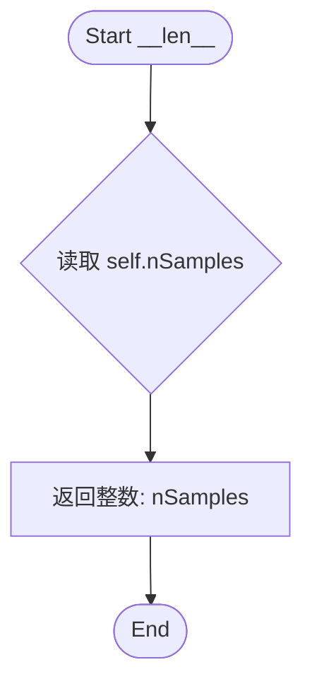
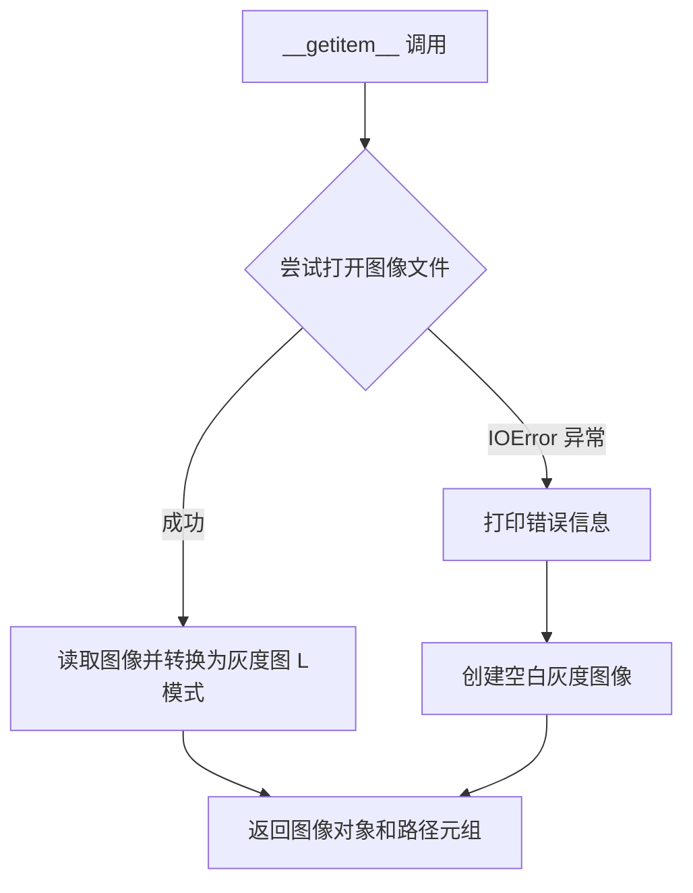

# `comic-translate\modules\ocr\pororo\pororo\models\brainOCR\_dataset.py` 详细设计文档

这是一个基于PyTorch Dataset的图像数据集加载类，用于从指定目录递归读取所有图片文件（jpg/jpeg/png），通过自然排序对文件路径进行排序，并按索引提供图像数据加载功能，同时具备损坏图像的容错处理能力。

## 整体流程



## 类结构

```
Dataset (PyTorch 抽象基类)
└── RawDataset (自定义数据集实现类)
```

## 全局变量及字段


### `os`
    
操作系统路径和文件遍历工具

类型：`module`
    


### `natsort`
    
自然排序库

类型：`module`
    


### `natsorted`
    
自然排序函数，用于对文件路径进行排序

类型：`function`
    


### `Image`
    
PIL 图像类，用于打开和处理图像

类型：`class`
    


### `Dataset`
    
PyTorch 数据集基类

类型：`class`
    


### `RawDataset`
    
自定义数据集类，用于加载原始图像

类型：`class`
    


### `RawDataset.imgW`
    
图像宽度

类型：`int`
    


### `RawDataset.imgH`
    
图像高度

类型：`int`
    


### `RawDataset.image_path_list`
    
图片文件路径列表

类型：`list`
    


### `RawDataset.nSamples`
    
样本总数

类型：`int`
    
    

## 全局函数及方法


### `RawDataset.__init__`

构造方法，初始化图像数据集对象。该方法接收数据根目录路径和目标图像尺寸，遍历目录递归收集所有支持的图像文件（jpg、jpeg、png），并进行自然排序后存储于列表中，同时记录样本总数。

参数：

- `root`：`str`，数据集的根目录路径，用于遍历查找图像文件
- `imgW`：`int`，目标图像的宽度尺寸
- `imgH`：`int`，目标图像的高度尺寸

返回值：`None`，构造方法无返回值（隐式返回 None）

#### 流程图



#### 带注释源码

```python
def __init__(self, root, imgW, imgH):
    # 将传入的图像宽度参数保存为实例变量
    self.imgW = imgW
    # 将传入的图像高度参数保存为实例变量
    self.imgH = imgH
    # 初始化空列表，用于存储所有图像文件的完整路径
    self.image_path_list = []
    
    # 使用 os.walk 递归遍历根目录下的所有文件和子目录
    # os.walk 返回 (dirpath, dirnames, filenames) 三元组
    for dirpath, _, filenames in os.walk(root):
        # 遍历当前目录下的所有文件名
        for name in filenames:
            # 分离文件名和扩展名，返回 (name, ext) 元组
            _, ext = os.path.splitext(name)
            # 将扩展名转换为小写，确保大小写不敏感
            ext = ext.lower()
            # 检查扩展名是否为支持的图像格式
            if ext in (".jpg", ".jpeg", ".png"):
                # 将完整路径（目录+文件名）添加到列表中
                self.image_path_list.append(os.path.join(dirpath, name))

    # 使用 natsorted 对路径列表进行自然排序
    # 自然排序会按数字顺序排序，例如 file2 会在 file10 之前
    self.image_path_list = natsorted(self.image_path_list)
    # 计算并保存图像样本的总数
    self.nSamples = len(self.image_path_list)
```


### RawDataset.__len__

该方法实现了 Python 的魔术方法 `__len__`，用于返回当前 `RawDataset` 实例中已加载的图像文件总数（即 `self.nSamples`），从而使该类支持 `len()` 操作并能够与 PyTorch 的 `DataLoader` 进行交互，以确定数据的批次数量。

参数：

- `self`：`RawDataset`，指向类实例本身的引用，包含了数据集的状态（如图像路径列表 `image_path_list` 和样本数量 `nSamples`）。

返回值：`int`，返回数据集中已扫描并加载的图像文件总数。

#### 流程图



#### 带注释源码

```python
def __len__(self):
    """
    返回数据集的样本数量。

    返回值:
        int: 数据集中图像文件的总数。
    """
    return self.nSamples
```


### `RawDataset.__getitem__`

该方法是 `RawDataset` 数据集类的核心实例方法，用于根据给定的索引从图像集合中获取对应的图像样本及其文件路径。如果图像文件损坏或无法读取，则返回指定尺寸的空白灰度图像。

参数：

-  `index`：`int`，表示要获取的图像样本的索引值，用于从 `image_path_list` 中定位图像文件

返回值：`(PIL.Image.Image, str)`，返回包含图像对象和对应文件路径的元组，其中第一个元素是经灰度转换后的 PIL Image 对象，第二个元素是图像文件的完整路径字符串

#### 流程图



#### 带注释源码

```python
def __getitem__(self, index):
    """
    根据索引获取数据集中的单个样本
    
    参数:
        index: 用于检索图像的整数索引
        
    返回:
        包含图像和路径的元组 (PIL.Image.Image, str)
    """
    try:
        # 使用 PIL 打开指定索引对应的图像文件
        # .convert("L") 将图像转换为灰度图 (Luminance 模式)
        img = Image.open(self.image_path_list[index]).convert("L")
    
    except IOError:
        # 捕获图像文件读取异常（损坏或不存在）
        # 打印诊断信息便于调试
        print(f"Corrupted image for {index}")
        
        # 创建指定尺寸的空白灰度图像作为替代
        # 保持数据加载器能够继续工作而不中断
        img = Image.new("L", (self.imgW, self.imgH))
    
    # 返回图像对象及其文件路径的元组
    # 路径信息可用于后续的数据标注或可视化
    return img, self.image_path_list[index]
```

## 关键组件


### 惰性加载机制

通过 `__getitem__` 方法实现按需加载图像，而非在初始化时一次性加载所有数据，有效节省内存开销

### 图像文件遍历与过滤

使用 `os.walk` 递归遍历目录，配合扩展名过滤（.jpg, .jpeg, .png），构建图像路径列表

### 自然排序支持

集成 `natsort` 库的 `natsorted` 方法，对文件名进行自然排序（支持 1, 2, 10 这种数字顺序而非字典序）

### 灰度图像转换

使用 PIL 的 `convert("L")` 将彩色图像转换为 8 位灰度图，统一数据格式

### 损坏图像容错处理

捕获 `IOError` 异常，当图像文件损坏时创建空白图像替代，确保数据集迭代不中断

### 数据集长度与索引

实现 `__len__` 和 `__getitem__` 方法，符合 PyTorch Dataset 规范，支持索引访问和迭代


## 问题及建议


### 已知问题

-   **异常处理不完善**：仅捕获`IOError`，其他异常（如`FileNotFoundError`、`PermissionError`）未被处理，可能导致程序崩溃
-   **错误静默处理**：发生异常时返回空白图像而非抛出异常或记录严重错误，可能导致训练过程中难以发现数据问题
-   **缺少目录验证**：未检查`root`目录是否存在，目录不存在时`os.walk`会返回空列表但无明确提示
-   **参数缺少校验**：未验证`imgW`和`imgH`为正整数，可能导致创建无效图像
-   **初始化开销大**：在`__init__`中遍历并加载所有文件路径，大规模数据集时会占用大量内存且初始化慢
-   **硬编码扩展名**：图片扩展名检查硬编码在条件中，扩展性差
-   **缺少日志系统**：使用`print`输出错误信息，无法根据日志级别控制，不适合生产环境
-   **无类型注解**：缺少参数和返回值的类型提示，影响代码可读性和IDE支持
-   **缺少数据增强支持**：未提供`transform`参数，无法在数据集层面进行数据增强
-   **路径泄露风险**：返回完整文件路径，可能暴露系统目录结构

### 优化建议

-   增加`transform`参数支持，允许在`__getitem__`中对图像进行预处理和增强
-   使用`logging`模块替代`print`，并根据配置设置日志级别
-   在`__init__`中验证目录存在性和参数合法性，及时抛出有意义的异常
-   考虑将文件列表扫描改为惰性加载或使用生成器，减少初始化内存占用
-   增加扩展名、排除目录等配置选项，提高代码灵活性
-   添加类型注解，提高代码可维护性
-   为损坏图像添加标记机制（如返回特殊标签），而不是静默替换为空白图像
-   考虑添加缓存机制或使用`IterableDataset`应对超大规模数据集场景


## 其它


### 设计目标与约束

本代码旨在为PyTorch数据加载管道提供一个可迭代的图像数据集类，支持从指定目录递归读取常见图像格式（jpg、jpeg、png），并进行自然排序后返回灰度图像。设计约束包括：仅支持静态图像加载，不支持实时数据增强；假设输入路径存在且可读；图像必须能被PIL打开。

### 错误处理与异常设计

在`__getitem__`方法中实现了异常处理机制。当图像文件损坏或无法打开时，捕获`IOError`异常，打印错误信息并返回指定尺寸的空白灰度图像作为替代。这种设计确保训练过程不会因单个损坏图像而中断，但可能导致训练数据中存在"假样本"。目前未处理其他可能的异常，如文件路径不存在、权限不足等情况。

### 数据流与状态机

数据集生命周期包含三个状态：初始化状态（构建文件列表）、就绪状态（文件列表已排序完成）、迭代状态（按索引返回图像）。数据流为：用户调用`__init__` → 遍历目录收集图像路径 → 自然排序 → 调用`__len__`获取样本数量 → 调用`__getitem__`按索引加载图像 → 返回图像张量。

### 外部依赖与接口契约

本类依赖三个外部库：os（标准库，用于文件系统操作）、natsort（第三方库，提供自然排序功能）、PIL/Pillow（第三方库，用于图像读取和格式转换）、torch.utils.data.Dataset（PyTorch数据加载基类）。接口契约规定：`root`参数必须是有效的目录路径；`imgW`和`imgH`参数必须为正整数；返回值为PIL Image对象和文件路径字符串的元组。

### 性能考虑与优化空间

当前实现存在以下性能问题：每次调用`__getitem__`都会重新打开和解析图像文件，未实现缓存机制；目录遍历在初始化时完成，静态数据集场景下效率可接受但不支持动态更新；图像以PIL对象返回，后续训练时仍需转换为PyTorch张量。建议优化方向包括：添加图像缓存、预加载机制、支持多进程加载时的线程安全等。

### 线程安全性

当前实现中，`image_path_list`在初始化后只读，无线程安全问题。但若后续扩展支持动态添加样本，需考虑线程安全。图像加载操作PIL本身非线程安全，在多进程数据加载场景下（DataLoader的num_workers>0），每个进程独立创建数据集实例，不存在共享状态冲突。

### 内存管理

数据集本身不持有图像数据，仅存储路径列表，内存占用与图像数量线性相关。实际图像数据由DataLoader的worker进程按需加载和释放。对于大规模数据集，建议配合`prefetch_factor`和`persistent_workers`参数优化数据加载效率。

### 扩展性考虑

当前类功能单一，扩展方向包括：支持更多图像格式（bmp、tiff等）；支持数据增强（resize、crop、normalize）；支持标签加载；支持数据子集选择；支持分布式训练场景下的数据分片。可通过继承或组合方式扩展。


    